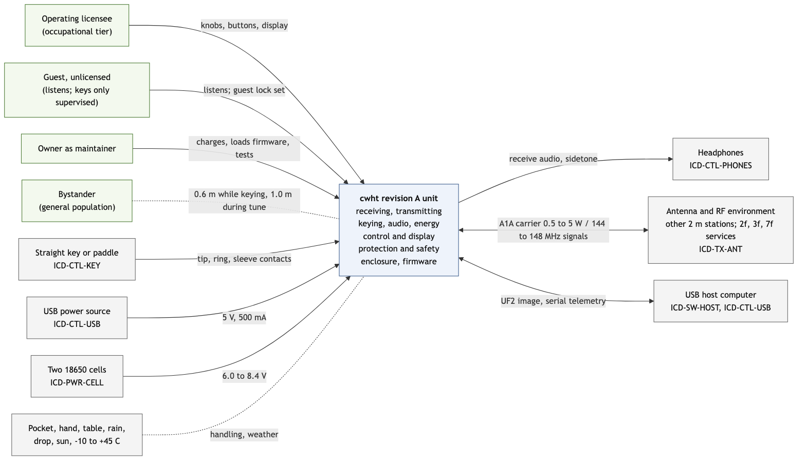
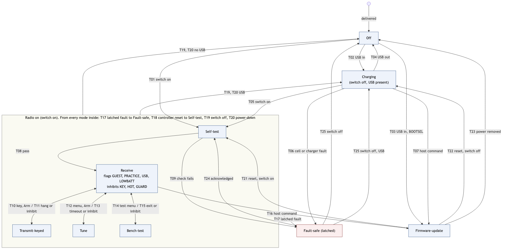

# cwht Concept of Operations

**Status:** Draft for SRR (functional baseline candidate), revision 2 of 2026-09-25 after the independent ConOps review. **Owner:** Robin (customer, licensee, Decision Authority). **Author:** Claude (lead systems engineer). **Governing text:** SE HB §4.1.1.2.4 (establish concept of operations and support strategies), SE HB App. S (annotated outline; section map below), NPR 7123.1D SE-36 (concept definition, an SRR minimum product per `docs/process/01-lifecycle-and-reviews.md` section 4.5), charter `docs/process/00-charter.md` sections 5, 7 and 9, and `docs/process/02-requirements-and-traceability.md` section 3.3 (scenario headings `### OPS-NNN <title>`, each with actors, preconditions, steps, expected outcome and the MOEs it exercises).

**App. S section map.** This document keeps App. S sections 2.0 to 8.0 and Appendices A and B under the same numbers. App. S 1.1 Project Description is split here into 1.1 Background (App. S 1.1.1) and 1.2 Assumptions and constraints (App. S 1.1.2); App. S 1.2 Overview of the Envisioned System is 1.3 here (1.3.1 Overview with the pictorial of Figure 1.3-1 = App. S 1.2.1; 1.3.2 System scope = App. S 1.2.2). Sections 3.6 (operating postures) and 3.7 (operator model) are additions under App. S 3.0 ("additional subsections should be added as necessary"); Appendices C (baseline numbers and decisions) and D (alignment items for companion products) are additions.

**Companion file:** `docs/requirements/l0-stakeholder/expectations.json` (NGO-001 to NGO-030, MOE-001 to MOE-013, CON-001 to CON-028) and its rendering `expectations.md`. Stakeholder inputs are `SI-NNN` in `docs/requirements/l0-stakeholder/stakeholder-inputs.md`. Research reports are cited as `docs/research/<file>.md F<n>`; regulation is cited from the verbatim corpus `docs/references/md/regulatory/` (eCFR issue 2026-09-23). Figures are rendered from Mermaid sources in `docs/conops/figures/` and were inspected as images before this revision was issued (charter section 11 rule 3).

**Conventions.** Scenarios are `OPS-001` to `OPS-012` (nominal) and `OPS-013` to `OPS-022` (off-nominal). Numbers marked *proposed* are research baselines the owner has not yet ratified; each is listed with its owner decision in Appendix C and is carried into the L1 requirements as a `tbr` with `close_by: PDR` where the value may still move. Owner decisions already taken are cited to their `SI-NNN`. No to-be-determined placeholder appears in this document; open values are TBRs with an owner, a plan and a closing review (Appendix C). Mode names are capitalized (Receive, Tune); flags are in capitals (GUEST, PRACTICE, USB, LOWBATT); inhibits are in capitals (KEY, HOT, GUARD); section 3.4 defines all three.

---

## 1. Project description

### 1.1 Background

Robin, a US General-class amateur licensee (SI-014), wants to "play radio" with a small circle of licensed friends (SI-019, SI-030) by Morse code on the 2 m band, from pockets, parks and hilltops, using true continuous-wave keying rather than the tone-modulated FM that every commercial 2 m handheld offers (SI-004). A narrow-band A1A signal is received in a 500 Hz passband and needs about 13 dB less signal than 12 dB SINAD FM, which is roughly twice the range over ground or four times in free space (`docs/research/antenna-and-erp.md` F11). No pocket-sized 2 m CW transceiver with a built-in keyer for both a straight key and iambic paddles exists as a product (SI-018), so the owner designs and builds one: revision A of the cwht ("CW handheld transceiver").

The project is also a process exercise. The owner elects the rigor of NASA Class A software and a Criticality-1 system for a hobby radio (SI-015, charter section 1), with the stated expectation that the first assembled board works at first power-on because every risk was closed by analysis, host tests and inspection before the boards were ordered (SI-010, as relaxed for emulation by SI-026). The owner writes no code and lays out no board (SI-011); Claude produces every product and the owner reviews and decides.

### 1.2 Assumptions and constraints

Constraints not open to trade are `CON-001` to `CON-028` in `expectations.json`. The ones that shape this concept most:

| Constraint | Effect on the concept |
|---|---|
| CON-001, CON-006 | Every transmitting unit has a licensed control operator holding it; each unit is normally the station of the licensee holding it (operator model OPS-A, section 3.7). An unlicensed guest may listen freely and may key only under continuous supervision. |
| CON-002, CON-003 | Spurious emissions at least 53 dB below a 5 W carrier and below 25 microwatts; keyed emission confined to the band with no keyclicks; A1A only, so the sidetone is audio-only. |
| CON-004 | An RF exposure evaluation is mandatory (no exemption for a 5 W handheld below 239 MHz within 20 cm of a person); operators are in the occupational tier, bystanders in the general-population tier (SI-030). |
| CON-009, CON-010, CON-011 | Raspberry Pi Pico 2 module with its micro-USB as the single connector for firmware and charging; two 18650 cells in holders. |
| CON-012, CON-013, CON-023 | 3.5 mm TRS key jack for both key types; headphones only; encoder tuning, volume knob, small LCD, two buttons. |
| CON-014, CON-015, CON-024 | PCBWay turnkey surface-mount assembly with the owner hand-soldering through-hole parts; PCBWay CNC aluminum enclosure from OpenSCAD via FreeCAD STEP; five boards, three to five assembled, at most five units. |
| CON-021 | Semi break-in only; no full QSK (SI-036). |
| CON-025 | Software evidence is host-first through the rustos api traits; emulation is optional and never for timing (SI-026). |
| CON-028 | The synthesizer is chosen by a cost and performance trade at PDR; the best performer wins when costs are similar (SI-029). |

Assumptions:

1. All operators hold at least a Technician-class license and therefore have full 2 m privileges (47 CFR 97.301(a)); friends operate as their own stations under their own call signs (section 3.7).
2. Radios are used in pairs or small groups on simplex; no repeater, satellite or digital-mode use is intended.
3. The reference antennas are a quarter-wave flexible whip with a 48 cm counterpoise (pocket reference) and an end-fed half-wave telescopic whip (range reference), both on an SMA jack (`docs/research/antenna-and-erp.md` ANT-05); the operator may fit other SMA-plug antennas within a stated gain envelope (0 dBd or less).
4. The handbook is the only training; the owner does not coach friends beyond handing over the radio and the handbook (SEMP section 7.3.1).
5. The build stays at or below five units and is never marketed (CON-008); the open-source repository publishes a design, not a kit.
6. Research baselines (power steps, keyer defaults, audio ceiling, receiver selectivity set, charger topology, display and control parts) are proposals until the owner ratifies them at SRR or the PDR trades select them; Appendix C lists each with its decision.

### 1.3 Overview of the envisioned system

#### 1.3.1 Overview

The cwht is a pocket-sized aluminum-cased transceiver, roughly the size of two 18650 cells plus a controller module, with a whip antenna on one end, a small reflective display and two knobs and two buttons on its face, and three openings on its edges: a key jack, a headphone jack and the controller module's micro-USB. The operator plugs in headphones and a straight key or paddle, switches on, watches a short self-test, tunes across 144.000 to 148.000 MHz with the knob while listening to the CW segment through a 500 Hz passband, and calls a friend. Keying the paddle produces correctly timed Morse with a sidetone in the headphones; the radio switches to transmit on the first element and back to receive after an adjustable hang time (semi break-in). Power is selectable in four steps from 0.5 to 5 W; a fresh unit starts at 1 W. Two 18650 cells give about a day of casual operating and charge overnight from any USB port. Safety functions keep a stuck key, a mono plug, a hot amplifier, a faulty cell or a guest's accidental keying from producing an unlawful or unsafe transmission.

Figure 1.3-1 shows the unit in its context: the people who use it or stand near it, the equipment it connects to, and the environment it lives in. Each equipment interface carries the ICD stub of section 3.3.

*Figure 1.3-1. System context (source `docs/conops/figures/conops-context.mmd`). Solid lines are functional interfaces; dotted lines are the separation rule for bystanders and the environmental loads on the enclosure.*

#### 1.3.2 System scope

**In scope (the end product):** one revision A unit type consisting of an assembled printed circuit board (receiver, transmitter and power amplifier, power and charging, controller, audio and key interface), a CNC-machined aluminum enclosure with printed facade and knobs, and firmware; built in a run of at most five units; the operations handbook; the RF exposure evaluation and operator rules card.

**Enabling products:** LTspice simulation decks with automated checkers, host unit tests on the rustos api traits, the accredited emulator scenarios (ACC-EMU-001, event ordering only), test procedures and fixtures (diode RF probe, printed jigs), tooling scripts, review packages, the rustos peripheral drivers developed upstream (clocks, timer and alarms, IRQ, I2C, SPI, ADC, PWM, watchdog, non-volatile storage, PIO I2S).

**External interfaces (section 3.3):** the human operator; headphones; a straight key or iambic paddle; the antenna and the RF environment including other amateur stations and the services at the harmonic frequencies; a USB host computer for firmware loading; a USB power source for charging; the 18650 cells; the atmosphere and the operator's pocket.

**Out of scope for revision A:** the 70 cm band (a path is kept, NGO-030), a speaker, a display backlight, full QSK, a WinKeyer-compatible USB interface, message memories, beacons and automatic identification, an external-antenna accessory. These are listed as deferred capabilities in section 3.5.4.

---

## 2. Documents

### 2.1 Applicable documents

| Document | Applicability |
|---|---|
| `docs/process/00-charter.md` | Roles, gates, document tree, ID schemes, traceability, V&V philosophy, working rules |
| `docs/requirements/l0-stakeholder/stakeholder-inputs.md` | SI-001 to SI-036, the binding owner statements |
| `docs/requirements/l0-stakeholder/expectations.json` | NGOs, MOEs, constraints this concept elaborates |
| `docs/process/02-requirements-and-traceability.md` | Section 3.3 scenario rules; source citation forms |
| `docs/process/04-verification-and-validation.md` | Section 6 bench limits; section 7.2 validation matrix; section 11.2 staged first power-on |
| `docs/plan/semp.md` section 7.3.1 | Human Systems Integration approach |
| 47 CFR Part 97 (corpus `docs/references/md/regulatory/`, eCFR 2026-09-23) | 97.3, 97.5, 97.7, 97.13, 97.101, 97.103, 97.105, 97.109, 97.115, 97.119, 97.203, 97.301, 97.303, 97.305, 97.307, 97.313 |
| 47 CFR 1.1307, 1.1310, 2.1091, 2.1093 (corpus) | RF exposure framework and limits |
| OET Bulletin 65 Supplement B extracts (corpus `oet65-supplement-b-extracts.md`) | Duty factors, the controlled-environment statement for amateur licensees, the time-averaging recipe |

### 2.2 Reference documents

| Document | Used for |
|---|---|
| NASA/SP-2016-6105 Rev 2, SE HB §4.1 and App. S | Process and outline of this document |
| `docs/research/rf-exposure-evaluation.md` | Tiers, time-averaged power, MPE distances, SAR analogy, power-step and tune defaults, postures (RFX-D5), guest keying (RFX-D8) |
| `docs/research/part97-regulatory-basis.md`, `docs/research/regulatory-corpus-and-operators.md` | Emission rules, control-operator and third-party rules, necessary bandwidth, band-edge guard, harmonic allocations |
| `docs/research/antenna-and-erp.md` | Antennas, connector load path, postures, link budgets, range MOEs |
| `docs/research/keyer-and-key-interfaces.md`, `docs/research/keyer-verification-and-key-input-network.md` | Keyer semantics, timing, debounce, sidetone, break-in, stuck-key controls |
| `docs/research/power-tree-and-charging.md` | USB budget, charger, protection, holders, rails, battery life |
| `docs/research/display-and-ui-parts.md` | Display, encoders, buttons, jacks, USB wall opening, in-band clock harmonics |
| `docs/research/audio-output-and-hearing-safety.md` | Audio chain, hearing-safety norms, output ceiling, mute behaviour |
| `docs/research/cw-selectivity-options.md`, `docs/research/2m-cw-transceiver-reference-designs.md` | Receiver selectivity set and reference performance |
| `docs/research/tr-switch-candidates.md`, `docs/research/pa-device-candidates.md` | T/R sequencing and lead-in, harmonic filter goals, PA supply behaviour |
| `docs/research/pcbway-fabrication-and-assembly.md`, `docs/research/enclosure-cnc-and-openscad-pipeline.md` | Realization and support environment |
| `docs/research/emulator-accreditation-and-timer-irq.md` | ACC-EMU-001 scope |
| `docs/design/concept.md` | The design means behind the observable behaviour stated here (sections 4, 7 and 8) |
| `docs/safety/hazards.json`, `docs/safety/hazard-analysis.md` | HZ-001 to HZ-014 and their phases (mapped to the modes in section 3.4) |
| `docs/plan/tpm.json` | MOP-001 to MOP-020 and TPM-001 to TPM-020 (TPM-006 temperature span, TPM-008 duty cycle) |
| `docs/risk/register.json` | RSK-001 to RSK-033 |

---

## 3. Description of the envisioned system

### 3.1 Needs, goals and objectives

The agreed expectations live in `expectations.json`; this section only orients the reader. The single Need (NGO-001) is a pocket true-CW 2 m handheld for Morse contacts among licensed friends that is lawful, safe and works at first power-on. Seven Goals elaborate it: contact range (NGO-002), natural CW operation with either key type (NGO-003), lawful and safe operation (NGO-004), first-power-on success (NGO-005), portability and endurance (NGO-006), buildability and openness (NGO-007) and a 70 cm path (NGO-008). Twenty-two Objectives (NGO-009 to NGO-030) give the measurable targets, and thirteen MOEs (MOE-001 to MOE-013) state how the owner will judge success in the scenarios of section 6. NGO-029 (open-source record) and NGO-030 (70 cm partition) are judged by Inspection at SAR and PDR through their L1 requirements rather than by an MOE.

### 3.2 Overview of the system and its key elements

Implementation-free description of what the system does, by function. Design solutions belong to the architecture at PDR (`docs/design/concept.md` holds the current proposals); where an owner decision already fixes an element (module, cells, connectors) it is named as a constraint.

| Element | What it does | Users involved |
|---|---|---|
| Receiving function | Converts a 144.000 to 148.000 MHz A1A signal at the antenna to an audio tone at the operator's chosen pitch through a passband about 500 Hz wide; rejects strong signals a few kilohertz away; holds its gain so weak and strong signals are comfortable; is silent between transmissions except for band noise. | Operator, guest (listening) |
| Transmitting function | Produces an on-off keyed unmodulated carrier at the displayed frequency at one of four power steps, with a shaped envelope, into a 50 ohm antenna; keeps every spurious emission within Part 97 with margin; refuses to transmit outside 144.001 to 147.999 MHz. | Operator |
| Keying function | Reads a straight key or an iambic paddle through one jack, generates Morse elements at the set speed in the set mode, drives the transmit envelope and the sidetone, sequences the antenna between receive and transmit with a hang time, and enforces the stuck-key limits. | Operator |
| Audio function | Delivers receive audio and sidetone to headphones at a level the operator sets, under a hardware ceiling that cannot injure hearing; mutes and unmutes without clicks; is silent with no headphones plugged in. | Operator, guest |
| Energy function | Stores energy in two user-replaceable 18650 cells; protects them; charges them from USB; supplies the other functions; reports state of charge; inhibits transmit while USB power is present or when the cells are low. | Operator, owner as maintainer |
| Control and display function | Presents frequency, power step, key mode and speed, battery state and transmit state on a daylight-readable display; accepts tuning and volume from two knobs and menu choices from two buttons; stores settings across power cycles; provides the guest lock, the practice setting, the tune function and the bench tests. | Operator |
| Protection and safety function | Self-test at switch-on and after every reset; key-closed interlock; straight-key and paddle watchdogs; a key-down cutoff independent of firmware; over-temperature inhibit; cell and charger fault handling; transmit inhibits that clear by themselves and a latched fault-safe state, each with a displayed cause. | Operator (informed), owner (diagnoses) |
| Enclosure | Holds everything in a pocket-sized aluminum shell, carries the antenna load, presents the controls and openings, sinks the amplifier heat, and is the RF ground. | Everyone who holds it |
| Firmware and its host twin | Implements the keyer, sequencer, audio chain, power management, user interface and safety functions on the controller module; the same application runs on a host against injected device models for verification (CON-025). | Owner, Claude |

**Users and operators.** *Operating licensee:* the person holding a transmitting unit; station licensee and control operator of that unit (section 3.7). *Guest:* an unlicensed person who listens, or keys only under supervision, or holds a unit with GUEST set. *Owner as maintainer:* charges, replaces cells, loads firmware, runs acceptance tests, keeps the RF exposure record. *Bystander:* anyone within a few metres of a transmitting unit who is neither its operator nor a trained member of the operator's household; kept at 0.6 m or more from the antenna while keying and 1.0 m during a tune carrier.

### 3.3 Interfaces

| Interface | Description | Concept-level expectation | ICD stub (before SRR) |
|---|---|---|---|
| Human controls and display | Tuning knob (encoder with detents, push), volume knob (encoder, push), two buttons, reflective 128 x 128 class display with no backlight in revision A | One-handed operation of tuning and volume while holding the radio; frequency, power step, key mode and speed, battery state and transmit state always visible on the status screen (NGO-015, REQ-SYS-060), where the transmit state names the reason whenever transmit is not armed (GUEST, PRACTICE, USB, LOWBATT, KEY, HOT, GUARD or the Fault-safe cause); the stored call sign shown at every Self-test and on the station page of the menu; readable at arm's length in daylight; printed knobs; a reserved position for a future band control (SI-006) | none (HSI section of the SEMP) |
| Key and paddle jack | 3.5 mm TRS: tip = dit or straight key, ring = dah, sleeve = common (CON-012); switched jack contacts report plug presence | Accepts any straight key (TS or TRS plug) and any paddle (TRS) with passive contacts or an open-collector keyer output; survives a mono plug, ESD and cross-plugged headphones; a closed contact at switch-on or after a reset blocks transmit (KEY inhibit, section 3.4) | ICD-CTL-KEY |
| Headphone jack | 3.5 mm TRS, both channels driven with the same mono audio (CON-013); switched contact reports plug presence | 16 to 64 ohm headphones and earbuds; TS and TRS plugs; output ceiling 100 mVrms sine into 32 ohm, at most 150 mVrms for any signal (*proposed*); amplifier off with no plug | ICD-CTL-PHONES |
| Micro-USB | The Pico 2 module's own receptacle through a 12.0 x 10.0 mm chamfered wall opening (CON-010) | Firmware loading through the RP2350 bootloader (mass-storage UF2 or picotool); charge power at 500 mA default, never above 1.5 A; the controller runs from USB power whenever it is present, with the power switch on or off (section 3.4, Charging); no transmit while USB power is present; firmware loading works with cells removed | ICD-CTL-USB |
| Antenna | 50 ohm SMA jack (female body, stainless), retained to the enclosure boss so the board carries no antenna moment (*proposed*, `docs/research/antenna-and-erp.md` ANT-01, ANT-02); a bonded counterpoise attachment within 20 mm | Accepts SMA-plug antennas in the Icom, Yaesu, Kenwood convention; withstands a 4 N.m bending moment and 500 matings (the stainless rating; REQ-SYS-106 and HZ-009 K2 correct the research figure of 1000); the transmitter tolerates any load up to 10:1 SWR, open and short (REQ-SYS-013) | ICD-TX-ANT |
| Cells | Two 18650 Li-ion cells in holders (CON-011) | User-replaceable without tools; on-board protection and balancing; reverse insertion tolerated without damage; mixed or mismatched cells refused with a warning | ICD-PWR-CELL |
| Enclosure to the environment | Pocket, hand, table, rain, drop, sun | Section 4 | none (ME requirements) |
| RF environment | Other amateur stations on 2 m; services at 2f (military fixed and mobile), 3f (70 cm amateurs and Federal radiolocation), 7f (aeronautical radionavigation, 1030 MHz interrogation) | Emissions within CON-002 and CON-003; 60 dBc design target because of the harmonic victims (section 7.1) | none |
| USB host computer | The owner's macOS or Linux machine | Loads a tagged firmware release; reads the serial banner and telemetry; runs the host twin of the firmware | ICD-SW-HOST |

### 3.4 Modes of operation

The unit has **nine modes** (Table 3.4-1), exactly one of which is active at a time, and **four flags** (Table 3.4-3) that hold across modes. Flags and the **inhibits** of Table 3.4-4 are conditions, not modes: together with a passed Self-test they decide the **Arm** condition, which is the only gate to a carrier. Figure 3.4-1 is the state machine; Table 3.4-2 lists every transition; Table 3.4-4 assigns every transmit-stopping cause to one class and says what continues; the forbidden transitions follow Table 3.4-4; Table 3.4-5 maps the modes to the hazard phases of `docs/safety/hazards.json`. App. S 3.4 also asks for development, test and training modes: Bench-test is the test mode of the delivered unit, PRACTICE is its training setting (sending practice with the transmitter disarmed), and development runs on the host twin (section 3.5.2 item 4) and through Firmware-update.

**Arm condition.** Transmit is armed only while all of the following hold: (1) the unit is in Receive (a key closure then enters Transmit-keyed) or in Transmit-keyed during an over; (2) Self-test has passed since the last switch-on or controller reset; (3) no flag is set (GUEST, PRACTICE, USB, LOWBATT); (4) no inhibit is active (KEY, HOT, GUARD). Fault-safe never arms.

*Figure 3.4-1. Operating modes and transitions (source `docs/conops/figures/conops-modes.mmd`). T17 to T20 start on the "Radio on" box and apply to every mode inside it.*

**Table 3.4-1. Modes.**

| Mode | Entered by | Behaviour | Leaves by |
|---|---|---|---|
| **Off** | Delivered state; T04, T19 and T20 without USB, T23, T25 without USB | No radio function is powered and the controller is not running; the pack supplies only its own protection and the charger input (at most 50 uA, REQ-SYS-100); settings are retained; nothing can key the transmitter | T01 switch on; T02 USB applied; T03 USB applied with BOOTSEL held |
| **Charging** | T02, T19 and T20 with USB present, T22, T25 with USB present | Switch off (or after a power-down) with USB present. The controller and the display run from USB power while the receiver, transmitter and audio stay unpowered; before charging it checks both cell voltages by two independent paths, the cell temperature and its firmware image; it then charges on the temperature-windowed profile at the 500 mA USB budget (about 10 h to full) and shows the charge state on the display (REQ-SYS-070); the transmitter cannot be enabled (no transmit supply, and the USB inhibit, REQ-SYS-092); with no cells fitted it shows "NO CELLS" and still accepts a firmware load | T04 USB removed; T05 switch on; T06 cell, charger or sensor fault; T07 host command |
| **Self-test** | T01 and T05 (every switch-on, with or without USB); T18 (every controller reset); T21; T24 | The radio functions power up; checks rails, both cell voltages by two independent paths, cell temperature, amplifier enable off, display, stored configuration (an invalid setting is replaced by its default and shown, REQ-SYS-134; this is not a failure) and the firmware image; restores the stored flags (GUEST, PRACTICE), senses USB and the pack voltage (LOWBATT), and starts the key-closed interlock (KEY); shows the firmware version and the stored call sign; lasts a few seconds; transmit is never armed during Self-test | T08 all checks pass; T09 any check fails, or a latched-fault record from before a reset is present; T20 power-down condition (pack absent or below 6.0 V, cell above 60 C) |
| **Receive** | T08, T11, T13, T15 | Normal listening: tuning, volume, menus, key-mode and speed changes, flag changes; the status screen shows the NGO-015 set; transmit is armed only when the Arm condition holds, and the transmit-state field names the reason when it does not; with USB present, charging is paused while the radio receives (REQ-SYS-093) | T10 key or paddle closure with Arm; T12 Tune menu action with Arm; T14 confirmed test-menu action with GUEST clear; T16 host command; T17 to T20 |
| **Transmit-keyed** | T10 | Receive audio fades out; antenna to transmit; after the first-element lead-in, the shaped carrier rises at the selected step; the sidetone follows the key; the hang timer restarts at every key-up; the key-down timeouts run (straight key 5 s, paddle 128 identical elements or 30 s); the independent key-down cutoff bounds any continuous key-down at 10 s (7.5 to 13 s); TX indicator and key-down time shown | T11 hang time expires after the last key-up, or at once when any flag or inhibit arises (the carrier ends through the shaped fall within 10 ms (TBR) of detection and the antenna returns to receive without waiting for the hang); T17 to T20 |
| **Tune** | T12 (deliberate menu action and confirmation, Arm true, GUEST clear) | Continuous carrier at the 0.5 W step unless the operator raises it for this activation; ends automatically 5 s +/-0.5 s after it starts (*proposed*, Appendix C tune row), so it always ends before the independent cutoff can act at its 7.5 s minimum; 1.0 m bystander reminder and countdown shown; sidetone on | T13 timeout, any key or button press, or any flag or inhibit; T17 to T20 |
| **Bench-test** | T14 (test menu with a confirmation; unavailable while GUEST is set) | The test functions of section 3.5.2 item 2: audio tests (the 30 mV cap check tone; the full-scale 700 Hz tone to the headphone jack only after a warning screen to remove headphones and a second confirmation); keyed tests into the dummy load (a PARIS string or continuous dits at a chosen speed, at most 60 s per activation, *proposed*), which need Arm true and are the only source of machine-generated transmitted Morse (REQ-SYS-007); a continuous carrier under the Tune limits (step and timeout); key-down watchdog demonstrations with the amplifier disconnected. Every key-down timeout, the independent cutoff and every flag and inhibit stay active: no menu or firmware setting bypasses them | T15 operator exit, end of test, or any flag or inhibit; T17 to T20 |
| **Firmware-update** | T03 (from Off: BOOTSEL held while USB is applied, which the module samples only as it starts); T07 and T16 (from Charging or Receive: the host command, after which the controller restarts into its bootloader) | The module presents its bootloader over USB; all radio functions are off; the transmitter cannot be enabled while the bootloader runs (REQ-SYS-119); cells may be absent (REQ-SYS-133); stored settings, GUEST included, survive the load; an invalid image is rejected and the module stays in this mode | T21 reset after a load with the switch on; T22 reset with the switch off and USB present; T23 power removed |
| **Fault-safe (latched)** | T06, T09, T17 | The full safe state first: amplifier off, key up, charging disabled, audio muted, antenna to receive (REQ-SYS-130); the specific cause and the operator's action displayed within 1 s (REQ-SYS-067) and logged; receive audio then fades back in where the cause allows (Table 3.4-4); charging stays disabled; the latch survives a controller reset (the reset re-enters Fault-safe through T09) | T24 operator acknowledgment after the cause has cleared, or the switch turned on after a Fault-safe entered from Charging, through Self-test; T25 switch off, USB removed with the switch off, or power-down (the next switch-on runs Self-test, which re-detects any cause that persists) |

**Table 3.4-2. Transitions.**

| Id | From | To | Event and guard |
|---|---|---|---|
| T01 | Off | Self-test | Power switch turned on |
| T02 | Off | Charging | USB power applied with the switch off |
| T03 | Off | Firmware-update | USB power applied with BOOTSEL held |
| T04 | Charging | Off | USB power removed |
| T05 | Charging | Self-test | Power switch turned on (the radio functions power up; the full Self-test runs) |
| T06 | Charging | Fault-safe | Cell, charger or cell-sensing fault of Table 3.4-4 found before or during charge |
| T07 | Charging | Firmware-update | Host command over USB |
| T08 | Self-test | Receive | Every check passed; flags restored |
| T09 | Self-test | Fault-safe | A check failed, or a latched-fault record from before a reset is present |
| T10 | Receive | Transmit-keyed | Key or paddle closure while Arm holds |
| T11 | Transmit-keyed | Receive | Hang time expired after the last key-up, or a flag or inhibit arose |
| T12 | Receive | Tune | Tune menu action and confirmation while Arm holds |
| T13 | Tune | Receive | Tune timeout, any key or button press, or a flag or inhibit arose |
| T14 | Receive | Bench-test | Test-menu action and confirmation with GUEST clear |
| T15 | Bench-test | Receive | Operator exit, end of test, or (during a keyed or carrier test) a flag or inhibit arose |
| T16 | Receive | Firmware-update | Host command over USB |
| T17 | Any Radio-on mode | Fault-safe | A latched-class cause of Table 3.4-4 |
| T18 | Any Radio-on mode | Self-test | Controller reset (watchdog, brown-out, static discharge) |
| T19 | Any Radio-on mode | Off, or Charging with USB present | Power switch turned off |
| T20 | Any Radio-on mode | Off, or Charging with USB present | Power-down: pack below 6.0 V (TBR) or cell above 60 C (TBR); settings saved and the cause shown first; the unit stays down until the switch is cycled |
| T21 | Firmware-update | Self-test | Reset after a load with the switch on |
| T22 | Firmware-update | Charging | Reset after a load with the switch off and USB present |
| T23 | Firmware-update | Off | Power removed (USB unplugged with the switch off) |
| T24 | Fault-safe | Self-test | Operator acknowledgment after the cause has cleared (switch on); or, for a Fault-safe entered from Charging, the switch turned on |
| T25 | Fault-safe | Off, or Charging with USB present | Switch off, USB removed with the switch off, or power-down |

**Table 3.4-3. Flags.** Each flag, while set, removes Arm.

| Flag | Meaning | Set by | Cleared by | Persistence | Effect while set |
|---|---|---|---|---|---|
| GUEST | Receive-only guest lock | The licensee's two-step action in Receive: a held button combination followed by a confirmation (REQ-SYS-066) | The same two-step action in Receive | Survives power cycles, firmware loads and a configuration reset | No key input keys the transmitter (REQ-SYS-065); Tune and Bench-test unavailable; lock icon and "RX only" shown; tuning, volume and listening work; the PRACTICE sidetone stays available |
| PRACTICE | Transmitter disarmed for sending practice | Operator menu in Receive | Operator menu; configuration reset | Survives power cycles; off by default (*proposed*) | Key closures produce sidetone only; "PRACTICE" shown in the transmit-state field |
| USB | USB power present | Sensed in hardware | USB power removed | Not stored | Transmit inhibited in hardware and firmware (REQ-SYS-092); charging paused while the radio receives (REQ-SYS-093); "TX inhibited (USB)" and the charge state shown |
| LOWBATT | Pack below the transmit cutoff, 6.4 V (TBR) | Pack measurement | Pack back above the cutoff plus a hysteresis band (charged or new cells) | Re-evaluated at every Self-test | "TX off: low batt" shown; receive continues (REQ-SYS-097) |

**Sidetone rule while transmit is not armed.** A key closure produces no carrier. It sounds the sidetone only when PRACTICE is set, with two exceptions: the stuck-key alarms of Table 3.4-4 rows 2 and 3 keep the sidetone sounding while the contact stays closed, so the operator hears the fault; and no sidetone sounds while the switch-on interlock (row 1) is unsatisfied.

**Table 3.4-4. Transmit-stopping causes and their class.** *Inhibit:* self-clearing; the unit stays in (or returns to) Receive and transmit re-arms by itself when the cause clears. *Latched:* Fault-safe; needs acknowledgment after the cause clears, or a switch-off. *Power-down:* settings saved, cause shown, then Off (or Charging with USB). *Charge hold:* affects charging only. *Reset:* controller restart through Self-test. Every Inhibit and Latched cause ends a carrier through the shaped fall within 10 ms (TBR) of detection (REQ-SYS-004 as aligned in Appendix D).

| # | Cause | Class (name) | Operator sees | Clears when | Sidetone | Receive audio | Charging |
|---|---|---|---|---|---|---|---|
| 1 | A key input closed at switch-on, after a reset or after a key-input mode change | Inhibit (KEY) | "KEY CLOSED: check plug" | Every active key input reads open continuously for 500 ms (REQ-SYS-052); for a mono plug, after the operator selects Straight-on-tip, the tip alone | Off | On | Unaffected |
| 2 | Straight key closed longer than 5 s (TBR, configurable 2 to 6 s) | Inhibit (KEY) | "KEY?" | The contact is confirmed open (REQ-SYS-053) | Continues while the contact stays closed | Muted while the key is held; fades in when it opens | Unaffected |
| 3 | Paddle: 128 consecutive identical elements or 30 s of identical elements | Inhibit (KEY) | "PADDLE?" | Both paddle contacts are confirmed open | Continues while the paddle is held | As row 2 | Unaffected |
| 4 | Amplifier temperature above the inhibit threshold (about 85 C at the sensor, TBR); a "HOT" warning precedes it | Inhibit (HOT) | "HOT: wait", with a suggestion to use a lower step | Temperature below the threshold minus a hysteresis band | Sidetone rule | On | Unaffected |
| 5 | Pack below 6.4 V (TBR) | Flag LOWBATT | "TX off: low batt" | Table 3.4-3 | Sidetone rule | On | Not applicable |
| 6 | USB power present | Flag USB | "TX inhibited (USB)" and the charge state | USB removed | Sidetone rule | On | Paused while the radio receives; runs with the switch off |
| 7 | Carrier set outside 144.001 to 147.999 MHz | Inhibit (GUARD) | "TX guard" | Tuned back inside | Sidetone rule | On | Unaffected |
| 8 | Guest lock set; practice set | Flags GUEST, PRACTICE | Lock icon "RX only"; "PRACTICE" | Table 3.4-3 | Follows the key only with PRACTICE | On | Unaffected |
| 9 | First controller reset (watchdog of at most 2 s, brown-out, static discharge) | Reset | "RESET: <reason>" after Self-test | Automatic: Self-test and the interlock | Off during the reset | Fades in after Self-test | Resumes as the mode allows |
| 10 | A second watchdog reset without an intervening switch-off (*proposed*) | Latched | "RESET REPEATED: switch off and report" | Acknowledgment, or switch-off | Off | On if the receiver runs | Disabled |
| 11 | A Self-test check failed (rails, cells, cell temperature, amplifier enable, display, firmware image) | Latched | The failed item | Acknowledgment after the cause clears (Self-test re-runs), or switch-off | Off | On when the failed item leaves the receiver and audio working | Disabled |
| 12 | The controller sees the independent cutoff remove the transmitter while it commands key-down (only possible if the firmware timeouts failed, because every legitimate carrier ends earlier) | Latched | "TX CUTOFF: report to owner" | Acknowledgment, or switch-off | Off | On | Disabled |
| 13 | The two cell-voltage measurements disagree by more than about 100 mV (REQ-SYS-088) | Latched | "CELL SENSE: report to owner" | Acknowledgment, or switch-off | Off | On | Disabled |
| 14 | A cell reversed, out of window or mismatched (REQ-SYS-087) | Latched | "CELL: check polarity" or "CELLS mismatched: replace as a pair" | Cells corrected, then switch-off and on | Off | Off (radio functions stay unpowered) | Disabled |
| 15 | Charger fault: safety timer expired or current not falling (REQ-SYS-089), cell over-voltage layer tripped | Latched | "CHARGER: report to owner" | Acknowledgment, or USB removed | Not applicable | On if switched on | Disabled |
| 16 | USB input voltage out of range | Charge hold | "USB fault" | Adapter removed | Not applicable | On (from the pack) | Blocked; nothing is powered from the bad input |
| 17 | Cell temperature outside 0 to 45 C while charging | Charge hold | "CHG hold: cold" or "CHG hold: hot" | Temperature back inside the window | Not applicable | On | Suspended; resumes by itself |
| 18 | Pack below 6.0 V (TBR) | Power-down | "BATT EMPTY" | Charge or new cells, then switch on | Off | Off | Starts in Charging if USB is present |
| 19 | Cell above 60 C (TBR) (REQ-SYS-099) | Power-down | "CELL HOT: powering down" (shown again at the next Self-test) | Cell below the limit minus a hysteresis band, then switch on | Off | Off | Not above 45 C (row 17) |
| 20 | Pack short circuit or discharge over-current | Independent protection disconnects the pack | The unit goes dark | Cells removed and reinserted; report to the owner | Off | Off | Not applicable |

**Forbidden transitions and properties.**

- F1. No carrier (Transmit-keyed, Tune or a Bench-test carrier) without a passed Self-test since the last switch-on or controller reset.
- F2. No carrier while any flag is set or any inhibit is active, and none from USB power alone.
- F3. Transmit-keyed, Tune and Bench-test are entered only from Receive.
- F4. No carrier outside 144.001 to 147.999 MHz.
- F5. No exit from Fault-safe except T24 (acknowledgment after the cause clears, or a switch-on, through Self-test) and T25 (switch off, USB removed with the switch off, or power-down); a controller reset does not clear the latch.
- F6. No release of GUEST except by the licensee's two-step action in Receive; neither a configuration reset nor a firmware load clears it.
- F7. No Tune carrier longer than 5.5 s (*proposed*) and no carrier from any single cause longer than 13 s.
- F8. No change of key-input mode except by an explicit operator menu selection (no automatic mode change, D-KN8).
- F9. No entry to Firmware-update while a carrier is on (T16 leaves only from Receive).

**Table 3.4-5. Modes and the hazard phases of `docs/safety/hazards.json`.** The hazard file uses phase names that predate this table; the mapping below is authoritative until the hazard owner aligns the names (Appendix D).

| Mode or flag | Hazard phase | Hazards active |
|---|---|---|
| Off | Storage, Handling (Assembly during kit assembly) | HZ-007, HZ-009, HZ-013 |
| Charging; flag USB in any Radio-on mode | Charging | HZ-002, HZ-011 |
| Self-test | Receive (no transmit possible) | HZ-004 (interlock), HZ-014 (image and configuration) |
| Receive; flags GUEST, PRACTICE, LOWBATT | Receive | HZ-004, HZ-005, HZ-007, HZ-010, HZ-014 |
| Transmit-keyed | Transmit | HZ-001, HZ-003, HZ-004, HZ-005, HZ-006, HZ-007, HZ-008, HZ-009, HZ-010, HZ-011, HZ-012 |
| Tune | Tune | HZ-001, HZ-003, HZ-005, HZ-006, HZ-008, HZ-012 |
| Bench-test | Transmit or Tune for keyed and carrier tests (into the dummy load); Receive for audio tests | As those phases; HZ-005 for the full-scale tone |
| Firmware-update | Firmware load | HZ-004, HZ-014 |
| Fault-safe | Receive (switch on) or Charging (switch off with USB) | HZ-004, HZ-007, HZ-014; HZ-002 when a cell or charger fault is the cause |

### 3.5 Proposed capabilities

#### 3.5.1 Operational capabilities

1. Tune and listen anywhere in 144.000 to 148.000 MHz with a 500 Hz CW passband, a pitch offset adjustable over +/-500 Hz in 10 Hz steps, and a tuning step that follows knob speed (*proposed* selectivity set, NGO-012).
2. Transmit A1A at 0.5, 1, 2 or 5 W (each within +/-1 dB) with a raised-cosine envelope of 5 ms 10-to-90 percent (3 to 8 ms configurable) and a carrier held within +/-2.5 ppm (*proposed*, NGO-018, NGO-019).
3. Key with a straight key or an iambic paddle in Straight, Iambic A (default), Iambic B, Ultimatic or Bug mode at 5 to 50 WPM (default 15), with dit and dah memories, paddle swap, weight and ratio adjustment within narrow ranges (*proposed*, NGO-013).
4. Semi break-in with a hang time of 8 dits by default (6.1 dits or a fixed 50 to 2500 ms selectable) and a sidetone of 600 Hz by default (300 to 1000 Hz) locked to the receive offset (NGO-014, CON-021).
5. Show the NGO-015 status set at all times, and on demand the cumulative key-down time over 6 and 30 minute windows and a separation reminder per step (0.5 W: 0.2 m, 1 W: 0.3 m, 2 W: 0.4 m, 5 W: 0.6 m, tune: 1.0 m) (*proposed*, `docs/research/rf-exposure-evaluation.md` RFX-13).
6. Store the operator's call sign and show it at every Self-test; show an identification reminder when 10 minutes have passed since the first transmission after the previous reminder (NGO-020, CON-005, REQ-SYS-068). Revision A sends no automatic identification: the operator keys every identification (section 3.5.4; REQ-SYS-007; Appendix C automatic-ID row).
7. Guest lock: the GUEST flag, set and released only by the licensee's deliberate two-step action; practice: the PRACTICE flag (NGO-020; section 3.4).
8. Tune carrier at 0.5 W that ends by itself after 5 s +/-0.5 s, for an antenna check (*proposed*, NGO-019).
9. Charge from any USB port at 500 mA; receive while USB power is present; report cell voltages and charge state (NGO-022, NGO-025).
10. Safety: key-closed interlock, straight-key 5 s timeout, paddle watchdog (128 identical elements or 30 s), a key-down cutoff independent of firmware at 10 s (7.5 to 13 s), over-temperature inhibit, dual-path cell sensing, protected pack, hardware transmit inhibit while USB power is present, audio ceiling and default cap, and the inhibit and latched classes of Table 3.4-4 (NGO-016, NGO-021, NGO-022).

#### 3.5.2 Verification and validation capabilities

1. Serial telemetry over USB: boot banner with version and firmware hash, self-test results, event log, key-stream timestamps. Because USB power inhibits transmit (flag USB), keyed-carrier tests are recorded by the logic capture on the test points (item 3) and by the event log read out after the run.
2. The Bench-test mode of section 3.4, reached from the menu with a confirmation: full-scale 700 Hz audio test tone (for the 32 ohm bench measurement, with the headphone warning), 30 mV cap check, a PARIS string or continuous dits at a chosen speed into the dummy load, a continuous carrier under the Tune limits, and key-down watchdog demonstrations with the amplifier disconnected. No test bypasses a key-down timeout, the independent cutoff, a flag or an inhibit.
3. Test points for the logic capture (key inputs, transmit key line, T/R drive, amplifier enable, envelope) and for the RF probe at the antenna path, and a transmit monitor port (REQ-SYS-141, REQ-SYS-142).
4. A host build of the whole application with injected device models, so every scenario in section 6 and every transition of Table 3.4-2 can be rehearsed on the host before hardware exists (CON-025).
5. Staged first-power-on with per-stage current limits and a PA supply jumper (`docs/process/04-verification-and-validation.md` section 11.2).

#### 3.5.3 Maintenance and support capabilities

Cell replacement without tools; firmware update over USB from the handbook; a per-unit stored calibration (BFO or pitch offset centre, frequency reference trim); a configuration reset that restores defaults including the 1 W step, the 30 mV audio cap and PRACTICE off, and leaves GUEST unchanged; fit-check prints of the enclosure and knobs from the repository.

#### 3.5.4 Deferred capabilities (descope options, SRR entrance criterion 6)

| Capability | Status in revision A | Provision kept |
|---|---|---|
| 70 cm band | Deferred (SI-002) | Band-agnostic controller, power, keyer, audio; reserved control position and display field; band-dependent blocks identified in the architecture (NGO-030) |
| Display front light or backlight | Not fitted (owner decision, `docs/research/display-and-ui-parts.md` D-UI-02) | Bezel designed so a front-light film can be added; night use is an accepted limitation |
| Speaker | Not fitted (CON-013) | Pads for a class-D amplifier may be reserved at PDR |
| Full QSK | Excluded (SI-036) | None; a solid-state T/R element would be a revision B change |
| I2S audio DAC | Do-not-populate footprint (`docs/research/audio-output-and-hearing-safety.md` D3) | Owner-installable fallback if PWM audio noise is unacceptable on the bench |
| 1.5 A charging with USB charging-port detection | Deferred; 500 mA always in revision A (D-PWR-02) | Firmware experiment scoped; menu setting possible after a bench test |
| Message memories, beacon, automatic identification, WinKeyer-compatible USB interface | Deferred (`docs/research/keyer-and-key-interfaces.md` D8; Appendix C automatic-ID row) | A later automatic identifier is capped at 20 WPM by CON-005 (47 CFR 97.119(b)(1)) and needs a CR that adds its exception to REQ-SYS-007 |
| Hearing dose accumulator (H.870 style) | Deferred (audio D6) | Cap-plus-unlock policy instead |
| Automatic mono-plug detection | Deferred (D-KN8) | Interlock plus menu selection in revision A |
| SWR fold-back | Decided at PDR after the PA device choice (antenna D-5) | PA ruggedness requirement ANT-04 stands regardless |
| External-antenna accessory (short coax to a whip or mag-mount) | Documented in the handbook only | Moves the unit into the mobile-device exposure regime (`docs/research/rf-exposure-evaluation.md` RFX-17) |

### 3.6 Operating postures

The antenna's electrical size relative to the enclosure makes the operator, the hand and the cables part of the antenna in every posture, and the posture decides both the range and the exposure regime (`docs/research/antenna-and-erp.md` F4, F5, ACTION-5; `docs/research/rf-exposure-evaluation.md` RFX-D5). The same four postures are used by the range MOEs and by the RF exposure evaluation. The concept adopts P1 as the primary posture and treats P4 as off-nominal (OPS-022), as RFX-D5 recommends (*proposed*, Appendix C).

| Posture | Description | Radiated performance (146 MHz) | Exposure regime |
|---|---|---|---|
| P1 Table-top or lap with paddle (primary, recommended default) | Radio on a surface or in the lap at waist level, headphones and paddle plugged in, antenna 20 cm or more from head and torso, the counterpoise tail deployed or the half-wave whip fitted | Quarter-wave whip alone drops to about -17 dBd on a small chassis; with the 48 cm tail about -7 dBd; end-fed half-wave -4 to -6.4 dBd | Mobile device: MPE evaluation closes compliance; bystanders at 0.6 m (keying) or 1.0 m (tune) with a 0 dBd whip |
| P2 Hand-held at waist or chest | One hand holds the radio, the other keys a straight key on a table or the paddle clipped to the radio; antenna within 20 cm of the body but not at the face | Hand supplies the counterpoise: quarter-wave about -7 dBd; stock-length duck about -9 dBd; body shadowing 5 to 28 dB toward the far station by orientation | Portable device: SAR by analogy at 0.35 W/kg per W (high database value); licensee at 17.5 percent of 8 W/kg at 5 W continuous CW; a non-licensee holder at 87.5 percent of 1.6 W/kg, which is why the 1 W default and guest lock exist |
| P3 Pocket or belt, listening | Radio in a pocket or on a belt, headphones in, receiving | Belt-worn about -20 dB relative to face level (lore, Low confidence) | Receive only; no exposure |
| P4 At the face (off-nominal, OPS-022) | Radio held at the face, antenna 2.5 cm to 20 cm from the head: reading the display in sun, or the FM-handheld habit | Vertical at the mouth, body shadowing 10 to 18 dB toward the far station by orientation (`docs/research/antenna-and-erp.md` F4); near-head studies advise more than 100 mm from the face for gain and SAR | Portable device, the case the SAR analogy exists to cover: the database values are the maxima over face and body positions (`docs/research/rf-exposure-evaluation.md` F6); licensee at 17.5 percent (5 W continuous CW) and 43.8 percent (5 W continuous carrier) of 8 W/kg; non-licensee at 17.5 percent (1 W CW) and 43.8 percent (1 W carrier) of 1.6 W/kg, but 87.5 percent at 5 W CW and 218.8 percent for a 5 W carrier |

Operating rule carried into the handbook: transmit in P1 where possible; in P2 and P4 keep the antenna away from the face; never let a non-licensee key above the 1 W step or run Tune at the face; keep everyone who is not the operator at 0.6 m or more from any antenna while it is keyed and 1.0 m during a tune carrier.

### 3.7 Operator model

Three lawful configurations exist for a unit in a friend's hands (`docs/research/regulatory-corpus-and-operators.md` F5). The concept adopts **OPS-A as the default** (recommended, owner decision DECISION-6 pending at SRR):

- **OPS-A (default):** each unit is the amateur station of the licensee holding it. That licensee is its station licensee and control operator (47 CFR 97.5(c), 97.103(b)), identifies with their own call sign (97.119(a)), is responsible for the unit's compliance including RF exposure under 97.13(c), and may adopt the cwht RF exposure evaluation as their station evaluation. As station licensee they are in the occupational tier for their own exposure (OET 65 Supplement B, controlled environment for amateur station licensees; the 1.1310 awareness condition is met by their license and the handbook's exposure section). The owner is not a party to that station's transmissions. Two units talking are two independent stations. Each unit stores and shows its operator's call sign (NGO-020).
- **OPS-B (alternative):** a friend operates as the designated control operator of the owner's station; identification is the owner's call sign with the friend's call sign as an indicator when the friend's class exceeds the owner's (97.119(e)); a dated designation note is kept in the owner's station records (97.103(b)); owner and friend are equally responsible (97.103(a)). *Exposure tier under OPS-B:* the friend is neither the station licensee nor a member of the owner's household, so the household clause of 97.13(c)(1) does not cover them, and the occupational tier would rest only on the OET 65 Supplement B statement about amateur licensees and on the 1.1310 awareness condition. Until the owner confirms that basis (Appendix C, OPS-B tier row), a unit lent under OPS-B is operated at the 0.5 W and 1 W steps only, where the general-population limits are met in every posture including a continuous carrier at the face (43.8 percent of 1.6 W/kg at 1 W, `docs/research/rf-exposure-evaluation.md` F6 Table 5). Used only when the owner chooses to lend a unit as their own station and records it.
- **OPS-C (guest):** an unlicensed person may listen and tune without restriction; may key only as a third party with a licensee present at that unit and continuously supervising (97.115(b)(1)), at the 0.5 W or 1 W step (general-population exposure tier); may never operate alone (97.7, 97.5(a), 97.109(b)); the licensee identifies. Whether guests may key at all is owner decision RFX-D8 (Appendix C; recommended yes, restricted as stated); if the owner decides listen-only, OPS-019 step 2 and the guest branch of OPS-022 are removed. A unit left with a guest without continuous supervision has GUEST set first.

---

## 4. Physical environment

| Condition | Concept expectation (operate, degrade or survive) | Basis and status |
|---|---|---|
| Pocket carry | Survive: a jacket or cargo pocket with keys and a phone; controls do not change settings when brushed (encoder push and buttons need deliberate pressure; a settings lock is a menu option); antenna removed or a flexible whip fitted | SI-001; `docs/research/antenna-and-erp.md` F8 (a 5 to 10 N push on a 40 cm whip reaches the yield moment of a brass SMA neck); *proposed*; judged by MOE-013 |
| Drop | Survive a 1.0 m drop onto a hard floor on any face or corner with the antenna fitted, with no loss of function; cosmetic marks accepted | *Proposed* with no research basis yet; the enclosure analysis at PDR sizes wall thickness, boss and board mounting (NGO-026, REQ-SYS-116, MOE-013) |
| Rain and splash | Operate in light rain when upright with plugs inserted; not water resistant; the USB opening, jacks and encoder bushings are unsealed; dry before charging | *Proposed*; `docs/research/display-and-ui-parts.md` F17, F21 (unsealed parts); REQ-SYS-117 |
| Temperature, operating | Operate from -10 to +45 C with frequency within +/-2.5 ppm and full performance; charge only from 0 to 45 C (charging suspends outside the window, Table 3.4-4 row 17) | *Proposed*; display -10 to +60 C on the conservative datasheet (`docs/research/display-and-ui-parts.md` F2, R-UI-04), encoders -30 to +70 C (F12), TCXO -10 to +50 C (`docs/research/regulatory-corpus-and-operators.md` RF-09), charger JEITA 0 to 45 C (`docs/research/power-tree-and-charging.md` F5). `docs/plan/tpm.json` TPM-006 already carries this -10 to +45 C span pending the owner's ratification at SRR |
| Temperature, storage and transport | Survive -20 to +60 C; cells removed for storage over a month or for air travel per carrier rules | *Proposed*; Li-ion storage practice; cells are user-removable (CON-011); REQ-SYS-115 |
| Sunlight | Display readable in full sun (reflective, no backlight); unreadable in the dark without an external light (accepted limitation) | `docs/research/display-and-ui-parts.md` F2, R-UI-03 |
| Handling and thermal | Enclosure hand-hold area stays comfortable to hold after the SI-034 duty cycle; the amplifier dissipates about 4 to 7 W while keyed at 5 W (efficiency about 60 percent, TPM-004), so continuous key-down is bounded by the 13 s independent cutoff and by the over-temperature inhibit | SEMP section 7.3.1 handling row; RSK-006, RSK-026; `docs/research/keyer-verification-and-key-input-network.md` F13 item 4 |
| RF environment | Operate next to other 5 W handhelds (a friend at 100 m arrives at -19 dBm) and near FM repeater outputs without damage or loss of copy on the wanted signal; the transmitter survives any antenna mismatch (REQ-SYS-013) | `docs/research/cw-selectivity-options.md` F1; `docs/research/antenna-and-erp.md` ANT-04 |
| Electrostatic discharge | Survive IEC 61000-4-2 level 4 (8 kV contact, 15 kV air) at the key and headphone jacks and the antenna port | `docs/research/keyer-verification-and-key-input-network.md` F5 |
| Altitude and vibration | No special provision: hilltops and bicycle carry only | Assumption |

---

## 5. Support environment

| Support activity | How it is done | Who | Basis |
|---|---|---|---|
| Charging | Any USB 2.0 port or 5 V adapter through the module's micro-USB; 500 mA budget; about 10 h to full with the radio off (Charging mode); charging pauses while the radio receives; the display shows charge state whenever USB power is present, switch on or off; the unit refuses to charge cells outside 0 to 45 C or mismatched by more than a set threshold | Operator | CON-010; `docs/research/power-tree-and-charging.md` F1 to F5, F22 |
| Cell replacement | Open the enclosure (captive screws, no tools beyond a driver), swap two unprotected or protected-length-compatible 18650 cells in the holders, observe polarity marks; the unit checks both cells before powering any radio function and refuses reversed or mismatched cells with a message | Operator or owner | CON-011; `docs/research/power-tree-and-charging.md` F12, F13 |
| Firmware update | With the radio off, hold BOOTSEL while connecting USB; or, with the radio on or charging, issue the host command; copy the tagged UF2 release or run picotool, verify the hash against the version description, power cycle, watch the Self-test; an invalid image is rejected and the unit stays safe with the transmitter disabled; a friend performs this from the handbook (MOE-008) | Operator from the handbook; owner for releases | CON-010; `docs/process/04-verification-and-validation.md` section 11.1 (loaded code acceptance) |
| Configuration | Settings (frequency, step, key mode, speed, sidetone, volume, call sign, GUEST, PRACTICE, unlock of the audio cap) persist in non-volatile storage; a configuration reset restores defaults (1 W, 30 mV cap, Iambic A, 15 WPM, 600 Hz, PRACTICE off) and leaves GUEST unchanged; corrupt values are replaced by defaults with a logged event | Operator | `docs/process/04-verification-and-validation.md` section 11.1; REQ-SYS-134 to REQ-SYS-136 |
| Fit-check and cosmetic parts | Knobs, facade, jigs and enclosure fit-check parts printed on the owner's Bambu Lab H2C from repository sources; one manual slicing step | Owner | CON-026 |
| Antenna and counterpoise | Reference antennas SWR-screened on the radio body with the NanoVNA before use; counterpoise tail carried with the radio; counterfeit-prone antennas avoided as references | Owner | `docs/research/antenna-and-erp.md` ANT-05, F12 |
| Calibration | Per-unit pitch offset centre and frequency reference trim stored at acceptance; re-trim by the owner against an off-air reference if the display drifts | Owner | `docs/research/cw-selectivity-options.md` implication 4 |
| Cleaning | Wipe the enclosure; blow out jacks; no solvents on the display lens | Operator | Assumption |
| Spares | Spare cells; the two spare bare boards of the five-board run; printed knobs; no spare assembled boards beyond the build quantity | Owner | CON-024 |
| Records | Each unit's acceptance data package, as-built record and firmware version; the RF exposure evaluation; OPS-B designation notes if ever used | Owner | charter section 5; 47 CFR 97.103(c) |
| Anomalies | Any anomaly in use is reported to the owner and opened as an NCR; lessons learned are recorded | Operator, owner | charter section 3 (Phase E) |
| Design support | Claude maintains the repository; revision B formulation re-enters at SRR | Owner, Claude | charter section 3 |

---

## 6. Operational scenarios

Each scenario states actors, preconditions, steps, expected outcome and the expectations it exercises. Values marked *proposed* follow Appendix C. Every scenario assumes operator model OPS-A unless stated. Scenarios describe observable behaviour; the design means are in `docs/design/concept.md` (sections 4, 7 and 8).

### 6.1 Nominal scenarios

### OPS-001 Unboxing and first power-on with self-test

**Actors:** a friend receiving a unit (Technician class or higher); the owner as the one who prepared it.
**Preconditions:** the unit passed its acceptance test (OPS-012); cells charged to at least 50 percent; the handbook, a counterpoise tail and the reference antenna are in the box; the friend has their own headphones and key or paddle with 3.5 mm plugs.
**Steps:**
1. The friend reads the one-page quick start and the operator rules card, fits the antenna finger-tight (never with a wrench) and the counterpoise tail, plugs in headphones, then the key or paddle, making sure no key is held closed.
2. Switches on (T01). The display shows the firmware version, the unit's stored call sign (blank on a new unit) and the Self-test progress: rails, cells, temperature, amplifier disabled, display, configuration, firmware image; the key-closed interlock starts.
3. Self-test passes within a few seconds (T08); the display shows 144.100 MHz (or the last frequency), the 1 W step, Iambic A, 15 WPM, battery state and "RX".
4. The friend enters their call sign from the menu using the tuning knob and the buttons; the display shows it at every Self-test and on the station page.
5. Turns the volume knob up from zero; hears band noise at the default level cap; adjusts the sidetone pitch if wished.
6. Sets PRACTICE from the menu, taps the paddle and hears the sidetone; clears PRACTICE when ready to go on the air.
**Expected outcome:** a working, correctly configured radio in under ten minutes without help; no transmission has occurred; the unit starts at 1 W with the audio cap in place.
**Off-nominal branch:** a mono plug or a closed key at step 2 leads to OPS-013 step 1.
**Exercises:** MOE-003, MOE-008; NGO-015, NGO-019, NGO-020, NGO-023; CON-012, CON-013.

### OPS-002 Charging from USB

**Actors:** the operator.
**Preconditions:** the unit is off or receiving; a USB 2.0 port or a 5 V adapter and a micro-USB cable are available; cell temperature between 0 and 45 C.
**Steps:**
1. The operator connects the cable to the module's receptacle through the wall opening. With the radio off, the unit enters Charging (T02): it checks both cells, starts the charge at the 500 mA USB budget and shows the pack and cell voltages and the charge state. With the radio on, the USB flag sets: the display shows "TX inhibited (USB)" and "CHG paused" and the radio keeps receiving.
2. While USB power is present with the radio on, a key press produces the sidetone only if PRACTICE is set, otherwise nothing; transmit is impossible (flag USB, REQ-SYS-092).
3. With the radio off, charging completes in about 10 h from empty and the display changes to complete.
4. If the operator switches on while charging (T05), the full Self-test runs and the unit enters Receive with the USB flag set; charging pauses.
5. The operator removes the cable. With the radio on, the USB flag clears and transmit re-arms by itself if the rest of the Arm condition holds (the Self-test of this switch-on has passed); with the radio off, the unit goes to Off (T04).
**Expected outcome:** a full pack overnight from any USB port; no transmission possible while USB power is present; the operator sees charge state at a glance, switch on or off.
**Off-nominal branch A, USB inserted during key-down (HZ-011):** the operator plugs in USB in the middle of an over. The firmware ends the carrier through the shaped fall within 10 ms (TBR) of USB power appearing; the independent USB inhibit (REQ-SYS-092) ends it regardless of the firmware, and if it acts first the element may end without the shaped fall, a single abrupt edge that the handbook explains; the element in progress is cut short; the antenna returns to receive at once without waiting for the hang (T11); the unit is in Receive with the USB flag set, the display shows "TX inhibited (USB)" and "CHG paused", and charging starts only when the radio is switched off.
**Off-nominal branch B:** OPS-016 (charging fault).
**Exercises:** MOE-004, MOE-008; NGO-022, NGO-025; CON-010, CON-011; HZ-011.

### OPS-003 Tuning and listening on headphones

**Actors:** the operator; a distant station.
**Preconditions:** Self-test passed; headphones plugged in; antenna and counterpoise fitted; posture P1 or P3.
**Steps:**
1. The operator turns the tuning knob: slow turns step 10 Hz (or the configured fine step), fast turns step 100 Hz or 1 kHz by knob speed; a push toggles between fine and coarse steps; the display shows frequency to 10 Hz and highlights the CW-only segment 144.000 to 144.100 MHz.
2. Listens across 144.050 to 144.300 MHz for CW; hears band noise rise and fall through the 500 Hz passband; a weak signal near the noise floor is copyable; a strong signal 2 kHz away neither pumps the gain nor masks the weak one (*proposed* selectivity set).
3. Adjusts the pitch offset so the wanted signal sits at the sidetone pitch (zero-beat means netted); adjusts volume; the volume ramps without zipper noise and never exceeds the cap.
4. Between transmissions the audio is quiet band noise; no birdies at 144.000 MHz or elsewhere in the band from the radio's own clocks (the no-in-band-harmonic clock plan).
5. Parks on the friends' agreed frequency and waits.
**Expected outcome:** the operator finds and copies a weak CW signal, nets to it, and listens comfortably for an hour.
**Exercises:** MOE-004, MOE-010, MOE-011; NGO-011, NGO-012, NGO-015, NGO-016; CON-013, CON-023.

### OPS-004 Calling CQ and a QSO with the paddle in semi break-in

**Actors:** the operator (licensee, own call sign); a friend with a second unit 2 to 5 km away over open ground, or on a hilltop at 30 km.
**Preconditions:** OPS-003 completed; each operator carried their unit to the site in a jacket pocket (MOE-013); iambic paddle plugged in (TRS); Iambic A or B at the operator's speed; power step selected (5 W for the range scenario); posture P1 with the tail deployed or the half-wave whip; bystanders at 0.6 m or more.
**Steps:**
1. The operator squeezes the paddle to send "CQ CQ DE <call> K" (T10). On the first element the receive audio fades out within 2 ms, the antenna switches to transmit, and the carrier starts after the first-element lead-in of 8 to 12 ms (the antenna switch's operate plus settling time, `docs/research/tr-switch-candidates.md` F4, F7); the keyer delays the first element by the lead-in and keeps its full length, so every radiated paddle element has its keyed length within the NGO-013 tolerance; the shaped carrier rises over 5 ms, and the sidetone follows the key within 1 ms.
2. Elements and spaces follow PARIS timing within +/-1 percent or 0.5 ms; iambic memories produce alternating elements on a squeeze; a released squeeze in mode A completes the element and stops, in mode B adds one alternate element.
3. After the last element the hang timer (8 dits at the set speed, 640 ms at 15 WPM) expires (T11), the antenna returns to receive and the audio fades in over 5 to 20 ms with no click. The display shows the key-down time accumulated over the last 6 and 30 minutes and the bystander separation for the step.
4. The friend answers; the operator copies the reply through the 500 Hz passband, sends a signal report and a short exchange, identifies with their own call sign at the end and at least every 10 minutes (the display's identification reminder counts).
5. Both log time, positions, power step, antenna and copy quality (the MOE-001 and MOE-002 evidence), and note whether carrying the unit was a burden (the MOE-013 evidence).
**Expected outcome:** a complete two-way exchange at 5.0 km over open ground at 5 W (or 30 km line of sight from a hilltop, repeated at 0.5 W); the paddle feels like a good keyer; nothing is heard between elements (semi break-in, SI-036).
**Exercises:** MOE-001, MOE-002, MOE-004, MOE-005, MOE-013; NGO-009, NGO-010, NGO-013, NGO-014, NGO-018, NGO-019, NGO-026; CON-003, CON-005, CON-006, CON-021.

### OPS-005 A straight-key QSO

**Actors:** the operator; a friend.
**Preconditions:** as OPS-004 with a straight key (TS or TRS plug) and Straight mode selected on the tip (the default straight-key input); a mono plug is acceptable once Straight-on-tip is selected and the tip has read open for 500 ms (OPS-013 step 1 explains the switch-on case).
**Steps:**
1. The operator closes the key; after the 2 ms make filter the radio switches to transmit, applies the first-element lead-in and raises the carrier; the sidetone starts with the key.
2. The operator sends by hand at their own rhythm; every radiated element equals the key-down time plus a fixed 3 ms (the make and break filter difference, 2 ms make and 5 ms break); the envelope never reverses mid-ramp, so a tap shorter than the ramp still produces one clean minimum element of 8.5 ms.
3. Long dahs and slow sending stay well under the 5 s straight-key timeout (a 5 WPM dah is 720 ms); the hang time references the displayed WPM even in Straight mode, so the speed knob doubles as the hang control and the display shows the hang in milliseconds while adjusting.
4. The exchange, identification and logging proceed as in OPS-004.
**Expected outcome:** a straight-key operator hears no delay they can feel beyond the fixed lead-in, sends clean characters, and the radio returns to receive between overs.
**Exercises:** MOE-001, MOE-005; NGO-013, NGO-014, NGO-021; CON-012, CON-021.

### OPS-006 A licensed friend operates the loaned unit as their own station

**Actors:** a friend holding a Technician or higher license; the owner (lender).
**Preconditions:** the friend has completed OPS-001 (call sign entered); the owner has handed over the unit, handbook and rules card; operator model OPS-A applies.
**Steps:**
1. The friend, now the station licensee and control operator of that unit, operates from their own location or alongside the owner; both units on the air are two independent stations.
2. The friend identifies with their own call sign, keeps the separation rules, selects the power step needed (1 W default, 5 W by deliberate action for the range walk), and logs as they wish.
3. If an unlicensed person joins, the friend is the supervising licensee for that unit (OPS-019).
4. At the end of the day the friend charges the unit (OPS-002) and stores it (OPS-010); if a fault occurred, they report it to the owner for an NCR.
5. If the owner instead chooses to lend the unit as the owner's station (OPS-B), the owner writes a dated designation note before the hand-over, the friend identifies with the owner's call sign plus indicator, and the unit is used at the 0.5 W and 1 W steps until the owner confirms the OPS-B exposure tier (section 3.7); this is the exception, not the default.
**Expected outcome:** lawful independent operation by the friend with no involvement of the owner in the friend's transmissions; the friend completes OPS-001 through OPS-005 and OPS-011 from the handbook alone (MOE-008).
**Exercises:** MOE-008, MOE-009; NGO-015, NGO-019, NGO-020; CON-001, CON-004, CON-006.

### OPS-007 Changing the power step

**Actors:** the operator.
**Preconditions:** Receive mode.
**Steps:**
1. The operator opens the power menu with a button; the display shows the current step (1 W on a fresh unit) and the bystander separation for each step (0.5 W: 0.2 m, 1 W: 0.3 m, 2 W: 0.4 m, 5 W: 0.6 m).
2. Turns the knob to 0.5, 2 or 5 W; steps up to 2 W take effect immediately; selecting 5 W requires a confirmation press, distinct from tuning or volume, and the display asks the operator to confirm that no one is within 0.6 m of the antenna.
3. The selected step persists across power cycles; a configuration reset returns to 1 W.
4. During the next transmission the display shows the step, and the delivered power holds each step within +/-1 dB (the 5 W step within +/-0.5 dB) across the pack range from 6.4 to 8.4 V and follows the pack voltage below that (REQ-SYS-011, REQ-SYS-012).
**Expected outcome:** minimum-power operation (47 CFR 97.313(a)) is the default posture; 5 W is a considered choice; the operator always knows the step and its separation rule.
**Exercises:** MOE-009; NGO-019; CON-004, CON-007.

### OPS-008 Tune carrier for an antenna check

**Actors:** the operator.
**Preconditions:** Receive mode with Arm true; a new or suspect antenna fitted; everyone else at 1.0 m or more from the antenna; the operator's own antenna 20 cm or more from head and torso (posture P1).
**Steps:**
1. The operator selects Tune from the menu and confirms (T12); the display shows "TUNE 0.5 W, 5 s, keep others at 1.0 m".
2. The radio switches to transmit and holds a continuous carrier at the 0.5 W step (the operator may raise it in the menu for this activation only); the sidetone is on; a countdown runs from 5 s.
3. The operator watches the forward-power or SWR indication if the design provides one (PDR decision), or listens for the level change on a second receiver, and adjusts the antenna or tail between activations.
4. At 5 s (+/-0.5 s), or on any key or button press, the carrier ends and the radio returns to receive (T13); a second activation needs another deliberate action. Because the tune ends before the 7.5 s minimum of the independent key-down cutoff, a tune never trips the cutoff and never produces a fault.
5. At acceptance, the owner performs the same activation into the dummy load through the calibrated attenuator with the tinySA Ultra to record the spurious spectrum at each step, holding the maximum over as many activations as a sweep needs (MOE-006); the Bench-test carrier (section 3.5.2) keeps the same limits.
**Expected outcome:** a bounded, deliberate carrier that never exceeds 5.5 s and starts at the lowest step; the only 100 percent duty case in the concept is under operator control.
**Exercises:** MOE-006, MOE-009; NGO-017, NGO-019; CON-002, CON-004, CON-007.

### OPS-009 Low battery

**Actors:** the operator.
**Preconditions:** a day of operating at about 1:9 transmit-to-receive; pack approaching 6.4 V.
**Steps:**
1. The display's battery gauge (from the cell voltages measured by two independent paths) falls through its low band; at least 15 minutes before the transmit cutoff at the 1:9 ratio the display shows "LOW BATT" and the sidetone gives one short warning pattern at the next key-up (*proposed*).
2. Below the transmit cutoff (about 6.4 V pack, value set at PDR) the LOWBATT flag sets: transmit is inhibited, receive continues, and the display says "TX off: low batt"; a carrier in progress ends through the shaped fall.
3. Below the power-down threshold (about 6.0 V pack) the radio saves its settings, shows "BATT EMPTY" and powers down (T20) to Off, or to Charging if USB power is present; it stays down until the switch is cycled. If the controller fails to act, an independent protection disconnects the pack at 2.5 V per cell.
4. The operator charges (OPS-002) or swaps cells (section 5).
**Expected outcome:** the operator finishes the conversation, is never surprised by silence, and the cells are never over-discharged.
**Exercises:** MOE-004; NGO-022, NGO-025; CON-011.

### OPS-010 Storage and transport

**Actors:** the operator.
**Preconditions:** end of an outing or a longer pause.
**Steps:**
1. For daily carry: switch off; fold or remove the antenna; wrap the tail; the radio goes in a jacket pocket with the jacks empty and the settings retained; nothing can key it while off; the operator notes whether it fits and is comfortable to carry (MOE-013).
2. For transport in luggage or a bicycle bag: antenna removed and carried separately (the SMA neck is the weak point under a side load); cells may stay in the holders.
3. For storage beyond a month or for air travel: cells removed and stored at about 50 percent charge in a cell case per the carrier's rules; the radio's settings survive without cells.
4. Temperature during transport within -20 to +60 C; the display is protected by its lens; the enclosure tolerates a 1.0 m drop and light rain (*proposed*; REQ-SYS-116, REQ-SYS-117).
5. On return to use: cells inserted (polarity marks), Self-test (OPS-001 step 2), a glance at the frequency reference (an off-air check if the radio was cold or hot).
**Expected outcome:** no accidental transmission, no damaged connector, no over-discharged cells, and a radio that comes back to life with its settings after a day in a pocket, a knock or a shower.
**Exercises:** MOE-013; NGO-006, NGO-026; CON-011.

### OPS-011 Firmware update over USB

**Actors:** the operator (a friend from the handbook, or the owner); a host computer.
**Preconditions:** a tagged firmware release with its version description and hash; a USB cable; the radio off (BOOTSEL route) or on or charging (host-command route).
**Steps:**
1. With the radio off, the operator holds BOOTSEL on the module (through the enclosure provision) while connecting USB (T03); the module samples BOOTSEL only as it starts, so this route works only from Off. Alternatively, with the radio on or charging, the operator issues the host command (T07, T16), and the controller restarts into its bootloader. The module appears as a bootloader; the radio functions are off and the transmitter cannot be enabled.
2. Copies the UF2 file or runs picotool as the handbook states; the bootloader rejects a corrupt, truncated or wrong-target image and stays in bootloader mode.
3. Disconnects and switches on; the Self-test runs; the serial banner (or the display) shows the new version and hash; stored settings are restored (GUEST included), and any out-of-range value is replaced by a default with a logged event.
4. The operator verifies the version against the release note and, with USB disconnected, sends a test string into the dummy load, or with PRACTICE set.
**Expected outcome:** a friend updates their unit in ten minutes from the handbook; a failed load leaves the unit safe, not bricked; cells may be absent during the load.
**Exercises:** MOE-008; NGO-024; CON-009, CON-010, CON-025.

### OPS-012 Kit assembly, acceptance test and hand-over of a unit

**Actors:** the owner; PCBWay (fabrication, surface-mount assembly, CNC enclosure); DigiKey or Mouser (through-hole parts, cells, antennas); Claude (procedures, review); a friend receiving the unit.
**Preconditions:** CDR approved as procurement release; the design data package, BOM with stocked catalog parts only, assembly drawing, STEP and 2D drawing released; five boards ordered, three to five assembled; the tinySA Ultra with attenuator, NanoVNA, dummy load, bench supply and multimeter on the bench.
**Steps:**
1. Receipt inspection of each delivery against renders, BOM and polarity marks; photographs; dimensions; a receipt inspection record per delivery.
2. The owner hand-solders the through-hole parts and modules with exposed pads (Pico 2 castellations, cell holders, jacks, encoders, buttons, the T/R element if it is through-hole), inserts the display flex into its connector and adheres the panel, fits the bulkhead antenna jack and nut in the enclosure boss, mounts the board, and fits the printed knobs and facade.
3. Staged first-power-on per `docs/process/04-verification-and-validation.md` section 11.2: cold checks, passive RF sweep, rails only with current limits, firmware load and loaded-code acceptance, receive, keying without RF, transmit into the dummy load at reduced then full supply.
4. Acceptance test procedure: rails and currents in receive, transmit and off; antenna port return loss; output power per step; spurious spectrum at each step and three frequencies with the tinySA Ultra (2f, 3f, 7f reported); keyer demonstration with straight key and paddles at two speeds; audio level across 32 ohm; charge start and termination; a walk-through of the transitions of Table 3.4-2 with serial telemetry; enclosure fit and control feel; firmware hash equals the release.
5. Per-unit calibration stored (pitch offset centre, reference trim); the acceptance data package and as-built record filed; the RF exposure evaluation updated with the measured power and relative antenna gain at TRR.
6. Hand-over to the friend with the handbook, rules card, tail and reference antenna; the friend completes OPS-001.
**Expected outcome:** every unit passes acceptance at the first attempt with no open S1 or S2 nonconformance; the cost per unit is within the approved budget; the owner never solders a hidden-pad package.
**Exercises:** MOE-003, MOE-006, MOE-007; NGO-017, NGO-023, NGO-027, NGO-028, NGO-029; CON-014, CON-015, CON-016, CON-024.

### 6.2 Off-nominal scenarios

### OPS-013 Mono plug or stuck key

**Actors:** the operator.
**Preconditions:** any of: a straight key on a mono (TS) plug inserted in the key jack, a key or paddle contact stuck closed, headphones plugged into the key jack by mistake, or a key held down absent-mindedly.
**Steps and expected behaviour:**
1. *At switch-on or after any reset:* the interlock finds a key input closed (a TS plug grounds the ring permanently; headphones read as a closed contact). Self-test otherwise passes and the unit enters Receive with the KEY inhibit active (Table 3.4-4 row 1): "KEY CLOSED: check plug", no transmission, sidetone off, receive audio on, the check repeated continuously. If the ring stays closed while the tip toggles (a mono-plug hand key), the radio does not change key mode by itself; the operator selects Straight-on-tip from the menu (an explicit second action), after which the ring is ignored and transmit arms by itself once the tip has been open for 500 ms.
2. *Straight key stuck or held after boot:* after 5 s of continuous confirmed closure (configurable 2 to 6 s) the carrier ends through the normal fall, the antenna returns to receive, the sidetone keeps sounding while the contact stays closed so the operator hears the fault, the display shows "KEY?", and transmit re-arms by itself when the contact is confirmed open (KEY inhibit, row 2). Tune (OPS-008) is a separate menu function with its own 5 s limit and does not depend on this timeout.
3. *Paddle stuck or held:* after 128 consecutive identical elements or 30 s of identical elements, whichever comes first (3.1 s of dits at 50 WPM, 30.7 s at 5 WPM; dahs are capped by the 30 s), keying stops with the sidetone continuing and "PADDLE?" displayed, and transmit re-arms when both paddle contacts are confirmed open (KEY inhibit, row 3); the independent cutoff does not see this case because every element starts a new key-down, so this watchdog is the control.
4. *Controller alive but the key line stuck from any cause:* the transmitter cannot stay enabled beyond 13 s of continuous key-down even with the controller misbehaving: an independent cutoff removes the transmitter after 10 s nominal (7.5 to 13 s window) and restores it only after the key line is released and closed again. In every nominal case the firmware limits act first, because the straight-key timeout (at most 6 s), the paddle watchdog (every element is a new key-down) and the Tune timeout (at most 5.5 s) all end before the cutoff's 7.5 s minimum. If the controller sees the cutoff act, which only a firmware fault can cause, it latches Fault-safe with "TX CUTOFF: report to owner" (row 12).
5. *Controller hung:* the hung controller is reset within 2 s (*proposed*); the transmitter cannot be enabled while the controller is in reset, and the antenna path returns to receive; the interlock re-runs after the restart (OPS-021).
**Expected outcome:** no transmission longer than 13 s from any single cause, the specific alert on the display, recovery by itself for a key cause once the contact opens, and a latched fault only when the protection itself has been exercised; coverage per `docs/research/keyer-verification-and-key-input-network.md` F13.
**Exercises:** MOE-012; NGO-021; CON-012.

### OPS-014 Over-temperature during transmit

**Actors:** the operator.
**Preconditions:** long overs at 5 W in a hot pocket or in the sun, or a blocked heat path.
**Steps and expected behaviour:**
1. The radio monitors the amplifier temperature and shows a temperature bar during transmit.
2. At the warning threshold the display shows "HOT" and suggests a lower step; at the inhibit threshold (a value set by the PA thermal analysis at PDR, estimated around 85 C at the sensor) the transmitter ceases RF within 100 ms (REQ-SYS-118) and the HOT inhibit sets (Table 3.4-4 row 4): "HOT: wait"; receive continues.
3. Transmit re-arms by itself when the temperature falls below the threshold minus a hysteresis band; the operator may choose a lower step.
4. Independently, the 13 s bound on any single key-down keeps the thermal transient of a stuck key within the budget.
5. *Cell over-temperature branch (HZ-007):* the pack heats in a sun-loaded pocket or from the amplifier. Above 60 C (TBR) at the cells, any carrier ends through the shaped fall, the radio saves its settings, shows "CELL HOT: powering down" and powers down (T20, row 19); at the next switch-on the Self-test shows the reason again and powers down once more if the cells are still above the limit minus the hysteresis band. The unit does not charge above 45 C (row 17).
6. *Discharge short branch (HZ-007):* a short circuit or over-current on the pack (a damaged cell or a conductive object in the compartment) disconnects the pack independently of the controller; the radio goes dark (row 20); the operator removes the cells, inspects them and reports to the owner.
**Expected outcome:** no damage to the amplifier, the cells or the enclosure finish, no burn to the hand, and a clear message for every cause that leaves the display alive.
**Exercises:** MOE-012; NGO-021, NGO-022, NGO-026; RSK-006, RSK-007, RSK-026; HZ-003, HZ-007.

### OPS-015 Missing, shorted or detuned antenna

**Actors:** the operator.
**Preconditions:** the operator keys with no antenna fitted, with the SMA nut loose, with a counterfeit or damaged whip (SWR 3 to 10), with the whip pressed against the body or a metal surface (return loss 8 dB), or with the antenna port shorted by a damaged connector.
**Steps and expected behaviour:**
1. The transmitter delivers into the mismatch without damage. It is designed to survive 60 s of carrier at 5 W into any load up to 10:1 SWR at any phase, and into an open or a short (REQ-SYS-013); that duration is a bench survival condition demonstrated by the method the verification procedure defines, since no firmware setting or menu, Bench-test included, can defeat the independent cutoff. In normal use the timeouts end any single key-down within 13 s.
2. If the design provides a forward and reverse power sample (PDR decision), the display shows high SWR and the amplifier folds power back above 3:1; otherwise the operator notices the absent signal report and the reduced range.
3. The receiver survives the transmit leakage during the mismatch (REQ-SYS-037); the means are in `docs/design/concept.md` section 7.1.
4. The operator finds the cause with the NanoVNA (SWR of the antenna on the radio body) and replaces the antenna or tightens the nut to finger-tight.
**Expected outcome:** an annoyance, not a repair; the concept never relies on the operator to protect the amplifier.
**Exercises:** MOE-006; NGO-017 (harmonics measured also into a mismatch at acceptance), NGO-026; `docs/research/antenna-and-erp.md` ANT-04, F6, F12; `docs/research/tr-switch-candidates.md` TR-01, TR-02.

### OPS-016 Charging fault

**Actors:** the operator; the owner.
**Preconditions:** any of: a bad adapter above 6.2 V, a cell reversed in its holder, cells mismatched by more than the threshold, a cell above 45 C or below 0 C, a cell voltage disagreement between two independent measurements larger than about 100 mV, the 12 h charge timer expiring, or no cells present with USB connected.
**Steps and expected behaviour:**
1. *Over-voltage on USB:* the bad input powers nothing and damages nothing; the display (if on) shows "USB fault"; charging is blocked until the adapter is removed (charge hold, Table 3.4-4 row 16).
2. *Reversed or out-of-window cell:* the unit stays unpowered from the pack and undamaged; with USB applied it checks both cells before powering any radio function and shows "CELL: check polarity" (latched, row 14).
3. *Mismatched cells at insertion:* the unit refuses to charge and shows "CELLS mismatched: replace as a pair" (latched, row 14); small differences between the cells are equalized during charge.
4. *Temperature outside the window:* charging suspends; the display shows the reason; charging resumes inside the window (charge hold, row 17).
5. *Measurement disagreement:* charging and transmit are disabled (latched, row 13); receive stays available; the owner recalibrates or investigates (an NCR if it recurs).
6. *Charge timer expired:* charging stops with "CHARGER: report to owner" (latched, row 15).
7. *No cells:* the unit shows "NO CELLS" in Charging; only the controller and the display run from USB; firmware loading still works; transmit is impossible.
**Expected outcome:** no cell is overcharged, over-discharged, charged when too cold or hot, or charged in reverse; every fault has a displayed cause and a stated class; charging stays disabled in Fault-safe; the Li-ion thermal event risk RSK-007 has three layers between it and the operator.
**Exercises:** MOE-004 (charging clause); NGO-022; CON-010, CON-011; HZ-002; `docs/research/power-tree-and-charging.md` F24.

### OPS-017 RF pickup on headphone and key leads

**Actors:** the operator.
**Preconditions:** transmitting at 5 W with 1.0 to 1.5 m unshielded headphone and paddle leads, which are about half a wavelength at 146 MHz and carry antenna current from the enclosure ground.
**Steps and expected behaviour:**
1. The key inputs register no false closure or opening during keying with the cable attached in any position; no phantom elements are sent (REQ-SYS-051).
2. The headphone audio shows no thump, buzz or level change while keying beyond the intended fade and sidetone.
3. Cable position changes the antenna match slightly; the amplifier tolerates it (OPS-015) and the operator hears no change.
4. At acceptance the owner keys a PARIS string into the pocket reference antenna at 5 W with 1.5 m leads attached and inspects the key stream and the audio for artifacts.
**Expected outcome:** the leads are part of the antenna geometry but not of the signal path; sending and listening are unaffected.
**Exercises:** MOE-005, MOE-011; NGO-013, NGO-016; `docs/research/antenna-and-erp.md` ANT-06, ANT-R4; `docs/research/keyer-and-key-interfaces.md` CTL-KEY-05.

### OPS-018 Bystander too close during transmit

**Actors:** the operator; a bystander (not a licensee, not a trained household member).
**Preconditions:** a group outing; someone leans in to watch the display while the operator is keying, or stands next to the antenna during a tune carrier.
**Steps and expected behaviour:**
1. The display's separation reminder for the current step (0.6 m at 5 W while keying; 1.0 m in Tune) is available to the operator at all times; the handbook rules card states it.
2. The operator stops keying (releases the paddle; the hang expires within a second) or steps the power down, and asks the bystander to move to arm's length before continuing; the concept relies on the operator, since the radio cannot sense a person.
3. At 1 W or below while keying CW the general-population distance is 0.26 m or less; a 1 W continuous carrier needs 0.41 m and the 0.5 W tune default 0.29 m; the 1.0 m tune rule covers any tune step (`docs/research/rf-exposure-evaluation.md` F3 Table 2, 0 dBd, 2.56 reflection). A curious onlooker at the operator's elbow is therefore within limits while the operator keys at 1 W, which is why 1 W is the default.
4. Several units operating together: only one transmits at a time in a CW group, so exposures do not add in the same seconds; the 0.6 m rule from every antenna covers a bystander between two operators over a 30 minute window.
**Expected outcome:** no person outside the operator's tier is exposed above the general-population limit; the operator has the information to act; the evaluation of record covers the case.
**Exercises:** MOE-009; NGO-019; CON-004; `docs/research/rf-exposure-evaluation.md` F3, F7.

### OPS-019 An unlicensed guest is present

**Actors:** an operating licensee; an unlicensed guest.
**Preconditions:** a gathering where a guest wants to try the radio.
**Steps and expected behaviour:**
1. *Listening:* the licensee sets GUEST by the two-step action (lock icon and "RX only" shown; the flag survives power cycles, firmware loads and a configuration reset) and hands over the unit. The guest tunes and listens freely; no key input can key the transmitter; Tune and Bench-test are unavailable; if the licensee also sets PRACTICE, the guest can send practice Morse on the sidetone.
2. *Keying as a third party* (subject to RFX-D8, Appendix C): if the licensee wants the guest to send, the licensee stays at that unit, continuously supervising (47 CFR 97.115(b)(1)), releases GUEST by the two-step action, selects the 0.5 W or 1 W step (the guest is in the general-population exposure tier), keeps the antenna away from the guest's face (posture P1; OPS-022 for the face case), lets the guest key a message to a US station, and identifies with their own call sign. The guest never operates alone and never takes the unit away while it can transmit.
3. *Two rooms:* two units in two places need two licensees; a unit left with a guest without continuous supervision has GUEST set first.
4. *Guest tries to transmit on a locked unit:* nothing is radiated; the display shows the lock; the event is logged.
5. *Guest releases the lock deliberately:* release is a deliberate two-step action documented in the public handbook, not a credential, so a guest who sets out to release it can; doing so is a violation of the operator rules card that the handed-over guest has been told about. This residual is an accepted operator-rule dependency of HZ-006 (Appendix D); a credential-protected release is the Appendix C alternative.
**Expected outcome:** no transmission from a locked unit by accident; release is a deliberate licensee action governed by the operator rules card; supervised third-party keying is lawful and within the guest's exposure limits.
**Exercises:** MOE-009, MOE-012; NGO-019, NGO-020; CON-001, CON-004, CON-006; HZ-006; `docs/research/regulatory-corpus-and-operators.md` F4, F5.

### OPS-020 Operation at a band edge

**Actors:** the operator; an EME or weak-signal station near 144.000 MHz, or a repeater input near 147.99 MHz.
**Preconditions:** tuning toward 144.000 or 148.000 MHz.
**Steps and expected behaviour:**
1. The receiver tunes to 144.000 MHz exactly; listening is unrestricted anywhere in the band.
2. The display shows the transmit guard: the carrier can be placed only from 144.001 to 147.999 MHz; tuning the transmit frequency below 144.001 MHz or above 147.999 MHz sets the GUARD inhibit ("TX guard") and the transmitter stays inhibited at those frequencies. The 1 kHz guard, together with a reference within +/-2.5 ppm (+/-370 Hz at 148 MHz) and the 5 ms raised-cosine envelope (26 dB bandwidth at most 350 Hz, worst case continuous dits at 50 WPM), keeps every keying sideband above -60 dB relative to mean power inside the band.
3. At 144.000 MHz the receiver may show a weak birdie from the module's 12 MHz crystal (12th harmonic) or the 48 MHz USB clock (3rd harmonic) if the clock plan and shielding do not remove it; the acceptance test logs whether it is audible, and the handbook says what it is.
4. The 144.000 to 144.100 MHz segment is CW-only by rule and is highlighted on the display; the ARRL plan puts general CW at 144.050 to 144.100 MHz, so friends meet there or near 144.200 MHz (the weak-signal calling frequency), never on FM simplex or repeater frequencies.
5. At acceptance the owner sets the carrier at the guard limits, 144.001 and 147.999 MHz, keys continuous dits at 50 WPM from the Bench-test mode into the dummy load, and measures the spectrum on the tinySA Ultra at its narrowest RBW: every part of the emission at or above -26 dB relative to mean power (the bandwidth level of 47 CFR 97.3(a)(8)) lies inside 144.000 to 148.000 MHz; the -60 dB design level inside the band and the close-in part of the spectrum are shown by Analysis of the keying envelope, as ADR-021 item 2 states (MOE-006).
**Expected outcome:** the operator cannot place a keyed emission across a band edge; band-plan courtesy is built into the display.
**Exercises:** MOE-006; NGO-011, NGO-018; CON-003; `docs/research/regulatory-corpus-and-operators.md` F7, F8; `docs/research/part97-regulatory-basis.md` F5; `docs/research/display-and-ui-parts.md` F10.

### OPS-021 Reset during transmit

**Actors:** the operator.
**Preconditions:** the operator is keying when the controller resets: a firmware fault caught by the watchdog (a hung controller is reset within 2 s, *proposed*), a brown-out, or a static discharge; or the operator bumps the power switch (T19).
**Steps and expected behaviour:**
1. On a reset the transmitter output ends within the envelope fall time without any firmware action, and the antenna path returns to receive whenever the controller is in reset (REQ-SYS-119); the means are in `docs/design/concept.md` section 8.
2. The controller restarts into Self-test (T18); the reset reason is recorded and shown ("RESET: watchdog"); the interlock requires both key inputs open for 500 ms before transmit re-arms, so a key still held after the reset does not re-key the transmitter until released (Table 3.4-4 row 9).
3. The receive audio returns after the Self-test with its fade-in; settings are restored from non-volatile storage; the operator resumes and reports the event to the owner (an NCR if it was not the power switch).
4. If a second watchdog reset follows without an intervening switch-off, the Self-test latches Fault-safe with "RESET REPEATED: switch off and report" (row 10); the operator switches off.
**Expected outcome:** a reset during transmit ends the transmission safely and never leaves the amplifier enabled; the radio explains itself on recovery; a repeating fault stops the radio from transmitting until the operator acts.
**Exercises:** MOE-012; NGO-021, NGO-024; CON-025; `docs/research/keyer-verification-and-key-input-network.md` F13 item 5; `docs/research/tr-switch-candidates.md` TR-04.

### OPS-022 Keying with the radio held at the face

**Actors:** an operating licensee; in the guest branch, a supervised unlicensed guest.
**Preconditions:** the radio is keyed in posture P4 (antenna 2.5 cm to 20 cm from the head): the operator lifts it to read the display in bright sun, falls into the FM-handheld habit of holding it at the mouth, or has no table; the handbook exposure section and the rules card have been read (OPS-001 step 1).
**Steps and expected behaviour:**
1. *Licensee branch (occupational tier, 6 minute averaging with duty factor):* by the SAR analogy at the high database value (0.35 W/kg per W at 50 percent duty, the maximum over face and body positions), the licensee is at 17.5 percent of 8 W/kg for 5 W continuous CW and at 43.8 percent for a 5 W continuous carrier held for the full 6 minutes, which no single carrier can reach because Tune ends within 5.5 s and any key-down ends within 13 s. No step limit is needed for the licensee (`docs/research/rf-exposure-evaluation.md` F6 Table 5, F7).
2. *Cues:* the display shows the step at all times and the separation reminder on demand; the handbook explains that P4 is covered only by the SAR analogy, with its caveat (7:1 spread across six database radios; RSK-030), and that the face posture also costs 10 to 18 dB toward the far station (`docs/research/antenna-and-erp.md` F4), so P1 is both safer and better for range.
3. *Guest branch (general-population tier, 30 minute averaging, no credit for on-air fraction, 47 CFR 2.1093(d)(4); subject to RFX-D8):* the supervising licensee keeps the guest at the 0.5 W or 1 W step, where even a continuous carrier at the face is at most 43.8 percent of 1.6 W/kg (21.9 percent at 0.5 W) and continuous CW at most 17.5 percent; the licensee never lets a guest key at 2 W (a 2 W carrier is 87.5 percent) or 5 W (87.5 percent for continuous CW, 218.8 percent for a continuous carrier), and never lets a guest run Tune at the face. GUEST is set again before the unit leaves the licensee's supervision.
4. *Rule violation in the guest branch:* if a guest keys a unit left at 5 W, continuous CW over 30 minutes stays below the limit (87.5 percent) and every carrier is bounded (Tune within 5.5 s, any key-down within 13 s), so only a deliberate, repeated 5 W tune at the face could approach the limit; the 1 W default, the deliberate 5 W selection and the rules card stand in the way (HZ-006 residual).
**Expected outcome:** the licensee stays within the occupational limit at every step with a margin of more than 2.2 times even for a full 6 minute carrier and 5.7 times for continuous CW; a supervised guest stays within the general-population limit for any keying at 0.5 W and 1 W; the evaluation of record covers P4 by SAR analogy, as RFX-D5 recommends.
**Exercises:** MOE-009; NGO-019, NGO-020; CON-004, CON-006; HZ-001, HZ-006; `docs/research/rf-exposure-evaluation.md` F5, F6, F7, RFX-D5, RFX-D8.

---

## 7. Impact considerations

### 7.1 Environmental impacts

**RF exposure.** The radio is a 5 W VHF source used within arm's reach of people. For the operating licensee (occupational tier, 6 minute averaging with duty factor) the SAR-by-analogy estimate is 17.5 percent of the 8 W/kg limit at 5 W continuous CW and 43.8 percent for a 5 W continuous carrier; for a non-licensee holding a keyed unit (general population, 30 minute averaging, source-based factors only) 5 W continuous CW is 87.5 percent and a 5 W carrier exceeds the limit, which is why the 1 W default, the 0.5 W tune limit with its automatic end, the guest lock and the supervised-guest step limit exist (OPS-022 covers the face posture). For bystanders at 20 cm or more the MPE distances with a dipole-equivalent whip and the conservative reflection factor are 0.58 m (5 W continuous CW) and 0.91 m (5 W carrier), rounded to the 0.6 m and 1.0 m rules. The evaluation (OET 65 Supplement B method, FCC-accepted for amateurs) is a licensee record presented by Analysis before the first on-air transmission, updated with measured power and relative antenna gain at TRR, and states plainly which conclusions rest on the SAR analogy (7:1 spread across six database radios) and its caveats (`docs/research/rf-exposure-evaluation.md` F1 to F8; 47 CFR 97.13(c), 1.1310).

**Spectrum sharing at the harmonics.** The 97.307(e) limit at 5 W (53 dB) is met with a 60 dB target because of who listens at the harmonics: 2f (288 to 296 MHz) is a military-only fixed and mobile band; 3f (432 to 444 MHz) is the project's own community, with 144.100 to 144.133 MHz mapping onto the 432.300 to 432.400 MHz beacon segment, and Federal radiolocation primary; 4f lands on UHF television channels 31 to 33; 5f on commercial 700 MHz mobile downlinks; 7f (1008 to 1036 MHz) on aeronautical radionavigation including the 1030 MHz interrogation frequency, where interference is harmful per se. The acceptance procedure reports 2f, 3f and 7f individually (`docs/research/regulatory-corpus-and-operators.md` F9; 47 CFR 97.307(c)).

**In-band self-interference.** The module's 12 MHz crystal and 48 MHz USB clock have harmonics at exactly 144.000 MHz; the clock plan for SPI, I2C, PWM and switching converters avoids in-band lines and a birdie survey is part of acceptance (`docs/research/display-and-ui-parts.md` F10).

**Materials and end of life.** Two Li-ion cells per unit, replaceable and recyclable through consumer channels; an anodized aluminum enclosure; a lead-free ENIG board. At end of life the cells are removed and recycled, the board is electronic waste; nothing is disposed of before the owner archives the as-built record (charter section 3, Phase F).

### 7.2 Organizational impacts

No staff, facilities or training organization: the owner is customer, licensee, reviewer and maintainer; friends bring their own licenses and learn from the handbook. What changes is responsibility: under OPS-A each friend is the station licensee and control operator of the unit they hold and is responsible for its compliance; under OPS-B the owner keeps records and, until the exposure tier is confirmed, limits the unit to 1 W; under OPS-C a licensee accepts a supervisory duty. The operator rules card and the exposure section of the handbook are the means by which the occupational-tier information requirement of 47 CFR 1.1310(e)(2) and 97.13(c)(1) is met for each operating licensee. The owner keeps the acceptance data packages, the RF exposure evaluation and any designation notes available for FCC inspection (97.103(c)).

### 7.3 Technical impacts

A working pocket 2 m true-CW handheld with a dual-key keyer is a design that does not exist commercially; publishing it under MIT with its full Class A process record (requirements, ConOps, analyses, host tests, procedures and reports) lets other amateurs build it and lets the amateur community see a hobby radio engineered to a formal process. The rustos peripheral drivers written for it (clocks, timer and alarms, IRQ, I2C, SPI, ADC, PWM, watchdog, non-volatile storage, PIO I2S), each traced to the RP2350 datasheet, are reusable upstream. The emulator accreditation (ACC-EMU-001) and the issues drafted against the emulator's upstream are contributions in their own right. The knowledge gaps the project fills: measured 2 m handheld antenna performance with a counterpoise on a small chassis, the actual CW duty factor of an iambic keyer at 5 to 50 WPM, and a documented SAR-by-analogy evaluation shape for a homebrew VHF handheld.

---

## 8. Risks and potential issues

Operational risks this concept carries, with the register entry that owns each (`docs/risk/register.json`, RSK-001 to RSK-033); a candidate named without a register id has no entry yet and is a proposal for the risk owner. The two alignment items of the previous draft are closed: `docs/plan/tpm.json` now defines TPM-008 on the SI-034 1:9 cycle (1 minute in transmit at 50 percent key-down in every 10 minutes) and TPM-006 on the -10 to +45 C span.

| Concern | Register | Concept-level response |
|---|---|---|
| First power-on fails and a second board spin is needed | RSK-008 (top risk, aggregates RSK-001, 003, 004, 006, 012) | Staged bring-up (OPS-012), design for debug, host-first evidence (NGO-023, NGO-024) |
| Spurious emissions cannot be measured on the owner's bench | RSK-011 | Closed in direction by SI-034 (tinySA Ultra); MOE-006 makes the measurement an acceptance step |
| LO frequency error exceeds the CW filter half-bandwidth | RSK-002 | +/-2.5 ppm reference (NGO-018); per-unit pitch offset calibration (section 5) |
| Emulator does not model needed peripherals | RSK-003 | ACC-EMU-001 scope; emulation never primary (CON-025) |
| PA thermal path insufficient at 5 W; hand-hold surface too hot | RSK-006, RSK-026 | OPS-014 inhibit; 13 s bound on any key-down; enclosure is the heatsink |
| Li-ion thermal event | RSK-007 (safety override, red) | Three protection layers (OPS-016); charging window; no transmit while USB power is present; cell over-temperature power-down (OPS-014) |
| Keying wrong or unusable on the built radio | RSK-012 | Golden vectors on the host; MOE-005 includes the owner's and a friend's judgment of feel; defaults exposed in the menu |
| Transmitter keyed without operator intent: mono plug or headphones in the key jack, stuck key, RF on the key leads | RSK-024 (merges keyer R1, R-KN3 and antenna ANT-R4) | Interlock plus menu selection; key-down timeouts and the independent cutoff (OPS-013); filtered key inputs (OPS-017) |
| Single-source PA or synthesizer unavailable at order time | RSK-005 | CON-014 forbids consignment-only parts; alternates and early purchase at PDR |
| Turnkey assembly defects on RF and fine-pitch parts | RSK-004 | Receipt inspection and staged bring-up (OPS-012) |
| Wrong or corrupt firmware image or configuration accepted at boot | RSK-015 | Image check in Self-test (latched on failure); defaults for invalid settings (OPS-011) |
| Unlicensed operation by a guest | RSK-028 (research REG-4) | Guest lock, operator model OPS-A, rules card (OPS-019) |
| RF exposure controls not achieved or verified before on-air use; continuous carrier near a non-licensee | RSK-016 (merges RFX-R2) | 1 W default, 0.5 W tune with automatic end, guest step limit, evaluation of record (OPS-018, OPS-022) |
| SAR-analogy validity for a homebrew form factor | RSK-030 (research RFX-R1) | Licensee-tier margin of at least 5.7x at 5 W continuous CW; P1 as primary posture; P4 off-nominal (OPS-022) |
| Antenna moment breaks the connector or board | RSK-025 (research ANT-R1) | Bulkhead-retained jack, flexible reference whip (section 3.3) |
| PA damage into a bad antenna | RSK-031 (research ANT-R2) | PA load tolerance (OPS-015) |
| Table-top posture loses 10 dB without a tail | Candidate ANT-R3 (`docs/research/antenna-and-erp.md`) | Counterpoise attachment and handbook posture guidance (section 3.6) |
| PWM audio noise masks weak signals | RSK-032 (research R-AUD-1) | DNP DAC footprint |
| Headphone output limiting fails; earbuds louder than the norm assumes | RSK-017 (merges R-AUD-3) | Hardware ceiling of 100 mVrms absorbs 5 dB of extra sensitivity; default cap |
| Pico 2 module current path for charging is unrated | RSK-033 (research R-PWR-01) | 500 mA default; measurement before any higher budget |
| Machined enclosure arrives with sharp edges or pinch points | RSK-018 | Edge break and pinch clearances (REQ-SYS-110, REQ-SYS-111); receipt inspection (OPS-012) |
| Display unreadable in the dark | Candidate R-UI-03 (`docs/research/display-and-ui-parts.md`) | Accepted limitation in revision A; bezel keeps a front-light option |
| Rule or guidance drift (OET 65 B rewrite, 2.106 rows, eCFR amendments) | RSK-029 (merges RFX-R3, REG-3, REG-5) | One-line eCFR version checks before CDR and before first on-air; owner browser check of 2.106 rows |
| Interpretation of third-party keying by a guest | Candidate REG-7 (`docs/research/regulatory-corpus-and-operators.md`) | Design supports either outcome (guest lock); OPS-C tightens to listen-only if guidance says so (RFX-D8) |
| Schedule compression (SI-020) leaves proposals unratified at SRR | RSK-014 | Appendix C lists every proposal with its decision so the owner can ratify them in one sitting |

---

## Appendix A. Acronyms

| Acronym | Meaning |
|---|---|
| A1A | ITU emission designator: on-off keyed unmodulated carrier carrying Morse for aural reception (true CW) |
| ACC-EMU-001 | Accreditation record of the RP2350 emulator for event-ordering evidence |
| ADC, DAC | Analog-to-digital, digital-to-analog converter |
| ADR | Architecture decision record |
| AGC | Automatic gain control |
| ALC | Automatic level control (holds the transmit power step) |
| ATP | Acceptance test procedure |
| BFO | Beat-frequency oscillator (sets the receive pitch offset) |
| CDR, PDR, SRR, TRR, SAR | Critical, Preliminary, System Requirements, Test Readiness, System Acceptance Review |
| CFR | Code of Federal Regulations (47 CFR Part 97: Amateur Radio Service) |
| CQ | General call to any station |
| CR | Change request |
| CW | Continuous wave (Morse telegraphy) |
| dBc, dBd, dBm | Decibels relative to the carrier, to a half-wave dipole, to one milliwatt |
| EME | Earth-Moon-Earth |
| ENIG | Electroless nickel immersion gold board finish |
| FCC | Federal Communications Commission |
| HSI | Human Systems Integration |
| ICD | Interface control document |
| LNA | Low-noise amplifier (receiver front end) |
| LO | Local oscillator |
| LPF | Low-pass filter (harmonic filter) |
| MCW | Modulated (tone) CW; not permitted in 144.000 to 144.100 MHz and not produced by cwht |
| MDS | Minimum discernible signal |
| MOE, MOP, TPM | Measure of effectiveness, measure of performance, technical performance measure |
| MPE | Maximum permissible exposure |
| NCR | Nonconformance report |
| NGO | Need, goal, objective |
| OET 65 | FCC Office of Engineering and Technology Bulletin 65 (RF exposure); Supplement B for amateurs |
| PA | Power amplifier |
| PARIS | Morse timing convention: 50 dit units per word |
| PWM | Pulse-width modulation |
| QSK | Full break-in (hearing between elements); excluded by SI-036 |
| QSO | A two-way contact |
| RBW | Resolution bandwidth of a spectrum analyzer |
| RFA, RID | Request for action, review item discrepancy |
| RSK | Risk register entry |
| SAR | Specific absorption rate (also System Acceptance Review, by context) |
| SI | Stakeholder input |
| SMA | Sub-miniature version A RF connector |
| SWR | Standing-wave ratio |
| TBR | To be resolved: a stated value with an owner, a closure plan and a closing review |
| TCXO | Temperature-compensated crystal oscillator |
| TRS, TS | Tip-ring-sleeve (stereo) and tip-sleeve (mono) 3.5 mm plugs |
| T/R | Transmit/receive switching |
| UF2 | USB flashing format used by the RP2350 bootloader |
| WPM | Words per minute |

## Appendix B. Glossary

| Term | Meaning in this document |
|---|---|
| Arm (transmit) | The condition under which a key closure keys the transmitter: the unit is in Receive (or Transmit-keyed during an over), Self-test has passed since the last switch-on or controller reset, no flag is set (GUEST, PRACTICE, USB, LOWBATT) and no inhibit is active (KEY, HOT, GUARD) (section 3.4) |
| Bench-test | The test mode of the delivered unit, entered by a confirmed menu action; runs the section 3.5.2 tests without bypassing any timeout, the independent cutoff, a flag or an inhibit |
| Bystander | A person near a transmitting unit who is neither its operator nor a trained member of the operator's household; evaluated at general-population limits |
| Control operator | The licensee responsible for a station's transmissions (47 CFR 97.3(a)(13)); on cwht normally the person holding the unit |
| Counterpoise (tail) | A 48 cm wire bonded to the antenna port shell that supplies the other half of the antenna when the radio is not in the hand |
| First-element lead-in | The fixed delay of 8 to 12 ms between the first key closure after a receive-to-transmit change and the start of the carrier rise, covering the antenna switch operate and settling time; for the paddle, the keyer delays the first element by the lead-in and keeps its full length |
| Flag | A condition that holds across modes and removes Arm while set: GUEST, PRACTICE, USB, LOWBATT (Table 3.4-3) |
| Guest lock (GUEST) | A licensee-settable receive-only flag in which no key input can key the transmitter; set and released only by a two-step action; not a credential |
| Hang time | The interval after the last key-up before the radio returns to receive in semi break-in; 8 dits at the set speed by default |
| Inhibit | A self-clearing transmit-stopping condition (KEY, HOT, GUARD; Table 3.4-4): the unit stays in Receive and transmit re-arms by itself when the cause clears |
| Interlock (key-closed) | The rule that transmit cannot arm until every active key input has been open for 500 ms after switch-on, a reset or a key-input mode change (KEY inhibit) |
| Latched fault | A cause assigned to Fault-safe (Table 3.4-4): needs the operator's acknowledgment after the cause clears, or a switch-off |
| Operating licensee | The licensed person holding and operating a unit; under OPS-A also its station licensee |
| Posture P1, P2, P3, P4 | Table-top or lap with paddle; hand-held at waist or chest; pocket or belt; at the face (section 3.6) |
| Power-down | The controlled shutdown at 6.0 V pack or 60 C cell temperature (both TBR): settings saved, cause shown, then Off or Charging; the unit stays down until the switch is cycled |
| Power step | One of 0.5, 1, 2 or 5 W nominal carrier power into 50 ohm |
| Practice (PRACTICE) | An operator flag that disarms the transmitter so key closures produce sidetone only, for sending practice and first checks |
| Semi break-in | The operator hears their own sidetone while sending and the receiver returns after the hang time; nothing is heard between elements |
| Sidetone | The audio tone that follows the key in the headphones; audio only, never on the carrier |
| Tune carrier | A continuous carrier of bounded power and duration for an antenna check; 0.5 W default, ending by itself after 5 s +/-0.5 s (*proposed*) |
| Unit | One complete cwht radio (board, enclosure, firmware), serial CWHT-A-00n |

## Appendix C. Baseline numbers carried into the scenarios and their decision status

Each row is a research baseline used in this document. "Owner decision" names the decision the owner takes at SRR (or the PDR trade that selects the value); L1 requirements built on a row marked *pending* carry a `tbr` with `close_by: PDR`.

| Item | Value used | Source | Status |
|---|---|---|---|
| Operator model | OPS-A default; OPS-B by dated record; OPS-C supervised guest | `docs/research/regulatory-corpus-and-operators.md` F5, DECISION-6 | Owner decision pending at SRR (recommended A) |
| OPS-B exposure tier | Until confirmed: OPS-B units at 0.5 W and 1 W only | 47 CFR 97.13(c)(1); OET 65 Supplement B controlled-environment extract; section 3.7 | Owner decision pending at SRR: confirm the occupational basis for a designated control operator (then no step limit), or keep the 1 W limit for OPS-B |
| Guest keying at all (RFX-D8) | Guests may key only at 0.5 W and 1 W with the control operator present and continuously supervising | `docs/research/rf-exposure-evaluation.md` RFX-D8, RFX-15 | Pending (recommended yes, as stated). Alternative: listen-only, which removes OPS-019 step 2 and the OPS-022 guest branch and lowers the HZ-006 residual |
| Guest lock | Receive-only GUEST flag, licensee-set and released by a two-step action, persistent; claims limited to "no transmission by accident" | same, FW-03, DECISION-7; review finding on guest-lock claims | Pending (recommended yes, option a). Option b: add a licensee credential to release (re-entry of the stored call sign, or a PIN) through ADR-015 and REQ-SYS-066, which would make "no transmission by intent" true |
| Automatic identification on request | Not provided in revision A; the identification reminder only | ADR-015 candidate FW-04; REQ-SYS-007; `docs/research/keyer-and-key-interfaces.md` D8 | Pending (recommended no for revision A). Alternative yes: add the exception to REQ-SYS-007, a speed-cap requirement of at most 20 WPM (47 CFR 97.119(b)(1)) and a scenario step |
| Power steps | 0.5, 1, 2, 5 W within +/-1 dB | `docs/research/rf-exposure-evaluation.md` RFX-10, RFX-D1 | Pending (recommended yes) |
| Default step; 5 W action | 1 W at first boot and after a configuration reset; deliberate confirmation for 5 W | RFX-11, RFX-D2 | Pending (recommended 1 W) |
| Tune carrier and the independent cutoff (joint RFX-D3 and D-KN2) | 0.5 W default; tune ends 5 s +/-0.5 s after it starts (option a) | RFX-12(a), RFX-D3; `docs/research/keyer-verification-and-key-input-network.md` F13 items 2 and 4, D-KN2, R-KN1 | Pending, joint decision at SRR. Option a (recommended): tune at most 5.5 s, below the 7.5 s cutoff minimum; the keyer research sized T_max for a 3 to 5 s tune, and the exposure numbers only improve against the 10 s of RFX-12(a). Option b: keep 10 s +/-1 s and raise the cutoff window's lower bound above 11 s, which lifts the 13 s bound on a stuck carrier and changes HZ-001 K3, HZ-003 and HZ-004 K5 |
| Bystander separation | 0.6 m keying, 1.0 m tune (0 dBd whip, 2.56 reflection) | rf-exposure F3, F7 | Analysis result; rule adopted in the handbook |
| Posture (RFX-D5) | P1 primary; P4 at the face off-nominal (OPS-022), evaluated by SAR analogy | rf-exposure RFX-D5; `docs/design/concept.md` section 14 item 7 | Pending (recommended yes) |
| SAR evidence | Analogy at 0.35 W/kg per W (1 g, 50 percent duty) | rf-exposure F6, RFX-D6 | Pending (recommended accept with RSK-030 as an accepted risk) |
| Output power control | 5.0 W +/-0.5 dB from 6.4 to 8.4 V; follows pack voltage below | `docs/research/power-tree-and-charging.md` F17, D-PWR-05; `docs/research/pa-device-candidates.md` implication 1 | PDR level-control topology decision |
| Spurious | 53 dB required at 5 W; 60 dBc design target; LPF 40 dB at 288 MHz, 35 dB at 432 MHz, IL at most 0.5 dB | 47 CFR 97.307(e); `docs/research/part97-regulatory-basis.md` F2, DECISION-4; pa-device F16, F17 | Rule fixed; target pending (recommended 60 dB) |
| Emission and bandwidth | A1A only; 208HA1A documented; 26 dB bandwidth at most 350 Hz | `docs/research/regulatory-corpus-and-operators.md` F6, F7, DECISION-8 | Pending (recommended 208HA1A) |
| Envelope | Raised cosine, 5 ms 10-to-90 percent (8.5 ms full ramp), 3 to 8 ms configurable, not speed-adaptive | `docs/research/keyer-verification-and-key-input-network.md` F12, D-KN6 | Pending (recommended fixed 5 ms) |
| Band-edge guard and reference | Carrier 144.001 to 147.999 MHz; TCXO +/-2.5 ppm | regulatory-corpus F8, DECISION-9, RF-09 | Pending (recommended option a) |
| Keyer modes and defaults | Straight, Iambic A (default), B, Ultimatic, Bug; 5 to 50 WPM, default 15 | keyer-verification F14, D-KN1, D-KN10; SI-033 | Range fixed by SI-033; defaults pending |
| Timing and latency | +/-1 percent or +/-0.5 ms; paddle-to-element at most 3 ms | keyer-verification F8 | Derived; adopted |
| First-element lead-in | 8 to 12 ms (antenna switch operate plus settling) | `docs/research/tr-switch-candidates.md` F4, F7, TR-08 | Follows the T/R element choice at PDR |
| Debounce | 2 ms make, 5 ms break (1 to 20 ms configurable) | keyer-verification F6 | TBR until the owner's key and paddle bounce is captured (close_by PDR) |
| Sidetone | 600 Hz default, 300 to 1000 Hz in 10 Hz steps, locked to receive offset | keyer-verification F14, D-KN5 | Pending (recommended 600 Hz) |
| Hang | 8 dits default; 6.1 dits or 50 to 2500 ms selectable; referenced to displayed WPM in every mode | keyer-verification F11, D-KN4; SI-036 | Semi break-in fixed by SI-036; values pending |
| Stuck-key controls | Interlock 500 ms; straight-key timeout 5 s (2 to 6 s); paddle watchdog 128 elements or 30 s; independent cutoff 10 s (7.5 to 13 s); watchdog reset within 2 s | keyer-verification F13, D-KN2, D-KN3, D-KN8 | Pending (recommended adopt all, with the tune row) |
| Inhibit and latched classes | Table 3.4-4; a second watchdog reset without a switch-off latches Fault-safe | This document, section 3.4; review finding on Fault-safe | Pending (owner ratifies the table at SRR) |
| Practice flag | PRACTICE, off by default, persistent, cleared by a configuration reset | This document, section 3.4 | Pending |
| Bench-test limits | Tune limits kept; keyed tests at most 60 s per activation; full-scale tone only after a headphone warning; no bypass of any timeout, cutoff, flag or inhibit | This document, sections 3.4 and 3.5.2 | Pending |
| Key input network | 10 kohm pull-up, 1 kohm series, 4.7 nF, TVS clamp; IEC 61000-4-2 level 4 | keyer-verification F4, F5 | Design proposal for the CTL-KEY ICD |
| T/R element | Sequenced RF relay of the TE Axicom HF3 class; LPF after the T/R node at the antenna port; LNA supply off in transmit | `docs/research/tr-switch-candidates.md` recommendation (relay branch), TR-04, TR-05; SI-036 | Follows SI-036; part choice at PDR |
| Antenna port | SMA jack, female body, stainless, bulkhead-retained by the enclosure boss; counterpoise attachment; 500 matings | `docs/research/antenna-and-erp.md` ANT-01 to ANT-03, DECISION-1; HZ-009 K2 | Pending (recommended SMA) |
| Reference antennas | Quarter-wave flexible whip (48 cm) with 48 cm tail (pocket); end-fed half-wave telescopic (range) | antenna ANT-05, DECISION-2 | Pending |
| Receiver set | -6 dB 500 Hz +100/-50 Hz; -60 dB at most 2.5 kHz; 60 dB at +/-2 kHz; ultimate 80 dB; ripple 2 dB; MDS -140 dBm (target -142); no pumping from -60 dBm at +/-2 kHz; offset +/-500 Hz in 10 Hz steps | `docs/research/cw-selectivity-options.md` implications 1 to 4 | TBR set; PDR trade between candidates A and B (close_by PDR) |
| Synthesizer | Cost-performance trade at PDR; best performer when costs are similar | SI-029, CON-028; `docs/research/2m-cw-transceiver-reference-designs.md` implication 14 | PDR trade |
| Charger and protection | 500 mA USB default (about 10 h); temperature-windowed profile; independent 2S protection with a second over-voltage layer; two single-cell holders; PA from the protected pack; 5 V synchronous buck; low-noise 3.3 V analog LDO; hardware transmit inhibit while USB power is present; receive allowed with charging paused; user-operated power control (mechanical switch proposed) | `docs/research/power-tree-and-charging.md` F5, F11, F13, F17 to F22, D-PWR-01 to D-PWR-08 | Pending (recommendations as listed) |
| Low-battery and cell-temperature limits | Transmit cutoff 6.4 V; power-down 6.0 V; cell power-down 60 C | REQ-SYS-097 to REQ-SYS-099; power F5 | TBR (close_by PDR) |
| Battery life | At least 8 h at 1:9 and 6 h at 1:4 on the TPM-008 cycle, to the 6.4 V transmit cutoff | SI-034; power F23; TPM-008 | 8 h fixed by SI-034; 6 h pending |
| Display and controls | Reflective memory LCD 128 x 128, no backlight; two 24-detent encoders with push (tuning with velocity step, volume); two tactile buttons; switched TRS jacks; printed knobs; no in-band clock harmonics | `docs/research/display-and-ui-parts.md` baseline table, F10, D-UI-01 to D-UI-08 | Pending (recommendations as listed) |
| Audio | Headphones only; PWM source with a do-not-populate I2S DAC footprint; hardware ceiling 100 mVrms sine into 32 ohm (at most 150 mVrms any pattern); 30 mVrms default cap with acknowledged unlock; raised-cosine mute and unmute; amplifier off with no headphones | `docs/research/audio-output-and-hearing-safety.md` recommended baseline, D1 to D6 | Headphones-only adopted; levels pending (recommended option a) |
| Board and build | 4-layer, 1.0 mm pending the enclosure boss layout, filled vias under the PA and QFN pads; five boards, three to five assembled, at most five units | `docs/research/pcbway-fabrication-and-assembly.md` D-PCB-01; SI-035 | Quantity fixed by SI-035; stack-up and thickness at PDR |
| Software rules | Host-first on rustos api traits; ACC-EMU-001 for event ordering only; single NVIC priority; PWM slices 0 to 7; GPIO through SIO | SI-026; `docs/research/emulator-accreditation-and-timer-irq.md` F13 | Adopted |
| Environment | Operate -10 to +45 C; charge 0 to 45 C; storage -20 to +60 C; 1.0 m drop; light rain when upright | This document, section 4; TPM-006 | Pending (owner decision at SRR); TPM-006 already carries the operating span |
| Pocket-carry MOE | MOE-013 added; MOP-001 and MOP-002 to be re-parented to it | `docs/plan/tpm.json` MOP-001 note (OQ-SE-005) | Owner decision pending at SRR (OQ-SE-005) |
| Cost | USD 970 to 1830 for three radios (SRR estimate); per-unit budget | `docs/plan/cost-estimate.md`; TPM-014 | Owner fixes the budget at SRR |

## Appendix D. Alignment items for companion products

This revision changes behaviour that L1 requirements, hazards, plans and research cite. The ConOps author does not edit those files; each item below is raised to the named owner, to be entered as a RID against the product at SRR (charter section 4) or fixed before it. Until an item closes, this document governs the behaviour it describes (REQ-SYS-002 makes section 3.4 binding).

| # | Product | Item | Proposed resolution |
|---|---|---|---|
| D1 | REQ-SYS-002 | The mode set changed: Guest-locked is now the GUEST flag and Bench-test is a mode; the count stays nine; the forbidden transitions are F1 to F9 | Update the rationale's mode list and forbidden-transition summary; add OPS-022 to its sources |
| D2 | REQ-SYS-003 | Key inputs are no longer a Self-test check; they are the KEY inhibit (REQ-SYS-052) | Rationale edit only |
| D3 | REQ-SYS-004 | Carriers end within 10 ms (TBR) for the Inhibit class as well as the Latched class | Extend the statement to "any transmit-inhibit condition or latched fault of Table 3.4-4" |
| D4 | REQ-SYS-005 | Only the Latched class of Table 3.4-4 enters Fault-safe; exit is T24 through Self-test or T25 | Scope the statement to latched causes and cite T24 and T25 in the rationale |
| D5 | REQ-SYS-053, REQ-SYS-054 | Both are Inhibit-class, self-clearing; the paddle watchdog clears when both contacts are confirmed open | REQ-SYS-054: add the clear condition; rationales cite Table 3.4-4 rows 2 and 3 instead of Fault-safe |
| D6 | REQ-SYS-130; `docs/safety/hazard-analysis.md` section 6 item l | Mute on every fault conflicts with the stuck-key alarm (the sidetone continues, rows 2 and 3) | Limit the full safe state (with mute and charge disable) to resets, panics and latched faults; the key-down timeouts apply the transmit part only (amplifier off, key up, antenna to receive) |
| D7 | REQ-SYS-020; REQ-SYS-055 rationale; HZ-001 K2, HZ-006 K2; `docs/design/concept.md` sections 4, 4.1, 8, 14 item 2 | Tune 10 s +/-1 s overlaps the 7.5 to 13 s cutoff window; the REQ-SYS-055 rationale "keeps above ... the 10 s tune carrier" is false | Joint RFX-D3 and D-KN2 decision (Appendix C): under option a, REQ-SYS-020 becomes 5 s +/-0.5 s (TBR) and the REQ-SYS-055 rationale says the window stays above every firmware limit including the tune; under option b, the cutoff window and HZ-001 K3, HZ-003, HZ-004 K5 change |
| D8 | REQ-SYS-007 | The rationale's pending note about an operator-requested automatic ID is superseded (section 3.5.1 item 6); "confirmed bench test mode" is now the Bench-test mode of section 3.4 | Drop the pending note; cite section 3.4 Bench-test; keep the exception for machine-generated Morse into the dummy load |
| D9 | REQ-SYS-065, REQ-SYS-066 rationales; ADR-015; HZ-006 | "No risk of unlicensed transmission" overstates the guest lock | Restate as "no transmission by accident; release is a deliberate licensee action governed by the operator rules card"; record the residual in HZ-006 as an accepted operator-rule dependency, or adopt option b of Appendix C |
| D10 | REQ-SYS-052, REQ-SYS-056; HZ-004 K2 | With a mono plug the ring never opens, so "after the interlock has passed" cannot be met before Straight-on-tip is chosen | State that the key-input mode may be selected while the KEY inhibit is active and that the interlock then re-runs on the newly active inputs (OPS-013 step 1) |
| D11 | `docs/safety/hazards.json` phases | Phase names differ from the modes (Transmit, Firmware load) and Self-test, Bench-test and Fault-safe have no phase | Adopt Table 3.4-5 as the mapping, or rename the phases to the mode names |
| D12 | HZ-001 K6 | K6 names the handheld-at-face off-nominal scenario | Cite OPS-022 |
| D13 | `docs/plan/tpm.json` MOP-001, MOP-002, TPM-001, TPM-016 | They parent to MOE-001 (contact range) | Re-parent to MOE-013 on the OQ-SE-005 decision |
| D14 | `docs/research/rf-exposure-evaluation.md` F3, reading sentence under Table 2 | "All rows for the 0.5 W and 1 W steps put the general-population distance at 0.29 m or less even for a continuous carrier" is wrong: Table 2 gives 0.41 m for a 1 W carrier | Correct the sentence to 0.41 m for a 1 W carrier (0.26 m or less while keying CW at 1 W; 0.29 m for the 0.5 W carrier) so that ADR-014, HZ-006 and the handbook do not inherit it |
| D15 | ADR-014 | It asserts the occupational tier "as licensees under 97.13(c)(1)", which holds under OPS-A but not by the household clause under OPS-B | Cite the OET 65 Supplement B controlled-environment statement and the OPS-B tier row of Appendix C |
| D16 | L1 source coverage (02 T-20) | OPS-022 and MOE-013 are new; T-20 wants every OPS heading cited by a requirement or TC-VAL case and every MOE to reach a MOP by PDR | Cite OPS-022 from REQ-SYS-121 (RF exposure evaluation) and MOE-013 from REQ-SYS-102, REQ-SYS-103 and REQ-SYS-114 to REQ-SYS-117 |
| D17 | `docs/process/04-verification-and-validation.md` section 6.3 | MOE-010's bench part needs a weak-signal source that 04 section 6 does not establish; MOE-006's span needs the tinySA Ultra's lower frequency limit confirmed | Open an OQ-VV question for the weak-signal source (close by PDR); confirm the span in the tinySA TV record |
