# Keying envelope and key clicks: TS-012 finalists A4 and A5 (WP-PDR-22 pre-order item)

| Field | Value |
|---|---|
| Product | `docs/design/analysis/keying-ts012.md` (analysis note, `analysis_kind`: simulation, keying envelope and spectrum; worst-case corners), **revision 2**, 2026-09-28 |
| Work package | WP-PDR-22 (`docs/plan/pdr-work-plan.md`), the pre-order LTspice check that TS-012 revision 4 section 7.3 names; run on the owner's approval of the discriminating simulations (`docs/plan/status/status-2026-09-28.md` section 1, item 2) |
| Author | Claude, analysis author invocation, 2026-09-28 |
| Status | Draft. Revision 2 answers INSP-116 iteration 2 (`docs/reviews/PDR/checklists/analysis-keying-ts012.md`): the Major finding-10 and the Minor finding-11 to finding-14 (section 10.2). Revision 1 (commit `e9f1440`) answered iteration 1, Major findings 1 to 3 (section 10.1). Revision 0 is commit `4ea4607` |
| Decks, scripts and results | `hardware/sim/tx-keying/` (README.md there lists every run); revision 2 results in `hardware/sim/tx-keying/results/2026-09-28-r2-*/`, with the expected FAIL states of every run in `hardware/sim/tx-keying/expected_states.json`. The revision 1 folders (`2026-09-28-r1-*`) and the revision 0 folders (`2026-09-28-a4-*`, `2026-09-28-a5-*`, `2026-09-28-summary`) stay in place, superseded. The r2 `asis`, `sweep0` and `sweep1` runs reproduce r1 byte for byte (same decks, identical `result.csv`); `fix` changed (new corners) and `sens` is new. The detector runs (`2026-09-28-det-char*`) are unchanged and still current |
| Tool | LTspice 26.0.2 through `tools/ltspice-batch.sh` only (ACC-LTSPICE-001); `.raw` parsed with spicelib in the repo venv |
| Evidence status | **Developer evidence** (05 section 9.1): the checker `keying_run.py` has no TV record; the PA models are datasheet graph reads, and most threshold budget terms are estimates (section 3.2). Revision 2: every stage exits 3 when a FAIL state differs from the expected states, 0 otherwise (section 2 item 4) |
| Serves | TS-012 choice between A4 and A5 (section 8 of TS-012); REQ-SYS-014, REQ-SYS-015, REQ-TX-005, REQ-TX-006, REQ-TX-014, REQ-SYS-183 (TBRs close by PDR), at the REQ-SYS-011 and REQ-SYS-012 steps (REQ-SYS-064 default 1 W); TC-SYS-013, TC-TX-005 and TC-TX-006 methods; RSK-045; the A5 envelope-loop risk of TS-012 section 7.1 (6, Yellow) |

## Summary for the TS-012 choice

- **The loop as TS-012 revision 4 writes it fails for both finalists** (section 4.2), as in revisions 0 and 1.
- **Revision 0's mitigated design also fails** once the power steps and a sourced threshold spread are applied (section 4.3). Its tolerable threshold window is only -0.053 to +0.067 V (A5) and -0.079 to +0.111 V (A4) at the 0.5 W step, against a threshold budget of -0.28 to +0.15 V even after per-unit calibration (section 3.2).
- **Revision 1 design (section 5.2, items 7 to 10):** per-unit calibration, NTC compensation, a trim captured and restored at every element, and a detector tap switched up at the low steps.
  - Every element after the first of an over passes every keying criterion for both finalists at every step, pack and setting, over the whole -0.30 to +0.30 V sweep (sections 4.4.1 and 4.4.2).
  - The binding case is **the first element of an over**. Its tolerable window is **-0.169 to +0.211 V for A4 and -0.085 to +0.137 V for A5** (section 4.4.3; 0.02 V sweep). A4's window is 1.6 to 1.8 times A5's in every sensitivity case run (offset, pack, sub-threshold slope).
  - **A4 meets** REQ-TX-005 and TC-SYS-013 on the first element at the worst-case sum of its stored-trim budget (-0.107 to +0.190 V, revision 2): margin 0.021 V (0.015 V with the +/-1 mV residual offset), and all 72 record runs at those corners pass at every pack, step and setting. That pass holds for a sub-threshold slope up to about 127 dB/V (estimate; 100 dB/V is assumed).
  - **A5 does not.** It fails at the worst-case sum (by 0.045 V on the high side) in every sensitivity case, and 17 of its 72 record runs at those corners fail. It passes at the root-sum-square by 0.009 to 0.013 V, except at a 150 dB/V foot.
  - **Revision 2 change:** after a power-on without a stored trim (compensated budget), **A4 now fails too**, by 0.009 V (5 of 36 record runs). The stored trim of item 9 is therefore required for both finalists, not only for A5.
- **Keying discriminates in A4's favour.** Section 5.1 gives the reading for TS-012. Every budget term that decides this is an estimate. Section 8 lists the bench measurements that turn them into data.
- **PWM rule (revision 2 correction):** the feedforward PWM must run at 122 kHz. At 61 kHz A5 fails REQ-TX-006 by 1.9 dB; revision 1 wrongly called it marginal (section 4.6).

## 1. Purpose and scope

The question: with the keying loop of each TS-012 finalist, does the transmitted envelope meet the keying requirements at every power step, pack voltage and threshold corner, and how much RF is left at key-up?

- **A4:** NXP AFT05MS004N discrete PA. The gate bias (VGS) is driven by the same closed envelope loop as A5 (TS-012 section 7.3: "A4 uses the same relay and takes the same sequence"). No TCXO.
- **A5:** Mitsubishi RA07M1317M module, with power set by VGG.

The loop of both, as TS-012 revision 4 section 7.3 describes it:
- a firmware raised-cosine reference (filtered PWM);
- a 1N5711 detector on the LPF output side;
- an MCP6002 integrating error amplifier with an idle-bias resistor;
- a 0.654 divider to VGG, with clamps on the reference and the VGG node;
- the key-down sequence: relay at t0, CLK1 and GVA-84+ bias at t0 + 8 ms, ramp start at t0 + 10 ms;
- at key-up, the drive gated 1 ms after the ramp ends.

The analysis covers:
- the PA dead zone below the gate threshold;
- the square-law region of the detector;
- windup when the setpoint cannot be reached;
- the drive gating at key-up;
- the envelope spectrum;
- (revision 1) every power step and pack voltage, the threshold spread from sourced terms, and the first element of an over.

It does not cover: loop stability by a small-signal LTspice run (section 4.7 gives an analytic margin), harmonics, AM-to-PM, the open-loop and late-contact fault cases of WP-PDR-22, or the VGG clamp value.

Requirements checked (text at HEAD). The checker asserts each row separately (revision 1, finding-3):

| Requirement or case | Limit | How it is checked here |
|---|---|---|
| REQ-SYS-014 via TC-SYS-013 | Raised-cosine rises and falls, 10-to-90 % time 3 to 8 ms (TBR) | TC-SYS-013 criteria: normalized envelope within 5 % of full scale of the ideal raised cosine at every sample (`shape`); 10-to-90 % time equal to the setting within +/-0.5 ms (`t1090_tc_sys013`); at 3, 5 and 8 ms |
| REQ-TX-005 via TC-TX-005 | 10-to-90 % times within +/-10 % (TBR) of the command, at the 0.5 W and 5 W steps and 6.4, 7.4 and 8.4 V | Every rise and fall of elements 3 to 8 within +/-10 % of the setting (`t1090_req_tx005`: 2.7 to 3.3, 4.5 to 5.5, 7.2 to 8.8 ms); element 1 on its own (`first_t1090_req_tx005`). At 3 ms, 10 % (0.3 ms) is tighter than TC-SYS-013's 0.5 ms; at 8 ms it is looser (0.8 ms) |
| REQ-SYS-011, REQ-SYS-012, REQ-SYS-064 | Steps 0.5, 1, 2 W and 5 W; 1 W is the default | Every keying check is run at all four steps (revision 1, finding-1) |
| REQ-SYS-015 | 26 dB bandwidth at most 350 Hz (TBR) with continuous 50 WPM dits, every setting | FFT of the RF amplitude envelope over elements 3 to 8 (an integer number of dit periods); 97.3(a)(8) power containment: the smallest symmetric band with outside power at most 10^-2.6 of inside power |
| REQ-TX-006 via TC-TX-006 | Every 10 Hz cell beyond 750 Hz at least 60 dB (TBR) below total mean power, at the 0.5 W and 5 W steps | Same FFT, power summed in 10 Hz cells, relative to total mean power |
| REQ-TX-014 | At most 1 uW (-30 dBm, TBR) at the antenna port with TX_KEY deasserted, PA_EN asserted and the exciter driven | Level at the load 1 ms after the ramp end, just before the drive gate (the settled key-up state), with the gate-off leakage of section 3 |
| REQ-SYS-183 | At most -57 dBm (TBR) at the carrier in every RF-ended, inhibited or off state | Estimate of the path with CLK1 disabled and the GVA-84+ unpowered (section 4.5) |
| TS-012 section 7.3 WP-PDR-22 criteria | Overshoot at most 0.2 dB; loop phase margin at least 45 degrees; VGG at most 3.5 V (A5) | Overshoot and VGG maximum from the simulation; phase margin analytic (section 4.7) |
| Model-health check of this analysis (not a requirement; revision 2, finding-11) | Top power within 0.5 dB of the (pack-limited) setpoint | `setpoint`: shows that the loop reaches its setpoint without windup. REQ-SYS-012 (+/-1 dB of 5 W) is not assessed here |

## 2. Method

1. **Detector law (LTspice, 146 MHz).** Unchanged from revision 0.
   - `det_char.cir` drives the TS-012 detector with a 146 MHz carrier at 13 amplitudes from 0.05 to 28 V peak at the 50 ohm load (5 W is 22.36 V). The detector is a series 1N5711W with zero bias, a 2.2 k / 180 ohm tap (1.69 V peak at the diode at 5 W) and a 47 k load.
   - The DC output is the `.meas` time average once settled.
   - Convergence: at 0.5 ns and 0.25 ns maximum step the integration error on the diode capacitance charge exceeded the square-law output below 1 V, and the average came out negative. At 0.125 ns it came within 6 %. At 0.0625 ns trapezoidal and Gear integration agree within 0.3 %. The record run uses 0.0625 ns with Gear.
   - `det_char_biased.cir` does the same for the biased detector of section 5.2. It converged at 0.25 ns (within 0.3 % of 0.0625 ns).
2. **Keying loop (LTspice, envelope domain).** `keying_run.py` writes one deck per finalist and variant.
   - The RF carrier is replaced by its amplitude at the load. The PA is a static table of output power (dBm) against VGG, scaled for the drain voltage. It is multiplied by:
     - the drive gate (CLK1 and GVA-84+ bias, 10 us);
     - the relay contact (closed at 7.5 ms);
     - the 0.5 dB LPF and relay loss.
   - Leakage: a gate-off leakage term (the output with the gate off and the exciter driven) is added while the drive is on.
   - Detector and reference: the detector is the LTspice static law of step 1 followed by its video pole. The reference is the firmware raised-cosine table as a 12-bit PWM duty updated every 32.768 us (125 MHz / 4096; this analysis's assumption for the firmware), through a 2-pole RC (4.7 k, 10 nF twice).
   - Error amplifier, as written: a macro-model of the MCP6002 (gm stage, Aol 112 dB, GBW 1 MHz, internal node and output limited to the 0 and 5 V rails) as an inverting integrator. Rin is 10 k, Cf is 16 nF (A5) or 7 nF (A4), for a crossover near 1.5 kHz where the transfer is steepest. The idle bias is 4.7 M to +5 V.
   - VGG node: the 0.654 divider as its 1.77 k Thevenin equivalent into 10 nF.
   - Clamps: open-collector clamps on the VGG node, the reference and the integrator. They release at the ramp start and are applied at the drive gate.
   - Keying pattern: continuous dits at 50 WPM (24 ms on, 24 ms off), 8 elements. The TS-012 sequence applies to every element: constant lead-in, ramp start 10 ms after key-down, CLK1 on at 8 ms, drive gated 1 ms after the ramp end.
3. **Variants and runs (revision 1).**

   | Variant (run id `2026-09-28-r2-<fin>-<variant>`; revision 1 used `r1`) | Design | Steps | Packs (drain) | Corners | Runs per finalist |
   |---|---|---|---|---|---|
   | `asis` | Loop as TS-012 revision 4 writes it | 5 W | 6.4, 8.4 V | nominal | 6 |
   | `sweep0` | Revision 0 mitigated design (section 5.2 items 1 to 6): trim reset at every element | 0.5, 5 W | 7.4 V | VSH -0.30 to +0.30 V in 0.05 V steps | 78 |
   | `fix` | Revision 1 design (items 1 to 10) | 0.5, 1, 2, 5 W | 6.4, 7.4, 8.4 V | nominal; the worst-case sums of the compensated and (revision 2) stored-trim budgets of section 3.2, each with the residual offset acting the same way: A4 -0.179 V / +1 mV, +0.096 V / -1 mV, -0.107 V / +1 mV, +0.190 V / -1 mV; A5 -0.171, +0.099, -0.110, +0.182 V likewise | 180 (revision 1: 108) |
   | `sweep1` | Revision 1 design | 0.5, 1, 2, 5 W | 7.4 V | VSH -0.30 to +0.30 V in 0.05 V steps | 156 |
   | `sens` (revision 2, finding-13) | Revision 1 design, element 1 only (the deck stops at 48 ms) | 0.5, 1, 2, 5 W | 7.4 V, and 6.4 and 8.4 V as cases | VSH -0.30 to +0.30 V in **0.02 V** steps, for 7 cases: nominal; VOS +1 mV; VOS -1 mV; pack 6.4 V; pack 8.4 V; PA sub-threshold slope 65 dB/V; 150 dB/V | 2604 |

   - Drain voltage after key-down sag: A5 5.5, 6.7 and 7.9 V; A4 6.1, 7.1 and 8.1 V at the 6.4, 7.4 and 8.4 V pack (TS-012 section 7.3; the 7.4 V value interpolated). The full-power sag is used at every step. That is conservative for the setpoint and does not matter for the shape, because the feedforward table uses the same measured pack voltage.
   - Setpoint: the step, limited at a low pack to 90 % of what the PA makes at the VGG cap, rounded down to 0.1 W. A5: 4.0 W at 6.4 V. A4: 2.8 W at 6.4 V and 3.9 W at 7.4 V. Other runs: the step.
   - **VSH** shifts the simulated PA curve against the nominal feedforward table in firmware: the PA is evaluated at VGG - VSH. VSH < 0 means earlier onset (lower threshold, more drive, hotter die). **VOS** is the residual error-amplifier offset after the firmware zero calibration. VOS > 0 acts like VSH < 0, so the record corners pair them.
   - **Sub-threshold slope cases (`sens`).** The PA below its first graph point (2.32 V A5, 1.2 V A4) falls at the case's slope instead of the assumed 100 dB/V. The firmware feedforward table follows the same slope, because the per-unit calibration of item 7 reads the curve down to the biased detector's visibility floor (-35.5 dB re 5 W, about 1.4 mW), which lies below the graphs' foot (0.11 W A5, 0.05 W A4). So the case changes how steeply the PA responds there to the residual shift VSH. At 100 dB/V the `sens` deck reproduces `sweep1` exactly at the 0.1 V points the two sweeps share (84 runs per finalist, element-1 error and shape identical), and the finer grid moves the element-1 window edges by at most 0.002 V.
   - Every step and setting of a sweep is one `.step` of one deck; runs of a deck share the `.raw`. Decks whose element 1 is not needed save from 95 ms only (`.tran` TSTART); the checker adds the `.raw` header's "Offset" back to the time axis.
4. **Checks (Python, spicelib).**
   - The `.raw` is resampled at 10 us.
   - For **each element 3 to 8**: rise, fall and shape error. The worst element is reported, together with the range of rise and fall times across the six elements. Revision 0 read element 4 only.
   - **Element 1** is reported on its own when the deck saves it (`fix`, `sweep1`). In the revision 1 design the trim integrator starts element 1 at mid-rail, the state after power-on without a stored trim, so element 1 bounds the first element of an over (section 4.4.3). In revision 0's design every element starts that way, because the trim is reset at every element.
   - Shape error is the maximum deviation from the ideal raised cosine of the set 10-to-90 % time, after the best time alignment.
   - The spectrum is taken over elements 3 to 8 (6 periods, 288 ms, 3.5 Hz bins, rectangular window over an integer number of periods). The same code on the ideal raised cosine gives 292 Hz at the 3 ms setting, the figure of `docs/research/regulatory-corpus-and-operators.md` F7. That checks the bandwidth routine.
   - Key-up: the level at the load from the ramp end to the drive gate, and after it.
   - **Threshold window**: for each step and setting of a sweep, the VSH at which each criterion is first reached, interpolated linearly between sweep points on both sides of 0. The window is the tightest of REQ-TX-005, TC-SYS-013 (time and shape) and, for elements 3 to 8, REQ-TX-006. Revision 2 (finding-13): the element-1 windows come from the 0.02 V `sens` sweep, and each is also reported as its conservative grid edge (the last passing 0.02 V point). The element-1 time error jumps like a step where the foot step crosses the 10 % point (visible in `sens_curves.png`, 5 and 8 ms); there linear interpolation is not conservative. In every case run here the jump lies outside the shape edge, which binds first, and the grid edges never reverse a verdict of section 4.4.3 (the A4 stored-trim margin is 0.010 V on the grid edges).
   - **Exit status and expected states (revision 2, finding-11).** After each run the checker compares every FAIL state (criterion and run) with `expected_states.json`, which records, per run id, the FAILs the analysis expects and why (for example, the loop as written, or element 1 outside its window in a sweep that goes beyond it). It exits 0 when they agree and **3** when a criterion fails that is not expected or an expected FAIL now passes; 2 on a tool error. `--accept` records the current states, and it refuses when a criterion the design must pass fails (for `fix` and `sweep1`: every element-3-to-8 keying criterion, VGG and the setpoint check). The `summary` stage exits 3 if the feedforward PWM at 122 kHz fails REQ-TX-006, a phase margin is under 45 degrees, or a run is not as expected. Negative checks run on the revision 2 results: an added element-3-to-8 shape FAIL gives DIFFERS (and `--accept` REFUSED); an expected FAIL removed gives DIFFERS.
5. **Analytic items (`keying_run.py summary`).**
   - The PWM carrier ripple, which the decks do not carry (they carry the duty staircase only).
   - The first-order loop margin of the revision 1 loop, including the +7 dB detector tap.

## 3. Inputs and sources

Classes: **D** datasheet value; **DD** derived from a datasheet or a project result (graph read, arithmetic); **R** requirement or TS-012 text; **E** estimate (Low confidence).

### 3.1 Model inputs

| Input | Value | Class | Source |
|---|---|---|---|
| RA07M1317M Pout vs VGG, VDD 7.2 V, Pin 20 mW | **Revision 1:** the project's digitized curves at 135 and 155 MHz, averaged, on a 0.02 V grid from 2.32 V (0.11 W) to 3.9 V; for example 0.36 W at 2.40 V, 1.02 W at 2.50 V, 2.22 W at 2.60 V, 3.72 W at 2.70 V, 5.27 W at 2.80 V, 7.07 W at 3.00 V. Below 2.32 V the trace is the graph floor (line width, about 0.07 W). Revision 0's hand read sat up to 0.1 V off these curves at the foot (finding-2 (iv)) | DD | `hardware/sim/tx-pa/data/ra07_pout_vs_vgg_135.csv` and `_155.csv` (`digitize_ra07.py`, overlays inspected there); Mitsubishi RA07M1317M datasheet, Jun. 2019, page 5 |
| RA07M1317M Pout vs VDD, VGG 3.5 V | Scale Pout(VD) / Pout(7.2 V) from the digitized VDD curves (mean of 135 and 155 MHz): 0.606 at 5.5 V, 0.875 at 6.7 V, 1.180 at 7.9 V, applied to the whole VGG curve. The shape is assumed not to move with VDD | DD, E (shape) | `hardware/sim/tx-pa/data/ra07_pout_vs_vdd_*.csv`; datasheet page 4 |
| RA07M1317M VGG = 0 | "the RF input signal attenuates up to 60 dB"; IDD leakage 100 uA max at VDD 9.2 V, VGG 0 V, Pin 0 | D (not a limit on isolation) | Same datasheet, pages 1 and 2 |
| AFT05MS004N Pout vs VGS, 155 MHz, VDD 7.5 V, Pin 0.1 W | 0.05 W at 1.2 V; 0.72 W at 1.5 V; 2.0 W at 1.8 V; 3.2 W at 2.0 V; 4.6 W at 2.2 V; 5.6 W at 2.35 V (end of graph); saturation near 6.2 to 6.5 W above 2.35 V (hand read; there is no project digitization of Figure 12) | DD; E above 2.35 V | NXP AFT05MS004N datasheet Rev. 0, 7/2014, Figures 11 and 12, read 2026-09-28 at https://www.nxp.com/docs/en/data-sheet/AFT05MS004N.pdf |
| AFT05MS004N Crss, VGS(th) | 1.63 pF at VDS 7.5 V, VGS 0 (about 1.9 pF at 6 V, Figure 2); VGS(th) 1.7 / 2.2 / 2.5 V at 67 uA | D | Same datasheet, Table 5 and Figure 2 |
| A4 drain scaling | 3.6 W saturated at the device at 6.1 V drain, i.e. TS-012's about 3.2 W at the SMA at the 6.4 V pack end; V squared law to 7.1 and 8.1 V | E | TS-012 section 1 (adversarial C2) |
| Sub-threshold slope below the graphs | 100 dB/V below 2.32 V (A5) and 1.2 V (A4). The digitized A5 foot is 63 to 71 dB/V | E | Author's estimate; it sets the envelope below about -40 dB, where the feedforward alone shapes it (section 7, item 2) |
| Gate-off leakage, exciter driven (A5) | -17 dBm at the load (20 mW in, 30 dB module isolation, TS-012's backwave figure); best case -47 dBm (60 dB) | E | TS-012 section 7.3; datasheet "up to 60 dB" |
| Gate-off leakage, exciter driven (A4) | -19 dBm modelled, range -23 to -19 dBm: a gate swing of 1.35 to 2 V peak (0.1 W into 9 ohm) through Crss 1.63 pF at 146 MHz gives 2.0 to 3.0 mA into the 2.56 ohm load line, 0.5 x i^2 x 2.56 ohm = 5.2 to 11.5 uW | E | Derived from the datasheet values above and TS-012's Zload (2.56 - j0.54 ohm at 145 MHz) |
| 1N5711W diode model | HSMS-280x SPICE parameters: IS 3e-8 A, N 1.08, RS 30 ohm, CJO 1.6 pF, BV 75 V (the 1N5711 uses the same 70 V class Schottky chip family; surrogate) | D (for the HSMS-280x), E (as 1N5711W) | Avago/Broadcom HSMS-280x data sheet, e.g. https://datasheet.octopart.com/HSMS-2800-BLKG-Avago-datasheet-7087620.pdf (web search 2026-09-28) |
| Detector tap and load | 2.2 k / 180 ohm tap, 47 k and 470 pF load (22 us video pole) | E | This analysis's assumption; TS-012 gives no values; WP-PDR-22 sets the tap |
| MCP6002 | GBW 1 MHz, rail-to-rail output; Vos 4.5 mV max; input bias 1 pA typical | D (values used as the macro's parameters) | Microchip MCP6002 (the part in TS-012 section 8.3) |
| Idle bias, integrator (as written) | 10 k input, 4.7 M from +5 V (10.6 mV idle offset) | E | TS-012 gives "a bias resistor (owned)" without a value; 4.7 M keeps the offset above the MCP6002 4.5 mV |
| Divider, VGG node | 0.654, 1.77 k Thevenin (2.7 k / 5.1 k), 10 nF; module VGG input current neglected | R, E | TS-012 section 7.3; the 10 nF is this analysis's choice (see finding F6) |
| Key-down sequence | Relay t0; contact 7.5 ms (7 ms operate, 0.5 ms bounce); CLK1 and GVA bias 8 ms; ramp 10 ms; drive gate 1 ms after ramp end | R | TS-012 section 7.3 (Omron G5V-2 datasheet values quoted there) |
| Losses, drain voltages | 0.5 dB LPF and relay; drain 5.5 to 5.9 V (A5) at the 6.4 V pack after key-down sag, 7.9 V at 8.4 V | R | TS-012 section 7.3 |
| Firmware PWM | 12 bits at 30.5 kHz (125 MHz / 4096), duty updated every period (DMA) | E | This analysis's assumption; a REQ-SW design item at PDR |
| Revision 1 loop | Trim authority +/-0.4 V (KTRIM 0.16 V per volt of integrator output about mid-rail; Cf scaled by 1.6 so the loop gain is unchanged); detector tap +7 dB (x 2.236 in amplitude) at the 0.5 and 1 W steps, so 1 W looks like 5 W at the diode | E (design choice) | Section 5.2, items 9 and 10 |

### 3.2 Threshold budget (revision 1, finding-2)

Each term is a shift of the PA curve against the firmware feedforward table, in volts of VGG or VGS, low and high ends. The conversions used:

Revision 2 (finding-12) changes the temperature terms of the compensated and stored-trim cases; the uncalibrated and calibrated cases are unchanged.

- **Drive to threshold: 0.167 V per dB (E).** This is the reviewer's reading of AFT05MS004N Figure 12, where the Pout-versus-VGS curve moves about +0.5 V when Pin halves. It is consistent with a stage biased below threshold whose conduction starts when VGS plus the gate swing reaches VGS(th): at about 1.4 to 2 V peak of gate swing, a 1 dB drive change moves the onset by 0.15 to 0.23 V. It is applied to A5 by analogy, because the module has no published Pin family of the VGG curve. The module's first-stage gate swing at 20 mW is probably smaller, so this is likely pessimistic for A5.
- **Threshold temperature coefficient: -1.3 to -2.5 mV/C (E).** An NXP community answer gives about -2.5 mV/C for the MRF300AN LDMOS; related devices are quoted at -1.3 to -2 mV/C (web search 2026-09-28: https://community.nxp.com/t5/Other-NXP-Products/About-temperature-compensation-of-LDMOS/td-p/1406525 and https://www.microwavejournal.com/articles/26263-adaptive-gate-bias-module-ensures-amplifier-performance). Neither datasheet of the finalists gives a coefficient. The budget uses -2.5 mV/C.
- **Die temperature: -10 C to +110 C against a 25 C calibration bench.** -10 C is a cold start at the REQ-SYS-114 low end. **Revision 2:** 110 C is the junction bound that `thermal-ts012.md` section 8 change 6 sets: the REQ-SYS-118 inhibit on the PA case at about **81 C (A5) or 77 C (A4)** at the NTC holds the junction at 110 C with the sensor adverse and the +3 C tolerance (thermal note section 4.1, inhibit table). Revision 1 called 110 C "the junction bound of the thermal note", which section 4.1 does not say. With the 85 C setpoint instead, the junction at the trip is 113.9 C (A5) and 117.1 C (A4) in the same table; that would widen the uncalibrated and calibrated low ends by 0.010 and 0.018 V (it moves no verdict of this note, because held elements pass over the whole sweep).
- **Die above the NTC reading (revision 2, per finalist).** At the highest reading in service (the inhibit setpoint), the die stands 110 - 81 = **29 K (A5)** and 110 - 77 = **33 K (A4)** above the reading. With the 85 C setpoint the thermal note gives 28.9 and 32.1 K (113.9 - 85 and 117.1 - 85), the same within 1 K. Revision 1 used 25 K for both.
- **NTC compensation residual (revision 2).** The firmware uses -1.9 mV/C; the true coefficient is -1.3 to -2.5 mV/C, so the residual is +/-0.6 mV/C and acts with either sign at either end of the reading range. Both ends take the larger span: 56 K (A5, 25 to 81 C) and 52 K (A4, 25 to 77 C), against 35 K on the cold side. Revision 1 took the residual on the cold side only for the high end (+0.021 V).
- **Drive in one unit: +/-0.27 dB (DD, E).** The largest span of the PA input over 144 to 148 MHz at fixed part corners is 0.34 dB (A5, run `2026-09-28-r1-d2-drive-a5`) and 0.33 dB (A4, `r1-d3`), taken as +/-0.17 dB. The drive changes by 0.1 dB over temperature (`pa-drive-ts012.md` section 3.1).

| Case | Term | A4 low / high (V) | A5 low / high (V) | Class, source |
|---|---|---|---|---|
| **Uncalibrated** (nominal datasheet table for every unit; revision 0's assumption for A4) | Unit threshold spread | -0.50 / +0.30 (VGS(th) 1.7 / 2.2 / 2.5 V) | -0.50 / +0.30 (none published; the AFT05 class by analogy) | D (A4), E (A5) |
| | Drive spread between units | -0.51 / +0.48 (46 to 180 mW about 89 mW, `r1-d3`) | -0.33 / +0.33 (11.0 to 27.2 mW with the select-on-test pad, `pa-drive-ts012.md` 4.2) | DD, E |
| | Die temperature | -0.213 / +0.088 | -0.213 / +0.088 | E |
| | Table read | +/-0.05 (hand read of Figure 12) | +/-0.02 (digitized trace width) | E |
| | **Worst-case sum** | **-1.27 / +0.92** | **-1.06 / +0.74** | |
| **Calibrated** (per-unit feedforward table measured at build, item 7) | Calibration residual | +/-0.02 | +/-0.02 | E |
| | Drive in one unit | +/-0.045 | +/-0.045 | DD, E |
| | Die temperature | -0.213 / +0.088 | -0.213 / +0.088 | E |
| | **Worst-case sum (RSS)** | **-0.277 / +0.152 (-0.218 / +0.100)** | same | |
| **Compensated** (calibrated plus NTC compensation, item 8; first element after power-on without a stored trim) | Calibration residual, drive in one unit | as calibrated | as calibrated | |
| | Die temperature after compensation (revision 2): coefficient residual +/-0.6 mV/C over the larger reading span (both sides), plus the die above the reading at -2.5 mV/C | -0.114 / +0.031 (52 K; 33 K) | -0.106 / +0.034 (56 K; 29 K) | E; thermal note 4.1 and 8 change 6 |
| | **Worst-case sum (RSS)** | **-0.179 / +0.096 (-0.124 / +0.058)** | **-0.171 / +0.099 (-0.117 / +0.060)** | |
| **Stored trim** (compensated plus the trim captured and restored, item 9; first element of every over) | Capture: ADC step and feedforward PWM step | +/-0.01 | +/-0.01 | E |
| | Drive change since the capture (QSY, temperature) | +/-0.045 | +/-0.045 | DD, E |
| | Die temperature change since the capture, NTC compensated (0.6 mV/C over the reading range, -10 C to the setpoint) | +/-0.052 (87 K) | +/-0.055 (91 K) | E |
| | Die above the reading at the capture, gone at the next element 1 (2.5 mV/C) | 0 / +0.083 (33 K) | 0 / +0.073 (29 K) | E; thermal note 4.1 and 8 change 6 |
| | **Worst-case sum (RSS)** | **-0.107 / +0.190 (-0.070 / +0.108)** | **-0.110 / +0.182 (-0.071 / +0.102)** | |

Revision 1 had one set of numbers for both finalists: compensated -0.164 / +0.086 V, stored -0.112 / +0.175 V. Revision 2 moves the compensated low end out by 0.015 V (A4) and 0.007 V (A5), the compensated high end by +0.010 to +0.013 V, and the stored-trim high end by +0.015 V (A4) and +0.007 V (A5). The stored-trim low end moves in by 0.005 V (A4) and 0.002 V (A5), because the reading range now ends at the setpoint instead of 85 C.

The same numbers are in `THRESHOLD_BUDGET` of `keying_run.py` and in every revision 2 `result.json` (key `threshold_budget`).

- The uncalibrated spread (about -1 to +0.9 V) is several times any window found below, so **both finalists need the per-unit table** (item 7). Revision 0 asked for it for A5 only.
- Held elements see only the drift within an over, which the held trim follows. The first element sees the stored-trim case. After a power-on without a stored trim, it sees the compensated case.

## 4. Results

### 4.1 Detector law: the loop is blind to the bottom 22 to 25 dB of the envelope

Unchanged from revision 0.

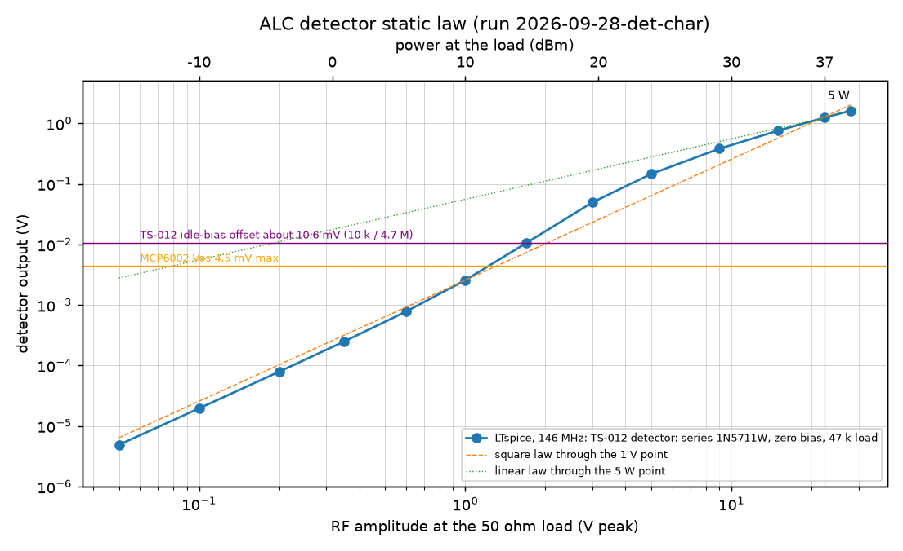

- Below about 1 V peak at the load (10 mW, -27 dB re 5 W), the zero-bias detector is square law. Its output there is small because the diode's zero-bias video resistance (about 0.9 M) is much larger than the 47 k load.
- The output equals the 10.6 mV idle-bias offset at 1.70 V peak: -22.4 dB re the 5 W amplitude, 29 mW.
- It equals the MCP6002's 4.5 mV worst offset at 1.23 V: -25.2 dB.
- Below those amplitudes the error amplifier cannot tell the envelope from zero. The loop does not control the first and last 7 % (amplitude) of every ramp. The integrator only slews there.

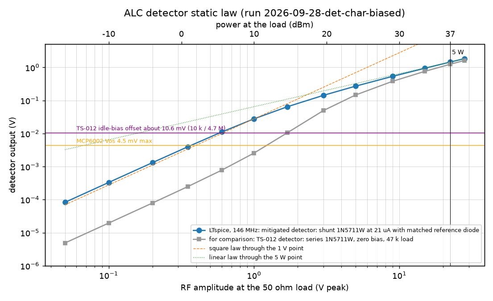

- The biased shunt detector of section 5.2 gives about 21 dB more output in the square-law region.
- It reaches 4.5 mV at 0.37 V peak (-35.5 dB re 5 W).
- The visibility floor is fixed relative to 5 W, not to the step. At the 0.5 W step the same floor is only -25.5 dB below the top of the envelope, so more of each edge is shaped by the feedforward alone (the cause of finding-1). The +7 dB tap at the 0.5 and 1 W steps (item 10) moves it back to -32.5 dB (0.5 W) and -35.5 dB (1 W).

Run results: `results/2026-09-28-det-char/result.json`, `results/2026-09-28-det-char-biased/result.json`.

### 4.2 The loop as written: both finalists fail

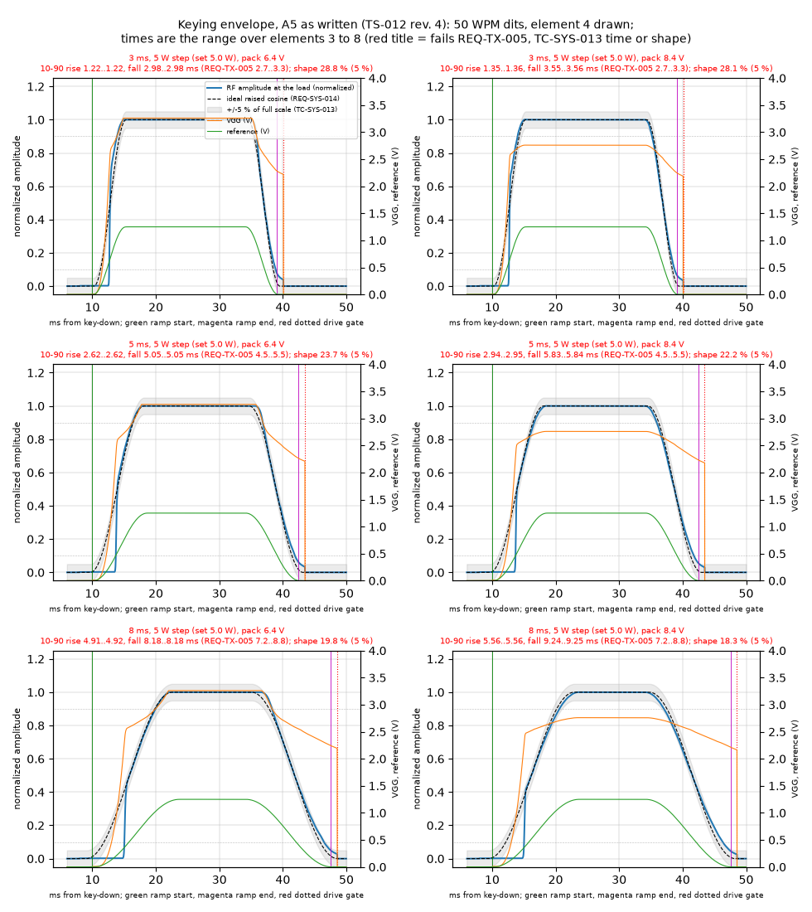

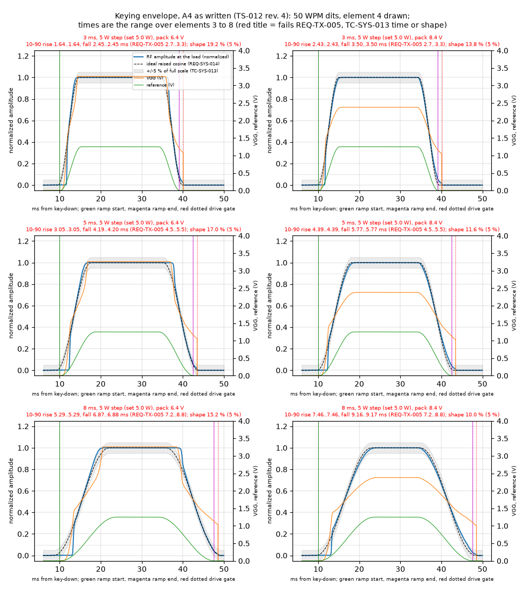

What happens, in order (unchanged from revision 0):

1. **Ramp start.** At release, the integrator sits at 0 V and the PA is in its dead zone (VGG below about 2.3 V for A5, VGS below about 1.1 V for A4). The reference starts flat and the detector sees nothing. So the integrator slews slowly, and RF appears only when VGG reaches the threshold, 2.5 to 5 ms late.
2. **Steep catch-up.** By then the accumulated error drives VGG through the steep part of the transfer. The amplitude jumps from 0 to 40 to 50 % in about 0.1 ms (A5), which is a key click. A5's transfer is about three times as steep as A4's at the steepest point (59 against 21 V/V, section 4.6), so its step is larger.
3. **Ramp end.** The loop again goes blind below -22 dB. The idle bias pulls the integrator down at only about 0.1 V/ms. At the drive gate, 1 ms after the ramp end, the PA still delivers:
   - A5: +5.2 to +8.0 dBm, VGG about 2.2 V;
   - A4: -3.4 to +2.5 dBm, VGS about 1.0 V.
   The gate then removes that level in 10 us, a second step of -27 to -40 dB relative amplitude.
   TS-012 states: "At key-up: the ramp takes VGG under 1.2 V (module output about 0 W), then after 1 ms CLK1 is disabled". That does not hold for this loop.
4. **Low pack end.** Neither finalist can make 5 W at the SMA at the low drain voltage (A5 4.34 W, A4 3.22 W). The integrator winds to the rail during the element, so the fall starts late and runs fast.

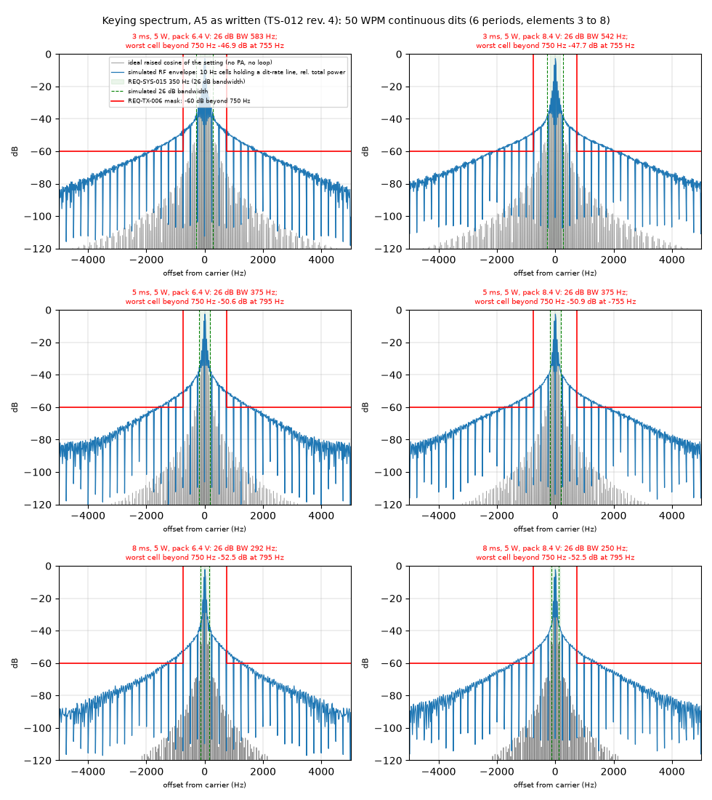

| As written (5 W step, 6 runs each) | A4 | A5 | Limit |
|---|---|---|---|
| 10-to-90 % rise / fall (3 ms setting), 6.4 V / 8.4 V pack | 1.64 / 2.45 ms; 2.43 / 3.50 ms | 1.22 / 2.98 ms; 1.35 / 3.56 ms | 2.7 to 3.3 ms (REQ-TX-005) |
| 10-to-90 % error, worst | -45 % | -59 % | +/-10 % |
| Shape error, worst | 19.2 % | 28.8 % | 5 % |
| 26 dB bandwidth, worst (3 ms) | 417 Hz | 583 Hz | 350 Hz |
| Worst 10 Hz cell beyond 750 Hz | -49.8 dB | -46.9 dB | -60 dB |
| Level at the drive gate | -3.4 to +2.5 dBm | +5.2 to +8.0 dBm | -30 dBm (REQ-TX-014) |
| Top power at 6.4 V (set 5 W) | 3.22 W | 4.34 W | setpoint +/-0.5 dB |
| Verdict | **FAIL** (REQ-SYS-014, 015, TX-005, TX-006, TX-014) | **FAIL**, worse than A4 | |

The A5 figures moved from revision 0 (542 Hz, -48.3 dB, +9.9 dBm) because its table is now the digitized curve. The verdict is the same. The ideal raised cosine of the same timing gives 292, 208 and 125 Hz and -74.0, -84.5 and -91.8 dB, so the failures come from the loop, not from the envelope settings.

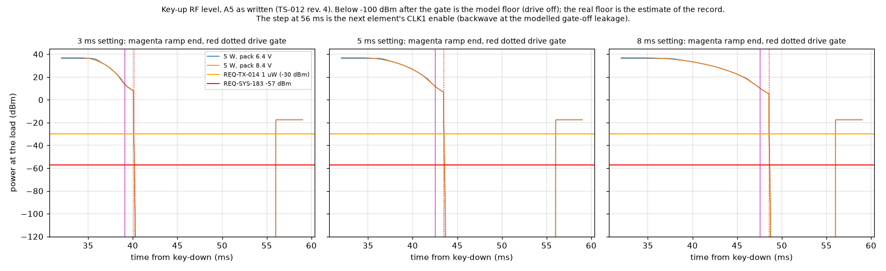

### 4.3 Revision 0's mitigated design at the power steps and a wider threshold range: fails

Revision 0's design (section 5.2 items 1 to 6): a feedforward table, the loop as a trim of +/-0.25 V reset at every element, the biased detector, predistortion, a low-pack setpoint and a zero calibration. Run `sweep0` sweeps VSH from -0.30 to +0.30 V at 0.5 and 5 W, 7.4 V pack.

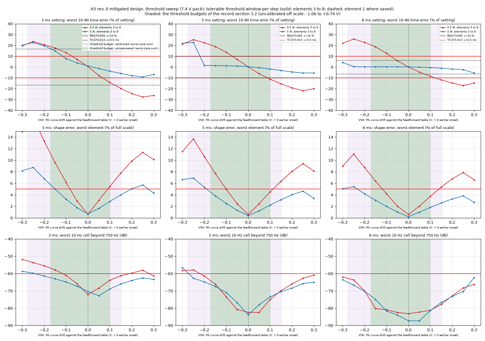

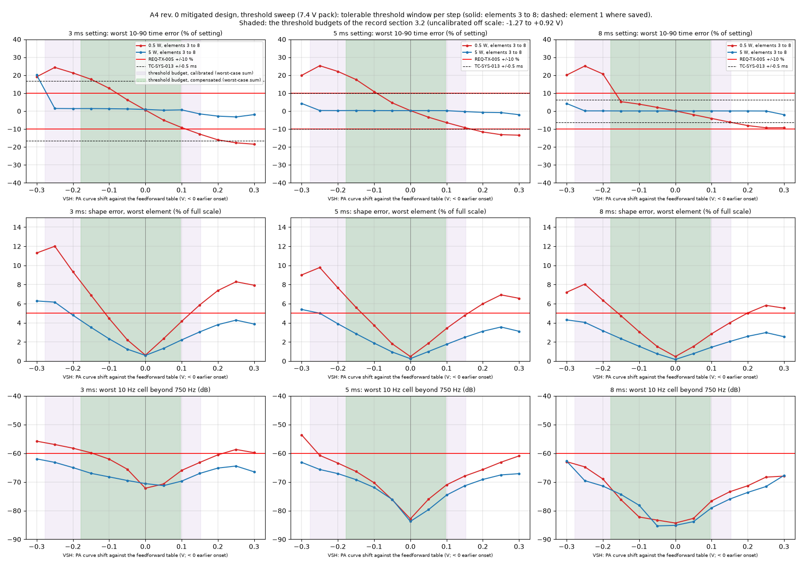

**The review's numbers are reproduced** (the reviewer's figures in brackets):

| Case | A5 | A4 |
|---|---|---|
| 0.5 W, VSH -0.1 V, 3 ms setting | rise 3.40 ms, +13.3 %, shape 6.2 % (3.40 ms, 6.3 %) | rise 3.38 ms, +12.7 % (3.38 ms) |
| 0.5 W, VSH -0.1 V, 5 and 8 ms | 5.68 and 9.01 ms (5.68, 9.02) | 5.53 ms at 5 ms (5.54) |
| 0.5 W, VSH +0.1 V, 3 ms | rise 2.57 ms, -14.3 % (2.57) | 2.72 ms, -9.2 % |
| 5 W, VSH -0.15 V, 3 ms | rise 3.45 ms, +15.0 %, shape 5.0 % (3.47 ms, 5.1 %) | 3.03 ms, shape 3.5 % |
| 5 W, VSH -0.2 V, 3 ms | 3.59 ms, shape 6.8 % (3.60 ms, 6.4 to 6.6 %) | shape 4.8 % (5.2 %) |

The small differences on A5 come from the digitized table (revision 1). Those on A4 at -0.2 V probably come from the pack voltage the reviewer used, which the finding does not state.

**Tolerable window** (all criteria, interpolated, worst over the three settings):

| Revision 0 design | A4 | A5 | Calibrated budget | Compensated budget |
|---|---|---|---|---|
| 0.5 W step | **-0.079 to +0.111 V** | **-0.053 to +0.067 V** | -0.277 to +0.152 V | A4 -0.179 to +0.096 V; A5 -0.171 to +0.099 V (revision 2) |
| 5 W step | -0.207 to beyond +0.30 V | -0.115 to +0.197 V | | |

- **Why the rise, not the fall.** Only the rise is off: the fall stays within 0.025 ms of the setting in every run with VSH between -0.2 and +0.2 V (beyond that the trim saturates and the fall moves too). Revision 0's integrator is reset to mid-rail at every element (the "clean reset at release"), so every rise starts with zero trim, and the feedforward alone must place the foot of the ramp. By the fall, the trim has converged.
- **Why 0.5 W is worst.** The detector's visibility floor sits only -25.5 dB below the top of the envelope, and the loop gain at the foot falls with the square of the amplitude (square-law detector) times the PA's exponential slope.
- **Verdict (revision 0 design): FAIL** REQ-TX-005 and TC-SYS-013 for both finalists at the 0.5 W step, even with per-unit calibration and NTC compensation. Revision 0's "PASS at every corner" and its "+9.7 %, 0.3 % inside" margin are withdrawn (finding-1 and finding-2).

Run results: `results/2026-09-28-r2-a4-sweep0/result.json`, `results/2026-09-28-r2-a5-sweep0/result.json` (key `window_interp_v`).

### 4.4 Revision 1 design

#### 4.4.1 Held elements pass everywhere

The revision 1 design adds items 7 to 10 of section 5.2. The one that matters most here is **item 9: the trim carries over from one element to the next** instead of being reset. The decks model this as an ideal hold of the integrator; the integrator starts at mid-rail only at power-on. A threshold error that is still there from one element to the next is then already corrected at the next rise. Revision 2 (finding-14) makes the per-element ADC capture the design basis for the carry-over (section 5.2 item 9): the ideal hold then stands for it within the capture's ADC and PWM step (a few mV of VGG), far inside the element-1 window, and the hold switch's leakage no longer enters.

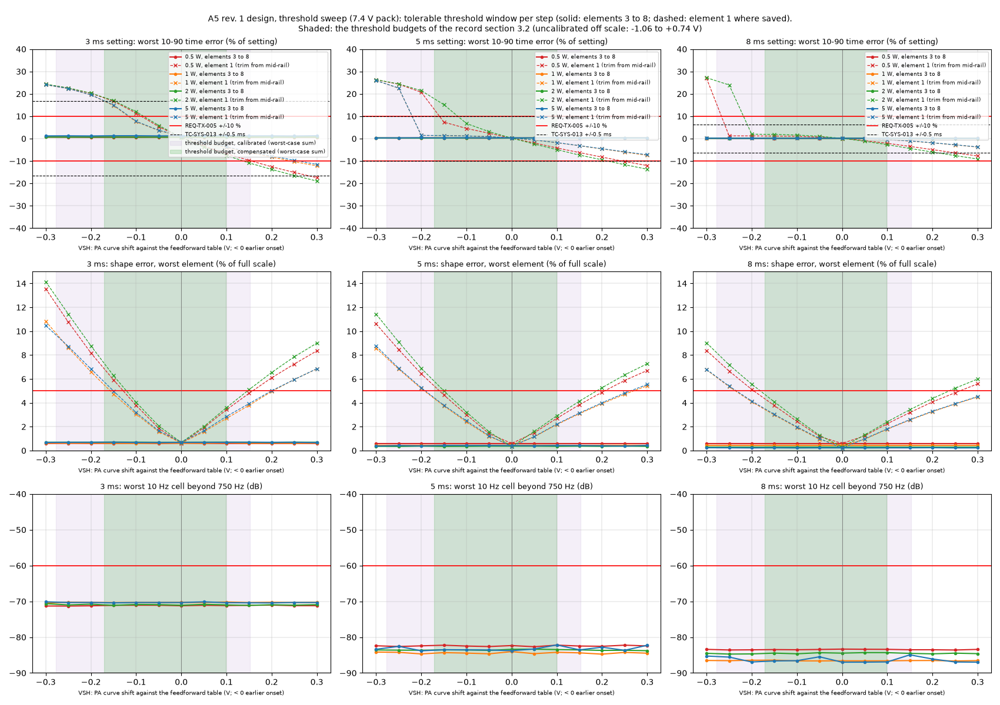

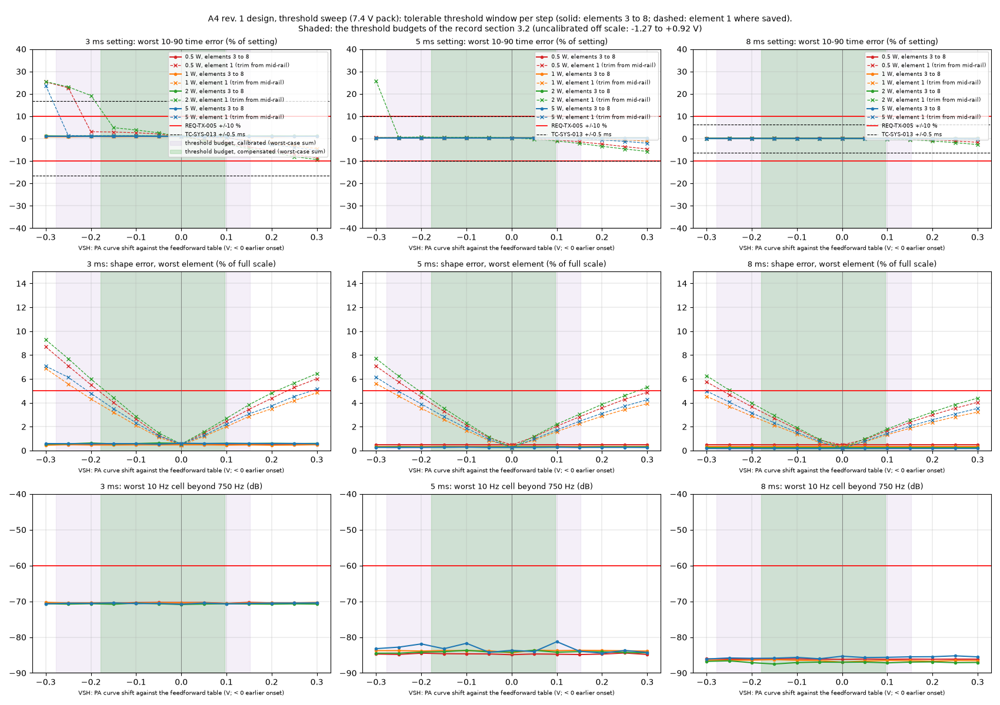

In the sweep, the solid lines are elements 3 to 8 and the dashed lines are element 1.

- **Elements 3 to 8 pass every keying criterion over the whole -0.30 to +0.30 V sweep**, at every step and setting, for both finalists. The worst is a 10-to-90 % error of 1.3 %, with shape error under 1 % and the worst cell beyond 750 Hz at -70 dB or lower.
- This covers the calibrated budget (-0.277 to +0.152 V) with margin, so NTC compensation is not needed for held elements.

#### 4.4.2 Record runs over every step, pack and setting

Run `fix`: 180 runs per finalist (revision 1: 108). The corners are nominal and the worst-case sums of the compensated and (revision 2) stored-trim budgets of section 3.2, each with the +/-1 mV residual offset acting the same way, at every step, pack and setting.

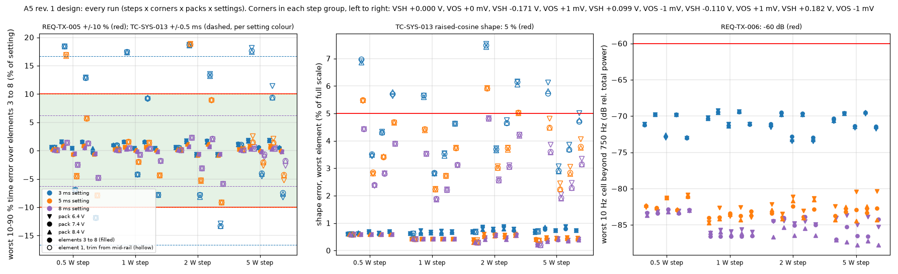

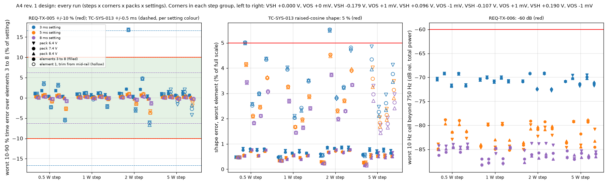

In these plots, filled markers are elements 3 to 8 and hollow markers are element 1. The corners in each step group are, left to right: nominal, compensated low, compensated high, stored-trim low, stored-trim high.

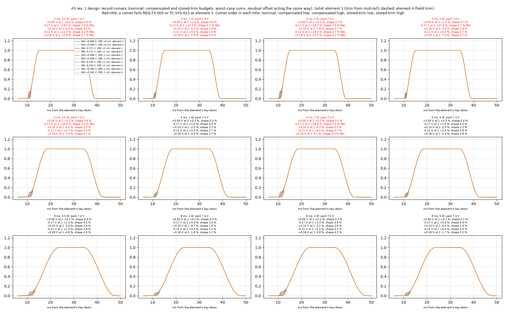

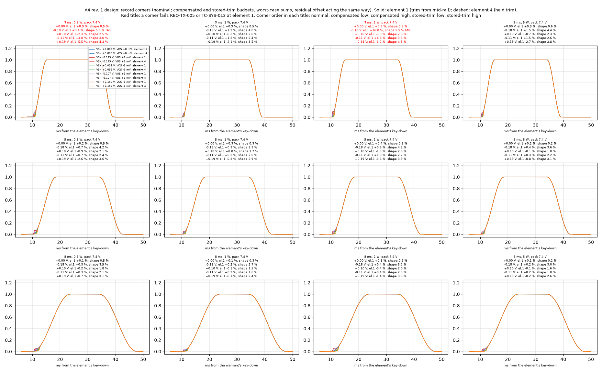

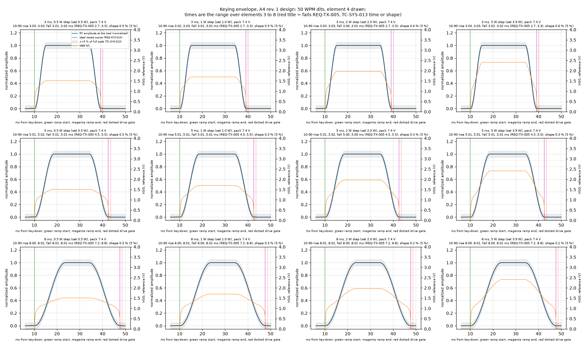

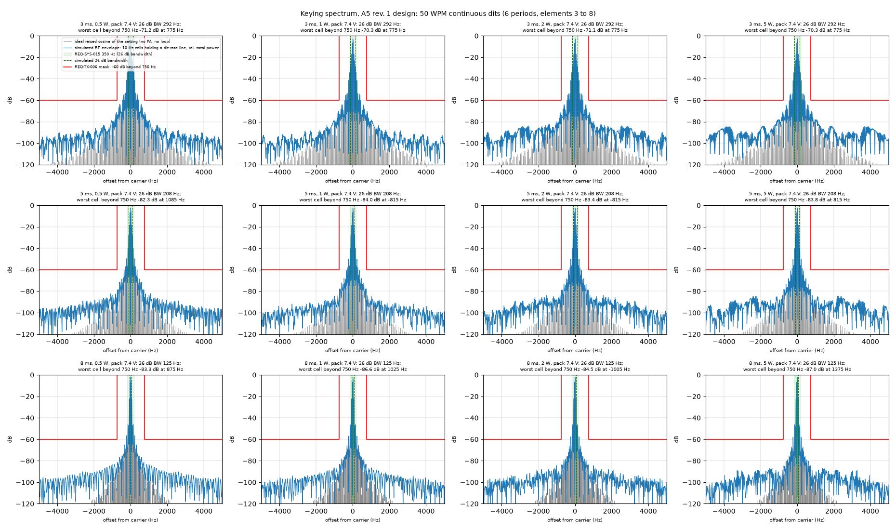

| Revision 1 design, 180 runs each | A4 | A5 | Limit |
|---|---|---|---|
| Elements 3 to 8: 10-to-90 % error, worst | 2.2 % | 1.9 % | 10 % (REQ-TX-005); 0.5 ms (TC-SYS-013) |
| Elements 3 to 8: shape error, worst | 0.9 % | 0.9 % | 5 % |
| 26 dB bandwidth (3 / 5 / 8 ms) | 292 / 208 / 125 Hz | 292 / 208 / 125 Hz | 350 Hz |
| Worst 10 Hz cell beyond 750 Hz (every step, including 0.5 W) | -69.1 dB | -69.2 dB | -60 dB |
| Overshoot | 0.00 dB | 0.00 dB | 0.2 dB |
| Top power / setpoint (model-health check) | within 0.01 dB | within 0.01 dB | 0.5 dB (this analysis's own check) |
| VGG maximum | 2.60 V | 3.24 V | 3.5 V (A5) |
| Level at the drive gate (modelled leakage) | -19.5 dBm | -17.5 dBm | -30 dBm (REQ-TX-014) |

**Element 1, per corner (36 runs each: 4 steps x 3 packs x 3 settings; REQ-TX-005 10 %, TC-SYS-013 0.5 ms and 5 %):**

| Corner (VSH, VOS) | A4: failing runs; worst error, worst shape | A5: failing runs; worst error, worst shape |
|---|---|---|
| Nominal (0, 0) | 0; 1.1 %, 0.6 % | 0; 1.1 %, 0.7 % |
| Compensated low (A4 -0.179 V, A5 -0.171 V; +1 mV) | **5** (3 ms at 0.5 and 2 W); 16.9 %, 5.5 % | **18**; 18.9 %, 7.5 % |
| Compensated high (A4 +0.096 V, A5 +0.099 V; -1 mV) | 0; 3.1 %, 2.9 % | 0; 8.2 %, 3.7 % |
| **Stored-trim low** (A4 -0.107 V, A5 -0.110 V; +1 mV) | **0**; 4.8 %, 3.3 % | **7** (3 ms); 13.5 %, 4.8 % |
| **Stored-trim high** (A4 +0.190 V, A5 +0.182 V; -1 mV) | **0**; 6.6 %, 4.8 % | **10** (3 ms, and 5 ms at 2 W); 13.3 %, 6.2 % |

- These corners combine the budget's worst-case sum with the offset at every pack, which the window comparison of 4.4.3 takes one at a time. They give the same verdicts.
- The pack moves element 1's error by at most 1.8 % (A4) and 1.2 % (A5) of the setting between 6.4 and 8.4 V; the `sens` runs at 6.4 and 8.4 V move the element-1 window edges by at most 0.004 V (4.4.3).
- The failure mode of element 1 is visible in the corners plot: at a negative corner the PA turns on at the foot of the ramp before the loop sees it, a step of about 10 to 15 % amplitude, and the loop then pulls the rest of the rise into shape. At a positive corner the foot comes late and the rise runs short.

#### 4.4.3 The first element of an over is the binding case

Element-1 windows (worst over the three settings; interpolated edges of the 0.02 V `sens` sweep, conservative grid edges in brackets):

| Revision 1 design, element 1 window, nominal case (7.4 V) | A4 | A5 |
|---|---|---|
| 0.5 W | -0.182 to +0.236 V | -0.089 to +0.155 V |
| 1 W (default step) | -0.226 to beyond +0.30 V | -0.119 to +0.202 V |
| 2 W | -0.169 to +0.211 V | -0.085 to +0.137 V |
| 5 W | -0.209 to +0.289 V | -0.117 to +0.199 V |
| **Worst over the steps** | **-0.169 to +0.211 V** (-0.16 / +0.20) | **-0.085 to +0.137 V** (-0.08 / +0.12) |
| Binding criterion at the worst step (2 W, 3 ms), low / high | TC-SYS-013 shape / TC-SYS-013 shape | REQ-TX-005 / REQ-TX-005 |

**Sensitivity (revision 2, finding-13).** Worst over the steps, `sens` runs:

| Case | A4 window | A5 window | A4 / A5 width |
|---|---|---|---|
| Nominal (7.4 V, VOS 0, 100 dB/V) | -0.169 / +0.211 | -0.085 / +0.137 | 1.72 |
| Residual offset +/-1 mV (low edge at +1 mV, high edge at -1 mV) | -0.163 / +0.205 | -0.080 / +0.132 | 1.73 |
| Pack 6.4 V | -0.170 / +0.213 | -0.083 / +0.135 | 1.76 |
| Pack 8.4 V | -0.171 / +0.213 | -0.084 / +0.134 | 1.76 |
| Sub-threshold slope 65 dB/V (E; the digitized A5 foot is 63 to 71 dB/V) | -0.163 / +0.267 | -0.118 / +0.149 | 1.61 |
| Sub-threshold slope 150 dB/V (E) | -0.130 / +0.172 | -0.064 / +0.118 | 1.66 |

The reviewer's independent runs (INSP-116 iteration 2, 0.01 V at 2 W) are reproduced within 0.002 V in every case.

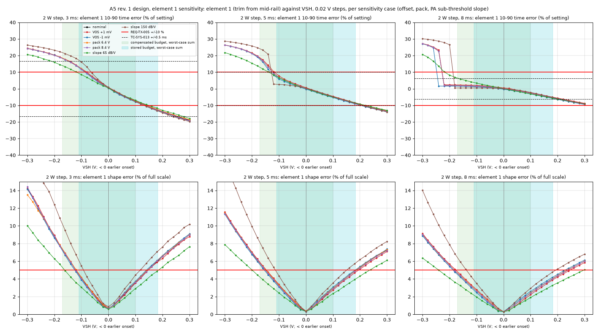

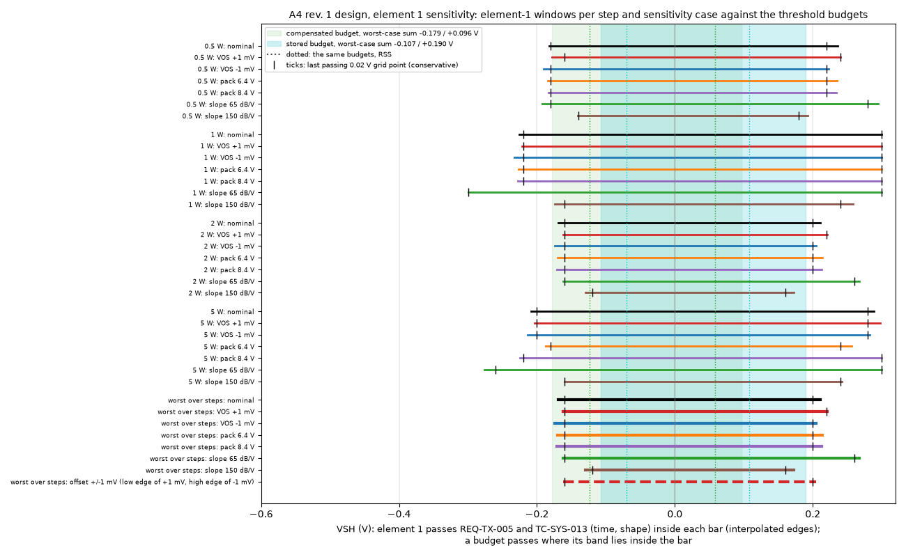

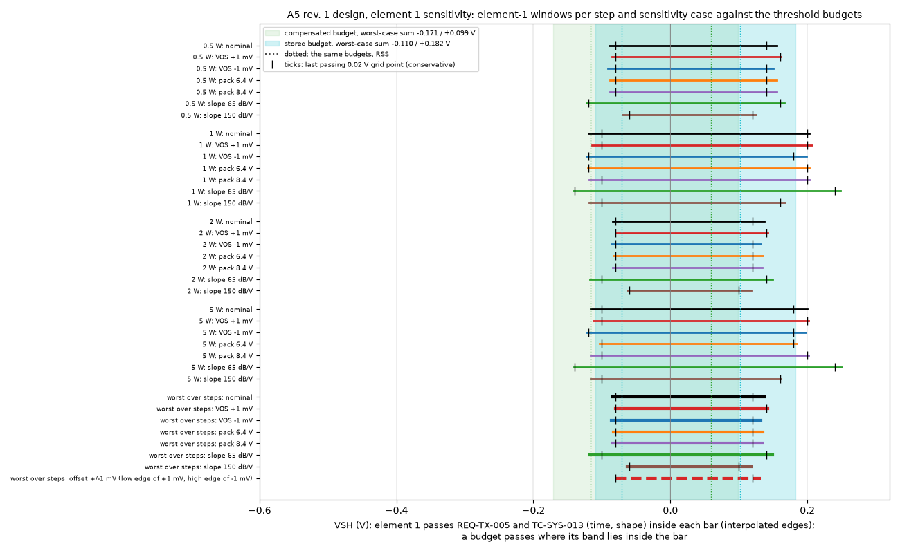

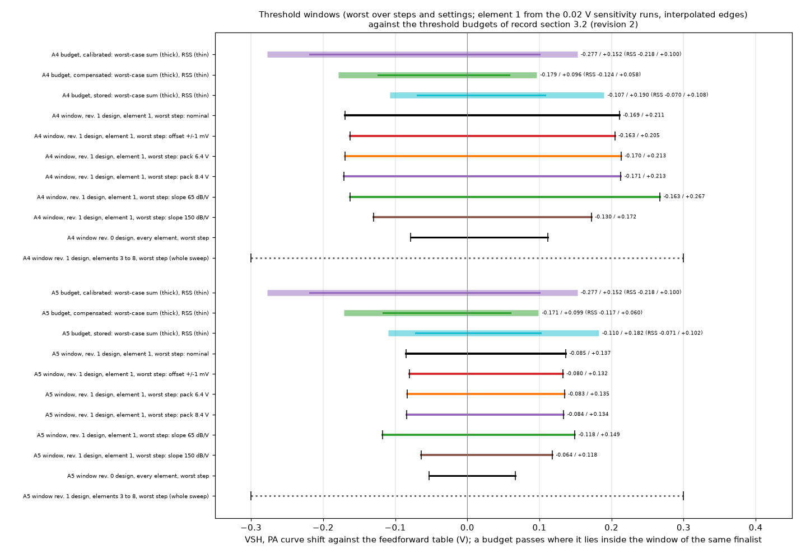

**Element 1 against its budget** (margin = the smallest of the two sides, V; negative is a fail; grid-edge margin in brackets):

| Budget | A4 nominal | A4 with offset | A4 at 150 dB/V | A5 nominal | A5 with offset | A5 at 65 dB/V | A5 at 150 dB/V |
|---|---|---|---|---|---|---|---|
| **Stored trim, worst-case sum** (A4 -0.107 / +0.190; A5 -0.110 / +0.182) | **PASS +0.021** (+0.010) | **PASS +0.015** (+0.010) | FAIL -0.018 | **FAIL -0.045** | FAIL -0.050 | FAIL -0.033 | FAIL -0.064 |
| Stored trim, RSS (A4 -0.070 / +0.108; A5 -0.071 / +0.102) | PASS +0.100 | PASS +0.093 | PASS +0.060 | PASS +0.013 (+0.009) | PASS +0.009 (+0.009) | PASS +0.046 | FAIL -0.008 |
| Compensated only (power-on, no stored trim), worst-case sum (A4 -0.179 / +0.096; A5 -0.171 / +0.099) | **FAIL -0.009** | FAIL -0.016 | FAIL -0.049 | FAIL -0.087 | FAIL -0.091 | FAIL -0.053 | FAIL -0.108 |
| Compensated only, RSS (A4 -0.124 / +0.058; A5 -0.117 / +0.060) | PASS +0.045 | PASS +0.039 | PASS +0.006 | FAIL -0.032 | FAIL -0.037 | PASS +0.001 | FAIL -0.053 |

The packs (6.4 and 8.4 V) change no verdict and no margin by more than 0.003 V; every number is in `summary.json` key `element1_window_margins_v`.

- **A4, first element of an over (stored trim): PASS at the worst-case sum**, by 0.021 V, and by 0.015 V with the residual offset. The 72 record runs at the stored-trim corners (4.4.2) pass at every pack. The pass holds for a sub-threshold slope up to about **127 dB/V** (linear between the 100 and 150 dB/V cases; estimate). The graph segments suggest a shallower foot (the digitized A5 foot is 63 to 71 dB/V), which widens A4's high edge. Revision 1's margin (0.036 V) came from the 25 K gradient; the thermal note's 33 K for A4 takes 0.015 V of it.
- **A5, first element of an over: FAIL at the worst-case sum** in every case run (by 0.033 to 0.064 V, mostly on the high side), and 17 of its 72 record runs at those corners fail. It passes at RSS by 0.009 to 0.013 V (0.046 V at 65 dB/V) and fails at RSS at 150 dB/V.
- **After a power-on without a stored trim (compensated budget), both fail at the worst-case sum** (revision 2; revision 1 read A4 as "Marginal"). A4 misses by 0.009 V (5 of 36 record runs) and passes at RSS; A5 misses by 0.087 V and fails at RSS too. So the stored trim of item 9 is **required for both finalists**, not only for A5. It is firmware (the value is stored with the NTC reading and applied at power-on).
- **Why A5's window is narrower.** The module's transfer is steeper: at the highest drain voltage its steepest slope is 59.2 V of RF amplitude per volt of VGG against 20.6 V/V for A4 (ratio 2.9; revision 1 quoted revision 0's 44 V/V). The window ratio is smaller, 1.6 to 1.8, because the error is set at the foot of the ramp, where the two transfers differ less than at their steepest point.
- **Every term that decides the A5 outcome is an estimate** (section 3.2): the 0.167 V/dB drive conversion (applied to A5 by analogy), the -2.5 mV/C coefficient and its +/-0.6 mV/C uncertainty, the die-to-NTC difference, and the sub-threshold slope. Section 8 item 7 lists the measurements that replace them.

Run results: `results/2026-09-28-r2-a*-fix/result.json` (every run, every number, pass/fail per criterion, `failing_runs`), `results/2026-09-28-r2-a*-sweep1/result.json` (`window_interp_v`), `results/2026-09-28-r2-summary/summary.json`.

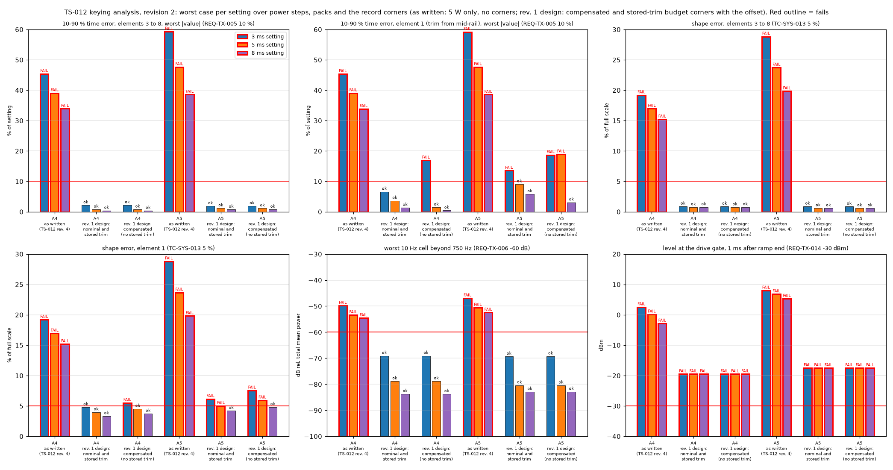

### 4.5 RF level at key-up (REQ-TX-014) and after the drive gate (REQ-SYS-183)

Unchanged from revision 0: the loop contribution at the drive gate is below -73 dBm (A4) and -100 dBm (A5) at every step and corner, and the level there is the modelled leakage alone.

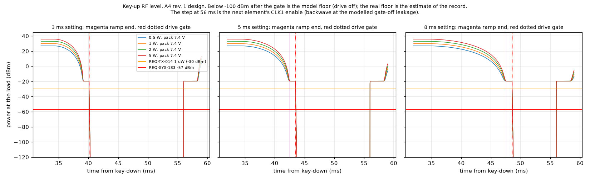

**REQ-TX-014** (1 uW, TX_KEY deasserted, PA_EN asserted, exciter driven). With the mitigated loop the PA is driven fully off within the 1 ms before the gate. The level is then the gate-off leakage of the PA with the exciter still driving it.

- **A4: FAIL (estimate).** Crss feedthrough gives -23 to -19 dBm, 7 to 11 dB over -30 dBm. The AFT05's gate bias cannot turn off the 0.1 W that the GVA-84+ drives through the 1.6 to 1.9 pF reverse capacitance.
- **A5: not shown.**
  - The datasheet's "up to 60 dB" isolation at VGG = 0 would give -47 dBm (13 dB of margin). The 30 dB that TS-012 assumes gives -17 dBm (13 dB over).
  - The module needs at least 43 dB of isolation with 20 mW in.
  - Neither figure is a guaranteed limit.
- **Both finalists:** the backwave at this level also appears for 2 ms before every element, between CLK1 enable and the ramp start (the step at 56 ms in the plots). Relative to the envelope top it is -54 to -57 dBc at 5 W and -44 to -47 dBc at 0.5 W. The spectra of section 4.4, which include the 0.5 W step, stay under -69 dB beyond 750 Hz with it.

**REQ-SYS-183** (-57 dBm after the gate: CLK1 disabled, GVA-84+ unpowered, relay then to receive). The decks set the drive to zero after the gate. The real floor is the path estimate below.

| Stage | A5 | A4 | Class |
|---|---|---|---|
| Si5351A CLK1 disabled, at its pin | -40 dBm | -40 dBm | E |
| Drive LPF | 0 dB | 0 dB | E |
| 18 dB input pad | -18 dB | -18 dB | R (TS-012) |
| GVA-84+ unpowered | -20 dB | -20 dB | E |
| 3 dB pad (A5) | -3 dB | n/a | R |
| PA with gate off | -30 dB (module, pessimistic end) | -39 dB (the Crss path above: -19 dBm out for +20 dBm in) | E |
| At the load | about -111 dBm | about -117 dBm | E |

Both are more than 50 dB under -57 dBm: met by estimate at either end of the ranges. Coupling paths that bypass the chain, such as the 144.000 MHz clock line, belong to WP-PDR-20. The tinySA check at the monitor port (TS-012 section 7.3) closes it.

### 4.6 PWM carrier ripple (analytic)

Revision 2 (finding-10): restated from the revision 2 `summary.json`. Revision 1 quoted revision 0's figures here, which used the hand-read A5 table. Since revision 1 the A5 table is the digitized curve, whose steepest slope is higher, and the ripple bound scales with it.

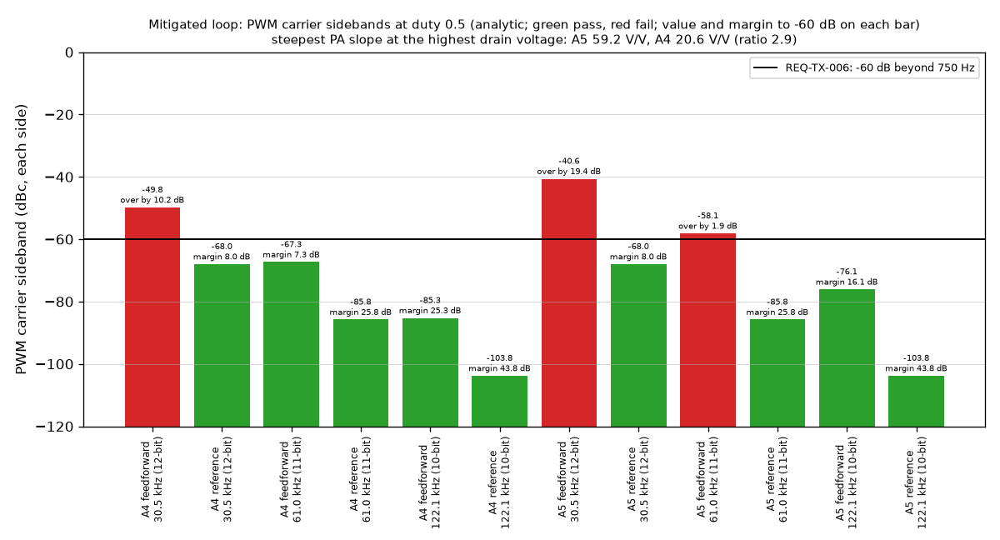

The decks carry the PWM duty staircase, not the PWM carrier. At the worst duty (0.5), the carrier's fundamental is 2.1 V peak before the 2-pole filter.

- **PA slope used.** The steepest RF amplitude per volt of VGG (VGS) at the highest drain voltage: **A5 59.2 V/V**, A4 20.6 V/V. A5's is 2.9 times A4's (revision 0's A5 table gave 44 V/V).
- **Feedforward channel.** It sets VGG directly, so its ripple modulates the RF through the PA slope. Each sideband, against REQ-TX-006 (-60 dB beyond 750 Hz):

  | Feedforward PWM | A5 | A4 |
  |---|---|---|
  | 30.5 kHz (12 bits) | -40.6 dBc, **FAIL** by 19.4 dB | -49.8 dBc, **FAIL** by 10.2 dB |
  | 61 kHz (11 bits) | -58.1 dBc, **FAIL** by 1.9 dB | -67.3 dBc, PASS, margin 7.3 dB |
  | 122 kHz (10 bits) | -76.1 dBc, PASS, margin 16.1 dB | -85.3 dBc, PASS, margin 25.3 dB |

  Revision 1 called the A5 61 kHz case "marginal" (-60.7 dBc). That was revision 0's number; it fails.
- **Reference channel.** It is attenuated further by the closed loop: -68 dBc at 30.5 kHz, -86 dBc at 61 kHz, both finalists.
- **Rule for the design (unchanged).** The feedforward PWM runs at 122 kHz or faster, or its filter takes a third pole. 61 kHz is not enough for A5. The `summary` stage now checks this rule and exits 3 if it fails (`design_rule_checks` in `summary.json`). Numbers: `results/2026-09-28-r2-summary/summary.json` key `pwm_ripple`.

### 4.7 Loop margin of the revision 1 loop (analytic)

First-order loop gain: trim gain x PA slope x tap factor x detector slope / (s Rin Cf), with the VGG-node pole (17.7 us) and the detector video pole (4.7 us). The trim gain and Cf both rise by 1.6, so the loop gain at the 2 and 5 W steps is that of revision 0.

- Tap factor 1 (2 and 5 W steps): at the steepest point of each transfer the crossover is 1.3 to 2.3 kHz and the phase margin 72 to 80 degrees.
- Tap +7 dB (0.5 and 1 W steps): the detector works higher on its law, so the crossover rises to 3.1 to 4.1 kHz and the **phase margin falls to 58 to 66 degrees**.
- Both finalists meet the TS-012 criterion of at least 45 degrees at every drain voltage.

Unchanged in revision 2 (minimum 58.4 degrees, A4 at 8.1 V drain with the tap). Numbers: `results/2026-09-28-r2-summary/summary.json` key `loop_margin_mitigated`; the `summary` stage exits 3 if any margin is under 45 degrees. A small-signal LTspice `.ac` of the circuit WP-PDR-22 draws replaces this before CDR.

## 5. Verdicts and design changes

### 5.1 Verdict per finalist

| | A4 (AFT05MS004N) | A5 (RA07M1317M) |
|---|---|---|
| Keying loop as written in TS-012 revision 4 | **FAIL**: REQ-SYS-014, REQ-SYS-015 (3 ms), REQ-TX-005, REQ-TX-006, REQ-TX-014 | **FAIL**, worse: bandwidth 583 Hz, sideband -46.9 dB, +8.0 dBm at the gate |
| Revision 0 mitigated design (items 1 to 6), all steps, sourced budget | **FAIL** REQ-TX-005 and TC-SYS-013 at 0.5 W (window -0.079 to +0.111 V) | **FAIL**, narrower window (-0.053 to +0.067 V) |
| Revision 1 design (items 1 to 10), elements after the first of an over | **PASS** REQ-SYS-014, 015, TX-005, TX-006 at every step, pack, setting and over the whole sweep | **PASS**, same |
| Revision 1 design, first element of an over (stored trim) | **PASS** at the worst-case sum (margin 0.021 V; 0.015 V with the residual offset; all 72 corner runs pass); holds up to a sub-threshold slope of about 127 dB/V | **FAIL** at the worst-case sum (by 0.045 V; 17 of 72 corner runs fail); PASS at RSS by 0.009 to 0.013 V; FAIL at RSS at 150 dB/V |
| Revision 1 design, first element after power-on with no stored trim | **FAIL** at the worst-case sum by 0.009 V (5 of 36 corner runs); PASS at RSS. Revision 1 read "Marginal" | **FAIL** at the worst-case sum and at RSS |
| REQ-TX-014 (1 uW, exciter driven) | **FAIL by estimate** (-23 to -19 dBm, Crss path); needs a design or requirement change (section 8, item 4) | **Not shown**: depends on the module's VGG-off isolation (needs 43 dB; datasheet "up to 60 dB", not a limit) |
| REQ-SYS-183 (-57 dBm, RF ended) | Met by estimate (about -117 dBm) | Met by estimate (about -111 dBm) |
| Keying discriminator for TS-012 | **Better**: 1.6 to 1.8 times the first-element window in every sensitivity case; meets the keying requirements at the worst-case sum of the estimated budget, with the stored trim | **Worse**: first element not shown at the worst-case sum; needs the section 8 measurements to close |

**Reading for the TS-012 choice.**
- Keying does not rule out either finalist, but it now discriminates. With the revision 1 design, A4 meets every keying requirement at the worst-case sum of its budget. A5 meets them only at the root-sum-square and only with the stored trim. Revision 0 read "keying moves neither C5 nor C8 by a full point"; this author now reads it as **at least one point against A5 on the envelope-loop criterion**. TS-012 section 7.1's A5 envelope-loop risk (6, Yellow) is confirmed rather than retired.
- REQ-TX-014 still goes the other way: A4 fails it by estimate unless the requirement or the drive gating changes (section 8 item 4), while A5 may meet it.
- Both finalists need the same added design items 7 to 10 (section 5.2), and (revision 2) both need the stored trim of item 9 at power-on. None adds a costly part.
- The A4 pass is thin: 0.015 to 0.021 V at the worst-case sum, and it turns into a fail if the true sub-threshold slope is steeper than about 127 dB/V. The A4-over-A5 reading does not depend on it: the window ratio holds at 1.6 to 1.8 in every case.
- The first-element result rests on estimates. If the section 8 item 7 measurements show a smaller drive sensitivity for the module than the A4-based 0.167 V/dB, A5 could pass. That would be known only after the modules are on the bench, which is after the order.

### 5.2 Design changes (both finalists; for WP-PDR-22 and the re-baseline)

Items 1 to 6 are revision 0's. Revision 1 changes item 2 and adds items 7 to 10.

1. **Feedforward VGG (VGS) table on a second PWM channel.**
   - It gives the inverse PA curve for the wanted amplitude at the measured pack voltage. It is summed into the VGG node.
   - The PWM runs at 122 kHz (10 bits) or takes a third filter pole (section 4.6). 61 kHz is not enough: A5 fails REQ-TX-006 there by 1.9 dB (revision 2 correction).
   - For A5, the channel is scaled so that its full scale plus the trim authority stays at or under 3.46 V, for example 3.3 V x 0.9 = 2.97 V plus 0.4 V = 3.37 V. The WP-PDR-22 clamp analysis then covers the sum.
   - Cost: a Pico GPIO (pin budget to confirm) and an RC network, plus a buffer that may need the spare MCP6002 half (see item 2).
2. **The loop becomes a bipolar trim about mid-rail**, a difference integrator. **Revision 1: authority +/-0.4 V (was +/-0.25 V), and the trim carried from element to element (item 9; revision 2: by per-element capture).**
   - The simulation models it as an ideal integrator with rails. The circuit must not load the reference or the detector.
   - It replaces the idle-bias resistor, whose 10.6 mV offset is itself a cause of the blind zone.
   - The spare MCP6002 half that TS-012 keeps for the pack-dependent clamp fallback may be needed as the buffer. If both are needed, a third MCP6002 is USD 0.44 (A price in TS-012 section 8.3; estimate of the line), inside the contingency.
3. **Biased detector with a reference diode.**
   - The 1N5711W is forward biased at about 21 uA from the 5 V bus through 220 k, as a shunt detector with a 100 pF coupling capacitor.
   - A second 1N5711W with the same bias gives the zero and tracks its temperature slope. TS-012's spare 1N5711W is also claimed by the pack-dependent clamp fallback, so a ninth diode may be needed (USD 0.31 A price).
   - The resistors and capacitor are owned through-hole or 0805 values inside the E2 allowance.
4. **Reference table predistorted by the detector law.** Firmware only.
5. **Setpoint limited at a low pack voltage to what the PA can make** (90 % of its maximum at the VGG cap, rounded down to 0.1 W):
   - A5: 4.0 W at 6.4 V (within REQ-SYS-012's -1 dB).
   - A4: 2.8 W at 6.4 V and 3.9 W at 7.4 V, which TS-012's REQ-SYS-012 delta for A4 already implies.
   - Without this the integrator winds up, whatever the loop topology.
6. **A firmware zero calibration of the loop offset** (to about 1 mV), done each over in the 2 ms lead-in with CLK1 on and VGG at 0.
7. **(Revision 1) Per-unit feedforward table for both finalists**, measured at build and not taken from the datasheet.
   - The firmware steps VGG (VGS) with the drive on into the dummy load. It reads the detector through the Pico ADC at several levels down to the visibility floor, at 146 MHz, at the bench pack voltage and room temperature.
   - It fits the table and stores it with the NTC reading.
   - No instrument beyond the unit itself and the dummy load. Revision 0 asked for this for A5 only; the AFT05's VGS(th) spread (1.7 to 2.5 V) makes it necessary for A4 too.
8. **(Revision 1) NTC compensation of the table.** The firmware shifts the table by -1.9 mV/C x (T_NTC - T_cal), using the REQ-SYS-118 PA-case NTC that already exists. Firmware only. The coefficient is replaced by the per-unit value of section 8 item 7 once measured.
9. **(Revision 1; revision 2 changes the basis, finding-14) Trim carried from element to element, and stored for power-on.**
   - **Design basis (revision 2): per-element capture.** At each key-up, in the 1 ms between the ramp end and the drive gate, the firmware reads the integrator output through an ADC channel and adds KTRIM x (reading - mid-rail) to the feedforward offset. The integrator is then reset to mid-rail while parked (the reset switch of revision 0). The next element starts from the captured trim. Its error is the ADC step (0.8 mV at the integrator, 0.13 mV of VGG), the 10-bit feedforward PWM step (about 3 mV of VGG) and the drift between elements: the +/-0.01 V capture term of section 3.2. The simulated ideal hold stands for this, since every element-1 window is at least +/-0.08 V wide.
   - **Why not the analog hold of revision 1.** The held output droops with the leakage of the switch that opens the integrator input. Nexperia 74LVC1G66 Rev. 14.1 (3 September 2024) Table 7 bounds IS(OFF) at +/-0.2 uA (-40 to +85 C) and +/-0.5 uA (-40 to +125 C), with 5.5 V across the switch (read 2026-09-28 at https://assets.nexperia.com/documents/data-sheet/74LVC1G66.pdf).
     - At 0.2 uA into Cf the output moves 45 V/s (A5, 4.48 nF) and 104 V/s (A4, 1.92 nF). Through KTRIM 0.16 that is 7 and 17 mV of VGG per ms, or 0.17 and 0.40 V over one 24 ms gap at 50 WPM (INSP-116 finding-14).
     - The real leakage near virtual ground is likely far lower (estimate), but no datasheet value shows it.
     - The MCP6002's own input bias current is 1 pA typical at 25 C and 19 pA typical at 85 C (Microchip DS20001733L, page 2, read 2026-09-28 at https://ww1.microchip.com/downloads/en/DeviceDoc/MCP6001-1R-1U-2-4-1-MHz-Low-Power-Op-Amp-DS20001733L.pdf). 19 pA droops the output by 4 mV/s (A5) to 10 mV/s (A4), under 2 mV/s of VGG. Revision 1's "well under 1 mV per second" was true of the op-amp only; it left out the switch.
   - **Reset-switch leakage during key-down.** With the per-element capture the switch sits across Cf and is open while keyed. Its leakage then acts as an input offset current: 0.2 uA x Rin 10 k = 2 mV at the datasheet limit (5.5 V across it; the integrator swings at most 2.5 V about mid-rail). The zero calibration of item 6 is taken with the switch open, so a steady leakage becomes part of the calibrated offset; the residual is the +/-1 mV VOS corner, whose effect on the windows is at most 0.006 V (section 4.4.3). WP-PDR-22 bounds the leakage of the chosen switch at the REQ-SYS-114 hot end and the actual voltage across it, or lowers Rin.
   - **Stored trim (firmware).** The last capture of an over is stored with the NTC reading. At power-on it is applied to the feedforward offset, so element 1 starts from it. Revision 2: **required for both finalists** (section 4.4.3).
   - Cost: one ADC channel (pin budget to confirm) and a 74LVC1G66 class switch (about USD 0.1 to 0.3, estimate), as in revision 1.
10. **(Revision 1) Detector tap switched up 7 dB at the 0.5 and 1 W steps.**
    - A GPIO-driven small MOSFET shorts part of the tap attenuator, so that at 1 W the diode sees what it sees at 5 W. Cost: a 2N7002 class part and a resistor (under USD 0.3, estimate); one GPIO (pin budget to confirm).
    - It keeps the low steps' window close to the 5 W one (A5's 1 W element-1 window equals its 5 W one within 0.01 V; A4's is wider than its 5 W one), at the cost of phase margin (58 degrees at least, section 4.7).

## 6. Findings for TS-012 (to route to its next revision; INSP-110 may confirm)

- **F1.** The RA07M1317M transfer in TS-012 section 7.3 ("about 0 W at 1.5 V, 2 W at 2.5 V, 4 W at 3.0 V, 7 W at 3.5 V") does not match the datasheet graph of June 2019, page 5. The project's digitized curves give 1.0 W at 2.5 V, 7.1 W at 3.0 V and 8.4 W at 3.5 V (mean of 135 and 155 MHz, 7.2 V, 20 mW). The dead zone runs to about 2.3 V, not 1.5 V. The real curve is steeper and saturates near 3.1 to 3.2 V. The 3.08 to 3.46 V clamp is therefore above the knee, which helps the REQ-SYS-012 check but makes the envelope harder to shape.
- **F2.** The key-up statement "the ramp takes VGG under 1.2 V (module output about 0 W)" does not hold for the loop as described: about 2.2 V and +5 to +8 dBm at the gate (section 4.2).
- **F3.** The as-written loop fails the keying requirements for both finalists. The causes are the dead zone, the detector's blind zone, windup at the low pack end and the drive gating onto a non-zero tail. The WP-PDR-22 criteria in TS-012 section 7.3 are right, but the design needs the changes of section 5.2.
- **F4.** REQ-TX-014 was not assessed in TS-012 for A4. The Crss path puts A4 7 to 11 dB over by estimate.
- **F5.** The feedforward-channel PWM frequency is a keying-spectrum item (section 4.6), not only a clock-plan item. It belongs with ADR-031's PWM rules (WP-PDR-20).
- **F6.** The AFT05MS004N reference circuit's gate-bias bypass (10 uF and 1 uF, Table 10) and the RA07M1317M test circuit's 22 uF on VGG (datasheet page 7) must not be copied into the envelope path. Behind the 1.77 k divider they would make the VGG node time constant 20 to 40 ms. This analysis uses 10 nF (17.7 us).
- **F7.** The RA07M1317M's VGG input current is not specified. The RA30H1721M datasheet gives 1 mA typical at VGG 5 V (web search, 2026-09-28; https://www.glynstore.com/RA30H1721M-101/). If the RA07M1317M draws similar current, the TS-012 divider (2.7 k / 5.1 k) with a 5 k module input gives a ratio of 0.483 and a VGG maximum of about 2.5 V, too low for 5 W. The divider impedance must be sized for a measured or bounded input current (a WP-PDR-22 clamp item). This analysis neglected the current.
- **F8 (revision 1).** TS-012 scores the envelope loop without the power steps. At 0.5 W the loop's visibility floor is 10 dB closer to the envelope top than at 5 W. Any keying claim must be made at the 0.5 W step, which TC-TX-005 and TC-TX-006 name, and at the 1 W default (REQ-SYS-064).
- **F9 (revision 1).** The first element of an over is the binding keying case for a trim-plus-feedforward loop. A5's steeper transfer makes its threshold window 1.6 to 1.8 times narrower than A4's in every sensitivity case (section 4.4.3). TS-012's C5 or C8 reading for A5 should carry this.
- **F10 (revision 1; revision 2).** The per-unit feedforward calibration, the NTC compensation, the per-element and stored trim and the switched detector tap (section 5.2 items 7 to 10) are needed by either finalist; revision 2 shows the stored trim is needed by A4 as well as A5. They add a GPIO, an ADC channel and two small parts to the pin and cost budgets.

## 7. Limitations

1. **PA model.** The PA is a static transfer from datasheet graph reads (about +/-5 % in power, Low below 0.2 W). There is no AM-to-PM, no memory, and no harmonic content during the ramp. A5 is the mean of the digitized 135 and 155 MHz curves; A4 uses its hand-read 155 MHz curve. The VDD scaling is assumed shape-preserving.
2. **Threshold shift as a pure shift.** Each budget term is applied as a horizontal shift of the whole curve (VSH). A drive change also changes the gain near saturation, and temperature changes the gain at the top (about -0.005 to -0.015 dB/K, `pa-drive-ts012.md`). The loop sees those regions, so the error at the foot, which a shift represents, is the part that matters.
3. **Below the graphs.** The sub-threshold slope is an estimate (100 dB/V; the digitized A5 foot is 63 to 71 dB/V). A steeper foot enlarges the amplitude error for the same shift. Revision 2 quantifies it (section 4.4.3): at 65 and 150 dB/V the windows move by up to 0.06 V, the A4-to-A5 ratio stays 1.6 to 1.8, and A4's worst-case pass holds up to about 127 dB/V. The `sens` cases assume the firmware table follows the true foot (the per-unit calibration reads it down to the detector floor); a firmware table that does not follow it would add error at the foot.
4. **Budget terms.** Most terms of section 3.2 are estimates, in particular:
   - the drive-to-threshold conversion (0.167 V/dB, from one reading of the AFT05's Figure 12, applied to A5 by analogy);
   - the temperature coefficient (-1.3 to -2.5 mV/C, not from either datasheet);
   - the die-to-NTC-reading difference (revision 2: 29 K A5, 33 K A4, from the thermal note's estimates, which themselves assume its section 8 change 6 inhibit setpoints);
   - the NTC compensation residual.
   The A4-A5 comparison depends on the windows, which are simulated. Whether each finalist passes depends on these estimates.
5. **Element 1 as the first element.** Element 1 in the decks starts with the trim at mid-rail and the stated VSH. The stored-trim case is represented by its VSH budget, not by a simulated power-on sequence. The relay closes before element 1 as in every element.
6. **Detector.** The diode is modelled with the HSMS-280x parameters (surrogate). The tap and the +7 dB switch are this analysis's choice. The detector temperature drift and the mismatch of the two biased diodes are not simulated; the zero calibration of section 5.2 item 6 is assumed to hold the residual to +/-1 mV.
7. **Error amplifier.** The mitigated error amplifier is an ideal integrator with rails and an ideal hold. Revision 2 makes the per-element capture the design basis (section 5.2 item 9), which the ideal hold represents within the capture error; the reset switch's leakage and charge injection are not simulated (its leakage is bounded as an offset in item 9). The as-written amplifier is a macro-model; the MCP6002 slew rate (0.6 V/us) is not limiting at these time scales.
8. **Leakage and the REQ-SYS-183 chain.** Both are estimates (section 4.5). Neither datasheet gives an isolation limit at gate-off.
9. **PWM ripple.** The PWM carrier ripple is analytic (section 4.6). The 12-bit staircase at 30.5 kHz is in the decks. The 10-bit, 122 kHz staircase recommended for the feedforward is not simulated; at 3.2 mV per step it adds about 0.3 dB of power per step in the exponential region.
10. **Relay.** Relay bounce and the late-contact fault case (12 ms) are not run here; they are WP-PDR-22 items. The nominal contact closes before CLK1 is enabled.
11. **Sweep resolution.** `sweep0` and `sweep1` step VSH by 0.05 V at the 7.4 V pack; revision 2's element-1 windows come from the 0.02 V `sens` sweep, with the packs and the offset as cases, and are reported both interpolated and as conservative grid edges (section 2 item 4). The record runs at the budget corners confirm the verdicts at 6.4, 7.4 and 8.4 V.
12. **Raw size.** The revision 2 `.raw` files total about 440 MB (the `sens` runs about 90 MB each), because every step is kept, per the owner rule. Decks that do not need element 1 save from 95 ms, and `sens` stops at 48 ms, to limit this.
13. **The -60 dB offset.** For the ideal 3 ms envelope, this analysis finds every 10 Hz cell under -60 dB beyond 395 Hz. `regulatory-corpus-and-operators.md` F7 gives 614 Hz for the same case. The difference is the record length and window: an integer number of dit periods here; a radix-2 record in F7, whose rectangular-window leakage raises the far cells. The 26 dB bandwidths agree (292 Hz).

## 8. What closes before the order

1. **WP-PDR-22 adopts the loop changes of section 5.2 (items 1 to 10)**, or an equivalent that passes the same criteria.
   - The decks of this analysis are then rerun with the WP-PDR-22 circuit values: detector tap and its switch, divider sized for the module's VGG current (F7), feedforward scaling, and the actual difference integrator with the per-element capture and reset (item 9) replacing the ideal hold, with the reset switch's leakage bounded at the REQ-SYS-114 hot end.
   - Plus the late-contact and open-loop fault cases, and a simulated power-on sequence for element 1.
2. **A5 only: bound the VGG input current.** Ask Mitsubishi, or plan to measure on receipt with the owner's Fluke multimeter.
3. **A5 only: VGG-off isolation.** A NanoVNA S21 of the module with VGG = 0, VDD applied and 20 mW in, on receipt and before first on-air use.
   - Pass: at least 43 dB (REQ-TX-014 with 20 mW drive).
   - Otherwise the item 4 remedy applies to A5 too.
4. **REQ-TX-014 disposition (both; decisive for A4).** Either:
   - (a) make the GVA-84+ bias and CLK1 enable part of the TX_KEY path (drive removed whenever TX_KEY is deasserted), and restate REQ-TX-014's condition by CR, since the requirement's TBR says isolation depends on the PA topology; or
   - (b) keep the requirement and add a series drive switch (a cost line).
   Robin decides at the PDR memo on Claude's proposal (a).
5. **PWM rule.** The feedforward PWM runs at 122 kHz or takes a third pole (section 4.6); added to the WP-PDR-20 clock-plan PWM rules.
6. **(Revision 1) Pin and ADC budget.** Items 9 and 10 need one ADC channel (integrator output) and one GPIO (tap switch), and item 1 needs one PWM channel, on the Pico 2. The WP-PDR-20 pin map confirms them.
7. **(Revision 1) Measurements that replace the section 3.2 estimates** (after the order, at first power-on, with the unit, the dummy load and the owner's Fluke multimeter; no new instrument):
   - the threshold temperature coefficient: the feedforward calibration of item 7 repeated with the PA case warm from a key-down, against the NTC;
   - the drive sensitivity: the calibration repeated at 144 and 148 MHz and with the drive pad one step up and down;
   - the die-to-NTC gradient: the calibration's onset point read immediately after a 5 W key-down and again after it cools;
   - (revision 2) the sub-threshold slope: the calibration's lowest points, below the datasheet graphs, give it directly. For A4 the worst-case pass needs it under about 127 dB/V.
   For A5 these decide whether the first element meets REQ-TX-005 at the worst-case sum. If they do not bring its stored-trim budget inside -0.085 to +0.137 V, the owner's options are: accept at RSS with an RSK entry; adopt a first-element rule (for example the first element of an over at the 5 or 8 ms shape whatever the setting, which widens the window, section 4.4.3); or restate REQ-TX-005's TBR tolerance by CR.
8. **REQ-TX-005 TBR.** This analysis is the TS-006-class evidence the TBR names. Proposal: keep +/-10 %. The revision 1 design holds it with large margin for every element after the first. For the first element it holds with A4 at the worst-case sum of the estimated budget, with the stored trim (margin 0.015 to 0.021 V).
9. **Supporting bench checks at first power-on** (not before the order):
   - the tinySA at the monitor port for REQ-SYS-183 in each off state (TS-012 section 7.3);
   - logic capture of the ramp PWM steps (REQ-SYS-014 verification note).
   The tinySA Ultra is not yet bought; the owner will buy it later (status 2026-09-28 and the owner's reply of the same day).

## 9. References

- TS-012 revision 4, `docs/decisions/trade-studies/TS-012-design-to-cost-hand-built.md` (commit 7d0d450), sections 1, 7.1, 7.3, 8, 8.10.
- INSP-110 record, `docs/reviews/PDR/checklists/ts-012-design-to-cost.md` (finding-14 and finding-17; R-1 relay timing).
- Requirements at HEAD: `docs/requirements/sys/requirements.md` (REQ-SYS-011, 012, 014, 015, 064, 114, 183), `docs/requirements/tx/requirements.md` (REQ-TX-005, 006, 014); TC-SYS-013 in `docs/test_cases/sys/test_cases.md`; TC-TX-005 and TC-TX-006 in `docs/test_cases/tx/test_cases.md`.
- `docs/design/analysis/pa-drive-ts012.md` (runs `2026-09-28-r1-d2-drive-a5` and `r1-d3-drive-a4`, drive spans; sections 3.1 and 4.2), `docs/design/analysis/thermal-ts012.md` section 4.1 (junction at 45 C; inhibit table) and section 8 change 6 (inhibit setpoints 81 C A5, 77 C A4).
- `hardware/sim/tx-pa/data/` (digitized RA07M1317M curves and overlays; `digitize_ra07.py`).
- `docs/research/regulatory-corpus-and-operators.md` F7 (26 dB bandwidth of a raised-cosine keyed carrier); `docs/research/keyer-and-key-interfaces.md` F10; `docs/research/pa-device-candidates.md` F8, F10, F20.
- Mitsubishi RA07M1317M datasheet, publication Jun. 2019, https://www.mitsubishielectric.com/semiconductors/hf/products/datasheet/ra07m1317m.pdf (read 2026-09-28 through the web-fetch tool, which caches the PDF it reads).
- NXP AFT05MS004N datasheet Rev. 0, 7/2014, https://www.nxp.com/docs/en/data-sheet/AFT05MS004N.pdf (read 2026-09-28, same way).
- Avago/Broadcom HSMS-280x data sheet SPICE parameters, https://datasheet.octopart.com/HSMS-2800-BLKG-Avago-datasheet-7087620.pdf (web search result, 2026-09-28).
- Mitsubishi RA30H1721M gate current as listed at https://www.glynstore.com/RA30H1721M-101/ (web search result, 2026-09-28).
- INSP-116 record, `docs/reviews/PDR/checklists/analysis-keying-ts012.md` (iterations 1 and 2; finding-10 to finding-14).
- Nexperia 74LVC1G66 data sheet Rev. 14.1, 3 September 2024, Table 7, https://assets.nexperia.com/documents/data-sheet/74LVC1G66.pdf (read 2026-09-28 through the web-fetch tool).
- Microchip MCP6001/1R/1U/2/4 data sheet DS20001733L, page 2 (input bias current), https://ww1.microchip.com/downloads/en/DeviceDoc/MCP6001-1R-1U-2-4-1-MHz-Low-Power-Op-Amp-DS20001733L.pdf (read 2026-09-28, same way).
- LDMOS threshold temperature coefficient: NXP Community, "About temperature compensation of LDMOS", https://community.nxp.com/t5/Other-NXP-Products/About-temperature-compensation-of-LDMOS/td-p/1406525, and Microwave Journal, "Adaptive Gate Bias Module Ensures Amplifier Performance" (2016-04-15), https://www.microwavejournal.com/articles/26263-adaptive-gate-bias-module-ensures-amplifier-performance (web search results, 2026-09-28; used only for the coefficient range, class E).

## 10. Disposition of the review findings

### 10.1 INSP-116 iteration 1 (revision 0), answered in revision 1

| Finding | What revision 1 did | Where |
|---|---|---|
| finding-1 (Major; CK-ANA-F1, E3, A5): the 0.5, 1 and 2 W steps and 7.4 V are not analysed, and the note does not say so | Every keying check now runs at 0.5, 1, 2 and 5 W and at 6.4, 7.4 and 8.4 V (108 runs per finalist for the design; the sweeps at every step). The reviewer's 0.5 W numbers are reproduced within 0.02 ms. The cause (visibility floor fixed relative to 5 W) is stated. The design gains the +7 dB tap at 0.5 and 1 W (item 10) and the held trim (item 9). Revision 0's "PASS at every corner" is withdrawn | Sections 2 (item 3), 4.1, 4.3, 4.4, 5.2 items 9 and 10, F8 |
| finding-2 (Major; CK-ANA-A4, A5, B6, E3, F4, G7-2): the +/-0.1 V corner has no source and is narrower than the known variation (VGS(th) spread, drive, temperature, the A5 table off the digitized curves) | A sourced threshold budget with four cases (section 3.2): VGS(th) 1.7 to 2.5 V, the drive spans of the PA drive runs with the Figure 12 conversion, die temperature -10 to 110 C at -1.3 to -2.5 mV/C, and the table reads. Per-unit calibration for both finalists (item 7). A5 table replaced by the project's digitized curves. The fixed corner is replaced by a -0.30 to +0.30 V sweep and interpolated windows compared with the budgets; the record corners are the budget's worst-case sums. The A5 "0.015 ms margin" statement is withdrawn | Sections 3.1, 3.2, 4.3, 4.4.3, 5.1, 7 items 2 to 4 |
| finding-3 (Major; CK-ANA-E4, D4, D2): the checker does not assert REQ-TX-005 (+/-10 %), only TC-SYS-013's +/-0.5 ms | `keying_run.py` asserts REQ-TX-005 (`t1090_req_tx005`) and TC-SYS-013 (`t1090_tc_sys013`) separately, on every element 3 to 8 and on element 1 (`first_*`), and lists the failing runs per criterion in `result.json` (`failing_runs`). The plots draw both limits | Sections 1 (table), 2 (item 4); `hardware/sim/tx-keying/keying_run.py` |

### 10.2 INSP-116 iteration 2 (revision 1), answered in revision 2

| Finding | What revision 2 did | Where |
|---|---|---|
| finding-10 (Major; CK-ANA-D2, E1): section 4.6 quotes revision 0's PWM ripple; the revision 1 checker gives A5 -40.6 / -58.1 / -76.1 dBc and 59.2 V/V, so 61 kHz fails; the 4.4.3 "44 V/V" is stale; README row | Section 4.6 restated from the revision 2 `summary.json`: A5 -40.6 / -58.1 / -76.1 dBc, A4 -49.8 / -67.3 / -85.3 dBc, slopes 59.2 and 20.6 V/V (ratio 2.9); **61 kHz fails for A5 by 1.9 dB**. The 4.4.3 bullet now quotes 59.2 against 20.6 V/V and explains why the window ratio (1.6 to 1.8) is smaller than the slope ratio. `pwm_ripple.png` prints each value with its margin or excess; the `summary` stage asserts the 122 kHz rule. README row corrected. Design rule unchanged (122 kHz or a third pole) | Sections 4.6, 4.4.3, 5.2 item 1; `pwm_ripple.png`; README |
| finding-11 (Minor; CK-ANA-E4, D4): the checker exits 0 with FAIL verdicts; the `setpoint` criterion has no source and sits under the TS-012 row | (b) Every stage compares its FAIL states with `expected_states.json` (the expected FAILs per run id, with the reason) and exits 3 on any difference, 2 on a tool error; `--accept` refuses a FAIL of a criterion the design must pass; the `summary` stage exits 3 on a design-rule failure. Negative checks shown in section 2 item 4. (c) `setpoint` is labelled this analysis's model-health check, with its own row in section 1 and a `REQ` entry that says it is not a requirement (REQ-SYS-012 is not assessed here) | Sections 1, 2 item 4; `keying_run.py` (`check_expected`, `FORBIDDEN_FAIL`, `REQ["setpoint_db"]`); `expected_states.json` |
| finding-12 (Minor; CK-ANA-A4, A5, G7-2): the compensated high end leaves out the hot-side residual; 110 C and 25 K do not follow the thermal note | The NTC coefficient residual acts on both sides over the larger span (56 K A5, 52 K A4). The die maximum 110 C is now tied to the thermal note's section 8 change 6 (inhibit at 81 C A5, 77 C A4), and the die above the reading is per finalist, 29 K (A5) and 33 K (A4) (28.9 and 32.1 K with the 85 C setpoint). Budgets restated per finalist; the `fix` corners follow them. Result: **A4's power-on case without a stored trim fails by 0.009 V** (the reviewer's estimate was about 0.007 V with 29 K), so the stored trim is required for both finalists; A4's stored-trim margin falls from 0.036 to 0.021 V | Sections 3.2, 4.4.2, 4.4.3, 5.1, 5.2 item 9; `THRESHOLD_BUDGET`, `T_NTC_MAX`, `DIE_TO_NTC_K` |
| finding-13 (Minor; CK-ANA-B6, F4): element-1 window sensitivity (offset, packs, sub-threshold slope) not quantified; `window_interp()` across a step-like jump | New variant `sens`: 0.02 V sweep of element 1 for the +/-1 mV offset, the 6.4 and 8.4 V packs and 65 and 150 dB/V (2604 runs per finalist), with interpolated and conservative grid edges; the reviewer's numbers are reproduced within 0.002 V. The `fix` record runs add the stored-trim corners with the offset at every pack (72 runs per finalist). A4's worst-case pass holds with the offset (0.015 V) and at every pack, and up to about 127 dB/V (the reviewer's 145 dB/V was on revision 1's budget); A5 fails at the worst-case sum in every case; the window ratio stays 1.6 to 1.8. The step-like jump lies outside the shape edge in every case, and no verdict reverses on the grid edges | Sections 2, 4.4.2, 4.4.3, 5.1, 7 items 3 and 11; `sens_curves.png`, `sens_windows.png`, `windows.png` |
| finding-14 (Minor; CK-ANA-B1): the hold droop ignores the named switch's leakage | Bounded with the datasheets: 74LVC1G66 IS(OFF) +/-0.2 uA (Rev. 14.1 Table 7) gives 45 and 104 V/s on Cf, 0.17 and 0.40 V of VGG over a 24 ms gap; the MCP6002's 19 pA at 85 C is negligible. The **per-element capture** (ADC read at every key-up, applied through the feedforward offset, integrator reset while parked) becomes the design basis, so no analog hold is relied on; the ideal hold of the decks stands for it within the capture error. The reset switch's leakage acts as an offset (2 mV at the datasheet limit), taken into the zero calibration; WP-PDR-22 bounds it | Section 5.2 items 2 and 9, section 7 item 7, section 8 item 1 |

