# Keying envelope and key clicks: TS-012 finalists A4 and A5 (WP-PDR-22 pre-order item)

| Field | Value |
|---|---|
| Product | `docs/design/analysis/keying-ts012.md` (analysis note, `analysis_kind`: simulation, keying envelope and spectrum) |
| Work package | WP-PDR-22 (`docs/plan/pdr-work-plan.md`), the pre-order LTspice check that TS-012 revision 4 section 7.3 names; run on the owner's approval of the discriminating simulations (`docs/plan/status/status-2026-09-28.md` section 1, item 2) |
| Author | Claude, analysis author invocation, 2026-09-28 |
| Decks, scripts and results | `hardware/sim/tx-keying/` (README.md there lists every run); results in `hardware/sim/tx-keying/results/2026-09-28-*/` |
| Tool | LTspice 26.0.2 through `tools/ltspice-batch.sh` only (ACC-LTSPICE-001); `.raw` parsed with spicelib 2.5 in the repo venv |
| Evidence status | **Developer evidence** (05 section 9.1): the checker `keying_run.py` has no TV record; the PA models are datasheet graph reads and estimates (section 3) |
| Serves | TS-012 choice between A4 and A5 (section 8 of TS-012); REQ-SYS-014, REQ-SYS-015, REQ-TX-005, REQ-TX-006, REQ-TX-014, REQ-SYS-183 (TBRs close by PDR); TC-SYS-013 method; RSK-045; the A5 envelope-loop risk of TS-012 section 7.1 (6, Yellow) |

## 1. Purpose and scope

The question: with the keying loop of each TS-012 finalist, does the transmitted envelope meet the keying requirements, and how much RF is left at key-up?

- **A4:** NXP AFT05MS004N discrete PA. The gate bias (VGS) is driven by the same closed envelope loop as A5 (TS-012 section 7.3: "A4 uses the same relay and takes the same sequence"). No TCXO.
- **A5:** Mitsubishi RA07M1317M module, with power set by VGG.

The loop of both, as TS-012 revision 4 section 7.3 describes it:
- a firmware raised-cosine reference (filtered PWM);
- a 1N5711 detector on the LPF output side;
- an MCP6002 integrating error amplifier with an idle-bias resistor;
- a 0.654 divider to VGG, with clamps on the reference and the VGG node;
- the key-down sequence: relay at t0, CLK1 and GVA-84+ bias at t0 + 8 ms, ramp start at t0 + 10 ms;
- at key-up, the drive gated 1 ms after the ramp ends.

The analysis covers:
- the PA dead zone below the gate threshold;
- the square-law region of the detector;
- windup when the setpoint cannot be reached;
- the drive gating at key-up;
- the envelope spectrum.

It does not cover: loop stability by a small-signal LTspice run (section 4.6 gives an analytic margin), harmonics, AM-to-PM, the open-loop and late-contact fault cases of WP-PDR-22, or the VGG clamp value.

Requirements checked (text at HEAD):

| Requirement | Limit | How it is checked here |
|---|---|---|
| REQ-SYS-014 | Raised-cosine rises and falls, 10-to-90 % time 3 to 8 ms (TBR) | TC-SYS-013 criteria: normalized envelope within 5 % of full scale of the ideal raised cosine at every sample; 10-to-90 % time equal to the setting within +/-0.5 ms; at 3, 5 and 8 ms |
| REQ-TX-005 | 10-to-90 % times within +/-10 % (TBR) of the command at the antenna port | Same rise and fall times |
| REQ-SYS-015 | 26 dB bandwidth at most 350 Hz (TBR) with continuous 50 WPM dits, every setting | FFT of the RF amplitude envelope over an integer number of dit periods; 97.3(a)(8) power containment: the smallest symmetric band with outside power at most 10^-2.6 of inside power |
| REQ-TX-006 | Every 10 Hz cell beyond 750 Hz at least 60 dB (TBR) below total mean power, continuous 50 WPM dits | Same FFT, power summed in 10 Hz cells, relative to total mean power |
| REQ-TX-014 | At most 1 uW (-30 dBm, TBR) at the antenna port with TX_KEY deasserted, PA_EN asserted and the exciter driven | Level at the load 1 ms after the ramp end, just before the drive gate (the settled key-up state), with the gate-off leakage of section 3 |
| REQ-SYS-183 | At most -57 dBm (TBR) at the carrier in every RF-ended, inhibited or off state | Estimate of the path with CLK1 disabled and the GVA-84+ unpowered (section 4.5) |
| TS-012 section 7.3 WP-PDR-22 criteria | Overshoot at most 0.2 dB; loop phase margin at least 45 degrees; VGG at most 3.5 V (A5) | Overshoot from the simulated envelope; phase margin analytic (section 4.6); VGG maximum from the simulation |

## 2. Method

1. **Detector law (LTspice, 146 MHz).**
   - `det_char.cir` drives the TS-012 detector with a 146 MHz carrier at 13 amplitudes from 0.05 to 28 V peak at the 50 ohm load (5 W is 22.36 V). The detector is a series 1N5711W with zero bias, a 2.2 k / 180 ohm tap (1.69 V peak at the diode at 5 W) and a 47 k load.
   - The DC output is the `.meas` time average once settled.
   - Convergence: at 0.5 ns and 0.25 ns maximum step the integration error on the diode capacitance charge exceeded the square-law output below 1 V, and the average came out negative. At 0.125 ns it came within 6 %. At 0.0625 ns trapezoidal and Gear integration agree within 0.3 %. The record run uses 0.0625 ns with Gear.
   - `det_char_biased.cir` does the same for the mitigated detector of section 5.2. It converged at 0.25 ns (within 0.3 % of 0.0625 ns).
2. **Keying loop (LTspice, envelope domain).** `keying_run.py` writes one deck per finalist and variant.
   - The RF carrier is replaced by its amplitude at the load. The PA is a static table of output power (dBm) against VGG, from the datasheet graph, scaled for the drain voltage. It is multiplied by:
     - the drive gate (CLK1 and GVA-84+ bias, 10 us);
     - the relay contact (closed at 7.5 ms);
     - the 0.5 dB LPF and relay loss.
   - Leakage: a gate-off leakage term (the output with the gate off and the exciter driven) is added while the drive is on.
   - Detector and reference: the detector is the LTspice static law of step 1 followed by its video pole. The reference is the firmware raised-cosine table as a 12-bit PWM duty updated every 32.768 us (125 MHz / 4096; this analysis's assumption for the firmware), through a 2-pole RC (4.7 k, 10 nF twice).
   - Error amplifier, as written: a macro-model of the MCP6002 (gm stage, Aol 112 dB, GBW 1 MHz, internal node and output limited to the 0 and 5 V rails) as an inverting integrator. Rin is 10 k, Cf is 16 nF (A5) or 7 nF (A4), for a crossover near 1.5 kHz where the transfer is steepest. The idle bias is 4.7 M to +5 V.
   - VGG node: the 0.654 divider as its 1.77 k Thevenin equivalent into 10 nF.
   - Clamps: open-collector clamps on the VGG node, the reference and the integrator. They release at the ramp start and are applied at the drive gate.
   - Keying pattern: continuous dits at 50 WPM (24 ms on, 24 ms off), 8 elements. The TS-012 sequence applies to every element: constant lead-in, ramp start 10 ms after key-down, CLK1 on at 8 ms, drive gated 1 ms after the ramp end.
   - Runs per deck: 3, 5 and 8 ms settings at the low and high drain voltage (A5 5.5 and 7.9 V; A4 6.1 and 8.1 V: the 6.4 and 8.4 V pack after key-down sag, TS-012 section 7.3). The mitigated decks add five corners, 30 runs in all.
3. **Checks (Python, spicelib).**
   - The `.raw` is resampled at 10 us. Rise, fall, shape error and overshoot are read on element 4. Shape error is the maximum deviation from the ideal raised cosine of the set 10-to-90 % time, after the best time alignment.
   - The spectrum is taken over elements 3 to 8 (6 periods, 288 ms, 3.5 Hz bins, rectangular window over an integer number of periods). The same code on the ideal raised cosine gives 292 Hz at the 3 ms setting, the figure of `docs/research/regulatory-corpus-and-operators.md` F7. That checks the bandwidth routine.
   - Key-up: the level at the load from the ramp end to the drive gate, and after it.
4. **Analytic items (`keying_run.py summary`).**
   - The PWM carrier ripple, which the decks do not carry (they carry the duty staircase only).
   - The first-order loop margin of the mitigated loop.

## 3. Inputs and sources

Classes: **D** datasheet value; **DD** derived from a datasheet (graph read, arithmetic); **R** requirement or TS-012 text; **E** estimate (Low confidence).

| Input | Value | Class | Source |
|---|---|---|---|
| RA07M1317M Pout vs VGG, VDD 7.2 V, Pin 20 mW | Below graph resolution (0.05 W) below about 2.2 V; 1.25 W at 2.5 V; 3.85 W at 2.7 V; 5.1 W at 2.8 V; 7.1 W at 3.0 V; 8.0 W at 3.2 V; 8.4 W at 3.5 V (mean of the 135 and 155 MHz curves) | DD | Mitsubishi RA07M1317M datasheet, publication Jun. 2019, page 5, read 2026-09-28 at https://www.mitsubishielectric.com/semiconductors/hf/products/datasheet/ra07m1317m.pdf |
| RA07M1317M Pout vs VDD, VGG 3.5 V, 155 MHz | 4.8 W at 5.5 V, 7.75 W at 7.2 V, 9.1 W at 7.9 V (scale applied to the whole VGG curve; the curve shape is assumed not to move with VDD) | DD, E (shape) | Same datasheet, page 4 |
| RA07M1317M VGG = 0 | "the RF input signal attenuates up to 60 dB"; IDD leakage 100 uA max at VDD 9.2 V, VGG 0 V, Pin 0 | D (not a limit on isolation) | Same datasheet, pages 1 and 2 |
| AFT05MS004N Pout vs VGS, 155 MHz, VDD 7.5 V, Pin 0.1 W | 0.05 W at 1.2 V; 0.72 W at 1.5 V; 2.0 W at 1.8 V; 3.2 W at 2.0 V; 4.6 W at 2.2 V; 5.6 W at 2.35 V (end of graph); saturation near 6.2 to 6.5 W above 2.35 V | DD; E above 2.35 V | NXP AFT05MS004N datasheet Rev. 0, 7/2014, Figures 11 and 12, read 2026-09-28 at https://www.nxp.com/docs/en/data-sheet/AFT05MS004N.pdf |
| AFT05MS004N Crss, VGS(th) | 1.63 pF at VDS 7.5 V, VGS 0 (about 1.9 pF at 6 V, Figure 2); VGS(th) 1.7 / 2.2 / 2.5 V at 67 uA | D | Same datasheet, Table 5 and Figure 2 |
| A4 drain scaling | 3.6 W saturated at the device at 6.1 V drain, i.e. TS-012's about 3.2 W at the SMA at the 6.4 V pack end; V squared law to 8.1 V | E | TS-012 section 1 (adversarial C2) |
| Sub-threshold slope below the graphs | 100 dB/V below 2.2 V (A5) and 1.2 V (A4) | E | Author's estimate; it sets only the tail and foot below about -40 dB, which section 4.3 shows the mitigated loop does not depend on |
| Gate-off leakage, exciter driven (A5) | -17 dBm at the load (20 mW in, 30 dB module isolation, TS-012's backwave figure); best case -47 dBm (60 dB) | E | TS-012 section 7.3; datasheet "up to 60 dB" |
| Gate-off leakage, exciter driven (A4) | -19 dBm modelled, range -23 to -19 dBm: a gate swing of 1.35 to 2 V peak (0.1 W into 9 ohm) through Crss 1.63 pF at 146 MHz gives 2.0 to 3.0 mA into the 2.56 ohm load line, 0.5 x i^2 x 2.56 ohm = 5.2 to 11.5 uW | E | Derived from the datasheet values above and TS-012's Zload (2.56 - j0.54 ohm at 145 MHz) |
| 1N5711W diode model | HSMS-280x SPICE parameters: IS 3e-8 A, N 1.08, RS 30 ohm, CJO 1.6 pF, BV 75 V (the 1N5711 uses the same 70 V class Schottky chip family; surrogate) | D (for the HSMS-280x), E (as 1N5711W) | Avago/Broadcom HSMS-280x data sheet, e.g. https://datasheet.octopart.com/HSMS-2800-BLKG-Avago-datasheet-7087620.pdf (web search 2026-09-28) |
| Detector tap and load | 2.2 k / 180 ohm tap, 47 k and 470 pF load (22 us video pole) | E | This analysis's assumption; TS-012 gives no values; WP-PDR-22 sets the tap |
| MCP6002 | GBW 1 MHz, rail-to-rail output; Vos 4.5 mV max | D (values used as the macro's parameters) | Microchip MCP6002 (the part in TS-012 section 8.3) |
| Idle bias, integrator | 10 k input, 4.7 M from +5 V (10.6 mV idle offset) | E | TS-012 gives "a bias resistor (owned)" without a value; 4.7 M keeps the offset above the MCP6002 4.5 mV |
| Divider, VGG node | 0.654, 1.77 k Thevenin (2.7 k / 5.1 k), 10 nF; module VGG input current neglected | R, E | TS-012 section 7.3; the 10 nF is this analysis's choice (see finding F6) |
| Key-down sequence | Relay t0; contact 7.5 ms (7 ms operate, 0.5 ms bounce); CLK1 and GVA bias 8 ms; ramp 10 ms; drive gate 1 ms after ramp end | R | TS-012 section 7.3 (Omron G5V-2 datasheet values quoted there) |
| Losses, drain voltages | 0.5 dB LPF and relay; drain 5.5 to 5.9 V (A5) at the 6.4 V pack after key-down sag, 7.9 V at 8.4 V | R | TS-012 section 7.3 |
| Firmware PWM | 12 bits at 30.5 kHz (125 MHz / 4096), duty updated every period (DMA) | E | This analysis's assumption; a REQ-SW design item at PDR |

## 4. Results

### 4.1 Detector law: the loop is blind to the bottom 22 to 25 dB of the envelope

- Below about 1 V peak at the load (10 mW, -27 dB re 5 W), the zero-bias detector is square law. Its output there is small because the diode's zero-bias video resistance (about 0.9 M) is much larger than the 47 k load.
- The output equals the 10.6 mV idle-bias offset at 1.70 V peak: -22.4 dB re the 5 W amplitude, 29 mW.
- It equals the MCP6002's 4.5 mV worst offset at 1.23 V: -25.2 dB.
- Below those amplitudes the error amplifier cannot tell the envelope from zero. The loop does not control the first and last 7 % (amplitude) of every ramp. The integrator only slews there.

- The biased shunt detector of section 5.2 gives about 21 dB more output in the square-law region.
- It reaches 4.5 mV at 0.37 V peak (-35.5 dB).

Run results: `results/2026-09-28-det-char/result.json`, `results/2026-09-28-det-char-biased/result.json`.

### 4.2 The loop as written: both finalists fail

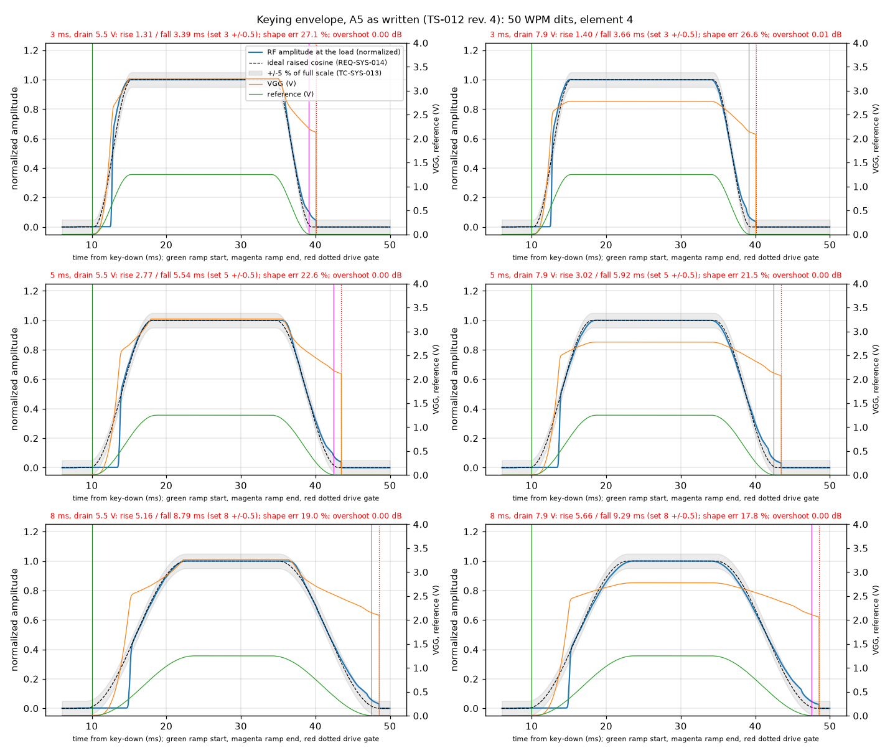

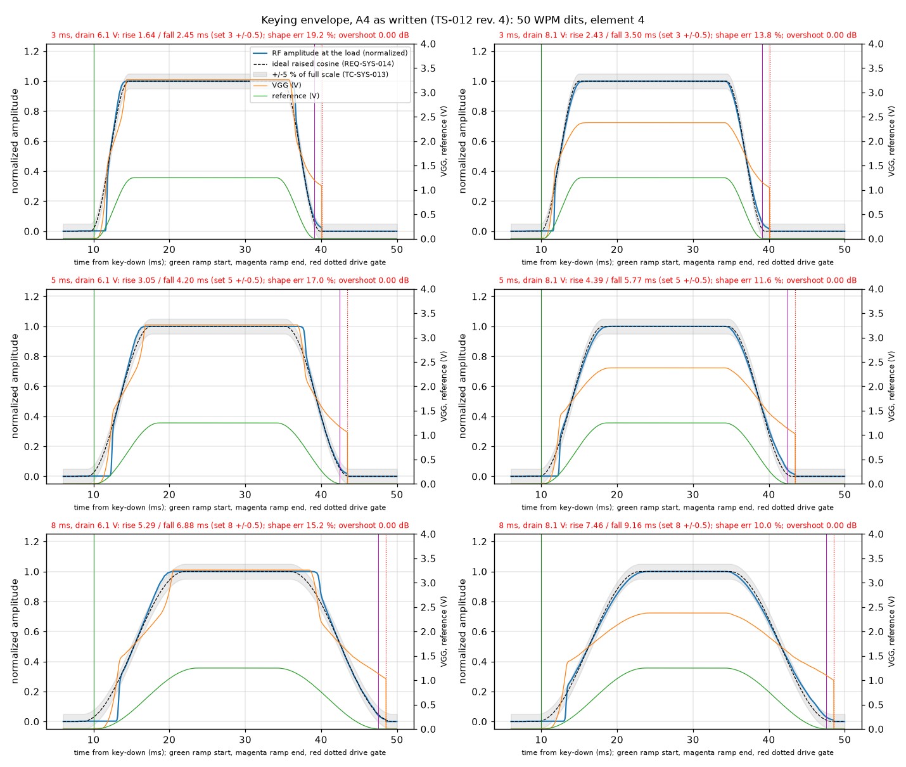

What happens, in order:

1. **Ramp start.** At release, the integrator sits at 0 V and the PA is in its dead zone (VGG below about 2.2 V for A5, VGS below about 1.1 V for A4). The reference starts flat and the detector sees nothing. So the integrator slews slowly, and RF appears only when VGG reaches the threshold, 2.5 to 5 ms late.
2. **Steep catch-up.** By then the accumulated error drives VGG through the steep part of the transfer. The amplitude jumps from 0 to 40 to 50 % in about 0.1 ms (A5), which is a key click. A5's transfer is about twice as steep as A4's, so its step is larger.
3. **Ramp end.** The loop again goes blind below -22 dB. The idle bias pulls the integrator down at only about 0.1 V/ms. At the drive gate, 1 ms after the ramp end, the PA still delivers:
   - A5: +5.3 to +9.9 dBm, VGG about 2.1 V;
   - A4: -3.4 to +2.5 dBm, VGS about 1.0 V.
   The gate then removes that level in 10 us, a second step of -27 to -40 dB relative amplitude.
   TS-012 states: "At key-up: the ramp takes VGG under 1.2 V (module output about 0 W), then after 1 ms CLK1 is disabled". That does not hold for this loop.
4. **Low pack end.** Neither finalist can make 5 W at the SMA at the low drain voltage (A5 4.48 W, A4 3.22 W). The integrator winds to the rail during the element, so the fall starts late and runs fast.

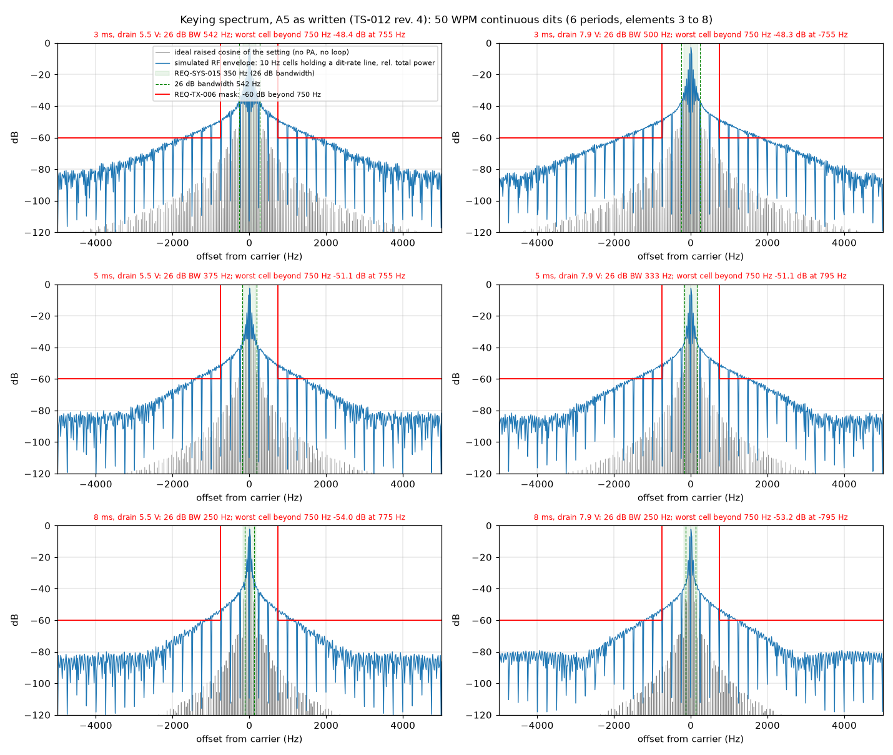

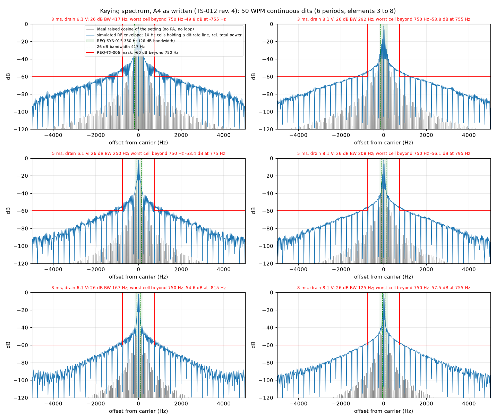

| As written (6 runs each) | A4 | A5 | Limit |
|---|---|---|---|
| 10-to-90 % rise / fall (3 ms setting) | 1.64 / 2.45 ms (6.1 V); 2.43 / 3.50 ms (8.1 V) | 1.31 / 3.39 ms; 1.40 / 3.66 ms | 3 +/-0.5 ms |
| Shape error, worst | 19.2 % | 27.1 % | 5 % |
| 26 dB bandwidth, worst (3 ms) | 417 Hz | 542 Hz | 350 Hz |
| 26 dB bandwidth at 5 ms | 250 / 208 Hz | 375 / 333 Hz | 350 Hz |
| Worst 10 Hz cell beyond 750 Hz | -49.8 dB | -48.3 dB | -60 dB |
| Level at the drive gate | -3.4 to +2.5 dBm | +5.3 to +9.9 dBm | -30 dBm (REQ-TX-014) |
| Overshoot | 0.00 dB | 0.01 dB | 0.2 dB |
| VGG maximum | 3.26 V (rail x 0.654) | 3.26 V | 3.5 V (A5) |
| Verdict | **FAIL** (REQ-SYS-014, 015, TX-005, TX-006, TX-014) | **FAIL**, worse than A4 | |

The ideal raised cosine of the same timing gives 292, 208 and 125 Hz and -74.0, -84.5 and -91.8 dB. The failures come from the loop, not from the envelope settings.

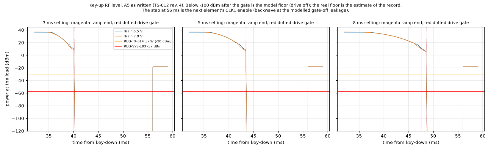

### 4.3 The mitigated loop: both finalists pass the keying criteria at every corner

The design changes are in section 5.2. Corners:
- nominal;
- the PA curve shifted by -0.1 and +0.1 V (module-to-module threshold spread; estimate);
- a residual loop offset of +1 and -1 mV (after the firmware zero calibration).

Each corner runs the 3, 5 and 8 ms settings at both drain voltages: 30 runs per finalist.

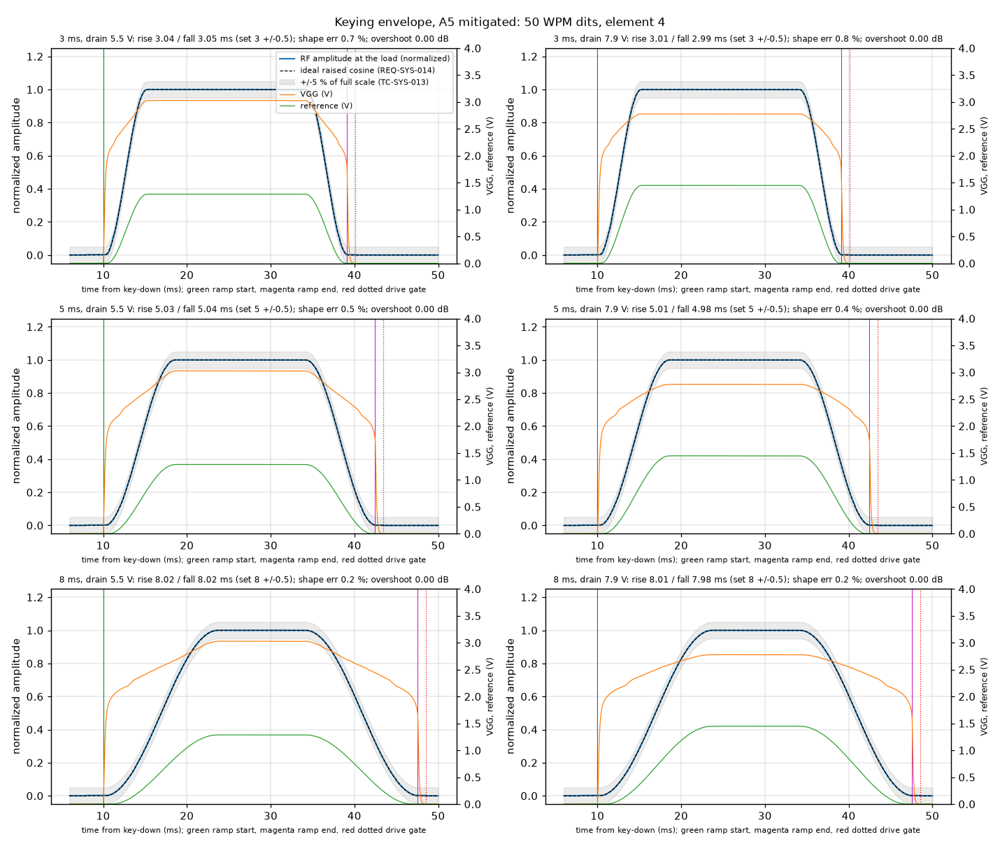

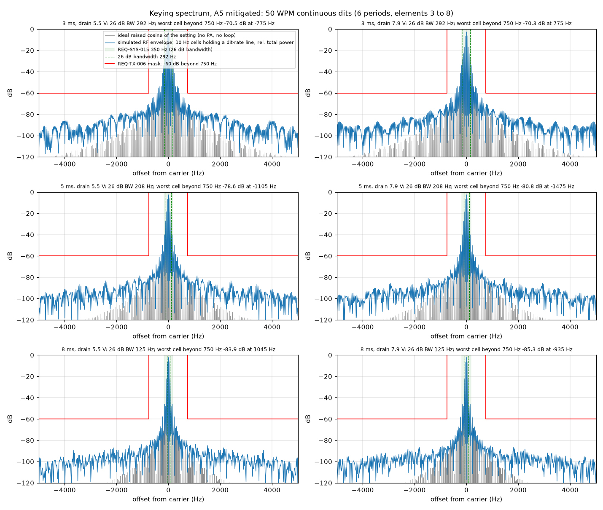

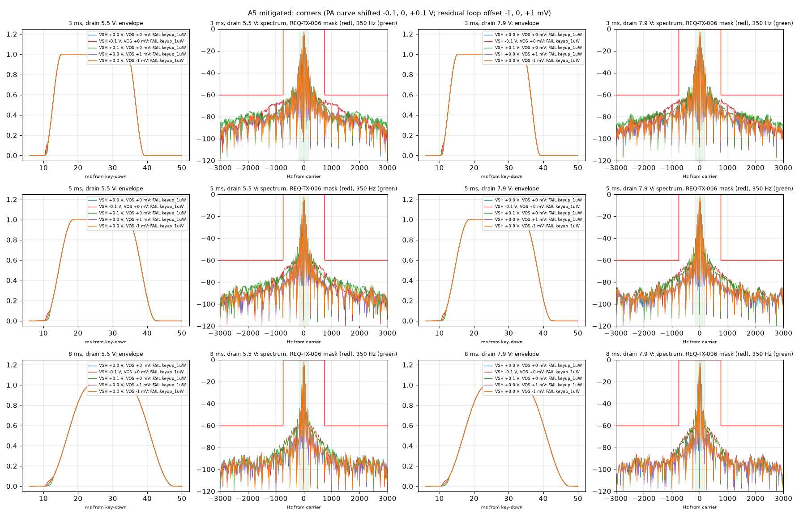

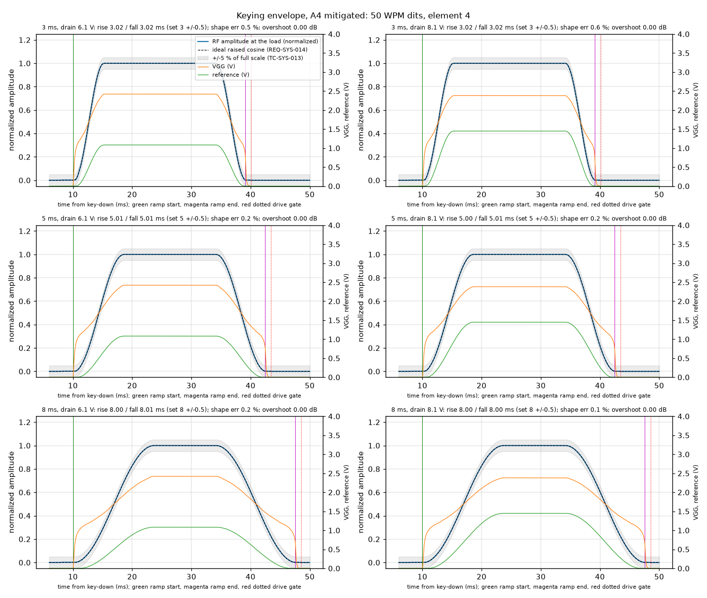

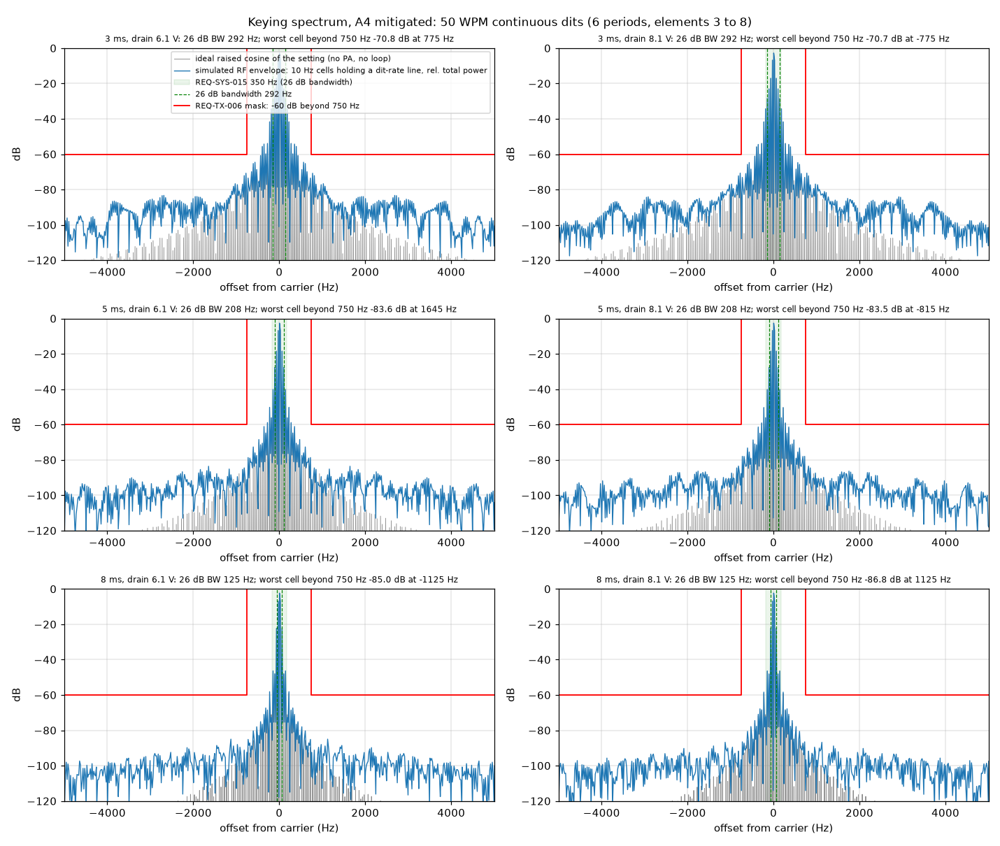

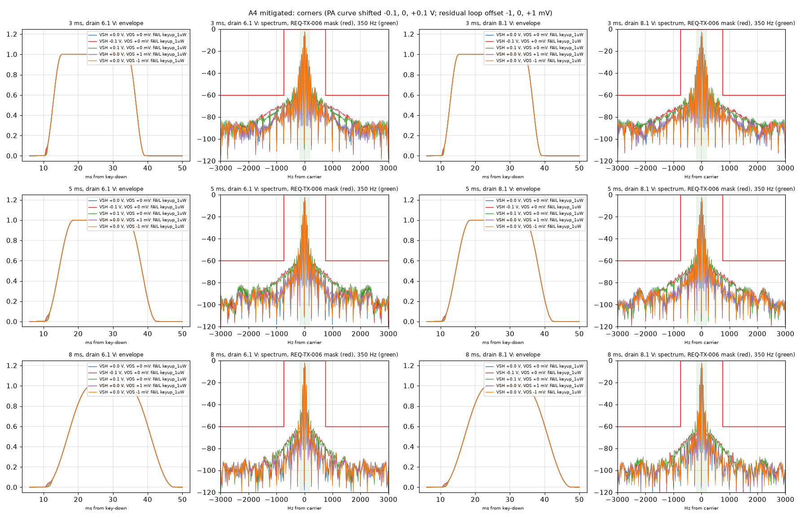

| Mitigated (30 runs each, worst over corners) | A4 | A5 | Limit |
|---|---|---|---|
| 10-to-90 % error, worst | 0.06 ms (3.06 ms at the 3 ms setting, +2 %) | 0.29 ms (3.29 ms at 3 ms, VGG curve -0.1 V: **+9.7 %**) | +/-0.5 ms (TC-SYS-013); +/-10 % (REQ-TX-005) |
| Shape error, worst | 2.5 % | 3.3 % | 5 % |
| 26 dB bandwidth (3 / 5 / 8 ms) | 292 / 208 / 125 Hz | 292 / 208 / 125 Hz | 350 Hz |
| Worst 10 Hz cell beyond 750 Hz | -67.2 dB (3 ms, -0.1 V corner) | -64.1 dB (3 ms, -0.1 V corner) | -60 dB |
| Overshoot | 0.00 dB | 0.00 dB | 0.2 dB |
| Top power (set) | 2.90 W at 6.1 V (set 2.9 W); 5.00 W at 8.1 V | 4.00 W at 5.5 V (set 4.0 W); 5.00 W at 7.9 V | setpoint +/-0.5 dB |
| VGG maximum | 2.52 V | 3.13 V | 3.5 V (A5) |
| Loop contribution at the drive gate | below -73 dBm | below -100 dBm | |
| Level at the drive gate (with the modelled leakage) | -19.5 dBm | -17.5 dBm | -30 dBm |

- **Keying.** Both pass every keying criterion at every corner. The level at the gate is then the modelled leakage alone (section 4.4). The gate step is -54 to -57 dB relative amplitude, and its splatter is inside the -60 dB result above.
- **Margin.** A5 has less margin than A4, for the same reason as in section 4.2. Its transfer is steeper (44 V of RF amplitude per volt of VGG at the steepest point, against 21 V/V for A4). So a threshold error in the feedforward shows more at the foot of the ramp, where the loop is still blind. At the 3 ms setting and the -0.1 V corner, A5's rise is 3.29 ms, 0.3 % inside REQ-TX-005's 10 % (TBR). A threshold spread beyond about 0.1 V would take it out.

Run results: `results/2026-09-28-a4-mitig/result.json`, `results/2026-09-28-a5-mitig/result.json` (every run, every number, pass/fail per criterion).

### 4.4 RF level at key-up (REQ-TX-014) and after the drive gate (REQ-SYS-183)

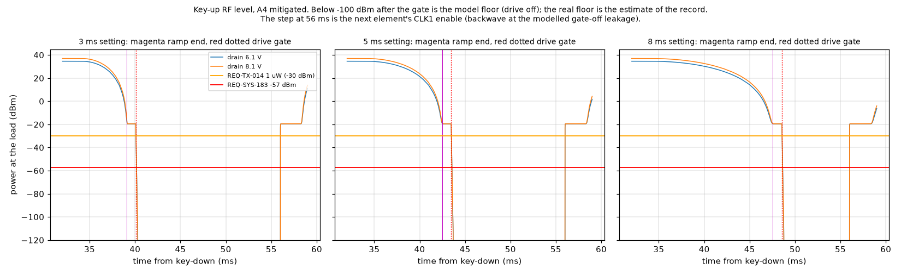

**REQ-TX-014** (1 uW, TX_KEY deasserted, PA_EN asserted, exciter driven). With the mitigated loop the PA is driven fully off within the 1 ms before the gate. The level is then the gate-off leakage of the PA with the exciter still driving it.

- **A4: FAIL (estimate).** Crss feedthrough gives -23 to -19 dBm, 7 to 11 dB over -30 dBm. The AFT05's gate bias cannot turn off the 0.1 W that the GVA-84+ drives through the 1.6 to 1.9 pF reverse capacitance.
- **A5: not shown.**
  - The datasheet's "up to 60 dB" isolation at VGG = 0 would give -47 dBm (13 dB of margin). The 30 dB that TS-012 assumes gives -17 dBm (13 dB over).
  - The module needs at least 43 dB of isolation with 20 mW in.
  - Neither figure is a guaranteed limit.
- **Both finalists:** the backwave at this level (-54 to -57 dBc) also appears for 2 ms before every element, between CLK1 enable and the ramp start (the step at 56 ms in the plots). It is inside the spectra of section 4.3.

**REQ-SYS-183** (-57 dBm after the gate: CLK1 disabled, GVA-84+ unpowered, relay then to receive). The decks set the drive to zero after the gate. The real floor is the path estimate below.

| Stage | A5 | A4 | Class |
|---|---|---|---|
| Si5351A CLK1 disabled, at its pin | -40 dBm | -40 dBm | E |
| Drive LPF | 0 dB | 0 dB | E |
| 18 dB input pad | -18 dB | -18 dB | R (TS-012) |
| GVA-84+ unpowered | -20 dB | -20 dB | E |
| 3 dB pad (A5) | -3 dB | n/a | R |
| PA with gate off | -30 dB (module, pessimistic end) | -39 dB (the Crss path above: -19 dBm out for +20 dBm in) | E |
| At the load | about -111 dBm | about -117 dBm | E |

Both are more than 50 dB under -57 dBm: met by estimate at either end of the ranges. Coupling paths that bypass the chain, such as the 144.000 MHz clock line, belong to WP-PDR-20. The tinySA check at the monitor port (TS-012 section 7.3) closes it.

### 4.5 PWM carrier ripple (analytic)

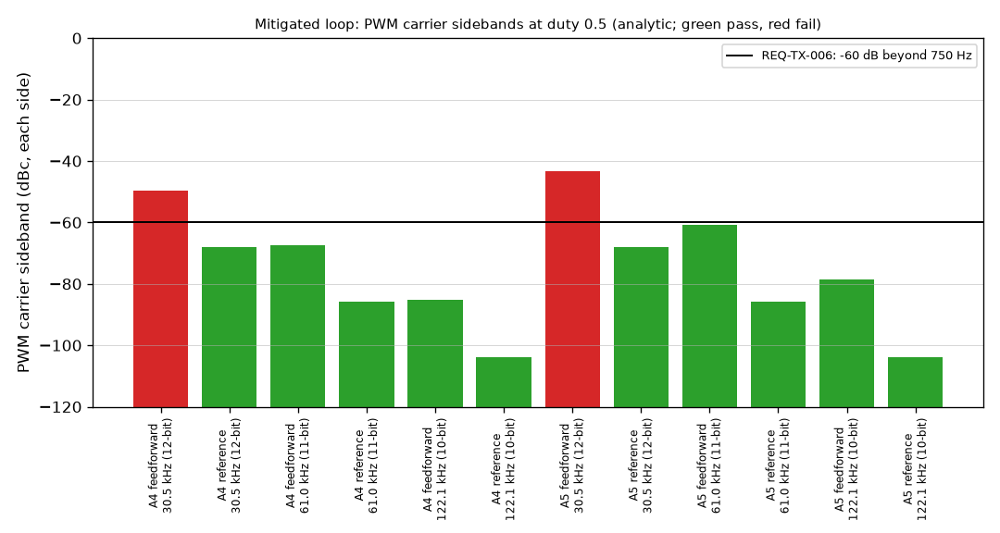

The decks carry the PWM duty staircase, not the PWM carrier. At the worst duty (0.5), the carrier's fundamental is 2.1 V peak before the 2-pole filter.

- **Feedforward channel.** It sets VGG directly, so its ripple modulates the RF through the PA slope. At 30.5 kHz (12 bits) the sidebands are at -43 dBc (A5) and -50 dBc (A4). Both fail REQ-TX-006, which counts every cell beyond 750 Hz.
  - At 61 kHz (11 bits): -60.7 dBc (A5, marginal) and -67 dBc (A4).
  - At 122 kHz (10 bits): -79 and -85 dBc.
- **Reference channel.** It is attenuated further by the closed loop: -68 dBc at 30.5 kHz.
- **Rule for the mitigated design.** The feedforward PWM runs at 122 kHz or faster, or its filter takes a third pole. A5 needs this more (its slope is 2.1 times A4's). Numbers: `results/2026-09-28-summary/summary.json` key `pwm_ripple`.

### 4.6 Loop margin of the mitigated loop (analytic)

First-order loop gain: trim gain x PA slope x detector slope / (s Rin Cf), with the VGG-node pole (17.7 us) and the detector video pole (4.7 us).

- At the steepest point of each transfer the crossover is 1.2 to 1.8 kHz and the phase margin is 76 to 80 degrees.
- Near 5 W the crossover is lower and the margin higher.
- Both finalists meet the TS-012 criterion of at least 45 degrees.

Numbers: `summary.json` key `loop_margin_mitigated`. A small-signal LTspice `.ac` of the circuit WP-PDR-22 draws replaces this before CDR.

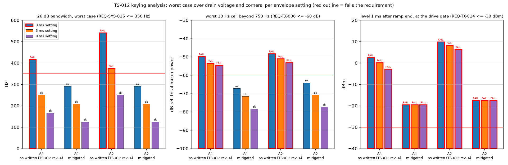

## 5. Verdicts and design changes

### 5.1 Verdict per finalist

| | A4 (AFT05MS004N) | A5 (RA07M1317M) |
|---|---|---|
| Keying loop as written in TS-012 revision 4 | **FAIL**: REQ-SYS-014, REQ-SYS-015 (3 ms), REQ-TX-005, REQ-TX-006, REQ-TX-014 | **FAIL**, worse: bandwidth 542 Hz, sideband -48.3 dB, +9.9 dBm at the gate |
| With the section 5.2 changes | **PASS** REQ-SYS-014, 015, TX-005, TX-006 at every corner, with margin (-67.2 dB, +2 %) | **PASS** at every corner, with thin margin on REQ-TX-005 (+9.7 % against 10 %) and less on REQ-TX-006 (-64.1 dB) |
| REQ-TX-014 (1 uW, exciter driven) | **FAIL by estimate** (-23 to -19 dBm, Crss path); needs a design or requirement change (section 8, item 4) | **Not shown**: depends on the module's VGG-off isolation (needs 43 dB; datasheet "up to 60 dB", not a limit) |
| REQ-SYS-183 (-57 dBm, RF ended) | Met by estimate (about -117 dBm) | Met by estimate (about -111 dBm) |
| Keying discriminator for TS-012 | Better: shallower transfer, more margin at every keying criterion | Worse on keying margin; possibly better on REQ-TX-014 if the module isolation is near its 60 dB |

**Reading for the TS-012 choice.**
- Keying does not rule out either finalist, once the loop is changed as in section 5.2. Both need that change: the loop as written fails for both.
- On keying alone A4 has the margin, and A5 carries the TS-012 envelope-loop risk (section 7.1, 6 Yellow) more strongly than scored. That risk's likelihood is 2 as written; this analysis shows the as-written loop fails, so without the changes it is a certainty.
- REQ-TX-014 goes the other way: A4 fails it by estimate unless the requirement or the drive gating changes, while A5 may meet it.
- The author's reading: the keying result moves neither C5 nor C8 of TS-012 by a full point on its own. It adds a common design change and two open items to either choice (section 8).

### 5.2 Design changes that make the keying pass (both finalists; for WP-PDR-22 and the re-baseline)

1. **Feedforward VGG (VGS) table on a second PWM channel.**
   - It gives the nominal inverse PA curve for the wanted amplitude at the measured pack voltage. It is summed into the VGG node.
   - The PWM runs at 122 kHz (10 bits) or takes a third filter pole (section 4.5).
   - For A5, the channel is scaled so that its full scale plus the trim authority stays at or under 3.46 V, for example 3.3 V x 0.9 = 2.97 V plus 0.25 V. The WP-PDR-22 clamp analysis then covers the sum.
   - Cost: a Pico GPIO (pin budget to confirm) and an RC network, plus a buffer that may need the spare MCP6002 half (see item 2).
2. **The loop becomes a bipolar trim of +/-0.25 V about mid-rail.**
   - It is a difference integrator with a clean reset at release. The simulation models it as an ideal integrator with rails; the circuit must not load the reference or the detector, as the first mitigated attempt with a shorted-capacitor reset did.
   - It replaces the idle-bias resistor, whose 10.6 mV offset is itself a cause of the blind zone.
   - The spare MCP6002 half that TS-012 keeps for the pack-dependent clamp fallback may be needed as the buffer. If both are needed, a third MCP6002 is USD 0.44 (A price in TS-012 section 8.3; estimate of the line), inside the contingency.
3. **Biased detector with a reference diode.**
   - The 1N5711W is forward biased at about 21 uA from the 5 V bus through 220 k, as a shunt detector with a 100 pF coupling capacitor.
   - A second 1N5711W with the same bias gives the zero and tracks its temperature slope. TS-012's spare 1N5711W is also claimed by the pack-dependent clamp fallback, so a ninth diode may be needed (USD 0.31 A price).
   - The resistors and capacitor are owned through-hole or 0805 values inside the E2 allowance.
4. **Reference table predistorted by the detector law.** Firmware only.
5. **Setpoint limited at the low pack end to what the PA can make.**
   - A5: 4.0 W at 6.4 V (within REQ-SYS-012's -1 dB).
   - A4: 2.9 W, which TS-012's REQ-SYS-012 delta for A4 already implies.
   - Without this the integrator winds up, whatever the loop topology.
6. **A firmware zero calibration of the loop offset** (to about 1 mV), done each over in the 2 ms lead-in with CLK1 on and VGG at 0.

## 6. Findings for TS-012 (to route to its next revision; INSP-110 may confirm)

- **F1.** The RA07M1317M transfer in TS-012 section 7.3 ("about 0 W at 1.5 V, 2 W at 2.5 V, 4 W at 3.0 V, 7 W at 3.5 V") does not match the datasheet graph of June 2019, page 5. The graph gives about 1.1 to 1.3 W at 2.5 V, 7.0 to 7.3 W at 3.0 V and 8.3 to 8.5 W at 3.5 V, at 135 and 155 MHz, 7.2 V, 20 mW. The dead zone runs to about 2.2 V, not 1.5 V. The real curve is steeper and saturates near 3.1 to 3.2 V. The 3.08 to 3.46 V clamp is therefore above the knee, which helps the REQ-SYS-012 check but makes the envelope harder to shape.
- **F2.** The key-up statement "the ramp takes VGG under 1.2 V (module output about 0 W)" does not hold for the loop as described: 2.1 V and +5 to +10 dBm at the gate (section 4.2).
- **F3.** The as-written loop fails the keying requirements for both finalists. The causes are the dead zone, the detector's blind zone, windup at the low pack end and the drive gating onto a non-zero tail. The WP-PDR-22 criteria in TS-012 section 7.3 are right, but the design needs the changes of section 5.2.
- **F4.** REQ-TX-014 was not assessed in TS-012 for A4. The Crss path puts A4 7 to 11 dB over by estimate.
- **F5.** The feedforward-channel PWM frequency is a keying-spectrum item (section 4.5), not only a clock-plan item. It belongs with ADR-031's PWM rules (WP-PDR-20).
- **F6.** The AFT05MS004N reference circuit's gate-bias bypass (10 uF and 1 uF, Table 10) and the RA07M1317M test circuit's 22 uF on VGG (datasheet page 7) must not be copied into the envelope path. Behind the 1.77 k divider they would make the VGG node time constant 20 to 40 ms. This analysis uses 10 nF (17.7 us).
- **F7.** The RA07M1317M's VGG input current is not specified. The RA30H1721M datasheet gives 1 mA typical at VGG 5 V (web search, 2026-09-28; https://www.glynstore.com/RA30H1721M-101/). If the RA07M1317M draws similar current, the TS-012 divider (2.7 k / 5.1 k) with a 5 k module input gives a ratio of 0.483 and a VGG maximum of about 2.5 V, too low for 5 W. The divider impedance must be sized for a measured or bounded input current (a WP-PDR-22 clamp item). This analysis neglected the current.

## 7. Limitations

1. **PA model.** The PA is a static transfer from datasheet graph reads (about +/-5 % in power, Low below 0.2 W). There is no AM-to-PM, no memory, no thermal drift of the threshold within an over, and no harmonic content during the ramp. A5 is the mean of the 135 and 155 MHz curves; A4 uses its 155 MHz curve. The VDD scaling is assumed shape-preserving.
2. **Below the graphs.** The sub-threshold slope is an estimate (100 dB/V). With the mitigated loop this matters only below the detector's -35 dB visibility, where the feedforward alone shapes the envelope. The corners show a 0.1 V threshold error there costs up to 3.3 % shape and 0.3 ms rise (A5). A different slope scales the same effect.
3. **Detector.** The diode is modelled with the HSMS-280x parameters (surrogate). The tap is this analysis's choice. The detector temperature drift and the mismatch of the two biased diodes are not simulated; the zero calibration of section 5.2 item 6 is assumed to hold the residual to +/-1 mV.
4. **Error amplifier.** The mitigated error amplifier is an ideal integrator with rails. The as-written one is a macro-model; the MCP6002 slew rate (0.6 V/us) is not limiting at these time scales.
5. **Leakage and the REQ-SYS-183 chain.** Both are estimates (section 4.4). Neither datasheet gives an isolation limit at gate-off.
6. **PWM ripple.** The PWM carrier ripple is analytic (section 4.5). The 12-bit staircase at 30.5 kHz is in the decks. The 10-bit, 122 kHz staircase recommended for the feedforward is not simulated; at 3.2 mV per step it adds about 0.3 dB of power per step in the exponential region.
7. **Relay.** Relay bounce and the late-contact fault case (12 ms) are not run here; they are WP-PDR-22 items. The nominal contact closes before CLK1 is enabled.
8. **Raw size.** The `.raw` files are large (up to 19 MB per run directory) because every step is kept, per the owner rule.
9. **The -60 dB offset.** For the ideal 3 ms envelope, this analysis finds every 10 Hz cell under -60 dB beyond 395 Hz. `regulatory-corpus-and-operators.md` F7 gives 614 Hz for the same case. The difference is the record length and window: an integer number of dit periods here; a radix-2 record in F7, whose rectangular-window leakage raises the far cells. The 26 dB bandwidths agree (292 Hz).

## 8. What closes before the order

1. **WP-PDR-22 adopts the loop changes of section 5.2**, or an equivalent that passes the same criteria.
   - The decks of this analysis are then rerun with the WP-PDR-22 circuit values: detector tap, divider sized for the module's VGG current (F7), feedforward scaling, and the actual difference-integrator circuit replacing the ideal model.
   - Plus the late-contact and open-loop fault cases. For A5 at the 3 ms setting, the rerun must hold REQ-TX-005's 10 % with the threshold spread the module lot shows.
2. **A5 only: bound the VGG input current and the threshold spread.**
   - Ask Mitsubishi, or plan to measure on receipt: VGG current with the owner's multimeter; the output-onset VGG with the NanoVNA and the dummy load at low drive.
   - The feedforward table is then calibrated per module (firmware), which the corners assume.
3. **A5 only: VGG-off isolation.** A NanoVNA S21 of the module with VGG = 0, VDD applied and 20 mW in, on receipt and before first on-air use.
   - Pass: at least 43 dB (REQ-TX-014 with 20 mW drive).
   - Otherwise the item 4 remedy applies to A5 too.
4. **REQ-TX-014 disposition (both; decisive for A4).** Either:
   - (a) make the GVA-84+ bias and CLK1 enable part of the TX_KEY path (drive removed whenever TX_KEY is deasserted), and restate REQ-TX-014's condition by CR, since the requirement's TBR says isolation depends on the PA topology; or
   - (b) keep the requirement and add a series drive switch (a cost line).
   Robin decides at the PDR memo on Claude's proposal (a).
5. **PWM rule.** The feedforward PWM runs at 122 kHz or takes a third pole (section 4.5); added to the WP-PDR-20 clock-plan PWM rules.
6. **Supporting bench checks at first power-on** (not before the order):
   - the tinySA at the monitor port for REQ-SYS-183 in each off state (TS-012 section 7.3);
   - logic capture of the ramp PWM steps (REQ-SYS-014 verification note).
   The tinySA Ultra is not yet bought (status note 2026-09-28); the owner buys it later.

## 9. References

- TS-012 revision 4, `docs/decisions/trade-studies/TS-012-design-to-cost-hand-built.md` (commit 7d0d450), sections 1, 7.1, 7.3, 8, 8.10.
- INSP-110 record, `docs/reviews/PDR/checklists/ts-012-design-to-cost.md` (finding-14 and finding-17; R-1 relay timing).
- Requirements at HEAD: `docs/requirements/sys/requirements.md` (REQ-SYS-014, 015, 183), `docs/requirements/tx/requirements.md` (REQ-TX-005, 006, 014); TC-SYS-013 in `docs/test_cases/sys/test_cases.md`.
- `docs/research/regulatory-corpus-and-operators.md` F7 (26 dB bandwidth of a raised-cosine keyed carrier); `docs/research/keyer-and-key-interfaces.md` F10; `docs/research/pa-device-candidates.md` F8, F10, F20.
- Mitsubishi RA07M1317M datasheet, publication Jun. 2019, https://www.mitsubishielectric.com/semiconductors/hf/products/datasheet/ra07m1317m.pdf (read 2026-09-28 through the web-fetch tool, which caches the PDF it reads).
- NXP AFT05MS004N datasheet Rev. 0, 7/2014, https://www.nxp.com/docs/en/data-sheet/AFT05MS004N.pdf (read 2026-09-28, same way).
- Avago/Broadcom HSMS-280x data sheet SPICE parameters, https://datasheet.octopart.com/HSMS-2800-BLKG-Avago-datasheet-7087620.pdf (web search result, 2026-09-28).
- Mitsubishi RA30H1721M gate current as listed at https://www.glynstore.com/RA30H1721M-101/ (web search result, 2026-09-28).
