# Harmonic low-pass filter analysis for the TS-012 finalists

| Field | Value |
|---|---|
| Product | Analysis note (08 section 3.4), WP-PDR-21 LPF item of TS-012 revision 4 section 7.3, PDR draft revision 1, 2026-09-28 |
| Author | Claude, analysis author (TS-012 discriminating analyses, owner approval of 2026-09-28: "you should go ahead and run the simulations and analysis", `docs/plan/status/status-2026-09-28.md` section 1) |
| Status | Draft, not reviewed. The values below are proposals until an independent review approves this record (plan rule C10) |
| Serves | TS-012 choice between A4 and A5 (C5 evidence, section 7.1 harmonic risks); REQ-TX-009, 010, 011 TBR values; REQ-SYS-017 and 018 pre-build supporting evidence; REQ-SYS-012 power budget of A5 (filter loss term); HZ-008 K1 |
| Model, checker, plots | `hardware/sim/tx-lpf/` (`lpf_model.py`, `run_lpf.py`, `retune_screen.py`, `README.md`); results under `hardware/sim/tx-lpf/results/2026-09-28-r1` to `r7` |
| Evidence status | Developer evidence. LTspice 26.0.2 through `tools/ltspice-batch.sh` blob `88b71475` (ACC-LTSPICE-001, every run's wrapper line in its `ltspice_provenance.txt`); venv Python 3.13.5 (TV-001), numpy 2.5.3, matplotlib 3.11.2, spicelib 1.6.3 (class B entries without a TV record of their own) |

## 1. Purpose

TS-012 revision 4 asks, before the order, for an LTspice run of the 7-pole Chebyshev harmonic low-pass filter (fc 165 MHz; BOM 22 pF, 68 nH, 39 pF, 82 nH, 39 pF, 68 nH, 22 pF; Coilcraft 1812SMS and 1206 C0G) with the inductor Q and self-resonance and the pad and via parasitics, with the pass criteria: at least 40 dB at 288 to 296 MHz, 35 dB at 432 to 444 MHz and passband loss at most 0.5 dB (section 7.3, WP-PDR-21). This note answers:

1. Does the filter as specified meet those criteria and REQ-TX-011 (40 dB from 576 MHz to 1.5 GHz), nominally and over component tolerance, with the catalog Coilcraft coils and with coils hand-wound from the owner's 24 AWG enamelled wire?
2. Combined with each finalist's PA harmonic levels, does the transmitter meet 47 CFR 97.307(e) at every power step and every instant of the keying envelope, and the REQ-SYS-018 60 dBc target at the 5 W step?
3. What must change or be decided before the order?

The limit used is the one 97.307(e) sets for a transmitter of mean power 25 W or less between 30 and 225 MHz: a spurious emission supplied to the antenna transmission line "must not exceed 25 uW and must be at least 40 dB below the mean power of the fundamental emission, but need not be reduced below the power of 10 uW" (`docs/references/md/regulatory/47cfr-97.307.md`, eCFR 2026-09-23). The 60 dB figure in the first sentence of (e) is for transmitters above 25 W and is not used. At every cwht power step (0.5 to 6.3 W with the +1 dB tolerance) 25 uW (-16.0 dBm) is the binding bound (53 dBc at 5 W); the 10 uW floor binds only below 0.25 W, which the keying-ramp check covers.

## 2. Method

1. **Decks.** Written by `run_lpf.py` from `lpf_model.py` and run only through `tools/ltspice-batch.sh`. AC analysis, 50 ohm source and load, 2 V source so that S21 = V(out) and S11 = V(in) - 1. Nominal deck: 0.5 to 1600 MHz in 0.5 MHz steps. Monte Carlo decks: 2 to 1600 MHz in 2 MHz steps (144, 148, 288, 296, 432, 444 MHz fall on the grid), 252 steps each: step 1 every L and C at -tol, step 2 every L and C at +tol (nominal parasitics), steps 3 to 252 uniform random draws of every parameter (numpy seeds 21001 to 21007, every value in `mc_values.csv` and bound into the deck by `table(run, ...)`).
2. **Filter topology with parasitics.** Each shunt capacitor: pad capacitance to ground in parallel with C + ESR + ESL + ground via inductance. Each coil: track inductance split both sides, L + R (R from the Q at 150 MHz) with Cpar across (Cpar from the self-resonant frequency) plus the pad-to-pad fringe. Mutual coupling between adjacent coils (K24, K46) and between the first and last coil (K26), and a direct input-to-output leakage capacitance, stand in for layout coupling.
3. **Known answers.** (a) The ideal exact-value filter against the analytic 0.1 dB Chebyshev: maximum error 0.0005 dB over 0.5 to 1600 MHz where the analytic value is under 150 dB (criterion 0.05 dB): **PASS** (run r1). The analytic values reproduce the adversarial C8 recomputation cited in TS-012: 47.9 dB at 288 MHz, 76.0 dB at 432 MHz. (b) For every Monte Carlo step, the L4 value that LTspice echoes by `.meas` equals `mc_values.csv`, and the `.meas` S21 at 288 MHz equals the `.raw` value read by spicelib within 0.001 dB: **PASS** in r2, r3, r4, r6, r7. (c) `retune_screen.py`'s ABCD model agrees with LTspice on the nominal 1812SMS build within 0.02 dB in the passband (-0.668 against -0.656 dB at 146 MHz; its model has no coupling or leakage).
4. **Metrics.** Insertion loss = -S21 (dB), the maximum over 144 to 148 MHz; its dissipative part |S21|^2 / (1 - |S11|^2) is reported beside it (the rest is mismatch from detuning). Attenuation per harmonic band = the minimum of -S21 over n x 144 to n x 148 MHz, n = 2 to 10.
5. **Harmonic budget (run r5).** Spur at the antenna = carrier at the step +1 dB + PA harmonic ratio - worst Monte Carlo attenuation in that harmonic band, for every step (0.5, 1, 2, 5 W at +1 dB) and n = 2 to 10, against the 97.307(e) limit at that carrier level; the 60 dBc target is checked as a ratio at the 5 W step; the keying ramp is checked at 400 instantaneous levels from 1 mW to 6.3 W with the limit at each level (the 10 uW floor included).
6. **Retune.** Run r2 showed the BOM filter's passband loss far above 0.5 dB, partly because the parasitics pull the cut-off down. `retune_screen.py` screened symmetric E24 value sets (ABCD model, stacked worst corner with every ESR at 0.4 ohm) for the lowest loss that keeps 45 dB at 2f and 40 dB at 3f; the set **18 pF, 68 nH, 33 pF, 82 nH, 33 pF, 68 nH, 18 pF** keeps the three BOM coils and changes only the capacitors (worst-corner screen 0.81 dB against 1.51 dB for the BOM; the best set found, 24/56/36/68, is 0.78 dB but adds a coil value). Runs r6 and r7 are the LTspice Monte Carlo of that set.

## 3. Inputs and sources

| Input | Value | Source and confidence |
|---|---|---|
| Filter design | 7-pole Chebyshev, 0.1 dB ripple, ripple cut-off 165 MHz, shunt C first; exact g-values give 22.8 pF, 68.6 nH, 40.4 pF, 75.9 nH | TS-012 section 7.3; g-values computed (C) |
| BOM values | 22 pF, 68 nH, 39 pF, 82 nH, 39 pF, 68 nH, 22 pF | TS-012 section 8.3 rows 4, 5 and E1 (D for the parts, the values are TS-012's) |
| Coilcraft 1812SMS-68N | L at 150 MHz, 5 % (J) or 2 % (G); Q typ 120, min 100 at 150 MHz; SRF min 1.5 GHz | Coilcraft Document 184-1, revised 12/02/21, read 2026-09-28 at https://www.coilcraft.com/getmedia/c6fe1f83-b176-469d-a071-e2edb068fef2/midi.pdf (D) |
| Coilcraft 1812SMS-82N | Q typ 120, min 100 at 150 MHz; SRF min 1.3 GHz | same (D) |
| 1812SMS model ranges | Nominal Q 100 (the minimum); MC Q 100 to 130; SRF from the minimum to 1.3 x the minimum (typical SRF not published) | Q range above typ and SRF spread (E) |
| 1206 C0G capacitors | KEMET C1206C220J1GACTU and C1206C390J1GACTU: J = +/-5 % | part number (D) |
| Capacitor ESR and ESL | ESR 0.1 to 0.4 ohm (nominal 0.2); ESL 0.6 to 1.2 nH (nominal 1.0) | typical published ranges for 1206 C0G MLCCs at 100 to 500 MHz; KEMET K-SIM not read (E) |
| Ground via of each shunt C | 0.27 nH (two vias, 0.8 mm board) to 1.30 nH (one via, 1.6 mm board); nominal 0.85 nH | closed form L = 0.2 h (ln(4h/d) + 1) nH, d 0.3 mm (C); board thickness not yet fixed |
| Node pad capacitance | 0.17 to 0.53 pF (1206 pad plus one or two coil pads, 1.6 or 0.8 mm FR4, er 4.5) | parallel-plate (C); er 4.5 (E) |
| Track inductance per coil | 0.5 to 2.0 nH (nominal 1.0) | (E) |
| Pad-to-pad fringe across a coil | 0.02 to 0.08 pF | (E) |
| Coil coupling | adjacent 1812SMS 0 to 0.01, air coils 0 to 0.03; first to last coil 0 to 0.003 (1812SMS), 0 to 0.006 (air) | (E), parallel axes 8 to 10 mm apart |
| Input-to-output leakage | 0.5 to 5 fF (nominal 2 fF) | (E), end pads over a bottom ground pour; this term sets the stopband floor above about 600 MHz |
| Air coils, 24 AWG | wire 0.511 mm bare (ASTM B258, D), 0.56 mm with enamel (E); wound on a 3.0 mm drill shank at 1.0 mm pitch, leads 3 mm: 68 nH = 6.75 turns, 82 nH = 8 turns (calculated 69.6 and 84.5 nH, set by squeezing on the NanoVNA) | Nagaoka (Lundin form) with Rosa's correction (C) |
| Air-coil Q and SRF | Q about 217 and 223 at 146 MHz (skin effect x 1.8 proximity factor); self-capacitance 0.17 to 0.18 pF (Medhurst), SRF about 1.46 and 1.30 GHz; MC: Q 0.6 to 1.0 x, self-capacitance 0.5 to 1.5 x | (C) with Low confidence (E for the proximity factor) |
| Air-coil tolerance | as wound +/-10 % (run r3); aligned on the NanoVNA +/-3 % (runs r4, r7) | (E) |
| A5 PA harmonics | RA07M1317M: 2fo -25 dBc max, 3fo -30 dBc max at Pout 6 W, VDD 7.2 V, VGG adjusted | datasheet (Jun 2019) via `docs/research/pa-device-candidates.md` F8, F16 (D, guaranteed only at 6 W) |
| A5 at 0.5, 1, 2 W and ramp instants | 2f -17 dBc; 3f and above -25 dBc | (E): AN-VHF-053-A gate-ramp worst 2fo ratio (-17.4 dBc at 0.3 W, F4) applied to the module; 3f degraded 5 dB from the guarantee |
| A5 4f and above | equal to the 3f value of the step | (E), no data |
| A4 PA harmonics | AFT05MS004N: no vendor harmonic data (datasheet Rev. 0, 7/2014, searched 2026-09-28 at https://www.nxp.com/docs/en/data-sheet/AFT05MS004N.pdf: no harmonic or dBc entry). Taken at 2fo -15 dBc, 3fo and above -20 dBc at every step | F17 assumption for a raw single-ended class-AB stage (E, Low); the hand-derived match may give more |
| Power steps | 0.5, 1, 2 W (REQ-SYS-011) and 5 W (REQ-SYS-012), each at +1 dB | requirements (D) |

## 4. Results

### 4.1 Nominal (run r1)

| Build | IL max 144-148 (dB) | RL min (dB) | 2f (dB) | 3f (dB) | 576-1500 MHz (dB) | 7f (dB) |
|---|---|---|---|---|---|---|
| Ideal exact values | 0.100 | 16.4 | 47.9 | 76.0 | 94.5 | 129.4 |
| Ideal BOM values | 0.005 | 29.7 | 47.2 | 75.2 | 93.8 | 128.7 |
| 1812SMS with parasitics | **0.699** | 30.9 | 58.8 | 87.0 | 77.6 | 96.1 |
| Air coils with parasitics | 0.491 | 31.0 | 57.4 | 84.9 | 77.1 | 95.0 |

Loss decomposition of the nominal 1812SMS build: coil loss alone 0.42 dB, capacitor ESR alone 0.28 dB (estimate-driven). The parasitics raise the stopband attenuation near 2f and 3f (each shunt capacitor's ESL and via inductance resonate it at 590 to 790 MHz, so its reactance at 288 MHz is that of a capacitor about 15 to 30 % larger) and pull the passband edge down from about 170 to about 162 MHz, which raises the loss at 148 MHz. Above about 600 MHz the stopband floor is set by the assumed input-to-output leakage and coil coupling, not by the ladder.

### 4.2 Monte Carlo (runs r2, r3, r4, r6, r7; 252 steps each)

| Run | Build | IL median / worst (dB) | Dissipative part median / worst (dB) | RL worst (dB) | 2f worst (dB) | 3f worst (dB) | 576-1500 worst (dB) | 7f worst (dB) | All four criteria met |
|---|---|---|---|---|---|---|---|---|---|
| r2 | 1812SMS, BOM values | 0.76 / **1.21** | 0.71 / 0.96 | 11.4 | 54.4 | 75.4 | 66.6 | 82.9 | 0 % |
| r3 | Air, as wound +/-10 %, BOM | 0.68 / **1.30** | 0.55 / 0.87 | 8.9 | 50.8 | 70.8 | 65.8 | 81.8 | 6.3 % |
| r4 | Air, aligned +/-3 %, BOM | 0.59 / **0.99** | 0.55 / 0.79 | 11.9 | 51.9 | 72.2 | 66.0 | 82.0 | 15.1 % |
| r6 | 1812SMS, retuned 18/33 pF | 0.52 / **0.71** | 0.49 / 0.63 | 12.6 | 44.8 | 71.3 | 69.0 | 87.9 | 36.5 % |
| r7 | Air, aligned +/-3 %, retuned 18/33 pF | 0.42 / **0.65** | 0.38 / 0.52 | 13.2 | 43.8 | 68.0 | 67.5 | 86.1 | 89.3 % |

**Stopband: PASS in every build** (worst 2f 43.8 dB against 40, worst 3f 68.0 against 35, worst 576 MHz to 1.5 GHz 65.8 against 40). **Passband loss: FAIL of the 0.5 dB goal at the worst case in every build**; only the retuned air-coil build meets it in most instances (median 0.42 dB). With the BOM values the 1812SMS filter misses 0.5 dB in every one of the 252 instances. The retune costs about 10 dB of 2f attenuation (54.4 to 44.8 dB worst for the 1812SMS build) and buys 0.24 dB of median loss and 0.50 dB of worst-case loss. Aligning hand-wound coils matters: as wound (r3) the worst loss is 1.30 dB and the worst return loss 8.9 dB.

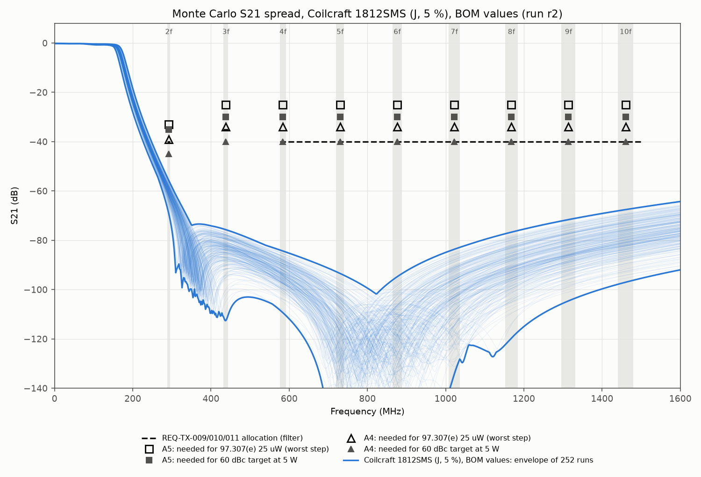

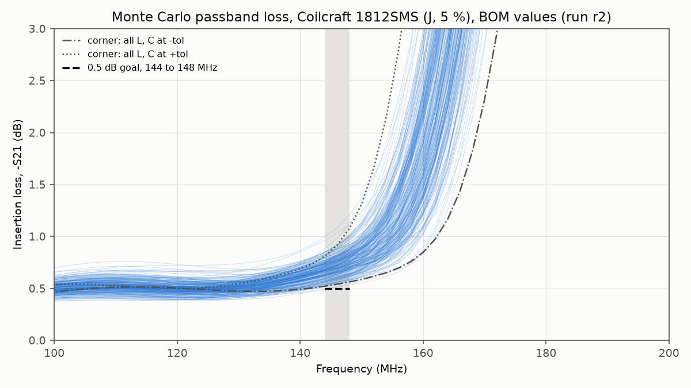

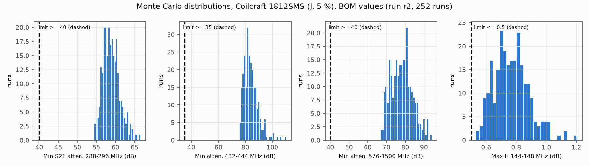

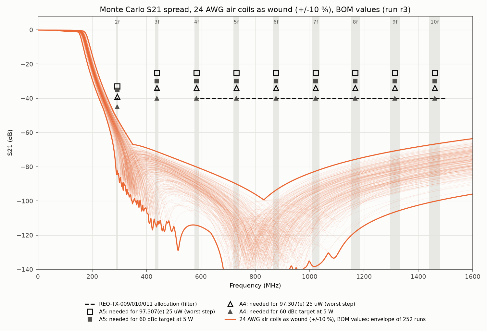

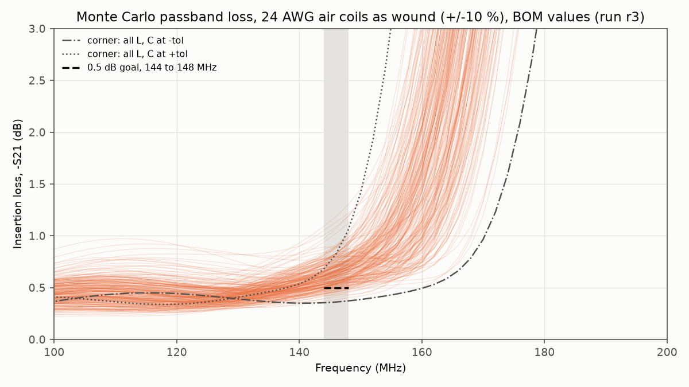

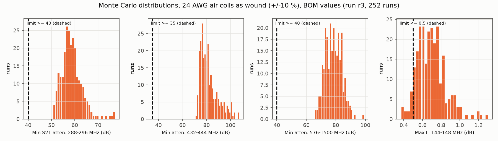

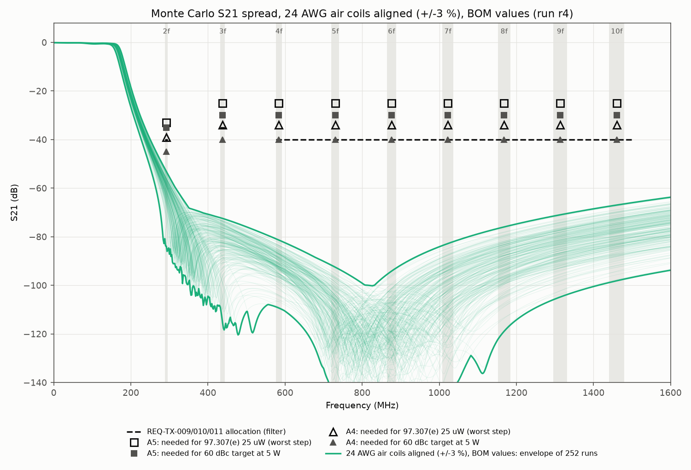

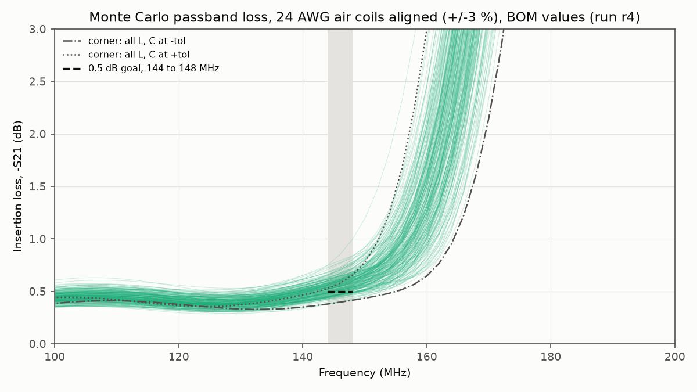

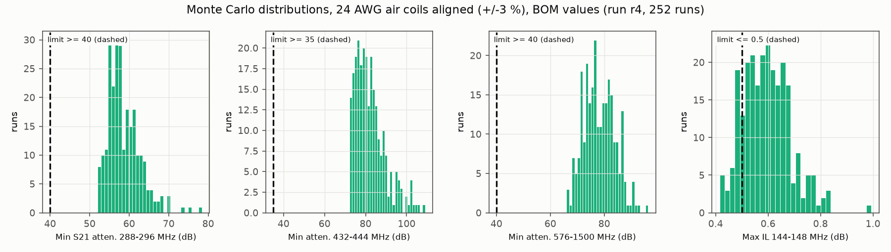

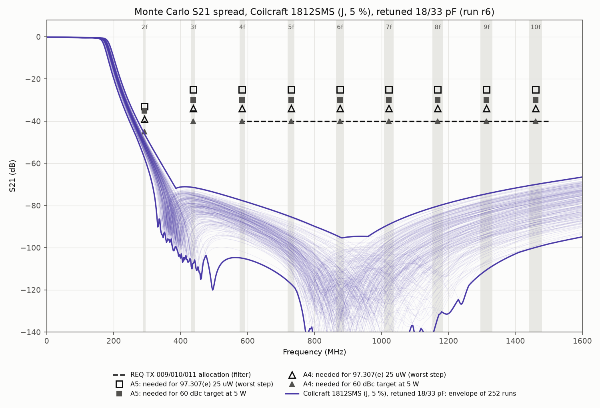

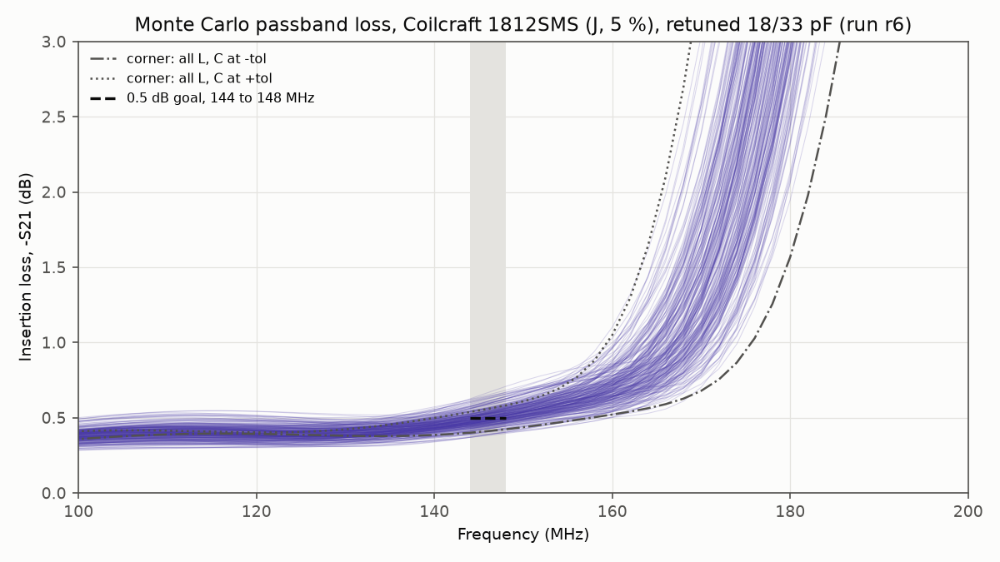

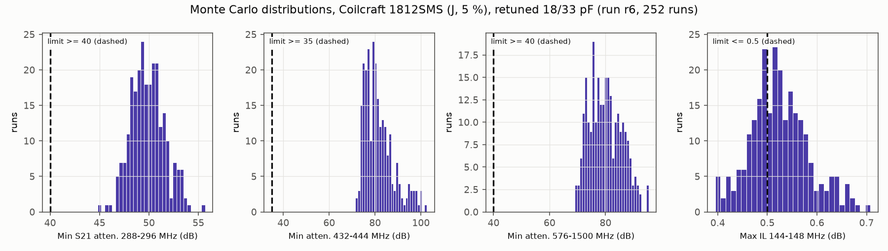

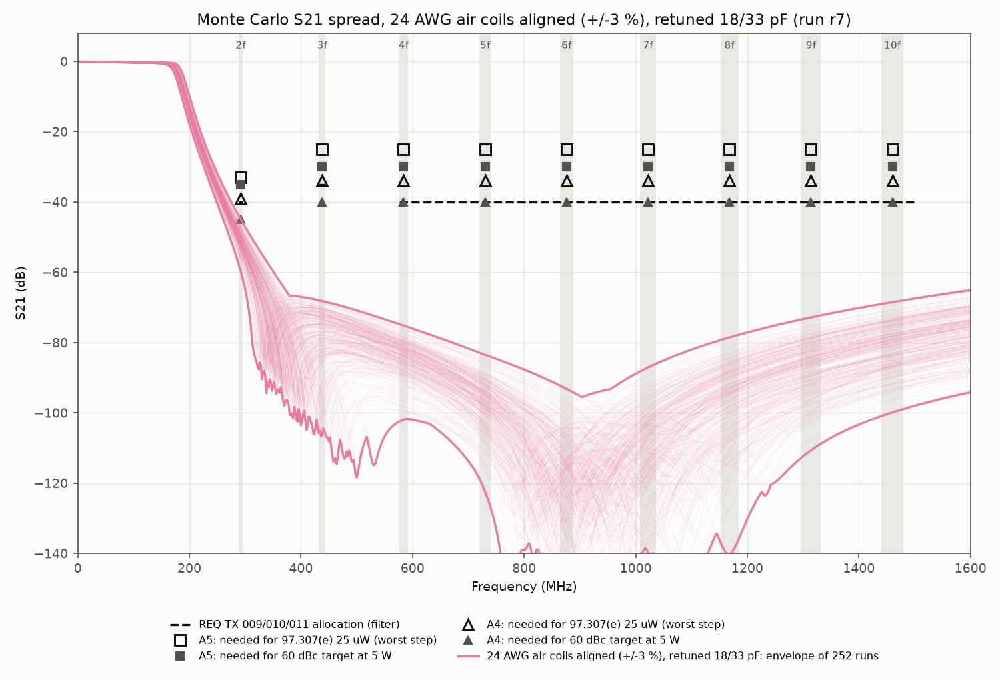

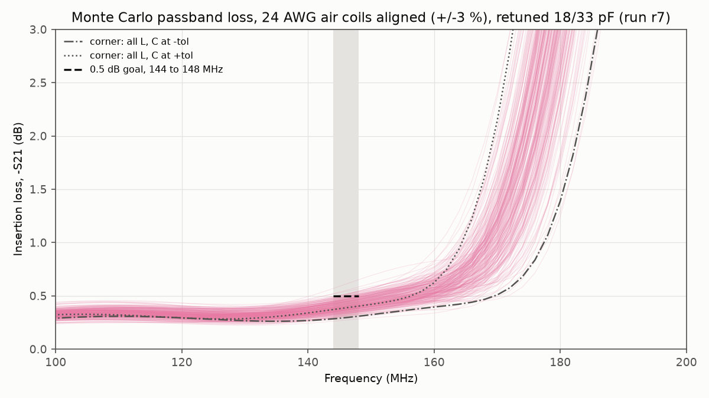

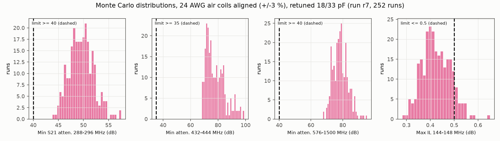

### 4.3 Harmonic budget per finalist (run r5)

Required attenuation (markers on the S21 plots): A5 needs 33 dB at 2f and 25 dB at 3f and above for 97.307(e) (worst step: 2 W with the -17 dBc estimate), and 35 and 30 dB for the 60 dBc target at 5 W; A4 needs 39 and 34 dB for 97.307(e), and 45 and 40 dB for the 60 dBc target (under the -15 and -20 dBc assumption).

| Finalist | Filter build | 97.307(e), every step: min margin (dB) | Every ramp instant: min margin (dB) | 60 dBc at 5 W: min margin (dB) |
|---|---|---|---|---|
| A5 | 1812SMS, BOM values | PASS, 21.4 | 18.4 | PASS, 19.4 |
| A5 | Air as wound, BOM | PASS, 17.7 | 14.8 | PASS, 15.8 |
| A5 | Air aligned, BOM | PASS, 18.9 | 16.0 | PASS, 16.9 |
| A5 | 1812SMS, retuned | PASS, 11.8 | 8.8 | PASS, 9.8 |
| A5 | Air aligned, retuned | PASS, 10.8 | 7.8 | PASS, 8.8 |
| A4 | 1812SMS, BOM values | PASS, 15.4 | 15.4 | PASS, 9.4 |
| A4 | Air as wound, BOM | PASS, 11.8 | 11.8 | PASS, 5.8 |
| A4 | Air aligned, BOM | PASS, 12.9 | 12.9 | PASS, 6.9 |
| A4 | 1812SMS, retuned | PASS, 5.8 | 5.8 | **FAIL, -0.2** |
| A4 | Air aligned, retuned | PASS, 4.8 | 4.8 | **FAIL, -1.2** |

The limiting order is 2f in every case (A5 at the 2 W step with the back-off estimate, A4 at the 5 W step). The 7f harmonic (1008 to 1036 MHz, aeronautical radionavigation, HZ-008) is at most -63.8 dBm at the antenna for A4 and -72.8 dBm for A5, at least 47.8 dB inside 25 uW.

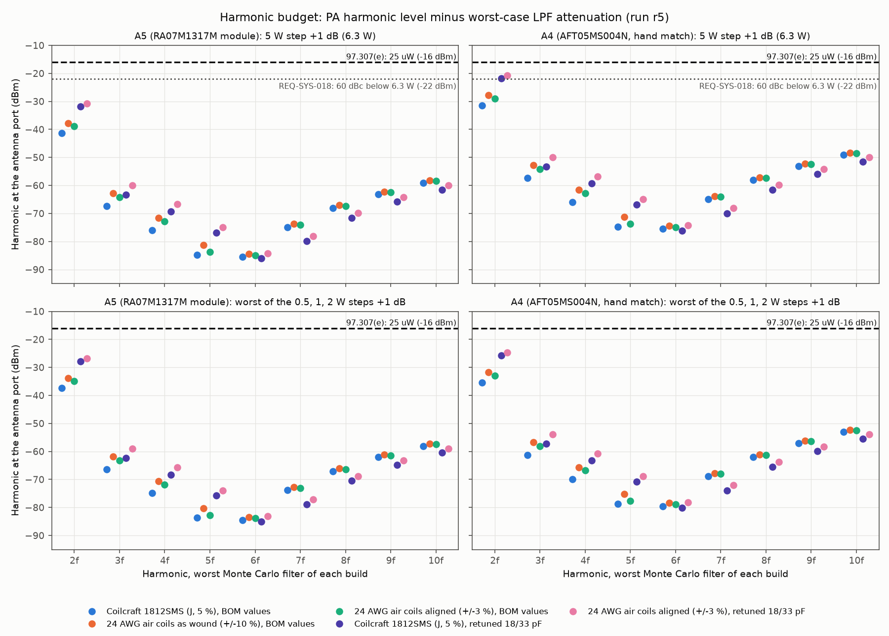

### 4.4 Consequence for the A5 power budget (REQ-SYS-012 at the 6.4 V pack end)

TS-012 section 7.3 gives 4.46 to 5.13 W at the module and subtracts 0.4 dB of LPF and 0.1 dB of relay loss: 3.97 to 4.57 W at the SMA against the 3.97 W floor (0.0 to 0.6 dB margin). With the loss found here (same module figures and relay loss; stacking the worst module corner with the worst filter is a bound, not a likely unit):

| Filter build | LPF loss used (dB) | Power at the SMA (W) | Margin to 3.97 W (dB) |
|---|---|---|---|
| TS-012 assumption | 0.40 | 3.97 to 4.57 | 0.0 to +0.6 |
| 1812SMS, BOM, median / worst | 0.76 / 1.21 | 3.66 to 4.21 / 3.30 to 3.79 | -0.35 to +0.25 / -0.80 to -0.20 |
| 1812SMS, retuned, median / worst | 0.52 / 0.71 | 3.87 to 4.45 / 3.70 to 4.26 | -0.11 to +0.49 / -0.30 to +0.30 |
| Air aligned, retuned, median / worst | 0.42 / 0.65 | 3.96 to 4.55 / 3.75 to 4.32 | -0.01 to +0.59 / -0.24 to +0.36 |

A4 already misses REQ-SYS-012 at 6.4 V (about 3.2 W, TS-012 section 7.1); the BOM-value filter that A4 needs (section 5) loses 0.36 dB (median) to 0.81 dB (worst) more than the 0.4 dB TS-012 allows for the filter, so that shortfall grows.

## 5. Verdicts per finalist

**A5 (RA07M1317M module, TCXO).**
- 97.307(e): **PASS** at every step and every ramp instant with every filter build. Margins at least 10.8 dB (steps) and 7.8 dB (ramp) with the retuned filter, 17.7 dB and 14.8 dB with the BOM values. The 5 W step rests on datasheet maxima; the lower steps rest on an estimate of the back-off harmonic ratio (-17 dBc).
- 60 dBc target at 5 W (REQ-SYS-018): **PASS**, at least 8.8 dB (retuned) and 15.8 dB (BOM), on the guaranteed maxima.
- WP-PDR-21 filter criteria: stopband **PASS**; passband loss **FAIL** of 0.5 dB at the worst case (retuned 1812SMS: median 0.52, worst 0.71 dB). A5 can take the lower-loss retuned values because its harmonics are guaranteed. The extra 0.1 to 0.3 dB over TS-012's 0.4 dB moves A5's REQ-SYS-012 margin at 6.4 V from 0.0 to 0.6 dB to about -0.3 to +0.5 dB (at risk, as TS-012 already carries it at Yellow 9).

**A4 (AFT05MS004N, hand-derived match, no TCXO).**
- 97.307(e): **PASS on an assumption**: margins at least 11.8 dB with the BOM values and 4.8 dB with the retuned values, under 2fo -15 dBc and 3fo -20 dBc, which no vendor data supports or bounds.
- 60 dBc target at 5 W: **PASS with the BOM values** (at least 5.8 dB), **FAIL with the retuned values** (-0.2 dB for 1812SMS, -1.2 dB for aligned air coils).
- WP-PDR-21 filter criteria: stopband **PASS**; passband loss **FAIL**. A4 must keep the higher-attenuation BOM values (median 0.76, worst 1.21 dB with 1812SMS), which adds to its REQ-SYS-012 shortfall. Its harmonic margin cannot be confirmed until the first article is measured on the tinySA, which the owner will buy later.

**Discriminator.** On the legal limit the filter does not separate the finalists: both pass. It separates them on evidence and on loss: A5 meets 97.307(e) and the 60 dBc target on guaranteed data with the lower-loss filter, while A4's verdict rests on an assumed harmonic level and forces the higher-loss filter. This supports the C5 scores of TS-012 (A5 5, A4 2) and the A4 harmonic Red (16) of section 7.1. It moves no score.

## 6. Limitations

1. **Capacitor ESR is an estimate** and carries 0.28 dB of the 0.70 dB nominal loss. KEMET's K-SIM data for the two part numbers were not read. At the low end of the range (0.1 ohm) the retuned 1812SMS loss would fall by about 0.1 dB.
2. **The Coilcraft SPICE and S-parameter models were not used.** Reading them needs a file download, which this task excludes. The coils are modelled from the datasheet table (Q at 150 MHz as a fixed series R, SRF as a parallel C). A fixed R gives a Q that rises with frequency, and near the SRF the lumped model is approximate.
3. **Air-coil Q, self-capacitance, tolerance and coupling are estimates** (Medhurst proximity factor, lumped self-capacitance). Wire lengths are 81 to 95 mm, so above about 1 GHz the coils behave partly as transmission lines, which the lumped model does not capture.
4. **Stopband floor above about 600 MHz is set by assumed layout terms** (input-to-output leakage 0.5 to 5 fF, coil coupling). Real board leakage, ground-return current paths and radiation from the coax and SMA are not modelled. A layout with more coupling could lower the 576 MHz to 1.5 GHz figure from about 66 dB toward the 40 dB goal. The NanoVNA bench cases TC-TX-009 to 011 close this, within the NanoVNA floor of about 70 dB.
5. **Terminations are 50 ohm.** The PA's output impedance at the harmonics and the antenna's impedance at the harmonics are not 50 ohm, so the attenuation in service differs from S21. This is standard practice, but it is a real gap.
6. **The PA harmonic levels at the lower steps and at 4f and above are estimates**, and for A4 at every step. The budget is only as good as those inputs. For A4 in particular, a raw 2fo worse than -15 dBc at 5 W would cut the margins one for one.
7. **Not modelled:** the relay contact (G5V-2) and the 40 dB monitor tap at the output (a 5 kohm-class tap loads 50 ohm by about 0.04 dB); temperature (C0G and air-core TCL are small); power handling (1812SMS Irms 2.5 A for 82 nH against about 0.36 A rms at 6.3 W in 50 ohm, more inside the ladder near the band edge; C0G 100 V rating against about 25 V peak at 6.3 W; neither is limiting).
8. **The 0.5 dB loss goal counts mismatch.** The dissipative part alone is lower (retuned 1812SMS: median 0.49, worst 0.63 dB).

## 7. What closes before the order

1. **Filter values (lead SE proposal, owner decision with the TS-012 choice).** If A5 is chosen: change BOM row 4 from 22 pF to 18 pF (KEMET C1206C180J1GACTU, same series) and row E1 from 39 pF to 33 pF (C1206C330J1GACTU). The coils are unchanged. Price and stock are read at the ordering gate, and no total should change. If A4 is chosen: keep the BOM values.
2. **Passband-loss criterion.** No build meets 0.5 dB at the worst case. The recommendation is to restate the WP-PDR-21 criterion as at most 0.75 dB worst case (TBR). Carry the found loss (0.52 dB median, 0.71 dB worst for the retuned 1812SMS build) into the A5 REQ-SYS-012 budget, and record the resulting -0.3 to +0.5 dB margin in the TS-012 risk row, where the feed-resistance check and the 25 mW drive lever of section 7.3 already sit. Alternatives, each needing a price read: higher-Q capacitors; or the owner's 24 AWG air coils aligned on the NanoVNA (r7: median 0.42 dB, worst 0.65 dB, at no parts cost but with winding and alignment effort, which is C4 in TS-012).
3. **Read the capacitor ESR.** Read the KEMET K-SIM ESR at 146 MHz for the two chosen values, or pick a part whose datasheet gives ESR, and rerun r6 with the read values (`lpf_model.CAP_ESR`).
4. **Layout rules for the RF board (inputs to the layout, checked at CDR):** two ground vias per shunt capacitor at its pad; a solid bottom ground pour under the filter; filter input and output at opposite ends with at least 20 mm between the end pads; adjacent coils at least 8 mm apart or at right angles; the trap footprint stays but is not needed on these results.
5. **REQ-TX-009, 010, 011 TBR values.** This analysis supports keeping 40 dB, 35 dB and 40 dB as the filter allocations. The worst Monte Carlo instances are 43.8 dB (retuned, 2f), 68.0 dB and 65.8 dB.
6. **Unchanged, after the order:** NanoVNA S21 on every unit (TC-TX-009 to 011, plus the passband loss at 146 and 148 MHz). The tinySA sweep before first on-air use (TS-012 section 7.3), which is the only closure for A4's harmonic assumption, waits for the tinySA purchase the owner has deferred.

## 8. References

- TS-012 revision 4, `docs/decisions/trade-studies/TS-012-design-to-cost-hand-built.md` (commit `7d0d450`), sections 1, 7.1, 7.3, 8 and 8.3.
- INSP-110, `docs/reviews/PDR/checklists/ts-012-design-to-cost.md`; adversarial C8 (LPF ideal attenuation) and the RF feasibility table in TS-012 section 9.
- 47 CFR 97.307, `docs/references/md/regulatory/47cfr-97.307.md` (eCFR issue 2026-09-23).
- REQ-SYS-011, 012, 017, 018 (`docs/requirements/sys/requirements.md`); REQ-TX-009, 010, 011 (`docs/requirements/tx/requirements.md`).
- `docs/research/pa-device-candidates.md` F4, F8, F16, F17.
- Coilcraft Document 184-1 and 184-2 (Midi Spring 1812SMS), revised 12/02/21, https://www.coilcraft.com/getmedia/c6fe1f83-b176-469d-a071-e2edb068fef2/midi.pdf, read 2026-09-28.
- NXP (Freescale) AFT05MS004N data sheet Rev. 0, 7/2014, https://www.nxp.com/docs/en/data-sheet/AFT05MS004N.pdf, read 2026-09-28.
- G. L. Matthaei, L. Young, E. M. T. Jones, Microwave Filters, Impedance-Matching Networks, and Coupling Structures, eq. 4.05-2 (Chebyshev prototype).

## Change log

| Revision | Date | Change |
|---|---|---|
| 1 | 2026-09-28 | First issue: runs r1 to r7 |
