# PA drive window and output power at the SMA, TS-012 finalists A4 and A5

| Field | Value |
|---|---|
| Product | Analysis note (08 section 3.4), WP-PDR-21. Revision 3, 2026-09-29: the A5 items of the PDR work plan revision 6 section 3.0 row 21 (wave W-A). Revisions 0 to 2 (2026-09-28): the pre-order item of TS-012 revision 4 (sections 7.3 and 8.12; TS-012 at commit `7d0d450`) |
| Author | Claude, analysis author. Revision 3: WP-PDR-21 in wave W-A, after the owner's decision A5 (TS-012 revision 7 section 10) and her direction of 2026-09-29 to start the PDR work at once (`docs/plan/status/status-2026-09-29.md` section 8). Revisions 0 to 2: the TS-012 discriminating analyses (owner approval of 2026-09-28, `docs/plan/status/status-2026-09-28.md` section 1 item 2) |
| Status | Draft, revision 3, frozen at F0 for its independent review (rule C2) by the commit that adds it. Revision 2 was reviewer APPROVED at INSP-114 iteration 3 (`f5960d3`); revision 3 also closes that review's lien, Minor finding-11 (section 9.0). INSP-114 has used its three iterations under rule C1, so the lead SE names the record that reviews revision 3. Review record of revisions 0 to 2: `docs/reviews/PDR/checklists/analysis-pa-drive-ts012.md` |
| Serves | Revision 3: CR-018 (the re-baseline CR, WP-PDR-53), rows REQ-SYS-012 and REQ-SYS-144 (plan section 3.0 row 21; rule C10, APPROVED before S1); TS-012 design items D-7, D-8, D-9, D-13, D-14 and follow-on decisions 2 and 6; inputs to WP-PDR-22 (the D-9 clamp), WP-PDR-20 (CLK1 swing at the tap), WP-PDR-24 (polyfuse) and WP-PDR-29 (TPM-015, TPM-004). Revisions 0 to 2: the TS-012 choice between A4 and A5; the TS-012 pre-order criterion "module input 10 to 30 mW at every corner"; REQ-SYS-012 (5 W +/-1 dB, TBR) supporting pre-build evidence, with REQ-SYS-114 (-10 to +45 C, TBR); TPM-015 and TPM-004; HZ-001 and HZ-003 (section 7.1) |
| Decks, scripts, results | `hardware/sim/tx-pa/` (README there). Revision 3: `run_a5_r3.py` (it imports the helpers of `run_pa.py`), `results/2026-09-29-r3-d6`, `-d7`, `-k1`, `-s2`, `-p4`, `-p5`, `-s3`. Revisions 1 and 2: `run_pa.py` (deck writer, runner through `tools/ltspice-batch.sh`, checker, plots), `digitize_ra07.py` and `digitize_aft05.py`, `data/`, `decks/`, `results/2026-09-28-r2-p1`, `-p2`, `-p3`, `-s1`, `results/2026-09-28-r1-d2` to `-d5` and `results/2026-09-28-d1-gva-model`. The revision 0 and revision 1 power and summary folders stay in place, superseded |
| Evidence status | Developer evidence. LTspice 26.0.2 through the accredited wrapper (ACC-LTSPICE-001, blob `88b71475`); Python 3.13 venv with numpy, scipy 1.18.1, spicelib 1.6.3 and matplotlib 3.11.2 (class B entries of `tools/toolchain.lock.md` section 2). Every PA and driver curve is a graph read of typical vendor data (estimate), unless a row says "datasheet minimum" or "datasheet maximum". Revision 3 adds datasheet reads of the DMP3099L, AO3400A, MF-R300 and Coilcraft 1812SMS (section R3.5). Every output figure is an estimate; sections 3 and R3.2 class each input. `.raw` files over 5,000,000 bytes stay in their run folders on the owner's Mac and are named in each folder's `raw.sha256` (CR-017) |

## R3. Revision 3: A5 as adopted (governs for A5)

On 2026-09-29 the owner chose A5 (TS-012 revision 7 section 10) and directed the PDR work to start at once and run continuously (status note 2026-09-29 section 8). The PDR work plan revision 6 (section 3.0, row 21) leaves WP-PDR-21 these A5 items in wave W-A: the D-7 select-on-test pad and the 17 mW reading characterization; the drive-chain rerun with C7, C10 and the D-13 drive bandpass; p1 to p3 with the chosen LPF build (D-14) and the read feed resistance. CR-018 carries the REQ-SYS-012 and REQ-SYS-144 rows from this record, so the record must be APPROVED before S1 (rule C10).

This section answers those items. Sections 1 to 9 stay as revision 2, the comparison of both finalists that INSP-114 approved at iteration 3 (`f5960d3`). A4 is not rerun, because it was not chosen. Where this section gives an A5 figure, it replaces the revision 2 figure. Two wording fixes in sections 2 and 4.4 close the INSP-114 lien finding-11 (section 9.0).

Runs: `hardware/sim/tx-pa/run_a5_r3.py` (it imports the revision 2 helpers and the GVA-84+ model from `run_pa.py`), with results in `results/2026-09-29-r3-d6`, `-d7`, `-k1`, `-s2`, `-p4`, `-p5` and `-s3`. `run_a5_r3.py all --expect` exits 0 against the verdict list of section R3.9. Every figure is an estimate unless a row says "datasheet".

### R3.1 Questions

1. **D-13.** With the 2-resonator drive bandpass in place of the 3-pole drive low-pass, is the module drive kept at 10 to 30 mW (the D-13 condition)? What does the bandpass do to the CLK1 pin load (DR-PAD-1, D-8), to the coax-length effect and to 3f?
2. **D-7.** Which pad set, and what in-service drive band, does the select-on-test pad give on the bandpass chain? What reading method gives the level at about 17 mW, and with what uncertainty against the +/-1.0 dB allocation?
3. **C2 and C7.** What do the datasheets give for the drain feed parts, and do the 1812SMS values exist?
4. **REQ-SYS-012.** With the adopted design (D-7, D-9, D-13, D-14, the read feed), what power reaches the SMA from 6.4 to 8.4 V pack in each REQ-SYS-114 case? This is the basis for the CR-018 row.
5. **REQ-SYS-144.** What text admits the drive pad selection with its reading limit?

### R3.2 Method and inputs changed in revision 3

| Input | Value used | Source and class |
|---|---|---|
| D-13 drive bandpass | Series 7.5 pF, resonator 47 nH parallel with 16 pF, coupling 2.4 pF, resonator 47 nH parallel with 16 pF, series 7.5 pF, then the 18 dB pad | `docs/design/analysis/spurs-ts012.md` option C10; `hardware/sim/freq/tx_spur_filters.cir` circuit B (D) |
| Bandpass coil | Coilcraft 1812SMS-47NG: 47 nH, G = +/-2 %, Q minimum 100 and typical 135 at 150 MHz, SRF at least 2.1 GHz (0.12 pF parallel), DCR at most 5.6 mohm | D: Coilcraft Document 184-1, "Midi Spring Air Core Inductors", read 2026-09-29 through the web-fetch tool (SHA-256 `e8ce1b27f9bea463...`). The spur note's Q 60 was an estimate |
| Bandpass capacitors | 16 pF at +/-2 % (G); 7.5 pF and 2.4 pF at +/-0.1 pF (B), because C0G tolerance below 10 pF is absolute; ESR 0.1 ohm; ESL plus via 1 nH on the shunt capacitors and 0.5 nH on the series ones | E: the tolerance codes (the parts are read at the ordering gate). The spur note's joint 2 % on every capacitor understates the 2.4 pF tolerance (+/-4.2 %) |
| Bandpass tolerance cases | nominal; every part low (L -2 %, 16 pF -2 %, 7.5 and 2.4 pF -0.1 pF); every part high; low with the coupling capacitor high; high with the coupling capacitor low; each with coil Q 100 and 135 | This note: the detuning and coupling directions |
| Transient length | 250 ns, with the DFT over the last three periods | The bandpass rings down with a time constant of about 2 Q_L / w, about 20 ns. At the 112 ns of revision 2 the drive read 0.2 dB high (scratch check at 112 and 400 ns). d7 checks 250 ns against 400 ns, together with the 10 ps step |
| Level reading at about 17 mW | Section R3.4: diode probe on the Fluke 174, forward drop at DC at two currents, reading equation with the conduction term, both polarities | k1 (LTspice RF and DC, surrogate diode) |
| Drain feed per part | Section R3.5 | D and G: DMP3099L, AO3400A and MF-R300 datasheets, read 2026-09-29 |
| Output loss (D-14) | 0.84 / 1.03 / 1.86 dB: the r13 build (BOM values, 2 % parts) at its Monte Carlo median (0.74 dB), its Monte Carlo 99th percentile (0.93 dB) and its searched worst case (1.76 dB), each plus the 0.1 dB relay. 1.34 dB (r14 worst case 1.24 dB plus the relay) is a lever | `lpf-ts012.md` revision 2 (`92e3805`) section 4, table of runs r13 and r14 |
| VGG clamp (D-9), as specified (p4) | At 6.4 V, VGG 3.30 to 3.50 V (window 0.20 V below its top). The top follows the pack voltage so that the highest corner at the -10 C start of a key-down makes 7.9 W open loop (0.05 dB under 8 W) at every pack voltage, capped at 3.50 V: 3.50 V up to 7.1 V, then falling to 2.859 V at 8.4 V. This is the most generous clamp that meets D-9's 8 W criterion. The circuit that realizes it is WP-PDR-22's | D-9 (TS-012 section 8.14) and C3; the top is solved per 0.1 V with the Python replica of the module model (`clamp_top_curve`) and tabulated in the deck |
| VGG clamp, scenario B (p5) | Ceiling at the 10 W maximum rating (9.9 W target) instead of the 8 W stability guarantee, and a 0.03 V window (a reference-based clamp: a 0.1 % shunt reference and 0.1 % resistors, about +/-0.3 %, plus the MCP6002 offset, est.). VGG 3.47 to 3.50 V at 6.4 V, top 3.50 V up to 8.0 V, then falling to 3.120 V at 8.4 V | This note's trade (section R3.6); an input to WP-PDR-22, not a design decision |
| Temperature cases, PA model, bus, efficiency | As revision 2 (sections 2, 3, 3.1), with the thermal-law check now at every pack voltage (finding-11 (ii)) | Revision 2 |

### R3.3 Drive with the bandpass (runs d6 and d7)

**Fixed 18 dB pad, 8100 corners (d6; 25 C):**

| Quantity | Min | Nominal | Max | Limit | Verdict |
|---|---|---|---|---|---|
| Power into the RA07M1317M input | 5.5 mW | 12.5 mW | 39.1 mW | 10 to 30 mW | **FAIL**: 1356 corners under 10 mW, 565 over 30 mW |
| Same, TS-012 criterion corners | 7.8 mW | - | 30.3 mW | 10 to 30 mW | FAIL |
| 3f at the GVA-84+ input | - | - | -33.8 dBc | at most -25 dBc | **PASS** (+8.8 dB) |
| GVA-84+ input / output | - | - | -6.2 / +18.9 dBm | below +13 dBm / P1dB min +19.4 dBm | **PASS**; 0.5 dB of back-off at the highest corner |
| CLK1 pin, equivalent shunt capacitance at f | -0.5 pF | - | 11.0 pF | at most 15 pF (Table 7) | **PASS** at every corner |
| CLK1 pin, impedance magnitude at f | 34 ohm | - | 76 ohm | - | informative |
| CLK1 swing at the prescaler tap | 1.33 Vpp | - | 3.40 Vpp | - | input to WP-PDR-20 (below) |

Corner definitions as section 4.2, plus the bandpass case and coil Q. The nominal corner (nominal parts, Q 100) is 12.5 mW, 0.38 dB above the low-pass chain's 11.4 mW. The lowest corner is the revision 2 lowest part corner (148 MHz, 15 cm) with every bandpass part high, the coupling capacitor low and Q 100. The highest is the revision 2 highest part corner (144 MHz, 5 cm) with every part low and Q 135.

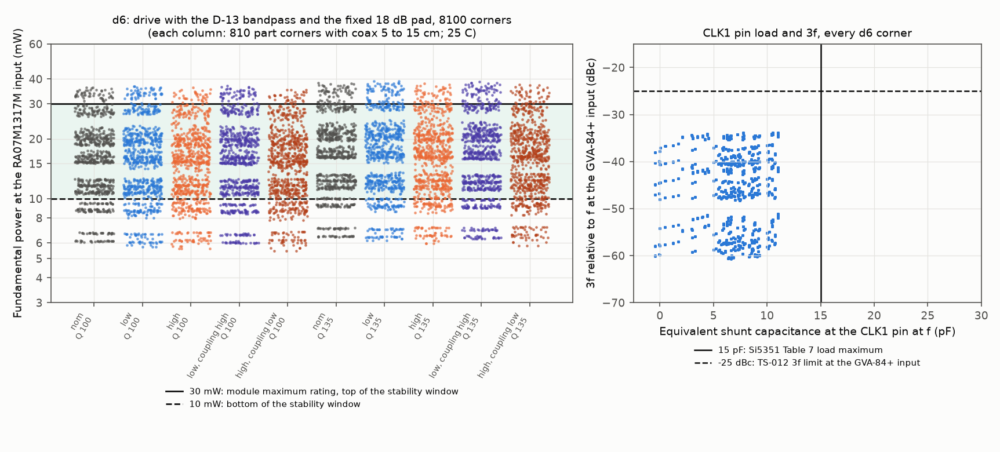

What the bandpass changes:
- **The D-13 condition is met only with the select-on-test pad.** With the fixed 18 dB pad the spread is 8.5 dB against a window of 4.77 dB, about as wide as the low-pass chain's 8.2 dB. The highest corner is 1.0 dB above the low-pass chain's, because the bandpass input is close to 50 ohm in band, so a 25 ohm source delivers more. D-13 therefore depends on D-7, and D-7 on the reading of section R3.4.
- **The CLK1 pin load is inside Table 7.** In band the bandpass looks like about 50 ohm, so the coax is close to matched and the pin sees -0.5 to 11.0 pF equivalent, against 13.6 to 24.7 pF with the low-pass (section 4.2). DR-PAD-1's out-of-table load, which D-8 accepted with D-7 as the control, is gone with D-13. The d5 pin pad is not needed.
- **The coax length hardly matters.** Over every electrical length (0.5 to 70 cm, d7) the fixed-pad drive spans 6.0 to 38.7 mW. The low-pass chain spanned 5.4 to 48.6 mW. Between 5 and 15 cm a unit's drive moves by at most 0.43 dB, against 0.90 dB with the low-pass (d6). The pad losses the units need are 13.90 to 21.92 dB at any length, inside the 14-pad set of section R3.4. The revision 2 note that the set grows by one pad past 15 cm no longer applies.
- **The in-unit frequency span grows.** Within one unit the drive varies over 144 to 148 MHz by up to 1.13 dB, against 0.34 dB with the low-pass. The cause is the "every part high" cases: a 2 % detuning moves the band down by about 3 MHz, so 148 MHz sits on the upper skirt. With nominal parts the span is at most 0.29 dB. This is the largest term of the select-on-test band (section R3.4).
- **3f improves** from -30.9 to -33.8 dBc at the worst corner.
- **The lowest CLK1 swing falls** from 1.66 Vpp (section 4.7) to 1.33 Vpp, because the pin now sees a resistive load of 34 ohm at its lowest. The midpoint-biased 74LVC1G80 tap then has about 0.13 V of total margin across its 0.8 V to 2.0 V thresholds. This is a request to WP-PDR-20 (C9, section R3.7).
- **Numerical check (d7).** 15 corners at a 10 ps step and 400 ns length against d6's 20 ps and 250 ns: at most 0.0028 dB in power and 0.040 dB in 3f (criteria 0.02 and 0.5 dB): **PASS**.

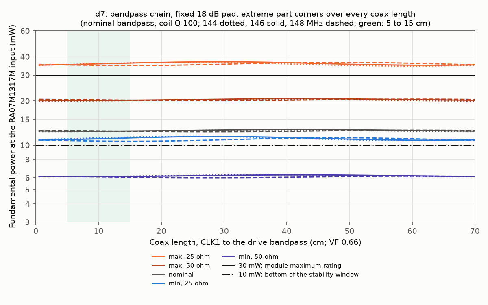

### R3.4 The select-on-test pad and its level reading (runs k1 and s2)

**The reading method (proposed for D-7 and REQ-SYS-144).** At build the module is replaced by a 50 ohm 1 % load at its input pad, with the unit's own coax and bandpass in place. A 1N5711-class probe across that load (series diode, 10 nF hold capacitor) is read on the owner's Fluke 174. The Fluke 174 reads DC volts to +/-(0.15 % + 2 counts), from its published specification (status note 2026-09-28 section 2). Its 10 Mohm input resistance is the 170-series nominal and was not read; the method cancels it, because the same meter is the probe's DC load in every step.

The forward drop is measured on the same probe, with the same meter, the same day and within 5 K of the RF reading:
- (a) a bench supply through the diode into the Fluke alone, set so that the Fluke reads the RF reading's value: Vf1 = Vs - Vout at the meter's own current;
- (b) the same with a 1.00 Mohm 1 % resistor across the Fluke: Vf2 at 11 times that current.

The two points give the diode ideality n. Is is eliminated, and the "-1" of the diode law is kept, because at about 0.12 uA the diode is only a few times its saturation current. The simple (Vf2 - Vf1) / (Vt ln 11) gave n as low as 0.66 for a 1.08 diode in a first check.

The reading equation is the periodic steady state of the peak detector, with the average diode current equal to the DC load current at both the RF and the DC point: I0(Vpk / n Vt) = exp((Vdc + Vf1) / n Vt). It is solved for Vpk, and P = Vpk^2 / 100.

The probe is read in both polarities, with the diode reversed, and the two peaks are averaged (method M2). This cancels even-harmonic content (GVA-84+ 2f, Si5351 2f at duty 0.45) to first order.

**k1 (LTspice).** The RF periodic steady state was run in 9360 steps: 8 diode parameter sets around the HSMS-280x surrogate that the keying deck uses for the 1N5711W (Is x0.1 and x10, N 1.00 and 1.15, Rs 10 and 50 ohm, Cjo 2.2 pF), 10, 17.3 and 30 mW, harmonic cases (none, 2f or 3f at -30 dBc in or out of phase with the peak), both polarities, and a grid of hold voltages. The DC forward drop was swept at 20, 25 and 30 C, the RF reading being at 25 C. For each case the checker solves the hold voltage at which the average diode current equals the meter current.

| Reading | Error, read minus true (dB) |
|---|---|
| M0: revision 2's "forward drop measured at DC" alone, Vpk = Vdc + Vf1; 25 C, no harmonic | -0.73 to -0.42 |
| M1: with the conduction term (the reading equation above); 25 C, no harmonic | -0.05 to +0.01 |
| M1, every case (harmonics, DC characterization at 20 and 30 C) | -0.36 to +0.34 |
| M2 (M1 in both polarities, averaged), every case | -0.34 to +0.32 |

Terms added in the worst direction:
- the Fluke 174, on three readings: 0.07 dB;
- n from the two DC readings (2 counts each): 0.19 dB;
- the 1 % load: 0.04 dB.

**The reading bound is +/-0.64 dB (method M2; +/-0.67 dB for M1), inside the +/-1.0 dB allocation.** The largest terms are an odd harmonic at the -30 dBc bound (+/-0.27 dB; d6 gives at most -33.8 dBc of 3f at the GVA-84+ input, and the GVA-84+'s own 3f at +15 dBm out is about -50 dBc from its +35.8 dBm OIP3, est.), a 5 K offset between the DC characterization and the RF reading (+/-0.07 dB), and the n reading.

**Revision 2's method is withdrawn.** Without the conduction term the probe reads low by 0.42 to 0.73 dB (0.87 dB with 3f against it). A pad chosen on that reading would set the drive up to 0.87 dB above its target, toward the 30 mW rating.

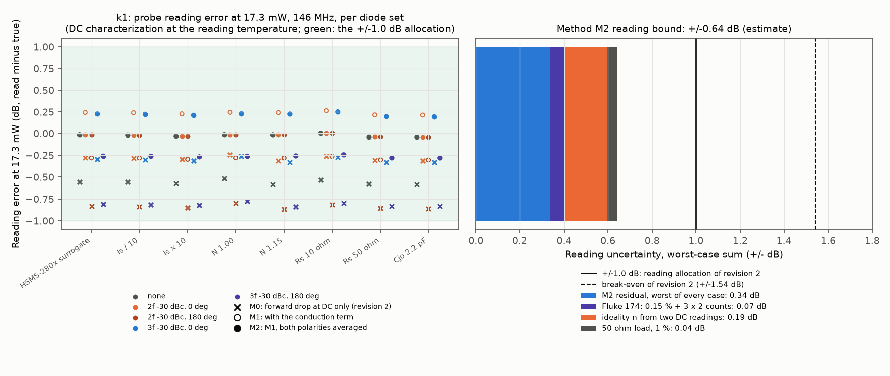

**s2 (select-on-test band on the bandpass chain).** The 2700 units of d6 (every part corner, coax length, bandpass case and Q) need pad losses of 13.82 to 21.87 dB. The pad set is the revision 2 set: 14 E24 1 % pi pads from 13.48 to 22.04 dB, largest gap 0.77 dB (table in section 4.2; return loss at least 25 dB). In service:

| Term | dB |
|---|---|
| Frequency, half the in-unit span (144 to 148 MHz) | 0.57 |
| Half the pad set's largest gap | 0.38 |
| Level reading, k1 method M2 | 0.64 |
| Drift: revision 2 terms (0.30 dB), plus the bandpass coil's TCL (at most +70 ppm/C, Document 184-1) over the PA-bay air range (0.09 dB) | 0.39 |
| **Half-width, worst-case sum (RSS)** | **1.98 (1.01)** |

In-service drive: **11.0 to 27.3 mW: PASS** (estimate), with an overdrive margin of +0.41 dB (+1.38 dB RSS) and +0.40 dB above 10 mW. The break-even reading is +/-1.05 dB. At the +/-1.0 dB allocation the band is 10.1 to 29.6 mW (+0.05 dB). The tinySA Ultra alone (+/-2 dB published) gives 8.0 to 37.3 mW (**FAIL**, -0.95 dB): it serves as a gross cross-check of the probe, not as the reading.

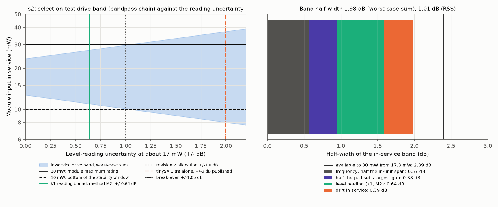

What stays open for C1: the probe is a surrogate model. The two DC points measure out the parts of the diode that matter most, Is and n, but Rs and Cj enter only as the k1 ranges. The bench confirmation is the 17 mW point of the RF probe characterization case (04 section 6.2). That case needs a reference level at 17 mW, and the owner has none: the NanoVNA is not a level reference. So the bench step can show only consistency: with the probe and the tinySA within their combined uncertainty, and with the M2 reading repeatable within 0.1 dB over the two polarities and two DC characterizations. The +/-0.64 dB bound therefore rests on this analysis, and C1's reading criterion is met by analysis with a Low to Medium confidence, not by measurement.

### R3.5 Datasheet reads (C2 and C7)

| Part | Read value | Used in p4 and p5 | Source |
|---|---|---|---|
| DMP3099L (P-FET pair in the drain feed) | RDS(on) at most 99 mohm at VGS -4.5 V and 65 mohm at -10 V; typical about 68 and 47 mohm at 2 A (Fig. 3); normalized RDS(on) 0.72 at -50 C, 1.55 at 150 C (Fig. 5) | Pair 0.110 ohm (typical at about VGS -6 V, between the curves, G) to 0.198 ohm (twice the -4.5 V maximum, the bound for a gate drive of 5.9 to 6.4 V, D); +0.44 %/K above 25 C and +0.37 %/K below (G) | Diodes Inc. DS36081 Rev. 5-2, May 2025 (SHA-256 `06f30303...`) |
| AO3400A (N-FET pair) | RDS(on) at most 32 mohm at VGS 4.5 V and 26.5 mohm at 10 V; typical about 19 mohm (Fig. 3); normalized 1.70 at 150 C (Fig. 4) | Pair 0.038 to 0.064 ohm; +0.56 %/K | AOS Rev 3.1, July 2023 (SHA-256 `9c60d0b6...`) |
| MF-R300 (polyfuse) | Rmin 0.020 ohm, Rmax 0.050 ohm (as delivered), R1max 0.080 ohm (one hour after a trip or reflow), at 23 C; Ihold 3.00 A at 23 C, 2.49 A at 40 C, 2.31 A at 50 C, 2.04 A at 60 C, 1.83 A at 70 C | 0.020 to 0.080 ohm; coefficient +0.29 to +0.43 %/K below trip (est., no curve) | Bourns MF-R series REV. AR 09/26 (SHA-256 `d22f0f06...`) |
| Coilcraft 1812SMS | 47N, 68N and 82N exist in G (2 %) and J (5 %) tolerance; Q at least 100 at 150 MHz; SRF at least 2.1, 1.5 and 1.3 GHz; TCL +5 to +70 ppm/C | The D-13 coil (above); the LPF's 68 and 82 nH (D-14) exist, and their Q 100 in `lpf-ts012.md` is the datasheet minimum | Coilcraft Document 184-1 (SHA-256 `e8ce1b27...`) |

**C2 closes as FAIL.** With every part at its datasheet maximum or estimated upper value, the feed is 0.452 ohm at 25 C part temperature, against TS-012's 0.35 ohm criterion. With every part low it is 0.238 ohm, and halfway 0.345 ohm. The DMP3099L pair is the largest term: 0.198 ohm at its bound. A pair of at most 0.06 ohm (a part still to be selected, TS-012 revision 4's lever) brings the bound to 0.314 ohm. At key-down temperatures the bound is 0.532 ohm at 25 C, 0.614 ohm at -10 C and 0.565 ohm at +45 C.

**C7 closes (PASS).** The 82 nH value exists, and so does the 47 nH of D-13.

**Polyfuse at key-down (limitation 12 of revision 2, request to WP-PDR-24).** With the ALC at its top, the pack delivers up to 2.54 A at 25 C key-down and 2.48 A at +45 C key-down (p4, design corners, over 6.4 to 8.4 V); 2.75 and 2.70 A in scenario B (p5). This is an upper bound for units above 5 W, which the closed loop holds lower. At the 55 to 60 C of main-bay air at +45 C ambient (WP-PDR-28), the MF-R300 holds only 2.04 to 2.2 A (datasheet derating). The trip margin is negative at the hot corner. This is WP-PDR-24's item; the figure goes to its writer (section R3.7).

### R3.6 Power at the SMA and the REQ-SYS-012 basis (runs p4, p5 and s3)

**p4: the design as adopted (D-9 as specified), 15552 corners.** Feed low, mid, bound and the P-FET lever; efficiency 0.45 and 0.60; drive 11.0, 17.3 and 27.3 mW (s2); 144, 146 and 148 MHz; VGG at the top of the window, 0.10 V below it and 0.20 V below it; typical or datasheet-minimum module; output loss 0.84, 1.03, 1.34 and 1.86 dB; nine temperature cases. Checks: one step per corner; the PA case temperature against the thermal law at every pack voltage, within 7.6e-6 K; VGG 3.30 to 3.50 V at 6.4 V. All **PASS**.

At 6.4 V per temperature case (W; margin to 3.97 W in dB):

| Case | Nominal | Lowest, typical module, LPF at its median | Same, LPF MC 99 % | Same, LPF worst case | Datasheet-minimum module, LPF median | Same, LPF MC 99 % | Levers: P-FET pair and r14 LPF, typical |
|---|---|---|---|---|---|---|---|
| 25 C, start of key-down (informative) | 4.51 | 3.83 (-0.16) | 3.67 (-0.35) | 3.03 (-1.18) | 3.15 (-1.00) | 3.02 (-1.19) | 3.66 (-0.35) |
| 25 C key-down, -0.005 dB/K | 4.26 | 3.49 (-0.56) | 3.33 (-0.76) | 2.71 (-1.66) | 2.90 (-1.36) | 2.77 (-1.57) | 3.38 (-0.70) |
| 25 C key-down, -0.015 dB/K | 4.10 | 3.32 (-0.77) | 3.17 (-0.98) | 2.58 (-1.88) | 2.78 (-1.55) | 2.65 (-1.76) | 3.19 (-0.96) |
| -10 C key-down | 4.24 | 3.46 (-0.61) | 3.30 (-0.80) | 2.72 (-1.64) | 2.89 (-1.39) | 2.76 (-1.58) | 3.36 (-0.72) |
| -10 C, start of key-down, +0.53 dB (high side) | 4.83 | 3.99 (+0.02) | 3.83 (-0.16) | 3.21 (-0.93) | 3.33 (-0.76) | 3.20 (-0.94) | 3.89 (-0.09) |
| +45 C key-down, -0.005 dB/K | 4.11 | 3.35 (-0.74) | 3.19 (-0.95) | 2.57 (-1.89) | 2.79 (-1.53) | 2.66 (-1.74) | 3.24 (-0.89) |
| +45 C key-down, -0.015 dB/K | 3.82 | 3.10 (-1.08) | 2.95 (-1.29) | 2.38 (-2.23) | 2.59 (-1.86) | 2.46 (-2.08) | 2.96 (-1.28) |
| +45 C, case 100 C bound, -0.005 dB/K | 3.98 | 3.29 (-0.82) | 3.13 (-1.04) | 2.52 (-1.97) | 2.72 (-1.64) | 2.59 (-1.86) | 3.18 (-0.97) |
| +45 C, case 100 C bound, -0.015 dB/K | 3.44 | 2.90 (-1.37) | 2.76 (-1.59) | 2.22 (-2.52) | 2.38 (-2.23) | 2.26 (-2.44) | 2.77 (-1.56) |

Every lowest corner is the bound feed, efficiency 0.45, the lowest drive (11.0 mW), 148 MHz and VGG 3.30 V. Its full parameter set is in the run's `result.json` (`by_tc.<case>.corners`).

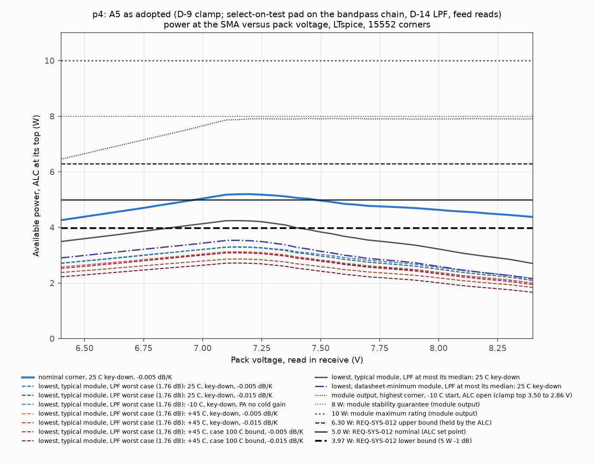

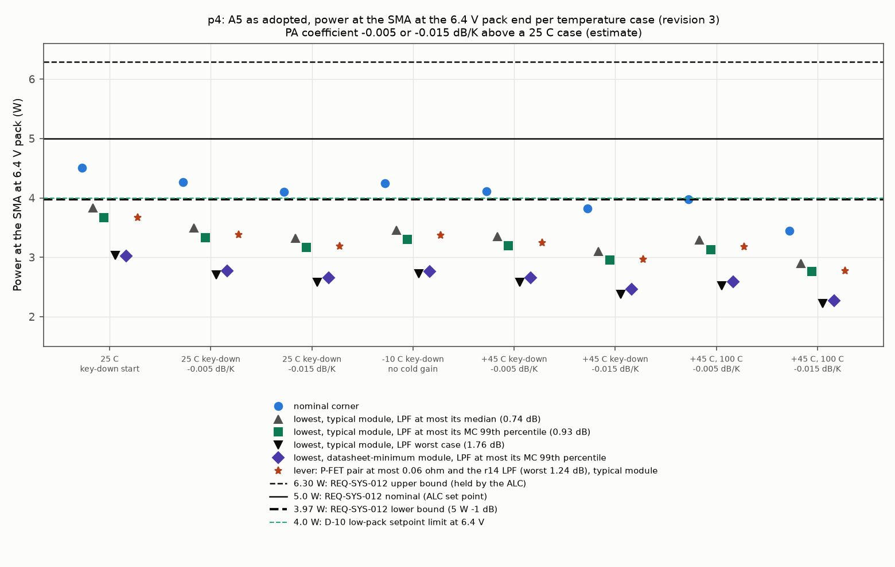

What p4 shows:
- **The nominal corner misses 3.97 W at 6.4 V in two of the eight low-bound cases**: +45 C at -0.015 dB/K (3.82 W) and the 100 C bound at -0.015 dB/K (3.44 W). It is 4.26 W at 25 C key-down.
- **The lowest corner misses in every steady key-down case, even at the LPF median** (2.90 to 3.49 W, -0.56 to -1.37 dB). Revision 2's C2 and C3 levers are now part of the design: D-9 puts VGG at 3.30 V or more, and the feed is read. They do not close it, because the read feed bound (0.452 ohm) is above the 0.35 ohm that revision 2's lever figure assumed.
- **Against revision 2's figures.** Revision 2's 25 C key-down lever figure at the LPF median was 3.81 W (p3, VGG 3.30 V). Revision 3 gives 3.49 W at the same case and the same VGG. The differences: the feed bound at its read value (0.452 against revision 2's lever limit of 0.35 ohm at 25 C), and the drive floor of 11.0 against 11.3 mW.
- **The D-9 clamp, set for its 8 W open-loop criterion, also cuts the reach at the top of the pack range.** The highest open-loop corner is held at 7.90 W at 8.4 V, and at most 7.92 W at any pack voltage (**PASS**). But the lowest corner (typical module, LPF MC 99 %) then reaches only 2.07 W at 8.4 V: REQ-SYS-012's lower bound fails there too, not only at 6.4 V. On that basis the lowest corner reaches 3.97 W only in the 25 C key-down case at -0.005 dB/K and the -10 C key-down case, and only from 7.05 to 7.25 V (at most 4.05 W). It falls back under 3.97 W where the clamp comes down, above 7.25 V. In the hot cases it never reaches 3.97 W.

**The clamp trade (s3).** Both D-9 conditions sit at the same pack voltage: the open-loop ceiling (the highest corner, at the -10 C start of a key-down) and the closed-loop reach (the lowest corner, in hot steady key-down). The conflict therefore does not depend on how the clamp tracks the pack voltage. At the same VGG the spread between those two corners is 3.4 dB (7.91 W at the module against 3.64 W at the SMA at 2.86 V), from the LPF, temperature (+0.53 dB cold against the hot key-down cases), efficiency, feed and drive. The 0.20 V window of the divider clamp adds 0.9 to 2.2 dB more, because at 2.7 to 3.1 V the module is on the steep part of its VGG curve.

At 8.4 V (Python replica of the p4 model, checked against the deck within 0.1 %):

| Clamp top at 8.4 V (V) | Highest module, -10 C start (W) | Lowest (typical module, LPF MC 99 %), window 0.20 V (W) | Same, window 0.03 V (W) |
|---|---|---|---|
| 2.86 | 7.91 | 2.08 | 3.47 |
| 2.95 | 8.83 | 2.94 | 3.91 |
| 3.00 | 9.27 | 3.29 | 4.11 |
| 3.05 | 9.57 | 3.59 | 4.27 |
| 3.10 | 9.82 | 3.83 | 4.38 |
| 3.20 | 10.14 | 4.22 | 4.54 |
| 3.30 | 10.39 | 4.44 | 4.64 |

No clamp setting holds the 8 W ceiling and reaches 3.97 W, whatever the window. With the ceiling at the 10 W maximum rating and a 0.03 V window, a top of about 3.0 to 3.1 V does both. That is scenario B. It moves the open-loop fault case (ALC failed) from "inside the 8 W stability guarantee" to "inside the 10 W maximum rating, outside the stability guarantee (Pout at most 8 W with a 4:1 load)". This is a hazard trade for WP-PDR-22 and HZ-001, not this note's to decide (section R3.7).

**p5: clamp scenario B (15552 corners, the same corners).** VGG 3.47 to 3.50 V at 6.4 V, top 3.120 V at 8.4 V; highest open-loop module 9.94 W at any pack voltage (PASS against 10 W).

| Case | Nominal at 6.4 V | Lowest, typical, LPF median | Same, LPF MC 99 % | Same, LPF worst | Datasheet-minimum module, LPF MC 99 % | Lowest, typical, LPF MC 99 %, at 8.4 V |
|---|---|---|---|---|---|---|
| 25 C, start of key-down (case 25 C) | 4.56 | 3.92 (-0.06) | 3.75 (-0.25) | 3.10 (-1.08) | 3.09 (-1.09) | 5.88 |
| 25 C, key-down, -0.005 dB/K | 4.31 | 3.57 (-0.47) | 3.40 (-0.68) | 2.76 (-1.58) | 2.83 (-1.47) | 5.28 |
| 25 C, key-down, -0.015 dB/K | 4.15 | 3.39 (-0.69) | 3.23 (-0.89) | 2.63 (-1.79) | 2.71 (-1.67) | 4.88 |
| -10 C, key-down, PA no cold gain | 4.29 | 3.52 (-0.52) | 3.37 (-0.71) | 2.78 (-1.56) | 2.82 (-1.49) | 5.15 |
| -10 C, start of key-down, PA +0.53 dB | 4.88 | 4.07 (+0.11) | 3.91 (-0.07) | 3.27 (-0.84) | 3.27 (-0.85) | 6.18 |
| +45 C, key-down, -0.005 dB/K | 4.16 | 3.42 (-0.65) | 3.25 (-0.86) | 2.63 (-1.80) | 2.72 (-1.65) | 5.06 |
| +45 C, key-down, -0.015 dB/K | 3.86 | 3.16 (-0.99) | 3.01 (-1.21) | 2.43 (-2.14) | 2.52 (-1.98) | 4.55 |
| +45 C, case 100 C bound, -0.005 dB/K | 4.03 | 3.36 (-0.73) | 3.19 (-0.95) | 2.58 (-1.88) | 2.65 (-1.76) | 5.04 |
| +45 C, case 100 C bound, -0.015 dB/K | 3.48 | 2.96 (-1.28) | 2.82 (-1.49) | 2.27 (-2.42) | 2.32 (-2.34) | 4.42 |

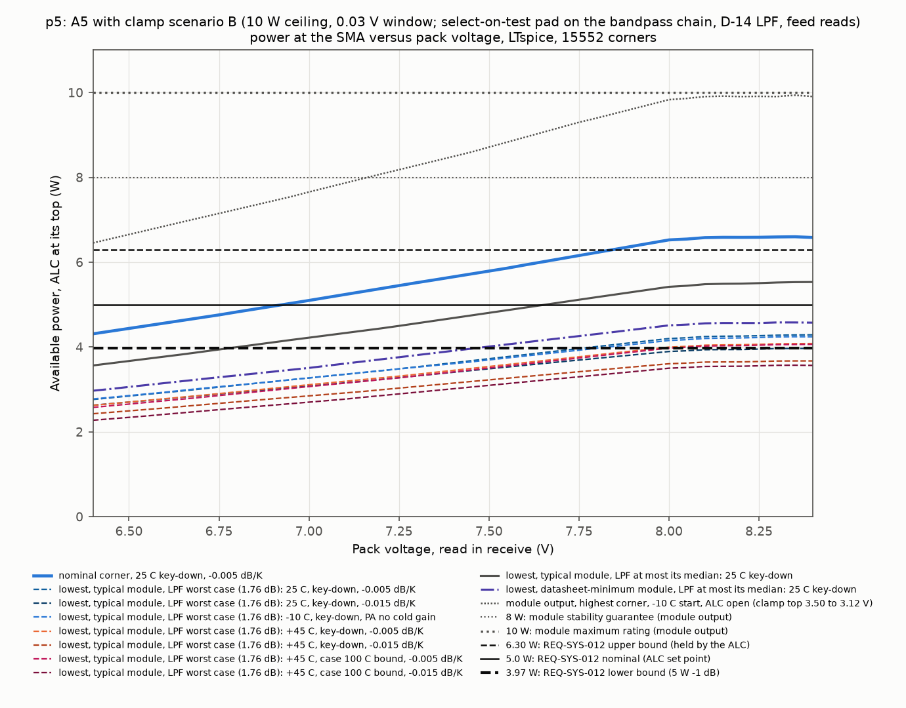

**The REQ-SYS-012 basis for CR-018 (s3).** The coverage proposed as the basis for the delta value:
- the typical module;
- the LPF at most its Monte Carlo 99th percentile (0.93 dB). The per-unit NanoVNA loss measurement that the LPF analysis proposes finds a unit whose filter is worse;
- every steady key-down case, the 100 C bound case included;
- the unmodelled terms of section 4.4 (-0.15 dB).

This is a proposal; the owner decides at S1 (TS-012 follow-on decision 2).

| Coverage at 6.4 V (worst key-down case) | D-9 as specified (p4) | Clamp scenario B (p5) |
|---|---|---|
| nominal corner (+45 C, case 100 C bound, -0.015 dB/K) | 3.44 W, -0.62 dB (-0.77 with the terms); 8.4 V: 3.50 W; 3.97 W in every case from 6.9 V | 3.48 W, -0.57 dB (-0.72 with the terms); 8.4 V: 5.35 W; 3.97 W in every case from 6.9 V |
| lowest, typical module, LPF at most its Monte Carlo median (+45 C, case 100 C bound, -0.015 dB/K) | 2.90 W, -1.37 dB (-1.52 with the terms); 8.4 V: 2.17 W; 3.97 W not reached in every case by 8.4 V | 2.96 W, -1.28 dB (-1.43 with the terms); 8.4 V: 4.65 W; 3.97 W in every case from 7.45 V |
| lowest, typical module, LPF at most its Monte Carlo 99th percentile (+45 C, case 100 C bound, -0.015 dB/K) | 2.76 W, -1.59 dB (-1.74 with the terms); 8.4 V: 2.07 W; 3.97 W not reached in every case by 8.4 V | 2.82 W, -1.49 dB (-1.64 with the terms); 8.4 V: 4.42 W; 3.97 W in every case from 7.65 V |
| lowest, typical module, LPF at its searched worst case (+45 C, case 100 C bound, -0.015 dB/K) | 2.22 W, -2.52 dB (-2.67 with the terms); 8.4 V: 1.67 W; 3.97 W not reached in every case by 8.4 V | 2.27 W, -2.42 dB (-2.57 with the terms); 8.4 V: 3.57 W; 3.97 W not reached in every case by 8.4 V |
| lowest, datasheet-minimum module, LPF median (+45 C, case 100 C bound, -0.015 dB/K) | 2.38 W, -2.23 dB (-2.38 with the terms); 8.4 V: 1.71 W; 3.97 W not reached in every case by 8.4 V | 2.43 W, -2.13 dB (-2.28 with the terms); 8.4 V: 3.78 W; 3.97 W not reached in every case by 8.4 V |
| lowest, datasheet-minimum module, LPF MC 99th percentile (+45 C, case 100 C bound, -0.015 dB/K) | 2.26 W, -2.44 dB (-2.59 with the terms); 8.4 V: 1.63 W; 3.97 W not reached in every case by 8.4 V | 2.32 W, -2.34 dB (-2.49 with the terms); 8.4 V: 3.60 W; 3.97 W not reached in every case by 8.4 V |
| lowest, datasheet-minimum module, LPF worst case (+45 C, case 100 C bound, -0.015 dB/K) | 1.83 W, -3.37 dB (-3.52 with the terms); 8.4 V: 1.32 W; 3.97 W not reached in every case by 8.4 V | 1.87 W, -3.27 dB (-3.42 with the terms); 8.4 V: 2.90 W; 3.97 W not reached in every case by 8.4 V |
| lever: P-FET pair at most 0.06 ohm, typical module, LPF worst (+45 C, case 100 C bound, -0.015 dB/K) | 2.42 W, -2.15 dB (-2.30 with the terms); 8.4 V: 1.73 W; 3.97 W not reached in every case by 8.4 V | 2.48 W, -2.04 dB (-2.19 with the terms); 8.4 V: 3.84 W; 3.97 W not reached in every case by 8.4 V |
| levers: P-FET pair and the r14 LPF, typical module (+45 C, case 100 C bound, -0.015 dB/K) | 2.77 W, -1.56 dB (-1.71 with the terms); 8.4 V: 1.98 W; 3.97 W not reached in every case by 8.4 V | 2.84 W, -1.46 dB (-1.61 with the terms); 8.4 V: 4.39 W; 3.97 W in every case from 7.65 V |

**Proposed delta values on the basis.** With clamp scenario B: 5 W +1/-2.7 dB (2.69 W) at 6.4 V pack, the lower limit rising linearly in dB to 5 W -1 dB at 7.8 V pack, and +/-1 dB from 7.8 to 8.4 V. The s3 check shows the limit line under the basis, with the unmodelled terms, at every pack voltage (**PASS**). With D-9 as specified, the basis never reaches 3.97 W at any pack voltage. Its lowest point is 2.07 W at 8.4 V, so a delta would have to be about 5 W +1/-4.0 dB over the whole pack range. That is a different requirement, and this record does not propose it (request R3-1). Outside the basis, and carried as risk rather than covered by the value: the LPF at its searched worst case (1.76 dB; the per-unit NanoVNA measurement finds it); the datasheet-minimum module (6.5 W against 8.2 W typical at 7.2 V; the TC-SYS-011 bench reading of the built unit finds it). With scenario B, at 6.4 V and in the worst case, these give 2.27 W and 2.32 W.

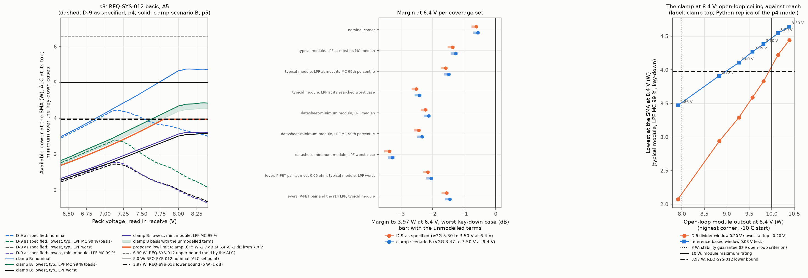

**D-10 (the 4.0 W low-pack setpoint limit at 6.4 V).** 4.0 W is +0.03 dB over REQ-SYS-012's bound. Every lowest corner is under it, so a low-side unit at 6.4 V runs with the ALC at its top and delivers what p4 or p5 shows, not 4.0 W. The limit only affects units whose available power at 6.4 V is above 4.0 W: the nominal corner at 25 C and every stronger unit.

### R3.7 REQ-SYS-144 (the drive pad) and REQ-SYS-012: text proposed for CR-018

The CR author composes the rows; this record supplies the drive-pad clause and the values.

**REQ-SYS-144.**
- **Before:** "The transceiver shall meet its requirements after assembly with no adjustment other than stored firmware calibration of pitch centre and reference trim."
- **After (drive-pad clause; the other alignment steps of TS-012 section 8.10 come from their own records):** "The transceiver shall meet its requirements after assembly with no adjustment other than stored firmware calibration (pitch centre, reference trim, the keying-loop feedforward table) and the one-time build alignment steps of the alignment procedure. For the PA drive, the alignment step is the selection of one pad from the drive-pad set with the module replaced by a 50 ohm load, for a drive of 17.3 mW (TBR) read with an uncertainty of at most +/-1.0 dB (TBR)."
- **Rationale:** "The drive chain spreads by 8.5 dB over its part corners against the RA07M1317M's 10 to 30 mW input window (4.8 dB). A fixed pad cannot hold the window, and the pad selected at build holds it with the reading within +/-1.0 dB (WP-PDR-21 record section R3.4)."
- **Verification note:** "Pre-build: Analysis (WP-PDR-21, k1 and s2). Post-build: Inspection of the build record (pad chosen, M2 readings in both polarities, the two DC points), then TC-SYS-096."
- The +/-1.0 dB (TBR) keeps the revision 2 allocation, with +0.05 dB of overdrive margin at the allocation. The method of section R3.4 shows +/-0.64 dB, which leaves +0.41 dB.

**REQ-SYS-012.**
- Before: "The transceiver shall hold its 5 W step within +/-1 dB (TBR) into 50 ohm over its transmit range at 6.4-8.4 V pack."
- The after-text depends on WP-PDR-22's clamp decision:
  - with clamp scenario B (recommended by this record, for WP-PDR-22 to decide): "The transceiver shall hold its 5 W step within +1/-1 dB (TBR) into 50 ohm at 7.8-8.4 V pack and within +1/-2.7 dB (TBR) at 6.4 V pack, the lower limit linear in dB between, over its transmit range."
  - with D-9 as specified: no delta of this form holds (section R3.6); REQ-SYS-012 would need about +1/-4.0 dB over the whole range, or D-9's 8 W ceiling must change.
  - Either way, the owner's alternative of TS-012 follow-on decision 2 stands: keep +/-1 dB and decide on the TC-SYS-011 bench reading, with the delta as the fallback.
- Rationale sentence to replace: "Assumes: ... the PD54008L-E gives 4.5 to 5.0 W at 6 V". The replacement: "the RA07M1317M with the select-on-test drive, the D-9 clamp and the D-14 LPF gives 4.26 (25 C key-down) W nominal and 2.76 (typical module, LPF MC 99 %, +45 C bound case) W at the lowest corner at 6.4 V (WP-PDR-21 record section R3.6, estimate)."
- **TPM-015.** The red threshold includes "the 5 W step unreachable at the cutoff voltage". At 6.4 V, 5 W is unreachable for every unit in every case, the nominal corner included (4.26 W at 25 C key-down). If 6.4 V is the cutoff, TPM-015 is Red; the request of section 7.1 stands.

### R3.8 Status of the section 7 items for A5, and requests

| Item | State after revision 3 | What remains |
|---|---|---|
| C1 (D-7) | **Analysis closed (PASS, estimate):** the pad set (14 pads, 13.48 to 22.04 dB) covers every unit and coax length; the in-service band is 11.0 to 27.3 mW with the M2 reading (+/-0.64 dB) | The bench consistency step of section R3.4; the owner's REQ-SYS-144 disposition (CR-018, S1) |
| C2 | **Closed: FAIL** (bound 0.452 ohm against 0.35 ohm) | Owner: accept the bound (carried in p4 and p5), or select a P-FET pair of at most 0.06 ohm (bound 0.314 ohm; +0.37 dB at the LPF worst case, 2.22 to 2.42 W, section R3.6), a CR-018 or CDR BOM item |
| C3 (D-9) | Modelled as D-9 states; the 8 W ceiling conflicts with REQ-SYS-012 at 8.4 V (section R3.6) | WP-PDR-22 (request R3-1) |
| C4 and C8 | Superseded by section R3.6 and the REQ-SYS-012 proposal (R3.7) | Owner at S1 (follow-on decision 2) |
| C6 | **Closed:** p4 and p5 use the D-14 build (r13) | None |
| C7 | **Closed: PASS** (47N, 68N, 82N in G tolerance) | None |
| C9 | Still open: WP-PDR-20's tap run; the lowest swing is now 1.33 Vpp | Request R3-2 |
| C10 | The r14 set (22/68/36/82) was rejected for A4's 60 dBc margin, and A4 is not chosen. For A5 the LPF analysis gives it a worst case of 1.24 dB against 1.76 dB (+0.5 dB of REQ-SYS-012 margin at the LPF worst case; lever column of section R3.6) | Request R3-4 |
| DR-PAD-1 (D-8) | **Closed by D-13:** the pin load is 11.0 pF at most, inside Table 7 | None (the coax interface stays as D-8 states it) |
| D-13 | **Met with D-7:** the fixed pad does not hold 10 to 30 mW; the select-on-test pad does | None beyond C1 |

Requests (this record changes none of these files; each figure goes to its writer under section 5.3 of the PDR work plan):
- **R3-1, WP-PDR-22 (D-9, C3) and the HZ-001 writer.** Section R3.6 shows that D-9's two criteria conflict at 8.4 V, whatever the clamp's shape: no clamp holds the 8 W open-loop ceiling and lets the lowest corner reach 3.97 W. Options: (a) set the ceiling at the 10 W maximum rating with a reference-based clamp of about 0.03 V window (scenario B, p5), accepting open-loop operation outside the 8 W stability guarantee in the ALC-failed state; (b) keep 8 W and accept REQ-SYS-012's shortfall over the whole pack range; (c) a per-unit clamp trim at build (another REQ-SYS-144 alignment step). The figures for HZ-001: open-loop module up to 9.94 W in scenario B (7.91 W with D-9 as specified).
- **R3-2, WP-PDR-20 (C9).** The lowest CLK1 swing at the prescaler tap is 1.33 Vpp with the bandpass chain (d6), against 1.66 Vpp in revision 2. With the bias midway it leaves about 0.13 V of total margin across 0.8 V to 2.0 V. The tap's valid-clock run should take 1.33 Vpp; a buffer gate (spur note C7b footprint) is the fallback.
- **R3-3, WP-PDR-24.** At +45 C key-down the pack current reaches 2.48 A (p4) or 2.70 A (p5) with the ALC at its top, against the MF-R300's 2.04 to 2.2 A hold current at 55 to 60 C main-bay air (Bourns derating). The trip margin at the hot corner is negative.
- **R3-4, the LPF author (D-14).** A4's constraint on the r14 set (22/68/36/82) no longer applies. For A5 the LPF analysis gives r14 a worst-case loss of 1.24 dB against r13's 1.76 dB, with A5's 60 dBc margin to be re-read from the r14 run. Each 0.1 dB of loss is 0.1 dB of REQ-SYS-012 margin.
- **R3-5, WP-PDR-29 (TPM-015, TPM-004).** As section 7.1, with the section R3.6 figures: nominal at 6.4 V is 4.26 W at 25 C key-down and 3.44 W at the worst bound case.

### R3.9 Limitations added by revision 3

1. **The probe is a surrogate.** The HSMS-280x parameters stand in for the 1N5711. The two DC points measure the diode's Is and n on the actual part, but Rs, Cj and the package enter only as the k1 ranges. The harmonic content at the module input is bounded at -30 dBc (est.); the GVA-84+ datasheet gives no harmonic figures.
2. **The clamp results rest on the separable module model at the steep part of the VGG curve.** The VGG factor is read at 7.2 V and applied at 8.4 V, at 2.7 to 3.1 V, where the digitized curve falls fastest. The direction of that error is not known (limitation 2). The conflict of section R3.6 is 3.4 dB wide before the window, so it does not rest on a small term.
3. **The clamp is modelled, not designed.** The top curve is the most generous clamp that meets its ceiling at every 0.1 V. A real clamp can only be less generous, so the reach figures are upper bounds for each ceiling.
4. **The bandpass capacitor tolerances are the codes' limits.** Board strays (about 0.1 to 0.3 pF on 2.4 pF) are not modelled. The select-on-test pad measures them out at 146 MHz, but not their effect on the in-unit frequency span.
5. **The clamp trade table** comes from the Python replica of the deck's module model. It agrees with the deck at the D-9 design point within 0.1 % (s3 check: 7.900 against 7.905 W, 3.632 against 3.634 W).
6. **p4 and p5 carry revision 2's other limitations** (sections 6, items 1, 2, 5, 8, 10 and 11).

### R3.10 Verdicts of the checker (revision 3)

`run_a5_r3.py all` exits 1: every check passes, and criteria fail as below. `run_a5_r3.py all --expect` compares every verdict with this list and exits 0 on 2026-09-29; a changed verdict exits 3.

| Run | Verdict | Result |
|---|---|---|
| d6 | check: one .raw step per corner | PASS (8100 steps) |
| d6 | A5 lumped CLK1 pin load at most 15 pF (Si5351 Table 7) | PASS |
| d6 | A5 equivalent CLK1 pin load at most 15 pF at every corner (bandpass chain) | PASS (-0.5 to 11.0 pF) |
| d6 | A5 3f at the GVA-84+ input at least 25 dB below f | PASS (-33.8 dBc) |
| d6 | A5 GVA-84+ input below +13 dBm | PASS (-6.2 dBm) |
| d6 | A5 module input 10 to 30 mW at every corner (fixed 18 dB pad, bandpass chain) | FAIL (5.5 to 39.1 mW; 1356 under 10 mW, 565 over 30 mW of 8100) |
| d7 | check: 10 ps step and 400 ns settling against 20 ps and 250 ns within 0.02 dB (power) and 0.5 dB (3f) | PASS (0.0028 dB, 0.040 dB) |
| d7 | A5 module input at most 30 mW at any coax length (fixed pad, bandpass chain) | FAIL (38.7 mW) |
| k1 | check: one .raw step per RF case | PASS (9360 steps) |
| k1 | check: one DC sweep per diode set and temperature | PASS |
| k1 | check: one bracketed equilibrium per RF case | PASS (0 unbracketed of 240; 4 by the log-linear law of the two grid points below the root) |
| k1 | A5 select-on-test reading (method M2, both polarities) within the +/-1.0 dB allocation (worst-case sum) | PASS (+/-0.64 dB) |
| k1 | Revision 2 reading (forward drop at DC only, M0) within +/-1.0 dB at 25 C with no harmonic | PASS (-0.73 to -0.42 dB) |
| s2 | A5 select-on-test drive 10 to 30 mW in service with the k1 reading bound (bandpass chain) | PASS (11.0 to 27.3 mW, overdrive margin +0.41 dB, reading +/-0.64 dB) |
| s2 | A5 select-on-test drive 10 to 30 mW at the +/-1.0 dB reading allocation (bandpass chain) | PASS (10.1 to 29.6 mW) |
| s2 | A5 select-on-test drive 10 to 30 mW with a tinySA Ultra reading alone (+/-2 dB published) | FAIL (overdrive margin -0.95 dB) |
| p4 | check: one .raw step per corner | PASS (15552 steps) |
| p4 | check: PA case temperature equals the thermal law within 0.01 K at every pack voltage | PASS (largest difference 7.63e-06 K) |
| p4 | check: VGG 3.30 to 3.50 V at 6.4 V | PASS (3.300 to 3.500 V) |
| p4 | A5 open loop at 8.4 V: module output at most 8 W in every case (clamp) | PASS (7.90 W) |
| p4 | A5 open loop from 6.4 to 8.4 V: module output at most 8 W at every pack voltage and case (clamp) | PASS (7.92 W) |
| p4 | A5 nominal corner at least 3.97 W at 6.4 V in every key-down case | FAIL (3.44 W) |
| p4 | A5 lowest corner (typical module, LPF at most its median) at least 3.97 W at 6.4 V, every key-down case | FAIL (2.90 W) |
| p4 | A5 lowest corner (typical module, LPF worst case) at least 3.97 W at 6.4 V, every key-down case | FAIL (2.22 W) |
| p4 | A5 lowest corner (typical module, LPF worst case) at least 3.97 W at 8.4 V with the clamp, every key-down case | FAIL (1.67 W) |
| p5 | check: one .raw step per corner | PASS (15552 steps) |
| p5 | check: PA case temperature equals the thermal law within 0.01 K at every pack voltage | PASS (largest difference 1.53e-05 K) |
| p5 | check: VGG 3.47 to 3.50 V at 6.4 V | PASS (3.470 to 3.500 V) |
| p5 | A5 open loop at 8.4 V: module output at most 10 W in every case (clamp) | PASS (9.90 W) |
| p5 | A5 open loop from 6.4 to 8.4 V: module output at most 10 W at every pack voltage and case (clamp) | PASS (9.94 W) |
| p5 | A5 nominal corner at least 3.97 W at 6.4 V in every key-down case | FAIL (3.48 W) |
| p5 | A5 lowest corner (typical module, LPF at most its median) at least 3.97 W at 6.4 V, every key-down case | FAIL (2.96 W) |
| p5 | A5 lowest corner (typical module, LPF worst case) at least 3.97 W at 6.4 V, every key-down case | FAIL (2.27 W) |
| p5 | A5 lowest corner (typical module, LPF worst case) at least 3.97 W at 8.4 V with the clamp, every key-down case | FAIL (3.57 W) |
| s3 | check: the proposed REQ-SYS-012 limit line lies under the basis with the unmodelled terms (clamp scenario B) | PASS |
| s3 | check: the Python replica equals the p4 deck at 8.4 V within 0.5 % (highest module, lowest at the window top) | PASS (7.900 against 7.905 W; 3.632 against 3.634 W) |
| s3 | A5 REQ-SYS-012 as baselined (5 W -1 dB at 6.4 V) on the basis (typical module, LPF MC 99th percentile, every key-down case, unmodelled terms), D-9 clamp | FAIL (-1.74 dB) |
| s3 | A5 REQ-SYS-012 lower bound at 8.4 V on the basis, D-9 clamp as specified (8 W open-loop ceiling) | FAIL (2.07 W) |
| s3 | A5 REQ-SYS-012 lower bound at 8.4 V on the basis, clamp scenario B (10 W ceiling, 0.03 V window) | PASS (4.42 W) |

---

*Sections 1 to 9 below are revision 2 (both finalists), as reviewed at INSP-114 iteration 3; section R3 governs for A5 where it differs.*

## 1. Purpose

TS-012 revision 4 presents A4 (NXP AFT05MS004N, hand-derived match, no TCXO) and A5 (Mitsubishi RA07M1317M module, TCXO) together, and names the PA drive chain as a pre-order LTspice check (WP-PDR-21). This note answers, for each finalist:

1. What power reaches the PA input across the part tolerances (Si5351A output resistance 25 or 50 ohm, its supply, edge time and duty cycle; GVA-84+ gain and compression; 144 to 148 MHz; the CLK1-to-RF-board interface as TS-012 lays it out)?
2. For A5: is the RA07M1317M input kept inside 10 to 30 mW (its stability conditions, and 30 mW is its maximum rating) at every corner, and with what margin to 30 mW? The TS-012 criterion also asks that the third harmonic at the GVA-84+ input be at least 25 dB below the fundamental.
3. What load does the drive chain put on the Si5351 CLK1 pin, against the datasheet's 15 pF maximum load capacitance?
4. What power reaches the SMA from 6.4 to 8.4 V pack (read in receive), after key-down sag, the output low-pass filter and the T/R relay, against REQ-SYS-012 (3.97 to 6.30 W), at 25 C and over REQ-SYS-114's -10 to +45 C ambient, with the PA and the feed parts at their key-down temperatures?

## 2. Method

**Drive chain (runs d2, d3, d4, d5; transient).** The Si5351A CLK1 is a trapezoid Thevenin source with a swing equal to VDDO, the DC removed (the path is AC coupled), behind 25 or 50 ohm.

The interface is modelled as TS-012 lays it out (revision 1, finding-1):
- TS-012 section 8.1 puts the Si5351 (Adafruit 2045) on the main board, and the drive LPF, pads and GVA-84+ on the RF board in the PA bay. Section 7.3 says that only the DC, drive and coax leads pass the bulkhead.
- CLK1 therefore leaves the Adafruit board through its optional SMA and reaches the RF board on a 50 ohm coax. The Adafruit product page (adafruit.com/product/2045, read 2026-09-28) describes the outputs as available "for RF work, an optional SMA connector".
- This is the output topology Skyworks recommends: Si5351-B Rev. 1.3 section 7.6, Figure 16 shows a ZO = 50 ohm trace with a 0 ohm series resistor at the default high drive strength.
- On the CLK1 pin sit only the prescaler tap (100 pF into the 74LVC1G80, 5 pF, estimate) and the header, pads and main-board stub (2 pF, estimate): 7 pF lumped.
- The coax is lossless, 50 ohm, velocity factor 0.66 (RG-174 class), 5, 10 or 15 cm long (estimate; the layout sets it at CDR). Its loss at 146 MHz, about 0.05 dB in 15 cm, is ignored, which is conservative for overdrive.
- The drive LPF (a 3-pole C-L-C: 18 pF C0G 1206, 82 nH 1812SMS class, 18 pF, with estimated ESR, ESL, via inductance, coil Q and self-resonance) sits at the far end of the coax on the RF board.

Revision 0 put the LPF's 18 pF input capacitor and the 5 pF tap directly on the pin (23 pF, not the design).

Then come the E24 pi pads, the GVA-84+ and the PA input, taken as 50 ohm because both PA datasheets specify Pin in a 50 ohm system. The GVA-84+ is a behavioural block: a 50 ohm input, a Rapp limiter on the instantaneous voltage and a 50 ohm output. The limiter's two parameters were fitted by describing function so that the fundamental compresses 1 dB and 3 dB at the datasheet P1dB and Psat, and run d1 checks that fit in LTspice. TS-012 section 7.3 names the GVA-84+ S-parameters for this check; this flat block with the 0.1 GHz gain limits departs from that, and section 6 item 4 gives the departure's size and direction (revision 2, finding-8).

The drive runs:
- d2 (A5) and d3 (A4) each step 810 corners in one `.step`: 2 source resistances x 5 GVA gains x 3 P1dB sets x 3 frequencies x 3 Si5351 cases x 3 coax lengths.
- d4 bounds the unknown coax length. It sweeps 0.5 to 70 cm, which is more than half a wavelength in the coax (69 cm at 144 MHz): the line's input impedance repeats every half wavelength, so this covers every electrical length. It takes the five part corners that set the extremes, at the three frequencies. d4 also reruns 15 corners at a 10 ps maximum step to check the 20 ps step of d2 and d3.
- d5 is a design-request option for A5, not the TS-012 design: 6 dB of the 18 dB input pad moved to the CLK1 end of the coax (section 4.2).

The checker resamples the last three whole periods from the `.raw` and takes by DFT:
- the fundamental and 3f at the GVA-84+ input and the PA input;
- the pin impedance V(clk)/I(Rsrc) at the fundamental, reported as an equivalent shunt capacitance and a magnitude.

**Power path (runs p1, p2, p3; DC sweep).** The pack EMF is swept from 6.4 to 8.4 V behind the drain feed resistance. The 5 V bus (0.25 A) and the PA drain current Pout/(eta x Vd) load the feed, so LTspice solves the key-down sag and the PA output together. The PA output (volts on a node stand for watts) comes from the digitized datasheet curves:
- **A5:** Pout = Pout_VDD(Vd) x drive factor x VGG factor x spread factor x temperature factor.
  - Pout_VDD(Vd): the typical Pout versus VDD curve at Pin 20 mW and VGG 3.5 V, interpolated in frequency between the 135 and 155 MHz curves.
  - Drive factor: the Pout versus Pin curve at 7.2 V, relative to its value at 20 mW.
  - VGG factor (revision 2, finding-3): the Pout versus VGG ratio between the VGG of the corner and 3.5 V, at 3.08, 3.27 and 3.46 V (the revision-4 clamp: minimum, nominal, maximum) and at 3.30 V (the C3 lever, section 7). No figure uses 3.5 V.
  - Spread factor: 1 (typical), or 6.5 W over the typical output at 7.2 V (the datasheet minimum).
- **A4:** Pout = Pout_7.5(Pin) x (Vd/7.5)^n x match factor x temperature factor. Pout_7.5(Pin) is Figure 13 of the AFT05 datasheet (the NXP reference circuit), interpolated in frequency, with the drive corners of d3; n is 1.8, 2.0 or 2.3; the match factor is the extra loss of the hand-derived match (0, 0.25 or 0.5 dB).
- **Both, output loss (revision 2, cross item X-5):** the LPF plus the relay, 0.5, 0.84 or 1.86 dB. The WP-PDR-21 LPF analysis revision 2 (`docs/design/analysis/lpf-ts012.md`, commit `92e3805`) withdrew the retuned values of its runs r6 and r7, on which revision 1's uncertainty term rested, and recommends the BOM values with 2 % parts (run r13): passband loss 0.74 dB at the Monte Carlo median and 1.76 dB at the searched worst case. So 0.84 dB is the r13 median plus the 0.1 dB relay, 1.86 dB the r13 worst case plus the relay, and 0.5 dB the TS-012 allocation (0.4 dB plus the relay), kept as the low corner because it is below every LPF result (conservative for the high side).

**Temperature cases (revision 1, finding-2; revision 2, finding-9).** REQ-SYS-114 asks every requirement, REQ-SYS-012 included, to hold from -10 C to +45 C ambient. Revision 1 took the hot cases in steady key-down but its 25 C case with the PA case at 25 C, the datasheet condition. Revision 2 puts every case of a question in one thermal state:
- **Low bound (REQ-SYS-012 lower limit): steady key-down at the ambient**, every part at its hottest. The PA case is solved in the deck: Tc = Ta + Rth_ca x (Pout (1/eta - 1) + Pin), with Rth_ca from WP-PDR-28 (section 3.1). The drain-feed parts and the LPF copper term sit at their own key-down temperatures. Cases: 25 C and +45 C, each with a PA coefficient of -0.005 and -0.015 dB/K; -10 C with no PA gain below a 25 C case; and a +45 C bound with the PA case held at 100 C (the Rth band of WP-PDR-28), again with both coefficients.
- **High side (the open-loop question at 8.4 V): the start of a key-down after a -10 C soak**, every part at -10 C, with the full coefficient (+0.53 dB).
- **Informative: the start of a key-down at 25 C**, every part at 25 C (the datasheet condition). It equals revision 1's 25 C case in its thermal state.

The deck checks itself: the checker recomputes the thermal law from the `.raw` for every key-down corner at 6.4 V and requires agreement with the case temperature LTspice solved within 0.01 K (7.6e-6 K found, **PASS**). (Revision 3, INSP-114 finding-11 (ii): revision 2 said "for every key-down corner"; the check was at the 6.4 V point only. The revision 3 run p4 checks every pack voltage, section R3.6.) Each deck steps every combination: 11664 corners for A5 (9 temperature cases) and 13122 for A4. The "25 C" figures quoted below are the 25 C key-down case at -0.005 dB/K, with the -0.015 dB/K case beside them.

The drive corners (minimum, nominal, maximum PA input from d2 and d3) are the link between the two models. The drive itself changes by at most 0.1 dB over -10 to +45 C (section 3.1), so the drive runs are at 25 C and that 0.1 dB is carried as an allowance on the overdrive margin.

**Digitizing.** The datasheet pages were rendered at 400 dpi. The grid was located automatically, and each Pout curve was tracked column by column: the solid RA07M1317M curves after removing the dashes of the neighbouring curves, and the orange AFT05 curves by colour. Every tracked curve was overlaid on its datasheet crop and inspected (`hardware/sim/tx-pa/data/*_overlay.png`).

**Corners and reported figures.** Every parameter with a datasheet minimum and maximum uses them. Parameters without one use a stated estimate (section 3). The pass/fail judgement uses the worst corner, and the nominal corner is reported beside it. Every nominal, lowest, highest and lever figure quoted in section 4 is written with its full parameter set in the run's `result.md` (revision 1, finding-3). Section 4.4 gives the definitions used throughout.

## 3. Inputs and sources

Datasheets were fetched 2026-09-28 (public vendor PDFs; SHA-256 in the block README). Class: D datasheet value, G graph read of a datasheet plot (estimate), E estimate.

| Input | Value used | Source and class |
|---|---|---|
| Si5351A output resistance | 25 and 50 ohm | D: Rev. 1.3 Table 4, ZO 50 ohm typical (3.3 V VDDO, default high drive). E: 25 ohm is the TS-012 corner (no minimum published) |
| Si5351A edge, duty, VDDO | 20-80 % edge 0.5 / 1.0 / 1.5 ns; duty 0.45 / 0.50; VDDO 3.2 / 3.3 / 3.4 V | D: Rev. 1.3 Table 7, tr and tf 1 ns typ and 1.5 ns max (CL 5 pF), duty 45 to 55 % below 160 MHz, all at TA -40 to 85 C. E: the 0.5 ns fast case and VDDO +/-3 % (Adafruit module LDO) |
| Si5351A load capacitance | at most 15 pF | D: Rev. 1.3 Table 7 |
| Si5351A output topology | 50 ohm trace, 0 ohm series resistor | D: Rev. 1.3 section 7.6, Figure 16 |
| CLK1 pin lumped load | tap 5 pF + stub 2 pF = 7 pF | E (100 pF into the 74LVC1G80 input; header pin, pads and stub) |
| CLK1-to-RF-board coax | 50 ohm, lossless, VF 0.66, 5 / 10 / 15 cm; d4: 0.5 to 70 cm | E: RG-174 class. The length is set by the CDR layout, and d4 bounds it |
| Drive LPF | 18 pF / 82 nH / 18 pF; ESR 0.1 ohm, ESL plus via 1 nH, coil Q 100 at 146 MHz, SRF 1.2 GHz | TS-012 section 7.3 (3-pole, fc about 170 MHz, one 1812SMS, two 1206 C0G). E: values and parasitics chosen here. The inductor value is to be confirmed on the Coilcraft page at the order |
| Pads (E24, 1 %) | A5 input 62 / 200 / 62 ohm (18.42 dB); A5 output 300 / 18 / 300 ohm (3.00 dB); A4 input 82 / 91 / 82 ohm (11.97 dB); d5 option: 150 / 36 / 150 ohm (5.90 dB) at the pin and 82 / 91 / 82 ohm on the RF board | TS-012 A5 line-up (18 dB and 3 dB). The A4 pad is chosen here so that the GVA-84+ sits near its P1dB at the nominal corner ("GVA-84+ at its P1dB limit", TS-012 section 7.3) |
| GVA-84+ gain | 22.5, 22.9, 24.1, 25.0, 25.3 dB | D: Rev. F at 0.1 GHz, 22.9 min, 24.1 typ, 25.3 max. 22.5 and 25.0 are the TS-012 criterion corners |
| GVA-84+ gain at 146 MHz (finding-8) | 0.1 to 0.4 dB below the 0.1 GHz value (not modelled; section 6 item 4) | D: Rev. F typical gain 24.1 dB at 0.1 GHz and 21.7 dB at 1.0 GHz, the only frequencies below 2 GHz. E: interpolation linear in frequency (-0.1 dB) or in log frequency (-0.4 dB) |
| GVA-84+ gain over temperature | 0.0004 dB/C typical (negative), 0.1 GHz | D: Rev. F, (gain at 85 C minus gain at -45 C)/130 |
| GVA-84+ compression | P1dB 19.4 / 20.4 / 21.4 dBm with Psat 20.7 / 21.7 / 22.7 dBm; Rapp p 2.70, Vsat 2.99 / 3.36 / 3.77 V peak | D: Rev. F, P1dB +19.4 min and +20.4 typ; Psat (3 dB compression) +21.7 typ. E: the "high" set (+1 dB) and the Psat of the min set |
| GVA-84+ input maximum | +13 dBm | D: Rev. F absolute maximum ratings |
| RA07M1317M curves | Pout versus Pin (7.2 V, VGG 3.5 V), versus VDD (Pin 20 mW, VGG 3.5 V), versus VGG (7.2 V, Pin 20 mW), at 135 and 155 MHz | G: datasheet Jun. 2019 pages 3 to 5, typical, all at Tcase 25 C. Checks: 8.23 W at 7.2 V and 155 MHz on the VDD curve against 8.15 W on the Pin curve at 20 mW; about 8.5 W at 145 MHz on the frequency plot |
| RA07M1317M guaranteed output | 6.5 W minimum at 7.2 V, VGG 3.5 V, Pin 20 mW | D: datasheet electrical characteristics |
| RA07M1317M efficiency | 0.60 typical, 0.45 minimum | G: 0.60 from the page 4 current curve (5.85 W at 6.0 V and 1.63 A). D: 0.45 is the datasheet minimum at 6 W, 7.2 V |
| RA07M1317M ratings and window | Pin 30 mW maximum; stability for Pin 10 to 30 mW, Pout up to 8 W; Pout 10 W maximum; operating case -30 to +110 C | D: datasheet (as read in TS-012 and INSP-110 row S3; case range read 2026-09-28) |
| VGG at the ALC top | 3.08 / 3.27 / 3.46 V (the revision-4 clamp: minimum, nominal, maximum); 3.30 V (the C3 lever) | TS-012 revision 4 section 7.3: 0.654 divider of 1 % resistors from the LM2940 (4.75 to 5.25 V), ratio 0.6493 to 0.6584, so 4.75 x 0.6493 = 3.08 V, 5.0 x 0.654 = 3.27 V, 5.25 x 0.6584 = 3.46 V. Revision 2 (finding-3): no figure uses 3.5 V |
| AFT05MS004N curve | Pout versus Pin at 7.5 V, 135 and 155 MHz | G: datasheet Rev. 0 Figure 13 (reference circuit), typical. Check: 6.08 W at 0.1 W and 135 MHz against Table 8's 6.0 W. No figure over temperature |
| AFT05 voltage scaling | (Vd/7.5)^n, n 1.8 / 2.0 / 2.3 | E: the datasheet has no VHF Pout versus VDD. The RA07M1317M curve gives n = 1.86 between 6.0 and 8.4 V |
| AFT05 efficiency | 0.67 typical, 0.55 low | G: Figure 13 at 0.1 W (62 % at 135 MHz, 73 % at 155 MHz). E: 0.55 |
| AFT05 hand-match extra loss | 0 / 0.25 / 0.5 dB | E: match re-derived for a 0.8 mm board with wound coils (TS-012 section 7.3, adversarial C4) |
| AFT05 drive reference | 0.1 W typical (Table 8); 0.2 W ruggedness test (3 dB overdrive, Table 9) | D: datasheet; the maximum ratings table gives no input power rating |
| Drain feed resistance at 25 C | 0.26 / 0.35 / 0.45 ohm (cells, protection FETs, polyfuse, holders, reverse and rail switch, chokes) | TS-012 section 7.3 (mix of datasheet bounds and estimates). A4 is taken with the same feed. Per part in section 3.1 |
| 5 V bus current at key-down | 0.25 A | E: GVA-84+ 0.108 A typ, G5V-2 coil 0.1 A, Pico and op-amps; TS-012 used 0.2 A |
| Output loss | 0.5 / 0.84 / 1.86 dB | 0.5 dB: TS-012 allocation (LPF 0.4 dB plus relay 0.1 dB, E). 0.84 and 1.86 dB: the WP-PDR-21 LPF analysis revision 2 (`lpf-ts012.md`, commit `92e3805`), recommended build r13, passband loss 0.74 dB Monte Carlo median and 1.76 dB searched worst case, plus the relay (revision 2, cross item X-5) |
| Pack voltage | 6.4 to 8.4 V EMF | REQ-SYS-012 reads the pack in receive; the difference from the EMF is under 10 mV (E) |

### 3.1 Temperature inputs (revision 1, finding-2; revision 2, finding-9)

Each non-cell feed part is at the ambient plus a key-down rise (steady key-down) or at the ambient (start of a key-down after a soak). Its resistance moves linearly with its temperature. At +45 C key-down and at the -10 C soak this reproduces revision 1's hot and cold multipliers; the 25 C and -10 C key-down values are new.

| Input | Value and temperature law | Source and class |
|---|---|---|
| Cells, two Molicel P28A (25 C: 0.04 to 0.06 ohm) | x3.0 to x3.3 at -10 C; x1.0 at 25 C; x0.90 to x1.00 at +45 C (cells 50 to 64 C in WP-PDR-28). The discharge curves include the cells' own heating at 2.8 A, so the same multiplier serves key-down and soak | D: P28A datasheet (INR18650P28A-V1-80093, read 2026-09-28), DC IR 20 mohm (10 A, 1 s), so 0.04 ohm per pair at 23 C. G: its 2.8 A discharge-temperature curves at mid capacity sit about 0.11 V (0 C) and 0.27 V (-20 C) under the 23 C curve, so about 0.19 V at -10 C, 40 to 68 mohm more per cell. The 45 C curve lies on the 23 C one |
| AO3400A and DMP3099L pairs (25 C: 0.04 to 0.06 and 0.13 to 0.20 ohm) | RDS(on) +0.57 %/K (low end) to +0.50 %/K (high end); junction at key-down 15 to 50 K above ambient | E: MOSFET RDS(on) rise, no datasheet curve read here; the rise is main-bay air 10 to 15 K above ambient (WP-PDR-28) plus self-heating. Gives x1.20 to x1.35 at +45 C key-down and x0.80 to x0.83 at the -10 C soak (revision 1's values), x1.09 to x1.25 at 25 C key-down, x0.89 to x1.08 at -10 C key-down |
| MF-R300 (25 C: 0.02 to 0.08 ohm) | +0.29 to +0.43 %/K, the MOSFETs' rise | E: PTC below trip (revision 1's hot x1.10 to x1.30) |
| Holder contacts; chokes | x1.0; copper +0.39 %/K, 5.6 to 44 K above ambient at key-down | E |
| Resulting feed, levels low / TS-012 criterion / high (ohm) | 25 C start of key-down 0.260 / 0.350 / 0.450; 25 C key-down 0.276 / 0.394 / 0.534; -10 C key-down 0.318 / 0.452 / 0.613; -10 C start of key-down 0.303 / 0.409 / 0.529; +45 C key-down 0.293 / 0.418 / 0.568 | Computed (`feed_at` in `run_pa.py`): each part moves with the level, and the result is scaled so that every part at 25 C gives exactly 0.26 / 0.35 / 0.45 ohm |
| PA case-to-ambient resistance | A5 6.11 K/W; A4 9.6 K/W | E: WP-PDR-28 (`hardware/sim/thermal`, run `2026-09-28-ts012-r2` `verdicts.md` V05): A5-DC module case 105.69 C at 9.94 W and 45 C, so (105.69 - 45) / 9.94 = 6.11 K/W; the run's band on that case is +19.9 / -9.6 K. A4: AFT05 tab 98.2 C at 5.55 W and 45 C (run `ts012-r1`, A4-DC, steady state; r2 changed only transient heat capacities and lists no A4 tab row), 9.6 K/W |
| PA case temperature at 6.4 V (solved) | A5 at the C2 and C3 corner (p1 and p3): 25 C start 25 C; 25 C key-down 57 to 60 C; -10 C key-down 23 to 25 C; +45 C key-down 75 to 79 C; bound 100 C. A5 nominal corner: 45 to 46 C at 25 C key-down. A4 nominal: 43 to 44 C at 25 C key-down | Computed in the deck (`V(tc)`); the reviewer's iteration 2 estimate of 58 to 62 C at 25 C is reproduced |
| PA output against case temperature | -0.005 or -0.015 dB/K times (Tc - 25 C); low-bound cases take no gain below a 25 C case; the -10 C start of key-down takes +0.53 dB (high side only) | E, Low: neither datasheet gives output over temperature (RA07M1317M data are all at Tcase 25 C). Saturated output of a silicon MOSFET stage falls as its on-resistance rises (about +0.6 %/K). With a 5.4 V drain and a 0.8 V knee at 25 C, the (VDD - Vknee)^2 law gives -0.0095 dB/K; the range taken is -0.005 to -0.015 dB/K |
| PA case bound | 100 C at +45 C ambient | E: the REQ-SYS-181 sink trip (95 C +3 C) plus 0.4 K/W x 5.9 W of interface rise; it also covers the upper Rth band of WP-PDR-28 |
| Output-loss copper term | +0.195 %/K on the LPF part of the loss, at PA-bay air = ambient + 44 K at key-down (the ambient at soak): +0.063 dB (25 C key-down) and +0.092 dB (+45 C key-down) at the LPF median | E: at 146 MHz the coil resistance is skin-effect limited and rises as the square root of the copper resistivity (half of +0.39 %/K; revision 1 took +0.39 %/K on the 0.4 dB allocation, +0.1 dB hot). It is applied to the whole LPF loss, which is conservative (part of the loss is mismatch and C0G dielectric loss). Bay air up to 89 C at 45 C (WP-PDR-28 revision 0), conservative against r2's 67 C for A5-DC |
| Drive chain | at most 0.1 dB over -10 to +45 C | D: GVA-84+ 0.0004 dB/C over -10 to +89 C bay air, 0.04 dB. E: C0G, 1812SMS and 1 % resistor drift under 0.05 dB. The Si5351 Table 7 limits hold from -40 to 85 C, so its corner cases already bound its temperature drift |

## 4. Results

### 4.1 GVA-84+ model (run d1, unchanged)

The fitted model reproduces the datasheet compression points within 0.03 dB for all three P1dB sets: 1 dB points at 19.37, 20.37 and 21.37 dBm, 3 dB points at 20.69, 21.69 and 22.69 dBm (**PASS**).

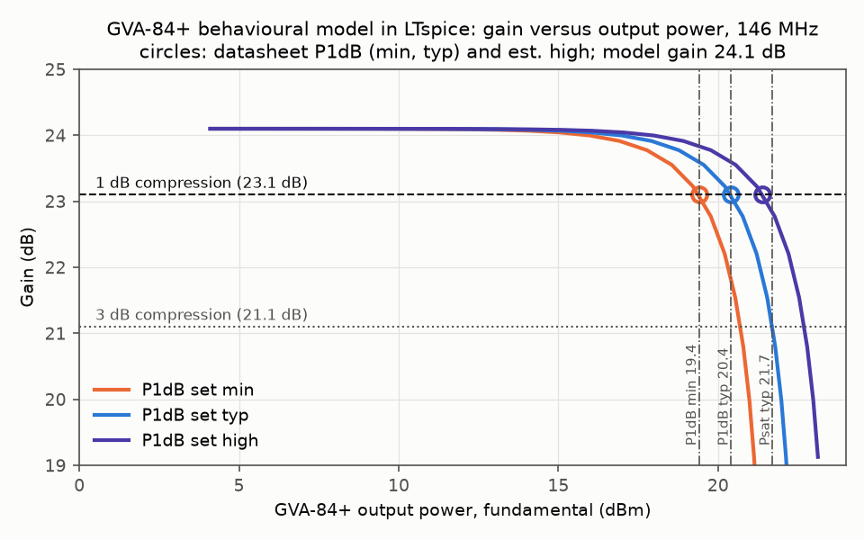

### 4.2 A5 drive window and the CLK1 interface (runs d2, d4, d5)

**Drive with the fixed 18 dB pad, coax 5 to 15 cm (d2, 810 corners, 25 C):**

| Quantity | Min | Nominal | Max | Limit | Verdict |
|---|---|---|---|---|---|
| Power into the RA07M1317M input, all corners | 5.4 mW (7.31 dBm) | 11.4 mW (10.57 dBm) | 35.5 mW (15.50 dBm) | 10 to 30 mW | **FAIL**: 195 corners under 10 mW, 28 over 30 mW |
| Same, coax 5 / 10 / 15 cm | 5.5 / 5.4 / 5.4 mW | - | 30.0 / 32.1 / 35.5 mW | 10 to 30 mW | 1 / 9 / 18 corners over 30 mW |
| Same, TS-012 criterion corners (25 and 50 ohm, gain 22.5 and 25.0 dB, 144 to 148 MHz, nominal Si5351 edge and VDDO) | 7.7 mW | - | 27.4 mW | 10 to 30 mW | **FAIL**: 81 of 108 inside |
| Overdrive margin, highest corner against 30 mW | - | - | -0.73 dB | at least 0 dB | **FAIL** (-0.83 dB with the 0.1 dB temperature allowance) |
| 3f relative to f at the GVA-84+ input | - | - | -30.9 dBc (worst) | at most -25 dBc | **PASS** |
| GVA-84+ input | - | - | -6.7 dBm | below +13 dBm | **PASS** |
| GVA-84+ output | - | 13.6 dBm | 18.5 dBm | P1dB min 19.4 dBm | 0.9 dB of back-off at the highest corner |

Corner definitions:
- Nominal: source 50 ohm, GVA gain 24.1 dB, P1dB set typ, 146 MHz, Si5351 case nom (VDDO 3.3 V, edge 1.0 ns, duty 0.50), coax 10 cm.
- Highest: source 25 ohm, gain 25.3 dB, P1dB set high, 144 MHz, Si5351 case high (VDDO 3.4 V, edge 0.5 ns, duty 0.50), coax 15 cm.
- Lowest: source 50 ohm, gain 22.5 dB, P1dB set min, 148 MHz, Si5351 case low (VDDO 3.2 V, edge 1.5 ns, duty 0.45), coax 10 cm.

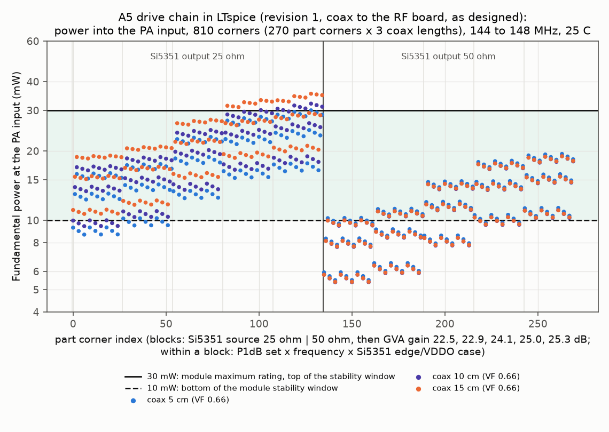

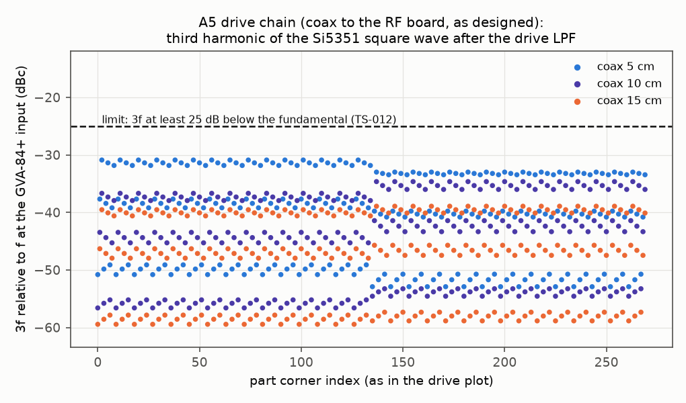

**Independent check.** The reviewer's phasor model of revision 0's corners with a lossless 50 ohm line gave 5.8 to 30.5, 5.7 to 32.7 and 5.7 to 36.2 mW at 5, 10 and 15 cm, with 1, 12 and 18 corners over 30 mW. d2 gives 5.5 to 30.0, 5.4 to 32.1 and 5.4 to 35.5 mW, with 1, 9 and 18 over. The maxima agree within 0.1 dB. The remaining difference is consistent with the 2 pF pin stub, which the reviewer's model did not have.

**The coax matters, and its length is not yet known (d4).** Over every electrical length of the line (0.5 to 70 cm), the fixed-pad A5 drive spans 5.4 to 48.6 mW. The highest step is the highest part corner at 144 MHz with 32.5 cm of coax. The overdrive margin with any length is -2.10 dB (-2.20 dB with the temperature allowance). Within the estimated 5 to 15 cm, the fixed-pad maximum rises 0.72 dB from 5 to 15 cm.

The time-step check reran 15 corners at a 10 ps maximum step against the 20 ps step of d2 and d3. The largest difference is 0.0005 dB in PA input power and 0.013 dB in 3f (criteria 0.02 and 0.5 dB): **PASS**.

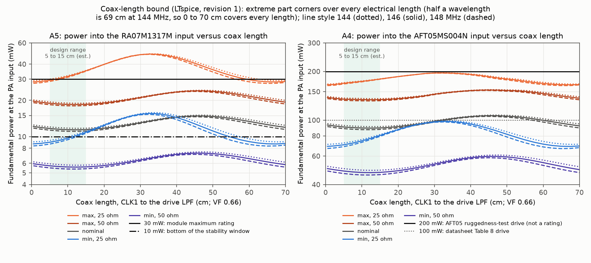

**Revision 0's "overdrive is designed out" is withdrawn.** With the fixed pad, the A5 drive exceeds the 30 mW maximum rating at 1 to 18 of the 270 part corners for each coax length from 5 to 15 cm, and by up to 2.1 dB at the worst length. Revision 0 had no line (section 2), so its highest corner, 29.5 mW (0.07 dB under 30 mW), was neither the design nor a bound. The fixed pad fails on both sides of the window: the spread over all corners is 8.2 dB against a window of 4.77 dB.

**Select-on-test pad (s1, estimate; revision 2, finding-4).** A one-time build alignment picks the drive pad from a set, with the module replaced by a 50 ohm load and the unit's own coax in place. The coax and every part constant are then measured out. It needs the REQ-SYS-144 delta of TS-012 section 8.10, which admits "drive pad selection" but is a Proposed row, not baselined: REQ-SYS-144 as baselined allows no adjustment, so C1 rests on the owner accepting that delta.

The pad set is built from real E24 1 % pi pads (return loss at least 25 dB), each next pad the largest within 0.8 dB of the last, from the lowest to the highest loss the d2 units need (13.51 to 21.50 dB). Revision 1 assumed 1 dB steps, but its own E24 table stepped by up to 1.38 dB. The revision 2 set has 14 pads with a largest gap of 0.77 dB, so the step term is half of that, 0.385 dB. In service four terms remain, and the band half-width is their worst-case sum:
- frequency: at most 0.34 dB across 144 to 148 MHz within any one unit, coax included, so 0.17 dB about the 146 MHz alignment point;
- half the set's largest gap: 0.385 dB;
- the level reading at about 17 mW: an **allocation of +/-1.0 dB**, not a characterized value (below);
- drift over -10 to +45 C and the supply: 0.3 dB (estimate, section 3.1: GVA-84+ 0.04 dB from its datasheet coefficient, passives under 0.05 dB, Si5351 edge and swing 0.2 dB).

| Select-on-test result | As designed (coax, pad on the RF board) | Option d5 (6 dB at the pin) |
|---|---|---|
| Pad set (E24 1 %) | 14 pads, 13.48 to 22.04 dB, largest gap 0.77 dB | 16 pads, 7.81 to 15.92 dB, largest gap 0.75 dB |
| Band half-width, worst-case sum | 1.85 dB | 1.82 dB |
| In-service drive at the +/-1.0 dB reading allocation | 11.3 to 26.5 mW (**PASS**, estimate) | 11.4 to 26.3 mW (**PASS**, estimate) |
| Overdrive margin to 30 mW, worst-case sum (root-sum-square) | +0.54 dB (+1.27 dB) | +0.57 dB (+1.27 dB) |
| Margin above 10 mW, worst-case sum | +0.53 dB | +0.56 dB |
| Largest reading uncertainty that still passes (break-even) | +/-1.54 dB | +/-1.57 dB |

**The level reading has no basis at 17 mW yet (finding-4 item ii).** The sensitivity (s1, as designed):

| Reading uncertainty | In-service drive | Overdrive margin | Verdict |
|---|---|---|---|
| +/-0.5 dB | 12.7 to 23.6 mW | +1.04 dB | PASS |
| +/-1.0 dB (the allocation) | 11.3 to 26.5 mW | +0.54 dB | PASS |
| +/-1.5 dB | 10.1 to 29.7 mW | +0.04 dB | PASS |
| +/-2.0 dB (tinySA Ultra alone) | 9.0 to 33.4 mW | -0.46 dB | **FAIL** |

The candidates:
- **The tinySA Ultra alone does not meet the allocation.** Its published "absolute power level accuracy after power level calibration of +/- 2dB" (tinysa.org, TinySA4 specification page, read 2026-09-28) gives -0.46 dB. The owner buys it later (status note 2026-09-28 section 1); the alignment is a build step, so the purchase date does not block the order.
- **The 1N5711 diode probe on the owner's Fluke 174** (status note 2026-09-28 section 2) reads about 1.3 V peak at 17 mW into 50 ohm, where the diode drop is a large fraction of the peak. 04 section 6.2 expects the probe's 10 to 15 % only at the 5 W level. With the probe's forward drop measured at DC at its own load current (bench supply and the Fluke 174, whose DC accuracy is +/-(0.15 % + 2)), the correction has a basis, but its residual at 17 mW is not shown.

So C1 passes only if the RF probe characterization case of 04 section 6.2 adds a point at about 17 mW and shows the probe, corrected for its forward drop and cross-checked against the tinySA, within +/-1.0 dB there (the allocation), or at worst within +/-1.54 dB (break-even, no margin).

The pad set (as designed; the nominal unit needs about 16.6 dB, the 16.52 dB pad, against the 18.42 dB fixed pad):

| Loss (dB) | Shunt, series, shunt (ohm) | Loss (dB) | Shunt, series, shunt (ohm) |
|---|---|---|---|
| 13.48 | 75, 110, 75 | 18.44 | 68, 220, 68 |
| 14.06 | 68, 110, 68 | 19.14 | 56, 200, 56 |
| 14.57 | 68, 120, 68 | 19.88 | 68, 270, 68 |
| 15.32 | 75, 150, 75 | 20.52 | 62, 270, 62 |
| 15.92 | 68, 150, 68 | 21.29 | 62, 300, 62 |
| 16.52 | 62, 150, 62 | 22.04 | 56, 300, 56 |
| 17.09 | 68, 180, 68 | | |
| 17.79 | 68, 200, 68 | | |

If the layout makes the coax longer than 15 cm, the d4 range at 146 MHz needs 13.5 to 22.9 dB, so the set grows by one pad.

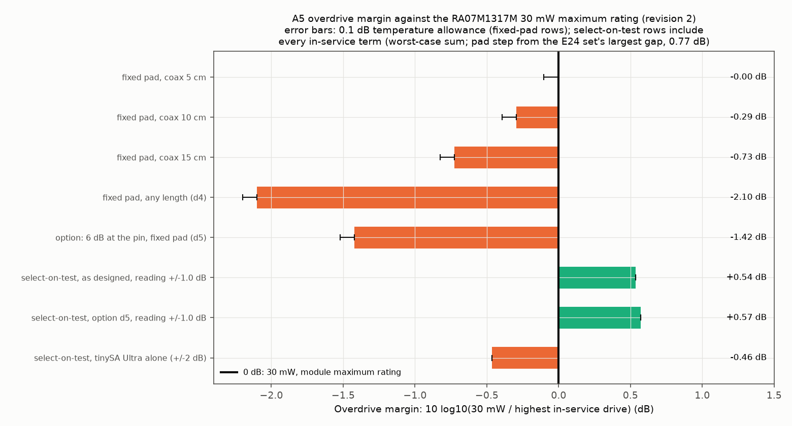

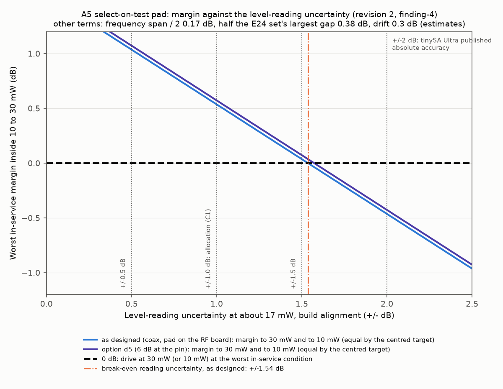

**Load on the CLK1 pin (finding-1).** As designed, the only lumped load on the pin is the tap and stub, 7 pF, against the Table 7 maximum of 15 pF (**PASS**, estimate). The line then presents the drive LPF's input impedance, rotated by the coax. At the fundamental the pin sees 36 to 65 ohm in magnitude. Its reactive part equals a shunt capacitance of 13.6 to 24.7 pF, the 7 pF included, rising with coax length: about 14 pF at 5 cm, 19 pF at 10 cm and 25 pF at 15 cm. Over every length (d4) the range is -16 to +30 pF.

Table 7's CL is a lumped capacitive load with no resistive part. Figure 16 recommends a 50 ohm line but does not say what may terminate it. The datasheet therefore neither covers nor forbids this load. What it does not show is that the output driver meets its Table 7 edge, duty and swing values into a load with more than 15 pF of equivalent capacitance.

This is sent to TS-012 as design request **DR-PAD-1** (section 7): either state the coax interface and accept this out-of-table use, or adopt the d5 pad.

**Option d5 (design request, not the TS-012 design).** A 6 dB pi pad (150 / 36 / 150 ohm, E24 1 %, 5.90 dB) on the main board at the CLK1 pin, before the coax, with the RF-board pad reduced to 12 dB (82 / 91 / 82 ohm). Three resistors, owned or inside the E2 row's allowance.

What it changes (d5, 810 corners):
- **Pin load.** The pin sees 43 to 52 ohm, with an equivalent shunt capacitance of 9.6 to 11.9 pF, under 15 pF at every corner.
- **Coax length.** The drive moves 0.2 dB from 5 to 15 cm (0.72 dB as designed).
- **3f.** The worst 3f at the GVA-84+ input improves to -35.4 dBc.
- **Level.** The fixed-pad spread stays 7.9 dB, so the select-on-test pad is still needed; its set becomes 8 to 16 dB.
- **Tap swing.** The CLK1 swing at the tap falls to 1.59 to 2.54 Vpp.

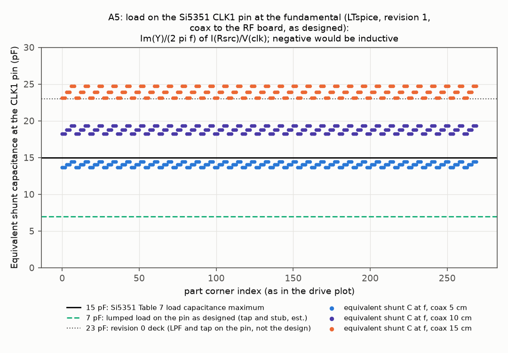

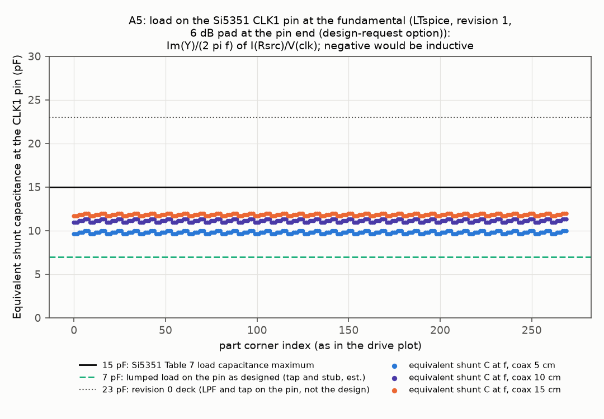

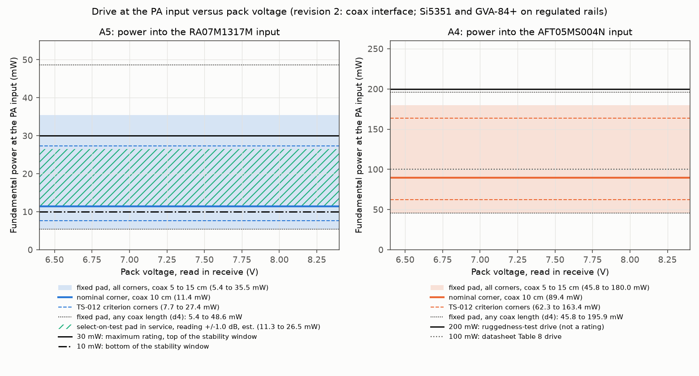

The Si5351 and the GVA-84+ run from regulated rails, so the drive is flat in pack voltage. The model does not include the LM2940 in dropout at the low pack end (section 6, and the uncertainty terms of section 4.4).

**Why the nominal drive is 11.4 mW, not the 20 mW TS-012 expected.** TS-012 took +10.4 dBm from an ideal 1.65 Vpp square wave. The trapezoid with the typical 1 ns edge gives 9.6 dBm of available fundamental at 146 MHz (-0.9 dB). The drive LPF, the tap and the 10 cm line then cost about 1.6 dB more. A 3-pole Butterworth-like filter with its corner at about 180 MHz is already about 1 dB down at 146 MHz, and the line adds a mismatch loss against the 50 ohm source.

### 4.3 A4 drive (run d3)

| Quantity | Min | Nominal | Max | Reference | Verdict |
|---|---|---|---|---|---|
| Power into the AFT05 input, all corners, coax 5 to 15 cm | 45.8 mW (16.6 dBm) | 89.4 mW (19.5 dBm) | 180.0 mW (22.6 dBm) | 0.1 W Table 8; 0.2 W ruggedness-test drive | Under 0.2 W at every corner (**PASS**, informative; the datasheet has no input rating). Margin +0.46 dB, +0.36 dB with the temperature allowance |
| Same, any coax length (d4) | 45.8 mW | - | 195.9 mW | 0.2 W | +0.09 dB; -0.01 dB with the temperature allowance |
| TS-012 criterion corners | 62.3 mW | - | 163.4 mW | - | - |
| 3f at the GVA-84+ input | - | - | -30.9 dBc | at most -25 dBc | **PASS** |
| GVA-84+ input | - | - | -0.2 dBm | below +13 dBm | **PASS** |

The corner definitions are those of section 4.2. The CLK1 pin load is the same as A5's (13.6 to 24.6 pF equivalent), so DR-PAD-1 applies to A4 as well.

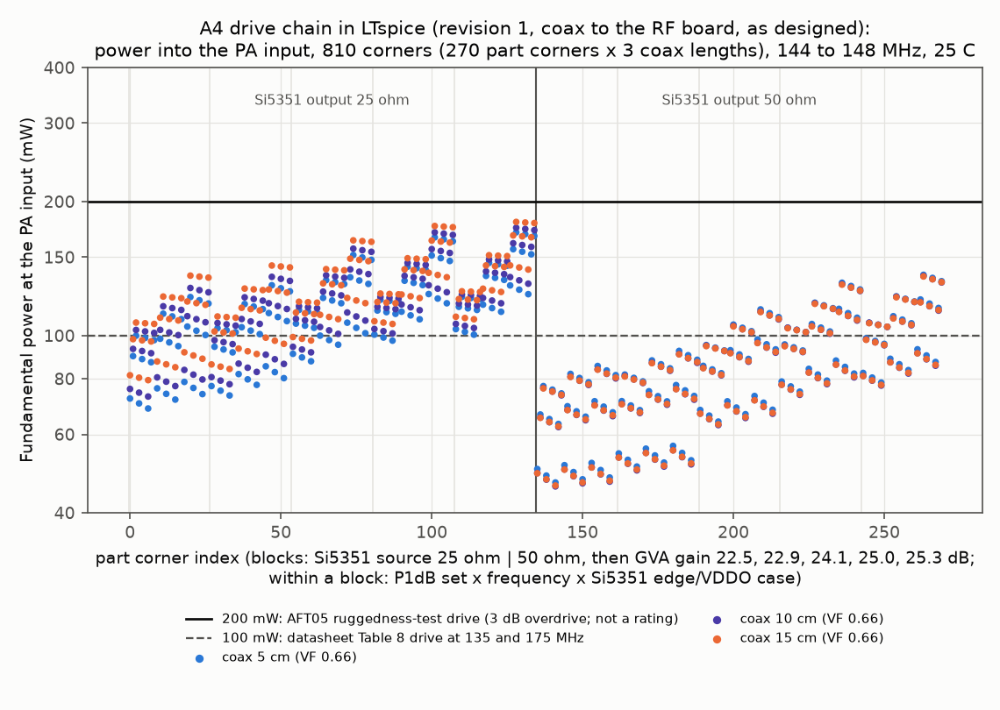

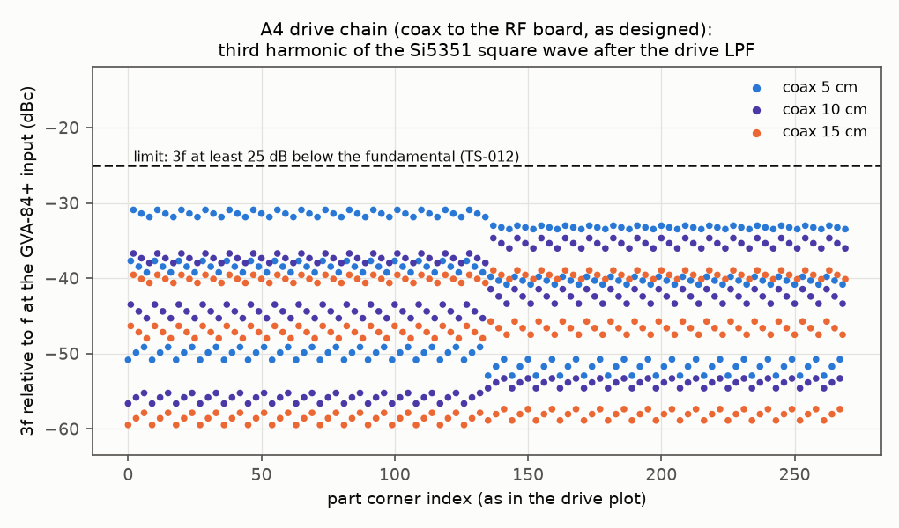

A4 runs the GVA-84+ into compression by design, so its drive spread (5.9 dB) is smaller than A5's. The low corner is set by the minimum gain and the minimum P1dB, and drive is the largest single term in A4's output spread (section 4.5).

### 4.4 Power at the SMA, A5 (runs p1 and p3)

**Definitions (finding-3).** Each figure is at 6.4 V pack; the run's `result.md` lists every parameter and the PA case temperature.
- **Nominal:** drain feed level 0.35 ohm (at 25 C part temperature), efficiency 0.60, the nominal drive of d2 (10.57 dBm), 146 MHz, VGG 3.27 V (the clamp nominal), typical module, output loss 0.84 dB (LPF median).
- **Lowest:** the smallest output over the as-designed corners (VGG 3.08 to 3.46 V) with the typical module, given at the LPF median (loss at most 0.84 dB) and at the LPF worst case (1.86 dB).
- **Highest:** the largest output over the as-designed corners.
- **With C2 and C3** (the "lever figure"): the smallest output over the corners with the drain feed level at most 0.35 ohm (C2) and VGG 3.30 V (C3), typical module, at the LPF median and at the LPF worst case. At 25 C key-down this is feed 0.394 ohm (the 0.35 ohm level at its key-down temperatures), efficiency 0.45, drive 7.31 dBm, 148 MHz, output loss 0.84 dB, PA case 59 C.
- **Every design lever at its best:** feed level 0.26 ohm, VGG 3.46 V and output loss 0.5 dB together, typical module; the other inputs at their worst. No design choice inside this note's ranges does better, and the 0.5 dB is below every LPF build of the LPF analysis.

**At 6.4 V pack, per temperature case (p1, drive as designed):**

| Case | PA case at the C2 and C3 corner | Nominal | Lowest, LPF median | Lowest, LPF worst | With C2 and C3, LPF median | With C2 and C3, LPF worst | Every design lever at its best |
|---|---|---|---|---|---|---|---|
| 25 C, start of key-down (informative) | 25 C | 4.33 W | 3.48 W | 2.75 W | 3.94 W (-0.04 dB) | 3.11 W (-1.06 dB) | 4.61 W (+0.65 dB) |
| 25 C key-down, -0.005 dB/K | 59 C | 4.09 W | 3.19 W | 2.47 W | 3.66 W (-0.36 dB) | 2.83 W (-1.46 dB) | 4.37 W (+0.42 dB) |
| 25 C key-down, -0.015 dB/K | 57 C | 3.94 W | 3.04 W | 2.36 W | 3.46 W (-0.60 dB) | 2.68 W (-1.71 dB) | 4.09 W (+0.13 dB) |
| -10 C key-down, no PA cold gain | 23 C | 4.09 W | 3.16 W | 2.49 W | 3.68 W (-0.34 dB) | 2.89 W (-1.38 dB) | 4.41 W (+0.45 dB) |
| +45 C key-down, -0.005 dB/K | 78 C | 3.94 W | 3.06 W | 2.35 W | 3.52 W (-0.53 dB) | 2.70 W (-1.67 dB) | 4.23 W (+0.27 dB) |
| +45 C key-down, -0.015 dB/K | 75 C | 3.66 W | 2.83 W | 2.17 W | 3.22 W (-0.91 dB) | 2.47 W (-2.06 dB) | 3.83 W (-0.16 dB) |
| +45 C, case 100 C bound, -0.005 dB/K | 100 C | 3.81 W | 2.99 W | 2.30 W | 3.45 W (-0.61 dB) | 2.65 W (-1.76 dB) | 4.15 W (+0.19 dB) |
| +45 C, case 100 C bound, -0.015 dB/K | 100 C | 3.29 W | 2.62 W | 2.01 W | 3.00 W (-1.21 dB) | 2.31 W (-2.36 dB) | 3.58 W (-0.45 dB) |

**The same with the select-on-test drive (p3; 11.3 / 17.3 / 26.5 mW):**

| Case | Nominal | With C2 and C3, LPF median | With C2 and C3, LPF worst | Every design lever at its best |
|---|---|---|---|---|
| 25 C, start of key-down (informative) | 4.40 W | 4.10 W (+0.14 dB) | 3.24 W (-0.88 dB) | 4.82 W (+0.84 dB) |
| 25 C key-down, -0.005 dB/K | 4.15 W | 3.81 W (-0.19 dB) | 2.95 W (-1.29 dB) | 4.56 W (+0.60 dB) |
| 25 C key-down, -0.015 dB/K | 4.00 W | 3.59 W (-0.44 dB) | 2.78 W (-1.54 dB) | 4.26 W (+0.31 dB) |
| -10 C key-down, no PA cold gain | 4.15 W | 3.82 W (-0.17 dB) | 3.01 W (-1.20 dB) | 4.58 W (+0.62 dB) |
| +45 C key-down, -0.005 dB/K | 4.00 W | 3.66 W (-0.36 dB) | 2.81 W (-1.50 dB) | 4.42 W (+0.46 dB) |
| +45 C key-down, -0.015 dB/K | 3.72 W | 3.35 W (-0.74 dB) | 2.57 W (-1.89 dB) | 3.99 W (+0.02 dB) |
| +45 C, case 100 C bound, -0.005 dB/K | 3.87 W | 3.59 W (-0.44 dB) | 2.76 W (-1.58 dB) | 4.34 W (+0.39 dB) |
| +45 C, case 100 C bound, -0.015 dB/K | 3.35 W | 3.14 W (-1.03 dB) | 2.41 W (-2.17 dB) | 3.75 W (-0.25 dB) |

What moved from revision 1 (whose lever figure was 4.28 W, +0.32 dB, at 25 C):
- **Self-heating (finding-9).** At 25 C in steady key-down the module case sits at 57 to 60 C at the lever corner, not 25 C; the drain-feed parts are warm too (0.394 ohm at the C2 level, not 0.35). That costs 0.32 to 0.58 dB against the start of a key-down at 25 C.
- **VGG (finding-3).** The lever figure is now at 3.30 V, not 3.5 V; the nominal corner is at 3.27 V. VGG across the clamp range moves the output by 0.37 dB on average (sensitivity below).
- **The output LPF (X-5).** 0.84 dB at the median against revision 1's 0.6 dB top corner.

Even the 25 C start of a key-down (the datasheet condition) with both levers gives only 3.94 W (p1) and 4.10 W (p3) at the LPF median.

Further figures:
- The drain sits at 5.72 V at the nominal corner (5.23 V lowest) under key-down sag at 6.4 V, 25 C key-down.
- The nominal corner reaches 5.0 W from 7.15 V (25 C key-down); it is under 5.0 W at the low end in every case. The datasheet-minimum module with C2 and C3 at the LPF median gives 2.99 W at 25 C key-down (-1.23 dB) and 2.43 W at the worst bound case (-2.14 dB).
- Sensitivity at 6.4 V, 25 C key-down (the dB spread of each input over its values, averaged over the other corners; p1):
  - output loss 0.5 to 1.86 dB: 1.48 dB;
  - across the temperature cases: 1.22 dB;
  - module spread (typical against datasheet minimum): 0.91 dB;
  - drain feed: 0.56 dB;
  - VGG 3.08 to 3.46 V: 0.37 dB;
  - drive: 0.34 dB (0.13 dB in p3);
  - efficiency: 0.27 dB; frequency: 0.03 dB.
- **Open loop at 8.4 V** (VGG at the clamp maximum 3.46 V): the module makes 9.38 W at the highest corner in 25 C key-down (8.30 W at the SMA), and 10.68 W at the -10 C start of a key-down with the +0.53 dB estimate (9.58 W at the SMA). The highest corner exceeds the 8 W stability guarantee from 7.7 V (25 C key-down) and from 7.2 V (-10 C start), and the 10 W maximum rating from 8.1 V at -10 C. At +45 C the open-loop module case reaches 109 C in steady key-down. The ALC must hold 5 W. The open-loop case needs the pack-dependent clamp TS-012 names as the WP-PDR-22 fallback, and WP-PDR-22 should take the cold start.

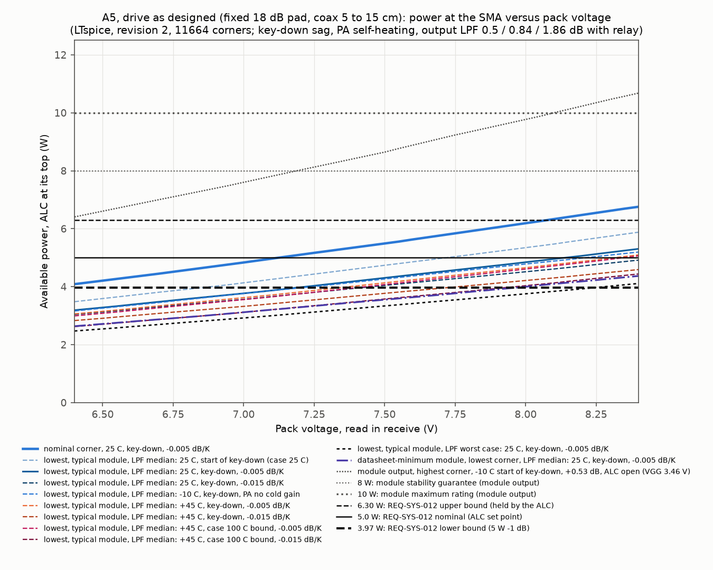

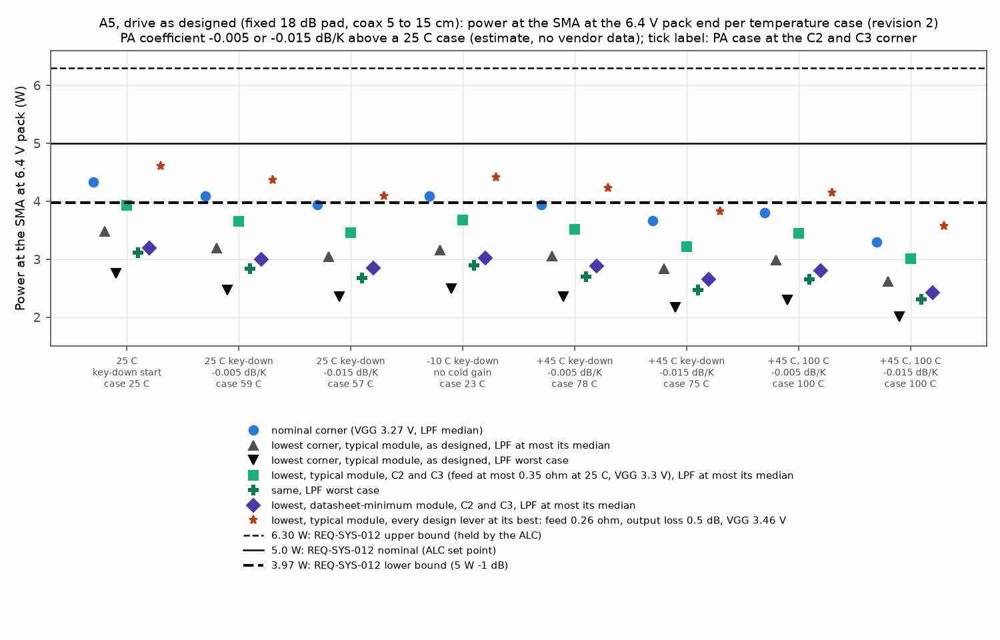

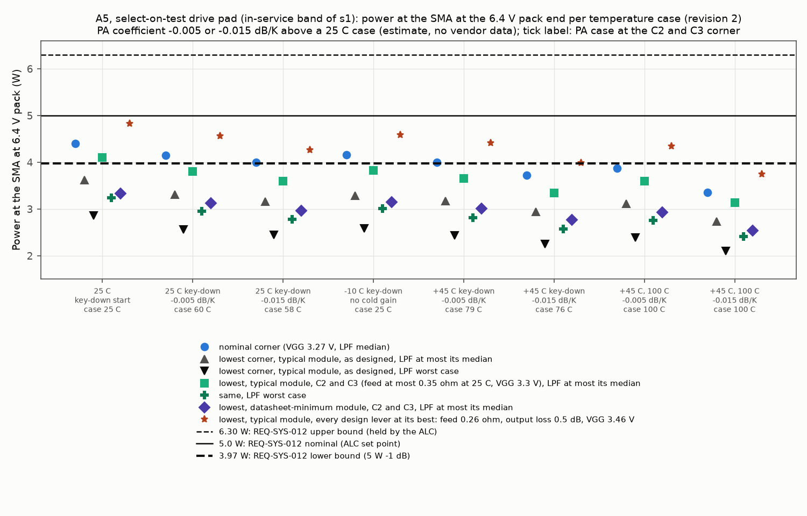

**The closure margin against its uncertainty (finding-2, E3).** Three terms are not carried as corners (s1):
- the RA07M1317M graph read: +/-0.07 dB;
- the GVA-84+ with the LM2940 in dropout at 6.4 V: -0.05 to 0 dB (the digitized Pout-Pin slope is about 0.08 dB per dB of drive below 10 dBm);
- the GVA-84+ gain at 146 MHz below its 0.1 GHz value (finding-8, section 6 item 4): -0.03 to 0 dB.

Revision 1's fourth term, the LPF loss above its allocation, is now a corner of the output loss. Added in the worst direction (-0.15 / +0.07 dB), the terms give these ranges for the C2 and C3 figure at the LPF median (the full table at both LPF states is in the s1 `result.md`):

| Case | p1 margin (dB) | p1 with the terms (dB) | p3 margin (dB) | p3 with the terms (dB) |
|---|---|---|---|---|
| 25 C, start of key-down (informative) | -0.04 | -0.19 to +0.03 | +0.14 | -0.01 to +0.21 |
| 25 C key-down, -0.005 dB/K | -0.36 | -0.51 to -0.29 | -0.19 | -0.34 to -0.12 |
| 25 C key-down, -0.015 dB/K | -0.60 | -0.75 to -0.53 | -0.44 | -0.59 to -0.37 |
| -10 C key-down | -0.34 | -0.49 to -0.27 | -0.17 | -0.32 to -0.10 |
| +45 C key-down, -0.005 dB/K | -0.53 | -0.68 to -0.46 | -0.36 | -0.51 to -0.29 |
| +45 C key-down, -0.015 dB/K | -0.91 | -1.06 to -0.84 | -0.74 | -0.89 to -0.67 |
| +45 C, case 100 C, -0.005 dB/K | -0.61 | -0.76 to -0.54 | -0.44 | -0.59 to -0.37 |
| +45 C, case 100 C, -0.015 dB/K | -1.21 | -1.36 to -1.14 | -1.03 | -1.18 to -0.96 |

So C2 and C3 do not close REQ-SYS-012's 6.4 V end in any steady key-down case, even with the select-on-test drive and the LPF at its median. With the unmodelled terms the figure is -0.10 to -0.75 dB at 25 C and -10 C (p1 and p3) and down to -1.36 dB hot. At the LPF worst case it is -1.13 to -2.51 dB in the key-down cases. Revision 1's "closable before the order at 25 C" is withdrawn. Only the stack of every design lever at its best reaches 3.97 W (before the unmodelled terms), and it needs an output filter at the 0.5 dB allocation that no LPF build meets. Even then it fails, or passes by +0.02 dB before the unmodelled terms, in the +45 C, -0.015 dB/K cases (p1 -0.16 and -0.45 dB; p3 +0.02 and -0.25 dB). (Revision 3, INSP-114 finding-11 (i).)

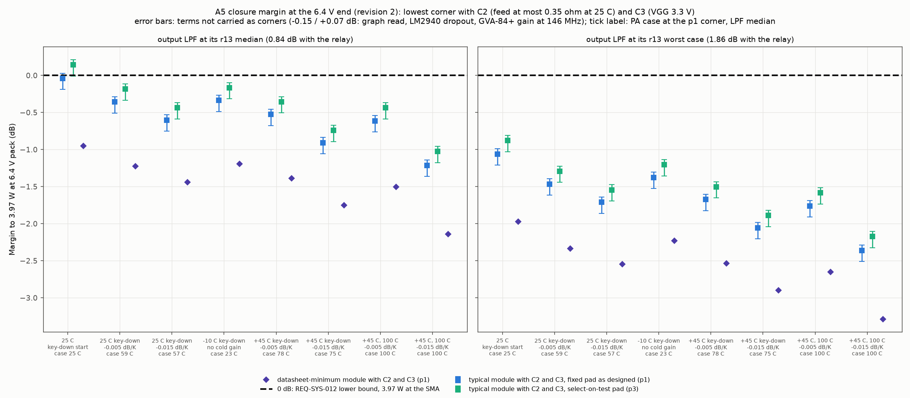

**Correction to a TS-012 input (revision 0, unchanged).** TS-012 and `docs/research/pa-device-candidates.md` F8 read 5.3 W at 6.0 V and 10.5 W at 8.4 V from the 155 MHz Pout versus VDD curve. The digitized curve gives 5.85 W and 10.92 W at 155 MHz (6.27 W and 11.37 W at 135 MHz). The typical module is therefore about 0.4 dB stronger at the low end than TS-012 assumed.

TS-012's "3.97 to 4.57 W at the SMA" at 6.4 V used the typical curve only. It left out:
- the datasheet-minimum module (-1.0 dB at 146 MHz: 6.5 W against 8.18 W typical at 7.2 V);
- the VGG clamp (3.08 to 3.46 V, not 3.5 V);
- the efficiency and drive corners;
- temperature and self-heating;
- the LPF loss the LPF analysis now reports (0.74 dB median, 1.76 dB worst case, against 0.4 dB).

It is a nominal range, not a bound.

### 4.5 Power at the SMA, A4 (run p2)

| At the pack voltage | Nominal | Lowest, LPF median | Lowest, LPF worst | Every design lever at its best | Highest |
|---|---|---|---|---|---|
| 6.4 V, 25 C start of key-down (informative) | 3.22 W | 1.79 W | 1.42 W | 2.30 W | 4.41 W |
| 6.4 V, 25 C key-down, -0.005 dB/K | 3.06 W | **1.69 W (FAIL)** | 1.31 W | 2.22 W | 4.24 W |
| 6.4 V, 25 C key-down, -0.015 dB/K | 2.95 W | 1.64 W | 1.27 W | 2.13 W | 4.04 W |
| 6.4 V, worst case (+45 C, case 100 C bound, -0.015 dB/K) | 2.44 W | 1.35 W | 1.03 W | 1.77 W | 3.40 W |
| 8.4 V, 25 C key-down, -0.005 dB/K | - | - | - | - | 7.96 W (device output) |

- At 25 C key-down the nominal corner reaches 3.97 W from 7.3 V and 5.0 W from 8.25 V. The lowest corner, even at the LPF median, stays under 3.97 W over the whole 6.4 to 8.4 V range in every temperature case. The AFT05 case (tab) sits at 43 to 44 C at the nominal corner in 25 C key-down.
- Nominal corner: feed level 0.35 ohm (0.394 ohm at 25 C key-down), efficiency 0.67, drive 89.4 mW, 146 MHz, n 2.0, hand-match loss 0.25 dB, output loss 0.84 dB.
- Lowest corner: feed level 0.45 ohm, efficiency 0.55, drive 45.8 mW, 144 MHz, n 2.3, hand-match loss 0.5 dB, output loss 0.84 dB (LPF median) or 1.86 dB (LPF worst).
- Every design lever at its best (feed 0.26 ohm, output loss 0.5 dB, no extra match loss) is still 2.5 dB short at 25 C key-down.
- Sensitivity at 6.4 V, 25 C key-down:
  - drive (46 to 180 mW): 1.94 dB;
  - output loss: 1.48 dB;
  - across the temperature cases: 1.24 dB;
  - VDD exponent 0.44 dB, hand-match loss 0.43 dB, feed 0.42 dB, frequency 0.22 dB, efficiency 0.15 dB.
- TS-012's "about 3.2 W at 6.4 V" (adversarial C2) is close to the 25 C start-of-key-down nominal (3.22 W). It is a nominal figure; the corners and the LPF loss take A4 well below it.

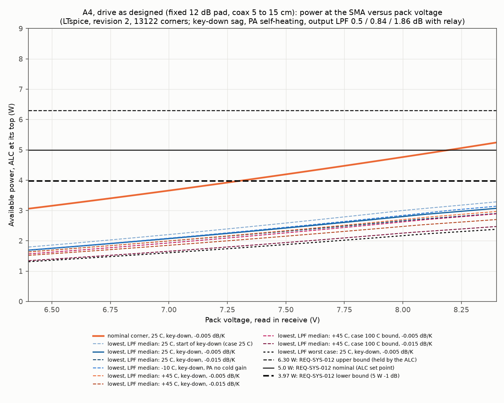

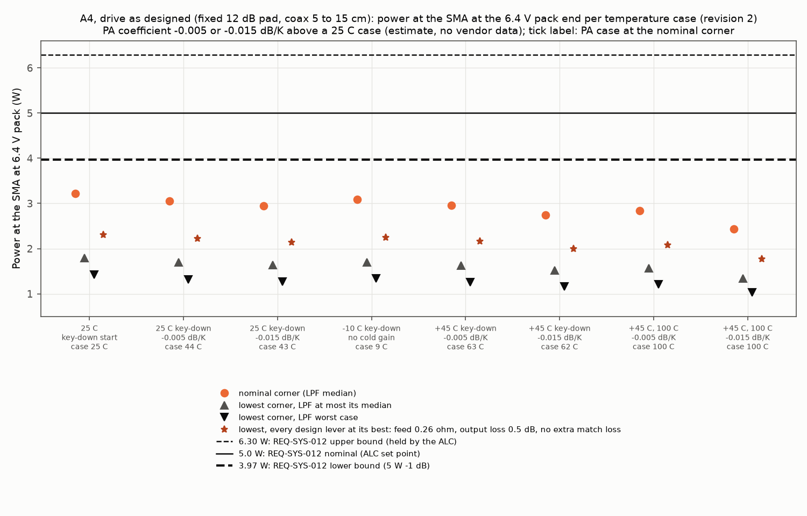

### 4.6 Both finalists

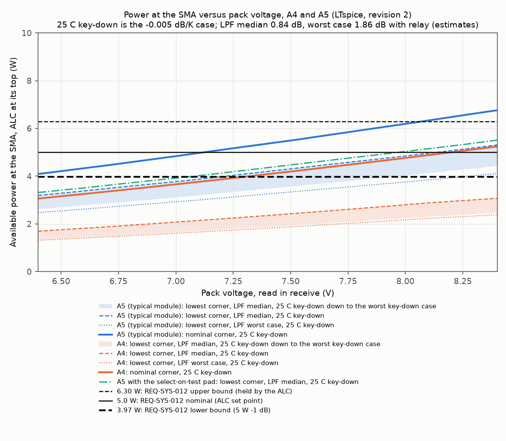

### 4.7 Other observations

- **CLK1 swing for the prescaler (INSP-110 O-5; input to WP-PDR-20).** With the coax interface, the CLK1 pin swings 1.66 to 3.67 Vpp across the corners (1.59 to 2.54 Vpp with the d5 pad). Revision 0 gave 2.22 to 3.24 Vpp with the LPF on the pin.

  Against the 1.2 V between the 74LVC1G80's VIL 0.8 V and VIH 2.0 V, the lowest swing leaves about 0.46 V of total margin (0.39 V with d5) with the bias midway. That is O-5's thin margin again, not revision 0's 1.0 V.

  The WP-PDR-20 valid-clock run of the tap (`hardware/sim/freq`) should take this interface and its lowest swing.
- **3f criterion.** It holds for both chains with at least 5.9 dB of margin (worst at the 25 ohm, fast-edge corners; 10.4 dB with d5).
- **The line and the 3f criterion.** The coax rotates the LPF's input impedance at 3f as well, so the 3f margin fell from 9.4 dB (revision 0) to 5.9 dB. The criterion still holds at every corner of d2 and d3. d4 does not report 3f over the whole length sweep.

## 5. Verdicts per finalist

**A5 (RA07M1317M): FAIL as designed. REQ-SYS-012 at the 6.4 V end is not shown in any steady key-down case, even with C2, C3 and the select-on-test pad. Revision 1's "closable before the order at 25 C and -10 C" is withdrawn (finding-9).**
- (a) **Drive window.** The fixed pad does not keep the module inside 10 to 30 mW. The drive falls under 10 mW at 195 of 810 corners and exceeds the 30 mW maximum rating at 28, by up to 0.73 dB with 5 to 15 cm of coax and up to 2.1 dB at the worst coax length.

  The select-on-test pad (C1) meets the criterion if the level reading at about 17 mW is within its +/-1.0 dB allocation. The drive is then 11.3 to 26.5 mW in service (estimate), an overdrive margin of +0.54 dB when every term adds in the worst direction (+1.27 dB root-sum-square). The pad set now has real E24 steps (largest gap 0.77 dB). The reading is the open term: the tinySA Ultra's published +/-2 dB alone gives -0.46 dB (FAIL), and the diode probe has no characterization at this level. C1 also needs the owner to accept the Proposed REQ-SYS-144 delta.
- (b) **CLK1 pin load.** As designed, the lumped load is 7 pF (within 15 pF). The line-fed LPF, however, looks like 14 to 25 pF at the fundamental, a load Table 7 does not cover. DR-PAD-1 goes to TS-012: state the interface and accept it, or adopt the 6 dB pin pad of d5, which keeps the equivalent load at 9.6 to 11.9 pF.
- (c) **REQ-SYS-012 at 6.4 V, 25 C.** In steady key-down (module case 57 to 60 C at the lever corner) the lowest corner with C2 and C3 is 3.66 and 3.46 W (p1, -0.005 and -0.015 dB/K) or 3.81 and 3.59 W (p3), against 3.97 W, with the LPF at its median. That is -0.19 to -0.60 dB, -0.12 to -0.75 dB with the unmodelled terms. At the LPF worst case it is -1.29 to -1.71 dB. The nominal corner is 4.09 and 3.94 W (+0.13 and -0.04 dB). Only at the start of a key-down (the datasheet condition) does the p3 lever figure reach 4.10 W (+0.14 dB).
- (d) **REQ-SYS-012 over REQ-SYS-114.** At -10 C key-down the lever figure is -0.34 dB (p1) or -0.17 dB (p3). At +45 C it is -0.36 to -1.21 dB, and the nominal corner itself falls under 3.97 W in every hot case except p3 at -0.005 dB/K (+0.03 dB). The hot result rests on the estimated PA coefficient (no vendor data); the 25 C result now does too, through self-heating.
- (e) **What design levers can reach.** With every lever of this note at its best at once (feed 0.26 ohm, VGG 3.46 V, output loss 0.5 dB), the lowest corner reaches 3.97 W before the unmodelled terms in every key-down case but the hottest (p1: all but the two +45 C, -0.015 dB/K cases, with +0.13 to +0.45 dB at 25 C and -10 C; p3: all but the 100 C bound at -0.015 dB/K). But 0.5 dB of output loss is the TS-012 allocation that no LPF build meets (LPF analysis revision 2). The largest single term is now the output LPF (1.48 dB across its corners), so each 0.1 dB the filter loses less is 0.1 dB of closure margin.
- (f) **Datasheet-minimum module.** With both levers at the LPF median it makes 2.99 W at 25 C key-down (-1.23 dB) and 2.43 W at the worst bound case (-2.14 dB).
- (g) **Open loop.** Open loop at 8.4 V the module exceeds its 8 W stability guarantee from 7.7 V at 25 C key-down, as TS-012 anticipated for WP-PDR-22. At the -10 C start of a key-down it may also exceed its 10 W maximum rating from 8.1 V (10.68 W at 8.4 V, estimate). At +45 C the open-loop case puts the module case at 109 C.

**A4 (AFT05MS004N): FAIL for REQ-SYS-012; drive acceptable.**
- The drive stays under the 0.2 W ruggedness-test level with 5 to 15 cm of coax (+0.46 dB), and has about 0 dB of margin at the worst length. The 3f criterion passes.
- Output at the SMA misses 3.97 W at 6.4 V at the nominal corner: 3.06 W at 25 C key-down (-1.13 dB), 2.44 W at the worst bound case. At 25 C key-down the nominal corner reaches 3.97 W only from 7.3 V. The lowest corner misses 3.97 W across the whole pack range in every temperature case, even at the LPF median (1.69 W at 6.4 V, 25 C key-down). Every design lever at its best is still 2.5 dB short. The requirement delta TS-012 carries for A4 at the 6.4 V end therefore understates the shortfall: at the lowest corner it reaches up to 8.4 V.
- The largest terms are the GVA-84+ drive spread (1.9 dB), the output LPF (1.5 dB) and temperature (1.2 dB), then the estimated VDD scaling and hand-match loss. The last two have no vendor data and carry Low confidence.

**For the TS-012 choice.** On the drive and output-power questions A5 is still the stronger finalist. Its nominal at 6.4 V, 25 C key-down, is 4.09 W against A4's 3.06 W (1.3 dB), and its lowest corner is 3.19 W against A4's 1.69 W (2.8 dB), both at the LPF median. Neither finalist shows REQ-SYS-012 at the 6.4 V end in any steady key-down case. For both, the low-end closure is now a requirement or test decision (C4, C8), with the output-filter loss (C10) as the largest design lever. The delta each finalist needs differs:
- **A5:** TS-012's conditional "+1/-1.5 dB at the 6.4 V end" covers every key-down case with C2 and C3 at the LPF median, with the unmodelled terms (worst -1.36 dB, p1). It does not cover the LPF worst case (to -2.51 dB) or the datasheet-minimum module at the worst hot case (-2.14 dB).
- **A4:** "+1/-2 dB" covers none of its lowest-corner key-down cases (-3.7 to -4.7 dB at the LPF median).

## 6. Limitations

1. **Graph reads.** Every PA curve is typical data digitized from a vendor plot (estimated reading error about +/-0.1 W on the RA07M1317M and +/-0.1 W on the AFT05 axes). The only guaranteed PA figure used is the RA07M1317M 6.5 W minimum. It is applied as a uniform scale at every voltage (estimate).
2. **Separable module model, and the direction of the VGG terms (finding-3).** The RA07M1317M drive, VGG and VDD dependences are multiplied as independent factors, each read at 7.2 V. Two effects pull in opposite directions:
   - The VGG factor taken at 7.2 V is likely pessimistic at a low drain voltage, where the module saturates at a lower VGG.
   - The drive factor comes from the Pout-Pin curve at VGG 3.5 V, the only one published. At VGG 3.08 to 3.30 V the module is less saturated, so its output depends more on drive than that curve shows. At the lowest drive corner (7.3 dBm, 5.4 mW) with the lowest clamp, the model is therefore likely optimistic, by an amount the datasheet does not allow to be read. The lever figures at 3.30 V with the select-on-test drive (at least 11.3 mW) are less exposed.

   The net direction is not known.
3. **The AFT05 has no VHF Pout versus VDD data.** The (Vd/7.5)^n law and the hand-match loss are estimates. The A4 results carry Low confidence until the match is designed in LTspice from the NXP Zsource and Zload table (TS-012 section 7.3).
4. **Behavioural GVA-84+ (finding-8).** TS-012 section 7.3 names "the GVA-84+ S-parameters" for this check. This note uses instead a flat 50 ohm block with the 0.1 GHz gain limits, memoryless, at 5.0 V. The departure is small at the ports: Rev. F gives 22.9 and 23.3 dB input and output return loss at 0.1 GHz. But Rev. F gives typical gain only at 0.1 GHz (24.1 dB) and 1.0 GHz (21.7 dB), so at 146 MHz the typical gain is 0.1 dB (linear in frequency) to 0.4 dB (linear in log frequency) below the value used (estimate). Direction:
   - it is conservative for the fixed-pad overdrive results;
   - it is optimistic by up to 0.4 dB for the under-drive corners (the 10 mW floor and A4's drive);
   - the select-on-test pad measures it out;
   - on the A5 closure figure it is the -0.03 dB term.

   The gain and P1dB with the 5 V bus in LM2940 dropout at the low pack end are not modelled either; they are the -0.05 dB closure term. The P1dB "min" set is taken to cover 4.75 to 5.25 V; below that the A4 drive falls further.
5. **50 ohm PA inputs.** Both datasheets specify Pin with a 50 ohm source (ZG = 50 ohm). The RA07M1317M input VSWR (up to 4:1) and the AFT05 reference-circuit input match are therefore inside the curves, not modelled separately. The GVA-84+ output and the 3 dB pad sit between them and the drive chain.
6. **Si5351 output.** The output is a linear Thevenin source. The real driver's output resistance may vary within a cycle, and the 25 ohm corner has no datasheet basis (typical 50 ohm only).
7. **The CLK1 interface is an estimate of a layout that does not exist yet.** The coax length (5 to 15 cm), its velocity factor, the lossless line, the 5 pF tap and the 2 pF stub are estimates. d4 bounds the length, but not a different line impedance or a coplanar trace in place of the coax. The select-on-test pad measures all of these out at build; the fixed-pad results do not.
8. **Temperature (findings 2 and 9).** The PA output coefficient (-0.005 to -0.015 dB/K) has no vendor data and now governs the 25 C result too, through self-heating. The thermal inputs are estimates: the case-to-ambient resistance from WP-PDR-28 (a lumped model, band +19.9 / -9.6 K on the A5 case), the feed-part rises and coefficients, and the bay-air rise of the copper term. The cell multipliers are a graph read of a steady 2.8 A discharge. The cold low-bound case takes no PA gain below a 25 C case, which is conservative; the +0.53 dB cold case is used only for the open-loop question. Direction: if the true coefficient is nearer 0 than -0.005 dB/K, the key-down margins improve by up to about 0.2 dB at 25 C and 0.3 dB at +45 C. At -0.015 dB/K they stand as shown.
9. **The output loss comes from the LPF analysis revision 2, which is itself Draft.** The median (0.74 dB) and worst case (1.76 dB) are those of its recommended build r13 (BOM values, 2 % parts), plus a 0.1 dB relay estimate. If TS-012 chooses another build, or the LPF review changes the numbers, p1 to p3 are rerun (C6). The LPF analysis proposes measuring the loss on every unit with the NanoVNA; the per-unit figure then replaces the corner.
10. **No ALC loop.** This note gives the power available with the control at its top. Holding 5 W, overshoot and the open-loop dynamics are WP-PDR-22.
11. **Estimated terms.** Drain feed resistance, bus current and efficiency are estimates (section 3). The feed resistance is itself a TS-012 pre-order read (DMP3099L RDS(on), MF-R300 R1max).
12. **Polyfuse at the hot corner (not modelled).** The MF-R300's hold current falls with temperature, so at 55 to 60 C main-bay air and 2 A key-down it may approach its trip region. Only its resistance rise is modelled here; the trip margin belongs to WP-PDR-24.

## 7. What closes before the order

| Item | Finalist | Action | Pass criterion |
|---|---|---|---|
| C1 | A5 | Adopt a select-on-test drive pad. Put a pi footprint on the RF board, nominal 16.5 dB, with the build set of 14 E24 1 % pads, 13.48 to 22.04 dB, largest gap 0.77 dB (section 4.2; owned through-hole or 0805). Add a build-alignment step with the unit's own coax in place: module replaced by a 50 ohm load, level read at about 17 mW. Revision 2 (finding-4): (i) the reading method must be shown within +/-1.0 dB at 17 mW: the RF probe characterization case of 04 section 6.2 adds a 17 mW point (1N5711 probe on the Fluke 174, forward drop measured at DC at its load current, cross-checked on the tinySA Ultra once bought). The tinySA alone (+/-2 dB published) does not meet it. (ii) The owner accepts the REQ-SYS-144 delta of TS-012 section 8.10 (Proposed), without which no build adjustment is allowed | Drive 10 to 30 mW at every in-service condition: 11.3 to 26.5 mW at the +/-1.0 dB allocation (estimate), overdrive margin +0.54 dB; the characterization shows the reading within +/-1.0 dB (+/-1.54 dB is the break-even). A rerun of d2 with the chosen pad set, the laid-out coax length and the measured level reproduces it |
| C2 | A5 | Close the TS-012 feed-resistance read: DMP3099L RDS(on) at VGS -6 V and MF-R300 R1max from the datasheets. Also read the DMP3099L and AO3400A RDS(on) against junction temperature, and the MF-R300 resistance and hold-current derating at 60 C | Total feed at most 0.35 ohm with every part at 25 C (TS-012 criterion). With this note's rises and coefficients that is 0.394 ohm at 25 C key-down, 0.452 ohm at -10 C key-down and 0.418 ohm at +45 C key-down; the read coefficients replace the estimates. Rerun p1 with the read values |
| C3 | A5 | In WP-PDR-22, adopt the pack-dependent VGG clamp TS-012 names as the open-loop fallback, and set it so that VGG at the 6.4 V pack end is 3.30 to 3.50 V over the LM2940 range, the resistor tolerance and the op-amp headroom. 3.5 V is the RA07M1317M "Pout 10 W at VGG 3.5 V or less" rating condition; the as-designed clamp gives 3.08 to 3.46 V. Revision 2 (finding-3): this note's lever figures are at 3.30 V; from 3.08 to 3.46 V the output moves 0.37 dB on average | The WP-PDR-22 deck shows VGG 3.30 to 3.50 V at 6.4 V, and the module output at most 8 W at the open-loop corner at 8.4 V at the -10 C start of a key-down (+0.53 dB case). C3 no longer carries a REQ-SYS-012 pass figure: C2 and C3 together do not close it (section 4.4); that is C4 and C8 |
| C4 | A5 | Owner decision on the REQ-SYS-012 low end for A5 (revision 2: now for the typical module too, not only the datasheet-minimum one). Either the conditional delta of TS-012 section 8.10 ("+1/-1.5 dB at the 6.4 V end") made firm, or acceptance on TC-SYS-011 with the risk kept. TS-012 section 7.1's "0.0 to 0.6 dB margin at 6.4 V" is re-quantified here, with C2 and C3 at 25 C key-down, as -0.36 to -0.60 dB (fixed pad) and -0.19 to -0.44 dB (select-on-test) at the LPF median, and -1.29 to -1.71 dB at the LPF worst case. The nominal corner is +0.13 to -0.04 dB, and a datasheet-minimum module is down to -2.1 dB | Owner decision recorded in the TS-012 decision. The "+1/-1.5 dB" delta covers every key-down case with C2 and C3 at the LPF median, with the unmodelled terms (worst -1.36 dB), but not the LPF worst case (to -2.51 dB) or the datasheet-minimum module when hot (-2.14 dB) |
| C5 | A4, if chosen | Design the AFT05 match in LTspice from the NXP Zsource and Zload table for the 0.8 mm board. Replace the (Vd/7.5)^n estimate with the matched device's result. Consider a smaller input pad so the GVA-84+ saturates at every corner | The REQ-SYS-012 delta for A4 widened to the full pack range at the lowest corner and every temperature (the lowest corner is 3.7 to 4.7 dB short at 6.4 V in the key-down cases at the LPF median), or the match and drive shown to meet 3.97 W |
| C6 | Both | Revision 2 takes the LPF analysis revision 2 recommended build (r13) as the output-loss corners. Rerun p1 to p3 when TS-012 fixes the LPF build, or when the LPF review changes its numbers | Figures here updated from the chosen build's median and worst-case loss |
| C7 | Both | Owner reads the Coilcraft 1812SMS value list at the order (82 nH assumed) | If absent, the nearest value is rerun in d2 and d3 |
| C8 | Both (finding-2; revision 2, finding-9 and cross item X-6) | The 6.4 V end of REQ-SYS-012 is not shown in any steady key-down case, at 25 C as well as at +45 C (A5 with C2 and C3: -0.17 to -1.21 dB at the LPF median, estimate). Owner decision between: (i) the conditional REQ-SYS-012 delta for the low-pack end, carried with C4; or (ii) a bench check on the built unit, with the delta held as the fallback. The check: Pout into the dummy load at 6.4 V after a steady key-down at room temperature (flange about 60 C) and with the sink at 80 C (timed key-down, thermocouple on the flange). Either way, record the PA temperature coefficient as an open estimate; the bench check measures it | Owner decision recorded; if (ii), the measured output at 6.4 V at least 3.97 W at both flange temperatures, or the delta applies |
| C10 | Both (new, revision 2) | Output-filter loss is the largest single term of REQ-SYS-012 at the 6.4 V end (1.48 dB across its corners). Request to the LPF author and TS-012: in the LPF build choice, weigh each 0.1 dB of passband loss as 0.1 dB of this margin; the LPF analysis section 7 item 2 levers (lower-ESR capacitors, the 22/68/36/82 set) are the candidates. The per-unit NanoVNA loss measurement the LPF analysis proposes feeds the REQ-SYS-012 check | TS-012 records the LPF build with its median and worst-case loss; C6 rerun |
| DR-PAD-1 | Both (finding-1; revision 2, cross item X-4) | Design request to TS-012 section 8.1. State the CLK1 interface (Adafruit SMA, 50 ohm coax through the bulkhead, prescaler tap on the main board, target length). Then either (a) accept the line-fed LPF load, 14 to 25 pF equivalent at the fundamental, as outside what Si5351 Table 7 covers, with the build alignment of C1 as the control; or (b) adopt the d5 pad: 6 dB (150 / 36 / 150 ohm, E24 1 %) at the CLK1 end of the coax, with the RF-board select-on-test set becoming 16 pads, 7.81 to 15.92 dB. Revision 2: add the interface parts to the TS-012 BOM and cost roll-up, which have no coax, SMA or U.FL row today (TS-012 `7d0d450`): the SMA edge jack for the Adafruit 2045 if it does not come with the board, a 5 to 15 cm RG-174 or RG-316 lead with an SMA plug, and the mating jack or a solder launch on the RF board | TS-012 revision records the choice and the BOM rows. For (b), the pin-load equivalent stays at most 15 pF at every corner (this note: 9.6 to 11.9 pF) and the WP-PDR-20 tap run is rerun with the 1.59 Vpp minimum swing |
| C9 | Both | WP-PDR-20: the valid-clock run of the prescaler tap takes the coax interface and the lowest CLK1 swing of this note (1.66 Vpp as designed, 1.59 Vpp with d5) | 74LVC1G80 VIL and VIH crossed with margin at every corner |

### 7.1 Requests to other owners (revision 2, finding-6)

Under the PDR work plan section 5.3 file ownership, this note changes none of these records; it sends each figure to its writer.
- **TPM-015 carrier-power (WP-PDR-29, TPM owner).** The red threshold includes "the 5 W step unreachable at the cutoff voltage". With the ALC at its top at 6.4 V (the REQ-SYS-012 low end), the nominal corner reaches 4.09 W (A5) and 3.06 W (A4) at 25 C key-down, so 5 W is unreachable there for both finalists. At 6.4 V and 25 C key-down the lowest corner deviates from 5 W by -2.0 dB (A5, LPF median; beyond the 1.5 dB red threshold) and -4.7 dB (A4). If 6.4 V is the cutoff voltage, TPM-015 is Red for both. Request: record the comparison with `credit: false` and this note as the source.
- **TPM-004 pa-efficiency (WP-PDR-29).** Planned at least 60 %, red below 55 %. A5: 60 % typical (graph read of the module's total efficiency), 45 % datasheet minimum, below the red line. A4: 67 % typical at 0.1 W drive (Figure 13), 55 % low (estimate), at the red line. Request: record both with their classes; the TPM definition (final-stage drain efficiency) and the module's total efficiency are not the same quantity for A5.
- **HZ-001 and HZ-003 (`docs/safety/hazards.json` writer).**
  - HZ-001's description assumes "up to 10 W at 8.4 V full drive" with the ALC absent or failed. This note gives, for A5 open loop at 8.4 V and the clamp maximum 3.46 V: 9.38 W module (8.30 W at the SMA) at 25 C, and 10.68 W module (9.58 W at the SMA) at the -10 C start of a key-down (estimate). The 10 W figure holds at the SMA; at the module it is exceeded when cold.
  - HZ-003 carries the module dissipation. At 6.4 V in steady key-down the hottest A5 corner dissipates about 6.6 W at 25 C and 6.4 W at +45 C (module case 66 and 84 C). Open loop at 8.4 V and +45 C, the module case reaches 109 C, about 10.5 W (this note's Rth, estimate).
  - Request: review both descriptions against these figures.
- **Risk register (WP-PDR-18 risk writer).** TS-012 section 7.1 row A5 "0.0 to 0.6 dB margin at 6.4 V" (3 x 3 = 9, Yellow) is re-quantified by C4 above: with C2 and C3 the lowest corner misses 3.97 W at 6.4 V in every steady key-down case at the LPF median. The figures support a likelihood of 5 rather than 3 for the typical module. Row A4 (15, Red) is confirmed and widened (the lowest corner misses at every pack voltage). Request: re-score both with this note as the source; the scoring is the risk writer's.
- **Design data citation (finding-6 item v).** Every TS-012 reference in this note is to revision 4 at commit `7d0d450`.

## 8. Change log

| Revision | Date | Change |
|---|---|---|
| 0 | 2026-09-28 | First issue: runs d1, d2, d3, p1, p2, p3 and s1 of `hardware/sim/tx-pa` |
| 1 | 2026-09-28 | Review of revision 0, Major findings 1 and 2 and Minor finding 3 (section 9.2). CLK1 interface modelled as designed (coax, tap on the pin); new runs d4 (coax-length bound, time-step check) and d5 (pin-pad option); CLK1 pin load reported against Table 7; overdrive margin with its uncertainty; "overdrive is designed out" withdrawn; select-on-test pad set 13 to 22 dB. Seven temperature cases in p1 to p3 with sourced or labelled inputs; closure margin set against its uncertainty; C2, C3 pass criteria carry temperature; new items C8, C9 and DR-PAD-1. All revision 1 runs are `results/2026-09-28-r1-*` |
| 2 | 2026-09-28 | Review iteration 2 (INSP-114): Major finding-9, Minor findings 3 to 8 and 10, cross items X-4 to X-6 (section 9.1). One thermal state per question (PA case solved from the dissipation; feed parts and copper term at key-down temperatures); VGG at the revision-4 clamp and at 3.30 V for C3; output loss from the LPF analysis revision 2 (r13); select-on-test pad set from real E24 steps, reading as an allocation with its sensitivity; exit status and `--expect`; wording and plot fixes. New runs `results/2026-09-28-r2-p1`, `-p2`, `-p3`, `-s1`; d2 to d5 re-read from their revision 1 raws (d4 rerun). Verdicts changed: A5 REQ-SYS-012 at 6.4 V with C2 and C3 is not shown at 25 C either; C3 carries no REQ-SYS-012 figure; C4 and C8 widened; new C10 and section 7.1 |
| 3 | 2026-09-29 | A5 only, after the owner's decision A5 (plan revision 6 section 3.0 row 21, wave W-A). New section R3: the D-13 drive bandpass run (d6, d7); the select-on-test level reading at 17 mW (k1: forward drop at two DC currents, reading equation with the conduction term, both polarities; bound +/-0.64 dB) and the pad band on the bandpass chain (s2: 11.0 to 27.3 mW); datasheet reads for C2 (FAIL, bound 0.452 ohm) and C7 (PASS); power at the SMA with the adopted design (p4) and with clamp scenario B (p5); the D-9 clamp conflict at 8.4 V; the REQ-SYS-012 basis and the REQ-SYS-144 drive-pad text for CR-018 (s3). Revision 2's reading method (forward drop at DC only) withdrawn: it reads 0.42 to 0.73 dB low. INSP-114 finding-11 fixed in sections 2 and 4.4. All revision 3 runs are `results/2026-09-29-r3-*`; A4 is not rerun |

### 8.1 Verdicts of the checker (revision 2)

The revision 3 verdicts are in section R3.10.

`run_pa.py all` exits 1 (every check passes; criteria fail as below). `run_pa.py all --expect` compares every verdict with this list and exits 0 on 2026-09-28; a changed verdict exits 3.

| Run | Verdict | Result |
|---|---|---|
| d2 | check: one `.raw` step per corner; lumped CLK1 load at most 15 pF; 3f at least 25 dB below f (-30.9 dBc); GVA-84+ input below +13 dBm | PASS |
| d2 | A5 module input 10 to 30 mW at every corner (fixed pad), and at the TS-012 criterion corners | FAIL |
| d3 | check: one step per corner; lumped CLK1 load; 3f (-30.9 dBc); GVA-84+ input; A4 drive at most 0.2 W (+0.46 dB) | PASS |
| d4 | checks: 10 ps against 20 ps step, A5 and A4 (0.0004 and 0.0005 dB); A4 drive at most 0.2 W at any coax length (+0.09 dB) | PASS |
| d4 | A5 module input at most 30 mW at any coax length (fixed pad; -2.10 dB) | FAIL |
| d5 | check: one step per corner; lumped CLK1 load; equivalent pin load at most 15 pF (11.9 pF); 3f (-35.4 dBc); GVA-84+ input | PASS |
| d5 | A5 module input 10 to 30 mW at every corner and at the criterion corners (fixed pad) | FAIL |
| p1, p3 | checks: one step per corner; PA case temperature against the thermal law within 0.01 K | PASS |
| p1, p3 | A5 lowest corner at least 3.97 W from 6.4 to 8.4 V (25 C key-down; every key-down case); nominal at least 3.97 W at 6.4 V in every key-down case; lowest with C2 and C3 at least 3.97 W at 6.4 V (LPF median at 25 C key-down; LPF median in every key-down case; LPF worst in every key-down case); open loop at 8.4 V at most 8 W and at most 10 W in every case | FAIL (each) |
| p2 | checks: one step per corner; PA case temperature | PASS |
| p2 | A4 lowest corner at least 3.97 W from 6.4 to 8.4 V (25 C key-down; every key-down case); nominal at least 3.97 W at 6.4 V in every key-down case | FAIL (each) |
| s1 | A5 select-on-test drive 10 to 30 mW at the +/-1.0 dB reading allocation, as designed (11.3 to 26.5 mW) and with option d5 (11.4 to 26.3 mW) | PASS |
| s1 | A5 select-on-test drive 10 to 30 mW with a tinySA Ultra reading alone (+/-2 dB; -0.46 dB) | FAIL |

## 9. Review findings and their disposition

### 9.0 The INSP-114 lien (revision 3)

| Finding | Disposition | Where |
|---|---|---|
| finding-11 (Minor, lien; CK-ANA-D2): (i) section 4.4 called the p3 +0.02 dB every-lever case a failure; (ii) section 2 said the thermal law is checked at every key-down corner, but the checker checked 6.4 V only | (i) The sentence now reads "fails, or passes by +0.02 dB before the unmodelled terms". (ii) Section 2 now says "at 6.4 V"; the revision 3 power runs p4 and p5 check the law at every pack voltage (largest difference 7.6e-6 and 1.5e-5 K). No revision 2 figure changes | Sections 2, 4.4, R3.6; `run_a5_r3.py` `run_p4` |

### 9.1 Iteration 2 (revision 2)

The review record's iteration 2 (INSP-114, product `9d01aaf`) verified findings 1 and 2, raised finding-9 (Major) and finding-10 (Minor), kept findings 3 to 8 Open and returned cross items X-4 to X-6.

| Finding | Disposition | Where |
|---|---|---|
| finding-9 (Major; CK-ANA-G7-2, E3, B6, A5): the 25 C case put the PA case at 25 C while the hot cases took steady self-heating; "closable at 25 C" and C3's 25 C figures not supported | Every low-bound case is now steady key-down, with the PA case solved in the deck from the dissipation (A5 6.11 K/W, A4 9.6 K/W from WP-PDR-28) and checked against the thermal law within 0.01 K. The feed parts and the copper term are at their key-down temperatures too, so the same inconsistency does not remain in the feed. The start of a key-down at 25 C is kept as an informative row. At 25 C key-down the lever corner's case is 57 to 60 C (the reviewer's 58 to 62 C). The 25 C lever margin is -0.36 / -0.60 dB (p1) and -0.19 / -0.44 dB (p3) at the LPF median, the reviewer's +0.17 / -0.09 dB moved further by the VGG and LPF changes. "Closable at 25 C" is withdrawn; 5 (c), 5 (d), the A5 verdict line, C3 and C8 are restated | Sections 2, 3.1, 4.4, 5, 7 (C3, C4, C8); `run_pa.py` `TC_CASES`, `RTH_CA`, `feed_parts_at` |
| finding-3 (Minor; CK-ANA-A5, B1): VGG 3.5 V above the 3.08 to 3.46 V clamp; C3's figures not at its own 3.3 V; interaction direction missing | VGG levels 3.08 / 3.27 / 3.46 V (clamp minimum, nominal, maximum) and 3.30 V (C3). Nominal at 3.27 V, highest and open loop at 3.46 V, lever figures at 3.30 V; no figure at 3.5 V. C3 states the window it requires (3.30 to 3.50 V at 6.4 V). Limitation 2 gives the direction of both VGG terms | Sections 2, 4.4, 6 item 2, 7 C3 |
| finding-4 (Minor; CK-ANA-F4, E3, A6): 1 dB steps assumed, reading +/-1 dB without basis, REQ-SYS-144 delta only Proposed | The pad set is built from real E24 pads with a largest gap of 0.77 dB, and the step term is half that gap. The reading is an allocation (+/-1.0 dB) with its sensitivity: break-even +/-1.54 dB; the tinySA Ultra's published +/-2 dB fails alone (-0.46 dB). The diode probe needs a 17 mW characterization point. C1 now depends explicitly on that characterization and on the owner accepting the Proposed REQ-SYS-144 delta | Section 4.2, 5 (a), 7 C1; `a5_sot_reading_sensitivity.png` |
| finding-5 (Minor; CK-ANA-E4): exit 0 on FAIL | Exit 0 / 1 / 2 (all met / a criterion fails / a check fails) and `--expect` against the list of section 8.1 (exit 3 on a change) | Section 8.1; `run_pa.py` `main`, `EXPECTED`; README |
| finding-6 (Minor; CK-ANA-A1, A2, E2, H1, H2): TPM-015, TPM-004, HZ-001, HZ-003, the risk requests and the TS-012 commit not named | Named in the header and section 7.1, with the TPM threshold comparison and one request each to the TPM, hazard and risk writers; TS-012 cited at `7d0d450` | Header, section 7.1 |
| finding-7 (Minor; CK-ANA-D2, I2): items ii and iii | d2 and d5 `result.md` say "taken over all 810 corners: FAIL (587 corners inside the window, ...)". The p3 plots are titled "select-on-test drive pad", the p1 plots "drive as designed" | `results/2026-09-28-r1-d2-drive-a5/result.md`; p3 plots |
| finding-8 (Minor; CK-ANA-B1): departure from the GVA-84+ S-parameters and its direction | Stated with the Rev. F values (0.1 and 1.0 GHz gain, return loss) and the direction per result; carried as a -0.03 dB closure term | Section 6 item 4, section 4.4; `run_pa.py` comment at `GAINS` |
| finding-10 (Minor; CK-ANA-I2): A4 temperature plot clips 1.42 W | The y range now starts below the smallest plotted value (the worst point, 1.03 W, is shown) | `results/2026-09-28-r2-p2-power-a4/power_a4_temperature.png` |
| X-4: DR-PAD-1 interface not in the TS-012 BOM | DR-PAD-1 asks TS-012 to add the SMA jack, the coax lead and the RF-board connector or launch to the BOM and cost roll-up | Section 7 DR-PAD-1 |
| X-5: the LPF term rested on runs r6 and r7 | The LPF analysis revision 2 (`92e3805`) withdrew those values. The output loss is now a corner set from its recommended build r13 (median 0.74 dB, worst case 1.76 dB, plus the relay) | Sections 2, 3, 4.4, 6 item 9, 7 C6 and C10 |
| X-6: C8 should also cover 25 C ambient | C8 now covers every steady key-down case, with a room-temperature key-down reading in the bench option | Section 7 C8 |

### 9.2 Iteration 1 (revision 1)

The review of revision 0 raised the three findings below. Finding-3's text reached the author truncated after "The nominal and highest corners and the 4.31 W lever figure"; its full text is answered in section 9.1.

| Finding | Disposition | Where |
|---|---|---|
| finding-1 (Major; CK-ANA-G1-3, B2, E3, A6): the decks put 23 pF on CLK1 against the 15 pF of Table 7; the main-board to RF-board connection is not modelled; the 29.5 mW highest corner is 0.07 dB from 30 mW while the note says overdrive is designed out | Interface modelled as designed: lumped pin load 7 pF, 50 ohm coax 5 to 15 cm, LPF on the RF board (d2, d3). Length bounded over every electrical length (d4). Pin load reported at the fundamental: 13.6 to 24.7 pF equivalent, outside what Table 7 covers, sent to TS-012 as DR-PAD-1 with a modelled option (d5, 9.6 to 11.9 pF). Overdrive margin reported with its uncertainty. "Overdrive is designed out" withdrawn. Verified at iteration 2 | Sections 2, 4.2, 5(a), 5(b), 7 (C1, DR-PAD-1) |
| finding-2 (Major; CK-ANA-F1, A5, G7-2, B6, E3): no temperature case for REQ-SYS-114; cold cell resistance and hot module output unbounded; the 4.31 W closure not set against its uncertainty | Temperature cases in every power run, with the drain feed per part and the PA factor; the closure figure set against the terms not carried as corners; C2 and C3 criteria carry temperature; C8 added. Verified at iteration 2; its 25 C row is finding-9 | Sections 3.1, 4.4, 5(c), 5(d), 6 item 8, 7 (C2, C3, C8) |
| finding-3 (Minor; CK-ANA-A5, B1): the nominal and highest corners and the 4.31 W lever figure (text truncated) | Revision 1 defined each figure and wrote it with its full parameter set in the run's `result.md`; revision 2 answers the full text (section 9.1) | Sections 2, 4.2, 4.4 |
