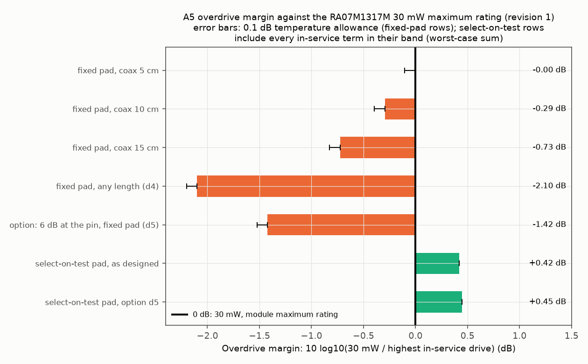
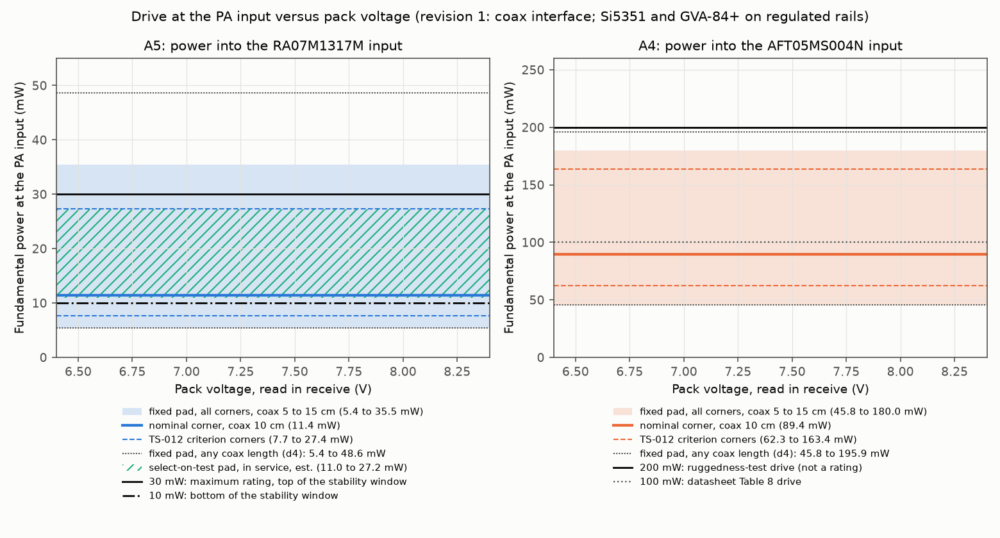
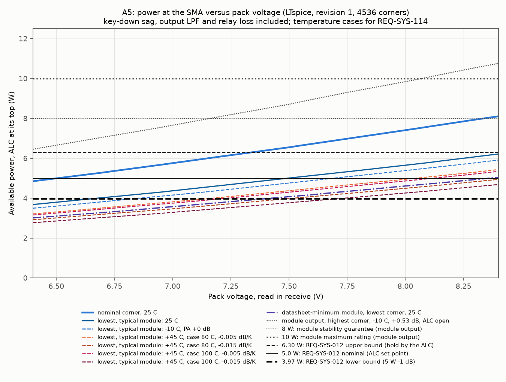
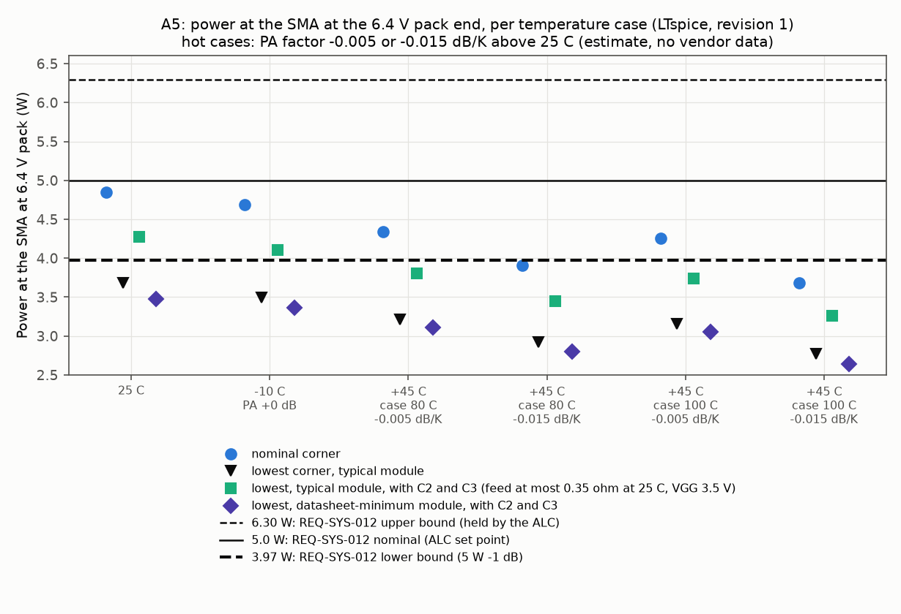
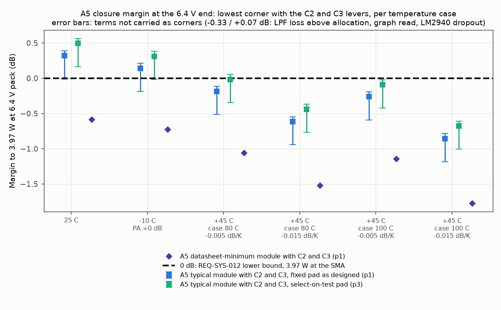
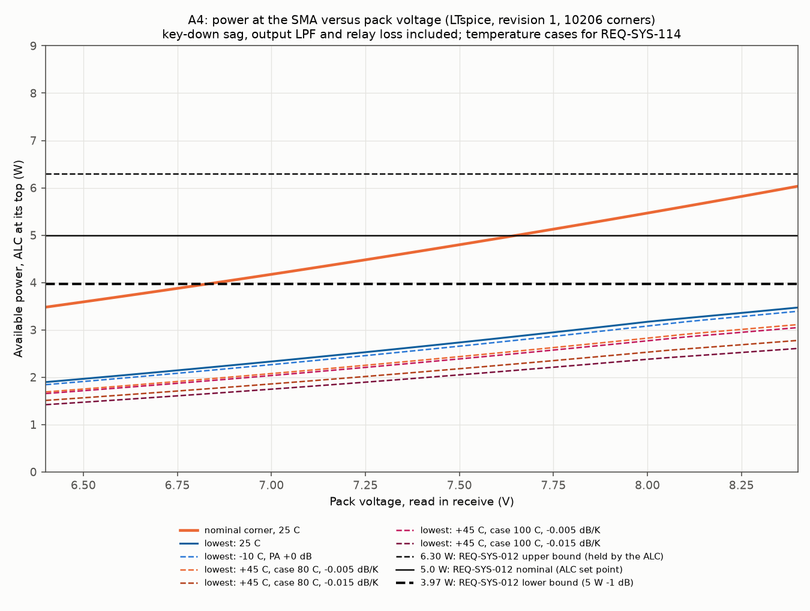
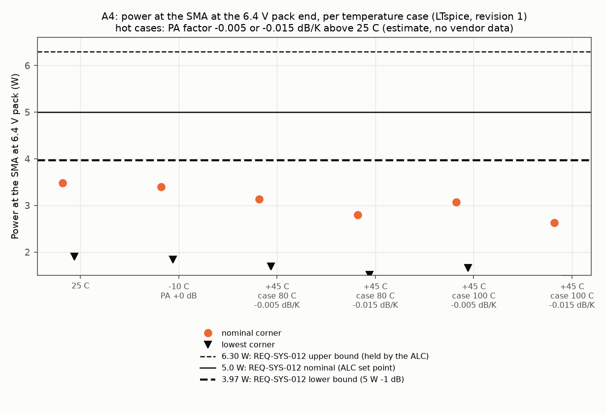
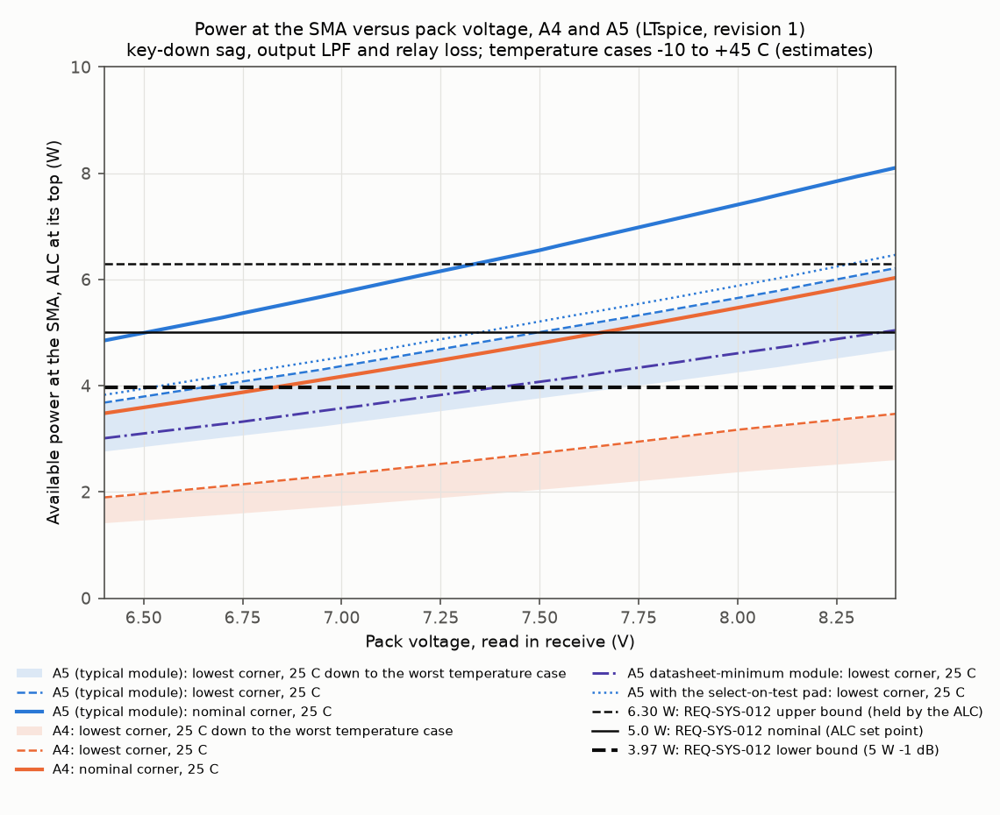

# PA drive window and output power at the SMA, TS-012 finalists A4 and A5

| Field | Value |
|---|---|
| Product | Analysis note (08 section 3.4), WP-PDR-21 pre-order item of TS-012 revision 4 (sections 7.3 and 8.12), revision 1, 2026-09-28 |
| Author | Claude, analysis author (TS-012 discriminating analyses, owner approval of 2026-09-28, `docs/plan/status/status-2026-09-28.md` section 1 item 2) |
| Status | Draft, revision 1 answers the peer review of revision 0 (Major findings 1 and 2, Minor finding 3; section 9). Review record `docs/reviews/PDR/checklists/analysis-pa-drive-ts012.md` (`peer-review-checklist-analysis.md`) |
| Serves | TS-012 choice between A4 and A5; TS-012 pre-order criterion "module input 10 to 30 mW at every corner"; REQ-SYS-012 (5 W +/-1 dB, TBR) supporting pre-build evidence, with REQ-SYS-114 (-10 to +45 C, TBR); inputs to WP-PDR-22 (VGG clamp, open-loop case) and WP-PDR-20 (CLK1 swing at the prescaler tap) |
| Decks, scripts, results | `hardware/sim/tx-pa/` (README there): `run_pa.py` (deck writer, runner through `tools/ltspice-batch.sh`, checker, plots), `digitize_ra07.py` and `digitize_aft05.py` (datasheet graph readers), `data/` (digitized curves with overlays), `decks/`, `results/2026-09-28-r1-*` (revision 1, eight runs) and `results/2026-09-28-d1-gva-model` (unchanged model check). The revision 0 run folders stay in place, superseded |
| Evidence status | Developer evidence. LTspice 26.0.2 through the accredited wrapper (ACC-LTSPICE-001, blob `88b71475`); Python 3.13 venv with numpy, scipy 1.18.1, spicelib 1.6.3 and matplotlib 3.11.2 (class B entries of `tools/toolchain.lock.md` section 2). Every PA and driver curve is a graph read of typical vendor data (estimate) unless a row says "datasheet minimum" or "datasheet maximum". Every output figure of this note is therefore an estimate; section 3 classes each input |

## 1. Purpose

TS-012 revision 4 presents A4 (NXP AFT05MS004N, hand-derived match, no TCXO) and A5 (Mitsubishi RA07M1317M module, TCXO) together, and names the PA drive chain as a pre-order LTspice check (WP-PDR-21). This note answers, for each finalist:

1. What power reaches the PA input across the part tolerances (Si5351A output resistance 25 or 50 ohm, its supply, edge time and duty cycle; GVA-84+ gain and compression; 144 to 148 MHz; the CLK1-to-RF-board interface as TS-012 lays it out)?
2. For A5: is the RA07M1317M input kept inside 10 to 30 mW (its stability conditions, and 30 mW is its maximum rating) at every corner, and with what margin to 30 mW? The TS-012 criterion also asks that the third harmonic at the GVA-84+ input be at least 25 dB below the fundamental.
3. What load does the drive chain put on the Si5351 CLK1 pin, against the datasheet's 15 pF maximum load capacitance?
4. What power reaches the SMA from 6.4 to 8.4 V pack (read in receive), after key-down sag, the output low-pass filter and the T/R relay, against REQ-SYS-012 (3.97 to 6.30 W), at 25 C and over REQ-SYS-114's -10 to +45 C ambient?

## 2. Method

**Drive chain (runs d2, d3, d4, d5; transient).** The Si5351A CLK1 is a trapezoid Thevenin source with a swing equal to VDDO, the DC removed (the path is AC coupled), behind 25 or 50 ohm.

The interface is modelled as TS-012 lays it out (revision 1, finding-1):
- TS-012 section 8.1 puts the Si5351 (Adafruit 2045) on the main board, and the drive LPF, pads and GVA-84+ on the RF board in the PA bay. Section 7.3 says that only the DC, drive and coax leads pass the bulkhead.
- CLK1 therefore leaves the Adafruit board through its optional SMA and reaches the RF board on a 50 ohm coax. The Adafruit product page (adafruit.com/product/2045, read 2026-09-28) describes the outputs as available "for RF work, an optional SMA connector".
- This is the output topology Skyworks recommends: Si5351-B Rev. 1.3 section 7.6, Figure 16 shows a ZO = 50 ohm trace with a 0 ohm series resistor at the default high drive strength.
- On the CLK1 pin sit only the prescaler tap (100 pF into the 74LVC1G80, 5 pF, estimate) and the header, pads and main-board stub (2 pF, estimate): 7 pF lumped.
- The coax is lossless, 50 ohm, velocity factor 0.66 (RG-174 class), 5, 10 or 15 cm long (estimate; the layout sets it at CDR). Its loss at 146 MHz, about 0.05 dB in 15 cm, is ignored, which is conservative for overdrive.
- The drive LPF (a 3-pole C-L-C: 18 pF C0G 1206, 82 nH 1812SMS class, 18 pF, with estimated ESR, ESL, via inductance, coil Q and self-resonance) sits at the far end of the coax on the RF board.

Revision 0 put the LPF's 18 pF input capacitor and the 5 pF tap directly on the pin (23 pF, not the design).

Then come the E24 pi pads, the GVA-84+ and the PA input, taken as 50 ohm because both PA datasheets specify Pin in a 50 ohm system. The GVA-84+ is a behavioural block: a 50 ohm input, a Rapp limiter on the instantaneous voltage and a 50 ohm output. The limiter's two parameters were fitted by describing function so that the fundamental compresses 1 dB and 3 dB at the datasheet P1dB and Psat, and run d1 checks that fit in LTspice.

The drive runs:
- d2 (A5) and d3 (A4) each step 810 corners in one `.step`: 2 source resistances x 5 GVA gains x 3 P1dB sets x 3 frequencies x 3 Si5351 cases x 3 coax lengths.
- d4 bounds the unknown coax length. It sweeps 0.5 to 70 cm, which is more than half a wavelength in the coax (69 cm at 144 MHz): the line's input impedance repeats every half wavelength, so this covers every electrical length. It takes the five part corners that set the extremes, at the three frequencies. d4 also reruns 15 corners at a 10 ps maximum step to check the 20 ps step of d2 and d3.
- d5 is a design-request option for A5, not the TS-012 design: 6 dB of the 18 dB input pad moved to the CLK1 end of the coax (section 4.2).

The checker resamples the last three whole periods from the `.raw` and takes by DFT:
- the fundamental and 3f at the GVA-84+ input and the PA input;
- the pin impedance V(clk)/I(Rsrc) at the fundamental, reported as an equivalent shunt capacitance and a magnitude.

**Power path (runs p1, p2, p3; DC sweep).** The pack EMF is swept from 6.4 to 8.4 V behind the drain feed resistance. The 5 V bus (0.25 A) and the PA drain current Pout/(eta x Vd) load the feed, so LTspice solves the key-down sag and the PA output together. The PA output (volts on a node stand for watts) comes from the digitized datasheet curves:
- **A5:** Pout = Pout_VDD(Vd) x drive factor x VGG factor x spread factor x temperature factor.
  - Pout_VDD(Vd): the typical Pout versus VDD curve at Pin 20 mW and VGG 3.5 V, interpolated in frequency between the 135 and 155 MHz curves.
  - Drive factor: the Pout versus Pin curve at 7.2 V, relative to its value at 20 mW.
  - VGG factor: 1, or the Pout versus VGG ratio between the lowest clamp (3.08 V) and 3.5 V.
  - Spread factor: 1 (typical), or 6.5 W over the typical output at 7.2 V (the datasheet minimum).
- **A4:** Pout = Pout_7.5(Pin) x (Vd/7.5)^n x match factor x temperature factor. Pout_7.5(Pin) is Figure 13 of the AFT05 datasheet (the NXP reference circuit), interpolated in frequency, with the drive corners of d3; n is 1.8, 2.0 or 2.3; the match factor is the extra loss of the hand-derived match (0, 0.25 or 0.5 dB).
- **Both:** the output loss (LPF plus relay) is 0.4, 0.5 or 0.6 dB.

**Temperature cases (revision 1, finding-2).** REQ-SYS-114 asks every requirement, REQ-SYS-012 included, to hold from -10 C to +45 C ambient. Each power deck steps seven temperature cases (section 3.1): 25 C; -10 C with no PA gain (the low-bound cold case) and with +0.53 dB (the high-side cold case); and four hot cases at +45 C ambient. The hot cases take the PA case at 80 C or 100 C and a PA coefficient of -0.005 or -0.015 dB/K. In every non-25 C case the drain feed is recomputed part by part, and the hot cases add a 0.1 dB copper term to the output loss. Each deck then steps every combination: 4536 corners for A5 and 10206 for A4.

The drive corners (minimum, nominal, maximum PA input from d2 and d3) are the link between the two models. The drive itself changes by at most 0.1 dB over -10 to +45 C (section 3.1), so the drive runs are at 25 C and that 0.1 dB is carried as an allowance on the overdrive margin.

**Digitizing.** The datasheet pages were rendered at 400 dpi. The grid was located automatically, and each Pout curve was tracked column by column: the solid RA07M1317M curves after removing the dashes of the neighbouring curves, and the orange AFT05 curves by colour. Every tracked curve was overlaid on its datasheet crop and inspected (`hardware/sim/tx-pa/data/*_overlay.png`).

**Corners and reported figures.** Every parameter with a datasheet minimum and maximum uses them. Parameters without one use a stated estimate (section 3). The pass/fail judgement uses the worst corner, and the nominal corner is reported beside it. Every nominal, lowest, highest and lever figure quoted in section 4 is written with its full parameter set in the run's `result.md` (revision 1, finding-3). Section 4.4 gives the definitions used throughout.

## 3. Inputs and sources

Datasheets were fetched 2026-09-28 (public vendor PDFs; SHA-256 in the block README). Class: D datasheet value, G graph read of a datasheet plot (estimate), E estimate.

| Input | Value used | Source and class |
|---|---|---|
| Si5351A output resistance | 25 and 50 ohm | D: Rev. 1.3 Table 4, ZO 50 ohm typical (3.3 V VDDO, default high drive). E: 25 ohm is the TS-012 corner (no minimum published) |
| Si5351A edge, duty, VDDO | 20-80 % edge 0.5 / 1.0 / 1.5 ns; duty 0.45 / 0.50; VDDO 3.2 / 3.3 / 3.4 V | D: Rev. 1.3 Table 7, tr and tf 1 ns typ and 1.5 ns max (CL 5 pF), duty 45 to 55 % below 160 MHz, all at TA -40 to 85 C. E: the 0.5 ns fast case and VDDO +/-3 % (Adafruit module LDO) |
| Si5351A load capacitance | at most 15 pF | D: Rev. 1.3 Table 7 |
| Si5351A output topology | 50 ohm trace, 0 ohm series resistor | D: Rev. 1.3 section 7.6, Figure 16 |
| CLK1 pin lumped load | tap 5 pF + stub 2 pF = 7 pF | E (100 pF into the 74LVC1G80 input; header pin, pads and stub) |
| CLK1-to-RF-board coax | 50 ohm, lossless, VF 0.66, 5 / 10 / 15 cm; d4: 0.5 to 70 cm | E: RG-174 class. The length is set by the CDR layout, and d4 bounds it |
| Drive LPF | 18 pF / 82 nH / 18 pF; ESR 0.1 ohm, ESL plus via 1 nH, coil Q 100 at 146 MHz, SRF 1.2 GHz | TS-012 section 7.3 (3-pole, fc about 170 MHz, one 1812SMS, two 1206 C0G). E: values and parasitics chosen here. The inductor value is to be confirmed on the Coilcraft page at the order |
| Pads (E24, 1 %) | A5 input 62 / 200 / 62 ohm (18.42 dB); A5 output 300 / 18 / 300 ohm (3.00 dB); A4 input 82 / 91 / 82 ohm (11.97 dB); d5 option: 150 / 36 / 150 ohm (5.90 dB) at the pin and 82 / 91 / 82 ohm on the RF board | TS-012 A5 line-up (18 dB and 3 dB). The A4 pad is chosen here so that the GVA-84+ sits near its P1dB at the nominal corner ("GVA-84+ at its P1dB limit", TS-012 section 7.3) |
| GVA-84+ gain | 22.5, 22.9, 24.1, 25.0, 25.3 dB | D: Rev. F at 0.1 GHz, 22.9 min, 24.1 typ, 25.3 max. 22.5 and 25.0 are the TS-012 criterion corners |
| GVA-84+ gain over temperature | 0.0004 dB/C typical (negative), 0.1 GHz | D: Rev. F, (gain at 85 C minus gain at -45 C)/130 |
| GVA-84+ compression | P1dB 19.4 / 20.4 / 21.4 dBm with Psat 20.7 / 21.7 / 22.7 dBm; Rapp p 2.70, Vsat 2.99 / 3.36 / 3.77 V peak | D: Rev. F, P1dB +19.4 min and +20.4 typ; Psat (3 dB compression) +21.7 typ. E: the "high" set (+1 dB) and the Psat of the min set |
| GVA-84+ input maximum | +13 dBm | D: Rev. F absolute maximum ratings |
| RA07M1317M curves | Pout versus Pin (7.2 V, VGG 3.5 V), versus VDD (Pin 20 mW, VGG 3.5 V), versus VGG (7.2 V, Pin 20 mW), at 135 and 155 MHz | G: datasheet Jun. 2019 pages 3 to 5, typical, all at Tcase 25 C. Checks: 8.23 W at 7.2 V and 155 MHz on the VDD curve against 8.15 W on the Pin curve at 20 mW; about 8.5 W at 145 MHz on the frequency plot |
| RA07M1317M guaranteed output | 6.5 W minimum at 7.2 V, VGG 3.5 V, Pin 20 mW | D: datasheet electrical characteristics |
| RA07M1317M efficiency | 0.60 typical, 0.45 minimum | G: 0.60 from the page 4 current curve (5.85 W at 6.0 V and 1.63 A). D: 0.45 is the datasheet minimum at 6 W, 7.2 V |
| RA07M1317M ratings and window | Pin 30 mW maximum; stability for Pin 10 to 30 mW, Pout up to 8 W; Pout 10 W maximum; operating case -30 to +110 C | D: datasheet (as read in TS-012 and INSP-110 row S3; case range read 2026-09-28) |
| VGG at the ALC top | 3.5 V, or 3.08 V (lowest clamp) | TS-012 revision 4 clamp: 3.08 to 3.46 V (LM2940 4.75 V x 0.6493) |
| AFT05MS004N curve | Pout versus Pin at 7.5 V, 135 and 155 MHz | G: datasheet Rev. 0 Figure 13 (reference circuit), typical. Check: 6.08 W at 0.1 W and 135 MHz against Table 8's 6.0 W. No figure over temperature |
| AFT05 voltage scaling | (Vd/7.5)^n, n 1.8 / 2.0 / 2.3 | E: the datasheet has no VHF Pout versus VDD. The RA07M1317M curve gives n = 1.86 between 6.0 and 8.4 V |
| AFT05 efficiency | 0.67 typical, 0.55 low | G: Figure 13 at 0.1 W (62 % at 135 MHz, 73 % at 155 MHz). E: 0.55 |
| AFT05 hand-match extra loss | 0 / 0.25 / 0.5 dB | E: match re-derived for a 0.8 mm board with wound coils (TS-012 section 7.3, adversarial C4) |
| AFT05 drive reference | 0.1 W typical (Table 8); 0.2 W ruggedness test (3 dB overdrive, Table 9) | D: datasheet; the maximum ratings table gives no input power rating |
| Drain feed resistance at 25 C | 0.26 / 0.35 / 0.45 ohm (cells, protection FETs, polyfuse, holders, reverse and rail switch, chokes) | TS-012 section 7.3 (mix of datasheet bounds and estimates). A4 is taken with the same feed. Per part in section 3.1 |
| 5 V bus current at key-down | 0.25 A | E: GVA-84+ 0.108 A typ, G5V-2 coil 0.1 A, Pico and op-amps; TS-012 used 0.2 A |
| Output loss | 0.4 / 0.5 / 0.6 dB | TS-012 allocation: LPF 0.4 dB (criterion at most 0.5 dB) plus relay 0.1 dB; 0.6 dB is the criterion edge plus relay. The WP-PDR-21 LPF runs give more (section 4.4, uncertainty) |
| Pack voltage | 6.4 to 8.4 V EMF | REQ-SYS-012 reads the pack in receive; the difference from the EMF is under 10 mV (E) |

### 3.1 Temperature inputs (revision 1, finding-2)

| Input | -10 C case | +45 C cases | Source and class |
|---|---|---|---|
| Cells, two Molicel P28A (25 C: 0.04 to 0.06 ohm) | x3.0 to x3.3: 0.12 to 0.20 ohm | x0.90 to x1.00 (cells at 50 to 64 C in WP-PDR-28) | D: P28A datasheet (INR18650P28A-V1-80093, read 2026-09-28), DC IR 20 mohm (10 A, 1 s), so 0.04 ohm per pair at 23 C. G: its 2.8 A discharge-temperature curves at mid capacity sit about 0.11 V (0 C) and 0.27 V (-20 C) under the 23 C curve, so about 0.19 V at -10 C, 40 to 68 mohm more per cell over a 10 s to steady key-down. The 45 C curve lies on the 23 C one |
| AO3400A and DMP3099L pairs (25 C: 0.04 to 0.06 and 0.13 to 0.20 ohm) | x0.80 to x0.85 | x1.20 to x1.35 (main-bay air 55 to 60 C plus self-heating, junction 60 to 95 C) | E: MOSFET RDS(on) rises about 0.5 %/K; no datasheet curve read here |
| MF-R300 (25 C: 0.02 to 0.08 ohm) | x0.85 to x0.90 | x1.10 to x1.30 | E: PTC below trip |
| Holder contacts; chokes | x1.0; x0.86 | x1.0; x1.10 to x1.25 | E: copper +0.39 %/K |
| Resulting feed, levels low / TS-012 criterion / high | 0.302 / 0.411 / 0.540 ohm | 0.293 / 0.417 / 0.568 ohm | Computed: each part moves with the level, and the result is scaled so that 25 C gives exactly 0.26 / 0.35 / 0.45 ohm |
| PA output against case temperature | 0 dB (low-bound case) or +0.53 dB (high-side case) | -0.005 or -0.015 dB/K above 25 C | E, Low: neither datasheet gives output over temperature (RA07M1317M data are all at Tcase 25 C). Saturated output of a silicon MOSFET stage falls as its on-resistance rises (about +0.6 %/K). With a 5.4 V drain and a 0.8 V knee at 25 C, the (VDD - Vknee)^2 law gives -0.0095 dB/K; the range taken is -0.005 to -0.015 dB/K. The cold side mirrors it (+0.015 x 35 K) for the open-loop case only |
| PA case temperature, hot | - | 80 C (steady key-down at 6.4 V); 100 C bound | E: 80 C from the WP-PDR-28 A5 design-change model (case 105.7 C at 9.94 W and 45 C, so 6.1 K/W case to ambient) with the 3.2 to 5.9 W the module dissipates at 6.4 V. 100 C: the REQ-SYS-181 sink trip (95 C +3 C) plus 0.4 K/W x 5.9 W of interface rise. A4 takes the same (E) |
| Output-loss copper term | 0 dB | +0.1 dB | E: LPF coils and relay at PA-bay air up to 89 C (WP-PDR-28), +0.39 %/K on the 0.4 dB LPF allocation |
| Drive chain | at most 0.1 dB | at most 0.1 dB | D: GVA-84+ 0.0004 dB/C over -10 to +89 C bay air, 0.04 dB. E: C0G, 1812SMS and 1 % resistor drift under 0.05 dB. The Si5351 Table 7 limits hold from -40 to 85 C, so its corner cases already bound its temperature drift |

## 4. Results

### 4.1 GVA-84+ model (run d1, unchanged)

The fitted model reproduces the datasheet compression points within 0.03 dB for all three P1dB sets: 1 dB points at 19.37, 20.37 and 21.37 dBm, 3 dB points at 20.69, 21.69 and 22.69 dBm (**PASS**).

### 4.2 A5 drive window and the CLK1 interface (runs d2, d4, d5)

**Drive with the fixed 18 dB pad, coax 5 to 15 cm (d2, 810 corners, 25 C):**

| Quantity | Min | Nominal | Max | Limit | Verdict |
|---|---|---|---|---|---|
| Power into the RA07M1317M input, all corners | 5.4 mW (7.31 dBm) | 11.4 mW (10.57 dBm) | 35.5 mW (15.50 dBm) | 10 to 30 mW | **FAIL**: 195 corners under 10 mW, 28 over 30 mW |
| Same, coax 5 / 10 / 15 cm | 5.5 / 5.4 / 5.4 mW | - | 30.0 / 32.1 / 35.5 mW | 10 to 30 mW | 1 / 9 / 18 corners over 30 mW |
| Same, TS-012 criterion corners (25 and 50 ohm, gain 22.5 and 25.0 dB, 144 to 148 MHz, nominal Si5351 edge and VDDO) | 7.7 mW | - | 27.4 mW | 10 to 30 mW | **FAIL**: 81 of 108 inside |
| Overdrive margin, highest corner against 30 mW | - | - | -0.73 dB | at least 0 dB | **FAIL** (-0.83 dB with the 0.1 dB temperature allowance) |
| 3f relative to f at the GVA-84+ input | - | - | -30.9 dBc (worst) | at most -25 dBc | **PASS** |
| GVA-84+ input | - | - | -6.7 dBm | below +13 dBm | **PASS** |
| GVA-84+ output | - | 13.6 dBm | 18.5 dBm | P1dB min 19.4 dBm | 0.9 dB of back-off at the highest corner |

Corner definitions:
- Nominal: source 50 ohm, GVA gain 24.1 dB, P1dB set typ, 146 MHz, Si5351 case nom (VDDO 3.3 V, edge 1.0 ns, duty 0.50), coax 10 cm.
- Highest: source 25 ohm, gain 25.3 dB, P1dB set high, 144 MHz, Si5351 case high (VDDO 3.4 V, edge 0.5 ns, duty 0.50), coax 15 cm.
- Lowest: source 50 ohm, gain 22.5 dB, P1dB set min, 148 MHz, Si5351 case low (VDDO 3.2 V, edge 1.5 ns, duty 0.45), coax 10 cm.

**Independent check.** The reviewer's phasor model of revision 0's corners with a lossless 50 ohm line gave 5.8 to 30.5, 5.7 to 32.7 and 5.7 to 36.2 mW at 5, 10 and 15 cm, with 1, 12 and 18 corners over 30 mW. d2 gives 5.5 to 30.0, 5.4 to 32.1 and 5.4 to 35.5 mW, with 1, 9 and 18 over. The maxima agree within 0.1 dB. The remaining difference is consistent with the 2 pF pin stub, which the reviewer's model did not have.

**The coax matters, and its length is not yet known (d4).** Over every electrical length of the line (0.5 to 70 cm), the fixed-pad A5 drive spans 5.4 to 48.6 mW. The highest step is the highest part corner at 144 MHz with 32.5 cm of coax. The overdrive margin with any length is -2.10 dB (-2.20 dB with the temperature allowance). Within the estimated 5 to 15 cm, the fixed-pad maximum rises 0.72 dB from 5 to 15 cm.

The time-step check reran 15 corners at a 10 ps maximum step against the 20 ps step of d2 and d3. The largest difference is 0.0005 dB in PA input power and 0.013 dB in 3f (criteria 0.02 and 0.5 dB): **PASS**.

**Revision 0's "overdrive is designed out" is withdrawn.** With the fixed pad, the A5 drive exceeds the 30 mW maximum rating at 1 to 18 of the 270 part corners for each coax length from 5 to 15 cm, and by up to 2.1 dB at the worst length. Revision 0 had no line (section 2), so its highest corner, 29.5 mW (0.07 dB under 30 mW), was neither the design nor a bound. The fixed pad fails on both sides of the window: the spread over all corners is 8.2 dB against a window of 4.77 dB.

**Select-on-test pad (s1, estimate).** REQ-SYS-144's TS-012 delta already admits "drive pad selection" as a one-time build alignment. Suppose the pad is chosen at build from a set in 1 dB steps, with the module replaced by a 50 ohm load and the unit's own coax in place. The coax and every part constant are then measured out. In service only four terms remain, and the band half-width is their worst-case sum:
- frequency: at most 0.34 dB across 144 to 148 MHz within any one unit, coax included;
- half a pad step: 0.5 dB;
- the level reading: +/-1 dB (diode probe on the Fluke 174, or the tinySA once bought; estimate);
- drift over -10 to +45 C and the supply: 0.3 dB (estimate, section 3.1: GVA-84+ 0.04 dB from its datasheet coefficient, passives under 0.05 dB, Si5351 edge and swing 0.2 dB).

| Select-on-test result | As designed (coax, pad on the RF board) | Option d5 (6 dB at the pin) |
|---|---|---|
| In-service drive, worst-case sum of the four terms | 11.0 to 27.2 mW (**PASS**, estimate) | 11.1 to 27.1 mW (**PASS**, estimate) |
| Overdrive margin to 30 mW, worst-case sum | +0.42 dB | +0.45 dB |
| Overdrive margin to 30 mW, root-sum-square of the same terms | +1.22 dB | +1.22 dB |
| Margin above 10 mW, worst-case sum | +0.41 dB | +0.44 dB |
| Pad set needed over the d2 corners | 13.5 to 21.5 dB, so 13 to 22 dB | 8.0 to 15.7 dB, so 8 to 16 dB |

The overdrive margin with the select-on-test pad is therefore +0.42 dB when the uncertainty terms add in the worst direction. The level reading dominates it: 1.0 of the 1.97 dB half-width. If the tinySA (+/-0.5 dB, estimate) replaces the diode probe for the build alignment, the margin grows to about +0.9 dB.

E24 1 % pi pads for the as-designed set, each with at least 25 dB return loss (s1 `result.md`):

| Pad (dB) | Shunt, series, shunt (ohm) | Loss (dB) |
|---|---|---|
| 13 | 82, 110, 82 | 12.99 |
| 14 | 75, 120, 75 | 13.98 |
| 15 | 68, 130, 68 | 15.04 |
| 16 | 68, 150, 68 | 15.92 |
| 17 | 62, 160, 62 | 16.94 |
| 18 | 68, 200, 68 | 17.79 |
| 19 | 68, 240, 68 | 19.05 |
| 20 | 68, 270, 68 | 19.88 |
| 21 | 56, 270, 56 | 21.26 |
| 22 | 62, 330, 62 | 21.99 |

The nominal pad would move from 18 to 17 dB. If the layout makes the coax longer than 15 cm, the d4 range at 146 MHz needs 13.5 to 22.9 dB, so the set grows by one value (23 dB).

**Load on the CLK1 pin (finding-1).** As designed, the only lumped load on the pin is the tap and stub, 7 pF, against the Table 7 maximum of 15 pF (**PASS**, estimate). The line then presents the drive LPF's input impedance, rotated by the coax. At the fundamental the pin sees 36 to 65 ohm in magnitude. Its reactive part equals a shunt capacitance of 13.6 to 24.7 pF, the 7 pF included, rising with coax length: about 14 pF at 5 cm, 19 pF at 10 cm and 25 pF at 15 cm. Over every length (d4) the range is -16 to +30 pF.

Table 7's CL is a lumped capacitive load with no resistive part. Figure 16 recommends a 50 ohm line but does not say what may terminate it. The datasheet therefore neither covers nor forbids this load. What it does not show is that the output driver meets its Table 7 edge, duty and swing values into a load with more than 15 pF of equivalent capacitance.

This is sent to TS-012 as design request **DR-PAD-1** (section 7): either state the coax interface and accept this out-of-table use, or adopt the d5 pad.

**Option d5 (design request, not the TS-012 design).** A 6 dB pi pad (150 / 36 / 150 ohm, E24 1 %, 5.90 dB) on the main board at the CLK1 pin, before the coax, with the RF-board pad reduced to 12 dB (82 / 91 / 82 ohm). Three resistors, owned or inside the E2 row's allowance.

What it changes (d5, 810 corners):
- **Pin load.** The pin sees 43 to 52 ohm, with an equivalent shunt capacitance of 9.6 to 11.9 pF, under 15 pF at every corner.
- **Coax length.** The drive moves 0.2 dB from 5 to 15 cm (0.72 dB as designed).
- **3f.** The worst 3f at the GVA-84+ input improves to -35.4 dBc.
- **Level.** The fixed-pad spread stays 7.9 dB, so the select-on-test pad is still needed; its set becomes 8 to 16 dB.
- **Tap swing.** The CLK1 swing at the tap falls to 1.59 to 2.54 Vpp.

The Si5351 and the GVA-84+ run from regulated rails, so the drive is flat in pack voltage. The model does not include the LM2940 in dropout at the low pack end (section 6, and the uncertainty terms of section 4.4).

**Why the nominal drive is 11.4 mW, not the 20 mW TS-012 expected.** TS-012 took +10.4 dBm from an ideal 1.65 Vpp square wave. The trapezoid with the typical 1 ns edge gives 9.6 dBm of available fundamental at 146 MHz (-0.9 dB). The drive LPF, the tap and the 10 cm line then cost about 1.6 dB more. A 3-pole Butterworth-like filter with its corner at about 180 MHz is already about 1 dB down at 146 MHz, and the line adds a mismatch loss against the 50 ohm source.

### 4.3 A4 drive (run d3)

| Quantity | Min | Nominal | Max | Reference | Verdict |
|---|---|---|---|---|---|
| Power into the AFT05 input, all corners, coax 5 to 15 cm | 45.8 mW (16.6 dBm) | 89.4 mW (19.5 dBm) | 180.0 mW (22.6 dBm) | 0.1 W Table 8; 0.2 W ruggedness-test drive | Under 0.2 W at every corner (**PASS**, informative; the datasheet has no input rating). Margin +0.46 dB, +0.36 dB with the temperature allowance |
| Same, any coax length (d4) | 45.8 mW | - | 195.9 mW | 0.2 W | +0.09 dB; -0.01 dB with the temperature allowance |
| TS-012 criterion corners | 62.3 mW | - | 163.4 mW | - | - |
| 3f at the GVA-84+ input | - | - | -30.9 dBc | at most -25 dBc | **PASS** |
| GVA-84+ input | - | - | -0.2 dBm | below +13 dBm | **PASS** |

The corner definitions are those of section 4.2. The CLK1 pin load is the same as A5's (13.6 to 24.6 pF equivalent), so DR-PAD-1 applies to A4 as well.

A4 runs the GVA-84+ into compression by design, so its drive spread (5.9 dB) is smaller than A5's. The low corner is set by the minimum gain and the minimum P1dB, and drive is the largest single term in A4's output spread (section 4.5).

### 4.4 Power at the SMA, A5 (runs p1 and p3)

**Definitions (finding-3).** Each figure is at 6.4 V pack; the run's `result.md` lists every parameter.
- **Nominal:** drain feed 0.35 ohm, efficiency 0.60, the nominal drive of d2 (10.57 dBm), 146 MHz, VGG 3.5 V, typical module, output loss 0.5 dB.
- **Lowest:** the smallest output over all corners with the typical module.
- **Highest:** the largest output over all corners.
- **Lowest with the C2 and C3 levers** (the "lever figure"): the smallest output over the corners with the drain feed at most 0.35 ohm at 25 C (C2) and VGG at 3.5 V (C3), typical module. At 25 C this is feed 0.35 ohm, efficiency 0.45, drive 7.31 dBm, 148 MHz, VGG 3.5 V, output loss 0.6 dB.

**At 25 C:**

| At 6.4 V pack, 25 C | Nominal | Lowest, typical module | Lowest with C2 and C3 | Datasheet-minimum module, lowest | Same with C2 and C3 | Highest |
|---|---|---|---|---|---|---|
| p1: drive as designed | 4.85 W | **3.68 W (FAIL)** | 4.28 W (+0.32 dB) | 3.01 W | 3.47 W | 5.45 W |
| p3: select-on-test drive | 4.93 W | **3.83 W (FAIL)** | 4.45 W (+0.49 dB) | 3.14 W | 3.62 W | 5.42 W |

- The drain sits at 5.76 V at the nominal corner (5.35 V lowest) under key-down sag at 6.4 V.
- The lowest corner with the typical module reaches 3.97 W from 6.70 V (p1) or 6.55 V (p3). With the datasheet-minimum module it does so from 7.40 V (p1) or 7.25 V (p3).
- The nominal corner is under 5.0 W at the low end. The ALC cannot hold its 5.0 W set point there, but the output stays inside REQ-SYS-012's band.
- Sensitivity at 6.4 V and 25 C (the dB spread of each input over its values, averaged over the other corners; p1):
  - module spread (typical against datasheet minimum) 0.95 dB;
  - drain feed 0.26 to 0.45 ohm 0.44 dB;
  - VGG clamp 3.08 against 3.5 V 0.41 dB;
  - efficiency 0.20 dB and output loss 0.20 dB;
  - drive 0.14 dB (0.36 dB in p3) and frequency 0.03 dB;
  - across the temperature cases, 1.20 dB.
- Open loop at 8.4 V (VGG 3.5 V), the module makes 9.09 W at the nominal corner and 9.90 W at the highest (9.03 W at the SMA). The highest corner exceeds the 8 W stability guarantee from 7.5 V up. At -10 C, with the +0.53 dB high-side estimate, it exceeds 8 W from 7.2 V and the 10 W maximum rating from 8.1 V (10.76 W at 8.4 V). The ALC must hold 5 W. The open-loop case needs the pack-dependent clamp that TS-012 names as the WP-PDR-22 fallback, and WP-PDR-22 should take the cold case.

**Over REQ-SYS-114's -10 to +45 C (revision 1, finding-2):**

| At 6.4 V pack | Feed low / C2 / high (ohm) | Nominal (W) | Lowest, typical (W) | Lowest with C2 and C3, p1 (W; margin) | Same, p3 (W; margin) | Datasheet-minimum module with C2 and C3, p1 (W) |
|---|---|---|---|---|---|---|
| 25 C | 0.260 / 0.350 / 0.450 | 4.85 | 3.68 | 4.28 (+0.32 dB) | 4.45 (+0.49 dB) | 3.47 |
| -10 C, PA +0 dB | 0.302 / 0.411 / 0.540 | 4.69 | 3.50 | 4.10 (+0.14 dB) | 4.27 (+0.31 dB) | 3.36 |
| +45 C, case 80 C, -0.005 dB/K | 0.293 / 0.417 / 0.568 | 4.34 | 3.21 | 3.81 (-0.18 dB) | 3.96 (-0.02 dB) | 3.11 |
| +45 C, case 80 C, -0.015 dB/K | same | 3.91 | 2.92 | 3.45 (-0.62 dB) | 3.59 (-0.44 dB) | 2.80 |
| +45 C, case 100 C, -0.005 dB/K | same | 4.26 | 3.16 | 3.74 (-0.26 dB) | 3.89 (-0.09 dB) | 3.05 |
| +45 C, case 100 C, -0.015 dB/K | same | 3.69 | 2.77 | 3.26 (-0.86 dB) | 3.40 (-0.68 dB) | 2.64 |

All the curves of revision 0 were at 25 C, which revision 0 did not say. Temperature moves the A5 output at 6.4 V by 1.2 dB on average, more than any single part tolerance:
- **Cold.** The cell resistance roughly triples and costs about 0.18 dB at the lever corner, with the PA taken with no cold gain.
- **Hot.** The PA temperature factor costs 0.3 to 1.1 dB, and the feed and copper terms up to about 0.2 dB more (less where the PA factor has already lowered the drain current). Even the nominal corner falls under 3.97 W in the two -0.015 dB/K cases.

**The closure figure against its uncertainty (finding-2, E3).** Revision 0 quoted 4.31 W against 3.97 W (+0.35 dB) with no uncertainty. Revision 1 gives 4.28 W (+0.32 dB) at 25 C: the coax lowered the lowest drive corner from 7.76 to 7.31 dBm.

Three terms are not carried as corners (s1):
- output LPF loss above the 0.6 dB top corner: -0.21 to 0 dB. The WP-PDR-21 LPF runs r6 and r7 give a worst passband loss of 0.71 and 0.65 dB, plus the 0.1 dB relay (`hardware/sim/tx-lpf` README);
- the RA07M1317M graph read: +/-0.07 dB;
- the GVA-84+ with the LM2940 in dropout at 6.4 V: -0.05 to 0 dB (the digitized Pout-Pin slope is about 0.08 dB per dB of drive below 10 dBm).

Added in the worst direction, they give the margin ranges below:

| Temperature case | p1 margin (dB) | p1 with the terms above (dB) | p3 margin (dB) | p3 with the terms above (dB) |
|---|---|---|---|---|
| 25 C | +0.32 | -0.01 to +0.39 | +0.49 | +0.16 to +0.56 |
| -10 C | +0.14 | -0.19 to +0.21 | +0.31 | -0.02 to +0.38 |
| +45 C, 80 C, -0.005 dB/K | -0.18 | -0.51 to -0.11 | -0.02 | -0.35 to +0.05 |
| +45 C, 80 C, -0.015 dB/K | -0.62 | -0.95 to -0.55 | -0.44 | -0.77 to -0.37 |
| +45 C, 100 C, -0.005 dB/K | -0.26 | -0.59 to -0.19 | -0.09 | -0.42 to -0.02 |
| +45 C, 100 C, -0.015 dB/K | -0.86 | -1.19 to -0.79 | -0.68 | -1.01 to -0.61 |

So C2 and C3 close REQ-SYS-012's 6.4 V end:
- at 25 C, with the select-on-test pad, by +0.16 dB at worst;
- at -10 C and at 25 C with the fixed pad, only to about 0 dB;
- at +45 C in none of the hot cases.

The hot result rests mostly on the PA temperature coefficient, which has no vendor data.

**Correction to a TS-012 input (revision 0, unchanged).** TS-012 and `docs/research/pa-device-candidates.md` F8 read 5.3 W at 6.0 V and 10.5 W at 8.4 V from the 155 MHz Pout versus VDD curve. The digitized curve gives 5.85 W and 10.92 W at 155 MHz (6.27 W and 11.37 W at 135 MHz). The typical module is therefore about 0.4 dB stronger at the low end than TS-012 assumed.

TS-012's "3.97 to 4.57 W at the SMA" at 6.4 V used the typical curve only. It left out:
- the datasheet-minimum module (-1.0 dB at 146 MHz: 6.5 W against 8.18 W typical at 7.2 V);
- the lowest VGG clamp;
- the efficiency and drive corners;
- temperature.

It is a nominal range, not a bound.

### 4.5 Power at the SMA, A4 (run p2)

| At the pack voltage | Nominal | Lowest corner | Highest corner |
|---|---|---|---|
| 6.4 V, 25 C | 3.48 W | **1.90 W (FAIL)** | 4.51 W |
| 8.4 V, 25 C | 6.03 W | 3.47 W | 7.62 W |
| 6.4 V, worst temperature case (+45 C, case 100 C, -0.015 dB/K) | 2.63 W | 1.42 W | 3.44 W |

- At 25 C the nominal corner reaches 3.97 W from 6.85 V and 5.0 W from 7.7 V. The lowest corner stays under 3.97 W over the whole 6.4 to 8.4 V range in every temperature case.
- Nominal corner: feed 0.35 ohm, efficiency 0.67, drive 89.4 mW, 146 MHz, n 2.0, hand-match loss 0.25 dB, output loss 0.5 dB.
- Lowest corner: feed 0.45 ohm, efficiency 0.55, drive 45.8 mW, 144 MHz, n 2.3, hand-match loss 0.5 dB, output loss 0.6 dB.
- Sensitivity at 6.4 V and 25 C: drive (46 to 180 mW) 2.01 dB, VDD exponent 0.44 dB, hand-match loss 0.44 dB, feed 0.33 dB, frequency 0.23 dB, output loss 0.20 dB, efficiency 0.10 dB; across the temperature cases, 1.22 dB.
- TS-012's "about 3.2 W at 6.4 V" (adversarial C2) lies inside this range, close to the nominal.

### 4.6 Both finalists

### 4.7 Other observations

- **CLK1 swing for the prescaler (INSP-110 O-5; input to WP-PDR-20).** With the coax interface, the CLK1 pin swings 1.66 to 3.67 Vpp across the corners (1.59 to 2.54 Vpp with the d5 pad). Revision 0 gave 2.22 to 3.24 Vpp with the LPF on the pin.

  Against the 1.2 V between the 74LVC1G80's VIL 0.8 V and VIH 2.0 V, the lowest swing leaves about 0.46 V of total margin (0.39 V with d5) with the bias midway. That is O-5's thin margin again, not revision 0's 1.0 V.

  The WP-PDR-20 valid-clock run of the tap (`hardware/sim/freq`) should take this interface and its lowest swing.
- **3f criterion.** It holds for both chains with at least 5.9 dB of margin (worst at the 25 ohm, fast-edge corners; 10.4 dB with d5).
- **The line and the 3f criterion.** The coax rotates the LPF's input impedance at 3f as well, so the 3f margin fell from 9.4 dB (revision 0) to 5.9 dB. The criterion still holds at every corner of d2 and d3. d4 does not report 3f over the whole length sweep.

## 5. Verdicts per finalist

**A5 (RA07M1317M): FAIL as designed; closable before the order at 25 C and -10 C, not shown at +45 C.**
- (a) **Drive window.** The fixed pad does not keep the module inside 10 to 30 mW. The drive falls under 10 mW at 195 of 810 corners and exceeds the 30 mW maximum rating at 28, by up to 0.73 dB with 5 to 15 cm of coax and up to 2.1 dB at the worst coax length. Revision 0's "overdrive is designed out" is withdrawn.

  The select-on-test pad (C1) meets the criterion. It keeps the drive at 11.0 to 27.2 mW in service (estimate), an overdrive margin of +0.42 dB when every uncertainty term adds in the worst direction (+1.22 dB root-sum-square). The level reading dominates that margin.
- (b) **CLK1 pin load.** As designed, the lumped load is 7 pF (within 15 pF). The line-fed LPF, however, looks like 14 to 25 pF at the fundamental, a load Table 7 does not cover. DR-PAD-1 goes to TS-012: state the interface and accept it, or adopt the 6 dB pin pad of d5, which keeps the equivalent load at 9.6 to 11.9 pF.
- (c) **REQ-SYS-012 at 6.4 V, 25 C.** It is not shown at the worst corner: 3.68 W with the typical module (3.83 W with the select-on-test drive) against 3.97 W. With C2 (feed at most 0.35 ohm) and C3 (VGG clamp not limiting), the lowest corner reaches 4.28 W, or 4.45 W with the select-on-test drive. That is +0.32 or +0.49 dB, and -0.01 or +0.16 dB after the unmodelled terms of section 4.4.
- (d) **REQ-SYS-012 over REQ-SYS-114.**
  - At -10 C the lever figure is +0.14 dB, or +0.31 dB with the select-on-test drive, and about 0 dB after the unmodelled terms.
  - At +45 C it is -0.02 to -0.86 dB, and the nominal corner itself falls under 3.97 W in the -0.015 dB/K cases.
  - The hot result rests on an estimated PA temperature coefficient (no vendor data), so it is neither a pass nor a firm fail. It is not shown.
- (e) **Datasheet-minimum module.** Such a module does not reach 3.97 W at 6.4 V at its lowest corner, even with both levers (3.47 W at 25 C, 2.64 W at the worst hot case). That residual rests on unit spread, so only a test of the built unit (TC-SYS-011) or a conditional REQ-SYS-012 low-end delta can close it.
- (f) **Open loop.** Open loop at 8.4 V the module exceeds its 8 W stability guarantee, as TS-012 anticipated for WP-PDR-22. At -10 C it may also exceed its 10 W maximum rating (estimate).

**A4 (AFT05MS004N): FAIL for REQ-SYS-012; drive acceptable.**
- The drive stays under the 0.2 W ruggedness-test level with 5 to 15 cm of coax (+0.46 dB), and has about 0 dB of margin at the worst length. The 3f criterion passes.
- Output at the SMA misses 3.97 W at 6.4 V at the nominal corner (3.48 W at 25 C, 2.63 W at the worst hot case); at 25 C the nominal corner reaches 3.97 W only from 6.85 V. At its lowest corner it misses 3.97 W across the whole pack range in every temperature case (1.90 W at 6.4 V and 3.47 W at 8.4 V, 25 C). The requirement delta TS-012 carries for A4 at the 6.4 V end therefore understates the shortfall: at the lowest corner the shortfall reaches up to 8.4 V.
- The largest terms are the GVA-84+ drive spread (2.0 dB) and temperature (1.2 dB), then the estimated VDD scaling and hand-match loss. The last two have no vendor data and carry Low confidence.

**For the TS-012 choice.** On the drive and output-power questions A5 is still the stronger finalist. Its nominal is 1.4 dB above A4 at 6.4 V at 25 C, and its 25 C and -10 C shortfalls close with no-cost design items. A4's shortfall needs a requirement delta over most of the pack range at every temperature, or a drive and match rework with no vendor data behind it. Neither finalist shows REQ-SYS-012 at the 6.4 V end in the +45 C cases. For both, the hot-corner closure is a requirement or test decision (C8), not a design lever this note can show.

## 6. Limitations

1. **Graph reads.** Every PA curve is typical data digitized from a vendor plot (estimated reading error about +/-0.1 W on the RA07M1317M and +/-0.1 W on the AFT05 axes). The only guaranteed PA figure used is the RA07M1317M 6.5 W minimum. It is applied as a uniform scale at every voltage (estimate).
2. **Separable module model.** The RA07M1317M drive, VGG and VDD dependences are multiplied as independent factors. Taking the VGG factor at 7.2 V is likely pessimistic at a low drain voltage, where the module saturates at a lower VGG.
3. **The AFT05 has no VHF Pout versus VDD data.** The (Vd/7.5)^n law and the hand-match loss are estimates. The A4 results carry Low confidence until the match is designed in LTspice from the NXP Zsource and Zload table (TS-012 section 7.3).
4. **Behavioural GVA-84+.** The GVA-84+ is modelled flat in frequency and memoryless, at 5.0 V. Its gain and P1dB with the 5 V bus in LM2940 dropout at the low pack end are not modelled. They are carried as an uncertainty term on the A5 closure figure (-0.05 dB). The P1dB "min" set is taken to cover 4.75 to 5.25 V; below that the A4 drive falls further.
5. **50 ohm PA inputs.** Both datasheets specify Pin with a 50 ohm source (ZG = 50 ohm). The RA07M1317M input VSWR (up to 4:1) and the AFT05 reference-circuit input match are therefore inside the curves, not modelled separately. The GVA-84+ output and the 3 dB pad sit between them and the drive chain.
6. **Si5351 output.** The output is a linear Thevenin source. The real driver's output resistance may vary within a cycle, and the 25 ohm corner has no datasheet basis (typical 50 ohm only).
7. **The CLK1 interface is an estimate of a layout that does not exist yet.** The coax length (5 to 15 cm), its velocity factor, the lossless line, the 5 pF tap and the 2 pF stub are estimates. d4 bounds the length, but not a different line impedance or a coplanar trace in place of the coax. The select-on-test pad measures all of these out at build; the fixed-pad results do not.
8. **Temperature (finding-2).** The PA output temperature coefficient (-0.005 to -0.015 dB/K) and the hot case temperatures are estimates with no vendor data, and they dominate the hot result. The cell multipliers are a graph read of a steady 2.8 A discharge, and the MOSFET and polyfuse multipliers are generic estimates. The cold case takes no PA gain for the low bound, which is conservative. The cold high-side case (+0.53 dB) is used only for the open-loop question. Direction: if the true coefficient is nearer 0 than -0.005 dB/K, the hot margins in section 4.4 improve by up to 0.3 to 0.4 dB. At -0.015 dB/K they stand as shown.
9. **The output loss is an allocation.** It is not the result of the WP-PDR-21 LPF run. That run gives up to 0.71 dB of passband loss in its retuned Monte Carlo worst case (0.81 dB with the relay), 0.21 dB more than the 0.6 dB top corner here. This is carried as an uncertainty term, not as a corner (C6).
10. **No ALC loop.** This note gives the power available with the control at its top. Holding 5 W, overshoot and the open-loop dynamics are WP-PDR-22.
11. **Estimated terms.** Drain feed resistance, bus current and efficiency are estimates (section 3). The feed resistance is itself a TS-012 pre-order read (DMP3099L RDS(on), MF-R300 R1max).
12. **Polyfuse at the hot corner (not modelled).** The MF-R300's hold current falls with temperature, so at 55 to 60 C main-bay air and 2 A key-down it may approach its trip region. Only its resistance rise is modelled here; the trip margin belongs to WP-PDR-24.

## 7. What closes before the order

| Item | Finalist | Action | Pass criterion |
|---|---|---|---|
| C1 | A5 | Adopt a select-on-test drive pad. Put a pi footprint on the RF board, nominal 17 dB, with a build set of 13 to 22 dB (section 4.2 table, E24 1 %, owned through-hole or 0805). Add a build-alignment step with the unit's own coax in place: module replaced by a 50 ohm load, level read with the diode probe and the Fluke 174 (or the tinySA once bought) | Drive 10 to 30 mW at every in-service condition. Estimate 11.0 to 27.2 mW, overdrive margin +0.42 dB (worst-case sum). A rerun of d2 with the chosen pad, the laid-out coax length and the measured level reproduces it |
| C2 | A5 | Close the TS-012 feed-resistance read: DMP3099L RDS(on) at VGS -6 V and MF-R300 R1max from the datasheets. Revision 1: also read the DMP3099L and AO3400A RDS(on) against junction temperature, and the MF-R300 resistance and hold-current derating at 60 C | Total feed at most 0.35 ohm at 25 C (TS-012 criterion). Also at most 0.42 ohm at -10 C and at +45 C (this note's multipliers applied to the read values). Rerun p1 with the read values |
| C3 | A5 | In WP-PDR-22, make the VGG clamp non-limiting at the low pack end. The pack-dependent clamp TS-012 names as the open-loop fallback does this: lower at high VDD, and at least 3.3 V (estimate) at 6.4 V | p1 lowest corner at least 3.97 W at 6.4 V with the typical module, C2 in place and the unmodelled terms of section 4.4 added, at 25 C and -10 C (this note: -0.01 dB at 25 C and -0.19 dB at -10 C with the fixed pad; +0.16 and -0.02 dB with the select-on-test drive). Module output at most 8 W at the open-loop corner at 8.4 V at -10 C (+0.53 dB case) |
| C4 | A5 | Decide how the datasheet-minimum module case is carried. Either a conditional REQ-SYS-012 delta at the low pack end (A5 row of TS-012 section 8.10), or acceptance on TC-SYS-011 with the risk kept. TS-012 section 7.1 row "0.0 to 0.6 dB margin at 6.4 V" is re-quantified here as -0.33 dB at the lowest corner to +0.87 dB at the nominal corner for a typical module at 25 C, and down to -1.2 dB for a minimum one | Owner decision recorded in the TS-012 decision; risk register row updated |
| C5 | A4, if chosen | Design the AFT05 match in LTspice from the NXP Zsource and Zload table for the 0.8 mm board. Replace the (Vd/7.5)^n estimate with the matched device's result. Consider a smaller input pad so the GVA-84+ saturates at every corner | The REQ-SYS-012 delta for A4 widened to the full pack range at the lowest corner and every temperature, or the match and drive shown to meet 3.97 W |
| C6 | Both | Rerun p1 or p2 with the WP-PDR-21 LPF result (`hardware/sim/tx-lpf`) in place of the 0.4 to 0.6 dB allocation | Figures here updated; the -0.21 dB uncertainty term removed or confirmed |
| C7 | Both | Owner reads the Coilcraft 1812SMS value list at the order (82 nH assumed) | If absent, the nearest value is rerun in d2 and d3 |
| C8 | Both (new, finding-2) | The +45 C, 6.4 V corner of REQ-SYS-012 is not shown (A5 -0.02 to -0.86 dB at the lever corner, estimate). Owner decision between: (i) a conditional REQ-SYS-012 delta for the hot low-pack corner, carried with the C4 delta; or (ii) a bench check on the built unit (Pout into the dummy load at 6.4 V with the sink warmed to 80 C by a timed key-down, thermocouple on the flange) with the delta held as the fallback. Either way, record the PA temperature coefficient as an open estimate | Owner decision recorded; if (ii), the measured output at 80 C flange at least 3.97 W, or the delta applies |
| DR-PAD-1 | Both (new, finding-1) | Design request to TS-012 section 8.1. State the CLK1 interface (Adafruit SMA, 50 ohm coax through the bulkhead, prescaler tap on the main board, target length). Then either (a) accept the line-fed LPF load, 14 to 25 pF equivalent at the fundamental, as outside what Si5351 Table 7 covers, with the build alignment of C1 as the control; or (b) adopt the d5 pad: 6 dB (150 / 36 / 150 ohm, E24 1 %) at the CLK1 end of the coax, with the RF-board select-on-test set becoming 8 to 16 dB | TS-012 revision records the choice. For (b), the pin-load equivalent stays at most 15 pF at every corner (this note: 9.6 to 11.9 pF) and the WP-PDR-20 tap run is rerun with the 1.59 Vpp minimum swing |
| C9 | Both (new) | WP-PDR-20: the valid-clock run of the prescaler tap takes the coax interface and the lowest CLK1 swing of this note (1.66 Vpp as designed, 1.59 Vpp with d5) | 74LVC1G80 VIL and VIH crossed with margin at every corner |

## 8. Change log

| Revision | Date | Change |
|---|---|---|
| 0 | 2026-09-28 | First issue: runs d1, d2, d3, p1, p2, p3 and s1 of `hardware/sim/tx-pa` |
| 1 | 2026-09-28 | Review of revision 0, Major findings 1 and 2 and Minor finding 3 (section 9). CLK1 interface modelled as designed (coax, tap on the pin); new runs d4 (coax-length bound, time-step check) and d5 (pin-pad option); CLK1 pin load reported against Table 7; overdrive margin with its uncertainty; "overdrive is designed out" withdrawn; select-on-test pad set 13 to 22 dB. Seven temperature cases in p1 to p3 with sourced or labelled inputs (section 3.1); closure margin set against its uncertainty; C2, C3 pass criteria carry temperature; new items C8, C9 and DR-PAD-1. Every quoted corner written with its parameter set in the run results. All revision 1 runs are `results/2026-09-28-r1-*` |

## 9. Review findings and their disposition (revision 1)

The review of revision 0 raised the three findings below. Finding-3's text reached the author truncated after "The nominal and highest corners and the 4.31 W lever figure". Its disposition covers what the checklist items it cites (CK-ANA-A5, B1) ask: every quoted figure traceable to a result file, with its parameter set and its estimate status. The reviewer is asked to confirm that this answers the full text.

| Finding | Disposition | Where |
|---|---|---|
| finding-1 (Major; CK-ANA-G1-3, B2, E3, A6): the decks put 23 pF on CLK1 against the 15 pF of Table 7; the main-board to RF-board connection is not modelled; the 29.5 mW highest corner is 0.07 dB from 30 mW while the note says overdrive is designed out | Interface modelled as designed: lumped pin load 7 pF, 50 ohm coax 5 to 15 cm, LPF on the RF board (d2, d3). Length bounded over every electrical length (d4). Pin load reported at the fundamental: 13.6 to 24.7 pF equivalent, outside what Table 7 covers, sent to TS-012 as DR-PAD-1 with a modelled option (d5, 9.6 to 11.9 pF). Overdrive margin reported with its uncertainty: fixed pad -0.73 dB (-2.10 dB at any length), select-on-test +0.42 dB worst-case sum, +1.22 dB RSS. "Overdrive is designed out" withdrawn. The reviewer's phasor numbers are reproduced within 0.1 dB | Sections 2, 4.2, 5(a), 5(b), 7 (C1, DR-PAD-1) |
| finding-2 (Major; CK-ANA-F1, A5, G7-2, B6, E3): no temperature case for REQ-SYS-114; cold cell resistance and hot module output unbounded; the 4.31 W closure not set against its uncertainty | Seven temperature cases in every power run, with the drain feed per part and the PA factor (section 3.1: cell resistance from the P28A datasheet curves, the rest labelled estimates with direction). The closure figure (now 4.28 W, +0.32 dB) is set against three unmodelled terms (-0.33 / +0.07 dB) per temperature case. C2 and C3 criteria carry temperature; C8 added for the unshown hot corner | Sections 3.1, 4.4, 5(c), 5(d), 6 items 8 and 9, 7 (C2, C3, C8) |
| finding-3 (Minor; CK-ANA-A5, B1): the nominal and highest corners and the 4.31 W lever figure (text truncated) | Each is defined in section 4.4 and written with its full parameter set in the run's `result.md` (nominal, lowest, highest, lever, datasheet-minimum lever, worst temperature case); drive corners likewise in sections 4.2 and 4.3. Every figure is labelled an estimate in the header and the result files. The revision 0 value (4.31 W) and why revision 1 differs (4.28 W: the coax lowered the lowest drive corner) are stated | Sections 2, 4.2, 4.4; `results/2026-09-28-r1-p1-power-a5/result.md` |
