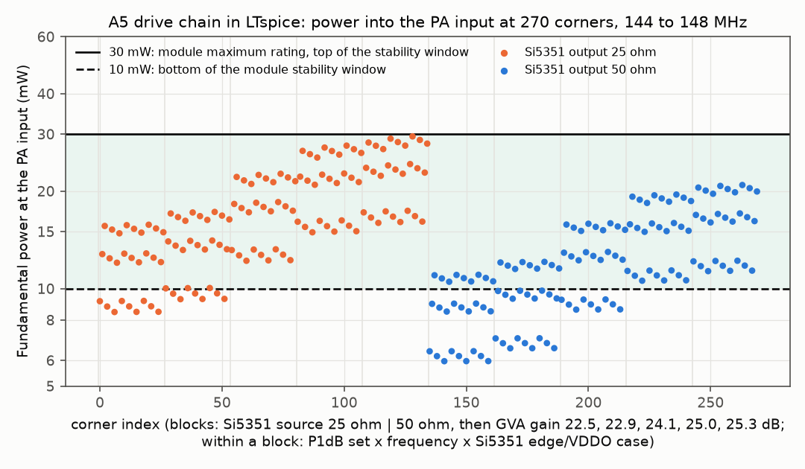
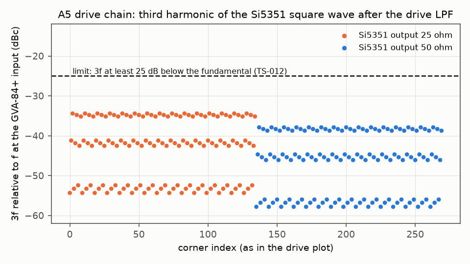
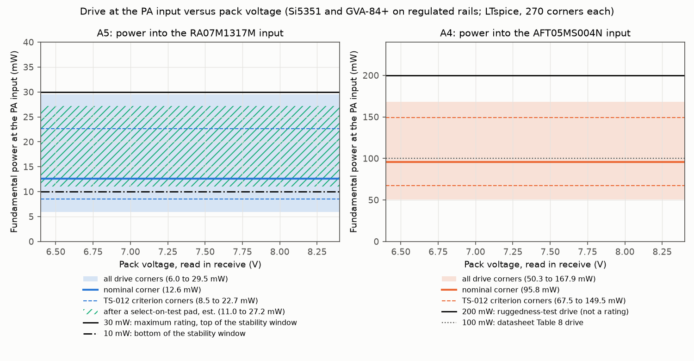
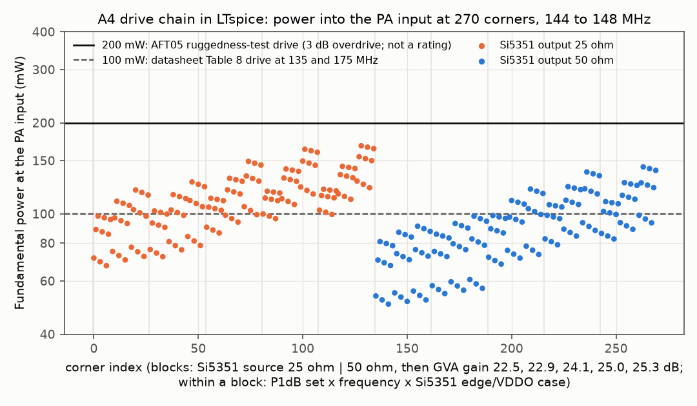
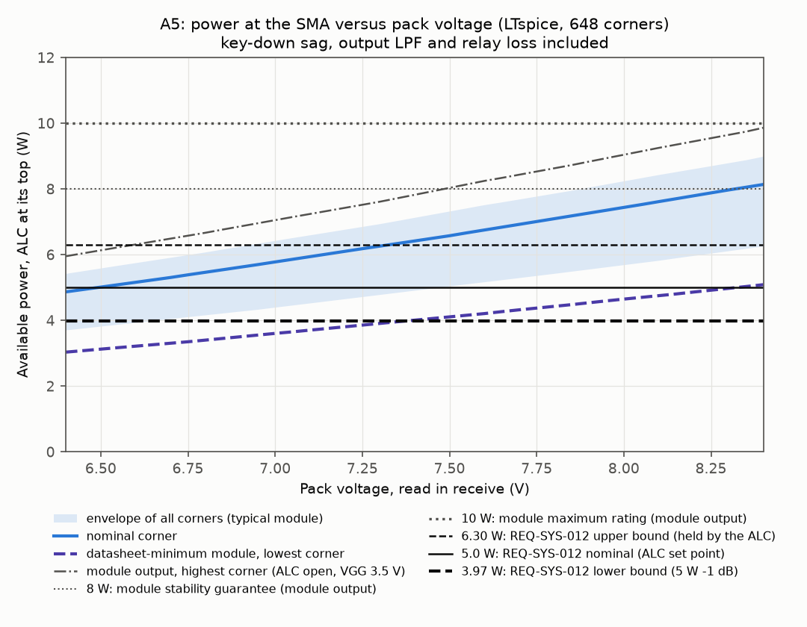
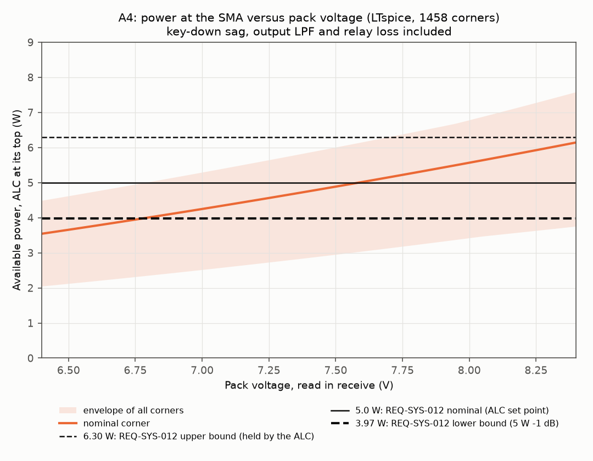
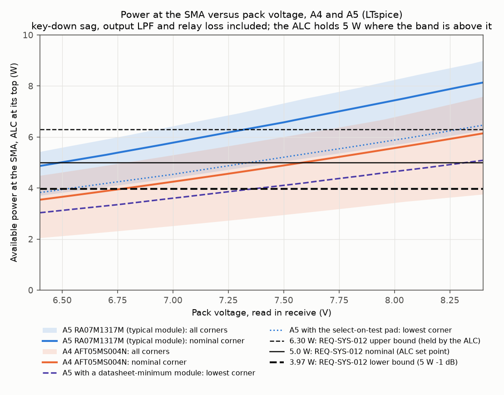

# PA drive window and output power at the SMA, TS-012 finalists A4 and A5

| Field | Value |
|---|---|
| Product | Analysis note (08 section 3.4), WP-PDR-21 pre-order item of TS-012 revision 4 (sections 7.3 and 8.12), revision 0, 2026-09-28 |
| Author | Claude, analysis author (TS-012 discriminating analyses, owner approval of 2026-09-28, `docs/plan/status/status-2026-09-28.md` section 1 item 2) |
| Status | Draft, not yet peer reviewed. Proposed review record `docs/reviews/PDR/checklists/analysis-pa-drive-ts012.md` (`peer-review-checklist-analysis.md`) |
| Serves | TS-012 choice between A4 and A5; TS-012 pre-order criterion "module input 10 to 30 mW at every corner"; REQ-SYS-012 (5 W +/-1 dB, TBR) supporting pre-build evidence ("Simulation, LTspice PA plus ALC transient over 6.4 to 8.4 V", verification note); inputs to WP-PDR-22 (VGG clamp, open-loop case) |
| Decks, scripts, results | `hardware/sim/tx-pa/` (README there): `run_pa.py` (deck writer, runner through `tools/ltspice-batch.sh`, checker, plots), `digitize_ra07.py` and `digitize_aft05.py` (datasheet graph readers), `data/` (digitized curves with overlays), `decks/`, `results/2026-09-28-*` (seven runs) |
| Evidence status | Developer evidence. LTspice 26.0.2 through the accredited wrapper (ACC-LTSPICE-001); Python 3.13 venv with numpy, scipy 1.18.1, spicelib 1.6.3 and matplotlib 3.11.2 (class B entries of `tools/toolchain.lock.md` section 2). Every PA and driver curve is a graph read of typical vendor data (estimate) unless a row says "datasheet minimum" or "datasheet maximum" |

## 1. Purpose

TS-012 revision 4 presents A4 (NXP AFT05MS004N, hand-derived match, no TCXO) and A5 (Mitsubishi RA07M1317M module, TCXO) together, and names the PA drive chain as a pre-order LTspice check (WP-PDR-21). This note answers, for each finalist:

1. What power reaches the PA input across the part tolerances (Si5351A output resistance 25 or 50 ohm, its supply, edge time and duty cycle; GVA-84+ gain and compression; 144 to 148 MHz)?
2. For A5: is the RA07M1317M input kept inside 10 to 30 mW (its stability conditions, and 30 mW is its maximum rating) at every corner? The TS-012 criterion also asks that the third harmonic at the GVA-84+ input be at least 25 dB below the fundamental.
3. What power reaches the SMA from 6.4 to 8.4 V pack (read in receive), after key-down sag, the output low-pass filter and the T/R relay, against REQ-SYS-012 (3.97 to 6.30 W)?

## 2. Method

**Drive chain (runs d2, d3; transient).** The Si5351A CLK1 is a trapezoid Thevenin source with a swing equal to VDDO, the DC removed (the path is AC coupled), behind 25 or 50 ohm. It feeds the drive LPF (a 3-pole C-L-C: 18 pF C0G 1206, 82 nH 1812SMS class, 18 pF, with estimated ESR, ESL, via inductance, coil Q and self-resonance) with a 5 pF divider tap on the CLK1 pin. Then come the E24 pi pads, the GVA-84+ and the PA input, taken as 50 ohm because both PA datasheets specify Pin in a 50 ohm system. The GVA-84+ is a behavioural block: a 50 ohm input, a Rapp limiter on the instantaneous voltage and a 50 ohm output. The limiter's two parameters were fitted by describing function so that the fundamental compresses 1 dB and 3 dB at the datasheet P1dB and Psat, and run d1 checks that fit in LTspice. Each deck steps 270 corners in one `.step`: 2 source resistances x 5 GVA gains x 3 P1dB sets x 3 frequencies x 3 Si5351 cases. The checker resamples the last three whole periods from the `.raw` and takes the fundamental and 3f by DFT.

**Power path (runs p1, p2, p3; DC sweep).** The pack EMF is swept from 6.4 to 8.4 V behind the drain feed resistance. The 5 V bus (0.25 A) and the PA drain current Pout/(eta x Vd) load the feed, so LTspice solves the key-down sag and the PA output together. The PA output (volts on a node stand for watts) comes from the digitized datasheet curves:
- **A5:** Pout = Pout_VDD(Vd) x drive factor x VGG factor x spread factor.
  - Pout_VDD(Vd): the typical Pout versus VDD curve at Pin 20 mW and VGG 3.5 V, interpolated in frequency between the 135 and 155 MHz curves.
  - Drive factor: the Pout versus Pin curve at 7.2 V, relative to its value at 20 mW.
  - VGG factor: 1, or the Pout versus VGG ratio between the lowest clamp (3.08 V) and 3.5 V.
  - Spread factor: 1 (typical), or 6.5 W over the typical output at 7.2 V (the datasheet minimum).
- **A4:** Pout = Pout_7.5(Pin) x (Vd/7.5)^n x match factor. Pout_7.5(Pin) is Figure 13 of the AFT05 datasheet (the NXP reference circuit), interpolated in frequency, with the drive corners of d3; n is 1.8, 2.0 or 2.3; the match factor is the extra loss of the hand-derived match (0, 0.25 or 0.5 dB).
- **Both:** the output loss (LPF plus relay) is 0.4, 0.5 or 0.6 dB. Each deck steps every combination (648 corners for A5, 1458 for A4).

The drive corners (minimum, nominal, maximum PA input from d2 and d3) are the link between the two models.

**Digitizing.** The datasheet pages were rendered at 400 dpi. The grid was located automatically, and each Pout curve was tracked column by column: the solid RA07M1317M curves after removing the dashes of the neighbouring curves, and the orange AFT05 curves by colour. Every tracked curve was overlaid on its datasheet crop and inspected (`hardware/sim/tx-pa/data/*_overlay.png`).

**Corners.** Every parameter with a datasheet minimum and maximum uses them. Parameters without one use a stated estimate (section 3). The pass/fail judgement uses the worst corner, and the nominal corner is reported beside it.

## 3. Inputs and sources

Datasheets were fetched 2026-09-28 (public vendor PDFs; SHA-256 in the block README).

| Input | Value used | Source and confidence |
|---|---|---|
| Si5351A output resistance | 25 and 50 ohm | Datasheet Rev. 1.3 Table 4: ZO 50 ohm typical (3.3 V VDDO, default high drive); 25 ohm is the TS-012 corner (no minimum published) |
| Si5351A edge, duty, VDDO | 20-80 % edge 0.5 / 1.0 / 1.5 ns; duty 0.45 / 0.50; VDDO 3.2 / 3.3 / 3.4 V | Rev. 1.3 Table 7: tr, tf 1 ns typ, 1.5 ns max (CL 5 pF); duty 45 to 55 % below 160 MHz. The 0.5 ns fast case and VDDO +/-3 % (Adafruit module LDO) are estimates |
| Drive LPF | 18 pF / 82 nH / 18 pF; ESR 0.1 ohm, ESL plus via 1 nH, coil Q 100 at 146 MHz, SRF 1.2 GHz | TS-012 section 7.3 (3-pole, fc about 170 MHz, one 1812SMS, two 1206 C0G); values and parasitics chosen here (estimates). The inductor value is to be confirmed on the Coilcraft page at the order |
| Divider tap load on CLK1 | 5 pF | Estimate (100 pF coupling into the 74LVC1G80 input) |
| Pads (E24, 1 %) | A5 input 62 / 200 / 62 ohm (18.42 dB); A5 output 300 / 18 / 300 ohm (3.00 dB); A4 input 82 / 91 / 82 ohm (11.97 dB) | TS-012 A5 line-up (18 dB and 3 dB). The A4 pad is chosen here so that the GVA-84+ sits near its P1dB at the nominal corner ("GVA-84+ at its P1dB limit", TS-012 section 7.3) |
| GVA-84+ gain | 22.5, 22.9, 24.1, 25.0, 25.3 dB | Rev. F at 0.1 GHz: 22.9 min, 24.1 typ, 25.3 max; 22.5 and 25.0 are the TS-012 criterion corners |
| GVA-84+ compression | P1dB 19.4 / 20.4 / 21.4 dBm with Psat 20.7 / 21.7 / 22.7 dBm; Rapp p 2.70, Vsat 2.99 / 3.36 / 3.77 V peak | Rev. F: P1dB +19.4 min, +20.4 typ; Psat (3 dB compression) +21.7 typ. The "high" set (+1 dB) and the Psat of the min set are estimates |
| GVA-84+ input maximum | +13 dBm | Rev. F absolute maximum ratings |
| RA07M1317M curves | Pout versus Pin (7.2 V, VGG 3.5 V), versus VDD (Pin 20 mW, VGG 3.5 V), versus VGG (7.2 V, Pin 20 mW), at 135 and 155 MHz | Datasheet Jun. 2019 pages 3 to 5, digitized (typical, estimate). Checks: 8.23 W at 7.2 V and 155 MHz on the VDD curve against 8.15 W on the Pin curve at 20 mW; about 8.5 W at 145 MHz on the frequency plot |
| RA07M1317M guaranteed output | 6.5 W minimum at 7.2 V, VGG 3.5 V, Pin 20 mW | Datasheet electrical characteristics |
| RA07M1317M efficiency | 0.60 typical, 0.45 minimum | 0.60 from the page 4 current curve (graph read, estimate: 5.85 W at 6.0 V and 1.63 A); 0.45 is the datasheet minimum at 6 W, 7.2 V |
| RA07M1317M ratings and window | Pin 30 mW maximum; stability for Pin 10 to 30 mW, Pout up to 8 W; Pout 10 W maximum | Datasheet (as read in TS-012 and INSP-110 row S3) |
| VGG at the ALC top | 3.5 V, or 3.08 V (lowest clamp) | TS-012 revision 4 clamp: 3.08 to 3.46 V (LM2940 4.75 V x 0.6493) |
| AFT05MS004N curve | Pout versus Pin at 7.5 V, 135 and 155 MHz | Datasheet Rev. 0 Figure 13 (reference circuit), digitized (typical, estimate). Check: 6.08 W at 0.1 W and 135 MHz against Table 8's 6.0 W |
| AFT05 voltage scaling | (Vd/7.5)^n, n 1.8 / 2.0 / 2.3 | Estimate; the datasheet has no VHF Pout versus VDD. The RA07M1317M curve gives n = 1.86 between 6.0 and 8.4 V |
| AFT05 efficiency | 0.67 typical, 0.55 low | Figure 13 at 0.1 W (62 % at 135 MHz, 73 % at 155 MHz; graph read); 0.55 is an estimate |
| AFT05 hand-match extra loss | 0 / 0.25 / 0.5 dB | Estimate (match re-derived for a 0.8 mm board with wound coils; TS-012 section 7.3, adversarial C4) |
| AFT05 drive reference | 0.1 W typical (Table 8); 0.2 W ruggedness test (3 dB overdrive, Table 9) | Datasheet; the maximum ratings table gives no input power rating |
| Drain feed resistance | 0.26 / 0.35 / 0.45 ohm (cells, protection FETs, polyfuse, holders, reverse and rail switch, chokes) | TS-012 section 7.3 (mix of datasheet bounds and estimates). A4 is taken with the same feed |
| 5 V bus current at key-down | 0.25 A | Estimate (GVA-84+ 0.108 A typ, G5V-2 coil 0.1 A, Pico and op-amps); TS-012 used 0.2 A |
| Output loss | 0.4 / 0.5 / 0.6 dB | TS-012 allocation: LPF 0.4 dB (criterion at most 0.5 dB) plus relay 0.1 dB; 0.6 dB is the criterion edge plus relay |
| Pack voltage | 6.4 to 8.4 V EMF | REQ-SYS-012 reads the pack in receive; the difference from the EMF is under 10 mV (estimate) |

## 4. Results

### 4.1 GVA-84+ model (run d1)

The fitted model reproduces the datasheet compression points within 0.03 dB for all three P1dB sets: 1 dB points at 19.37, 20.37 and 21.37 dBm, 3 dB points at 20.69, 21.69 and 22.69 dBm (**PASS**).

### 4.2 A5 drive window (run d2)

| Quantity | Min | Nominal | Max | Limit | Verdict |
|---|---|---|---|---|---|
| Power into the RA07M1317M input, all 270 corners | 6.0 mW (7.76 dBm) | 12.6 mW (11.01 dBm) | 29.5 mW (14.70 dBm) | 10 to 30 mW | **FAIL**: 60 corners under 10 mW, none over 30 mW |
| Same, TS-012 criterion corners (25 and 50 ohm, gain 22.5 and 25.0 dB, 144 to 148 MHz, nominal Si5351 edge and VDDO) | 8.5 mW | - | 22.7 mW | 10 to 30 mW | **FAIL**: 27 of 36 inside |
| 3f relative to f at the GVA-84+ input | - | - | -34.4 dBc (worst) | at most -25 dBc | **PASS** |
| GVA-84+ input | - | -10.1 dBm | -7.5 dBm | below +13 dBm | **PASS** |
| GVA-84+ output | - | 14.0 dBm | 17.8 dBm | P1dB min 19.4 dBm | 1.6 dB of back-off at the highest corner |

**Why the window is not kept.** The spread of the drive over all corners is 6.9 dB, and the window is 4.77 dB wide. No choice of fixed pad fits one inside the other: the highest corner is already at 29.5 mW, so a smaller pad would push it over 30 mW. The spread comes from part-to-part constants, not from anything that varies during operation. Averaged over the other factors:
- GVA-84+ gain (22.5 to 25.3 dB): 2.7 dB;
- Si5351 edge, VDDO and duty case: 2.4 dB;
- source resistance (25 against 50 ohm): 1.5 dB;
- frequency (144 to 148 MHz): 0.26 dB;
- GVA-84+ P1dB set: under 0.1 dB.

**Why the nominal drive is 12.6 mW, not the 20 mW TS-012 expected.** TS-012 took +10.4 dBm from an ideal 1.65 Vpp square wave. The trapezoid with the typical 1 ns edge gives 9.6 dBm of available fundamental at 146 MHz (-0.9 dB). The drive LPF and the tap then cost another 1.2 dB, because a 3-pole Butterworth-like filter with its corner at about 180 MHz is already about 1 dB down at 146 MHz. That leaves 8.3 dBm into the 18.4 dB pad.

**Select-on-test pad (run s1, estimate).** REQ-SYS-144's TS-012 delta already admits "drive pad selection" as a one-time build alignment. In one built unit, only frequency varies in service: 0.34 dB at most across 144 to 148 MHz within any single corner of the other factors. Suppose the pad is chosen at build from a set in 1 dB steps, with the module replaced by a 50 ohm load and the level read to +/-1 dB (diode probe on the Fluke 174, or the tinySA once bought; estimate), plus 0.3 dB of temperature and supply drift (estimate). The drive then stays within 17.3 mW +/-1.97 dB, that is **11.0 to 27.2 mW, inside the window (PASS, estimate)**. Covering the whole unit spread from the as-built 18.4 dB pad needs pads of about 14 to 21 dB. E24 1 % pi values found here, each with at least 25 dB return loss:

| Pad (dB) | Shunt, series, shunt (ohm) | Loss (dB) |
|---|---|---|
| 14 | 75, 120, 75 | 13.98 |
| 15 | 68, 130, 68 | 15.04 |
| 16 | 68, 150, 68 | 15.92 |
| 17 | 62, 160, 62 | 16.94 |
| 18 | 68, 200, 68 | 17.79 |
| 19 | 68, 240, 68 | 19.05 |
| 20 | 68, 270, 68 | 19.88 |
| 21 | 56, 270, 56 | 21.26 |

The nominal pad would move from 18 to 17 dB.

The Si5351 and the GVA-84+ run from regulated rails, so the drive is flat in pack voltage. The model does not include the LM2940 in dropout at the low pack end (section 6).

### 4.3 A4 drive (run d3)

| Quantity | Min | Nominal | Max | Reference | Verdict |
|---|---|---|---|---|---|
| Power into the AFT05 input, all corners | 50 mW (17.0 dBm) | 96 mW (19.8 dBm) | 168 mW (22.2 dBm) | 0.1 W Table 8; 0.2 W ruggedness-test drive | Under 0.2 W at every corner (**PASS**, informative: the datasheet has no input rating) |
| TS-012 criterion corners | 67 mW | - | 149 mW | - | - |
| 3f at the GVA-84+ input | - | - | -34.5 dBc | at most -25 dBc | **PASS** |
| GVA-84+ input | - | - | -1.1 dBm | below +13 dBm | **PASS** |

A4 runs the GVA-84+ into compression by design, so its drive spread (5.2 dB) is smaller than A5's. The low corner is set by the minimum gain and the minimum P1dB, and it is the largest single term in A4's output spread (section 4.5).

### 4.4 Power at the SMA, A5 (runs p1 and p3)

| At 6.4 V pack | Nominal | Lowest corner, typical module | Lowest, VGG at 3.5 V | Lowest, feed at most 0.35 ohm and VGG 3.5 V | Datasheet-minimum module, lowest | Highest |
|---|---|---|---|---|---|---|
| p1: drive as designed | 4.87 W | **3.71 W (FAIL)** | 4.03 W | 4.31 W | 3.03 W | 5.43 W |
| p3: select-on-test drive | 4.93 W | **3.83 W (FAIL)** | 4.16 W | 4.45 W | 3.14 W (3.62 W with feed at most 0.35 ohm and VGG 3.5 V) | 5.42 W |

- The drain sits at 5.76 V at the nominal corner (5.36 V lowest) under key-down sag at 6.4 V.
- The lowest corner with the typical module reaches 3.97 W from 6.65 V (p1) or 6.55 V (p3); with the datasheet-minimum module, from 7.40 V (p1) or 7.25 V (p3).
- The nominal corner is under 5.0 W at the low end, so the ALC cannot hold its 5.0 W set point there, but it stays inside REQ-SYS-012's band.
- At 6.4 V, averaged over the other corners: module spread (typical against datasheet minimum) 0.95 dB, drain feed 0.26 to 0.45 ohm 0.45 dB, VGG clamp 3.08 against 3.5 V 0.41 dB, drive 0.30 dB, efficiency 0.20 dB, output loss 0.20 dB, frequency 0.03 dB.
- At 8.4 V the module can make 9.13 W (nominal) and up to 9.86 W at the highest corner (open loop, VGG 3.5 V), 8.99 W at the SMA. The highest corner exceeds the 8 W stability guarantee from 7.5 V up, and stays under the 10 W rating. The ALC must hold 5 W, and the open-loop case needs the pack-dependent clamp that TS-012 names as the WP-PDR-22 fallback.

**Correction to a TS-012 input.** TS-012 and `docs/research/pa-device-candidates.md` F8 read 5.3 W at 6.0 V and 10.5 W at 8.4 V from the 155 MHz Pout versus VDD curve. The digitized curve gives 5.85 W and 10.92 W at 155 MHz (6.27 W and 11.37 W at 135 MHz). The typical module is therefore about 0.4 dB stronger at the low end than TS-012 assumed. TS-012's "3.97 to 4.57 W at the SMA" at 6.4 V used the typical curve only. It did not include the datasheet-minimum module (-1.0 dB at 146 MHz: 6.5 W against 8.18 W typical at 7.2 V), the lowest VGG clamp, or the efficiency and drive corners. It is a nominal range, not a bound.

### 4.5 Power at the SMA, A4 (run p2)

| At the pack voltage | Nominal | Lowest corner | Highest corner |
|---|---|---|---|
| 6.4 V | 3.54 W | **2.05 W (FAIL)** | 4.49 W |
| 8.4 V | 6.14 W | 3.76 W | 7.59 W |

- The nominal corner reaches 3.97 W from 6.8 V and 5.0 W from 7.6 V.
- The lowest corner stays under 3.97 W over the whole 6.4 to 8.4 V range. It reaches 2.41 W at 6.4 V with n = 2 and no extra match loss, and 2.84 W with the drive at or above nominal.
- At 6.4 V, averaged over the other corners: drive (50 to 168 mW) 1.66 dB, VDD exponent 0.45 dB, hand-match loss 0.44 dB, feed 0.34 dB, frequency 0.2 dB, output loss 0.2 dB, efficiency 0.1 dB.
- TS-012's "about 3.2 W at 6.4 V" (adversarial C2) lies inside this range, close to the nominal.

### 4.6 Both finalists

### 4.7 Other observations

- **CLK1 swing for the prescaler (INSP-110 O-5).** The CLK1 pin swings 2.22 to 3.24 V peak to peak across the corners, with the drive LPF's input capacitor and the 5 pF tap on it. Against the 1.2 V between VIL 0.8 V and VIH 2.0 V of the 74LVC1G80, that leaves at least 1.0 V of margin when the bias sits midway (1.4 V). This is larger than the 0.45 V that O-5 estimated from 1.65 Vpp.
- **3f criterion.** It holds for both chains with at least 9.4 dB of margin (worst at the 25 ohm, fast-edge corner).

## 5. Verdicts per finalist

**A5 (RA07M1317M): FAIL as designed, closable before the order.**
- (a) The fixed-pad drive does not keep the module inside 10 to 30 mW. Six of every 27 corners fall under 10 mW, and the TS-012 criterion corners fail too. Overdrive is designed out (at most 29.5 mW), but under-drive below the stability condition is not. A select-on-test pad from 14 to 21 dB keeps the drive at 11.0 to 27.2 mW (estimate), so the criterion can be met at no parts cost.
- (b) REQ-SYS-012 at 6.4 V is not shown at the worst corner: 3.71 W with the typical module (3.83 W with the select-on-test drive) against 3.97 W. The lowest corner passes (4.31 to 4.45 W) with two TS-012 items: the drain feed held to 0.35 ohm (already the TS-012 pre-order pass criterion) and the VGG clamp not limiting at the low pack end.
- (c) A module at its datasheet-guaranteed minimum does not reach 3.97 W at 6.4 V at its lowest corner, even with both levers of (b) (3.62 W). Without them it reaches 3.97 W only from 7.25 V (select-on-test drive). That residual rests on unit spread, so only a test of the built unit (TC-SYS-011) or a conditional REQ-SYS-012 low-end delta can close it.
- (d) Open loop at 8.4 V the module exceeds its 8 W stability guarantee, as TS-012 anticipated for WP-PDR-22.

**A4 (AFT05MS004N): FAIL for REQ-SYS-012, drive acceptable.**
- The drive stays under the 0.2 W ruggedness-test level, and the 3f criterion passes.
- Output at the SMA misses 3.97 W at 6.4 V at the nominal corner (3.54 W) and at every corner below about 6.8 V. At its lowest corner it misses 3.97 W across the whole pack range (2.05 W at 6.4 V, 3.76 W at 8.4 V). The requirement delta TS-012 carries for A4 at the 6.4 V end therefore understates the shortfall: at the lowest corner it reaches up to 8.4 V.
- The largest term is the GVA-84+ drive spread (1.66 dB), followed by the estimated VDD scaling and hand-match loss. The last two have no vendor data and are Low confidence.

**For the TS-012 choice.** On the drive and output-power questions A5 is the stronger finalist: its nominal is 1.4 dB above A4 at 6.4 V, and its shortfalls close with no-cost design items. A4's shortfall needs a requirement delta over most of the pack range, or a drive and match rework that has no vendor data behind it. Neither finalist shows REQ-SYS-012 at the 6.4 V worst corner today.

## 6. Limitations

1. **Graph reads.** Every PA curve is typical data digitized from a vendor plot (estimated reading error about +/-0.1 W on the RA07M1317M and +/-0.1 W on the AFT05 axes). The only guaranteed PA figure used is the RA07M1317M 6.5 W minimum, and it is applied as a uniform scale at every voltage (estimate).
2. **Separable module model.** The RA07M1317M drive, VGG and VDD dependences are multiplied as independent factors. Taking the VGG factor at 7.2 V is likely pessimistic at a low drain voltage, where the module saturates at a lower VGG.
3. **The AFT05 has no VHF Pout versus VDD data.** The (Vd/7.5)^n law and the hand-match loss are estimates. The A4 results carry Low confidence until the match is designed in LTspice from the NXP Zsource and Zload table (TS-012 section 7.3).
4. **Behavioural GVA-84+.** The GVA-84+ is modelled flat in frequency and memoryless, at 5.0 V. Its gain and P1dB with the 5 V bus in LM2940 dropout at the low pack end are not modelled. The P1dB "min" set is taken to cover 4.75 to 5.25 V; below that the A4 drive falls further.
5. **50 ohm PA inputs.** Both datasheets specify Pin with a 50 ohm source (ZG = 50 ohm). The RA07M1317M input VSWR (up to 4:1) and the AFT05 reference-circuit input match are therefore inside the curves, not modelled separately.
6. **Si5351 output.** The output is a linear Thevenin source. The real driver's output resistance may vary within a cycle, and the 25 ohm corner has no datasheet basis (typical 50 ohm only).
7. **The output loss is an allocation.** It is not the result of the WP-PDR-21 LPF run (`hardware/sim/tx-lpf`, in progress in parallel). If that run gives more than 0.5 dB of passband loss, the SMA figures here fall by the difference.
8. **No ALC loop.** This note gives the power available with the control at its top. Holding 5 W, overshoot and the open-loop dynamics are WP-PDR-22.
9. **Estimated terms.** Drain feed resistance, bus current and efficiency are estimates (section 3). The feed resistance is itself a TS-012 pre-order read (DMP3099L RDS(on), MF-R300 R1max).

## 7. What closes before the order

| Item | Finalist | Action | Pass criterion |
|---|---|---|---|
| C1 | A5 | Adopt a select-on-test drive pad. Put a pi footprint on the RF board; nominal 17 dB; build set 14 to 21 dB (section 4.2 table, E24 1 %, owned through-hole or 0805). Add a build-alignment step: module replaced by a 50 ohm load, level read with the diode probe and the Fluke 174 (or the tinySA) | Drive 10 to 30 mW at every in-service condition (estimate 11.0 to 27.2 mW); a rerun of d2 with the chosen pad and the measured level reproduces it |
| C2 | A5 | Close the TS-012 feed-resistance read: DMP3099L RDS(on) at VGS -6 V and MF-R300 R1max from the datasheets | Total feed at most 0.35 ohm (TS-012 criterion). Rerun p1 with the read values |
| C3 | A5 | In WP-PDR-22, make the VGG clamp non-limiting at the low pack end. The pack-dependent clamp TS-012 names as the open-loop fallback does this: lower at high VDD, and at least 3.3 V (estimate) at 6.4 V | p1 lowest corner at least 3.97 W at 6.4 V with the typical module (4.31 W in this model with C2 and VGG 3.5 V); module output at most 8 W at the open-loop corner at 8.4 V |
| C4 | A5 | Decide how the datasheet-minimum module case is carried. Either a conditional REQ-SYS-012 delta at the low pack end (A5 row of TS-012 section 8.10), or acceptance on TC-SYS-011 with the risk kept (TS-012 section 7.1 row "0.0 to 0.6 dB margin at 6.4 V", which this note re-quantifies as -0.3 dB at the lowest corner to +0.9 dB at the nominal corner for a typical module, and down to -1.2 dB for a minimum one) | Owner decision recorded in the TS-012 decision; risk register row updated |
| C5 | A4, if chosen | Design the AFT05 match in LTspice from the NXP Zsource and Zload table for the 0.8 mm board; replace the (Vd/7.5)^n estimate with the matched device's result; consider a smaller input pad so the GVA-84+ saturates at every corner | The REQ-SYS-012 delta for A4 widened to the full pack range at the lowest corner, or the match and drive shown to meet 3.97 W |
| C6 | Both | Rerun p1 or p2 with the WP-PDR-21 LPF result (`hardware/sim/tx-lpf`) in place of the 0.4 to 0.6 dB allocation | Figures here updated; verdicts unchanged or revised |
| C7 | Both | Owner reads the Coilcraft 1812SMS value list at the order (82 nH assumed) | If absent, the nearest value is rerun in d2 and d3 |

## 8. Change log

| Revision | Date | Change |
|---|---|---|
| 0 | 2026-09-28 | First issue: runs d1, d2, d3, p1, p2, p3 and s1 of `hardware/sim/tx-pa` |
