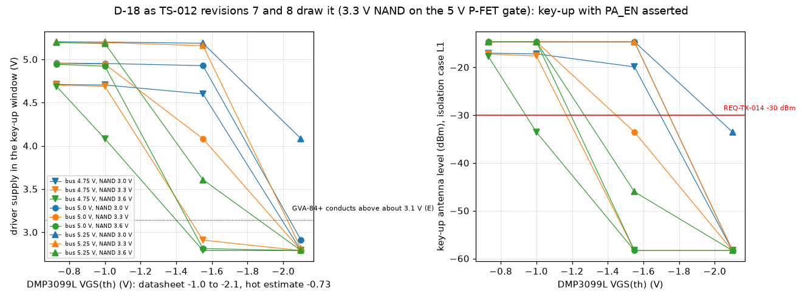
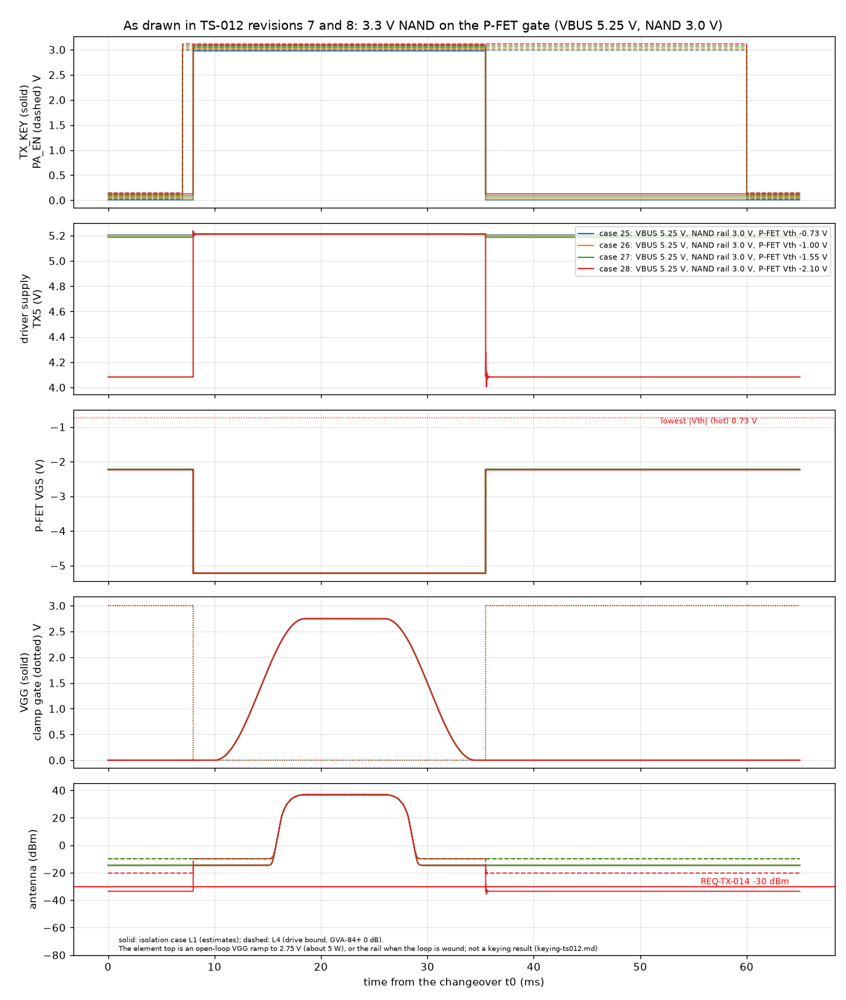
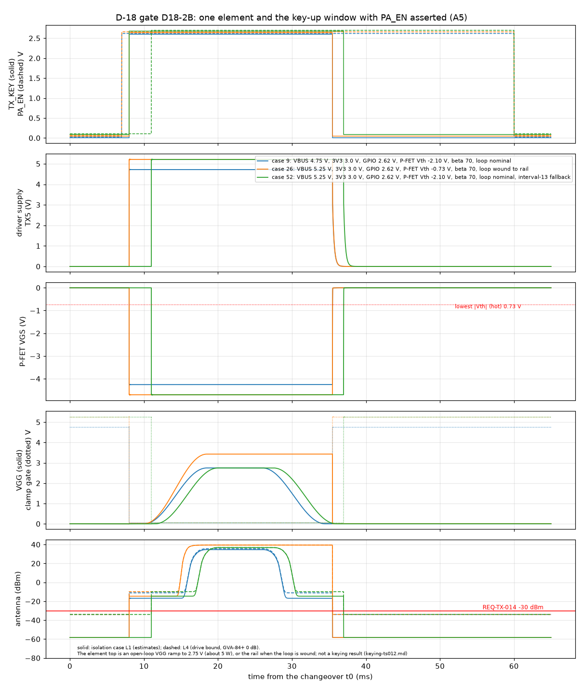
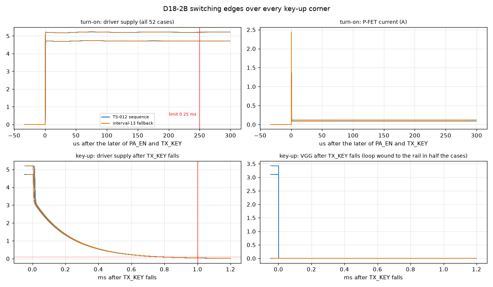
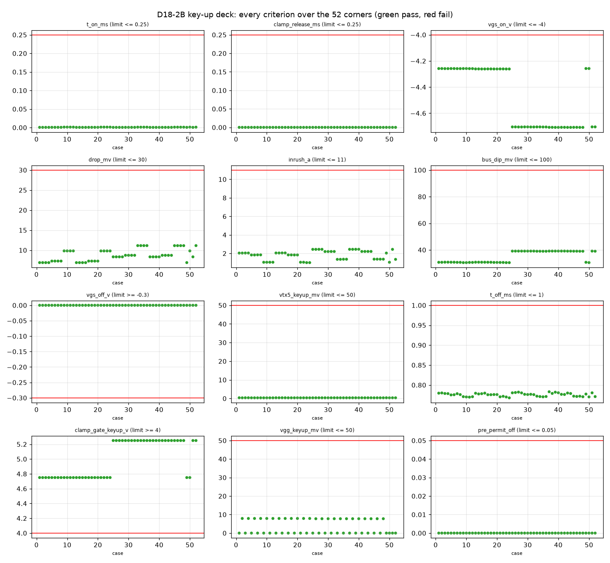
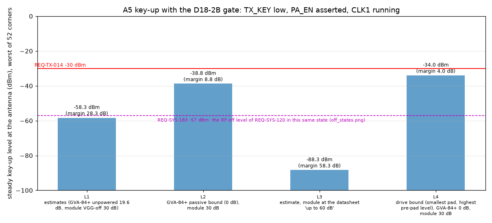
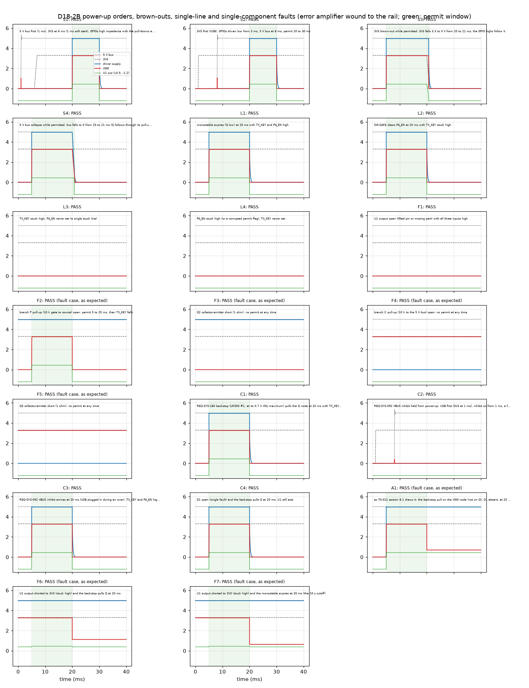
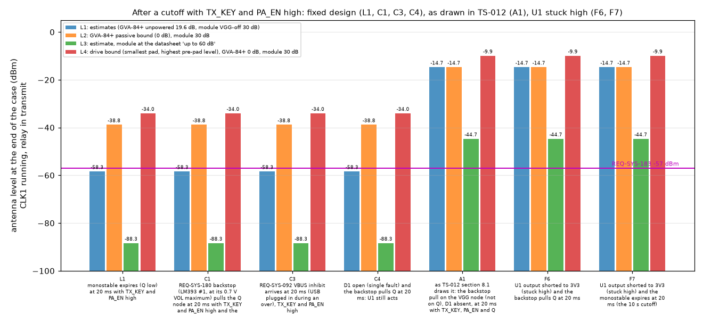
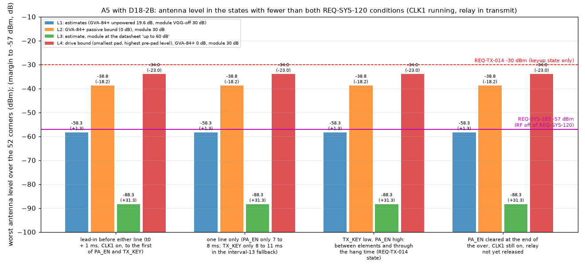

# D-18 PA-permit gate: level interface, unpowered states and the A5 key-up case (WP-PDR-22)

| Field | Value |
|---|---|
| Product | `docs/design/analysis/pa-permit-gate-d18.md` (analysis note, `analysis_kind`: simulation and worst-case datasheet arithmetic; logic interface, power sequencing, single faults, key-up and RF-off levels), **revision 1**, 2026-09-29 (revision 0: `078f2f7`) |
| Work package | WP-PDR-22 (`docs/plan/pdr-work-plan.md` section 3.0 row 22 and the WP-PDR-22 section): "the key-up case with the D-18 gate and the fix of the D-18 lien (gate supply rail, level interface to the 5 V P-FET, unpowered state), which CR-018 needs before it carries the REQ-TX-014 restatement". The rest of WP-PDR-22 (the closed VGG loop with D-9 and D-10 at circuit values, the late-contact and open-loop faults, the simulated power-on of the loop, G3 values) is not in this record |
| Author | Claude, analysis author invocation, 2026-09-29 |
| Status | Draft, revision 1 for re-freeze (rule C2) and the delta iteration of the independent review and its software assurance pair (plan WP-PDR-22: reviewer plus SA; the gate is part of the HZ-004 K8 control). Revision 1 fixes only the two Major findings of iteration 1 (rule C1); the Minor findings are held as liens (section 11) |
| Design basis | TS-012 revision 8 (`bb5dee7`): section 7.3 revision 6 "Hardware gate (D-18)" and the key-down sequence; section 8.1 diagram and note 2 (the open lien); section 8.14 D-18; row E5 (g). The owner chose A5 (TS-012 section 10; status note 2026-09-29 section 5) |
| Findings answered | INSP-118 finding-9 (a), (b) and (c) (`docs/reviews/PDR/checklists/ts-012-design-to-cost-software-assurance.md`); INSP-110 finding-24 (`docs/reviews/PDR/checklists/ts-012-design-to-cost.md`). One fix closes both, as both records say. **Revision 1:** the Major finding-1 of the independent review of revision 0 (CK-ANA-E3, F1, A1: REQ-SYS-120 reported met without its -57 dBm level) and the Major finding-1 of its software assurance pair (SWE-134 section 7.1 task 6, SWE-057 task 2, SWE-080 task 1, SA-C-i, SA-C-l: the REQ-SYS-180, 181 and 092 cutoffs clamp only VGG and leave the driver powered). Section 11 lists each change |
| Decks, scripts and results | `hardware/sim/tx-pa-permit/` (README.md there). Revision 1 runs (script revision 1): `2026-09-29-d18r1-keyup`, `2026-09-29-d18r1-seq` and `2026-09-29-d18r1-summary`; the as-drawn run `2026-09-29-d18-asis` of revision 0 is reused unchanged (its deck does not change). Revision 0 runs `2026-09-29-d18-keyup`, `-seq` and `-summary` stay as the record of revision 0, each with its own script copy. All in `hardware/sim/tx-pa-permit/results/`. The three revision 1 run folders hold the same `d18_run.py` as the working copy; the D1 current metric was changed after the LTspice run of `d18r1-seq` and the run was re-analysed (`replot`, deck byte-identical) |
| Tool | LTspice 26.0.2 through `tools/ltspice-batch.sh` only (ACC-LTSPICE-001); `.raw` read with spicelib 1.6.3 in the repo venv; checker `d18_run.py` |
| Evidence status | **Developer evidence** (05 section 9.1): the checker has no TV record. The logic, transistor and MOSFET limits are datasheet values; the GVA-84+ unpowered isolation, the module's VGG-off isolation, the GVA-84+ current against supply, the regulator and bead models and the hot leakage multipliers are estimates (section 4). Every stage exits 3 when a criterion the design must pass fails or an expected state differs, 0 otherwise |
| Serves | REQ-TX-014 (the key-up case and the CR-018 restatement), REQ-SYS-120 (hardware half of the two conditions: the state, and the level REQ-SYS-183 sets, section 5.8), REQ-SYS-183, REQ-SYS-055, 180, 181 and 092 (the cutoffs' path to the driver, section 2), HZ-004 K5 and K8 (WP-PDR-16b wording), 07 section 14.2 row i; TS-012 D-18, section 8.1 and row E5 (g); the TC-TX-014 method |

## Summary

- **The lien is real.** As TS-012 draws it, a 3.3 V NAND output on the gate of the DMP3099L leaves the driver supply at 4.1 to 5.2 V with TX_KEY low in 25 of 36 corner cases. The key-up level then fails REQ-TX-014 in 21 of 36 (up to -14.7 dBm against -30 dBm), and in those cases the driver is powered whenever the 5 V bus is up (section 5.1). INSP-118 finding-9 (a) and INSP-110 finding-24 are reproduced.
- **Fix (design D18-2B, section 2).** The gate becomes a 74LVC1G11 three-input AND on the Pico 2 3V3 rail. Its output drives two 2N3904 open-collector level shifters to the 5 V bus:
  - branch P holds the GVA-84+ supply P-FET's gate at its source through 10 kohm unless permitted;
  - branch C holds the 2N7002 VGG clamp's gate at the 5 V bus (full drive) unless permitted.
  The monostable Q is pulled up to the 5 V bus, and the P-FET feeds only a 100 nF node with a 2.2 kohm bleed.
- **Revision 1: the other hardware cutoffs go through the gate (section 2).** TS-012 section 8.1 wires the REQ-SYS-180 backstop, the REQ-SYS-181 95 C trip, the cell 60 C trip and the REQ-SYS-092 VBUS inhibit onto the VGG node only. With TX_KEY and PA_EN high and the monostable retriggered, each of them then clamps VGG but leaves the driver powered: -14.7 dBm (L1, L2), -9.9 dBm (L4) and -44.7 dBm (L3), against the -57 dBm RF-off level of REQ-SYS-183 (sequencing case A1). Revision 1 puts these open-collector outputs on the Q node under its 10 kohm pull-up, so each one takes U1 low and unpowers the driver as well as clamping VGG (cases C1 to C3: the same levels as key-up). One 1N5711W (D1) from the VGG node to the Q node keeps a path from every cutoff to VGG that does not pass through U1. The 52 key-up corners are unchanged by it (largest change 0.2 mV of bus dip).
- **Every criterion passes in all 52 key-up corners** (section 5.3). The corners cover: 5 V bus 4.75 and 5.25 V; 3V3 3.0 and 3.6 V; GPIO high 2.62 and 3.6 V; P-FET threshold -0.73 (hot), -1.0 and -2.1 V; 2N3904 beta 70 and 416; the error amplifier nominal or wound to the rail; the TS-012 sequence and the interval-13 fallback. Results:
  - Not permitted, the P-FET VGS is 0.0 V, against a smallest threshold magnitude of 0.73 V.
  - The driver supply is 0.4 mV in the key-up window, and below 0.1 V within 0.78 ms of TX_KEY falling.
  - The clamp gate is at 4.75 V or more. VGG is at most 7.9 mV with the error amplifier at its rail.
  - Permitted, VGS is -4.26 V or beyond, the P-FET drop is at most 11 mV, and the driver is powered within 1.2 us.
- **REQ-TX-014 on A5 with the gate (the key-up rerun, section 5.4).** Condition: TX_KEY low, PA_EN asserted, CLK1 running. This result and the gate design are not changed by revision 1.
  - Level: **-58.3 dBm** on the estimates (28.3 dB margin). **-38.8 dBm** with the unpowered GVA-84+ at its passive bound of 0 dB. **-34.0 dBm** at the drive bound (smallest pad, highest pre-pad level) with the passive bound (4.0 dB margin).
  - REQ-TX-014 now needs only 21.2 dB (design drive) or 26.0 dB (drive bound) of combined off-state isolation: GVA-84+ unpowered plus module at VGG = 0. The keying note's check asked for 43 dB from the module alone, which the datasheet does not guarantee.
  - The restatement TS-012 proposes for CR-018 is supported (section 6.1).
- **REQ-SYS-120 is not shown to be met at its level (revision 1, section 5.8).** REQ-SYS-120 defines RF off as the REQ-SYS-183 level, -57 dBm. The gate gives the right state (driver unpowered and VGG clamped) whenever fewer than both conditions are asserted. But in normal operation CLK1 runs and the relay is in transmit through the whole over: before the first element, while only one line is high, between elements, through the hang time and after PA_EN clears. In each of those states the level is the key-up level above:
  - **-58.3 dBm** on the estimates: 1.3 dB under -57 dBm, which is inside the uncertainty of the two isolation estimates;
  - **-38.8 dBm** at the GVA-84+ passive bound (18.2 dB over) and **-34.0 dBm** at the drive bound (23.0 dB over).
  The same levels hold after each hardware cutoff (REQ-SYS-055, 180, 181, 092) with CLK1 running, which are the states of TC-SYS-039, 108, 109 and 066.
- **A requirement conflict, routed (section 7, F-6).** REQ-TX-014 allows 1 uW (-30 dBm) in exactly the state where REQ-SYS-120, through REQ-SYS-183, asks for -57 dBm. The child requirement is 27 dB looser than its parent in the same state. This record does not choose; it goes to the owner as requirement owner, to CR-018 (which carries the REQ-TX-014 restatement), to WP-PDR-16b (HZ-004 K8 wording) and to WP-PDR-23 (REQ-SYS-183 value, TBR).
- **Unpowered and sequencing states (finding-9 (b), section 5.5).** The gate is safe in either power-up order and with U1 unpowered, open or removed. It is also safe through a 3V3 or 5 V brown-out, with a single stuck line (TX_KEY or PA_EN), and when the monostable expires. The error amplifier is wound to the rail in all of these cases.
- **Interval-13 fallback (finding-9 (c), section 5.6):** the driver is powered 1.2 us after PA_EN, against the 0.5 ms lead before the ramp.
- **Single faults (section 5.7).** A single open or short in one branch defeats that output only, and the other still acts. The AND gate U1 is the common element, as the NAND was in TS-012. If U1's output sticks high, no hardware cutoff can unpower the driver: D1 still takes VGG under the module's dead zone (1.1 V), which ends the 5 W carrier, but the level stays at -9.9 to -14.7 dBm (-44.7 dBm on L3). That is not RF off at the REQ-SYS-183 level (cases F6, F7; revision 0 said "still ends RF", which was wrong). Reaching the RF-off level then needs firmware (CLK1 off, the relay to receive).
- **Cost (section 6.3).** The fix adds two 2N3904 at the row 12 price, seven small passives and, in revision 1, one 1N5711W at the row 14 price: USD 0.63 to 1.22 before contingency, against the "cents" that E5 (g) carries. A5's ordering gate had USD 0.17 of margin after guards G1 and G2, so this goes to the TS-012 author and the ordering-gate recompute.

## 1. Purpose and scope

The question: with the D-18 gate made to work at the logic levels that exist, does TX_KEY low (with PA_EN asserted and CLK1 running) leave the GVA-84+ unpowered and the VGG clamped? At what RF level? And is the gate safe unpowered, in either power-up order and under single faults?

The lien has three parts, as INSP-118 finding-9 states them:
- (a) **Level interface.** A 3.3 V NAND output leaves the 5 V P-FET at VGS about -1.7 V when it should be off. A 5 V-supplied 74LVC part would not accept a 3.3 V GPIO high.
- (b) **Unpowered state and power-up order.** With the NAND rail down or at brown-out and the 5 V rail up, the clamp and P-FET gates are left undefined.
- (c) **Fallback timing.** In the interval-13 fallback the driver powers up 0.5 ms before the ramp, against 2 ms nominally, and this was not assessed.

INSP-110 finding-24 is the same defect as (a) and asks for the key-up case with the realised gate.

In scope:
- the gate circuit;
- its interface to the RP2350 GPIOs, the LM393 monostable, the DMP3099L and the 2N7002;
- power sequencing and single faults of the gate;
- the A5 key-up RF level (REQ-TX-014) with the gate;
- (revision 1) the antenna level in every state with fewer than both REQ-SYS-120 conditions, against the REQ-SYS-183 level that REQ-SYS-120 names as RF off;
- (revision 1) the path from the other hardware cutoffs (REQ-SYS-180, 181, 092 and the cell 60 C trip) to the driver supply.

Not in scope:
- the envelope loop and keying spectrum (`keying-ts012.md`; the WP-PDR-22 loop reruns);
- the monostable's timing (WP-PDR-26);
- the firmware writer of PA_EN (WP-PDR-35);
- the pin map (WP-PDR-36a);
- A4, which is not the chosen design.

| Requirement or case | Limit | How it is checked here |
|---|---|---|
| REQ-TX-014 | At most 1 uW (-30 dBm, TBR) at the antenna port with TX_KEY deasserted, PA_EN asserted and the exciter driven | Antenna level in the key-up window (TX_KEY fall + 2 ms to PA_EN fall at 60 ms, CLK1 running), from the simulated driver supply and VGG, for four isolation cases (section 3.3) |
| REQ-SYS-120 (hardware half), the state | RF only with key-down and the permit both asserted | Driver unpowered and VGG clamped whenever TX_KEY, PA_EN or Q is low, a rail is down, or U1 is unpowered or open (sections 5.3 and 5.5) |
| REQ-SYS-120 at its level, REQ-SYS-183 (revision 1) | RF off is the REQ-SYS-183 level: at most -57 dBm (TBR) at the carrier frequency | Antenna level, worst of the 52 corners, in four states with fewer than both conditions, CLK1 running and the relay in transmit (lead-in, one line only, key-up and hang time, PA_EN cleared), for the four isolation cases (section 5.8) |
| REQ-SYS-055, 180, 181, 092 (revision 1) | RF ended to the REQ-SYS-183 level, independently of firmware | Driver and VGG after each cutoff with TX_KEY and PA_EN high and the monostable retriggered, and the resulting level (sequencing cases C1 to C4 and A1; section 5.5); U1 stuck high (F6, F7; section 5.7) |
| INSP-118 finding-9 (a), INSP-110 finding-24 | P-FET gate taken to its source rail; clamp gate at full drive | P-FET VGS not permitted at most 0.3 V in magnitude (smallest threshold 0.73 V); clamp gate at least 4.0 V (2N7002 RDS(on) specified at 4.5 V); static datasheet checks (section 5.2) |
| INSP-118 finding-9 (b) | Unpowered or floating gate output leaves the clamp on and the P-FET off; power-up order stated | Sequencing and fault deck, 13 cases (section 5.5) |
| INSP-118 finding-9 (c) | Driver power-up time in the interval-13 fallback | Turn-on time at most 0.25 ms (half the 0.5 ms lead) in the fallback cases (section 5.6) |
| HZ-004 K8, 07 section 14.2 row i | No single line or flag produces RF | Single-line cases L3 and L4 (TX_KEY stuck, PA_EN stuck) and the pre-permit window of every key-up case |

## 2. The design (D18-2B)

```
 Pico 2 3V3 ----------------------------+ VCC
 TX_KEY  (GPIO, 4.7 k to GND) ----------| A
 PA_EN   (GPIO, 4.7 k to GND) ----------| B   U1 74LVC1G11 (3-input AND; Y high only with all three high)
 Q (LM393 #2 open collector) --+--------| C
 revision 1, on the same node: |        +--- Y ---+---------------------------+
   LM393 #1 150-180 s backstop +                  |                           |
   LM393 #1 95 C trip          +                  |                           |
   LM393 #2 cell 60 C trip     +                  |                           |
   VBUS inhibit (open drain)   +                  |                           |
   D1 1N5711W cathode          +  (anode on the VGG node)                     |
             10 k to 5 V bus --+                  |                           |
                                                10 k                         10 k
                                                  |                           |
                                  100 k to GND ---+-- B  Q2 2N3904            +-- B  Q3 2N3904  --- 100 k to GND
                                                     E to GND                    E to GND
                                                     C --- 1 k ---+              C --+-- 10 k -- 5 V bus
                                                                  |                  |
 5 V bus -- bead -- F3 node (22 uF) --+-- 10 k --+-- gate         |                  +-- gate  Q4 2N7002
                                      |          +----------------+                     drain on the VGG node
                                      +-- source Q1 DMP3099L                            source to GND
                                              drain -- TX5 node: 100 nF, 2.2 k to GND -- choke -- GVA-84+ pin 3
```

**Why each part:**
- **74LVC1G11 at 3.3 V.**
  - TX_KEY and PA_EN are 3.3 V GPIOs, so the gate that combines them runs on the rail they come from. VIH is 2.0 V and VIL 0.8 V at VCC 2.7 to 3.6 V.
  - The inputs take up to 5.5 V at any VCC, and IOFF (at most 2 uA) makes it safe unpowered. So Q can come from the 5 V bus.
  - An AND (output high = permit), not a NAND, is used, so that both level shifters conduct only when permitted. A NAND would need the opposite sense in one branch.
  - Same part class and price as the 74LVC1G10 of E5 (g).
- **Two 2N3904 open-collector stages with pull-ups to the 5 V bus.**
  - A bipolar stage switches with the 2.3 V minimum output of the gate: VBE(sat) is at most 0.85 V, and the forced beta is 3.5 to 3.8 against an hFE minimum of 40.
  - The 2N7002 cannot be the level shifter. Its VGS(th) is up to 2.5 V (2.75 V at -55 C), against 2.3 to 2.9 V of drive.
  - The AO3400A would switch (RDS(on) is specified at 2.5 V), but it costs USD 0.52 against 0.28, and its IDSS is 5 uA at 55 C.
  - Each output gets its own stage, so that one open or short defeats one output only (section 5.7).
- **Branch P.**
  - The P-FET's gate has 10 kohm to its own source. Not permitted, VGS is 0 V whatever the rails do.
  - Permitted, the 1 kohm to the collector gives VGS = -(VF3 - VCE(sat)) x 10/11, which is -4.11 V at the 4.75 V bus minimum.
  - The P-FET source is the F3 node (`spurs-ts012.md` F3: bead and 22 uF), which is placed ahead of the P-FET. The switched node then holds only 100 nF, which keeps the turn-on current pulse to about 1 us.
  - The 2.2 kohm bleed takes the node below 0.1 V within 0.78 ms. The GVA-84+ itself stops drawing current near 3.1 V (E).
- **Branch C.**
  - The clamp's gate is pulled to the 5 V bus, so it is fully driven whenever the permit is absent, including with U1 unpowered.
  - The 2N7002 on the VGG node then holds VGG at about 19 mV even with the error amplifier at 5.25 V and RDS(on) hot.
- **Q pulled up to the 5 V bus.** The LM393 runs on the bus. If the bus is down, Q is low, so no permit can exist without the rail that powers the driver. LM393 VOL is at most 0.7 V (full range, 4 mA), under VIL.
- **Revision 1: every hardware cutoff on the Q node.** TS-012 section 8.1 wires the backstop (REQ-SYS-180), the 95 C trip (REQ-SYS-181), the cell 60 C trip and the VBUS inhibit (REQ-SYS-092) as open-collector pulls on the VGG node only (TS-012 section 7.3: "the existing wired-OR clamps ... stay on the same node"). The gate cannot see them, so with TX_KEY, PA_EN and Q high the driver stays powered after they act. In revision 1 each of them pulls the Q node instead, as the monostable already does. Any cutoff then takes U1's output low, which unpowers the driver and clamps VGG through branches P and C.
- **Revision 1: D1 from VGG to the Q node.** A 1N5711W with its anode on the VGG node and its cathode on the Q node. While Q is high (5 V) and VGG is at most 3.46 V, D1 is reverse-biased and does nothing. When any cutoff pulls Q low, D1 also pulls VGG to at most 0.7 V + VF, about 1.1 V, under the module's dead zone, even if U1 has failed. So each cutoff keeps a path to VGG that does not pass through U1, as the TS-012 wiring had.
- **Base resistors to ground (100 kohm).** With U1 unpowered (IOFF) or its output open, both stages are off.

Alternatives not taken:
- a 5 V NAND with TTL-threshold inputs: no single three-input part of that kind is in the BOM or was searched;
- one level shifter driving both gates (USD 0.28 cheaper): one component then defeats both outputs (section 5.7);
- AO3400A shifters: cost and hot leakage;
- (revision 1) leaving the cutoffs on the VGG node and stating the gap: rejected, because it leaves REQ-SYS-180, 181 and 092 short of the RF-off level by 42 to 47 dB (12 dB on L3) in fault-free operation (case A1);
- (revision 1) a diode from each cutoff output to both nodes: the diode drop would put Q low at 0.7 V + VF, over U1's VIL of 0.8 V.

## 3. Method

### 3.1 Decks (LTspice, transient)

`d18_run.py` generates three decks. Every case is one `.step` of one deck.

The netlist:
- **U1** is behavioural. The output is VCC times the product of three logistic input thresholds: 1.4 V, which lies between VIL and VIH, at VCC above 2.7 V, and VCC/2 below. It drives through a switch of 25 ohm that opens (1 Gohm) below VCC 1.2 V, which models IOFF.
- **RP2350 GPIOs:** a driven source of 50 ohm, or high impedance. Every pad has the 4.7 kohm pull-down and a 120 uA E9 leakage current into it.
- **LM393 Q:** a switch to ground with 10 kohm to the 5 V bus.
- **Transistors:**
  - DMP3099L: VDMOS fit to DS36081 (threshold stepped, 99 mohm at -4.5 V, Ciss and Crss from the datasheet, sub-threshold slope 0.04 V, E);
  - 2N7002: VDMOS with the 2.75 V cold-maximum threshold, the worst case for the clamp, and 5.3 ohm at 4.5 V;
  - 2N3904: the published Fairchild/onsemi model, beta stepped.
- **GVA-84+:** a current load I = 0.058 A/V x (V - 3.14 V) (soft-plus below) behind a 1 uH choke. The 0.058 mA/mV slope and the 108 mA at 5 V are datasheet values; the zero-current point is their extrapolation (E).
- **5 V bus:** LM2940 as a 4.75 or 5.25 V source behind 50 mohm and 5 uH, with 22 uF (E). The bead is 0.2 ohm and 1 uH, with 22 uF of F3 (E).
- **Revision 1 cutoffs and D1:** each LM393 cutoff is a 1 ohm switch to a 0.7 V source (its VOL maximum); the VBUS inhibit is a 5.3 ohm switch to ground (a 2N7002-class open drain, E); D1 is a diode model fitted through both 1N5711W VF maxima (0.41 V at 1 mA, 1.00 V at 15 mA), so it gives the highest VGG. A 1 ohm short from U1's output to 3V3 models U1 stuck high.
- **VGG node:** the error-amplifier output through the 2.7 k / 5.1 k divider and 10 nF, with the clamp on the node. The amplifier either ramps VGG to 2.75 V (about 5 W, open loop) and returns to 0 V after the ramp ("nominal"), or sits at the 5 V rail from the ramp start onward ("wound", the open-loop and windup fault). The wound case tests the clamp alone.

The decks:
- **`d18_keyup.cir`** follows the TS-012 section 7.3 sequence:
  - PA_EN at t0 + 7 ms and TX_KEY at 8 ms;
  - ramp start 10 ms, 5 ms setting, fall 16 ms after the ramp start;
  - TX_KEY falls 1 ms after the ramp ends (35.5 ms);
  - PA_EN held until 60 ms, the end of the over;
  - in the fallback cases PA_EN comes at 11 ms and the ramp at 11.5 ms.

  52 cases: 2 bus x 2 (3V3, GPIO high) x 3 P-FET thresholds x 2 betas x 2 amplifier states, plus 4 fallback cases.
- **`d18_asis.cir`** is the TS-012 drawing: the NAND output straight to the P-FET gate and the clamp gate through 100 ohm, and no bleed. 36 cases: bus 4.75 / 5.0 / 5.25 V x NAND rail 3.0 / 3.3 / 3.6 V x threshold -0.73 / -1.0 / -1.55 / -2.1 V.
- **`d18_seq.cir`** holds 13 cases with the amplifier wound to the rail throughout (section 5.5). Revision 1 adds 7 cases (20 in all): C1 to C4 (the cutoffs on the Q node, and D1 open), A1 (a cutoff on the VGG node as TS-012 draws it) and F6, F7 (U1 stuck high).
- Revision 1 keeps the revision 0 deck of `d18_keyup.cir` and adds D1 and the cutoff switches (all off), so it checks that they change nothing.

### 3.2 Criteria

`CRIT` in `d18_run.py` holds each limit with its reason; `result.json` carries the values. They are:
- turn-on at most 0.25 ms;
- clamp release at most 0.25 ms;
- VGS permitted -4.0 V or beyond;
- P-FET drop at most 30 mV;
- P-FET peak current at most 11 A (IDM);
- bus dip at most 100 mV;
- VGS in the key-up window at most 0.3 V in magnitude;
- driver supply in the key-up window at most 50 mV;
- driver supply under 0.1 V within 1 ms of TX_KEY falling;
- clamp gate in the key-up window at least 4.0 V;
- VGG in the key-up window at most 50 mV;
- driver supply at most 50 mV while only one of PA_EN and TX_KEY is high;
- the REQ-TX-014 level at most -30 dBm in each isolation case.

Revision 1 also reports the REQ-SYS-183 level (-57 dBm) in four state windows of the key-up deck, for each isolation case. These are expected states, not design criteria: the checker exits 3 if a verdict differs from what the record states (L1 and L3 PASS, L2 and L4 FAIL). The windows are:
- lead-in: t0 + 1 ms (CLK1 on) to the first of PA_EN and TX_KEY;
- one line only: PA_EN only from 7 to 8 ms; TX_KEY only from 8 to 11 ms in the fallback cases;
- key-up: TX_KEY fall + 2 ms to 60 ms (between elements and the hang time);
- end: 60.3 to 65 ms, PA_EN cleared with CLK1 still on.

In the sequencing deck, the conditions are:
- driver supply at most 0.1 V whenever not permitted;
- VGG at most 0.1 V with the bus at 4 V or more, and at most 2.0 V while a rail ramps (under the module's dead zone to about 2.3 V);
- when permitted, the driver within 50 mV of its source and the clamp gate at most 0.3 V.

The component-fault cases have expected states (section 5.7). Revision 1 adds a VGG state for them: clamped (under 0.3 V), under the dead zone (0.3 to 2.0 V), or free. For every sequencing case the checker also gives the antenna level at the end of the case, with CLK1 running and the relay in transmit.

### 3.3 Antenna level and isolation cases

The checker computes the antenna level at every time point as the sum of two paths, less 0.5 dB for the LPF and relay (`keying-ts012.md` section 3.1):
- **the module path:** the module output for the simulated VGG (the A5 digitized table at 7.9 V drain, 100 dB/V below the graph, as the keying note), with the drive scaled 1:1 by the driver's gain;
- **the leakage path:** the drive into the GVA-84+, times the GVA-84+ gain at the simulated supply, less the 3 dB pad and the module's VGG-off isolation.

The GVA-84+ gain against its supply is an estimate: -Iso(unpowered) at or below 3.14 V, 24.1 dB at 4.8 V and above, linear in dB between. The steady key-up level depends only on the unpowered value.

| Case | Drive into the GVA-84+ | GVA-84+ unpowered | Module VGG-off | Basis |
|---|---|---|---|---|
| L1 (estimates) | -5.27 dBm | 19.6 dB | 30 dB | Drive: 26.5 mW in-service maximum at the module (`pa-drive-ts012.md` s1) + 3.00 dB pad - 22.5 dB lowest GVA-84+ gain. Unpowered: a matched shunt-feedback Darlington has Rf about Z0(1 + \|S21\|) = 852 ohm; unpowered, Rf in series between two 50 ohm ports gives 100 / 952, -19.6 dB (E; junction capacitances neglected; TS-012 used 20 dB). Module: TS-012's 30 dB (E) |
| L2 (GVA-84+ passive bound) | -5.27 dBm | 0 dB | 30 dB | An unpowered GVA-84+ is passive, so \|S21\| is at most 1 |
| L3 (module at "up to 60 dB") | -5.27 dBm | 19.6 dB | 60 dB | Datasheet "the RF input signal attenuates up to 60 dB" (not a limit) |
| L4 (drive bound) | -0.49 dBm | 0 dB | 30 dB | The highest pre-pad level of the PA drive runs (48.6 mW at the module with the 18.42 dB fixed pad and 25.3 dB gain, d4, any coax length) less the smallest pad of the select-on-test set (13.48 dB): no unit can put more into the driver |

The break-even combined isolation for REQ-TX-014 (GVA-84+ unpowered plus module VGG-off) is:
- 21.2 dB at the design drive: -5.27 - 3.0 - 0.5 + 30;
- 26.0 dB at the drive bound.

## 4. Inputs and sources

Classes: **D** datasheet value; **DD** derived from a datasheet (graph read, arithmetic); **R** requirement or TS-012 text; **E** estimate.

| Input | Value | Class | Source |
|---|---|---|---|
| DMP3099L | VGS(th) -1.0 to -2.1 V at -250 uA; RDS(on) 99 mohm max at -4.5 V; IDSS 800 nA max at -30 V; Ciss 563 pF, Crss 41 pF, RG 10.3 ohm typ; IDM 11 A (10 us) | D | Diodes DMP3099L DS36081 Rev. 5-2 (May 2025), page 2, read 2026-09-29 through the web-fetch tool (PDF SHA-256 `06f30303...b442c`) |
| DMP3099L threshold hot | Figure 7 (typical, -250 uA): about 1.76 V at 25 C, 1.57 V at 100 C, 1.35 V at 150 C, so about -2.6 mV/K. On the -1.0 V minimum: -0.81 V at 100 C, **-0.73 V at 125 C** (used) | DD, E | Same, page 4, Figure 7 (rendered and read) |
| 74LVC1G11 | VCC 1.65 to 5.5 V; VIH 2.0 V, VIL 0.8 V at VCC 2.7 to 3.6 V; VOH VCC - 0.1 V at -100 uA, 2.3 V min at -24 mA and VCC 3.0 V; VI 0 to 5.5 V at any VCC; IOFF 2 uA max; Schmitt-trigger inputs; tpd 4.9 ns max at 3.0 to 3.6 V | D | Nexperia 74LVC1G11 Rev. 13.1 (15 Aug 2023), Tables 6 to 8, read 2026-09-29 (SHA-256 `9588c447...bae09`) |
| 2N3904 | hFE min 40 at 0.1 mA, 70 at 1 mA; VCE(sat) 0.2 V max and VBE(sat) 0.65 to 0.85 V at 10 mA / 1 mA; ICEX 50 nA max at 30 V; ts 200 ns max | D | onsemi 2N3903/D Rev. 9 (Aug 2021), read 2026-09-29 (SHA-256 `4a32e2ab...77b8d`); SPICE model: the published Fairchild/onsemi 2N3904 model |
| 2N7002 | VGS(th) 1.0 / 2.0 / 2.5 V (25 C), 2.75 V max at -55 C, 0.6 V min at 150 C; RDS(on) 5.3 ohm max at 4.5 V, 5 ohm at 10 V (25 C), 9.25 ohm at 10 V (150 C); IDSS 10 uA max at 150 C; IGSS 100 nA | D | Nexperia 2N7002 Rev. 7 (8 Sep 2011), Table 6, read 2026-09-29 (SHA-256 `cc9c2754...46475`). The web-fetch tool's own summary of this PDF misreported VGS(th) as 0.5 to 1.3 V; the values here are from the extracted text of the table |
| LM393 | VOL 400 mV max at 4 mA (25 C), 700 mV full range; IOH-LKG 20 nA max at 5 V | D | TI SLCS005AH (Apr 2025), read 2026-09-29 (SHA-256 `f28830c2...e9456`) |
| 1N5711W (D1, revision 1) | VF 0.41 V max at 1 mA, 1.00 V max at 15 mA; IR 200 nA max at 50 V; V(BR)R 70 V min; IFM 15 mA; CT 2.0 pF max. SPICE fit through both VF maxima: Is 1.07 nA, N 1.05, Rs 36.9 ohm (DD) | D, DD | Diodes 1N5711W DS11015 Rev. 15-2 (Aug 2022), Electrical Characteristics, read 2026-09-29 through the web-fetch tool, text extracted with pdftotext (SHA-256 `e9d83888...f19bc`). BOM row 14 part |
| Cutoff outputs on the Q node (revision 1) | Backstop, 95 C trip, cell 60 C trip: LM393 open collectors (as the monostable). VBUS inhibit: open collector or open drain; its part is set by the TS-005 remnant, modelled as a 2N7002-class open drain (5.3 ohm; IDSS 10 uA at 150 C) | R (TS-012 section 8.1), E (VBUS inhibit part) | TS-012 section 8.1 diagram; Nexperia 2N7002 Rev. 7 |
| 1N5711W reverse leakage hot | 200 nA x 64 = 12.8 uA at about +60 K | E | Doubling per 10 K on the datasheet maximum, as for the other parts |
| RP2350 GPIO | VOH min 2.62 V, VOL max 0.5 V (IOVDD 3.3 V); erratum E9 pad leakage about 120 uA (typical, A2 stepping) | D (as quoted) | `docs/research/keyer-verification-and-key-input-network.md` (RP2350 datasheet Table 1436 and erratum RP2350-E9) |
| GVA-84+ | Fixed +5 V operation; device 4.8 / 5.0 / 5.2 V, 85 / 108 / 130 mA; 0.058 mA/mV; gain 22.9 / 24.1 / 25.3 dB at 0.1 GHz; input 13 dBm max; Darlington | D | Mini-Circuits GVA-84+ Rev. F, read 2026-09-29 (SHA-256 `49daf1cb...be95`) |
| GVA-84+ current against supply, zero-current point 3.14 V | I = 0.058 A/V x (V - 3.14 V) | E | Extrapolation of the datasheet slope |
| GVA-84+ unpowered isolation | 19.6 dB, bound 0 dB | E; bound by passivity | Section 3.3 |
| Module VGG-off isolation | 30 dB (E); "up to 60 dB" (datasheet, not a limit) | E, D | TS-012 section 7.3; Mitsubishi RA07M1317M datasheet (Jun. 2019) page 1 |
| Drive into the GVA-84+ | -5.27 dBm (design), -0.49 dBm (bound) | DD | `pa-drive-ts012.md` sections 4.2 (d2, d4, s1: 26.5 mW in service; 48.6 mW fixed-pad maximum over any coax length; pad set 13.48 to 22.04 dB) |
| 5 V bus | LM2940-5, 4.75 to 5.25 V; regulator 50 mohm and 5 uH, 22 uF | R (range), E (dynamics) | TS-012 section 8.1 and the finding-14 disposition (TI SNVS769J 6.5) |
| F3 | Bead and 22 uF on the GVA-84+ supply | R (`spurs-ts012.md` F3), E (0.2 ohm, 1 uH) | Placement ahead of the P-FET is this record's choice |
| Hot leakage multipliers | 2N3904 collector leakage x 100 (5 uA); DMP3099L IDSS x 64 (51 uA) at about +60 K | E | Doubling per 10 K, taken on the datasheet maxima |
| Key-down sequence | PA_EN t0 + 7 ms, TX_KEY 8 ms, ramp 10 ms; fallback PA_EN 11 ms, ramp 11.5 ms; TX_KEY falls 1 ms after the ramp end | R | TS-012 section 7.3 revision 6 |

## 5. Results

### 5.1 As drawn in TS-012: the defect (run `2026-09-29-d18-asis`)



The key-up window holds TX_KEY low, PA_EN asserted and CLK1 running. The NAND output is high, at its rail. Across the 36 cases:
- The P-FET sees VGS of -(bus - NAND rail) = -1.15 to -2.25 V. That is beyond its threshold over most of the -0.73 to -2.1 V range.
- The driver supply stays above the GVA-84+ conduction point (3.14 V) in **25 of 36 cases**, at 4.08 to 5.20 V.
- The key-up level on the L1 estimates exceeds -30 dBm in **21 of 36**, at up to **-14.7 dBm**.
- The P-FET turns off (driver under 3.14 V) in 11 cases only, all with a threshold of -1.55 V or beyond. That needs a threshold magnitude near the top of the datasheet range. At the -1.0 V minimum and at the hot estimate, the driver is powered in every case.
- The drawing gives the same NAND output whenever any input is low, so in those 25 cases the driver is also powered before PA_EN and between overs whenever the bus is up. A single line then no longer unpowers it (`asis_timeline.png`: the driver supply is at 4.1 to 5.2 V from t = 0).
- The clamp gate at 3.0 to 3.6 V is only just above the 2N7002's 2.75 V cold threshold. The clamp still holds VGG low with the loop nominal.

This reproduces INSP-118 finding-9 (a) and INSP-110 finding-24, and shows the defect is wider than the key-up case.



### 5.2 Static interface checks (datasheet limits; run `2026-09-29-d18r1-summary`, `summary.json` key `static_checks`)

| Check | Value | Limit | Margin |
|---|---|---|---|
| GPIO high at U1 (RP2350 VOH min) | 2.62 V | VIH 2.0 V | 0.62 V |
| GPIO driven low (VOL max) | 0.50 V | VIL 0.8 V | 0.30 V |
| GPIO high impedance at reset or boot: 4.7 k x 120 uA (E9) | 0.56 V | 0.8 V | 0.24 V (break-even leakage 170 uA) |
| Q high: 4.75 V - 10 k x (20 nA + 1 uA) | 4.74 V | 2.0 V | 2.74 V |
| Q high at the 5.25 V bus maximum | 5.25 V | VI max 5.5 V | 0.25 V |
| Q low (LM393 VOL, full range, 4 mA; the load is 0.53 mA) | 0.70 V | 0.8 V | 0.10 V |
| 2N3904 base current at U1's 2.3 V minimum | 0.137 mA | 0.1 mA | 0.037 mA |
| Forced beta, branch P / branch C | 3.5 / 3.8 | hFE min 40 at 0.1 mA | saturated |
| P-FET VGS permitted at the 4.75 V bus (magnitude) | 4.11 V | 4.0 V | 0.11 V (the simulation gives 4.26 V) |
| P-FET VGS not permitted: 10 k x 5 uA (hot collector leakage, E) | 0.05 V | 0.73 V | 0.68 V |
| Driver node not permitted: 2.2 k x 51 uA (hot IDSS, E) | 0.11 V | 3.14 V | 3.03 V |
| Clamp gate not permitted: 4.75 V - 10 k x 5.1 uA | 4.70 V | 4.5 V | 0.20 V |
| Clamp gate permitted: VCE(sat) max against 2N7002 VGS(th) min at 150 C | 0.20 V | 0.6 V | 0.40 V |
| VGG clamped with the amplifier at 5.25 V and RDS(on) scaled to 150 C (9.8 ohm) | 19 mV | 50 mV | 31 mV |
| Rev. 1: Q high with every cutoff off: 4.75 V - 10 k x (four LM393 x 20 nA + VBUS open drain 10 uA hot + U1 1 uA + D1 12.8 uA hot) | 4.51 V | 2.0 V | 2.51 V |
| Rev. 1: Q low with one LM393 cutoff on (VOL max, full range, 4 mA) | 0.70 V | 0.8 V | 0.10 V |
| Rev. 1: Q low with the VBUS inhibit on (5.3 ohm x 1.83 mA) | 0.01 V | 0.8 V | 0.79 V |
| Rev. 1: LM393 sink current with U1 stuck high (pull-up 0.53 mA + D1 1.30 mA) | 1.83 mA | 4 mA (the VOL test point) | 2.17 mA |
| Rev. 1: VGG through D1 with U1 stuck high and the amplifier at 5.25 V (VOL 0.7 V + VF of the maximum-VF fit) | 1.13 V | 2.0 V (module dead zone to about 2.3 V) | 0.87 V |
| Rev. 1: VGG raised by D1's hot leakage while clamped (12.8 uA x 9.8 ohm) | 0.13 mV | 50 mV | 49.9 mV |

The E9 check applies only to the A2 stepping. It holds with the external 4.7 kohm pull-down, which is under the 8.2 kohm the erratum names; the internal pull-down is not relied on.

### 5.3 D18-2B key-up deck (run `2026-09-29-d18r1-keyup`, 52 cases)

Revision 1 reran the deck with D1 and the cutoff switches (all off) in the netlist. Against the revision 0 run `2026-09-29-d18-keyup`, the largest change in any criterion over the 52 cases is 0.2 mV of bus dip, 0.05 A of turn-on peak current and 3 us of turn-off time; the key-up levels are identical (`summary.json` key `keyup_max_abs_delta_vs_rev0`). The table below is the revision 1 run.







| Criterion | Range over the 52 cases | Limit | Verdict |
|---|---|---|---|
| Driver powered after the later of PA_EN and TX_KEY | 0.5 to 1.2 us | 0.25 ms | PASS |
| Clamp released | 0.08 to 0.12 us | 0.25 ms | PASS |
| P-FET VGS permitted | -4.26 to -4.71 V | -4.0 V or beyond | PASS |
| P-FET drop at the GVA-84+ current | 6.9 to 11.1 mV | 30 mV | PASS |
| P-FET peak current at turn-on (the 100 nF node, under 1 us) | 1.0 to 2.4 A | 11 A (IDM, 10 us) | PASS |
| 5 V bus dip at turn-on | 30 to 39 mV | 100 mV | PASS |
| P-FET VGS in the key-up window | 0.000 V | at most 0.3 V (magnitude) | PASS |
| Driver supply in the key-up window | 0.34 to 0.38 mV | 50 mV | PASS |
| Driver supply below 0.1 V after TX_KEY falls | 0.77 to 0.78 ms (below 3.1 V within about 20 us) | 1.0 ms | PASS |
| Clamp gate in the key-up window | 4.75 to 5.25 V | 4.0 V | PASS |
| VGG in the key-up window (amplifier nominal / wound to 5 V) | 0.0 / 7.9 mV | 50 mV | PASS |
| Driver supply with only one of PA_EN and TX_KEY high | under 1 uV | 50 mV | PASS |

In the wound cases the clamp alone takes VGG from 3.4 V to under 8 mV when TX_KEY falls. That is the state REQ-SYS-120 asks of the hardware; whether the level in that state meets REQ-SYS-120's RF-off level is section 5.8.

The antenna level between PA_EN and the ramp (the backwave) is:
- -14.7 to -16 dBm on L1 and about -10 dBm on L4, with the driver powered and VGG at 0 V;
- then -58.3 dBm (L1) or -34.0 dBm (L4) in the key-up window.

The keying note (section 4.5) treats the 2 ms backwave before each ramp. It is unchanged by this fix.

### 5.4 REQ-TX-014 on A5 with the gate: the key-up rerun



Condition: TX_KEY low, PA_EN asserted, CLK1 running (the exciter drive present at the GVA-84+ input). The worst of the 52 corners, which equals the analytic chain in every case, is:

| Case | Level at the antenna | REQ-TX-014 (-30 dBm) | REQ-SYS-120 RF off, the REQ-SYS-183 level (-57 dBm), same state (section 5.8) |
|---|---|---|---|
| L1 estimates | -58.3 dBm | PASS, 28.3 dB | +1.3 dB, inside the isolation uncertainty |
| L2 GVA-84+ passive bound | -38.8 dBm | PASS, 8.8 dB | -18.2 dB, not met |
| L3 module "up to 60 dB" | -88.3 dBm | PASS, 58.3 dB | +31.3 dB (on a figure that is not a limit) |
| L4 drive bound with the passive bound | -34.0 dBm | PASS, 4.0 dB | -23.0 dB, not met |

- **What REQ-TX-014 now rests on.** With the driver unpowered, REQ-TX-014 needs 21.2 dB (design drive) or 26.0 dB (drive bound) from the GVA-84+ unpowered and the module at VGG = 0 together. Without the gate it needed 43 dB from the module alone (`keying-ts012.md` section 8 item 3). Either element alone meets the design-drive figure on its estimate: the module 30 dB, or the unpowered GVA-84+ 19.6 dB plus the module's first 1.6 dB. Neither isolation is a datasheet limit, so the closing evidence stays the bench test TC-TX-014 names.
- **Comparison with TS-012.** TS-012 revision 6 quotes about -61 dBm for A5 (+10.4 dBm CLK1, 18 dB pad, 20 dB, 3 dB, 30 dB). This record gets -58.3 dBm on the same isolations, at the in-service drive maximum of the select-on-test pad in place of the nominal CLK1 level. For REQ-TX-014 the difference is immaterial.
- **REQ-SYS-183 and REQ-SYS-120 (corrected in revision 1).** Revision 0 treated the -57 dBm comparison as information for a firmware fault only (CLK1 left on after the over). That was wrong. REQ-SYS-120 defines RF off as the REQ-SYS-183 level, and this key-up state (TX_KEY low, PA_EN high, CLK1 running, relay in transmit) is a normal state between elements and through the hang time. So the last column is a requirement comparison, and section 5.8 gives it for every such state. With CLK1 disabled, the keying note's -111 dBm stands.

### 5.5 Power sequencing, brown-outs, single lines and the cutoffs (run `2026-09-29-d18r1-seq`)



The error amplifier is wound to the 5 V rail in every case, the worst case for the clamp. Every design case passes, and every fault and comparison case is as expected. The 13 revision 0 cases give the same results with D1 and the cutoff switches in the netlist.

| Case | What | Result |
|---|---|---|
| S1 | 5 V bus first (1 ms), 3V3 at 6 ms; GPIOs high impedance (pull-downs and E9) until 12 ms; permit 20 to 30 ms | Driver at most 36 mV (the bus ramp's coupling through Cgs) and VGG at most 1.05 V while the bus ramps (clamp gate rising with it), under the module's dead zone; off otherwise; on when permitted; PASS |
| S2 | 3V3 first (USB), GPIOs low from 3 ms, bus at 8 ms; permit 20 to 30 ms | Same (36 mV, 1.07 V during the bus ramp); PASS |
| S3 | 3V3 brown-out while permitted (3.3 to 0 V, 20 to 21 ms) | Off once 3V3 falls under about 1.2 V (U1 output high impedance, bases pulled down); PASS |
| S4 | 5 V bus collapse while permitted | Off; Q falls with the bus; PASS |
| L1 | Monostable expires at 20 ms with TX_KEY and PA_EN high | Off; PASS |
| L2 | SW-SAFE clears PA_EN with TX_KEY stuck high | Off; PASS |
| L3 | TX_KEY stuck high, PA_EN never set | Off throughout; PASS |
| L4 | PA_EN stuck high (or a corrupted permit flag), TX_KEY never set | Off throughout; PASS |
| F1 | U1 output open (lifted pin, missing part) with all inputs high | Off throughout; PASS |
| C1 (rev. 1) | REQ-SYS-180 backstop pulls the Q node at 20 ms (LM393 at its 0.7 V VOL maximum) with TX_KEY and PA_EN high and the monostable retriggered. The 95 C trip (REQ-SYS-181) and the cell 60 C trip are the same LM393 output on the same node | Q at 0.70 V; driver off (under 0.1 V within 1 ms) and VGG clamped (7.8 mV); level as at key-up: -58.3 dBm (L1), -34.0 dBm (L4); PASS |
| C2 (rev. 1) | REQ-SYS-092 VBUS inhibit held from power-up: USB first, a fault build drives TX_KEY and PA_EN high from 3 ms, cells in at 8 ms | Off throughout; VGG at most 0.40 V during the bus ramp; PASS |
| C3 (rev. 1) | VBUS inhibit arrives at 20 ms (USB plugged in during an over) | Off; level as C1; PASS |
| C4 (rev. 1) | D1 open (single fault) and the backstop at 20 ms | Off; U1 still acts, so D1 open is latent (it only matters if U1 also fails); PASS |
| A1 (rev. 1, comparison) | As TS-012 section 8.1 draws it: the backstop pull on the VGG node, not on Q, at 20 ms with TX_KEY, PA_EN and Q high | As expected: VGG at 0.70 V (under the dead zone) but the **driver stays powered** (4.97 V); level -14.7 dBm (L1, L2), -9.9 dBm (L4), -44.7 dBm (L3). This is the finding's case |
| F6 (rev. 1) | U1 output shorted to 3V3 (stuck high); the backstop pulls Q at 20 ms | As expected: driver powered; D1 takes VGG to 1.12 V (1.21 mA through D1); level as A1 |
| F7 (rev. 1) | U1 stuck high; the monostable expires at 20 ms (the 10 s cutoff) | As expected: driver powered; VGG 0.64 V through D1; level as A1 |



**What the cutoff cases show.**
- On the Q node (C1, C3), each cutoff ends RF to the same level as key-up. So REQ-SYS-180, 181 and 092, like REQ-SYS-055 (L1), now reach the state that REQ-SYS-183 is measured in. Their margin to -57 dBm is then the section 5.8 margin: +1.3 dB on the estimates, not met at the bounds, whenever CLK1 is still running.
- On the VGG node as TS-012 draws it (A1), the cutoffs end the 5 W carrier but not to the RF-off level: 42.3 dB over (L1) and 47.1 dB over (L4).

**Power-up order.** Neither order matters.
- With U1 unpowered, its output is high impedance, the base resistors hold both stages off, and both pull-ups go to the bus that powers the loads.
- With the bus down, the GVA-84+ has no supply, the error amplifier cannot raise VGG, and Q is low.
- The 5 V bus overshoot of about 5.4 V at the stepped bus ramp is the regulator model's LC ringing (E). It stays under U1's 5.5 V input limit.

### 5.6 Interval-13 fallback (finding-9 (c))

In the four fallback cases:
- PA_EN rises at t0 + 11 ms, with TX_KEY already high since 8 ms.
- The driver supply is within 50 mV of its source 0.55 to 1.2 us later, and the clamp releases within 0.12 us.
- The ramp at 11.5 ms therefore starts on a driver that has been powered for 0.5 ms.

The GVA-84+'s own bias settling is not modelled, but it is set by the 100 nF and the choke, microseconds. So the 0.5 ms lead is enough. The key-down lead-in of REQ-SYS-161 is unchanged (TS-012 section 7.3).

### 5.7 Single faults of the gate

Component-fault cases of the sequencing deck (expected states, all as expected), and single faults that follow from the circuit by inspection (analysis, not simulated):

| Fault | Driver (GVA-84+ supply) | VGG clamp | Consequence at key-up (L1 isolations) | Detected by |
|---|---|---|---|---|
| F2: branch P gate-source 10 k open (simulated) | Stays on after TX_KEY falls (gate charge held) | On | Driver-on leakage about -14 dBm with VGG clamped: REQ-TX-014 fails; no RF at power | TC-TX-014 at build; latent afterwards |
| F3: Q2 collector-emitter short (simulated) | On always | On unless permitted | As F2 | As F2 |
| DMP3099L drain-source short (analysis) | On always | On unless permitted | As F2 | As F2 |
| F4: branch C pull-up open (simulated) | Off unless permitted | Lost | Loop drives VGG to 0; with the loop also wound, VGG 3.3 V into a driver-off leak, a double fault | Build test of the clamp |
| F5: Q3 collector-emitter short, or 2N7002 open (simulated / analysis) | Off unless permitted | Lost | As F4 | As F4 |
| U1 output stuck high, or shorted to 3V3 (revision 1: simulated F6, F7) | On, whatever any input or cutoff does | Released by U1; D1 pulls VGG to 0.6 to 1.1 V when any cutoff pulls Q low | Both D-18 outputs lost. Any cutoff (the monostable in 7.5 to 13 s, the backstop, the 95 C trip, the VBUS inhibit) and the firmware reference clamp still end the 5 W carrier, but only to -9.9 to -14.7 dBm (-44.7 dBm on L3), not to the -57 dBm RF-off level. PA_EN can no longer remove RF. The RF-off level then needs firmware: CLK1 disabled, or the relay returned to receive | TC-TX-014 fault-injection build; latent afterwards |
| D1 open (revision 1: simulated C4) | No effect while U1 works | No effect while U1 works | Latent; with U1 also stuck high (a dual fault) the cutoffs no longer reach VGG | Not detectable in service; build test of D1 (section 9) |
| D1 short (revision 1, analysis) | Q follows VGG: Q low whenever VGG is under U1's 1.4 V threshold, so no permit forms at the start of an element | On | Safe (no RF), but the radio cannot transmit: detected at the first key-down | Build test |
| U1 output open, or U1 unpowered (simulated F1, S1, S3) | Off | On | Safe | - |
| A base pull-down (100 k) open (analysis) | No effect while U1 is powered; with U1 also unpowered, the base floats (dual fault) | Same | - | - |

So:
- One component in a branch defeats that branch only; the other output still acts.
- U1 is the common element, as the NAND was in TS-012 revision 7. Its stuck-high failure leaves K5, the other cutoffs and the firmware reference clamp acting on VGG only, which ends the 5 W carrier but not to the RF-off level; K8 is lost. (Revision 0 said the monostable's clamp "still ends RF"; corrected here.)
- A second gate IC for branch C (a 74LVC1G11, USD 0.10 to 0.40, E) would keep the VGG clamp at full drive after a U1 failure, but it would not unpower the driver. Reaching the RF-off level after a U1 failure, in hardware, would need a second series switch in the driver supply driven from the Q node through its own stage. Both are offered in section 6.4 (R-1), not adopted here.
- The latent faults of branch P can be made detectable by a TX5 sense line (section 6.4, R-2).

### 5.8 REQ-SYS-120 at its RF-off level (revision 1; run `2026-09-29-d18r1-keyup`, `result.json` key `req_sys_183_off_states`)

REQ-SYS-120: "RF output only while both a keyer key-down and a separately maintained PA permit are asserted", and its rationale says "RF off is the REQ-SYS-183 level", which is -57 dBm (TBR) at the carrier frequency. The gate gives the right state whenever fewer than both are asserted. The level in that state depends on CLK1 and on the relay, and in normal operation CLK1 runs and the relay is in transmit from the changeover to the end of the hang time (TS-012 section 7.3). So every state below is a normal one, not a fault.



Worst of the 52 corners; margin = -57 dBm less the level (positive is under the limit):

| State (CLK1 running, relay in transmit) | L1 estimates | L2 GVA-84+ passive bound | L3 module "up to 60 dB" | L4 drive bound |
|---|---|---|---|---|
| Lead-in: t0 + 1 ms to the first of PA_EN and TX_KEY (neither asserted) | -58.3 dBm, +1.3 dB | -38.8 dBm, -18.2 dB | -88.3 dBm, +31.3 dB | -34.0 dBm, -23.0 dB |
| One line only: PA_EN alone (7 to 8 ms), or TX_KEY alone in the interval-13 fallback (8 to 11 ms) | -58.3, +1.3 | -38.8, -18.2 | -88.3, +31.3 | -34.0, -23.0 |
| Key-up: TX_KEY low, PA_EN high, between elements and through the hang time | -58.3, +1.3 | -38.8, -18.2 | -88.3, +31.3 | -34.0, -23.0 |
| End of the over: PA_EN cleared, CLK1 still on, relay not yet released | -58.3, +1.3 | -38.8, -18.2 | -88.3, +31.3 | -34.0, -23.0 |
| After a cutoff with CLK1 running: REQ-SYS-055 (seq L1), 180, 181 (C1), 092 (C3); the states of TC-SYS-039, 108, 109 and 066 | -58.3, +1.3 | -38.8, -18.2 | -88.3, +31.3 | -34.0, -23.0 |

Verdicts:
- **REQ-SYS-120 at its level, and REQ-SYS-183 in these states: not shown.** On the estimates the margin is 1.3 dB. Both isolations in the chain (19.6 dB for the unpowered GVA-84+, 30 dB for the module at VGG = 0) are estimates with no datasheet limit, so 1.3 dB is inside their uncertainty. At the bounds the level is 18.2 dB (L2) and 23.0 dB (L4) over. This record does not claim REQ-SYS-120 is met at its level.
- **The gate design is not the cause.** The level in every row is set by the drive that CLK1 puts into the unpowered GVA-84+ and the module's off-state isolation. The gate already removes everything it can reach: the driver supply and VGG.
- **REQ-TX-014 is not affected.** It is met in the key-up row with 28.3 dB (L1) and 4.0 dB (L4) of margin (section 5.4).
- **The conflict.** REQ-TX-014 (allocated from REQ-SYS-007, and called "the transmitter half of the two conditions of REQ-SYS-120" in its own rationale) allows 1 uW, -30 dBm, in the key-up row. REQ-SYS-120 through REQ-SYS-183 asks for -57 dBm in the same state. The child is 27 dB looser than its parent. Section 7, F-6 routes it; section 6.1 and 6.2 carry it into the CR-018 and HZ-004 K8 text.
- **What would close it, for the requirement owner to choose (none chosen here):**
  - (i) REQ-SYS-120's rationale defines RF off, in the states with the relay in transmit and fewer than both conditions, as REQ-TX-014's level, and REQ-SYS-183 keeps -57 dBm for the states with the relay in receive or CLK1 off. The closing cases TC-SYS-039, 066, 083, 108 and 109 then state which level they apply;
  - (ii) REQ-TX-014 is tightened to the REQ-SYS-183 level. The chain then needs 48.2 dB of combined off-state isolation at the design drive and 53.0 dB at the drive bound, against 49.6 dB on the estimates, so only a measurement could close it (TC-TX-014 at the new level);
  - (iii) the cutoff cases alone (REQ-SYS-055, 180, 181, 092) are brought to -57 dBm by a firmware action after the cutoff (CLK1 disabled, the relay to receive) that the closing case exercises. This does not help the normal key-up and hang-time rows.
- **After the over**, with CLK1 disabled the level is the keying note's -111 dBm. If a firmware fault leaves CLK1 on with the relay in receive, the relay's own isolation adds to the chain; that value is WP-PDR-23b's and is not computed here.

## 6. Proposals and verdicts

### 6.1 D-18 text (to TS-012 and the schematic, WP-PDR-37) and the REQ-TX-014 restatement

- **D-18 (proposed wording of the gate):**
  - A 74LVC1G11 three-input AND on the Pico 2 3V3 rail of TX_KEY (4.7 kohm pull-down), PA_EN (4.7 kohm pull-down) and the cutoff monostable output Q (LM393 open collector, 10 kohm pull-up to the 5 V bus).
  - Its output drives two 2N3904 stages, each with 10 kohm base and 100 kohm base-to-ground.
  - Branch P: the collector through 1 kohm to the gate of the DMP3099L, which has 10 kohm gate to source. The source is on the F3 node (bead and 22 uF from the 5 V bus); the drain feeds 100 nF and a 2.2 kohm bleed, then the GVA-84+ choke.
  - Branch C: the collector with 10 kohm to the 5 V bus, on the gate of the 2N7002 clamp on the VGG node.
  - Unpowered, open or low, the gate leaves the P-FET at VGS = 0 V and the clamp gate at the 5 V bus, in either power-up order.
  - (Revision 1) The REQ-SYS-180 backstop, the REQ-SYS-181 95 C trip, the cell 60 C trip and the REQ-SYS-092 VBUS inhibit are open-collector or open-drain pulls on the Q node, beside the monostable, not on the VGG node. A 1N5711W has its anode on the VGG node and its cathode on the Q node. This changes the TS-012 section 7.3 sentence "the existing wired-OR clamps of REQ-SYS-055, 180, 181 and 092 stay on the same node" and the section 8.1 diagram line "clamps on the ref/VGG node (wired-OR ...)"; the firmware reference clamp stays on the reference node.
- **REQ-TX-014.** The key-up case holds with the gate: -58.3 dBm by estimate, -34.0 dBm at the bounds, against -30 dBm. The TS-012 section 8.10 restatement for CR-018 is supported: "... at most 1 uW (TBR) while TX_KEY is deasserted with PA_EN asserted and the synthesizer's transmit output running". So is its HZ-004 note, since TX_KEY removes both the drive supply and the gate bias in hardware at the logic levels that exist. (Revision 1) CR-018 should not carry the restatement without also carrying the conflict of section 5.8: as restated, REQ-TX-014 allows -30 dBm in a state where REQ-SYS-120 asks for -57 dBm. The requirement owner's choice among options (i) to (iii) of section 5.8 goes into the same CR.
- **TBR.** The proposal is to keep 1 uW (-30 dBm). The bound case leaves 4.0 dB; the estimate leaves 28.3 dB.

### 6.2 HZ-004 K8 wording (to WP-PDR-16b)

K8 can name:
- the gate (AND of TX_KEY, PA_EN and Q) and its two outputs;
- (revision 1) the hardware cutoffs that act through Q: REQ-SYS-055, 180, 181, 092 and the cell 60 C trip, with D1 as their path to VGG that does not pass through U1;
- the safe state: driver unpowered and VGG clamped whenever any input is low, any cutoff acts, U1 is unpowered or open, or the 3V3 rail is down;
- (revision 1) the level that safe state gives, not the state alone: with CLK1 running and the relay in transmit, -58.3 dBm on the estimates and -34.0 dBm at the bounds, against the -57 dBm RF-off level of REQ-SYS-120. K8 cannot claim the RF-off level until the requirement owner resolves the section 5.8 conflict; WP-PDR-16b should word K8 on whichever level is chosen;
- the common element U1, whose stuck-high failure leaves the cutoffs and the firmware reference clamp acting on VGG only: the 5 W carrier ends, but only to -9.9 to -14.7 dBm (section 5.7).

### 6.3 Cost (row E5 (g))

| Item | Revision 7/8 E5 (g) | D18-2B |
|---|---|---|
| Gate | 74LVC1G10-class NAND, 0.10 to 0.40 (E) | 74LVC1G11, same class, 0.10 to 0.40 (E) |
| Clamp FET | 2N7002-class, 0.10 to 0.30 (E) | Unchanged |
| GVA-84+ supply P-FET | 0 to 0.40 (row 23) | Unchanged |
| Level interface | "cents" | Two 2N3904 at the row 12 price, 0.56 (row 12 goes from 7 to 9); seven resistors and one 100 nF from the E2 lot, 0.07 to 0.35 (E) |
| D1 (revision 1) | - | One 1N5711W at the row 14 price, 0 to 0.31: 0 if row 14's spare is free, but D-9 may already claim that spare (TS-012 section 7.3), so up to one more at 0.307 |
| Cutoff pulls moved to the Q node (revision 1) | - | Wiring only, no parts |
| **Change** | - | **+0.63 to +1.22 before contingency**; about +0.72 to +1.41 with contingency at revision 0's ratio (revision 0: +0.63 to +0.91, +0.72 to +1.05 capped) |

TS-012 section 8.4 gives A5's worst case as USD 299.83 after guards G1 and G2, a margin of 0.17. This change alone would put it at about 300.55 to 301.24 (revision 0: 300.55 to 300.88). It goes to the TS-012 author and the ordering-gate recompute after the owner's price reads. At the price check, the 2N3904 might cost less at a 10-piece break, or as the SMD MMBT3904 (neither is read; both would be added to the section 8.11 list). If the gate does not hold, the options are:
- the one-stage variant (+0.35 to +0.63): one component in the stage then defeats both outputs;
- to find the cents elsewhere.

### 6.4 Recommendations (not needed to close the lien)

- **R-1 (to WP-PDR-16b and the TS-012 author; revised in revision 1).** Decide whether U1's stuck-high single fault is acceptable. With it, the cutoffs and the firmware reference clamp end the 5 W carrier through D1, but only to -9.9 to -14.7 dBm; the RF-off level then needs firmware (CLK1 disabled, relay to receive). If that is not acceptable, the options are: a second series switch in the driver supply driven from the Q node through its own stage (it would give the RF-off level of section 5.8 after a U1 failure; not designed or costed here), or, for VGG only, branch C on its own 74LVC1G11 (+0.10 to 0.40, E).
- **R-2 (to WP-PDR-36a and WP-PDR-35).** A TX5 sense line: a 10 k / 10 k divider from the TX5 node to a spare GPIO input. With it SW-SAFE can check, before PA_EN is set at each changeover, that the driver is unpowered, which makes the latent branch-P faults of section 5.7 detectable. It needs one GPIO and two resistors, and only if the pin map has one left.
- **R-3 (to WP-PDR-37).** Place the 10 kohm gate-to-source resistor at the DMP3099L. Place the 2.2 kohm bleed and the 100 nF at the GVA-84+ choke. Keep F3's 22 uF ahead of the P-FET.

## 7. Findings for other records

- **F-1 (TS-012).** The D-18 lien is closed by D18-2B (section 6.1). The section 8.1 diagram should show the AND, the two stages and the pull-up rails, and (revision 1) the cutoffs on the Q node with D1. Row E5 (g) changes by +0.63 to +1.22 (section 6.3).
- **F-2 (TS-012, `keying-ts012.md` section 8 item 3).** The on-receipt module isolation check "at least 43 dB" is no longer the REQ-TX-014 criterion. With the gate, the criterion is the key-up level of TC-TX-014 itself: at most -30 dBm with TX_KEY low, PA_EN held high and CLK1 running. The chain then needs only 21.2 to 26.0 dB of combined off-state isolation.
- **F-3 (TS-012 section 7.3; REQ-SYS-120 and REQ-SYS-183 with WP-PDR-23; corrected in revision 1).** TS-012 compares the key-up level with -57 dBm only "even if a firmware fault left CLK1 on" after the over. The comparison applies in normal operation too: REQ-SYS-120 defines RF off as the REQ-SYS-183 level, and CLK1 runs with the relay in transmit before the first element, while one line is high, between elements, through the hang time, and after every hardware cutoff (section 5.8). In all of those states the level is -58.3 dBm on the estimates (1.3 dB under, inside the uncertainty of two estimated isolations) and -38.8 dBm (L2) or -34.0 dBm (L4) at the bounds, 18.2 and 23.0 dB over. TS-012's "about -61 dBm (A5), under -57 dBm" should be withdrawn as a REQ-SYS-120 or REQ-SYS-183 claim; it stands only as a REQ-TX-014 margin. The firmware-fault case after the over (relay in receive) adds the relay's isolation, which WP-PDR-23b sets. Disabling CLK1 in `safe_state()` helps only the cutoff and fault states, not the normal rows (section 5.8 option iii).
- **F-4 (WP-PDR-26).** The monostable output Q is pulled up to the 5 V bus, not the 3V3 rail (section 2), so that no permit exists with the bus down. (Revision 1) The backstop, the 95 C trip, the cell 60 C trip and the VBUS inhibit share that node. The monostable and the backstop must therefore take no feedback (hysteresis or latch) from the shared node, or take it through their own output resistor, so that another cutoff pulling Q low does not change their timing. WP-PDR-26 confirms this in its timing Simulation.
- **F-5 (`pa-drive-ts012.md`, information).** The GVA-84+ device voltage is 4.8 V minimum, and the LM2940 bus is 4.75 V minimum before the bead and the P-FET (up to 37 mV here). The PA drive record's "min" P1dB set is taken to cover 4.75 to 5.25 V. This record adds 7 to 11 mV of P-FET drop to that; it does not change the conclusion.
- **F-6 (revision 1; to the owner as requirement owner, CR-018, WP-PDR-16b and WP-PDR-23).** Requirement conflict: REQ-TX-014 allows 1 uW (-30 dBm) with TX_KEY deasserted, PA_EN asserted and the exciter driven, while REQ-SYS-120, through REQ-SYS-183, asks for -57 dBm (TBR) in the same state. The design gives -58.3 dBm on the estimates and -34.0 dBm at the bounds (section 5.8). The requirement owner chooses among the options of section 5.8 (or another). Until then: CR-018 carries the REQ-TX-014 restatement only with this conflict stated; WP-PDR-16b words HZ-004 K8 on the level chosen, not on the state alone; WP-PDR-23 sets the REQ-SYS-183 value (TBR) knowing that the transmit-side states sit at -58.3 dBm by estimate. The closing cases that apply -57 dBm with CLK1 running (TC-SYS-039, 066, 083, 108, 109) need the same decision. Neither the REQ-TX-014 result nor the gate design depends on it.
- **F-7 (revision 1; TS-012 section 7.3 and section 8.1; WP-PDR-26 and the TS-005 remnant).** The wired-OR cutoffs move from the VGG node to the Q node, with D1 (section 6.1). The VBUS inhibit must be an open-collector or open-drain pull with VOL at most 0.7 V at 2 mA (the TS-005 remnant chooses its part; section 5.2 checks a 2N7002-class device).

## 8. Limitations

1. **Logic model.** U1 is behavioural: logistic thresholds at 1.4 V (VCC/2 below 2.7 V), a 25 ohm output and IOFF as a switch at 1.2 V. The guaranteed levels are checked separately against the datasheet limits (section 5.2), not taken from the model.
2. **MOSFET models.** VDMOS fits to datasheet points, not vendor models. Hot and cold thresholds are stepped as corners, not by a temperature model. Leakage is added analytically at hot (section 5.2), not simulated.
3. **GVA-84+.** The current against supply and the gain against supply are estimates. Only the unpowered isolation enters the steady key-up level, and it is bounded by passivity (L2, L4).
4. **Module isolation.** The 30 dB of TS-012 is an estimate, and the datasheet's "up to 60 dB" is not a limit. The L2 and L4 cases keep 30 dB. Below the 21.2 to 26.0 dB break-even combined with the GVA-84+, REQ-TX-014 would fail; the bench test closes it.
5. **Regulator and bead.** The LM2940 and bead dynamics are estimates. The bus dip (30 to 39 mV) and the overshoot at the stepped power-up depend on them.
6. **Coupling that bypasses the chain** (CLK1 coax to the output, the prescaler tap) is not in this record. It belongs to WP-PDR-20 and to the TC-TX-014 bench test.
7. **Error amplifier.** Modelled as an ideal source ramping VGG open loop, or at its rail. The loop itself is the WP-PDR-22 loop rerun.
8. **Raw sizes.** `d18_keyup.raw` of revision 0 (10,867,266 bytes), `d18_keyup.raw` of revision 1 (`d18r1-keyup`, 11,633,088 bytes) and `d18_asis.raw` (7,072,648 bytes) are over 5,000,000 bytes. They are kept in their run folders on the owner's Mac, with `raw.sha256` committed beside them (CR-017 C2). Both `d18_seq.raw` files (1,643,726 and 2,711,084 bytes) are committed.
9. **Cutoff outputs (revision 1).** The LM393 outputs are modelled at their VOL maximum as a fixed 0.7 V; a real output at lower current sits lower, which only helps. The VBUS inhibit part is not chosen; a 2N7002-class open drain is assumed (E). The monostable's and the backstop's internal timing is not modelled (WP-PDR-26; F-4).
10. **D1 current trace.** In `d18r1-seq` the D1 current alternates in sign from one time step to the next around its value while the node voltages are steady: trapezoidal integration of the diode's 2 pF. The checker reports its mean over the last 5 ms (1.21 mA in F6, against 1.22 mA by hand at a 5.0 V bus). No criterion uses the current.
11. **Levels in the cutoff states.** The level is computed with CLK1 running and the relay in transmit, the worst normal case. It does not include the relay's isolation after a return to receive (WP-PDR-23b).

## 9. What closes on the bench

- **TC-TX-014** (post-build, closing), as REQ-TX-014's verification note states: a fault-injection build holding PA_EN high and TX_KEY low with the exciter running, the tinySA Ultra through the calibrated attenuator into the dummy load, at 144.0012, 146.000 and 147.9988 MHz. Pass: at most -30 dBm.
- **Gate function at first power-on** (supporting; the owner's Fluke multimeter):
  - TX5 at most 0.1 V and the clamp gate at 4.5 V or more, with each of TX_KEY, PA_EN and Q low in turn;
  - the same with the Pico 2 unpowered and the 5 V bus up (USB unplugged, cells in);
  - (revision 1) the same with each cutoff forced in turn (backstop, 95 C trip by the NTC substitution fixture, cell 60 C trip, USB plugged in) while TX_KEY and PA_EN are held high by the fault-injection build;
  - (revision 1) D1 in place: with U1's output jumpered to 3V3 (bench prototype only), VGG at most 1.2 V with any cutoff forced.
- **The level in the states of section 5.8** is measured by the REQ-SYS-183 closing cases, at whichever level the requirement owner sets (F-6), with CLK1 running and the relay in transmit. The same measurement gives the combined off-state isolation that every row of section 5.8 rests on.

## 10. References

- TS-012 revision 8, `docs/decisions/trade-studies/TS-012-design-to-cost-hand-built.md` (`bb5dee7`): sections 7.3 (revision 6 key-down sequence and D-18), 8.1 (diagram, note 2), 8.3 rows 12 and 23, 8.4, 8.10 (REQ-TX-014 restatement), 8.14 D-18, row E5 (g).
- INSP-118 record, `docs/reviews/PDR/checklists/ts-012-design-to-cost-software-assurance.md` (finding-9); INSP-110 record, `docs/reviews/PDR/checklists/ts-012-design-to-cost.md` (finding-24).
- `docs/design/analysis/keying-ts012.md` (sections 3.1, 4.5, 8 items 3 and 4); `docs/design/analysis/pa-drive-ts012.md` (sections 3.1 and 4.2, runs d2, d4, s1); `docs/design/analysis/spurs-ts012.md` (F3).
- `docs/research/keyer-verification-and-key-input-network.md` (RP2350 Table 1436, erratum RP2350-E9).
- Requirements at HEAD: `docs/requirements/tx/requirements.md` (REQ-TX-014), `docs/requirements/sys/requirements.md` (REQ-SYS-120, REQ-SYS-183); `docs/plan/pdr-work-plan.md` (WP-PDR-22; rules C1 to C12).
- Diodes DMP3099L DS36081 Rev. 5-2 (May 2025), https://www.diodes.com/assets/Datasheets/DMP3099L.pdf.
- Nexperia 74LVC1G11 Rev. 13.1 (15 Aug 2023), https://assets.nexperia.com/documents/data-sheet/74LVC1G11.pdf.
- Nexperia 2N7002 Rev. 7 (8 Sep 2011), https://assets.nexperia.com/documents/data-sheet/2N7002.pdf.
- onsemi 2N3903/D Rev. 9 (Aug 2021), https://www.onsemi.com/download/data-sheet/pdf/2n3903-d.pdf.
- TI LM393 SLCS005AH (Apr 2025), https://www.ti.com/lit/ds/symlink/lm393.pdf.
- Mini-Circuits GVA-84+ Rev. F, https://www.minicircuits.com/pdfs/GVA-84+.pdf.
- Diodes 1N5711W DS11015 Rev. 15-2 (Aug 2022), https://www.diodes.com/assets/Datasheets/1N5711W.pdf (revision 1, D1).
- Requirements at HEAD for revision 1: `docs/requirements/sys/requirements.md` REQ-SYS-055, 092, 180, 181 (the cutoffs; RF off is the REQ-SYS-183 level in each).
- Alpha and Omega AO3400A Rev. 3.1 (Jul 2023), https://www.aosmd.com/res/datasheets/AO3400A.pdf (alternative considered, section 2).
- All datasheets were read on 2026-09-29 through the web-fetch tool, which cached each PDF (SHA-256 prefixes in section 4). The text was extracted with pdftotext, and the DMP3099L page 4 was rendered for Figure 7.

## 11. Revision history

| Revision | Commit | Change |
|---|---|---|
| 0 | `078f2f7` | First issue (INSP-118 finding-9, INSP-110 finding-24) |
| 1 | this commit | Fixes the two Major findings of iteration 1 of the independent review and its software assurance pair (rule C1); the Minor findings of that iteration are not changed here and stay as liens in the review records |

Changes in revision 1, with the finding each resolves:

- **Reviewer finding-1 (Major; CK-ANA-E3, F1, A1): REQ-SYS-120 reported met without its level.**
  - REQ-SYS-120 and REQ-SYS-183 rows added: section 1 criteria table, section 5.4 table (last column now a requirement comparison), new section 5.8 with the level and margin in every state with fewer than both conditions (lead-in, one line only, key-up and hang time, end of the over, after each cutoff): -58.3 dBm (+1.3 dB, inside the isolation uncertainty), -38.8 dBm (-18.2 dB), -88.3 dBm (+31.3 dB), -34.0 dBm (-23.0 dB). New plot `off_states.png` (run `2026-09-29-d18r1-keyup`).
  - REQ-SYS-120 is no longer claimed met at its level (Summary; sections 5.3, 5.8, 6.2).
  - F-3 corrected: the -57 dBm comparison applies in normal operation, not only to a firmware fault.
  - The REQ-TX-014 against REQ-SYS-120 conflict routed to the owner as requirement owner, CR-018, WP-PDR-16b and WP-PDR-23 (F-6; sections 5.8, 6.1, 6.2). The REQ-TX-014 result and the gate design are unchanged.
- **SA finding-1 (Major; SWE-134 section 7.1 task 6, SWE-057 task 2, SWE-080 task 1, SA-C-i, SA-C-l): the REQ-SYS-180, 181 and 092 cutoffs clamp only VGG.** Fix (a) of the finding taken:
  - the backstop, the 95 C trip, the cell 60 C trip and the VBUS inhibit tied onto the Q node under its 10 kohm pull-up; D1 (1N5711W) from VGG to Q keeps a cutoff path to VGG that does not pass through U1 (sections 2, 6.1; F-1, F-4, F-7);
  - static rows rechecked and six added (section 5.2); sequencing cases C1 to C4, A1, F6 and F7 added (section 5.5, run `2026-09-29-d18r1-seq`, new plot `cutoff_levels.png`); the 52 key-up corners rerun with D1 and the cutoff switches in the netlist, unchanged (section 5.3);
  - "still ends RF" corrected in section 5.7: with U1 stuck high the cutoffs end the 5 W carrier only to -9.9 to -14.7 dBm, not to the RF-off level (cases F6, F7); R-1 and the K8 wording revised (sections 6.2, 6.4);
  - cost +0 to 0.31 for D1 (section 6.3).

