# Receiver front-end band-pass filter, image and half-IF analysis for the TS-012 finalists

| Field | Value |
|---|---|
| Product | Analysis note (08 section 3.4), WP-PDR-19 BPF image and half-IF items of TS-012 revision 4 section 7.3, PDR draft revision 2, 2026-09-28 |
| Author | Claude, analysis author (TS-012 discriminating analyses; owner approval of 2026-09-28: "you should go ahead and run the simulations and analysis", `docs/plan/status/status-2026-09-28.md` section 1) |
| Status | Draft, revision 2: fixes the five findings of the independent review of revision 1 (iteration 1; three Major, two Minor; section 9). Not approved. Every value below is a proposal until an independent review approves this record (plan rule C10) |
| Serves | TS-012 choice between A4 and A5 (section 7.1 receiver risks, section 7.3 receiver checks); REQ-SYS-033 (image and IF rejection, 70 dB TBR) and REQ-SYS-022 (MDS at most -140 dBm TBR, TPM-005) pre-build evidence; TC-SYS-017 and TC-SYS-021 method |
| Model, checkers, plots | `hardware/sim/rx-frontend/` (`bpf_design.py`, `make_decks.py`, `run_sims.py`, `check_bpf.py`, `check_halfif.py`, `cascade.py`, and from revision 2 `bpf_nodal.py`, `tolerance.py`, `worst_case.py`, `validate_nodal.py`; `README.md`); results `hardware/sim/rx-frontend/results/2026-09-28-r01` to `r11` |
| Evidence status | Developer evidence. LTspice 26.0.2 only through `tools/ltspice-batch.sh` blob `88b71475` (ACC-LTSPICE-001; each run's wrapper result line PASS except the JFET cases listed in section 4.5); venv Python 3.13, numpy 2.5.3, scipy 1.18.1, matplotlib 3.11.2, spicelib 1.6.3 (class B entries without a TV record of their own). The numpy nodal solver of revision 2 is a search tool checked against LTspice (run r07); every value it finds that a verdict rests on is re-simulated in LTspice |

## 0. Summary of revision 2

- **REQ-SYS-033 (image), 2 + 3 + 3 at IF 8 MHz: met at the worst-case corner by 0.2 dB only, and only under the conditions of section 5**: mode B capacitor tolerances in every section, every resonator re-aligned after assembly to +/-0.3 % (estimate), every internal port (both J310 inputs and drains, the ring port) within VSWR 1.2 of 50 ohm, and at most 0.03 pF of stray capacitance across each section. The 0.2 dB leaves no room for the whole-chain antenna-to-mixer leak: it would need about 117 dB of isolation, which is not credible on a hand-built board (section 4.4). A four-resonator BPF3 (2 + 3 + 4) gives 10.1 dB of margin at the same corner. IF 10 MHz with 2 + 3 + 2 gives 2.5 dB. Mode A (the TS-012 20 % capacitors) fails for some builds: 0.32 % of 20,000 builds fall below 70 dB and the worst-case corner is 49.1 dB. Revision 1 reported mode A as a pass on a 200-run sample minimum; that verdict is withdrawn.
- The raw MMBFJ310 ports (input 56 to 125 ohm, drain undefined) do not meet that port condition: with datasheet values the mode B corner falls to 68.0 dB (FAIL). Matching networks at the J310 ports are a design input (section 4.3).
- **REQ-SYS-022 (MDS) is not shown with margin.** The nominal MDS is about -141.2 dBm, but at the TC-SYS-017 corner every configuration fails (-138.0 dBm for 2 + 3 + 3 with the ring). **TPM-005 is Yellow** against its -142 dBm PDR margin policy, at nominal and at the filter corner, and **Red** at the stacked corner (-133.7 dBm). Section 8 is the status for the TPM owner and the risk writer.
- Neither result separates A4 from A5: the filters are the same, and the MDS difference sits inside the estimate spread. The half-IF result still favours A5 (section 4.5).

## 1. Purpose

TS-012 revision 4 section 7.3 asks for two LTspice checks before the order (WP-PDR-19):

1. **Image.** BPF1 (2 resonators) plus BPF2 (3 resonators) with coil Q 100, 20 % coupling-capacitor tolerance and 5 nH ground vias; pass: at least 90 dB at 128 to 132 MHz and at most 3 dB passband loss (the 20 dB above REQ-SYS-033's 70 dB being a board-leakage allowance).
2. **Half-IF.** Front end and mixer with a -70 dBm tone at RF - 4 MHz against a -140 dBm wanted tone; pass: the half-IF IF output no higher than the wanted one, with the BPF attenuation at 140 MHz reported.

The adversarial check summarized in the brief found criterion 1 physically unattainable. This note answers:

- Is it? What is the best a hand-built filter of realistic coil Q achieves, and what filter or architecture change meets REQ-SYS-033 as written, at its worst-case corner?
- What is the half-IF response of each finalist's mixer?
- With the filter losses found, does the receiver cascade meet REQ-SYS-022, and where does TPM-005 stand?
- Does any of this discriminate between A4 and A5?

## 2. Inputs

| Input | Value | Source | State |
|---|---|---|---|
| REQ-SYS-033 | "reject image and intermediate-frequency responses by at least 70 dB (TBR) relative to the in-band response" | `docs/requirements/sys/requirements.md` REQ-SYS-033 | TBR, close by PDR |
| TC-SYS-021 | Acceptance: every image and IF response at least 70 dB below in-band at every tuned frequency (100 kHz spacing), **nominal and at the worst-case tolerance corners** (procedure step 4) | `docs/test_cases/sys/test_cases.json` TC-SYS-021 | Draft |
| REQ-SYS-022 | "minimum discernible signal of at most -140 dBm (TBR) in a 500 Hz bandwidth"; MDS = -147 dBm + NF | same, REQ-SYS-022 and its verification note | TBR, close by PDR |
| TC-SYS-017 | Acceptance: worst-case MDS **over all tolerance corners** at most -140 dBm (REQ-SYS-022) and -142 dBm (REQ-SYS-023) | `docs/test_cases/sys/test_cases.json` TC-SYS-017 | Draft |
| TPM-005 `rx-mds` | Planned -140 dBm; PDR margin policy: cascade gives -142 dBm or better; Yellow: worse than the policy but no more than 3 dB worse than -140 dBm; Red: more than 3 dB worse than -140 dBm; owner of all measures: Claude (lead SE), Robin decides red items | `docs/plan/tpm.json` TPM-005 and `conventions` | Baselined at SRR |
| REQ-SYS-023 | -142 dBm (Goal) | requirements | Goal |
| Frequency plan | IF 8.000 MHz, LO 136 to 140 MHz low side (image 128 to 132 MHz, half-IF 140 to 144 MHz) | TS-012 rev 4 section 7.3 | Proposed |
| Receiver chain | G5V-2, 1N5711 clamps, BPF1 (2), MMBFJ310 grounded gate, BPF2 (3), MMBFJ310 grounded gate, mixer (A5 diode ring of four 1N5711W on two BN-43-202 trifilar transformers; A4 J310 mixer), diplexer, 2N3904 post-mixer amplifier, 6-pole 500 Hz ladder at 8 MHz, two 2N3904 IF stages, J310 product detector | TS-012 rev 4 sections 7.3 and 8.1 | Proposed |
| Catalog coil Q | Coilcraft 1812SMS-56N: 56 nH, Q typ 125, min 100 at 150 MHz; -82N: typ 120, min 100 | Coilcraft Document 184-1, revised 12/02/21, `https://www.coilcraft.com/getmedia/c6fe1f83-b176-469d-a071-e2edb068fef2/midi.pdf`, read 2026-09-28 | Datasheet |
| Hand-wound coil Q | 100 to 200 swept; about 3 turns of 24 AWG on a 5.5 mm mean diameter for 56 nH (Wheeler formula, estimate) | estimate | Estimate |
| Capacitor Q | 500 at 146 MHz (small C0G parts) | estimate | Estimate |
| Residual tuning after alignment | +/-0.3 % in frequency per resonator (L x [0.994, 1.006]) | estimate | Estimate; sensitivity in section 4.2 |
| MMBFJ310 | Gpg 16 dB typ at 100 MHz (VDS 10 V, ID 10 mA); NF 3.0 dB typ at 450 MHz; gfs 8 to 18 mS (1 kHz); Re(yig) 12 mS typ (common gate, 100 MHz, VDS 10 V, ID 10 mA); Csg 4.1 typ, 5.0 max pF and Cdg 2.0 typ, 2.5 max pF (VDS 0, VGS -10 V); gog 150 umho typ | onsemi (Fairchild) MMBFJ309/MMBFJ310 datasheet Rev. 1.5, `https://www.onsemi.com/pdf/datasheet/mmbfj310-d.pdf`, read 2026-09-28 | Datasheet |
| J310 port model | Grounded-gate input: 1/gfs = 56 to 125 ohm (83 ohm from Re(yig) typical) in parallel with up to 5 pF; drain port impedance to the next filter: undefined in TS-012, taken as 50 to 200 ohm with up to 2.5 pF | derived from the datasheet row above; drain range an estimate | Derived / estimate |
| J310 SPICE model | Linear Systems model in the LTspice 26.0.2 `standard.jft` | LTspice library | Vendor model |
| 1N5711 | VF 0.41 V max at 1 mA, 1.00 V max at 15 mA; C 2.0 pF max at 0 V | MACOM 1N5711 Rev. V3, `https://cdn.macom.com/datasheets/1N5711.pdf`, read 2026-09-28 | Datasheet |
| 1N5711 SPICE model | IS 19.7 nA, N 1.51, RS 6.27 ohm, CJO 1.8 pF (VF 0.43 V at 1 mA: 0.02 V above the MACOM maximum) | community library model found by web search 2026-09-28 (for example evenator/LTSpice-Libraries `standard.dio`) | Unverified model, used for balance only |
| Si5351 LO | duty 45 to 55 %, rise 1 ns typ, 1.5 ns max (20 to 80 %) | Si5351A/B/C datasheet (Silicon Labs), search summary of `https://cdn-shop.adafruit.com/datasheets/Si5351.pdf`, 2026-09-28 | Datasheet (via summary) |
| Crystal ladder loss | 10.7 dB for 6 poles at 9 MHz, Rs 15 ohm | `docs/research/cw-selectivity-options.md` F7 | Simulation (research) |

**Design input stated from revision 2 (review finding 2).** Every section was designed and is simulated between 50 ohm ports. That is a design input to the two J310 stages and to the mixer port: each port a filter sees must present 50 ohm, within the tolerance section 4.3 derives (VSWR 1.2 or better over 144 to 148 MHz). A bare MMBFJ310 does not meet it; section 4.3 gives the effect when it does not.

## 3. Method

1. **Filter synthesis** (`bpf_design.py`). Shunt parallel-LC resonators, top-capacitor coupling, series-capacitor end coupling to 50 ohm, Chebyshev 0.1 dB prototype, design ripple bandwidth 5 or 6 MHz centred on 145.99 MHz, resonator L 56 nH. Element values follow the coupling-coefficient method (Matthaei, Young and Jones 1964 chapter 8; Hong and Lancaster 2001 eqs. 8.11 to 8.13). A numpy nodal pre-check (`explore.py`) was used only to choose which designs to simulate.
2. **LTspice filter decks** (`make_decks.py`, AC). Each section sits between its own source and load (2 V source, so V(out) = S21 at 50 ohm; with other ports the checker forms the transducer gain |V(out)|^2 RS / RL). The front-end response is the product of the section S21s: the J310 stages are assumed to isolate the sections, and their tuned-drain selectivity is not credited. Coil loss is a series resistance for the stepped Q at 146 MHz; each capacitor has a Q 500 ESR; each resonator returns to ground through 5 nH.
3. **Image rejection** follows REQ-SYS-033 and TC-SYS-021. For every tuned frequency f from 144.000 to 148.000 MHz (50 kHz steps in r01 to r04, 100 kHz from r08, as TC-SYS-021 asks) it is the response at f relative to the response at f - 2 IF, and the worst value is reported. The worst tuning is 148.000 MHz in every run. IF 10 MHz is evaluated as an architecture option.
4. **Tolerance boxes.** Coil Q 100, 5 nH vias, residual tuning +/-0.3 % (estimate). Two capacitor-tolerance modes:
   - **Mode A** (TS-012 condition): coupling and end capacitors x U(0.8, 1.2).
   - **Mode B** (part specification proposed here): coupling capacitors +/-0.15 pF absolute (C0G with B tolerance, +/-0.1 pF, plus +/-0.05 pF of board stray); end capacitors +/-0.25 pF (C tolerance).
5. **Alignment models (new in revision 2).** A capacitor error detunes its resonators. Revision 1 added the +/-0.3 % residual on top of that detuning; that is the "no re-alignment" model. Because hand-wound coils have to be tuned after assembly anyway (squeezing the turns on the NanoVNA), revision 2 adds the **aligned** model: every resonator is re-tuned after the capacitors are fitted, so that its node, with the neighbouring nodes shorted (Dishal's method), resonates at f0 with the section between 50 ohm ports; the +/-0.3 % residual remains. Alignment cannot correct coupling or external-Q errors. A third variant aligns in circuit, with the J310 ports connected (section 4.3). `tolerance.py` implements all three.
6. **Monte Carlo and worst-case corner (new in revision 2, finding 1).**
   - Monte Carlo: 200 LTspice runs (r01, r03, seed 20260928; kept), 20,000 runs of the numpy nodal solver per configuration and case (r08, seed 20260936), and 1,000 LTspice runs of 2 + 3 + 3 (r08, seed 20261036).
   - Worst-case corner: for each section and each tuned frequency, the minimum of that section's rejection over every vertex of its tolerance box (32 to 512 vertices). The sections are independent, so the chain corner is the sum of the section minima. A bounded L-BFGS-B search from the worst vertex and six random interior points found nothing below the vertex. Every corner is then re-simulated in LTspice, as a deck carrying the corner values, and must agree with the numpy value to 0.01 dB.
   - **Acceptance (fixed before the runs).** REQ-SYS-033 is accepted by analysis when the worst-case corner passes at every tuned frequency (TC-SYS-021 step 4). A Monte Carlo is a build-yield estimate, never the acceptance. When a yield is claimed, it needs zero runs below 70 dB in N runs, which bounds the failing fraction at 1 - 0.05^(1/N) with 95 % confidence (N = 2,996 for 0.1 %; 1.5 % for the 200-run samples of revision 1). With k failures, the Clopper-Pearson 95 % interval is reported.
7. **Numpy nodal solver (`bpf_nodal.py`, new).** It parses the netlist lines that the decks carry and solves the node equations. Run r07 compares it with LTspice on all 1,224 filter steps of r01 to r04 (1,189,624 points), with acceptance fixed at 0.01 dB.
8. **Ports (new, finding 2).** Each port is a shunt R and C: the J310 input (56, 83 or 125 ohm, 0 or 5 pF), the J310 drain port (50, 100 or 200 ohm, 0 or 2.5 pF), and VSWR circles (8 phases) around 50 ohm for every internal port. The BPF1 antenna port stays 50 ohm, which is the REQ-SYS-033 reference.
9. **Leakage.** A stray capacitance from each section's input to its output, driven by an ideal copy of the input voltage times exp(j phi).
   - Revision 1 ran phi = 0 and 180 degrees only, at nominal values.
   - Revision 2 (finding 5) scans 16 phases and takes the worst separately at the tuned and at the image frequency. That gives a bound: one physical leak has only one phase. The bound is taken at nominal and at the corners.
   - LTspice takes a real SGN only, so it re-simulates the corners at SGN +1 and -1.
10. **Half-IF** (transient). Mixer only, no front end:
   - Wanted tone 144.000 MHz; half-IF tone 140.000 MHz; LO 136 MHz. Both land on 8.000 MHz, so they run as separate cases.
   - The IF output is taken by a single-bin DFT at 8 MHz over one 250 ns common period, after cubic-spline resampling (`check_halfif.py`).
   - Diode ring: matched, then four mismatched sets (diode IS x U(0.8, 1.2), RS and CJO x U(0.9, 1.1), secondary-half inductance x U(0.98, 1.02)), with LO duty 45 or 55 %.
   - JFET mixer: a representative A4 circuit (no A4 schematic exists).
   - The half-IF intercept IIP2 is referred to the mixer input and extrapolated at slope 2 to the level a -70 dBm antenna tone produces.
11. **Cascade** (`cascade.py`, revision 2 writes r11). Friis over the chain. Four cases:
   - **Nominal:** coil Q 120, nominal parts, 50 ohm ports.
   - **J310 port:** as nominal, but BPF1 loaded by the first J310's input at 1/gfs(min) = 125 ohm.
   - **TC-SYS-017 filter corner:** each section's worst in-band loss over the vertices of the mode B box (aligned at 50 ohm, coil Q 100), with every internal port anywhere within VSWR 1.2. Devices nominal. Revision 1 used a Monte Carlo 95th percentile here, which is not a corner.
   - **Stack:** the filter corner with every device value at its corner at once.

   Two-section chains add an image-noise term: the second J310's own noise at the image frequency reaches the mixer unfiltered. MDS = -147.0 dBm + NF. The result is compared with REQ-SYS-022 and with the TPM-005 thresholds.

## 4. Results

### 4.1 The TS-012 filter (2 + 3 resonators) cannot meet REQ-SYS-033 at IF 8 MHz

Run `2026-09-28-r01-bpf-ts012-baseline`:

| Design | Coil Q | Worst in-band loss BPF1, BPF2, chain (dB) | Image rejection, IF 8 MHz (dB) | Image rejection, IF 10 MHz (dB) |
|---|---|---|---|---|
| 5 MHz | 100 | 2.45, 5.45, 7.85 | 58.0 | 71.5 |
| 5 MHz | 200 | 1.49, 3.26, 4.75 | 60.8 | 74.4 |
| 6 MHz | 100 | 1.96, 4.35, 6.32 | 51.3 | 64.8 |
| 6 MHz | 120 | 1.70, 3.76, 5.46 | 52.0 | 65.6 |
| 6 MHz | 200 | 1.17, 2.58, 3.74 | 53.5 | 67.1 |
| 6 MHz, Monte Carlo mode A | 100 | BPF1 p95 3.92, chain p95 10.73 | min 38.7, median 51.6 | min 53.3 |
| 6 MHz, Monte Carlo mode B | 100 | BPF1 p95 2.31, chain p95 8.06 | min 46.2, median 51.3 | min 60.3 |

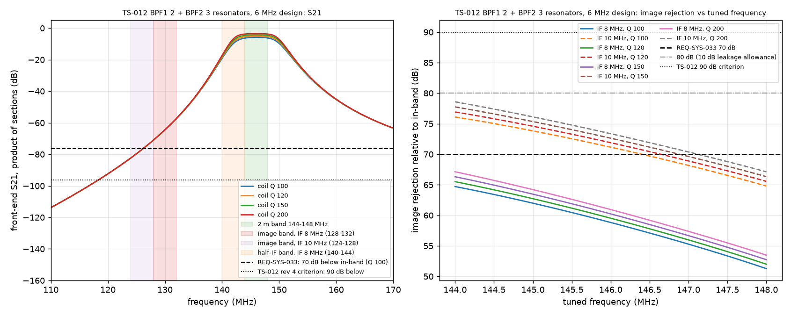

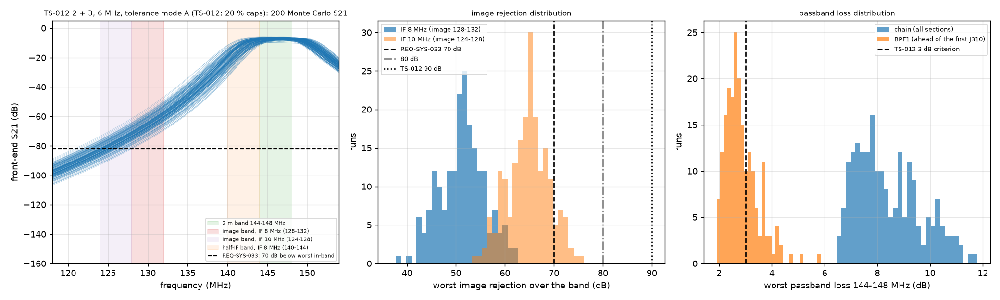

Findings:

- The adversarial claim is confirmed and is stronger than stated. With five resonators split 2 + 3, the image rejection is about 51 to 61 dB even with ideal tolerances, 10 to 20 dB short of the 70 dB requirement itself, never mind 90 dB. TS-012's "five resonators give well over 90 dB ideal" was wrong for two reasons:
  - A split filter's attenuation is the sum of two short filters. A Chebyshev response grows exponentially with the order inside one filter, so 2 + 3 gives far less than one 5-pole section. The Chebyshev formula (lossless, 5 MHz design) gives about 62 dB for 2 + 3 at 132 MHz against about 85 dB for a single 5-pole section.
  - The worst image, 132 MHz for a 148 MHz tuning, is only 12 MHz below the band edge, 2.6 design bandwidths away.
- Raising coil Q does not help. Q changes the loss, not the skirt, so Q 200 buys 2 dB of rejection.
- **The "3 dB passband loss" half of the criterion cannot hold together with high rejection.** The dissipation loss of an n-resonator filter is about 4.343 (f0 / BW) sum(g) / Qu dB. For a 4 MHz band at 146 MHz with Q 100 to 200, every resonator costs about 0.6 to 1.3 dB. Rejection comes only with more resonators, so the loss grows with it.

### 4.2 A third section: nominal, Monte Carlo and worst-case corner (revised for finding 1)

BPF3 is a third section between the second J310 and the ring. Revision 1 proposed BPF3 as a copy of BPF2 (2 + 3 + 3). Revision 2 adds a four-resonator BPF3 (2 + 3 + 4) as a margin lever. Runs `2026-09-28-r02-bpf-three-section` (nominal Q sweep), `r03` (200-run Monte Carlo, kept as a sample) and `r08` (20,000-run Monte Carlo and worst-case corners). All are at 50 ohm ports and without leakage; sections 4.3 and 4.4 add those.

Nominal (r02, LTspice):

| Design | Coil Q | Worst in-band loss per section (dB) | Image rejection IF 8 MHz (dB) | Image rejection IF 10 MHz (dB) |
|---|---|---|---|---|
| 2+3+3, 6 MHz | 100 | 1.96, 4.35, 4.35 | 86.0 | 107.6 |
| 2+3+3, 6 MHz | 120 | 1.70, 3.76, 3.76 | 87.3 | 108.9 |
| 2+3+3, 6 MHz | 200 | 1.17, 2.58, 2.58 | 89.8 | 111.6 |
| 2+3+2, 6 MHz | 100 | 1.96, 4.35, 1.96 | 67.8 (FAIL) | 86.7 |

Worst image rejection at the worst tuned frequency (148.0 MHz in every case), r08. Each corner value is the LTspice re-simulation. It agrees with the numpy search to better than 0.01 dB in all 20 LTspice cases (four configurations, nominal and four corners each).

| Configuration | Nominal Q 100 (dB) | Case | Worst-case corner (dB) | Monte Carlo 20,000: min / 0.1 % / 1 % / median (dB) | Runs below 70 dB (95 % interval) | Verdict at the corner |
|---|---|---|---|---|---|---|
| 2 + 3, IF 8 (TS-012) | 51.3 | mode B, aligned | 45.0 | 46.8 / 47.7 / 48.3 / 51.1 | all | **FAIL** |
| **2 + 3 + 3, IF 8** | 86.0 | mode A, no re-alignment (revision 1 model) | **49.1** | 63.6 / 68.1 / 72.1 / 84.9 | **65 of 20,000 = 0.32 % (0.25 to 0.41 %)** | **FAIL** |
| | | mode B, no re-alignment | 67.2 | 74.9 / 77.3 / 79.2 / 85.9 | 0 (below 0.015 %) | **FAIL** |
| | | mode A, aligned at 50 ohm | 70.1 | 76.9 / 78.3 / 80.1 / 85.8 | 0 | PASS (0.1 dB) |
| | | **mode B, aligned at 50 ohm** | **75.6** | 79.5 / 80.9 / 82.0 / 85.8 | 0 | **PASS (5.6 dB)** |
| 2 + 3 + 4, IF 8 | 103.9 | mode A / B, no re-alignment | 64.7 / 81.8 | 82.6 / 91.8 (min) | 0 | FAIL / PASS |
| | | mode A / B, aligned | 86.4 / **91.4** | 94.2 / 96.9 (min) | 0 | PASS |
| 2 + 3 + 2, IF 10 | 86.8 | mode A, no re-alignment | 54.8 | 68.1 / 70.4 / 74.2 / 85.7 | 13 of 20,000 = 0.065 % (0.035 to 0.11 %) | **FAIL** |
| | | mode B, no re-alignment | 72.8 | 77.9 (min) | 0 | PASS |
| | | mode A / B, aligned | 72.5 / **78.9** | 77.8 / 81.6 (min) | 0 | PASS |

LTspice Monte Carlo, 2 + 3 + 3 at IF 8 MHz, 1,000 runs (r08). The numpy solver reproduces the same draws to 4.6e-4 dB:

| Case | LTspice min / 1 % / median (dB) | Runs below 70 dB | Failing fraction, 95 % |
|---|---|---|---|
| mode A, no re-alignment | 67.6 / 71.5 / 85.1 | 4 | 0.11 to 1.0 % |
| mode A, aligned at 50 ohm | 78.2 / 79.9 / 85.9 | 0 | below 0.3 % |
| mode B, aligned at 50 ohm | 80.6 / 81.9 / 85.9 | 0 | below 0.3 % |

Worst-case corner against the alignment residual (mode B, aligned at 50 ohm, r08):

| Configuration | +/-0.1 % | +/-0.2 % | +/-0.3 % | +/-0.5 % | +/-0.75 % | +/-1 % | +/-1.5 % |
|---|---|---|---|---|---|---|---|
| 2 + 3 + 3, IF 8 | 77.4 | 76.5 | 75.6 | 73.8 | 71.3 | 68.7 | 62.3 |
| 2 + 3 + 4, IF 8 | 93.4 | 92.4 | 91.4 | 89.3 | 86.4 | 83.2 | 75.1 |
| 2 + 3 + 2, IF 10 | 80.1 | 79.5 | 78.9 | 77.6 | 75.8 | 74.0 | 69.6 |

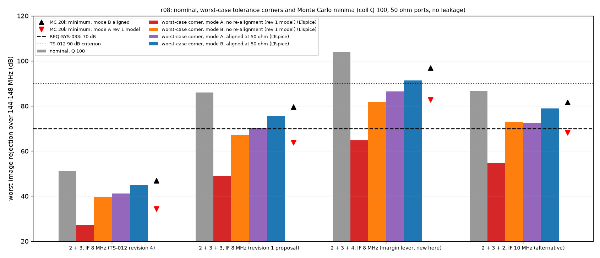

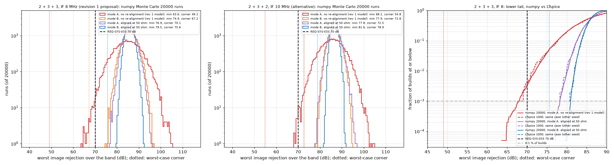

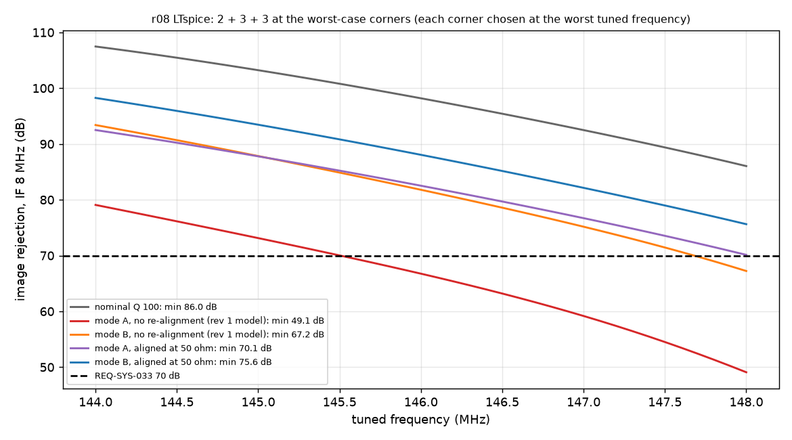

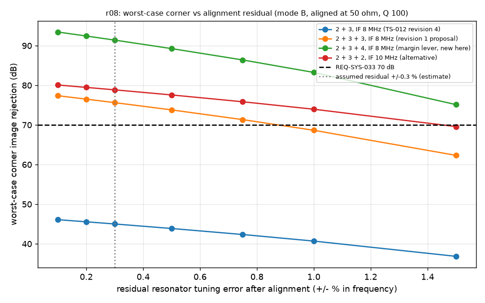

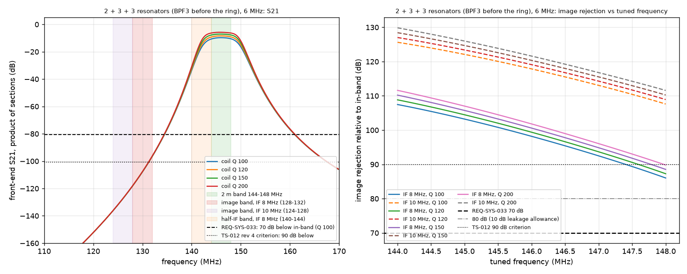

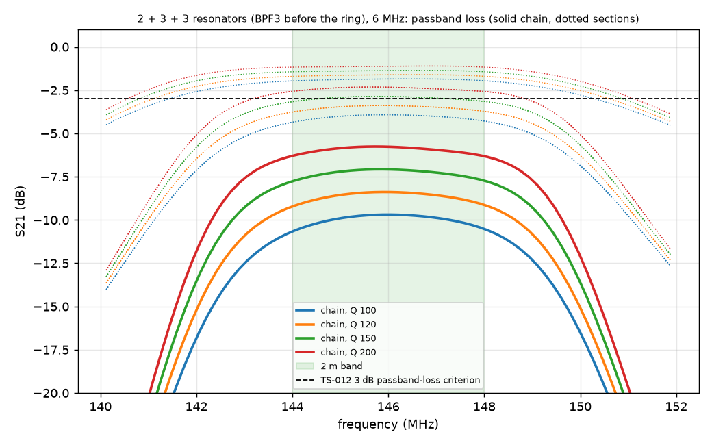

Element values of the sections (56 nH resonators). The shunt values absorb the tuning, which is done by squeezing the coil turns on the NanoVNA:

| Section | End series C | Shunt C | Coupling C |
|---|---|---|---|
| BPF1 (2 resonators) | 4.87 pF (4.7 pF, C tolerance) | 15.4, 15.4 pF | 1.20 pF (B tolerance) |
| BPF2 and BPF3 (3 resonators each) | 4.38 pF (4.3 pF, C tolerance) | 16.2, 19.6, 16.2 pF | 0.80, 0.80 pF (B tolerance) |

Findings:

1. **Revision 1's mode A "PASS" (70.6 dB) was a 200-run sample minimum, and it is withdrawn.** Over 20,000 runs of the same distributions, 0.32 % of builds fall below 70 dB (the review found 0.32 % and 65.6 dB with another seed), and the worst-case corner is 49.1 dB. **Mode A fails REQ-SYS-033 for some builds.** The IF 10 MHz 2 + 3 + 2 option also fails in mode A (0.065 %, corner 54.8 dB).
2. **The worst corner is systematic, not random.** Every coupling and end capacitor sits at its high limit and every coil at +0.3 %. This moves the whole passband down toward the image and widens the coupling. The revision 1 model left this detuning in place.
3. **Mode B tolerances are a condition of BPF3 (and of BPF1 and BPF2).** Mode B also needs re-alignment after assembly. Without it, the mode B corner is 67.2 dB (FAIL). With re-alignment to +/-0.3 %, it is 75.6 dB. Re-alignment is always done, because hand-wound coils need it, but it must be written into the build procedure as a condition of this result, and its residual must be at most +/-0.75 % (71.3 dB).
4. The residual assumption is not the driver: +/-0.1 % to +/-0.5 % moves the 2 + 3 + 3 corner by only 3.6 dB.
5. The 200-run samples of revision 1 (r01, r03) stay as recorded. Their verdict line now reads as a sample statement with its binomial bound (`check_bpf.py` revision 2).

### 4.3 Port impedances of the J310 stages (new, finding 2)

Run `2026-09-28-r09-bpf-port-impedance`: 2 + 3 + 3 at IF 8 MHz. Worst image rejection over the band (dB). "Load" is the J310 input that loads BPF1 and BPF2. "Source" is the J310 drain port that drives BPF2 and BPF3. The ring port stays at 50 ohm. LTspice re-simulates 14 named cases per configuration, all within 0.01 dB of numpy.

| Load (J310 input) | Source (J310 drain) | Nominal, aligned at 50 | Mode B corner, aligned at 50 | Mode B corner, aligned in circuit |
|---|---|---|---|---|
| 50 ohm (design input) | 50 ohm | 86.0 | 75.6 | 75.6 |
| 50 ohm | 200 ohm | 80.9 | 72.0 | 67.6 |
| 83 ohm (Re yig typ) | 50 ohm | 83.7 | 73.7 | 72.2 |
| 83 ohm | 200 ohm | 78.0 | 69.4 | 64.0 |
| 125 ohm (gfs min) | 50 ohm | 82.3 | 72.7 | 69.7 |
| 125 ohm | 200 ohm | **76.2** | **68.0** | **61.3** |
| 56 ohm and 5 pF (Csg max) | 50 ohm | 87.2 | 76.9 | 75.6 |
| 125 ohm and 5 pF | 200 ohm and 2.5 pF | 83.7 | 75.1 | 68.3 |

Every internal port anywhere on a VSWR circle around 50 ohm, worst phase (worst-case corner, dB):

| VSWR | 1.0 | 1.1 | 1.2 | 1.35 | 1.5 | 2.0 |
|---|---|---|---|---|---|---|
| 2 + 3 + 3, IF 8, mode B aligned at 50 | 75.6 | 73.8 | **72.1** | 69.6 | 67.2 | 60.3 |
| 2 + 3 + 3, IF 8, nominal | 86.0 | 84.2 | 82.3 | 79.7 | 77.3 | 70.1 |
| 2 + 3 + 4, IF 8, mode B aligned at 50 | 91.4 | 89.5 | 87.8 | 85.2 | 82.9 | 75.9 |
| 2 + 3 + 2, IF 10, mode B aligned at 50 | 78.9 | 77.0 | 75.1 | 72.4 | 69.9 | 62.2 |

BPF1 worst in-band transducer loss with the first J310 input as its load (Q 120 / Q 100, dB):

| 50 ohm | 56 ohm | 83 ohm | 125 ohm | 56 ohm and 5 pF | 125 ohm and 5 pF |
|---|---|---|---|---|---|
| 1.70 / 1.96 | 1.68 / 1.93 | 1.83 / 2.06 | 2.33 / 2.54 | 1.81 / 2.09 | 2.53 / 2.80 |

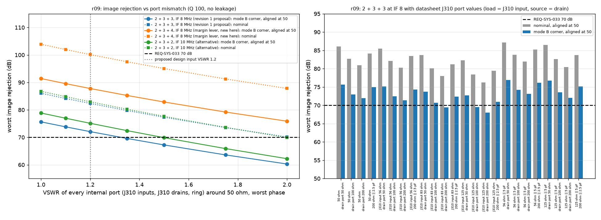

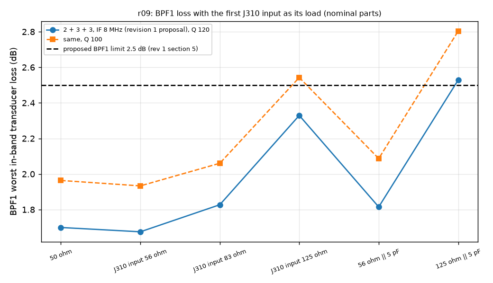

Findings:

1. The review's figures are confirmed:
   - BPF1 into 125 ohm costs +0.58 dB at Q 100, the review's figure, and +0.63 dB at Q 120.
   - BPF2 and BPF3 driven from 200 ohm give 78.0 to 80.9 dB nominal instead of 86.0 dB.
2. With bare J310 ports, the mode B corner fails: 68.0 dB when aligned at 50 ohm and 61.3 dB when aligned in circuit. In-circuit alignment is worse because it removes a detuning that happens to help at the image. The 83 ohm typical input alone is a VSWR of 1.66, and 125 ohm is 2.5.
3. **Design input for the J310 stages (proposed):** every port a band-pass section sees (both J310 inputs, both J310 drain outputs, and the ring RF port) presents 50 ohm within VSWR 1.2 over 144 to 148 MHz. A bare MMBFJ310 does not do this. The stage design (WP-PDR-19) needs matching networks, for example:
   - an L-network or re-synthesized end coupling at each J310 source, which absorbs Csg;
   - a tapped tank or a transformer at each drain.

   With that input, the 2 + 3 + 3 mode B corner is 72.1 dB before leakage.
4. BPF1's loss rises with the J310 input resistance. The cascade carries this as the J310 port case (section 4.6).

### 4.4 Leakage (revised for finding 5)

Run `2026-09-28-r10-bpf-leakage-corner`. The table gives the worst image rejection with a stray capacitance across every section, worst-phase bound (dB). The design-input corner is mode B, aligned at 50 ohm, residual +/-0.3 %, every internal port within VSWR 1.2, coil Q 100.

| Stray per section | 0 | 0.003 pF | 0.01 pF | 0.02 pF | 0.03 pF | 0.05 pF | 0.1 pF |
|---|---|---|---|---|---|---|---|
| 2 + 3 + 3, nominal, 50 ohm | 86.0 | 85.7 | 84.9 | 83.9 | 82.9 | 81.0 | 77.0 |
| 2 + 3 + 3, mode B corner, 50 ohm ports | 75.6 | 75.4 | 75.0 | 74.4 | 73.7 | 72.6 | **69.9** |
| **2 + 3 + 3, design-input corner** | 72.1 | 71.9 | 71.4 | 70.8 | **70.2** | 69.0 | 66.4 |
| 2 + 3 + 4, design-input corner | 87.8 | 86.9 | 85.2 | 83.0 | **80.1** | 75.8 | 69.0 |
| 2 + 3 + 2, IF 10, design-input corner | 75.1 | 74.8 | 74.2 | 73.3 | **72.5** | 71.0 | 67.6 |

LTspice re-simulates the design-input corners at 0, 0.03 and 0.1 pF with the SGN nearest to the worst phase at the tuned and at the image frequency. All agree with numpy to 0.01 dB. For example, 2 + 3 + 3 at 0.03 pF with the image-frequency SGN gives 70.28 dB, just above the 70.2 dB bound.

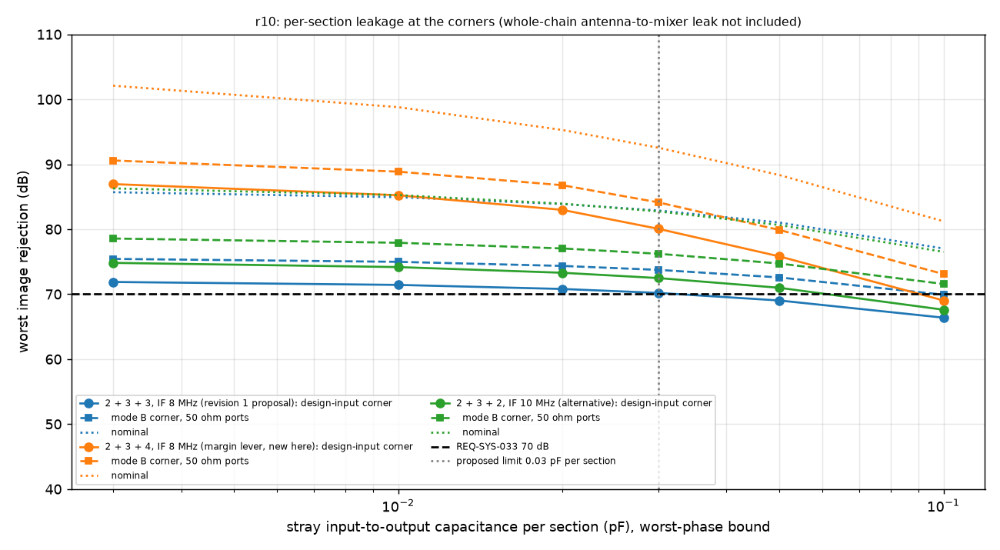

Findings:

1. The review is confirmed: with mode B tolerances and a worst-phase bound, 0.1 pF per section gives 69.9 dB (FAIL). Revision 1's statement that "three sections tolerate per-section strays up to 0.1 pF" held only at nominal values, and it is withdrawn.
2. **Proposed layout design input: at most 0.03 pF of input-to-output stray capacitance per section.** This supports the fenced, in-line cells of revision 1. What layout achieves 0.03 pF is a layout item and is not estimated here. At that limit, 2 + 3 + 3 holds 70.2 dB, a margin of 0.2 dB.
3. The dangerous path is still outside this model: coupling from the antenna side to the mixer side that bypasses the filters and both J310 gains.
   - Revision 1 sized it with the leak alone at the limit: isolation from the antenna port to the mixer RF port at 124 to 132 MHz of 70 dB plus the front-end gain. From r11 that is 84 dB for 2 + 3 + 3, 82 dB for 2 + 3 + 4, 87 dB for 2 + 3 + 2 at IF 10 and 88 dB for 2 + 3.
   - At the corner, the leak adds to the filtered image path in the worst phase. It may then take only what is left of the margin. To keep 70 dB, the leak must be below the filtered image response by 32.7 dB for 2 + 3 + 3 (0.2 dB margin) and by 9.5 dB for 2 + 3 + 2 at IF 10 (2.5 dB margin). For 2 + 3 + 4 (10.1 dB margin) it may be up to 6.8 dB above that response.
   - **Isolation needed at the design-input corner (derived; the front-end gains are estimates): about 117 dB for 2 + 3 + 3, 98 dB for 2 + 3 + 2 at IF 10 and 85 dB for 2 + 3 + 4.** 117 dB is not a credible target for a hand-built single board (engineering judgement), so 2 + 3 + 3 has no allowance left for the whole-chain leak.
   - Layout requirement, as in revision 1: BPF1, BPF2 and BPF3 sit in a line, each in its own fenced cell, and the antenna, relay and BPF1 zone is kept away from the ring and LO zone.
   - This path cannot be simulated here, and the NanoVNA cannot verify it at the chain level.

### 4.5 Half-IF response

The filters give almost no half-IF rejection. For a 148 MHz tuning the half-IF (144 MHz) is in the passband, so the minimum filter attenuation is 0.0 to 0.1 dB in every design, and at best 13 to 23 dB for a 144 MHz tuning. The half-IF response therefore rests on the mixer.

Run `2026-09-28-r05-halfif-mixers`:

| Mixer | Conversion gain | Half-IF response at the mixer input | IIP2, half-IF (dBm, worst valid) |
|---|---|---|---|
| A5 diode ring, matched, 50 % duty | -5.14 dB | at the time-step floor (-77.8 dBc, slope 1, not physical) at every level to 0 dBm | 67.8 or more (bound) |
| A5 ring, 4 mismatched sets, duty 45 / 55 % | -5.15 to -5.24 dB | -57 to -64 dBc at 0 dBm | 51.8 to 63.6 |
| A4 single J310 mixer (representative), 50 % and 45 % duty | -12.2 dB (into the 330 ohm tank; relative use only) | -50 dBc at -20 dBm, -38.5 dBc at -5 dBm, slope 1.8 to 2.0 | 30.1 to 30.4 |

Some JFET cases did not converge in LTspice (iteration limit or time step too small, with the trapezoidal and Gear methods, reltol 1e-6 and 1e-5, square and sine LO): the -150, -120 and -100 dBm floor cases, and the -10 and 0 dBm drive cases. Their logs are kept gzip-compressed. The -20, -15, -8 and -5 dBm cases ran, so the JFET absolute floor is not measured, and the -20 dBm points may sit near it. That makes the JFET intercept conservative (lower).

Referral to the antenna (r06; the r11 cascade gives the same values), for a -70 dBm tone at f - 4 MHz, worst tuning (0 dB filter attenuation) and nominal gains (the worst case, since a higher front-end gain raises the product):

| Configuration | Mixer input | Equivalent antenna level | vs -140 dBm |
|---|---|---|---|
| A5 2+3+3 | -55.5 dBm | -177 dBm | PASS, 37 dB margin |
| A5 2+3 | -51.8 dBm | -174 dBm | PASS, 34 dB margin |
| A4 2+3+3 | -55.5 dBm | -156 dBm | PASS, 16 dB margin |
| A4 2+3 | -51.8 dBm | -152 dBm | PASS, 12 dB margin |

Even the ring's numerical floor, referred the same way, sits at -148 dBm, below the limit.

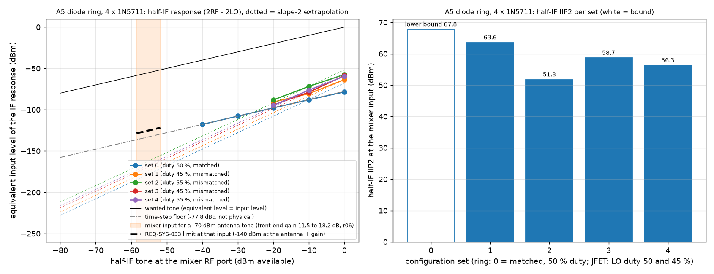

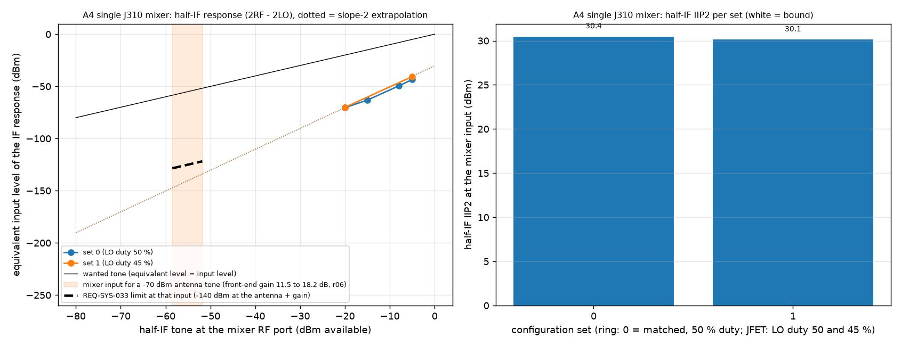

The IF-frequency response (a signal at 8 MHz entering the antenna) is rejected by more than 150 dB in the ideal filter model; its physical limit is leakage, the same isolation as in section 4.4.

### 4.6 Receiver cascade against REQ-SYS-022 and TPM-005 (revised for findings 2 and 3)

Run `2026-09-28-r11-cascade-tpm005`, which supersedes r06. Stage values and their basis are in `result.md`; every device value is an estimate. The filter losses come from the numpy solver, which is validated in r07.

| Configuration | MDS nominal / J310 port / TC-SYS-017 corner / stack (dBm) | REQ-SYS-022 | TPM-005 (Green at -142 or better, Red worse than -137) |
|---|---|---|---|
| A5 as TS-012 (2+3, IF 8) | -141.2 / -140.5 / -139.0 / -136.5 | PASS / PASS / **FAIL** / FAIL | Yellow / Yellow / Yellow / **Red** |
| **A5 + BPF3 (2+3+3, IF 8)** | **-141.2 / -140.6 / -138.0 / -133.7** | PASS / PASS / **FAIL** / FAIL | **Yellow / Yellow / Yellow / Red** |
| A5 + BPF3 of 4 (2+3+4, IF 8) | -140.7 / -140.0 / -134.9 / -129.4 | PASS / PASS / **FAIL** / FAIL | Yellow / Yellow / **Red** / Red |
| A5, IF 10 MHz, 2+3+2 | -141.5 / -140.8 / -139.1 / -135.8 | PASS / PASS / **FAIL** / FAIL | Yellow / Yellow / Yellow / Red |
| A4 as TS-012 (2+3, JFET mixer) | -141.3 / -140.7 / -139.2 / -136.9 | PASS / PASS / **FAIL** / FAIL | Yellow / Yellow / Yellow / Red |
| A4 + BPF3 (2+3+3, JFET mixer) | -141.5 / -140.9 / -138.7 / -135.0 | PASS / PASS / **FAIL** / FAIL | Yellow / Yellow / Yellow / Red |
| A4 + BPF3 of 4 (2+3+4, JFET mixer) | -141.1 / -140.5 / -136.3 / -131.1 | PASS / PASS / **FAIL** / FAIL | Yellow / Yellow / Red / Red |

Section losses used. Nominal, Q 120: 1.70, 3.76, 3.76 dB (four-resonator BPF3: 6.19 dB). J310 port case: BPF1 2.33 dB. TC-SYS-017 corner: 2.83, 6.72, 6.72 dB (four-resonator BPF3: 11.95 dB; two-resonator BPF3: 3.11 dB).

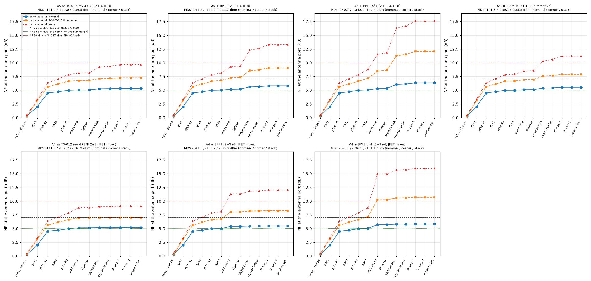

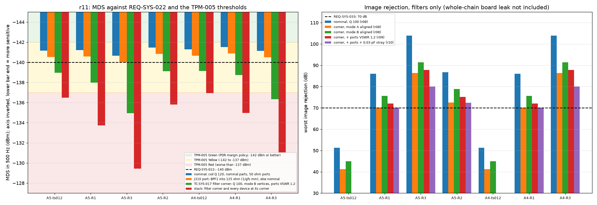

Findings:

1. **REQ-SYS-022 is not shown with margin; the revision 1 "nominal PASS" is withdrawn as a verdict.** The nominal -141.2 dBm passes by 1.2 dB. But TC-SYS-017 accepts only at the worst-case corner, and there every configuration fails:
   - 2 + 3 + 3 with the ring: -138.0 dBm, 2.0 dB short;
   - best case, IF 10 MHz 2 + 3 + 2: -139.1 dBm.

   Revision 1's own spread (filter case -139.1 dBm, stack -135.3 dBm) already exceeded its 1.2 dB margin. Revision 2's corner is worse, because it uses the loss corner of the tolerance box with VSWR 1.2 ports rather than a Monte Carlo 95th percentile.
2. **TPM-005 is Yellow and moves toward Red.** The CBE is the nominal cascade, -141.2 dBm, which misses the PDR margin policy of -142 dBm (Yellow). The TC-SYS-017 corner is also Yellow. The stacked corner (-133.7 dBm) is more than 3 dB worse than -140 dBm (Red). Section 8 gives the status report.
3. The J310 input impedance alone (finding 2) costs 0.6 dB nominally: -141.2 becomes -140.6 dBm with BPF1 into 125 ohm. The VSWR 1.2 design input bounds this cost at the corner.
4. BPF3 still costs no noise figure nominally (5.84 to 5.81 dB for A5). At the corner it costs 1.0 dB (-139.0 to -138.0 dBm), because its 6.7 dB corner loss sits ahead of the lossy ring.
5. **The four-resonator BPF3 buys image margin with MDS.** As synthesized here (6 MHz ripple bandwidth, coil Q 100), its corner loss is 11.95 dB, which puts the corner MDS at -134.9 dBm (Red). A wider four-resonator BPF3 would lose less and reject less. It is not synthesized or simulated here.
6. Levers for the MDS, none costed or simulated here:
   - a first stage with more gain and lower NF than a grounded-gate J310 (the Anglian design uses a MMIC LNA of about 22 dB gain and 0.8 dB NF behind its noise-matching filter; `docs/research/2m-cw-transceiver-reference-designs.md` F6; price not read);
   - BPF1 designed wider (8 MHz: about 1.5 dB loss, pre-check), with the image margin moved to the later sections;
   - higher coil Q (the corner uses the catalog minimum, 100);
   - tighter alignment.

## 5. Verdicts per finalist

The front-end filters, and so the image result, are the same for A4 and A5. **This analysis does not discriminate between A4 and A5 on the image or on the MDS.** On the MDS the difference is within the estimate spread. It discriminates weakly on the half-IF, in A5's favour.

| Item | A4 (J310 mixer) | A5 (diode ring) |
|---|---|---|
| Image, filters as in TS-012 rev 4 (2 + 3) | **FAIL**: 51 dB nominal (Q 100), 45 dB at the best corner | **FAIL**: same |
| Image, 2 + 3 + 3 at IF 8 MHz, TS-012 20 % capacitors (mode A) | **FAIL for some builds**: 0.32 % of builds below 70 dB, corner 49.1 dB without re-alignment | same |
| Image, 2 + 3 + 3 at IF 8 MHz, under the five conditions below | **PASS by 0.2 dB** at the design-input corner (70.2 dB), with no allowance left for the whole-chain leak (section 4.4) | same |
| Image, 2 + 3 + 3 with bare J310 ports | **FAIL**: 68.0 dB mode B corner (61.3 dB aligned in circuit) | same |
| Image, 2 + 3 + 4 at IF 8 MHz, same conditions | PASS, 80.1 dB (10.1 dB margin; whole-chain isolation needed about 85 dB) | same |
| Image, 2 + 3 + 2 at IF 10 MHz, same conditions | PASS, 72.5 dB (2.5 dB margin; isolation needed about 98 dB) | same |
| TS-012 criterion (90 dB with 3 dB or less passband loss) | unattainable (section 4.1) | same |
| Half-IF at -70 dBm (TS-012 criterion) | **PASS** with 12 to 16 dB margin; representative circuit, partial convergence, Low confidence | **PASS** with 34 to 37 dB margin; Medium confidence (model balance and floor limits) |
| REQ-SYS-022 MDS (TC-SYS-017 corner) | **not shown**: nominal -141.5 dBm, corner -138.7 dBm (2 + 3 + 3) | **not shown**: nominal -141.2 dBm, corner -138.0 dBm (2 + 3 + 3) |
| TPM-005 | Yellow (CBE -141.5 dBm), Red at the stack | Yellow (CBE -141.2 dBm), Red at the stack |

**Conditions for the image result of 2 + 3 + 3 (and of the alternatives).** These are proposed design inputs; each is a condition of the verdict above.

1. Mode B capacitor tolerances in every section: coupling capacitors C0G, B tolerance (+/-0.1 pF), with at most +/-0.05 pF of board stray; end capacitors C0G, C tolerance (+/-0.25 pF). **This is a condition of BPF3**, and equally of BPF1 and BPF2. The TS-012 20 % condition fails.
2. Every resonator re-aligned after the capacitors are fitted, section by section between 50 ohm ports on the NanoVNA, to a residual of +/-0.3 % (estimate). At +/-0.75 % the corner drops to 71.3 dB before ports and leakage.
3. Every internal port within VSWR 1.2 of 50 ohm over 144 to 148 MHz: both J310 source inputs, both J310 drain outputs and the ring RF port. This is a design input to the J310 stages, which need matching networks (section 4.3).
4. At most 0.03 pF of input-to-output stray capacitance per section (layout).
5. Whole-chain antenna-to-mixer isolation at 124 to 132 MHz as section 4.4 derives. For 2 + 3 + 3 this is about 117 dB, which is not credible (engineering judgement). For 2 + 3 + 4 it is about 85 dB.

**Recommendation (revised).**

- **Image.** 2 + 3 + 3 at IF 8 MHz is not a robust basis for REQ-SYS-033: 0.2 dB at the corner, and no room for the board leak. The configurations with a margin are:
  - a four-resonator BPF3 (10 dB at the corner, but a corner MDS penalty as synthesized);
  - IF 10 MHz with 2 + 3 + 2 (2.5 dB, which re-opens the IF and ladder design).

  The choice belongs with the receiver front-end redesign that the MDS needs anyway (next item). The author proposes to carry it into WP-PDR-19 rather than fix it in TS-012 revision 5. Cost of any of these filter changes is about USD 1 before contingency (three or four coils from the owned wire and seven to nine 0805 C0G parts), inside the TS-012 E2 allowance. B-tolerance pricing was not read.
- **MDS.** No configuration shows REQ-SYS-022 at the TC-SYS-017 corner, and none meets the TPM-005 PDR margin policy. The front end needs a change before PDR: a lower-NF, higher-gain first stage, a lower-loss BPF1, or higher coil Q (section 4.6 finding 6). This is a receiver-design item of WP-PDR-19. It does not separate A4 from A5.
- **TS-012 section 7.3 criterion**, proposed replacement:
  - image rejection at least 70 dB at the worst-case corner of the stated tolerance box, at every tuned frequency (100 kHz spacing), with the ports and stray limits stated;
  - a Monte Carlo reported only as a yield (N and a 95 % bound);
  - BPF1 worst in-band loss judged in the REQ-SYS-022 cascade at the TC-SYS-017 corner, not by a fixed 3 dB figure.
- If the owner declines every filter change and keeps 2 + 3 at IF 8 MHz, REQ-SYS-033 would need a relaxation to about 45 dB (TBR). The author does not recommend it: the image band is the aeronautical AM band.

## 6. Limitations

- The sections are assumed isolated by the J310 stages (reverse isolation complete). No J310 amplifier was simulated: its gain and NF are estimates from the datasheet at other conditions. Its port impedances are modelled as a shunt R and C from datasheet values (section 4.3). Its tuned-drain selectivity, which would add image rejection, is not credited.
- The alignment model (section 3 item 5) assumes a Dishal-type node alignment at 50 ohm with a +/-0.3 % residual. The owner's actual NanoVNA procedure is not yet written; section 7 item 3 asks for it.
- The worst-case corner assumes independent tolerances with every vertex reachable, which includes all coils detuned the same way. A procedure that measures the passband centre would bound that case. It is kept as the corner because TC-SYS-021 asks for it.
- No PCB layout, radiation or ground-return model, beyond 5 nH per resonator and the per-section stray capacitance. The whole-chain leak (section 4.4) is a stated requirement, not an analysis.
- Coil Q is modelled as a series resistance fixed at its 146 MHz value. Hand-wound coil Q is an estimate (swept 100 to 200); the catalog 1812SMS minimum is 100. The residual tuning error is an estimate.
- The numpy nodal solver agrees with LTspice to 2.5e-3 dB on every r01 to r04 step (r07). Every value a verdict rests on is re-simulated in LTspice. The loss corners of the cascade are numpy values, re-simulated in LTspice only through the r08 corner decks (rejection corners), not as loss corners.
- Half-IF:
  - The mixer is simulated without the front end, so the J310 second harmonic mixing with the LO second harmonic is not included (an estimate puts it far below the ring's own product).
  - The diplexer is ideal (50 ohm).
  - The BN-43-202 transformers are coupled inductors (4 uH, k 0.99, estimate) with no core loss.
  - The 1N5711 model is a community model 0.02 V above the MACOM VF maximum.
  - The time-step floor (-77.8 dBc) limits what the matched ring shows.
  - The JFET circuit is representative only, and 8 of its 16 cases did not converge.
- The cascade uses estimates for every active stage and for the crystal ladder. The "stack" case adds every corner at once.
- The analysis covers the image, half-IF and IF responses of REQ-SYS-033. Other spurious responses (LO harmonics, 3 x LO products, Pico 2 and Si5351 birdies) are in the WP-PDR-20 clock plan and TC-SYS-022, not here.

## 7. What closes before the order

1. Owner decision on the front-end filter set: 2 + 3 + 3 with its five conditions, 2 + 3 + 4, or IF 10 MHz 2 + 3 + 2. The author proposes to decide it together with the MDS redesign in WP-PDR-19 (item 5). The decision is entered in TS-012 revision 5 with the replacement criterion of section 5.
2. At the ordering gate: price and stock of 0.8 pF and 1.2 pF C0G 0805 parts in B tolerance (+/-0.1 pF), and of 4.3 and 4.7 pF parts in C tolerance. If B tolerance is not stocked at a listed price, re-run `worst_case.py` r08 to r10 with C tolerance on the coupling capacitors.
3. A written alignment procedure in the build notes: each section between 50 ohm on the NanoVNA after its capacitors are fitted, every resonator tuned, and the per-section S21 at 130 MHz and the passband centre recorded. This is the condition behind the aligned model.
4. Design inputs to the J310 stages and the layout (WP-PDR-19 and the layout work package):
   - every internal port within VSWR 1.2 of 50 ohm;
   - at most 0.03 pF of stray per section;
   - the fenced BPF cells in line;
   - the whole-chain isolation of section 4.4.
5. A front-end redesign for REQ-SYS-022 at the TC-SYS-017 corner (section 4.6 finding 6), analysed with this block's cascade before PDR. The TPM-005 status and the proposed risk are in section 8.
6. Coil winding data for 56 nH from 24 AWG (about 3 turns, 5.5 mm mean diameter, spread to tune; Wheeler estimate), in the build notes. Alternative: Coilcraft 1812SMS-56N, which is not tunable, so it needs trimmer capacitors to meet condition 2.
7. If A4 is chosen: a real A4 mixer schematic and a converging half-IF run. The present JFET result is representative and conservative.
8. Independent review of revision 2 of this record and of `hardware/sim/rx-frontend/` (plan rule C10).

After assembly (supporting, not closing):

- NanoVNA S21 of each section at 130 MHz: expected at least 19.5, 39.4 and 39.4 dB below 146 MHz at coil Q 100 (nominal).
- A relative image check with the tinySA generator when the owner buys it (status note 2026-09-28: bought later).

## 8. Status for the TPM-005 owner and the risk writer (finding 3)

This section is the analysis author's report. The author does not edit `docs/plan/tpm.json` or the risk register. The lead SE owns TPM-005 (`conventions.owner_of_all_measures`) and the risk writer owns the register.

| Field | Value |
|---|---|
| TPM | TPM-005 `rx-mds` (MOP-006; REQ-SYS-022, REQ-SYS-023) |
| Phase policy | PDR: cascade gives -142 dBm or better |
| Previous status | No history entry (`history: []`); revision 1 of this note reported REQ-SYS-022 as a nominal PASS without naming TPM-005 |
| New status | **Yellow** on the CBE; **Red** at the stacked corner |
| CBE | -141.2 dBm (A5, 2 + 3 + 3, nominal cascade; A4 -141.5 dBm). TC-SYS-017 corner -138.0 dBm (Yellow). Stacked corner -133.7 dBm (Red). Evidence: `hardware/sim/rx-frontend/results/2026-09-28-r11-cascade-tpm005/` |
| Cause | Three things together: the loss of a hand-built BPF1 ahead of a low-gain grounded-gate J310 (about 12 dB gain, estimate); a lossy passive mixer; and, at the corner, mode B capacitor and VSWR 1.2 port tolerances at coil Q 100 |
| Requirement | REQ-SYS-022 not shown at the TC-SYS-017 corner in any configuration; REQ-SYS-023 (Goal) not met |
| Proposed response | Front-end redesign in WP-PDR-19 (section 4.6 finding 6), re-run of `cascade.py`, and a TPM-005 history entry at the PDR package |
| Risk | By `conventions.reporting_interval`, a Yellow change needs a status note within one working session, and a Red TPM opens a risk. The author proposes a new risk to the risk writer: "Receiver MDS not met at the tolerance corner (REQ-SYS-022, TPM-005)". Likelihood 4 (the analysis fails the corner); consequence performance margin 4 (a KDR not met). Mitigation: the section 4.6 levers. Trigger: the redesigned cascade still worse than -140 dBm at the TC-SYS-017 corner at PDR. The risk writer sets the final scores |

## 9. Revision history and review disposition

| Revision | Date | Change |
|---|---|---|
| 1 | 2026-09-28 | First issue (commit 7200be7), runs r01 to r06 |
| 2 | 2026-09-28 | Fixes the independent review of revision 1, iteration 1, findings 1 to 5 (below); runs r07 to r11; sections 0, 2, 3, 4.2 to 4.6, 5 to 8 revised; section 4.3 new; the half-IF and cascade sections renumbered 4.5 and 4.6 |

| Finding | Class | Disposition |
|---|---|---|
| finding-1 (mode A reported as a pass on a 200-run minimum; no worst-case corner; no Monte Carlo acceptance) | Major | Fixed. Worst-case corners (vertex search, interior check, LTspice re-simulation) and 20,000-run Monte Carlo in r08. Mode A reported as failing for some builds (0.32 %, corner 49.1 dB). Mode B tolerances and re-alignment made conditions of BPF3 (section 5). Monte Carlo acceptance defined with N and a 95 % confidence bound (section 3 item 6); the acceptance is the corner |
| finding-2 (50 ohm ports not stated; J310 port impedances) | Major | Fixed. 50 ohm ports stated as a design input with a VSWR 1.2 tolerance (section 2); J310 admittances from datasheet Rev. 1.5 modelled and reported (r09, section 4.3); BPF1 into 125 ohm carried into the cascade as the J310 port case |
| finding-3 (REQ-SYS-022 nominal PASS; TPM-005 not named) | Major | Fixed. TPM-005 named and compared with its thresholds (r11, section 4.6); REQ-SYS-022 reported as not shown with margin; status report for the TPM owner and the risk writer in section 8 |
| finding-4 (checkers exit 0 on FAIL; REQ constant without id) | Minor | Fixed. `check_bpf.py` exits 1 on any REQ-SYS-033 FAIL; `cascade.py` exits 1 on a REQ-SYS-022 FAIL at the corner; `worst_case.py check` exits 1 when the proposed filter fails; `validate_nodal.py` exits 1 when not accepted. Each constant carries its requirement or TPM id |
| finding-5 (leakage tolerance at nominal only) | Minor | Fixed. Worst-phase bound at the mode B and design-input corners (r10, section 4.4). 0.1 pF per section confirmed failing (69.9 dB). Proposed limit 0.03 pF per section; the whole-chain isolation re-derived at the corner |
