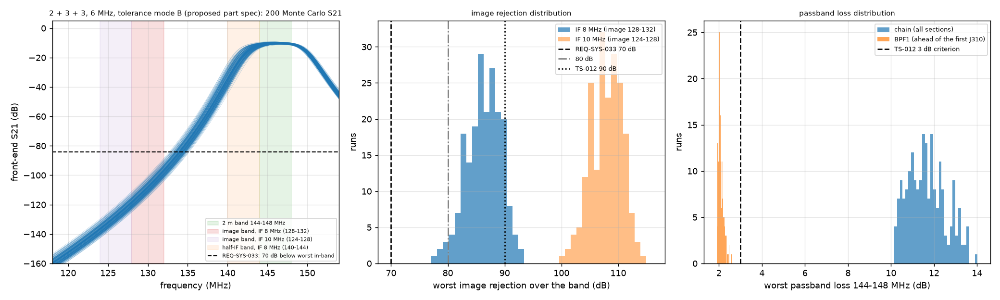
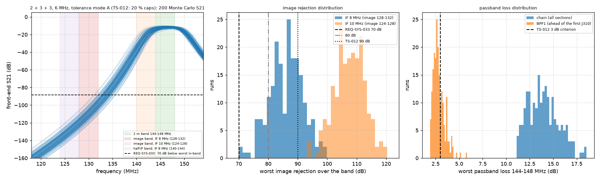
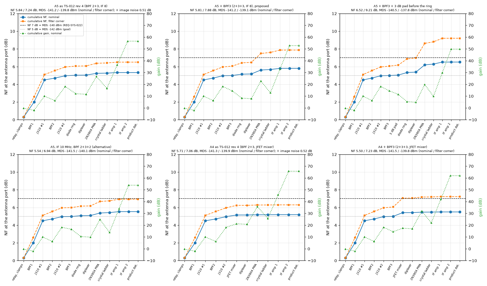
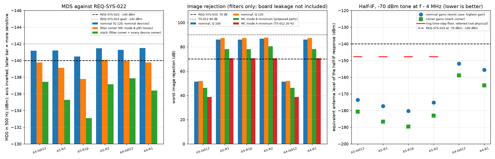

# Receiver front-end band-pass filter, image and half-IF analysis for the TS-012 finalists

| Field | Value |
|---|---|
| Product | Analysis note (08 section 3.4), WP-PDR-19 BPF image and half-IF items of TS-012 revision 4 section 7.3, PDR draft revision 1, 2026-09-28 |
| Author | Claude, analysis author (TS-012 discriminating analyses; owner approval of 2026-09-28: "you should go ahead and run the simulations and analysis", `docs/plan/status/status-2026-09-28.md` section 1) |
| Status | Draft, not reviewed. Every value below is a proposal until an independent review approves this record (plan rule C10) |
| Serves | TS-012 choice between A4 and A5 (section 7.1 receiver risks, section 7.3 receiver checks); REQ-SYS-033 (image and IF rejection, 70 dB TBR) and REQ-SYS-022 (MDS at most -140 dBm TBR) pre-build evidence; TC-SYS-017 and TC-SYS-021 method |
| Model, checkers, plots | `hardware/sim/rx-frontend/` (`bpf_design.py`, `make_decks.py`, `run_sims.py`, `check_bpf.py`, `check_halfif.py`, `cascade.py`, `README.md`); results `hardware/sim/rx-frontend/results/2026-09-28-r01` to `r06` |
| Evidence status | Developer evidence. LTspice 26.0.2 only through `tools/ltspice-batch.sh` blob `88b71475` (ACC-LTSPICE-001; each run's wrapper result line PASS except the JFET cases listed in section 4.4); venv Python 3.13, numpy 2.5.3, scipy 1.18.1, matplotlib 3.11.2, spicelib 1.6.3 (class B entries without a TV record of their own) |

## 1. Purpose

TS-012 revision 4 section 7.3 asks for two LTspice checks before the order (WP-PDR-19):

1. **Image.** BPF1 (2 resonators) plus BPF2 (3 resonators) with coil Q 100, 20 % coupling-capacitor tolerance and 5 nH ground vias; pass: at least 90 dB at 128 to 132 MHz and at most 3 dB passband loss (the 20 dB above REQ-SYS-033's 70 dB being a board-leakage allowance).
2. **Half-IF.** Front end and mixer with a -70 dBm tone at RF - 4 MHz against a -140 dBm wanted tone; pass: the half-IF IF output no higher than the wanted one, with the BPF attenuation at 140 MHz reported.

The adversarial check summarized in the brief found criterion 1 physically unattainable. This note answers:

- Is it? What is the best a hand-built filter of realistic coil Q achieves, and what filter or architecture change meets REQ-SYS-033 as written?
- What is the half-IF response of each finalist's mixer?
- With the filter losses found, does the receiver cascade meet REQ-SYS-022?
- Does any of this discriminate between A4 and A5?

## 2. Inputs

| Input | Value | Source | State |
|---|---|---|---|
| REQ-SYS-033 | "reject image and intermediate-frequency responses by at least 70 dB (TBR) relative to the in-band response" | `docs/requirements/sys/requirements.md` REQ-SYS-033 | TBR, close by PDR |
| REQ-SYS-022 | "minimum discernible signal of at most -140 dBm (TBR) in a 500 Hz bandwidth"; MDS = -147 dBm + NF | same, REQ-SYS-022 and its verification note | TBR, close by PDR |
| REQ-SYS-023 | -142 dBm (Goal) | same | Goal |
| Frequency plan | IF 8.000 MHz, LO 136 to 140 MHz low side (image 128 to 132 MHz, half-IF 140 to 144 MHz) | TS-012 rev 4 section 7.3 | Proposed |
| Receiver chain | G5V-2, 1N5711 clamps, BPF1 (2), MMBFJ310 grounded gate, BPF2 (3), MMBFJ310 grounded gate, mixer (A5 diode ring of four 1N5711W on two BN-43-202 trifilar transformers; A4 J310 mixer), diplexer, 2N3904 post-mixer amplifier, 6-pole 500 Hz ladder at 8 MHz, two 2N3904 IF stages, J310 product detector | TS-012 rev 4 sections 7.3 and 8.1 | Proposed |
| Catalog coil Q | Coilcraft 1812SMS-56N: 56 nH, Q typ 125, min 100 at 150 MHz; -82N: typ 120, min 100 | Coilcraft Document 184-1, revised 12/02/21, `https://www.coilcraft.com/getmedia/c6fe1f83-b176-469d-a071-e2edb068fef2/midi.pdf`, read 2026-09-28 | Datasheet |
| Hand-wound coil Q | 100 to 200 swept; about 3 turns of 24 AWG on a 5.5 mm mean diameter for 56 nH (Wheeler formula, estimate) | estimate | Estimate |
| Capacitor Q | 500 at 146 MHz (small C0G parts) | estimate | Estimate |
| MMBFJ310 | Gpg 16 dB typ at 100 MHz (VDS 10 V, ID 10 mA); NF 3.0 dB typ at 450 MHz; gfs 8 to 18 mS | onsemi MMBFJ310 datasheet, `https://www.onsemi.com/pdf/datasheet/mmbfj310-d.pdf`, read 2026-09-28 | Datasheet |
| J310 SPICE model | Linear Systems model in the LTspice 26.0.2 `standard.jft` | LTspice library | Vendor model |
| 1N5711 | VF 0.41 V max at 1 mA, 1.00 V max at 15 mA; C 2.0 pF max at 0 V | MACOM 1N5711 Rev. V3, `https://cdn.macom.com/datasheets/1N5711.pdf`, read 2026-09-28 | Datasheet |
| 1N5711 SPICE model | IS 19.7 nA, N 1.51, RS 6.27 ohm, CJO 1.8 pF (VF 0.43 V at 1 mA: 0.02 V above the MACOM maximum) | community library model found by web search 2026-09-28 (for example evenator/LTSpice-Libraries `standard.dio`) | Unverified model, used for balance only |
| Si5351 LO | duty 45 to 55 %, rise 1 ns typ, 1.5 ns max (20 to 80 %) | Si5351A/B/C datasheet (Silicon Labs), search summary of `https://cdn-shop.adafruit.com/datasheets/Si5351.pdf`, 2026-09-28 | Datasheet (via summary) |
| Crystal ladder loss | 10.7 dB for 6 poles at 9 MHz, Rs 15 ohm | `docs/research/cw-selectivity-options.md` F7 | Simulation (research) |

## 3. Method

1. **Filter synthesis** (`bpf_design.py`). Shunt parallel-LC resonators, top-capacitor coupling, series-capacitor end coupling to 50 ohm, Chebyshev 0.1 dB prototype, design ripple bandwidth 5 or 6 MHz centred on 145.99 MHz, resonator L 56 nH. Element values follow the coupling-coefficient method (Matthaei, Young and Jones 1964 chapter 8; Hong and Lancaster 2001 eqs. 8.11 to 8.13). A numpy nodal pre-check (`explore.py`) was used only to choose which designs to simulate.
2. **LTspice filter decks** (`make_decks.py`, AC). Each section sits between its own 50 ohm source and load (2 V source, so V(out) = S21). The front-end response is the product of the section S21s: the J310 stages are assumed to isolate the sections, and their tuned-drain selectivity is not credited. Coil loss is a series resistance for the stepped Q at 146 MHz; each capacitor has a Q 500 ESR; each resonator returns to ground through 5 nH.
3. **Image rejection** follows REQ-SYS-033 and TC-SYS-021. For every tuned frequency f from 144.000 to 148.000 MHz in 50 kHz steps it is the response at f relative to the response at f - 2 IF, and the worst value is reported. The worst tuning is always 148.000 MHz, where the image (132 MHz) is closest to the passband. IF 10 MHz is evaluated from the same decks as an architecture option.
4. **Monte Carlo**, 200 runs, fixed seed 20260928 (draws saved as `*_draws.npz`, bound in the deck by `table(run, ...)`), coil Q 100, 5 nH vias, and a residual tuning error after the owner's NanoVNA alignment of +/-0.3 % in frequency per resonator (estimate). Two capacitor-tolerance modes:
   - **Mode A** (TS-012 condition): coupling and end capacitors x U(0.8, 1.2).
   - **Mode B** (part specification proposed here): coupling capacitors +/-0.15 pF absolute (C0G with B tolerance, +/-0.1 pF, plus +/-0.05 pF of board stray); end capacitors +/-0.25 pF (C tolerance).
5. **Leakage sensitivity.** A stray capacitance of 0.003 to 0.1 pF from each section's input to its output, driven with both phases (+1 and -1 copies of the input voltage), so that a leak of unknown phase is covered.
6. **Half-IF** (transient). Mixer only, no front end:
   - Wanted tone 144.000 MHz; half-IF tone 140.000 MHz; LO 136 MHz. Both land on 8.000 MHz, so they run as separate cases.
   - The IF output is taken by a single-bin DFT at 8 MHz over one 250 ns common period, after cubic-spline resampling (`check_halfif.py`).
   - Diode ring: matched, then four mismatched sets (diode IS x U(0.8, 1.2), RS and CJO x U(0.9, 1.1), secondary-half inductance x U(0.98, 1.02)), with LO duty 45 or 55 %.
   - JFET mixer: a representative A4 circuit (no A4 schematic exists).
   - The half-IF intercept IIP2 is referred to the mixer input and extrapolated at slope 2 to the level a -70 dBm antenna tone produces.
7. **Cascade** (`cascade.py`). Friis over the chain, with the worst in-band loss of each section taken from the runs. Three cases:
   - **Nominal:** coil Q 120, device values nominal.
   - **Filter corner:** Monte Carlo mode B 95th-percentile section losses, device values nominal.
   - **Stack:** filter corner with every device value at its corner at once.

   Two-section chains add an image-noise term: the second J310's own noise at the image frequency reaches the mixer unfiltered. MDS = -147.0 dBm + NF.

## 4. Results

### 4.1 The TS-012 filter (2 + 3 resonators) cannot meet REQ-SYS-033 at IF 8 MHz

Run `2026-09-28-r01-bpf-ts012-baseline`:

| Design | Coil Q | Worst in-band loss BPF1, BPF2, chain (dB) | Image rejection, IF 8 MHz (dB) | Image rejection, IF 10 MHz (dB) |
|---|---|---|---|---|
| 5 MHz | 100 | 2.45, 5.45, 7.85 | 58.0 | 71.5 |
| 5 MHz | 200 | 1.49, 3.26, 4.75 | 60.8 | 74.4 |
| 6 MHz | 100 | 1.96, 4.35, 6.32 | 51.3 | 64.8 |
| 6 MHz | 120 | 1.70, 3.76, 5.46 | 52.0 | 65.6 |
| 6 MHz | 200 | 1.17, 2.58, 3.74 | 53.5 | 67.1 |
| 6 MHz, Monte Carlo mode A | 100 | BPF1 p95 3.92, chain p95 10.73 | min 38.7, median 51.6 | min 53.3 |
| 6 MHz, Monte Carlo mode B | 100 | BPF1 p95 2.31, chain p95 8.06 | min 46.2, median 51.3 | min 60.3 |

Findings:

- The adversarial claim is confirmed and is stronger than stated. With five resonators split 2 + 3, the image rejection is about 51 to 61 dB even with ideal tolerances, 10 to 20 dB short of the 70 dB requirement itself, never mind 90 dB. TS-012's "five resonators give well over 90 dB ideal" was wrong for two reasons:
  - A split filter's attenuation is the sum of two short filters. A Chebyshev response grows exponentially with the order inside one filter, so 2 + 3 gives far less than one 5-pole section. The Chebyshev formula (lossless, 5 MHz design) gives about 62 dB for 2 + 3 at 132 MHz against about 85 dB for a single 5-pole section.
  - The worst image, 132 MHz for a 148 MHz tuning, is only 12 MHz below the band edge, 2.6 design bandwidths away.
- Raising coil Q does not help. Q changes the loss, not the skirt, so Q 200 buys 2 dB of rejection.
- **The "3 dB passband loss" half of the criterion cannot hold together with high rejection.** The dissipation loss of an n-resonator filter is about 4.343 (f0 / BW) sum(g) / Qu dB. For a 4 MHz band at 146 MHz with Q 100 to 200, every resonator costs about 0.6 to 1.3 dB. Rejection comes only with more resonators, so the loss grows with it.

### 4.2 A third section (2 + 3 + 3) meets REQ-SYS-033 at IF 8 MHz

This design adds BPF3, three resonators identical to BPF2, between the second J310 and the ring. Runs `2026-09-28-r02-bpf-three-section` and `r03`:

| Design | Case | Worst in-band loss per section (dB) | Image rejection IF 8 MHz (dB) | Image rejection IF 10 MHz (dB) |
|---|---|---|---|---|
| 2+3+3, 6 MHz | Q 100 | 1.96, 4.35, 4.35 | 86.0 | 107.6 |
| 2+3+3, 6 MHz | Q 120 | 1.70, 3.76, 3.76 | 87.3 | 108.9 |
| 2+3+3, 6 MHz | Q 200 | 1.17, 2.58, 2.58 | 89.8 | 111.6 |
| 2+3+3, Monte Carlo mode A | Q 100 | p95 3.92, 7.82, 7.68 | **min 70.6**, p5 76.4, 86 % of runs at 80 or more | min 93.6 |
| 2+3+3, Monte Carlo mode B | Q 100 | p95 2.31, 6.04, 5.98 | **min 78.1**, p5 81.3, 97.5 % at 80 or more | min 100.0 |
| 2+3+2, 6 MHz | Q 100 | 1.96, 4.35, 1.96 | 67.8 (FAIL) | 86.7 |
| 2+3+2, Monte Carlo mode A / B | Q 100 | | min 50.1 / 60.8 (FAIL) | **min 70.6 / 80.5** |

Element values of the proposed sections (56 nH resonators; the shunt values absorb the tuning, which is done by squeezing the coil turns on the NanoVNA):

| Section | End series C | Shunt C | Coupling C |
|---|---|---|---|
| BPF1 (2 resonators) | 4.87 pF (4.7 pF, C tolerance) | 15.4, 15.4 pF | 1.20 pF (B tolerance) |
| BPF2 and BPF3 (3 resonators each) | 4.38 pF (4.3 pF, C tolerance) | 16.2, 19.6, 16.2 pF | 0.80, 0.80 pF (B tolerance) |

Best achievable:

- The 90 dB TS-012 figure is met nominally only by 2 + 3 + 3 at coil Q 200 (89.8 dB), and not over tolerances. The IF 10 MHz variant exceeds 90 dB at every Q and tolerance.
- REQ-SYS-033's 70 dB is met in every Monte Carlo run by 2 + 3 + 3 at IF 8 MHz in both modes, and by 2 + 3 + 2 at IF 10 MHz.
- Per-section rejection at 130 MHz relative to 146 MHz (Q 100, nominal) is 19.5, 39.4 and 39.4 dB. Each figure is inside the NanoVNA's roughly 70 dB floor, so every section can be checked on the bench one at a time, which the whole chain cannot.

### 4.3 Leakage

Run `2026-09-28-r04-bpf-leakage`: a stray capacitance across each section (2 + 3 + 3, Q 100), with the phase chosen worst.

| Stray C | 0.003 pF | 0.01 pF | 0.03 pF | 0.1 pF |
|---|---|---|---|---|
| Worst image rejection, IF 8 MHz (dB) | 85.7 | 85.1 | 83.3 | 78.2 |

With the opposite phase, a stray C raises the rejection (a transmission zero), so a fixed-phase model would mislead; the table uses the worst phase. A leak across one section only has to stay below that section's own 20 to 40 dB, so three sections tolerate per-section strays up to 0.1 pF.

The dangerous path is not in this model: coupling from the antenna side to the mixer side that bypasses the filters and the two J310 gains. **Needed isolation from the antenna port to the mixer RF port at 124 to 132 MHz: 70 dB plus the front-end gain, 84 dB for 2 + 3 + 3 and 88 dB for 2 + 3** (r06). This is a layout requirement:

- BPF1, BPF2 and BPF3 sit in a line, each in its own fenced cell.
- The antenna, relay and BPF1 zone is kept away from the ring and LO zone.

It cannot be simulated here, and the NanoVNA cannot verify it at the chain level.

### 4.4 Half-IF response

The filters give almost no half-IF rejection. For a 148 MHz tuning the half-IF (144 MHz) is in the passband, so the minimum filter attenuation is 0.0 to 0.1 dB in every design, and at best 13 to 23 dB for a 144 MHz tuning. The half-IF response therefore rests on the mixer.

Run `2026-09-28-r05-halfif-mixers`:

| Mixer | Conversion gain | Half-IF response at the mixer input | IIP2, half-IF (dBm, worst valid) |
|---|---|---|---|
| A5 diode ring, matched, 50 % duty | -5.14 dB | at the time-step floor (-77.8 dBc, slope 1, not physical) at every level to 0 dBm | 67.8 or more (bound) |
| A5 ring, 4 mismatched sets, duty 45 / 55 % | -5.15 to -5.24 dB | -57 to -64 dBc at 0 dBm | 51.8 to 63.6 |
| A4 single J310 mixer (representative), 50 % and 45 % duty | -12.2 dB (into the 330 ohm tank; relative use only) | -50 dBc at -20 dBm, -38.5 dBc at -5 dBm, slope 1.8 to 2.0 | 30.1 to 30.4 |

Some JFET cases did not converge in LTspice (iteration limit or time step too small, with the trapezoidal and Gear methods, reltol 1e-6 and 1e-5, square and sine LO): the -150, -120 and -100 dBm floor cases, and the -10 and 0 dBm drive cases. Their logs are kept gzip-compressed. The -20, -15, -8 and -5 dBm cases ran, so the JFET absolute floor is not measured, and the -20 dBm points may sit near it. That makes the JFET intercept conservative (lower).

Referral to the antenna (r06), for a -70 dBm tone at f - 4 MHz, worst tuning (0 dB filter attenuation) and nominal gains (the worst case, since a higher front-end gain raises the product):

| Configuration | Mixer input | Equivalent antenna level | vs -140 dBm |
|---|---|---|---|
| A5 2+3+3 | -55.5 dBm | -177 dBm | PASS, 37 dB margin |
| A5 2+3 | -51.8 dBm | -174 dBm | PASS, 34 dB margin |
| A4 2+3+3 | -55.5 dBm | -156 dBm | PASS, 16 dB margin |
| A4 2+3 | -51.8 dBm | -152 dBm | PASS, 12 dB margin |

Even the ring's numerical floor, referred the same way, sits at -148 dBm, below the limit.

The IF-frequency response (a signal at 8 MHz entering the antenna) is rejected by more than 150 dB in the ideal filter model; its physical limit is leakage, the same isolation as in section 4.3.

### 4.5 Receiver cascade against REQ-SYS-022

Run `2026-09-28-r06-cascade`. Stage values and their basis are in `result.md`; every non-LTspice value is an estimate.

| Configuration | NF nominal / filter corner / stack (dB) | MDS nominal / filter corner / stack (dBm) | REQ-SYS-022 |
|---|---|---|---|
| A5 as TS-012 (2+3, IF 8) | 5.84 / 7.24 / 9.58 | -141.2 / -139.8 / -137.4 | nominal PASS, filter corner FAIL by 0.2 dB |
| **A5 + BPF3 (2+3+3, IF 8), proposed** | 5.81 / 7.88 / 11.73 | **-141.2 / -139.1 / -135.3** | nominal PASS (1.2 dB), filter corner FAIL by 0.9 dB |
| A5 + BPF3 + 3 dB pad before the ring | 6.52 / 9.21 / 13.92 | -140.5 / -137.8 / -133.1 | nominal PASS (0.5 dB), filter corner FAIL |
| A5, IF 10 MHz, 2+3+2 | 5.54 / 6.94 / 9.85 | -141.5 / -140.1 / -137.2 | nominal and filter corner PASS (0.1 dB) |
| A4 as TS-012 (2+3, JFET mixer) | 5.71 / 7.06 / 9.15 | -141.3 / -139.9 / -137.9 | nominal PASS, filter corner FAIL by 0.1 dB |
| A4 + BPF3 (2+3+3, JFET mixer) | 5.50 / 7.23 / 10.60 | -141.5 / -139.8 / -136.4 | nominal PASS, filter corner FAIL by 0.2 dB |

Findings:

1. **BPF3 costs no noise figure nominally** (5.84 to 5.81 dB). Its 3.8 dB loss sits after 24 dB of J310 gain, and it removes the 0.5 dB of image-band noise that the second J310 sends to the mixer in the two-section chain.
2. The noise figure is set by BPF1 (1.7 to 2.3 dB ahead of the first J310) and by the low J310 gain (about 12 dB each, estimate). The nominal MDS of about -141 dBm agrees with TS-012's -140 dBm estimate. REQ-SYS-022 is met nominally with only 0.5 to 1.5 dB of margin and is missed at the filter corner by 0.1 to 0.9 dB, so it stays at risk, as TS-012 section 7.1 already records.
3. A 3 dB pad in front of the ring costs 0.7 dB nominally and 1.3 dB at the filter corner. It is not recommended unless the bench shows passband ripple from the ring's port impedance.
4. Levers if the corner must pass:
   - a first stage with more gain and lower NF than a grounded-gate J310 (the Anglian design uses a MMIC LNA of about 22 dB gain and 0.8 dB NF behind its noise-matching filter; `docs/research/2m-cw-transceiver-reference-designs.md` F6; price not read);
   - BPF1 designed wider (8 MHz: about 1.5 dB loss, pre-check), with the image margin moved to BPF2 and BPF3;
   - tighter alignment (the corner assumes +/-0.3 % residual detuning per resonator).

   None of these is costed or simulated here.

## 5. Verdicts per finalist

The front-end filters, and so the image result, are the same for A4 and A5. **This analysis does not discriminate between A4 and A5 on the image.** It discriminates weakly on the half-IF, in A5's favour, and not at all on the MDS within the estimate spread.

| Item | A4 (J310 mixer) | A5 (diode ring) |
|---|---|---|
| Image, filters as in TS-012 rev 4 (2 + 3) | **FAIL**: 51 dB nominal (Q 100), 39 dB Monte Carlo minimum | **FAIL**: same |
| Image with BPF3 (2 + 3 + 3), IF 8 MHz | **PASS**: 86 dB nominal, 70.6 dB (mode A) and 78.1 dB (mode B) minimum | **PASS**: same |
| TS-012 criterion (90 dB with 3 dB or less passband loss) | unattainable (section 4.1); 90 dB needs 2 + 3 + 3 at Q 200 or IF 10 MHz, and every such design has 6 to 11 dB of chain loss | same |
| Half-IF at -70 dBm (TS-012 criterion) | **PASS** with 12 to 16 dB margin; representative circuit, partial convergence, Low confidence | **PASS** with 34 to 37 dB margin; Medium confidence (model balance and floor limits) |
| REQ-SYS-022 MDS | nominal about -141.3 to -141.5 dBm PASS; filter corner -139.8 to -139.9 dBm, at risk | nominal -141.2 dBm PASS; filter corner -139.1 to -139.8 dBm, at risk |
| Needed antenna-to-mixer isolation at the image | 84 dB (with BPF3) | 84 dB (with BPF3) |

**Recommended change for either finalist (TS-012 revision 5):**

- Add BPF3: three resonators, a copy of BPF2, between the second MMBFJ310 and the mixer, with no pad.
- Specify the coupling capacitors as C0G with B tolerance (+/-0.1 pF), and the end capacitors with C tolerance.

Cost: three coils from the owned 24 AWG wire (USD 0) and seven 0805 C0G capacitors of values already in BPF2. That is about USD 0.35 to 0.85 at the KEMET 0805 C0G prices TS-012 row E2 records (USD 0.049 at 10, 0.12 at 1), plus any premium for B tolerance, which was not read. **Estimate about USD 1 before contingency**, inside the E2 allowance. Other costs: about 12 x 30 mm of board, one more fenced cell and one more alignment step.

**Alternative:** IF 10.000 MHz with 2 + 3 + 2. It passes with more margin (80.5 dB mode B minimum, and the best MDS at the filter corner) and moves the BFO harmonics off the band (10 MHz x 14 = 140 MHz, x 15 = 150 MHz). It re-opens the IF and ladder design (crystals not priced, ladder loss about 1 dB higher, estimate), so it is offered, not recommended, at this stage.

**Requirement change.** REQ-SYS-033 at 70 dB is kept; it is achievable. The TS-012 section 7.3 criterion should be replaced by:

- image rejection at least 70 dB in every Monte Carlo run (mode B, coil Q 100) and at least 80 dB nominal at Q 100;
- BPF1 worst in-band loss at most 2.5 dB (95th percentile);
- no fixed limit on the loss after the first J310: the REQ-SYS-022 cascade judges it;
- antenna-to-mixer isolation of at least 85 dB at 124 to 132 MHz as a PCB design input.

If the owner declines BPF3 and keeps 2 + 3 at IF 8 MHz, REQ-SYS-033 would need a relaxation to about 45 dB (TBR), which the author does not recommend: the image band is the aeronautical AM band.

## 6. Limitations

- The sections are assumed ideally isolated by the J310 stages. No J310 amplifier was simulated: its gain and NF are estimates from the datasheet at other conditions, and its tuned-drain selectivity (which would add image rejection) is not credited.
- No PCB layout, radiation or ground-return model, beyond 5 nH per resonator and the per-section stray capacitance. The whole-chain leak (section 4.3) is a stated requirement, not an analysis.
- Coil Q is modelled as a frequency-proportional series resistance fixed at 146 MHz. Hand-wound coil Q is an estimate (swept 100 to 200); the catalog 1812SMS minimum is 100. The residual tuning error of +/-0.3 % after alignment is an estimate.
- Half-IF:
  - The mixer is simulated without the front end, so the J310 second harmonic mixing with the LO second harmonic is not included (an estimate puts it far below the ring's own product).
  - The diplexer is ideal (50 ohm).
  - The BN-43-202 transformers are coupled inductors (4 uH, k 0.99, estimate) with no core loss.
  - The 1N5711 model is a community model 0.02 V above the MACOM VF maximum.
  - The time-step floor (-77.8 dBc) limits what the matched ring shows.
  - The JFET circuit is representative only, and 8 of its 16 cases did not converge.
- The cascade uses estimates for every active stage and for the crystal ladder. The "stack" case adds every corner at once and is not a statistical bound.
- The analysis covers the image, half-IF and IF responses of REQ-SYS-033. Other spurious responses (LO harmonics, 3 x LO products, Pico 2 and Si5351 birdies) are in the WP-PDR-20 clock plan and TC-SYS-022, not here.

## 7. What closes before the order

1. Owner decision on BPF3 (or the IF 10 MHz alternative) for whichever finalist is chosen, entered in TS-012 revision 5 together with the replacement criteria of section 5.
2. At the ordering gate: price and stock of 0.8 pF and 1.2 pF C0G 0805 parts in B tolerance (+/-0.1 pF), and of 4.3 and 4.7 pF parts in C tolerance. If B tolerance is not stocked at a listed price, rerun `r03` with C tolerance on the coupling capacitors.
3. The antenna-to-mixer isolation of at least 85 dB at 124 to 132 MHz, and the fenced BPF1, BPF2 and BPF3 cells in line, written into the PCB design inputs (WP-PDR-19 and the layout work package).
4. Coil winding data for 56 nH from 24 AWG (about 3 turns, 5.5 mm mean diameter, spread to tune; Wheeler estimate), in the build notes. Alternative: Coilcraft 1812SMS-56N, which is not tunable and so needs trimmer capacitors.
5. If A4 is chosen: a real A4 mixer schematic and a converging half-IF run. The present JFET result is representative and conservative.
6. Independent review of this record and of `hardware/sim/rx-frontend/` (plan rule C10).

After assembly (supporting, not closing):

- NanoVNA S21 of each section at 130 MHz: expected at least 19.5, 39.4 and 39.4 dB below 146 MHz at coil Q 100.
- A relative image check with the tinySA generator when the owner buys it (status note 2026-09-28: bought later).
