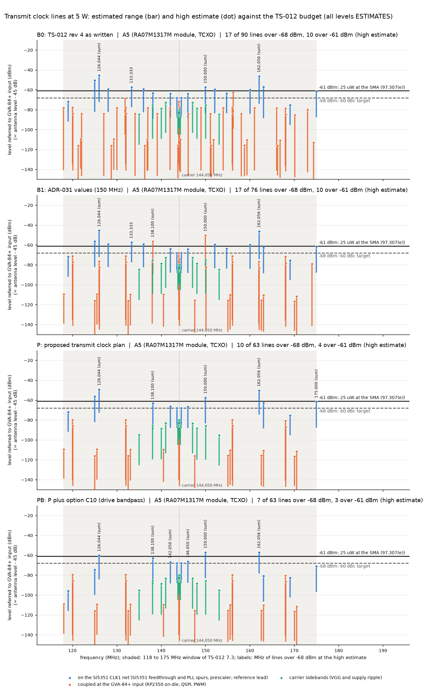
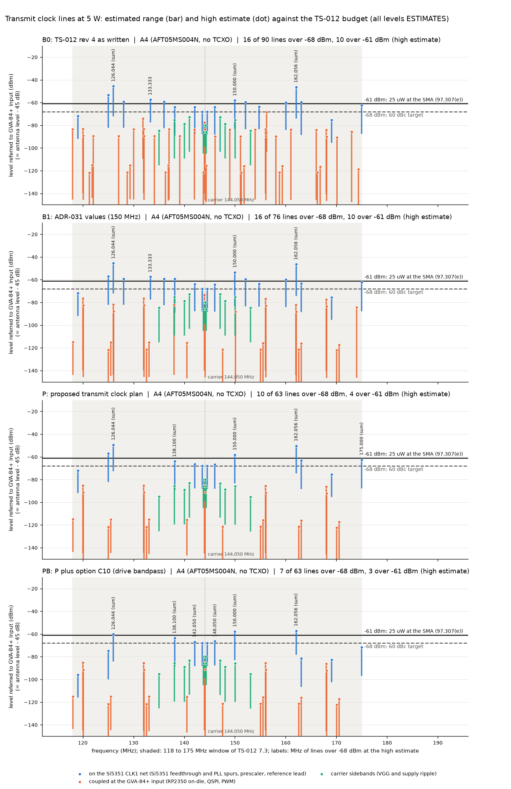
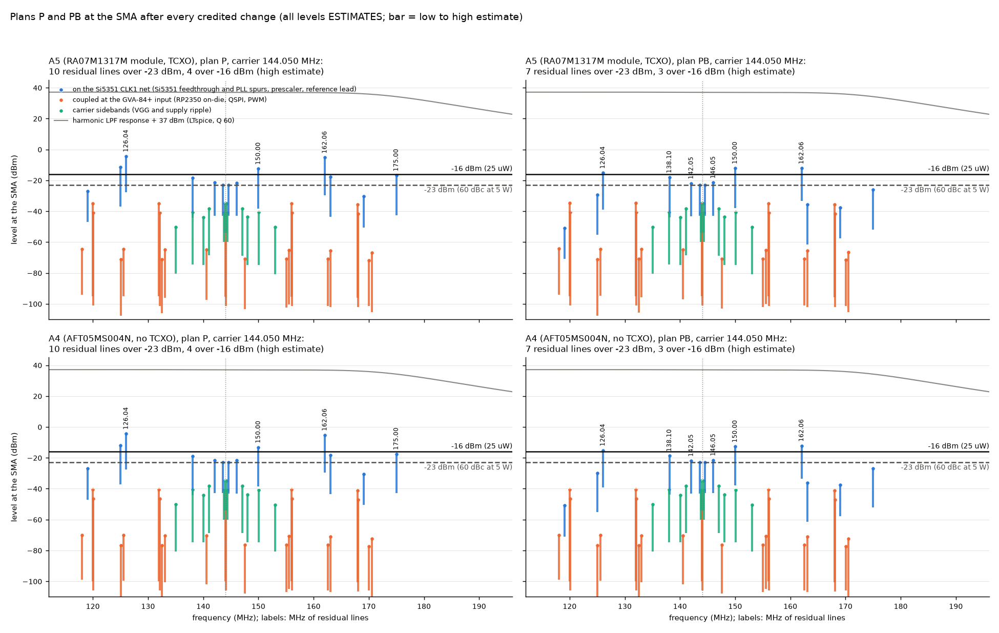
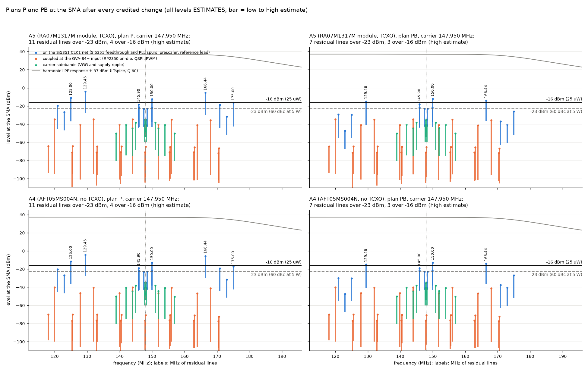
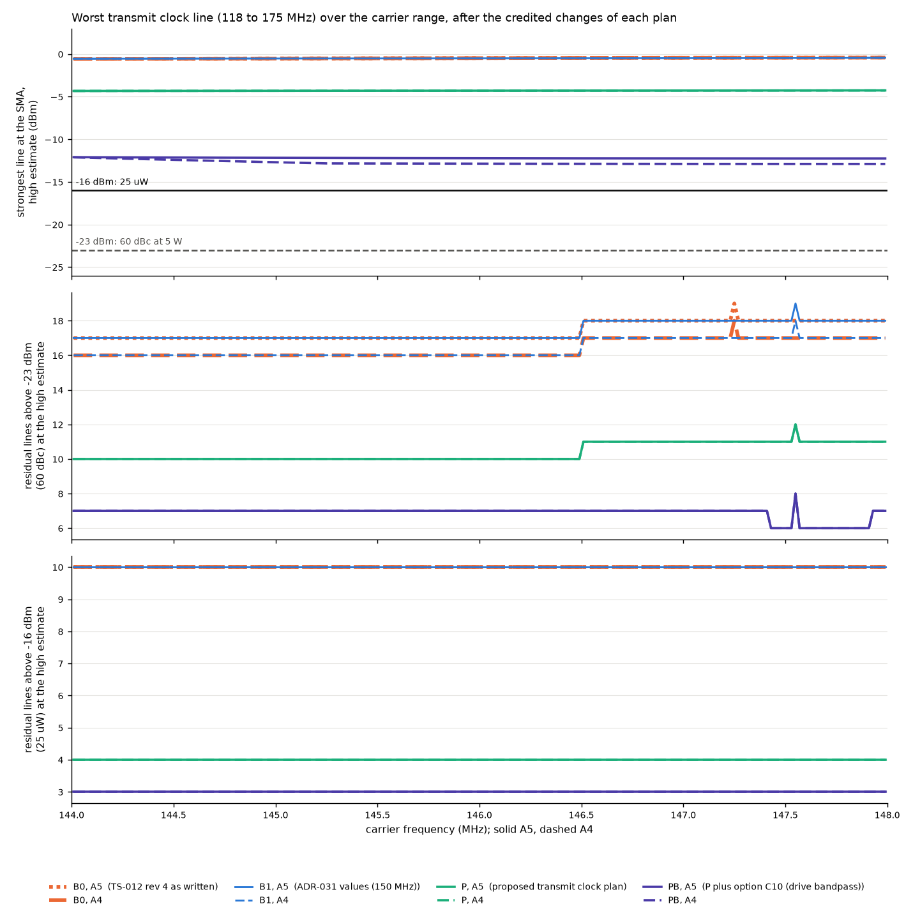
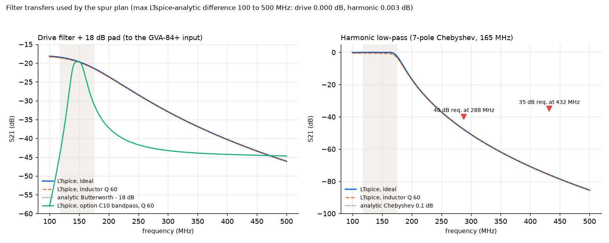
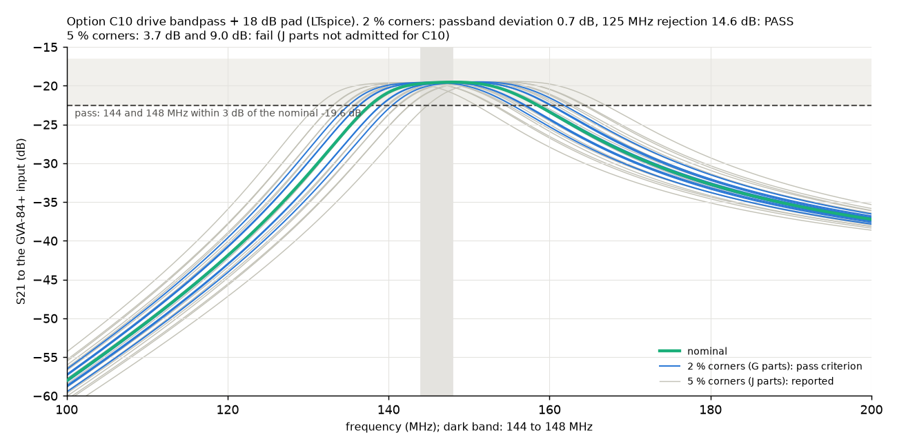
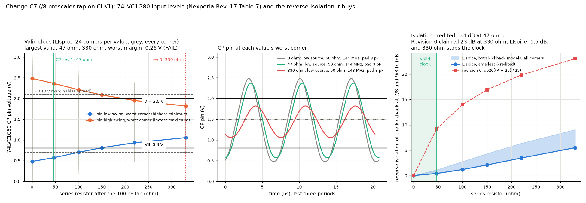
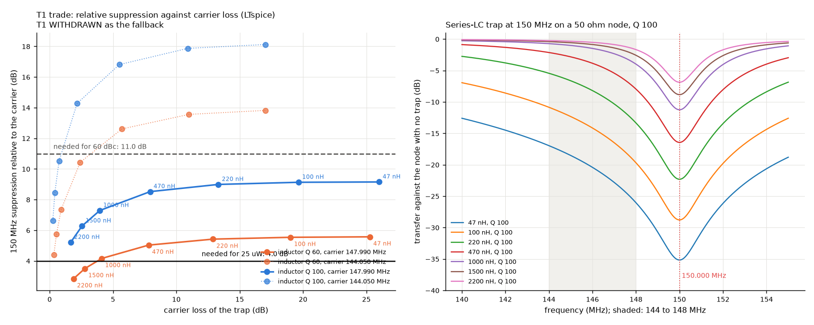

# Transmit clock spur plan for the TS-012 finalists: every clock line from 118 to 175 MHz while transmitting

| Field | Value |
|---|---|
| Product | `docs/design/analysis/spurs-ts012.md` (analysis note, `analysis_kind`: other, spur budget) |
| Work package | WP-PDR-20 transmit clock-plan pre-order item, added by TS-012 revision 4 (section 7.3 "Non-harmonic spurs in the LPF passband"; section 8.12 WP-PDR-20 row; adversarial R-3) |
| Authorization | Owner, status note 2026-09-28 section 1 item 2: "you should go ahead and run the simulations and analysis" |
| Author | Claude, analysis author invocation, 2026-09-28 (revision 0); revision 1 the same day, fixing the Major findings finding-1 and finding-2 of the independent review of revision 0 |
| Checker | `hardware/sim/freq/tx_spur_plan.py`; LTspice decks `hardware/sim/freq/tx_spur_filters.cir`, `tx_spur_bpf_tol.cir`, and (revision 1) `tx_spur_c7_tap.cir`, `tx_spur_c7_iso.cir`, `tx_spur_trap.cir` (run only through `tools/ltspice-batch.sh`, ACC-LTSPICE-001, blob `88b71475`) |
| Run | `hardware/sim/freq/results/txspur-20260928-02/` (results file `results.json`, every line in `lines.csv`, checker output `checker-output.txt`, exit status 1 = residual lines); block README `hardware/sim/freq/README.md`. Run `txspur-20260928-01` (revision 0) is kept for the record and superseded |
| Review record | Independent review of revision 0 (findings relayed to the author 2026-09-28; the record is filed by the reviewer). Revision 1 answers its Major finding-1 (criterion reported as PASS while residual lines remain; T1 not feasible as sized) and finding-2 (C7 not checked for a valid 74LVC1G80 clock). Re-review of revision 1 is needed before the owner relies on it (section 8 item 6) |
| Evidence status | **Developer evidence** (05 section 9.1; checker without a TV record). Every line level is an **ESTIMATE of Low confidence**. The filter transfers come from LTspice and agree with the analytic prototypes to 0.003 dB |
| AT RISK | Depends on TS-012 revision 4 (Proposed), ADR-031 (Proposed) and the WP-PDR-21 drive-chain and LPF runs, which are running in parallel |

## 1. Purpose

TS-012 revision 4 asks for one check before the parts order, for both finalists A4 and A5 (section 7.3):
- list every clock that runs while the radio transmits, with its lines from 118 to 175 MHz;
- give each line an estimated level at the GVA-84+ input;
- reconcile the transmit clk_sys with ADR-031 (125 against 150 MHz);
- choose how the ADC clock runs in transmit.

**Pass criterion (TS-012 7.3):** "every line at most -68 dBm at the GVA-84+ input (estimate), or a layout, clock or firmware change named for it."

**How this note reports it (revision 1).** The criterion has two parts, and they are reported separately:
- **In the numbers:** every line at most -68 dBm at the GVA-84+ input (-23 dBm at the SMA) at the high estimate, after the changes whose effect the model applies (the *credited* changes). A line still over the limit is a **residual line**.
- **By wording:** each residual line carries a named change, even one whose effect is not quantified (a *named, not credited* change).

A plan whose residual lines are covered only by wording is reported as "met by wording only", with the count of residual lines and of those over 25 uW. It is never reported as PASS.

This note does that. It also carries each line to the antenna after the chain gain and the harmonic low-pass filter, and proposes the clock choices that move lines out of the window.

The budget, from TS-012 7.3:
- 25 uW at the SMA is -16 dBm (47 CFR 97.307(e), REQ-SYS-017).
- The 60 dBc target at 5 W is -23 dBm (REQ-SYS-018, TBR).
- About 45 dB lies from the GVA-84+ input to the SMA, so referred to the GVA-84+ input the limits are about -61 dBm and -68 dBm.

## 2. Method

1. **Line inventory.** Every clock running in transmit is listed, with each line n f in 118 to 175 MHz and each mixing product that the hardware creates. The set is in section 4.1.
2. **Four plans**, each evaluated for A4 and A5 at carriers of 144.050, 146.000 and 147.950 MHz, plus a sweep over 144.010 to 147.990 MHz in 20 kHz steps:
   - **B0**: TS-012 revision 4 as written:
     - clk_sys 125 MHz in transmit;
     - clk_adc continuous from PLL_USB;
     - QSPI at clk_sys / 4;
     - the /8 prescaler on a plain 100 pF tap of CLK1;
     - Si5351 CLK0 and CLK2 powered down, with PLL B left running for the BFO.
   - **B1**: the ADR-031 values: B0 with clk_sys 150 MHz.
   - **P**: the changes proposed in section 6: C1 to C8, L1 to L5, F1 and F3.
   - **PB**: P plus option C10, a drive bandpass in place of the drive low-pass.
3. **Three injection points.** The chain's ALC holds 5 W at the SMA, so the carrier sets the gain seen by any small line.
   - *CLK1 net* (Si5351 on-die lines, the prescaler, the reference lead): the level is stated in dBc of the CLK1 carrier. At the SMA the line keeps its dBc, corrected by how the drive filter and the harmonic low-pass treat it relative to the carrier: P_ant = 37 dBm + dBc + dH_drive + dH_LPF.
   - *GVA-84+ input* (RP2350 on-die noise, QSPI and PWM traces): an absolute level P. At the SMA it is P_ant = P + G_eff + dH_LPF, where G_eff = 37 dBm minus the carrier level at the GVA-84+ input.
     - A5: 43.7 to 47.6 dB (CLK1 +9.0 to +12.9 dBm, drive filter and 18 dB pad 19.6 dB).
     - A4: 39.0 to 42.0 dB (GVA-84+ at its P1dB of +19.4 to +20.4 dBm, 21.5 to 24 dB compressed gain; ESTIMATE).
   - *Carrier sidebands* (VGG and supply ripple): stated in dBc at the PA output.
4. **Filters** (LTspice, `tx_spur_filters.cir`):
   - the drive low-pass is a 3-pole Butterworth at 170 MHz, followed by the 18 dB pad;
   - the harmonic low-pass is a 7-pole 0.1 dB Chebyshev at 165 MHz. It reproduces the adversarial C8 figures: 47.9 dB at 288 MHz and 76.0 dB at 432 MHz;
   - option C10 is a 2-resonator bandpass;
   - each filter was run ideal and with an inductor Q of 60 at 150 MHz; the Q 60 variant is used.
5. **Gain flat over 118 to 175 MHz.** No credit is taken for the module's specified 135 to 175 MHz band or for the A4 hand match rolling off, as in TS-012.
6. **Mirror lines.** A saturated final stage adds a mirror line at 2 fc - fs, taken 6 dB under the line (ESTIMATE).
7. **Coincident lines** (the 144.000 MHz line, for example) add in amplitude for the high estimate, which is the worst phase.
8. **Board coupling.** Trace-to-trace coupling uses the microstrip crosstalk rule of thumb Kc = 1 / (1 + (D/H)^2), multiplied by 2 pi l / lambda_eff for a run that is short against the wavelength (FR4, eps_eff 3.3, H = 1.6 mm). The geometry ranges in section 3 stand in for a layout that does not exist yet.
9. **Verdict per line** at 60 dBc and at 25 uW:
   - pass if the high estimate is at or under the limit;
   - "not shown" if the range spans the limit;
   - fail if even the low estimate exceeds it.
10. **Credited and named changes (revision 1).** Each change of section 6 is marked credited (its effect is in the numbers of P and PB) or named only. The checker lists, for every residual line, the credited changes and the named ones (`results.json` key `cases.<plan>/<finalist>/<carrier>.residual_lines`; `lines.csv` columns `credited_in_numbers` and `named_not_credited`). Exit status: 0 if P and PB meet both limits in the numbers; 1 if residual lines remain; 3 if a residual line has no change named at all.
11. **C7 and T1 in LTspice (revision 1).**
    - `tx_spur_c7_tap.cir`: transient run of the /8 prescaler tap with the Si5351 source, the drive low-pass input and the 74LVC1G80 input. It checks the valid clock at 144 corners (section 4.4).
    - `tx_spur_c7_iso.cir`: AC run of the reverse isolation that a series resistor at the tap gives the CLK1 net, for two kickback models (section 4.4).
    - `tx_spur_trap.cir`: AC run of a 150 MHz series-LC trap with its carrier loss (section 4.5).

## 3. Inputs and sources

| Input | Value | Source and confidence |
|---|---|---|
| Carrier at the SMA | 5 W, 37 dBm; limits -16 dBm (25 uW) and -23 dBm (60 dBc) | TS-012 7.3; REQ-SYS-017, REQ-SYS-018 (TBR) |
| Si5351 CLK1 | +9.0 to +10.4 dBm at 50 ohm, +12.9 dBm with a 25 ohm source | TS-012 7.3 (derived from a 3.3 V CMOS swing) |
| Drive chain | 3-pole LPF about 170 MHz, 18 dB pad, GVA-84+ 22.5 to 25 dB, 3 dB pad, RA07M1317M (A5); A4: GVA-84+ at P1dB into the AFT05MS004N | TS-012 7.3 and 8.1 |
| Harmonic LPF | 7-pole Chebyshev, fc 165 MHz | TS-012 7.3; adversarial C8 |
| RP2350 clocks | clk_adc "Must be 48MHz"; CLK_ADC_CTRL AUXSRC includes CLKSRC_PLL_SYS (0x1), ENABLE "Starts and stops the clock generator cleanly", CLK_ADC_DIV INT field; PLL PWR bits PD and VCOPD ("set high when PLL output not required"); PLL VCO 750 to 1600 MHz, POSTDIV 1 to 7, "For the system PLL this is 150 MHz" maximum; conversion 96 clk_adc cycles (2 us) | RP2350 datasheet (build 2025-07-29, d126e9e), section 8.1 clock table, Tables 571, 572, 638, section 8.6.3, section 12.4. Read 2026-09-28 through the web-fetch tool from https://pip-assets.raspberrypi.com/categories/1214-rp2350/documents/RP-008373-DS-2-rp2350-datasheet.pdf (the tool cached the PDF; no download by the author). High |
| RP2350 core current | VREG_VIN 11.0 mA (CoreMark, 150 MHz) to 14.7 mA (hello_serial) at 3.3 V, so about 20 to 35 mA on DVDD, scaled with clk_sys | RP2350 datasheet Table 1446 (Medium); the DVDD conversion is an ESTIMATE |
| RP2350 on-die noise model | harmonic current 2 I; power-delivery impedance 0.1 to 0.5 ohm; clk_ref domain 1 to 3 mA; clk_adc domain 0.3 to 1 mA; PLL_USB tree 0.5 to 2 mA; cross-domain products 20 to 30 dB under their clk_sys parent | ESTIMATES (Low) |
| Coupling of Pico 2 supply and ground noise into the chain | 40 to 70 dB as written; 50 to 75 dB with layout rules L1 to L3 | ESTIMATE (Low), no layout |
| Si5351 reference feedthrough (25 MHz x 5, 6, 7 on CLK1) | -75 to -50 dBc | ESTIMATE (Low). No datasheet figure. It is placed below the -35 to -50 dBc output-to-output crosstalk reported for full-swing outputs: https://github.com/pavelmc/arduino-arcs/blob/master/Si5351_issues.md (read 2026-09-28) and https://nt7s.com/2014/12/si5351a-investigations-part-8/ (read 2026-09-28, plots only). An RA3APW page with measured Si5351 spectra at 144.49 MHz (http://www.ra3apw.ru/proekty/si5351-spectrum/) could not be read: its HTTPS certificate does not match the host |
| Si5351 PLL spurs | PFD reference spurs at fc +/- 25 MHz, -85 to -65 dBc; fractional and integer-boundary spurs at representative offsets of +/-0.5 and +/-2 MHz, -80 to -60 dBc | ESTIMATE (Low). PA3FWM tn42b (https://www.pa3fwm.nl/technotes/tn42b-si5351-analysis.html, read 2026-09-28): about -80 dBc in theory, "significantly worse" in practice from on-chip crosstalk |
| Si5351 PLL B and CLK2 residual in transmit | fc +/- 8 and 16 MHz, -75 to -55 dBc with CLK2 powered down; VCO B / 6 through MS1, -70 to -50 dBc, with VCO B at 800 MHz (MS2 = 100 for an 8 MHz BFO) | ESTIMATE (Low); the 8 MHz IF is from TS-012 7.3 |
| TCXO (A5) | TG2520SMN clipped sine 0.8 Vpp; harmonics 5 to 7 at -40 to -25 dBc | ESTIMATE (Low); the harmonic content is not read |
| Crystal node (A4) | 1 Vpp near-sinusoidal; harmonics 5 to 7 at -55 to -40 dBc | ESTIMATE (Low) |
| /8 prescaler | 74LVC1G80 x 3, 3.3 V, 1 to 2 ns edges, 50 +/- 1 % duty; kickback and shared-supply sidebands fc +/- fc/8 at -65 to -45 dBc on a plain 100 pF tap | TS-012 8.1 (part); ESTIMATE (Low) for the levels |
| 74LVC1G80 input and timing (revision 1) | VIH at least 2.0 V and VIL at most 0.8 V at VCC 2.7 to 3.6 V; CI 5 pF typical (no maximum given); CP pulse width tW at least 2.5 ns; fmax at least 160 MHz at VCC 3.0 to 3.6 V (-40 to +85 C); input transition at most 10 ns/V; "Schmitt-trigger action at all inputs" | Nexperia 74LVC1G80 product data sheet Rev. 17, 12 November 2024, Tables 6, 7 and 8, section 1. Read 2026-09-28 through the web-fetch tool from https://assets.nexperia.com/documents/data-sheet/74LVC1G80.pdf (the tool cached the PDF; no download by the author). High |
| C7 tap network (revision 1) | 100 pF C0G (ESR 0.1 ohm, 1 nH, est.); bias 12 k to 3.3 V and 9.1 k to ground (1.42 V, midway between VIL and VIH); pad and trace 1 to 3 pF (ESTIMATE); Si5351 source and drive low-pass input as in `docs/design/analysis/pa-drive-ts012.md` run d2 (VDDO 3.2 to 3.4 V, 20-80 % edge 0.5 to 1.5 ns, duty 0.45 to 0.50, 25 or 50 ohm) | This note; WP-PDR-21 |
| PWM | 150 kHz coherent (ADR-031 rule 3), GPIO edges 2 to 5 ns; VGG slope 0.6 per volt (relative amplitude) at 5 W, from the TS-012 7.3 graph points (4 W at 3.0 V, 7 W at 3.5 V); a 2-pole RC reference filter with its corner at 1 to 3 kHz | ESTIMATE (Low) |
| Switchers in transmit | RT6150 about 2 MHz (VOI-CP-2 open); RP2350 core regulator 3 MHz typical; GVA-84+ gain sensitivity 0.3 to 1 dB/V; ripple at the GVA-84+ supply 1 to 10 mV as written, 0.3 to 3 mV with F3 | `clock-plan.md` section 2.1 (R-1, R-2); ESTIMATE (Low) for the rest |

## 4. Results

### 4.1 Clocks running in transmit and their lines from 118 to 175 MHz (completes the TS-012 7.3 table)

| Clock | B0 (TS-012 rev 4) | B1 (ADR-031) | P and PB (proposed) |
|---|---|---|---|
| XOSC 12 MHz (clk_ref, PLL references) | 120, 132, 144.000, 156, 168 | same | same (cannot be moved) |
| clk_sys = clk_peri | **125** | **150** | 96 MHz: none (2nd harmonic 192) |
| RP2350 on-die products a x clk_sys +/- b x 12 MHz | on a 1 MHz grid: 137, 149, 161, 173, 118, 130, 142, 154, 166 ... | on a 6 MHz grid: 126, 138, 162, 174 and the 12 MHz lines | all fall on the 12 MHz lines (96 = 8 x 12) |
| clk_adc and PLL_USB 48 MHz | 144.000 (x 3), continuous | same | 144.000, bursts only (C2); PLL_USB off (C3) |
| QSPI SCK | 31.25 MHz: 125, 156.25 | 37.5 MHz: 150 | 48 MHz: 144.000 only; flash idle in transmit (C4) |
| 25 MHz reference (on-die feedthrough and lead) | 125, 150, 175 | same | same (cannot be moved) |
| Si5351 PLL A spurs | fc +/- 25 MHz; close-in fractional spurs | same | same; C5 fraction rule |
| Si5351 PLL B / CLK2 (BFO 8 MHz) | fc +/- 8 and 16 MHz; VCO B / 6 = 133.33 | same | none: PLL B parked on the PLL A multiplier (C6) |
| /8 prescaler | 7/8 fc (126.0 to 129.5) and 9/8 fc (162.0 to 166.5): trace harmonics and kickback sidebands | same | same frequencies; trace harmonics about 20 dB lower (C8); kickback sidebands only 0.4 dB lower (C7 revision 1, section 4.4); option C9 (/4) moves them to 108 to 111 and 180 to 185 |
| Prescaler /2 and /4 stages | 3/4 and 5/4 fc (108 to 111, 180 to 185), outside the window | same | same |
| PWM 150 kHz (audio, sidetone, envelope reference) | comb of 380 lines; VGG sidebands at fc +/- k x 150 kHz | same | same (coherent); derived VGG ripple limit |
| RT6150 and RP2350 regulator | sidebands at fc +/- k x 2 and 3 MHz through the GVA-84+ bias | same | same, lower with F3 |
| I2C, USB, CLK0 LO, CLK2 output | none: no I2C traffic, VBUS inhibit and CLK0/CLK2 power-down are already in TS-012 | same | same |

The ADC clock choice (TS-012 item (ii), clk_adc only around bursts) is adopted as C2, with a change to the source. clk_adc is taken from PLL_SYS divided by 2 (96 / 2 = 48 MHz; CLK_ADC_CTRL AUXSRC 0x1, CLK_ADC_DIV INT 2), so PLL_USB can be powered down whenever USB is not enumerated (C3). Transmit is always in that state, because of the VBUS inhibit of REQ-SYS-092. The question TS-012 left open, whether PLL_USB can stop between bursts, is therefore answered by stopping it for the whole transmission.

### 4.2 Levels (run txspur-20260928-02)

Every level below is an ESTIMATE of Low confidence. "Residual" means over the limit at the high estimate after the credited changes.

| Plan | A5 worst line, SMA, high estimate | A4 worst line | Residual lines over -23 dBm (60 dBc), over 144.010 to 147.990 MHz (A5; A4) | Residual lines over -16 dBm (25 uW) | TS-012 criterion in the numbers | By wording |
|---|---|---|---|---|---|---|
| B0 | -0.4 dBm: /8 prescaler 7/8 fc (kickback sideband, trace harmonic and the 9/8 mirror); GVA-84+ input -45.4 dBm | -0.4 dBm | 17 to 19; 16 to 18 | 10 (10 to 11 at the three carriers) | not met | not met as written |
| B1 | -0.4 dBm (the same); clk_sys 150 MHz adds -11.6 dBm at 150.000 | -0.4 dBm | 17 to 19; 16 to 18 | 10 (10 to 11) | not met | not met as written |
| P | **-4.3 dBm**: /8 prescaler 7/8 fc (kickback sideband, 126.0 to 129.5 MHz); GVA-84+ input -49.3 dBm | -4.3 dBm | 10 to 12; 10 to 12 | **4** | **not met: residual lines** | met by wording only: 10 to 12 residual lines, 4 over 25 uW, closing at the bench |
| PB | **-12.1 dBm**: 150.000 MHz (25 MHz x 6) and, equal, the /8 kickback at 9/8 fc (162.0 to 166.5 MHz); GVA-84+ input -57.1 dBm | -12.1 dBm | 6 to 8; 6 to 8 | **3** | **not met: residual lines** | met by wording only: 6 to 8 residual lines, 3 over 25 uW, closing at the bench |

Revision 0 reported P and PB as PASS, with a worst line of -11.2 dBm in P. Two things changed:
- The PASS was the wording of the criterion only (review finding-1). The numbers above are the same kind of numbers revision 0 had, reported as residual lines.
- C7 lost its 23 dB kickback credit (review finding-2, section 4.4). It now earns 0.4 dB, so the /8 kickback sidebands at 7/8 and 9/8 fc are the strongest residual lines of P and join 150 MHz as the strongest of PB.

In B0 and B1 the lines over -23 dBm at the high estimate are:
- the /8 products and their mirrors (up to -0.4 dBm);
- the clk_sys fundamental in the window;
- the VCO B leakage at 133.33 MHz;
- the BFO crosstalk products at fc +/- 8 and 16 MHz;
- the reference lines.

Plan P removes the clk_sys, VCO B, BFO and QSPI lines and lowers the trace part of the /8 products. It does not lower the /8 kickback sidebands or the reference lines. The 144.000 MHz line is:
- -26.9 dBm (high) in B0;
- -22.9 dBm in B1, where the 2 x 150 - 13 x 12 product lands on it too;
- -34.8 dBm in P.

**Residual lines of PB** (A5, carriers 144.050 to 147.950 MHz; A4 within 0.8 dB of A5 on every line):

| Line | Cause | SMA, low to high (A5) | Over 25 uW at the high estimate | Credited in the numbers | Named, not credited |
|---|---|---|---|---|---|
| **150.000 MHz** | 25 MHz x 6: Si5351 on-die feedthrough (dominant) plus the reference lead | -37.9 to -12.1 dBm | yes, by 3.9 dB | C10 (no effect at 150 MHz) | F1 (effect not quantified); L4 (treats the TCXO lead only, not the on-die feedthrough). T1 withdrawn (section 4.5) |
| **9/8 fc (162.0 to 166.5 MHz)** | /8 kickback sideband (dominant), /8 trace harmonic, mirror of 7/8 fc | -33.5 to -12.1 dBm (144.050); -36.4 to -14.0 dBm (147.950) | yes, by 2 to 4 dB | C7 (0.4 dB), C8, L5, C10 (5 dB at 162 MHz) | supply bead per flip-flop, C7b, C9, C12 (section 6) |
| **7/8 fc (126.0 to 129.5 MHz)** | /8 kickback sideband, mirror of 9/8 fc | -39.1 to -15.1 dBm | yes, by 1 dB | C7, C8, L5, C10 (16 dB at 126 MHz) | as above |
| 2 fc - 150 (138.1 MHz at fc 144.05) | mirror of the 150 MHz line in the saturated final | -43.8 to -18.0 dBm | no | C10 | follows the 150 MHz line |
| fc +/- 2 MHz | representative Si5351 fractional spur (-60 dBc high) plus RT6150 ripple | -43 to -21.5 dBm | no | F3, C10 | C5 (sets where a fractional spur falls, not its level) |
| fc +/- 0.5 MHz | representative fractional spur | -43 to -23.0 dBm (at the limit) | no | C10 | C5 |

At 146.000 MHz the 144.000 and 148.000 MHz lines (12 MHz grid plus the fc +/- 2 MHz spur) reach -20.0 and -20.7 dBm, and the 150 MHz mirror falls at 142.000 MHz; the count stays at 7.

**Residual lines of P** add, over 25 uW: the 7/8 fc kickback at -4.3 dBm (the drive low-pass does not reach it) and 125.000 MHz (25 MHz x 5) at -11.2 dBm, which C10 would treat. 175.000 MHz (-16.6 dBm) sits just under 25 uW. The full list per carrier is in `results.json`.

**Derived requirements (the numbers that decide the residual).**
- **150.000 MHz.** To meet the 60 dBc target, the Si5351 output at the CLK1 pin must carry the 150.000 MHz line at least 60 dB under the carrier; to meet 25 uW, at least 53 dB under it. No drive-filter choice relaxes this. The same bound, relaxed by the C10 rejection (17 dB at 125 MHz, 11 dB at 175 MHz, nominal; at least 14.6 dB at 125 MHz at the 2 % corners), applies to 125 and 175 MHz. It also applies to the close-in fractional spurs.
- **/8 kickback.** On the CLK1 net, the kickback sideband must sit at least about 55 dB under the carrier at 9/8 fc (PB, where C10 gives 5 dB) and about 61 dB at 7/8 fc (P). This note's estimate spans -65 to -45 dBc, so the high end is about 10 to 15 dB too strong.

### 4.3 ADR-031 receive-band re-check of clk_sys 96 MHz (C1)

C1 changes clk_sys in receive too, so it is checked against ADR-031 rules 1, 3 and 4 (receive range 144.010 to 147.999 MHz, 65 ppm; `results.json` key `adr031_rx_check_clk_sys_96`):
- **clk_sys 96 MHz:** no line in the range.
- **PWM:** TOP+1 = 640 gives exactly 150 kHz, coherent with 144.000 MHz, so ADR-031 rule 3 holds.
- **SPI SCK clear set:** 96 / d for d even from 2 to 22. d = 24 (4 MHz) puts n = 37 at 147.990 to 148.010 MHz and is excluded.
- **QSPI clear set:** CLKDIV 1 to 12, 14, 16, 18, 20 and 22. CLKDIV 13, 15, 17, 19, 21, 23 and 24 each put one line in the range. The proposed CLKDIV 2 (48 MHz) and the boot CLKDIV 12 (8 MHz, coherent) are clear.
- **I2C:** with the ADR-031 counts, SCL becomes about 256 kHz at 96 MHz; the counts are re-derived for 96 MHz (WP-PDR-32). SCL stays residual R-4.

The clock-plan checker `clock_plan.py` hard-codes 150 MHz. It must be re-run with 96 MHz before ADR-031 is revised (section 8 item 2).

### 4.4 C7: the prescaler tap must give a valid clock, and a series resistor cannot isolate it (revision 1, review finding-2)

Revision 0 put 330 ohm in series at the tap and credited db20((330 + 25) / 25) = 23 dB of kickback isolation. It did not check that the 74LVC1G80 still gets a valid clock. The LTspice runs of revision 1 check both.

**Valid clock** (`tx_spur_c7_tap.cir`, 24 corners per resistor: Si5351 source low, nominal and high; 144 and 148 MHz; 25 and 50 ohm source; pad 1 and 3 pF). Criterion: at every corner the CP pin goes below VIL - 0.10 V and above VIH + 0.10 V. The 0.10 V covers the bias spread (VCC 3.3 V +/-3 % ESTIMATE, 1 % resistors: +/-0.06 V). The pulse width at 1.5 V must be at least 2.5 ns and the transition at most 10 ns/V.

| Series resistor | CP pin, worst corner: highest minimum / lowest maximum | Worst margin to VIL or VIH | Smallest pulse width | Valid clock | Reverse isolation, LTspice (smallest to largest) | Revision 0 formula |
|---|---|---|---|---|---|---|
| 0 ohm | 0.48 V / 2.48 V | +0.32 V | 3.14 ns | yes | 0 dB (reference) | 0 dB |
| **47 ohm (C7 revision 1)** | 0.57 V / 2.36 V | **+0.23 V** | 3.13 ns | **yes** | **0.4 to 1.1 dB** | 9.2 dB |
| 100 ohm | 0.70 V / 2.21 V | +0.10 V (at the criterion) | 3.10 ns | no (no margin left) | 1.2 to 2.8 dB | 14.0 dB |
| 150 ohm | 0.81 V / 2.08 V | -0.01 V | 3.06 ns | no | 2.1 to 4.3 dB | 16.9 dB |
| 220 ohm | 0.93 V / 1.95 V | -0.13 V | 3.00 ns | no | 3.5 to 6.4 dB | 19.8 dB |
| **330 ohm (revision 0)** | 1.06 V / 1.82 V | **-0.26 V** | 2.91 ns | **no: the pin never reaches VIH or VIL at the low corner** | **5.5 to 9.1 dB** | 23.0 dB |

Why the credit collapses: the kickback of a CMOS input is a small current into, or a ground bounce behind, its own input capacitance (5 pF typical, about 220 ohm at 146 MHz). That capacitance sits in the divider, so a series resistor of a few hundred ohms changes the current reaching the CLK1 net by only a few dB. The revision 0 formula holds only for a low-impedance source at the pin. Both models were run: a current into the pin, and a 1 V ground bounce behind CI. The credited value is the smallest over both models, the two source resistances, the two pad capacitances and the 7/8 and 9/8 fc ranges.

Other timing checks pass at 47 ohm: the first flip-flop runs at fc of at most 148 MHz against fmax of at least 160 MHz (8 % margin), and the slowest transition is 1.9 ns/V against 10 ns/V. The CLK1 pin swings 2.0 to 3.2 V peak to peak in this run, consistent with the 2.22 to 3.24 V of the WP-PDR-21 drive run, whose tap load was 5 pF with no resistor.

**Result.** C7 becomes 47 ohm, which keeps at least 0.23 V of margin, and is credited with 0.4 dB. The /8 kickback sidebands are then residual lines in P and PB (section 4.2). Isolating them needs something other than a passive series element (section 6: C7b, C9, C12). None of these is quantified here, so none is credited.

### 4.5 T1: a 150 MHz trap cannot give the needed suppression at the top of the band (revision 1, review finding-1 item c)

The 150.000 MHz line in PB is -12.1 dBm at the high estimate. It needs 11.0 dB of suppression relative to the carrier to meet 60 dBc, and 4.0 dB to meet 25 uW. With the ALC restoring 5 W, what counts is the relative suppression: the trap's attenuation at 150 MHz minus its carrier loss. A carrier loss is also drive that the ALC must make up. `tx_spur_trap.cir` places a series-LC trap to ground, resonant at 150.000 MHz, on a 50 ohm node. It steps L from 47 nH to 2.2 uH (C from 24 pF down to 0.51 pF) with an inductor Q of 60 and 100 (ESTIMATE).

| Trap (Q 100) | Attenuation at 150 MHz | Carrier loss at 144.050 / 146.000 / 147.990 MHz | Relative suppression at 147.990 MHz | at 144.050 MHz |
|---|---|---|---|---|
| 47 nH, 24 pF | 35.2 dB | 17.0 / 20.4 / 26.0 dB | 9.2 dB | 18.1 dB |
| 470 nH, 2.4 pF | 16.5 dB | 2.2 / 3.9 / 7.9 dB | 8.5 dB | 14.3 dB |
| 1 uH, 1.13 pF | 11.3 dB | 0.7 / 1.5 / 4.0 dB | 7.3 dB | 10.5 dB |
| 2.2 uH, 0.51 pF | 6.9 dB | 0.25 / 0.5 / 1.7 dB | 5.2 dB | 6.6 dB |

- **60 dBc:** at 147.990 MHz no size reaches the needed 11.0 dB. The best is 9.2 dB with Q 100 and 5.6 dB with Q 60, at a carrier loss of 17 to 26 dB.
- **25 uW:** the cheapest trap that reaches 4.0 dB at 147.990 MHz is 2.2 uH with 0.51 pF at Q 100 (5.2 dB). It costs 1.7 dB of carrier at 147.990 MHz. With Q 60 the same part gives only 2.8 dB. The review's hand figures (4.0 to 4.1 dB of carrier for 11 dB at 150 MHz with 1 uH; 1.7 to 1.9 dB for 4 dB) are confirmed.
- Neither drive chain has carrier to spare. A5's module drive is under 10 mW at 60 of 270 corners, and both finalists' lowest power corners already fail at 6.4 V (`docs/design/analysis/pa-drive-ts012.md`, runs d2, p1, p2). A 0.5 pF trap capacitor is also at the scale of its own pad parasitics.

**Result: T1 is withdrawn as the fallback for 150 MHz.** No pre-order fallback remains for that line. It is carried to the order decision as a residual line (section 8). A trap would only work if the transmit range stopped well below 148 MHz: at 144.050 MHz the 1 uH trap gives 10.5 dB for 0.7 dB of carrier. That would need a requirement change and is not proposed.

## 5. Verdict per finalist

**A5 (RA07M1317M module with TCXO): TS-012 7.3 met by wording only with plan P or PB; not met in the numbers.**
- In PB, 6 to 8 lines stay over the 60 dBc target at the high estimate after the credited changes, and 3 of them are over 25 uW:
  - 150.000 MHz at -12.1 dBm;
  - the /8 kickback at 9/8 fc at up to -12.1 dBm;
  - the /8 kickback at 7/8 fc at -15.1 dBm.
- In P, 10 to 12 lines stay over 60 dBc and 4 are over 25 uW, up to -4.3 dBm (7/8 fc).
- Every residual line has a named change, but only some are credited. The ones that matter are named but not credited:
  - F1 and L4 for 150 MHz;
  - C7b, C9 and C12 for the /8 products;
  - C5 for the fractional spurs.
- These are Low-confidence estimates, not predictions of failure. They show that the design cannot show the target, or 25 uW, by analysis before the order. The residual lines close only at the tinySA sweep before first on-air use (TS-012 already requires it). T1 is no longer a fallback (section 4.5).

**A4 (AFT05MS004N, no TCXO): the same verdict and the same residual lines.**
- Every residual line is within 0.8 dB of A5.
- A4's lower gain after the GVA-84+ input (39 to 42 dB against 43.7 to 47.6 dB) lowers only the lines coupled in at the GVA-84+ input, and those are not the residual lines.
- Its crystal node puts less energy at 125, 150 and 175 MHz than A5's TCXO lead, but the Si5351 on-die feedthrough dominates both.

**Discrimination: none.** The transmit spur plan does not separate A4 from A5, so it gives no reason to change the TS-012 ranking or the C5 and C8 scores. The non-harmonic spur risk rows of TS-012 7.1 (12, Red, for both) stay Red. Revision 1 adds the /8 kickback as a second cause of the same size as 150 MHz, and neither has a credited fix.

**TS-012 revision 4 as written (B0) and the ADR-031 values (B1) do not meet the criterion.** The /8 prescaler on a plain tap and the in-window clk_sys are the largest named causes.

## 6. Changes proposed (for TS-012 revision 5, ADR-031 revision, and the WPs named)

Each "Moves or holds" cell says whether the checker applies the change's effect in plans P and PB (**credited**) or only names it (**named, not credited**) (revision 1, review finding-1 item b).

| Id | Change | Moves or holds | Cost | Owner or WP |
|---|---|---|---|---|
| C1 | clk_sys = clk_peri = 96 MHz in every state (PLL_SYS FBDIV 120 for a 1440 MHz VCO, POSTDIV1 5, POSTDIV2 3). It replaces TS-012's 125 MHz in transmit and ADR-031's 150 MHz, which are both inside the window. One value for receive and transmit avoids re-clocking at key-down | moves the clk_sys line to 96 (192) MHz and every on-die product onto the 12 MHz lines. **Credited** | USD 0; firmware. The ADR-051 clock bring-up and its frequency-counter window (148.5 to 151.5 MHz) change with it | ADR-031 revision; WP-PDR-41 (ADR-051 writer); WP-PDR-32 |
| C2 | clk_adc from PLL_SYS / 2, enabled (CLK_ADC_CTRL.ENABLE) only for conversion bursts: 8 to 16 conversions per burst, bursts at the rate the REQ-SYS-156 and mid-ramp checks need (for example every 1.6 ms; duty 0.5 to 2 %) | lowers the clk_adc share of 144.000 MHz by 17 to 23 dB (mean power). **Credited** | USD 0; firmware | WP-PDR-32, WP-PDR-35 (SW-CTL requirement) |
| C3 | PLL_USB powered down (PWR.PD and VCOPD) whenever USB is not enumerated, so in every transmit state | removes the PLL_USB 48 MHz tree. **Credited** | USD 0; firmware | WP-PDR-32 |
| C4 | QSPI CLKDIV 2 (48 MHz; its only line in the window is 144.000 MHz) and the transmit-path code and data in SRAM, so the flash is idle during key-down | removes 125 and 156.25 MHz (B0) and 150 MHz (B1). **Credited** | USD 0; firmware and linker | WP-PDR-32; confirm against the flash part's ceiling |
| C5 | PLL A multiplier rule: the fractional part not within 0.002 of an integer (a firmware table check at each channel), so no integer-boundary spur sits close to the carrier | sets where a fractional spur falls, not how strong it is. **Named, not credited** | USD 0 | WP-PDR-20 frequency plan; WP-PDR-35 |
| C6 | In transmit, PLL B is parked on the PLL A multiplier, and CLK0 and CLK2 are powered down and disabled (register 3). The I2C writes happen in the 10 ms lead-in, before the ramp; PLL B returns to the BFO setting after key-up | removes fc +/- 8 and 16 MHz and 133.33 MHz. **Credited** | USD 0; firmware (receive recovery time to confirm) | WP-PDR-35 |
| C7 (revision 1) | Prescaler fed through **47 ohm** in series after the 100 pF, biased at 1.42 V (12 k to 3.3 V, 9.1 k to ground); each 74LVC1G80 on its own ferrite bead and 100 nF. Revision 0's 330 ohm stops the clock (section 4.4) | valid clock with at least 0.23 V margin at every corner; kickback isolation 0.4 dB (LTspice, **credited**); the bead supplies are **named, not credited** | about USD 0.3 (ESTIMATE) | WP-PDR-21 drive chain |
| C7b (option) | A single buffer gate (for example 74LVC1G17, Schmitt, SC-74A) between the tap and the first flip-flop, on its own bead supply, so the /8 chain drives the buffer's low-impedance output instead of the CLK1 net | would lower the /8 kickback; its reverse isolation has no datasheet figure. **Named, not credited** | about USD 0.2 (ESTIMATE) | WP-PDR-21; to be quantified by a bench check of the 7/8 and 9/8 fc lines at the CLK1 pin |
| C12 (option) | /8 chain from a flip-flop with a clear input (for example 74LVC1G74), held in clear by a GPIO except for short count windows, so no stage toggles and no fc/8 content exists outside the windows. The windows must still meet REQ-SYS-182 ("before and during transmit", end RF within 100 ms) | would lower the kickback mean power by the window duty; a max-hold measurement (REQ-TX-008 bench note) still sees the peak. **Named, not credited** | cents; firmware | WP-PDR-20 (counter gate, `frequency-budget.md`); WP-PDR-35 |
| C8 | 470 ohm series resistor at the /8 output (with the GPIO load, a first-order low-pass at 42 to 68 MHz); the /8 trace 15 to 25 mm from the CLK1 net (L5) | lowers the 7/8 and 9/8 trace harmonics by about 20 dB. **Credited** | USD 0 (owned through-hole resistor) | WP-PDR-21; layout |
| C9 (option) | /4 prescaler (36.0 to 37.0 MHz, under the 50 MHz GPIN limit, RP2350 section 8.1) | moves both products out of the TS-012 window (to 108 to 111 and 180 to 185 MHz), where they are not assessed (section 7 item 5). **Named, not credited** | one flip-flop fewer; needs a REQ-TX-013 CR (20 MHz sample ceiling) and a `frequency-budget.md` re-run | only if the bench shows the /8 lines over the limit and C7b does not hold them |
| C10 (option, recommended) | 2-resonator top-C coupled drive bandpass (two 1812SMS 47 nH, 7.5 pF series, 16 pF shunt, 2.4 pF coupling, E24 C0G) in place of the 3-pole drive low-pass, with the same 18 dB pad. Its passband loss (about 1.6 dB with Q 60) equals the low-pass's, so the module drive is unchanged. **Tolerance (LTspice, `tx_spur_bpf_tol.cir`, 25 corners):** with 2 % parts (1812SMS G tolerance, 2 % C0G) the passband stays within 0.7 dB of nominal at 144 and 148 MHz and 125 MHz rejection is at least 14.6 dB (PASS); with 5 % parts the deviation reaches 3.7 dB and the rejection falls to 9.0 dB (fail), so C10 needs 2 % parts. Nominal rejection against 146 MHz: 23 dB at 119 MHz (fc - 25 MHz), 17 dB at 125 MHz, 16 dB at 126 MHz (7/8 fc), 5 dB at 162 MHz (9/8 fc), 9 dB at 169 MHz (fc + 25 MHz), 11 dB at 175 MHz, 0 dB at 150 MHz; 23 dB at 288 MHz and 25 dB at 432 MHz against 12 and 23 dB for the low-pass, so it also treats the 2f and 3f of the CLK1 square wave at least as well | lowers 125, 175, the /8 products (16 dB at 7/8 fc, 5 dB at 9/8 fc) and fc +/- 25 MHz; not 150 MHz. **Credited** in PB | about USD 1 to 1.5 more than the low-pass (one more 1812SMS and three more C0G; ESTIMATE, not read) | WP-PDR-21 drive-chain run to confirm the module drive of 10 to 30 mW with C10 |
| ~~T1~~ (withdrawn, revision 1) | ~~An unpopulated series-LC trap footprint at 150 MHz on the drive chain~~ | LTspice (section 4.5): at 147.990 MHz no size gives the 11.0 dB relative suppression 60 dBc needs (best 9.2 dB, at 26 dB of carrier loss); the 4.0 dB for 25 uW costs 1.7 dB of carrier with a 0.51 pF, Q 100 trap. Withdrawn as the fallback | none | none |
| L1 | Pico 2 module at least 30 mm from the GVA-84+ input and the pad | holds the RP2350 lines. **Credited** with L2 and L3 in the RP2350 path loss (50 to 75 dB against 40 to 70 dB, ESTIMATE) | USD 0 | layout (CDR) |
| L2 | CLK1 from the Si5351 module to the RF board in 50 ohm coax or grounded coplanar line over a continuous pour | holds all lines coupled on the CLK1 route. **Credited** only in the RP2350 path loss (with L1, L3) | USD 0 to 2 | layout (CDR) |
| L3 | One ground connection between the main board and the RF board, at the CLK1 entry beside the sink; no Pico 2 return current through the RF board | holds the supply and ground noise path. **Credited** (with L1, L2) | USD 0 | layout (CDR) |
| L4 | TCXO output lead at most 10 mm long and at least 8 mm from the CLK1 trace (A5) | holds 125, 150, 175 from the lead only, not the on-die feedthrough that dominates those lines. **Named, not credited** (the path range of 3 to 8 mm is kept) | USD 0 | layout |
| L5 | /8 chain at the tap point; its output trace 15 to 25 mm from the CLK1 net | see C8. **Credited** | USD 0 | layout |
| F1 | Si5351 module supply through a ferrite bead and 10 uF | holds the supply-borne share of the on-die lines. **Named, not credited** (effect not quantified) | about USD 0.2 (ESTIMATE) | WP-PDR-24 |
| F3 | GVA-84+ supply through a ferrite bead and 22 uF, for at most 3 mV of ripple at 1 to 10 MHz | lowers the switcher sidebands by about 10 dB. **Credited** | about USD 0.3 (ESTIMATE) | WP-PDR-24 |

**Derived requirement to WP-PDR-22:** PWM ripple at VGG at most 3.3 mV peak at 150 kHz, which gives sidebands at most -60 dBc. The estimate with a 2-pole RC reference filter is 0.23 to 0.84 mV, so -97 to -72 dBc for the first and second sidebands.

## 7. Limitations

1. **Every source level and coupling figure is an estimate (Low).** The ranges are 20 to 50 dB wide. The verdicts separate lines that the estimate clears from lines it does not; they do not predict measured levels. No layout exists, so path losses are geometry ranges.
2. **The Si5351 on-die figures have no datasheet basis.** These are the reference feedthrough, the PLL spurs and the PLL B leakage. They decide every residual line. The one public measurement found (RA3APW, 144.49 MHz) could not be read.
3. **The chain is taken as linear with flat gain from 118 to 175 MHz.** This is conservative below 135 MHz for A5, where the module is not specified, and for A4's narrow-band hand match. The mirror at -6 dB is a crude model of the saturated final. Real AM-to-PM and limiting can move it by several dB either way.
4. **The limit lines at the GVA-84+ input assume TS-012's 45 dB.** The antenna verdicts use each finalist's G_eff range; A5's upper end is 47.6 dB.
5. **Lines below 118 MHz and above 175 MHz are outside the TS-012 window and not assessed.** Examples are 108 to 111 MHz (3/4 fc), 96 MHz (clk_sys under C1), 192 MHz and 288 MHz (C1's POSTDIV1 output, 1440 / 5). The harmonic low-pass attenuates the upper ones (12 dB at 192 MHz, 48 dB at 288 MHz). The lower ones rest on the PA's out-of-band gain, which is not quantified here. The tinySA sweep from 9 kHz to 1.5 GHz covers them.
6. **Only every 25th PWM comb line is plotted.** The comb's levels (-64 dBm or less at the SMA) are far under the limits.
7. **The filter decks use ideal capacitors and a series-R inductor Q.** WP-PDR-21's Coilcraft-model LPF deck supersedes the harmonic low-pass here. `hardware/sim/tx-lpf/` was in progress in parallel and was not read.
8. **Tool status:** `tx_spur_plan.py` has no TV record (developer evidence). LTspice is accredited (ACC-LTSPICE-001).
9. **The /8 kickback level (-65 to -45 dBc on a plain tap) is an estimate with no measured basis** (revision 1). After revision 1 it decides two of the three lines over 25 uW in PB. The C7 isolation models are two idealized mechanisms (a current into the pin, a ground bounce behind CI); the flip-flop's real kickback path is not published. The valid-clock run uses CI = 5 pF typical; the datasheet gives no maximum, so the pad capacitance step (1 and 3 pF) stands in for the spread.
10. **T1 was sized on a plain 50 ohm node** (revision 1). A trap inside the drive filter or at a lower-impedance node would change the numbers, but not the physics: 150 MHz is 1.35 % above 147.99 MHz, and inductors of Q 60 to 100 cannot separate them.

## 8. What closes before the order

**Residual lines carried to the order decision (revision 1, review finding-1 item d).** The owner orders against these, not against a PASS. The levels are at the SMA, high estimate, ESTIMATE of Low confidence; A4 is within 0.8 dB of A5 on every line.

| Plan | Residual lines over 60 dBc (-23 dBm) over the band | Of which over 25 uW (-16 dBm) | The lines over 25 uW | Credited fix | What closes them |
|---|---|---|---|---|---|
| PB (recommended: P plus C10) | 6 to 8 | 3 | 150.000 MHz at -12.1 dBm; /8 kickback 9/8 fc at -12.1 to -14.0 dBm; /8 kickback 7/8 fc at -15.0 to -15.3 dBm | none beyond C10 | the tinySA sweep at the CLK1 pin and at the SMA before first on-air use; then C7b, C9 or C12 for the /8 lines; for 150 MHz only a lower Si5351 feedthrough than this note's high estimate (derived requirement of section 4.2) |
| P (drive low-pass kept) | 10 to 12 | 4 | /8 kickback 7/8 fc at -4.3 dBm and 9/8 fc at -5.2 to -5.6 dBm; 125.000 MHz at -11.2 dBm; 150.000 MHz at -12.2 to -12.5 dBm | none | as above; C10 lowers the 7/8 fc and 125 MHz lines by 16 and 17 dB |

What this means for the order:
- Neither finalist can be shown to meet 25 uW (a legal limit, 47 CFR 97.307(e)) by analysis before the order. The high estimate of 3 lines is over it in PB.
- The finalists are equal on this question (section 5), so it does not change the choice between A4 and A5.
- It does bear on what goes onto the board. These are cents: C10 (recommended), the C7 bias network at 47 ohm, and footprints for C7b (a buffer gate) and a C9 jumper. They keep the bench options open without a board respin. With T1 withdrawn, no fallback for 150 MHz fits on the board.
- The tinySA Ultra that closes these lines is not yet bought (status note 2026-09-28: the owner buys it later). No transmission on air before that sweep, which TS-012 already requires.

| # | Item | Closes by | Status |
|---|---|---|---|
| 1 | Adopt C1 to C8, L1 to L5, F1, F3 (no cost or cents) in TS-012 revision 5 section 7.3 and 8.1, with C7 at 47 ohm (revision 1), C10 as the drive-chain baseline if WP-PDR-21 confirms the drive, and footprints for C7b and the C9 jumper. T1 is withdrawn | TS-012 revision 5 (owner, with the finalist choice) | proposed here |
| 2 | Re-run `clock_plan.py` with clk_sys 96 MHz and the 96 MHz clear sets of section 4.3; revise ADR-031 (Proposed) items for clk_sys, QSPI CLKDIV 2, SPI 96/d, I2C counts, PWM TOP+1 640, and C2/C3 in item 5 | WP-PDR-20 revision of `clock-plan.md` and ADR-031 | open |
| 3 | WP-PDR-21 drive-chain run with C7 (47 ohm tap, 12 k / 9.1 k bias) and C10: module input 10 to 30 mW at every corner; 3f at the GVA-84+ input at least 25 dB under the fundamental; the CP pin margin of section 4.4 confirmed with the WP-PDR-21 layout parasitics | WP-PDR-21 | open |
| 4 | The 150 MHz line and the /8 kickback lines: no analysis available before the order can close them. The residual lines above are the owner's order input. Reading published Si5351 spectra would narrow the 150 MHz estimate; the owner can open the RA3APW page in a browser, where the certificate warning is visible to him. Pass at the bench: each line at most -60 dBc at the CLK1 pin (at most -55 dBc for the 9/8 fc line with C10), or at most -23 dBm at the SMA | tinySA sweep before first on-air use | open. The tinySA Ultra is not yet bought (status note 2026-09-28: the owner buys it later) |
| 5 | C12 evaluated against REQ-SYS-182 (counter gate and window duty) if the bench shows the /8 lines over the limit | WP-PDR-20 | open (option) |
| 6 | Re-review of revision 1 (the review record of revision 0, `peer-review-checklist-analysis`) | lead SE assigns | open |

Nothing in this note changes the parts order except C10 (one more 1812SMS inductor and three more C0G capacitors, about USD 1 to 1.5 estimated) and the cents of C7 (47 ohm and two bias resistors), C7b (one gate footprint, about USD 0.2 if fitted), F1 and F3. Both fit inside TS-012's E rows and contingency, so neither finalist's cost moves.

## 9. Requests to other work packages

1. **WP-PDR-41 / ADR-051:** clock bring-up for 96 MHz (FBDIV 120, POSTDIV 5 and 3), frequency-counter window 95.04 to 96.96 MHz; the 150 MHz configuration kept only if ADR-031 is not revised.
2. **WP-PDR-20:** section 8 item 2.
3. **WP-PDR-32 and WP-PDR-35:**
   - C2 to C6 as SW-CTL or SW-SYNTH requirements, each with a HostUnit check of the configuration table;
   - the SRAM residency of the transmit path (C4);
   - the lead-in I2C sequence of C6.
4. **WP-PDR-21:** C7 (47 ohm, 12 k / 9.1 k bias), C8 and C10 in the drive-chain deck; footprints for C7b and the C9 jumper. T1 is withdrawn (section 4.5).
5. **WP-PDR-22:** the VGG ripple limit of section 6.
6. **WP-PDR-24:** F1, F3.
7. **TS-012 author:** section 7.3 table replaced by section 4.1 here; the B0 claim "RP2350 at 125 MHz in transmit" withdrawn in favour of C1.

## 10. Change log

| Revision | Date | Change | Driver |
|---|---|---|---|
| 0 | 2026-09-28 | First issue, run txspur-20260928-01 | TS-012 revision 4 WP-PDR-20 item; owner approval of 2026-09-28 |
| 1 | 2026-09-28 | Run txspur-20260928-02. Finding-1: the criterion is reported in the numbers and by wording, never PASS with residual lines; the checker separates credited from named changes and returns exit status 1 with the residual lines in `results.json`; T1 sized in LTspice and withdrawn; residual lines carried into section 8. Finding-2: C7 checked for a valid 74LVC1G80 clock (330 ohm fails; 47 ohm passes with 0.23 V margin) and its isolation re-derived in LTspice (0.4 dB, not 23 dB); the /8 kickback lines become residual; options C7b and C12 named | Independent review of revision 0, Major finding-1 and finding-2 |
