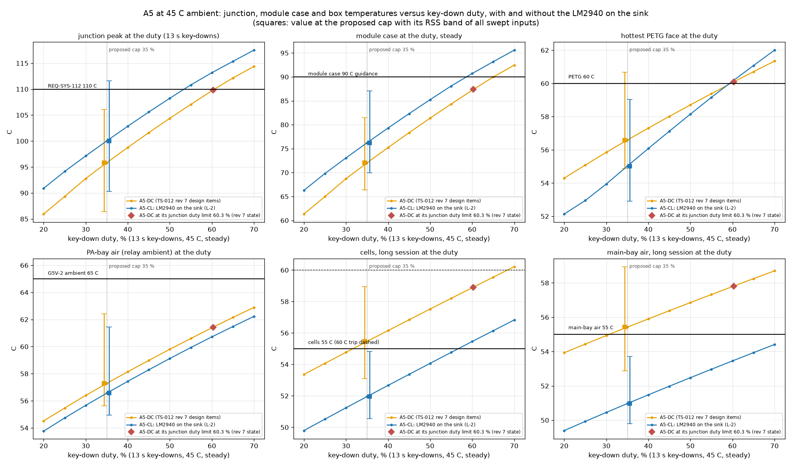
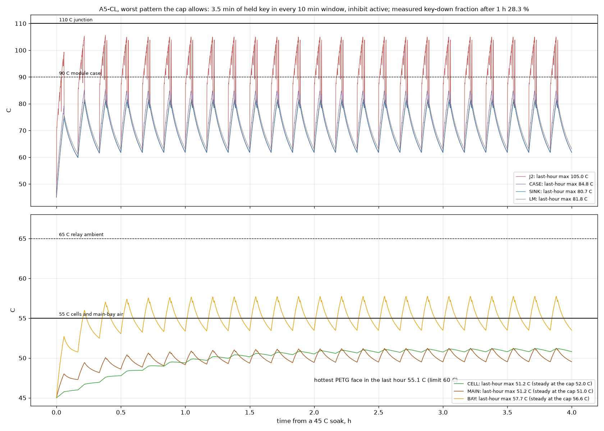
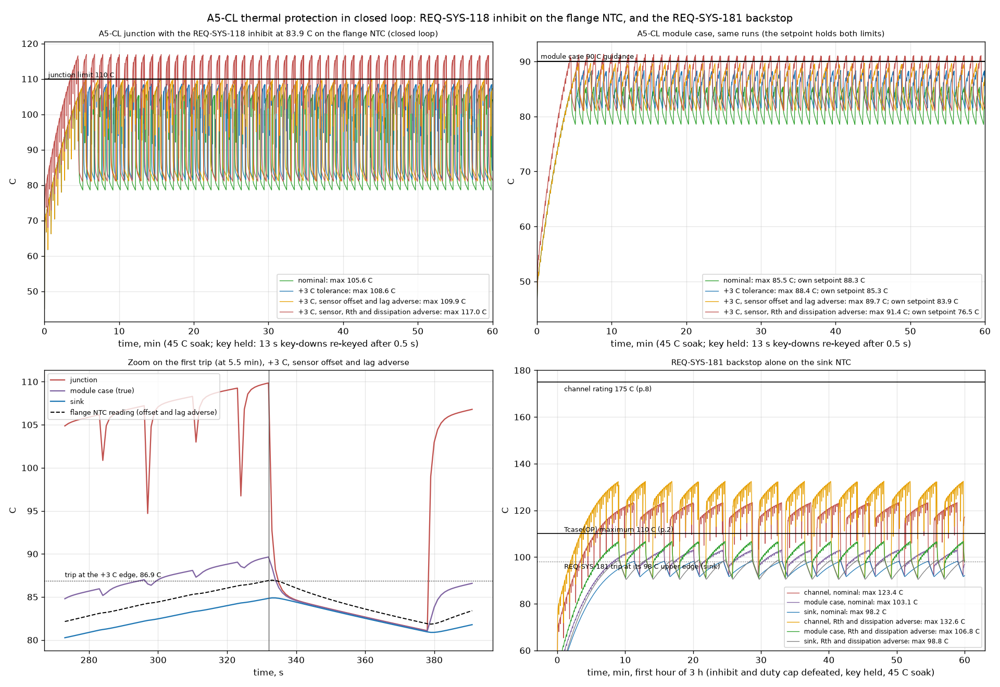
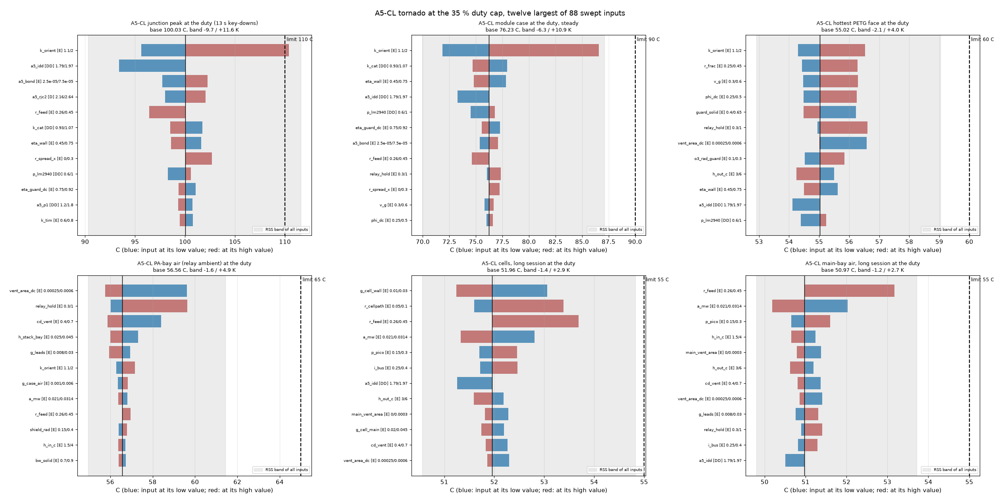
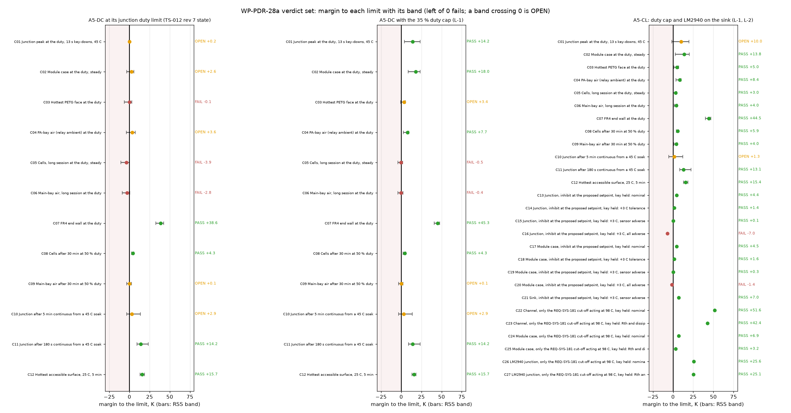
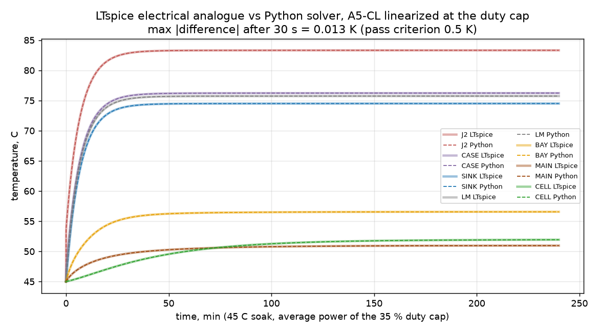

# Thermal budget of A5: closure of the open thermal items (WP-PDR-28a)

| Field | Value |
|---|---|
| Product | `docs/design/analysis/thermal-budget.md` (analysis note, thermal budget of the chosen design A5), revision 0. This is the file REQ-SYS-112's verification note names ("thermal resistance chain analysis junction to ambient in docs/design/analysis/thermal-budget.md") and the output file of WP-PDR-28 |
| Work package | WP-PDR-28a, stage 1 of the rule C11 loop 28a → 27 → 28b (PDR work plan revision 6, section 3.0 row 28): the open thermal items of TS-012 revision 7 section 10 condition 3, on the D-1 to D-6 geometry of TS-012 section 8.14 and the CR-003 revision 4 text (`114b68f`) |
| Authorization | Owner, status note 2026-09-29 section 5 (design A5) and section 8 (OD-01: "Start things as soon as they're able to be started") |
| Author | Claude, analysis author invocation, 2026-09-29 |
| Model and checker | `hardware/sim/thermal/a5_closure.py` (new: the 28a levers, cases, verdict set, plots, LTspice analogue and checker). It imports `thermal_model.py` and `ts012_thermal.py` of the TS-012 thermal note **unchanged**: both are frozen product files of INSP-112, so every 28a change is made on the network that `thermal_model.build("A5-DC", ...)` returns, never in the builder (section 2). Checker: `.venv/bin/python hardware/sim/thermal/a5_closure.py --check` re-runs everything and compares the two generated blocks of this note (sections 5 and 6) line by line with the computed ones, and the LTspice cross-check with 0.5 K; it prints every difference and exits 1 on any |
| Run | `hardware/sim/thermal/results/2026-09-29-a5-closure-r1/` (results file `results.md`; block README `results/2026-09-29-a5-closure-r1/README.md`). The TS-012 note's runs `2026-09-28-ts012-r1` and `-r2` and its block README `hardware/sim/thermal/README.md` (frozen INSP-112 product files) are not touched; the run README documents the new runner |
| Review record | To be created by the lead SE: `docs/reviews/PDR/checklists/analysis-thermal-budget.md` (plan WP-PDR-28 "Record"), analysis checklist, with the INSP number the lead SE assigns. The record is APPROVED before S1 (rule C10), because CR-018 carries REQ-SYS-112 and 118 |
| Evidence status | **Developer evidence.** numpy 2.5.3, matplotlib 3.11.2 and spicelib 1.6.3 are class B tools of `tools/toolchain.lock.md` section 2 without a TV record; LTspice 26.0.2 is accredited (TV-014). Every temperature below is an **ESTIMATE** from the lumped model of `thermal-ts012.md` (reviewer APPROVED, INSP-112 iteration 2), which has no bench correlation yet. 124 inputs (the 112 of the TS-012 note and 12 added here) are in `inputs.csv` with class D, DD, R or E; 88 are swept by the tornado on A5-CL, and 86 on the two A5-DC layouts, where the two ranged LM2940 inputs have no effect |
| AT RISK | AT RISK (A5 CRs), rule C13: CR-003 revision 4 and CR-018 are not dispositioned. REQ-SYS-112, 113, 118 and 181 carry TBR values. The PA dissipation is the TS-012 section 7.3 estimate (9.94 W at the corner); the WP-PDR-21 and 22 runs may move it. The PETG heat-deflection temperature is a typical value (filament datasheet not read) |

## 1. Purpose, scope and pass rule

The owner chose A5 on 2026-09-29. TS-012 section 10 condition 3 left four thermal items open, from `thermal-ts012.md` section 4.3 (A5-DC, the layout with the design items D-1 to D-5):

| Plan item (WP-PDR-28a) | Open value | Limit |
|---|---|---|
| (1) Cells, long session at the duty limit | 58.9 C | 55 C (TS-012 7.3 (a), extended); 60 C cell trip |
| (2) Hottest PETG face at the duty limit | 60.1 C (bulkhead, bay side) | 60 C (TS-012 7.3 (c)) |
| (3) Module case, continuous key-down | 105.7 C | 90 C (Mitsubishi long-term guidance) |
| (4) PA-bay air, continuous key-down (relay ambient), with D-5 | 67.1 C | 65 C (Omron G5V-2 ambient rating) |

The plan adds three more items:
- (5) the REQ-SYS-118 NTC on the flange contact face (about 81 C in D-6) and the firmware duty limit of D-6;
- (6) the REQ-SYS-112 duty-limited corner values for CR-018;
- (7) the bench plan for the in-situ sink (at most 5.6 K/W in the TS-012 note) and for the NTC offset, before first on-air use.

**Pass rule (plan).** Every item is inside its limit with a no-cost or gate-affordable change. Otherwise the item goes to the owner, at S1 if it changes CR-018 or at S2 otherwise, and never as an L1 lien (TS-012 section 10 revisit (d)). This note uses the verdict words of the TS-012 note:
- **PASS**: the value plus its RSS band is within the limit;
- **OPEN**: the nominal value is within the limit, but the band crosses it, so the case is not shown to pass;
- **FAIL**: the nominal value exceeds the limit.

"Closed" in section 7 means PASS, or OPEN only on inputs that a named bench measurement replaces before first on-air use, with its acceptance value stated.

**Not in scope.** 28b (after WP-PDR-27) re-runs this closure on the TS-011 re-score outline and the scripted test-finger set. The case wall areas here are still the TS-012 section 8.5 envelope values, with their +/-20 % band.

## 2. Method

**Model reused, not changed.** The network, inputs, solvers and post-processing are those of `thermal-ts012.md` sections 2 and 3 (INSP-112 APPROVED). `a5_closure.py` calls `thermal_model.build("A5-DC", t_amb, v)` and then edits the returned network for the levers below. Two checks confirm this:
- the A5-DC values of this run that do not depend on the duty limit equal those of run `2026-09-28-ts012-r2` with their bands (C08 to C12 against V14, V15, V03, V04 and V07: 50.7, 55.0, 107.1, 95.9 and 32.3 C). The duty-limited values differ slightly (cells 59.0 against 58.9 C) because the duty limit is now bisected (60.3 %) instead of read on the 5 % grid (60 %);
- the model files in `results/.../scripts/` have the SHA-256 that the TS-012 note's README records (`54b5ecf4...3e66e0`, `09cf75ef...b97ce0`).

**Three layouts** (each is A5-DC of the TS-012 note plus the listed changes):

| Layout | What it is | Duty at which the box is evaluated |
|---|---|---|
| A5-DC/DL | A5-DC as TS-012 revision 7 left it | its junction duty limit (the largest duty whose junction peak holds 110 C), **re-found by bisection for every input value** of the tornado. This is the fix of INSP-112 finding-15: revision 1 held the duty at 60 % while the inputs moved |
| A5-DC/CAP | A5-DC with lever L-1 only | the firmware duty cap, 35 % |
| A5-CL | A5-DC with L-1 and L-2: **the proposed design** | the firmware duty cap, 35 % |

**Levers examined** (none has a listed-price line):

| Lever | What it is | Carried |
|---|---|---|
| L-1, firmware duty cap | A new key-down at the 5 W step is refused while the key-down time in the last 10 min would exceed 35 % of it (3.5 min in any 10 min window). The cap is a firmware constant, so the box is evaluated at a fixed duty, whatever the inputs | yes |
| L-2, LM2940 on the sink | The LM2940CT-5.0 is already a TO-220 part (TS-012 row 25). Its tab, which is its ground pin 4 (TI SNVS769J p.3), is screwed to the Boyd sink's inner channel beside the module; the module flange is the module ground ("GND (FIN)", RA07M1317M datasheet p.1), so no insulator is needed. Its 0.8 W then leaves the main bay: the model moves the LM2940 source from MAIN to a new node LM, tied to the sink through RthJC(bot) 1.1 C/W (SNVS769J p.5) and a tab joint of 0.6 K/W (0.4 to 1.0, E) | yes |
| L-3, larger main-bay slots (3 or 6 cm2) | In the exploration, 6 cm2 lowers the cells by 1.4 K at the duty limit; 3 cm2 is the top of the D-4 input range | no: small effect, and the slot area is an IPX2 item for WP-PDR-27 |
| L-4, FR4 bay-side bulkhead wall | It would take the hottest PETG face (the bulkhead's bay side, 60.1 C) out of the PETG criterion | no: with L-1 and L-2 the bulkhead's bay side is 54.5 C and no longer the hottest face |

**Why a duty cap, and why this value.** A5 puts about 9.9 W into a closed PETG box. The main bay also holds 2.1 W of regulator, feed and processor heat. Two facts from the TS-012 note set the approach:
- the REQ-SYS-118 inhibit bounds the junction and the module case at any key pattern, but it lets the average duty rise to about 60 % at 45 C;
- the box (cells, main-bay air, PETG faces, PA-bay air) follows the average duty, not the junction.

A cap bounds the average duty directly. The value comes from the swept duty (`cl_box_vs_duty.png`). 35 % is the largest 5 % step at which every box criterion of A5-CL is PASS with its band. At 40 % the cells (52.7 C, band +3.2 K) and the PETG face (56.1 C, band +4.0 K) are OPEN (author exploration of this run's model; `duty_sweep.csv` has the nominal values). The window of 10 min is an author value (class R here, proposed). It is long enough for ordinary CW:
- an over of a few minutes at 40 to 50 % element duty stays under 3.5 min of key-down time;
- a QSO alternates transmit and receive.

It is short compared with the cells' time constant (about 30 min), so the box sees the average. The worst pattern the cap allows is simulated explicitly (section 4.1).

**New REQ-SYS-118 sensor placement (D-6).** D-6 puts the NTC "on the flange contact face". The 19.2 x 7.4 mm contact face lies under the module body, and the RA07M1317M datasheet asks for a sink flat within 50 um under the flange (p.8). A pocket in the web under the flange is therefore not proposed. The placement modelled is the flange top at the body end, between the screw slot and the body. The reading follows reading = case - f x (case - sink):
- f = 0.20 (0.05 to 0.40, E), where the TS-012 note's ear-screw placement had 0.5 (0 to 1);
- time constant 5 s (3 to 10 s, E) for a Semitec 103AT-2 bonded with thermal epoxy.

**Cases run** (`a5_closure.py`):
1. For each layout: the junction peak at its duty (periodic steady state, 13 s key-downs, the longest REQ-SYS-055 allows); the module case, PETG faces, FR4 end wall, PA-bay air, main-bay air and cells at steady state at that duty; the TS-012 (a) case (50 % for 30 min from a 45 C soak); the junction at 180 s and 300 s of continuous key-down from a 45 C soak (HZ-003 K10 and K7); the hottest accessible surface at 25 C after 5 min (REQ-SYS-113).
2. A one-at-a-time tornado over the ranged inputs (88 for A5-CL, 86 for the A5-DC layouts) for every metric and layout, with RSS bands. For A5-DC/DL the duty limit is re-found for each input value.
3. **The REQ-SYS-118 inhibit in closed loop** on the flange NTC (offset, lag, 0.15 s response, 5 C re-arm hysteresis), with the key held for 60 min from a 45 C soak. Four cases:
   - nominal;
   - the +3 C tolerance;
   - the tolerance with the sensor offset and lag at their adverse ends (**governing case**, as in the TS-012 note);
   - all of that plus Rth(ch-case) +10 %, the adverse bond line, the low stage-1 share and a bench supply (no feed drop, 10.95 W).
   For each, the largest setpoint on a 0.1 C grid that holds **both** the junction at 110 C and the module case at 90 C is found by bisection, and the next 0.1 C up is confirmed to fail. The governing case's value is the proposal; all four cases are then re-run at it.
4. **The REQ-SYS-181 backstop alone** (inhibit and cap defeated, key held 3 h): the sink NTC trips at the 98 C upper edge of 95 C +/-3 C and re-arms below 98 C less 5 C (comparator hysteresis, E, 3 to 10 C). Nominal and adverse.
5. **The worst pattern the cap allows**: in every 10 min window, one 3.5 min burst of held key (13 s key-downs re-keyed after 0.5 s), then silence, with the inhibit active at the proposed setpoint; 4 h from a 45 C soak.
6. The D-6 alternative duty limit S on a sink NTC, recomputed with the LM2940 heat and floored to 0.1 C (INSP-112 finding-16 item (e)).
7. **Bench acceptance of the in-situ sink**: the sink-to-air path (orientation derate k_orient, which scales the whole catalog conductance) is swept from 0.9 to 2.6. At each point the bench coupon is modelled: the A5-CL network at 25 C with every source removed and 5.0 W or 10.0 W on the sink. The accepted resistance is the one at which the junction peak at the cap plus the band of the inputs the bench does *not* replace reaches 110 C, or the case plus its band reaches 90 C, whichever comes first. The inputs the bench replaces are listed in `a5_closure.py` `SINK_PATH`: the catalog curve, orientation, guard, plume, radiation, end-wall gap and sink mass inputs.
8. The LTspice electrical analogue of the A5-CL network, linearized at the cap, run through `tools/ltspice-batch.sh` and compared node by node with the Python solver.

## 3. Inputs added by this note

The full list is `results/2026-09-29-a5-closure-r1/inputs.csv` (column `added_by_28a`). The 112 inputs of the TS-012 note are unchanged.

| Input | Value (range) | Class | Source |
|---|---|---|---|
| Duty cap | 35 % of any 10 min window | R (proposed here) | section 2 |
| Flange NTC offset fraction f | 0.20 (0.05 to 0.40) | E | placement at the body end of the flange top (section 2) |
| Flange NTC time constant | 5 s (3 to 10) | E | 103AT-2 bonded with thermal epoxy; no bench value yet |
| LM2940 RthJC(bot), TO-220 | 1.1 C/W | D | TI SNVS769J (revised December 2014) p.5, thermal information table |
| LM2940 operating junction | -40 to 125 C | D | same, p.4, recommended operating conditions (absolute maximum 150 C) |
| LM2940 tab to sink | 0.6 K/W (0.4 to 1.0) | E | TO-220 tab with compound and one M3 screw |
| LM2940 heat capacity | 2 J/K (1.5 to 3) | E | TO-220 body and tab |
| REQ-SYS-181 sink NTC time constant | 10 s (5 to 20) | E | 103AT-2 on the web with compound |
| REQ-SYS-181 comparator hysteresis | 5 C (3 to 10) | E | value not yet set (WP-PDR-37) |
| RA07M1317M Tcase(OP) | -30 to +110 C | D | RA07M1317M datasheet, Jun 2019, p.2 (maximum ratings) |
| RA07M1317M channel | 175 C maximum rating | D | same, p.8: "The 175°C maximum rating for the channel temperature ensures application under derated conditions" |
| RA07M1317M case guidance | "it is best to keep the module case temperature (Tcase) below 90°C" | D | same, p.8 ("For long-term reliability") |

The datasheet pages were read for this note on 2026-09-29: the Mitsubishi PDF at https://www.mitsubishielectric.com/semiconductors/hf/products/datasheet/ra07m1317m.pdf (pp.1, 2 and 8) and https://www.ti.com/lit/ds/symlink/lm2940-n.pdf (SNVS769J pp.3 to 5). This also answers INSP-112 finding-17 item (3): the RA07M1317M ratings are now cited to their pages. Note that p.2 gives no channel rating in its table; the 175 C figure is on p.8.

## 4. Results

All values are estimates. The verdict words are those of the section 5 block. Each value is rounded up to 0.1 C there, toward the limit.

### 4.1 The box at the duty: items (1), (2) and (4)

| At 45 C ambient | Limit | A5-DC at its duty limit (60.3 %) | A5-DC, 35 % cap | A5-CL, 35 % cap |
|---|---|---|---|---|
| Cells, long session | 55 C | 59.0 C FAIL | 55.5 C FAIL | **52.0 C PASS** (+2.9 K band) |
| Main-bay air, long session | 55 C | 57.9 C FAIL | 55.5 C FAIL | **51.0 C PASS** (+2.8 K) |
| Hottest PETG face | 60 C | 60.1 C FAIL (bulkhead) | 56.6 C OPEN | **55.1 C PASS** (+4.1 K; the guard) |
| PA-bay air (relay ambient) | 65 C | 61.5 C OPEN | 57.3 C PASS | **56.6 C PASS** (+4.9 K) |

Reading:
- **The cap alone does not close the cells.** A5-DC at 35 % still has 55.5 C cells and main-bay air, because 0.8 W of the main bay's 2.1 W is the LM2940, which runs whatever the duty. Even at 20 % the A5-DC cells are 53.4 C.
- **L-2 is what closes the cells.** With the LM2940 on the sink, the main bay loses its largest constant source. The cells fall by 3.5 K at 35 % and are PASS with their band.
- The price of L-2 is on the sink. At the same duty the junction is 4.2 K higher (100.1 against 95.9 C), and the module case 4.2 K higher (76.3 against 72.1 C). Both stay inside their limits at the cap (section 4.2).
- **Item (4), relay ambient.** Continuous key-down cannot be sustained under the proposed protection, so 67.1 C is not reachable (section 4.2). At the cap the PA-bay air is 56.6 C, PASS with its band. The band includes the relay hold ratio up to 1.0, the case where the D-5 PWM hold does not work and the coil runs at full power. So the relay ambient does not depend on D-5 at the cap. D-5 stays as a free reduction of the LM2940 current.
- **The worst pattern the cap allows** (`cl_cap_pattern.png`): 3.5 min bursts of held key every 10 min, with the inhibit cutting some of them. The key-down fraction after the first hour is 28.3 %. Over the last hour:
  - cells 51.2 C, main-bay air 51.3 C, PA-bay air 57.8 C;
  - hottest PETG face 55.2 C;
  - junction 105.0 C, module case 84.9 C.
  The 10 min bursts ripple the fast nodes (bay air by about 4 K), but none passes the steady value at the cap by more than 1.2 K. Every value stays inside its limit.

**INSP-112 finding-15 restated.** With the duty limit re-found for every input value, A5-DC's long-session cells at the duty limit are 59.0 C (+6.6 K band) instead of 58.9 C (+5.0 K). The duty limit itself moves by +27 / -21 percentage points across the inputs (`results.md`). This is why the box is evaluated here at a fixed firmware cap, where holding the duty fixed in the tornado is exact, not an approximation.

### 4.2 Module case, inhibit setpoint and backstop: items (3) and (5)

**Item (3), module case.** The 105.7 C value (107.5 C for A5-CL) is continuous key-down with no protection acting. Under the proposed protection it is not reachable:
- **At the cap:** 76.3 C, PASS with its band (+10.9 K).
- **Under the REQ-SYS-118 inhibit, key held for an hour:** at most 89.8 C in the governing case (sensor offset and lag adverse, +3 C tolerance). This is because the setpoint is chosen to hold both 110 C at the junction and 90 C at the case. The case limit binds first: the junction is 20.3 K above the case at 9.94 W.
- **With only the REQ-SYS-181 backstop acting** (firmware hung with the key held): at most 103.2 C nominal and 106.9 C adverse. Both are over the 90 C long-term guidance, which is a firmware-fault case of limited duration, and inside the 110 C Tcase(OP) rating of p.2. The channel is at most 123.4 C and 132.6 C against its 175 C rating.

**Item (5), REQ-SYS-118 setpoint.**
- With the NTC at the body end of the flange, the largest setpoint that holds both limits in the governing case is **83.9 C** at the NTC. The TS-012 note gave about 81 C for the ear-screw placement, which reads further below the case. The requirement value proposed is **83 C +/-3 C** (the largest whole degree at or below 83.9 C).
- At 83.9 C the cases give:

  | Case | Junction | Module case |
  |---|---|---|
  | Nominal | 105.7 C | 85.5 C |
  | +3 C tolerance | 108.7 C | 88.4 C |
  | +3 C, sensor offset and lag adverse (governing) | 110.0 C (109.93) | 89.8 C |
  | +3 C, all inputs adverse | 117.1 C, **FAIL** | 91.4 C, **FAIL** |

- The all-adverse stack needs **76.5 C**. It combines the sensor ends with Rth +10 %, the thick bond line and a bench supply with no feed drop. It is not the proposal. It is the value the bench rule of section 8 falls back to if the bench shows the adverse terms. This is the same position as the TS-012 note (its V22 FAIL at 85 C). The FAIL rows stay in the verdict set.
- In the governing case the sink peaks at 85.0 C, under the 92 C lower edge of REQ-SYS-181. So the backstop never acts in protected use, and the two layers stay in the order REQ-SYS-181's rationale requires (firmware acts first).
- The LM2940 junction is at most 86.1 C under the inhibit and 100.0 C with only the backstop acting, against its 125 C operating limit (the continuous unprotected sink would put it at 103.7 C).

**D-6 alternative (firmware duty limit on a sink NTC).** Recomputed with the LM2940 heat and floored: S = 82.2 C, **79.2 C as programmed** after the +3 C tolerance. This replaces the TS-012 note's 79.4 C, which was rounded up (finding-16 item (e)) and did not include the LM2940. Not recommended for A5:
- TS-012 revision 8 section 8.1 wires the sink NTC to the LM393 #1 comparator of REQ-SYS-181, routed apart from the ADC path; the firmware reads the flange NTC and the cell NTC;
- S alone does not bound the box: the duty it allows moves with the inputs (finding-15).

The flange-NTC inhibit together with the duty cap does both jobs.

**HZ-003 K7 and K10 (continuous key-down from a soak, no protection counted).** At 5 min the junction is 108.8 C (+6.6 K band), OPEN. That is 1.7 K higher than A5-DC because of L-2. At 180 s it is 97.0 C, PASS. The K7 case is bounded in the radio by the inhibit: the closed loop holds 110 C from the soak, and its first trip comes at 5.5 min in the governing case. The duty cap also allows at most 3.5 min of continuous key-down.

### 4.3 Surfaces, FR4, and what L-2 costs elsewhere

- **REQ-SYS-113 (accessible surfaces, 25 C, 5 min):** the guard's outer face is 32.7 C (+2.6 K), PASS, against 48 C. L-2 adds 0.4 K.
- **FR4 end wall at the cap:** 60.5 C, PASS against its 105 C design limit.
- **TS-012 (a), 50 % duty for 30 min** (not allowed by the cap beyond 3.5 min in 10; computed as TS-012 states it): cells 49.2 C and main-bay air 51.0 C, both PASS. Without L-2 the main-bay air was 55.0 C, OPEN.

What drives the remaining bands of A5-CL (`bands.csv`):
- **Junction peak at the cap:** +11.6 K. The largest single swing is the sink orientation derate (10.4 K), then the module current (6.6 K) and the feed resistance (3.6 K).
- **Cells:** +2.9 K, from the feed resistance (1.7 K), the cell-path resistance (1.4 K) and the cell-to-wall coupling (1.1 K).
- **PETG face:** +4.1 K, from the relay hold ratio (1.6 K), the PA-bay slot area (1.6 K) and the orientation derate (1.5 K).
- **PA-bay air:** +4.9 K, from the relay hold ratio (3.1 K) and the PA-bay slot area (3.0 K). With the hold ratio at 1.0 (PWM hold not working) the bay air is 59.7 C, still inside 65 C.

### 4.4 Margins with their bands

### 4.5 Solver cross-check

The A5-CL network, frozen at its steady state at the 35 % cap, is written as an LTspice netlist (`ltspice/thermal_a5cl.net`) and run through the wrapper for 4 h with the cap's average power. The result is in `results.md` ("LTspice cross-check"): LTspice 26.0.2, exit 0, deck SHA-256 `d8c42384...2823e59`, largest node difference to the Python solver after 30 s **0.013 K** against the 0.5 K criterion, PASS; the J2 node at 14400 s is 83.31 C in both. This checks the solver and the network edits of L-2 (the LM node), not the physics.

## 5. Verdict set

Every value comes from the run and is rounded up to 0.1 C. `+band` is the RSS of the one-at-a-time rises of the ranged inputs (`bands.csv`; 88 for A5-CL, 86 for the A5-DC layouts). C13 to C27 are explicit closed-loop cases and carry no band. The block is generated by the runner; `a5_closure.py --check` fails if it differs by one character.

<!-- a5-closure-verdicts:begin (generated by a5_closure.py; checked by --check) -->

| Id | Criterion (basis) | Limit, C | A5-DC/DL | A5-DC/CAP | A5-CL |
|---|---|---|---|---|---|
| C01 | Junction peak at the duty, 13 s key-downs, 45 C (REQ-SYS-112 delta (proposed corner)) | 110 | 109.9 +0.9 **OPEN** | 95.9 +10.3 **PASS** | 100.1 +11.6 **OPEN** |
| C02 | Module case at the duty, steady (RA07M1317M p.8 long-term guidance) | 90 | 87.4 +6.1 **OPEN** | 72.1 +9.5 **PASS** | 76.3 +10.9 **PASS** |
| C03 | Hottest PETG face at the duty (TS-012 7.3 (c)) | 60 | 60.1 +6.4 **FAIL** | 56.6 +4.1 **OPEN** | 55.1 +4.1 **PASS** |
| C04 | PA-bay air (relay ambient) at the duty (G5V-2 ambient rating) | 65 | 61.5 +7.5 **OPEN** | 57.3 +5.2 **PASS** | 56.6 +4.9 **PASS** |
| C05 | Cells, long session at the duty, steady (TS-012 7.3 (a), extended) | 55 | 59.0 +6.6 **FAIL** | 55.5 +3.5 **FAIL** | 52.0 +2.9 **PASS** |
| C06 | Main-bay air, long session at the duty (TS-012 7.3 (a), extended) | 55 | 57.9 +6.1 **FAIL** | 55.5 +3.6 **FAIL** | 51.0 +2.8 **PASS** |
| C07 | FR4 end wall at the duty (design limit (E)) | 105 | 66.4 +6.1 **PASS** | 59.8 +4.3 **PASS** | 60.5 +4.6 **PASS** |
| C08 | Cells after 30 min at 50 % duty (TS-012 7.3 (a)) | 55 | 50.7 +2.0 **PASS** | 50.7 +2.0 **PASS** | 49.2 +1.8 **PASS** |
| C09 | Main-bay air after 30 min at 50 % duty (TS-012 7.3 (a)) | 55 | 55.0 +3.5 **OPEN** | 55.0 +3.5 **OPEN** | 51.0 +3.1 **PASS** |
| C10 | Junction after 5 min continuous from a 45 C soak (HZ-003 K7) | 110 | 107.1 +6.5 **OPEN** | 107.1 +6.5 **OPEN** | 108.8 +6.6 **OPEN** |
| C11 | Junction after 180 s continuous from a 45 C soak (HZ-003 K10) | 110 | 95.9 +5.0 **PASS** | 95.9 +5.0 **PASS** | 97.0 +5.0 **PASS** |
| C12 | Hottest accessible surface, 25 C, 5 min (REQ-SYS-113 (TBR)) | 48 | 32.3 +2.5 **PASS** | 32.3 +2.5 **PASS** | 32.7 +2.6 **PASS** |
| C13 | Junction, inhibit at the proposed setpoint, key held: nominal (REQ-SYS-118, HZ-003 K2) | 110 | - | - | 105.7 **PASS** |
| C14 | Junction, inhibit at the proposed setpoint, key held: +3 C tolerance (REQ-SYS-118, HZ-003 K2) | 110 | - | - | 108.7 **PASS** |
| C15 | Junction, inhibit at the proposed setpoint, key held: +3 C, sensor adverse (REQ-SYS-118, HZ-003 K2) | 110 | - | - | 110.0 **PASS** |
| C16 | Junction, inhibit at the proposed setpoint, key held: +3 C, all adverse (REQ-SYS-118, HZ-003 K2) | 110 | - | - | 117.1 **FAIL** |
| C17 | Module case, inhibit at the proposed setpoint, key held: nominal (REQ-SYS-118, HZ-003 K2) | 90 | - | - | 85.5 **PASS** |
| C18 | Module case, inhibit at the proposed setpoint, key held: +3 C tolerance (REQ-SYS-118, HZ-003 K2) | 90 | - | - | 88.4 **PASS** |
| C19 | Module case, inhibit at the proposed setpoint, key held: +3 C, sensor adverse (REQ-SYS-118, HZ-003 K2) | 90 | - | - | 89.8 **PASS** |
| C20 | Module case, inhibit at the proposed setpoint, key held: +3 C, all adverse (REQ-SYS-118, HZ-003 K2) | 90 | - | - | 91.4 **FAIL** |
| C21 | Sink, inhibit at the proposed setpoint, key held: +3 C, sensor adverse (REQ-SYS-181 92 C lower edge) | 92 | - | - | 85.0 **PASS** |
| C22 | Channel, only the REQ-SYS-181 cut-off acting at 98 C, key held: nominal (RA07M1317M p.8 rating) | 175 | - | - | 123.4 **PASS** |
| C23 | Channel, only the REQ-SYS-181 cut-off acting at 98 C, key held: Rth and dissipation adverse (RA07M1317M p.8 rating) | 175 | - | - | 132.6 **PASS** |
| C24 | Module case, only the REQ-SYS-181 cut-off acting at 98 C, key held: nominal (RA07M1317M p.2 Tcase(OP)) | 110 | - | - | 103.2 **PASS** |
| C25 | Module case, only the REQ-SYS-181 cut-off acting at 98 C, key held: Rth and dissipation adverse (RA07M1317M p.2 Tcase(OP)) | 110 | - | - | 106.9 **PASS** |
| C26 | LM2940 junction, only the REQ-SYS-181 cut-off acting at 98 C, key held: nominal (TI SNVS769J p.4) | 125 | - | - | 99.5 **PASS** |
| C27 | LM2940 junction, only the REQ-SYS-181 cut-off acting at 98 C, key held: Rth and dissipation adverse (TI SNVS769J p.4) | 125 | - | - | 100.0 **PASS** |

<!-- a5-closure-verdicts:end -->

## 6. Proposed values

The block is generated by the runner and checked like section 5, so no proposed value is transcribed by hand (INSP-112 finding-16).

<!-- a5-closure-values:begin (generated by a5_closure.py; checked by --check) -->

| Item | Proposed value (A5-CL) | Basis in this run |
|---|---|---|
| Firmware key-down duty cap (REQ-SYS-112 corner) | at most 35 % key-down time in any rolling 10 min window | junction peak 100.1 C and every box criterion within its limit at 35 % (C01 to C06); worst burst pattern under the cap: cells 51.2 C, PETG 55.2 C |
| REQ-SYS-118 threshold at the flange NTC (as programmed, the +3 C tolerance above it) | 83.9 C | largest 0.1 C value holding the junction at 110 C and the case at 90 C, key held, sensor offset and lag adverse (C15, C19: 110.0 C, 89.8 C) |
| REQ-SYS-118 threshold if every input is adverse (for the bench rule) | 76.5 C | the all-adverse stack of C16 and C20 |
| D-6 alternative, sink-NTC duty limit S (to program, +3 C taken off) | 79.2 C (S = 82.2 C) | 13 s key-down from S holds 110 C; floored |
| REQ-SYS-181 cut-off | 95 C +/-3 C on the sink, 100 ms: confirmed | channel, case and LM2940 with only the cut-off acting (C22 to C27) within 175 C, 110 C and 125 C |
| In-situ sink acceptance (bench, 5.0 W on the web, 25 C room) | at most 8.03 K/W (model nominal 6.77) | junction peak plus the non-sink band at 110 C, case plus its band at 90 C |
| In-situ sink acceptance (bench, 10.0 W) | at most 6.42 K/W (model nominal 5.58) | same, read at 10 W |

<!-- a5-closure-values:end -->

## 7. Closure of the items

| Item | Before (TS-012 note, A5-DC) | After (A5-CL, this note) | State | Route |
|---|---|---|---|---|
| (1) Long-session cells | 58.9 C FAIL at the 60 % duty limit | 52.0 C, band +2.9 K, **PASS** at the 35 % cap; 51.2 C under the worst cap pattern | **Closed** by L-1 and L-2 (no cost: firmware and the existing TO-220 part) | The cap is a REQ-SYS-112 condition and a new firmware behaviour, so CR-018 carries it to the **owner at S1** (section 9) |
| (2) PETG face at the duty limit | 60.1 C FAIL (bulkhead, bay side) | 55.1 C, band +4.1 K, **PASS** (the guard is now the hottest face) | **Closed** by L-1 and L-2 | With the item (1) question. CR-003 revision 4 Q4 (filament): the CR-003 5 K rule asks a heat-deflection temperature of at least 60.1 C (64.2 C with the band); typical PETG is 69 C, confirmed by the filament datasheet read (section 8 item 4) |
| (3) Module case | 105.7 C continuous, no protection | 76.3 C at the cap (PASS); at most 89.8 C under the inhibit, key held (governing case); 106.9 C at most with only the backstop acting, inside the 110 C Tcase(OP) rating | **Closed** by the inhibit setpoint (item 5), which is chosen on the case limit as well as the junction limit | S1 with the REQ-SYS-118 value |
| (4) Relay ambient | 67.1 C continuous | 56.6 C at the cap (PASS, the band includes a failed PWM hold); at most 59.6 C under the inhibit, key held | **Closed**; not dependent on D-5 | none beyond item (1) |
| (5) REQ-SYS-118 NTC and D-6 duty limit | about 81 C (ear screw), or S = 79.4 C | **83 C +/-3 C** at the NTC on the flange top at the body end (83.9 C computed, governing case); all-adverse fallback 76.5 C; S = 79.2 C as programmed if the D-6 alternative is kept (not recommended) | **Closed as an analysis**; the offset and lag are E inputs that the bench measures (section 8 item 2), with a rule that lowers the setpoint if they are worse | CR-018 row for REQ-SYS-118 to the **owner at S1**; ADR per the REQ-SYS-118 TBR plan |
| (6) REQ-SYS-112 corner values | "duty-limited corner" not yet valued | 35 % in 13 s key-downs at 45 C, 5 W step: junction peak 100.1 C, band +11.6 K, **OPEN**; the band without the sink-path inputs, which the in-situ measurement replaces, is +4.3 K, so C01 is PASS (104.4 C) once the sink is accepted | **Closed, pending the bench acceptance** of item (7); the junction is also bounded by the inhibit (C13 to C15) | CR-018 row for REQ-SYS-112 to the **owner at S1** (section 9) |
| (7) Bench plan | in-situ sink at most 5.6 K/W (at 10 W), NTC offset | acceptance **at most 8.03 K/W at 5.0 W** (6.42 K/W at 10.0 W), model nominal 6.77 (5.58) K/W; NTC-offset and lag checks with a setpoint rule | **Stated** (section 8) | Owner bench session before first on-air use; needs the K-type thermometer of D-16 and its TV record |

Two points on this table:
- **The TS-012 note's in-situ figure.** The 5.6 K/W is the continuous 10 W value. At the 5 W that the cap puts into the sink on average, natural convection gives a higher resistance (6.77 K/W in the model), so the bench runs at both powers.
- **No item is left as an L1 lien.** Items (1), (5) and (6) change CR-018 and go to the owner at S1 as the plan requires. The owner may refuse the cap. Then item (1) is not closed (A5-DC/DL: 59.0 C cells), and the fallback is a lower-cost change the owner prefers, such as a lower cap, or accepting long-session cells up to the 60 C trip. That choice is hers.

## 8. Bench plan before first on-air use (item 7)

Instrument: the stand-alone K-type thermocouple thermometer with a bead probe of D-16. The owner's Fluke 174 has no temperature input. The thermometer needs its TV record and known-answer check before its first credited use (04 section 6.3, OQ-VV-003). Room at 20 to 28 C, still air, the radio lying flat as in the model (extrusion horizontal).

1. **In-situ sink (replaces the sink-path inputs; largest junction term).**
   - Set-up: a power resistor on the web of the actual Boyd part in the module's position, with compound, inside the printed wrap guard and the FR4 end-wall coupon of D-1 to D-3, extrusion horizontal.
   - Two runs: 5.0 W, and 10.0 W, each 45 min (the sink time constant is about 5 min). Record the sink web beside the resistor, the guard outer face and the room.
   - R = (T_sink - T_room) / P.
   - **Pass: R at most 8.03 K/W at 5.0 W and at most 6.42 K/W at 10.0 W** (section 6; `cl_bench_acceptance.png`). A pass turns C01 (junction at the cap) and the case margin into PASS on the remaining inputs.
   - A fail lowers the cap. Rerun `a5_closure.py` with the measured R, through k_orient, and re-read the largest passing duty. The inhibit still bounds the junction and the case, so a fail is a usability loss, not a safety loss.
2. **REQ-SYS-118 NTC offset and lag (replaces f and the time constant).**
   - Set-up: the assembled RF path with the module on the sink, keyed into the owner's 50 ohm dummy load at the 5 W step. The chosen 103AT-2 is bonded at the body end of the flange top, read through the UART telemetry (REQ-SYS-150). The K bead is on the sink web within 3 mm of the flange edge.
   - **Offset:** at a steady 35 % duty (13 s on, 24 s off, 45 min), record the NTC reading minus the sink bead, dR. The model gives dR = (1 - f) x P x R_if. The offset the setpoint allows for is f x P x R_if with f = 0.40, so the case-minus-reading offset inferred from the measurement is 0.40 / 0.60 x dR = 0.67 x dR. The measured dR, and a 25 to 75 um bond line (R_if 0.24 to 0.72 K/W), bound f.
   - **Lag:** fit a first-order time constant to the NTC rise over the first key-downs from cold, against the sink bead.
   - **Rule:** if f from the measurement is above 0.40, or the time constant is above 10 s, rerun `a5_closure.py` with the measured values and program the setpoint it gives. Otherwise the 83 C value stands. If neither can be measured, program 76 C (the all-adverse value 76.5 C floored).
3. **Relay hold (D-5):** the TS-012 bench check of the PWM hold current. It is not needed for the relay ambient at the cap (section 4.1), only for the LM2940 current.
4. **Filament:** read the heat-deflection temperature at 0.45 MPa on the owner's PETG datasheet. It must be at least 60.1 C (the CR-003 5 K rule on the 55.1 C face), and at least 64.2 C to cover the band.
5. **After assembly (TS-012 7.3 checks, unchanged):** thermocouple on the guard and case after 5 min at 25 C, and on a cell after 30 min of the cap pattern.

## 9. Requirement values for CR-018 (and what the TBR plans say)

Each TBR plan is quoted from `docs/requirements/sys/requirements.md` as it stands (INSP-112 finding-17 items 1 and 2).

| Requirement | TBR plan (quoted) | This note |
|---|---|---|
| REQ-SYS-112 | "TS-003 (device RthJC) and the thermal budget at PDR fix the limit and the condition; Robin approves in the PDR memo." | **Proposes the condition:** "The transceiver shall hold the PA junction at or below 110 C (TBR) during key-down at the 5 W step in 45 C ambient at up to 35 % (TBR) key-down duty in 13 s key-downs." Limit 110 C kept. Basis: C01 (100.1 C, OPEN on the sink path until the item 7 bench acceptance), C13 to C15 (inhibit bound). TS-003 is not written for A5 (plan section 3.0a); the RA07M1317M Rth(ch-case) is the datasheet value |
| New requirement (duty cap), for CR-018 | none (new) | **Proposes:** "The transceiver shall refuse key-down at the 5 W step while the key-down time in the preceding 10 min (TBR) would exceed 35 % (TBR) of it." Allocation: firmware (SW-SAFE thermal unit, WP-PDR-35). Basis: C02 to C06, the cap pattern. The owner decides whether this operating limit is acceptable. A lower power step could carry a higher cap; that is not analysed here |
| REQ-SYS-118 | "The PA thermal analysis at PDR fixes the threshold; the decision is recorded in an ADR and this TBR closes in the same CR." | **Proposes 83 C +/-3 C** at the flange NTC (body end of the flange top), 100 ms kept; the sensed point in the rationale changes from "the PA thermistor at the PA device on the board thermal pad" to the module flange; setpoint rule of section 8 item 2 |
| REQ-SYS-181 | "SRR decision 39 (owner ruling 2026-09-26) adopted 95 C +/-3 C and 100 ms; the PDR thermal analysis (REQ-SYS-112, TS-003) confirms them against the device rating, else they change by CR." | **Confirms 95 C +/-3 C and 100 ms on the sink** against the device ratings: with only the cut-off acting, the channel is at most 132.6 C against 175 C (p.8), the case at most 106.9 C against the 110 C Tcase(OP) (p.2), and the LM2940 at most 100.0 C against 125 C (C22 to C27). Its sensor is on the sink as the statement says (TS-012 D-6 revision 6 for A5). The thermal note's request R-3 is thereby answered for A5 |
| REQ-SYS-113 | "The thermal budget at PDR fixes the value; if the owner adopts IEC 62368-1 or ISO 13732-1 the value is re-based on it by CR; Robin approves in the PDR memo." | **Confirms 48 C** with the wrap guard (C12: 32.7 C, band +2.6 K). The IEC 62368-1 / ISO 13732-1 branch is **not triggered**: the owner has adopted neither (her input 1 set 48 C, CR-003). The accessible set is confirmed in 28b on the scripted test finger |
| REQ-SYS-155 | range pending the thermistor selection | No change from this note; the 103AT-2 at the flange reads 45 to 90 C in use, inside -20 to +150 C |

These values are not supported until this note's record is APPROVED (rule C10).

## 10. Design items and requests

**Design items for TS-012 section 8.14 or the A5 ADR** (proposals; this note edits neither):

| # | Item | Cost |
|---|---|---|
| D-6 (revised) | REQ-SYS-118 NTC (103AT-2, row E5 (e)) bonded on the flange top at the module body end, inside the 30 mm flange and outside the screw slot; setpoint 83 C +/-3 C, with the bench rule of section 8 item 2; REQ-SYS-181 NTC on the sink web (unchanged). The sink-NTC duty-limit alternative S = 79.2 C as programmed is not recommended | 0 |
| D-19 (new) | LM2940CT-5.0 tab screwed to the Boyd inner channel beside the module (tab = ground pin 4, no insulator), compound, one M3 screw and nut behind the web; its three leads through the FR4 end wall; the 22 uF output capacitor (ESR 0.1 to 1 ohm, SNVS769J p.15) and the input capacitor at its leads, on the RF board tongue or a spare-board piece | 0 (existing part; wire) |
| D-20 (new) | Firmware duty cap: 35 % of any 10 min window at the 5 W step (SW-SAFE thermal unit), with the inhibit as the independent junction and case bound | 0 |

**Mechanical findings for WP-PDR-27 and 37** (not changes made here):
- **M-4.** The inner channel is 17.02 mm wide and 63.5 mm long. The module flange takes 30 mm of its length, the RF-board tongue enters beside it (D-1), and the LM2940 TO-220 tab (10.16 mm wide, SNVS769J) needs about 15 mm of the rest. Check the layout. The LM2940 leads then cross the PA bay and the bulkhead to the main board: three more leads through the bulkhead (8 V in, 5 V out, ground). The 5 V output capacitor sits at the regulator.
- **M-5.** The NTC at the flange body end must not touch the module's plastic cap or stress the leads (datasheet p.8, construction a) and b)). Bond it with thermal epoxy after the module is screwed down and soldered.

**Requests to other writers** (this note edits none of their files):

| Id | To | Request |
|---|---|---|
| Q-1 | WP-PDR-53 (CR-018 author) | Rows for REQ-SYS-112 (condition), the new duty-cap requirement, REQ-SYS-118 (83 C +/-3 C, sensed point), REQ-SYS-181 (confirmed), REQ-SYS-113 (confirmed), with the section 9 bases; a section 12 question for the owner on the duty cap (what it means in use: at 45 C, 3.5 min of key-down in any 10 min at 5 W) and on the fallback if she refuses it |
| Q-2 | WP-PDR-16b (`hazards.json`) | HZ-003 K2: the sensed point is the flange, 83 C +/-3 C, and the case bound (90 C) is part of the setpoint; C4 "sensor reading low by its placement offset and lag", verified by section 8 item 2. HZ-003 K7: the 5 min case is 108.8 C, OPEN, bounded by the inhibit and the cap. K9: on the sink, as REQ-SYS-181, confirmed against the ratings. HZ-007 C5 and K5: cells 52.0 C at the cap with L-2, 51.2 C under the worst cap pattern. The thermal note's request R-1 on K1 (40 C against 45 C) stays open |
| Q-3 | WP-PDR-35 (SW-SAFE thermal unit) | The inhibit threshold, tolerance, hysteresis and response are one budget with the flange-NTC offset and lag (section 4.2); the duty cap (D-20) is a new SW-SAFE function; the bench setpoint rule of section 8 item 2 is a configuration item |
| Q-4 | WP-PDR-36a (pin map) | No new analog input: the flange NTC and the cell NTC are already on the ADC list of TS-012 section 8.1 |
| Q-5 | WP-PDR-27, 37 | D-19, M-4 and M-5; the D-6 NTC placement |
| Q-6 | WP-PDR-18 (risk register) | RSK-006: mitigation now the flange inhibit with the case bound, the duty cap and the in-situ sink acceptance. RSK-007: cells 52.0 C at the cap (PASS). The TS-012 note's requested entry for the PETG interior at the duty-limited corner can close on C02 to C06 once CR-018 carries the cap |
| Q-7 | WP-PDR-29 (budgets) | The section 5 block for the thermal summary; the LM2940 on the sink adds no mass |
| Q-8 | WP-PDR-28b | Re-run on the TS-011 outline: the main-case wall area (+/-20 % here), the bay walls, the slots, and the test-finger set for C12 |

## 11. Limitations

1. The lumped model and its limitations are those of `thermal-ts012.md` section 7, unchanged. There is no bench correlation yet, the sink-to-air path is estimated, and local hot spots are not resolved. For the LM2940 in particular, the model puts its heat into the isothermal sink node. The local rise at its tab is carried by the tab joint input, not resolved.
2. The flange NTC placement is new and modelled only by its offset fraction and time constant (class E). No sensor mounting has been drawn.
3. The duty cap is modelled as a fixed duty for the steady box and as a worst-case burst pattern. The firmware algorithm (rolling window, how a key-down that would exceed the cap is refused) is WP-PDR-35's. The analysis holds for any algorithm that keeps every 10 min window at or under 35 %.
4. Postures not analysed (pocket, hand over the guard, blocked slots, sun) remain as in the TS-012 note section 7 item 9. The inhibit and the backstop exist for them. The cap does not help a blocked-vent posture, because the box then heats at any duty.
5. The PA dissipation is the TS-012 7.3 estimate. The WP-PDR-21 and 22 runs, and the bench of section 8, replace it.
6. The bench coupon is modelled as the A5-CL network with only the sink heated, not as a separate geometry. The acceptance values are therefore as good as the sink-path model, which is what the measurement replaces.

## 12. INSP-112 liens addressed here

These are Minor liens of the TS-012 note, owned by the WP-PDR-28 analysis author. This note answers them for A5. The TS-012 note itself is frozen and not edited.

| Lien | Here |
|---|---|
| finding-15 (duty limit held fixed in the tornado) | A5-DC/DL re-finds the duty limit for every input (section 2). A5-CL uses a fixed firmware cap, so the fixed duty is exact (section 4.1) |
| finding-16 (hand-transcribed values; S rounded up) | The proposed values are a generated and checked block (section 6); S is floored (79.2 C as programmed) |
| finding-17 (TBR plans quoted, IEC branch, datasheet pages) | Section 9 quotes each plan and states the IEC 62368-1 / ISO 13732-1 branch not triggered; section 3 cites RA07M1317M pp.1, 2 and 8 and SNVS769J pp.3 to 5 |

## 13. Commands and checker

- Run: `.venv/bin/python hardware/sim/thermal/a5_closure.py --run-id 2026-09-29-a5-closure-r1` (about 15 min; LTspice only through the wrapper). Exit 0.
- Check: `.venv/bin/python hardware/sim/thermal/a5_closure.py --check --run-id 2026-09-29-a5-closure-r1`. It re-runs everything, renders both blocks, compares them line by line with sections 5 and 6, and checks the LTspice difference against 0.5 K; any difference prints and exits 1. Exit status at this revision: **0** ("CHECK PASS", recorded in `results/2026-09-29-a5-closure-r1/check-stdout.txt`).

## 14. References

- `docs/design/analysis/thermal-ts012.md` revision 1 (`35fc7ee`) and INSP-112 (`docs/reviews/PDR/checklists/analysis-thermal-ts012.md`), iteration 2, finding-15 to finding-17.
- TS-012 revision 7 section 10 and revision 8 sections 8.1, 8.3 and 8.14 (`docs/decisions/trade-studies/TS-012-design-to-cost-hand-built.md`, `bb5dee7`).
- CR-003 revision 4 (`docs/cm/cr/CR-003-solution-neutral-enclosure.md`, `114b68f`), rows REQ-SYS-112 and TC-SYS-078, the filament row and Q4.
- PDR work plan revision 6 (`docs/plan/pdr-work-plan.md`), section 3.0 row 28, WP-PDR-28, rules C1 to C13.
- Mitsubishi Electric, RA07M1317M datasheet, Jun 2019, pp.1, 2 and 8, https://www.mitsubishielectric.com/semiconductors/hf/products/datasheet/ra07m1317m.pdf, read 2026-09-29.
- Texas Instruments, LM2940x 1-A Low Dropout Regulator, SNVS769J (March 2000, revised December 2014), pp.3, 4, 5 and 15, https://www.ti.com/lit/ds/symlink/lm2940-n.pdf, read 2026-09-29.
- `docs/requirements/sys/requirements.md` REQ-SYS-055, 112, 113, 118, 150, 155, 181; `docs/safety/hazards.json` HZ-003, HZ-007; `docs/risk/register.md` RSK-006, RSK-007, RSK-026.
- Status note 2026-09-29 (`docs/plan/status/status-2026-09-29.md`) sections 5 and 8.

## Change log

| Revision | Date | Change |
|---|---|---|
| 0 | 2026-09-29 | Initial (WP-PDR-28a): A5 thermal closure on run `2026-09-29-a5-closure-r1` |
