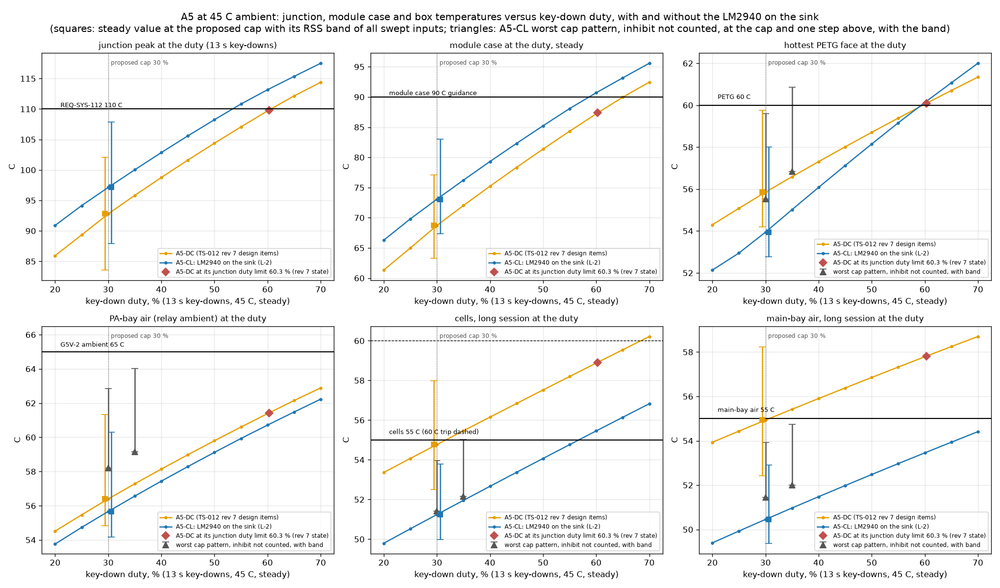
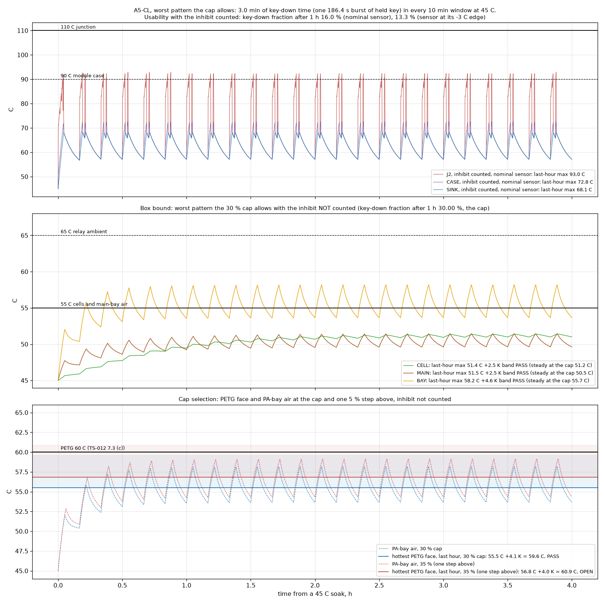
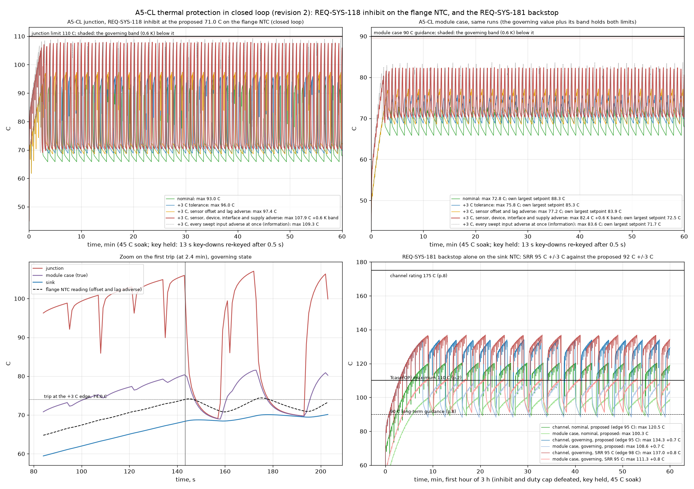
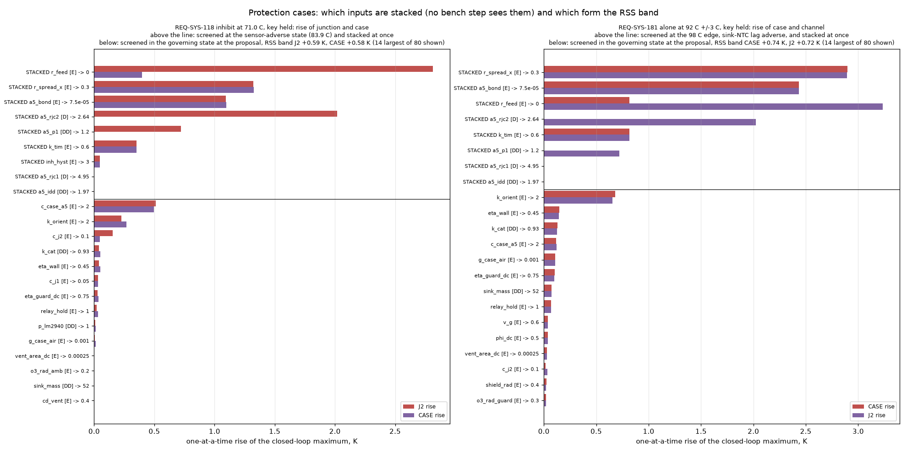
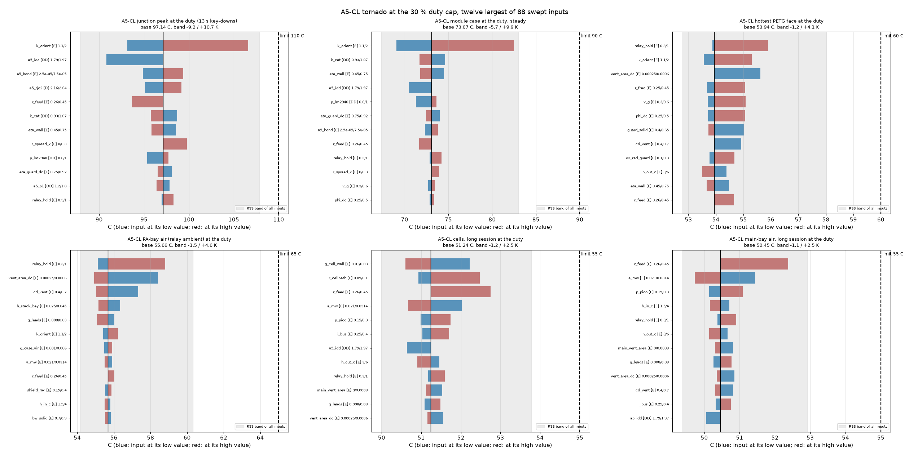
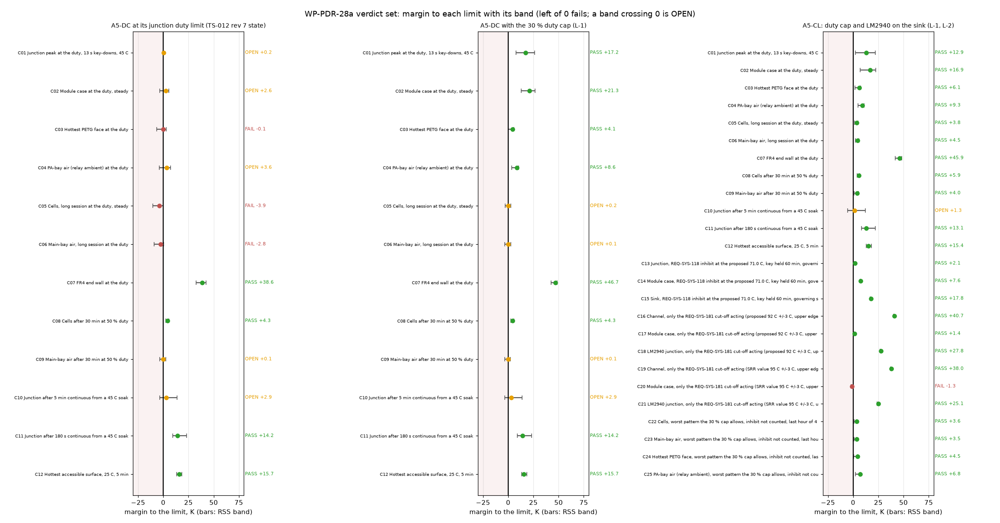
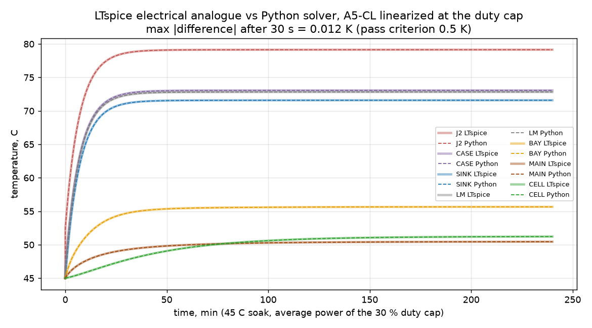

# Thermal budget of A5: closure of the open thermal items (WP-PDR-28a)

| Field | Value |
|---|---|
| Product | `docs/design/analysis/thermal-budget.md` (analysis note, thermal budget of the chosen design A5), revision 2. This is the file REQ-SYS-112's verification note names ("thermal resistance chain analysis junction to ambient in docs/design/analysis/thermal-budget.md") and the output file of WP-PDR-28 |
| Work package | WP-PDR-28a, stage 1 of the rule C11 loop 28a → 27 → 28b (PDR work plan revision 6, section 3.0 row 28): the open thermal items of TS-012 revision 7 section 10 condition 3, on the D-1 to D-6 geometry of TS-012 section 8.14 and the CR-003 revision 4 text (`114b68f`) |
| Authorization | Owner, status note 2026-09-29 section 5 (design A5) and section 8 (OD-01: "Start things as soon as they're able to be started") |
| Author | Claude, analysis author invocation, 2026-09-29 (revisions 0, 1 and 2) |
| Model and checker | `hardware/sim/thermal/a5_closure.py` (the 28a levers, cases, verdict set, plots, LTspice analogue and checker). It imports `thermal_model.py` and `ts012_thermal.py` of the TS-012 thermal note **unchanged**: both are frozen product files of INSP-112, so every 28a change is made on the network that `thermal_model.build("A5-DC", ...)` returns, never in the builder (section 2). Checker: `.venv/bin/python hardware/sim/thermal/a5_closure.py --check --run-id 2026-09-29-a5-closure-r3` re-runs everything and compares the two generated blocks of this note (sections 5 and 6) line by line with the computed ones, and the LTspice cross-check with 0.5 K; it prints every difference and exits 1 on any |
| Run | `hardware/sim/thermal/results/2026-09-29-a5-closure-r3/` (results file `results.md`; block README `results/2026-09-29-a5-closure-r3/README.md`). Runs `2026-09-29-a5-closure-r1` (revision 0) and `-r2` (revision 1) are kept unchanged as the records of what the reviews found. The TS-012 note's runs `2026-09-28-ts012-r1` and `-r2` and its block README `hardware/sim/thermal/README.md` (frozen INSP-112 product files) are not touched |
| Review record | To be created by the lead SE: `docs/reviews/PDR/checklists/analysis-thermal-budget.md` (plan WP-PDR-28 "Record"), analysis checklist, with the INSP number the lead SE assigns. The record is APPROVED before S1 (rule C10), because CR-018 carries REQ-SYS-112, 118 and now 181 |
| Evidence status | **Developer evidence.** numpy 2.5.3, matplotlib 3.11.2 and spicelib 1.6.3 are class B tools of `tools/toolchain.lock.md` section 2 without a TV record; LTspice 26.0.2 is accredited (TV-014). Every temperature below is an **ESTIMATE** from the lumped model of `thermal-ts012.md` (reviewer APPROVED, INSP-112 iteration 2), which has no bench correlation yet. 125 inputs (the 112 of the TS-012 note and 13 added here) are in `inputs.csv` with class D, DD, R or E; 88 are swept by the tornado on A5-CL, and 86 on the two A5-DC layouts, where the two ranged LM2940 inputs have no effect |
| AT RISK | AT RISK (A5 CRs), rule C13: CR-003 revision 4 and CR-018 are not dispositioned. REQ-SYS-112, 113, 118 and 181 carry TBR values. The PA dissipation is the TS-012 section 7.3 estimate (9.94 W at the corner); the WP-PDR-21 and 22 runs may move it. The PETG heat-deflection temperature is a typical value (filament datasheet not read) |

**Revision 2 in one paragraph.** The independent delta review of revision 1 found its three Major findings fixed and raised two new Major findings; revision 2 fixes them and only them (rule C1). (20) The "worst pattern the cap allows" cut each burst after 3.0 min of elapsed time, so the 0.5 s re-key gaps left it at 29.15 % key-down, not the 30 % the cap allows. The burst now holds exactly 3.0 min of key-down time in every 10 min window (it lasts 186.4 s), and the key-down fraction is counted on every solver step: 30.00 %. The box values under the pattern rise by 0.1 to 0.3 K (PETG face 55.6 C, was 55.3 C). Every verdict and the 30 % cap stand, but the filament heat-deflection thresholds become **60.6 C and 64.7 C** (were 60.3 and 64.4 C). (21) The REQ-SYS-118 re-arm hysteresis (5 C, range 3 to 10 C, not yet set) was held at 5 C. It is a firmware value no bench step sees, so it is now screened and stacked at its adverse end, 3 C, in the governing state. The setpoint rule then gives **71 C +/-3 C** (revision 1: 72 C): the governing state with its band holds up to 72.5 C, and every swept input adverse at once needs 71.7 C. Any hysteresis of 3 C or more is covered. What changes for the owner: at 45 C the usable key-down is 13.3 to 16.0 % (was 13.7 to 17.5 %). Both go to the owner at S1 in CR-018 (section 9); section 16 has the disposition.

**Revision 1 in one paragraph.** The independent review of revision 0 raised three Major findings; revision 1 fixes them and only them (rule C1). (1) The REQ-SYS-181 backstop-alone case left two interface inputs at their favourable ends; with every device, interface and supply input at its adverse end the module case reaches 111.4 C against the 110 C Tcase(OP) rating, so **95 C +/-3 C is not confirmed** and this note now proposes **92 C +/-3 C**, with the duration of the fault stated. (2) The REQ-SYS-118 setpoint rested on 0.07 K of margin with no band, and single device inputs broke it; the setpoint is now chosen with every input no bench step can see stacked at its adverse end and the band of the rest added: **72 C +/-3 C** (revision 0: 83 C), which also holds with every swept input adverse at once. The bench no longer has to detect anything for the setpoint to hold. (3) The "worst pattern the cap allows" was run with the inhibit cutting it; the box is now bounded with the inhibit not counted, and on that basis 35 % leaves the PETG face OPEN, so the cap rule gives **30 %** (revision 0: 35 %). All three go to the owner at S1 in CR-018 (section 9). What changes for the owner in use: at 45 C ambient the inhibit, not the cap, now limits sending, to about 14 to 18 % key-down (section 4.2).

## 1. Purpose, scope and pass rule

The owner chose A5 on 2026-09-29. TS-012 section 10 condition 3 left four thermal items open, from `thermal-ts012.md` section 4.3 (A5-DC, the layout with the design items D-1 to D-5):

| Plan item (WP-PDR-28a) | Open value | Limit |
|---|---|---|
| (1) Cells, long session at the duty limit | 58.9 C | 55 C (TS-012 7.3 (a), extended); 60 C cell trip |
| (2) Hottest PETG face at the duty limit | 60.1 C (bulkhead, bay side) | 60 C (TS-012 7.3 (c)) |
| (3) Module case, continuous key-down | 105.7 C | 90 C (Mitsubishi long-term guidance) |
| (4) PA-bay air, continuous key-down (relay ambient), with D-5 | 67.1 C | 65 C (Omron G5V-2 ambient rating) |

The plan adds three more items:
- (5) the REQ-SYS-118 NTC on the flange contact face (about 81 C in D-6) and the firmware duty limit of D-6;
- (6) the REQ-SYS-112 duty-limited corner values for CR-018;
- (7) the bench plan for the in-situ sink (at most 5.6 K/W in the TS-012 note) and for the NTC offset, before first on-air use.

**Pass rule (plan).** Every item is inside its limit with a no-cost or gate-affordable change. Otherwise the item goes to the owner, at S1 if it changes CR-018 or at S2 otherwise, and never as an L1 lien (TS-012 section 10 revisit (d)). This note uses the verdict words of the TS-012 note:
- **PASS**: the value plus its band is within the limit;
- **OPEN**: the value is within the limit, but the band crosses it, so the case is not shown to pass;
- **FAIL**: the value exceeds the limit.

**What "value" and "band" are (revision 1).** Every row of the verdict set has a band:
- C01 to C12: the value is at the nominal inputs; the band is the RSS of the one-at-a-time rises of the ranged inputs (the tornado).
- C13 to C21, the **protection cases** (REQ-SYS-118 inhibit and REQ-SYS-181 backstop, closed loop): the value is the **governing state**, in which the sensor ends and **every device, interface and supply input are stacked at their adverse ends at once** (worst case). These are the inputs of the sensor-to-channel offset and of the dissipation: Rth(ch-case) of both stages, the stage-1 share, the bond line, the compound conductivity, the web spreading, the drain current and the feed resistance, which runs down to 0 here (drain at the full 8.4 V: any supply at the battery contacts, a bench supply included). For the inhibit the stack also holds the REQ-SYS-118 re-arm hysteresis, a firmware value not yet set (revision 2, finding-21). No bench step of section 8 measures any of them before first on-air use, so none is left to a band. The adverse end of each is the one that raises channel plus case in a one-at-a-time screen of the closed loop itself. The band is the RSS of the one-at-a-time rises of every other swept input (80), screened in the governing state (`cl_protection_screen.png`).
- C22 to C25, the **worst cap pattern**: the value is the last-hour maximum of the pattern with the inhibit not counted, the pattern holding exactly the key-down time the cap allows (revision 2); the band is the RSS band of the same box metric at the steady cap duty.

"Closed" in section 7 means PASS, or OPEN only on inputs that a named bench measurement replaces before first on-air use, with its acceptance value stated.

**Not in scope.** 28b (after WP-PDR-27) re-runs this closure on the TS-011 re-score outline and the scripted test-finger set. The case wall areas here are still the TS-012 section 8.5 envelope values, with their +/-20 % band.

## 2. Method

**Model reused, not changed.** The network, inputs, solvers and post-processing are those of `thermal-ts012.md` sections 2 and 3 (INSP-112 APPROVED). `a5_closure.py` calls `thermal_model.build("A5-DC", t_amb, v)` and then edits the returned network for the levers below. Two checks confirm this:
- the A5-DC values of this run that do not depend on the duty limit equal those of run `2026-09-28-ts012-r2` with their bands (C08 to C12 against V14, V15, V03, V04 and V07: 50.7, 55.0, 107.1, 95.9 and 32.3 C). The duty-limited values differ slightly (cells 59.0 against 58.9 C) because the duty limit is now bisected (60.3 %) instead of read on the 5 % grid (60 %);
- the model files in `results/.../scripts/` have the SHA-256 that the TS-012 note's README records (`54b5ecf4...3e66e0`, `09cf75ef...b97ce0`).

**Three layouts** (each is A5-DC of the TS-012 note plus the listed changes):

| Layout | What it is | Duty at which the box is evaluated |
|---|---|---|
| A5-DC/DL | A5-DC as TS-012 revision 7 left it | its junction duty limit (the largest duty whose junction peak holds 110 C), **re-found by bisection for every input value** of the tornado. This is the fix of INSP-112 finding-15: revision 1 of that note held the duty at 60 % while the inputs moved |
| A5-DC/CAP | A5-DC with lever L-1 only | the firmware duty cap, 30 % |
| A5-CL | A5-DC with L-1 and L-2: **the proposed design** | the firmware duty cap, 30 % |

**Levers examined** (none has a listed-price line):

| Lever | What it is | Carried |
|---|---|---|
| L-1, firmware duty cap | A new key-down at the 5 W step is refused while the key-down time in the last 10 min would exceed 30 % of it (3.0 min in any 10 min window). The cap is a firmware constant, so the box is evaluated at a fixed duty, whatever the inputs | yes |
| L-2, LM2940 on the sink | The LM2940CT-5.0 is already a TO-220 part (TS-012 row 25). Its tab, which is its ground pin 4 (TI SNVS769J p.3), is screwed to the Boyd sink's inner channel beside the module; the module flange is the module ground ("GND (FIN)", RA07M1317M datasheet p.1), so no insulator is needed. Its 0.8 W then leaves the main bay: the model moves the LM2940 source from MAIN to a new node LM, tied to the sink through RthJC(bot) 1.1 C/W (SNVS769J p.5) and a tab joint of 0.6 K/W (0.4 to 1.0, E) | yes |
| L-3, larger main-bay slots (3 or 6 cm2) | In the exploration, 6 cm2 lowers the cells by 1.4 K at the duty limit; 3 cm2 is the top of the D-4 input range | no: small effect, and the slot area is an IPX2 item for WP-PDR-27 |
| L-4, FR4 bay-side bulkhead wall | It would take the hottest PETG face (the bulkhead's bay side, 60.1 C) out of the PETG criterion | no: with L-1 and L-2 the bulkhead's bay side is no longer the hottest face |

**Why a duty cap, and why this value.** A5 puts about 9.9 W into a closed PETG box. The main bay also holds 2.1 W of regulator, feed and processor heat. Two facts from the TS-012 note set the approach:
- the REQ-SYS-118 inhibit bounds the junction and the module case at any key pattern, but it lets the average duty rise to about 60 % at 45 C with the revision 0 setpoint;
- the box (cells, main-bay air, PETG faces, PA-bay air) follows the average duty, not the junction.

A cap bounds the average duty directly. **The cap rule (revision 1):** the cap is the largest 5 % step at which every box criterion is PASS with its band **under the worst pattern the cap allows, with the inhibit not counted** (C22 to C25). The inhibit is not counted because it only removes heat and whether it trips depends on the sensor state; revision 0 ran the pattern with the nominal sensor, where the inhibit cut the bursts to 28.3 % key-down, and so under-stated the box (finding-3). On this rule:
- the pattern holds exactly the key-down time the cap allows: 3.0 min in every 10 min window at 30 % (revision 2, finding-20; revision 1 held 29.15 %);
- at 35 % the hottest PETG face under the pattern is 56.9 C with a +4.1 K band, and the cells 52.2 C with a +2.9 K band: both **OPEN** (`cl_cap_pattern.png`, bottom). 35 % is therefore not allowed;
- at **30 %** every box criterion is PASS: cells 51.5 C (+2.6 K), main-bay air 51.5 C (+2.5 K), PETG face 55.6 C (+4.1 K), PA-bay air 58.3 C (+4.7 K).

The window of 10 min is an author value (class R here, proposed). It is long enough for ordinary CW:
- an over of a couple of minutes at 40 to 50 % element duty stays under 3.0 min of key-down time;
- a QSO alternates transmit and receive.

It is short compared with the cells' time constant (about 30 min), so the box sees the average.

**New REQ-SYS-118 sensor placement (D-6).** D-6 puts the NTC "on the flange contact face". The 19.2 x 7.4 mm contact face lies under the module body, and the RA07M1317M datasheet asks for a sink flat within 50 um under the flange (p.8). A pocket in the web under the flange is therefore not proposed. The placement modelled is the flange top at the body end, between the screw slot and the body. The reading follows reading = case - f x (case - sink):
- f = 0.20 (0.05 to 0.40, E), where the TS-012 note's ear-screw placement had 0.5 (0 to 1);
- time constant 5 s (3 to 10 s, E) for a Semitec 103AT-2 bonded with thermal epoxy.

**Cases run** (`a5_closure.py`):
1. For each layout: the junction peak at its duty (periodic steady state, 13 s key-downs, the longest REQ-SYS-055 allows); the module case, PETG faces, FR4 end wall, PA-bay air, main-bay air and cells at steady state at that duty; the TS-012 (a) case (50 % for 30 min from a 45 C soak); the junction at 180 s and 300 s of continuous key-down from a 45 C soak (HZ-003 K10 and K7); the hottest accessible surface at 25 C after 5 min (REQ-SYS-113).
2. A one-at-a-time tornado over the ranged inputs (88 for A5-CL, 86 for the A5-DC layouts) for every metric and layout, with RSS bands. For A5-DC/DL the duty limit is re-found for each input value.
3. **The REQ-SYS-118 inhibit in closed loop** on the flange NTC (offset, lag, 0.15 s response, re-arm hysteresis 5 C nominal, 3 to 10 C), with the key held for 60 min from a 45 C soak. Revision 1 steps, with the hysteresis added to the stack in revision 2:
   - the sensor-adverse state (+3 C edge, f = 0.40, time constant 10 s) gives its own largest setpoint, 83.9 C (the revision 0 proposal);
   - the eight device, interface and supply inputs and the re-arm hysteresis are screened one at a time at 83.9 C in that state; each is set to its adverse end and all are stacked: this is the **governing state**. The hysteresis's adverse end is 3 C (it re-arms soonest);
   - the other 80 swept inputs are screened one at a time in the governing state, and their RSS is the band;
   - the largest 0.1 C setpoint at which governing value plus band holds both the junction at 110 C and the module case at 90 C is found by bisection, the band is re-screened at that value, and the next 0.1 C up is confirmed to fail with its own band: 72.5 C;
   - for information, every swept input is stacked at its adverse end at once (56 inputs moved, the governing stack included), value only: 71.7 C;
   - the proposal is the whole degree at or below both: **71 C**. Five cases are then re-run at it: nominal, +3 C, sensor adverse, governing, and every input adverse.
4. **The REQ-SYS-181 backstop alone** (inhibit and cap defeated with the firmware running, key held 3 h; section 4.2 says when this can happen). The sink NTC trips at the upper edge of N +/-3 C and re-arms below it less 5 C (comparator hysteresis, E, 3 to 10 C). The governing state is the sink-NTC time constant at 20 s with the same eight inputs stacked (screened at the 98 C edge); the band is the RSS of the other 80, screened there. N is the largest whole degree at or below the SRR value (95 C) at which the governing channel, case and LM2940 plus their bands hold 175 C, 110 C and 125 C; the next whole degree up is confirmed to fail with its own band. The time the case spends above 90 C is recorded.
5. **The worst pattern the cap allows**: in every 10 min window, one burst of held key (13 s key-downs re-keyed after 0.5 s) that holds exactly the key-down time the cap allows (3.0 min at 30 %, counted on the solver's 0.2 s steps; the burst lasts 186.4 s), then silence (revision 2, finding-20); 4 h from a 45 C soak. Run four times: at the cap and one 5 % step above with the inhibit **not** counted (the box bound, C22 to C25 and the cap rule); and at the cap with the inhibit at the proposal, nominal sensor and sensor at its -3 C edge (the usable key-down at 45 C).
6. The D-6 alternative duty limit S on a sink NTC, recomputed with the LM2940 heat and floored to 0.1 C (INSP-112 finding-16 item (e)).
7. **Bench acceptance of the in-situ sink**: the sink-to-air path (orientation derate k_orient, which scales the whole catalog conductance) is swept from 0.9 to 2.6. At each point the bench coupon is modelled: the A5-CL network at 25 C with every source removed and 5.0 W or 10.0 W on the sink. The accepted resistance is the one at which the junction peak at the cap plus the band of the inputs the bench does *not* replace reaches 110 C, or the case plus its band reaches 90 C, whichever comes first. The inputs the bench replaces are listed in `a5_closure.py` `SINK_PATH`: the catalog curve, orientation, guard, plume, radiation, end-wall gap and sink mass inputs.
8. The LTspice electrical analogue of the A5-CL network, linearized at the cap, run through `tools/ltspice-batch.sh` and compared node by node with the Python solver.

## 3. Inputs added by this note

The full list is `results/2026-09-29-a5-closure-r3/inputs.csv` (column `added_by_28a`). The 112 inputs of the TS-012 note are unchanged; in the protection cases only, the feed resistance runs down to 0 (section 1).

| Input | Value (range) | Class | Source |
|---|---|---|---|
| Duty cap | 30 % of any 10 min window (revision 0: 35 %) | R (proposed here) | section 2, cap rule |
| Cap grid step | 5 % | R | section 2; the step above the cap is also evaluated |
| Flange NTC offset fraction f | 0.20 (0.05 to 0.40) | E | placement at the body end of the flange top (section 2) |
| Flange NTC time constant | 5 s (3 to 10) | E | 103AT-2 bonded with thermal epoxy; no bench value yet |
| LM2940 RthJC(bot), TO-220 | 1.1 C/W | D | TI SNVS769J (revised December 2014) p.5, thermal information table |
| LM2940 operating junction | -40 to 125 C | D | same, p.4, recommended operating conditions (absolute maximum 150 C) |
| LM2940 tab to sink | 0.6 K/W (0.4 to 1.0) | E | TO-220 tab with compound and one M3 screw |
| LM2940 heat capacity | 2 J/K (1.5 to 3) | E | TO-220 body and tab |
| REQ-SYS-181 sink NTC time constant | 10 s (5 to 20) | E | 103AT-2 on the web with compound |
| REQ-SYS-181 comparator hysteresis | 5 C (3 to 10) | E | value not yet set (WP-PDR-37) |
| REQ-SYS-118 re-arm hysteresis (TS-012 note input, not new) | 5 C (3 to 10); stacked at 3 C in the inhibit's governing state (revision 2) | E | value not yet set (WP-PDR-35) |
| RA07M1317M Tcase(OP) | -30 to +110 C | D | RA07M1317M datasheet, Jun 2019, p.2 (maximum ratings) |
| RA07M1317M channel | 175 C maximum rating | D | same, p.8: "The 175°C maximum rating for the channel temperature ensures application under derated conditions" |
| RA07M1317M case guidance | "it is best to keep the module case temperature (Tcase) below 90°C" | D | same, p.8 ("For long-term reliability") |

The datasheet pages were read for this note on 2026-09-29: the Mitsubishi PDF at https://www.mitsubishielectric.com/semiconductors/hf/products/datasheet/ra07m1317m.pdf (pp.1, 2 and 8) and https://www.ti.com/lit/ds/symlink/lm2940-n.pdf (SNVS769J pp.3 to 5). This also answers INSP-112 finding-17 item (3): the RA07M1317M ratings are now cited to their pages. Note that p.2 gives no channel rating in its table; the 175 C figure is on p.8.

## 4. Results

All values are estimates. The verdict words are those of the section 5 block. Each value is rounded up to 0.1 C there, toward the limit.

### 4.1 The box at the duty: items (1), (2) and (4)

| At 45 C ambient | Limit | A5-DC at its duty limit (60.3 %) | A5-DC, 30 % cap | A5-CL, 30 % cap, steady | A5-CL, worst 30 % cap pattern, inhibit not counted |
|---|---|---|---|---|---|
| Cells, long session | 55 C | 59.0 C FAIL | 54.8 C OPEN | **51.3 C PASS** (+2.6 K band) | **51.5 C PASS** (+2.6 K) |
| Main-bay air, long session | 55 C | 57.9 C FAIL | 55.0 C OPEN | **50.5 C PASS** (+2.5 K) | **51.5 C PASS** (+2.5 K) |
| Hottest PETG face | 60 C | 60.1 C FAIL (bulkhead) | 55.9 C PASS | **54.0 C PASS** (+4.1 K; the guard) | **55.6 C PASS** (+4.1 K) |
| PA-bay air (relay ambient) | 65 C | 61.5 C OPEN | 56.5 C PASS | **55.7 C PASS** (+4.7 K) | **58.3 C PASS** (+4.7 K) |

Reading:
- **The cap alone does not close the cells.** A5-DC at 30 % still has 54.8 C cells and 55.0 C main-bay air, both OPEN, because 0.8 W of the main bay's 2.1 W is the LM2940, which runs whatever the duty. Even at 20 % the A5-DC cells are 53.4 C.
- **L-2 is what closes the cells.** With the LM2940 on the sink, the main bay loses its largest constant source. The cells fall by 3.5 K at 30 % and are PASS with their band.
- The price of L-2 is on the sink. At the same duty the junction is 4.3 K higher (97.2 against 92.8 C), and the module case 4.3 K higher (73.1 against 68.8 C). Both stay inside their limits at the cap (section 4.2).
- **Item (4), relay ambient.** Continuous key-down cannot be sustained under the proposed protection, so 67.1 C is not reachable (section 4.2). At the cap the PA-bay air is 55.7 C steady and 58.3 C under the worst pattern, PASS with its band. The band includes the relay hold ratio up to 1.0, the case where the D-5 PWM hold does not work and the coil runs at full power. So the relay ambient does not depend on D-5 at the cap. D-5 stays as a free reduction of the LM2940 current.
- **The worst pattern the cap allows** (`cl_cap_pattern.png`, finding-3 and finding-20 fixed): one burst of held key in every 10 min window holding exactly 3.0 min of key-down time (186.4 s long, because of the 0.5 s re-key gaps), with the inhibit **not** counted, so the key-down fraction after the first hour is the full 30.00 % the cap allows. Revision 1 ended the burst after 3.0 min of elapsed time and held only 29.15 %. Over the last hour the bursts lift the fast nodes above their steady values at the cap: PA-bay air by 2.5 K, the PETG face by 1.6 K, main-bay air by 1.0 K, the cells by 0.2 K. Every value stays inside its limit with its band (C22 to C25). Revision 0's "at most 1.2 K above steady" is withdrawn: it came from a run in which the inhibit cut the bursts.
- In the same pattern with the inhibit not counted, the junction reaches 107.4 C and the module case 87.2 C; at 35 % they would be 110.9 C and 90.6 C. The junction and case in the pattern are bounded by the inhibit (C13, C14), not by the cap.

**INSP-112 finding-15 restated.** With the duty limit re-found for every input value, A5-DC's long-session cells at the duty limit are 59.0 C (+6.6 K band) instead of 58.9 C (+5.0 K). The duty limit itself moves by +27 / -21 percentage points across the inputs (`results.md`). This is why the box is evaluated here at a fixed firmware cap, where holding the duty fixed in the tornado is exact, not an approximation.

### 4.2 Module case, inhibit setpoint and backstop: items (3) and (5)

**Item (5), REQ-SYS-118 setpoint (finding-2 and finding-21 fixed).**
- Revision 0 proposed 83.9 C, the largest setpoint that held 110 C with only the sensor at its adverse ends. It held by 0.07 K. With any one of the device inputs at its adverse end it failed: the closed-loop screen at 83.9 C gives junction rises of 2.8 K for the feed resistance at 0 (drain at the full 8.4 V), 2.0 K for Rth(ch-case) +10 %, 1.3 K for the web spreading, 1.1 K for the 75 um bond line, 0.7 K for the low stage-1 share and 0.4 K for the low compound conductivity (`protection_screen.csv`, `cl_protection_screen.png` left, above the line).
- None of these is seen by any bench step. Revision 0's section 8 item 2 could not bound f either: the offset it would measure depends on the interface resistance, which is unknown over about 3:1, and the reading-minus-sink difference is a few kelvin at most. So revision 0's 76.5 C fallback could not be triggered as described.
- Revision 1 therefore stacks all of them at once (the governing state) and adds the RSS band of the other 80 inputs. Revision 2 adds the re-arm hysteresis to the stack (finding-21): it is a firmware value not yet set (5 C, 3 to 10 C), and no bench step sees it. Its adverse end is 3 C, the soonest re-arm; one at a time it adds only 0.05 K at 83.9 C, but in the every-input stack the value-only setpoint falls from 72.2 C (hysteresis 5 C, revision 1) to 71.7 C (hysteresis 3 C).
- With the hysteresis stacked, the band at the proposal is +0.59 K on the junction. The largest setpoint that holds is 72.5 C (revision 1: 72.9 C). Stacking every one of the 88 swept inputs at its adverse end at once, with the hysteresis at 3 C, needs 71.7 C (revision 1: 72.2 C, with the hysteresis at 5 C).
- **The proposal is 71 C +/-3 C** at the flange NTC: the whole degree at or below both. It holds for any re-arm hysteresis of 3 C or more. At 71 C:

  | Case (key held 60 min from a 45 C soak) | Junction | Module case | Sink |
  |---|---|---|---|
  | Nominal | 93.1 C | 72.9 C | 68.3 C |
  | +3 C tolerance | 96.0 C | 75.8 C | 71.3 C |
  | +3 C, sensor offset and lag adverse (revision 0's governing case) | 97.5 C | 77.3 C | 72.7 C |
  | **+3 C, sensor, device, interface, supply and hysteresis adverse (governing)** | **108.0 C +0.6 K band, PASS** (C13) | **82.5 C +0.6 K, PASS** (C14) | 71.3 C +0.8 K (C15) |
  | +3 C, every swept input adverse at once (information) | 109.3 C, inside 110 C | 83.7 C | 72.2 C |

- The junction binds, not the case: in the governing state the junction runs 25.5 K above the case. The first trip comes at 2.4 min in the governing state.
- The LM2940 junction is at most 73.8 C under the inhibit, against its 125 C operating limit.
- In the governing state the sink peaks at 71.3 C (+0.8 K band), far under the 89 C lower edge of the proposed REQ-SYS-181 band. So the backstop never acts in protected use, and the two layers stay in the order REQ-SYS-181's rationale requires (firmware acts first): the inhibit's upper edge is 74 C at the flange.

**What the lower setpoint costs in use.** At 45 C ambient the inhibit now trips inside the cap. Under the cap pattern with the inhibit counted, the key-down fraction after the first hour is **16.0 %** with the nominal sensor and **13.3 %** with the sensor at its -3 C edge (hysteresis at its nominal 5 C), against the 30 % the cap allows (`cl_cap_pattern.png`, top). So at 45 C the usable sending is set by the inhibit. The cap still matters at lower ambient, where the inhibit does not trip and the box follows the average duty. This is a usability loss at the hot corner, not a safety loss; it is stated for the owner in the CR-018 question (Q-1).

**Item (3), module case.** The 105.7 C value (107.4 C for A5-CL) is continuous key-down with no protection acting. Under the proposed protection it is not reachable:
- **At the cap:** 73.1 C steady, PASS with its band (+10.0 K); 87.2 C at most under the worst cap pattern with the inhibit not counted.
- **Under the REQ-SYS-118 inhibit, key held for an hour:** at most 82.5 C +0.6 K in the governing state (C14), and 83.7 C with every input adverse at once.
- **With only the REQ-SYS-181 backstop acting:** see below.

**REQ-SYS-181, backstop alone (finding-1 fixed).**
- When this case happens: the inhibit and the cap are both SW-SAFE firmware functions, so the case is a firmware that keeps running with both defeated (a common fault of that unit, or the flange NTC reading cold together with a cap fault), with the operator re-keying. A hung firmware is not this case: REQ-SYS-131 resets it within 2 s and the inhibit then acts again.
- The **duration is not bounded** by any other hardware layer in this case. REQ-SYS-180 ends a continuous transmission at 150 to 180 s, but it re-arms once receive resumes, one hang time (3 to 30 dits) after a key-up, so an operator who re-keys is not held off by it. It is not credited. The 3 h run therefore stands for an unbounded duration, and Tcase(OP) is applied as a bound that must hold for as long as the fault lasts.
- Revision 0's adverse case left the web spreading at 0 and the compound conductivity nominal. With all eight inputs stacked (governing state, the sink-NTC time constant at 20 s):

  | REQ-SYS-181 value | Channel (175 C) | Module case (110 C Tcase(OP)) | LM2940 junction (125 C) |
  |---|---|---|---|
  | **95 C +/-3 C (SRR decision 39), trip at 98 C** | 137.1 C +0.8 K, PASS (C19) | **111.4 C +0.9 K, FAIL** (C20) | 100.0 C +1.2 K, PASS (C21) |
  | **92 C +/-3 C (proposed), trip at 95 C** | 134.3 C +0.8 K, PASS (C16) | **108.6 C +0.8 K, PASS** (C17) | 97.3 C +1.2 K, PASS (C18) |

  The reviewer's re-run (111.3 C case, 137.0 C channel) is reproduced: 111.33 C and 137.03 C in `results.md`. 93 C +/-3 C fails with its own band, so 92 C is the largest whole degree that holds. With nominal inputs at 92 C the channel is 120.5 C and the case 100.3 C.
- **95 C +/-3 C is therefore not confirmed against the device rating**, and REQ-SYS-181's TBR plan ("else they change by CR") applies: this note proposes **92 C +/-3 C and 100 ms** for CR-018 (section 9).
- **The 90 C long-term guidance is exceeded for as long as this fault lasts:** the case first passes 90 C after 3.7 min in the governing state (5.7 min nominal), and after the first hour it is above 90 C for 91.8 % of the time (95.4 % nominal). This is a long-term reliability cost of a double fault, not a rating violation. Revision 0's "limited duration" is withdrawn.

**D-6 alternative (firmware duty limit on a sink NTC).** Recomputed with the LM2940 heat and floored: S = 82.2 C, **79.2 C as programmed** after the +3 C tolerance. This replaces the TS-012 note's 79.4 C, which was rounded up (finding-16 item (e)) and did not include the LM2940. Not recommended for A5:
- TS-012 revision 8 section 8.1 wires the sink NTC to the LM393 #1 comparator of REQ-SYS-181, routed apart from the ADC path; the firmware reads the flange NTC and the cell NTC;
- S alone does not bound the box: the duty it allows moves with the inputs (finding-15).

The flange-NTC inhibit together with the duty cap does both jobs.

**HZ-003 K7 and K10 (continuous key-down from a soak, no protection counted).** At 5 min the junction is 108.8 C (+6.6 K band), OPEN. That is 1.7 K higher than A5-DC because of L-2. At 180 s it is 97.0 C, PASS. The K7 case is bounded in the radio by the inhibit: the closed loop holds 110 C from the soak in the governing state, and its first trip comes at 2.4 min. The duty cap also allows at most 3.0 min of continuous key-down.

### 4.3 Surfaces, FR4, and what L-2 costs elsewhere

- **REQ-SYS-113 (accessible surfaces, 25 C, 5 min):** the guard's outer face is 32.7 C (+2.6 K), PASS, against 48 C. L-2 adds 0.4 K.
- **FR4 end wall at the cap:** 59.1 C, PASS against its 105 C design limit.
- **TS-012 (a), 50 % duty for 30 min** (not allowed by the cap beyond 3.0 min in 10; computed as TS-012 states it): cells 49.2 C and main-bay air 51.0 C, both PASS. Without L-2 the main-bay air was 55.0 C, OPEN.

What drives the remaining bands of A5-CL at the 30 % cap (`bands.csv`):
- **Junction peak at the cap:** +10.7 K. The largest single swing is the sink orientation derate (9.5 K), then the module current (6.3 K) and the feed resistance (3.5 K).
- **Cells:** +2.6 K, from the feed resistance (1.5 K), the cell-path resistance (1.2 K) and the cell-to-wall coupling (1.0 K).
- **PETG face:** +4.1 K, from the relay hold ratio (1.9 K), the PA-bay slot area (1.7 K) and the orientation derate (1.4 K).
- **PA-bay air:** +4.7 K, from the relay hold ratio (3.1 K) and the PA-bay slot area (2.8 K). With the hold ratio at 1.0 (PWM hold not working) the bay air is 58.8 C steady, still inside 65 C.

### 4.4 Margins with their bands

### 4.5 Solver cross-check

The A5-CL network, frozen at its steady state at the 30 % cap, is written as an LTspice netlist (`ltspice/thermal_a5cl.net`) and run through the wrapper for 4 h with the cap's average power. The result is in `results.md` ("LTspice cross-check"): LTspice 26.0.2, exit 0, deck SHA-256 `add7b614...bc6dd96`, largest node difference to the Python solver after 30 s **0.012 K** against the 0.5 K criterion, PASS; the J2 node at 14400 s is 79.14 C in both. This checks the solver and the network edits of L-2 (the LM node), not the physics.

## 5. Verdict set

Every value comes from the run and is rounded up to 0.1 C. `+band` is as section 1 defines it: the tornado RSS for C01 to C12 (88 inputs for A5-CL, 86 for the A5-DC layouts); the RSS of the unstacked inputs in the governing state for the protection cases C13 to C21; the steady band at the cap for the pattern cases C22 to C25. The block is generated by the runner; `a5_closure.py --check` fails if it differs by one character. Revision 1 renumbers C13 onward (section 15 gives the map).

<!-- a5-closure-verdicts:begin (generated by a5_closure.py; checked by --check) -->

| Id | Criterion (basis) | Limit, C | A5-DC/DL | A5-DC/CAP | A5-CL |
|---|---|---|---|---|---|
| C01 | Junction peak at the duty, 13 s key-downs, 45 C (REQ-SYS-112 delta (proposed corner)) | 110 | 109.9 +0.9 **OPEN** | 92.8 +9.3 **PASS** | 97.2 +10.7 **PASS** |
| C02 | Module case at the duty, steady (RA07M1317M p.8 long-term guidance) | 90 | 87.4 +6.1 **OPEN** | 68.8 +8.4 **PASS** | 73.1 +10.0 **PASS** |
| C03 | Hottest PETG face at the duty (TS-012 7.3 (c)) | 60 | 60.1 +6.4 **FAIL** | 55.9 +4.0 **PASS** | 54.0 +4.1 **PASS** |
| C04 | PA-bay air (relay ambient) at the duty (G5V-2 ambient rating) | 65 | 61.5 +7.5 **OPEN** | 56.5 +5.0 **PASS** | 55.7 +4.7 **PASS** |
| C05 | Cells, long session at the duty, steady (TS-012 7.3 (a), extended) | 55 | 59.0 +6.6 **FAIL** | 54.8 +3.3 **OPEN** | 51.3 +2.6 **PASS** |
| C06 | Main-bay air, long session at the duty (TS-012 7.3 (a), extended) | 55 | 57.9 +6.1 **FAIL** | 55.0 +3.3 **OPEN** | 50.5 +2.5 **PASS** |
| C07 | FR4 end wall at the duty (design limit (E)) | 105 | 66.4 +6.1 **PASS** | 58.4 +4.0 **PASS** | 59.1 +4.3 **PASS** |
| C08 | Cells after 30 min at 50 % duty (TS-012 7.3 (a)) | 55 | 50.7 +2.0 **PASS** | 50.7 +2.0 **PASS** | 49.2 +1.8 **PASS** |
| C09 | Main-bay air after 30 min at 50 % duty (TS-012 7.3 (a)) | 55 | 55.0 +3.5 **OPEN** | 55.0 +3.5 **OPEN** | 51.0 +3.1 **PASS** |
| C10 | Junction after 5 min continuous from a 45 C soak (HZ-003 K7) | 110 | 107.1 +6.5 **OPEN** | 107.1 +6.5 **OPEN** | 108.8 +6.6 **OPEN** |
| C11 | Junction after 180 s continuous from a 45 C soak (HZ-003 K10) | 110 | 95.9 +5.0 **PASS** | 95.9 +5.0 **PASS** | 97.0 +5.0 **PASS** |
| C12 | Hottest accessible surface, 25 C, 5 min (REQ-SYS-113 (TBR)) | 48 | 32.3 +2.5 **PASS** | 32.3 +2.5 **PASS** | 32.7 +2.6 **PASS** |
| C13 | Junction, REQ-SYS-118 inhibit at the proposed 71.0 C, key held 60 min, governing state (REQ-SYS-112, HZ-003 K2) | 110 | - | - | 108.0 +0.6 **PASS** |
| C14 | Module case, REQ-SYS-118 inhibit at the proposed 71.0 C, key held 60 min, governing state (RA07M1317M p.8 guidance, HZ-003 K2) | 90 | - | - | 82.5 +0.6 **PASS** |
| C15 | Sink, REQ-SYS-118 inhibit at the proposed 71.0 C, key held 60 min, governing state (REQ-SYS-181 lower edge at the proposed 92 C +/-3 C) | 89 | - | - | 71.3 +0.8 **PASS** |
| C16 | Channel, only the REQ-SYS-181 cut-off acting (proposed 92 C +/-3 C, upper edge 95 C), key held 3 h, governing state (RA07M1317M p.8 rating) | 175 | - | - | 134.3 +0.8 **PASS** |
| C17 | Module case, only the REQ-SYS-181 cut-off acting (proposed 92 C +/-3 C, upper edge 95 C), key held 3 h, governing state (RA07M1317M p.2 Tcase(OP)) | 110 | - | - | 108.6 +0.8 **PASS** |
| C18 | LM2940 junction, only the REQ-SYS-181 cut-off acting (proposed 92 C +/-3 C, upper edge 95 C), key held 3 h, governing state (TI SNVS769J p.4) | 125 | - | - | 97.3 +1.2 **PASS** |
| C19 | Channel, only the REQ-SYS-181 cut-off acting (SRR value 95 C +/-3 C, upper edge 98 C), key held 3 h, governing state (RA07M1317M p.8 rating) | 175 | - | - | 137.1 +0.8 **PASS** |
| C20 | Module case, only the REQ-SYS-181 cut-off acting (SRR value 95 C +/-3 C, upper edge 98 C), key held 3 h, governing state (RA07M1317M p.2 Tcase(OP)) | 110 | - | - | 111.4 +0.9 **FAIL** |
| C21 | LM2940 junction, only the REQ-SYS-181 cut-off acting (SRR value 95 C +/-3 C, upper edge 98 C), key held 3 h, governing state (TI SNVS769J p.4) | 125 | - | - | 100.0 +1.2 **PASS** |
| C22 | Cells, worst pattern the 30 % cap allows, inhibit not counted, last hour of 4 h (TS-012 7.3 (a), extended) | 55 | - | - | 51.5 +2.6 **PASS** |
| C23 | Main-bay air, worst pattern the 30 % cap allows, inhibit not counted, last hour of 4 h (TS-012 7.3 (a), extended) | 55 | - | - | 51.5 +2.5 **PASS** |
| C24 | Hottest PETG face, worst pattern the 30 % cap allows, inhibit not counted, last hour of 4 h (TS-012 7.3 (c)) | 60 | - | - | 55.6 +4.1 **PASS** |
| C25 | PA-bay air (relay ambient), worst pattern the 30 % cap allows, inhibit not counted, last hour of 4 h (G5V-2 ambient rating) | 65 | - | - | 58.3 +4.7 **PASS** |

<!-- a5-closure-verdicts:end -->

## 6. Proposed values

The block is generated by the runner and checked like section 5, so no proposed value is transcribed by hand (INSP-112 finding-16).

<!-- a5-closure-values:begin (generated by a5_closure.py; checked by --check) -->

| Item | Proposed value (A5-CL) | Basis in this run |
|---|---|---|
| Firmware key-down duty cap (REQ-SYS-112 corner) | at most 30 % key-down time in any rolling 10 min window | largest 5 % step at which every box criterion under the worst pattern the cap allows is PASS with its band (C22 to C25; PETG 55.6 C +4.1 K); at 35 %: CELL 52.2 +2.9 OPEN, PETG 56.9 +4.1 OPEN; steady at the cap: junction peak 97.2 C, box C02 to C06 |
| REQ-SYS-118 threshold at the flange NTC (as programmed, the +/-3 C tolerance about it) | 71 C +/-3 C | the whole degree at or below both 72.5 C (largest 0.1 C value at which the governing state, +3 C edge with the sensor offset and lag and every device, interface and supply input adverse, plus the RSS band of the other inputs holds the junction at 110 C and the case at 90 C, key held) and 71.7 C (every swept input adverse at once, 56 inputs, value only); at 71 C: C13 108.0 +0.6 C, C14 82.5 +0.6 C |
| Usable key-down at 45 C under the proposed cap and inhibit (information) | 16.0 % (nominal sensor), 13.3 % (sensor at its -3 C edge) | worst cap pattern with the inhibit counted, key-down fraction after the first hour of 4 h |
| D-6 alternative, sink-NTC duty limit S (to program, +3 C taken off) | 79.2 C (S = 82.2 C) | 13 s key-down from S holds 110 C; floored |
| REQ-SYS-181 cut-off (change from the SRR value 95 C +/-3 C) | 92 C +/-3 C on the sink, 100 ms | 95 C +/-3 C is not confirmed: C20 module case 111.4 +0.9 C FAIL against 110 C Tcase(OP); largest whole degree holding channel, case and LM2940 plus bands within 175 C, 110 C and 125 C (C16 to C18) |
| PETG filament heat-deflection temperature (CR-003 revision 4 Q4, 5 K rule) | at least 60.6 C; at least 64.7 C to cover the band | hottest PETG face under the worst pattern the cap allows (C24); at 35 % it would be 61.9 C and 65.9 C |
| In-situ sink acceptance (bench, 5.0 W on the web, 25 C room) | at most 8.80 K/W (model nominal 6.77) | junction peak plus the non-sink band at 110 C, case plus its band at 90 C |
| In-situ sink acceptance (bench, 10.0 W) | at most 7.27 K/W (model nominal 5.58) | same, read at 10 W |

<!-- a5-closure-values:end -->

## 7. Closure of the items

| Item | Before (TS-012 note, A5-DC) | After (A5-CL, this note) | State | Route |
|---|---|---|---|---|
| (1) Long-session cells | 58.9 C FAIL at the 60 % duty limit | 51.3 C, band +2.6 K, **PASS** at the 30 % cap, steady and under the worst cap pattern with the inhibit not counted | **Closed** by L-1 and L-2 (no cost: firmware and the existing TO-220 part) | The cap is a REQ-SYS-112 condition and a new firmware behaviour, so CR-018 carries it to the **owner at S1** (section 9) |
| (2) PETG face at the duty limit | 60.1 C FAIL (bulkhead, bay side) | 55.6 C, band +4.1 K, **PASS** under the worst 30 % cap pattern (54.0 C steady; the guard is the hottest face). At 35 % it would be OPEN (56.9 C +4.1 K) | **Closed** by L-1 at 30 % and L-2 | With the item (1) question. CR-003 revision 4 Q4 (filament): the CR-003 5 K rule asks a heat-deflection temperature of at least 60.6 C (64.7 C with the band); at 35 % it would be 61.9 C and 65.9 C. Typical PETG is 69 C, confirmed by the filament datasheet read (section 8 item 4) |
| (3) Module case | 105.7 C continuous, no protection | 73.1 C at the cap (PASS); at most 82.5 C +0.6 K under the inhibit, key held (governing state); 108.6 C +0.8 K at most with only the backstop acting at the proposed 92 C +/-3 C, inside the 110 C Tcase(OP) rating; above the 90 C guidance for as long as that fault lasts | **Closed** by the inhibit setpoint (item 5) and the REQ-SYS-181 change | S1 with the REQ-SYS-118 and REQ-SYS-181 values |
| (4) Relay ambient | 67.1 C continuous | 55.7 C steady and 58.3 C under the worst pattern at the cap (PASS, the band includes a failed PWM hold); at most 55.8 C under the inhibit, key held (61.2 C with every input adverse at once) | **Closed**; not dependent on D-5 | none beyond item (1) |
| (5) REQ-SYS-118 NTC and D-6 duty limit | about 81 C (ear screw), or S = 79.4 C | **71 C +/-3 C** at the NTC on the flange top at the body end, with every input no bench step sees stacked adverse, the re-arm hysteresis at 3 C included, and the band of the rest (72.5 C computed), and inside 110 C with every swept input adverse at once (71.7 C); S = 79.2 C as programmed if the D-6 alternative is kept (not recommended) | **Closed as an analysis**; no bench result is needed for the setpoint to hold. The bench checks the lag and a gross bonding fault (section 8 item 2) | CR-018 row for REQ-SYS-118 to the **owner at S1**, with the usability cost at 45 C (13.3 to 16.0 % key-down) and the re-arm hysteresis of at least 3 C; ADR per the REQ-SYS-118 TBR plan |
| (6) REQ-SYS-112 corner values | "duty-limited corner" not yet valued | 30 % in 13 s key-downs at 45 C, 5 W step: junction peak 97.2 C, band +10.7 K, **PASS**; the junction is also bounded by the inhibit (C13) | **Closed** | CR-018 row for REQ-SYS-112 to the **owner at S1** (section 9) |
| (7) Bench plan | in-situ sink at most 5.6 K/W (at 10 W), NTC offset | acceptance **at most 8.80 K/W at 5.0 W** (7.27 K/W at 10.0 W), model nominal 6.77 (5.58) K/W; NTC lag and bonding checks | **Stated** (section 8) | Owner bench session before first on-air use; needs the K-type thermometer of D-16 and its TV record |
| REQ-SYS-181 (new in revision 1) | 95 C +/-3 C (SRR decision 39) | 95 C +/-3 C: module case 111.4 C +0.9 K, **FAIL** against Tcase(OP), not confirmed; **92 C +/-3 C** holds channel, case and LM2940 with their bands | **Routed**: a change of an owner-ruled value | CR-018 row for REQ-SYS-181 to the **owner at S1** (section 9) |

Two points on this table:
- **The TS-012 note's in-situ figure.** The 5.6 K/W is the continuous 10 W value. At the lower average power the cap puts into the sink, natural convection gives a higher resistance (6.77 K/W at 5 W in the model), so the bench runs at both powers.
- **No item is left as an L1 lien.** Items (1), (5), (6) and REQ-SYS-181 change CR-018 and go to the owner at S1 as the plan requires. The owner may refuse the cap, or prefer 35 %. At 35 % item (2) is OPEN (56.9 C +4.1 K), and the cells too (52.2 C +2.9 K), not closed; without a cap item (1) is not closed (A5-DC/DL: 59.0 C cells). The fallbacks are a lower-cost change she prefers, such as accepting long-session cells up to the 60 C trip. That choice is hers.

## 8. Bench plan before first on-air use (item 7)

Instrument: the stand-alone K-type thermocouple thermometer with a bead probe of D-16. The owner's Fluke 174 has no temperature input. The thermometer needs its TV record and known-answer check before its first credited use (04 section 6.3, OQ-VV-003). Room at 20 to 28 C, still air, the radio lying flat as in the model (extrusion horizontal).

1. **In-situ sink (replaces the sink-path inputs; largest junction term).**
   - Set-up: a power resistor on the web of the actual Boyd part in the module's position, with compound, inside the printed wrap guard and the FR4 end-wall coupon of D-1 to D-3, extrusion horizontal.
   - Two runs: 5.0 W, and 10.0 W, each 45 min (the sink time constant is about 5 min). Record the sink web beside the resistor, the guard outer face and the room.
   - R = (T_sink - T_room) / P.
   - **Pass: R at most 8.80 K/W at 5.0 W and at most 7.27 K/W at 10.0 W** (section 6; `cl_bench_acceptance.png`). A pass keeps C01 (junction at the cap) and the case margin PASS on the remaining inputs.
   - A fail lowers the cap. Rerun `a5_closure.py` with the measured R, through k_orient, and re-read the largest passing duty. The inhibit still bounds the junction and the case, so a fail is a usability loss, not a safety loss.
2. **REQ-SYS-118 NTC lag and bonding (revision 1).** The setpoint does not depend on this step: it already takes f = 0.40, the 10 s time constant, the 3 C re-arm hysteresis and every device, interface and supply input at its adverse end (section 4.2). The step checks only what the stack cannot cover, a sensor slower than modelled or not bonded.
   - Set-up: the assembled RF path with the module on the sink, keyed into the owner's 50 ohm dummy load at the 5 W step. The chosen 103AT-2 is bonded at the body end of the flange top, read through the UART telemetry (REQ-SYS-150). The K bead is on the sink web within 3 mm of the flange edge.
   - **Lag:** fit a first-order time constant to the NTC rise over the first key-downs from cold, against the sink bead.
   - **Bonding:** during and after each key-down the flange runs hotter than the web, so a bonded NTC reads at or above the sink bead, within the instrument uncertainty. A reading below the sink bead means the NTC is not bonded to the flange.
   - **Rule:** if the time constant is above 10 s, rerun `a5_closure.py` with the measured value and program the setpoint it gives. If the NTC reads below the sink bead, re-bond it and repeat. Otherwise 71 C stands. This step does not measure f, and no setpoint rule depends on f.
3. **Relay hold (D-5):** the TS-012 bench check of the PWM hold current. It is not needed for the relay ambient at the cap (section 4.1), only for the LM2940 current.
4. **Filament:** read the heat-deflection temperature at 0.45 MPa on the owner's PETG datasheet. It must be at least 60.6 C (the CR-003 5 K rule on the 55.6 C face under the worst 30 % cap pattern), and at least 64.7 C to cover the band.
5. **After assembly (TS-012 7.3 checks, unchanged):** thermocouple on the guard and case after 5 min at 25 C, and on a cell after 30 min of the cap pattern.

## 9. Requirement values for CR-018 (and what the TBR plans say)

Each TBR plan is quoted from `docs/requirements/sys/requirements.md` as it stands (INSP-112 finding-17 items 1 and 2).

| Requirement | TBR plan (quoted) | This note |
|---|---|---|
| REQ-SYS-112 | "TS-003 (device RthJC) and the thermal budget at PDR fix the limit and the condition; Robin approves in the PDR memo." | **Proposes the condition:** "The transceiver shall hold the PA junction at or below 110 C (TBR) during key-down at the 5 W step in 45 C ambient at up to 30 % (TBR) key-down duty in 13 s key-downs." Limit 110 C kept. Basis: C01 (97.2 C, band +10.7 K, PASS), C13 (inhibit bound). TS-003 is not written for A5 (plan section 3.0a); the RA07M1317M Rth(ch-case) is the datasheet value |
| New requirement (duty cap), for CR-018 | none (new) | **Proposes:** "The transceiver shall refuse key-down at the 5 W step while the key-down time in the preceding 10 min (TBR) would exceed 30 % (TBR) of it." Allocation: firmware (SW-SAFE thermal unit, WP-PDR-35). Basis: C02 to C06, C22 to C25 (worst pattern, inhibit not counted). The owner decides whether this operating limit is acceptable. A lower power step could carry a higher cap; that is not analysed here |
| REQ-SYS-118 | "The PA thermal analysis at PDR fixes the threshold; the decision is recorded in an ADR and this TBR closes in the same CR." | **Proposes 71 C +/-3 C** at the flange NTC (body end of the flange top), 100 ms kept, with a re-arm hysteresis of at least 3 C (the lower end analysed; the value itself is WP-PDR-35's); the sensed point in the rationale changes from "the PA thermistor at the PA device on the board thermal pad" to the module flange; basis C13 and C14 (governing state with band) and the every-input stack (71.7 C); lag and bonding check of section 8 item 2. The cost: at 45 C the usable key-down is 13.3 to 16.0 % |
| REQ-SYS-181 | "SRR decision 39 (owner ruling 2026-09-26) adopted 95 C +/-3 C and 100 ms; the PDR thermal analysis (REQ-SYS-112, TS-003) confirms them against the device rating, else they change by CR." | **Does not confirm 95 C +/-3 C:** with only the cut-off acting and the device, interface and supply inputs adverse, the module case reaches 111.4 C +0.9 K against the 110 C Tcase(OP) of p.2 (C20). **Proposes 92 C +/-3 C and 100 ms on the sink:** channel at most 134.3 C +0.8 K against 175 C (p.8), case 108.6 C +0.8 K against 110 C, LM2940 97.3 C +1.2 K against 125 C (C16 to C18). The rationale's order still holds: the band 89 C to 95 C lies above the 74 C upper edge of the proposed REQ-SYS-118, and the sink peaks at 71.3 C under the inhibit (C15). Its sensor is on the sink as the statement says (TS-012 D-6 revision 6 for A5). The thermal note's request R-3 is thereby answered for A5 |
| REQ-SYS-113 | "The thermal budget at PDR fixes the value; if the owner adopts IEC 62368-1 or ISO 13732-1 the value is re-based on it by CR; Robin approves in the PDR memo." | **Confirms 48 C** with the wrap guard (C12: 32.7 C, band +2.6 K). The IEC 62368-1 / ISO 13732-1 branch is **not triggered**: the owner has adopted neither (her input 1 set 48 C, CR-003). The accessible set is confirmed in 28b on the scripted test finger |
| REQ-SYS-155 | range pending the thermistor selection | No change from this note; the 103AT-2 at the flange reads 45 to 90 C in use, inside -20 to +150 C |

These values are not supported until this note's record is APPROVED (rule C10).

## 10. Design items and requests

**Design items for TS-012 section 8.14 or the A5 ADR** (proposals; this note edits neither):

| # | Item | Cost |
|---|---|---|
| D-6 (revised) | REQ-SYS-118 NTC (103AT-2, row E5 (e)) bonded on the flange top at the module body end, inside the 30 mm flange and outside the screw slot; setpoint 71 C +/-3 C (re-arm hysteresis at least 3 C), with the lag and bonding check of section 8 item 2; REQ-SYS-181 NTC on the sink web, cut-off at 92 C +/-3 C (proposed change). The sink-NTC duty-limit alternative S = 79.2 C as programmed is not recommended | 0 |
| D-19 (new) | LM2940CT-5.0 tab screwed to the Boyd inner channel beside the module (tab = ground pin 4, no insulator), compound, one M3 screw and nut behind the web; its three leads through the FR4 end wall; the 22 uF output capacitor (ESR 0.1 to 1 ohm, SNVS769J p.15) and the input capacitor at its leads, on the RF board tongue or a spare-board piece | 0 (existing part; wire) |
| D-20 (new) | Firmware duty cap: 30 % of any 10 min window at the 5 W step (SW-SAFE thermal unit), with the inhibit as the independent junction and case bound | 0 |

**Mechanical findings for WP-PDR-27 and 37** (not changes made here):
- **M-4.** The inner channel is 17.02 mm wide and 63.5 mm long. The module flange takes 30 mm of its length, the RF-board tongue enters beside it (D-1), and the LM2940 TO-220 tab (10.16 mm wide, SNVS769J) needs about 15 mm of the rest. Check the layout. The LM2940 leads then cross the PA bay and the bulkhead to the main board: three more leads through the bulkhead (8 V in, 5 V out, ground). The 5 V output capacitor sits at the regulator.
- **M-5.** The NTC at the flange body end must not touch the module's plastic cap or stress the leads (datasheet p.8, construction a) and b)). Bond it with thermal epoxy after the module is screwed down and soldered.

**Requests to other writers** (this note edits none of their files):

| Id | To | Request |
|---|---|---|
| Q-1 | WP-PDR-53 (CR-018 author) | Rows for REQ-SYS-112 (condition, 30 %), the new duty-cap requirement (30 % of 10 min), REQ-SYS-118 (71 C +/-3 C, sensed point, re-arm hysteresis at least 3 C), **REQ-SYS-181 (92 C +/-3 C: a change of the SRR decision 39 value, with the C20 basis)**, REQ-SYS-113 (confirmed), with the section 9 bases. REQ-SYS-181's verification note uses 90 C as the "carrier present" fixture point and T_trip at the 98 C upper bound; both move with the value (the 90 C point falls inside the 89 to 95 C band). A section 12 question for the owner on the duty cap (what it means in use: at most 3.0 min of key-down in any 10 min at 5 W) and on the usability at 45 C (the inhibit limits sending to 13.3 to 16.0 % key-down there), and on the fallback if she refuses the cap or prefers 35 % (item (2) then OPEN) |
| Q-2 | WP-PDR-16b (`hazards.json`) | HZ-003 K2: the sensed point is the flange, 71 C +/-3 C, and the case bound (90 C) is part of the setpoint; C4 "sensor reading low by its placement offset and lag" is covered by the setpoint stack; the bench checks the lag and the bonding (section 8 item 2). HZ-003 K7: the 5 min case is 108.8 C, OPEN, bounded by the inhibit and the cap. K9: on the sink, as REQ-SYS-181, at the proposed 92 C +/-3 C; 95 C +/-3 C fails Tcase(OP) in the governing state. HZ-007 C5 and K5: cells 51.3 C at the cap with L-2, also under the worst cap pattern. The thermal note's request R-1 on K1 (40 C against 45 C) stays open |
| Q-3 | WP-PDR-35 (SW-SAFE thermal unit) | The inhibit threshold, tolerance, hysteresis and response are one budget with the flange-NTC offset and lag (section 4.2). The 71 C setpoint takes the re-arm hysteresis at 3 C, so the unit may set any hysteresis of 3 C or more; a value below 3 C needs this analysis re-run (revision 2); the duty cap (D-20) is a new SW-SAFE function; the lag check of section 8 item 2 is a configuration item. The backstop-alone case of section 4.2 is a fault of this unit, so the unit's independence from the keyer (the REQ-SYS-054 pattern) is worth the same care |
| Q-4 | WP-PDR-36a (pin map) | No new analog input: the flange NTC and the cell NTC are already on the ADC list of TS-012 section 8.1 |
| Q-5 | WP-PDR-27, 37 | D-19, M-4 and M-5; the D-6 NTC placement; the REQ-SYS-181 comparator threshold at 92 C (WP-PDR-37 sets the hysteresis) |
| Q-6 | WP-PDR-18 (risk register) | RSK-006: mitigation now the flange inhibit with the case bound, the duty cap and the in-situ sink acceptance. RSK-007: cells 51.3 C at the cap (PASS). The TS-012 note's requested entry for the PETG interior at the duty-limited corner can close on C02 to C06 and C22 to C25 once CR-018 carries the cap |
| Q-7 | WP-PDR-29 (budgets) | The section 5 block for the thermal summary; the LM2940 on the sink adds no mass |
| Q-8 | WP-PDR-28b | Re-run on the TS-011 outline: the main-case wall area (+/-20 % here), the bay walls, the slots, and the test-finger set for C12 |

## 11. Limitations

1. The lumped model and its limitations are those of `thermal-ts012.md` section 7, unchanged. There is no bench correlation yet, the sink-to-air path is estimated, and local hot spots are not resolved. For the LM2940 in particular, the model puts its heat into the isothermal sink node. The local rise at its tab is carried by the tab joint input, not resolved.
2. The flange NTC placement is new and modelled only by its offset fraction and time constant (class E). No sensor mounting has been drawn.
3. The duty cap is modelled as a fixed duty for the steady box and as a worst-case burst pattern. The firmware algorithm (rolling window, how a key-down that would exceed the cap is refused) is WP-PDR-35's. The analysis holds for any algorithm that keeps every 10 min window at or under 30 %.
4. Postures not analysed (pocket, hand over the guard, blocked slots, sun) remain as in the TS-012 note section 7 item 9. The inhibit and the backstop exist for them. The cap does not help a blocked-vent posture, because the box then heats at any duty.
5. The PA dissipation is the TS-012 7.3 estimate. The WP-PDR-21 and 22 runs, and the bench of section 8, replace it.
6. The bench coupon is modelled as the A5-CL network with only the sink heated, not as a separate geometry. The acceptance values are therefore as good as the sink-path model, which is what the measurement replaces.
7. The protection stack takes the adverse end of each stacked input from a one-at-a-time screen at one setpoint (83.9 C for the inhibit, the 98 C edge for the backstop); the band inputs are screened at the proposal. The every-input stack at the proposal (109.3 C junction, the hysteresis at 3 C) confirms the inhibit case with all inputs moved at once.

## 12. INSP-112 liens addressed here

These are Minor liens of the TS-012 note, owned by the WP-PDR-28 analysis author. This note answers them for A5. The TS-012 note itself is frozen and not edited.

| Lien | Here |
|---|---|
| finding-15 (duty limit held fixed in the tornado) | A5-DC/DL re-finds the duty limit for every input (section 2). A5-CL uses a fixed firmware cap, so the fixed duty is exact (section 4.1) |
| finding-16 (hand-transcribed values; S rounded up) | The proposed values are a generated and checked block (section 6); S is floored (79.2 C as programmed) |
| finding-17 (TBR plans quoted, IEC branch, datasheet pages) | Section 9 quotes each plan and states the IEC 62368-1 / ISO 13732-1 branch not triggered; section 3 cites RA07M1317M pp.1, 2 and 8 and SNVS769J pp.3 to 5 |

## 13. Commands and checker

- Run: `.venv/bin/python hardware/sim/thermal/a5_closure.py --run-id 2026-09-29-a5-closure-r3` (about 40 min; LTspice only through the wrapper). Exit 0 (`results/2026-09-29-a5-closure-r3/run-stdout.txt`). In that first run, and in a first `--check` pass (`check-stdout-try1.txt`), the LTspice wrapper found the shared LTspice lock held by another block's run for more than its 600 s wait, so the cross-check did not run; both passes matched both blocks of this note. The second `--check` pass below was run with `CWHT_LTSPICE_LOCK_WAIT=14400`, re-ran everything with the same numbers, LTspice included, and wrote the `results.md`, CSV files, plots and `ltspice/` files now in the run folder.
- Check: `CWHT_LTSPICE_LOCK_WAIT=14400 .venv/bin/python hardware/sim/thermal/a5_closure.py --check --run-id 2026-09-29-a5-closure-r3`. It re-runs everything, renders both blocks, compares them line by line with sections 5 and 6, and checks the LTspice difference against 0.5 K; any difference prints and exits 1. Exit status at this revision: **0** ("CHECK PASS", recorded in `results/2026-09-29-a5-closure-r3/check-stdout.txt`).

## 14. References

- `docs/design/analysis/thermal-ts012.md` revision 1 (`35fc7ee`) and INSP-112 (`docs/reviews/PDR/checklists/analysis-thermal-ts012.md`), iteration 2, finding-15 to finding-17.
- TS-012 revision 7 section 10 and revision 8 sections 8.1, 8.3 and 8.14 (`docs/decisions/trade-studies/TS-012-design-to-cost-hand-built.md`, `bb5dee7`).
- CR-003 revision 4 (`docs/cm/cr/CR-003-solution-neutral-enclosure.md`, `114b68f`), rows REQ-SYS-112 and TC-SYS-078, the filament row and Q4.
- PDR work plan revision 6 (`docs/plan/pdr-work-plan.md`), section 3.0 row 28, WP-PDR-28, rules C1 to C13.
- Mitsubishi Electric, RA07M1317M datasheet, Jun 2019, pp.1, 2 and 8, https://www.mitsubishielectric.com/semiconductors/hf/products/datasheet/ra07m1317m.pdf, read 2026-09-29.
- Texas Instruments, LM2940x 1-A Low Dropout Regulator, SNVS769J (March 2000, revised December 2014), pp.3, 4, 5 and 15, https://www.ti.com/lit/ds/symlink/lm2940-n.pdf, read 2026-09-29.
- `docs/requirements/sys/requirements.md` REQ-SYS-044, 054, 055, 112, 113, 118, 131, 150, 155, 180, 181; `docs/safety/hazards.json` HZ-003, HZ-007; `docs/risk/register.md` RSK-006, RSK-007, RSK-026.
- Status note 2026-09-29 (`docs/plan/status/status-2026-09-29.md`) sections 5 and 8.

## 15. Revision 1: disposition of the Major findings

Revision 1 changes only what the three Major findings need (rule C1). The Minor findings are not addressed here.

| Finding | What revision 0 said | What revision 1 does | Where | Evidence |
|---|---|---|---|---|
| finding-1 (REQ-SYS-181 backstop alone; CK-ANA-F3, E3) | Adverse case with r_spread_x at 0 and k_tim nominal: case 106.9 C PASS, no band; REQ-SYS-181 "confirmed"; "limited duration" not quantified | Governing state stacks all eight device, interface and supply inputs (screened), plus the RSS band of the other 80. At 95 C +/-3 C the case is 111.4 C +0.9 K, **FAIL** (C20); REQ-SYS-181 is not confirmed and **92 C +/-3 C** is proposed (C16 to C18 PASS; 93 C fails). Duration: not bounded in this fault (REQ-SYS-180 re-arms after each key-up, not credited; REQ-SYS-131 covers only a hung firmware); case first above 90 C at 3.7 min, above it 91.8 % of the time after the first hour | Sections 1, 2 (case 4), 4.2, 6, 7, 9, 10 (Q-1, Q-2, Q-5) | `backstop.csv`, `backstop_screen.csv`, `cl_inhibit_backstop.png` (lower right), `cl_protection_screen.png` (right) |
| finding-2 (REQ-SYS-118 setpoint; CK-ANA-E3, E5, J2) | 83.9 C (83 C +/-3 C) on the sensor-adverse case alone, 0.07 K margin, PASS with no band; single device inputs failed it; section 8 item 2 was to bound f and trigger a 76.5 C fallback | Governing state: sensor ends plus the same eight inputs stacked; band of the other 80 added; largest holding value 72.9 C; every swept input stacked at once 72.2 C; **72 C +/-3 C** proposed (C13 108.6 C +0.5 K, C14 83.0 C +0.5 K). Section 8 item 2 no longer bounds f or triggers a fallback; it checks the lag and the bonding only. The usability cost at 45 C is stated (13.7 to 17.5 % key-down) | Sections 1, 2 (case 3), 4.2, 6, 7, 8 item 2, 9, 10 | `inhibit.csv`, `protection_screen.csv`, `cl_inhibit_backstop.png`, `cl_protection_screen.png` (left) |
| finding-3 (worst cap pattern; CK-ANA-F3, D2) | The pattern ran with the nominal-sensor inhibit cutting it (28.3 % key-down); "at most 1.2 K above steady"; HDT thresholds 60.1 / 64.2 C | The box bound runs the pattern with the inhibit **not** counted and adds the steady band (C22 to C25, new). On that basis 35 % leaves the PETG face OPEN (56.6 C +4.1 K), so the cap rule gives **30 %**; every box criterion is PASS there. "1.2 K" withdrawn (bay air +2.3 K, PETG +1.3 K over steady). HDT thresholds 60.3 / 64.4 C at 30 % (61.6 / 65.6 C at 35 %, the reviewer's "about 61.5 / 65.5") | Sections 2, 4.1, 5, 6, 7, 8 item 4, 9, 10 | `cap_pattern.csv`, `cap_pattern_verdicts.csv`, `cl_cap_pattern.png`, `cl_box_vs_duty.png` |

**Verdict-set map** (revision 0 → revision 1). C01 to C12 keep their meaning; their A5-CL and A5-DC/CAP values move because the cap is now 30 %. Revision 0's C13 to C16 (junction, four inhibit cases) → C13 (governing state only; the other cases are in `results.md` and section 4.2). C17 to C20 (module case, four inhibit cases) → C14. C21 (sink under the inhibit, against 92 C) → C15 (against the 89 C lower edge of the proposed REQ-SYS-181). C22 to C27 (backstop nominal and adverse at 95 C +/-3 C) → C16 to C18 (proposed value, governing) and C19 to C21 (SRR value, governing). C22 to C25 are new (worst cap pattern).

## 16. Revision 2: disposition of the Major findings of the delta review

Revision 2 changes only what finding-20 and finding-21 need (rule C1). The reviewer found finding-1 to finding-3 fixed; the Minor findings are not addressed here. The verdict-set numbering is unchanged.

| Finding | What revision 1 said | What revision 2 does | Where | Evidence |
|---|---|---|---|---|
| finding-20 (worst cap pattern holds 29.15 %, not 30 %; CK-ANA-F3, A5, E5) | Each burst ended after 3.0 min of elapsed time, so the 0.5 s re-key gaps left 29.15 % key-down; PETG 55.24 C, HDT thresholds 60.3 / 64.4 C; the `cl_cap_pattern.png` title said "3.0 min of held key" | The burst holds exactly the key-down time the cap allows, counted on the solver's own 0.2 s steps (`pattern_key`: 180.0 s of key-down per 10 min window, burst 186.4 s; the reviewer's duty x window x 13.5/13 gives 186.9 s, which would hold about 0.4 s more than the cap allows). The key-down fraction is now counted on every step, not read from the 5 s samples: 30.00 % (35.00 % one step above). Cells 51.5, main-bay air 51.5, PETG 55.6, PA-bay air 58.3 C, all PASS with their bands; at 35 % PETG 56.9 C +4.1 K and cells 52.2 C +2.9 K OPEN, so the cap stays 30 %. HDT thresholds **60.6 / 64.7 C** (61.9 / 65.9 C at 35 %). The plot title now reads "3.0 min of key-down time (one 186.4 s burst of held key)" | Revision 2 paragraph; sections 1, 2 (cap rule, case 5), 4.1, 4.2 (item (3)), 5 (C22 to C25), 6, 7, 8 item 4 | `cap_pattern.csv`, `cap_pattern_verdicts.csv`, `cl_cap_pattern.png`, `cl_box_vs_duty.png`, `a5_closure.py` `pattern_key`, `pattern_run`, `closed_loop` (RF-on time `kon`) |
| finding-21 (REQ-SYS-118 re-arm hysteresis not stacked or banded; CK-ANA-F3, A5, E5, J2) | The hysteresis `inh_hyst` (5 C, 3 to 10, E, not set) was a sensor input held at 5 C in every inhibit case; 72 C +/-3 C proposed; every input adverse at 72 C with the hysteresis at 3 C gives 110.27 C (reviewer) | The first fix the reviewer named: the hysteresis is screened with the eight device, interface and supply inputs (`INH_PROT`) and stacked at its adverse end, 3 C, in the governing state. Governing plus band holds up to 72.5 C; every swept input adverse at once (56 inputs, hysteresis at 3 C) needs 71.7 C (the reviewer's "about 71.6 to 71.7 C" is reproduced); **71 C +/-3 C** proposed: C13 108.0 C +0.6 K, C14 82.5 C +0.6 K, C15 71.3 C +0.8 K, all PASS; every input adverse at once 109.3 C. The setpoint holds for any hysteresis of 3 C or more; that lower bound goes to WP-PDR-35 (Q-3) and into the CR-018 REQ-SYS-118 row (Q-1). Usability at 45 C 13.3 to 16.0 % | Revision 2 paragraph; sections 1, 2 (case 3), 3, 4.2, 5 (C13 to C15), 6, 7, 8 item 2, 9, 10 (D-6, Q-1 to Q-3), 11 item 7 | `inhibit.csv`, `protection_screen.csv` (row `inh_hyst`, role `stacked`, adverse end 3), `cl_inhibit_backstop.png`, `cl_protection_screen.png` (left) |

The REQ-SYS-181 backstop (C16 to C21), C01 to C12, the D-6 alternative and the bench acceptance do not change: none of them uses the pattern or the REQ-SYS-118 hysteresis. The values of revision 1's paragraph and section 15 are kept there as the record of revision 1.

## Change log

| Revision | Date | Change |
|---|---|---|
| 0 | 2026-09-29 | Initial (WP-PDR-28a): A5 thermal closure on run `2026-09-29-a5-closure-r1` |
| 2 | 2026-09-29 | Fix of the two Major findings of the delta review only (section 16), on run `2026-09-29-a5-closure-r3`: worst cap pattern holds exactly the key-down time the cap allows (30.00 %, was 29.15 %), box values under it +0.1 to +0.3 K, HDT thresholds 60.6 / 64.7 C, cap and verdicts unchanged; REQ-SYS-118 re-arm hysteresis stacked at 3 C in the governing state, setpoint 71 C +/-3 C (was 72 C), hysteresis of at least 3 C stated for WP-PDR-35 and CR-018 |
| 1 | 2026-09-29 | Fix of the three Major review findings only (section 15), on run `2026-09-29-a5-closure-r2`: REQ-SYS-181 backstop case with the full device, interface and supply stack and a band, 95 C +/-3 C not confirmed, 92 C +/-3 C proposed, fault duration stated; REQ-SYS-118 setpoint on the stacked governing state with a band, 72 C +/-3 C (was 83 C), bench item 2 recast; worst cap pattern with the inhibit not counted, cap 30 % (was 35 %), HDT thresholds 60.3 / 64.4 C; verdict set renumbered from C13 |
