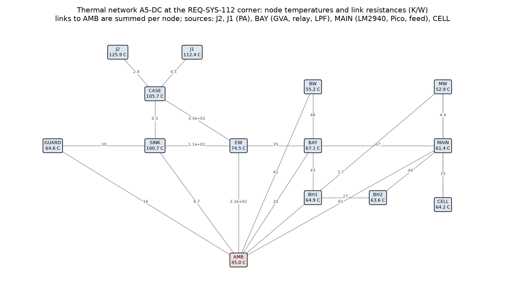
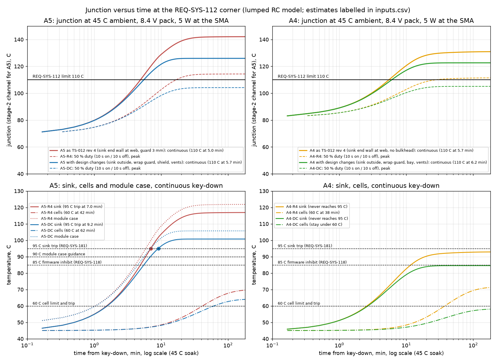
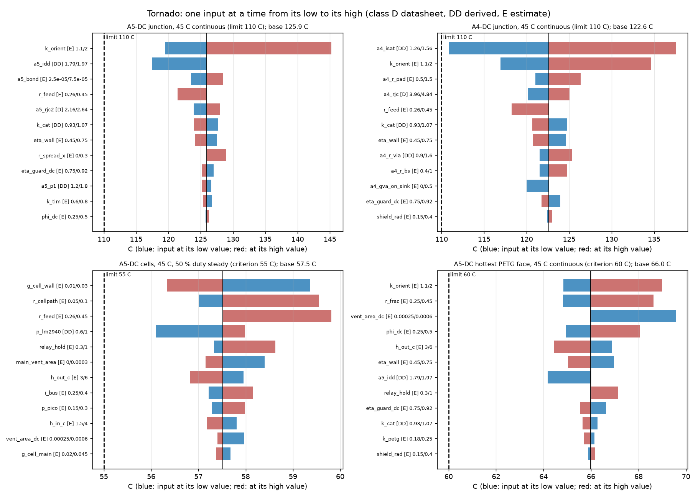
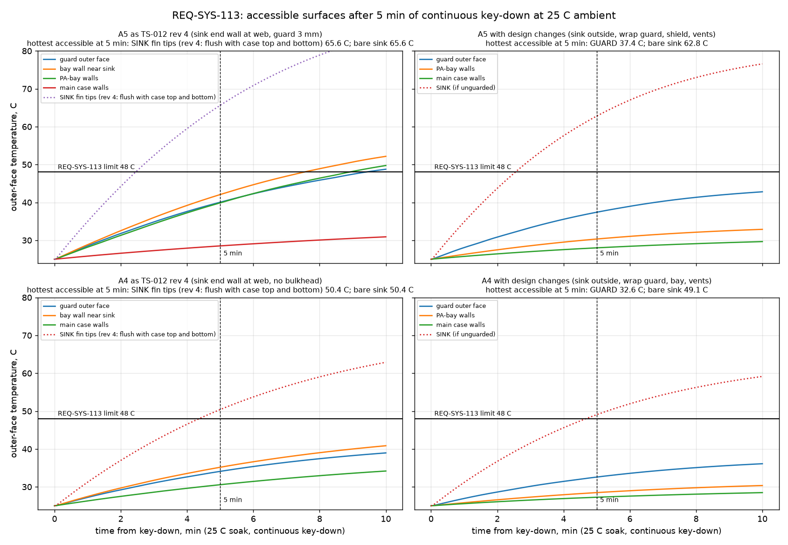
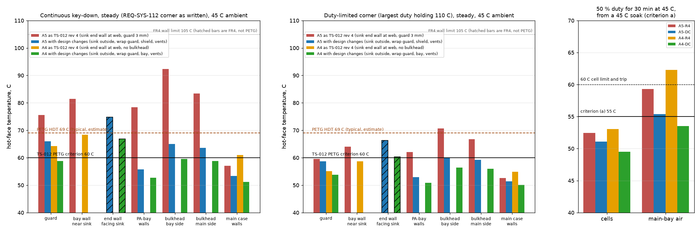
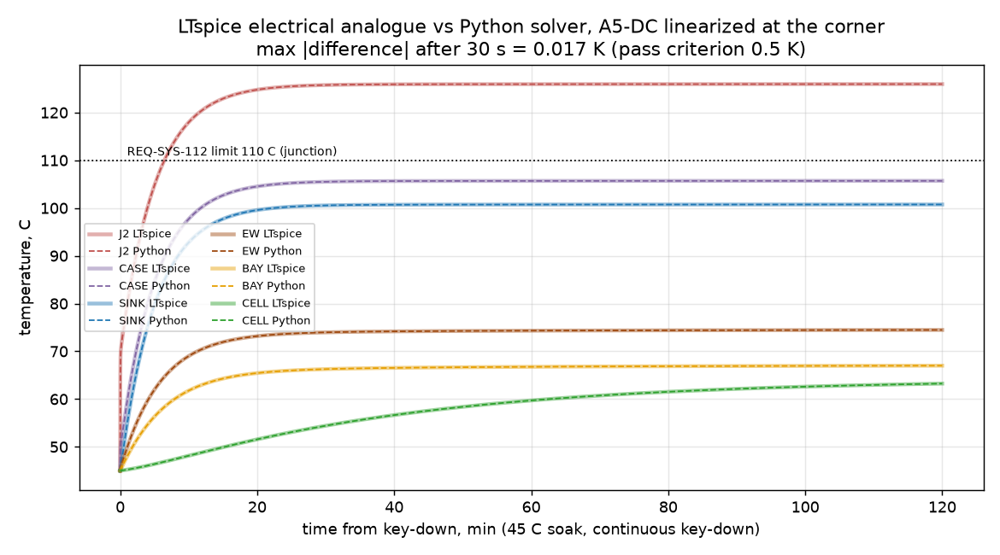

# PA, heat sink and PETG case thermal model for the TS-012 finalists A4 and A5

| Field | Value |
|---|---|
| Product | `docs/design/analysis/thermal-ts012.md` (analysis note, thermal budget) |
| Work package | WP-PDR-28 pre-order thermal item of TS-012 revision 4 (section 7.3: junction bullet, hand-hold surfaces and PETG bullet, heat inside the case and cells bullet; section 1 item 3; adversarial R-2 and R-4; INSP-110 O-9) |
| Authorization | Owner, status note 2026-09-28: "you should go ahead and run the simulations and analysis" |
| Author | Claude, analysis author invocation, 2026-09-28 |
| Model and checker | `hardware/sim/thermal/thermal_model.py` (network and inputs), `hardware/sim/thermal/ts012_thermal.py` (runner, plots, LTspice analogue); LTspice run only through `tools/ltspice-batch.sh` (ACC-LTSPICE-001) |
| Run | `hardware/sim/thermal/results/2026-09-28-ts012-r1/` (results file `verdicts.md`; block README `hardware/sim/thermal/README.md`) |
| Review record | None yet. An independent review with the analysis checklist is needed before the owner relies on it (section 9 item 8) |
| Evidence status | **Developer evidence** (numpy, scipy and matplotlib are class B tools without a TV record). Every temperature below is an **ESTIMATE**; every input is classed in `inputs.csv` as D (datasheet), DD (derived from a datasheet), R (requirement or TS-012 criterion) or E (estimate, Low confidence). The LTspice electrical analogue of the network agrees with the Python solver to 0.017 K. That checks the solver, not the physics |
| AT RISK | TS-012 revision 4 is Proposed. REQ-SYS-112, 113, 118 and 181 carry TBR values. The WP-PDR-21 and 22 PA runs, which set the PA dissipation, are running in parallel. The PETG heat-deflection temperature is a typical value, because the filament datasheet has not been read |

## 1. Purpose

TS-012 revision 4 asks for one thermal check before the parts order, for both finalists (section 7.3). It covers:
- the PA junction and case at the worst corner (45 C ambient, 8.4 V pack with ALC back-off, continuous key-down; REQ-SYS-112, 110 C TBR);
- the split of the fins between outside air and the inside of the case;
- the PA-bay air and the bulkhead;
- the guard clearance and the interface material;
- every accessible surface against 48 C (REQ-SYS-113, 25 C ambient, 5 min of continuous key-down);
- the PETG walls against their heat-deflection limit;
- the cell-bay temperature.

TS-012 also names the pass criteria:
- junction at most 110 C and module case at most 90 C at the corner;
- every PETG surface within 5 mm of the sink, and every other PETG surface, at most 60 C at the 45 C corner;
- the guard's outer face at most 48 C at 25 C after 5 min;
- (a) at 50 % key-down duty for 30 min at 45 C, cells and main-bay air at most 55 C;
- (b) no cell above 60 C before the cell trip operates;
- (c) every PETG surface at most 60 C.

The model also reads the Boyd drawing, which is TS-012 owner price-check gate item 7 (section 3).

## 2. Method

A lumped thermal RC network: one node per part, each node with a heat capacity, conductances between nodes, and ambient as a fixed-temperature node (`thermal_model.py`). The node map is drawn in `network_a5dc.png`.

The nodes are:

| Node | Part |
|---|---|
| J2, J1 | RA07M1317M stage-2 and stage-1 channels (A5) |
| J | AFT05MS004N junction (A4) |
| CASE | the module flange (A5), or the AFT05 tab with its pad and the board tongue (A4) |
| SINK | the Boyd 530002B02500G |
| GUARD | the PETG finger guard |
| EF | the PETG walls within 5 mm of the sink's inner half (revision 4 layout) |
| EW | the end wall facing the sink's inner channel (design-change layout) |
| BAY | the PA-bay air with the RF board, relay and LPF |
| BW | the PA-bay walls |
| BH1, BH2 | the two 1.2 mm bulkhead walls |
| MAIN | the main-bay air with the main board, Pico 2, LM2940 and the feed parts |
| MW | the main case walls |
| CELL | the two 18650 cells |

How the sink loses heat:
- The sink-to-air conductance follows the Boyd natural-convection curve, digitized from the catalog page.
- The profile is symmetric about its web (drawing), so each side of the web carries half the fins. That gives an outer half, in outside air behind the guard, and an inner half, which faces the PA-bay air (revision 4 layout) or the case end wall across a gap (design-change layout).
- Each half splits into a convective share and a radiative share. The radiative share goes to the facing PETG parts or to ambient.
- The catalog curve is for a vertical extrusion in free air. It is derated for:
  - the horizontal extrusion axis of this mounting (the Boyd catalog: "performance in other orientations can DOUBLE the thermal resistance");
  - the guard;
  - the enclosed bay or the end-wall gap.

How the case loses heat: PETG walls are wall nodes with inside and outside films. Radiation is computed at node temperatures (emissivity 0.9 outside, 0.8 effective inside). The PA-bay and main-bay slots are chimney vents whose flow follows the stack effect.

The four layouts:

| Layout | What it is |
|---|---|
| A5-R4, A4-R4 | TS-012 revision 4 as written. The sink is the case end wall at its web, so the inner half of the fins is inside the case. The guard is 3 mm from the fin tips, over the end face only (section 8.5 length stack). A5 has the vented PA bay and double-wall bulkhead; A4 has neither (section 7.1, A4 cell-heating row) |
| A5-DC, A4-DC | The design changes of section 7, the same for both finalists |

Heat sources:
- **Keyed:**
  - the PA (A5 split 1.5 W stage 1, the rest stage 2);
  - the GVA-84+, in the PA bay for A5 and on the PA board, into the sink, for A4;
  - the 0.6 W LPF and relay RF loss;
  - the feed I2R (the TS-012 drain-feed budget, split between the cell path and the main-board parts).
- **Constant while a sending session lasts:**
  - the relay coil (hang time), 0.5 W, or 0.2 W with the PWM hold of the design change;
  - the LM2940, 0.9 W at 8.4 V;
  - the Pico 2 and op-amps, 0.2 W.

The cases run for each layout (`ts012_thermal.py`):
1. REQ-SYS-112 corner, steady state, continuous key-down at 45 C.
2. The same from a 45 C soak, 3 h transient, with the times at which the sink crosses the 85 C firmware inhibit (REQ-SYS-118) and the 95 C hardware trip (REQ-SYS-181).
3. 50 % duty (10 s on, 10 s off; 10 s is the longest key-down the REQ-SYS-055 cutoff allows) from a 45 C soak, for criterion (a) at 30 min.
4. A duty sweep from 10 to 100 %, periodic steady state with 10 s key-downs, giving the peak junction. The die follows each key-down, so the ripple is included.
5. The duty-limited corner: steady state at the largest duty that holds 110 C.
6. REQ-SYS-113: 25 C soak, continuous key-down, every accessible surface at 5 min.
7. A one-at-a-time tornado over every D, DD and E input, and a favourable and an adverse stack of all inputs.
8. The LTspice electrical analogue of the A5-DC network (1 V = 1 C, 1 A = 1 W), with conductances frozen at the corner, run through the wrapper and compared node by node with the Python solver.

## 3. Inputs, sources and what the datasheets showed

The full list with ranges is `results/2026-09-28-ts012-r1/inputs.csv`. The inputs that set the answer:

| Input | Value (range) | Class | Source |
|---|---|---|---|
| Boyd 530002B02500G profile | 41.91 x 25.40 mm, 63.50 mm long; web **1.57 mm**; channel **17.02 mm** wide both sides; channel depth (25.40 - 1.57) / 2 = 11.9 mm; radial fins symmetric about the web | D | Boyd "Board Level Cooling Catalog" (2024) p.56, 5297 to 5300 series drawing and ordering table (530002B02500G: A 63.50, B 18.29, C 3.17 mm), https://info.boydcorp.com/hubfs/Thermal/Air-Cooling/Boyd-Board-Level-Heatsinks-Catalog.pdf, read 2026-09-28 through the web-fetch tool (which caches the PDF it reads) |
| Sink natural convection | 2 W: 8.7 K ... 11 W: 41.2 K ... 19.8 W: 59 K; at the A5 corner (9.94 W) **3.8 K/W**, at the A4 corner (6.05 W) **4.2 K/W**, vertical, free air, no guard | DD (graph read, +/-7 %) | same page, 5300 dashed curve, digitized from a 900 dpi render (`sink_catalog_curve.png`) |
| "2.6 C/W" rating | Not the natural-convection value at 6 to 10 W. "20 W @ 60 C" is 3.0 K/W | D | Farnell 2295719 and the pdf.support Aavid listing (2.6 C/W natural, 2.0 C/W at 300 LFM, 20 W at 60 C), https://uk.farnell.com/aavid-thermalloy/530002b02500g/heat-sink-2-6k-w-to-220/dp/2295719 and https://www.pdf.support/aavidthermalloy.com/530002B00000G.html, read 2026-09-28 |
| Orientation derate | x1.35 (1.10 to 2.0) for the horizontal extrusion axis | E | Boyd catalog p.3: "performance in other orientations can DOUBLE the thermal resistance" |
| Sink mass | **57 g** (52 to 62) | DD | profile area 330 to 340 mm2 by pixel count of the drawing x 63.5 mm x 2.70 g/cm3; TS-012 8.5 carried 30 to 60 g unread |
| RA07M1317M outline | flange 30.0 x 10.0 mm, body 21.2 x 10.0, height 5.4, copper contact face 19.2 x 7.4 mm (**1.42 cm2**), screw slots 26.6 mm apart, leads 6.0 mm long exiting the long side 2.3 mm above the flange face | D | Mitsubishi RA07M1317M datasheet, Jun 2019, p.6, https://www.mitsubishielectric.com/semiconductors/hf/products/datasheet/ra07m1317m.pdf, read 2026-09-28 |
| RA07M1317M thermal | Rth(ch-case) stage 2 **2.4**, stage 1 **4.5 C/W**; "keep the module case temperature (Tcase) below 90 C"; heat sink "including the contact resistance" 3.77 C/W for 60 C air | D | same datasheet, p.8 |
| A5 dissipation | **9.94 W** at the corner (8.60 nominal; 10.95 on a bench supply with no feed drop) | DD | TS-012 7.3 method: 45 % minimum efficiency at 6 W and 7.2 V, class-B scaling to 5.6 W, +10 %, drain 8.4 V less 0.26 ohm x IDD |
| Compound joint | 0.50 K/W (0.24 to 0.72): 50 um (25 to 75) at 0.70 W/m K on 1.42 cm2 | E | TS-012 7.3 bond line and conductivity; TS-012 used 2.6 cm2 and 0.2 to 0.4 K/W, but the datasheet contact face is 1.42 cm2 |
| AFT05MS004N | RthJC **4.4 C/W** (case 79 C, 4.0 W CW, 7.5 V, 520 MHz); VHF reference 6.0 to 6.1 W at 61.8 to 69.1 % drain efficiency, typical only (no minimum) | D | NXP AFT05MS004N Rev 0, 7/2014, Tables 2 and 8 (`docs/research/pa-device-candidates.md` F10) |
| A4 dissipation | **5.55 W** at the corner (4.58 nominal, +10 %; 6.86 W if the hand match reaches only 50 % at saturation) | DD | 1.32 A saturated at 7.5 V from the typical 61.8 %, scaled to 5.6 W; drain 8.4 V less 0.26 ohm x IDD |
| A4 tab-to-sink chain | 2.5 K/W (1.8 to 4.1) = pad spreading 0.8 + slot and 30 vias in 0.8 mm 1.1 + board tongue to web 0.6 | E / DD | slot and via conductance computed (25 um plating, solder fill); spreading and board joint estimated |
| PETG | k 0.20 W/m K, 2 mm walls; heat-deflection temperature **69 C** (0.45 MPa, typical) | E | TS-011 values; the filament datasheet is not read |
| Relay | G5V-2 5 V standard coil 100 mA, 500 mW; ambient **-25 to 65 C** | D | Omron G5V-2 datasheet (as read for TS-012 revision 3) |
| Feed resistance | 0.26 ohm (0.26 to 0.45), of which cells and holders 0.06 | E | TS-012 7.3 feed budget |
| Films and vents | outer convection 4 (3 to 6) W/m2 K plus radiation; inner 2.5 (1.5 to 4) plus radiation; slots 3.6 cm2 each face (revision 4) or 5 cm2 (design change) | E | engineering values; TS-011 used 6 to 10 and 5 to 8 W/m2 K totals |

**Three facts from the Boyd drawing change the TS-012 picture.** Gate item 7 is read by this record.

1. **The rating is not the in-use resistance.** TS-012 revision 4's nominal 2.6 K/W and its "half the fins" 5.0 K/W bracket an in-situ value that the catalog puts at 3.8 K/W before any orientation, guard or enclosure derate. The model gives an in-situ sink-to-ambient resistance of **5.6 K/W for A5-DC and 7.2 K/W for A5 as revision 4 drew it**. For A4 the figures are 6.5 and 7.9 K/W.

2. **The module sits in a channel, not on a face.** The flat mounting face is the 1.57 mm web between two 11.9 mm channel walls, 17.02 mm apart.
   - For A5, the 10 mm wide flange fits, with its 30 mm length along the extrusion. The screw slots are 26.6 mm apart, so M2.6 screws go through the web with nuts: less than two threads fit in 1.57 mm.
   - The module's leads leave the long side 2.3 mm above the web and are 6 mm long. With the module centred they point at a channel wall 3.5 mm away.
   - So the RF board cannot be "mounted beside the module on the sink's inner face" (TS-012 8.1). Either a board tongue at most about 6.5 mm wide enters the channel beside an offset module, or the leads are formed, which the datasheet warns against stressing.
   - For A4, the 40 x 35 mm PA board cannot lie flat on the web either. Only a tongue at most 16.5 mm wide carrying the AFT05 and its via field fits in the channel.
   - These are WP-PDR-27 and WP-PDR-37 items (mechanical finding M-1, section 9).

3. **Half the fins are on each side of the web, and the fin tips span the full 41.91 x 63.5 mm.**
   - With the web as the case end wall (TS-012 7.3), half the fin area is in the PA bay. There is no mounting that puts "the most fin area outside" while the device sits inside the case.
   - In the TS-012 8.5 stack (a 42 mm case), the top and bottom fin tips are flush with the case's top and bottom faces, so a hand reaches them. The revision 4 guard covers the end face only (mechanical finding M-2).

## 4. Results

### 4.1 Junction at the REQ-SYS-112 corner

| Layout | Junction, continuous, steady | Favourable to adverse input stack | Module case / AFT05 tab | Sink | Sink reaches 95 C trip |
|---|---|---|---|---|---|
| A5-R4 | **142 C** | 112 to 183 C | 122 C | 117 C | 7.0 min |
| A5-DC | **126 C** | 97 to 174 C | 106 C (guidance 90) | 101 C | 9.2 min |
| A4-R4 | **131 C** | 101 to 180 C | 107 C | 93 C | never |
| A4-DC | **123 C** | 92 to 174 C | 98 C | 85 C | never |

Continuous key-down at 45 C passes 110 C after 5 to 6 min in every layout.

At 25 C ambient, continuous key-down holds 110 C with the design changes: A5-DC 106 C, A4-DC 103 C.

With 10 s key-downs at 45 C, the largest duty that holds 110 C is:

| Layout | Largest duty | Peak junction at 50 % duty |
|---|---|---|
| A5-R4 | 40 % | 114 C |
| A5-DC | 60 % | 104 C |
| A4-R4 | 45 % | 112 C |
| A4-DC | 60 % | 105 C |

What drives the junction (tornado, design-change layouts):
- **A5:** the orientation derate of the sink dominates (120 to 145 C over 1.1 to 2.0). Next come the drain current (118 to 126 C) and then the bond line, feed resistance and Rth(ch-case) (about +/-2 to 3 K each).
- **A4:** the AFT05 current dominates (111 to 138 C over the +10 % and 50 %-match cases, since the datasheet gives no minimum efficiency). Next comes orientation (117 to 135 C), then pad spreading and RthJC.
- Levers tried:
  - Lying the radio on its side (extrusion vertical, the catalog condition) gives 116.5 C (A5-DC) and 114.5 C (A4-DC). Still over 110 C.
  - The best guard (0.95 effectiveness) gives 124.4 C and 121.0 C.
  - Removing the guard altogether gives 123.3 C and 120.0 C.
  - So guard clearance buys 1 to 3 K. It is not the lever TS-012 hoped for.

**Junction bound by an inhibit (design lever, both finalists).** Suppose the REQ-SYS-118 85 C firmware inhibit reads an NTC on the PA case: on the flange under a screw (A5), or on the top-copper pad at the tab (A4; TS-011 rule 14). Then the junction is bounded by the trip temperature plus the case-to-junction rise alone. That rise uses datasheet values and does not depend on the uncertain sink-to-air path.
- A5: 85 + 8.44 W x 2.4 = **105.3 C**; 108.3 C at the +3 C trip tolerance; 113.7 C with the tolerance, a bench supply (10.95 W) and Rth +10 %.
- A4: 85 + 5.55 x 4.4 = **109.4 C**; **112.4 C** at the +3 C tolerance; 121.2 C adverse.
- So A4 needs a lower setpoint, about 82 C at the pad, to hold 110 C at the tolerance edge.

A firmware duty limit that refuses a new key-down while the sink NTC reads above S gives the same protection with the NTC on the sink. S is set so that a 13 s key-down starting at S holds 110 C: **S = 82 C for A5 and 70 C for A4**.

### 4.2 Accessible surfaces (REQ-SYS-113, 25 C, 5 min)

| Layout | Hottest accessible surface at 5 min | Verdict (48 C) |
|---|---|---|
| A5-R4 | fin tips flush with the case top and bottom, **65.6 C** | FAIL |
| A5-DC | guard outer face, 37.4 C (bare sink 62.8 C, so the wrap guard is required) | PASS |
| A4-R4 | fin tips, **50.4 C** | FAIL |
| A4-DC | guard outer face, 32.6 C (bare sink 49.1 C, so A4 needs the guard too) | PASS |

TS-012 section 7.3 says of A4 that "its hand-hold surfaces hold (37 to 41 C, adversarial C20)". With the catalog curve that does not hold for the bare fins.

### 4.3 PETG parts, PA bay, cells

| At 45 C ambient | Criterion | A5-R4 | A5-DC | A4-R4 | A4-DC |
|---|---|---|---|---|---|
| Hottest PETG, continuous | 60 C (HDT 69) | 92 C bulkhead FAIL | 66 C guard FAIL | 68 C bay wall FAIL | 59.6 C PASS |
| Hottest PETG, duty-limited corner | 60 C | 71 C FAIL | **60.1 C** bulkhead FAIL by 0.1 K | 59 C PASS | 56 C PASS |
| FR4 end wall (design change), continuous and duty-limited | 105 C | - | 75 and 66 C PASS | - | 67 and 60 C PASS |
| PA-bay air (G5V-2 rated 65 C), continuous and duty-limited | 65 C | 89 and 70 C FAIL | 67 C FAIL, 61 C PASS | 73 C FAIL, 64 C PASS | 61 and 57 C PASS |
| (a) cells after 30 min at 50 % | 55 C | 52 C PASS | 51 C PASS | 53 C PASS | 50 C PASS |
| (a) main-bay air after 30 min at 50 % | 55 C | 59 C FAIL | **55.4 C** FAIL by 0.4 K | 62 C FAIL | 54 C PASS |
| Cells, long session at the duty limit, steady | 55 C, trip 60 C | 60 C | 59 C | 62 C | 55 C |
| (b) cells, continuous: time to the 60 C trip | trip operates | 42 min | 62 min | 38 min | never (58 C) |

Criterion (b) holds for every layout: the cell trip operates before a cell passes 60 C. For A4 as revision 4 drew it, the cell trip (38 min) is what ends a long continuous transmission at 45 C; for A5 the 95 C sink trip acts first (7 to 9 min).

The PA bay:
- Its air is 67 C (A5-DC) to 89 C (A5-R4) under continuous key-down. The bay's own 1.6 W (GVA-84+, relay coil, LPF loss) and, in revision 4, the inner half of the sink heat it.
- The revision 4 estimate of 54 to 56 C for the cell bay held the bay side of the bulkhead at 60 C. The computed bay air is 89 C (INSP-110 O-9 asked for it). The bulkhead's bay-side wall reaches 92 C, above the PETG heat-deflection temperature.

The main bay dissipates about 2.1 W at the corner:
- the LM2940, 0.9 W;
- the feed parts, 1.0 W (mostly the two DMP3099L in the drain path, which the revision 3 balance did not count);
- the Pico 2 and op-amps, 0.2 W.

That alone lifts the main-bay air 15 to 20 K above ambient in a closed PETG box, whatever the PA path does.

### 4.4 Solver cross-check

The A5-DC network, frozen at the corner, was written as an LTspice netlist (`results/.../ltspice/thermal_a5dc.net`) and run through `tools/ltspice-batch.sh`:
- LTspice 26.0.2, exit 0, deck SHA-256 `b804c278...`;
- `.log` and `.raw` kept;
- `.meas` J2 at 7200 s = 125.945 C;
- largest node difference to the Python backward-Euler solver after 30 s: 0.017 K (criterion 0.5 K), PASS.

## 5. Verdicts per finalist

| | A4 (AFT05MS004N, hand-matched) | A5 (RA07M1317M module) |
|---|---|---|
| **REQ-SYS-112 as written** (continuous key-down, 45 C) | **FAIL**: 131 C as revision 4 drew it, **123 C** with the design changes (92 to 174 C over the input stacks). Not closable by sink orientation or guard clearance | **FAIL**: 142 C as revision 4 drew it, **126 C** with the design changes (97 to 174 C). Module case 106 C against the 90 C guidance. Not closable by sink orientation or guard clearance |
| **REQ-SYS-112 with a duty-limited corner** (firmware duty limit; needs the requirement delta) | **CONDITIONAL PASS**: up to 60 % key-down duty at 45 C; 105 C at 50 %. The inhibit bound at the pad is 109.4 C and **fails at the +3 C trip tolerance** (112.4 C), so the setpoint must drop to about 82 C at the pad or 70 C at the sink. The bound rests on an estimate-heavy chain (no minimum efficiency; hand match; slot, pad and board joint) | **CONDITIONAL PASS**: up to 60 % duty at 45 C; 104 C at 50 %. The inhibit bound on the flange is 105.3 C, and 108.3 C at the +3 C tolerance, from datasheet values; 113.7 C only with a bench supply and Rth +10 % |
| **Continuous at 25 C** (for a 25 C corner delta) | 103 C PASS | 106 C PASS |
| **REQ-SYS-113** (every accessible surface at most 48 C, 25 C, 5 min) | FAIL as revision 4 drew it (fin tips 50.4 C); **PASS** with the wrap guard (32.6 C) | FAIL as revision 4 drew it (fin tips 65.6 C); **PASS** with the wrap guard (37.4 C) |
| **PETG** (60 C; HDT 69 C typical) | PASS with the design changes (59.6 C continuous; 56 C at the duty limit) | **Marginal**: 66 C (guard) continuous, under the 69 C HDT but over 60 C; **60.1 C** (bulkhead) at the duty limit; 58.7 C at 50 % |
| **Cells and main bay** | PASS with the design changes: (a) 50 C and 54 C; long session 55 C | (a) cells 51 C PASS, **main-bay air 55.4 C, FAIL by 0.4 K**; long session 59 C, under the 60 C trip and over 55 C |
| **Relay ambient** (65 C) | PASS (61 C continuous) | PASS at the duty limit (61 C); FAIL continuous (67 C) |
| **Reading** | Half the heat in the box: every case, surface and cell criterion passes with the design changes. The junction is the weak point, with the least certain chain | The junction is bounded more robustly by the inhibit. But twice the heat sits in the case, so PETG, main-bay and relay margins are 0 to 4 K. Every one of them needs the duty limit |

**Effect on the TS-012 scores (input to its revision; this record does not change them):**
- The Low-cell move "A5 C8 +1" (section 6), which would put A5 first at 350, **is not supported**. A5's junction estimate with every design change is 126 C nominal, and its range spans 110 C, as A4's does. C8 stays 2 for both on the section 3.1 rule.
- Both finalists need the same REQ-SYS-112 delta. TS-012 7.3 already names it as the fallback.
- The wrap guard and end-wall gap cost both finalists about +10 mm of height at the sink end, +4 mm of width and +14 mm of length (section 7). That is a C6 change for both.
- The TS-012 statement that A4's surfaces hold without a guard is withdrawn by section 4.2.

## 6. Limitations

1. **Lumped model.** One node per part: the sink is isothermal, and each PETG part is one node with a half-wall correction for its hot face. Local hot spots are not resolved:
   - the PETG next to a fin tip or a screw boss;
   - the LM2940 tab;
   - the relay coil;
   - the region of a cell nearest the bulkhead.
   The 60 C PETG criterion is therefore met on average, not shown point by point.
2. **The sink-to-air path is estimated.** The catalog curve (graph read) is the only datasheet anchor. The orientation, guard, enclosure and end-wall derates are engineering judgement (class E). The orientation derate alone moves the A5 junction over 25 K. The plume and radiation shares that heat the guard are estimates.
3. **Dissipation.** A5 follows the TS-012 class-B scaling of the datasheet minimum efficiency with a 10 % allowance. A4 follows the typical efficiency of a reference circuit the owner will not copy. The WP-PDR-21 and 22 PA runs should replace both.
4. **Chimney flow** uses a textbook stack-effect formula with a discharge coefficient of 0.6 and one orientation (radio lying flat). Upright, or on a table that blocks the bottom slots, the vents do less (tornado: halving the design-change PA-bay slot area raises the A5-DC PETG maximum by 3.6 K).
5. **Material data.** The PETG heat-deflection temperature (69 C) and conductivity are typical values, not the owner's filament. The FR4 limit of 105 C is set below the laminate Tg with margin (estimate).
6. **Worst case, not typical use.** The duty sweep assumes 10 s key-downs, the longest the cutoff allows. Ordinary CW at 50 % element duty in shorter elements gives a lower junction peak.
7. **What the solver check covers.** The LTspice analogue checks the solver and network assembly (frozen conductances). It does not check the physics or the inputs. The model has **no bench correlation yet**.

## 7. Design changes that close the gaps

These apply to both finalists. Each was run in the model (the DC layouts). None has a listed-price line.

1. **Sink wholly outside the case end wall (orientation O3).**
   - The device goes in the inner channel, facing the case. The end wall stands 5 mm from the inner fin tips.
   - This removes the inner half of the fins from the PA bay. With the whole design-change set, A5 bay air falls from 89 to 67 C (continuous) and the junction from 142 to 126 C; most of that comes from this change.
   - Length: +6.6 mm (5 mm gap and a 1.6 mm wall). The module and the 13 mm RF-board zone stay as TS-012 8.5 has them.
   - Lead access: an A5 RF-board tongue at most 6.5 mm wide, or an A4 PA-board tongue at most 16.5 mm wide, enters the channel (section 3, fact 2).
2. **The end wall facing the sink is a spare JLCPCB board** (FR4, from the five of each design already in the order), with its HASL copper toward the sink as a radiation shield, held in a PETG frame. The 60 C PETG criterion then no longer applies to the one wall that cannot meet it (75 C continuous, 66 C at the duty limit; FR4 limit 105 C).
3. **Guard wrapping the sink.**
   - End face 10 mm from the fin tips; top, bottom and profile ends 3 mm; 2 mm slotted grille, slots narrow enough that the test finger cannot reach a fin (WP-PDR-27 scripted finger check).
   - It closes REQ-SYS-113 for both finalists.
   - Envelope at the sink end: about 52 mm tall (41.9 + 2 x 5) and 74 mm wide (63.5 + 2 x 5). Length about 167 mm (174 mm with the SMA): +7 mm for the 10 mm end clearance and +6.6 mm for change 1.
4. **Larger PA-bay slots** (5 cm2 each, top and bottom, about 55 % open; check against the IPX2 drip case) and **main-bay slots** in the bottom and lower and upper sides (2 cm2 each; no top slots, for IPX2).
5. **Relay coil at reduced power.** Either:
   - a PWM hold after pull-in (firmware plus the existing driver; the G5V-2 datasheet gives must-operate 75 % and must-release 5 %, but no guaranteed hold voltage, so a bench check is required); or
   - the G5V-2 high-sensitivity 5 V coil (30 mA, 150 mW, datasheet), whose price is read at the gate.
   Either saves about 0.3 W in the bay and 0.17 W in the LM2940.
6. **Firmware duty limit** (TS-012 7.3 fallback, now required for both):
   - Refuse a new key-down, with a Morse announcement, while the sink NTC reads above S. S is 82 C for A5 and 70 C for A4 (section 4.1).
   - Or put the REQ-SYS-118 NTC on the PA case: the flange screw for A5; the tab pad for A4, with the setpoint lowered to about 82 C.
   - Either holds 110 C at up to about 60 % duty at 45 C. The REQ-SYS-181 95 C hardware trip on the sink stays as the independent backstop.
   - This requires a **REQ-SYS-112 delta** (KDR) for the owner by CR. The options:
     - a duty-limited corner (for example "at most 110 C at 50 % key-down duty in 10 s key-downs at 45 C"); or
     - a 25 C corner for continuous key-down, which both finalists pass (106 and 103 C).

Changes 1 to 3 close REQ-SYS-113 and most of the PETG gap. Change 6 closes REQ-SYS-112 only by changing its corner. After all six, the residuals are:

| Residual | A5 | A4 |
|---|---|---|
| Hottest PETG at the duty limit | 60.1 C (bulkhead bay side) | none |
| Main-bay air, criterion (a) | 55.4 C, over by 0.4 K | none |
| Cells, long sessions at 45 C | 59 C, under the trip | none |
| PA bay, continuous at 45 C | over the relay rating (67 C) | none |

Two further no-cost levers, not in the run, reduce the A5 residuals:
- moving the DMP3099L drain switches from the main board to the RF board (about 0.6 W out of the main bay; in the author's check before the final run, about -1.5 K main-bay air and +3 K bay air);
- a lower-drop 5 V path, which is not free.

## 8. What closes before the order

1. **Owner decision: the REQ-SYS-112 delta** (section 7 change 6), by CR. Without it neither finalist meets a KDR.
2. **Owner bench measurement of the sink in situ.** This replaces the largest estimates (orientation, guard and end-wall derates; tornado rank 1 for both finalists), as TS-011 section 8 rule 3 proposed.
   - Set-up: a power resistor dissipating the A5 corner value (10 W) or the A4 value (6 W) on the web of the actual Boyd part, inside a printed guard and end-wall coupon, with the radio's orientation (extrusion horizontal).
   - Readings after 30 min: sink and guard temperatures, and the ambient.
   - The owner's Fluke meter can do this only if it has a temperature function and a thermocouple (models such as the 87V or 179 do; the 115 and 117 do not). If it has none, a K-type bead probe is an equipment-cap item.
   - Pass: in-situ resistance at most 5.6 K/W (A5) or 6.5 K/W (A4), the model's values. A higher value lowers the allowed duty, and the firmware setpoint still bounds the junction.
3. **PETG filament datasheet**: the heat-deflection temperature at 0.45 MPa of the owner's filament. If it is under 69 C, the continuous-corner PETG margins shrink by the difference.
4. **For A4: the WP-PDR-21 match run** to bound the AFT05 drain efficiency, because its current is the largest junction input. At 50 % efficiency the junction is 138 C continuous, and the inhibit bound at the pad needs a setpoint of about 77 C.
5. **Mechanical items to WP-PDR-27 and 37:**
   - M-1, channel lead access (tongue or lead forming);
   - M-2, the wrap guard and its envelope;
   - M-3, nuts behind the 1.57 mm web;
   - the FR4 end wall and its PETG frame;
   - the slot areas against IPX2.
6. **Firmware requirement for the duty limit or inhibit placement**, via the SW requirements:
   - NTC on the A5 flange screw or the A4 tab pad;
   - setpoints as in section 4.1, with the +3 C tolerance counted.
7. **Relay hold**: a bench check of the PWM hold current, or the high-sensitivity coil price at the gate.
8. **Independent review** of this record with the analysis checklist before the owner relies on it. After assembly, the bench checks of TS-012 7.3 remain: thermocouple on the guard and case after 5 min at 25 C; on a cell after 30 min at 50 % duty.

## 9. Findings for the lead SE (not changes made here)

- **M-1.** TS-012 8.1 places the RF board "beside the module on the sink's inner face". The 17.02 mm channel does not allow it (section 3, fact 2). A4's 40 x 35 mm PA board has the same problem.
- **M-2.** TS-012 8.5's 42 mm case height leaves the top and bottom fin tips reachable. REQ-SYS-113 fails for both finalists as drawn (section 4.2).
- **M-3.** The flange screws need nuts behind the 1.57 mm web. Screws tapped into the web get less than two threads.
- **T-1.** The TS-012 7.3 A5 figures used 2.6 cm2 of flange contact. The datasheet face is 1.42 cm2, which roughly doubles the interface resistance to about 0.5 K/W.
- **T-2.** The revision 3 cell-bay balance counted 0.8 to 1.1 W in the main bay. The feed parts add about 1.0 W at the corner, so the main bay carries about 2.1 W.
- **T-3.** The 90 C module-case guidance is exceeded in every continuous A5 case. At the duty limit the case is 84 to 87 C.

## 10. References

- Boyd, Board Level Cooling Catalog (2024), pp.3 and 56, https://info.boydcorp.com/hubfs/Thermal/Air-Cooling/Boyd-Board-Level-Heatsinks-Catalog.pdf, read 2026-09-28.
- Farnell 2295719 listing, https://uk.farnell.com/aavid-thermalloy/530002b02500g/heat-sink-2-6k-w-to-220/dp/2295719, and pdf.support Aavid 530002B page, https://www.pdf.support/aavidthermalloy.com/530002B00000G.html, both read 2026-09-28.
- Mitsubishi Electric, RA07M1317M datasheet, Jun 2019, pp.6 and 8, https://www.mitsubishielectric.com/semiconductors/hf/products/datasheet/ra07m1317m.pdf, read 2026-09-28.
- NXP (Freescale), AFT05MS004N datasheet Rev 0, 7/2014, Tables 2 and 8 (`docs/research/pa-device-candidates.md` F10).
- Omron G5V-2 datasheet, general specifications and coil table (as read for TS-012 revision 3).
- TS-012 revision 4 (`docs/decisions/trade-studies/TS-012-design-to-cost-hand-built.md`, 7d0d450), sections 1, 7 and 8; INSP-110 (`docs/reviews/PDR/checklists/ts-012-design-to-cost.md`) O-9 and finding-11; TS-011 thermal screen (`hardware/sim/enclosure/thermal_screen.py`).

## Change log

| Revision | Date | Change |
|---|---|---|
| 0 | 2026-09-28 | Initial: run `2026-09-28-ts012-r1` |
