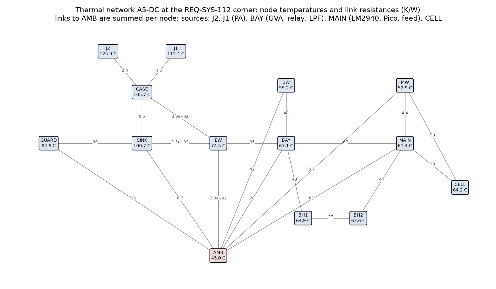
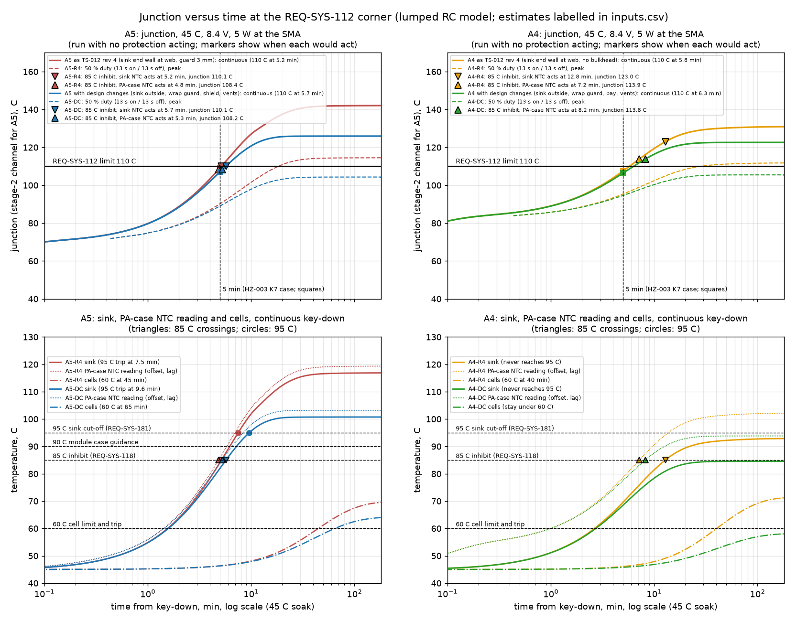
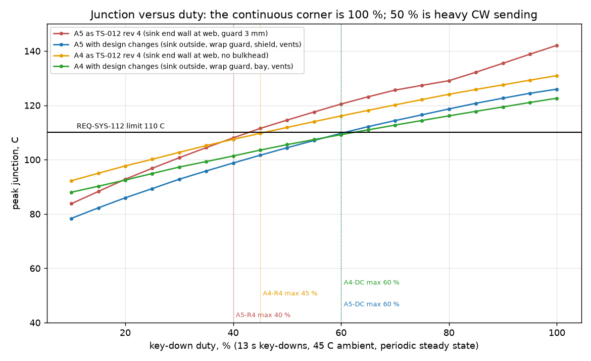
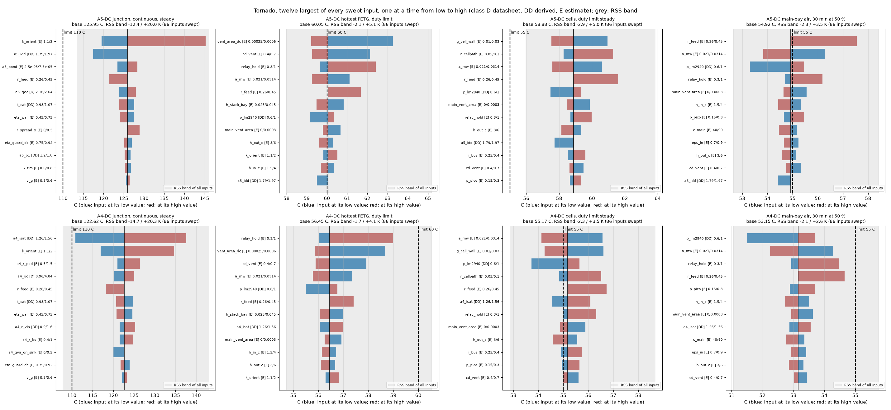
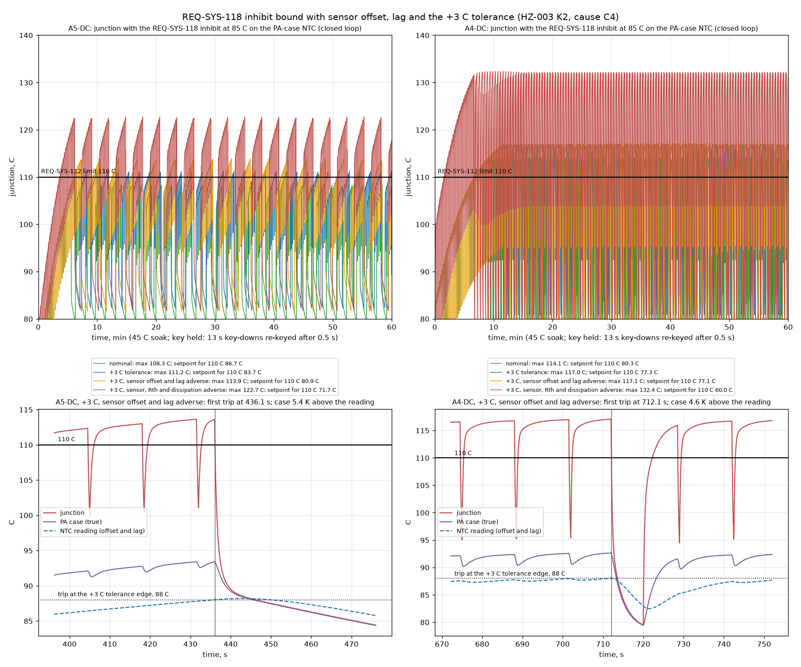
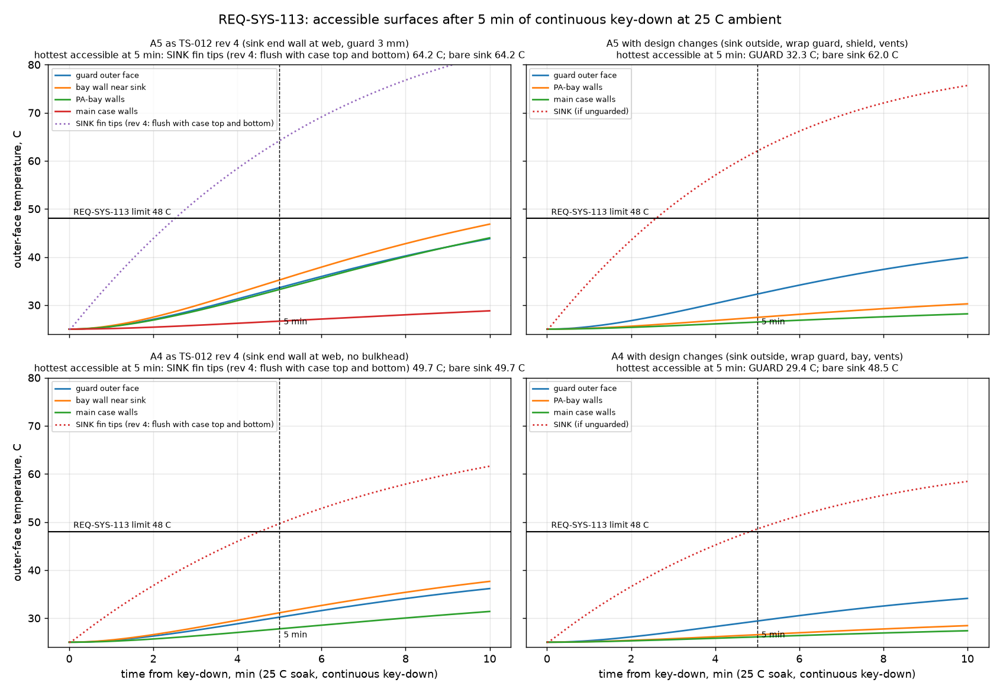
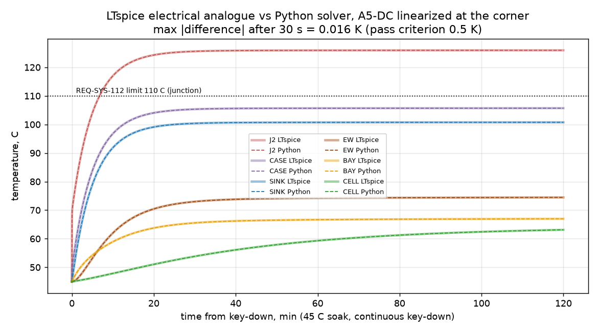
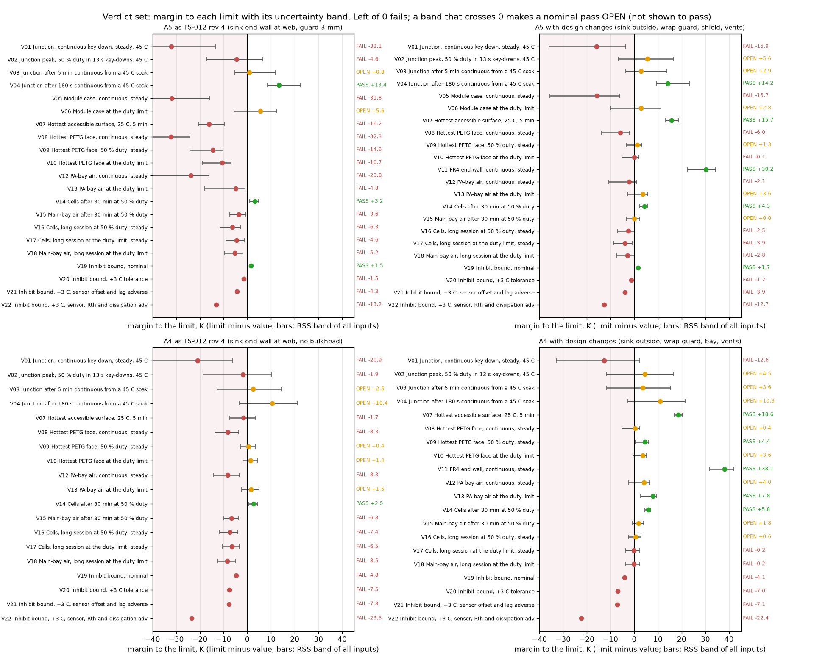

# PA, heat sink and PETG case thermal model for the TS-012 finalists A4 and A5

| Field | Value |
|---|---|
| Product | `docs/design/analysis/thermal-ts012.md` (analysis note, thermal budget), revision 1 |
| Work package | WP-PDR-28 pre-order thermal item of TS-012 revision 4 (section 7.3: junction bullet, hand-hold surfaces and PETG bullet, heat inside the case and cells bullet; section 1 item 3; adversarial R-2 and R-4; INSP-110 O-9) |
| Authorization | Owner, status note 2026-09-28: "you should go ahead and run the simulations and analysis" |
| Author | Claude, analysis author invocation, 2026-09-28 (revision 0 at `0caa0cc`; revision 1 answers INSP-112) |
| Model and checker | `hardware/sim/thermal/thermal_model.py` (network, inputs, closed-loop inhibit), `hardware/sim/thermal/ts012_thermal.py` (runner, plots, LTspice analogue, checker). LTspice runs only through `tools/ltspice-batch.sh` (ACC-LTSPICE-001). Checker: `.venv/bin/python hardware/sim/thermal/ts012_thermal.py --check` compares the verdict set of section 5 with the computed one, row for row, and the LTspice cross-check with 0.5 K; it prints every difference and exits 1 on any. Exit status at this revision: 0 (section 11) |
| Run | `hardware/sim/thermal/results/2026-09-28-ts012-r2/` (results file `verdicts.md`; block README `hardware/sim/thermal/README.md`). Run r1 (revision 0) is kept unchanged for the review trail |
| Review record | INSP-112 iteration 1 (`docs/reviews/PDR/checklists/analysis-thermal-ts012.md`), NEEDS CHANGES: 4 Major, 10 Minor. Section 12 lists what this revision did for each finding. Iteration 2 (delta) is needed before the owner relies on the note |
| Evidence status | **Developer evidence.** numpy 2.5.3, matplotlib 3.11.2 and spicelib 1.6.3 (which reads the LTspice `.raw`; scipy 1.18.1 enters only as its dependency and is not imported) are class B tools of `tools/toolchain.lock.md` section 2 without a TV record; LTspice 26.0.2 is accredited (TV-014). Every temperature below is an **ESTIMATE**. All 112 inputs are in `inputs.csv` with class D (datasheet), DD (derived from a datasheet), R (requirement or TS-012 criterion) or E (estimate, Low confidence); 86 carry a range and are swept in the tornado; 4 sensor inputs (NTC offset fractions and time constants) are varied in the explicit inhibit cases; the inhibit hysteresis (E, 3 to 10 C) is held at 5 C because it sets the cycling, not the peak; 21 are fixed (requirements, limits and exact datasheet values). The LTspice electrical analogue agrees with the Python solver to 0.016 K. That checks the solver, not the physics |
| AT RISK | TS-012 revision 4 is Proposed. REQ-SYS-112, 113, 118 and 181 carry TBR values. The WP-PDR-21 and 22 PA runs, which set the PA dissipation, are running in parallel. The PETG heat-deflection temperature is a typical value, because the filament datasheet has not been read |

## 1. Purpose

TS-012 revision 4 asks for one thermal check before the parts order, for both finalists (section 7.3). It covers:
- the PA junction and case at the worst corner (45 C ambient, 8.4 V pack with ALC back-off, continuous key-down; REQ-SYS-112: "The transceiver shall hold the PA junction at or below 110 C (TBR) during continuous key-down at the 5 W step in 45 C ambient");
- the split of the fins between outside air and the inside of the case;
- the PA-bay air and the bulkhead;
- the guard clearance and the interface material;
- the hand-hold surfaces (REQ-SYS-113: "The transceiver shall keep hand-hold surfaces at most 48 C (TBR) after 5 min of continuous key-down at 5 W in 25 C ambient"). The set this note checks is wider than "hand-hold": every surface a hand can reach, which is the WP-PDR-28 reading of CR-003 revision 3 (the guard outer face, every PETG outer face, and any fin tip left exposed). TS-012's own criterion names the guard's outer face;
- the PETG walls against their heat-deflection limit;
- the cell-bay temperature.

TS-012 also names the pass criteria:
- junction at most 110 C and module case at most 90 C at the corner;
- every PETG surface within 5 mm of the sink, and every other PETG surface, at most 60 C at the 45 C corner;
- the guard's outer face at most 48 C at 25 C after 5 min;
- (a) at 50 % key-down duty for 30 min at 45 C, cells and main-bay air at most 55 C;
- (b) no cell above 60 C before the cell trip operates;
- (c) every PETG surface at most 60 C.

The hazards this note bounds (section 9): **HZ-003** (PA and enclosure over-temperature and contact burn; controls K1, K2, K7, K8, K9, K10; causes C1, C4, C5) and **HZ-007** (cell heating, cause C5, controls K4 and K5). The risks: **RSK-006** (junction), **RSK-026** (surface), **RSK-007** (cells).

The model also reads the Boyd drawing, which is TS-012 owner price-check gate item 7 (section 3).

## 2. Method

A lumped thermal RC network: one node per part, each node with a heat capacity, conductances between nodes, and ambient as a fixed-temperature node (`thermal_model.py`). The node map is drawn in `network_a5dc.png`.

The nodes are:

| Node | Part |
|---|---|
| J2, J1 | RA07M1317M stage-2 and stage-1 channels (A5) |
| J | AFT05MS004N junction (A4) |
| CASE | the module flange (A5), or the AFT05 tab with its pad and the board tongue (A4) |
| SINK | the Boyd 530002B02500G |
| GUARD | the PETG finger guard |
| EF | the PETG walls within 5 mm of the sink's inner half (revision 4 layout) |
| EW | the end wall facing the sink's inner channel (design-change layout) |
| BAY | the PA-bay air with the RF board, relay and LPF |
| BW | the PA-bay walls |
| BH1, BH2 | the two 1.2 mm bulkhead walls |
| MAIN | the main-bay air with the main board, Pico 2, LM2940 and the feed parts |
| MW | the main case walls |
| CELL | the two 18650 cells |

How the sink loses heat:
- The sink-to-air conductance follows the Boyd natural-convection curve, digitized from the catalog page.
- The curve ends at 59 K rise (19.8 W). Above it the model holds the conductance at the last point. Natural-convection conductance rises with the rise, so this is conservative. One reported case lies there: A5-R4 continuous, at 71.9 K rise (`verdicts.md`, row "Beyond the catalog curve"). It fails by 32 K either way.
- The profile is symmetric about its web (drawing), so each side of the web carries half the fins. That gives an outer half, in outside air behind the guard, and an inner half, which faces the PA-bay air (revision 4 layout) or the case end wall across a gap (design-change layout).
- Each half splits into a convective share and a radiative share. The radiative share goes to the facing PETG parts or to ambient.
- The catalog curve is for a vertical extrusion in free air. It is derated for:
  - the horizontal extrusion axis of this mounting (the Boyd catalog: "performance in other orientations can DOUBLE the thermal resistance");
  - the guard;
  - the enclosed bay or the end-wall gap.

How the case loses heat: PETG walls are wall nodes with inside and outside films. Radiation is computed at node temperatures (emissivity 0.9 outside, 0.8 effective inside, both inputs with ranges). The PA-bay and main-bay slots are chimney vents whose flow follows the stack effect.

The four layouts:

| Layout | What it is |
|---|---|
| A5-R4, A4-R4 | TS-012 revision 4 as written. The sink is the case end wall at its web, so the inner half of the fins is inside the case. The guard is 3 mm from the fin tips, over the end face only (section 8.5 length stack). A5 has the vented PA bay and double-wall bulkhead; A4 has neither (section 7.1, A4 cell-heating row) |
| A5-DC, A4-DC | The design changes of section 7, the same for both finalists |

Heat sources:
- **Keyed:**
  - the PA (A5 split 1.5 W stage 1, the rest stage 2);
  - the GVA-84+, in the PA bay for A5 and on the PA board, into the sink, for A4;
  - the 0.6 W LPF and relay RF loss;
  - the feed I2R (the TS-012 drain-feed budget, split between the cell path and the main-board parts).
- **Constant while a sending session lasts:**
  - the relay coil (hang time), 0.5 W, or 0.2 W with the PWM hold of the design change;
  - the LM2940, 0.9 W at 8.4 V;
  - the Pico 2 and op-amps, 0.2 W.

Key-down length. REQ-SYS-055 ends RF "7.5 s to 13 s (TBR) into any continuous key-down, 10 s nominal". The duty cases use **13 s** key-downs, the longest the cutoff allows (revision 0 used 10 s; the peaks move by less than 0.3 K and no largest duty changes).

The cases run for each layout (`ts012_thermal.py`):
1. REQ-SYS-112 corner, steady state, continuous key-down at 45 C.
2. The same from a 45 C soak, 3 h transient in 1 s steps. From it: the junction at 180 s (HZ-003 K10) and at 300 s (HZ-003 K7), and the times at which each protection would act (section 4.1): the REQ-SYS-118 85 C inhibit with its NTC on the sink or on the PA case, the REQ-SYS-181 95 C cut-off on the sink, the 60 C cell trip. The same 300 s case is also run from a 40 C soak, the ambient HZ-003 K1 states.
3. 50 % duty (13 s on, 13 s off) from a 45 C soak, for criterion (a) at 30 min.
4. A duty sweep from 10 to 100 %, periodic steady state with 13 s key-downs, giving the peak junction. The die follows each key-down, so the ripple is included.
5. The duty-limited corner: steady state at the largest duty that holds 110 C.
6. REQ-SYS-113: 25 C soak, continuous key-down, every reachable surface at 5 min.
7. **The REQ-SYS-118 inhibit in closed loop** (section 4.1): the NTC reading follows the PA case with its placement offset and a first-order lag; when the lagged reading reaches the trip, RF ends 0.15 s later (the 100 ms response plus one 20 Hz sample); transmit re-arms below the trip less a hysteresis. The operator holds the key (13 s key-downs, re-keyed 0.5 s after each) for 60 min from a 45 C soak. Four cases: nominal; +3 C trip tolerance; tolerance plus sensor offset and lag at their adverse ends; all of that plus Rth(ch-case) +10 %, the adverse dissipation and the adverse interface. For each, the setpoint that holds 110 C is found and verified by a re-run.
8. A one-at-a-time tornado over every ranged input (86), for every metric of the verdict set and every layout, with an RSS band per metric (section 5).
9. The LTspice electrical analogue of the A5-DC network (1 V = 1 C, 1 A = 1 W), with conductances frozen at the corner, run through the wrapper and compared node by node with the Python solver.

## 3. Inputs, sources and what the datasheets showed

The full list with ranges is `results/2026-09-28-ts012-r2/inputs.csv`; its last column says whether the input is in the tornado. Revision 1 moved into it the 45 values that revision 0 hard-coded in the network builder (INSP-112 finding-2): the guard, wall, bulkhead and end-wall areas; the grille solid fraction and radiation intercept; the plume coefficient; the radiation splits of both layouts; the gap terms; the vent discharge coefficient and stack heights; the air properties; the emissivities; and every heat capacity. Each now has a class, a source and a range. The main-case wall area has a +/-20 % range because the case CAD does not exist yet.

The inputs that set the answer:

| Input | Value (range) | Class | Source |
|---|---|---|---|
| Boyd 530002B02500G profile | 41.91 x 25.40 mm, 63.50 mm long; web **1.57 mm**; channel **17.02 mm** wide both sides; channel depth (25.40 - 1.57) / 2 = 11.9 mm; radial fins symmetric about the web | D | Boyd "Board Level Cooling Catalog" (2024) p.56, 5297 to 5300 series drawing and ordering table (530002B02500G: A 63.50, B 18.29, C 3.17 mm), https://info.boydcorp.com/hubfs/Thermal/Air-Cooling/Boyd-Board-Level-Heatsinks-Catalog.pdf, read 2026-09-28 through the web-fetch tool (which caches the PDF it reads) |
| Sink natural convection | 2 W: 8.7 K ... 11 W: 41.2 K ... 19.8 W: 59 K; at the A5 corner (9.94 W) **3.8 K/W**, at the A4 corner (6.05 W) **4.2 K/W**, vertical, free air, no guard | DD (graph read, +/-7 %) | same page, 5300 dashed curve, digitized from a 900 dpi render (`sink_catalog_curve.png`); INSP-112 re-digitized it within 0.4 K |
| "2.6 C/W" rating | Not the natural-convection value at 6 to 10 W. The catalog index defines its natural-convection figure at a 75 C sink rise (index footnote "n", per INSP-112 finding-10), which is why it is lower than the curve at 6 to 10 W. "20 W @ 60 C" is 3.0 K/W | D | catalog index page; Farnell 2295719 and the pdf.support Aavid listing (2.6 C/W natural, 2.0 C/W at 300 LFM, 20 W at 60 C), https://uk.farnell.com/aavid-thermalloy/530002b02500g/heat-sink-2-6k-w-to-220/dp/2295719 and https://www.pdf.support/aavidthermalloy.com/530002B00000G.html, read 2026-09-28 |
| Orientation derate | x1.35 (1.10 to 2.0) for the horizontal extrusion axis | E | Boyd catalog p.3: "performance in other orientations can DOUBLE the thermal resistance" |
| Sink mass | **57 g** (52 to 62) | DD | profile area 330 to 340 mm2 by pixel count of the drawing x 63.5 mm x 2.70 g/cm3; TS-012 8.5 carried 30 to 60 g unread |
| RA07M1317M outline | flange 30.0 x 10.0 mm, body 21.2 x 10.0, height 5.4, copper contact face 19.2 x 7.4 mm (**1.42 cm2**), screw slots 26.6 mm apart, leads 6.0 mm long exiting the long side 2.3 mm above the flange face | D | Mitsubishi RA07M1317M datasheet, Jun 2019, p.6, https://www.mitsubishielectric.com/semiconductors/hf/products/datasheet/ra07m1317m.pdf, read 2026-09-28 |
| RA07M1317M thermal | Rth(ch-case) stage 2 **2.4**, stage 1 **4.5 C/W**; "keep the module case temperature (Tcase) below 90 C"; heat sink "including the contact resistance" 3.77 C/W for 60 C air | D | same datasheet, p.8 |
| A5 dissipation | **9.94 W** at the corner (8.60 nominal; 10.95 on a bench supply with no feed drop) | DD | TS-012 7.3 method: 45 % minimum efficiency at 6 W and 7.2 V, class-B scaling to 5.6 W, +10 %, drain 8.4 V less 0.26 ohm x IDD |
| Compound joint | 0.50 K/W (0.24 to 0.72): 50 um (25 to 75) at 0.70 W/m K on 1.42 cm2 | E | TS-012 7.3 bond line and conductivity; TS-012 used 2.6 cm2 and 0.2 to 0.4 K/W, but the datasheet contact face is 1.42 cm2 |
| AFT05MS004N | RthJC **4.4 C/W** (case 79 C, 4.0 W CW, 7.5 V, 520 MHz); VHF reference 6.0 to 6.1 W at 61.8 to 69.1 % drain efficiency, typical only (no minimum) | D | NXP AFT05MS004N Rev 0, 7/2014, Tables 2 and 8 (`docs/research/pa-device-candidates.md` F10) |
| A4 dissipation | **5.55 W** at the corner (4.58 nominal, +10 %; 6.86 W if the hand match reaches only 50 % at saturation) | DD | 1.32 A saturated at 7.5 V from the typical 61.8 %, scaled to 5.6 W; drain 8.4 V less 0.26 ohm x IDD |
| A4 tab-to-sink chain | 2.5 K/W (1.8 to 4.1) = pad spreading 0.8 + slot and 30 vias in 0.8 mm 1.1 + board tongue to web 0.6 | E / DD | slot and via conductance computed (25 um plating, solder fill); spreading and board joint estimated |
| REQ-SYS-118 NTC offset, A5 | reading = case - f x (case - sink), f 0.5 (0 to 1): NTC under a flange screw on the ear outside the 19.2 mm contact face, the screw tied to the sink | E | INSP-112 finding-4 reading of the outline (p.6); about 2.5 K nominal, 5 K at f = 1 |
| REQ-SYS-118 NTC offset, A4 | reading = tab - f x (tab-to-sink flow x pad spreading), f 1.0 (0.5 to 1.0): NTC on the top copper 2 mm from the tab (TS-011 rule 14) | E | INSP-112 finding-4: 2.8 to 8.3 K at 5.55 W over the pad range |
| NTC time constant | A5 8 s (4 to 15), lug or bead under the screw; A4 3 s (1 to 6), 0603 on the pad | E | engineering values; no sensor part chosen yet |
| Inhibit response and hysteresis | 0.15 s (REQ-SYS-118 100 ms plus one 20 Hz sample, HZ-003 K2); re-arm 5 C (3 to 10) below the trip | R / E | REQ-SYS-118; the hysteresis value is not yet set |
| PETG | k 0.20 W/m K, 2 mm walls; heat-deflection temperature **69 C** (0.45 MPa, typical); density 1270 kg/m3, specific heat 1200 J/kg K | E | TS-011 values; the filament datasheet is not read |
| Relay | G5V-2 5 V standard coil 100 mA, 500 mW; ambient **-25 to 65 C** | D | Omron G5V-2 datasheet (as read for TS-012 revision 3) |
| Feed resistance | 0.26 ohm (0.26 to 0.45), of which cells and holders 0.06 | E | TS-012 7.3 feed budget |
| Films and vents | outer convection 4 (3 to 6) W/m2 K plus radiation; inner 2.5 (1.5 to 4) plus radiation; slots 3.6 cm2 each face (revision 4) or 5 cm2 (design change); discharge coefficient 0.6 (0.4 to 0.7) | E | engineering values; TS-011 used 6 to 10 and 5 to 8 W/m2 K totals |

**A defect found by the author in revision 0.** The PETG and FR4 wall heat capacities were 1000 times too small (density in kg/m3 multiplied by a specific heat in J/g K). The steady states do not depend on them. The transients do: the walls and the guard followed their drivers with no lag. Corrected in revision 1, the 5 min and 30 min results fall by up to 5 K; the largest changes are the A5-DC guard at 25 C and 5 min (37.4 to 32.3 C), the A5-R4 junction at 300 s (110.5 to 109.2 C, the INSP-112 C-16 value) and the A5-DC main-bay air after 30 min at 50 % (55.4 to 55.0 C). Revision 1's refactor is otherwise exact: with the old capacities restored, every node of every layout agrees with revision 0 to 1e-13 K (author check, 2026-09-28).

**Three facts from the Boyd drawing change the TS-012 picture.** Gate item 7 is read by this record.

1. **The rating is not the in-use resistance.** TS-012 revision 4's nominal 2.6 K/W and its "half the fins" 5.0 K/W bracket an in-situ value that the catalog puts at 3.8 K/W before any orientation, guard or enclosure derate. The model gives an in-situ sink-to-ambient resistance of **5.6 K/W for A5-DC and 7.2 K/W for A5 as revision 4 drew it**. For A4 the figures are 6.5 and 7.9 K/W.

2. **The module sits in a channel, not on a face.** The flat mounting face is the 1.57 mm web between two 11.9 mm channel walls, 17.02 mm apart.
   - For A5, the 10 mm wide flange fits, with its 30 mm length along the extrusion. The screw slots are 26.6 mm apart, so M2.6 screws go through the web with nuts: less than two threads fit in 1.57 mm.
   - The module's leads leave the long side 2.3 mm above the web and are 6 mm long. With the module centred they point at a channel wall 3.5 mm away.
   - So the RF board cannot be "mounted beside the module on the sink's inner face" (TS-012 8.1). Either a board tongue at most about 6.5 mm wide enters the channel beside an offset module, or the leads are formed, which the datasheet warns against stressing.
   - For A4, the 40 x 35 mm PA board cannot lie flat on the web either. Only a tongue at most 16.5 mm wide carrying the AFT05 and its via field fits in the channel.
   - These are WP-PDR-27 and WP-PDR-37 items (mechanical finding M-1, section 10).

3. **Half the fins are on each side of the web, and the fin tips span the full 41.91 x 63.5 mm.**
   - With the web as the case end wall (TS-012 7.3), half the fin area is in the PA bay. There is no mounting that puts "the most fin area outside" while the device sits inside the case.
   - In the TS-012 8.5 stack (a 42 mm case), the top and bottom fin tips are flush with the case's top and bottom faces, so a hand reaches them. The revision 4 guard covers the end face only (mechanical finding M-2).

## 4. Results

All numbers are estimates. Each verdict word in this section is the one of the verdict set in section 5, where every value carries its uncertainty band.

### 4.1 Junction at the REQ-SYS-112 corner, and what protects it

| Layout | Junction, continuous, steady (RSS band) | Module case / AFT05 tab | Sink | Junction at 180 s (K10) | Junction at 300 s (K7) | Same at 300 s from a 40 C soak (K1 ambient) |
|---|---|---|---|---|---|---|
| A5-R4 | **142.1 C** (+28.1 / -18.6 K) FAIL | 121.9 C | 116.9 C | 96.7 C PASS | 109.2 C OPEN | 104.2 C |
| A5-DC | **126.0 C** (+20.0 / -12.4 K) FAIL | 105.7 C (guidance 90) | 100.7 C | 95.9 C PASS | 107.1 C OPEN | 102.1 C |
| A4-R4 | **131.0 C** (+19.7 / -14.6 K) FAIL | 106.5 C | 92.9 C | 99.6 C OPEN | 107.6 C OPEN | 102.6 C |
| A4-DC | **122.7 C** (+20.3 / -14.7 K) FAIL | 98.2 C | 84.6 C | 99.2 C OPEN | 106.5 C OPEN | 101.4 C |

Continuous key-down at 45 C **exceeds** 110 C after 5.2 to 6.3 min in every layout. At 25 C ambient, continuous key-down gives A5-DC 106.1 C and A4-DC 102.8 C (not in the verdict set; no band computed).

The HZ-003 K7 case (5 min continuous from a 45 C soak) is under 110 C nominally in every layout, but the band crosses 110 C in all four (OPEN). The K10 bound (a key stream ended at 180 s) holds with its band for A5; for A4 the band reaches 113 C, because the AFT05 current (no datasheet minimum efficiency) moves the junction by 12 K on its own. K8 (a continuous carrier ended at 13 s) is covered by the duty cases, which use 13 s key-downs.

**Which protection acts first (INSP-112 finding-6).** Revision 0 said the 95 C sink trip acts first for A5 and the cell trip for A4 as revision 4 drew it. Both were wrong: the 85 C REQ-SYS-118 inhibit acts first wherever it is reached. From a 45 C soak with the key held (run with no protection acting; markers show when each would act):

| Layout | 85 C inhibit, NTC on the sink | 85 C inhibit, NTC on the PA case (nominal offset and lag) | 95 C cut-off on the sink (REQ-SYS-181) | Cells at 60 C |
|---|---|---|---|---|
| A5-R4 | 5.2 min, junction 110.1 C | 4.8 min, junction 108.4 C | 7.5 min, junction 120.1 C | 44.7 min |
| A5-DC | 5.7 min, junction 110.1 C | 5.3 min, junction 108.2 C | 9.6 min, junction 120.2 C | 64.6 min |
| A4-R4 | 12.8 min, junction **123.0 C** | 7.2 min, junction 113.9 C | never (sink 92.9 C) | 40.2 min |
| A4-DC | **never** (sink settles at 84.6 C) | 8.2 min, junction 113.8 C | never | never (58.2 C) |

So with the REQ-SYS-118 NTC on the sink, as revision 0 modelled it, the inhibit leaves the A4 junction unprotected: A4-DC settles at 122.7 C with no protection acting, and A4-R4 is at 123 C when the inhibit acts. For A5 the sink inhibit acts with the junction at 110.1 C. The 95 C sink cut-off acts only with the junction at about 120 C (A5) and never for A4 at 45 C. The cell trip is never the first protection. Criterion (b) still holds for every layout, because some trip acts before a cell passes 60 C whenever a cell gets there.

With 13 s key-downs at 45 C, the largest duty that holds 110 C (nominal inputs) is:

| Layout | Largest duty | Peak junction at 50 % duty (RSS band) |
|---|---|---|
| A5-R4 | 40 % | 114.6 C FAIL |
| A5-DC | 60 % | 104.4 C (+12.4 K) OPEN |
| A4-R4 | 45 % | 111.9 C FAIL |
| A4-DC | 60 % | 105.6 C (+16.3 K) OPEN |

What drives the junction (tornado, design-change layouts, `bands.csv`):
- **A5:** the orientation derate of the sink dominates (19.3 K of the band). Next come the drain current (8.5 K) and the feed resistance (4.5 K).
- **A4:** the AFT05 current dominates (15.0 K; the datasheet gives no minimum efficiency). Next come orientation (12.0 K) and the feed resistance (4.4 K).
- Levers (runner output, `levers.csv`; INSP-112 finding-8):
  - lying the radio on its side (extrusion vertical, the catalog condition) gives 116.5 C (A5-DC) and 114.5 C (A4-DC). Still over 110 C;
  - the best guard (effectiveness 0.95) gives 124.7 C and 121.4 C;
  - so guard clearance buys about 1 K. It is not the lever TS-012 hoped for.
  - Revision 0 also quoted "removing the guard" and a DMP3099L move. Neither is in the runner, so both numbers are withdrawn.

**Junction bound by the REQ-SYS-118 inhibit on the PA case (INSP-112 finding-4).** Suppose the 85 C inhibit reads an NTC on the PA case: under a flange screw (A5) or on the top-copper pad at the tab (A4; TS-011 rule 14). Revision 0 bounded the junction by the trip plus the case-to-junction rise alone (A5 105.3 C, A4 109.4 C) and called the A5 bound the more robust one. That left out two things, which revision 1 simulates in closed loop:
- the **offset** of the reading below the case: the A5 screw sits on an ear outside the contact face and is tied to the sink; the A4 NTC sits beyond the pad spreading resistance;
- the **lag** of the sensor, during which the case keeps rising.

| Case (85 C setpoint, key held, 45 C) | A5-DC max junction | A5-DC setpoint that holds 110 C | A4-DC max junction | A4-DC setpoint that holds 110 C |
|---|---|---|---|---|
| Nominal offset and lag, no tolerance | 108.3 C PASS | 86.7 C | **114.2 C FAIL** | 80.3 C |
| +3 C trip tolerance | 111.3 C FAIL | 83.7 C | 117.0 C FAIL | 77.3 C |
| +3 C, offset and lag at their adverse ends | 113.9 C FAIL | **80.9 C** | 117.1 C FAIL | **77.1 C** |
| +3 C, sensor, Rth +10 %, adverse dissipation (A5 bench supply 10.95 W; A4 50 % match 6.86 W) and interface | 122.7 C FAIL | 71.7 C | 132.4 C FAIL | 60.0 C |

The R4 layouts give the same picture within 0.5 K (`inhibit.csv`). At the first trip the case stands 2.9 to 5.4 K (A5) and 4.5 to 4.6 K (A4) above the reading, and up to 10.4 K in the all-adverse A4 case.

Reading:
- **At 85 C, neither finalist holds 110 C once the +3 C tolerance is counted.** A5 holds it only at the nominal edge (108.3 C, margin 1.7 K). A4 fails even nominally, because its pad NTC reads about 4.5 K below the tab and the tab-to-junction rise is 24 K.
- To hold 110 C at the tolerance edge with the sensor adverse, the setpoint must be about **81 C (A5) or 77 C (A4)** at the NTC. With every input adverse it is 72 C (A5) or 60 C (A4). A 60 C setpoint at 45 C ambient would leave A4 little transmit time; that duty was not computed.
- The offset is the term that a bench measurement can close: the NTC reading against a thermocouple on the case at a known dissipation (section 8 item 2).
- Revision 0's statement that the A5 inhibit bound is the more robust one "from datasheet values" is withdrawn. The sensor terms are estimates for both finalists.

A firmware **duty limit** that refuses a new key-down while the sink NTC reads above S gives similar protection with the NTC on the sink. S is set so that a 13 s key-down starting at S holds 110 C: **S = 82.4 C for A5 and 70.2 C for A4**, or **79.4 C and 67.2 C** as programmed values once the +3 C tolerance is taken off. Not counted in S: the offset between the sink NTC and the sink node, and the NTC lag. Both are smaller on the isothermal aluminium than on the case, but neither is quantified.

### 4.2 Hand-hold and reachable surfaces (REQ-SYS-113, 25 C, 5 min)

| Layout | Hottest reachable surface at 5 min (RSS band) | Verdict (48 C) |
|---|---|---|
| A5-R4 | fin tips flush with the case top and bottom, **64.2 C** (+4.5 K) | FAIL |
| A5-DC | guard outer face, 32.3 C (+2.5 K); bare sink 62.0 C, so the wrap guard is required | PASS |
| A4-R4 | fin tips, **49.7 C** (+5.8 K) | FAIL |
| A4-DC | guard outer face, 29.5 C (+1.8 K); bare sink 48.5 C | PASS |

TS-012 section 7.3 says of A4 that "its hand-hold surfaces hold (37 to 41 C, adversarial C20)". For the bare A4 fins this is **not shown to hold**: the model puts the bare sink at 48.5 to 49.7 C at 5 min, within 2 K of 48 C and inside its band (sink mass, 52 to 62 g, and the fin-tip-to-base drop, which the isothermal sink node does not model, each move it by about that much; INSP-112 finding-11). The wrap guard is a design choice for A4 on that basis, not a proven necessity.

### 4.3 PETG parts, PA bay, cells

| At 45 C ambient | Criterion | A5-R4 | A5-DC | A4-R4 | A4-DC |
|---|---|---|---|---|---|
| Hottest PETG, continuous | 60 C (HDT 69) | 92.3 C bulkhead FAIL | 66.0 C guard FAIL | 68.4 C bay wall FAIL | 59.7 C (+5.7 K) **OPEN** |
| Hottest PETG, 50 % duty, steady | 60 C | 74.7 C FAIL | 58.8 C (+4.7 K) OPEN | 59.6 C (+3.5 K) OPEN | 55.7 C (+3.9 K) PASS |
| Hottest PETG, duty-limited corner | 60 C | 70.7 C FAIL | **60.1 C** bulkhead FAIL by 0.1 K | 58.7 C (+3.2 K) OPEN | 56.5 C (+4.1 K) OPEN |
| FR4 end wall (design change), continuous and duty-limited | 105 C | - | 74.9 and 66.3 C PASS | - | 66.9 and 60.4 C PASS |
| PA-bay air (G5V-2 rated 65 C), continuous | 65 C | 88.9 C FAIL | 67.1 C FAIL | 73.4 C FAIL | 61.0 C (+6.4 K) OPEN |
| PA-bay air, duty-limited | 65 C | 69.9 C FAIL | 61.4 C (+6.5 K) OPEN | 63.5 C (+3.9 K) OPEN | 57.2 C (+5.2 K) PASS |
| (a) cells after 30 min at 50 % | 55 C | 51.9 C PASS | 50.7 C PASS | 52.5 C PASS | 49.2 C PASS |
| (a) main-bay air after 30 min at 50 % | 55 C | 58.6 C FAIL | **55.0 C** (+3.5 K) OPEN | 61.8 C FAIL | 53.2 C (+2.7 K) OPEN |
| Cells, long session at 50 %, steady | 55 C | 61.4 C FAIL | 57.6 C FAIL | 62.5 C FAIL | 54.5 C (+3.2 K) OPEN |
| Cells, long session at the duty limit, steady | 55 C, trip 60 C | 59.6 C FAIL | 58.9 C FAIL | 61.5 C FAIL | **55.2 C FAIL by 0.2 K** |
| Main-bay air, long session at the duty limit | 55 C | 60.2 C FAIL | 57.8 C FAIL | 63.5 C FAIL | **55.3 C FAIL by 0.3 K** |
| (b) cells, continuous: time to the 60 C trip | trip operates | 44.7 min | 64.6 min | 40.2 min | never (58.2 C) |

Revision 0 reported the A4-DC long-session cells as "55 C" and as a pass, and listed no A4 residual. The results file had 55.17 C, FAIL. Revision 1 rounds every value up (toward the limit) and reports it as a fail by 0.2 K (INSP-112 finding-1).

The PA bay:
- Its air is 67 C (A5-DC) to 89 C (A5-R4) under continuous key-down. The bay's own 1.6 W (GVA-84+, relay coil, LPF loss) and, in revision 4, the inner half of the sink heat it.
- The revision 4 estimate of 54 to 56 C for the cell bay held the bay side of the bulkhead at 60 C. The computed bay air is 89 C (INSP-110 O-9 asked for it). The bulkhead's bay-side wall reaches 92 C, above the PETG heat-deflection temperature.

The main bay dissipates about 2.1 W at the corner:
- the LM2940, 0.9 W;
- the feed parts, 1.0 W (mostly the two DMP3099L in the drain path, which the revision 3 balance did not count);
- the Pico 2 and op-amps, 0.2 W.

That alone lifts the main-bay air 15 to 20 K above ambient in a closed PETG box, whatever the PA path does. The feed resistance and the LM2940 loss are the two largest inputs of every cell and main-bay band.

### 4.4 Solver cross-check

The A5-DC network, frozen at the corner, was written as an LTspice netlist (`results/2026-09-28-ts012-r2/ltspice/thermal_a5dc.net`) and run through `tools/ltspice-batch.sh`:
- LTspice 26.0.2, exit 0, deck SHA-256 `bf655e99...e18e36`;
- `.log` and `.raw` kept;
- J2 at 7200 s = 125.94 C;
- largest node difference to the Python backward-Euler solver after 30 s: 0.016 K (criterion 0.5 K), PASS.

## 5. Verdict set, margins and uncertainty

Every value below comes from the run and is rounded up to 0.1 C (toward the limit). After the value, `+band` is the RSS of the one-at-a-time rises of all 86 ranged inputs (`bands.csv`). The verdicts are:
- **PASS**: the value plus its band is within the limit;
- **OPEN**: the nominal value is within the limit but the band crosses it, so the case is **not shown to pass**; it is not reported as passing (CK-ANA-E3);
- **FAIL**: the nominal value exceeds the limit.

V19 to V22 are the explicit closed-loop inhibit cases of section 4.1 and carry no band. The block between the markers is generated by the runner; `ts012_thermal.py --check` fails if it differs from the computed set by one character.

<!-- verdict-set:begin (generated by ts012_thermal.py; checked by --check) -->

| Id | Criterion | Limit, C | A5-R4 | A5-DC | A4-R4 | A4-DC |
|---|---|---|---|---|---|---|
| V01 | Junction, continuous key-down, steady, 45 C (REQ-SYS-112 (TBR)) | 110 | 142.1 +28.1 **FAIL** | 126.0 +20.0 **FAIL** | 131.0 +19.7 **FAIL** | 122.7 +20.3 **FAIL** |
| V02 | Junction peak, 50 % duty in 13 s key-downs, 45 C (REQ-SYS-112 delta option) | 110 | 114.6 +12.8 **FAIL** | 104.4 +12.4 **OPEN** | 111.9 +16.8 **FAIL** | 105.6 +16.3 **OPEN** |
| V03 | Junction after 5 min continuous from a 45 C soak (HZ-003 K7 design case) | 110 | 109.2 +6.2 **OPEN** | 107.1 +6.5 **OPEN** | 107.6 +15.3 **OPEN** | 106.5 +15.2 **OPEN** |
| V04 | Junction after 180 s continuous from a 45 C soak (HZ-003 K10 backstop bound) | 110 | 96.7 +4.9 **PASS** | 95.9 +5.0 **PASS** | 99.6 +13.7 **OPEN** | 99.2 +13.7 **OPEN** |
| V05 | Module case, continuous, steady (RA07M1317M datasheet p.8) | 90 | 121.9 +28.1 **FAIL** | 105.7 +19.9 **FAIL** | - | - |
| V06 | Module case at the duty limit (RA07M1317M datasheet p.8) | 90 | 84.5 +11.1 **OPEN** | 87.3 +12.8 **OPEN** | - | - |
| V07 | Hottest accessible surface, 25 C, 5 min (REQ-SYS-113 (TBR)) | 48 | 64.2 +4.5 **FAIL** | 32.3 +2.5 **PASS** | 49.7 +5.8 **FAIL** | 29.5 +1.8 **PASS** |
| V08 | Hottest PETG face, continuous, steady (TS-012 7.3 (c)) | 60 | 92.3 +17.5 **FAIL** | 66.0 +7.8 **FAIL** | 68.4 +5.4 **FAIL** | 59.7 +5.7 **OPEN** |
| V09 | Hottest PETG face, 50 % duty, steady (TS-012 7.3 (c)) | 60 | 74.7 +9.7 **FAIL** | 58.8 +4.7 **OPEN** | 59.6 +3.5 **OPEN** | 55.7 +3.9 **PASS** |
| V10 | Hottest PETG face at the duty limit (TS-012 7.3 (c)) | 60 | 70.7 +8.4 **FAIL** | 60.1 +5.2 **FAIL** | 58.7 +3.2 **OPEN** | 56.5 +4.1 **OPEN** |
| V11 | FR4 end wall, continuous, steady (design limit (E)) | 105 | - | 74.9 +7.8 **PASS** | - | 66.9 +6.3 **PASS** |
| V12 | PA-bay air, continuous, steady (G5V-2 ambient rating) | 65 | 88.9 +26.9 **FAIL** | 67.1 +8.6 **FAIL** | 73.4 +6.2 **FAIL** | 61.0 +6.4 **OPEN** |
| V13 | PA-bay air at the duty limit (G5V-2 ambient rating) | 65 | 69.9 +13.1 **FAIL** | 61.4 +6.5 **OPEN** | 63.5 +3.9 **OPEN** | 57.2 +5.2 **PASS** |
| V14 | Cells after 30 min at 50 % duty (TS-012 7.3 (a)) | 55 | 51.9 +2.1 **PASS** | 50.7 +2.0 **PASS** | 52.5 +2.0 **PASS** | 49.2 +1.4 **PASS** |
| V15 | Main-bay air after 30 min at 50 % duty (TS-012 7.3 (a)) | 55 | 58.6 +3.9 **FAIL** | 55.0 +3.5 **OPEN** | 61.8 +3.2 **FAIL** | 53.2 +2.7 **OPEN** |
| V16 | Cells, long session at 50 % duty, steady (TS-012 7.3 (a), extended) | 55 | 61.4 +5.2 **FAIL** | 57.6 +4.4 **FAIL** | 62.5 +4.3 **FAIL** | 54.5 +3.2 **OPEN** |
| V17 | Cells, long session at the duty limit, steady (TS-012 7.3 (a), extended) | 55 | 59.6 +4.5 **FAIL** | 58.9 +5.0 **FAIL** | 61.5 +4.0 **FAIL** | 55.2 +3.6 **FAIL** |
| V18 | Main-bay air, long session at the duty limit (TS-012 7.3 (a), extended) | 55 | 60.2 +4.6 **FAIL** | 57.8 +4.8 **FAIL** | 63.5 +3.9 **FAIL** | 55.3 +3.5 **FAIL** |
| V19 | Inhibit bound, nominal (REQ-SYS-118, HZ-003 K2 and C4) | 110 | 108.6 **PASS** | 108.3 **PASS** | 114.8 **FAIL** | 114.2 **FAIL** |
| V20 | Inhibit bound, +3 C tolerance (REQ-SYS-118, HZ-003 K2 and C4) | 110 | 111.5 **FAIL** | 111.3 **FAIL** | 117.5 **FAIL** | 117.0 **FAIL** |
| V21 | Inhibit bound, +3 C, sensor offset and lag adverse (REQ-SYS-118, HZ-003 K2 and C4) | 110 | 114.4 **FAIL** | 113.9 **FAIL** | 117.8 **FAIL** | 117.1 **FAIL** |
| V22 | Inhibit bound, +3 C, sensor, Rth and dissipation adverse (REQ-SYS-118, HZ-003 K2 and C4) | 110 | 123.2 **FAIL** | 122.8 **FAIL** | 133.5 **FAIL** | 132.4 **FAIL** |

<!-- verdict-set:end -->

**What the margins can and cannot carry (INSP-112 finding-1).** Revision 0 separated the finalists on the PETG, cell and main-bay criteria: A5 "missed by 0.1 to 0.4 K", A4 "passed". Those margins were 0.1 to 1.5 K. The bands of the same criteria (V08 to V18) are 1.4 to 5.7 K up for A4-DC and 2.0 to 8.6 K up for A5-DC. A FAIL is a nominal fail; when the nominal value lies within the downward band of the limit, favourable inputs could reverse it, and it is still reported as a fail. Sorting the V08 to V18 verdicts of the design-change layouts by whether the margin is larger than the band on its side (`verdict_set.csv`):

| | Outside the band (shown) | Inside the band (not shown either way) |
|---|---|---|
| A5-DC | FAIL: V08 continuous PETG (6.0 K over, band -3.8 K), V17 long-session cells at the duty limit (3.9 K over, band -2.9 K). PASS: V11 FR4 wall, V14 (a) cells | V09, V10, V12, V13, V15, V16, V18 |
| A4-DC | PASS: V09 PETG at 50 %, V11 FR4 wall, V13 PA-bay air at the duty limit, V14 (a) cells. No fail is shown | V08, V10, V12, V15, V16, V17, V18 |

So the model shows two box failures for A5-DC and none for A4-DC, and two box passes for A4-DC that A5-DC does not have. Every other box verdict of either, including all the sub-kelvin ones revision 0 used, is inside its band. The model does not support "A4 clean, A5 marginal" as a pass and fail statement.

What it does show is the physical difference. A5 puts about 9.9 W of PA heat plus the GVA-84+ into the case, A4 about 5.6 W. With the same case and inputs, the A4-DC box runs 1.5 to 6.3 K cooler than A5-DC on every PETG, cell, main-bay and bay-air metric (for example the duty-limited PETG 56.5 against 60.1 C, the long-session cells 55.2 against 58.9 C). Most of each band comes from inputs the two finalists share (feed resistance, LM2940 loss, vents, films, wall area), which move both the same way, so the difference is more robust than either verdict. It was not quantified by a paired tornado, so it is stated as a direction, not a margin.

The band of the continuous-junction verdicts (+20 to +28 K) is dominated by the sink orientation derate and the PA current. Those two inputs are what the owner's bench measurement of section 8 item 2 and the WP-PDR-21 PA runs replace.

## 6. Verdicts per finalist

| | A4 (AFT05MS004N, hand-matched) | A5 (RA07M1317M module) |
|---|---|---|
| **REQ-SYS-112 as written** (continuous key-down, 45 C) | **FAIL**: 131.0 C as revision 4 drew it, **122.7 C** with the design changes (+20.3 / -14.7 K). Not closable by sink orientation or guard clearance | **FAIL**: 142.1 C as revision 4 drew it, **126.0 C** with the design changes (+20.0 / -12.4 K). Module case 105.7 C against the 90 C guidance. Not closable by sink orientation or guard clearance |
| **HZ-003 K7** (5 min continuous, 45 C) | 106.5 C, **OPEN** (+15.2 K band, the AFT05 current) | 107.1 C, **OPEN** (+6.5 K band) |
| **REQ-SYS-112 with a duty-limited corner** (needs the requirement delta) | Up to 60 % key-down duty at 45 C (nominal); 105.6 C at 50 %, **OPEN** (+16.3 K) | Up to 60 % at 45 C (nominal); 104.4 C at 50 %, **OPEN** (+12.4 K) |
| **REQ-SYS-118 inhibit on the PA case at 85 C** | **FAIL** even nominally (114.2 C). Holds 110 C with a setpoint of about 77 C at the pad (sensor adverse, +3 C), 60 C with every input adverse | PASS nominally (108.3 C), **FAIL** at the +3 C tolerance (111.3 C). Holds 110 C with about 81 C at the flange (sensor adverse, +3 C), 72 C with every input adverse |
| **REQ-SYS-118 inhibit on the sink at 85 C** | Does not protect: A4-DC sink settles at 84.6 C with the junction at 122.7 C | Acts at 5.7 min with the junction at 110.1 C |
| **REQ-SYS-113** (reachable surfaces at most 48 C, 25 C, 5 min) | FAIL as revision 4 drew it (fin tips 49.7 C); **PASS** with the wrap guard (29.5 C) | FAIL as revision 4 drew it (fin tips 64.2 C); **PASS** with the wrap guard (32.3 C) |
| **PETG** (60 C; HDT 69 C typical) | OPEN: 59.7 C continuous, 56.5 C at the duty limit (bands +5.7 and +4.1 K) | **FAIL**: 66.0 C (guard) continuous; 60.1 C (bulkhead) at the duty limit, over by 0.1 K inside a +5.2 K band |
| **Cells and main bay** | (a) cells 49.2 C PASS; main-bay air 53.2 C OPEN. Long session at the duty limit: cells **55.2 C FAIL by 0.2 K**, main-bay air **55.3 C FAIL by 0.3 K** | (a) cells 50.7 C PASS; main-bay air 55.0 C OPEN. Long session at the duty limit: cells 58.9 C FAIL, main-bay air 57.8 C FAIL; both under the 60 C trip |
| **Relay ambient** (65 C) | OPEN continuous (61.0 C); PASS at the duty limit (57.2 C) | FAIL continuous (67.1 C); OPEN at the duty limit (61.4 C) |
| **Reading** | Half the heat in the box, so every box temperature is 1.5 to 6.3 K lower than A5's. No box failure is shown outside its band; the 50 % PETG, the duty-limited bay air and the 30 min cells are shown to pass; the long session at the duty limit fails nominally by 0.2 to 0.3 K, inside its band. The junction chain is the least certain (no minimum efficiency; hand match; pad NTC offset), and the pad inhibit needs the lower setpoint | Twice the heat in the box: more box criteria fail nominally; two fail outside their bands (continuous guard PETG by 6.0 K, long-session cells at the duty limit by 3.9 K). The flange inhibit needs a setpoint of about 81 C, not 85 C; its offset is an estimate, as A4's is |

**Effect on the TS-012 scores (input to its revision; this record does not change them):**
- The Low-cell move "A5 C8 +1" (section 6), which would put A5 first at 350, **is not supported**. A5's junction estimate with every design change is 126 C nominal, and its band spans 110 C, as A4's does. Neither inhibit bound holds at 85 C with the tolerance. C8 stays 2 for both on the section 3.1 rule.
- Nor does this record support a move in A4's favour on the box criteria: the pass and fail differences are inside the bands (section 5). The robust statement is the heat: A5 puts about twice the PA heat into the case.
- Both finalists need the same REQ-SYS-112 delta. TS-012 7.3 already names it as the fallback.
- The wrap guard and end-wall gap cost both finalists about +10 mm of height at the sink end, +4 mm of width and +14 mm of length (section 7). That is a C6 change for both.
- The TS-012 statement that A4's surfaces hold without a guard is **not shown** (section 4.2).

## 7. Limitations

1. **Lumped model.** One node per part: the sink is isothermal, and each PETG part is one node with a half-wall correction for its hot face. Local hot spots are not resolved:
   - the PETG next to a fin tip or a screw boss;
   - the LM2940 tab;
   - the relay coil;
   - the region of a cell nearest the bulkhead;
   - the fin tips against the sink base.
   The 60 C PETG criterion is therefore met on average, not shown point by point.
2. **The sink-to-air path is estimated.** The catalog curve (graph read) is the only datasheet anchor. The orientation, guard, enclosure and end-wall derates are engineering judgement (class E). The orientation derate alone moves the A5 junction by 19 K. The plume and radiation shares that heat the guard are estimates.
3. **Dissipation.** A5 follows the TS-012 class-B scaling of the datasheet minimum efficiency with a 10 % allowance. A4 follows the typical efficiency of a reference circuit the owner will not copy. The WP-PDR-21 and 22 PA runs should replace both.
4. **Chimney flow** uses a textbook stack-effect formula with one orientation (radio lying flat); the discharge coefficient and stack heights are now ranged inputs.
5. **Material data.** The PETG heat-deflection temperature (69 C), conductivity, density and specific heat are typical values, not the owner's filament. The FR4 limit of 105 C is set below the laminate Tg with margin (estimate).
6. **Worst case, not typical use.** The duty sweep assumes 13 s key-downs, the longest the cutoff allows. Ordinary CW at 50 % element duty in shorter elements gives a lower junction peak.
7. **Uncertainty method.** The bands are the RSS of one-at-a-time swings over each input's range. They treat the inputs as independent, include no model-form error, and the ranges of class E inputs are themselves judgement. They are a measure of how far each verdict can be trusted, not a probability.
8. **Sensor model.** The REQ-SYS-118 NTC offset is a fixed fraction of a modelled temperature difference and its lag is first order. No NTC part or mounting is chosen yet.
9. **Postures not analysed (HZ-003 causes C1 and C5; INSP-112 finding-5).** The model is the radio lying flat in still air with every vent open and no solar load. Not analysed:
   - in a pocket or a bag (the guard and the case covered by cloth);
   - held in the hand, with the hand over the guard or the case;
   - lying on a table that blocks the bottom slots, or standing upright;
   - in the sun.
   Each makes every result of this note worse. The tornado's low end of the vent areas (zero main-bay slots) is the only blocked-vent case in it. These postures are what the HZ-003 K2 inhibit and the K9 cut-off exist for; section 4.1 shows how far each bounds the junction.
10. **What the solver check covers.** The LTspice analogue checks the solver and network assembly (frozen conductances). It does not check the physics or the inputs. The model has **no bench correlation yet**.

## 8. Design changes that close the gaps

These apply to both finalists. Each was run in the model (the DC layouts). None has a listed-price line.

1. **Sink wholly outside the case end wall (orientation O3).**
   - The device goes in the inner channel, facing the case. The end wall stands 5 mm from the inner fin tips.
   - This removes the inner half of the fins from the PA bay. With the whole design-change set, A5 bay air falls from 89 to 67 C (continuous) and the junction from 142 to 126 C; most of that comes from this change.
   - Length: +6.6 mm (5 mm gap and a 1.6 mm wall). The module and the 13 mm RF-board zone stay as TS-012 8.5 has them.
   - Lead access: an A5 RF-board tongue at most 6.5 mm wide, or an A4 PA-board tongue at most 16.5 mm wide, enters the channel (section 3, fact 2).
2. **The end wall facing the sink is a spare JLCPCB board** (FR4, from the five of each design already in the order), with its HASL copper toward the sink as a radiation shield, held in a PETG frame. The 60 C PETG criterion then no longer applies to the one wall that cannot meet it (74.9 C continuous, 66.3 C at the duty limit for A5; FR4 limit 105 C).
3. **Guard wrapping the sink.**
   - End face 10 mm from the fin tips; top, bottom and profile ends 3 mm; 2 mm slotted grille, slots narrow enough that the test finger cannot reach a fin (WP-PDR-27 scripted finger check).
   - It closes REQ-SYS-113 for both finalists in the model.
   - Envelope at the sink end: about 52 mm tall (41.9 + 2 x 5) and 74 mm wide (63.5 + 2 x 5). Length about 167 mm (174 mm with the SMA): +7 mm for the 10 mm end clearance and +6.6 mm for change 1.
4. **Larger PA-bay slots** (5 cm2 each, top and bottom, about 55 % open; check against the IPX2 drip case) and **main-bay slots** in the bottom and lower and upper sides (2 cm2 each; no top slots, for IPX2).
5. **Relay coil at reduced power.** Either:
   - a PWM hold after pull-in (firmware plus the existing driver; the G5V-2 datasheet gives must-operate 75 % and must-release 5 %, but no guaranteed hold voltage, so a bench check is required); or
   - the G5V-2 high-sensitivity 5 V coil (30 mA, 150 mW, datasheet), whose price is read at the gate.
   Either saves about 0.3 W in the bay and 0.17 W in the LM2940.
6. **Thermal protection placed and set so that it bounds the junction** (replaces revision 0's change 6):
   - Put the REQ-SYS-118 NTC on the PA case, in the heat path rather than beside it: for A5 on the flange inside or at the edge of the 19.2 mm contact face, not under a screw on an ear; for A4 on the tab copper as close to the tab as TS-011 rule 14 allows. A closer sensor lowers the offset term of section 4.1, which is what forces the setpoint down.
   - Set the inhibit at about **81 C (A5) or 77 C (A4)** at the NTC, from section 4.1 (sensor adverse, +3 C tolerance), to be confirmed by the bench offset measurement of section 9 item 2. Do not use 85 C.
   - Or, with the NTC on the sink: a firmware duty limit that refuses a new key-down above S = 79.4 C (A5) or 67.2 C (A4) as programmed. For A4 an 85 C inhibit on the sink alone does not protect the junction (section 4.1).
   - Either holds 110 C at up to about 60 % duty at 45 C (nominal inputs). The REQ-SYS-181 95 C cut-off stays as the independent backstop, but on the sink it acts only with the A5 junction at about 120 C and never for A4 at 45 C (section 4.1; request R-3 in section 9).
   - This requires a **REQ-SYS-112 delta** (KDR) for the owner by CR. The options:
     - a duty-limited corner (for example "at most 110 C at 50 % key-down duty in 13 s key-downs at 45 C"); or
     - a 25 C corner for continuous key-down (A5-DC 106.1 C, A4-DC 102.8 C nominal; no band computed).

Changes 1 to 3 close REQ-SYS-113 and most of the PETG gap. Change 6 closes REQ-SYS-112 only by changing its corner. After all six, the residuals (nominal values; every one is inside its band, section 5) are:

| Residual | A5 | A4 |
|---|---|---|
| Hottest PETG | 66.0 C continuous (guard), 60.1 C at the duty limit (bulkhead bay side) | none nominally; 59.7 C continuous is OPEN |
| Main-bay air, criterion (a) | 55.0 C, OPEN | 53.2 C, OPEN |
| Cells and main-bay air, long sessions at the duty limit | 58.9 and 57.8 C, under the trip | **55.2 and 55.3 C, over 55 C by 0.2 and 0.3 K** |
| PA bay, continuous at 45 C | over the relay rating (67.1 C) | 61.0 C, OPEN |
| Inhibit setpoint | about 81 C, not 85 C | about 77 C, not 85 C |

A further no-cost lever, not run, would reduce the main-bay residuals of both: moving the DMP3099L drain switches from the main board to the RF board (about 0.6 W out of the main bay). A lower-drop 5 V path is not free.

## 9. What closes before the order, and the requests this note sends

### 9.1 Before the order

1. **Owner decision: the REQ-SYS-112 delta** (section 8 change 6), by CR. Without it neither finalist meets a KDR.
2. **Owner bench measurements.**
   - **The sink in situ.** This replaces the largest estimate (orientation, guard and end-wall derates; tornado rank 1 for A5 and 2 for A4), as TS-011 section 8 rule 3 proposed. Set-up: a power resistor dissipating the A5 corner value (10 W) or the A4 value (6 W) on the web of the actual Boyd part, inside a printed guard and end-wall coupon, with the radio's orientation (extrusion horizontal). Readings after 30 min: sink and guard temperatures, and the ambient. Pass: in-situ resistance at most 5.6 K/W (A5) or 6.5 K/W (A4), the model's values. A higher value lowers the allowed duty; the protection setpoint still bounds the junction.
   - **The REQ-SYS-118 NTC offset.** In the same set-up, with the chosen NTC at its chosen place: the NTC reading against a thermocouple on the case (A5 flange at the contact face; A4 tab) at the corner dissipation, steady and during the first 60 s of heating. This closes the offset and lag terms of section 4.1 and sets the final setpoint.
   - **Instrument.** The owner's meter is a Fluke 174, which has no temperature input (status note 2026-09-28 section 2, commit `02e3474`). These measurements use the stand-alone K-type thermocouple thermometer with a bead probe that the status note adds inside the USD 300 equipment cap. It needs its TV record and known-answer check before its first credited use (04 section 6.3, OQ-VV-003).
3. **PETG filament datasheet**: the heat-deflection temperature at 0.45 MPa of the owner's filament. If it is under 69 C, the continuous-corner PETG margins shrink by the difference.
4. **For A4: the WP-PDR-21 match run** to bound the AFT05 drain efficiency, because its current is the largest junction input. At 50 % efficiency the inhibit setpoint that holds 110 C falls to about 60 C (section 4.1).
5. **Mechanical items to WP-PDR-27 and 37:**
   - M-1, channel lead access (tongue or lead forming);
   - M-2, the wrap guard and its envelope;
   - M-3, nuts behind the 1.57 mm web;
   - the FR4 end wall and its PETG frame;
   - the slot areas against IPX2;
   - the NTC mounting in the heat path (section 8 change 6).
6. **Relay hold**: a bench check of the PWM hold current, or the high-sensitivity coil price at the gate.
7. **Independent review**: INSP-112 iteration 2 (delta) on this revision. After assembly, the bench checks of TS-012 7.3 remain: thermocouple on the guard and case after 5 min at 25 C; on a cell after 30 min at 50 % duty.

### 9.2 Requirement values: proposed, confirmed or deferred (INSP-112 finding-12)

| Requirement | This note | Basis | TBR plan step |
|---|---|---|---|
| REQ-SYS-112 (110 C, continuous, 45 C) | **Proposes a delta**: a duty-limited corner or a 25 C continuous corner (section 8 change 6); the owner decides by CR | sections 4.1, 6 | "The PDR thermal analysis fixes the value" |
| REQ-SYS-113 (48 C, hand-hold, 25 C, 5 min) | **Confirms 48 C is met with the wrap guard** for both finalists (29.5 and 32.3 C, bands within 48 C); the set of surfaces is the reachable set of CR-003 revision 3 | section 4.2 | the thermal budget at PDR fixes the value and the test-finger set |
| REQ-SYS-118 (85 C +/-3 C, 100 ms) | **Proposes a lower threshold**: about 81 C (A5) or 77 C (A4) at a PA-case NTC in the heat path, final value after the bench offset measurement; 100 ms kept | section 4.1 | "The PA thermal analysis at PDR fixes the threshold; the decision is recorded in an ADR" |
| REQ-SYS-181 (95 C +/-3 C on the sink, 100 ms) | **Defers the confirmation.** At the 98 C upper edge on the sink, A5-DC would have its channel at about 98 + 9.94 x 0.50 + 8.44 x 2.4 = 123 C and its case at about 103 C (hand arithmetic); the reviewer reads the RA07M1317M ratings as 175 C channel and 110 C Tcase(OP) maximum (INSP-112 finding-12, datasheet pp.2 and 8; not re-read here), so the device survives, but the 110 C junction target does not hold and the 90 C case guidance is exceeded. For A4 the sink never reaches 95 C at 45 C. Whether the cut-off sensor sits on the sink (the requirement text) or at the PA (HZ-003 K9, TS-011 rule 14) is sent as request R-3 | section 4.1 | "the PDR thermal analysis confirms them against the device rating, else they change by CR" |

These values are not supported until INSP-112 is APPROVED (rule C10).

### 9.3 Requests to other writers (this note edits none of their files)

| Id | To | Request |
|---|---|---|
| R-1 | WP-PDR-16b, `hazards.json` writer | **HZ-003 K2**: the 85 C inhibit does not bound 110 C at the +3 C tolerance for either finalist; with the NTC on the sink it does not protect A4 at all (section 4.1). Carry the sensor placement (in the heat path) and the setpoints of section 8 change 6 into K2, and add to **cause C4** the mechanism "sensor reading low by its placement offset and lag", with the bench offset measurement as its verification. **K7**: the 5 min continuous case at 45 C is 106.5 to 109.2 C nominal and OPEN in every layout (band up to +15 K). **K8 and K10**: the 180 s bound is 95.9 to 99.6 C (PASS for A5, OPEN for A4). **K1** states 40 C ambient while REQ-SYS-112 states 45 C; at 40 C the 5 min junction is 101.4 to 104.2 C; reconcile the text. **Causes C1 and C5**: pocket, hand, blocked-vent and sun postures are not analysed (section 7 item 9) |
| R-2 | WP-PDR-16b | **HZ-007 cause C5 and K5**: at 45 C the cells reach 58.9 C (A5-DC) and 55.2 C (A4-DC) in a long session at the duty limit, and 64.2 C (A5-DC) and 58.2 C (A4-DC) under continuous key-down; the 60 C cell trip (K4) acts at 64.6 min for A5-DC and never for A4-DC. The PETG case with the cells in the main bay beside 2.1 W of regulator and feed loss is the thermal path of C5 |
| R-3 | WP-PDR-16b and the REQ-SYS-181 writer (WP-PDR-11, then WP-PDR-45 for the TBR value) | **HZ-003 K9 / REQ-SYS-181**: the requirement puts the cut-off on the heat sink; K9 and TS-011 rule 14 put its second NTC at the PA. On the sink the cut-off acts with the A5 junction at about 120 C and never for A4 at 45 C, so for the thermistor-cold case it bounds only the sink. Decide the location; if the sink stays, record that K9 bounds the sink and not the junction |
| R-4 | WP-PDR-18, risk register writer | **RSK-006** (junction): re-assess with sections 4.1 and 6 (REQ-SYS-112 fails as written; the inhibit at 85 C does not hold 110 C at its tolerance; the in-situ sink measurement and the NTC offset measurement are the mitigation steps). **RSK-026** (surface): the model closes it with the wrap guard (29.5 and 32.3 C at 5 min, bands within 48 C); the TS-012 revision 4 layouts fail. **RSK-007** (cells): long sessions at 45 C at the duty limit put the cells at 55 to 59 C, under the 60 C trip. New entry requested: "PETG case interior (PETG faces, main-bay air, relay ambient) at or over its limits at the 45 C duty-limited corner, with margins inside the model uncertainty" |
| R-5 | WP-PDR-35, SW requirements writer (SW-SAFE thermal unit) | The inhibit setpoint, the +3 C tolerance and the hysteresis are one budget with the sensor offset and lag; the requirement child of REQ-SYS-118 should carry the setpoint of section 8 change 6, or the duty limit S as programmed (79.4 C A5, 67.2 C A4) |
| R-6 | WP-PDR-27 and WP-PDR-37 | Section 9.1 item 5, including the NTC in the heat path |
| R-7 | TS-012 author | Section 6 "Effect on the TS-012 scores" |
| R-8 | WP-PDR-29, budgets | The thermal summary for `docs/design/budgets.md`: the verdict set of section 5 with its bands |

## 10. Findings for the lead SE (not changes made here)

- **M-1.** TS-012 8.1 places the RF board "beside the module on the sink's inner face". The 17.02 mm channel does not allow it (section 3, fact 2). A4's 40 x 35 mm PA board has the same problem.
- **M-2.** TS-012 8.5's 42 mm case height leaves the top and bottom fin tips reachable. REQ-SYS-113 fails for both finalists as drawn (section 4.2).
- **M-3.** The flange screws need nuts behind the 1.57 mm web. Screws tapped into the web get less than two threads.
- **T-1.** The TS-012 7.3 A5 figures used 2.6 cm2 of flange contact. The datasheet face is 1.42 cm2, which roughly doubles the interface resistance to about 0.5 K/W.
- **T-2.** The revision 3 cell-bay balance counted 0.8 to 1.1 W in the main bay. The feed parts add about 1.0 W at the corner, so the main bay carries about 2.1 W.
- **T-3.** The 90 C module-case guidance is exceeded in every continuous A5 case. At the duty limit the case is 84.5 to 87.3 C, OPEN (bands +11 to +13 K).
- **T-4.** The 85 C REQ-SYS-118 value, proposed at SRR below the 110 C junction limit "by the sensor-to-junction rise", does not hold 110 C for either finalist once its own +3 C tolerance and the sensor placement are counted (section 4.1).

## 11. Commands and checker

- Run: `.venv/bin/python hardware/sim/thermal/ts012_thermal.py --run-id 2026-09-28-ts012-r2` (about 3 min; LTspice through the wrapper). Exit 0.
- Check: `.venv/bin/python hardware/sim/thermal/ts012_thermal.py --check --run-id 2026-09-28-ts012-r2`. It re-runs everything, renders the verdict set, and compares it line by line with the block in section 5, and the LTspice difference with 0.5 K; any difference prints and exits 1. Exit status at this revision: **0** ("CHECK PASS", recorded in `results/2026-09-28-ts012-r2/check-stdout.txt`).

## 12. Response to INSP-112 iteration 1

| Finding | What this revision did |
|---|---|
| finding-1 (Major) | A4-DC long-session cells reported as 55.2 C, FAIL by 0.2 K, and main-bay air 55.3 C, FAIL by 0.3 K (sections 4.3, 6, 8). Every value rounded up. Every case of the verdict set carries its RSS band from a tornado on all four layouts (A4-DC included); a nominal pass inside its band is OPEN, not PASS. Section 5 sorts the box verdicts by whether the margin exceeds the band and restates the reading on the physical difference in heat |
| finding-2 (Major) | 45 builder values moved into `P` with class, source and range (section 3); `build()` has no numeric input left (physical constants only). The tornado sweeps all 86 ranged inputs over 18 metrics and 4 layouts (`tornado.csv`, `bands.csv`). Refactor verified exact against revision 0. The author found and fixed the wall heat-capacity units defect (section 3) |
| finding-3 (Major) | `--check` added: it compares the note's verdict-set block with the computed one and the LTspice difference, and exits 1 on any difference. The block in section 5 is the runner's output, not a transcription (section 11) |
| finding-4 (Major) | Closed-loop inhibit with sensor offset (A5 flange-ear screw, A4 pad beyond the spreading resistance), first-order lag, 0.15 s response, hysteresis and the +3 C tolerance; four cases per layout; setpoints that hold 110 C, verified by re-run; the duty-limit S also given at the tolerance. The bench offset measurement is named (section 9.1 item 2). The ranking claim is withdrawn |
| finding-5 (Minor) | HZ-003, HZ-007, RSK-006, RSK-007 and RSK-026 named; K7 (300 s), K10 (180 s) and the K1 40 C case added; K8 covered by 13 s key-downs; postures listed as not analysed (section 7 item 9); requests R-1 to R-8 (section 9.3) |
| finding-6 (Minor) | Trip sequence computed per layout and sensor placement; section 4.1 names the 85 C inhibit as the first protection and states that on the sink it does not protect A4 |
| finding-7 (Minor) | REQ-SYS-112 and 113 quoted and the surface set named (section 1); 13 s key-downs (REQ-SYS-055 upper end); "exceeds" |
| finding-8 (Minor) | The two reproducible levers are in the runner (`levers.csv`); the guard 0.95 values corrected to 124.7 and 121.4 C; the unreproducible numbers withdrawn |
| finding-9 (Minor) | Tools named with lock versions, spicelib included, scipy stated as a dependency only (header) |
| finding-10 (Minor) | Curve end and clamp stated (section 2); `verdicts.md` flags the case beyond the curve; the catalog 75 C rise definition cited (section 3) |
| finding-11 (Minor) | Bare A4 fins "not shown to hold", with the reasons (section 4.2) |
| finding-12 (Minor) | Section 9.2 states propose, confirm or defer for REQ-SYS-112, 113, 118 and 181 |
| finding-13 (Minor) | Fluke 174 without a temperature input; stand-alone K-type thermometer from the status note (section 9.1 item 2) |
| finding-14 (Minor) | Network plot re-laid out: no line passes through a box it does not end at (BH1, BH2 and CELL moved); checked by eye |

## 13. References

- Boyd, Board Level Cooling Catalog (2024), index page and pp.3 and 56, https://info.boydcorp.com/hubfs/Thermal/Air-Cooling/Boyd-Board-Level-Heatsinks-Catalog.pdf, read 2026-09-28.
- Farnell 2295719 listing, https://uk.farnell.com/aavid-thermalloy/530002b02500g/heat-sink-2-6k-w-to-220/dp/2295719, and pdf.support Aavid 530002B page, https://www.pdf.support/aavidthermalloy.com/530002B00000G.html, both read 2026-09-28.
- Mitsubishi Electric, RA07M1317M datasheet, Jun 2019, pp.6 and 8, https://www.mitsubishielectric.com/semiconductors/hf/products/datasheet/ra07m1317m.pdf, read 2026-09-28.
- NXP (Freescale), AFT05MS004N datasheet Rev 0, 7/2014, Tables 2 and 8 (`docs/research/pa-device-candidates.md` F10).
- Omron G5V-2 datasheet, general specifications and coil table (as read for TS-012 revision 3).
- TS-012 revision 4 (`docs/decisions/trade-studies/TS-012-design-to-cost-hand-built.md`, 7d0d450), sections 1, 7 and 8; INSP-110 (`docs/reviews/PDR/checklists/ts-012-design-to-cost.md`) O-9 and finding-11; TS-011 thermal screen (`hardware/sim/enclosure/thermal_screen.py`) and rule 14.
- INSP-112 (`docs/reviews/PDR/checklists/analysis-thermal-ts012.md`), iteration 1.
- `docs/safety/hazards.json` HZ-003 and HZ-007; `docs/risk/register.md` RSK-006, RSK-007, RSK-026; `docs/requirements/sys/requirements.md` REQ-SYS-055, 112, 113, 118, 180, 181.
- Status note 2026-09-28 (`docs/plan/status/status-2026-09-28.md`) section 2.

## Change log

| Revision | Date | Change |
|---|---|---|
| 0 | 2026-09-28 | Initial: run `2026-09-28-ts012-r1` |
| 1 | 2026-09-28 | INSP-112 iteration 1 fixes (section 12): every input classed and swept, RSS bands and the PASS / OPEN / FAIL verdict set, `--check`, closed-loop inhibit with sensor offset and lag, HZ-003 K7 and K10 cases, trip sequence, requests; wall heat-capacity units defect fixed; 13 s key-downs; run `2026-09-28-ts012-r2` |
