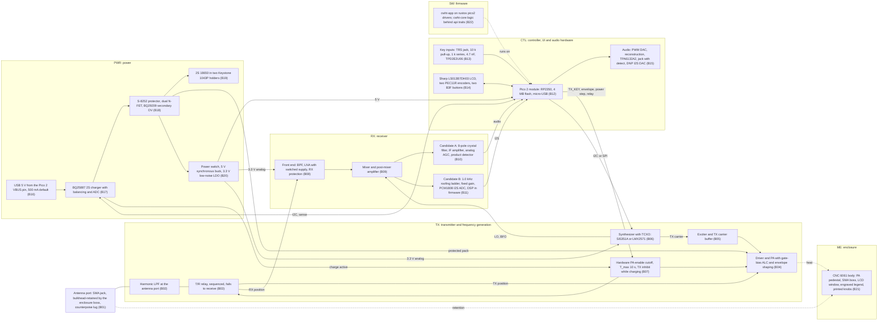

# cwht Concept Description (SRR)

**Status:** Draft for SRR (concept definition, NPR 7123.1D SE-36; the ConOps `docs/conops/conops.md` is the operational view, this document is the technical view). **Owner:** Robin (Decision Authority). **Author:** Claude (lead systems engineer). **Governing text:** SE HB §4.3 (Logical Decomposition), §4.4 (Design Solution Definition), §6.8 (Decision Analysis); NPR 7123.1D App. G Table G-3 items 3.2 (concept feasibility), 5.2 (alternative concepts), 5.4 (descope options), 5.10 (single point failure and fault tolerance philosophy) and Table G-4 items 6.1 (updated concept definition), 6.11 (external interfaces); `docs/process/01-lifecycle-and-reviews.md` §4.3 rows 4, 5, 6, 7, 17. **Successor at PDR:** `docs/design/architecture.md` and `docs/design/allocation.json` (allocated baseline, SE-41, SE-42).

Conventions. Every number in this document is one of: an owner decision (marked with its `SI-NNN`), a research baseline proposal (marked `[Proposed, owner decision pending at SRR]`), or a value that may still move (marked `(TBR, close by PDR)`). Where this document and `docs/requirements/sys/requirements.json` differ, the requirements file wins and this document is corrected. Research reports are cited as `docs/research/<file>.md F<n>`. Regulatory text is cited from the corpus in `docs/references/md/regulatory/` (eCFR 2026-09-23). No design is inherited from a reference without re-analysis (SEMP §7.5).

---

## 1. Purpose and scope

This document gives the owner and the SRR board one place that states what the radio is, how it is decomposed into functions and subsystems, which interfaces will be controlled, which alternatives are still open and how they will be closed at PDR, what can be descoped, and which enabling products the project depends on. It demonstrates concept feasibility at the level Table G-3 item 3.2 asks for: every block is a catalog part or a published circuit practice, every performance number has a research basis, and every open choice has a trade study with criteria.

It does not select parts beyond the owner's decisions and the research baselines, does not allocate requirements (that is `allocation.json`, preliminary at SRR), and does not replace the hazard analysis (`docs/safety/hazard-analysis.md`) or the risk register (`docs/risk/register.json`).

## 2. Need and driving expectations

The owner needs a pocket-sized handheld true-CW (A1A) transceiver for the full US 2 m band, 144.000 to 148.000 MHz, with 5 W output, a built-in keyer for a straight key and an iambic paddle, headphones, a small display and knob tuning, that works at first power-on and can be handed to licensed friends (SI-001 to SI-006, SI-018, SI-019, SI-024, SI-030). The five critical questions of the SEMP §3.0 shape the concept: regulatory harmonic margin, receiver sensitivity in a pocket form factor, rustos driver extension at Class A rigor, keyer timing for both key types, and battery life, mass and heat in the handheld envelope.

Binding owner decisions that constrain the concept (each is a `CON-NNN` in `expectations.json` and an ADR): 2 m only in rev A with a 70 cm-ready architecture (SI-002); true CW at 5 W (SI-003, SI-004); Raspberry Pi Pico 2 module with its micro-USB for programming and charging (SI-007, SI-022); 2S 18650 cells in holders (SI-023); rotary encoder tuning (SI-006); PCBWay turnkey SMT with owner-soldered through-hole parts (SI-009, SI-031); PCBWay CNC aluminum enclosure from OpenSCAD via FreeCAD STEP (SI-008, SI-032); straight key and iambic paddle through one 3.5 mm TRS jack (SI-018, SI-034); semi break-in only, no full QSK (SI-036); PA device stocked at DigiKey, Mouser or a PCBWay turnkey distributor, no consignment-only parts (SI-028); synthesizer by cost-performance trade at PDR (SI-029); all operators licensed, Technician or higher (SI-030); host-first software verification through the rustos `api` traits with dependency injection, emulation optional and never for timing (SI-026); keyer speed 5 to 50 WPM (SI-033); battery life 8 h at 1:9 TX:RX (SI-034); tinySA Ultra purchased (SI-034); MIT open source (SI-025).

## 3. System context and boundary

| Across the boundary | Interaction | Controlled by |
|---|---|---|
| Antenna and the RF environment | 50 ohm port; 144 to 148 MHz emission and reception; harmonic and spurious emission limits (47 CFR 97.307(e)); other amateur stations | `ICD-TX-ANT`; `REQ-TX-*` tagged `regulatory` |
| Straight key or iambic paddle | Two switch contacts to ground on a 3.5 mm TRS plug (tip dit or hand key, ring dah, sleeve common); mono plugs occur in the field | `ICD-CTL-KEY` |
| Headphones (16 to 64 ohm, TS or TRS plug) | Monophonic audio on both channels; hardware level ceiling; plug detect | `ICD-CTL-PHONES` |
| USB host or charger | 5 V through the Pico 2 micro-USB: firmware load (bootrom UF2), charge power at 500 mA default, optional serial trace | `ICD-CTL-USB`, `ICD-SW-HOST` |
| 18650 cells | Two user-replaceable cells in series, 6.0 to 8.4 V | `ICD-PWR-CELL` |
| Operators | Licensee as station licensee and control operator (OPS-A); licensed friends operate loaned units as their own stations; unlicensed guests listen only or key as third parties under supervision; a licensee-settable receive-only guest lock exists `[Proposed, owner decision pending at SRR]` | `docs/conops/conops.md`; `docs/research/regulatory-corpus-and-operators.md` F4, F5 |
| Bystanders | RF exposure: operator in the occupational tier with exposure information in the manual; persons other than the operator at 0.6 m or more while keying and 1.0 m or more during a tune carrier; evaluation per OET 65 Supplement B presented by Analysis `[Proposed, owner decision pending at SRR]` | `docs/research/rf-exposure-evaluation.md` F2, F3, F7; RFX evaluation product at PDR |
| Vendors | PCBWay fabrication, turnkey assembly and CNC; DigiKey or Mouser for parts PCBWay does not source | CDR procurement package |

Environment: handheld and table-top use outdoors, 0 to 40 C design point for battery and thermal analyses (the -10 to +60 C display window and the -20 C encoder rating bound the parts, `docs/research/display-and-ui-parts.md` F2, F12), no ingress rating in rev A.

## 4. Concept narrative

The radio is a single-conversion CW transceiver built around a Raspberry Pi Pico 2. A synthesizer disciplined by a TCXO produces the receive local oscillator, the beat-frequency oscillator and the transmit carrier. On receive, the antenna feeds, through the harmonic low-pass filter and the T/R relay in its unpowered receive position, a band-pass filter and a low-noise amplifier, then a mixer to an IF near 9 MHz, where one of two selectivity candidates produces a 500 Hz CW channel and audio: candidate A is a commercial 8-pole crystal filter with analog AGC and a product detector; candidate B is a 1.0 kHz tolerance-designed crystal ladder roofing filter feeding a 24-bit I2S ADC with the 500 Hz selectivity and AGC in firmware. Audio, sidetone and volume are produced in firmware and delivered through a PWM DAC, a reconstruction network and a fixed-gain headphone amplifier whose hardware ceiling bounds the acoustic output.

On transmit, the keyer (in firmware, timed from a hardware timer independent of the user interface) sequences the T/R relay to the transmit position, waits for contact settling, then raises the carrier through a 5 ms raised-cosine envelope produced by the gate-bias ALC loop of the PA; the loop also holds the selected power step (0.5, 1, 2 or 5 W) constant across the 6.4 to 8.4 V pack range. The harmonic low-pass filter sits at the antenna port after the T/R node. After the last element and an adjustable hang time the radio returns to receive (semi break-in, SI-036). Independent of firmware, a hardware monostable removes PA enable if a key-down persists longer than about 10 s, the PA is inhibited by hardware while the charger is active, and every reset leaves the transmit lines pulled low.

Power comes from two 18650 cells in series behind a two-cell protector; the PA runs from the protected pack, a synchronous buck makes 5 V for the Pico 2 and audio, and a low-noise LDO makes 3.3 V for the receiver and synthesizer. The charger takes 5 V from the Pico 2 micro-USB at 500 mA by default; receive is allowed while charging with charge paused, transmit is not. A mechanical switch controls power.

The enclosure is a CNC-machined 6061 aluminum body with a pedestal under the PA as the thermal path, a boss that retains the SMA antenna jack so the PCB carries no antenna moment, a window for the reflective memory LCD, bushing-mounted encoders, two buttons, two 3.5 mm jacks and an opening for the module's micro-USB; knobs and facade are printed on the owner's H2C (SI-012).

Firmware is Rust on rustos: register-level drivers in the rustos `pico2` crate implement the rustos `api` traits and cite the RP2350 datasheet section they implement; all application logic (keyer, sequencer, safety manager, tuning, display, audio, power monitor, configuration store) lives in `cwht-core` behind those traits and is tested on the host with `cwht-hal-mock`; `cwht-app` is the thin composition root on the target (SI-026; `docs/process/07-software-engineering-plan.md` §1.2).

### 4.1 Operating states (concept level)

`Off` (mechanical switch open; charger and protector live at about 25 uA) -> `Boot` (clocks, TICKS, watchdog 2 s armed, safe pad states, configuration record recovery) -> `Interlock` (both key inputs open for at least 500 ms; otherwise "KEY CLOSED" and no transmit) -> `Receive` (nominal) <-> `TxPending` (relay to TX, settling) -> `Transmit` (elements with envelope) -> `Hang` (semi break-in hang time, default 8 dits) -> `Receive`. Orthogonal states: `GuestLock` (receive only, licensee release), `Charging` (USB present: receive allowed, charge paused while receiving, transmit inhibited by hardware), `Tune` (0.5 W carrier, 10 s timeout `[Proposed, owner decision pending at SRR]`), `SafeState` (any watchdog or fault: PA enable low, relay unpowered to receive, audio muted, indication on the LCD). State names are the CamelCase enum spellings the requirements use (02 §4.2 WR-07).

## 5. System block diagram

Block identifiers `B01` to `B22` are the preliminary element ids for `docs/design/allocation.json`; the architecture ADR at PDR may split or rename them with a mapping table.



ASCII signal-flow sketch (same blocks, receive path top, transmit path bottom):

```
 SMA (B01) --- LPF (B02) --- T/R relay (B03) --RX-- BPF+LNA (B08) -- Mixer (B09) --+-- A: xtal filter, IF, AGC, detector (B10) -- audio --> Pico 2 (B12)
   |  ME boss (B21)             |  NC = RX                 ^ LNA off in TX          |
   |                            |                          |                        +-- B: 1.0 kHz ladder, PCM1808 (B11) -- I2S ----> Pico 2 (B12)
   |                            +--TX-- PA+driver (B04) <-- Exciter (B05) <-- Synthesizer + TCXO (B06) <-- I2C/SPI -- Pico 2 (B12)
   |                                      ^ gate-bias ALC / envelope                                                |  key inputs (B13), LCD+encoders+buttons (B14)
   |                                      |                                                                          |  audio PWM -> TPA6132A2 -> phones (B15)
   |                              Hardware cutoff (B07): TX_KEY AND monostable Q AND NOT charging                    |  UART0 trace / USB bootrom (ICD-SW-HOST)
   |                                                                                                                 |
 2S 18650 (B19) -> S-8252 + FETs + BQ29209 (B18) -> protected pack -> PA rail (B04) and switch -> 5 V buck -> Pico 2 VSYS, audio
                        ^ BQ25887 charger (B17) <- USB 5 V from Pico 2 VBUS pin (B16)          -> 3.3 V LDO -> LNA, mixer, IF, synthesizer
```

Rendering note (charter §11 rule 3): the Mermaid source is rendered to `docs/reviews/SRR/figures/concept-block-diagram.png` for the package and inspected before the review; the ASCII sketch is the fallback where Mermaid cannot be rendered.

## 6. Functional decomposition (SE HB §4.3)

Top-level functions F1 to F10, their sub-functions, and the preliminary allocation. Allocation is to the L2 modules of the charter (`RX, TX, PWR, CTL, ME, SW`). A function allocated to two modules is split at an ICD listed in section 9.

| Function | Sub-functions | Allocated to | Concept basis |
|---|---|---|---|
| F1 Receive CW signals in 144.000 to 148.000 MHz | F1.1 route antenna to receiver when not transmitting; F1.2 reject out-of-band energy and amplify with low noise; F1.3 convert to IF and select a 500 Hz channel; F1.4 detect to audio at a 300 to 1000 Hz offset; F1.5 control gain without pumping from a -60 dBm signal at +/-2 kHz | RX (F1.2 to F1.4), TX (F1.1, T/R node), SW (F1.5 in candidate B; BFO offset setting in both) | `docs/research/cw-selectivity-options.md` F1, F18; `docs/research/2m-cw-transceiver-reference-designs.md` F2, F14 |
| F2 Transmit an A1A carrier | F2.1 generate the carrier at the commanded frequency inside 144.001 to 147.999 MHz; F2.2 shape the envelope (5 ms raised cosine); F2.3 amplify to the selected step 0.5, 1, 2 or 5 W within +/-1 dB; F2.4 hold power across 6.4 to 8.4 V (ALC); F2.5 suppress every spurious emission to at most 25 uW and at least 40 dB below carrier, design target 60 dB; F2.6 route to the antenna; F2.7 survive mismatch and open or short loads | TX (all), SW (F2.1 frequency plan and band-edge guard, F2.3 step selection, F2.2 envelope command) | 47 CFR 97.307(e), 97.301(a), 97.3(a)(8); `docs/research/part97-regulatory-basis.md` F2, F11; `docs/research/regulatory-corpus-and-operators.md` F7, F8; `docs/research/pa-device-candidates.md` F16 to F20 |
| F3 Key and sequence | F3.1 sense two contacts with 2 ms close and 5 ms open debounce (TBR, close by PDR); F3.2 generate elements in Straight, Iambic A (default), Iambic B, Ultimatic and Bug modes, 5 to 50 WPM, default 15; F3.3 hold element timing to +/-1 % or +/-0.5 ms, paddle-to-element latency at most 3 ms; F3.4 sequence relay, PA bias and envelope (lead-in 5 ms, envelope fall complete before relay release); F3.5 sidetone 600 Hz default, 300 to 1000 Hz, locked to the receiver offset, hang 8 dits default; F3.6 enforce the stuck-key set: firmware straight-key timeout 5 s, paddle watchdog 128 identical elements or 30 s, key-closed-at-power-on interlock (both inputs open at least 500 ms) | SW (F3.1 to F3.6), CTL (input network, sample path), TX (relay and PA control lines) | SI-018, SI-033, SI-036; `docs/research/keyer-verification-and-key-input-network.md` F4, F6, F7, F11, F13, F14 |
| F4 Generate frequencies | F4.1 reference: TCXO at most +/-2.5 ppm total; F4.2 LO, BFO and TX carrier from one synthesizer; F4.3 frequency error at most +/-370 Hz at 148 MHz so keying sidebands stay in band with the 1 kHz guard; F4.4 no clock or synthesizer spur on 144.000 to 148.000 MHz | TX (F4.1, F4.2), SW (F4.3 plan, F4.4 clock selection), CTL (peripheral clock choices) | `docs/research/regulatory-corpus-and-operators.md` F8; `docs/research/2m-cw-transceiver-reference-designs.md` F16 to F21; `docs/research/display-and-ui-parts.md` F10 |
| F5 Operator interface | F5.1 display frequency, power step, mode, WPM, call sign, exposure posture line, faults; F5.2 tune with a 24-detent encoder with velocity step; F5.3 volume with a second encoder; F5.4 menu with two buttons; F5.5 select the power step with a deliberate action for 5 W; F5.6 show sliding 6 min and 30 min key-down time; F5.7 guest lock set and release by the licensee | CTL (parts), SW (logic), ME (window, bushings, caps) | SI-005, SI-006; `docs/research/display-and-ui-parts.md` F1, F2, F12, F16; `docs/research/rf-exposure-evaluation.md` F7 |
| F6 Produce audio | F6.1 mix receive audio and sidetone; F6.2 limit to the active cap: 30 mVrms default, acknowledged unlock to the hardware ceiling of 100 mVrms full-scale sine, at most 150 mVrms worst case into 32 ohm; F6.3 drive 16 to 64 ohm headphones; F6.4 shut the amplifier down with no headphones; F6.5 raised-cosine mute and unmute at T/R transitions | CTL (PWM DAC, network, amplifier, jack), SW (mixing, limiter, fades, volume) | `docs/research/audio-output-and-hearing-safety.md` F19, F24 to F29 |
| F7 Store, protect, charge and distribute power | F7.1 2S 18650 pack in holders; F7.2 protect per cell (OV, UV, OC, short) independent of the charger, with a secondary OV layer; F7.3 charge from USB at 500 mA default, balance cells, JEITA windows; F7.4 PA rail from the protected pack, 5 V bus, 3.3 V low-noise analog rail; F7.5 sense cell voltages by two dissimilar paths; F7.6 inhibit transmit by hardware while charging, allow receive with charge paused; F7.7 mechanical power switch; F7.8 battery life at least 8 h at 1:9 and 6 h at 1:4 | PWR (all), SW (F7.5 comparison, charge enable, gauge), TX (F7.6 inhibit input) | SI-022, SI-023, SI-034; `docs/research/power-tree-and-charging.md` F2 to F5, F11, F14, F18 to F23 |
| F8 Configure and update | F8.1 non-volatile configuration in CRC-protected A/B flash records; F8.2 firmware load over the Pico 2 USB bootrom; F8.3 version read-back and version description | SW, CTL (USB connector via the module) | `docs/research/rustos-toolchain-proof.md` F5, F15 |
| F9 Protect people and comply | F9.1 RF exposure controls: power steps, 1 W first-boot default, 0.5 W tune carrier with 10 s timeout, posture line, manual section, engraved legend; F9.2 acoustic ceiling in hardware; F9.3 PA thermal limits (junction at most 110 C by analysis at 5 W, 40 C ambient, continuous key-down); F9.4 band-edge guard and only A1A; F9.5 10-minute identification reminder and CW ID at most 20 WPM; F9.6 licensed-operator model and guest lock | SW (F9.1 logic, F9.4, F9.5, F9.6), CTL (F9.2), TX and ME (F9.3), ME (legend) | 47 CFR 97.119(b)(1), 97.313(a), 97.13(c); `docs/research/rf-exposure-evaluation.md` F2, F3, F7; `docs/research/pcbway-export-and-vendor-questions.md` F17 |
| F10 House and cool | F10.1 enclose the PCB, cells and controls in a pocket envelope; F10.2 conduct PA heat to the body (pedestal, gap pad, via array); F10.3 retain the antenna jack in the body; F10.4 expose controls, display, jacks and USB; F10.5 carry the permanent legend; F10.6 support the PCB on bosses so a 1.0 mm board is stiff enough (TBR, close by PDR) | ME (all), TX (F10.2 PCB side) | SI-008; `docs/research/enclosure-cnc-and-openscad-pipeline.md` A3 to A7; `docs/research/pcbway-export-and-vendor-questions.md` F14 to F18; `docs/research/antenna-and-erp.md` F8 |

Allocation matrix (P = primary, S = supporting):

| Function | RX | TX | PWR | CTL | ME | SW |
|---|---|---|---|---|---|---|
| F1 Receive | P | S | | S | | S |
| F2 Transmit | | P | S | S | | S |
| F3 Key and sequence | | S | | S | | P |
| F4 Generate frequencies | S | P | | S | | S |
| F5 Operator interface | | | | P | S | P |
| F6 Audio | S | | | P | | P |
| F7 Power | | S | P | S | S | S |
| F8 Configure and update | | | | S | | P |
| F9 Protect and comply | | S | S | S | S | P |
| F10 House and cool | | S | | | P | |

## 7. Subsystem concepts and preliminary allocation of blocks

| Module | Blocks | Scope statement |
|---|---|---|
| RX | B08, B09, B10 or B11 | From the T/R node receive port to demodulated audio (A) or I2S samples (B); LNA supply switched off in transmit; receiver input protected to at most +17 dBm under any single fault |
| TX | B01 to B07 | Frequency generation (TCXO, synthesizer, LO and BFO delivery), exciter, driver, PA, ALC and envelope shaper, hardware PA-enable cutoff, T/R relay and sequencing lines, harmonic LPF, antenna port electrical interface. TX owns frequency generation because band-edge and spurious compliance are TX regulatory requirements; RX consumes the LO through `ICD-RX-TX` `[Proposed, confirmed by the architecture ADR at PDR]` |
| PWR | B16 to B20 | USB input budget, charger, protection, holders, PA rail, 5 V bus, 3.3 V analog rail, power switch, sensing |
| CTL | B12 to B15 | Pico 2 module and its clocks, key input network and ESD clamps, display and ZIF, encoders, buttons, jacks with detect, audio DAC path and amplifier, hardware monostable for the cutoff, TX_KEY and PA_EN pull-downs, USB connector exposure |
| ME | B21 | Enclosure body, thermal pedestal and gap pad, SMA boss and anti-rotation, counterpoise lug, LCD window and glass pocket, encoder bushings and panel stack, jack and USB openings, button caps, engraved legend, printed knobs and facade, PCB standoffs |
| SW | B22 | `cwht-core` modules `[Proposed sub-module tokens]`: SW-KEYER (keyer and debounce), SW-SEQ (transmit sequencer and envelope command), SW-SAFE (safety manager: interlock, timeouts, watchdog feed, charge and thermal inhibits, guest lock), SW-SYNTH (frequency plan, band limits, register computation, TCXO trim), SW-UI (display, encoders, menu, posture line), SW-AUDIO (mixer, limiter, fades, volume, PWM sink), SW-PWR (charger control, dual-path sense comparison, gauge), SW-CFG (A/B configuration records), SW-DSP (candidate B only: CW filter, digital AGC); `cwht-app` composition root; rustos work packages WP-01 to WP-14 for clocks, IRQ, TIMER0, GPIO, PWM, ADC, I2C0, SPI0, watchdog, NV flash and, for candidate B, PIO I2S |

### 7.1 Antenna port and T/R (TX, with ME)

SMA jack, female body, stainless (500 mating cycles class), retained by the enclosure boss (wall at least 2.5 mm, 6.55 mm hole, anti-rotation flat, clearance for the 7.9 mm nut) so that the PCB connection carries no antenna moment; a bonded counterpoise attachment within 20 mm of the port for a 48 cm tail; reference antennas Signal Stick half-wave class plus the 48 cm counterpoise for the pocket configuration and an end-fed half-wave telescopic for the range configuration `[Proposed, owner decision pending at SRR]` (`docs/research/antenna-and-erp.md` F3, F7, F8). T/R by a sequenced RF relay of the TE Axicom HF3 class (50 W carry, 80 dB isolation at 100 MHz, 3 to 5 ms operate, NC contact to the receiver so the unpowered state is receive, 6 V coil straight from the pack): the semi break-in decision (SI-036) makes the relay the simplest and cleanest path and removes the PIN-diode harmonic and wear risks (`docs/research/tr-switch-candidates.md` F7, F12, Recommendation). The harmonic LPF sits at the antenna port after the T/R node so it also protects the receiver path; the LNA supply is removed during transmit and a receiver protection stage bounds the LNA input to +17 dBm under a stuck-relay or bias-loss fault (tr-switch F3, F19).

### 7.2 Transmitter (TX)

Exciter driven by the synthesizer's TX carrier output, a driver stage, and the PA device chosen at PDR from the DigiKey or Mouser stocked candidates (TS-003, SI-028). Output 5.0 W +/-0.5 dB with a gate-bias ALC loop across 6.4 to 8.4 V, at least 3 W down to 6.0 V; the same node produces the 5 ms 10-to-90 % raised-cosine envelope (3 to 8 ms configurable) so the measured 26 dB bandwidth is at most 350 Hz and the necessary bandwidth is documented as 208HA1A `[Proposed, owner decision pending at SRR]`. A forward-power sample (directional coupler and detector) feeds an RP2350 ADC channel for the ALC and for the power-step display. Every spurious emission at most 25 uW and at least 40 dB below carrier (47 CFR 97.307(e), eCFR 2026-09-23), which at 5 W means at least 53.0 dB below carrier; design target 60 dB. LPF goals at its own terminals: at least 40 dB at 288 MHz and 35 dB at 432 MHz with at most 0.5 dB insertion loss (`docs/research/pa-device-candidates.md` F16, F17; `docs/research/part97-regulatory-basis.md` F2). Every element after the PA is rated for the full-charge, full-drive output unless the ALC is shown by analysis to limit power under all single faults. Hardware PA-enable cutoff: a retriggerable monostable (74LVC1G123 class) on TX_KEY with T_max 10 s nominal (7.5 to 13 s), PA path enabled only while TX_KEY AND Q; TX_KEY and PA_EN carry 4.7 kOhm external pull-downs; charge-active inhibits the PA in hardware (`docs/research/keyer-verification-and-key-input-network.md` F13; `docs/research/power-tree-and-charging.md` F22).

Envelope convention note: the regulatory report recommends stating the ramp as a 5 ms full 0 to 100 % Hann transition (`docs/research/regulatory-corpus-and-operators.md` DECISION-11), the keyer reports state 5 ms 10-to-90 % (8.5 ms total). The binding requirement is the measured 26 dB bandwidth (at most 350 Hz) and the -60 dBc sideband level beyond 500 Hz at 30 WPM; the ramp convention is a derived design parameter to be fixed by ADR at SRR `[Proposed, owner decision pending at SRR]`.

### 7.3 Receiver (RX)

Front end: a band-pass filter and a low-noise amplifier (device chosen in TS-001 between a 0.5 dB NF, 97 mA MMIC and a 2 to 3 dB NF, 30 mA stage; the handheld does not need transverter-class noise figure, `docs/research/2m-cw-transceiver-reference-designs.md` F35; `docs/research/antenna-and-erp.md` F10), then a level-7 to level-17 diode ring or equivalent mixer to an IF of 9.000 or 9.0106 MHz (chosen with the filter purchase). Selectivity TBR set (close by PDR): -6 dB bandwidth 500 Hz +100/-50 Hz, -60 dB bandwidth at most 2.5 kHz, at least 60 dB at +/-2 kHz, ultimate at least 80 dB, ripple at most 2 dB, MDS at most -140 dBm in 500 Hz with a -142 dBm target, no audible AGC pumping from a -60 dBm signal at +/-2 kHz, BFO and sidetone offset adjustable +/-500 Hz in 10 Hz steps and stored per unit (`docs/research/cw-selectivity-options.md` F1 to F3, F8, F13). Two candidates are carried to TS-001: A, a commercial 8-pole crystal filter (Inrad #111 400 Hz at 9.0106 MHz or a KVG type on quote) between a post-mixer amplifier and an IF amplifier with analog AGC, product detector with the synthesizer as BFO, firmware does keyer, sidetone, BFO and display only; B, a tolerance-designed 4-pole 1.0 kHz ladder from +/-30 ppm SMD crystals (Monte Carlo yield 98.5 %), fixed-gain IF, product detector, PCM1808 24-bit I2S ADC at 48 kS/s over PIO, 250/500/1000 Hz DSP filters with digital AGC and sidetone mixing (`docs/research/cw-selectivity-options.md` F8, F12, F18). Not carried: a 500 Hz ladder from catalog crystals (yield 15 to 51 %), the RP2350 ADC as audio sampler (9 to 9.5 ENOB), audio-only filtering, and any I/Q architecture at 144 MHz (quadrature LO limits, image rejection); the SoftRock-VHF I/Q pattern is the documented fallback if crystals and cans both become unobtainable.

### 7.4 Frequency generation (TX)

A TCXO of at most +/-2.5 ppm total tolerance (initial, -10 to +50 C, one year aging), independent of the Pico 2 module crystal, disciplines the synthesizer; carrier limited to 144.001 to 147.999 MHz so that with +/-370 Hz worst-case error all keying sidebands above -60 dB stay inside the band (`docs/research/regulatory-corpus-and-operators.md` F7, F8) `[Proposed, owner decision pending at SRR]`. Synthesizer candidates for TS-002 (SI-029): Si5351A (about 1 to 2 USD, 26 mA, square-wave outputs needing filtering, divider 6 at 144 MHz with a reported but unverified -112 dBc/Hz at 10 kHz that bounds reciprocal mixing to about 85 dB, only two outputs above 112.5 MHz, output ceiling 200 MHz) and LMX2571 (9 to 14 USD, 39 mA, about -133 dBc/Hz derived at 144 MHz, 10 to 1344 MHz output range, 5 dB penalty with a clipped-sine reference, SPI control) (`docs/research/2m-cw-transceiver-reference-designs.md` F16, F17, F20, F21). ADF4351 and MAX2871 are pruned for current (120 mA class) but recorded. Clock plan: every SPI, I2C, PWM and buck synchronization frequency is chosen from the set with no harmonic in 144.000 to 148.000 MHz; the Pico 2 module's 12 MHz crystal (12th harmonic) and the 48 MHz USB PLL (3rd harmonic) both land on 144.000 MHz, so the USB PLL is off when not enumerated, the module is shielded and the expected birdie is logged before bench tests (`docs/research/display-and-ui-parts.md` F10). The 1 kHz band-edge guard also keeps the transmit carrier at least 1 kHz away from that birdie frequency.

### 7.5 Controller, UI and audio hardware (CTL)

Raspberry Pi Pico 2 module reflowed on castellations by PCBWay (confirmation pending, `docs/research/pcbway-fabrication-and-assembly.md` F16); all GPIO through SIO (never the GPIO coprocessor) so the firmware stays inside the emulator's credited scope. Key input network per line: 10 kOhm pull-up to 3V3, 1.0 kOhm series, 4.7 nF at the pad, Schmitt input enabled, internal pulls off (RP2350-E9), TPD2E2U06 at the jack and a BAT54S at the pad node, survives -5 V to +12 V continuous; two independent inputs so a squeeze is observable; the jack is a Same Sky SJ1-3535N class switched TRS jack whose ring switch gives plug detect (`docs/research/keyer-verification-and-key-input-network.md` F3 to F5; `docs/research/display-and-ui-parts.md` F17, F19). Display Sharp LS013B7DH03 128x128 memory LCD over SPI at most 1.1 MHz with EXTCOMIN from a PWM slice, no backlight in rev A; two Bourns PEC11R 24-detent encoders (tuning with velocity step, volume with push for mute or menu); two Omron B3F buttons; printed knobs (display report F2, F12, F16, F20). Audio: one PWM channel (10 to 11 bits at 73 to 146 kHz, DMA-fed), passive divider and two-pole reconstruction, TPA6132A2 at 0 dB gain on the 3.3 V rail with a hardware enable pulled down, hardware ceiling 100 mVrms full-scale sine into 32 ohm (at most 150 mVrms worst case), a do-not-populate I2S DAC footprint as the fallback, headphone jack with tip-switch detect, amplifier shutdown with no headphones (`docs/research/audio-output-and-hearing-safety.md` F19, F24 to F29). Hardware monostable for the PA cutoff and 4.7 kOhm pull-downs on TX_KEY and PA_EN live on this sheet and are consumed by TX through `ICD-TX-CTL`.

### 7.6 Firmware (SW)

Layering (SI-026): rustos `api` traits (`time::Clock`, `time::Alarm`, `gpio`, `bus::I2cMaster`, `bus::SpiTx`, `pwm::PwmChannel`, `adc::AdcChannel`, `watchdog::Watchdog`, `nv::NvStore`, `irq`) implemented by rustos `pico2` drivers that cite the RP2350 datasheet section per register access; `cwht-core` (`#![no_std]`, `#![forbid(unsafe_code)]`) holds every decision, tested on the host against `cwht-hal-mock` with a simulated microsecond clock; `cwht-app` composes the board and is exercised by emulation and on the bench (`docs/research/rustos-toolchain-proof.md` F7, F13, Driver extension map; `docs/process/07-software-engineering-plan.md` §1.2). Design rules fixed at concept level: one NVIC priority level with run-to-completion handlers and a main-loop queue; PWM on slices 0 to 7 only with per-slice CSR enable; GPIO via SIO; element timing from TIMER0 ALARM0 and 1 kHz input sampling from ALARM1, both independent of the UI loop; no PIO except the optional I2S receive program of candidate B; a 2 s CPU watchdog armed before transmit can be enabled; TICKS enabled explicitly before TIMER0 use; XOSC and PLL waits bounded by a TIMER0-independent timeout (`docs/research/emulator-accreditation-and-timer-irq.md` F3, F5, F8 to F10; `docs/research/keyer-verification-and-key-input-network.md` F8). Evidence classes: HostUnit is primary; Emulation on the accredited emulator `ACC-EMU-001` is credited for event ordering only, never durations; timing is Bench with the Pico-based logic capture.

### 7.7 Power (PWR)

TI BQ25887 2S boost charger from the Pico 2 VBUS pin at 500 mA default (about 10 h for a 3000 mAh pack), balancing, 16-bit ADC over I2C, JEITA windows, 12 h safety timer; ABLIC S-8252 two-cell protector with dual N-FET in the pack negative plus a BQ29209 secondary over-voltage layer; two Keystone 1043P single holders so the mid-tap is available; PA rail direct from the protected pack; a 5 V synchronous buck (TPS62913 class, synchronized to a firmware-set frequency from the clear set) feeding the Pico 2 VSYS through a VBUS-gated P-FET OR and the audio stage; a low-noise LDO (TPS7A20 class, 7 uVrms) behind a bead or LC stage for the 3.3 V analog rail; the Pico 2 3V3 pin carries no receiver analog load; charging inhibited by hardware while the transmitter is enabled; receive allowed while charging with charge paused; the radio cannot transmit from USB alone (no cells: only the Pico 2 is alive); mechanical power switch on the buck enable and PA rail, charger and protector always live at about 25 uA; cell voltages sensed by the charger ADC and by RP2350 ADC dividers, firmware inhibits charge and transmit when the two disagree by more than 100 mV (value after calibration analysis); battery life at least 8 h at 1:9 and 6 h at 1:4 with a fresh 3000 mAh pack `[Proposed, owner decision pending at SRR]` (`docs/research/power-tree-and-charging.md` F2 to F5, F11, F13, F14, F18 to F23, Baseline topology). USB input policy above 500 mA is TS-005.

### 7.8 Enclosure and PCB (ME, with TX and CTL)

CNC 6061 aluminum, bead blast and Type II anodize with chassis ground and RF connector areas masked; internal pocket radii R2 minimum, R3 for pockets deeper than 6 mm; minimum wall 1.5 mm; M3 minimum threads modeled as tap-drill pilots; explicit +/-0.1 mm class tolerances on PCB mounting, display window and connector positions, ISO 2768-m elsewhere; single-solid STEP AP214 or AP242 from the OpenSCAD CSG through FreeCAD headless plus a 2D drawing (`docs/research/enclosure-cnc-and-openscad-pipeline.md` A1 to A7, B2 to B5). Thermal path: PA source pad with a 0.30 mm via array on 0.65 mm pitch to a continuous L2 ground and a mask-free copper area on the bottom, a pedestal under it with flatness 0.05 mm, Ra 3.2 um, masked from anodize, two M3 fasteners within 10 mm and a 0.5 mm, at least 3 W/mK gap pad; junction temperature at most 110 C by analysis at 5 W, 60 % efficiency, 40 C ambient and continuous key-down; enclosure surface over the PA at most 60 C by test (`docs/research/pcbway-export-and-vendor-questions.md` F14 to F18). PCB: 4-layer PCBWay standard stackup, ENIG, 50 ohm microstrip on L1 over a continuous L2 ground, 1.0 mm thickness pending the enclosure boss layout (TS-004, at least four bosses under the board), IPC-4761 Type VII resin-filled and capped vias under the PA and QFN pads, passives 0603 or larger unless RF needs 0402, all SMT on top, through-hole parts (jacks, holders, encoders, relay if THT) hand-soldered by the owner (SI-031). Engraved legend: amateur radio transmitter, 144 to 148 MHz, 5 W maximum, licensed operators, RF exposure information in the manual (`docs/research/rf-exposure-evaluation.md` F7, RFX-14).

## 8. Single point failure and fault tolerance philosophy (Table G-3 item 5.10)

The hazards (`HZ-NNN` in `docs/safety/hazards.json`) are unintended or prolonged transmission, RF exposure of bystanders, Li-ion thermal event, PA over-temperature and excessive acoustic output. Philosophy: no single software event may initiate a hazard, and every hazard control has a hardware layer that does not depend on firmware state (charter §10; SWE-134 provisions for keying, PA enable, charging and thermal control).

| Hazard | Independent layers |
|---|---|
| Unintended or prolonged transmission | Interlock at boot and after any reset (both key inputs open at least 500 ms); firmware straight-key timeout 5 s and paddle watchdog 128 elements or 30 s; hardware monostable cutoff T_max 10 s acting on the envelope modulator control; 2 s CPU watchdog; reset pad states plus 4.7 kOhm pull-downs on TX_KEY and PA_EN; relay unpowered state is receive; transmit inhibited by hardware while charging; band-edge guard and receive-only guest lock in firmware (`docs/research/keyer-verification-and-key-input-network.md` F13) |
| RF exposure | Power steps with 1 W default and deliberate 5 W selection; 0.5 W tune carrier with 10 s timeout; posture line on the display; manual and engraved legend; mobile-leaning posture in the ConOps with handheld-at-face as off-nominal evaluated by SAR analogy `[Proposed, owner decision pending at SRR]` |
| Li-ion | Charger JEITA and safety timer; independent per-cell protector; secondary over-voltage IC; dual-path cell sensing with firmware inhibit; user guidance on cell matching |
| PA thermal | ALC power limit; hardware cutoff bounds any fault carrier to 13 s; pedestal thermal path by analysis; surface temperature test at TRR |
| Hearing | Hardware output ceiling set by passive parts and fixed gain; firmware cap with acknowledged unlock; limiter; amplifier enable pulled down until the source has settled; shutdown with no headphones |

The fail-to-receive property of the relay, the LNA-off-in-transmit rule and the receiver protection stage mean that no controller reset can leave the PA connected to the LNA path with bias applied (`docs/research/tr-switch-candidates.md` F12, F13, F19).

## 9. Interfaces to be controlled by ICDs (Table G-4 item 6.11)

Identity and order follow `docs/process/02-requirements-and-traceability.md` §3.5. External stubs are created before SRR; internal ICDs are created by the architecture ADR at PDR and baselined with the allocated baseline.

| ICD | Kind | Content (concept level) | Created |
|---|---|---|---|
| `ICD-CTL-KEY` | External | 3.5 mm TRS jack: tip dit or hand key, ring dah, sleeve common; TS and TRS plugs; pull-up, series and capacitor values; closed at most 500 ohm, open at least 100 kOhm; ESD level 4; -5 V to +12 V abuse; plug detect; debounce; jack position relative to the headphone jack | before SRR |
| `ICD-CTL-PHONES` | External | 3.5 mm TRS jack: mono on both channels, 16 to 64 ohm; 100 mVrms full-scale ceiling, 150 mVrms worst case; tip-switch detect; survives a short to sleeve and cross-plugging with the key | before SRR |
| `ICD-TX-ANT` | External | SMA jack female body, 50 ohm, 1/4-36 thread; 5.5 W into VSWR 3:1, survives 60 s into 10:1, open and short; bending moment 4.0 N.m and 1000 matings carried by the enclosure boss; counterpoise lug; ME cites it for the boss | before SRR |
| `ICD-CTL-USB` | External | Pico 2 micro-USB: 5 V VBUS to the charger, 500 mA default and never above 1.5 A; bootrom UF2 load; enclosure opening 12.0 x 10.0 mm; PWR cites it for charge power | before SRR |
| `ICD-PWR-CELL` | External | Two 18650 cells, 6.0 to 8.4 V, holder terminals and mid-tap, accepted cell length, NTC placement, insertion checks, protected versus unprotected cells | before SRR |
| `ICD-SW-HOST` | External | UF2 image format (`rp2350-arm-s`, IMAGE_DEF block), version read-back, UART0 text trace format used by emulation scenarios and bench checks, any serial command set | PDR (the `HOST` token exists in 02 §3.5 but this ICD is not in its pre-SRR stub list; proposed addition) |
| `ICD-RX-TX` | Internal | T/R node hand-off: relay contact assignment, isolation, leakage at the LNA, LNA-supply-off-in-TX line, receiver mute timing, LO and BFO levels and frequencies delivered to RX, reserved band-select line for 70 cm | PDR |
| `ICD-RX-CTL` | Internal | Demodulated audio level and impedance (A) or I2S format and clocks (B); AGC, BFO and mute control lines; LNA enable | PDR |
| `ICD-RX-PWR` | Internal | 3.3 V analog rail current and noise budget for LNA, mixer and IF | PDR |
| `ICD-TX-CTL` | Internal | TX_KEY, PA_EN, cutoff Q, envelope and ALC set-point node, forward-power sample scaling, relay drive polarity, synthesizer control bus, TCXO trim | PDR |
| `ICD-TX-PWR` | Internal | PA rail from the protected pack, relay coil supply, charge-active inhibit line, 3.3 V for the synthesizer | PDR |
| `ICD-TX-ME` | Internal | PA thermal pedestal and gap pad, via array, SMA boss and PCB relief, LPF and antenna path placement, shielding partition | PDR |
| `ICD-TX-SW` | Internal | Synthesizer register programming contract, sequencer timing table per element (lead-in, envelope, guard, hang), power-step to set-point table, cutoff behavior expectations | PDR |
| `ICD-PWR-CTL` | Internal | Charger I2C address and registers used, cell and VSYS sense dividers to ADC channels, charge enable, VBUS detect, buck SYNC clock from a PWM slice, power switch state, 5 V to VSYS OR-ing | PDR |
| `ICD-PWR-SW` | Internal | Charger control contract (limits, thresholds, JEITA), dual-path sense comparison rule, gauge model | PDR |
| `ICD-PWR-ME` | Internal | Holder positions and cell access, power switch, NTC placement, clearances and venting | PDR |
| `ICD-CTL-ME` | Internal | LCD window 24.0 x 24.0 mm and glass pocket, encoder bushing lengths and panel stack, jack holes 6.6 mm, USB opening, button caps, jack disambiguation marking | PDR |
| `ICD-CTL-SW` | Internal | Pin map and peripheral assignment: GPIO numbers and pad configuration, PWM slices, ADC channels, I2C0 and SPI0, TIMER0 alarms, UART0; the register-level driver ICD is the RP2350 datasheet and Cortex-M33 documentation cited per register access (SI-026) | PDR |

## 10. 70 cm-ready provisions (SI-002)

Rev A transmits only on 2 m; the following provisions keep rev B (420 to 450 MHz, with the sharing constraints of 47 CFR 97.303 to be treated then) a board-and-filter change rather than a new radio:

1. The RF chain that is band-specific (B02 LPF, B03 relay, B04 PA and driver, B05 exciter, B08 front end, B09 mixer) is laid out as one PCB region with 50 ohm interface planes at the antenna port, the mixer IF port and the synthesizer output, so the region can be redesigned without touching CTL, PWR, audio or the IF.
2. TS-002 scores each synthesizer on 70 cm output capability: LMX2571 covers 10 to 1344 MHz directly; Si5351A tops out at 200 MHz and would need a multiplier or a different LO plan (`docs/research/2m-cw-transceiver-reference-designs.md` F16, F20).
3. The IF, selectivity block, audio chain, keyer, sequencer, power tree and enclosure envelope are band-agnostic; the firmware frequency plan is a per-band table (band limits, guard, presets) with the band-select input of SI-006 reserved in `ICD-RX-TX` and in the pin map.
4. The T/R relay class is rated to 3 GHz and the SMA port to well above 450 MHz; the enclosure keeps the antenna boss dimensions.
5. The rev A LPF requirement already names 432 to 444 MHz (35 dB) because the 3rd harmonic of 144 MHz lands in the 70 cm band; rev B replaces the LPF and adds the 2 m rejection the receiver then needs.

## 11. Alternatives considered and PDR trade studies (Table G-3 item 5.2; SE HB §6.8)

### 11.1 Concept-level alternatives already dispositioned

| Decision area | Alternatives | Disposition and source |
|---|---|---|
| Controller and language | Pico 2 with Rust on rustos; bare RP2350; other MCU | Owner decision SI-007; recorded as an ADR; bare RP2350 rejected for assembly and reuse reasons (`docs/research/pcbway-fabrication-and-assembly.md` F16) |
| Receiver architecture family | (A) single-conversion superhet at 144 MHz with a tunable LO and a 9 MHz class filter; (B) internal transverter to 28 MHz; (C) direct conversion I/Q at 144 MHz; (D) commercial transverter plus HF rig | (A) selected as the baseline family (FT-290R and IC-202 pattern); (B) rejected for a second conversion and a fixed overtone LO in a pocket radio; (C) rejected for quadrature LO limits and image rejection; (D) rejected for size and cost, kept as a fallback (`docs/research/2m-cw-transceiver-reference-designs.md` F1, F2, F6 to F13, implication 13) |
| CW selectivity | Commercial 8-pole can; 500 Hz catalog-crystal ladder; 1.0 kHz roofing ladder plus 24-bit ADC and DSP; RP2350 ADC and DSP; audio-only filter; I/Q SDR | Two candidates carried to TS-001 (can; roofing ladder plus DSP); the rest rejected (`docs/research/cw-selectivity-options.md` F5, F8, F11, F15 to F18) |
| Break-in and T/R element | Full QSK with PIN diodes; semi break-in with a relay; MEMS; PIN SPDT IC | Owner decision SI-036 (semi break-in); relay of the HF3 class baseline; PIN and MEMS recorded as the QSK path not taken (`docs/research/tr-switch-candidates.md` Recommendation) |
| PA supply and power control | Direct 2S with gate-bias ALC; regulated PA rail; boost to a 12.5 V device; accept droop | Gate-bias ALC baseline; regulated and boost carried as TS-006 alternatives (`docs/research/pa-device-candidates.md` F18 to F20) |
| Envelope shaping node | Drain supply modulator; driver supply modulation; gate-bias modulation | Gate-bias baseline shared with the ALC; cutoff node interaction is a TS-006 criterion (`docs/research/keyer-verification-and-key-input-network.md` F13 item 4) |
| Frequency reference | Module crystal; +/-0.5 ppm TCXO; +/-2.5 ppm TCXO with 1 kHz guard; looser reference with wider guard | TCXO at most +/-2.5 ppm with a 1 kHz guard `[Proposed, owner decision pending at SRR]` (`docs/research/regulatory-corpus-and-operators.md` F8) |
| Display | Sharp memory LCD; OLED; TFT | Memory LCD: no on-module converter, 20 uA static, daylight readable; OLED and TFT rejected for switching noise history near a -140 dBm receiver (`docs/research/display-and-ui-parts.md` F1, F7, F8) |
| Tuning and volume controls | Potentiometers; one encoder with mode press; two encoders | Two PEC11R encoders with firmware volume (SI-006; display report F12, F15) |
| Audio source | PWM with DNP I2S footprint; I2S DAC from the start; analog op-amp chain | PWM baseline `[Proposed, owner decision pending at SRR]` (`docs/research/audio-output-and-hearing-safety.md` F1, F27, F31) |
| Speaker | Speaker plus class-D; headphones only | Headphones only in rev A `[Proposed, owner decision pending at SRR]` (audio report D1) |
| Charger IC | BQ25887; MP2672A; BQ25792 | BQ25887 baseline `[Proposed, owner decision pending at SRR]` (`docs/research/power-tree-and-charging.md` F5 to F7, F10) |
| Pack protection | S-8252 plus dual N-FET plus BQ29209; S-82C2B with sense resistor; protected cells only | S-8252 plus BQ29209 baseline; protected-cells-only rejected (power report F11) |
| Antenna connector | SMA jack; BNC bulkhead | SMA jack, bulkhead-retained `[Proposed, owner decision pending at SRR]` (`docs/research/antenna-and-erp.md` F7, F8) |
| Enclosure material and finish | 6061 bead blast Type II; 7075; printed enclosure | 6061 per research; printed enclosure kept as a descope (`docs/research/enclosure-cnc-and-openscad-pipeline.md` A3, A4) |
| CAD source | OpenSCAD plus FreeCAD STEP; build123d | Owner decision SI-008, SI-032; build123d is the fallback only if the STEP acceptance checks fail (enclosure report B4, B6) |
| Emulator | c1570/rp2350js ARM mode; Renode; Wokwi; QEMU | rp2350js vendored and pinned as `ACC-EMU-001`, Renode fallback, ADR due PDR (`docs/research/rp2350-emulation-options.md` Recommendation; `docs/research/emulator-accreditation-and-timer-irq.md` F13) |
| Build quantity | 5 fabricated and 5 assembled; 5 fabricated and 3 assembled | 5 boards fabricated, 3 to 5 assembled, at most 5 complete units under the 47 CFR 15.23 cap `[Proposed, owner decision pending at SRR]` (`docs/research/pcbway-export-and-vendor-questions.md` F21 to F23) |

### 11.2 Trade studies to be decided at PDR

Each study follows `docs/templates/trade-study.md` and `docs/process/06-risk-and-decision-analysis.md` §14 (mandatory criteria first, weighted enhancing criteria, sensitivity, independent review, owner decision). Identifiers are assigned here; the decisions directory takes them over.

| TS | Decision | Alternatives | Mandatory criteria | Enhancing criteria (weights set in the study) | Evidence to produce before PDR |
|---|---|---|---|---|---|
| TS-001 | CW selectivity architecture | A: commercial 8-pole crystal filter superhet (Inrad #111 or KVG on quote); B: 1.0 kHz tolerance-designed roofing ladder plus PCM1808 I2S ADC and DSP with digital AGC. Sub-choices: roofing bandwidth 1.0 versus 2.4 kHz; IF 9.000 versus 9.0106 versus 10.7 MHz; front-end LNA device (NF versus current) | Meets the TBR selectivity set or shows a path with a closing plan; every part turnkey-placeable or owner-solderable per SI-031; second source or quote in hand for any single-source part | -6 and -60 dB bandwidths and ultimate rejection; dynamic-range window and pumping behavior; MDS impact from insertion loss; receive current; assembly yield; firmware scope (PIO, DMA, I2S drivers, DSP) and its effect on the CDR schedule; first-power-on confidence by evidence class; unit cost; 70 cm reuse | Quotes and lead times (KVG, Inrad); re-run of `docs/research/sim/cw-selectivity/` with the chosen crystal; PIO I2S loopback on a Pico 2 with a PCM1808 breakout; RP2350 ADC noise characterization if any use of it is proposed |
| TS-002 | Synthesizer and reference (SI-029) | Si5351A plus TCXO; LMX2571 plus TCXO; TCXO grade 0.5 / 0.25 / 0.1 ppm and output form (clipped sine versus square) | Frequency error budget at most +/-370 Hz at 148 MHz; no spur in band; outputs for LO, BFO and TX carrier; available at DigiKey or Mouser | Phase noise at 10 kHz at 144 MHz (reciprocal mixing against the -60 dBm at +/-2 kHz case); current; cost (if similar, best performance wins per SI-029); driver complexity and rustos work package (I2C versus SPI, register model for emulation); tuning-click behavior; 70 cm output capability; filtering needed for square-wave outputs | LMX2571 closed-loop plots extracted; Si5351 at 144 MHz measured on the bench or a primary source for the -112 dBc/Hz figure; TCXO datasheets and prices |
| TS-003 | PA device and line-up (SI-028) | AFT05MS004N on its 136 to 174 MHz reference circuit (EOL with distributor stock; lifetime buy required); ST PD54008L-E (8 W, 7 V, data to be retrieved and verified); Guerrilla RF GRF5604 (6 W at 5 V, needs a 5 V 2 A regulator, custom tune, to be verified); any other 7 V VHF device found stocked at DigiKey or Mouser. Excluded unless an authorized BOM-linkable channel appears (waiver by the owner): Mitsubishi RD07MUS2B and RA07M1317M (consigned only); AFT05MS006N (no stock) | 5.0 W +/-0.5 dB with ALC from 6.4 to 8.4 V and at least 3 W at 6.0 V; 60 dBc spurious achievable with the LPF goals by analysis; stock at least 10x project quantity at two distributors or a lifetime buy completed before CDR; package placeable by PCBWay; RthJC compatible with the pedestal thermal chain (junction at most 110 C) | Gain and drive requirement; efficiency (battery life); vendor VHF reference data and harmonic data; availability of S-parameters or a nonlinear model for the LTspice behavioral model; VSWR ruggedness (mismatch requirement); cost; footprint compatibility with a second device | Retrieve PD54008L-E datasheet and AN2048 and the GRF5604 status page; behavioral LTspice PA model per candidate; LPF simulation with vendor inductor SRF models; distributor stock and price with timestamps |
| TS-004 | Board thickness and panelization | 1.0 mm versus 1.6 mm; single board with copper-free edges versus panel with rails | PCBWay standard stackup; impedance geometry unchanged (outer dielectric the same); Type VII via fill feasible at the chosen thickness | PA via-array thermal resistance (1.0 mm cuts it 35 to 40 %); stiffness under encoders, jacks and the antenna boss relief; enclosure floor support (at least four bosses); connector fit through the wall; quoted price and lead time; depanel finish | Instant quotes for 5 pieces at both thicknesses, with and without via fill and impedance control; boss layout in the enclosure model; tolerance stack of the SMA bulkhead jack |
| TS-005 | USB input current policy | 500 mA always; 500 mA default with firmware DCP or CDP detection to 1.5 A; operator menu setting | Never above 1.5 A; never above 500 mA from an unidentified source; Pico 2 module VBUS path rated for the chosen limit by test | Charge time; firmware complexity and whether the detection enters the SWE-134 scope; user expectation with wall adapters; Pico 2 connector temperature | Measure a Pico 2 VBUS path at 0.5, 1.0 and 1.5 A (voltage drop and temperature); prototype USBPHY_AS_GPIO detection with a shorted D+/D- cable and with a laptop port |
| TS-006 | ALC and envelope topology, hardware cutoff node | Gate-bias loop (baseline); drive-level control; 5.5 V buck for a fixed PA rail; linear drain clamp; and, for the cutoff, envelope-modulator control versus gate bias versus drain series element | Holds 5.0 W +/-0.5 dB across 6.4 to 8.4 V; produces the 5 ms raised cosine with 26 dB bandwidth at most 350 Hz; the cutoff node silences a driven device under any single fault | Part count and current; harmonic content across the ramp (2f during the ramp sets the LPF requirement); interaction with TS-003 devices; power-path ratings under fault; behavioral-model confidence | LTspice transient of the loop and the ramp per TS-003 candidate with the FFT script for the 26 dB bandwidth; fault cases (bias lost, TX_KEY stuck) |

ADRs to record from SRR decisions (identifiers proposed; the decisions directory assigns final numbers): Pico 2 and Rust on rustos (SI-007); semi break-in with relay T/R (SI-036); operator model OPS-A and guest lock; spurious design margin 60 dB; TCXO grade and 1 kHz guard; power steps and defaults; stuck-key control set and T_max; charger and protection topology; audio chain and level policy; display and UI part family; build quantity under 47 CFR 15.23; enclosure CAD pipeline; clock plan with no in-band harmonics; firmware design rules; emulator selection and accreditation scope (due PDR).

## 12. Descope options (Table G-3 item 5.4)

Ordered by increasing loss of stakeholder value. Each is exercised only by owner decision through a `CR-NNN` after SRR.

| Option | Saves | Loses | Trigger |
|---|---|---|---|
| Carry candidate A only (drop the DSP back end) | Three rustos work packages (PIO I2S, DMA, I2S), the DSP chain, the ADC characterization | Selectable bandwidth, the fixed-gain dynamic-range window, 100 % assembly yield for the filter; adds single-source dependence on a crystal can | TS-001 shows the firmware scope threatens the CDR gate, or the PIO I2S prototype fails |
| Fixed 5 ms envelope, fixed 8-dit hang, keyer modes Straight, Iambic A and B only | Menu complexity, test vectors for Ultimatic and Bug | Configurability wanted by some operators; owner's own use is unaffected | Keyer verification effort exceeds plan |
| 500 mA USB charging always (TS-005 alternative 1) | The DCP detection experiment and its firmware | Charge time stays about 10 h | Pico 2 VBUS path test fails or time is short |
| 1.6 mm board (TS-004 alternative) | Boss redesign and the thinner-board stiffness analysis | 35 to 40 % higher via-array thermal resistance; ask PCBWay for 35 um plating instead | Enclosure floor cannot support the board on four bosses |
| Drop the second encoder (volume through a mode press on the tuning encoder) | One BOM line, one bushing hole | Two-handed operation convenience (SI-006 asked for volume and tuning knobs) | Front panel area is short |
| Drop the exposure accumulator and posture line (keep power steps, defaults and the manual) | Display and NV bookkeeping code | Field evidence of source-based time averaging; compliance still rests on power steps and the manual | Firmware schedule pressure |
| Drop the tune-carrier function | One firmware feature and its hazard controls | Convenient antenna checks with the NanoVNA are unaffected; SWR checks on air become harder | Hazard analysis finds the controls insufficient |
| Three assembled units instead of five | Two assembly kits and two enclosures | Fewer loaned units (SI-019) | Cost estimate exceeds the owner's budget at CDR |
| Printed enclosure for the first unit with a machined or sheet heat spreader under the PA | CNC lead time and cost for unit 1 | Thermal margin at 5 W continuous key-down, mechanical retention of the SMA jack (needs a metal insert), owner's stated enclosure expectation (SI-008) | CNC quote or lead time is incompatible with the schedule |
| Receive-only guest lock removed | A few lines of firmware | The main mitigation of the unlicensed-guest risk; not recommended | None recommended |

Deferred by decision (not descopes): 70 cm (SI-002), backlight or front light (retrofit film possible), speaker, WinKeyer serial interface, message memories and CW ID beyond the identification reminder, SWR fold-back (decide at PDR after the PA device is known).

## 13. Enabling products (SE HB §4.4; Table G-3 items 5.6, 5.12)

| Enabling product | Purpose | Status 2026-09-25 | Needed by |
|---|---|---|---|
| tinySA Ultra spectrum analyzer with a calibrated power attenuator and the SMA to BNC adapter for the dummy load | Spurious and harmonic verification (9 kHz to 1.5 GHz), band-edge power check, relative EIRP antenna screen, 3.3 V rail spur survey | Purchase decided (SI-034); attenuator not in the bench inventory (open); minimum RBW for the keying spectrum unverified (`docs/research/regulatory-corpus-and-operators.md` ACTION-9) | TRR |
| Second Pico 2 as logic capture (sigrok-pico) with `sigrok-cli` | Keyer element timing, key and relay sequencing, debounce measurement at 100 kHz or more | Unverified on macOS (R-KN2); fallback capture firmware on rustos TIMER and UART scoped in WP-11 (`docs/research/keyer-verification-and-key-input-network.md` F10) | TRR (procedure written at PDR) |
| Keyer reference model and golden vectors (`tools/keyer_ref.py`, `docs/test_cases/sw/keyer-golden-vectors.json`) | Compare the Rust keyer against an independent reference, not two hand-written copies | Proposed (A-KN1); vectors defined (F7) | PDR (test cases), CDR (implemented) |
| HostUnit harness `cwht-hal-mock` with simulated microsecond clock | Primary software evidence (SI-026) | Pattern demonstrated against rustos `api` (`docs/research/rustos-toolchain-proof.md` F13); crate not yet created | PDR (skeleton FW-B0), CDR (FW-B2) |
| RP2350 emulator `ACC-EMU-001` (c1570/rp2350js at `af0114cb`, ARM mode, vendored with mirror fork), known answers KA-1 to KA-3, probes, patched tree as `ACC-EMU-002` | Emulation evidence for event ordering; whole-binary scenarios per OPS scenario | Accreditation case written with hashes and credit scope (`docs/research/emulator-accreditation-and-timer-irq.md` F12, F13); ADR due PDR | PDR (ADR), CDR (scenarios) |
| rustos work packages WP-01 to WP-14 | Clocks, IRQ, TIMER0, GPIO extension, PWM, ADC, I2C0, SPI0, watchdog, NV flash, input logic, test infrastructure, hygiene, deferred PIO and DMA | Address map, reset bits, IRQ numbers and datasheet pages extracted (`docs/research/rustos-toolchain-proof.md` F9, Work-package table); nothing implemented | WP-13, 01, 02, 03, 04 by PDR; the rest by CDR |
| LTspice batch wrapper and checker (`tools/ltspice-batch.sh`, `tools/ltspice_check.py`) with the RC smoke deck | Analysis evidence class; reproducible headless simulation | Working invocation, telemetry opt-out (SI-027) and `.raw` parsing verified; the cw-selectivity Monte Carlo batch already ran through it (`docs/research/ltspice-batch-macos.md` F3, F4, F8; `docs/research/sim/cw-selectivity/`) | PDR (tool validation record) |
| Behavioral PA model in LTspice per TS-003 candidate | First-power-on evidence for the PA, ALC and ramp (no vendor SPICE model exists) | Not started (`docs/research/pa-device-candidates.md` F6) | PDR |
| kicad-cli export wrapper, BOM and CPL cross-check, known-answer fixtures (`tools/kicad_export/`, `tools/accredit/`) | PCBWay fabrication and assembly package; ERC and DRC inspection evidence | Recipe verified on a fixture board (`docs/research/pcbway-export-and-vendor-questions.md` F1 to F12); wrapper not yet in `tools/` | CDR |
| OpenSCAD 2021.01 plus FreeCAD 1.1.3 headless STEP stage (`scad2step.py`) with acceptance checks | Enclosure STEP for the CNC order; renders for visual closure; 3MF for H2C fit checks | OpenSCAD CLI exports verified; FreeCAD not installed, install approved (SI-032); STEP quality unverified (`docs/research/enclosure-cnc-and-openscad-pipeline.md` B2 to B5) | PDR (envelope and smoke shell), CDR (order STEP) |
| Python analysis stack pins (`tools/requirements.txt`: numpy, scipy, scikit-rf, spicelib, PyLTSpice, matplotlib, lizard, pytest) | Budgets, S-parameter work, `.raw` parsing, plots, complexity gate | Pins verified in a scratch venv; not yet in the project venv (`docs/research/verification-tooling-inventory.md` F15) | PDR |
| Rust toolchain pin (rustc 1.98.0, `thumbv8m.main-none-eabihf`, picotool 2.3.0) plus cargo-llvm-cov, cargo-nextest, cargo-geiger, cargo-audit, cargo-deny | Firmware build, coverage, complexity and unsafe audit | Build, cross build and UF2 conversion verified (`docs/research/rustos-toolchain-proof.md` F1 to F5); coverage tools not installed (owner approval needed); MC/DC not instrumentable (RSK-010) | PDR |
| Reference antennas and fixtures: Signal Stick plus 48 cm tail, MFJ-1714S or Diamond SRH770, NanoVNA-characterized mismatch fixtures, 32 ohm audio dummy, 146 MHz reference dipole | Range MOEs, antenna screen, PA mismatch tests, audio ceiling measurement, relative EIRP | Not purchased (`docs/research/antenna-and-erp.md` implications; `docs/research/audio-output-and-hearing-safety.md` A6) | TRR |
| H2C printed fit-check parts (facade, knobs, lid with window and boss) | Enclosure fit before the CNC order; SLA print of the CDR STEP optional | Printer available (SI-012); headless slicing for the H2C fails, GUI step remains (enclosure report B7) | CDR (before order) |
| PCBWay written answers (castellated module reflow, CPL rotation convention, via fill, impedance report, flange modules) | Removes assembly assumptions before the order | Email drafted (`docs/research/pcbway-export-and-vendor-questions.md` Part 3); not sent | CDR |

## 14. Owner decisions requested at SRR

The concept assumes the following research baselines; each becomes an ADR or a requirement value once the owner decides:

1. Operator model OPS-A with a licensee-settable receive-only guest lock.
2. Power steps 0.5, 1, 2 and 5 W within +/-1 dB; 1 W at first boot and after reset; deliberate action to select 5 W; tune carrier 0.5 W with a 10 s timeout.
3. Stuck-key set: firmware straight-key timeout 5 s; paddle watchdog 128 identical elements or 30 s; hardware cutoff T_max 10 s (7.5 to 13 s); interlock both inputs open at least 500 ms.
4. Frequency reference TCXO at most +/-2.5 ppm and the 1 kHz band-edge guard; declared necessary bandwidth 208HA1A.
5. Envelope: raised cosine, 5 ms 10-to-90 % default (3 to 8 ms configurable) or the 5 ms full-transition convention; measured 26 dB bandwidth at most 350 Hz is binding either way.
6. Spurious design target 60 dB below carrier (limit 53 dB at 5 W per 47 CFR 97.307(e)).
7. RF exposure posture: operator in the occupational tier; bystanders at 0.6 m while keying and 1.0 m during a tune carrier; SAR by analogy accepted for the handheld-at-face off-nominal case; engraved legend.
8. Audio level policy: 100 mVrms ceiling, 150 mVrms worst case, 30 mVrms default cap with acknowledged unlock; headphones only; PWM source with a DNP I2S DAC footprint.
9. Power: BQ25887, S-8252 plus dual N-FET plus BQ29209, two 1043P holders, 500 mA default, receive while charging with charge paused, mechanical switch, battery life floors 8 h at 1:9 and 6 h at 1:4.
10. Antenna: SMA jack bulkhead-retained; reference antennas; counterpoise lug.
11. Keyer defaults: Iambic A, 15 WPM, 600 Hz sidetone locked to the receiver offset, 8-dit hang; debounce 2 ms close and 5 ms open (TBR).
12. Build quantity: 5 boards fabricated, 3 to 5 assembled, at most 5 complete units.
13. Confirmation that TX owns frequency generation in the allocation (or reallocation to RX) for the architecture ADR.

## 15. Traceability of this document

Feeds: `expectations.json` (constraints `CON-NNN` from section 2), `docs/requirements/sys/requirements.json` (functions F1 to F10 are the L1 functional groups; performance values in sections 7 and 14 are the proposed L1 values with their sources), `docs/design/allocation.json` (blocks B01 to B22 and the F-to-module matrix, preliminary), `docs/icd/` (section 9 list), `docs/decisions/trade-studies/` (TS-001 to TS-006), `docs/decisions/adr/` (section 11.2 list), `docs/risk/register.json` (RSK-001 PA model, RSK-002 LO error, RSK-003 emulator, RSK-004 assembly defects, RSK-005 single-source PA or synthesizer, RSK-006 PA thermal, RSK-007 Li-ion, RSK-008 first power-on, RSK-011 spurious measurement, RSK-012 keying), `docs/safety/hazards.json` (section 8), `docs/plan/technology-assessment.md` (maturity of every block named here).
