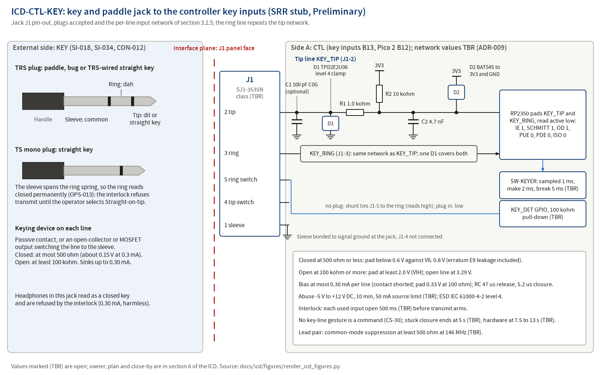

# ICD-CTL-KEY: Key and paddle jack to the controller key inputs

**Maturity: SRR stub.** Written before SRR under `docs/process/02-requirements-and-traceability.md` section 3.5 (Creation row) to meet `docs/process/01-lifecycle-and-reviews.md` section 4.3 row 17 (NPR 7123.1D App. G Table G-4 entrance criterion 6.11, external interfaces identified with preliminary definitions; success criterion 4, system security expectations). Sections 1, 2 and 3.1 are filled; every section 3.2 subsection is filled and marked Preliminary, or marked Not applicable with its reason. Each value names its source: an L1 requirement in `docs/requirements/sys/requirements.json`, `docs/design/concept.md`, an ADR or a research finding. A value not yet decided carries (TBR) and a row in section 6. The stub is reviewed against `docs/templates/peer-review-checklist-design.md` section I before SRR and baselined at PDR with the allocated baseline (02 section 3.5, Baseline and change row).

## 1. Scope (App. L 1.1 to 1.3)

### 1.1 Purpose and scope

This ICD defines and controls the interface between `CTL` (controller, UI and audio hardware: the Pico 2 module B12 and the key inputs B13 of `docs/design/concept.md` section 5; `docs/design/architecture.md` is written at PDR) and `KEY` (the operator's straight key, iambic paddle, bug or external keying device on a 3.5 mm plug). It covers: the KEY jack connector and pin-out, plug handling for TRS and mono (TS) plugs, the contact-sensing levels and bias current, the input protection network, abuse and ESD bounds, sampling and debounce timing at the controller, plug detection, the EMC provisions on the key leads, and the security expectations of the key line as a command-injection surface. The firmware treatment of the debounced inputs (keyer modes, element timing) is the SW side of `ICD-CTL-SW` (PDR) and `docs/requirements/sw/sw-keyer/requirements.json`; this ICD states only what crosses the jack plane and what the controller does at the boundary.

### 1.2 Precedence

Order of precedence in a conflict: `docs/process/00-charter.md`; the requirement files (`docs/requirements/sys/requirements.json` today; `docs/requirements/ctl/requirements.json` from PDR); this ICD; `docs/design/architecture.md` (from PDR); `docs/design/concept.md`; part datasheets as extracted in `docs/research/`. A conflict found is a finding against the newer document and is resolved by CR after PDR. Where this stub quotes a research value that an L1 requirement has since changed, the requirement value is used and the difference is noted in the row.

### 1.3 Responsibility and change authority

| Item | Value |
|---|---|
| Owner (writes and maintains) | Author of side `CTL` (02 section 3.5 Owner row); Claude writes the stub |
| Concurring side | External item defined by SI-018 (straight key and iambic paddle, built-in keyer), SI-034 (the owner's key and paddle use standard 3.5 mm TRS plugs, brands unknown) and CON-012 (3.5 mm TRS key jack, tip dit or straight key, ring dah, sleeve common); ADR-009 records the decision |
| Other module citing this ICD | `ME` for the jack opening and marking (REQ-SYS-108; `ICD-CTL-ME` at PDR); `SW` through `ICD-CTL-SW` for the pin map and the keyer (not a side) |
| Independent reviewer | Pending: reviewer agent invocation before SRR (SRR package section 2 items H1 and H11), checklist `docs/templates/peer-review-checklist-design.md` section I, record under `docs/reviews/SRR/checklists/` with the INSP-NNN Claude assigns |
| Approval | Robin, PDR decision memo (allocated baseline, charter section 3; 05 Table 4-1 row 10) |
| Change authority after PDR | `CR-NNN`, Class I for any definition-table change, Class II otherwise (02 section 10.2); Robin as CCB |

## 2. Documents (App. L 2.1, 2.2)

### 2.1 Applicable documents (binding)

| Document | What it imposes here |
|---|---|
| `docs/requirements/sys/requirements.json` REQ-SYS-038, REQ-SYS-039, REQ-SYS-047, REQ-SYS-049, REQ-SYS-108, REQ-SYS-174 | L1 requirements that cite this ICD in `design_refs` (section 4) |
| `docs/requirements/sys/requirements.json` REQ-SYS-007, REQ-SYS-048, REQ-SYS-050, REQ-SYS-051, REQ-SYS-052, REQ-SYS-053, REQ-SYS-054, REQ-SYS-055, REQ-SYS-056, REQ-SYS-162, REQ-SYS-163 | L1 requirements whose values bound a section 3.2 row but do not cite this ICD (section 4, related table) |
| `docs/requirements/sw/sw-keyer/requirements.json` REQ-SW-KEYER-019 to REQ-SW-KEYER-024, REQ-SW-KEYER-026, REQ-SW-KEYER-028, REQ-SW-KEYER-036, REQ-SW-KEYER-038 | Firmware sampling, debounce, interlock and its KEY inhibit report, mode-change and keying-source rules, plug-presence plausibility and the rule that key inputs change no setting, applied at the boundary (SW side of `ICD-CTL-SW`) |
| `docs/safety/hazards.json` HZ-004 (K1 interlock, K3 and K4 timeouts, K5 hardware cutoff), HZ-010 (K1 to K6) | Hazards controlled at this interface |
| CON-012, SI-018, SI-034 (`docs/requirements/l0-stakeholder/`) | Fix the connector, the pin convention and the plug types |
| `docs/process/07-software-engineering-plan.md` section 16.2 row "Keying and control inputs"; coding standard rules CS-29 and CS-30 (07 section 7) | Security expectations of section 3.2.5 |

### 2.2 Reference documents

| Document | Use |
|---|---|
| `docs/decisions/adr/ADR-009-straight-key-and-paddle-trs.md` | One TRS KEY jack, tip dit and hand key, ring dah, sleeve ground; menu-selected key type; input network values TBR at PDR; power-on interlock |
| `docs/decisions/adr/ADR-010-semi-break-in-only.md`, `ADR-024-keyer-speed-range.md` | Break-in mode and speed range served by the inputs |
| `docs/research/keyer-verification-and-key-input-network.md` F2 (RP2350 pad facts, erratum E9), F3 (closed-contact margin), F4 (network), F5 (clamp selection and abuse currents), F6 (debounce), F13 (stuck-key and mono-plug controls), F14 (number set) | Derivation of every electrical value in section 3.2 |
| `docs/research/keyer-and-key-interfaces.md` F1 (TRS convention and the mono-plug trap), F7 (bounce), F11 (external keying devices, ESD parts), section 4.1 candidates CTL-KEY-01 to CTL-KEY-07 | Convention, abuse cases, external keyer outputs |
| `docs/research/display-and-ui-parts.md` F17 (Same Sky SJ1-353xN jacks), F19 (plug-presence sensing), baseline table row "Key jack" | Jack part, pins and plug detect |
| `docs/research/antenna-and-erp.md` ANT-06 | Common-mode suppression on the leads |
| `docs/conops/conops.md` OPS-004, OPS-005, OPS-013, OPS-017, section 3.4 (KEY inhibit) | Scenarios that exercise the interface |
| `docs/design/concept.md` sections 7.5, 8 and 9 | Concept-level content of this ICD |
| `docs/risk/register.json` RSK-012 (step S5), RSK-024, RSK-039, RSK-060 (tag `cyber`, plan SEP16-KEY) | Risks this ICD mitigates |
| `docs/reviews/SRR/decisions-for-owner.md` items 44, 49, 50, 51, 78 | Owner decisions that close TBR rows of section 6 |

## 3. Interface (App. L 3.0)

### 3.1 General (App. L 3.1)

#### 3.1.1 Interface description

Two contact-closure signals cross the plane from the external keying device to the controller: tip (dit, or the straight key) and ring (dah), each switched to the sleeve, which is signal ground at the jack. The controller biases each line from 3.3 V through a 10 kohm pull-up (TBR), so a closed contact carries about 0.30 mA and an open line sits at 3.3 V; the controller reads the two lines as two independent inputs sampled every 1 ms, so a squeeze is observable. The jack's ring shunt contact reports plug presence. ESD and abuse energy that enters at the plane is absorbed on the CTL side by a clamp at the jack, a series resistor and a secondary clamp at the pad node. A mono (TS) plug grounds the ring permanently; that off-nominal case (OPS-013) is handled by the power-on interlock and the menu, not by the jack. Direction: external to CTL for the contact state; CTL to external for the bias current only. Conditions: the inputs are live whenever the controller is powered, including while USB power is present (the keyer then drives only the sidetone in PRACTICE, ConOps OPS-002 step 2).

Figure source: `docs/icd/figures/render_icd_figures.py` (matplotlib, `tools/toolchain.lock.md` section 2 class B plots), rendered and inspected 2026-09-25.

#### 3.1.2 Interface responsibilities

| Item at the plane | Provided by | Accepted by | Defined in |
|---|---|---|---|
| J1, 3.5 mm three-conductor panel jack with tip and ring shunt switches (Same Sky SJ1-3535N class) | `CTL` | the mating plug | 3.2.2 |
| Mating plug: 3.5 mm TRS (paddle, TRS-wired straight key) or TS (mono straight key) | External item (SI-018, SI-034, CON-012) | `CTL` | 3.2.2 |
| Contact closure from tip or ring to sleeve: passive contacts, or an open-collector or MOSFET keying output to ground | External item | `CTL` | 3.2.5 |
| Pull-up bias of each line to 3.3 V | `CTL` | External contact | 3.2.4 |
| Input protection network (clamp, series resistor, RC, secondary clamp) | `CTL` | none (absorbs energy from the external side) | 3.2.5, 3.2.7.1 |
| Plug-presence signal from the ring shunt switch | `CTL` (jack contact and GPIO) | `SW` through `ICD-CTL-SW` | 3.2.5 |
| Panel opening, jack position and marking in the enclosure | `ME` (REQ-SYS-108; `ICD-CTL-ME` at PDR) | the plug | 3.2.2, 3.2.7.5 |

#### 3.1.3 Coordinate systems

Local frame for this stub: origin on the jack axis at the outer surface of the enclosure wall, +Z along the jack axis out of the enclosure, +X along the PCB top face toward the headphone jack. The enclosure model frame is defined by the OpenSCAD source in `hardware/enclosure/` (empty at SRR); `ICD-CTL-ME` maps this local frame into it at PDR.

#### 3.1.4 Engineering units, tolerances and conversion

SI units with the amateur-radio conventions of the requirement files (W, dBm, dBc, Hz, ms, us, WPM, mV, C; ohm and kohm for resistance). Every value in section 3.2 carries a tolerance or bound. No unit conversion tables are used.

### 3.2 Interface definition (App. L 3.2)

The value both sides depend on is stated once here; each requirement (section 4) states what one side delivers or accepts, with the value, so it is verifiable alone.

#### 3.2.1 Mass properties

Not applicable: no item crossing the plane is carried by the radio; the plug and its cable are held by the jack only (retention in 3.2.2).

#### 3.2.2 Structural and mechanical

**Preliminary.**

| Feature | Value | Tolerance | Side responsible | Source |
|---|---|---|---|---|
| Connector type and part | 3.5 mm three-conductor right-angle through-hole jack with tip and ring shunt switches, Same Sky SJ1-3535N class (TBR) | part number fixed by the owner's jack decision | CTL | `docs/research/display-and-ui-parts.md` F17 and baseline table; SRR decision item 78 (D-UI-06) |
| Pin-out (jack pins) | 1 sleeve = signal ground; 2 tip = dit or straight key; 3 ring = dah; 4 tip switch = not connected; 5 ring switch = plug detect | exact | CTL | REQ-SYS-174; CON-012; ADR-009 section 2; display F17 (pin numbering), F19 (tip switch left unconnected so the tip line is not loaded) |
| Plugs accepted | TRS 3.5 mm (paddle, bug, TRS-wired straight key); TS 3.5 mm mono (straight key, ring grounded by the sleeve) | 3.5 mm plug per the jack drawing (bore 3.60 mm) | External; CTL accepts both | SI-034; keyer report F1; OPS-013 |
| Jack body and nose | body 14.0 x 8.0 mm, nose 6.0 mm diameter protruding 4.0 mm beyond the body face, body about 7.0 mm above the board | +/-0.30 mm (drawing X.X) | CTL | display F17 |
| Panel opening | 6.6 mm hole for the 6.0 mm nose (TBR) | set in `ICD-CTL-ME` at PDR | ME | display baseline table; concept section 9 row `ICD-CTL-ME` |
| Insertion and withdrawal force | 0.3 to 3 kg | as rated | CTL (part choice) | display F17 |
| Mating cycles | 5,000 | minimum, as rated | CTL (part choice) | display F17 |
| Contact rating and resistance | 12 V DC, 1 A; 50 mohm maximum to the plug | as rated | CTL (part choice) | display F17 |
| Operating temperature of the jack | -25 to +85 C | as rated | CTL (part choice) | display F17 |
| Plug admission through the enclosure | a fully seated plug at the key jack | fully seated | ME | REQ-SYS-108 |

#### 3.2.3 Fluid

Not applicable on cwht (no fluid interfaces).

#### 3.2.4 Electrical (power)

**Preliminary.** No power is delivered across the plane; the only supply-derived quantity is the pull-up bias that the external contact switches.

| Line | Nominal | Range | Current (max) | Sequencing and protection | Side responsible |
|---|---|---|---|---|---|
| Tip pull-up bias | 3.3 V through 10 kohm (TBR) | 3.29 V open with 1 uA pad leakage; below 0.6 V closed through 500 ohm including 120 uA erratum E9 leakage | 0.30 mA with the contact shorted (3.3 V over 10 kohm plus the 1.0 kohm series R1, 11.0 kohm); 0.29 mA through a 500 ohm contact | present whenever the Pico 2 3V3 rail is up (USB or pack); no internal pull-up or pull-down enabled at the pad (PUE = 0, PDE = 0) | CTL |
| Ring pull-up bias | as tip | as tip | as tip | as tip | CTL |

Derivation: keyer-verification F3 (V_pad table) and F4; the closed-contact current is below the 0.8 mA ceiling of candidate CTL-KEY-03 (keyer report section 4.1). An external keyer output must hold its closed state inside the 500 ohm bound, that is at most about 0.15 V across it at 0.29 mA (derived from F3: 500 ohm x 0.29 mA), and sink up to 0.30 mA (3.3 V over 11.0 kohm, keyer-verification F3 row 10 kohm, 1.0 kohm, 0 ohm); keyer report F11 finds that open-collector and MOSFET keying outputs sink a pull-up current of this size correctly (through a 100 ohm contact the pad reads 0.33 V and the contact itself carries 0.03 V, keyer-verification F3 row 10 kohm, 1.0 kohm, 100 ohm), and positive-logic TTL keyer outputs need a level adapter. The 0.33 mA and 0.07 V figures of `docs/research/keyer-and-key-interfaces.md` belong to the earlier network without R1 and are superseded here.

#### 3.2.5 Electronic (signal)

**Preliminary.**

| Pin or line | Name | Direction (A to B, B to A) | Level (V) | Timing (edge, debounce, rate) | Termination, ESD | Side responsible |
|---|---|---|---|---|---|---|
| J1-2 tip | KEY_TIP (dit, or straight key in Straight-on-tip) | B to A (contact state) | closed: contact at most 500 ohm reads closed (pad below VIL 0.8 V with at least 0.21 V margin); open: at least 100 kohm reads open (pad at least 2.0 V VIH); read active-low | sampled every 1.000 ms +/-0.010 ms; closure accepted after 2 ms (TBR) of continuous contact, opening after 5 ms (TBR) of continuous break; RC at the pad: 47 us release, 5.2 us closure time constants, 34 kHz corner | from the jack: optional 100 pF C0G shunt, TPD2E2U06 clamp (IEC 61000-4-2 level 4), 1.0 kohm series, 10 kohm pull-up to 3V3, 4.7 nF to ground at the pad node, BAT54S clamp to 3V3 and ground (values TBR); pad IE = 1, SCHMITT = 1, PUE = 0, PDE = 0, OD = 1 (output driver disabled), ISO = 0, FUNCSEL = SIO (keyer-verification F4) | CTL; the external contact meets the resistance bounds |
| J1-3 ring | KEY_RING (dah; straight key in Straight-on-ring) | B to A | as tip | as tip | as tip; one TPD2E2U06 covers both lines | as tip |
| J1-1 sleeve | GND (signal ground at the jack) | common | 0 V | not applicable | bonded to signal ground at the jack; common-mode suppression on the lead pair of at least 500 ohm at 146 MHz (TBR) | CTL |
| J1-5 ring switch | KEY_DET (plug present) | A internal (jack contact to GPIO) | with no plug the shunt ties J1-5 to the ring node (reads high through the ring pull-up); with a plug inserted the shunt opens and a 100 kohm pull-down (TBR) reads low | debounced by firmware; a detect change never changes the key mode (REQ-SW-KEYER-024) | same ESD path as the ring through the shunt; wiring confirmed against the SJ1-3535N drawing (TBR) | CTL |
| J1-4 tip switch | none | none | not connected | none | left open so the tip line carries no shunt load | CTL |

Boundary behaviour required of the controller for every closure pattern the external side can produce (L1 values; SW side detail in `docs/requirements/sw/sw-keyer/requirements.json`):

| Condition at the plane | Controller response | Source |
|---|---|---|
| Any input the selected mode uses reads closed at power-on, after a reset or after a key-mode change (mono plug, stuck key, headphones in the key jack) | transmit stays disarmed until each such input reads open for 500 ms (TBR); display "KEY CLOSED: check plug"; sidetone off | REQ-SYS-052; REQ-SW-KEYER-022; HZ-004 K1; OPS-013 step 1 |
| Continuous confirmed closure of a manually timed contact | transmitter unkeyed from 5 s (TBR) until the contact opens; sidetone continues; display "KEY?" | REQ-SYS-053; REQ-SW-KEYER-026, REQ-SW-KEYER-027; OPS-013 step 2 |
| Paddle held so that identical elements repeat | keying stops after 128 consecutive identical elements or 10 s (TBR) of them, until both paddle contacts read open | REQ-SYS-054 (the research figure of 30 s, keyer-verification F13 item 3 and OPS-013 step 3, is the D-KN3 alternative) |
| Key-down held from any cause, firmware included | antenna-port RF ends independently of firmware 7.5 s to 13 s (TBR) into the key-down, 10 s nominal | REQ-SYS-055; HZ-004 K5 |
| Plug inserted or removed, detect change, any input pattern | key-input mode unchanged; the mode changes only by an explicit menu selection, which is accepted while an input reads closed | REQ-SYS-056, REQ-SYS-163; REQ-SW-KEYER-024, REQ-SW-KEYER-025 |

Security expectations (02 section 3.5 Content row; 07 section 16.2 row "Keying and control inputs"; NPR 7123.1D App. G Table G-4 success criterion 4):

| Item | Definition | Side responsible |
|---|---|---|
| Security expectations | **Accepts:** tip and ring contact closures to sleeve, read as a two-bit signal sampled at 1 kHz that feeds only the keyer state machine (CS-30; REQ-SW-KEYER-019); a closure counts only after the debounce make time and an opening only after the break time (CS-29; REQ-SYS-048, REQ-SYS-162; REQ-SW-KEYER-020, REQ-SW-KEYER-021); key-down is asserted only from these debounced states or the confirmed bench test-mode generator (REQ-SYS-007; REQ-SW-KEYER-028). The external side delivers nothing but contact states within the resistance bounds of the signal table. **Rejects:** closures shorter than the debounce make time (no event); any key-line pattern as a command: no gesture on the key line changes configuration, key mode or state outside the keyer (CS-30; REQ-SYS-056; REQ-SW-KEYER-024, REQ-SW-KEYER-038); a key input that reads closed while the plug-presence input reads no plug withholds key-down (REQ-SW-KEYER-036); a closure present at boot, reset or mode change is refused by the interlock until the input reads open for 500 ms (TBR) and reported as the KEY inhibit (REQ-SYS-052; REQ-SW-KEYER-022, REQ-SW-KEYER-023); a stuck closure ends at the 5 s (TBR) manual-closure timeout or the paddle watchdog, and the hardware cutoff bounds any key-down to 13 s regardless of firmware (SWE-134 g, j; REQ-SYS-053 to REQ-SYS-055); a DC abuse voltage from -5 V to +12 V (TBR) is clamped without damage (REQ-SYS-049). **Logs:** each interlock refusal, manual-closure timeout and paddle-watchdog stop is a safety rejection written to the `SW-DIAG` event log (07 section 16.5; SWE-210 as tailored) and shown on the display (REQ-SYS-067); a debounce rejection writes nothing, because a key-line flood must not wear the flash ring buffer. The logging requirement is created with the `SW-DIAG` module at PDR (TBR). **Basis:** 07 section 16.2 row "Keying and control inputs" (L1, C4); RSK-060 (tag `cyber`, crafted key or control input changes radio state or configuration, plan SEP16-KEY) covers this row; the safety consequence of a misread closure is carried by RSK-024; REQ-SYS-007, REQ-SYS-048, REQ-SYS-049, REQ-SYS-052 to REQ-SYS-056, REQ-SYS-162; REQ-SW-KEYER-019 to REQ-SW-KEYER-024, REQ-SW-KEYER-028, REQ-SW-KEYER-036, REQ-SW-KEYER-038 | CTL (network, bias, clamps); SW through `ICD-CTL-SW` (debounce, interlock, timeouts, logging); the external side for the contact-state statement |

#### 3.2.6 Software and data

Stated in section 3.2.5: the key line is a signal interface and the command-injection surface of 07 section 16.2; it carries no data or command path. The GPIO numbers, pad configuration and sampling timer allocation are defined in `ICD-CTL-SW` at PDR.

| Item | Definition | Side responsible |
|---|---|---|
| Register or GPIO map | Two SIO inputs for tip and ring, one for plug detect; GPIO numbers assigned in `ICD-CTL-SW` at PDR; pad configuration IE = 1, SCHMITT = 1, PUE = 0, PDE = 0, OD = 1 (output driver disabled, so the pad never drives the key line), ISO = 0, FUNCSEL = SIO (keyer-verification F4; reset values of RP2350 Table 853 per F2 are overridden explicitly) | CTL, SW |
| Protocol, framing, rate | Not applicable: level signals, no protocol | none |
| Message or command set | None: the key line carries no command (CS-30) | none |
| Timing (latency, period) | sample period 1.000 ms +/-0.010 ms (REQ-SW-KEYER-019); paddle-initiated element starts at the keyer test point within 3 ms of the paddle closure (REQ-SYS-043) | SW |
| Error detection and response | the section 3.2.5 boundary table | SW |
| Initialization and status | pad configured before the keyer arms; the interlock runs at every boot and reset (REQ-SYS-052) | SW |
| Security expectations | Stated in section 3.2.5 | CTL, SW |

#### 3.2.7 Environments

##### 3.2.7.1 Electromagnetic effects (EMC, EMI, grounding, bonding, cable and wire)

**Preliminary.**

| Item | Definition | Source |
|---|---|---|
| ESD at the jack | survives IEC 61000-4-2 level 4 (8 kV contact, 15 kV air) on any contact; TPD2E2U06 holds the jack node near 12.4 V (5 A TLP), the pad side sees about 8.4 mA for about 100 ns through 1.0 kohm and C2 rises about 0.18 V | REQ-SYS-050 (Analysis, no ESD generator on the bench, CON-016); keyer-verification F5 |
| DC abuse | -5 V to +12 V (TBR) applied 10 min (TBR) to any key-jack contact without damage, from a source limited to 50 mA (TBR) (the bench current limit of the REQ-SYS-049 verification note; equivalently a source impedance of at least 70 ohm at +12 V). At +12 V the TVS (breakdown 6.5 to 8.5 V at 1 mA, 9.7 V at 1 A TLP, SLLSEG9C via keyer-verification F5) conducts and the source goes into its limit: the jack node sits near the clamp voltage, about 6.5 to 9 V; R1 passes (V_clamp - 3.7 V)/1.0 kohm = 2.8 to 5.3 mA into D2 and the 3V3 rail (8 to 28 mW in R1), and the TVS takes the rest of the 50 mA, about 45 to 47 mA, 0.3 to 0.4 W for 10 min. With the TVS open (its single-point failure, HZ-010) the jack node reaches 12 V and R1 passes (12 - 3.7) V/1.0 kohm = 8.3 mA into the 3V3 rail and dissipates 69 mW, 69 percent of its 0603 100 mW rating: this is the R1 sizing case. At -5 V the TVS conducts forward at about -0.7 to -1.9 V and takes nearly the whole 50 mA (about 0.05 to 0.1 W); D2 passes at most (5 - 0.4) V/1.0 kohm = 4.6 mA with the TVS open. The TPD2E2U06 working voltage is 5.5 V and the extract of F5 gives no continuous power rating, so the 0.3 to 0.4 W continuous case is not shown to be within rating (section 6 row); a +24 V bound would need R1 in 1206 | REQ-SYS-049; keyer-verification F5; SRR decision item 49 (D-KN7) |
| RF pickup on the key lead | both key-input states unchanged while transmitting 5 W with 1.5 m unshielded leads on the key and headphone jacks; the 1.0 kohm and 4.7 nF divider attenuates 144 MHz pickup by about 70 dB before the 0.2 V Schmitt hysteresis; common-mode suppression of at least 500 ohm at 146 MHz (TBR) on the lead pair | REQ-SYS-051; keyer-verification F4; HZ-010 K4; antenna report ANT-06; OPS-017 |
| Grounding | sleeve is signal ground, bonded at the jack to the board ground plane; the enclosure bonding path is defined in `ICD-CTL-ME` at PDR | ADR-009; concept section 7.5 |
| Cross-plugging | headphones in the key jack put 3.3 V through 10 kohm and the 1.0 kohm R1 into 16 ohm (0.30 mA, inaudible) and read as a closed key, which the interlock refuses (OPS-013 step 1); an audio source on the key jack is clamped by the network (RSK-039 S2 analysis at PDR) | audio report F28; keyer report section 4.1 candidate CTL-KEY-06 |

##### 3.2.7.2 Acoustic

Not applicable: the key jack carries no audio; the sidetone is defined in `ICD-CTL-PHONES`.

##### 3.2.7.3 Structural loads

**Preliminary.** The jack carries only plug insertion, withdrawal (0.3 to 3 kg, 3.2.2) and cable side loads; the enclosure opening takes the side load on the jack nose so the through-hole joints are not the load path (`ICD-CTL-ME` at PDR). Drop survival of the unit with plugs inserted is governed by REQ-SYS-116 (its value and TBR are carried there).

##### 3.2.7.4 Vibroacoustics

Not applicable on cwht: the hazard analysis names no vibration case.

##### 3.2.7.5 Human operability

**Preliminary.** Plug insertion by feel with the radio in the hand; the key jack and the headphone jack are the same part family, so they are separated in position and engraved (TBR) to prevent cross-plugging (SRR decision item 51, keyer report D11, RSK-039 S3); a mono plug produces the "KEY CLOSED: check plug" message and the operator selects Straight-on-tip from the menu (OPS-013; SRR decision item 44, D-KN8); the handbook carries the one-line plug check (RSK-024 S5).

#### 3.2.8 Other interface definitions

Not applicable: no thermal path or RF exposure crosses the key jack plane.

## 4. Requirements on each side (cwht addition; 02 section 3.5 pairing rule)

Side `CTL` L2 requirements do not exist at SRR: the CTL specification `docs/requirements/ctl/requirements.json` is written at PDR, and ADR-009 section 4.1 names its interface requirements (jack pin-out, two independent inputs, contact sensing thresholds, network values, ESD and abuse bounds). Until then the pairing rule of 02 section 3.5 is not yet met for side A (the tool check T-22, INTERFACE_TAG_NO_ICD, reads only the `design_refs` of `interface`-tagged requirements and is a warning at SRR, an error from PDR under `--gate`). Disposition of INSP-012 finding F-01: the side-A pairing is deferred to PDR, when the CTL L2 author writes the `interface`-tagged REQ-CTL-NNN requirements with this ICD id in `design_refs` and this ICD moves them to `requirements_a` in the same change; the deferral is proposed to Robin for an owner decision reference in the SRR decision list, and until that reference exists this row stays open. Side `KEY` is external: its defining inputs are SI-018, SI-034 and CON-012. The L1 requirements that cite this ICD are listed as `requirements_other`.

| Side | Requirement | Statement (verbatim `description`) | Section 3.2 rows it depends on | Verification method |
|---|---|---|---|---|
| A `CTL` | none at SRR (REQ-CTL-NNN at PDR per ADR-009 section 4.1) | not applicable | 3.2.2, 3.2.4, 3.2.5 | not applicable |
| B `KEY` | SI-018, SI-034, CON-012 (external item) | CON-012: "The key input is a 3.5 mm three-conductor jack wired tip = dit or straight key, ring = dah, sleeve = common, accepting the owner's straight key and paddle with their standard TRS plugs, and the electronic keyer is built in." | 3.2.2 pin-out and plugs | not applicable (stakeholder constraint) |
| other | REQ-SYS-038 | The transceiver shall key the transmitter for the duration of each straight-key closure at the key jack. | 3.2.5 tip and ring, debounce | Demonstration |
| other | REQ-SYS-039 | The transceiver shall key the transmitter with Morse elements generated from iambic paddle closures at the key jack. | 3.2.5 tip and ring, debounce | Demonstration |
| other | REQ-SYS-047 | The transceiver shall read a key contact as closed at 500 ohm or less and as open at 100 kohm or more. | 3.2.4, 3.2.5 levels | Test |
| other | REQ-SYS-049 | The transceiver shall survive a DC voltage from -5 V to +12 V applied for 10 min (TBR) to any key-jack contact without damage. | 3.2.7.1 DC abuse | Test |
| other | REQ-SYS-108 | The transceiver shall admit fully seated mating plugs at the key jack, headphone jack and micro-USB receptacle through its enclosure openings. | 3.2.2 panel opening, plug admission | Demonstration |
| other | REQ-SYS-174 | The transceiver shall accept keys on a 3.5 mm TRS jack wired tip as dit or straight key, ring as dah and sleeve as common. | 3.2.2 pin-out | Inspection |

The lists here equal the front matter `requirements_a`, `requirements_b`, `requirements_other` and are checked by T-22 against `design_refs`.

Related L1 requirements that bound a section 3.2 value but do not cite this ICD in `design_refs` (proposed additions are returned to the requirements author, not edited here): REQ-SYS-007 (keying only from the key jack), REQ-SYS-048 and REQ-SYS-162 (debounce), REQ-SYS-050 (ESD), REQ-SYS-051 (RF immunity), REQ-SYS-052 (interlock), REQ-SYS-053 and REQ-SYS-054 (timeouts), REQ-SYS-055 (hardware cutoff), REQ-SYS-056 and REQ-SYS-163 (mode selection).

## 5. Verification (cwht addition; SE HB §6.3.1.2.3)

| Case | Verifies | Method and evidence class | Level |
|---|---|---|---|
| TC-SYS-026 | REQ-SYS-038, REQ-SYS-039 | Demonstration, Bench (owner's straight key and paddle, logic capture of TX_KEY) | System |
| TC-SYS-033 | REQ-SYS-047, REQ-SYS-049 | Test, Bench (resistor substitution across tip-sleeve and ring-sleeve; current-limited bench supply at -5 V and +12 V for 10 min; thresholds re-checked) | System |
| TC-SYS-074 | REQ-SYS-108 | Demonstration, Bench (fully seated plugs through the enclosure openings) | System |
| TC-SYS-058 | REQ-SYS-174 | Inspection (schematic, BOM connector and this ICD's pin table) | System |
| TC-SYS-034, TC-SYS-035, TC-SYS-036, TC-SYS-037, TC-SYS-038, TC-SYS-039 | related REQ-SYS-048 and REQ-SYS-162, REQ-SYS-050, REQ-SYS-051, REQ-SYS-052, REQ-SYS-056 and REQ-SYS-163, REQ-SYS-053 and REQ-SYS-054, REQ-SYS-055 | Test (Bench) or Analysis (TC-SYS-035, Simulation class) | System |
| TC pending | side `CTL` interface requirements (REQ-CTL-NNN) | written by the independent CTL test author with the CTL L2 file at PDR (02 rule WR-11) | Subsystem |

## 6. TBR items

| Value (section, row) | Current estimate | Owner | Plan | close_by |
|---|---|---|---|---|
| 3.2.2 Connector type and part | Same Sky SJ1-3535N class, THT, tip and ring switches | Robin decides at SRR on Claude's proposal | SRR decision item 78 (D-UI-06); distributor stock checked at CDR (SRR decision item 102) | PDR |
| 3.2.2 Panel opening | 6.6 mm hole for the 6.0 mm nose | Claude (ICD author) | `ICD-CTL-ME` sets the hole from the jack drawing and the enclosure wall at PDR; H2C fit-check print with real plugs (TC-SYS-074 pre-build) | PDR |
| 3.2.4 and 3.2.5 Input network values (10 kohm pull-up, 1.0 kohm series, 4.7 nF, optional 100 pF, TPD2E2U06, BAT54S) | as listed | Claude (ICD author); Robin approves in the PDR memo | ADR-009 section 2 (values TBR closing at PDR); LTspice of the network with pad thresholds and E9 leakage (REQ-SYS-047 pre-build Simulation); need for the 100 pF shunt decided by the RF-immunity case (keyer-verification F4) | PDR |
| 3.2.5 Debounce make time | 2 ms (2 samples) | Robin decides at SRR on Claude's proposal; Claude produces the closing evidence | REQ-SYS-048 tbr: bounce capture of the owner's key and paddle with the Pico-based logic capture before PDR | PDR |
| 3.2.5 Debounce break time | 5 ms (5 samples) | as above | REQ-SYS-162 tbr: same bounce capture | PDR |
| 3.2.5 Plug-detect wiring and pull-down | ring switch J1-5 to a GPIO with 100 kohm pull-down | Claude (ICD author) | CTL schematic at PDR checked against the SJ1-3535N drawing shunt state (display F19 states the circuit is to be verified) | PDR |
| 3.2.5 Interlock open time | 500 ms | Robin decides at SRR on Claude's proposal | REQ-SYS-052 tbr: HostUnit bounce study at PDR confirms 500 ms | PDR |
| 3.2.5 Manual-closure timeout | 5 s (2 to 6 s configurable) | Robin decides at SRR on Claude's proposal | REQ-SYS-053 tbr: Robin decides D-KN3 at SRR | PDR |
| 3.2.5 Paddle watchdog time cap | 128 identical elements or 10 s | Robin decides at SRR on Claude's proposal | REQ-SYS-054 tbr: D-KN3 at SRR (10 s, or 30 s with MOE-012 amended) | PDR |
| 3.2.5 Hardware cutoff window | 7.5 s to 13 s, 10 s nominal | Robin decides at SRR on Claude's proposal | REQ-SYS-055 tbr: D-KN2 with RFX-D3 at SRR; monostable timing analysis at PDR | PDR |
| 3.2.5 Security expectations, logging requirement | safety rejections logged by `SW-DIAG` per 07 section 16.5 | Claude (software lead) | `REQ-SW-DIAG-NNN` written with the `SW-DIAG` module at PDR (RSK-060 plan SEP16-KEY) | PDR |
| 3.2.5 and 3.2.7.1 DC abuse bound and duration | -5 V to +12 V for 10 min from a 50 mA limited source | Robin decides at SRR on Claude's proposal | REQ-SYS-049 tbr: D-KN7 at SRR (SRR decision item 49, no +24 V line recommended); clamp dissipation analysis at PDR against the TPD2E2U06 absolute maximum ratings in SLLSEG9C: if the TVS cannot take about 0.4 W for 10 min, the ICD lowers the abuse-source current limit (and the REQ-SYS-049 bench limit with it, through the requirements author) or adds a series element ahead of the TVS | PDR |
| 3.2.5 and 3.2.7.1 Common-mode suppression | at least 500 ohm at 146 MHz on the lead pair | Claude (ICD author) | choke analysis at PDR (technology assessment section 3.14); REQ-SYS-051 Bench case TC-SYS-036 at TRR confirms | PDR |
| 3.2.7.5 Jack disambiguation | separate positions plus engraved marking | Robin decides on Claude's proposal | SRR decision item 51; `ICD-CTL-ME` at PDR (RSK-039 S3) | PDR |

## 7. Change history

| Revision | Date | CR or review | Change |
|---|---|---|---|
| A | 2026-09-25 | none (pre-baseline draft; SRR package section 2 item H11) | Created as the SRR stub |
| A | 2026-09-25 | INSP-012 (`docs/reviews/SRR/checklists/icd-stubs-external.md`), pre-baseline | Findings F-01 (pairing deferral), F-02, F-03, F-04, F-05 applied; figure re-rendered and inspected |
