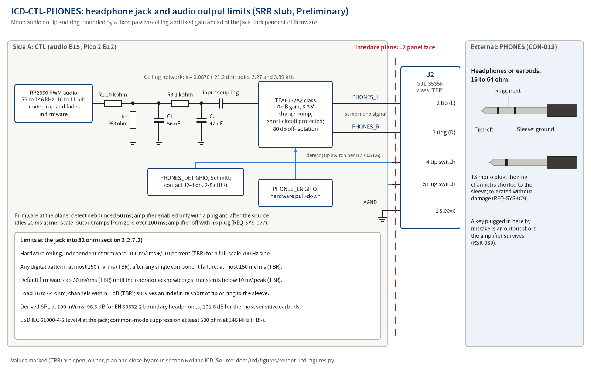

# ICD-CTL-PHONES: Headphone jack and audio output limits

**Maturity: SRR stub.** Written before SRR under `docs/process/02-requirements-and-traceability.md` section 3.5 (Creation row) to meet `docs/process/01-lifecycle-and-reviews.md` section 4.3 row 17 (NPR 7123.1D App. G Table G-4 entrance criterion 6.11; success criterion 4). Sections 1, 2 and 3.1 are filled; every section 3.2 subsection is filled and marked Preliminary, or marked Not applicable with its reason. Each value names its source: an L1 requirement in `docs/requirements/sys/requirements.json`, `docs/design/concept.md`, a hazard control or a research finding. A value not yet decided carries (TBR) and a row in section 6. The stub is reviewed against `docs/templates/peer-review-checklist-design.md` section I before SRR and baselined at PDR with the allocated baseline.

## 1. Scope (App. L 1.1 to 1.3)

### 1.1 Purpose and scope

This ICD defines and controls the interface between `CTL` (controller, UI and audio hardware: the audio block B15 of `docs/design/concept.md` section 5, fed by the Pico 2 module B12; `docs/design/architecture.md` is written at PDR) and `PHONES` (the operator's headphones or earbuds on a 3.5 mm plug; headphones are the only audio output, CON-013). It covers: the headphone jack and pin-out, plug types, load impedance, the output level limits that bound sound pressure at the ear (hardware ceiling, worst case, default cap, transients), channel drive, plug detection and amplifier enable, short-circuit and cross-plugging survival, and EMC on the headphone lead. The sample-domain processing that produces the audio (limiter, fades, AGC, volume) is the SW side of `ICD-CTL-SW` (PDR); this ICD states the limits at the jack plane that hold whatever the firmware does.

### 1.2 Precedence

Order of precedence in a conflict: `docs/process/00-charter.md`; the requirement files (`docs/requirements/sys/requirements.json` today; `docs/requirements/ctl/requirements.json` from PDR); this ICD; `docs/design/architecture.md` (from PDR); `docs/design/concept.md`; part datasheets as extracted in `docs/research/`. A conflict found is a finding against the newer document and is resolved by CR after PDR.

### 1.3 Responsibility and change authority

| Item | Value |
|---|---|
| Owner (writes and maintains) | Author of side `CTL` (02 section 3.5 Owner row); Claude writes the stub |
| Concurring side | External item defined by CON-013 (headphones are the only audio output, 3.5 mm jack, no speaker in revision A) and SI-005 (operate with headphones and a key plugged in) |
| Other module citing this ICD | `ME` for the jack opening and marking (REQ-SYS-108; `ICD-CTL-ME` at PDR); `SW` through `ICD-CTL-SW` for the amplifier enable, the detect input and the audio stream (not a side) |
| Independent reviewer | Pending: reviewer agent invocation before SRR (SRR package section 2 items H1 and H11), checklist `docs/templates/peer-review-checklist-design.md` section I, record under `docs/reviews/SRR/checklists/` with the INSP-NNN Claude assigns |
| Approval | Robin, PDR decision memo (allocated baseline, charter section 3; 05 Table 4-1 row 10) |
| Change authority after PDR | `CR-NNN`, Class I for any definition-table change, Class II otherwise (02 section 10.2); Robin as CCB |

## 2. Documents (App. L 2.1, 2.2)

### 2.1 Applicable documents (binding)

| Document | What it imposes here |
|---|---|
| `docs/requirements/sys/requirements.json` REQ-SYS-077, REQ-SYS-078, REQ-SYS-079, REQ-SYS-108 | L1 requirements that cite this ICD in `design_refs` (section 4) |
| `docs/requirements/sys/requirements.json` REQ-SYS-050, REQ-SYS-051, REQ-SYS-059, REQ-SYS-071, REQ-SYS-072, REQ-SYS-073, REQ-SYS-074, REQ-SYS-075, REQ-SYS-076, REQ-SYS-157, REQ-SYS-158, REQ-SYS-169, REQ-SYS-170, REQ-SYS-173 | L1 requirements whose values bound a section 3.2 row but do not cite this ICD (section 4, related list) |
| `docs/safety/hazards.json` HZ-005 (K1 to K9), HZ-010 (K4, K5) | Hazards controlled at this interface |
| CON-013, SI-005 (`docs/requirements/l0-stakeholder/`) | Fix the output device class and the connector |

### 2.2 Reference documents

| Document | Use |
|---|---|
| `docs/research/audio-output-and-hearing-safety.md` F10 (amplifier shutdown and pop suppression), F19 (EN 50332 and IEC 62368-1 limits), F23 to F25 (sensitivities, SPL versus voltage, unrestricted amplifier hazard), F26 (tip-switch detection), F27 (hardware ceiling network), F28 (no-headphones behaviour, insertion, cross-plugging), F29 (mono plugs), candidate SYS-AUD-01 and SYS-AUD-02, decision D2 | Derivation of the level limits and the jack behaviour |
| `docs/research/display-and-ui-parts.md` F17, F19, baseline table row "Headphone jack" | Jack part, pins and detect contact |
| `docs/research/antenna-and-erp.md` ANT-06 | Common-mode suppression on the lead |
| `docs/design/concept.md` sections 7.5, 8 (hearing layers) and 9 | Concept-level content of this ICD |
| `docs/conops/conops.md` OPS-003, OPS-004, OPS-013, OPS-017 | Scenarios that exercise the interface |
| `docs/risk/register.json` RSK-017, RSK-039 | Risks this ICD mitigates |
| `docs/reviews/SRR/decisions-for-owner.md` items 51, 63 to 66, 68, 78 | Owner decisions that close TBR rows of section 6 |

## 3. Interface (App. L 3.0)

### 3.1 General (App. L 3.1)

#### 3.1.1 Interface description

Monophonic audio (receive audio and sidetone, mixed and limited in firmware) crosses the plane from the controller to the headphones on two channels, tip (left) and ring (right), driven with the same signal and referenced to the sleeve. The output level at the plane is bounded by fixed passive parts and a fixed amplifier gain ahead of the jack, independently of firmware (hardware ceiling), and below that by a firmware default cap. A jack shunt contact reports plug presence; with no plug the amplifier is shut down. The external side presents a 16 to 64 ohm load on TRS or TS plugs; a TS plug shorts the ring channel to the sleeve, which the output survives indefinitely. Direction: CTL to PHONES only. Conditions: the amplifier is enabled only with a plug present and after the audio source has settled; it is off in the Charging and Firmware-update modes, where the audio is unpowered (ConOps section 3.4).

Figure source: `docs/icd/figures/render_icd_figures.py` (matplotlib, `tools/toolchain.lock.md` section 2 class B plots), rendered and inspected 2026-09-25.

#### 3.1.2 Interface responsibilities

| Item at the plane | Provided by | Accepted by | Defined in |
|---|---|---|---|
| J2, 3.5 mm three-conductor panel jack with shunt switches (Same Sky SJ1-3535N class, the key-jack part) | `CTL` | the mating plug | 3.2.2 |
| Mating plug: 3.5 mm TRS (stereo headphones or earbuds) or TS (mono) | External item (CON-013, SI-005) | `CTL` | 3.2.2 |
| Audio drive on tip and ring, level-limited | `CTL` | headphones, 16 to 64 ohm | 3.2.5, 3.2.7.2 |
| Hardware output ceiling (passive divider and fixed gain) | `CTL` | none | 3.2.7.2 |
| Plug-presence signal and amplifier enable | `CTL` (jack contact, GPIO, enable pull-down) | `SW` through `ICD-CTL-SW` | 3.2.5 |
| Panel opening, jack position and marking in the enclosure | `ME` (REQ-SYS-108; `ICD-CTL-ME` at PDR) | the plug | 3.2.2, 3.2.7.5 |

#### 3.1.3 Coordinate systems

Local frame for this stub: origin on the jack axis at the outer surface of the enclosure wall, +Z along the jack axis out of the enclosure, +X along the PCB top face toward the key jack. `ICD-CTL-ME` maps this frame into the enclosure model frame of `hardware/enclosure/` at PDR.

#### 3.1.4 Engineering units, tolerances and conversion

SI units with the amateur-radio conventions of the requirement files (W, dBm, dBc, Hz, ms, us, WPM, mV, C; mVrms for audio voltage, dB SPL and dB(A) for sound pressure). Every value in section 3.2 carries a tolerance or bound. No unit conversion tables are used; SPL figures are derived per audio report F24.

### 3.2 Interface definition (App. L 3.2)

#### 3.2.1 Mass properties

Not applicable: the headphones and their cable are not carried by the radio; the plug is held by the jack only.

#### 3.2.2 Structural and mechanical

**Preliminary.**

| Feature | Value | Tolerance | Side responsible | Source |
|---|---|---|---|---|
| Connector type and part | 3.5 mm three-conductor right-angle through-hole jack with tip and ring shunt switches, Same Sky SJ1-3535N class, the same part as the key jack (TBR) | part number fixed by the owner's jack decision | CTL | display F17 and baseline table; SRR decision item 78 (D-UI-06); the audio report baseline names the SMT tip-switch SJ-3524-SMT instead (F26), superseded by the concept section 7.5 and HZ-005 K6 choice of the SJ1-3535N class |
| Pin-out (jack pins) | 1 sleeve = audio ground; 2 tip = left; 3 ring = right; 4 tip switch and 5 ring switch = detect contact candidates (one used, TBR) | exact | CTL | display F17 (pin numbering); concept section 7.5 and HZ-005 K6 (tip-switch detect); display F19 (ring switch as headphone detect) |
| Plugs accepted | TRS 3.5 mm (both channels); TS 3.5 mm mono (ring channel shorted to the sleeve, tolerated) | 3.5 mm plug per the jack drawing | External; CTL accepts both | audio report F29; REQ-SYS-079; SRR decision item 66 |
| Jack body, nose, forces, cycles, rating | as `ICD-CTL-KEY` section 3.2.2 (same part): nose 6.0 mm, 0.3 to 3 kg, 5,000 cycles, 12 V DC 1 A, -25 to +85 C | as rated | CTL (part choice) | display F17 |
| Panel opening | 6.6 mm hole (TBR) | set in `ICD-CTL-ME` at PDR | ME | display baseline table |
| Plug admission through the enclosure | a fully seated plug at the headphone jack | fully seated | ME | REQ-SYS-108 |

#### 3.2.3 Fluid

Not applicable on cwht (no fluid interfaces).

#### 3.2.4 Electrical (power)

**Preliminary.** No power is delivered to the external side other than the audio signal itself.

| Line | Nominal | Range | Current (max) | Sequencing and protection | Side responsible |
|---|---|---|---|---|---|
| Audio drive, each channel | at most 100 mVrms +/-10 percent (TBR) full-scale sine into 32 ohm (0.31 mW) | 0 to 150 mVrms (TBR) for any digital pattern; into 16 ohm the same voltage bound applies | 4.7 mA rms at 150 mVrms into 32 ohm, 9.4 mA rms into 16 ohm (derived, I = V / R); into a short, the amplifier's own short-circuit limit (value not yet extracted, TBR) | amplifier (TPA6132A2 class at 0 dB gain on the 3.3 V rail) enabled by firmware only after the source has idled at mid-scale for at least 20 ms; enable pulled down in hardware; shutdown with no plug, on brown-out and on fault | CTL |
| Jack DC level | 0 V: ground-referenced (charge-pump) output, no DC blocking capacitor at the jack for the TPA6132A2 baseline (TBR with the amplifier family) | not applicable | not applicable | a capacitor-coupled amplifier (SRR decision item 68 alternative) would add output capacitors | CTL |

Sources: REQ-SYS-071, REQ-SYS-072; concept section 7.5; HZ-005 K1, K5; audio report F10, F25, F27, F29.

#### 3.2.5 Electronic (signal)

**Preliminary.**

| Pin or line | Name | Direction (A to B, B to A) | Level (V) | Timing (edge, debounce, rate) | Termination, ESD | Side responsible |
|---|---|---|---|---|---|---|
| J2-2 tip | PHONES_L | A to B | per 3.2.4 and the 3.2.7.2 limit table; same signal as ring | audio 300 to 1500 Hz CW band within about 1 dB with a 3.3 kHz two-pole reconstruction corner (F27); PWM carrier residual attenuated about 66 dB | driven by the amplifier; survives an indefinite short to sleeve (REQ-SYS-079); ESD IEC 61000-4-2 level 4 at the jack (REQ-SYS-050) | CTL |
| J2-3 ring | PHONES_R | A to B | as tip, within 1 dB (TBR) of the tip channel at the active cap into 16 to 64 ohm | as tip | as tip; a TS plug shorts it to sleeve permanently | CTL |
| J2-1 sleeve | AGND (audio ground) | common | 0 V | not applicable | audio return to the analog ground of the amplifier; common-mode suppression of at least 500 ohm at 146 MHz (TBR) on the lead | CTL |
| J2-4 or J2-5 | PHONES_DET (plug present) | A internal (jack contact to GPIO) | GPIO with pull-up or pull-down and Schmitt trigger per the chosen contact (TBR) | debounced 50 ms; on insertion the output ramps from zero over 100 ms after the debounce | through the jack shunt | CTL, SW |
| amplifier enable | PHONES_EN | A internal | GPIO, hardware pull-down (off at reset and in the bootloader) | asserted only with a plug present and after the source settles 20 ms at mid-scale | 80 dB input-to-output attenuation and about 20 ohm output impedance in shutdown (F10) | CTL, SW |

Detect and enable behaviour: the amplifier output is disabled while no plug is inserted (REQ-SYS-077; HZ-005 K6); the display indicates "no phones" and the keyer stays functional (audio report F28 option a; SRR decision item 66). Sources: HZ-005 K5, K6; HZ-010 K5; audio report F10, F26 to F28.

Security expectations: Not applicable: the headphone jack is an output; no line at this plane is read as data or commands (07 section 16.2 lists no asset or surface here). The detect input only enables or disables the amplifier and cannot change any other state.

#### 3.2.6 Software and data

Not applicable at the plane: no data crosses the headphone jack. The GPIO numbers for PHONES_DET and PHONES_EN, the PWM slice of the audio source and the limiter, cap and fade behaviour that produce the signal are defined in `ICD-CTL-SW` at PDR.

| Item | Definition | Side responsible |
|---|---|---|
| Register or GPIO map | PHONES_DET input and PHONES_EN output GPIO, PWM slice; assigned in `ICD-CTL-SW` at PDR | CTL, SW |
| Protocol, framing, rate | Not applicable: analog audio output | none |
| Message or command set | Not applicable: no command path | none |
| Timing (latency, period) | receive audio attenuated at least 60 dB within 2 ms of key-down and held until hang expiry, restored through a 5 to 20 ms (TBR) raised-cosine fade; sidetone onset within 4 ms (TBR) of the contact closure | SW (REQ-SYS-075, REQ-SYS-157, REQ-SYS-158, REQ-SYS-159) |
| Error detection and response | amplifier disabled on brown-out and on any fault; safe state includes audio muted (REQ-SYS-130; HZ-005 K5) | CTL, SW |
| Initialization and status | amplifier enable low until the source has idled 20 ms at mid-scale and a plug is detected; default cap applied at every power-on unless a persistent unlock is selected (REQ-SYS-170) | SW |
| Security expectations | Not applicable: the interface carries no data or command path | none |

#### 3.2.7 Environments

##### 3.2.7.1 Electromagnetic effects (EMC, EMI, grounding, bonding, cable and wire)

**Preliminary.**

| Item | Definition | Source |
|---|---|---|
| ESD at the jack | survives IEC 61000-4-2 level 4 (8 kV contact, 15 kV air) on any contact, by Analysis of the clamp and amplifier ratings and the return path | REQ-SYS-050; HZ-010 K5; TC-SYS-035 |
| RF pickup on the lead | only the sidetone heard while keying 5 W with 1.5 m unshielded leads on the key and headphone jacks; common-mode suppression of at least 500 ohm at 146 MHz (TBR) on the lead | REQ-SYS-173; REQ-SYS-051; HZ-010 K4; antenna report ANT-06; OPS-017 |
| PWM carrier at the jack | the 73 to 146 kHz PWM carrier is attenuated about 66 dB by the two-pole reconstruction (3.27 kHz and 3.39 kHz poles), about 0.5 mV class at the amplifier input | audio report F27 |
| Grounding | sleeve returns to the amplifier's analog ground; the bonding to the enclosure is defined in `ICD-CTL-ME` at PDR | concept section 7.5 |
| Cross-plugging | a key plugged into the headphone jack shorts ring to sleeve permanently and tip to sleeve when pressed: an output short the amplifier survives (REQ-SYS-079); headphones in the key jack read as a closed key and are refused by the interlock (`ICD-CTL-KEY` section 3.2.7.1) | audio report F28; RSK-039 S2 |

##### 3.2.7.2 Acoustic

**Preliminary.** Level limits at the jack into a 32 ohm load. The hardware rows hold independently of firmware (HZ-005 K1, K7); the firmware rows hold below them (HZ-005 K2 to K4).

| Limit | Value at the jack | Condition | Derived SPL (audio report F24, HZ-005 K1) | Source |
|---|---|---|---|---|
| Hardware ceiling, sine | 100 mVrms +/-10 percent (TBR) | full-scale 700 Hz sine, any firmware state | 96.5 dB SPL for EN 50332-2 boundary headphones; 101.6 dB SPL for the most sensitive earbuds measured | REQ-SYS-071; audio report F27 (divider 10 kohm and 953 ohm, k = 0.0870, TPA6132A2 at 0 dB, 100 mVrms +/-8 percent by design) |
| Hardware ceiling, worst pattern | at most 150 mVrms (TBR) | any digital audio pattern (full-scale square wave gives 143.6 mVrms) | 150 mV is the EN 50332-2 player limit | REQ-SYS-072; audio report F19, F27 |
| Single-failure ceiling | at most 150 mVrms (TBR) | after any single component failure in the output path | not applicable | REQ-SYS-073 (Analysis) |
| Default firmware cap | 30 mVrms (TBR) | until the operator acknowledges a high-level warning; restored after 20 h (TBR) of unlocked operation and at every power-on unless persisted | about 85 dB(A) class | REQ-SYS-074, REQ-SYS-169, REQ-SYS-170 |
| Transients | below 10 mV peak (TBR) | key-down, key-up, hang expiry, plug insertion, power-on | not applicable | REQ-SYS-076 |
| Volume | at least 32 steps (TBR) from mute to the active cap | volume knob | not applicable | REQ-SYS-059 |
| Load range | 16 to 64 ohm, both channels within 1 dB (TBR) | at the active cap | not applicable | REQ-SYS-078 |

The level policy is SRR decision item 64 (audio report D2 option a, recommended).

##### 3.2.7.3 Structural loads

**Preliminary.** The jack carries only plug insertion, withdrawal (0.3 to 3 kg) and cable side loads; the enclosure opening takes the side load on the jack nose (`ICD-CTL-ME` at PDR). Unit drop survival with plugs inserted is governed by REQ-SYS-116.

##### 3.2.7.4 Vibroacoustics

Not applicable on cwht: the hazard analysis names no vibration case.

##### 3.2.7.5 Human operability

**Preliminary.** Plug insertion by feel; the headphone jack is separated in position from the key jack and engraved (TBR) to prevent cross-plugging (SRR decision item 51; RSK-039 S3); the display shows "no phones" with no plug (SRR decision item 66); the handbook states the level policy, the unlock and its expiry, and recommends headphones of 16 ohm or more (HZ-005 K8; REQ-SYS-122).

#### 3.2.8 Other interface definitions

Not applicable: no thermal path or RF exposure crosses the headphone jack plane.

## 4. Requirements on each side (cwht addition; 02 section 3.5 pairing rule)

Side `CTL` L2 requirements do not exist at SRR; the CTL specification `docs/requirements/ctl/requirements.json` is written at PDR from the allocation of REQ-SYS-071 to REQ-SYS-079 to CTL (`docs/design/allocation.json`). Until then the pairing rule of 02 section 3.5 is not yet met for side A (the tool check T-22, INTERFACE_TAG_NO_ICD, reads only the `design_refs` of `interface`-tagged requirements and is a warning at SRR, an error from PDR under `--gate`). Disposition of INSP-012 finding F-01: the side-A pairing is deferred to PDR, when the CTL L2 author writes the `interface`-tagged REQ-CTL-NNN requirements with this ICD id in `design_refs` and this ICD moves them to `requirements_a` in the same change; the deferral is proposed to Robin for an owner decision reference in the SRR decision list, and until that reference exists this row stays open. Side `PHONES` is external: its defining inputs are CON-013 and SI-005. The L1 requirements that cite this ICD are listed as `requirements_other`.

| Side | Requirement | Statement (verbatim `description`) | Section 3.2 rows it depends on | Verification method |
|---|---|---|---|---|
| A `CTL` | none at SRR (REQ-CTL-NNN at PDR) | not applicable | 3.2.2, 3.2.4, 3.2.5, 3.2.7.2 | not applicable |
| B `PHONES` | CON-013, SI-005 (external item) | CON-013: "The operator listens on headphones or earbuds through a 3.5 mm jack; the radio has no speaker in revision A." | 3.2.2 plugs, 3.2.7.2 load range | not applicable (stakeholder constraint) |
| other | REQ-SYS-077 | The transceiver shall disable the headphone amplifier output while no plug is inserted in the headphone jack. | 3.2.5 detect and enable | Test |
| other | REQ-SYS-078 | The transceiver shall drive both headphone channels within 1 dB (TBR) of each other at the active cap into 16 to 64 ohm. | 3.2.5 ring, 3.2.7.2 load range | Test |
| other | REQ-SYS-079 | The transceiver shall survive an indefinite short of either headphone contact to sleeve without damage. | 3.2.4 short-circuit current, 3.2.5 tip and ring | Test |
| other | REQ-SYS-108 | The transceiver shall admit fully seated mating plugs at the key jack, headphone jack and micro-USB receptacle through its enclosure openings. | 3.2.2 panel opening, plug admission | Demonstration |

The lists here equal the front matter `requirements_a`, `requirements_b`, `requirements_other` and are checked by T-22 against `design_refs`.

Related L1 requirements that bound a section 3.2 value but do not cite this ICD in `design_refs` (proposed additions are returned to the requirements author): REQ-SYS-071, REQ-SYS-072, REQ-SYS-073 (hardware ceilings), REQ-SYS-074, REQ-SYS-169, REQ-SYS-170 (default cap), REQ-SYS-076 (transients), REQ-SYS-059 (volume), REQ-SYS-050 (ESD), REQ-SYS-173 (lead pickup), REQ-SYS-075, REQ-SYS-157, REQ-SYS-158 (mute and fades).

## 5. Verification (cwht addition; SE HB §6.3.1.2.3)

| Case | Verifies | Method and evidence class | Level |
|---|---|---|---|
| TC-SYS-056 | REQ-SYS-077 | Test, Bench (amplifier enable logged by the logic capture on plug removal and insertion) | System |
| TC-SYS-057 | REQ-SYS-078, REQ-SYS-079 | Test, Bench (multimeter AC RMS on tip and ring into 16, 32 and 64 ohm; TS plug 10 min at full volume, output re-measured) | System |
| TC-SYS-074 | REQ-SYS-108 | Demonstration, Bench (fully seated plugs through the enclosure openings) | System |
| TC-SYS-051, TC-SYS-052, TC-SYS-053, TC-SYS-055, TC-SYS-035, TC-SYS-105 | related REQ-SYS-071 and REQ-SYS-072, REQ-SYS-073, REQ-SYS-074, REQ-SYS-076, REQ-SYS-050, REQ-SYS-173 | Test (Bench), Analysis (Simulation class for TC-SYS-052, TC-SYS-055, TC-SYS-035), Demonstration (TC-SYS-105) | System |
| TC pending | side `CTL` interface requirements (REQ-CTL-NNN) | written by the independent CTL test author with the CTL L2 file at PDR (02 rule WR-11) | Subsystem |

## 6. TBR items

| Value (section, row) | Current estimate | Owner | Plan | close_by |
|---|---|---|---|---|
| 3.2.2 Connector type and part | Same Sky SJ1-3535N class, the key-jack part | Robin decides at SRR on Claude's proposal | SRR decision item 78 (D-UI-06) | PDR |
| 3.2.2 and 3.2.5 Detect contact (tip switch J2-4 or ring switch J2-5) and its bias | tip switch per concept section 7.5 and HZ-005 K6 | Claude (ICD author) | CTL schematic at PDR selects the contact against the SJ1-3535N drawing shunt state; the reviewer checks it agrees with HZ-005 K6 | PDR |
| 3.2.2 Panel opening | 6.6 mm hole | Claude (ICD author) | `ICD-CTL-ME` at PDR; H2C fit-check print with real plugs | PDR |
| 3.2.4 Amplifier short-circuit current | not extracted from the TPA6132A2 datasheet (audio report F29, ACTION A2) | Claude (ICD author) | extract the value and run the short-circuit thermal analysis at PDR (RSK-039 S2); SRR decision item 68 confirms the amplifier family | PDR |
| 3.2.4 Jack DC level (no DC blocking capacitor) | 0 V with the charge-pump amplifier | Claude (ICD author) | follows SRR decision item 68 (amplifier family) and the PDR audio design | PDR |
| 3.2.4 and 3.2.7.2 Hardware ceiling, sine | 100 mVrms +/-10 percent | Robin decides at SRR on Claude's proposal; Claude produces the closing evidence | REQ-SYS-071 tbr: audio level policy D2 at SRR (item 64); single-failure analysis at PDR | PDR |
| 3.2.4 and 3.2.7.2 Hardware ceiling, worst pattern | 150 mVrms | as above | REQ-SYS-072 tbr, as above | PDR |
| 3.2.7.2 Single-failure ceiling | 150 mVrms | as above | REQ-SYS-073 tbr, as above | PDR |
| 3.2.7.2 Default cap and unlock expiry | 30 mVrms; 20 h | as above | REQ-SYS-074 and REQ-SYS-169 tbr: D2 at SRR; audio design at PDR confirms | PDR |
| 3.2.7.2 Transients | below 10 mV peak | as above | REQ-SYS-076 tbr: D2 at SRR; enable, ramp and coupling transient simulation at PDR | PDR |
| 3.2.7.2 Volume steps | at least 32 steps | Robin decides on Claude's proposal | REQ-SYS-059 tbr: audio design at PDR | PDR |
| 3.2.5 and 3.2.7.2 Channel match | within 1 dB into 16 to 64 ohm | Robin decides on Claude's proposal | REQ-SYS-078 tbr: audio design at PDR | PDR |
| 3.2.6 Restore fade and sidetone onset | 5 to 20 ms fade; 4 ms onset | Robin decides on Claude's proposal | REQ-SYS-158 and REQ-SYS-159 tbr: audio design and sequencer timing table at PDR | PDR |
| 3.2.5 and 3.2.7.1 Common-mode suppression; 3.2.7.5 jack disambiguation | at least 500 ohm at 146 MHz; separate positions plus engraving | Claude (ICD author); Robin decides item 51 | choke analysis at PDR (technology assessment section 3.14); SRR decision item 51 and `ICD-CTL-ME` at PDR | PDR |

## 7. Change history

| Revision | Date | CR or review | Change |
|---|---|---|---|
| A | 2026-09-25 | none (pre-baseline draft; SRR package section 2 item H11) | Created as the SRR stub |
| A | 2026-09-25 | INSP-012 (`docs/reviews/SRR/checklists/icd-stubs-external.md`), pre-baseline | Findings F-01 (pairing deferral) applied; figure re-rendered and inspected |
