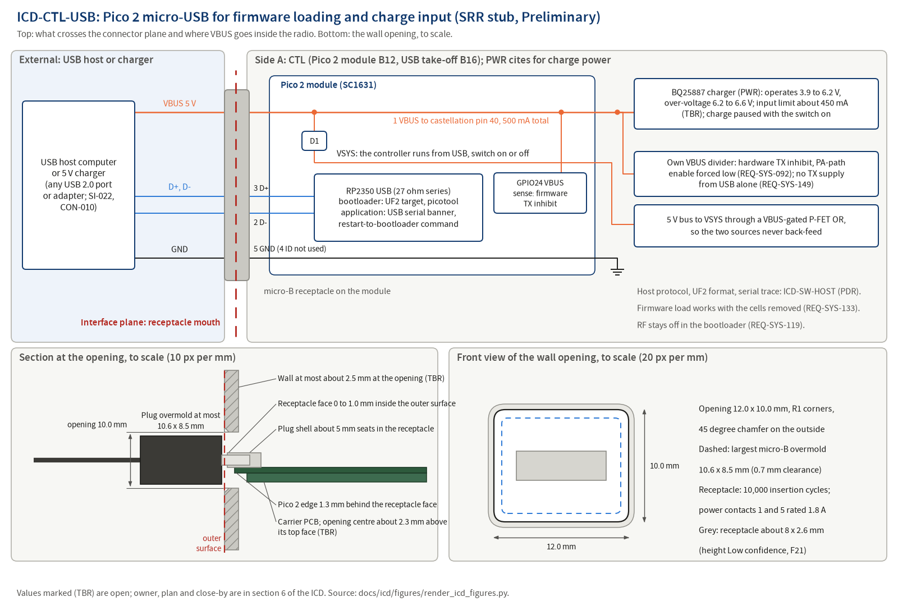

# ICD-CTL-USB: Pico 2 micro-USB receptacle for firmware loading and charge input

**Maturity: SRR stub.** Written before SRR under `docs/process/02-requirements-and-traceability.md` section 3.5 (Creation row) to meet `docs/process/01-lifecycle-and-reviews.md` section 4.3 row 17 (NPR 7123.1D App. G Table G-4 entrance criterion 6.11; success criterion 4, system security expectations, which this ICD states in section 3.2.6). Sections 1, 2 and 3.1 are filled; every section 3.2 subsection is filled and marked Preliminary, or marked Not applicable with its reason. Each value names its source: an L1 requirement, `docs/design/concept.md`, an ADR, a hazard control or a research finding. A value not yet decided carries (TBR) and a row in section 6. The stub is reviewed against `docs/templates/peer-review-checklist-design.md` section I before SRR and baselined at PDR with the allocated baseline.

## 1. Scope (App. L 1.1 to 1.3)

### 1.1 Purpose and scope

This ICD defines and controls the interface between `CTL` (controller: the Pico 2 module B12 of `docs/design/concept.md` section 5, whose on-module micro-B receptacle is the radio's only USB connector, and the USB 5 V take-off B16; `docs/design/architecture.md` is written at PDR) and `USB` (the external USB host computer or USB charger and its cable). It covers: the receptacle, the enclosure opening and plug admission, the VBUS input (voltage, current budget, the paths from VBUS inside the radio), the data pair as used by the RP2350 bootrom loader and the application's serial output, the entry into firmware loading, the security expectations of the firmware-loading path, and EMC effects of USB operation. The host-side protocol content (UF2 image format, version read-back, serial trace and command set) is `ICD-SW-HOST`, created at PDR (concept section 9); this ICD fixes only what crosses the connector plane. `PWR` consumes VBUS for charging and cites this ICD for charge power but is not a side (02 section 3.5 Owner row).

### 1.2 Precedence

Order of precedence in a conflict: `docs/process/00-charter.md`; the requirement files (`docs/requirements/sys/requirements.json` today; `docs/requirements/ctl/requirements.json` and `docs/requirements/pwr/requirements.json` from PDR); this ICD; `docs/design/architecture.md` (from PDR); `docs/design/concept.md`; part datasheets as extracted in `docs/research/`. A conflict found is a finding against the newer document and is resolved by CR after PDR. The ConOps and concept phrase "never above 1.5 A" is an upper bound for a future policy; REQ-SYS-090 (at most 500 mA) governs today, and the policy above 500 mA is trade study TS-005 at PDR.

### 1.3 Responsibility and change authority

| Item | Value |
|---|---|
| Owner (writes and maintains) | Author of side `CTL` (02 section 3.5 Owner row); Claude writes the stub |
| Concurring side | External item defined by SI-022 (the Pico 2 micro-USB for both firmware loading and charging, single connector), CON-010 (single micro-USB on the Pico 2 module) and SI-007 (Pico 2 controller); ADR-004 records the decision |
| Other module citing this ICD | `PWR` for charge power (REQ-SYS-090 is allocated to PWR in `docs/design/allocation.json`; `ICD-PWR-CTL` at PDR carries the VBUS sense and charger control); `ME` for the wall opening (REQ-SYS-108; `ICD-CTL-ME` at PDR); `SW` through `ICD-SW-HOST` and `ICD-CTL-SW` |
| Independent reviewer | Pending: reviewer agent invocation before SRR (SRR package section 2 items H1 and H11), checklist `docs/templates/peer-review-checklist-design.md` section I, record under `docs/reviews/SRR/checklists/` with the INSP-NNN Claude assigns |
| Approval | Robin, PDR decision memo (allocated baseline, charter section 3; 05 Table 4-1 row 10) |
| Change authority after PDR | `CR-NNN`, Class I for any definition-table change, Class II otherwise (02 section 10.2); Robin as CCB |

## 2. Documents (App. L 2.1, 2.2)

### 2.1 Applicable documents (binding)

| Document | What it imposes here |
|---|---|
| `docs/requirements/sys/requirements.json` REQ-SYS-090, REQ-SYS-108, REQ-SYS-133 | L1 requirements that cite this ICD in `design_refs` (section 4) |
| `docs/requirements/sys/requirements.json` REQ-SYS-002, REQ-SYS-070, REQ-SYS-091, REQ-SYS-092, REQ-SYS-093, REQ-SYS-119, REQ-SYS-130, REQ-SYS-132, REQ-SYS-143, REQ-SYS-149 | L1 requirements whose values bound a section 3.2 row but do not cite this ICD (section 4, related list) |
| `docs/safety/hazards.json` HZ-011 (K1 to K6), HZ-014 (K1 to K7) | Hazards controlled at this interface |
| CON-010, SI-022, SI-007 (`docs/requirements/l0-stakeholder/`) | Fix the connector and its dual use |
| `docs/process/07-software-engineering-plan.md` section 16.2 rows "Firmware image integrity" and "Diagnostic interface"; section 16.5; coding standard rules CS-32 and CS-33 (07 section 7) | Security expectations of section 3.2.6 |

### 2.2 Reference documents

| Document | Use |
|---|---|
| `docs/decisions/adr/ADR-004-pico2-module-micro-usb.md` | Pico 2 module, its micro-B for load and charge; charge taken from VBUS pin 40 ahead of the module Schottky; 500 mA default; hardware transmit inhibit while VBUS is present; no SWD header in delivered units |
| `docs/research/power-tree-and-charging.md` F1 (USB 2.0 and BC1.2 budgets), F2 (connector and VBUS path ratings), F3 (charge rates), F4 (no BC1.2 detection without a design decision; 27 ohm data resistors), F5 (BQ25887 input ratings), F18 (Pico 2 VSYS feed, 40 mA module budget), F22 (USB alone runs only the Pico 2), candidates PWR-USB-01 and PWR-USB-02 | Electrical values of section 3.2.4 |
| `docs/research/display-and-ui-parts.md` F21 (micro-USB through the wall), baseline table row "USB" | Opening, plug envelope, contact ratings |
| `docs/research/rustos-toolchain-proof.md` F5 | UF2 conversion with family `rp2350-arm-s` and the RP2350-E10 absolute block |
| `docs/design/concept.md` sections 7.4 (clock plan and the USB PLL), 7.5, 7.7 and 9 | Concept-level content of this ICD |
| `docs/conops/conops.md` OPS-002, OPS-011, section 3.4 (Charging and Firmware-update modes, transitions T03, T07, T16) | Scenarios that exercise the interface |
| `docs/risk/register.json` RSK-015 (tag `cyber`), RSK-033, RSK-055, RSK-061 (tag `cyber`, diagnostic-interface command injection, plan SEP16-DIAG) | Risks this ICD mitigates |
| `docs/reviews/SRR/decisions-for-owner.md` items 71, 75, 102 | Owner decisions that close TBR rows of section 6 |

## 3. Interface (App. L 3.0)

### 3.1 General (App. L 3.1)

#### 3.1.1 Interface description

The external host or charger supplies 5 V on VBUS through the Pico 2 module's micro-B receptacle. Inside the module, VBUS reaches castellation pin 40, from which the radio takes charge power ahead of the module's Schottky diode D1, and D1 feeds the module's VSYS so the controller runs from USB whenever USB is present, with the power switch on or off. VBUS presence also drives two independent transmit inhibits: a hardware path on a VBUS sense of its own that forces the PA-path enable low, and the firmware inhibit on the module's GPIO24 VBUS sense. The data pair connects the host to the RP2350 USB controller through the module's series resistors: in bootloader mode the RP2350 bootrom presents a mass-storage UF2 target and the `picotool` interface for firmware loading; in application mode the firmware reports its version, image hash and self-test results over USB serial and accepts the host command that restarts it into the bootloader. The radio never transmits from USB power alone: with no cells fitted only the Pico 2 is powered. Direction: power host to CTL; data both ways.

Figure source: `docs/icd/figures/render_icd_figures.py` (matplotlib, `tools/toolchain.lock.md` section 2 class B plots), rendered and inspected 2026-09-25.

#### 3.1.2 Interface responsibilities

| Item at the plane | Provided by | Accepted by | Defined in |
|---|---|---|---|
| Micro-B receptacle on the Pico 2 module (SC1631), overhanging the module edge by 1.3 mm | `CTL` (module choice, placement) | the host's micro-B plug | 3.2.2 |
| Enclosure wall opening and receptacle-face position | `ME` (REQ-SYS-108; `ICD-CTL-ME` at PDR) | the plug overmold | 3.2.2 |
| USB cable and micro-B plug (overmold at most 10.6 x 8.5 mm) | External item | `CTL` | 3.2.2 |
| VBUS 5 V supply | External host or charger (any USB 2.0 port or 5 V adapter, ConOps section 5 Charging row) | `CTL` (module), `PWR` (charger input) | 3.2.4 |
| Input current limit | `PWR` (charger limit) and `CTL` (module load) | the host | 3.2.4 |
| Data pair for the bootrom loader and USB serial | `CTL` (RP2350 USB controller) | the host | 3.2.5, 3.2.6 |
| Transmit inhibit while VBUS is present (hardware and firmware) | `PWR` and `TX` (hardware path), `SW` (firmware) | none (internal consequence of VBUS at the plane) | 3.2.4 |
| BOOTSEL access for loading from Off | `ME` enclosure provision with `CTL` (module button) | the operator | 3.2.7.5 |

#### 3.1.3 Coordinate systems

Local frame for this stub: origin at the centre of the wall opening on the outer surface of the enclosure wall, +Z along the receptacle axis out of the enclosure, +X along the PCB top face, +Y away from the carrier PCB. The receptacle face lies at Z = -1.0 mm to 0 mm. `ICD-CTL-ME` maps this frame into the enclosure model frame of `hardware/enclosure/` (empty at SRR) at PDR, with the KiCad 3D model of the module.

#### 3.1.4 Engineering units, tolerances and conversion

SI units with the conventions of the requirement files (V, mA, A, W, ohm, mm, h, MHz). Every value in section 3.2 carries a tolerance or bound. No unit conversion tables are used.

### 3.2 Interface definition (App. L 3.2)

#### 3.2.1 Mass properties

Not applicable: the cable and host are not carried by the radio; the plug is held by the receptacle only.

#### 3.2.2 Structural and mechanical

**Preliminary.**

| Feature | Value | Tolerance | Side responsible | Source |
|---|---|---|---|---|
| Connector type and part | USB micro-B receptacle on the Raspberry Pi Pico 2 module (ordering code SC1631), through-hole part on the module; the radio's only USB connector | fixed by the module | CTL | ADR-004; CON-010; SI-022; display F21 |
| Receptacle contacts | 1 VBUS; 2 and 3 data pair (D- and D+ by the micro-B convention); 4 ID; 5 ground; power contacts 1 and 5 rated 1.8 A, contacts 2 to 4 rated 0.5 A | contact identities of 2 to 4 read from the Pico 2 schematic at PDR (TBR) | CTL (module) | display F21 (micro-USB specification rev 1.01 section 5.3; Pico 2 datasheet: VBUS on port pin 1) |
| Plug envelope admitted | micro-B plug overmold at most 10.6 mm wide x 8.5 mm high | maximum | External | display F21 (specification Figure 4-5) |
| Wall opening | 12.0 x 10.0 mm rectangle, R1 corners, 45 degree chamfer on the outside | from the enclosure drawing (ISO 2768 class m) | ME | display F21; CON-010; concept section 9 |
| Receptacle face position | 0 to 1.0 mm inside the outer wall surface, so the about 5 mm plug shell seats | range | ME with CTL | display F21 |
| Wall thickness at the opening | at most about 2.5 mm unless the opening is enlarged to admit the overmold (TBR) | maximum | ME | display F21 |
| Opening centre height | about 2.3 mm above the carrier PCB top face (module 1.0 mm plus half the receptacle height, Low confidence) (TBR); receptacle body about 8 mm wide (Pico 2 datasheet Figure 3 reading) and about 2.6 mm high (Low confidence), as drawn to scale in the figure front view | from the KiCad 3D model at CDR | CTL with ME | display F21 |
| Module edge position | module board edge 1.3 mm plus (0 to 1.0 mm) inside the outer wall surface (receptacle overhang 1.3 mm typical) | range | CTL with ME | display F21 |
| Mating cycles | 10,000 insertion cycles with contact resistance change at most 10 mohm | minimum, as specified | CTL (module part) | display F21 |
| Plug admission through the enclosure | a fully seated plug at the micro-USB receptacle | fully seated | ME | REQ-SYS-108 |

#### 3.2.3 Fluid

Not applicable on cwht (no fluid interfaces).

#### 3.2.4 Electrical (power)

**Preliminary.**

| Line | Nominal | Range | Current (max) | Sequencing and protection | Side responsible |
|---|---|---|---|---|---|
| VBUS at the receptacle | 5.0 V | 5 V +/-10 percent (4.5 to 5.5 V) per the Pico 2 specification; the charger operates from 3.9 to 6.2 V and stops above its 6.2 to 6.6 V over-voltage threshold (20 V absolute maximum) | 500 mA total drawn from VBUS (REQ-SYS-090): charger input plus the module's about 40 mA; budget split (TBR) in the next row | the radio does not enumerate on USB with the switch off (REQ-SYS-090 rationale), so it draws up to 500 mA without USB configuration, a deviation from the USB 2.0 100 mA unconfigured limit proposed for owner acceptance (TBR, SRR decision item 71); above 500 mA only by TS-005 at PDR and never above 1.5 A | External supplies; CTL and PWR limit |
| VBUS to the charger (module pin 40, ahead of D1) | 5.0 V | as above | charger input limit about 450 mA (TBR); the BQ25887 PSEL-high default of 500 mA spans 457 to 553 mA with the ILIM tolerance, which with the module's 40 mA can exceed the 500 mA budget, so the PWR L2 allocation sets the limit below the default or accepts the margin by CR (TBR) | charge paused while the power switch is on (REQ-SYS-093); charge-state indication whenever USB is present (REQ-SYS-070) | PWR |
| VBUS to VSYS through module D1 | VBUS less the D1 Schottky forward drop | VSYS 1.8 to 5.5 V allowed | about 40 mA module budget (both cores, USB, PIO active) | the controller runs from USB whenever VBUS is present, switch on or off; the 5 V bus reaches VSYS through a VBUS-gated P-FET OR so the two sources do not back-feed | CTL |
| VBUS sense, firmware | GPIO24 of the Pico 2 | logic level through the module divider | negligible | VBUS present disarms transmit and is a PA_EN prerequisite (SWE-134 h; REQ-SYS-002; HZ-011 K6) | CTL, SW |
| VBUS sense, hardware inhibit | own divider, not the GPIO24 divider | not applicable | negligible | forces the PA-path enable low whenever VBUS is present, independent of firmware (REQ-SYS-092; HZ-011 K1); with the cells removed the transmitter supply stays below 0.5 V (TBR) (REQ-SYS-149; HZ-011 K3) | PWR, TX |
| Ground | 0 V | not applicable | return of the above | module ground to the carrier board ground | CTL |

Charge time consequence: about 450 mA at the charger gives about 11 h for a 3000 mAh pack against the 12 h of REQ-SYS-091 (margin under 1 h, carried in the PDR power budget; RSK-055). Sources: REQ-SYS-090 to REQ-SYS-093, REQ-SYS-149; power report F1 to F5, F18, F22; ADR-004; concept section 7.7.

#### 3.2.5 Electronic (signal)

**Preliminary.**

| Pin or line | Name | Direction (A to B, B to A) | Level (V) | Timing (edge, debounce, rate) | Termination, ESD | Side responsible |
|---|---|---|---|---|---|---|
| receptacle contacts 2 and 3 | USB_DM, USB_DP | both | USB 2.0 signalling by the RP2350 USB controller | USB 2.0; the bootrom and the application descriptors are defined in `ICD-SW-HOST` at PDR | module series resistors (27 ohm) to the RP2350; module ESD provisions as built by Raspberry Pi; the radio adds no parts on the pair (it is not routed off the module) | CTL (module) |
| receptacle contact 4 | ID | none | not used by the radio | none | as built on the module | CTL (module) |

The data pair is not wired to any other detector: BC1.2 port identification through `USBPHY_AS_GPIO` is a TS-005 option at PDR, not part of revision A (power report F4). Security expectations: Stated in section 3.2.6.

#### 3.2.6 Software and data

**Preliminary.**

| Item | Definition | Side responsible |
|---|---|---|
| Register or GPIO map | VBUS sense on GPIO24 of the module; the USB controller pins are fixed by the module; GPIO assignment of the rest in `ICD-CTL-SW` at PDR | CTL, SW |
| Protocol, framing, rate | Bootloader mode: RP2350 bootrom mass-storage UF2 target and `picotool` interface. Application mode: USB serial (CDC) output of the boot banner and telemetry (REQ-SYS-143). Framing, descriptors and the serial trace format are `ICD-SW-HOST` (PDR) | CTL (bootrom, module), SW |
| Message or command set | Bootloader: UF2 blocks of family `rp2350-arm-s` with an IMAGE_DEF block (rustos-toolchain-proof F5; release images carry the RP2350-E10 absolute block); `picotool load -v`, `info`, `verify`, `reboot`. Application: read-only diagnostics plus the host command that restarts the controller into its bootloader (ConOps T07, T16), the only state-changing command (CS-33) (TBR) | SW |
| Timing (latency, period) | boot banner at every boot (REQ-SYS-143); loading completes within the ten-minute handbook procedure of OPS-011 | SW |
| Error detection and response | the bootloader rejects a corrupt, truncated or wrong-target image and stays in bootloader mode (OPS-011 step 2); the application verifies the image CRC-32 trailer at boot before any safety-critical output and enters Fault-safe with no RF output on failure (REQ-SYS-132; CS-32; HZ-014 K1) | CTL (bootrom), SW |
| Initialization and status | Firmware-update entry from Off by holding BOOTSEL while USB is applied (T03; sampled only as the module starts), or by the host command from Charging or Receive (T07, T16); all radio functions are off in the bootloader and RF stays off (REQ-SYS-119); a load works with the cells removed (REQ-SYS-133); settings survive the load and out-of-range values load as defaults (REQ-SYS-134) | CTL, SW |
| Security expectations | **Accepts:** in the bootloader, a UF2 image of family `rp2350-arm-s` from `firmware/releases/` only (07 section 16.2 row "Firmware image integrity"; handbook rule, HZ-014 K5), verified afterward with `picotool verify` against the released ELF; at boot, only an image whose CRC-32 trailer verifies runs past the safe state (CS-32; REQ-SYS-132); in the application, only the read-only diagnostic requests and the restart-to-bootloader command (CS-33). The external side delivers VBUS within 4.5 to 5.5 V and USB 2.0 traffic. **Rejects:** a corrupt, truncated or wrong-family image at load (bootrom; OPS-011 step 2, the unit stays in bootloader mode); an image whose trailer fails at boot (Fault-safe, no RF output, fault code on the display; REQ-SYS-132; SWE-134 a, f); any other serial input in the application (no effect, CS-33); any transmit request while VBUS is present (hardware inhibit REQ-SYS-092 and firmware inhibit REQ-SYS-002, so every firmware load happens with the PA held off; HZ-014 K4). **Logs:** the image CRC result, the configuration load result and copy used, the reset cause and each safety rejection are written to the `SW-DIAG` event log (07 section 16.5; SWE-210 as tailored) and the boot banner reports version and hash (REQ-SYS-143); a bootrom rejection writes nothing on the radio (the bootrom runs before the image) and is seen by the operator on the host. **Basis:** 07 section 16.2 rows "Firmware image integrity" (L2, C4) and "Diagnostic interface" (L1, C2); RSK-015 (tag `cyber`, firmware image integrity); RSK-061 (tag `cyber`, command injected on the diagnostic interface, plan SEP16-DIAG); RP2350 secure boot is an ADR option at PDR, not enabled in revision A (TBR) unless the owner decides otherwise (HZ-014 K7); REQ-SYS-092, REQ-SYS-119, REQ-SYS-132, REQ-SYS-133, REQ-SYS-134, REQ-SYS-143; the `SW-BOOT`, `SW-CFG` and `SW-DIAG` requirements at PDR (RSK-015 S2) | CTL (bootrom, module); SW (trailer check, command set, logging); the external side for the VBUS and image statements |

#### 3.2.7 Environments

##### 3.2.7.1 Electromagnetic effects (EMC, EMI, grounding, bonding, cable and wire)

**Preliminary.**

| Item | Definition | Source |
|---|---|---|
| USB PLL harmonic | the RP2350 48 MHz USB PLL third harmonic and the 12 MHz crystal twelfth harmonic land on 144.000 MHz; the USB PLL is off when not enumerated, the module is shielded (TBR) and the expected birdie is logged before bench tests; the band-edge guard keeps the carrier at least 1 kHz from it | concept section 7.4; display F10 |
| Charger switching ripple | the charger's 1.5 MHz boost ripple would produce sidebands on the PA drain; charging is paused while the radio is on (REQ-SYS-093) and transmit is inhibited while VBUS is present (REQ-SYS-092) | power report F22; HZ-011 |
| Cable as an antenna element | a USB cable plugged in during receive is a conductor on the enclosure; transmit never occurs with USB present, so no transmit coupling case exists | REQ-SYS-092 |
| ESD at the receptacle | as built on the Pico 2 module; the L1 ESD requirement REQ-SYS-050 names the key jack, headphone jack and antenna port only; whether the receptacle needs an added provision is decided at PDR (TBR) | REQ-SYS-050; this ICD |
| Grounding and bonding | USB shield and ground through the module to the carrier board ground; bonding of the module shield to the enclosure defined in `ICD-CTL-ME` at PDR | concept section 7.5 |

##### 3.2.7.2 Acoustic

Not applicable: no acoustic content at the USB receptacle.

##### 3.2.7.3 Structural loads

**Preliminary.** The receptacle carries only plug insertion and withdrawal and cable side loads; the module's four shell pads carry them into the carrier board (display F21), and the wall opening limits plug deflection. No separate load requirement exists at L1; the fit is demonstrated by REQ-SYS-108 and the H2C fit-check print.

##### 3.2.7.4 Vibroacoustics

Not applicable on cwht: the hazard analysis names no vibration case.

##### 3.2.7.5 Human operability

**Preliminary.** The operator plugs a standard micro-B cable by feel through the chamfered opening; the BOOTSEL button on the module is reachable through an enclosure provision for loading from Off (OPS-011 step 1; the provision's form is an ME item at PDR, TBR); the display shows the charge state whenever USB is present (REQ-SYS-070) and the transmit state names USB when transmit is inhibited (ConOps interface table, status screen); the handbook names a charging supply of 500 mA or more and the flashing procedure (HZ-011 K5; RSK-015 S5).

#### 3.2.8 Other interface definitions

**Preliminary.** Thermal: the Pico 2 VBUS copper and connector carry every milliamp of charge current and have no published rating above the USB default (power report F2); at 500 mA the path is inside the connector contact rating of 1.8 A, and the measurement at 0.5, 1.0 and 1.5 A (SRR decision item 102; RSK-033 S2, credit false on a development board) precedes any budget above 500 mA.

## 4. Requirements on each side (cwht addition; 02 section 3.5 pairing rule)

Side `CTL` L2 requirements do not exist at SRR; the CTL specification is written at PDR, and REQ-SYS-133 is allocated to CTL and SW (`docs/design/allocation.json`). Until then the pairing rule of 02 section 3.5 is not yet met for side A (the tool check T-22, INTERFACE_TAG_NO_ICD, reads only the `design_refs` of `interface`-tagged requirements and is a warning at SRR, an error from PDR under `--gate`). Disposition of INSP-012 finding F-01: the side-A pairing is deferred to PDR, when the CTL L2 author writes the `interface`-tagged REQ-CTL-NNN requirements with this ICD id in `design_refs` and this ICD moves them to `requirements_a` in the same change; the deferral is proposed to Robin for an owner decision reference in the SRR decision list, and until that reference exists this row stays open. Side `USB` is external: its defining inputs are SI-022, CON-010 and SI-007. REQ-SYS-090 is allocated to PWR, which cites this ICD but is not a side. The L1 requirements that cite this ICD are listed as `requirements_other`.

| Side | Requirement | Statement (verbatim `description`) | Section 3.2 rows it depends on | Verification method |
|---|---|---|---|---|
| A `CTL` | none at SRR (REQ-CTL-NNN at PDR) | not applicable | 3.2.2, 3.2.4, 3.2.5, 3.2.6 | not applicable |
| B `USB` | SI-022, CON-010, SI-007 (external item) | SI-022: "USB strategy: use the Pico 2 module's micro-USB connector for both firmware loading and battery charging (single connector, simplest)." | 3.2.2 connector, 3.2.4 VBUS | not applicable (stakeholder input) |
| other | REQ-SYS-090 | The transceiver shall draw at most 500 mA from USB VBUS. | 3.2.4 VBUS current | Test |
| other | REQ-SYS-108 | The transceiver shall admit fully seated mating plugs at the key jack, headphone jack and micro-USB receptacle through its enclosure openings. | 3.2.2 wall opening, receptacle face position | Demonstration |
| other | REQ-SYS-133 | The transceiver shall accept a firmware image through its micro-USB receptacle with the cells removed. | 3.2.4 VBUS to VSYS, 3.2.6 protocol and initialization | Demonstration |

The lists here equal the front matter `requirements_a`, `requirements_b`, `requirements_other` and are checked by T-22 against `design_refs`.

Related L1 requirements that bound a section 3.2 value but do not cite this ICD in `design_refs` (proposed additions are returned to the requirements author): REQ-SYS-092 and REQ-SYS-149 (hardware inhibit and no transmitter supply from USB), REQ-SYS-093 and REQ-SYS-070 (charging with the switch on, charge-state indication), REQ-SYS-091 (charge time), REQ-SYS-119 (RF off in the bootloader), REQ-SYS-132 (image integrity), REQ-SYS-143 (boot banner, which cites `ICD-SW-HOST`), REQ-SYS-002 (firmware USB inhibit through the modes).

## 5. Verification (cwht addition; SE HB §6.3.1.2.3)

| Case | Verifies | Method and evidence class | Level |
|---|---|---|---|
| TC-SYS-050 | REQ-SYS-090 (and related REQ-SYS-070, REQ-SYS-093) | Test, Bench (USB power through a USB current meter at the start of charge with discharged cells, switch on and off) | System |
| TC-SYS-074 | REQ-SYS-108 | Demonstration, Bench (fully seated plugs through the enclosure openings, owner's USB cable) | System |
| TC-SYS-090 | REQ-SYS-133 | Demonstration, Bench (UF2 copy and `picotool verify` with the cells removed) | System |
| TC-SW-TOOL-001 | REQ-SYS-133 (supporting) | Demonstration, Bench on a bare Pico 2 development board, `credit: false` (BOOTSEL, `picotool load -v`, `reboot`) | Tool proof |
| TC-SYS-066, TC-SYS-082, TC-SYS-089, TC-SYS-095 | related REQ-SYS-092 and REQ-SYS-149, REQ-SYS-119, REQ-SYS-132, REQ-SYS-143 | Test, Bench | System |
| TC pending | side `CTL` interface requirements (REQ-CTL-NNN) and the `SW-BOOT` and `SW-CFG` acceptance cases (RSK-015 S3) | written by the independent test authors at PDR (02 rule WR-11) | Subsystem |

## 6. TBR items

| Value (section, row) | Current estimate | Owner | Plan | close_by |
|---|---|---|---|---|
| 3.2.2 Receptacle contacts 2 to 4 identities | D-, D+, ID by the micro-B convention | Claude (ICD author) | read from the Pico 2 datasheet schematic at PDR | PDR |
| 3.2.2 Wall thickness at the opening | at most about 2.5 mm | Claude (ICD author) with ME | enclosure model at PDR; H2C fit-check with a real cable (TC-SYS-074 pre-build) | PDR |
| 3.2.2 Opening centre height | about 2.3 mm above the carrier PCB top face | Claude (ICD author) with ME | KiCad 3D model of the module at CDR (display F21) | CDR |
| 3.2.4 VBUS current without enumeration (USB 2.0 deviation) | up to 500 mA with no configuration | Robin decides at SRR on Claude's proposal | SRR decision item 71 (D-PWR-02): accept the deviation with the handbook naming a 5 V charger or a 500 mA port | PDR |
| 3.2.4 Charger input limit and budget split | about 450 mA to the charger plus 40 mA for the module | Claude (ICD author) with the PWR author | PWR L2 allocation at PDR sets the limit against the 457 to 553 mA PSEL-high spread (power report F5) or a CR adjusts REQ-SYS-090; TS-005 decides any policy above 500 mA | PDR |
| 3.2.4 Transmitter supply with USB only | below 0.5 V | Robin decides on Claude's proposal | REQ-SYS-149 tbr: power-tree design at PDR | PDR |
| 3.2.7.1 Module shielding against the 144.000 MHz birdie | module shielded | Claude (ICD author) | clock plan and shield decision at PDR (concept section 7.4); birdie logged before bench tests | PDR |
| 3.2.7.1 ESD provision at the receptacle | module as built | Claude (ICD author) | PDR review of the Pico 2 schematic and the enclosure bonding; a CR adds a requirement if a provision is needed | PDR |
| 3.2.7.5 BOOTSEL access provision | an enclosure provision reaching the module button | Claude (ICD author) with ME | `ICD-CTL-ME` at PDR; H2C fit-check | PDR |
| 3.2.6 Command set boundary (restart-to-bootloader command, read-only diagnostics) | CS-33 set | Claude (software lead) | `ICD-SW-HOST` and the diagnostic-interface ADR at PDR (07 section 16.2 row "Diagnostic interface") | PDR |
| 3.2.6 Secure boot | not enabled in revision A | Robin decides on Claude's ADR | ADR at PDR (RSK-015 S4; HZ-014 K7) | PDR |

## 7. Change history

| Revision | Date | CR or review | Change |
|---|---|---|---|
| A | 2026-09-25 | none (pre-baseline draft; SRR package section 2 item H11) | Created as the SRR stub |
| A | 2026-09-25 | INSP-012 (`docs/reviews/SRR/checklists/icd-stubs-external.md`), pre-baseline | Findings F-01 (pairing deferral), F-05, F-08 applied; figure re-rendered and inspected |
