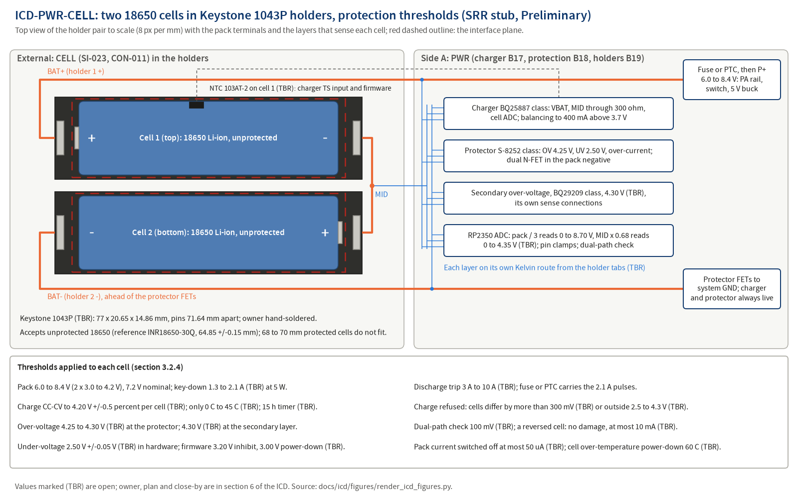

# ICD-PWR-CELL: Two 18650 cells in Keystone 1043P holders and their protection thresholds

**Maturity: SRR stub.** Written before SRR under `docs/process/02-requirements-and-traceability.md` section 3.5 (Creation row) to meet `docs/process/01-lifecycle-and-reviews.md` section 4.3 row 17 (NPR 7123.1D App. G Table G-4 entrance criterion 6.11; success criterion 4). Sections 1, 2 and 3.1 are filled; every section 3.2 subsection is filled and marked Preliminary, or marked Not applicable with its reason. Each value names its source: an L1 requirement, `docs/design/concept.md`, an ADR, a hazard control or a research finding. A value not yet decided carries (TBR) and a row in section 6. The stub is reviewed against `docs/templates/peer-review-checklist-design.md` section I before SRR and baselined at PDR with the allocated baseline.

## 1. Scope (App. L 1.1 to 1.3)

### 1.1 Purpose and scope

This ICD defines and controls the interface between `PWR` (power: the two cell holders B19, the pack protection B18 and the charger B17 of `docs/design/concept.md` section 5; `docs/design/architecture.md` is written at PDR) and `CELL` (two user-replaceable 18650 lithium-ion cells). It covers: the accepted cell (format, chemistry, dimensions, protected versus unprotected), cell mass, the holders and their terminals, the pack electrical window and current, the protection and supervision thresholds that the radio applies to the cells, the per-cell sensing connections at the holder terminals, cell temperature sensing, reverse and mismatched insertion, the cell compartment and the operator's cell replacement. Holder positions, the compartment, the cover and venting are `ME` items in `ICD-PWR-ME` at PDR; the charger register contract and the sensing channels are `ICD-PWR-CTL` and `ICD-PWR-SW` at PDR.

### 1.2 Precedence

Order of precedence in a conflict: `docs/process/00-charter.md`; the requirement files (`docs/requirements/sys/requirements.json` today; `docs/requirements/pwr/requirements.json` from PDR); this ICD; `docs/design/architecture.md` (from PDR); `docs/design/concept.md`; part datasheets as extracted in `docs/research/`. A conflict found is a finding against the newer document and is resolved by CR after PDR. Where a research proposal and an L1 requirement differ (for example the power-down threshold per cell), the requirement value is used.

### 1.3 Responsibility and change authority

| Item | Value |
|---|---|
| Owner (writes and maintains) | Author of side `PWR` (02 section 3.5 Owner row); Claude writes the stub |
| Concurring side | External item defined by SI-023 (two 18650 Li-ion cells in a holder, user-replaceable) and CON-011 (two cells in series, 6.0 to 8.4 V, replaceable without tools or soldering); ADR-005 records the decision |
| Other module citing this ICD | `ME` for the compartment, cover, polarity marking and venting (REQ-SYS-080 is allocated to PWR and ME; REQ-SYS-168; `ICD-PWR-ME` at PDR); `SW` for the firmware supervision thresholds (`ICD-PWR-SW` at PDR) |
| Independent reviewer | Pending: reviewer agent invocation before SRR (SRR package section 2 items H1 and H11), checklist `docs/templates/peer-review-checklist-design.md` section I, record under `docs/reviews/SRR/checklists/` with the INSP-NNN Claude assigns |
| Approval | Robin, PDR decision memo (allocated baseline, charter section 3; 05 Table 4-1 row 10) |
| Change authority after PDR | `CR-NNN`, Class I for any definition-table change, Class II otherwise (02 section 10.2); Robin as CCB |

## 2. Documents (App. L 2.1, 2.2)

### 2.1 Applicable documents (binding)

| Document | What it imposes here |
|---|---|
| `docs/requirements/sys/requirements.json` REQ-SYS-080 | The L1 requirement that cites this ICD in `design_refs` (section 4) |
| `docs/requirements/sys/requirements.json` REQ-SYS-081 to REQ-SYS-089, REQ-SYS-093, REQ-SYS-097 to REQ-SYS-101, REQ-SYS-116, REQ-SYS-166, REQ-SYS-167, REQ-SYS-168 | L1 requirements whose values bound a section 3.2 row but do not cite this ICD (section 4, related list) |
| `docs/safety/hazards.json` HZ-002 (K1 to K9), HZ-007 (K1 to K7), HZ-013 (K3, K5) | Hazards controlled at this interface |
| CON-011, SI-023 (`docs/requirements/l0-stakeholder/`) | Fix the cell format, count and replaceability |

### 2.2 Reference documents

| Document | Use |
|---|---|
| `docs/decisions/adr/ADR-005-2s-18650-holders.md` | 2S 18650 in two single-cell holders, unprotected high-drain cells, board protection, boost charging from USB; two cells about 96 g |
| `docs/research/power-tree-and-charging.md` F3 (cell charge data), F5 (BQ25887), F11 (charger is not a protector; S-8252, BQ29209; protected cells 68 to 70 mm), F12 (reverse insertion and mixed cells), F13 (Keystone 1043P), F14 and F15 (sensing), F16 (NTC and placement), F22 to F24 (power path, budgets, layered protections), candidates PWR-CHG-01, PWR-CHG-02, PWR-PROT-01, PWR-SENSE-01 | Every electrical and protection value in section 3.2 |
| `docs/research/antenna-and-erp.md` F5 | Cell envelope (65 mm long, 18.5 mm diameter) sizing the enclosure |
| `docs/design/concept.md` sections 7.7, 8 and 9 | Concept-level content of this ICD |
| `docs/safety/hazard-analysis.md` section 8 (single point failures: shared MID sense net, holder junction) and open questions OQ-SAF-008, OQ-SAF-009, OQ-SAF-010 | Protection-layer independence at the holder terminals |
| `docs/conops/conops.md` OPS-002, OPS-009, OPS-012, OPS-016 | Scenarios that exercise the interface |
| `docs/risk/register.json` RSK-007, RSK-058 | Risks this ICD mitigates |
| `docs/reviews/SRR/decisions-for-owner.md` items 70, 72, 73, 74, 76 | Owner decisions that close TBR rows of section 6 |

## 3. Interface (App. L 3.0)

### 3.1 General (App. L 3.1)

#### 3.1.1 Interface description

Two 18650 cells are inserted by the operator into two single-cell through-hole holders on the main board and connected in series: holder 1 carries the top cell (its positive terminal is the pack positive, BAT+), holder 2 the bottom cell (its negative terminal is the pack negative, BAT-), and the junction of the two holders is the mid-tap (MID). Four holder terminals therefore cross the plane (two of them tied to MID), which gives per-cell sensing, balancing and protection. Energy crosses from the cells to the radio (discharge, key-down pulses of at most 2.1 A (TBR), the current bound of section 3.2.4) and from the charger into the cells (charge, at most about 0.45 A input budget); temperature crosses by conduction to a thermistor held against a cell body. The pack negative returns to system ground only through the protector's dual N-FET, so the protector can open the pack on any cell out of its window; the charger and the protector are always live (about 25 uA) and the mechanical switch removes every other load. Cells are not protected by the radio's choice of cell: unprotected cells are assumed, and the board carries the protection.

Figure source: `docs/icd/figures/render_icd_figures.py` (matplotlib, `tools/toolchain.lock.md` section 2 class B plots), rendered and inspected 2026-09-25.

#### 3.1.2 Interface responsibilities

| Item at the plane | Provided by | Accepted by | Defined in |
|---|---|---|---|
| Two Keystone 1043P single-cell holders (proposed), hand-soldered by the owner | `PWR` (part, footprint) with `ME` (position) | the cells | 3.2.2 |
| Two 18650 Li-ion cells of one brand and age, unprotected high-drain class | External item (SI-023, CON-011; handbook approved-cell list) | `PWR` | 3.2.1, 3.2.2, 3.2.4 |
| Pack terminals BAT+, MID, BAT- and the per-layer sense connections at the holder tabs | `PWR` | the cells | 3.2.4, 3.2.5 |
| Protection, charge and supervision thresholds applied to each cell | `PWR` (hardware) and `SW` (firmware supervision) | the cells | 3.2.4, 3.2.5 |
| Cell thermistor contact | `PWR` with `ME` | the cell body | 3.2.8 |
| Compartment, cover, polarity marking, vent path | `ME` (`ICD-PWR-ME` at PDR) | the operator and the cells | 3.2.7.3, 3.2.7.5 |

#### 3.1.3 Coordinate systems

Local frame for this stub: origin at the centre of the holder pair on the main board top face, +X along the cell axes toward the holder 1 positive terminal, +Y across the two holders from holder 2 to holder 1, +Z out of the board. `ICD-PWR-ME` maps this frame into the enclosure model frame of `hardware/enclosure/` (empty at SRR) at PDR.

#### 3.1.4 Engineering units, tolerances and conversion

SI units with the conventions of the requirement files (V per cell or per pack as stated, mV, A, mA, uA, mAh, mohm, kohm, C, h, g, mm). Every value in section 3.2 carries a tolerance or bound. No unit conversion tables are used.

### 3.2 Interface definition (App. L 3.2)

#### 3.2.1 Mass properties

**Preliminary.**

| Item | Mass | Tolerance | Source |
|---|---|---|---|
| Two 18650 cells | about 96 g (about 48 g each) | estimate (TBR) until the chosen cell's datasheet mass is entered in the TPM-001 roll-up at PDR | ADR-005 section 4.4 (TPM-001 note); REQ-SYS-102 rationale |
| Two Keystone 1043P holders | not stated in the research; entered from the holder datasheet at PDR (TBR) | not applicable | power report F13 |

#### 3.2.2 Structural and mechanical

**Preliminary.**

| Feature | Value | Tolerance | Side responsible | Source |
|---|---|---|---|---|
| Accepted cell format | 18650 cylindrical Li-ion, unprotected, flat or button top; reference cell Samsung INR18650-30Q class (3000 mAh nominal, 64.85 mm long) | length 64.85 +/-0.15 mm for the reference cell; accepted length range of the holder read from its drawing at PDR (TBR) | External (cell); PWR (holder choice) | ADR-005 section 2; power report F3, F11, F13 |
| Protected cells | protected 18650 cells (about 68 to 70 mm) do not fit holders sized for 65 mm cells; the design does not rely on them; the handbook lists them only if they fit | not applicable | External; handbook | power report F11; HZ-002 K8 |
| Cell envelope used for the enclosure | 65 mm long, 18.5 mm diameter each | allocation value | ME | antenna report F5; REQ-SYS-103 rationale |
| Holder part | Keystone 1043P, single 18650, through-hole, leaf-spring contacts, UL 94V-0 nylon, -50 to 145 C (TBR, SRR decision item 73) | as rated | PWR | power report F13; concept section 7.7 |
| Holder outline and pins | 77 x 20.65 x 14.86 mm; through-hole pins on 71.64 mm spacing | from the drawing | PWR | power report F13 (Rapid Electronics drawing) |
| Holder pair footprint | about 41.3 x 77 mm with the two holders side by side | derived | PWR with ME | power report F13 |
| Assembly | owner hand-soldered through-hole part (kit model) | not applicable | owner | charter section 12 (SI-031); ADR-007 |
| Cell replacement | without tools or soldering | not applicable | PWR with ME | REQ-SYS-080; CON-011 |
| Cell retention | cells stay in their holders through a 1.0 m drop (value and TBR carried by REQ-SYS-116) and in any orientation | not applicable | PWR with ME | REQ-SYS-116; HZ-002 K7 |
| Cover pinch gaps | every closing gap of the cell cover below 4 mm or above 25 mm (TBR) through the cover's travel | limits | ME | REQ-SYS-168; HZ-013 K3 |

#### 3.2.3 Fluid

Not applicable on cwht (no fluid interfaces); cell venting is a thermal and ME item (3.2.7.3, 3.2.8).

#### 3.2.4 Electrical (power)

**Preliminary.**

| Line | Nominal | Range | Current (max) | Sequencing and protection | Side responsible |
|---|---|---|---|---|---|
| Pack BAT+ to BAT- (through the protector FETs) | 7.2 V | 6.0 to 8.4 V (2 x 3.0 to 4.2 V); transmit refused above 8.60 V +/-0.05 V (TBR) pack | discharge key-down pulses of 1.3 to 2.1 A (TBR) at the 5 W step (HZ-007; derived from `docs/research/pa-device-candidates.md` F19: 11.4 W DC at 5 W, 1.36 A at 8.4 V, 1.59 A at 7.2 V, about 1.9 A at 6.0 V, with about 10 percent margin on the 6.0 V value); discharge trip, independent of firmware, between 3 A and 10 A (TBR), so the 2.1 A bound sits at least 0.9 A below the lowest trip; a fuse or PTC in the pack lead that carries the 2.1 A pulses without opening (hold current at least 2.1 A at the 60 C cell limit; part and rating in A-PWR-03, HZ-007 K2) and opens on a sustained short; load short at the protector's 0.500 V threshold | pack negative through the S-8252-class protector and dual N-FET to system ground; reverse-polarity P-FET on the rail feed; mechanical switch on the buck enable and the PA rail; charger and protector always live, pack current with the switch off at most 50 uA (TBR) | PWR |
| Charge into the cells | CC-CV to 4.20 V per cell | termination at 4.20 V +/-0.5 percent (TBR) per cell; precharge below 3.0 V per cell; termination current 150 mA (charger default) | charge current within the 500 mA USB input budget (about 280 mA into a 3000 mAh pack, power report F3); charger ICHG range 100 to 2200 mA | charging only between 0 C and 45 C cell-sensor temperature (TBR, +/-2 C); charge paused while the switch is on (REQ-SYS-093); safety timer stops any charge longer than 15 h (TBR); charge stopped when the constant-voltage current falls by less than 20 mA over 60 min (TBR) | PWR, SW |
| Cell balancing | charger passive balancing through MID | above 3.7 V per cell; starts at 80 mV difference, stops at 40 mV | up to 400 mA (RCBSET 9.5 ohm) | automatic mode, measurement every 2 min with charge disabled for 1 s | PWR |
| Per-cell over-voltage, independent layer 2 | protector detect 4.25 V, release 4.10 V (S-8252AAO) | detect within 4.25 to 4.30 V (TBR) from 0 C to 45 C; +/-20 mV at 25 C | opens the charge path | independent of charger and firmware (REQ-SYS-083) | PWR |
| Per-cell over-voltage, independent layer 3 | secondary protector at 4.30 V (TBR) (BQ29209 class) | +/-25 mV from 0 C to 60 C | opens the charge path on its own sense connections | third independent layer; no L1 requirement implements it yet (OQ-SAF-008; SRR decision item 72) | PWR |
| Per-cell under-voltage, hardware | disconnect below 2.50 V +/-0.05 V (TBR); release 3.00 V | detect 2.500 V at the S-8252AAO setting, +/-50 mV | pack disconnected from its loads | independent of firmware (REQ-SYS-084); protector FETs stay off unless both cells are in window | PWR |
| Per-cell supervision, firmware | transmit refused below 3.20 V +/-0.05 V (TBR) per cell in receive; loads powered down below 3.00 V +/-0.05 V (TBR) per cell; rails held off while either cell reads outside 2.5 to 4.3 V (TBR) | measured by two dissimilar paths | not applicable | low-battery warning at least 15 min before the transmit inhibit at 1:9 (REQ-SYS-096) | SW with PWR |
| Charge refusal on cell condition | charging refused while the cells differ by more than 300 mV (TBR) or either reads outside 2.5 to 4.3 V (TBR); stopped when two independent measurements of a cell differ by more than 100 mV (TBR) | not applicable | not applicable | insertion check before any charge (REQ-SYS-087, REQ-SYS-088) | SW with PWR |
| Reverse insertion | either cell reversed: no damage and at most 10 mA (TBR) drawn from the cells | not applicable | 10 mA (TBR) | protector window blocks the reversed-cell case; 300 ohm in series with the charger MID pin for bottom-cell reverse plug-in; firmware checks both cells before any rail is enabled | PWR |

Sources: REQ-SYS-081 to REQ-SYS-089, REQ-SYS-093, REQ-SYS-096 to REQ-SYS-100, REQ-SYS-153, REQ-SYS-166, REQ-SYS-167; HZ-002 K1 to K6; HZ-007 K1 to K4, K6; power report F3, F5, F11, F12, F22, F24; HZ-007 and `docs/research/pa-device-candidates.md` F19 (key-down current; the 1.6 to 2.2 A figure of ADR-005 is not used, INSP-012 finding F-06). The per-cell firmware thresholds of the L1 requirements (3.20 V inhibit, 3.00 V power-down) replace the pack-level proposal of HZ-007 K4 (6.4 V and 6.0 V pack).

#### 3.2.5 Electronic (signal)

**Preliminary.** Sense connections at the holder terminals (no logic signal crosses the plane; these are analog measurements of the cell side).

| Pin or line | Name | Direction (A to B, B to A) | Level (V) | Timing (edge, debounce, rate) | Termination, ESD | Side responsible |
|---|---|---|---|---|---|---|
| holder 1 positive tab | BAT+ sense | B to A | operating window 6.0 to 8.4 V pack; measurement range 0 to 8.70 V (2 x 4.35 V) (TBR), linear, so the 8.60 V lockout (REQ-SYS-153) and every per-cell check down to 0 V are resolved; withstand -8.70 V (both cells reversed) to +8.70 V without damage, the RP2350 input held above its -0.5 V pad absolute minimum (keyer-verification F5) by a Schottky clamp to ground at the ADC pin (TBR), about 42 uA at -8.70 V through 200 kohm; a negative excursion reads as 0 V, below the 2.5 V window | charger ADC on demand; RP2350 ADC sampled by firmware | charger VBAT pin; RP2350 divider 200 kohm over 100 kohm (k = 0.333, 2.80 V at 8.4 V, 67 kohm Thevenin) | PWR |
| holder 1 negative and holder 2 positive tabs | MID sense | B to A | operating window 3.0 to 4.35 V referred to BAT-; measurement range 0 to 4.35 V (TBR), linear, covering the 2.50 V disconnect and the 2.5 to 4.3 V rail and charge windows (REQ-SYS-084, REQ-SYS-087, REQ-SYS-166); withstand -4.35 V (bottom cell reversed, REQ-SYS-086; power report F12) to +4.35 V without damage, clamped at the ADC pin as for BAT+ (TBR), 86 uA at -4.35 V through 47 kohm; the top cell is read as BAT+ minus MID, so a reversed top cell reads below 0 V and a reversed bottom cell reads 0 V, both outside the 2.5 V window | as above | charger MID through 300 ohm; RP2350 divider 47 kohm over 100 kohm (k = 0.680, 2.96 V at 4.35 V); protector cell input | PWR |
| holder 2 negative tab | BAT- (pack negative ahead of the FETs) | B to A | 0 V reference of the cell sensing | not applicable | protector VSS and the dividers referenced to pack negative | PWR |
| separate sense routes | one Kelvin route per protection layer from each holder tab, each with its own series resistor (charger, 4.25 V protector, 4.30 V secondary protector, firmware dividers), so one open or high-resistance sense connection blinds at most one layer (TBR) | B to A | as above | not applicable | per layer | PWR |

Sources: power report F12, F14, F15; HZ-002 K4, K9; HZ-007 K3; hazard analysis section 8 row 5.

Security expectations: Not applicable: no signal line at this plane is read as data or commands; the cell voltages are range-checked analog measurements (CS-29) and cannot carry a command.

#### 3.2.6 Software and data

Not applicable at the plane: no data crosses the cell interface. The charger I2C registers, ADC channel assignment and the firmware comparison rules are `ICD-PWR-CTL` and `ICD-PWR-SW` at PDR.

| Item | Definition | Side responsible |
|---|---|---|
| Error detection and response | every cell voltage and temperature is range-checked against physical limits and flagged if implausible (CS-29); the dual-path disagreement rule of 3.2.4 stops charging and transmitting | SW |
| Security expectations | Not applicable: the interface carries no data or command path | none |

#### 3.2.7 Environments

##### 3.2.7.1 Electromagnetic effects (EMC, EMI, grounding, bonding, cable and wire)

**Preliminary.** The pack negative is system ground only through the protector FETs; the PA key-down pulses of at most 2.1 A (TBR, section 3.2.4) flow through the holder contacts, so the holder-to-board path is part of the PA supply loop and is kept short in the layout (`ICD-TX-PWR` at PDR). Charging is paused while the radio operates so the charger's 1.5 MHz boost ripple is absent from the pack whenever the transmitter or receiver runs (REQ-SYS-093; power report F22).

##### 3.2.7.2 Acoustic

Not applicable: no acoustic content at the cell interface.

##### 3.2.7.3 Structural loads

**Preliminary.** The holders carry the cell mass (about 48 g each) under handling and drop (REQ-SYS-116) and the leaf-spring contact force; the cover retains the cells so the holders are not the only retention in a drop (`ICD-PWR-ME` at PDR). The compartment has a vent path and no sealed cavity around the cells, admits no conductive object, and separates the cells from the PA thermal zone by distance or a barrier (HZ-002 K7; HZ-007 K5; OQ-SAF-010).

##### 3.2.7.4 Vibroacoustics

Not applicable on cwht: the hazard analysis names no vibration case.

##### 3.2.7.5 Human operability

**Preliminary.** The operator replaces the cells without tools sharper than a coin (HZ-013 K3); polarity is marked in the compartment and on the enclosure (HZ-007 K5); the cover has no lever pinch (REQ-SYS-168); the handbook gives the approved cell list (one brand and age, matched capacity), the insertion procedure with the polarity marks, "do not charge after a fault indication", and storage at partial charge with the radio off (HZ-002 K8; HZ-007 K7; HZ-013 K5; REQ-SYS-122); the display reports "NO CELLS", a mismatched or out-of-window insertion, and the battery state (ConOps section 3.4 Charging row; REQ-SYS-087).

#### 3.2.8 Other interface definitions

**Preliminary.** Thermal: a 10 kohm NTC (Semitec 103AT-2, B 3435 K, the charger's recommended part) is held against a cell body inside the holder, not on the board, and feeds the charger TS input (JEITA windows: 0 C, 10 C, 45 C, 60 C thresholds) and the firmware (TBR: thermal coupling unverified with these holders, power report F16); the firmware powers down the loads above 60 C +/-2 C (TBR) cell-sensor temperature (REQ-SYS-099); one NTC shared by the charger and the firmware lock-out is a named single point (hazard analysis section on HZ-002). Holder contact resistance: not published for the 1043P (power report F13); the design allocation is at most 25 mohm per contact (TBR) so that a 2.1 A (TBR) key-down pulse, the section 3.2.4 bound, drops at most 53 mV per contact, and a high-resistance contact heats but an open contact stops the radio safely (HZ-007 single-point list).

## 4. Requirements on each side (cwht addition; 02 section 3.5 pairing rule)

Side `PWR` L2 requirements do not exist at SRR; the PWR specification `docs/requirements/pwr/requirements.json` is written at PDR from the allocation of REQ-SYS-080 to REQ-SYS-101 to PWR (`docs/design/allocation.json`). Until then the pairing rule of 02 section 3.5 is not yet met for side A (the tool check T-22, INTERFACE_TAG_NO_ICD, reads only the `design_refs` of `interface`-tagged requirements and is a warning at SRR, an error from PDR under `--gate`). Disposition of INSP-012 finding F-01: the side-A pairing is deferred to PDR, when the PWR L2 author writes the `interface`-tagged REQ-PWR-NNN requirements with this ICD id in `design_refs` and this ICD moves them to `requirements_a` in the same change; the deferral is proposed to Robin for an owner decision reference in the SRR decision list, and until that reference exists this row stays open. Side `CELL` is external: its defining inputs are SI-023 and CON-011. The L1 requirement that cites this ICD is listed as `requirements_other`.

| Side | Requirement | Statement (verbatim `description`) | Section 3.2 rows it depends on | Verification method |
|---|---|---|---|---|
| A `PWR` | none at SRR (REQ-PWR-NNN at PDR) | not applicable | 3.2.2, 3.2.4, 3.2.5, 3.2.8 | not applicable |
| B `CELL` | SI-023, CON-011 (external item) | SI-023: "Battery: two 18650 Li-ion cells (2S) in a holder so cells are user-replaceable." | 3.2.1, 3.2.2 accepted cell, 3.2.4 pack window | not applicable (stakeholder input) |
| other | REQ-SYS-080 | The transceiver shall hold two 18650 Li-ion cells in series in holders that allow cell replacement without soldering. | 3.2.2 holder part, cell replacement | Inspection |

The lists here equal the front matter `requirements_a`, `requirements_b`, `requirements_other` and are checked by T-22 against `design_refs`.

Related L1 requirements that bound a section 3.2 value but do not cite this ICD in `design_refs` (proposed additions are returned to the requirements author): REQ-SYS-081 (termination), REQ-SYS-082 (charge temperature window), REQ-SYS-083 (independent over-voltage), REQ-SYS-084 (under-voltage cutoff), REQ-SYS-085 (over-current), REQ-SYS-086 (reverse insertion), REQ-SYS-087 (insertion check), REQ-SYS-088 (dual-path check), REQ-SYS-089 (safety timer), REQ-SYS-097 and REQ-SYS-098 (low-battery thresholds), REQ-SYS-099 (over-temperature lockout), REQ-SYS-100 (off current), REQ-SYS-166 (rails held off), REQ-SYS-167 (current-fall supervision), REQ-SYS-168 (cover pinch gaps).

## 5. Verification (cwht addition; SE HB §6.3.1.2.3)

| Case | Verifies | Method and evidence class | Level |
|---|---|---|---|
| TC-SYS-058 | REQ-SYS-080 | Inspection (BOM, holder footprint and enclosure CAD); receipt cell swap post-build | System |
| TC-SYS-059, TC-SYS-060, TC-SYS-061, TC-SYS-062, TC-SYS-063, TC-SYS-064, TC-SYS-065, TC-SYS-069, TC-SYS-070, TC-SYS-076 | related REQ-SYS-081 and REQ-SYS-091, REQ-SYS-082 and REQ-SYS-099, REQ-SYS-083, REQ-SYS-084 and REQ-SYS-086, REQ-SYS-085, REQ-SYS-087, REQ-SYS-088 and REQ-SYS-166, REQ-SYS-089 and REQ-SYS-167, REQ-SYS-097 and REQ-SYS-098, REQ-SYS-100 and REQ-SYS-101, REQ-SYS-168 | Test (Bench with two bench-supply cell simulators and the multimeter), Analysis (TC-SYS-063 and TC-SYS-076, Simulation class) | System |
| TC pending | side `PWR` interface requirements (REQ-PWR-NNN) and the Kelvin sense constraint (OQ-SAF-009) | written by the independent PWR test author with the PWR L2 file at PDR (02 rule WR-11) | Subsystem |

## 6. TBR items

| Value (section, row) | Current estimate | Owner | Plan | close_by |
|---|---|---|---|---|
| 3.2.1 Cell mass | about 48 g each | Claude (ICD author) | chosen cell's datasheet mass entered in the TPM-001 roll-up at PDR | PDR |
| 3.2.1 Holder mass | not stated in the research | Claude (ICD author) | holder datasheet mass entered in the TPM-001 roll-up at PDR | PDR |
| 3.2.2 Holder accepted cell length | holds 64.85 mm cells; the range is not stated in the research text | Claude (ICD author) | read the Keystone 1043P drawing at PDR; handbook approved-cell list from it | PDR |
| 3.2.2 Holder part | Keystone 1043P, two singles | Robin decides at SRR on Claude's proposal | SRR decision item 73 (D-PWR-04); power trade study at PDR fixes the part number (ADR-005) | PDR |
| 3.2.2 Cover pinch gaps | below 4 mm or above 25 mm | Robin decides on Claude's proposal | REQ-SYS-168 tbr: enclosure design at PDR | PDR |
| 3.2.4 High pack-voltage transmit lockout | 8.60 V +/-0.05 V | Robin decides on Claude's proposal | REQ-SYS-153 tbr: TS-003 at PDR | PDR |
| 3.2.4 Discharge trip level | between 3 A and 10 A | Robin decides at SRR on Claude's proposal | REQ-SYS-085 tbr: power-tree baseline at SRR (items 72, 74); power trade study at PDR | PDR |
| 3.2.4 Off current | at most 50 uA | as above | REQ-SYS-100 tbr, as above | PDR |
| 3.2.4 Charge termination | 4.20 V +/-0.5 percent per cell | as above | REQ-SYS-081 tbr: D-PWR-01 at SRR (item 70); charger selection at PDR | PDR |
| 3.2.4 Charge temperature window | 0 C to 45 C, +/-2 C | as above | REQ-SYS-082 tbr: NTC divider and placement analysis at PDR | PDR |
| 3.2.4 Safety timer and current-fall supervision | 15 h; less than 20 mA fall over 60 min | as above | REQ-SYS-089 and REQ-SYS-167 tbr: charge-profile analysis with the chosen cell at PDR | PDR |
| 3.2.4 Independent over-voltage band | 4.25 to 4.30 V | as above | REQ-SYS-083 tbr: D-PWR-03 at SRR (item 72); protector variant selection at PDR | PDR |
| 3.2.4 Secondary over-voltage layer | 4.30 V (BQ29209 class) | Robin decides at SRR on Claude's proposal | SRR decision item 72 adds the third-layer requirement (OQ-SAF-008) | PDR |
| 3.2.4 Under-voltage disconnect | 2.50 V +/-0.05 V | as above | REQ-SYS-084 tbr: D-PWR-03 at SRR; protector variant at PDR | PDR |
| 3.2.4 Firmware per-cell thresholds | 3.20 V inhibit, 3.00 V power-down, 2.5 to 4.3 V rail window | as above | REQ-SYS-097, REQ-SYS-098 and REQ-SYS-166 tbr: SRR decision item 76; power trade study at PDR | PDR |
| 3.2.4 Charge refusal thresholds | 300 mV difference; 2.5 to 4.3 V; 100 mV dual-path | as above | REQ-SYS-087 and REQ-SYS-088 tbr: sense-path calibration analysis at PDR | PDR |
| 3.2.4 Reverse insertion current | at most 10 mA | as above | REQ-SYS-086 tbr: reverse-path simulation at PDR | PDR |
| 3.2.4 Key-down discharge current bound | 1.3 to 2.1 A at the 5 W step | Claude (ICD author); Robin approves in the PDR memo | PDR power budget from the TS-003 PA device and the TS-006 level control: the 5 W +1 dB upper tolerance of REQ-SYS-012 at 6.4 V pack and the key-down sag to about 5.8 V would draw about 2.2 to 2.5 A at the F19 efficiency, so the budget either holds the bound (ALC target +/-0.5 dB) or raises it and re-sizes the fuse, the trip floor margin and the contact drop | PDR |
| 3.2.5 Sense measurement range and input clamp | BAT+ 0 to 8.70 V, MID 0 to 4.35 V; withstand to -8.70 V and -4.35 V through a Schottky clamp at each ADC pin | Claude (ICD author) | sense-path analysis at PDR with the charger, protector and RP2350 ADC datasheet input limits (with the REQ-SYS-087 and REQ-SYS-088 calibration analysis); reverse-path simulation of REQ-SYS-086 covers the negative excursions | PDR |
| 3.2.5 Kelvin sense route per protection layer | one route and series resistor per layer from each holder tab | Claude (requirements author) | OQ-SAF-009 design constraint written at PDR (HZ-002 K9); layout inspection at CDR | PDR |
| 3.2.8 NTC placement and over-temperature lockout | NTC against the cell body in the holder; 60 C +/-2 C | Claude (ICD author) with ME; Robin approves | thermal coupling test on a holder and cell before PDR (power report F16); REQ-SYS-099 tbr (item 76) | PDR |
| 3.2.8 Holder contact resistance allocation | at most 25 mohm per contact | Claude (ICD author) | allocation checked in the PDR power budget against REQ-SYS-012 (the bench series resistance equals the cell and holder resistance) and measured at receipt with a 1 A four-wire millivolt method | PDR |

## 7. Change history

| Revision | Date | CR or review | Change |
|---|---|---|---|
| A | 2026-09-25 | none (pre-baseline draft; SRR package section 2 item H11) | Created as the SRR stub |
| A | 2026-09-25 | INSP-012 (`docs/reviews/SRR/checklists/icd-stubs-external.md`), pre-baseline | Findings F-01 (pairing deferral), F-06, F-07 applied; figure re-rendered and inspected |
