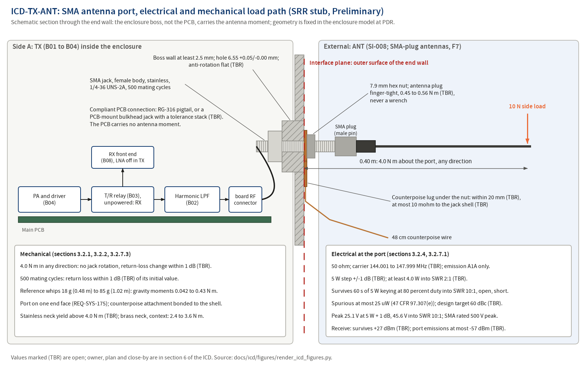

# ICD-TX-ANT: SMA antenna port, electrical and mechanical load path

**Maturity: SRR stub.** Written before SRR under `docs/process/02-requirements-and-traceability.md` section 3.5 (Creation row) to meet `docs/process/01-lifecycle-and-reviews.md` section 4.3 row 17 (NPR 7123.1D App. G Table G-4 entrance criterion 6.11; success criterion 4). Sections 1, 2 and 3.1 are filled; every section 3.2 subsection is filled and marked Preliminary, or marked Not applicable with its reason. Each value names its source: an L1 or L2 requirement, `docs/design/concept.md`, a hazard control, a regulation in `docs/references/md/regulatory/` or a research finding. A value not yet decided carries (TBR) and a row in section 6. The stub is reviewed against `docs/templates/peer-review-checklist-design.md` section I before SRR and baselined at PDR with the allocated baseline.

## 1. Scope (App. L 1.1 to 1.3)

### 1.1 Purpose and scope

This ICD defines and controls the interface between `TX` (transmitter: the antenna port electrical interface B01, the harmonic low-pass filter B02 and the T/R relay B03 of `docs/design/concept.md` section 5; `docs/design/architecture.md` is written at PDR) and `ANT` (the antenna on an SMA plug: the reference whips, any operator antenna, a dummy load or test lead). It covers: the connector type, gender and material, the enclosure boss and mechanical load path, mating and mating life, antenna mass, impedance and frequency range, transmitted power and voltage at the port, mismatch tolerance, the regulatory emission limits that apply at the port, receive-side limits at the port, the counterpoise attachment and bonding, ESD at the port, and RF exposure information. The boss and the enclosure features that carry the load are `ME` items that cite this ICD (concept section 9 row `ICD-TX-ANT`: "ME cites it for the boss"); the placement of the PA, filter and relay relative to the boss is `ICD-TX-ME` at PDR.

### 1.2 Precedence

Order of precedence in a conflict: `docs/process/00-charter.md`; the requirement files (`docs/requirements/sys/requirements.json`, `docs/requirements/tx/requirements.json`, and `docs/requirements/me/requirements.json` from PDR); this ICD; `docs/design/architecture.md` (from PDR); `docs/design/concept.md`; part datasheets as extracted in `docs/research/`. A conflict found is a finding against the newer document and is resolved by CR after PDR. Two concept section 9 values are superseded by L1 requirements under this rule and noted in their rows: "1000 matings" (REQ-SYS-106 and HZ-009 K2 set 500, the stainless rating) and "5.5 W into VSWR 3:1" (REQ-SYS-152 sets at least 4.0 W into SWR 2:1, TBR).

### 1.3 Responsibility and change authority

| Item | Value |
|---|---|
| Owner (writes and maintains) | Author of side `TX` (02 section 3.5 Owner row); Claude writes the stub |
| Concurring side | External item defined by SI-008 (antenna on one end of the aluminum enclosure), CON-015 (enclosure with the antenna on one end) and the SMA-plug handheld antenna convention of `docs/research/antenna-and-erp.md` F7 (candidate ANT-01) |
| Other module citing this ICD | `ME` for the boss, the anti-rotation feature, the counterpoise attachment and the anodize masking (REQ-SYS-105, REQ-SYS-107, REQ-SYS-109; ME L2 at PDR, RSK-025 S3); `RX` receives through the T/R relay (`ICD-RX-TX` at PDR) |
| Independent reviewer | Pending: reviewer agent invocation before SRR (SRR package section 2 items H1 and H11), checklist `docs/templates/peer-review-checklist-design.md` section I, record under `docs/reviews/SRR/checklists/` with the INSP-NNN Claude assigns |
| Approval | Robin, PDR decision memo (allocated baseline, charter section 3; 05 Table 4-1 row 10) |
| Change authority after PDR | `CR-NNN`, Class I for any definition-table change, Class II otherwise (02 section 10.2); Robin as CCB |

## 2. Documents (App. L 2.1, 2.2)

### 2.1 Applicable documents (binding)

| Document | What it imposes here |
|---|---|
| `docs/requirements/sys/requirements.json` REQ-SYS-104, REQ-SYS-105, REQ-SYS-175 | L1 requirements that cite this ICD in `design_refs` (section 4) |
| `docs/requirements/sys/requirements.json` REQ-SYS-001, REQ-SYS-008, REQ-SYS-011, REQ-SYS-012, REQ-SYS-013, REQ-SYS-017, REQ-SYS-018, REQ-SYS-037, REQ-SYS-050, REQ-SYS-106, REQ-SYS-107, REQ-SYS-109, REQ-SYS-151, REQ-SYS-152, REQ-SYS-172, REQ-SYS-176 | L1 requirements whose values bound a section 3.2 row but do not cite this ICD (section 4, related list) |
| `docs/requirements/tx/requirements.json` REQ-TX-003, REQ-TX-007, REQ-TX-008, REQ-TX-012, REQ-TX-014, REQ-TX-016 | TX L2 requirements that state values at the antenna port; all six are tagged `interface` with `ICD-TX-ANT` in `design_refs` and are the side-A requirements of section 4 |
| 47 CFR 97.307(e) (corpus: `47cfr-97.307.md`, eCFR issue 2026-09-23) | Spurious emission limit for the power supplied to the antenna transmission line: at most 25 uW and at least 40 dB below the fundamental for a transmitter of 25 W or less between 30 and 225 MHz (CON-002) |
| 47 CFR 97.307(a), (b) and (c) (same corpus file) | Necessary bandwidth, band confinement and keyclicks; spurious emissions reduced to the greatest extent practicable |
| 47 CFR 97.13(c) (corpus: `47cfr-97.13.md`) and 47 CFR 1.1310 (corpus: `47cfr-1.1310.md`) | RF exposure: the licensee's actions before transmitting where exposure could exceed the 1.1310 limits (CON-004) |
| `docs/safety/hazards.json` HZ-009 (K1 to K6), HZ-008, HZ-001, HZ-006, HZ-012, HZ-010 | Hazards controlled at this interface |
| SI-008, CON-002, CON-004, CON-015 (`docs/requirements/l0-stakeholder/`) | Fix the port position, the emission limit and the exposure obligation |

### 2.2 Reference documents

| Document | Use |
|---|---|
| `docs/research/antenna-and-erp.md` F2 (antenna gains), F3 (counterpoise), F5 (chassis as counterpoise), F6 (SWR of HT antennas), F7 (connector conventions), F8 (SMA mechanical data and bending analysis), candidates ANT-01 to ANT-06, risk ANT-R6 | Connector, boss, load and counterpoise values |
| `docs/research/tr-switch-candidates.md` F3, F7, F12, F19 | T/R relay (unpowered state is receive) and receiver protection behind the port |
| `docs/research/part97-regulatory-basis.md` F2 | Spurious-limit arithmetic at 5 W (53.0 dB) |
| `docs/design/concept.md` sections 7.1, 7.2 and 9 | Concept-level content of this ICD |
| `docs/decisions/adr/ADR-003-true-cw-a1a-5w.md`, `ADR-008-openscad-freecad-step-pcbway-cnc.md`, `ADR-022-harmonic-suppression-target.md` | Emission and power class, enclosure pipeline, 60 dBc design target |
| `docs/conops/conops.md` OPS-004, OPS-008, OPS-010, OPS-015, OPS-018 | Scenarios that exercise the port |
| `docs/risk/register.json` RSK-025, RSK-031, RSK-043 | Risks this ICD mitigates |
| `docs/reviews/SRR/decisions-for-owner.md` items 31, 61, 62, 80 | Owner decisions that close TBR rows of section 6 |

## 3. Interface (App. L 3.0)

### 3.1 General (App. L 3.1)

#### 3.1.1 Interface description

RF crosses the plane in both directions on a 50 ohm coaxial SMA interface: in transmit, the keyed A1A carrier (0.5 to 5 W steps) leaves the harmonic filter through the port into the antenna; in receive, signals from the antenna enter through the same filter and the T/R relay, whose unpowered state connects the antenna to the receiver. Mechanically, the antenna's weight, side loads and coupling torque cross the plane into the SMA jack body, which is nut-retained in a machined boss of the enclosure end wall so that the enclosure, not the PCB, carries the antenna moment; the PCB connection is compliant (a pigtail, or a PCB-mount bulkhead jack with a documented tolerance stack). A bonded counterpoise attachment within 20 mm (TBR) of the port lets the operator add a 48 cm counterpoise wire. The regulatory compliance point for spurious emissions is the conducted power at this port into 50 ohm (CON-002).

Figure source: `docs/icd/figures/render_icd_figures.py` (matplotlib, `tools/toolchain.lock.md` section 2 class B plots), rendered and inspected 2026-09-25. The section view is schematic: the jack, pigtail and boss geometry are fixed in the enclosure model at PDR.

#### 3.1.2 Interface responsibilities

| Item at the plane | Provided by | Accepted by | Defined in |
|---|---|---|---|
| SMA jack, female body (socket centre contact), stainless steel, bulkhead nut-retained | `TX` (part and RF path) | the antenna's SMA plug | 3.2.2, 3.2.4 |
| Boss, hole, anti-rotation flat, nut clearance, anodize masking | `ME` (cites this ICD) | the jack body and nut | 3.2.2, 3.2.7.1 |
| Antenna on an SMA plug (male), finger-tight | External item (SI-008; ANT-01 convention) | `TX` | 3.2.1, 3.2.2 |
| Transmitted RF at the port within power, emission and mismatch limits | `TX` | the antenna or a 50 ohm load | 3.2.4, 3.2.8 |
| Received RF into the port within the survival limit | External environment | `TX` (filter and relay) to `RX` | 3.2.4 |
| Counterpoise attachment point, bonded to the jack shell | `ME` with `TX` | operator's counterpoise wire | 3.2.2, 3.2.7.1 |
| PCB relief (no antenna moment on the board) | `TX` with `ME` (`ICD-TX-ME` at PDR) | none | 3.2.7.3 |

#### 3.1.3 Coordinate systems

Local frame for this stub: origin on the jack axis at the outer surface of the enclosure end wall, +Z along the jack axis out of the enclosure (toward the antenna tip), X and Y in the wall plane with +X along the PCB top face. Bending moments are about any axis in the X-Y plane at the origin. `ICD-TX-ME` maps this frame into the enclosure model frame of `hardware/enclosure/` (empty at SRR) at PDR.

#### 3.1.4 Engineering units, tolerances and conversion

SI units with the amateur-radio conventions of the requirement files (W, dBm, dBc, dBd, Hz, MHz, ms, V, mohm, N, N m, g, mm, C). Every value in section 3.2 carries a tolerance or bound. No unit conversion tables are used; the SMA thread is named by its standard designation (1/4-36 UNS-2A, 6.35 mm major diameter).

### 3.2 Interface definition (App. L 3.2)

#### 3.2.1 Mass properties

**Preliminary.** Antennas crossing the plane (antenna report F8 table):

| Item | Mass | Length | Gravity moment at the port, radio horizontal | Source |
|---|---|---|---|---|
| Pocket reference: Signal Stick SMA-M class (Nitinol, 1/4 wave) | 18 g | 0.48 m | 0.042 N m | antenna report F8, ANT-05 (a) |
| NA-771 class loaded whip | 40 g | 0.396 m | 0.078 N m | antenna report F8 |
| Range reference: 1/2 wave telescopic (RH770 class) | 85 g | 1.02 m | 0.43 N m | antenna report F8, ANT-05 (b) |
| Design envelope for the boss | at most 85 g (TBR) antenna mass; the 4.0 N m side-load case of 3.2.7.3 dominates every gravity case | not applicable | not applicable | this ICD, from the rows above |

#### 3.2.2 Structural and mechanical

**Preliminary.**

| Feature | Value | Tolerance | Side responsible | Source |
|---|---|---|---|---|
| Connector type and part | SMA jack, female body, socket centre contact, 1/4-36 UNS-2A external coupling thread (6.35 mm major diameter), stainless steel body, 500 mating cycle class (MIL-PRF-39012 class); bulkhead nut-retained; part number chosen at PDR | as rated | TX | REQ-SYS-104; antenna report F7, F8, ANT-01; HZ-009 K1; SRR decision item 80 |
| Mating plugs accepted | SMA plug (male pin) antennas of the Icom, Yaesu, Kenwood and Alinco convention; not SMA-F (Baofeng) antennas without an SMA-M version or an adapter; not RP-SMA | exact | External | antenna report F7, ANT-01 |
| Port position | on one end face of the enclosure | not applicable | ME | REQ-SYS-175; SI-008 |
| Boss wall at the hole | at least 2.5 mm thick | minimum | ME | HZ-009 K1; antenna report F8 (knurl-mount receptacles need panels at least 0.100 in thick) |
| Boss hole | 6.55 mm | +0.05 / -0.00 mm | ME | HZ-009 K1; antenna report ANT-02, F8 (6.35 mm thread plus 0.20 mm clearance) |
| Anti-rotation feature | flat (D-hole) or equivalent so that coupling torque cannot turn the jack | geometry from the jack drawing at PDR (TBR) | ME | HZ-009 K1; antenna report F8 |
| Nut clearance | 7.9 mm across flats hex nut (HEX 8) with wrench clearance | from the jack drawing at PDR (TBR) | ME | antenna report F8 (TEJTE, secondary source) |
| PCB connection | compliant: RG-316 pigtail to a board connector, or a PCB-mount bulkhead jack with a documented tolerance stack (PCB outline +/-0.2 mm against the machined hole +/-0.1 mm); choice at PDR (TBR) | per the tolerance analysis | TX with ME | HZ-009 K1, K6; antenna report F8, ANT-R6; technology assessment section 3.7 |
| Coupling torque | 0.45 to 0.56 N m (TBR), finger-tight, never a wrench (handbook) | range | External (operator) | REQ-SYS-106; antenna report F8; HZ-009 K5. Basis: 0.45 to 0.56 N m (4 to 5 in-lb) is the F8 value for a brass jack; F8 gives 8 in-lb (about 0.90 N m) for the AEP stainless-body SMA class this ICD specifies. The lower brass value is kept as the operator torque because it is inside the stainless rating and spares the plug side, which may be brass; the stainless jack datasheet at PDR confirms the range (section 6 row), and the check of the REQ-SYS-106 torque against it is proposed to the requirements author |
| Mating life | return loss within 1 dB (TBR) of its initial value after 500 mating cycles at the coupling torque | minimum 500 cycles | TX (part choice) | REQ-SYS-106; HZ-009 K2 (supersedes the concept figure of 1000) |
| Counterpoise attachment | ring terminal under the SMA nut, or an M3 threaded hole in the boss, within 20 mm (TBR) of the port axis | maximum distance | ME with TX | REQ-SYS-107; HZ-009 K4; antenna report ANT-03 |

#### 3.2.3 Fluid

Not applicable on cwht (no fluid interfaces).

#### 3.2.4 Electrical (power)

**Preliminary.** RF power and voltage at the port. Peak voltages are derived (V_pk = sqrt(2 P Z0), Z0 = 50 ohm; standing-wave maximum V_pk (1 + |Gamma|) with |Gamma| = 9/11 at SWR 10:1).

| Line | Nominal | Range | Current (max) | Sequencing and protection | Side responsible |
|---|---|---|---|---|---|
| RF out, transmit | 5 W step within +/-1 dB (TBR) into 50 ohm; 0.5, 1 and 2 W steps within +/-1 dB (TBR); 1 W at first power-on and after a configuration reset (TBR) | 144.001 to 147.999 MHz (TBR) carrier, 6.4 to 8.4 V pack; into any load up to SWR 2:1 at least 4.0 W (TBR) at the 5 W step | 22.4 V peak at 5 W matched, 25.1 V at 5 W + 1 dB; standing-wave maximum 45.6 V peak at 5 W + 1 dB into SWR 10:1 and 57.5 V at the ALC-off 10 W fault bound (HZ-001 K4); SMA rating 500 V peak | keyed only through the sequencer after the T/R relay has switched (ADR-010); RF ends independently of firmware 7.5 to 13 s into a continuous key-down (REQ-SYS-055) and on any inhibit or fault within 20 ms (TBR) to -40 dBc (TBR) (REQ-SYS-004); survives 60 s of 5 W keying at 80 percent duty into any load up to SWR 10:1 including open and short | TX |
| RF out, key-up and PA disabled | carrier power at most 1 uW (TBR) with TX_KEY deasserted or PA_EN deasserted and the exciter driven | 144.001 to 147.999 MHz | not applicable | REQ-TX-003, REQ-TX-014 | TX |
| RF at the port in receive | emissions at the port at most -57 dBm (TBR) from 9 kHz to 1.5 GHz; power at the set carrier frequency at most -57 dBm (TBR) | receive mode | not applicable | T/R relay normally closed to the receiver, so the unpowered state is receive (concept section 7.1; tr-switch F12) | TX with RX |
| RF in, receive survival | survives +27 dBm (TBR) at the port in receive without damage | 144 to 148 MHz | not applicable | receiver protection stage bounds the LNA input to +17 dBm under a stuck-relay or bias-loss fault (concept section 7.1; tr-switch F3, F19; SRR decision item 61) | TX with RX |
| DC on the centre conductor | no DC applied by the radio; DC path to ground through the filter or a bleed element decided with the LPF topology at PDR (TBR) | not applicable | not applicable | ESD at the port, 3.2.7.1 | TX |

Sources: REQ-SYS-008, REQ-SYS-011, REQ-SYS-012, REQ-SYS-013, REQ-SYS-037, REQ-SYS-064, REQ-SYS-152, REQ-SYS-176; REQ-TX-016; antenna report F8 (500 V peak rating, 22.4 V at 5 W); HZ-009 K3.

#### 3.2.5 Electronic (signal)

Not applicable: the antenna port carries RF power only (3.2.4); no logic or control signal crosses this plane.

Security expectations: Not applicable: no signal line at this plane is read as data or commands; the receiver output is heard by the operator and never decoded or acted on by the firmware (07 section 16.1).

#### 3.2.6 Software and data

Not applicable: no data or command path crosses the antenna port; the transmitter's firmware controls (power steps, band-edge guard, timeouts) act inside the radio and are defined in `ICD-TX-SW` and `ICD-TX-CTL` at PDR.

| Item | Definition | Side responsible |
|---|---|---|
| Security expectations | Not applicable: the interface carries no data or command path (07 section 16.1: no radio data reception path; CW is decoded by the operator) | none |

#### 3.2.7 Environments

##### 3.2.7.1 Electromagnetic effects (EMC, EMI, grounding, bonding, cable and wire)

**Preliminary.**

| Item | Definition | Source |
|---|---|---|
| Conducted spurious emissions at the port | every spurious emission at most 25 uW at all power steps, carrier frequencies and 6.4 to 8.4 V pack; design target at least 60 dB below the carrier at the 5 W step (TBR); at most 25 uW into any load up to SWR 2:1 (TBR) at the 5 W step | 47 CFR 97.307(e); CON-002; REQ-SYS-017, REQ-SYS-018, REQ-SYS-151; REQ-TX-007, REQ-TX-008, REQ-TX-012; ADR-022 |
| Emission type and bandwidth | A1A only (on-off keyed unmodulated carrier); keying envelope and sidebands per REQ-SYS-014 and REQ-TX-006 | REQ-SYS-001; 47 CFR 97.307(a), (b); ADR-003 |
| Bonding of the jack shell | shell bonded to the machined enclosure (RF ground) through anodize-masked contact areas shown on the drawing; counterpoise attachment at most 10 mohm (TBR) DC to the connector shell | REQ-SYS-107, REQ-SYS-109; HZ-009 K4; antenna report ANT-03 |
| Enclosure as part of the antenna | the enclosure, the operator's hand and the key and headphone leads carry antenna current; common-mode provisions are in `ICD-CTL-KEY` and `ICD-CTL-PHONES` section 3.2.7.1 | antenna report F5, ANT-06; OPS-017 |
| ESD at the port | survives IEC 61000-4-2 level 4 (8 kV contact, 15 kV air), by Analysis of the discharge path through the filter and the relay (no ESD generator on the bench) | REQ-SYS-050; TC-SYS-035; CON-016 |

##### 3.2.7.2 Acoustic

Not applicable: no acoustic content at the antenna port.

##### 3.2.7.3 Structural loads

**Preliminary.**

| Load case | Value | Acceptance | Source |
|---|---|---|---|
| Static bending moment | 4.0 N m in any direction (10 N at 0.40 m from the port); for context only, a 6 to 9 N push at the tip of a 40 cm whip (2.4 to 3.6 N m) reaches the yield moment F8 computes for a brass SMA neck (free-machining brass, 200 to 300 MPa; 5 N at 0.40 m is 2.0 N m and 10 N is 4.0 N m); the specified jack is stainless, whose neck yield moment (TBR) is taken from the jack datasheet or computed from its material yield strength at PDR (section 6 row) and must exceed 4.0 N m | no jack rotation (witness mark) and return-loss change within 1 dB (TBR) at 144 to 148 MHz; the PCB carries no antenna moment | REQ-SYS-105; HZ-009 K2; antenna report F8, ANT-02 |
| Coupling torque | 0.45 to 0.56 N m (TBR; brass-jack value applied to the stainless jack, basis in 3.2.2) | no jack rotation (anti-rotation flat) | REQ-SYS-106; antenna report F8 |
| Mating cycles | 500 at the coupling torque | return loss within 1 dB (TBR) of initial | REQ-SYS-106 |
| Drop with the antenna fitted | per REQ-SYS-116 (its value and TBR are carried there) | unit meets its requirements afterward | REQ-SYS-116 |

##### 3.2.7.4 Vibroacoustics

Not applicable on cwht: the hazard analysis names no vibration case.

##### 3.2.7.5 Human operability

**Preliminary.** The operator fits and removes the antenna by hand, finger-tight, and removes it for pocket carry; a 1 m telescopic is used only with the radio set down; the counterpoise ring terminal is captured under the nut or screwed to the boss without tools other than those in the handbook (HZ-009 K5; REQ-SYS-122; OPS-010, OPS-015). The engraved legend near the port states the transmitter class and the RF exposure reference (HZ-001 K7; REQ-SYS-124).

#### 3.2.8 Other interface definitions

**Preliminary.** RF exposure at the port: the delivered reference antennas have at most 0 dBd (TBR) gain from 144 to 148 MHz (REQ-SYS-172); the exposure evaluation (`docs/design/analysis/rf-exposure-evaluation.md`, the controlled regulatory document of charter section 5) uses the port power steps of 3.2.4 and the antenna gain bound; RF burn from contact with the antenna element or connector while transmitting is HZ-012, controlled by the power steps, timeouts and the handbook. Thermal path: none across this plane (the PA thermal path is `ICD-TX-ME`).

## 4. Requirements on each side (cwht addition; 02 section 3.5 pairing rule)

Side `TX` has an L2 file (`docs/requirements/tx/requirements.json`); REQ-TX-003, 007, 008, 012, 014 and 016 are tagged `interface` with `ICD-TX-ANT` in `design_refs` (INSP-012 finding F-01, applied 2026-09-26), so the pairing rule of 02 section 3.5 is met for side A (tool check T-22, INTERFACE_TAG_NO_ICD). Side `ANT` is external: its defining inputs are SI-008, CON-015 and the antenna report F7 convention. The L1 requirements that cite this ICD are listed as `requirements_other`.

| Side | Requirement | Statement (verbatim `description`) | Section 3.2 rows it depends on | Verification method |
|---|---|---|---|---|
| A `TX` | REQ-TX-003 | The transmitter shall hold antenna-port carrier power at most 1 uW (TBR) while PA_EN is deasserted with the exciter driven. | 3.2.4 key-up level | Test |
| A `TX` | REQ-TX-007 | The transmitter shall keep every antenna-port spurious emission at most 25 uW at every power step, 144.001-147.999 MHz and 6.4-8.4 V supply. | 3.2.4 spurious at the port | Test |
| A `TX` | REQ-TX-008 | The transmitter shall keep every antenna-port spurious emission at least 60 dB (TBR) below the mean carrier power at the 5 W step. | 3.2.4 spurious at the port | Test |
| A `TX` | REQ-TX-012 | The transmitter shall keep every antenna-port spurious emission at most 25 uW at the 5 W step into any load up to SWR 2:1 (TBR). | 3.2.4 spurious at the port | Test |
| A `TX` | REQ-TX-014 | The transmitter shall hold antenna-port carrier power at most 1 uW (TBR) while TX_KEY is deasserted with PA_EN asserted and the exciter driven. | 3.2.4 key-up isolation | Test |
| A `TX` | REQ-TX-016 | The transmitter shall keep antenna-port power at the set carrier frequency at most -57 dBm (TBR) in Receive mode. | 3.2.4 receive-state leakage | Test |
| B `ANT` | SI-008, CON-015, antenna report F7 (external item) | SI-008: "Fits an aluminum enclosure with the antenna on one end; enclosure designed in OpenSCAD and CNC-machined by PCBWay." | 3.2.2 connector, mating plugs, port position | not applicable (stakeholder input) |
| other | REQ-SYS-104 | The transceiver shall present a 50 ohm SMA jack (female body, stainless steel) as its antenna port. | 3.2.2 connector | Inspection |
| other | REQ-SYS-105 | The transceiver shall take a 4.0 N m antenna-port bending moment in any direction without jack rotation and within 1 dB (TBR) return-loss change. | 3.2.2 boss, 3.2.7.3 static bending | Test |
| other | REQ-SYS-175 | The transceiver shall carry its antenna port on one end face of its enclosure. | 3.2.2 port position | Inspection |

The lists here equal the front matter `requirements_a`, `requirements_b`, `requirements_other` and are checked by T-22 against `design_refs`.

Related requirements that bound a section 3.2 value but do not cite this ICD in `design_refs` (proposed additions are returned to the requirements authors): L1 REQ-SYS-013 (mismatch survival), REQ-SYS-017, REQ-SYS-018, REQ-SYS-151 (spurious), REQ-SYS-106 (mating life), REQ-SYS-107 (counterpoise), REQ-SYS-152 (power into 2:1), REQ-SYS-037 (receive survival), REQ-SYS-176 (receive emissions), REQ-SYS-050 (ESD); the TX L2 requirements that do cite it are the side-A rows above.

## 5. Verification (cwht addition; SE HB §6.3.1.2.3)

| Case | Verifies | Method and evidence class | Level |
|---|---|---|---|
| TC-SYS-058 | REQ-SYS-104 | Inspection (BOM part and drawing) | System |
| TC-SYS-072 | REQ-SYS-105 (and related REQ-SYS-107) | Test, Bench (10 N at 0.40 m in four directions on the printed part and the first machined enclosure; witness mark; NanoVNA return loss before and after; lug-to-shell millivolt drop at 1 A) | System |
| TC-SYS-040 | REQ-SYS-175 | Inspection (enclosure CAD) | System |
| TC-SYS-012, TC-SYS-014, TC-SYS-025, TC-SYS-035, TC-SYS-073, TC-SYS-100, TC-SYS-106 | related REQ-SYS-013, REQ-SYS-017, REQ-SYS-037, REQ-SYS-050, REQ-SYS-106, REQ-SYS-151 and REQ-SYS-152, REQ-SYS-176 | Test (Bench, tinySA Ultra through the calibrated attenuator, NanoVNA fixtures) and Analysis (TC-SYS-035, TC-SYS-073, Simulation class) | System |
| TC-TX-003, TC-TX-007, TC-TX-008, TC-TX-012, TC-TX-014, TC-TX-016 | related TX L2 requirements | Test, Bench on the delivered unit (closing cases named in the requirements) | Subsystem |
| TC pending | the ME boss and counterpoise requirements (ME L2 at PDR, RSK-025 S3) | written by the independent ME test author at PDR (02 rule WR-11) | Subsystem |

## 6. TBR items

| Value (section, row) | Current estimate | Owner | Plan | close_by |
|---|---|---|---|---|
| 3.1.1 and 3.2.2 Counterpoise attachment distance | within 20 mm of the port | Robin decides on Claude's proposal | REQ-SYS-107 tbr: the enclosure layout at PDR fixes the position | PDR |
| 3.2.1 Antenna mass envelope | at most 85 g | Claude (ICD author) | boss analysis at PDR (RSK-025 S1 due CDR carries the full load analysis) confirms the reference antenna set | PDR |
| 3.2.2 Anti-rotation feature and nut clearance geometry | flat (D-hole); 7.9 mm hex nut | Claude (ICD author) with ME | jack datasheet filed by the owner (technology assessment section 3.7, datasheets returned HTTP 403) and the enclosure model at PDR | PDR |
| 3.2.2 PCB connection (pigtail or PCB-mount bulkhead) | either, with a tolerance stack | Claude (ICD author) with ME | tolerance analysis in the enclosure model and PCB outline at PDR (ANT-R6; TS-004 input); H2C fit-check at CDR (HZ-009 K6) | PDR |
| 3.2.2 and 3.2.7.3 Mating-life return-loss limit | within 1 dB after 500 cycles | Robin decides at SRR on Claude's proposal | REQ-SYS-106 tbr: connector selection at PDR confirms the rating and the limit | PDR |
| 3.2.2 and 3.2.7.3 Coupling torque basis for the stainless jack | 0.45 to 0.56 N m (brass value; AEP stainless class 8 in-lb, about 0.90 N m) | Claude (ICD author); requirements author for REQ-SYS-106 | stainless jack datasheet read at PDR with the connector selection; if the recommended mating torque differs, the ICD row and a REQ-SYS-106 change are proposed together | PDR |
| 3.2.7.3 Stainless neck yield moment | above 4.0 N m required; brass neck 2.4 to 3.6 N m for context | Claude (ICD author) | neck section modulus from the stainless jack drawing times the datasheet material yield strength at PDR (antenna report F8 method); boss analysis of RSK-025 S1 | PDR |
| 3.2.4 Power step tolerance, 5 W | +/-1 dB | Robin decides at SRR on Claude's proposal | REQ-SYS-012 tbr: TS-003 and TS-006 at PDR | PDR |
| 3.2.4 Power step tolerance, lower steps | +/-1 dB at 0.5, 1 and 2 W | as above | REQ-SYS-011 tbr: RFX-D1 at SRR; ALC loop analysis at PDR | PDR |
| 3.2.4 Default power step | 1 W | as above | REQ-SYS-064 tbr (SRR decision list, power steps and defaults) | PDR |
| 3.2.4 Carrier range | 144.001 to 147.999 MHz | as above | REQ-SYS-008 tbr: TCXO and band-edge guard decision at SRR (ADR-023); synthesizer and reference trade study (TS-NNN-synthesizer-reference) at PDR | PDR |
| 3.2.4 Power into SWR 2:1 | at least 4.0 W | as above | REQ-SYS-152 tbr: TS-003 at PDR (SRR decision item 62) | PDR |
| 3.2.4 Carrier end on inhibit or fault | -40 dBc within 20 ms | as above | REQ-SYS-004 tbr: sequencer timing analysis (`ICD-TX-SW`) at PDR | PDR |
| 3.2.4 Key-up and PA-disabled isolation | at most 1 uW | as above | REQ-TX-003 and REQ-TX-014 tbr: TS-003 at PDR | PDR |
| 3.2.4 Receive-mode emissions and carrier leakage | at most -57 dBm | as above | REQ-SYS-176 and REQ-TX-016 tbr: receiver and T/R design at PDR | PDR |
| 3.2.4 Receive survival | +27 dBm | as above | REQ-SYS-037 tbr: TS-001 front-end design at PDR | PDR |
| 3.2.4 DC path of the centre conductor | decided with the LPF topology | Claude (ICD author) | LPF and ESD path analysis at PDR (TC-SYS-035 inputs) | PDR |
| 3.2.7.1 Spurious design target, mismatch spurious, counterpoise resistance; 3.2.7.3 bending return-loss limit; 3.2.8 antenna gain | at least 60 dBc; 25 uW into 2:1; at most 10 mohm; within 1 dB; at most 0 dBd | Robin decides at SRR on Claude's proposal | REQ-SYS-018 (ADR-022), REQ-SYS-151, REQ-SYS-107, REQ-SYS-105 and REQ-SYS-172 tbr plans (PDR analyses; TRR EIRP comparison for the gain) | PDR |

## 7. Change history

| Revision | Date | CR or review | Change |
|---|---|---|---|
| A | 2026-09-25 | none (pre-baseline draft; SRR package section 2 item H11) | Created as the SRR stub |
| A | 2026-09-25 | INSP-012 (`docs/reviews/SRR/checklists/icd-stubs-external.md`), pre-baseline | Findings F-01 (side-A proposal), F-09 applied; figure re-rendered and inspected |
