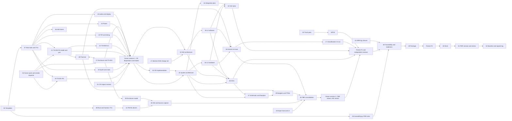

# cwht PDR Work Plan

**Author:** Claude, lead SE planner. **Date:** 2026-09-27. **Configuration read:** `main` at `9373729` (CR-006 submitted; CR-003 revision 2 at `cc83c8c`), functional baseline `baseline/srr` on `779f93f`.
**Status:** Plan (Informational working product of the PDR phase). It is not a baselined item. It becomes an input to `docs/reviews/PDR/package.md` §1 (agenda) and §12 (milestones) and is updated by the lead SE when a wave closes.
**Governing process:** `docs/process/00-charter.md` §4 and §11; `docs/process/01-lifecycle-and-reviews.md` §3, §5, §9 to §13; `docs/plan/semp.md` §3.4 (compressed-schedule lien policy); NPR 7123.1D App. G Tables G-5 and G-6; NPR 7150.2D as customized in `docs/process/07-software-engineering-plan.md`.

Paths are relative to `/Users/robinonsay/rust/cwht`. "Sources" below are the four PDR reader reports of 2026-09-27 (gate, carried items, TBR closure map, design and software maps), which read HEAD `72e1863`; this plan re-read the two commits after them (`cc83c8c`, `9373729`) and updates the reader findings where those commits changed the facts (section 1.3).

---

## 1. Purpose and sources

### 1.1 Purpose

This plan defines every piece of work needed to hold the Preliminary Design Review (PDR, combined with MDR/SDR, `docs/process/01-lifecycle-and-reviews.md` §1 item 3 and §5.1) and to tag the allocated baseline `baseline/pdr` (01 §2; `docs/process/05-configuration-and-data-management.md` §4.4). It:

1. lists what the gate requires (section 2);
2. cuts the work into work packages `WP-PDR-NN` with outputs, roles, review records, dependencies and the carried items they close (section 3);
3. orders them into a dependency graph and execution waves for Claude's workflows, with barriers and freeze points (sections 4 and 5);
4. lists the owner's decisions and actions with recommendations and needed-by dates (section 6);
5. names what cannot close at PDR and routes it (section 7);
6. assesses the schedule honestly (section 8), names plan risks (section 9), and traces every carried item, TBR and gate criterion to a WP (section 10).

### 1.2 Sources

| Source | Path | Used for |
|---|---|---|
| Owner inputs of 2026-09-27 (verbatim) and lead SE reading | `docs/plan/status/status-2026-09-27.md` §2, §3 rows 1 to 9 | Enclosure option C first with CNC fallback, 48 C reachable surfaces, engraved or printed-in legend, PETG without flame rating, one board first, coating research, near-field probe; "at risk" rule (row 9) |
| SRR decision memo | `docs/reviews/SRR/decision-memo.md` §6 (liens L-1 to L-7), §8.0 (rulings), §8.4, §13.2, §13.3, amendments A-1 to A-8 | Carried items and rulings |
| SRR RFA/RID log | `docs/reviews/SRR/rfa-rid-log.json` | 14 RIDs, 8 RFAs |
| SRR records | `docs/reviews/SRR/checklists/*.md` (30 records) | Record liens (convergence rule) |
| SRR package, baseline record, baseline check | `docs/reviews/SRR/package.md` §2.2, §13, §15, §19, §20; `baseline-record.md`; `baseline-check.md` | Owner actions OA-4 to OA-6, lessons, lien table |
| Change requests | `docs/cm/cr/CR-003-solution-neutral-enclosure.md` (revision 2, `cc83c8c`) §5, §6, §12; `docs/cm/cr/CR-006-build-sequence-one-unit-first.md` (`9373729`) §1, §5, §6, §12 | Enclosure and build-quantity changes, both Submitted |
| Process set | `docs/process/00-charter.md` to `08-agent-briefing.md`; `rmm.json`; `se-compliance-matrix.json` | Gate criteria, record rules |
| Plans | `docs/plan/semp.md`, `schedule.md`, `cost-estimate.md`, `technology-assessment.md`, `tpm.json` | Schedule, liens policy, TPMs |
| Design state | `docs/design/concept.md`, `docs/design/allocation.json`, `docs/decisions/`, `docs/icd/`, `docs/safety/`, `docs/risk/register.json`, `docs/requirements/`, `firmware/`, `tools/` | Starting point of every product |
| Reference corpus | `docs/references/md/` (SE HB, NPR 7123.1D, NPR 7150.2D, SWEHB) | Standards cited by the gate |

### 1.3 Facts changed since the reader reports (read at `9373729`)

1. **CR-006 now exists**: `docs/cm/cr/CR-006-build-sequence-one-unit-first.md`, status Submitted, Class I. It proposes 5 bare boards fabricated and 1 assembled (`CWHT-A-001`), further units by owner decision at SAR (§12 Q4), REQ-SYS-147 amortized "over the units of its first build" (§1.2), MOE-001 and MOE-002 with a characterized second station (§1.1). Its independent impact review (§6) is **not yet performed**.
2. **CR-003 revision 2** (`cc83c8c`) withdraws proposed REQ-SYS-192 (60 C class), REQ-SYS-193 (UL 94 V-1) and TC-SYS-115; widens REQ-SYS-113 (48 C) to every external surface; requires the legend to be part of the surface (REQ-SYS-124); adds solvent rub and pocket abrasion to REQ-SYS-191, which also covers jack markings; makes the enclosure plan sequential (option C, then CNC fallback; option B on paper only) (CR-003 header "Revision 2", §5). It needs the independent reviewer's re-check of the §6.1 finding resolutions before the owner's disposition (status note §1).
3. The TBRs CR-003 proposes that close at PDR are therefore REQ-SYS-109 (0.1 ohm bond) and REQ-SYS-191 (legend durability) only.

### 1.4 SRR lessons applied in this plan

| # | Lesson | Where it came from | How this plan applies it |
|---|---|---|---|
| L1 | **Convergence rule.** After a record's first APPROVED verdict, only open Major findings change a product; new Minor findings become liens with an owner and a due event (for PDR products: due CDR). | Charter §4 item 3 (lead SE convergence rule of 2026-09-26, as applied in every SRR lien table, e.g. `docs/reviews/SRR/checklists/test-cases-sys.md` lien table); 08 §3.2 (INSP-022 finding-5, C-131) | Section 5 rule C1: each review WP runs at most three iterations (07 §10.2); Minor findings raised at PDR are liens due at the CDR readiness declaration, carried in the PDR package §15 |
| L2 | **Freeze products at a commit before reviews.** A review names the blob it checked; a product that moves after review invalidates the record. | SRR records name blobs (e.g. `schedule-and-cost-estimate.md` "Products checked" at blob SHAs); SRR package re-issues forced record deltas (C-199 to C-204) | Section 5 freeze points F1 (design products) and F2 (package and deck): products are committed and their blob SHAs recorded in the review brief before the reviewer starts; any post-freeze change needs a delta iteration of the record |
| L3 | **Never let the deck state its own review status.** The SRR deck described its own render and review state, which went stale (INSP-029 cross items X-2, X-4; finding-3, 5, 6). | `docs/reviews/SRR/checklists/srr-deck.md` lien table and cross items | WP-PDR-50: the deck carries no review status of itself; the package §2 "Slide deck" block is written after the deck record by the package author, and the deck only cites package sections |
| L4 | **Independent CR impact review before disposition.** CR-002 and CR-004 were dispositioned before their impact review, recorded as deviations. | `docs/cm/deviations.md` entries 1 and 2; CR-003 §6 and CR-006 §6 lead paragraphs | WP-PDR-01 performs both reviews before the owner is asked to disposition; any CR raised during the PDR phase (the 05 Class II CR of WP-PDR-05, CR-002 follow-ons, rustos pin-move CRs) gets its §6 review first |
| L5 | **Check every case a standard names.** Reviews that sampled cases missed items (for example the SWE-134 a to l rows, App. G sub-items, the 06 §14.4 sensitivity pair). | SRR records INSP-009, INSP-017 findings on the 03 transcription (C-073, C-077); INSP-027 findings on TS-002 (C-162 to C-165) | Every reviewer brief lists, as acceptance criteria, each case the governing clause enumerates: App. G G-5/G-6 items (section 2), SWE-134 a to l, 47 CFR 97.307 limit points, 06 §14.4 weight ±10 and Low-cell ±1 sensitivity, every mode and state for safety requirements (SWE-134 b, e) |
| L6 | **Generate lists from the files, never copy them from a memo.** The SRR memo's L-1 list names 101 L1 TBRs; the file holds 109. | TBR reader §2 finding 1 | WP-PDR-45 generates the open-TBR table from the requirement files; WP-PDR-48 regenerates every count in the package from tools |
| L7 | **One writer per file per wave.** Concurrent edits to shared JSON caused rework at SRR. | Charter rule "never commit another agent's hunk" (cited in CR-006 §5) | Section 5.3 file-ownership table |

---

## 2. PDR gate requirements

Source for this section: the gate reader report, which cites 01 §3.1 to §3.5, §5.1 to §5.7, §12.2 and §13, NPR 7123.1D §5.2.2 and App. G, and 07 §1.3, §3.1. Section 10 traces each row to a WP.

### 2.1 Trigger and basis

- PDR is event-based (NPR 7123.1D §5.1.5; 01 §5.2). It convenes when SRR is complete, every L1 TBR is closed (charter §7), and the Hard rows of 01 §3.2 and §5.3 are met.
- It absorbs MDR/SDR, so SE-40 to SE-43 are PDR entrance products (01 §1 item 3; SEMP §3.4).
- Leaving PDR: allocated baseline `baseline/pdr`, record `docs/reviews/PDR/baseline-record.md`, signed tag (SRR decision 15; 05 §4.4).
- Lien policy (SEMP §3.4; `docs/plan/schedule.md` liens paragraph): only SE-45 preliminary-design products may be liened, each with an owner, a closure plan and the CDR product that closes it. CDR never closes with open PDR liens.
- Never liens at PDR (01 §12.2): an open Major RID; an unmet Hard entrance criterion; a hazard without an allocated control requirement; a failing traceability report; a TBD in a product being baselined; an open L1 TBR (02 §9 item 5; 02 §8 rule 5).

### 2.2 Standing entrance criteria (01 §3.2)

| Id | Criterion | Gate |
|---|---|---|
| S1 | Agenda, success criteria, board instructions agreed | Hard |
| S2 | Every SRR RFA and RID Closed or Withdrawn, or open as a lien with a later due date (all 14 Minor SRR RIDs must be Closed or Withdrawn) | Hard |
| S3 | Every entrance product has an independent record with every finding dispositioned | Hard |
| S4 | Traceability report passes | Hard |
| S5 | Zero TBDs in baselined items; every TBR has owner, plan, `close_by` | Hard |
| S6 | Proposed tailoring listed with rationale | Hard |
| S7 | Risk register current, top risks named | Hard |
| S8 | TPM status current with the review trend (Hard from PDR) | Hard |
| S9 | Every visual product rendered and inspected | Hard |
| S10 | Lessons learned reviewed and recorded | Soft |
| S11 | Deck ready, rendered, inspected, no claim outside the package | Hard |

### 2.3 PDR entrance criteria (01 §5.3)

| Id | Criterion (App. G / SE / SWE source) | Gate |
|---|---|---|
| E-1 | Architecture with major trade-offs (G-5 5.1; SE-41) | Hard |
| E-2 | L1 to L2 allocation and L2 specifications ready to baseline (G-5 5.2; G-6 6.1; SE-42) | Hard |
| E-3 | MOPs, TPMs and KDRs ready to approve (G-5 5.3; SE-40) | Hard |
| E-4 | TPM status and leading-indicator trends; SRR discrepancies resolved (G-5 5.4; G-6 6.2; SE-43) | Hard |
| E-5 | Preliminary design meets all requirements or has waivers (G-6 5.1; SE-45) | Hard |
| E-6 | Integration plan (G-6 5.2; SE-67) | Hard |
| E-7 | V&V plan and matrices (G-6 5.3, 6.14; SE-68) | Hard |
| E-8 | ICDs with pin maps, levels, timing, key debounce and keyer timing (G-6 6.13; G-5 6.11) | Hard |
| E-9 | Technical resource budgets and margins (G-6 6.17; G-5 6.12) | Hard |
| E-10 | Hazard analysis with controls allocated to L2; SWE-134 provisions (G-6 6.11; G-5 6.15) | Hard |
| E-11 | Single point failure list (G-6 6.26) | Hard |
| E-12 | Regulatory approach, Part 97 limits by analysis plan; `REQ-TX-*` citations resolve (G-6 6.15) | Hard |
| E-13 | ConOps baselined and consistent (G-6 6.18; G-5 6.14) | Hard |
| E-14 | Design standards: Rust coding standard, static analysis set, KiCad DRC at PCBWay capability, Part 97 limits (G-6 6.10; SWE-061, SWE-135) | Hard |
| E-15 | Design data package index (G-6 6.12) | Soft |
| E-16 | Technology readiness and heritage (G-6 6.3; G-5 6.6) | Soft |
| E-17 | Cost estimate and milestones (G-6 6.6; G-5 6.7) | Soft |
| E-18 | EMI/EMC, parts and producibility approaches (G-6 6.9) | Soft |
| E-19 | SEMP updated (G-6 6.19; G-5 6.2) | Soft |
| E-20 | HSI approach: controls, display, audio, key ergonomics, keyer settings (G-6 6.20; G-5 6.9) | Hard |
| E-21 | Procurement status, single-source parts (G-6 6.25) | Soft |
| E-22 | Software products (01 §5.6; G-6 6.22; G-5 6.16) | Hard |
| E-23 | Functional and timing descriptions (G-5 6.1; SE HB §4.3) | Hard |
| E-24 | Manufacturability (G-6 s17) | Soft |
| E-25 | All L1 TBRs closed (charter §7) | Hard |

Also required: 06 re-approval and the risk items G-5 6.3/6.4, G-6 6.5 (06 Table 10-1). Customized or NA: 01 §3.5 and §5.7 items (spectrum, LCC/JCL, ILSP, project protection, human rating, system security plan substituted by the 07 §16 cyber assessment, SCRM substituted by DigiKey-only sourcing, PRA/FMEA substituted by the hazard analysis and SPF list; technology development plan, disposal plan).

### 2.4 Success criteria

- Standing (01 §3.3): C1 gate criteria met or liened; C2 compliance with charter, SEMP, RMM, compliance matrix; C3 TBD/TBR plans acceptable; C4 tailoring appropriate; C5 software criteria of 01 §5.6; C6 residual risks owner-accepted.
- PDR (01 §5.4), numbered SC-1 to SC-18: SC-1 requirements, MOEs, TPMs and constraints final and consistent; SC-2 complete traceable flow-down; SC-3 design meets requirements at acceptable risk; SC-4 interfaces consistent, interface and cyber risks acceptable; SC-5 no new technology or backups exist; SC-6 risks credibly assessed; SC-7 SMA addressed; SC-8 adequate margins; SC-9 ConOps sound with HSI; SC-10 trade studies mostly complete; SC-11 preliminary analysis per subsystem; SC-12 heritage assessed; SC-13 manufacturability; SC-14 architecture credible, all requirements allocated; SC-15 fault tolerance supported (SPF list); SC-16 procurement consistent with milestones; SC-17 software meets PDR-point criteria; SC-18 HSI sufficient.

### 2.5 Minimum products

- SE (NPR 7123.1D §5.2.2.2; 01 §5.5): SE-40 TPM definitions (Approved); SE-41 architecture (Baselined); SE-42 allocation and L2 (Baselined); SE-43 leading-indicator trend (Initial); SE-45 preliminary design (Preliminary); SE-67 integration plan (Baselined); SE-68 V&V plan (Baselined). SE-44 NA.
- Software (01 §5.6; 07 §1.3, §3.1): SWE-050/184 SRS; SWE-057 architecture and `ICD-CTL-SW`; SWE-052 traceability rows 1 to 3 at PDR (row 3 `design_refs` checks; row 2 hardening `HAZARD_UNCONTROLLED`, `HAZARD_INVERSE`); SWE-013/024 plans and actuals; SWE-065 a test plan; SWE-061/135 coding standard and static analysis set; SWE-134/023 safety-critical components and a to l allocation; SWE-136/070 tool validation status; SWE-200 volatility; SWE-087/088/089 peer reviews; SWE-143 architecture review with SA second review; SWE-034 acceptance criteria; measurements, status reports, emulator accreditation.

### 2.6 Review conduct products (01 §9 to §13; charter §4)

Package `docs/reviews/PDR/package.md`; readiness declaration; deck `docs/reviews/PDR/slides/pdr.adoc`, `pdr.html`, `png/slide-NN.png` and record `checklists/pdr-deck.md`; minutes `minutes.md`; log `rfa-rid-log.json` (`RFA-PDR-NNN`, `RID-PDR-NNN`); decision memo `decision-memo.md`; baseline record `baseline-record.md`; figures `figures/*.png`; frozen `traceability-report.md` and `traceability.json`; signed tag `baseline/pdr`.

---

## 3. Work packages

### 3.1 Conventions

- **Estimate unit.** "inv." is one agent invocation of about 1 to 2 agent-hours of focused work (author or reviewer). Estimates include the expected review iterations (usually 2) but not owner time. Owner time is stated separately where needed.
- **Roles** are those of `docs/process/08-agent-briefing.md` and charter §5: lead SE, L1/L2 requirements author, test author, safety analyst, RF designer (RX, TX), power designer, ME designer, software lead, firmware developer, tool owner, configuration manager (CM), risk manager, V&V lead, ICD author, package author, deck author. Reviewers: independent reviewer (engineering lens, a separate invocation that authored nothing in the product), software assurance (SA) second reviewer where 07 §2.1.1 says Yes, safety reviewer for hazard products.
- **Records.** Every review record is `docs/reviews/PDR/checklists/<slug>.md` with `id: INSP-NNN` (01 §13). INSP numbers continue after the last SRR number and are taken when the record is created. SA pairs use the suffix `-software-assurance.md`.
- **Numbers.** TS, ADR and TV numbers shown as "(provisional)" are the next free numbers at `9373729` (TS-003 onward, ADR-028 onward, TV-014 onward); the number is taken when the file is created (06 §13 item 3).
- **At risk.** A product marked **AT RISK (CR-003)** or **AT RISK (CR-006)** depends on an undispositioned CR (status note §3 row 9). It is drafted on the CR's proposed text and re-checked against the disposition before its freeze. If the owner rejects or changes the CR, the product is reworked and its review iterates.
- **Carried-item ids** C-001 to C-210 are the rows of the carried-items reader report (section 10.1 repeats their subjects). TBR groups G1 to G15 are those of the TBR closure map (section 10.2).

### 3.2 Group A: change control, templates, owner inputs, CM foundation (wave 0)

#### WP-PDR-01 Independent impact reviews of CR-003 revision 2 and CR-006

- **Objective:** give the owner a reviewed basis for both dispositions (lesson L4).
- **Inputs:** `docs/cm/cr/CR-003-solution-neutral-enclosure.md` (rev 2, §6.1 finding map), `docs/cm/cr/CR-006-build-sequence-one-unit-first.md`, status note §2 and §3, 05 §5.3.
- **Outputs:** CR-003 §6 re-check delta (reviewer verifies F1 to F14 resolutions and the rev 2 diff); CR-006 §6 impact review table and concurrence; author revisions of either CR if a Major is found; a disposition brief for the owner (answers to CR-003 §12 Q1 to Q3 and CR-006 §12 Q1 to Q8 with recommendations) in `docs/reviews/PDR/owner-actions.md` §1.
- **Author:** Claude as CR originator (CR-003) and lead SE (CR-006) for any revision. **Reviewer:** independent reviewer, a new invocation that authored neither CR (05 §5.2). The record is the CR's own §6 (no separate checklist, 05 §5.3).
- **Tools:** `mcp__claude-context__search_code` first, then `git ls-files | xargs grep` pins; `tools/traceability.py`; `tools/validate_docs.py`.
- **Depends on:** none.
- **Closes / enables:** enables OD-02, OD-03 (section 6); prerequisite of WP-PDR-02.
- **Estimate:** 4 inv. (2 reviews, up to 2 author fix passes).

#### WP-PDR-02 Implement CR-003 and CR-006 after disposition

- **Objective:** put the dispositioned functional-baseline changes on `main` before the PDR products freeze.
- **Inputs:** dispositioned CRs; CR-003 §5 steps 0 to 9; CR-006 §5 steps 1 to 9.
- **Outputs:** CR branches `cr/CR-003-solution-neutral-enclosure` and `cr/CR-006-build-sequence-one-unit-first` merged in the order CR-003 §5 and CR-006 §5 set (CR-003 owns enclosure lines, CR-006 quantities); `docs/requirements/l0-stakeholder/stakeholder-inputs.md` (SI-039), `expectations.json/.md`, `docs/requirements/sys/requirements.json/.md`, `docs/test_cases/sys/test_cases.json/.md`, `docs/conops/conops.md`, `docs/design/allocation.json` (CR-003 step 5), `docs/safety/hazards.json` links (CR-003 step 6), `docs/design/concept.md` note, SEMP, schedule, cost, 01, 02, 05, 08, `rmm.json/.md`, compliance matrix, new ADR for build quantity (ADR-028 provisional, CR-006 step 2), `docs/vv/traceability-report.md`; CR §8 implementation records and §9 verification.
- **Author:** L0/L1 requirements author, test author, ConOps author, CM (per CR §5 tables). **Reviewer:** independent reviewer for CR §9 verification; delta re-issues of INSP-001 (`docs/reviews/SRR/checklists/expectations.md`), INSP-003 (`requirements-sys.md`), INSP-025 (`test-cases-sys.md`), INSP-002 (`conops-and-concept.md`) as CR-003 §5 lists.
- **Tools:** `tools/traceability.py`, `tools/validate_docs.py`, render scripts `--check`.
- **Depends on:** WP-PDR-01; OD-02, OD-03; WP-PDR-11 (sys requirements writer order, section 5.3).
- **Closes:** C-012 (INSP-001 finding-16); C-198 with WP-PDR-46; the REQ-SYS-147 basis (G15); CR-003 proposed TBRs REQ-SYS-109, 191 enter the file; design-reader inconsistencies 99 (schedule, concept B21) and 102 (ICD-TX-ANT bond wording, through CR-003 step 13 in WP-PDR-36).
- **Estimate:** 6 inv.
- **Flag:** this WP is the CR work itself; the downstream products are AT RISK until it starts.

#### WP-PDR-03 Missing checklist templates

- **Objective:** remove the 08 §3.5 block ("a review that needs a checklist that does not yet exist is not held").
- **Inputs:** 08 §3.5; 07 §15 row 5.17 item 13; SRR decision 117; existing templates in `docs/templates/`.
- **Outputs:** `docs/templates/peer-review-checklist-analysis.md` (simulation decks, budgets, thermal, RF exposure, cascade, timing analyses: inputs traceable, model validity, TV status of the tool, units, margins against the requirement, every case the requirement names, render inspected); `docs/templates/peer-review-checklist-software-assurance.md` (NASA-STD-8739.8 style SA items as far as the corpus allows; 07 §2.1.1); `docs/templates/peer-review-checklist-tool-validation.md` (decision 117). Update 08 §3.1 and §3.5 rows (with C-128).
- **Author:** Claude as checklist owner. **Reviewer:** independent reviewer with `peer-review-checklist-requirements.md` section G (plans and process documents). **Records:** `docs/reviews/PDR/checklists/template-peer-review-checklist-analysis.md`, `template-peer-review-checklist-software-assurance.md`, `template-peer-review-checklist-tool-validation.md`.
- **Tools:** `tools/validate_docs.py` (schema of record front matter).
- **Depends on:** none. **Blocks:** every analysis, SA and TV review.
- **Closes:** P-44, P-45 (gate reader); software reader R-12; design reader item 106 (TV template).
- **Estimate:** 6 inv.

#### WP-PDR-04 Owner action pack, vendor requests before the PCBWay closure, equipment list

- **Objective:** get every owner-hands input moving on day one, because the PCBWay closure (2026-10-01 to 10-04) and vendor weekends set hard dates.
- **Inputs:** SRR package §2.2 (OA-4 to OA-6); `docs/research/pcbway-export-and-vendor-questions.md` Part 3; `docs/research/pcbway-fabrication-and-assembly.md` F16, F17, F20, A-PCB-01 to A-PCB-09; `docs/research/pa-turnkey-candidates-followup.md` ACTION 14, 16, 17; TS-001 §6 item 5; CR-006 §12 Q2, Q5, Q6, Q8; CR-003 §5 step 19.
- **Outputs:** `docs/reviews/PDR/owner-actions.md`: (a) drafted PCBWay email covering OA-4 questions, the instant-quote set for TS-004 (4-layer, 1.0 and 1.6 mm, with and without Type VII via fill and impedance control, 5 fabricated with 1 and 2 assembled, later assembly of boards from the same lot, return of unused turnkey parts), PowerFLAT via-in-pad and display FPC insertion; (b) OA-5 Inrad #111 and KVG quote requests and the Guerrilla RF note (only if P2 is revived); (c) st.com download list (STEVAL-TDR003V1 files, DS6782, ADS model); (d) dated stock-check list for critical parts (design reader items 87 to 95); (e) PDR equipment list draft: near-field H-field probe, thermocouple (OQ-VV-003), calipers and scale (OQ-VV-002), 2 m source of at least 5 W for TC-SYS-025, second 2 m CW station for MOE-001/002, weak-signal source for MOE-010, sigrok and second Pico 2 (D-VER-2); (f) regulatory corpus additions for OQ-SAF-024 and 47 CFR 2.803; (g) the owner decision list of section 6 with needed-by dates. Owner replies are transcribed verbatim into `docs/plan/status/status-2026-09-28.md` and later dated status notes (SEMP §7.4).
- **Author:** lead SE. **Reviewer:** none required (a request list, not a baselined product); the equipment list is reviewed inside WP-PDR-43.
- **Depends on:** none. **Needed by:** PCBWay requests sent by Tue 2026-09-29 so answers land by 09-30 (`schedule.md` §3).
- **Closes (enables):** C-207, C-208, C-209, C-210 (owner performs), C-062 (owner corpus rows), C-061 equipment confirmation, C-091 and C-092 prompts.
- **Estimate:** 2 inv. Owner time about 1 h to send.

#### WP-PDR-05 PDR workspace and CM foundation

- **Objective:** create the PDR record space and the CM items that must exist before any baseline admission (05 §4.4, §6; SRR memo A-8).
- **Inputs:** 05 §4.4, §6, §13, Table 4-1, Table 4-2; SRR baseline record line 546; INSP-006 and INSP-030 lien tables; SRR package §19.
- **Outputs:**
  1. `docs/reviews/PDR/` skeleton: `package.md` (from `docs/templates/review-package.md`), `rfa-rid-log.json` (empty, schema `docs/templates/rfa-rid-log.schema.json`), `checklists/`, `figures/`, `slides/`.
  2. First CSA report written by hand: `docs/process/configuration-status.md` (13 sections plus Table 6-1 metrics; CR register CR-001 to CR-006, deviations 1 to 4 closed, waiver W1, liens, TV states) (C-089).
  3. One Class II CR against 05 (CR-007 provisional, `docs/cm/cr/CR-007-cm-plan-pdr-rows.md`) adding: the allocated-baseline Table 4-2 admission rows (P-29); a Table 4-1 row for `docs/plan/status/` (C-088, overdue); identification of safety-critical firmware files (C-087); SA part in change control and release (C-084); RMM/plan agreement SWE-136, 063, 085 (C-085); build-flavour identification (C-086); ADR correction exception bound (C-081); status line (C-082); §5.1 row 2 bound (C-083); §9.2 known-answer rows for `unsafe_audit.py`, `complexity_gate.py`, `measurements.py` (C-093); README index or §7.4 wording (C-090). Its §6 impact review precedes its disposition (lesson L4).
  4. `docs/lessons-learned.md` with the ten SRR package §19 entries plus the lessons of section 1.4 (C-206; S10).
- **Author:** CM (items 1 to 3), lead SE (item 4). **Reviewer:** independent reviewer (CM lens) and SA second review for 05 changes (07 §2.1.1). **Records:** `docs/reviews/PDR/checklists/cm-plan-05.md` and `cm-plan-05-software-assurance.md` (delta of INSP-006 and INSP-030 scope), `docs/reviews/PDR/checklists/configuration-status.md`, `docs/reviews/PDR/checklists/lessons-learned.md`.
- **Tools:** `tools/validate_docs.py`; later `tools/csa.py` (WP-PDR-07) regenerates the CSA.
- **Depends on:** none (CSA regeneration depends on WP-PDR-07).
- **Closes:** C-081 to C-090, C-093, C-206; P-29, P-30; RFA-SRR-003 (L-3); SRR memo A-8 first CSA and OBS-1.
- **Estimate:** 8 inv.

### 3.3 Group B: tools and tool validation (waves 0 and 1)

#### WP-PDR-06 `tools/traceability.py` PDR rules and TV-002 re-validation

- **Objective:** a traceability tool that can run `--gate PDR` with every PDR rule, so the readiness declaration is not blocked (04 §7.4: "the gate's readiness declaration is blocked until its unit test passes").
- **Inputs:** 02 §8.1, §8.5 (T-04, T-12 to T-22); 03 §8; 04 §7.4 rows 7.3.4, 7.3.6, 7.3.11, 7.3.12; SEMP App. F F-06; RFA-SRR-007 (L-7) ADR back-reference; SRR memo §9 condition 5; `docs/cm/tool-validation/TV-002-traceability.md`.
- **Outputs:** `tools/traceability.py` with `--gate`, `--volatility --from <ref>`, `--fix-children`; rules `BASELINE_ID_MISSING`, T-12, T-13, T-14, `DESIGN_REF_UNRESOLVED`, `DESIGN_REF_MISSING`, `DESIGN_ELEMENT_ORPHAN`, `KDR_WITHOUT_MOP`, T-17 gate severities, T-18 E, T-19 report section, `MOE_WITHOUT_MOP`, `ICD_NAME`, `ICD_UNPAIRED`, `ICD_SECTION4_MISMATCH`, `HAZARD_UNCONTROLLED`, `HAZARD_INVERSE` as violation, `CASE_STALE`, `DEVBOARD_CASE_CLOSING`, 7.3.4 PCA-05 condition of Closed, ADR-to-requirement back-reference, safety-critical hardware part field check; unit tests in `tools/tests/test_traceability.py`; `docs/cm/tool-validation/TV-002-traceability.md` re-validation run and accreditation request; regenerated `docs/vv/traceability-report.md` and `traceability.json`; 02 §8.5 table with the five missing codes (C-126).
- **Author:** tool owner (Claude as software lead). **Reviewer:** independent reviewer with `peer-review-checklist-code.md` plus `peer-review-checklist-tool-validation.md`; SA second review (tool used for credit). **Records:** `docs/reviews/PDR/checklists/code-tools-traceability.md`, `code-tools-traceability-software-assurance.md`, `tool-validation-tv-002.md`.
- **Depends on:** WP-PDR-03 (TV checklist). Rule data needs WP-PDR-31 (allocation schema) for the design-ref checks to pass, not to be written.
- **Closes:** C-026 (tool part), C-068 (04 rows due before SRR, tool part), C-069 (Inspection route), C-111 (SEMP F-06), C-126, C-183, C-184; P-16 (tool part), P-25; gate reader H item 64; software reader P-12, T-10.
- **Estimate:** 7 inv.

#### WP-PDR-07 New tools with TV records

- **Objective:** write and validate the tools the PDR evidence and CM depend on (05 §13 PDR row; SEMP F-15).
- **Inputs:** 05 §4.5, §6, §9, §13; `tools/toolchain.lock.md` §1.2, §1.4 finding 4; the reference-cwht toolchain facts (LTspice under Wine batch, kicad-cli PCBWay flags, FreeCAD command).
- **Outputs:** `tools/ltspice-batch.sh` plus `docs/cm/tool-validation/TV-014-ltspice-batch.md` (provisional; known answer: the committed smoke deck and an RC with analytic result); `tools/scad2step.py` plus `TV-015-openscad-freecad-scad2step.md` (smoke shell to STEP, FreeCAD Compound fix); `tools/normalize_fab.py` plus `TV-016-kicad-cli-normalize-fab.md` (kicad-cli 10.0.6 Gerber, drill, CPL export normalized); `tools/render_tpm.py` plus `TV-017-render-tpm.md`; `tools/csa.py` plus `TV-018-csa.md` (regenerates `docs/process/configuration-status.md`, equal to the hand CSA of WP-PDR-05 as known answer); `tools/check_commit_msg.py` plus hook install note plus `TV-019-check-commit-msg.md`; tests under `tools/tests/`; lock rows in `tools/toolchain.lock.md` §1.2 and §5.
- **Author:** tool owner. **Reviewer:** independent reviewer (code and tool validation checklists). **Records:** `docs/reviews/PDR/checklists/tool-validation-tv-014-to-tv-019.md` (one record, one section per tool, as INSP-015 did for TV-001 to TV-010).
- **Depends on:** WP-PDR-03. **Blocks:** every LTspice result cited as evidence (WP-PDR-19 to 26 and 28) until TV-014 is accredited by the owner (05 §9.1).
- **Closes:** C-112 (SEMP F-15), C-187 (these tools); P-31 (these tools); gate reader H item 65.
- **Estimate:** 14 inv. (LTspice wrapper and TV first, within wave 0).

#### WP-PDR-08 Rust toolchain, host harness and Python analysis tool validation

- **Objective:** credit-bearing status for the software evidence cited at PDR (SWE-136; 07 §17.3; 03 §6.5 X9, X10).
- **Inputs:** `tools/toolchain.lock.md` §1; 07 §8, §9, §17.3; `docs/cm/tool-validation/TV-013-measurements.md` §8, §9.
- **Outputs:** `docs/cm/tool-validation/TV-020-rust-toolchain.md` (rustc, cargo, clippy 1.98.0; byte-identical rebuild, seeded `unwrap`, MSR-28, HostUnit twice identical); `TV-021-cargo-llvm-cov.md`; `TV-022-cargo-nextest.md`; `TV-023-nightly-miri.md` (non-credit MSR-14); Python static analyzer and coverage tool selected, locked and run in `tools/sw_gate.sh` with `TV-024-python-analysis.md` (X9); seeded failing independence-pair test and seeded mock fault in the harness record (X10); TV-013 independent review delivered for ACC-MEASURE-001; 07 §7 and §8 coding standard and static analysis set with versions confirmed in the lock (E-14 software part).
- **Author:** software lead. **Reviewer:** independent reviewer plus SA. **Records:** `docs/reviews/PDR/checklists/tool-validation-rust-toolchain.md`, `tool-validation-tv-013.md`, `tool-validation-python-analysis.md`.
- **Depends on:** WP-PDR-03.
- **Closes:** C-079, C-080, C-187 (Rust and measurements part); P-21; software reader T-01 to T-04, T-06, T-11, T-12; SWE-061, SWE-135, SWE-136 rows.
- **Estimate:** 8 inv.

#### WP-PDR-09 Existing tool liens and lock refresh

- **Objective:** close the SRR tool liens (INSP-015 re-issue 4, INSP-016, RID-SRR-004, RID-SRR-014, L-7 items).
- **Inputs:** `docs/reviews/SRR/checklists/tool-validation-tv-001-to-tv-010.md` lines 700 to 726; `fw-b0-toolchain-proof.md` close-out delta 2; RFA-SRR-007.
- **Outputs:** `tools/review_trend.py` date labels and single-date case with a known-answer test in `tools/tests/test_review_trend.py` (C-170); figure generators folded into `tools/render_review_figures.py` with known answers, re-render and inspect (C-072, C-203, C-204); `tools/validate_docs.py` header, `latest_iteration_section`, `ASSURANCE_WHOLE_PRODUCTS`, and the decision 9 module constants (`SW-SYNTH`, menu module after WP-PDR-32) (C-172, C-173, C-186); `tools/complexity_gate.py` `let_else_sites` (C-175); `tools/measurements.py` PASS lines (C-185); `tools/sw_gate.sh` G0 export mode or lock rule amended (C-179); TV-003, 007, 010, 012 sections updated (C-171, C-174, C-177 owner reading); `tools/toolchain.lock.md` rows (C-176; software reader G-11, T-14); `firmware/cwht-app/src/main.rs` comment cites CR-001 (C-178); `tools/requirements.txt` confirmation (C-182).
- **Author:** tool owner. **Reviewer:** INSP-015 and INSP-016 owners verify at delta iterations of their SRR records; SA for credit tools. **Records:** delta sections in `docs/reviews/SRR/checklists/tool-validation-tv-001-to-tv-010.md` and `fw-b0-toolchain-proof.md` (verification of liens against the SRR record, 01 §10.3), plus `docs/reviews/PDR/checklists/tool-validation-tv-003-tv-007-tv-010-tv-012.md` for the re-validations.
- **Depends on:** WP-PDR-03; WP-PDR-32 for the menu module constant.
- **Closes:** C-072, C-170 to C-180, C-182, C-185, C-186, C-203, C-204; RID-SRR-004, RID-SRR-014.
- **Estimate:** 8 inv.

### 3.4 Group C: SRR carry-over closure (wave 1, verification in wave 3)

Rule for this group: the product author fixes; the SRR record's reviewer role (a new invocation of the same record, 01 §10.3) verifies in a delta iteration of the SRR record, and the log secretary (WP-PDR-15) moves each RID or RFA through Answered and Verified. The owner closes Verified items (OD-11).

#### WP-PDR-10 L0, ConOps and concept liens

- **Objective:** close INSP-001 and INSP-002 liens and keep the ConOps consistent with the design (E-13).
- **Inputs:** `docs/reviews/SRR/checklists/expectations.md`, `conops-and-concept.md`.
- **Outputs:** `docs/requirements/l0-stakeholder/expectations.json/.md` (NGO-026 rationale, CON-006/007 `source_ids`, NGO-021 and MOE-012 mode scope); `docs/conops/conops.md` (§2.2 rows, appendix D header, OPS-020 step 5; ConOps changes from CR-003/006 arrive through WP-PDR-02); `docs/design/concept.md` §15 wording; ConOps-to-design consistency note in `docs/design/architecture.md` §ConOps trace (with WP-PDR-31).
- **Author:** L0 author, ConOps author. **Reviewer:** INSP-001 and INSP-002 delta iterations (`docs/reviews/SRR/checklists/expectations.md`, `conops-and-concept.md`); ConOps baseline check at PDR in `docs/reviews/PDR/checklists/conops.md`.
- **Depends on:** WP-PDR-02 for C-012 and the ConOps rows CR-003/006 change.
- **Closes:** C-009, C-010, C-011, C-013 to C-017; C-012 with WP-PDR-02; E-13; SC-9.
- **Estimate:** 3 inv.
- **Flag:** ConOps OPS-012 and enclosure text AT RISK (CR-003, CR-006).

#### WP-PDR-11 L1 requirement and system test case liens

- **Objective:** close INSP-003 and INSP-025 liens before the L1 file is edited by the CRs and the TBR closure.
- **Inputs:** `docs/reviews/SRR/checklists/requirements-sys.md` (post-SRR-ruling delta), `test-cases-sys.md` lines 185 to 287; RFA-SRR-007.
- **Outputs:** `docs/requirements/sys/requirements.json/.md` (rationales 120 words and label order; tolerances stated; fault-tolerance items cite HA 8.1 item 7 or 8.2; REQ-SYS-184 note; REQ-SYS-054 gap combination and the stale "30 s" wording against decision 37; `tbr` owner wording aligned with A-2; ADR citations in `source_ids`); `docs/test_cases/sys/test_cases.json/.md` (TC-SYS-003, 008, 036, 047, 060, 061, 064, 066, 073, 082, 083, 086, 101, 105, 108 to 111; `expected_artifacts` of 56 Bench cases; decision 41 summary).
- **Author:** L1 requirements author, test author. **Reviewer:** INSP-003 and INSP-025 delta iterations.
- **Depends on:** none; must finish before WP-PDR-02 starts on the same files (section 5.3).
- **Closes:** C-019 to C-025, C-038 to C-047; RID-SRR-003 content (log move in WP-PDR-15); TBR finding 7 (REQ-SYS-054 wording).
- **Estimate:** 5 inv.

#### WP-PDR-12 Process document liens: 01, 02, 08, compliance matrix

- **Objective:** close INSP-019, INSP-020, INSP-022, INSP-024 liens and the post-review updates of 01 §9.
- **Inputs:** `docs/reviews/SRR/checklists/process-01-lifecycle-and-reviews.md`, `process-02-requirements-and-traceability.md`, `process-08-agent-briefing.md`, `compliance-matrix.md`.
- **Outputs:** `docs/process/01-lifecycle-and-reviews.md` (§15, §13 record fields, §14, §4.6 rows, SRR results, review schedule; the new PDR date if OD-01 approves); `docs/templates/decision-memo.md` §7.1; `docs/process/02-requirements-and-traceability.md` (§2.2, §14, §3.0, §2.3, §6.2, §4.6; retired-status schema CR draft per 02 §14 CI-3; AL-02-20 aligned with 07 §4 item 2); `docs/requirements/README.md`; `docs/process/08-agent-briefing.md` (header, repo map, §3.1, §3.2, §3.5); `docs/process/README.md`; `docs/process/se-compliance-matrix.json/.md` (SE-11, 34, 35, 57, 62, 63, approval, revision_date; tailoring rows moved from proposed to approved).
- **Author:** process owners (lead SE). **Reviewer:** INSP-019, 020, 022, 024 delta iterations; changes to 01 and 02 that are Class II go through the owner's Log class or CR per 05 §2.
- **Depends on:** WP-PDR-03 (08 §3.5 rows name the new templates); C-133 needs WP-PDR-29 estimates.
- **Closes:** C-114 to C-139; P-17; post-review updates (gate reader F item 52); S6 tailoring table input.
- **Estimate:** 6 inv.

#### WP-PDR-13 Process document liens: 04, 07, SEMP, charter cross items

- **Objective:** close INSP-021, INSP-010, INSP-018, INSP-005 liens and the 04/07 text changes due PDR.
- **Inputs:** `docs/reviews/SRR/checklists/process-04-verification-and-validation.md`, `software-plan-07.md`, `software-plan-07-software-assurance.md`, `semp.md`.
- **Outputs:** `docs/process/04-verification-and-validation.md` (lines 78, 146, 280, 413, 519, 567, 593, 598; §7.4 rows; §12 `target-only: verified by <TC-ID>` disposition); `docs/process/07-software-engineering-plan.md` (§8.1 lock references, §11.1, §14.2 row i, §1.2, §9.5, §10.2 waiver W1, §8.4 G5 Miri `-p api`, §22 rows, §8.3 aligned with 05 AL-13, §17.1 pin `2ec64c0` and licence); `docs/plan/semp.md` (§4.3, §7.2, App. E, §3.4, §6.0, §9.0 row 11); a drafted charter edit list for the owner (§12 HSI row, §10 decisions 9 and 40, SE-34 criteria) in `docs/reviews/PDR/owner-actions.md` §3.
- **Author:** 04 author (V&V lead), 07 author (software lead), SEMP author (lead SE). **Reviewer:** INSP-021, INSP-010, INSP-018, INSP-005 delta iterations (SA for 07).
- **Depends on:** none (decision 9/40 text in 07 §14.1 is WP-PDR-17).
- **Closes:** C-066, C-067, C-068 (text part), C-100 to C-110, C-113 (prepared; owner edits); software reader R-07, T-15, G-12, G-13.
- **Estimate:** 7 inv.

#### WP-PDR-14 ADR and trade-study errata (TS-001, TS-002)

- **Objective:** close INSP-011, INSP-013 and INSP-027 liens.
- **Inputs:** `docs/reviews/SRR/checklists/adrs-001-to-025.md`, `trade-studies-ts-001-ts-002.md`, `trade-study-ts-002-software-assurance.md`.
- **Outputs:** errata in `docs/decisions/adr/ADR-001`, 005, 013, 014, 015, 017, 019, 022, 023, 024, 025, 026, 027 files and `README.md` (05 row 13 exception and decision 105 route); `docs/decisions/trade-studies/TS-002-*.md` §3.1, §4, §6, §7, §9, §10 and header; TS-001 and TS-002 status rows.
- **Author:** technical data manager. **Reviewer:** INSP-011, INSP-013, INSP-027 delta iterations (SA for TS-002).
- **Depends on:** OD-24 for 47 CFR 2.803 (C-149).
- **Closes:** C-144, C-146 to C-157, C-159 to C-165; RID-SRR-005 content.
- **Estimate:** 4 inv.

#### WP-PDR-15 SRR log administration and SRR review-artifact errata

- **Objective:** move all 22 SRR log items to Closed (S2) and correct the SRR artifacts as errata.
- **Inputs:** `docs/reviews/SRR/rfa-rid-log.json`; 01 §10.3; outputs of WP-PDR-09 to 14, 16 to 18, 29, 30.
- **Outputs:** log transitions with `verification.record` for each item; RID-SRR-003 to Verified (C-018); RID-SRR-010 verification record whose `product` is the ADR-014 file (C-145); RFA-SRR-008 transcription after the owner's verification (C-097); umbrella RFAs RFA-SRR-001 to 007 moved to Answered when their rows verify; errata to `docs/reviews/SRR/slides/srr.adoc` title, `decisions-for-owner.md` decisions 94 and 114 (C-199 to C-201); slide-21 erratum or carry to the PDR deck (C-202); BR §10 append-only correction for `complexity_gate.py` blob `ddf10798` (C-094); a burndown table for package §15.
- **Author:** review secretary (Claude). **Reviewer:** each item's verifier is the owning record's reviewer (above WPs); C-199 needs an independent reviewer note in `docs/reviews/SRR/checklists/srr-deck.md`.
- **Depends on:** all Group C WPs, WP-PDR-16, 18, 29, 30 (the RIDs they close).
- **Closes:** S2; C-018, C-094, C-097, C-145, C-199 to C-202; RFA-SRR-001 to 008 administration; RID-SRR-001 to 014 administration.
- **Estimate:** 3 inv. plus owner closure time (about 20 minutes).

### 3.5 Group D: safety, classification, risk

#### WP-PDR-16 Hazard analysis PDR re-issue (0.6.0-pha)

- **Objective:** hazard analysis at PDR maturity (E-10, E-11): controls allocated to L2, SPF list, SWE-134 provisions, the PETG re-assessment, open questions due PDR closed.
- **Inputs:** `docs/safety/hazards.json` (0.5.0-pha), `docs/safety/hazard-analysis.md`; CR-003 §5 step 12; status note §3 row 4; INSP-008 lien table; L2 files (WP-PDR-34, 35); architecture (WP-PDR-31, 32); thermal budget (WP-PDR-28).
- **Outputs:** `docs/safety/hazards.json` 0.6.0-pha and regenerated `docs/safety/hazard-analysis.md`: `control_req_ids` to L2 with exact unions; 17 control TBRs closed with values proposed for the memo; SPF section (from `single_point_failures` of HZ-002 to HZ-015) mapped to risks; SWE-134 a to l allocation to design elements; HZ-002 and HZ-007 re-assessed for a PETG case without flame rating, with the OQ-SAF-010 compartment control proposed in a form that needs no flame-rated filament (CR-003 §12 Q3); residual risk statement for the SMA TA (OD-05); RID-SRR-006 phase mapping to ConOps Table 3.4-5; RID-SRR-007 HZ-001 K6 cites OPS-022; decision-48 debounce wording and OQ-SAF-027 closure; HZ-008 K1 reference point; OQ-SAF-008, 009, 010, 015, 018, 019, 024, 027 and overdue 014 closed or answered; REQ-SYS-004 20 ms against row j 10 ms reconciled; X14 and X16; history correction entries; `firmware_role.criteria` a where firmware is the actor.
- **Author:** safety analyst. **Reviewer:** independent safety reviewer with `peer-review-checklist-safety.md`; SA second review. **Records:** `docs/reviews/PDR/checklists/hazard-analysis.md`, `hazard-analysis-software-assurance.md`; INSP-008 delta for the SRR liens.
- **Tools:** `tools/traceability.py --gate PDR` (`HAZARD_UNCONTROLLED`), `tools/validate_docs.py`, `tools/render_risk.py --hazards`.
- **Depends on:** WP-PDR-02 (CR-003 step 6 links), 06, 28, 31, 32, 34, 35.
- **Closes:** C-004, C-031 (hazard part), C-032, C-048 to C-055, C-057 (hazard part), C-058 to C-063; E-10, E-11; SC-7, SC-15; P-46; RID-SRR-006, RID-SRR-007; software reader P-01 X14/X16, R-13; design reader items 47, 48.
- **Estimate:** 6 inv.
- **Flag:** **AT RISK (CR-003)** for HZ-001, 002, 003, 006, 007, 009, 013 content.

#### WP-PDR-17 Safety-critical determination re-run, classification concurrence, RMM update

- **Objective:** apply SRR decisions 9 and 40 everywhere and re-run 03 with the architecture known (SWE-205, SWE-020, SWE-176).
- **Inputs:** 03 §4.1 step 5, §4.2, §4.3, §5, §6.4, §6.5; 07 §14.1, §15, §22; `docs/process/rmm.json`; INSP-009 and INSP-017 liens.
- **Outputs:** decision 9/40 change set first (software reader P-01): 07 §3.1, §14.1, §19 ("Proposed" removed; WP-SW-14 unconditional), 03 §4.3, §4.4, §5, §9, charter §10 wording proposal, `rmm.json` rows SWE-023, 134, 205, 219, 220; then the full re-run: `docs/process/03-software-classification-and-rmm.md` §4.2 re-transcribed from the committed `hazards.json`, module assignment of the menu override path, SW-SYNTH unit split, key-input and keyer-mode path, drivers joining the safety-critical row (I2C charger, synthesizer bus, flash write); `docs/process/rmm.json/.md` PDR status moves via the Log class (SRR decision 10(c)); RID-SRR-012 and 013 edits; SWE-022/023 re-disposition CR if OD-21 is done; OQ-SAF-014 closed.
- **Author:** software lead (03 author). **Reviewer:** independent classification reviewer and SA pair. **Records:** `docs/reviews/PDR/checklists/classification-03-software-classification-and-rmm.md` and `classification-03-software-classification-and-rmm-software-assurance.md`; INSP-009 and INSP-017 delta iterations for the SRR liens.
- **Depends on:** change set: none (wave 0). Re-run: WP-PDR-16 (committed hazards), WP-PDR-32 (module set).
- **Closes:** C-056 (03/07 text), C-057 (03 transcription), C-070 to C-078; P-18, P-19, P-20; RID-SRR-012, RID-SRR-013; software reader P-01, G-04, G-05, G-07 (with WP-PDR-32).
- **Estimate:** 6 inv.

#### WP-PDR-18 Risk register PDR Track pass

- **Objective:** a register that passes `render_risk.py --check --gate PDR` (S7; SC-6; 06 Table 10-1).
- **Inputs:** `docs/risk/register.json` (65 risks, all "Proposed"); INSP-007 lien table; 06 §10, §11, §16; CR-003 §4 Risk row and CR-006 §1.7 candidates.
- **Outputs:** first a Track pass before any overdue count (C-142: RSK-030 status and acceptance, RSK-028 S2, RSK-030 S1, RSK-046 S1, RSK-016, RSK-008 history, all statuses set); REQ or HZ links on the 11 Red risks lacking them; S1 steps due PDR done or re-dated; `software` tags; RSK-009 closure S2 to S4; RSK-013 re-score; enclosure candidates (coating adhesion, PETG creep, CR006-R1, CR006-R2); single-source list; SPF-to-risk mapping (with WP-PDR-16); cyber and interface risks; artifact-name reconciliation (TS-NNN-emulator, frequency-stability, synthesizer; design reader item 103); rendered `docs/risk/register.md` and matrix figure `docs/reviews/PDR/figures/risk-matrix.png`; 06 §15, §17 text fixes (C-140, C-141); 14-day external-trigger poll schedule from PDR (06 §10.3).
- **Author:** risk manager. **Reviewer:** independent reviewer with `peer-review-checklist-risk.md` section A. **Record:** `docs/reviews/PDR/checklists/risk-register.md`; INSP-007 delta for the SRR liens.
- **Tools:** `tools/render_risk.py --check --gate PDR --hazards docs/safety/hazards.json`.
- **Depends on:** Track pass: none (wave 0, first). Final pass: WP-PDR-16, 19 to 27.
- **Closes:** C-140 to C-143; P-34; S7; SC-6; design reader items 103, 105; software reader R-22.
- **Estimate:** 3 inv. (two passes).

### 3.6 Group E: trade studies and analyses (wave 1)

Common rule for every trade study (06 §14.3 to §14.5): mandatory criteria first; weights summing to 100; weight ±10 and Low-cell ±1 sensitivity with a robustness verdict (lesson L5); SE HB Table 6.8-1 content; dissent; independent review with `peer-review-checklist-risk.md` section B at `docs/reviews/PDR/checklists/ts-nnn-<slug>.md`; SA second review when the choice constrains a safety-critical component (07 §2.1.1); owner decision in §10; exactly one ADR. Simulation evidence counts only after TV-014 (WP-PDR-07). Every simulation deck lives in `hardware/sim/<block>/` with a pass/fail checker and its plots rendered to `docs/reviews/PDR/figures/` and inspected.

#### WP-PDR-19 TS-001 closure and receiver analyses (G1)

- **Objective:** decide selectivity A or B, confirm P1 and the fallback order, close the G1 TBRs.
- **Inputs:** `docs/decisions/trade-studies/TS-001-receiver-and-pa-concept.md` §6, §8, §10; `docs/research/sim/cw-selectivity/`; Inrad and KVG replies (WP-PDR-04); `docs/research/cw-selectivity-options.md`.
- **Outputs:** TS-001 §10 filled after OD-06; ADR-029 (provisional) receiver architecture; `hardware/sim/rx/` front-end BPF and LNA, selectivity chain (ladder Monte Carlo re-run with fixed seed for B; IF and AGC pumping for A); `docs/design/analysis/rx-cascade.md` (NF, gain, MDS, reciprocal mixing with the G2 phase noise, image rejection with at least five resonators, limiter for REQ-SYS-037); proposed values for REQ-SYS-022 to 030, 032, 033, 035, 037.
- **Author:** RF designer (RX). **Reviewer:** independent reviewer (risk section B for TS-001; analysis checklist for the cascade). **Records:** `docs/reviews/PDR/checklists/ts-001-receiver-and-pa-concept.md` (delta of INSP-013 scope), `analysis-rx-cascade.md`.
- **Tools:** LTspice via `tools/ltspice-batch.sh`, Python.
- **Depends on:** WP-PDR-07 (TV-014), WP-PDR-20 (phase noise), WP-PDR-21 (driver gain budget for P1 M2).
- **Closes:** G1 (13 TBRs); C-166; design reader items 2, 18, 32, 54, 55; software reader AD-11.
- **Estimate:** 5 inv.

#### WP-PDR-20 Synthesizer and reference trade, frequency budget, clock plan (G2)

- **Objective:** choose Si5351A or LMX2571 and the TCXO; close the frequency and spur TBRs.
- **Inputs:** ADR-013, ADR-023, SRR decisions 25, 40, 56; `docs/design/concept.md` §7.4, §11.2; RSK-002, RSK-040, RSK-046.
- **Outputs:** `docs/decisions/trade-studies/TS-007-synthesizer-and-reference.md` (provisional number; merges the RSK-002 "frequency-stability" and RSK-046 "synthesizer" artifacts, justified in §1); ADR-030 (provisional); `docs/design/analysis/frequency-budget.md` (±370 Hz at 148 MHz, guard arithmetic with REQ-TX-006); `docs/design/analysis/clock-plan.md` and clock-plan ADR-031 (provisional) (harmonic table of every clock against 144 to 148 MHz and the IF, USB PLL off when not enumerated); prescaler and counter timebase analysis for REQ-SYS-182; proposed values for REQ-SYS-008, 009, 010, 031, 034, 154, 182, REQ-TX-002, 013.
- **Author:** RF designer (TX). **Reviewer:** independent reviewer plus SA (frequency control is safety-critical, decision 9). **Records:** `docs/reviews/PDR/checklists/ts-007-synthesizer-and-reference.md`, `ts-007-synthesizer-and-reference-software-assurance.md`, `analysis-frequency-budget-and-clock-plan.md`.
- **Tools:** Python; LTspice for output filtering if Si5351A.
- **Depends on:** WP-PDR-03; REQ-TX-006 offset from WP-PDR-22 (iterate once).
- **Closes:** G2 (9 TBRs); design reader items 6, 7, 19, 33, 39, 61; software reader AD-12.
- **Estimate:** 5 inv.

#### WP-PDR-21 TS-003 PA line-up, behavioural PA model, harmonic LPF (G4)

- **Objective:** fix device, driver, match and LPF, and the early-buy scope; close the spurious and PA TBRs.
- **Inputs:** `docs/research/pa-turnkey-candidates-followup.md` ("What must happen at PDR" items 1 to 7); st.com downloads (OD-18); ADR-012, ADR-022; decisions 58, 60, 91.
- **Outputs:** `docs/decisions/trade-studies/TS-003-pa-line-up.md`; ADR-032 (provisional); `hardware/sim/pa/` behavioural model fitted to STEVAL-TDR003V1 (gain against input at 5, 6, 7.2 V; drain current) with correlation note; `hardware/sim/tx/lpf/` with vendor SRF models (at least 40 dB 288 MHz to 1.5 GHz, 35 dB 432 to 444 MHz, 0.5 dB at 148 MHz); load-pull corners into 2:1; `docs/design/analysis/tx-power-path-ratings.md`; TPM-004, TPM-007 inputs (7 dB versus 10 dB margin reconciled); SWR fold-back or ruggedness decision input (decision 60); early-buy list for WP-PDR-38; proposed values for REQ-SYS-018, 141, 151, 152, 153, REQ-TX-003, 008 to 012, 014.
- **Author:** RF designer (TX). **Reviewer:** independent reviewer (risk B; analysis checklist for the model and LPF). **Records:** `docs/reviews/PDR/checklists/ts-003-pa-line-up.md`, `analysis-pa-model-and-lpf.md`.
- **Depends on:** WP-PDR-07 (TV-014); OD-18 (st.com downloads); OD-07 (GRF5604 route).
- **Closes:** G4 (12 TBRs); design reader items 3, 20, 29, 38, 42, 50, 51; E-12 filter response part.
- **Estimate:** 6 inv.
- **Critical path:** yes (section 4.2).

#### WP-PDR-22 TS-006 ALC, keying envelope and hardware cutoff node (G3)

- **Objective:** fix the ALC topology and cutoff node; close the envelope and power-step TBRs.
- **Inputs:** decision 59; HZ-004 decisions_pending R-KN5; HZ-011; the PA model of WP-PDR-21.
- **Outputs:** `docs/decisions/trade-studies/TS-006-alc-envelope-and-cutoff.md`; ADR-033 (provisional); `hardware/sim/tx/alc/` transient of loop and raised-cosine ramp per TS-003 candidate with FFT checker (26 dB bandwidth at most 350 Hz; -60 dBc at 750 Hz; 5.0 W ±0.5 dB over 6.4 to 8.4 V); fault cases (bias lost, TX_KEY stuck, detector low); cutoff-node single-fault analysis; proposed values for REQ-SYS-011, 012, 014, 015, 156, REQ-TX-004, 005, 006, 015.
- **Author:** RF designer (TX). **Reviewer:** independent reviewer plus SA (cutoff and ALC units). **Records:** `docs/reviews/PDR/checklists/ts-006-alc-envelope-and-cutoff.md`, `ts-006-alc-envelope-and-cutoff-software-assurance.md`, `analysis-alc-envelope.md`.
- **Depends on:** WP-PDR-21.
- **Closes:** G3 (9 TBRs); design reader items 4, 5, 21, 52.
- **Estimate:** 5 inv.
- **Critical path:** yes.

#### WP-PDR-23 T/R element trade and sequencer timing (G6)

- **Objective:** pick the relay part and receiver protection; publish the sequencer timing table.
- **Inputs:** decision 61; ADR-026; `docs/research/tr-switch-candidates.md` (relay fallback paragraph as basis, design reader item 104); RSK-048.
- **Outputs:** `docs/decisions/trade-studies/TS-008-tr-element.md` (provisional); ADR-034 (provisional); `hardware/sim/tr/` isolation and stuck-relay cases (REQ-SYS-037 +17 dBm at the LNA); `docs/design/analysis/sequencer-timing.md` (table for ICD-TX-SW and ICD-RX-TX; timing diagram render `docs/reviews/PDR/figures/timing-diagram.png`); proposed values for REQ-SYS-004, 036, 044, 159, 160, 161, 176, 183, REQ-TX-016, REQ-SW-KEYER-032.
- **Author:** RF designer. **Reviewer:** independent reviewer plus SA (sequencer is SW-TXSEQ safety-critical). **Records:** `docs/reviews/PDR/checklists/ts-008-tr-element.md`, `ts-008-tr-element-software-assurance.md`, `analysis-sequencer-timing.md`.
- **Depends on:** WP-PDR-07; debounce input from WP-PDR-40 for REQ-SYS-159/160 (use research values until then).
- **Closes:** G6 (10 TBRs); design reader items 8, 26, 46, 53; E-23 timing part.
- **Estimate:** 4 inv.

#### WP-PDR-24 Power tree: battery and charger trade, TS-005 USB input, power rails (G9)

- **Objective:** confirm the power parts and thresholds; close the G9 TBRs.
- **Inputs:** decisions 70 to 76, 102; HZ-002, HZ-007, HZ-011; `docs/research/power-tree-and-charging.md`.
- **Outputs:** `docs/decisions/trade-studies/TS-009-battery-and-charger.md` (or, if OD-10 invokes SEMP customization 11 (ii), an ADR-only record stating that); ADR-035 power-tree baseline and operation while charging (C-158 part); `docs/decisions/trade-studies/TS-005-usb-input-policy.md` with ADR-036 (default 500 mA stands if unmeasured, decision 71); `hardware/sim/pwr/` rails PSRR and noise, charger ripple; `docs/design/analysis/power-protection-thresholds.md` (NTC divider, sense-path calibration, quiescent current, protector variants, reverse cell, charge profile); proposed values for REQ-SYS-081 to 089, 095, 097 to 100, 149, 166, 167, 185, 186.
- **Author:** power designer. **Reviewer:** independent reviewer plus SA (SW-PWR safety-critical). **Records:** `docs/reviews/PDR/checklists/ts-009-battery-and-charger.md`, `ts-009-battery-and-charger-software-assurance.md`, `ts-005-usb-input-policy.md`, `analysis-power-protection-thresholds.md`.
- **Depends on:** WP-PDR-07; OD-12 (VBUS measurement optional).
- **Closes:** G9 (19 TBRs); C-158 (power-tree and charging ADRs); design reader items 9, 12, 24, 25, 59; software reader AD-17, AD-19.
- **Estimate:** 5 inv.

#### WP-PDR-25 Audio chain and display trade, audio ceiling analysis (G8)

- **Objective:** confirm TPA6132A2 and LS013B7DH03; close the audio hearing-safety TBRs.
- **Inputs:** decisions 64, 66, 67, 68, 77; HZ-005; RSK-039, RSK-040; `docs/research/audio-output-and-hearing-safety.md`, `display-and-ui-parts.md`.
- **Outputs:** `docs/decisions/trade-studies/TS-010-audio-and-display.md` (provisional); ADR-037 audio level policy (C-158 part) and display ADR; `hardware/sim/audio/` reconstruction network and ceiling with `.step` single-fault cases; `docs/design/analysis/audio-ceiling-single-failure.md` (FMEA of the output path, headphone short and cross-plug, ESD path); proposed values for REQ-SYS-059, 071 to 074, 076, 078, 158, 169.
- **Author:** RF/audio designer. **Reviewer:** independent reviewer plus SA (SW-AUDIO safety-critical). **Records:** `docs/reviews/PDR/checklists/ts-010-audio-and-display.md`, `ts-010-audio-and-display-software-assurance.md`, `analysis-audio-ceiling.md`.
- **Depends on:** WP-PDR-07.
- **Closes:** G8 (9 TBRs); C-158 (audio policy ADR); design reader items 13, 27, 44, 45, 60; software reader AD-10 input.
- **Estimate:** 5 inv.

#### WP-PDR-26 Hardware timers and key-clamp simulations (G7)

- **Objective:** confirm the independent timing layers over tolerance, temperature and DC bias.
- **Inputs:** decisions 36, 38, 39, 49; REQ-SYS-055, 180, 181; HZ-003 K9, HZ-004.
- **Outputs:** `hardware/sim/safety-timers/` monostable 7.5 to 13 s, backstop 150 to 180 s, over-temperature comparator 95 C ±3 C with 100 ms response (REQ-SYS-181, with WP-PDR-28); `docs/design/analysis/key-clamp-dissipation.md`; proposed values for REQ-SYS-049, 055, 180.
- **Author:** RF designer (TX safety layers). **Reviewer:** independent reviewer with the analysis checklist; SA (the cutoffs back safety-critical software). **Records:** `docs/reviews/PDR/checklists/analysis-hardware-timers.md`, `analysis-hardware-timers-software-assurance.md`.
- **Depends on:** WP-PDR-07.
- **Closes:** G7 (3 TBRs); design reader items 56, 57, 58.
- **Estimate:** 3 inv.

#### WP-PDR-27 Enclosure trade study and TS-004 board thickness (G11)

- **Objective:** design option C as the build candidate with the CNC fallback on the same outline; fix the board outline, thickness and panelization.
- **Inputs:** CR-003 §5 steps 10, 11, 13, 17 and §12; CR-006; status note §3 rows 1 to 8; `docs/research/enclosure-cnc-and-openscad-pipeline.md`; PCBWay instant quotes (WP-PDR-04); ADR-008.
- **Outputs:** `docs/decisions/trade-studies/TS-011-enclosure.md` (provisional; options C build, A CNC fallback held, B and D paper only; mandatory set REQ-SYS-102, 103, 105, 107 to 113, 116, 117, 124, 168, 175, 177, 191; PETG heat-deflection margin at peak wall and boss temperature and at +60 C storage; coating research: spray-on conductive coatings for printed parts with published surface resistivity, adhesion to PETG, thickness, cure, service temperature, with one recommended product); new enclosure ADR-038 superseding ADR-008; `docs/decisions/trade-studies/TS-004-board-thickness-and-panelization.md` with ADR-039; `docs/design/analysis/shielding-estimate.md` (REQ-SYS-177 20 dB by coating sheet resistance, apertures, seams); `docs/design/analysis/mechanical-tolerance-stack.md` (SMA bulkhead with metal insert at 4.0 N.m, encoder bushings, jack noses, display window); drop and IPX2 analysis; bond resistance (REQ-SYS-109); legend and jack-marking durability plan (REQ-SYS-191; a cheap pre-build sample rub on an H2C print as an owner option); board outline and envelope drawing for WP-PDR-37 and 39; proposed values for REQ-SYS-102, 103, 105, 106, 107, 114 to 117, 139, 168, 177, 109, 191.
- **Author:** ME designer. **Reviewer:** independent reviewer (risk B; analysis checklist for the shielding and tolerance analyses). **Records:** `docs/reviews/PDR/checklists/ts-011-enclosure.md`, `ts-004-board-thickness-and-panelization.md`, `analysis-shielding-estimate.md`, `analysis-mechanical-tolerance-stack.md`.
- **Tools:** OpenSCAD plus `tools/scad2step.py` (TV-015); Python.
- **Depends on:** WP-PDR-01 and OD-02, OD-03 (to freeze); WP-PDR-28 (thermal per option); WP-PDR-04 quotes.
- **Closes:** G11 (12 TBRs) plus CR-003 proposed TBRs 109 and 191; design reader items 10, 11, 22, 23, 40, 43, 95, 96; OD-08 input.
- **Estimate:** 6 inv.
- **Flag:** **AT RISK (CR-003, CR-006)**. **Critical path:** yes (the outline gates layout after PDR, `schedule.md` lever 2).

#### WP-PDR-28 Thermal budget per enclosure option (G5)

- **Objective:** one stated thermal case per option; close the PA and surface temperature TBRs.
- **Inputs:** TS-003 RthJC; via array 7.6 versus 4.7 K/W (CR-003 §4); gap pad; heatsink datasheet; PETG heat-deflection temperature; REQ-SYS-112, 113 (48 C every reachable surface), 118, 155, 181; RSK-006, RSK-026; HZ-003 K1, K7.
- **Outputs:** `docs/design/analysis/thermal-budget.md` for option C first and the CNC fallback: junction to ambient network, reachable-surface temperature after 5 min key-down at 5 W in 25 C with a guarded heatsink, PETG softening margin, relation to the 95 C cutoff and 85 C firmware inhibit; one ambient case stated (resolves REQ-SYS-112 45 C against concept 40 C, design reader item 101); whether a firmware thermal fold-back requirement is needed (software reader G-14); proposed values for REQ-SYS-112, 113, 118, 155, 181; A11 stop criterion input (with WP-PDR-43).
- **Author:** TX and ME designers. **Reviewer:** independent reviewer with the analysis checklist. **Record:** `docs/reviews/PDR/checklists/analysis-thermal-budget.md`.
- **Depends on:** WP-PDR-21 (device), WP-PDR-27 (geometry, iterate once).
- **Closes:** G5 (5 TBRs); design reader item 35; CR-003 step 17.
- **Estimate:** 3 inv.
- **Flag:** **AT RISK (CR-003)**. **Critical path:** yes.

#### WP-PDR-29 Budgets and TPMs

- **Objective:** the budget set of E-9 and the TPM products SE-40 and SE-43.
- **Inputs:** outputs of WP-PDR-19 to 28, 32; `docs/plan/tpm.json`; RFA-SRR-002; RID-SRR-001, 002, 008; decision 98; SEMP App. F F-14.
- **Outputs:** `docs/design/budgets.md` (mass bottom-up and CAD envelope per option; power by mode with receive re-allocated about 1.5 W; battery life with the 30Q discharge curve digitized; thermal summary from WP-PDR-28; flash, RAM, CPU and stack from WP-PDR-32; PCB area from WP-PDR-37; enclosure volume; link budget and range for MOE-001/002; spurious margin summary); `docs/plan/tpm.json` (TPM-001 to 020 current, CBE and margin; TPM-001, 002, 006, 016 TBR values proposed; MOP-001, 002 re-parented to MOE-013; instruments convention reworded; TPM-019 approve or remove; TPM-014 on the CR-006 basis; TPM-020 at 100 % ICDs after WP-PDR-36; every MOE with a MOP, every KDR with a MOP or TPM); plots by `tools/render_tpm.py` in `docs/reviews/PDR/figures/tpm-status.png` and trend plots; `docs/process/se-compliance-matrix.json` SE-62, SE-63 estimate text (C-133 with WP-PDR-12).
- **Author:** lead SE (TPM owner). **Reviewer:** independent reviewer with the analysis checklist; INSP-005 delta for RID-SRR-008 verification. **Records:** `docs/reviews/PDR/checklists/analysis-budgets.md`, `tpm-definitions.md`.
- **Tools:** `tools/render_tpm.py` (TV-017), `tools/review_trend.py`.
- **Depends on:** WP-PDR-07, 19 to 28, 31, 32, 37 (area).
- **Closes:** C-003, C-005, C-006, C-007, C-008, C-133 (with WP-PDR-12); RFA-SRR-002 (L-2); RID-SRR-001, 002, 008; E-3, E-4, E-9; S8; SC-1, SC-8; SE-40, SE-43; P-03, P-05; design reader items 31, 34, 36, 37, 49.
- **Estimate:** 5 inv.
- **Flag:** mass, envelope and TPM-014 lines **AT RISK (CR-003, CR-006)**.

#### WP-PDR-30 RF exposure evaluation, first issue (G10)

- **Objective:** the CR-controlled RF exposure evaluation (05 Table 4-1 row 48; 47 CFR 97.13, 1.1307).
- **Inputs:** `docs/research/rf-exposure-evaluation.md`; RID-SRR-009, 010; decisions 18, 23, 32, 35, 36; REQ-TX-015 ceiling (WP-PDR-22); antenna datasheet; OD-17 (OPS-B basis record).
- **Outputs:** `docs/design/analysis/rf-exposure-evaluation.md` (OET 65 Supplement B, each power step, 0 dBd envelope, 50 % duty sensitivity, SAR analogy, option C and the CNC fallback (CR-003 step 18, RSK-030)); the research-file F3 correction (0.41 m at 1 W; 0.26 m or less keying CW at 1 W; 0.29 m at 0.5 W); proposed values for REQ-SYS-019, 020, 064, 069, 172; preliminary RF exposure estimate for HSI (E-20).
- **Author:** RF exposure author. **Reviewer:** independent reviewer with the analysis checklist. **Record:** `docs/reviews/PDR/checklists/analysis-rf-exposure-evaluation.md`.
- **Depends on:** WP-PDR-03, 22; OD-17.
- **Closes:** G10 (5 TBRs); C-205; RID-SRR-009, RID-SRR-010 (content); P-47; design reader item 41.
- **Estimate:** 3 inv.
- **Flag:** enclosure paragraph **AT RISK (CR-003)**.

### 3.7 Group F: architecture, requirements, interfaces, preliminary design (wave 2)

#### WP-PDR-31 System architecture and allocation

- **Objective:** SE-41 and SE-42 ready to baseline (E-1, E-2, E-15, E-23; SC-14).
- **Inputs:** `docs/design/concept.md`; `docs/design/allocation.json` (0.3.0-srr); trade ADRs of WP-PDR-19 to 27; memo §8.4 ordered ADRs.
- **Outputs:** `docs/design/architecture.md` system sections: block diagram with the independent layers REQ-SYS-180, 181, 182 as blocks (render `docs/reviews/PDR/figures/block-diagram.png`); block-to-element mapping B01 to B22 (split or renamed); interface list (TPM-020 source); functional flow; states and modes; timing section (keyer element timing, T/R turnaround, sidetone latency, hang time) from WP-PDR-23; 70 cm-ready provisions; ConOps trace; design-to-requirement compliance matrix (E-5); design data package index (E-15); trade study status table (P-37 source). `docs/design/allocation.json` baselined: every Active SYS requirement allocated or tagged `leaf`, REQ-SYS-125 and the other gap allocated, B06 "TS-002" corrected (design reader item 100), the safety-critical hardware part field (C-026), `code` field confirmed by the firmware ADR. `docs/design/concept.md` marked Record at `baseline/pdr` (05 Table 4-1 row 52). ADR for physical unit ID storage (05 §4.3; P-33) with WP-PDR-32.
- **Author:** lead SE. **Reviewer:** independent architecture reviewer (design checklist), SA second review of the whole architecture (with WP-PDR-32). **Record:** `docs/reviews/PDR/checklists/design-architecture.md` (shared with WP-PDR-32) and `design-architecture-software-assurance.md`; `design-allocation.md`.
- **Tools:** `tools/traceability.py --gate PDR` (T-15, T-18); diagram renderer via `tools/render_review_figures.py`.
- **Depends on:** WP-PDR-19 to 28 decisions (OD-06 to OD-11); WP-PDR-02.
- **Closes:** C-026 (field); E-1, E-2 (allocation), E-5 (compliance matrix part), E-15, E-23; SC-2, SC-3, SC-14; SE-41, SE-42; P-01, P-02; design reader items 1, 17, 100.
- **Estimate:** 6 inv.
- **Critical path:** yes.

#### WP-PDR-32 Software architecture and firmware ADRs

- **Objective:** SWE-057 and the PDR ADRs 07 names (P-40); settle the software architecture decisions AD-01 to AD-19.
- **Inputs:** 07 §4, §5, §9.4, §14, §16, §19; ADR-011, ADR-019, ADR-027; decisions 9, 21, 40, 48, 52, 70, 93, 95; software reader §1.
- **Outputs:** `docs/design/architecture.md` software section (modules; ADR-011 execution model; states Boot, SafeState, Receive, TxPending, Transmit, Fault, ChargeInhibited mapped one to one to ConOps §3.4 with forbidden transitions F1 to F9; `api` traits with one naming set (AD-16); numeric quality attributes; safety-critical list of 07 §14.1; SWE-134 a to l allocation; partitioning of safety-critical data). ADRs (provisional numbers ADR-040 onward): firmware architecture ADR creating `SW-` modules in the same commit as the `docs/requirements/sw/sw-/` and `docs/test_cases/sw-/` directories (settles menu path SW-DISPLAY or SW-UI, SW-RXCTL, SW-BOOT module or unit (G-07), `envelope`/`alc` units); single core and one NVIC priority (CS-23); MPU isolation; register-access trait (decision 93); firmware design rules and stuck-key control set (C-158 part); frequency verification method (AD-09; PIO exception recorded); audio sample path and DMA (AD-10, G-03); host and diagnostic channel with the REQ-SYS-143 USB CDC decision (AD-07, G-02; OD-15); persistent storage (AD-13); Kani adoption (OD-16); rustos pinning method (OQ-CM-005; OD-14); secure boot off or on (decision 95; OD-13); ADC channel allocation (AD-18, G-10, with ICD-CTL-SW).
- **Author:** software lead. **Reviewer:** independent architecture reviewer (SWE-143 as tailored) and SA second review; adopted findings become `RID-PDR-NNN` at the review. **Records:** `docs/reviews/PDR/checklists/design-architecture.md` (software part), `design-architecture-software-assurance.md`; one `adr-<nnn>-<slug>.md` record per ADR with SA pair when it constrains a safety-critical component.
- **Depends on:** WP-PDR-17 change set; WP-PDR-20 (bus), 24 (charger bus), 19 (receiver B scope); WP-PDR-42 (emulator ADR is separate).
- **Closes:** C-158 (firmware design rules, stuck-key control set); SWE-057, SWE-023/134 allocation; E-22 architecture part; SC-17 part; P-33 (rustos pinning, unit ID with WP-PDR-31), P-40; software reader AD-01 to AD-05, AD-07 to AD-10, AD-13 to AD-16, AD-18, G-02, G-03, G-07, G-08, G-10.
- **Estimate:** 7 inv.
- **Critical path:** yes for the software volume (WP-PDR-35 waits on the module set).

#### WP-PDR-33 Keyer host studies and UI design analyses (G13, G14 design part)

- **Objective:** close the host-only keyer TBRs and the display and UI TBRs that need no hardware.
- **Inputs:** decisions 21, 37, 41, 43 to 47, 50, 77; LS013B7DH03 datasheet; REQ-SYS-052 to 054, 131, 184, 188, 189.
- **Outputs:** `docs/design/analysis/keyer-host-study.md` (synthetic 5 to 50 WPM corpus with Bug dahs and squeezed characters; REQ-SYS-184 2.64 s case and the CR branch "longer of 2 s and 16 dits"; REQ-SYS-054 no-gap watchdog; watchdog period against the longest loop); `docs/design/analysis/ui-design.md` (menu tree, step table and crossing time with a host usability run, character height, 300 lux floor, fault latency, ID reminder, defaults); display layout renders `docs/reviews/PDR/figures/display-layout-*.png`; keyer timing model on the host (HSI); proposed values for REQ-SYS-052, 053, 054, 058, 061, 062, 067, 068, 131, 136, 164, 165, 184, 188, 189, REQ-SW-KEYER-014, 022, 026, 036 (on the CTL jack drawing).
- **Author:** software lead (keyer), ME/UI designer. **Reviewer:** independent reviewer with the analysis checklist; SA for the keyer safety values. **Records:** `docs/reviews/PDR/checklists/analysis-keyer-host-study.md`, `analysis-keyer-host-study-software-assurance.md`, `analysis-ui-design.md`.
- **Tools:** HostUnit (`cargo nextest`), Python.
- **Depends on:** WP-PDR-08 for credit of HostUnit runs (else developer evidence).
- **Closes:** G13 (9 TBRs); G14 except REQ-SW-KEYER-009 and 039 (10 TBRs); TBR finding 7 check.
- **Estimate:** 4 inv.

#### WP-PDR-34 L2 hardware specifications and test cases (rx, tx, pwr, ctl, me)

- **Objective:** L2 specifications ready to baseline (E-2; SE-42; P-12, P-13).
- **Inputs:** `docs/design/allocation.json` modules (RX 33, TX 62, PWR 43, CTL 64, ME 35 L1 ids); trade ADRs; hazard controls; `docs/requirements/tx/requirements.json` (16 Draft); INSP-004 liens.
- **Outputs:** `docs/requirements/rx/requirements.json/.md` (new); `docs/requirements/tx/requirements.json/.md` completed (SI-028 device constraint, filter to 1.5 GHz, PA control interface, rail ratings; rationales and reference points per C-028 to C-031); `docs/requirements/pwr/requirements.json/.md` (new; secondary OV, Kelvin sense, VBUS inhibit, OQ-SAF-008/009); `docs/requirements/ctl/requirements.json/.md` (new; key network, audio ceiling network, display, encoders, TX_KEY pull-down, HZ-010 choke); `docs/requirements/me/requirements.json/.md` (new; surface temperature, antenna port retention, cell compartment OQ-SAF-010, legend and bond, DFM rules, single-side placement decision 88); drafted cases `docs/test_cases/{rx,tx,pwr,ctl,me}/test_cases.json/.md` by a separate test-author invocation; `tbr` objects only where the value cannot close (L2 may Extend to CDR, 02 §8 rule 5).
- **Author:** L2 requirements author per module; test author (separate invocation). **Reviewer:** independent requirements reviewer, V1 to V6 with `peer-review-checklist-requirements.md` A to F; test reviewer with `peer-review-checklist-test.md`. **Records:** `docs/reviews/PDR/checklists/requirements-rx.md`, `requirements-tx.md` (continues INSP-004 scope), `requirements-pwr.md`, `requirements-ctl.md`, `requirements-me.md`, `test-cases-l2-hardware.md`.
- **Tools:** `tools/traceability.py --gate PDR`, `tools/validate_docs.py`, render scripts.
- **Depends on:** WP-PDR-31 (allocation), trade decisions, WP-PDR-02 (ME).
- **Closes:** C-028, C-029 (TX part), C-030, C-031 (TX part), C-058, C-059 (L2 text with WP-PDR-16); E-2; SC-2; P-12, P-13 (hardware); design reader items 63 to 67, 69.
- **Estimate:** 13 inv.
- **Flag:** `me` file and enclosure rows **AT RISK (CR-003)**.

#### WP-PDR-35 L2 software specifications and test cases

- **Objective:** baselined SRS (SWE-050, SWE-184) and the SW L2 set.
- **Inputs:** firmware architecture ADR (WP-PDR-32); 07 §4 items 1, 3, 7, §14.2; `docs/requirements/sw/sw-keyer/requirements.json` (39 Draft, 11 TBR); INSP-004 and INSP-026 liens.
- **Outputs:** `docs/requirements/sw/requirements.json/.md` (firmware-wide: ADR-011 platform rules as `REQ-SW-NNN`, drivers only behind `api` verified by Inspection, REQ-SYS-127 to 129, 143, 150 flow-down, cyber mitigations (SWE-154), SWE-210 event-log detection data, resource budgets); module files `docs/requirements/sw/sw-{boot,safe,txseq,pwr,audio,sched,synth,cfg,display,diag,hal}/requirements.json/.md` (and `sw-rxctl` if AD-01 creates it), including `REQ-SW-SAFE-001` to `012` for SWE-134 a to l; SW-KEYER updates (`design_refs`, C-027, C-032 to C-037, C-053 rationale, REQ-SW-KEYER-039 minimum interval); `docs/test_cases/sw-/test_cases.json/.md` first drafts by the test author (SWE-066).
- **Author:** SW requirements author per module; test author (separate invocation). **Reviewer:** independent requirements reviewer and SA second review for every safety-critical and mission-critical module (07 §2.1.1). **Records:** `docs/reviews/PDR/checklists/requirements-sw.md`, `requirements-sw-.md` and `requirements-sw--software-assurance.md` for each module, `requirements-sw-keyer.md` delta; `test-cases-sw.md`.
- **Depends on:** WP-PDR-32 (module set), 17 (change set), 16 (hazard controls), 36 (ICD-CTL-SW pin map for SW-HAL).
- **Closes:** C-027, C-029 (SW-KEYER part), C-032 (requirement part), C-033 to C-037, C-053; E-22 SRS part; SWE-050, SWE-184, SWE-052 row 3; P-12, P-13 (software); software reader M-01 to M-14, R-01, R-16, R-21.
- **Estimate:** 24 inv. (largest document volume).
- **Critical path:** near-critical (volume).

#### WP-PDR-36 ICD set

- **Objective:** every ICD written, paired, reviewed and ready to baseline (E-8; TPM-020 at 100 %; P-14).
- **Inputs:** `docs/icd/` five external stubs (Draft); `docs/design/concept.md` §9 table; 02 §3.5; trade ADRs; INSP-012 liens.
- **Outputs:** `docs/icd/ICD-CTL-SW.md` (pin map, pad configuration, PWM slices, ADC channels with the shortfall resolved, I2C0, SPI0, TIMER0 alarms, UART0, safe-state pins and reset levels, the operator safe-state control of 07 §14.2 row l); `docs/icd/ICD-SW-HOST.md` (UF2 image, IMAGE_DEF, version read-back, UART0 trace format, command set, security expectations); internal ICDs `ICD-RX-TX`, `ICD-RX-CTL`, `ICD-RX-PWR`, `ICD-TX-CTL`, `ICD-TX-PWR`, `ICD-TX-ME`, `ICD-TX-SW`, `ICD-PWR-CTL`, `ICD-PWR-SW`, `ICD-PWR-ME`, `ICD-CTL-ME` (all `docs/icd/<name>.md`); the five external ICDs completed with side-A pairing, TBR rows closed (debounce and plug detect from WP-PDR-33/40), CR-003 step 13 rows (ICD-TX-ANT §3.2.7.1 bond, ICD-CTL-KEY lines 213 and 266, ICD-CTL-PHONES lines 201 and 251); ICD-CTL-KEY front matter list (C-168); ICD-TX-ANT spurious rows (C-169); signed side validation records.
- **Author:** ICD author with both side owners. **Reviewer:** independent reviewer with `peer-review-checklist-design.md` section I; SA for ICD-CTL-SW, ICD-TX-SW, ICD-PWR-SW, ICD-SW-HOST. **Records:** `docs/reviews/PDR/checklists/icd-<a>-<b>.md` per ICD (for example `icd-ctl-sw.md`, `icd-ctl-sw-software-assurance.md`), and `icd-external-set.md` for the five stubs (continues INSP-012 scope).
- **Tools:** `tools/traceability.py --gate PDR` (T-22 as error).
- **Depends on:** WP-PDR-31, 32, 34, 35 (pairing), 23 (timing table), 27 (ME), 02 (CR-003 rows).
- **Closes:** C-167, C-168, C-169; E-8; SC-4; P-14; SWE-057 `ICD-CTL-SW`; design reader items 71 to 73, 102; software reader I-01 to I-10, R-18, G-01.
- **Estimate:** 11 inv.
- **Flag:** `ICD-TX-ME`, `ICD-CTL-ME`, ICD-TX-ANT bond rows **AT RISK (CR-003)**.

#### WP-PDR-37 Preliminary schematic, floorplan and DRC rule file

- **Objective:** SE-45 preliminary design (E-5, E-14 hardware part).
- **Inputs:** architecture, trade ADRs, simulations, board outline (WP-PDR-27), `docs/research/pcbway-fabrication-and-assembly.md` A-PCB-03.
- **Outputs:** `hardware/kicad/` preliminary schematic per block with sheet renders `docs/reviews/PDR/figures/schematic-<sheet>.png`; block-level floorplan on the outline (RF region with 50 ohm interface planes, PA pad and via array, 4-layer PCBWay stackup) with render; KiCad DRC rule file set to PCBWay capability (`hardware/kicad/cwht.kicad_dru`); design-for-debug provisions (test points, isolation jumpers for PA, charger, LO; staged power-up) in `docs/design/build-to-specification.md` (preliminary); area input to TPM-009.
- **Author:** hardware designer (RF, power, CTL). **Reviewer:** independent reviewer with `peer-review-checklist-design.md` and `peer-review-checklist-visual-product.md` for the renders. **Records:** `docs/reviews/PDR/checklists/design-preliminary-schematic.md`, `visual-schematic-and-floorplan.md`.
- **Tools:** kicad-cli 10.0.6 with `tools/normalize_fab.py` (TV-016) for renders.
- **Depends on:** WP-PDR-19 to 27, 31, 36 (pin map).
- **Closes:** E-5 (design part), E-14 (DRC part); SC-3, SC-11; SE-45; P-04, P-10 (hardware); design reader items 74 to 77, 83, 84.
- **Estimate:** 7 inv.
- **Flag:** outline-dependent parts **AT RISK (CR-003)**. Completeness beyond "preliminary" is a SE-45 lien to CDR (section 7).

#### WP-PDR-38 Preliminary BOM, procurement status, early-buy ADR, manufacturability

- **Objective:** E-21, E-24; the early-buy decision of decision 91.
- **Inputs:** trade ADRs; dated stock checks (WP-PDR-04); RSK-005, RSK-038, RSK-053; CR-006 quantities.
- **Outputs:** `hardware/bom/cwht-bom-prelim.csv` with alternates and a dated stock column; `hardware/bom/README.md` availability table; single-source lines to the register (WP-PDR-18); early-buy ADR-050 (provisional; PD54008L-E lifetime reserve and bench samples, Inrad if A, zero-stock rail parts, heatsink); `docs/research/manufacturability-pdr.md` (no 0201, 0603 where RF permits, QFN at 0.5 mm or coarser, fiducials, PowerFLAT DFM redone, castellated Pico 2 acceptance).
- **Author:** hardware designer (parts). **Reviewer:** independent reviewer (design checklist, parts items). **Record:** `docs/reviews/PDR/checklists/design-preliminary-bom.md`, `adr-050-early-buy.md`.
- **Depends on:** WP-PDR-19 to 27; WP-PDR-04 stock data; OD-20.
- **Closes:** E-21, E-24; SC-13, SC-16; P-09, P-11; design reader items 14, 80, 82, 85 to 95.
- **Estimate:** 3 inv.
- **Flag:** quantities **AT RISK (CR-006)**.

#### WP-PDR-39 Enclosure concept model and front-panel render

- **Objective:** ME at DML-4 (technology assessment §2) and the HSI front-panel render (E-20).
- **Inputs:** TS-011 geometry; display, encoder, jack, button footprints and 3D models.
- **Outputs:** `hardware/enclosure/cwht-case-c.scad` (option C envelope and smoke shell), `hardware/enclosure/cwht-case-cnc.scad` (CNC fallback, geometry-compatible), STEP via `tools/scad2step.py`; renders `docs/reviews/PDR/figures/front-panel.png`, `enclosure-c.png`, `enclosure-cnc.png`; fit-check print list for the HSI mockup (WP-PDR-40).
- **Author:** ME designer. **Reviewer:** independent reviewer with the visual-product and design checklists. **Record:** `docs/reviews/PDR/checklists/visual-enclosure-concept.md`.
- **Depends on:** WP-PDR-27, 07 (TV-015).
- **Closes:** P-04 (enclosure concept), E-20 render part; design reader items 78, 79.
- **Estimate:** 3 inv.
- **Flag:** **AT RISK (CR-003)**.

#### WP-PDR-40 HSI products: mockup evaluation, bounce capture, keyer HIL, owner verdict (G12, G14 HIL part)

- **Objective:** E-20 and SC-18; the FW-B1 HSI exit; the debounce TBRs.
- **Inputs:** SEMP §7.3.1; `docs/research/keyer-verification-and-key-input-network.md` A-KN5 (line 333) and D-VER-2 (line 175); FM-4; OA-6; the keyer prototype image (WP-PDR-41).
- **Outputs:** `docs/research/hsi-mockup-evaluation.md` (printed facade and knob prints evaluated by the owner); bounce capture (route 1: GPIO sampling mode on the development board at 100 kHz or faster streamed over USB serial, `credit: false`; route 2: sigrok if OD-19 approves) with report `docs/vv/reports/devcheck-bounce-capture-r1.md`; HIL session record for REQ-SW-KEYER-009 and 039 in `docs/vv/reports/devcheck-keyer-hsi-r1.md`; owner key and paddle make and model recorded in ICD-CTL-KEY; the owner HSI verdict (timing, weighting, Iambic A/B) transcribed for the PDR memo; proposed values for REQ-SYS-048, 162, REQ-SW-KEYER-009, 017, 018, 020, 021, 039.
- **Author:** software lead (capture firmware), V&V lead (reports). **Reviewer:** independent reviewer with `peer-review-checklist-test.md` for the reports; HSI evaluation reviewed with the visual-product checklist. **Records:** `docs/reviews/PDR/checklists/test-report-bounce-capture.md`, `hsi-mockup-evaluation.md`.
- **Depends on:** WP-PDR-41 (WP-SW-01, 02, 03, 09, 11 merged by the owner), WP-PDR-39 prints; owner at the bench (OD-19, OD-22).
- **Closes:** G12 (6 TBRs, or routed per section 7), REQ-SW-KEYER-009 and 039 (G14 HIL); C-209 recording; E-20; SC-18; P-08; FW-B1 HSI exit; software reader P-05, P-07, T-16.
- **Estimate:** 3 inv. plus owner bench time about 1.5 h.

### 3.8 Group G: firmware and software products (waves 1 and 2)

#### WP-PDR-41 FW-B1 minimal driver set (rustos work packages)

- **Objective:** the RSK-013 minimal keyer set before PDR; the rest as PDR liens to CDR.
- **Inputs:** 07 §3.1, §3.2, §3.5, §19; ADR-019, ADR-027; rustos at `2ec64c0` (read by `git show` only); `docs/plan/schedule.md` FM-3, FM-4.
- **Outputs:** for each of WP-SW-11 (clocks, PLL, TICKS), WP-SW-01 (TIMER0 clock and alarms), WP-SW-09 (critical section and NVIC), WP-SW-02 (SIO snapshot), WP-SW-03 (PWM): a WP ADR in `docs/decisions/adr/`; an upstream rustos pull request prepared for the owner (the `api` trait, `pico2` implementation with datasheet citations and host-compilable decision functions, `define_board!` device handle, register ICD extraction for timer and PWM); mock in `firmware/cwht-hal-mock/`; contract test `rustos/api/tests/<periph>_contract.rs` (in the PR); devcheck binary `firmware/devcheck/src/bin/<periph>_check.rs`; dev-board check report `docs/vv/reports/devcheck-<periph>-r1.md` (`credit: false`); ACC-EMU-001 register-sequence comparison if the emulator is accepted; signed unsafe-audit entries; sprint records `docs/sprints/index.md` and `docs/sprints/SW-NN-<module>.md`; measurements appended to `docs/plan/measurements.json`; one Class I pin-move CR per rustos merge consumed (CR-004 precedent), with gate re-run; the keyer prototype image with PWM sidetone for WP-PDR-40. L-016-6 support: the `cfg_attr` change drafted for the owner and `-p pico2` returned to G5 Miri after the owner's commit (due FW-B1, may be a CDR lien).
- **Author:** firmware developer. **Reviewer:** independent code reviewer with `peer-review-checklist-code.md` and SA (drivers of safety-critical components; WP-SW-11 is safety-critical, CS-37). **Records:** `docs/reviews/PDR/checklists/code-wp-sw-<nn>.md` and `-software-assurance.md` per WP; CR §6 impact reviews for each pin move.
- **Tools:** `tools/sw_gate.sh`, `tools/unsafe_audit.py`, `tools/complexity_gate.py`, `tools/measurements.py`, cargo toolchain (TV-020 to 023).
- **Depends on:** WP-PDR-08; owner merges (OD-23). ICD-CTL-SW pin map (WP-PDR-36) for the devcheck pins (use the development-board key jack wiring of FM-4 until then).
- **Closes:** C-181 (L-016-6, due FW-B1); P-38 (partial; remainder in section 7); software reader P-04, P-08, P-09, P-10, RW-01 to RW-09 (cwht side), R-19, R-25.
- **Estimate:** 20 inv. plus owner review and merge of five pull requests.

#### WP-PDR-42 Emulator characterization and emulator ADR (FM-2)

- **Objective:** P-27 and P-39: accept an emulator or record the RSK-003 fallback.
- **Inputs:** ADR-011 §3; 07 §9.4; `docs/research/emulator-accreditation-and-timer-irq.md` F13; FM-2.
- **Outputs:** vendored candidate (c1570/rp2350js ARM mode at `af0114cb` as a git submodule under `tools/emu/` with a mirror fork, after owner download permission); KA-1 to KA-3 reproduced on the FW-B0 blinky (`credit: false`) with report `docs/vv/reports/TC-SW-TOOL-002-r1.md` (provisional case id); emulator ADR (vendoring, harness, scenario format under `firmware/emu/`); `tools/emu_run.sh` completed after the ADR; `docs/cm/tool-validation/TV-025-emulator.md` if accepted; else the fallback text for the PDR memo and a CR re-typing Emulation cases to Bench (07 §9.4 item 6; 04 §5.2).
- **Author:** software lead. **Reviewer:** independent reviewer plus SA (07 §2.1.1). **Records:** `docs/reviews/PDR/checklists/adr-emulator.md`, `adr-emulator-software-assurance.md`, `tool-validation-tv-025-emulator.md`.
- **Depends on:** WP-PDR-03; OD-25 (download permission).
- **Closes:** P-27, P-39; C-187 (emulator part); software reader AD-06, P-06, T-05.
- **Estimate:** 3 inv.

#### WP-PDR-47 Software status, measurements, cybersecurity, CR follow-ons, FW-B0 test liens

(Listed with the software products; its number sits after the plans of group H.)

- **Objective:** the software status section (SWE-013, 024, 200), the PDR cyber re-assessment, and the CR and FW-B0 liens.
- **Inputs:** 07 §3.3, §11, §16, §22; CR-001, CR-002, CR-004, CR-005 §4 to §10; INSP-028 lien table.
- **Outputs:** package "Software status" text and figures for WP-PDR-49 (increments, sprints, requirements implemented against baselined, tests passed against defined, coverage against target, NCRs, MSR-02 from `tools/traceability.py --volatility --from baseline/srr`); `docs/plan/measurements.json` PDR entries (MSR-01 to 07, 17 to 23); cybersecurity re-assessment in `docs/design/analysis/cybersecurity-pdr.md` (attack surface re-derived; each cyber-tagged `REQ-SW-*` has a case); 07 §22 items (target-only coverage disposition, RSK-009 closure with WP-PDR-18, rustos licence OQ-SW-001 closed with `firmware/THIRD-PARTY-NOTICES.md` and `firmware/deny.toml` comments); CR-001 step table and §9 to §10 (C-095); CR-002 record corrections and §9 verifications (C-096); CR-004 follow-ons (C-098); CR-005 `affected_cis` and §9 (C-099); FW-B0 tests `firmware/cwht-core/tests/heartbeat.rs` and `firmware/cwht-hal-mock/tests/gpio.rs` (retry claim, derived constant, `// @verify` tags, one behaviour per test) (C-188 to C-191).
- **Author:** software lead, CM for the CR records, test author for the tests. **Reviewer:** independent reviewer plus SA; INSP-028 delta for the test liens; each CR's §9 independent check. **Records:** `docs/reviews/PDR/checklists/analysis-cybersecurity-pdr.md` and `-software-assurance.md`; INSP-028 delta in `docs/reviews/SRR/checklists/fw-b0-tests-test-author.md`.
- **Depends on:** WP-PDR-06 (`--volatility`), 35, 41.
- **Closes:** C-095, C-096, C-098, C-099, C-188 to C-191; P-41, P-42, P-43; SWE-013, 024, 156, 159, 200; software reader R-05, R-10, R-15, R-20, RW-10.
- **Estimate:** 7 inv. Owner merge approvals of CR-001, 002, 004, 005 (OD-27).

### 3.9 Group H: plans (wave 2)

#### WP-PDR-43 V&V plan, coverage plan, instruments

- **Objective:** SE-68 baselined (E-7, E-12); SWE-065 a, SWE-034; instrument decisions.
- **Inputs:** 04 §1, §6, §12, §14, §16, §18 (A10, A11); SE HB App. I outline; 07 §9, §18; CR-003 step 19; CR-006 §12 Q5 to Q7; OQ-VV-002, 003; RID-SRR-011.
- **Outputs:** `docs/vv/plan.md` with every App. I section written for PDR: 3.4 GSE with the tinySA route; 4.2 methods (4.2.4.1 NA); 4.5 acceptance concept; 5.3 support equipment and the PDR equipment list (near-field probe with TV before the option C shielding measurement; thermocouple; calipers and scale; 2 m source for TC-SYS-025; second 2 m station; weak-signal source); 6.n planned cases per end item; 7.1/7.2 integration test flow; 8.2 end-to-end; App. C and D matrices; regulatory section with the §97.307 limit line; software test plan section; Acceptance section; one-unit ordering rule (survival and abuse tests last, CR-006 Q7); coverage plan (MSR-13, MSR-14, 100 % line and region with SWE-189 dispositions, `target-only: verified by <TC-ID>`, MC/DC method, SWE-219, complexity 15); `TC-VAL` PDR-phase cases; A10 environmental-extremes risk; A11 thermal stop criterion; new OQ-VV for the MOE-010 weak-signal source (close_by PDR); UART adapter TV route; `docs/vv/README.md` (05 Table 4-1 row 54).
- **Author:** V&V lead. **Reviewer:** independent reviewer with `peer-review-checklist-requirements.md` section G (plans) and SA for the software sections. **Records:** `docs/reviews/PDR/checklists/plan-vv-plan.md`, `plan-vv-plan-software-assurance.md`.
- **Depends on:** WP-PDR-34, 35 (case lists), 44 (integration flow), 02 (CR-006 basis), OD-26 (instruments).
- **Closes:** C-064, C-065, C-210 (record); MOE-010 bench-part TBR route; E-7, E-12; SE-68; P-22, P-23, P-24, P-26; SWE-034, SWE-065 a; software reader R-06; design reader item 97.
- **Estimate:** 7 inv.
- **Flag:** equipment list, one-unit ordering rule **AT RISK (CR-003, CR-006)**.

#### WP-PDR-44 Integration plan

- **Objective:** SE-67 baselined (E-6).
- **Inputs:** SEMP §3.3, §5.6; SE HB App. H; CR-006 (one board); design-for-debug provisions (WP-PDR-37).
- **Outputs:** `docs/plan/integration-plan.md`: firmware on host, dev board, receipt inspection, kit assembly, staged power-up (PWR, CTL, RX, TX), option C enclosure fit, integrated test, CNC fallback branch; per step the element state, harness and bench setup, and fallback (NCR, root cause, CR); one-board-no-spare rules (RSK-008).
- **Author:** lead SE. **Reviewer:** independent reviewer with the requirements checklist section G. **Record:** `docs/reviews/PDR/checklists/plan-integration-plan.md`.
- **Depends on:** WP-PDR-31, 37; WP-PDR-02.
- **Closes:** E-6; SE-67; P-06; design reader item 83 (plan part).
- **Estimate:** 3 inv.
- **Flag:** **AT RISK (CR-006)**.

#### WP-PDR-45 TBR closure consolidation (lien L-1)

- **Objective:** zero open L1 TBRs at the readiness declaration (E-25, S5); a single owner decision sheet.
- **Inputs:** the TBR closure map; proposed values from WP-PDR-16, 19 to 30, 33, 40; 02 §8 rules 3 to 5, §9.
- **Outputs:** `docs/reviews/PDR/tbr-closure.md` generated from the requirement files (not from the memo, lesson L6): every TBR (109 L1, 25 L2, TPM-001, 002, 006, 016, 17 hazard-control TBRs, MOE-010, CR-003 REQ-SYS-109 and 191) with proposed value, evidence path, record, and route (close, Extend (L2 only), Convert); after the owner's ruling (OD-09), the values written into `docs/requirements/sys/requirements.json/.md`, the L2 files, `tpm.json`, `hazards.json` (through WP-PDR-16) and `expectations.json` mirrors; `tbr` objects removed; `tbr.owner` stale "at SRR" text corrected (TBR reader finding 2); every citing test case re-checked (04 §8.2, SWE-071); memo §6 versus A-2 difference for REQ-SYS-180 to 182 recorded for the PDR memo.
- **Author:** L1 requirements author. **Reviewer:** INSP-003 delta for the L1 file; per-file L2 reviewers; independent check that the sheet equals the files. **Record:** `docs/reviews/PDR/checklists/tbr-closure.md`.
- **Depends on:** every analysis WP; OD-09; WP-PDR-02 (REQ-SYS-147 basis).
- **Closes:** C-001, C-002, C-003 (with WP-PDR-29), C-004 (with WP-PDR-16), C-024; RFA-SRR-001 (L-1); E-25; S5; SC-1; P-15; G15 (REQ-SYS-147 route).
- **Estimate:** 3 inv. Owner time 1 to 2 h.
- **Critical path:** yes.

#### WP-PDR-46 Plan updates: SEMP, technology assessment, cost, schedule, 06 and 07 re-approval inputs

- **Objective:** Soft rows E-16 to E-19 and the SRR plan liens.
- **Inputs:** INSP-014, INSP-023, INSP-005 liens; CR-003 §5 steps 14, 15; CR-006 step 7; OD-01 (new dates).
- **Outputs:** `docs/plan/technology-assessment.md` (§5.2, 5.4, 6; DML and heritage for rustos and reference circuits) (C-192 to C-195); `docs/plan/cost-estimate.md` (basis, SEMP §8.0 citation, G-4 items, dated quotes, option C line, CNC fallback separate) (C-196, C-198); `docs/plan/schedule.md` (per-review update, liens policy, DigiKey duration, option C first, one board, the new PDR/CDR/TRR dates) (C-197, C-198); `docs/plan/semp.md` (EMI/EMC approach including the near-field method, parts approach, producibility; App. F F-06 and F-15 status; review schedule); 06 and 07 re-approval summaries for the memo.
- **Author:** lead SE. **Reviewer:** INSP-014 and INSP-023 delta iterations; independent reviewer for the SEMP (requirements checklist section G). **Records:** delta sections in `docs/reviews/SRR/checklists/technology-assessment.md`, `schedule-and-cost-estimate.md`; `docs/reviews/PDR/checklists/plan-semp.md`.
- **Depends on:** WP-PDR-02, 38 (quotes), OD-01.
- **Closes:** C-192 to C-198; E-16 to E-19; SC-5, SC-12; P-07; design reader item 99 (schedule).
- **Estimate:** 6 inv.
- **Flag:** cost and schedule enclosure and quantity lines **AT RISK (CR-003, CR-006)**.

### 3.10 Group I: readiness, review, baseline (waves 3 to 5)

#### WP-PDR-48 Freeze, traceability report, readiness declaration

- **Objective:** a frozen, checked product set and the readiness declaration (01 §3.1, §10.4).
- **Inputs:** every entrance product at its freeze commit.
- **Outputs:** freeze commit F1 with a blob list in `docs/reviews/PDR/freeze-f1.md`; `docs/reviews/PDR/traceability-report.md` and `traceability.json` from `tools/traceability.py --gate PDR --output ...` with zero violations; `tools/review_trend.py --date <T> --package PDR --write` (zone not Red); `tools/validate_docs.py` exit 0; log item check; `tools/render_risk.py --check --gate PDR` exit 0; `tools/csa.py` regenerated CSA; the readiness declaration block in the package with the owner's confirmation transcribed; unmet Soft rows as owner-raised Routine RFAs with `lien: true`.
- **Author:** CM and package author. **Reviewer:** independent reviewer confirms the entrance checklist against the evidence (part of the package record). **Record:** `docs/reviews/PDR/checklists/pdr-package.md` (readiness section).
- **Depends on:** all product WPs closed to their first APPROVED verdict; WP-PDR-06, 07.
- **Closes:** S3, S4, S8 (trend), P-16, gate reader G items 54, 61 (figures check).
- **Estimate:** 2 inv.

#### WP-PDR-49 PDR package

- **Objective:** `docs/reviews/PDR/package.md` per the template and 01 §2.1, §9.
- **Outputs:** entrance checklist with path and commit per row; §1 agenda and §1.1 slide map; §2 deck and readiness blocks (written after the deck record, lesson L3); §12 milestone and procurement status; §13 TBD/TBR table (from WP-PDR-45); §14 TPM and review-trend plots; §15 open reviewer findings for owner adoption; §18 compliance summary; §19 lessons learned; burndown of SRR items; tailoring table; software status (WP-PDR-47); changes since SRR (CR list); trade study status table (P-37); owner actions; figures in `docs/reviews/PDR/figures/`.
- **Author:** package author. **Reviewer:** independent reviewer. **Record:** `docs/reviews/PDR/checklists/pdr-package.md`.
- **Depends on:** WP-PDR-48.
- **Closes:** S1, S6 (listing), S9 (figures index); P-37; gate reader G item 53.
- **Estimate:** 4 inv.

#### WP-PDR-50 PDR deck and deck record

- **Objective:** S11: `docs/reviews/PDR/slides/pdr.adoc` with the charter §4 item 2 minimum slide set, rendered and inspected; no slide states its own review status (lesson L3); SRR deck liens carried (C-202 to C-204).
- **Outputs:** `docs/reviews/PDR/slides/pdr.adoc`, `pdr.html`, `png/slide-NN.png` via `tools/slides/render_deck.py`; each PNG inspected; `[.notes]` narrative.
- **Author:** deck author. **Reviewer:** independent reviewer with `peer-review-checklist-visual-product.md`. **Record:** `docs/reviews/PDR/checklists/pdr-deck.md`.
- **Depends on:** WP-PDR-49 frozen at F2.
- **Closes:** S11, S9 (deck); C-202, C-203, C-204 (PDR side).
- **Estimate:** 3 inv.

#### WP-PDR-51 Review session, minutes, RFA/RID log, decision memo

- **Objective:** hold PDR as a presented review (charter §4 item 2; 01 §3.4) and record the outcome.
- **Outputs:** presentation one slide per message; `docs/reviews/PDR/minutes.md` in slide order; `docs/reviews/PDR/rfa-rid-log.json` (`RFA-PDR-NNN`, `RID-PDR-NNN`); `docs/reviews/PDR/decision-memo.md` (success-criteria table; liens table with the CDR product closing each; tailoring §7 and RMM approval §7.1; dissent; owner wording; L1 TBR values; keyer HSI verdict; emulator outcome; 06 re-approval; 07 re-approval; residual-risk acceptances including HZ-002/HZ-007; waivers if any; §5.2.3.1 a to i rows; `signed`, `disposition`, `baseline_tag`); new ADRs for decisions taken at the review.
- **Author:** presenter and review secretary (Claude). **Reviewer:** none for the session; the memo is checked in the baseline record (WP-PDR-52).
- **Depends on:** WP-PDR-50; the owner.
- **Closes:** P-35 (06 re-approval), gate reader G items 55 to 59, 62, 63.
- **Estimate:** 3 inv. Owner time 2 to 4 h.

#### WP-PDR-52 Baseline record, signed tag, post-tag CSA

- **Objective:** `baseline/pdr` per 05 §4.4 steps 1 to 6.
- **Outputs:** `docs/reviews/PDR/baseline-record.md` (template `docs/templates/baseline-record.md`) committed as R with `Refs: PDR` after the RIDs and RFAs adopted for baselining are incorporated (NPR 7123.1D §5.2.2.4); independent check at R; signed tag `baseline/pdr` with message `cwht allocated baseline; decision memo docs/reviews/PDR/decision-memo.md at <memo commit>`; `git tag -v`; push; `ls-remote` confirmation; post-tag record commit; CSA regenerated; deviations entries if any.
- **Author:** CM. **Reviewer:** independent reviewer at R. **Record:** `docs/reviews/PDR/checklists/baseline-record.md`.
- **Depends on:** WP-PDR-51; OD-28 (signing key).
- **Closes:** C-092; P-28, P-32; A-4 (baseline set); gate reader G item 60.
- **Estimate:** 3 inv.

### 3.11 Estimate total

About 306 agent invocations (roughly 400 to 500 agent-hours), of which about 90 are independent review or SA invocations. The largest items are WP-PDR-35 (24), WP-PDR-41 (20), WP-PDR-07 (14) and WP-PDR-34 (13). Owner time: about 8 to 12 hours across the phase (section 6), plus the review session.

---

## 4. Dependency graph and critical path

### 4.1 Graph

Group C (WP-PDR-09 to 14), WP-PDR-05, 38, 42, 46, 47 run beside this graph and join at WP-PDR-15 and WP-PDR-48.

### 4.2 Critical path

Two chains meet at owner session 1 and again at freeze F1; the longer sets the date.

1. **Hardware and enclosure chain (critical):** WP-PDR-04 (st.com downloads, quotes) and WP-PDR-07 (TV-014 LTspice) → WP-PDR-21 (behavioural PA model, LPF) → WP-PDR-22 (ALC) and WP-PDR-28 (thermal) ↔ WP-PDR-27 (enclosure, outline) → owner session 1 (OD-02, OD-03, trade decisions) → WP-PDR-02 (CR implementation) → WP-PDR-31 (architecture, allocation) → WP-PDR-34 (L2 hardware, `me`) → WP-PDR-36 (ICDs) → WP-PDR-16 (hazard re-issue, controls allocated) → WP-PDR-45 (TBR values) → owner session 2 → F1 reviews → WP-PDR-48 → 49 → 50 → 51 → 52.
2. **Software volume chain (near-critical):** WP-PDR-17 change set → WP-PDR-32 (firmware architecture ADR, module set) → WP-PDR-35 (12 module files with test-author cases and SA reviews) → WP-PDR-36 (ICD-CTL-SW pairing) → F1.

Off the critical path but owner-gated: WP-PDR-41 → WP-PDR-40 (keyer HSI, bounce capture), which can fall back to the section 7 routes without holding the gate for L2 items; the L1 debounce TBRs (REQ-SYS-048, 162) must still close, by research values if necessary.

---

## 5. Execution waves for Claude's workflows

### 5.1 Workflow rules

- **C1 Convergence rule (lesson L1).** Each product review runs iteration 1 in full; later iterations are deltas that verify Major fixes only. At most three iterations before escalation to the owner (07 §10.2). Minor findings after the first APPROVED verdict become liens due at the CDR readiness declaration, listed in package §15.
- **C2 Freeze before review (lesson L2).** A product is committed, and its blob SHA written into the reviewer brief, before the reviewer starts. The reviewer records the blob. A change after freeze needs a delta iteration.
- **C3 Search first.** Every author and reviewer agent loads `mcp__claude-context__search_code` and queries `/Users/robinonsay/rust/cwht` (or `/Users/robinonsay/rust/rustos`) before any grep, find or glob (charter §11 rule 1). Re-index after the large writes of waves 1 and 2. The rustos working tree is never read or modified beyond `git show` of committed objects.
- **C4 Independence.** A reviewer invocation never authored any part of the product it reviews; SA second reviews are separate invocations (07 §2.1.1).
- **C5 Visual closure.** Every figure, render and slide is rendered to PNG and inspected before a product is called done (charter §11 rule 3).
- **C6 Reviews before dispositions.** Any CR raised in the phase gets its §6 impact review before the owner is asked (lesson L4).
- **C7 Every case named (lesson L5).** Reviewer briefs list each case the governing clause enumerates as acceptance criteria.
- **C8 At-risk re-check.** Before F1, every AT RISK product is diffed against the CR disposition; if the CR changed, the product iterates before freeze.

### 5.2 Waves

| Wave | Window (proposed, section 8) | WPs run in parallel | Barrier at the end |
|---|---|---|---|
| 0 Enablers | Sun 09-27 evening to Mon 09-28 | WP-PDR-01, 03, 04, 05, 07 (LTspice wrapper and TV-014 first), 08, 17 (decision 9/40 change set only), 18 (Track pass only), 06 (start) | **B0:** templates of WP-PDR-03 committed and APPROVED; TV-014 accredited by the owner (OD-24b); PCBWay and vendor requests sent (OD-18, OD-26 prompts); owner told the plan and date (OD-01) |
| 1 Trades and liens | Mon 09-28 to Tue 09-29 | WP-PDR-19 to 28, 30, 33, 41, 42, 09 to 14, 06 (finish), 07 (remaining tools) | **B1 = owner session 1** (Tue 09-29 evening): CR-003 and CR-006 dispositions (after WP-PDR-01), trade decisions TS-001, TS-007, TS-003, TS-006, TS-008, TS-009, TS-005, TS-010, TS-011, TS-004, early buy |
| 2 Allocated products | Wed 09-30 to Thu 10-01 | WP-PDR-02 (first), then 31, 32, 34, 35, 36, 37, 38, 39, 16, 29, 43, 44, 45, 46, 47; WP-PDR-40 owner bench session; WP-PDR-17 re-run after 16 | **B2 = owner session 2** (Thu 10-01 evening): TBR values (OD-09), HSI verdict (OD-22), SMA TA acceptance (OD-05) if the hazard re-issue is ready, TPM approval (OD-08) |
| 3 Independent reviews | Thu 10-01 to Fri 10-02 | **Freeze F1** then the reviews of every entrance product in parallel (records in section 3); SRR record delta verifications; WP-PDR-15 log moves | **B3:** every record APPROVED with Majors fixed; Minors liened (C1) |
| 4 Readiness and package | Fri 10-02 | WP-PDR-48, then 49; **Freeze F2**; WP-PDR-50 | **B4:** readiness declaration confirmed by the owner (OD-29); deck record APPROVED |
| 5 Review and baseline | Sat 10-03 (review), Sat 10-03 to Sun 10-04 (baseline) | WP-PDR-51, then 52 | Signed `baseline/pdr` pushed and verified |

Freeze points: **F1** (all entrance products, before wave 3 reviews) and **F2** (package and figures, before the deck is written and reviewed). The deck never states its own review status; the package §2 deck block is written after the deck record (lesson L3).

### 5.3 File ownership (one writer per file per wave, lesson L7)

| File | Writer order | Others |
|---|---|---|
| `docs/requirements/sys/requirements.json` | WP-PDR-11 (wave 1) → WP-PDR-02 (CR branches after B1) → WP-PDR-45 (TBR values after B2) | Other WPs send change requests to the current writer |
| `docs/requirements/l0-stakeholder/expectations.json` | WP-PDR-10 (wave 1) → WP-PDR-02 → WP-PDR-45 (mirrors) | |
| `docs/test_cases/sys/test_cases.json` | WP-PDR-11 → WP-PDR-02 → WP-PDR-45 (re-check) | |
| `docs/safety/hazards.json` | WP-PDR-02 (CR-003 step 6 links) → WP-PDR-16 (sole writer thereafter) | |
| `docs/risk/register.json` | WP-PDR-18 only (Track pass wave 0, final pass wave 2) | Trade WPs submit risk entries |
| `docs/plan/tpm.json` | WP-PDR-29 only | |
| `docs/design/allocation.json` | WP-PDR-02 (CR-003 step 5) → WP-PDR-31 | |
| `docs/design/architecture.md` | WP-PDR-31 (system sections) and WP-PDR-32 (software section), separate commits per section | |
| `docs/process/07-software-engineering-plan.md` | WP-PDR-17 (wave 0 change set) → WP-PDR-13 (liens, wave 1) → WP-PDR-47 (§22 items) | |
| `docs/process/03-software-classification-and-rmm.md`, `rmm.json` | WP-PDR-17 only | WP-PDR-02 CR-003/006 RMM rows go through WP-PDR-17's writer slot |
| `docs/plan/schedule.md`, `cost-estimate.md` | WP-PDR-02 (CR hunks) → WP-PDR-46 | |
| `tools/traceability.py` | WP-PDR-06 only | |
| `tools/validate_docs.py` | WP-PDR-09 only | |

---

## 6. Owner decisions and owner actions

Recommendations are the lead SE's. Needed-by dates assume the proposed schedule of section 8; if the owner keeps PDR at about 09-29, every date before 09-29 below applies unchanged and the later ones cannot be met (section 8).

| Id | Decision or action | Recommendation | Needed by | Source | WP |
|---|---|---|---|---|---|
| OD-01 | Accept moving the PDR target from about Tue 09-29 to about Sat 10-03 (CDR about Thu 10-08 to Fri 10-09; TRR about 10-29 to 11-03) | Accept; section 8 shows 09-29 cannot meet the Hard criteria, and PCBWay closure makes CDR on 10-04 or 10-05 equivalent for the order start | Mon 09-28 | `schedule.md` header; SEMP §3.4; owner statement "I'd rather do it right" (schedule header) | 46 |
| OD-02 | Disposition CR-003 revision 2 (Class I), with §12 Q1 to Q3 | Approve after the WP-PDR-01 re-check; Q2: CNC ordered when one reprint or one coating change cannot fix a failed criterion; Q3: yes, accept a non-flame-rated compartment control (metal barrier or liner) before being asked to accept higher residual | Tue 09-29 | CR-003 §7, §12; status note §3 | 01, 02 |
| OD-03 | Disposition CR-006 (Class I), with §12 Q1 to Q8 | Approve; Q2 confirm 1 assembled with a 2-assembled price in the quote; Q3 keep USD 610 per unit and test it with PDR quotes; Q4 decide further units at SAR; Q5 and Q6 answer the second station and 2 m source; Q7 accept the ordering rule; Q8 ask PCBWay to ship unused parts | Tue 09-29 | CR-006 §7, §12 | 01, 02 |
| OD-04 | Send the PCBWay email and request instant quotes (OA-4; TS-004 set; 1 and 2 assembled) | Send the drafted email from WP-PDR-04 | Tue 09-29 (answers by 09-30 before the 10-01 closure) | SRR package §2.2; `schedule.md` §3 | 04, 27, 38 |
| OD-05 | As SMA TA, accept or reject the HZ-002 and HZ-007 residual risk with a PETG case without flame rating | Decide after the WP-PDR-16 re-issue; prefer the proposed compartment control first (CR-003 Q3) | PDR session (Sat 10-03); preview at session 2 | status note §3 row 4; 06 §8 | 16, 51 |
| OD-06 | TS-001: selectivity A (Inrad #111) or B; confirm P1 PD54008L-E and the P3/P4 fallback order | If the Inrad tolerance quote is not in by Tue 09-29, choose B, or accept A with the REQ-SYS-024 CR risk named | Tue 09-29 | TS-001 §6 item 5, §8.3, §10; decisions 54, 58 | 19 |
| OD-07 | Close the PA branch on P1 without Guerrilla RF, or keep GRF5604 open (needs a REQ-SYS-112 CR to at least 125 C) | Close on P1 | Tue 09-29 | TS-001 §8.3 | 21 |
| OD-08 | Approve TPM definitions (SE-40): TPM-019 keep or remove; TPM-002 re-allocation; TPM-007 margin 7 dB versus 10 dB; TPM-008 duty; TPM-013 restatement; TPM-014 on the CR-006 basis | Approve as WP-PDR-29 proposes | Thu 10-01 | 01 §5.5; SEMP App. F F-14; RID-SRR-001 | 29 |
| OD-09 | Rule every TBR value (109 L1, 25 L2, 4 TPM, 17 hazard-control, CR-003 109 and 191); choose Extend to CDR for L2 items that need bench or HIL data; choose the REQ-SYS-147 route (close as policy on the CR-006 basis, or Convert) | Approve the proposed values; Extend only L2 bench items; close REQ-SYS-147 as a policy value tested by the PDR quotes | Thu 10-01 | RFA-SRR-001; charter §7; 02 §8 rule 5 | 45 |
| OD-10 | Trade decisions TS-007 (synthesizer), TS-003 (PA), TS-006 (ALC and cutoff node), SWR fold-back, TS-008 (T/R relay), TS-009 (battery and charger; or customization 11 (ii) by ADR), TS-005 (USB), TS-010 (audio and display), TS-011 (enclosure, coating product, heatsink, SMA insert, CNC STEP held current), TS-004 (thickness, via fill, panelization) | Decide each on its study's recommendation | Tue 09-29 (session 1); TS-006 and TS-011 may slip to Wed 09-30 | 06 §14.1, §14.5; SEMP §5.4; decisions 59 to 61, 71, 87 | 20 to 27 |
| OD-11 | Close Verified SRR log items; verify RFA-SRR-008 | Close as WP-PDR-15 presents | Fri 10-02 | 01 §10.3; SRR memo A-7, §13.3 | 15 |
| OD-12 | Measure the Pico 2 VBUS path at 0.5, 1.0, 1.5 A (optional) | Optional; the 500 mA default stands if unmeasured | Wed 09-30 | decisions 71, 102 | 24 |
| OD-13 | Secure boot on or off | Off (irreversible) | Wed 09-30 | decision 95; HZ-014 K7 | 32 |
| OD-14 | rustos pinning method | Path dependency plus recorded commit (current practice) | Wed 09-30 | 05 §14 OQ-CM-005 | 32 |
| OD-15 | Host channel: USB CDC (WP-SW-13) into Rev A, or CR changing REQ-SYS-143 to UART pads only | CR to UART pads for Rev A, USB CDC at Rev B, unless you want the USB banner now | Wed 09-30 | REQ-SYS-143; ICD-CTL-USB §3.2.6; 07 §19 | 32 |
| OD-16 | Kani adoption; register-access trait for `pico2` | Kani: adopt for SW-KEYER and SW-TXSEQ invariants as non-credit evidence; trait: adopt only for drivers of safety-critical components | Wed 09-30 | 07 §8.1; decision 93 | 32 |
| OD-17 | Dated record of the OPS-B controlled-environment basis | Give it in chat; transcribed into the status note | Wed 09-30 | RID-SRR-010; decision 18 | 30 |
| OD-18 | st.com downloads (STEVAL-TDR003V1 files, DS6782, ADS model) | Download and place in `docs/research/vendor/` | Mon 09-28 | pa-turnkey ACTION 14 | 21 |
| OD-19 | Bounce capture route: approve the development-board GPIO sampling route (credit false), or D-VER-2 (sigrok plus a second Pico 2) | Development-board route | Mon 09-28 | keyer-verification research lines 175, 333 | 40 |
| OD-20 | Early buy of PD54008L-E reserve and bench samples, Inrad if A, zero-stock rail parts, heatsink | Approve at PDR by the early-buy ADR | PDR session | decision 91; RSK-005, RSK-038 | 38 |
| OD-21 | Obtain NASA-STD-8739.8 and SWEHB PAT-006, PAT-007 (download needs permission) | Permit the downloads now, or record SWE-022/023 as an RSK-009 item at PDR | Wed 09-30 | 03 §6.4 item 8 | 17 |
| OD-22 | Name the straight key and paddle (OA-6); give the keyer HSI verdict and evaluate the mockup prints | Name them Mon 09-28; bench session Thu 10-01 | Mon 09-28 (naming); Thu 10-01 (verdict) | schedule FM-4; 07 §3.2; SEMP §7.3.1 | 40 |
| OD-23 | As rustos maintainer, review and merge WP-SW-11, 01, 09, 02, 03; commit L-016-6 | Merge the five by Wed 09-30; L-016-6 by FW-B1 (CDR lien) | Wed 09-30 | FM-3; ADR-019; memo §13.3 item B | 41 |
| OD-24 | (a) Add 47 CFR 2.106 rows 150.8 to 174 MHz, Part 80 156.8 MHz rule, and 47 CFR 2.803 to the corpus; (b) accredit the PDR TV records (TV-014 first, then TV-015 to 025, TV-013, TV-002 re-validation) | (a) Approve the additions; (b) accredit on each record's recommendation | (a) Wed 09-30; (b) TV-014 Mon 09-28, the rest by Fri 10-02 | OQ-SAF-024; INSP-011 F-08; 05 §9, §13 | 07, 08, 14, 16 |
| OD-25 | Emulator: permit the downloads (npm, git), then accept the ACC-EMU-001 candidate, Renode, or the RSK-003 fallback | Permit; decide on the KA-1 to KA-3 result | Mon 09-28 (permission); Thu 10-01 (decision) | 07 §9.4; ADR-011 §3 | 42 |
| OD-26 | Instruments: OQ-VV-002 (calipers, scale), OQ-VV-003 (multimeter, thermocouple input), weak-signal source for MOE-010 (buy, borrow, or accept Analysis), near-field H-field probe purchase, 2 m source for TC-SYS-025, second 2 m CW station | Answer the questions; buy the probe; accept Analysis for MOE-010 unless a source is easy to borrow | Answers Mon 09-28; probe before the option C shielding measurement (before TRR) | 04 §6.3, §18 A11; RID-SRR-011; status note §3 row 8; CR-006 Q5, Q6 | 43 |
| OD-27 | Owner merge approvals to close CR-001, 002, 004, 005; accept TC-SW-TOOL-001 run 6; confirm the first ACC-COMPLEXITY-001 reading and the extended ACC-TREND-001 | Approve after each §9 check | Fri 10-02 | CR §10 blocks; INSP-016 F-17; INSP-015 F-10, F-13 | 09, 47 |
| OD-28 | Configure the SSH tag-signing key; review the GitHub bypass report of the `baseline/srr` push | Configure by Fri 10-02; change the ruleset to match close-out item 6 or record the bypass as intended | Fri 10-02 | decision 15; OQ-CM-002; memo A-8; BR line 532 | 52, 15 |
| OD-29 | Confirm PDR readiness; accept or reject each Soft-row lien; act on a Red review-trend zone | Confirm when B3 closes | Fri 10-02 | 01 §3.1 item 5, §11 | 48 |
| OD-30 | At the review: raise RFAs and RIDs; rule on open reviewer findings; approve tailoring, 06 and 07 re-approval, RMM, Red-risk plans, residual risks, waivers, allocated-baseline content (L2, ICDs, architecture, V&V and integration plans, 05 Class II CR rows); accept SE-45 liens naming CDR products; set the disposition and sign | Approve with liens limited to SE-45 products and L2 Extend items | Sat 10-03 | 01 §10.1 to §10.4, §12; SEMP §3.4; 05 §4.4 | 51 |
| OD-31 | Charter edits: §12 HSI row rationale, §10 decisions 9 and 40, SE-34 criteria cross item | Apply the drafted text from WP-PDR-13 | Thu 10-01 | C-113; C-075; INSP-024 finding-3 | 13, 17 |
| OD-32 | Confirm OQ-SAF-019 hand-assembly bench equipment (station, fume extraction, eye protection) | Confirm | Wed 09-30 | decision 100 | 16 |
| OD-33 | REQ-SYS-113: confirm 48 C as your own limit without adopting IEC 62368-1 or ISO 13732-1; confirm or relax the environment set for a printed case (1.0 m drop, IPX2, +60 C storage) | 48 C as owner limit; keep drop and IPX2 as analysis targets; storage +60 C only if PETG margin holds, else a CR | Tue 09-29 | REQ-SYS-113 to 117 `tbr`; CR-003 F9 | 27, 28 |
| OD-34 | OA-5: send the Inrad and KVG quote requests (Guerrilla RF only if P2 is revived) | Send Mon 09-28 | Mon 09-28 | SRR package §2.2 | 04, 19 |

---

## 7. Items that cannot close at PDR and their proposed route

Nothing in 01 §12.2's never-lien list is routed here: every L1 TBR closes, every hazard gets an allocated control, the traceability report passes, no Major RID stays open.

| Item | Why it cannot close | Proposed route | Justification |
|---|---|---|---|
| FW-B1 exit for WP-SW-04 (ADC), 05 (I2C), 06 (SPI), 07 (watchdog), 14 (frequency counter) | rustos has only GPIO at `2ec64c0`; each WP needs an owner merge and a dev-board check (software reader §0) | SE-45 lien to CDR, each with its CDR closure (dev-board report) and the RSK-013 fallback | 07 §3.2; SEMP §3.4; `schedule.md` §1 ("a driver not demonstrated on hardware by CDR is carried by RSK-013 ... does not hold the order") |
| CS-12 content of `safe_state_halt()` (deferral FD-1) | Needs WP-SW-07 (watchdog request) and the ICD-CTL-SW pin map | Lien to CDR (FW-B1 part) | `firmware/cwht-app/src/main.rs` comments; TC-SW-TOOL-001-r1 §9 |
| L-016-6 (`pico2` host-compilable for Miri) | Owner rustos commit plus a pin CR | Due FW-B1 as ruled; lien to CDR if the owner commit lands after PDR | SRR memo §13.3 item B |
| Preliminary schematic completeness, ERC and DRC clean, full floorplan | Preliminary at PDR by definition | SE-45 lien to CDR product "full schematic, ERC and DRC clean" | 01 §5.5 SE-45 maturity; 01 §6.2 (ERC/DRC is a CDR trigger) |
| Behavioural PA model correlation to hardware | No board until about late October | Model correlated to STEVAL-TDR003V1 vendor data at PDR; hardware correlation at the first Bench power series (before TRR), tracked by RSK-001 S7 | Vendor data is the only pre-hardware source |
| L2 TBRs needing bench or HIL data (REQ-SW-KEYER-009, 017, 018, 020, 021, 039) if the owner session or capture cannot run | Bench or HIL dependency | Owner Extends to CDR (L2 only) | 02 §8 rule 5; charter §7 L2 limit is CDR |
| L1 debounce TBRs REQ-SYS-048, 162 if no capture runs | Bench dependency, but L1 cannot be liened | Close at PDR on the research values (keyer-verification F13, D-KN8) with the counts held as stored parameters inside the REQ-SYS-159/160 budgets, plus a Class I CR trigger if the pre-CDR capture shows longer bounce | 02 §8 rule 5 (L1 never Extended); TBR map §3.12 route 3 |
| REQ-SYS-147 cost confirmation | CDR quotes | Close the value at PDR as an owner policy on the CR-006 basis; TPM-014 tracks quotes at CDR | TBR map §3.15; CR-006 §12 Q3 |
| REQ-SYS-015 method (Test or Analysis) | tinySA RBW known only on receipt | Value closes by TS-006 simulation at PDR; the method question stays with RSK-011 until receipt, before TRR | TBR map §3.3 |
| REQ-SYS-177 shielding and REQ-SYS-109 bond on the real option C part | Needs the coated print and the near-field probe | Values close from datasheets and the shielding estimate at PDR; measurement is verification at the option C evaluation before TRR, with the probe TV record first | CR-003 §5 step 3; status note §3 row 8 |
| PETG softening margin confirmation | Needs the printed part at temperature | Analysis at PDR (WP-PDR-28); bench confirmation in the option C acceptance before TRR | CR-003 F9 |
| MC/DC independence-pair tables, detailed design, complexity report | CDR products | Planned in the PDR coverage plan; delivered at CDR | 01 §6.6; 07 §3.1 CDR row |
| Tool validation of sigrok (if used), `tools/sw_gate.sh` TV, `unsafe_audit.py` review, static-analysis tools of 05 AL-13 | Due TRR or CDR by the plans | As scheduled; not PDR criteria | 05 §13 CDR row; `tools/toolchain.lock.md` |
| MOE-010 bench part if no weak-signal source | Equipment | Owner accepts Analysis (MOP-006, MOP-007) at PDR, closing the L0 TBR | RID-SRR-011; expectations.json MOE-010 |
| MOE-001 and MOE-002 with no second 2 m CW station | Equipment (CR-006 Q5) | Open at SAR as a lien, input to the further-build decision (CR-006 §3) | CR-006 §3 table |
| SWE-022/023 re-disposition if NASA-STD-8739.8 is not obtained | Owner download | RSK-009 item stated in the PDR memo | 03 §6.4 item 8 |
| New PDR Minor findings (C1) | Convergence rule | Liens due at the CDR readiness declaration | Charter §4 item 3 |
| Q-01 to Q-16 of the software reader (post-PDR firmware) | Scheduled after PDR | CDR and FW-B2 per 07 §3.1 | 07 §3.1, §19 |

Soft entrance rows (E-15 to E-19, E-21, E-24, S10) that are not met at readiness become owner-raised Routine RFAs with `lien: true` (01 §3.1). The plan aims to meet them all.

---

## 8. Schedule assessment

### 8.1 Verdict on PDR about Tue 2026-09-29

**Not achievable.** At `9373729` (Sun 09-27):

1. Every Hard design product is absent: `architecture.md`, `budgets.md`, `docs/vv/plan.md`, `integration-plan.md`, `ICD-CTL-SW.md`, twelve internal ICDs, the `rx`, `pwr`, `ctl`, `me` and eleven SW L2 files; `hardware/kicad`, `sim`, `bom`, `enclosure` are empty (gate reader §I; design reader §0). None of these can be liened (only SE-45 products can, SEMP §3.4).
2. 109 L1 TBRs must close and cannot be liened (02 §8 rule 5). About 44 rest on LTspice evidence, and the LTspice wrapper and its TV record do not exist (`tools/toolchain.lock.md` §1.2); the PA has no vendor SPICE model and needs st.com downloads by the owner first (design reader item 50).
3. Two checklist templates are missing, which blocks every analysis and SA review (08 §3.5).
4. CR-003 (revision 2) needs its re-check and CR-006 its first impact review before disposition; the enclosure outline, thermal budget, ME L2 and hazard re-assessment wait on them.
5. About 169 SRR record liens and 22 log items must be verified by their records' reviewers and closed by the owner before readiness (carried reader summary).

The estimate of section 3.11 is about 306 agent invocations. Even at 8 to 10 concurrent agents, the review serialization (author, freeze, review, delta) and two owner sessions put the earliest honest readiness at Fri 10-02.

### 8.2 Proposed dates

| Event | Approved (schedule.md) | Proposed | Basis |
|---|---|---|---|
| PDR readiness declaration | about 09-29 | **Fri 2026-10-02** | Waves 0 to 4 of section 5 |
| PDR session | about Tue 09-29 | **Sat 2026-10-03** (Sun 10-04 as reserve) | Wave 5 |
| `baseline/pdr` | with PDR | Sat 10-03 to Sun 10-04 | WP-PDR-52 |
| CDR and procurement release | about 10-03 to 10-04 | **about Thu 10-08 to Fri 10-09** | Layout needs 4 to 5 days after the outline (`schedule.md` lever 2) |
| PCBWay order processing start | Mon 10-05 (closure) | about Fri 10-09 | PCBWay open again from 10-05 |
| Boards received | about 10-20 to 10-23 | about 10-26 to 10-30 | `schedule.md` §3 durations shifted by about 4 working days |
| Option C evaluation and TRR | about 10-22 to 10-27 | about 10-29 to 11-03 | Same durations; CNC fallback adds about 3 weeks (design reader item 96) |

**Why the slip costs less than it looks.** PCBWay is closed 10-01 to 10-04, so an order placed on 10-04 and one placed on 10-05 start on the same day; the real slip to the order is from Mon 10-05 to about Fri 10-09, about four working days. The one item that must not slip is the PCBWay quote and question set (OD-04): it goes out by Tue 09-29 so the answers land on 09-30, before the closure, whatever the PDR date.

**Conditions for the proposed date:** OD-01, OD-02, OD-03, OD-06, OD-10 on Tue 09-29; OD-18, OD-19, OD-22 naming, OD-24b (TV-014), OD-25 permission, OD-26 answers, OD-34 on Mon 09-28; rustos merges (OD-23) by Wed 09-30; OD-09 on Thu 10-01. If owner session 1 slips a day, PDR moves to Sun 10-04; if two days, to about Tue 10-06 and CDR to about 10-11.

---

## 9. Risks to the plan

| # | Risk | Likelihood / consequence | Response |
|---|---|---|---|
| PR-1 | Owner time is the bottleneck: two decision sessions, a bench session, five rustos merges, downloads, TV accreditations, about 140 value approvals | High / slips the gate day for day | One consolidated decision sheet per session (`docs/reviews/PDR/owner-actions.md`, `tbr-closure.md`) with recommendations; batch approvals by group; decisions not needed for the gate (L2 Extend) deferred |
| PR-2 | PA behavioural model cannot be fitted in time (no st.com data, poor fit) | Medium / TS-003, TS-006, thermal and 21 TBRs stall | Fit to published datasheet curves first; if the fit misses, widen the tolerance corners and state the margin; P3/P4 fallback models in parallel |
| PR-3 | CR-003 or CR-006 disposition changes the enclosure or quantity basis after at-risk products are drafted | Medium / rework of WP-PDR-27, 28, 34 (me), 36, 39, 43, 44, 46 | Rule C8 re-check before F1; the at-risk products are written on the CR's proposed text, which already carries the owner's inputs |
| PR-4 | Inrad quote does not arrive | High (weekend) / TS-001 closes on B or on A with risk | OD-06 recommendation; B needs no vendor data |
| PR-5 | Review iterations exceed two for the large sets (SW L2, ICDs) | Medium / wave 3 extends | Author self-check before freeze; convergence rule C1; escalate at the third iteration |
| PR-6 | Tool validation lags: simulation evidence without an accredited TV-014 is not creditable | Medium / TBR closure evidence invalid | LTspice wrapper and TV-014 first in wave 0; OD-24b accreditation Monday |
| PR-7 | The hazard re-issue raises residual risk or adds requirements late (PETG, cell compartment) | Medium / L2 and ICD rework before F1 | WP-PDR-16 drafts HZ-002/007 early in wave 2 from the CR-003 text; compartment control proposed with the ME L2 |
| PR-8 | rustos merges do not land, so the keyer prototype and HSI verdict miss PDR | Medium / FW-B1 HSI exit unmet | HSI exit is a PDR entrance item under E-20 (Hard) through the owner verdict; if the dev-board prototype is not ready, the verdict is given on the host timing model plus mockup prints and the dev-board session becomes a CDR lien (owner rules at B2) |
| PR-9 | Concurrent writes to shared JSON produce conflicts or overwritten hunks | Medium / rework and bad records | Section 5.3 file ownership |
| PR-10 | claude-context index goes stale after large writes, so searches miss new files | Medium / reviewers miss items | Re-index after waves 1 and 2 (rule C3) |
| PR-11 | Review-trend zone Red at readiness (overdue or closure fraction below 0.8) | Low to medium / declaration blocked | WP-PDR-15 closes SRR items early; burndown watched daily |
| PR-12 | Signing key not configured | Low / tag slips | OD-28 by Fri 10-02 |
| PR-13 | PCBWay does not answer before the closure | Medium / CDR assumptions stay open | Questions sent by Tue 09-29; unanswered items become CDR risks (RSK-053) |

---

## 10. Traceability

### 10.1 Carried items C-001 to C-210 (carried reader rows) to WPs

| Rows | Subject | WP |
|---|---|---|
| C-001, C-002 | L1 (109) and L2 (25) requirement TBRs | 45 (values from 19 to 30, 33, 40) |
| C-003 | TPM TBRs TPM-001, 002, 006, 016 | 29, 45 |
| C-004 | 17 hazard-control TBRs | 16, 45 |
| C-005 | RFA-SRR-002 budgets (L-2) | 29 |
| C-006, C-007, C-008 | RID-SRR-001, 002, 008 | 29 (verification 15) |
| C-009 to C-011, C-013 to C-017 | INSP-001, INSP-002 findings | 10 |
| C-012 | INSP-001 finding-16 (CNC wording) | 02, 10 |
| C-018 | RID-SRR-003 log state | 15 (content 11) |
| C-019 to C-025 | INSP-003 findings, L-7 ADR citations | 11 |
| C-026 | Safety-critical hardware part field | 31 (field), 06 (rule) |
| C-027 | INSP-004 finding-17 (SW-KEYER reference points) | 35 |
| C-028 | INSP-004 finding-18 | 34 (TX), 35 (KEYER-036) |
| C-029 | Rationales over 120 words | 34 (TX), 35 (SW-KEYER) |
| C-030 | INSP-004 finding-22 | 34, 35 |
| C-031 | Reference point REQ-TX-009/010 and HZ-008 K1 | 34, 16 |
| C-032 | OQ-SAF-027 cluster | 16, 35 |
| C-033 to C-037 | INSP-026 findings | 35 |
| C-038 to C-047 | INSP-025 findings | 11 |
| C-048, C-049 | RID-SRR-006, 007 | 16 |
| C-050 to C-055 | INSP-008 findings | 16 (C-053 rationale in 35) |
| C-056 | Band-edge text to 03 and 07 | 16, 17 |
| C-057 | `firmware_role.criteria`, 03 transcription | 16, 17 |
| C-058 to C-063 | OQ-SAF-010, 015, 018, 019, 024, Answered items | 16 (L2 text 34; corpus OD-24a) |
| C-064 | A11 with OQ-VV-003 | 43 (OD-26) |
| C-065 | RID-SRR-011 | 43 (OD-26) |
| C-066, C-067 | INSP-021 findings | 13 |
| C-068 | 04 §7.4 rows due before SRR | 13 (text), 06 (tool) |
| C-069 | Inspection route implemented | 06, 13 |
| C-070 to C-078 | RID-SRR-012, 013, 014 content, INSP-009, INSP-017 | 17 (C-072 in 09) |
| C-079, C-080 | 03 X9, X10 | 08 |
| C-081 to C-088 | INSP-006, INSP-030 findings | 05 |
| C-089 | First CSA report | 05, 07 (`csa.py`) |
| C-090 | Baseline check 3 OBS-1 | 05 |
| C-091 | GitHub bypass | OD-28, 15 |
| C-092 | Tag signing | OD-28, 52 |
| C-093 | 05 §9.2 known-answer rows | 05 |
| C-094 | BR §10 correction | 15 |
| C-095, C-096, C-098, C-099 | CR-001, 002, 004, 005 follow-ons | 47 |
| C-097 | RFA-SRR-008 | 15 (OD-11) |
| C-100 to C-107 | INSP-010, INSP-018 findings | 13 |
| C-108 to C-110 | INSP-005 findings | 13 |
| C-111 | SEMP F-06 | 06 |
| C-112 | SEMP F-15 | 07 |
| C-113 | Charter HSI row | 13, OD-31 |
| C-114 to C-139 | INSP-019, 020, 022, 024 findings | 12 (C-133 with 29) |
| C-140 to C-143 | INSP-007 findings, Red-risk gate state | 18 |
| C-144, C-146 to C-157 | RID-SRR-005, INSP-011 findings, L-7 stamps | 14 |
| C-145 | RID-SRR-010 verification record | 15 |
| C-158 | New ADRs ordered by the rulings | 32 (firmware rules, stuck-key), 24 (power tree, charging), 25 (audio policy) |
| C-159 to C-165 | INSP-013, INSP-027 findings | 14 |
| C-166 | TS-001 decision | 19 (OD-06) |
| C-167 to C-169 | INSP-012 findings | 36 |
| C-170 to C-180, C-182, C-185, C-186 | Tool liens | 09 |
| C-181 | L-016-6 | 41 (OD-23; lien to CDR if late, section 7) |
| C-183, C-184 | Traceability copy, ADR back-reference | 06 |
| C-187 | Tool validation due PDR | 07, 08, 42 |
| C-188 to C-191 | INSP-028 findings | 47 |
| C-192 to C-195 | INSP-014 findings | 46 |
| C-196 to C-198 | INSP-023 findings | 46 (C-198 with 02) |
| C-199 to C-201 | L-4 residue | 15 |
| C-202 to C-204 | INSP-029 findings | 15, 50 (C-203, C-204 also 09) |
| C-205 | RID-SRR-009 | 30 |
| C-206 | RFA-SRR-003 lessons learned | 05 |
| C-207, C-208 | OA-4, OA-5 | 04 (OD-04, OD-34) |
| C-209 | OA-6 key and paddle | 04, 40 (OD-22) |
| C-210 | OQ-VV-002 | 43 (OD-26) |
| RFA-SRR-001 to 007 (umbrellas), RFA-SRR-008 | Log items | 15 with the rows above |
| RID-SRR-001 to 014 | Log items | C-006, C-007, C-018, C-170, C-144, C-048, C-049, C-008, C-205, C-145, C-065, C-070, C-071, C-072 rows above; administration 15 |
| Post-SRR: CR-003, CR-006 | Change control | 01, 02 |

### 10.2 TBRs to WPs

| Group | TBR ids | Count | WP |
|---|---|---|---|
| G1 | REQ-SYS-022 to 030, 032, 033, 035, 037 | 13 | 19 |
| G2 | REQ-SYS-008, 009, 010, 031, 034, 154, 182; REQ-TX-002, 013 | 9 | 20 |
| G3 | REQ-SYS-011, 012, 014, 015, 156; REQ-TX-004, 005, 006, 015 | 9 | 22 |
| G4 | REQ-SYS-018, 141, 151, 152, 153; REQ-TX-003, 008, 009, 010, 011, 012, 014 | 12 | 21 |
| G5 | REQ-SYS-112, 113, 118, 155, 181 | 5 | 28 |
| G6 | REQ-SYS-004, 036, 044, 159, 160, 161, 176, 183; REQ-TX-016; REQ-SW-KEYER-032 | 10 | 23 |
| G7 | REQ-SYS-049, 055, 180 | 3 | 26 |
| G8 | REQ-SYS-059, 071, 072, 073, 074, 076, 078, 158, 169 | 9 | 25 |
| G9 | REQ-SYS-081 to 089, 095, 097, 098, 099, 100, 149, 166, 167, 185, 186 | 19 | 24 |
| G10 | REQ-SYS-019, 020, 064, 069, 172 | 5 | 30 |
| G11 | REQ-SYS-102, 103, 105, 106, 107, 114, 115, 116, 117, 139, 168, 177 | 12 | 27 (102, 103 also 29) |
| G12 | REQ-SYS-048, 162; REQ-SW-KEYER-017, 018, 020, 021 | 6 | 40 (section 7 routes) |
| G13 | REQ-SYS-052, 053, 054, 131, 184, 188, 189; REQ-SW-KEYER-022, 026 | 9 | 33 |
| G14 | REQ-SYS-058, 061, 062, 067, 068, 136, 164, 165; REQ-SW-KEYER-014, 036 | 10 | 33 |
| G14 (HIL) | REQ-SW-KEYER-009, 039 | 2 | 40 |
| G15 | REQ-SYS-147 | 1 | 45 (OD-09), 02 |
| Total requirement TBRs | | **134** | consolidated in 45 |
| TPM TBRs | TPM-001, 002, 006, 016 | 4 | 29 |
| Hazard-control TBRs | 17 control `tbr` objects in `hazards.json` | 17 | 16 |
| L0 independent TBR | MOE-010 bench part | 1 | 43 (OD-26) |
| L0 mirrors | NGO-011, 012, 014, 015, 021, 026, 028; MOE-006, 007, 012, 013; CON-020 | mirrors | 45 (edited with their parents) |
| CR-003 proposed | REQ-SYS-109, 191 | 2 | 27 |

### 10.3 Gate criteria to WPs

| Criterion | WP |
|---|---|
| A-2 trigger (L1 TBRs, SRR complete) | 45, 15 |
| A-4 allocated baseline, tag | 52 |
| A-5 lien policy | 51 (liens table), section 7 |
| S1 | 49 |
| S2 | 15 |
| S3 | 48 (check), every WP record |
| S4 | 06, 48 |
| S5 | 45 |
| S6 | 12, 17, 49 |
| S7 | 18 |
| S8 | 29, 09 (review trend) |
| S9 | 48, 49, 50, every render WP |
| S10 | 05 |
| S11 | 50 |
| E-1 | 31 (trades 19 to 27) |
| E-2 | 31, 34, 35 |
| E-3 | 29 |
| E-4 | 29, 15 |
| E-5 | 37, 31 (compliance matrix), 19 to 28 (simulations), 39 |
| E-6 | 44 |
| E-7 | 43 |
| E-8 | 36 (debounce 40, timing 23) |
| E-9 | 29, 28 |
| E-10 | 16 |
| E-11 | 16 |
| E-12 | 43, 21 |
| E-13 | 10, 02 |
| E-14 | 37 (DRC), 08 (coding standard, static analysis) |
| E-15 | 31 |
| E-16 | 46 |
| E-17 | 46 |
| E-18 | 46 |
| E-19 | 46 |
| E-20 | 40, 33, 39, 30 (exposure estimate) |
| E-21 | 38 |
| E-22 | 32, 35, 43, 08, 41, 42, 47 |
| E-23 | 31, 23 |
| E-24 | 38 |
| E-25 | 45 |
| 06 re-approval, G-5 6.3/6.4, G-6 6.5 | 18, 51 |
| C1 to C6 (standing success) | 48, 49 (compliance summary), 45 (C3), 12 and 17 (C4), 35 and 32 (C5), 18 and 51 (C6) |
| SC-1 | 29, 45 |
| SC-2 | 31, 34, 35, 06 |
| SC-3 | 31, 37, 19 to 28 |
| SC-4 | 36, 18 |
| SC-5 | 46 |
| SC-6 | 18 |
| SC-7 | 16, 43 |
| SC-8 | 29 |
| SC-9 | 10 |
| SC-10 | 19 to 27, 49 (status table) |
| SC-11 | 19 to 28 |
| SC-12 | 46 |
| SC-13 | 38 |
| SC-14 | 31 |
| SC-15 | 16 |
| SC-16 | 38 |
| SC-17 | 32, 35, 41, 42, 47 |
| SC-18 | 40 |
| SE-40, SE-43 | 29 |
| SE-41 | 31, 32 |
| SE-42 | 31, 34, 35 |
| SE-45 | 37, 19 to 28, 39 |
| SE-67 | 44 |
| SE-68 | 43 |
| SWE-050, 184 | 35 |
| SWE-057 | 32, 36 |
| SWE-052 | 06, 48 |
| SWE-013, 024 | 47 |
| SWE-065 a, SWE-034 | 43 |
| SWE-061, 135 | 08, 13 |
| SWE-134, 023 | 16, 17, 32 |
| SWE-136, 070 | 07, 08, 42 |
| SWE-200 | 47 |
| SWE-087, 088, 089, 143 | 32, 35 (records) |
| Measurements, status reports, emulator accreditation | 47, 41, 42 |
| P-01 to P-47 (gate reader products) | P-01 31/32; P-02 31; P-03 29; P-04 37/39/19 to 28; P-05 29; P-06 44; P-07 46; P-08 40; P-09 38; P-10 37/08; P-11 38; P-12, P-13 34/35; P-14 36; P-15 45; P-16 06/48; P-17 12; P-18 to P-20 17; P-21 08; P-22 to P-24 43; P-25 06; P-26 43; P-27 42; P-28 52; P-29 05; P-30 05; P-31 07/08/42; P-32 52; P-33 32/31; P-34 18; P-35 18/51; P-36 19 to 27; P-37 49; P-38 41/40; P-39 42; P-40 32/42; P-41 47; P-42 47; P-43 47/17/16; P-44, P-45 03; P-46 16; P-47 30 |
| Review conduct items 53 to 63 | 49, 48, 50, 51, 52 |
| Records R-1 to R-24 | produced by the WPs above; R-19 deviations 52; R-20 NCR (if any) 41/40; R-24 waivers 51 |
| Tool tasks H 64 to 66 | 06, 07, 09 |
| SRR memo A-8 items | 05 (CSA, OBS-1), OD-28 (bypass) |

### 10.4 Reader-specific items to WPs (completeness check)

| Items | WP |
|---|---|
| Software reader AD-01 to AD-05, AD-07 to AD-10, AD-13 to AD-16, AD-18 | 32 |
| AD-06 | 42 |
| AD-11 | 19, 32 |
| AD-12 | 20, 32 |
| AD-17, AD-19 | 24, 32 |
| M-01 to M-15 | 35 (M-15 exists) |
| I-01 to I-10 | 36 |
| P-01 (software) | 17 |
| P-02 | 35 |
| P-03 | 31, 32 |
| P-04, P-08, P-09, P-10 | 41 |
| P-05, P-07 | 40 |
| P-06 | 42 |
| P-11 | 41, section 7 |
| P-12 | 06 |
| Q-01 to Q-16 | section 7 (after PDR) |
| RW-01 to RW-09 | 41, OD-23 |
| RW-10 | 47 |
| T-01 to T-04, T-06, T-11, T-12 | 08 |
| T-05 | 42 |
| T-07 to T-09 | 07 |
| T-10 | 06 |
| T-13, T-14 | 09 |
| T-15 | 13 |
| T-16 | 40, OD-19 |
| R-01 to R-27 (software records) | R-01 35; R-02 32; R-03 31; R-04 06/48; R-05 47; R-06 43; R-07 13; R-08 08; R-09 08; R-10 47; R-11 32/35; R-12 03; R-13 16/17; R-14 17; R-15 47; R-16 35; R-17 32/24/25/41; R-18 36; R-19 41/40; R-20 47; R-21 35; R-22 18; R-23 05; R-24 05; R-25 41; R-26 51; R-27 17, OD-21 |
| G-01 to G-14 (software gaps) | G-01 36; G-02 32 (OD-15); G-03 32; G-04 17; G-05 17; G-06 section 7; G-07 32; G-08 32; G-09 41; G-10 32/36; G-11 09; G-12 13; G-13 13; G-14 28/35 (at risk) |
| Design reader items 1 to 17 (architecture decisions) | 1 31; 2 19; 3 21; 4 22; 5 22; 6 20; 7 20; 8 23; 9 24; 10 27; 11 27; 12 24; 13 25; 14 38; 15 32/42; 16 02; 17 31 |
| Design reader items 18 to 30 (trade studies) | 18 19; 19 20; 20 21; 21 22; 22 27; 23 27; 24 24; 25 24; 26 23; 27 25; 28 42; 29 21/22; 30 32 |
| Design reader items 31 to 49 (analyses) | 31 29; 32 19; 33 20; 34 29; 35 28; 36 29; 37 29/37; 38 21; 39 20; 40 27; 41 30; 42 21; 43 27; 44 25; 45 25; 46 23/31; 47 16; 48 16; 49 29/32 |
| Design reader items 50 to 62 (simulations) | 50, 51 21; 52 22; 53 23; 54, 55 19; 56 to 58 26; 59 24; 60 25; 61 20; 62 section 7 (CDR) |
| Design reader items 63 to 70 (L2) | 63 to 67 34; 68 35; 69 16/34; 70 45 |
| Design reader items 71 to 73 (ICDs) | 36 |
| Design reader items 74 to 84 (preliminary design) | 74 to 77 37; 78, 79 39; 80 38; 81 31; 82 38; 83 37/44; 84 37 |
| Design reader items 85 to 98 (parts and vendors) | 85 04; 86 to 95 38; 96 46 (schedule), 27; 97 43; 98 16 (OD-32) |
| Design reader items 99 to 105 (inconsistencies) | 99 02/46; 100 31; 101 28; 102 36/02; 103 18; 104 23; 105 18 |
| Design reader item 106 (tool readiness) | 03, 07, 08, 42 |
| Status note §3 rows 1 to 9 | 1 28 (OD-33); 2, 3 27/36; 4 16 (OD-05); 5 02/27 (OD-02, OD-03); 6 27 (paper); 7 27; 8 43 (OD-26); 9 section 3.1 at-risk rule |

No carried item, TBR or gate criterion in the four reader reports is left without a WP.
