# cwht PDR Work Plan

**Author:** Claude, lead SE planner. **Date:** 2026-09-27. **Revision:** 2 (revision 1 committed at `51600e8`; section 11 lists the changes). **Configuration read:** `main` at `39a6b13` (CR-003 revision 3 at `d9a215a`, awaiting the reviewer's re-check of its §6.3; CR-006 revision 2 at `39a6b13`, awaiting its round 2 re-check), functional baseline `baseline/srr` on `779f93f`.
**Status:** Plan (Informational working product of the PDR phase). It is not a baselined item. It becomes an input to `docs/reviews/PDR/package.md` §1 (agenda) and §12 (milestones) and is updated by the lead SE when a wave closes.
**Governing process:** `docs/process/00-charter.md` §4 and §11; `docs/process/01-lifecycle-and-reviews.md` §3, §5, §9 to §13; `docs/plan/semp.md` §3.4 (compressed-schedule lien policy); NPR 7123.1D App. G Tables G-5 and G-6; NPR 7150.2D as customized in `docs/process/07-software-engineering-plan.md`.

Paths are relative to `/Users/robinonsay/rust/cwht`. "Sources" below are the four PDR reader reports of 2026-09-27 (gate, carried items, TBR closure map, design and software maps), which read HEAD `72e1863`; this plan re-read the commits after them (`cc83c8c`, `9373729`, `34668e3`, `e8f21c9`, `d9a215a`, and for revision 2 also `39a6b13`) and updates the reader findings where those commits changed the facts (section 1.3).

---

## 1. Purpose and sources

### 1.1 Purpose

This plan defines every piece of work needed to hold the Preliminary Design Review (PDR, combined with MDR/SDR, `docs/process/01-lifecycle-and-reviews.md` §1 item 3 and §5.1) and to tag the allocated baseline `baseline/pdr` (01 §2; `docs/process/05-configuration-and-data-management.md` §4.4). It:

1. lists what the gate requires (section 2);
2. cuts the work into work packages `WP-PDR-NN` with outputs, roles, review records, dependencies and the carried items they close (section 3);
3. orders them into a dependency graph and execution waves for Claude's workflows, with barriers and freeze points (sections 4 and 5);
4. lists the owner's decisions and actions with recommendations and needed-by dates (section 6);
5. names what cannot close at PDR and routes it (section 7);
6. assesses the schedule honestly (section 8), names plan risks (section 9), and traces every carried item, TBR and gate criterion to a WP (section 10).

### 1.2 Sources

| Source | Path | Used for |
|---|---|---|
| Owner inputs of 2026-09-27 (verbatim) and lead SE reading | `docs/plan/status/status-2026-09-27.md` §2, §3 rows 1 to 9 | Enclosure option C first with CNC fallback, 48 C reachable surfaces, engraved or printed-in legend, PETG without flame rating, one board first, coating research, near-field probe; "at risk" rule (row 9) |
| SRR decision memo | `docs/reviews/SRR/decision-memo.md` §6 (liens L-1 to L-7), §8.0 (rulings), §8.4, §13.2, §13.3, amendments A-1 to A-8 | Carried items and rulings |
| SRR RFA/RID log | `docs/reviews/SRR/rfa-rid-log.json` | 14 RIDs, 8 RFAs |
| SRR records | `docs/reviews/SRR/checklists/*.md` (30 records) | Record liens (convergence rule) |
| SRR package, baseline record, baseline check | `docs/reviews/SRR/package.md` §2.2, §13, §15, §19, §20; `baseline-record.md`; `baseline-check.md` | Owner actions OA-4 to OA-6, lessons, lien table |
| Change requests | `docs/cm/cr/CR-003-solution-neutral-enclosure.md` (revision 3, `d9a215a`) header, §5, §6.1 to §6.3, §7, §12; `docs/cm/cr/CR-006-build-sequence-one-unit-first.md` (revision 2, `39a6b13`) header, §1, §5, §6.1, §6.2, §12 | Enclosure and build-quantity changes, both Submitted and both in their verification re-check |
| Process set | `docs/process/00-charter.md` to `08-agent-briefing.md`; `rmm.json`; `se-compliance-matrix.json` | Gate criteria, record rules |
| Plans | `docs/plan/semp.md`, `schedule.md`, `cost-estimate.md`, `technology-assessment.md`, `tpm.json` | Schedule, liens policy, TPMs |
| Design state | `docs/design/concept.md`, `docs/design/allocation.json`, `docs/decisions/`, `docs/icd/`, `docs/safety/`, `docs/risk/register.json`, `docs/requirements/`, `firmware/`, `tools/` | Starting point of every product |
| Reference corpus | `docs/references/md/` (SE HB, NPR 7123.1D, NPR 7150.2D, SWEHB) | Standards cited by the gate |

### 1.3 Facts changed since the reader reports (read at `39a6b13`)

1. **CR-003 history.** Revision 1 (`dd54eb1`) had its independent impact review at `4347c68` (2 Major, 12 Minor). Revision 2 (`cc83c8c`) applied the owner inputs: it withdraws proposed REQ-SYS-192 (60 C class), REQ-SYS-193 (UL 94 V-1) and TC-SYS-115, widens REQ-SYS-113 (48 C), requires the legend to be part of the surface (REQ-SYS-124), adds solvent rub and pocket abrasion to REQ-SYS-191 and makes the enclosure plan sequential (option C, then CNC fallback; option B on paper only). The reviewer's re-check of revision 2 is recorded at `e8f21c9` (CR-003 §6.2): F1 to F14 resolved (F8 moot), with 1 new Major (R2-F1) and 5 new Minor findings (R2-F2 to R2-F6). **Revision 3** (`d9a215a`) resolves all six (§6.3). REQ-SYS-113 now bounds "every accessible surface", with accessibility defined by a 12 mm test finger (TBR) applied to the assembly model, guards and the antenna included (R2-F1). REQ-SYS-191 and TC-SYS-114 cover every marking on an enclosure part (R2-F2). The option C acceptance set is stated once, in §5 Effectivity item 3 (R2-F3), and the held CNC package is a pre-approved alternate whose order needs no CR (R2-F4) (CR-003 header "Revision 3"). **Next step:** the reviewer's verification re-check of §6.3, then the owner's disposition (CR-003 §7 "Not dispositioned").
2. **CR-006 history.** Revision 1 (`9373729`) had its round 1 impact review at `34668e3` (§6.1: 1 Major, 7 Minor). **Revision 2** (`39a6b13`, committed after plan revision 1) resolves F1 to F8 (§6.2). Its changes: the second station of MOE-001 and MOE-002 is matched to the unit and judged at the cwht end, with the reciprocal direction by Analysis; NGO-009 and NGO-010 are restated; the TC-SYS-025 pad is 9 dB or more; the stress-case order is aligned with CR-003 §5; REQ-SYS-147 reads "complete units"; and Q3 now offers cost options (a), (b) and (c) (CR-006 header "Revision 2"; §12). It proposes 5 bare boards fabricated and 1 assembled (`CWHT-A-001`), with further units decided at SAR (§12 Q4). It also claims ADR-028 (`docs/decisions/adr/ADR-028-build-sequence-one-unit-first.md`, front matter `affected_paths`), so the provisional ADR numbers of this plan start at ADR-029. **Next step:** the round 2 verification re-check (CR-006 §6, "the round 2 re-check is pending"), then the owner's disposition.
3. **TBRs that CR-003 proposes to close at PDR:** REQ-SYS-109 (0.1 ohm bond), REQ-SYS-191 (legend and marking durability) and the 12 mm test-finger size inside REQ-SYS-113 (revision 3). The 48 C value of REQ-SYS-113 is the owner's own limit, given on 2026-09-27 (item 4).
4. **Owner inputs already given, recorded here and not re-asked** (status note §2, verbatim; §3 rows 1 to 8; relayed owner message of 2026-09-27):
   - 48 C on every surface a hand can reach, as the owner's own exposure limit ("probably 48 degrees C is probably a good uh, good exposure limit"). No standard (IEC 62368-1, ISO 13732-1) is adopted. This closes the REQ-SYS-113 value question; OD-33 asks only about the environment set.
   - RF exposure legend: yes. Engraving is preferred, and the owner noted that "PCBWay would have to do it". Who fabricates the option C case and applies its legend and jack markings is therefore a decision of its own (OD-38; TS-011 criterion, WP-PDR-27).
   - PETG, with no flame-retardant filament required.
   - One board first, then one enclosure option at a time: option C printed first, CNC only if C is not acceptable.
   - Coating: an internet search for spray-on metallic coatings for printed parts (WP-PDR-27).
   - EMI measurement: a spectrum analyzer with a near-field probe (the "magic wand"), a method the owner has used before on professional equipment (status note §3 row 8; WP-PDR-43).

### 1.4 SRR lessons applied in this plan

| # | Lesson | Where it came from | How this plan applies it |
|---|---|---|---|
| L1 | **Convergence rule.** After a record's first APPROVED verdict, only open Major findings change a product; new Minor findings become liens with an owner and a due event (for PDR products: due CDR). | Charter §4 item 3 (lead SE convergence rule of 2026-09-26, as applied in every SRR lien table, e.g. `docs/reviews/SRR/checklists/test-cases-sys.md` lien table); 08 §3.2 (INSP-022 finding-5, C-131) | Section 5 rule C1: each review WP runs at most three iterations (07 §10.2); Minor findings raised at PDR are liens due at the CDR readiness declaration, carried in the PDR package §15 |
| L2 | **Freeze products at a commit before reviews.** A review names the blob it checked; a product that moves after review invalidates the record. | SRR records name blobs (e.g. `schedule-and-cost-estimate.md` "Products checked" at blob SHAs); SRR package re-issues forced record deltas (C-199 to C-204) | Section 5 freeze points F1 (design products) and F2 (package and deck): products are committed and their blob SHAs recorded in the review brief before the reviewer starts; any post-freeze change needs a delta iteration of the record |
| L3 | **Never let the deck state its own review status.** The SRR deck described its own render and review state, which went stale (INSP-029 cross items X-2, X-4; finding-3, 5, 6). | `docs/reviews/SRR/checklists/srr-deck.md` lien table and cross items | WP-PDR-50: the deck carries no review status of itself; the package §2 "Slide deck" block is written after the deck record by the package author, and the deck only cites package sections |
| L4 | **Independent CR impact review before disposition.** CR-002 and CR-004 were dispositioned before their impact review, recorded as deviations. | `docs/cm/deviations.md` entries 1 and 2; CR-003 §6 and CR-006 §6 lead paragraphs | WP-PDR-01 performs both reviews before the owner is asked to disposition; any CR raised during the PDR phase (the 05 Class II CR of WP-PDR-05, CR-002 follow-ons, rustos pin-move CRs) gets its §6 review first |
| L5 | **Check every case a standard names.** Reviews that sampled cases missed items (for example the SWE-134 a to l rows, App. G sub-items, the 06 §14.4 sensitivity pair). | SRR records INSP-009, INSP-017 findings on the 03 transcription (C-073, C-077); INSP-027 findings on TS-002 (C-162 to C-165) | Every reviewer brief lists, as acceptance criteria, each case the governing clause enumerates: App. G G-5/G-6 items (section 2), SWE-134 a to l, 47 CFR 97.307 limit points, 06 §14.4 weight ±10 and Low-cell ±1 sensitivity, every mode and state for safety requirements (SWE-134 b, e) |
| L6 | **Generate lists from the files, never copy them from a memo.** The SRR memo's L-1 list names 101 L1 TBRs; the file holds 109. | TBR reader §2 finding 1 | WP-PDR-45 generates the open-TBR table from the requirement files; WP-PDR-48 regenerates every count in the package from tools |
| L7 | **One writer per file per wave.** Concurrent edits to shared JSON caused rework at SRR. | Charter rule "never commit another agent's hunk" (cited in CR-006 §5) | Section 5.3 file-ownership table |

---

## 2. PDR gate requirements

Source for this section: the gate reader report, which cites 01 §3.1 to §3.5, §5.1 to §5.7, §12.2 and §13, NPR 7123.1D §5.2.2 and App. G, and 07 §1.3, §3.1. Section 10 traces each row to a WP.

### 2.1 Trigger and basis

- PDR is event-based (NPR 7123.1D §5.1.5; 01 §5.2). It convenes when SRR is complete, every L1 TBR is closed (charter §7), and the Hard rows of 01 §3.2 and §5.3 are met.
- It absorbs MDR/SDR, so SE-40 to SE-43 are PDR entrance products (01 §1 item 3; SEMP §3.4).
- Leaving PDR: allocated baseline `baseline/pdr`, record `docs/reviews/PDR/baseline-record.md`, signed tag (SRR decision 15; 05 §4.4).
- Lien policy (SEMP §3.4; `docs/plan/schedule.md` liens paragraph): only SE-45 preliminary-design products may be liened, each with an owner, a closure plan and the CDR product that closes it. CDR never closes with open PDR liens.
- Never liens at PDR (01 §12.2): an open Major RID; an unmet Hard entrance criterion; a hazard without an allocated control requirement; a failing traceability report; a TBD in a product being baselined; an open L1 TBR (02 §9 item 5; 02 §8 rule 5).

### 2.2 Standing entrance criteria (01 §3.2)

| Id | Criterion | Gate |
|---|---|---|
| S1 | Agenda, success criteria, board instructions agreed | Hard |
| S2 | Every SRR RFA and RID Closed or Withdrawn, or open as a lien with a later due date (all 14 Minor SRR RIDs must be Closed or Withdrawn) | Hard |
| S3 | Every entrance product has an independent record with every finding dispositioned | Hard |
| S4 | Traceability report passes | Hard |
| S5 | Zero TBDs in baselined items; every TBR has owner, plan, `close_by` | Hard |
| S6 | Proposed tailoring listed with rationale | Hard |
| S7 | Risk register current, top risks named | Hard |
| S8 | TPM status current with the review trend (Hard from PDR) | Hard |
| S9 | Every visual product rendered and inspected | Hard |
| S10 | Lessons learned reviewed and recorded | Soft |
| S11 | Deck ready, rendered, inspected, no claim outside the package | Hard |

### 2.3 PDR entrance criteria (01 §5.3)

| Id | Criterion (App. G / SE / SWE source) | Gate |
|---|---|---|
| E-1 | Architecture with major trade-offs (G-5 5.1; SE-41) | Hard |
| E-2 | L1 to L2 allocation and L2 specifications ready to baseline (G-5 5.2; G-6 6.1; SE-42) | Hard |
| E-3 | MOPs, TPMs and KDRs ready to approve (G-5 5.3; SE-40) | Hard |
| E-4 | TPM status and leading-indicator trends; SRR discrepancies resolved (G-5 5.4; G-6 6.2; SE-43) | Hard |
| E-5 | Preliminary design meets all requirements or has waivers (G-6 5.1; SE-45) | Hard |
| E-6 | Integration plan (G-6 5.2; SE-67) | Hard |
| E-7 | V&V plan and matrices (G-6 5.3, 6.14; SE-68) | Hard |
| E-8 | ICDs with pin maps, levels, timing, key debounce and keyer timing (G-6 6.13; G-5 6.11) | Hard |
| E-9 | Technical resource budgets and margins (G-6 6.17; G-5 6.12) | Hard |
| E-10 | Hazard analysis with controls allocated to L2; SWE-134 provisions (G-6 6.11; G-5 6.15) | Hard |
| E-11 | Single point failure list (G-6 6.26) | Hard |
| E-12 | Regulatory approach, Part 97 limits by analysis plan; `REQ-TX-*` citations resolve (G-6 6.15) | Hard |
| E-13 | ConOps baselined and consistent (G-6 6.18; G-5 6.14) | Hard |
| E-14 | Design standards: Rust coding standard, static analysis set, KiCad DRC at PCBWay capability, Part 97 limits (G-6 6.10; SWE-061, SWE-135) | Hard |
| E-15 | Design data package index (G-6 6.12) | Soft |
| E-16 | Technology readiness and heritage (G-6 6.3; G-5 6.6) | Soft |
| E-17 | Cost estimate and milestones (G-6 6.6; G-5 6.7) | Soft |
| E-18 | EMI/EMC, parts and producibility approaches (G-6 6.9) | Soft |
| E-19 | SEMP updated (G-6 6.19; G-5 6.2) | Soft |
| E-20 | HSI approach: controls, display, audio, key ergonomics, keyer settings (G-6 6.20; G-5 6.9) | Hard |
| E-21 | Procurement status, single-source parts (G-6 6.25) | Soft |
| E-22 | Software products (01 §5.6; G-6 6.22; G-5 6.16) | Hard |
| E-23 | Functional and timing descriptions (G-5 6.1; SE HB §4.3) | Hard |
| E-24 | Manufacturability (G-6 s17) | Soft |
| E-25 | All L1 TBRs closed (charter §7) | Hard |

Also required: 06 re-approval and the risk items G-5 6.3/6.4, G-6 6.5 (06 Table 10-1). Customized or NA: 01 §3.5 and §5.7 items (spectrum, LCC/JCL, ILSP, project protection, human rating, system security plan substituted by the 07 §16 cyber assessment, SCRM substituted by DigiKey-only sourcing, PRA/FMEA substituted by the hazard analysis and SPF list; technology development plan, disposal plan).

### 2.4 Success criteria

- Standing (01 §3.3): C1 gate criteria met or liened; C2 compliance with charter, SEMP, RMM, compliance matrix; C3 TBD/TBR plans acceptable; C4 tailoring appropriate; C5 software criteria of 01 §5.6; C6 residual risks owner-accepted.
- PDR (01 §5.4), numbered SC-1 to SC-18: SC-1 requirements, MOEs, TPMs and constraints final and consistent; SC-2 complete traceable flow-down; SC-3 design meets requirements at acceptable risk; SC-4 interfaces consistent, interface and cyber risks acceptable; SC-5 no new technology or backups exist; SC-6 risks credibly assessed; SC-7 SMA addressed; SC-8 adequate margins; SC-9 ConOps sound with HSI; SC-10 trade studies mostly complete; SC-11 preliminary analysis per subsystem; SC-12 heritage assessed; SC-13 manufacturability; SC-14 architecture credible, all requirements allocated; SC-15 fault tolerance supported (SPF list); SC-16 procurement consistent with milestones; SC-17 software meets PDR-point criteria; SC-18 HSI sufficient.

### 2.5 Minimum products

- SE (NPR 7123.1D §5.2.2.2; 01 §5.5): SE-40 TPM definitions (Approved); SE-41 architecture (Baselined); SE-42 allocation and L2 (Baselined); SE-43 leading-indicator trend (Initial); SE-45 preliminary design (Preliminary); SE-67 integration plan (Baselined); SE-68 V&V plan (Baselined). SE-44 NA.
- Software (01 §5.6; 07 §1.3, §3.1): SWE-050/184 SRS; SWE-057 architecture and `ICD-CTL-SW`; SWE-052 traceability rows 1 to 3 at PDR (row 3 `design_refs` checks; row 2 hardening `HAZARD_UNCONTROLLED`, `HAZARD_INVERSE`); SWE-013/024 plans and actuals; SWE-065 a test plan; SWE-061/135 coding standard and static analysis set; SWE-134/023 safety-critical components and a to l allocation; SWE-136/070 tool validation status; SWE-200 volatility; SWE-087/088/089 peer reviews; SWE-143 architecture review with SA second review; SWE-034 acceptance criteria; measurements, status reports, emulator accreditation.

### 2.6 Review conduct products (01 §9 to §13; charter §4)

Package `docs/reviews/PDR/package.md`; readiness declaration; deck `docs/reviews/PDR/slides/pdr.adoc`, `pdr.html`, `png/slide-NN.png` and record `checklists/pdr-deck.md`; minutes `minutes.md`; log `rfa-rid-log.json` (`RFA-PDR-NNN`, `RID-PDR-NNN`); decision memo `decision-memo.md`; baseline record `baseline-record.md`; figures `figures/*.png`; frozen `traceability-report.md` and `traceability.json`; signed tag `baseline/pdr`.

---

## 3. Work packages

### 3.1 Conventions

- **Estimate unit.** "inv." is one agent invocation of about 1 to 2 agent-hours of focused work (author or reviewer). Estimates include the expected review iterations (usually 2) but not owner time. Owner time is stated separately where needed.
- **Roles** are those of `docs/process/08-agent-briefing.md` and charter §5: lead SE, L1/L2 requirements author, test author, safety analyst, RF designer (RX, TX), power designer, ME designer, software lead, firmware developer, tool owner, configuration manager (CM), risk manager, V&V lead, ICD author, package author, deck author. Reviewers: independent reviewer (engineering lens, a separate invocation that authored nothing in the product), software assurance (SA) second reviewer where 07 §2.1.1 says Yes, safety reviewer for hazard products.
- **Records.** Every review record is `docs/reviews/PDR/checklists/<slug>.md` with `id: INSP-NNN` (01 §13). INSP numbers continue after the last SRR number and are taken when the record is created. SA pairs use the suffix `-software-assurance.md`.
- **Numbers.** TS, ADR and TV numbers shown as "(provisional)" are the next free numbers at `39a6b13` (TS-003 onward; ADR-029 onward, since CR-006 claims ADR-028; TV-014 onward); the number is taken when the file is created (06 §13 item 3).
- **At risk.** A product marked **AT RISK (CR-003)** or **AT RISK (CR-006)** depends on an undispositioned CR (status note §3 row 9). It is drafted on the CR's proposed text and re-checked against the disposition before its freeze. If the owner rejects or changes the CR, the product is reworked and its review iterates.
- **Carried-item ids** C-001 to C-210 are the rows of the carried-items reader report (section 10.1 repeats their subjects). TBR groups G1 to G15 are those of the TBR closure map (section 10.2).

### 3.2 Group A: change control, templates, owner inputs, CM foundation (wave 0)

#### WP-PDR-01 Verification re-checks of CR-003 revision 3 and CR-006 revision 2

- **Objective:** give the owner a reviewed basis for both dispositions (lesson L4). The first impact reviews are already done: CR-003 at `4347c68` and its revision 2 re-check at `e8f21c9`; CR-006 round 1 at `34668e3` (section 1.3). What remains is the verification re-check of each latest revision.
- **Inputs:**
  - `docs/cm/cr/CR-003-solution-neutral-enclosure.md` revision 3 (`d9a215a`): §6.2 findings R2-F1 to R2-F6 and the §6.3 resolution map. Diff against the revision 2 text at `e8f21c9`.
  - `docs/cm/cr/CR-006-build-sequence-one-unit-first.md` revision 2 (`39a6b13`): §6.1 findings F1 to F8 and the §6.2 author response. Diff against revision 1 at `9373729`.
  - Status note §2 and §3; 05 §5.2, §5.3.
- **Outputs:**
  - CR-003 §6: a new subsection "Independent re-check of revision 3". It verifies the R2-F1 to R2-F6 resolutions and checks the revision 3 diff for new defects: the 12 mm test-finger TBR, the §5 Effectivity item 3 acceptance set, and the held-CNC pre-approved-alternate rule.
  - CR-006 §6: a new subsection "Round 2" that verifies F1 to F8 and the revision 2 diff (the matched second station, the Q3 options, the stress order against CR-003 §5).
  - Only if a re-check raises a Major: an author revision (CR-003 revision 4 or CR-006 revision 3) and one delta re-check.
  - The disposition brief for the owner in `docs/reviews/PDR/owner-actions.md` §1: CR-003 §12 Q1 to Q3 and CR-006 §12 Q1 to Q8 with recommendations, and the cross-CR order rule (CR-006 §5 "Order with CR-003").
- **Author:** Claude as CR author, for any revision. **Reviewer:** independent reviewer, a new invocation that authored neither CR nor any implementing commit (05 §5.2; CR-006 §6 lead paragraph). The record is the CR's own §6 (no separate checklist, 05 §5.3).
- **Tools:** `mcp__claude-context__search_code` first, then `git ls-files | xargs grep` pins; `tools/traceability.py`; `tools/validate_docs.py`.
- **Depends on:** none. **Runs:** Mon 09-28 morning (wave 0).
- **Closes / enables:** enables OD-02 and OD-03 (section 6); prerequisite of WP-PDR-02.
- **Estimate:** 2 inv. (one re-check per CR). If either re-check finds a Major, add 2 inv. per affected CR (one revision and one delta re-check), about half a day each.

#### WP-PDR-02 Implement CR-003 and CR-006 after disposition

- **Objective:** put the dispositioned functional-baseline changes on `main` before the PDR products freeze.
- **Inputs:** dispositioned CRs (CR-003 at revision 3 or later, CR-006 at revision 2 or later); CR-003 §5 steps 0 to 9; CR-006 §5 steps 1 to 9.
- **Outputs:**
  - The CR branches `cr/CR-003-solution-neutral-enclosure` and `cr/CR-006-build-sequence-one-unit-first`, merged in the order that CR-003 §5 and CR-006 §5 set. CR-003 owns the enclosure lines; CR-006 owns the quantities and the amortization basis.
  - Files changed:
    - `docs/requirements/l0-stakeholder/stakeholder-inputs.md` (SI-039);
    - `expectations.json` and `.md`;
    - `docs/requirements/sys/requirements.json` and `.md`;
    - `docs/test_cases/sys/test_cases.json` and `.md`;
    - `docs/conops/conops.md`;
    - `docs/design/allocation.json` (CR-003 step 5);
    - `docs/safety/hazards.json` links (CR-003 step 6);
    - the `docs/design/concept.md` note;
    - the SEMP, schedule and cost estimate;
    - 01, 02, 05 and 08;
    - `rmm.json` and `.md`, and the compliance matrix;
    - `docs/vv/traceability-report.md`.
  - `docs/decisions/adr/ADR-028-build-sequence-one-unit-first.md` (CR-006 step 2; the number is claimed by CR-006).
  - The CR §8 implementation records and the §9 verification.
- **Author:** L0/L1 requirements author, test author, ConOps author, CM (per CR §5 tables). **Reviewer:** independent reviewer for CR §9 verification; delta re-issues of INSP-001 (`docs/reviews/SRR/checklists/expectations.md`), INSP-003 (`requirements-sys.md`), INSP-025 (`test-cases-sys.md`), INSP-002 (`conops-and-concept.md`) as CR-003 §5 lists.
- **Tools:** `tools/traceability.py`, `tools/validate_docs.py`, render scripts `--check`.
- **Depends on:** WP-PDR-01; OD-02, OD-03; WP-PDR-11 (sys requirements writer order, section 5.3).
- **Closes:** C-012 (INSP-001 finding-16); C-198 with WP-PDR-46; the REQ-SYS-147 basis (G15); CR-003 proposed TBRs REQ-SYS-109, 191 enter the file; design-reader inconsistencies 99 (schedule, concept B21) and 102 (ICD-TX-ANT bond wording, through CR-003 step 13 in WP-PDR-36).
- **Estimate:** 6 inv.
- **Flag:** this WP is the CR work itself; the downstream products are AT RISK until it starts.

#### WP-PDR-03 Missing checklist templates

- **Objective:** remove the 08 §3.5 block ("a review that needs a checklist that does not yet exist is not held").
- **Inputs:** 08 §3.5; 07 §15 row 5.17 item 13; SRR decision 117; existing templates in `docs/templates/`.
- **Outputs:** `docs/templates/peer-review-checklist-analysis.md` (simulation decks, budgets, thermal, RF exposure, cascade, timing analyses: inputs traceable, model validity, TV status of the tool, units, margins against the requirement, every case the requirement names, render inspected); `docs/templates/peer-review-checklist-software-assurance.md` (NASA-STD-8739.8 style SA items as far as the corpus allows; 07 §2.1.1); `docs/templates/peer-review-checklist-tool-validation.md` (decision 117). Update 08 §3.1 and §3.5 rows (with C-128).
- **Author:** Claude as checklist owner. **Reviewer:** independent reviewer with `peer-review-checklist-requirements.md` section G (plans and process documents). **Records:** `docs/reviews/PDR/checklists/template-peer-review-checklist-analysis.md`, `template-peer-review-checklist-software-assurance.md`, `template-peer-review-checklist-tool-validation.md`.
- **Tools:** `tools/validate_docs.py` (schema of record front matter).
- **Depends on:** none. **Blocks:** every analysis, SA and TV review.
- **Closes:** P-44, P-45 (gate reader); software reader R-12; design reader item 106 (TV template).
- **Estimate:** 6 inv.

#### WP-PDR-04 Owner action pack, vendor requests before the PCBWay closure, equipment list

- **Objective:** get every owner-hands input moving on day one, because the PCBWay closure (2026-10-01 to 10-04) and vendor weekends set hard dates.
- **Inputs:** SRR package §2.2 (OA-4 to OA-6); `docs/research/pcbway-export-and-vendor-questions.md` Part 3; `docs/research/pcbway-fabrication-and-assembly.md` F16, F17, F20, A-PCB-01 to A-PCB-09; `docs/research/pa-turnkey-candidates-followup.md` ACTION 14, 16, 17; TS-001 §6 item 5; CR-006 §12 Q2, Q5, Q6, Q8; CR-003 §5 step 19.
- **Outputs:** `docs/reviews/PDR/owner-actions.md`: (a) drafted PCBWay email covering OA-4 questions, the instant-quote set for TS-004 (4-layer, 1.0 and 1.6 mm, with and without Type VII via fill and impedance control, 5 fabricated with 1 and 2 assembled, later assembly of boards from the same lot, return of unused turnkey parts), PowerFLAT via-in-pad and display FPC insertion; (b) OA-5 Inrad #111 and KVG quote requests and the Guerrilla RF note (only if P2 is revived); (c) st.com download list (STEVAL-TDR003V1 files, DS6782, ADS model); (d) dated stock-check list for critical parts (design reader items 87 to 95); (e) PDR equipment list draft: near-field H-field probe, thermocouple (OQ-VV-003), calipers and scale (OQ-VV-002), 2 m source of at least 5 W for TC-SYS-025, second 2 m CW station for MOE-001/002, weak-signal source for MOE-010, sigrok and second Pico 2 (D-VER-2); (f) regulatory corpus additions for OQ-SAF-024 and 47 CFR 2.803; (g) the owner decision list of section 6 with needed-by dates. Owner replies are transcribed verbatim into `docs/plan/status/status-2026-09-28.md` and later dated status notes (SEMP §7.4).
- **Author:** lead SE. **Reviewer:** none required (a request list, not a baselined product); the equipment list is reviewed inside WP-PDR-43.
- **Depends on:** none. **Needed by:** PCBWay requests sent by Tue 2026-09-29 so answers land by 09-30 (`schedule.md` §3).
- **Closes (enables):** C-207, C-208, C-209, C-210 (owner performs), C-062 (owner corpus rows), C-061 equipment confirmation, C-091 and C-092 prompts.
- **Estimate:** 2 inv. Owner time about 1 h to send.

#### WP-PDR-05 PDR workspace and CM foundation

- **Objective:** create the PDR record space and the CM items that must exist before any baseline admission (05 §4.4, §6; SRR memo A-8).
- **Inputs:** 05 §4.4, §6, §13, Table 4-1, Table 4-2; SRR baseline record line 546; INSP-006 and INSP-030 lien tables; SRR package §19.
- **Outputs:**
  1. `docs/reviews/PDR/` skeleton: `package.md` (from `docs/templates/review-package.md`), `rfa-rid-log.json` (empty, schema `docs/templates/rfa-rid-log.schema.json`), `checklists/`, `figures/`, `slides/`.
  2. First CSA report written by hand: `docs/process/configuration-status.md` (13 sections plus Table 6-1 metrics; CR register CR-001 to CR-006, deviations 1 to 4 closed, waiver W1, liens, TV states) (C-089).
  3. One Class II CR against 05 (CR-007 provisional, `docs/cm/cr/CR-007-cm-plan-pdr-rows.md`) adding: the allocated-baseline Table 4-2 admission rows (P-29); a Table 4-1 row for `docs/plan/status/` (C-088, overdue); identification of safety-critical firmware files (C-087); SA part in change control and release (C-084); RMM/plan agreement SWE-136, 063, 085 (C-085); build-flavour identification (C-086); ADR correction exception bound (C-081); status line (C-082); §5.1 row 2 bound (C-083); §9.2 known-answer rows for `unsafe_audit.py`, `complexity_gate.py`, `measurements.py` (C-093); README index or §7.4 wording (C-090). Its §6 impact review precedes its disposition (lesson L4). 05 §4.4 (text under Table 4-2) requires the allocated-baseline admission rows "by a Class II CR against this plan before the PDR readiness declaration", and the Table 4-2 rows name the admission evidence that every wave 3 record must produce. So the sequence is fixed: CR-007 is drafted in wave 0, reviewed in its §6 on Tue 09-29, dispositioned by the owner at B1a on Tue 09-29 (OD-36; the 05 §5.2 Class II target is one working session), and merged before freeze F1 (Sun 10-04). It is listed as PCR-1 in the register of section 6.2.
  4. `docs/lessons-learned.md` with the ten SRR package §19 entries plus the lessons of section 1.4 (C-206; S10).
- **Author:** CM (items 1 to 3), lead SE (item 4). **Reviewer:** independent reviewer (CM lens) and SA second review for 05 changes (07 §2.1.1); the CR-007 §6 impact review by an independent reviewer that did not author it. **Records:** CR-007 §6; `docs/reviews/PDR/checklists/cm-plan-05.md` and `cm-plan-05-software-assurance.md` (delta of INSP-006 and INSP-030 scope), `docs/reviews/PDR/checklists/configuration-status.md`, `docs/reviews/PDR/checklists/lessons-learned.md`.
- **Tools:** `tools/validate_docs.py`; later `tools/csa.py` (WP-PDR-07) regenerates the CSA.
- **Depends on:** none (CSA regeneration depends on WP-PDR-07).
- **Closes:** C-081 to C-090, C-093, C-206; P-29, P-30; RFA-SRR-003 (L-3); SRR memo A-8 first CSA and OBS-1.
- **Estimate:** 8 inv.

### 3.3 Group B: tools and tool validation (waves 0 and 1)

#### WP-PDR-06 `tools/traceability.py` PDR rules and TV-002 re-validation

- **Objective:** a traceability tool that can run `--gate PDR` with every PDR rule, so the readiness declaration is not blocked (04 §7.4: "the gate's readiness declaration is blocked until its unit test passes").
- **Inputs:** 02 §8.1, §8.5 (T-04, T-12 to T-22); 03 §8; 04 §7.4 rows 7.3.4, 7.3.6, 7.3.11, 7.3.12; SEMP App. F F-06; RFA-SRR-007 (L-7) ADR back-reference; SRR memo §9 condition 5; `docs/cm/tool-validation/TV-002-traceability.md`.
- **Outputs:** `tools/traceability.py` with `--gate`, `--volatility --from <ref>`, `--fix-children`; rules `BASELINE_ID_MISSING`, T-12, T-13, T-14, `DESIGN_REF_UNRESOLVED`, `DESIGN_REF_MISSING`, `DESIGN_ELEMENT_ORPHAN`, `KDR_WITHOUT_MOP`, T-17 gate severities, T-18 E, T-19 report section, `MOE_WITHOUT_MOP`, `ICD_NAME`, `ICD_UNPAIRED`, `ICD_SECTION4_MISMATCH`, `HAZARD_UNCONTROLLED`, `HAZARD_INVERSE` as violation, `CASE_STALE`, `DEVBOARD_CASE_CLOSING`, 7.3.4 PCA-05 condition of Closed, ADR-to-requirement back-reference, safety-critical hardware part field check; unit tests in `tools/tests/test_traceability.py`; `docs/cm/tool-validation/TV-002-traceability.md` re-validation run and accreditation request; regenerated `docs/vv/traceability-report.md` and `traceability.json`; 02 §8.5 table with the five missing codes (C-126).
- **Author:** tool owner (Claude as software lead). **Reviewer:** independent reviewer with `peer-review-checklist-code.md` plus `peer-review-checklist-tool-validation.md`; SA second review (tool used for credit). **Records:** `docs/reviews/PDR/checklists/code-tools-traceability.md`, `code-tools-traceability-software-assurance.md`, `tool-validation-tv-002.md`.
- **Depends on:** WP-PDR-03 (TV checklist). Rule data needs WP-PDR-31 (allocation schema) for the design-ref checks to pass, not to be written.
- **Closes:** C-026 (tool part), C-068 (04 rows due before SRR, tool part), C-069 (Inspection route), C-111 (SEMP F-06), C-126, C-183, C-184; P-16 (tool part), P-25; gate reader H item 64; software reader P-12, T-10.
- **Estimate:** 7 inv.

#### WP-PDR-07 New tools with TV records

- **Objective:** write and validate the tools the PDR evidence and CM depend on (05 §13 PDR row; SEMP F-15).
- **Inputs:** 05 §4.5, §6, §9, §13; `tools/toolchain.lock.md` §1.2, §1.4 finding 4; the reference-cwht toolchain facts (LTspice under Wine batch, kicad-cli PCBWay flags, FreeCAD command).
- **Outputs:** `tools/ltspice-batch.sh` plus `docs/cm/tool-validation/TV-014-ltspice-batch.md` (provisional; known answer: the committed smoke deck and an RC with analytic result); `tools/scad2step.py` plus `TV-015-openscad-freecad-scad2step.md` (smoke shell to STEP, FreeCAD Compound fix); `tools/normalize_fab.py` plus `TV-016-kicad-cli-normalize-fab.md` (kicad-cli 10.0.6 Gerber, drill, CPL export normalized); `tools/render_tpm.py` plus `TV-017-render-tpm.md`; `tools/csa.py` plus `TV-018-csa.md` (regenerates `docs/process/configuration-status.md`, equal to the hand CSA of WP-PDR-05 as known answer); `tools/check_commit_msg.py` plus hook install note plus `TV-019-check-commit-msg.md`; tests under `tools/tests/`; lock rows in `tools/toolchain.lock.md` §1.2 and §5.
- **Author:** tool owner. **Reviewer:** independent reviewer (code and tool validation checklists). **Records:** `docs/reviews/PDR/checklists/tool-validation-tv-014-to-tv-019.md` (one record, one section per tool, as INSP-015 did for TV-001 to TV-010).
- **Depends on:** WP-PDR-03. **Blocks:** every LTspice result cited as evidence (WP-PDR-19 to 26 and 28) until TV-014 is accredited by the owner (05 §9.1).
- **Closes:** C-112 (SEMP F-15), C-187 (these tools); P-31 (these tools); gate reader H item 65.
- **Estimate:** 14 inv. (LTspice wrapper and TV first, within wave 0).

#### WP-PDR-08 Rust toolchain, host harness and Python analysis tool validation

- **Objective:** credit-bearing status for the software evidence cited at PDR (SWE-136; 07 §17.3; 03 §6.5 X9, X10).
- **Inputs:** `tools/toolchain.lock.md` §1; 07 §8, §9, §17.3; `docs/cm/tool-validation/TV-013-measurements.md` §8, §9.
- **Outputs:** `docs/cm/tool-validation/TV-020-rust-toolchain.md` (rustc, cargo, clippy 1.98.0; byte-identical rebuild, seeded `unwrap`, MSR-28, HostUnit twice identical); `TV-021-cargo-llvm-cov.md`; `TV-022-cargo-nextest.md`; `TV-023-nightly-miri.md` (non-credit MSR-14); Python static analyzer and coverage tool selected, locked and run in `tools/sw_gate.sh` with `TV-024-python-analysis.md` (X9); seeded failing independence-pair test and seeded mock fault in the harness record (X10); TV-013 independent review delivered for ACC-MEASURE-001; 07 §7 and §8 coding standard and static analysis set with versions confirmed in the lock (E-14 software part).
- **Author:** software lead. **Reviewer:** independent reviewer plus SA. **Records:** `docs/reviews/PDR/checklists/tool-validation-rust-toolchain.md`, `tool-validation-tv-013.md`, `tool-validation-python-analysis.md`.
- **Depends on:** WP-PDR-03.
- **Closes:** C-079, C-080, C-187 (Rust and measurements part); P-21; software reader T-01 to T-04, T-06, T-11, T-12; SWE-061, SWE-135, SWE-136 rows.
- **Estimate:** 8 inv.

#### WP-PDR-09 Existing tool liens and lock refresh

- **Objective:** close the SRR tool liens (INSP-015 re-issue 4, INSP-016, RID-SRR-004, RID-SRR-014, L-7 items).
- **Inputs:** `docs/reviews/SRR/checklists/tool-validation-tv-001-to-tv-010.md` lines 700 to 726; `fw-b0-toolchain-proof.md` close-out delta 2; RFA-SRR-007.
- **Outputs:** `tools/review_trend.py` date labels and single-date case with a known-answer test in `tools/tests/test_review_trend.py` (C-170); figure generators folded into `tools/render_review_figures.py` with known answers, re-render and inspect (C-072, C-203, C-204); `tools/validate_docs.py` header, `latest_iteration_section`, `ASSURANCE_WHOLE_PRODUCTS`, and the decision 9 module constants (`SW-SYNTH`, menu module after WP-PDR-32) (C-172, C-173, C-186); `tools/complexity_gate.py` `let_else_sites` (C-175); `tools/measurements.py` PASS lines (C-185); `tools/sw_gate.sh` G0 export mode or lock rule amended (C-179); TV-003, 007, 010, 012 sections updated (C-171, C-174, C-177 owner reading); `tools/toolchain.lock.md` rows (C-176; software reader G-11, T-14); `firmware/cwht-app/src/main.rs` comment cites CR-001 (C-178); `tools/requirements.txt` confirmation (C-182).
- **Author:** tool owner. **Reviewer:** INSP-015 and INSP-016 owners verify at delta iterations of their SRR records; SA for credit tools. **Records:** delta sections in `docs/reviews/SRR/checklists/tool-validation-tv-001-to-tv-010.md` and `fw-b0-toolchain-proof.md` (verification of liens against the SRR record, 01 §10.3), plus `docs/reviews/PDR/checklists/tool-validation-tv-003-tv-007-tv-010-tv-012.md` for the re-validations.
- **Depends on:** WP-PDR-03; WP-PDR-32 for the menu module constant.
- **Closes:** C-072, C-170 to C-180, C-182, C-185, C-186, C-203, C-204; RID-SRR-004, RID-SRR-014.
- **Estimate:** 8 inv.

### 3.4 Group C: SRR carry-over closure (wave 1, verification in wave 3)

Rule for this group: the product author fixes; the SRR record's reviewer role (a new invocation of the same record, 01 §10.3) verifies in a delta iteration of the SRR record, and the log secretary (WP-PDR-15) moves each RID or RFA through Answered and Verified. The owner closes Verified items (OD-11).

#### WP-PDR-10 L0, ConOps and concept liens

- **Objective:** close INSP-001 and INSP-002 liens and keep the ConOps consistent with the design (E-13).
- **Inputs:** `docs/reviews/SRR/checklists/expectations.md`, `conops-and-concept.md`.
- **Outputs:** `docs/requirements/l0-stakeholder/expectations.json/.md` (NGO-026 rationale, CON-006/007 `source_ids`, NGO-021 and MOE-012 mode scope); `docs/conops/conops.md` (§2.2 rows, appendix D header, OPS-020 step 5; ConOps changes from CR-003/006 arrive through WP-PDR-02); `docs/design/concept.md` §15 wording; ConOps-to-design consistency note in `docs/design/architecture.md` §ConOps trace (with WP-PDR-31).
- **Author:** L0 author, ConOps author. **Reviewer:** INSP-001 and INSP-002 delta iterations (`docs/reviews/SRR/checklists/expectations.md`, `conops-and-concept.md`); ConOps baseline check at PDR in `docs/reviews/PDR/checklists/conops.md`.
- **Depends on:** WP-PDR-02 for C-012 and the ConOps rows CR-003/006 change.
- **Closes:** C-009, C-010, C-011, C-013 to C-017; C-012 with WP-PDR-02; E-13; SC-9.
- **Estimate:** 3 inv.
- **Flag:** ConOps OPS-012 and enclosure text AT RISK (CR-003, CR-006).

#### WP-PDR-11 L1 requirement and system test case liens

- **Objective:** close INSP-003 and INSP-025 liens before the L1 file is edited by the CRs and the TBR closure.
- **Inputs:** `docs/reviews/SRR/checklists/requirements-sys.md` (post-SRR-ruling delta), `test-cases-sys.md` lines 185 to 287; RFA-SRR-007.
- **Outputs:** `docs/requirements/sys/requirements.json/.md` (rationales 120 words and label order; tolerances stated; fault-tolerance items cite HA 8.1 item 7 or 8.2; REQ-SYS-184 note; REQ-SYS-054 gap combination and the stale "30 s" wording against decision 37; `tbr` owner wording aligned with A-2; ADR citations in `source_ids`); `docs/test_cases/sys/test_cases.json/.md` (TC-SYS-003, 008, 036, 047, 060, 061, 064, 066, 073, 082, 083, 086, 101, 105, 108 to 111; `expected_artifacts` of 56 Bench cases; decision 41 summary).
- **Author:** L1 requirements author, test author. **Reviewer:** INSP-003 and INSP-025 delta iterations.
- **Depends on:** none; must finish before WP-PDR-02 starts on the same files (section 5.3).
- **Closes:** C-019 to C-025, C-038 to C-047; RID-SRR-003 content (log move in WP-PDR-15); TBR finding 7 (REQ-SYS-054 wording).
- **Estimate:** 5 inv.

#### WP-PDR-12 Process document liens: 01, 02, 08, compliance matrix

- **Objective:** close INSP-019, INSP-020, INSP-022, INSP-024 liens and the post-review updates of 01 §9.
- **Inputs:** `docs/reviews/SRR/checklists/process-01-lifecycle-and-reviews.md`, `process-02-requirements-and-traceability.md`, `process-08-agent-briefing.md`, `compliance-matrix.md`.
- **Outputs:** `docs/process/01-lifecycle-and-reviews.md` (§15, §13 record fields, §14, §4.6 rows, SRR results, review schedule; the new PDR date if OD-01 approves); `docs/templates/decision-memo.md` §7.1; `docs/process/02-requirements-and-traceability.md` (§2.2, §14, §3.0, §2.3, §6.2, §4.6; retired-status schema CR draft per 02 §14 CI-3; AL-02-20 aligned with 07 §4 item 2); `docs/requirements/README.md`; `docs/process/08-agent-briefing.md` (header, repo map, §3.1, §3.2, §3.5); `docs/process/README.md`; `docs/process/se-compliance-matrix.json/.md` (SE-11, 34, 35, 57, 62, 63, approval, revision_date; tailoring rows moved from proposed to approved).
- **Author:** process owners (lead SE). **Reviewer:** INSP-019, 020, 022, 024 delta iterations; changes to 01 and 02 that are Class II go through the owner's Log class or CR per 05 §2. Two CRs come out of this WP. PCR-2 is the Class II CR for the 01 and 02 changes that are not Log class. PCR-3 is the retired-status schema CR of 02 §14 CI-3, drafted for PDR. Each gets a §6 impact review (rule C6) and an owner disposition (OD-37, needed by B2 Fri 10-02), so that 01 and 02 freeze at F1 on a known basis. If a disposition is late, 01 and 02 freeze on their current text and the CR is carried as a post-PDR change, because neither is an allocated-baseline product.
- **Depends on:** WP-PDR-03 (08 §3.5 rows name the new templates); C-133 needs WP-PDR-29 estimates.
- **Closes:** C-114 to C-139; P-17; post-review updates (gate reader F item 52); S6 tailoring table input.
- **Estimate:** 6 inv.

#### WP-PDR-13 Process document liens: 04, 07, SEMP, charter cross items

- **Objective:** close INSP-021, INSP-010, INSP-018, INSP-005 liens and the 04/07 text changes due PDR.
- **Inputs:** `docs/reviews/SRR/checklists/process-04-verification-and-validation.md`, `software-plan-07.md`, `software-plan-07-software-assurance.md`, `semp.md`.
- **Outputs:** `docs/process/04-verification-and-validation.md` (lines 78, 146, 280, 413, 519, 567, 593, 598; §7.4 rows; §12 `target-only: verified by <TC-ID>` disposition); `docs/process/07-software-engineering-plan.md` (§8.1 lock references, §11.1, §14.2 row i, §1.2, §9.5, §10.2 waiver W1, §8.4 G5 Miri `-p api`, §22 rows, §8.3 aligned with 05 AL-13, §17.1 pin `2ec64c0` and licence); `docs/plan/semp.md` (§4.3, §7.2, App. E, §3.4, §6.0, §9.0 row 11); a drafted charter edit list for the owner (§12 HSI row, §10 decisions 9 and 40, SE-34 criteria) in `docs/reviews/PDR/owner-actions.md` §3.
- **Author:** 04 author (V&V lead), 07 author (software lead), SEMP author (lead SE). **Reviewer:** INSP-021, INSP-010, INSP-018, INSP-005 delta iterations (SA for 07).
- **Depends on:** none (decision 9/40 text in 07 §14.1 is WP-PDR-17).
- **Closes:** C-066, C-067, C-068 (text part), C-100 to C-110, C-113 (prepared; owner edits); software reader R-07, T-15, G-12, G-13.
- **Estimate:** 7 inv.

#### WP-PDR-14 ADR and trade-study errata (TS-001, TS-002)

- **Objective:** close INSP-011, INSP-013 and INSP-027 liens.
- **Inputs:** `docs/reviews/SRR/checklists/adrs-001-to-025.md`, `trade-studies-ts-001-ts-002.md`, `trade-study-ts-002-software-assurance.md`.
- **Outputs:** errata in `docs/decisions/adr/ADR-001`, 005, 013, 014, 015, 017, 019, 022, 023, 024, 025, 026, 027 files and `README.md` (05 row 13 exception and decision 105 route); `docs/decisions/trade-studies/TS-002-*.md` §3.1, §4, §6, §7, §9, §10 and header; TS-001 and TS-002 status rows.
- **Author:** technical data manager. **Reviewer:** INSP-011, INSP-013, INSP-027 delta iterations (SA for TS-002).
- **Depends on:** OD-24 for 47 CFR 2.803 (C-149).
- **Closes:** C-144, C-146 to C-157, C-159 to C-165; RID-SRR-005 content.
- **Estimate:** 4 inv.

#### WP-PDR-15 SRR log administration and SRR review-artifact errata

- **Objective:** move all 22 SRR log items to Closed (S2) and correct the SRR artifacts as errata.
- **Inputs:** `docs/reviews/SRR/rfa-rid-log.json`; 01 §10.3; outputs of WP-PDR-09 to 14, 16 to 18, 29, 30.
- **Outputs:** log transitions with `verification.record` for each item; RID-SRR-003 to Verified (C-018); RID-SRR-010 verification record whose `product` is the ADR-014 file (C-145); RFA-SRR-008 transcription after the owner's verification (C-097); umbrella RFAs RFA-SRR-001 to 007 moved to Answered when their rows verify; errata to `docs/reviews/SRR/slides/srr.adoc` title, `decisions-for-owner.md` decisions 94 and 114 (C-199 to C-201); slide-21 erratum or carry to the PDR deck (C-202); BR §10 append-only correction for `complexity_gate.py` blob `ddf10798` (C-094); a burndown table for package §15.
- **Author:** review secretary (Claude). **Reviewer:** each item's verifier is the owning record's reviewer (above WPs); C-199 needs an independent reviewer note in `docs/reviews/SRR/checklists/srr-deck.md`.
- **Depends on:** all Group C WPs, WP-PDR-16, 18, 29, 30 (the RIDs they close).
- **Closes:** S2; C-018, C-094, C-097, C-145, C-199 to C-202; RFA-SRR-001 to 008 administration; RID-SRR-001 to 014 administration.
- **Estimate:** 3 inv. plus owner closure time (about 20 minutes).

### 3.5 Group D: safety, classification, risk

#### WP-PDR-16 Hazard analysis PDR re-issue (0.6.0-pha), in two stages

- **Objective:** hazard analysis at PDR maturity (E-10, E-11): controls allocated to L2, SPF list, SWE-134 provisions, the PETG re-assessment, open questions due PDR closed.
- **Why two stages.** The L2 files carry the control requirements (WP-PDR-34, 35), and the hazard re-issue must cite them with exact unions. The L2 authors in turn need to know which controls to write. Revision 1 of this plan drew only one direction of that loop. It is now split:
  - **16a Control allocation draft** runs after the architecture (WP-PDR-31, 32) and before the L2 files. Output: `docs/design/analysis/hazard-control-allocation.md` (Informational working analysis). It lists every control K of HZ-001 to HZ-015, its target L2 file or ICD, and the requirement intent to write. It also drafts the HZ-002 and HZ-007 PETG re-assessment and the OQ-SAF-010 compartment control (CR-003 §12 Q3) so the ME and PWR authors can write them. `hazards.json` is not edited in 16a. Record: `docs/reviews/PDR/checklists/analysis-hazard-control-allocation.md` (safety checklist, first iteration only). Estimate 2 inv.
  - **WP-PDR-34 and 35** write the control requirements from 16a.
  - **16b Re-issue** runs after 34 and 35 commit. It is the output list below, with the `control_req_ids` set to the written ids.
  - **Reconciliation loop (budgeted once).** If 16b finds a control with no requirement, or a requirement whose wording does not carry the control, it sends a change request to the L2 file writer (section 5.3). One fix pass per affected file is budgeted (2 inv. across 34 and 35), then 16b completes. A second loop is escalated to the owner at B3 under rule C1.
- **Inputs:** `docs/safety/hazards.json` (0.5.0-pha), `docs/safety/hazard-analysis.md`; CR-003 §5 step 12; status note §3 row 4; INSP-008 lien table; 16a allocation; L2 files (WP-PDR-34, 35); architecture (WP-PDR-31, 32); thermal budget (WP-PDR-28).
- **Outputs (16b):** `docs/safety/hazards.json` 0.6.0-pha and regenerated `docs/safety/hazard-analysis.md`: `control_req_ids` to L2 with exact unions; 17 control TBRs closed with values proposed for the memo; SPF section (from `single_point_failures` of HZ-002 to HZ-015) mapped to risks; SWE-134 a to l allocation to design elements; HZ-002 and HZ-007 re-assessed for a PETG case without flame rating, with the OQ-SAF-010 compartment control proposed in a form that needs no flame-rated filament (CR-003 §12 Q3); residual risk statement for the SMA TA (OD-05); RID-SRR-006 phase mapping to ConOps Table 3.4-5; RID-SRR-007 HZ-001 K6 cites OPS-022; decision-48 debounce wording and OQ-SAF-027 closure; HZ-008 K1 reference point; OQ-SAF-008, 009, 010, 015, 018, 019, 024, 027 and overdue 014 closed or answered; REQ-SYS-004 20 ms against row j 10 ms reconciled; X14 and X16; history correction entries; `firmware_role.criteria` a where firmware is the actor.
- **Author:** safety analyst. **Reviewer:** independent safety reviewer with `peer-review-checklist-safety.md`; SA second review. **Records:** `docs/reviews/PDR/checklists/hazard-analysis.md`, `hazard-analysis-software-assurance.md`; INSP-008 delta for the SRR liens.
- **Tools:** `tools/traceability.py --gate PDR` (`HAZARD_UNCONTROLLED`), `tools/validate_docs.py`, `tools/render_risk.py --hazards`.
- **Depends on:** 16a: WP-PDR-02 (CR-003 step 6 links), 28, 31, 32. 16b: 16a, 06 (`HAZARD_UNCONTROLLED`), 34, 35. OD-05 (SMA TA residual) follows 16b at B3.
- **Closes:** C-004, C-031 (hazard part), C-032, C-048 to C-055, C-057 (hazard part), C-058 to C-063; E-10, E-11; SC-7, SC-15; P-46; RID-SRR-006, RID-SRR-007; software reader P-01 X14/X16, R-13; design reader items 47, 48.
- **Estimate:** 9 inv. (16a 2; 16b 5 including the safety and SA reviews; reconciliation 2, of which the L2 fix passes are counted here).
- **Flag:** **AT RISK (CR-003)** for HZ-001, 002, 003, 006, 007, 009, 013 content.

#### WP-PDR-17 Safety-critical determination re-run, classification concurrence, RMM update

- **Objective:** apply SRR decisions 9 and 40 everywhere and re-run 03 with the architecture known (SWE-205, SWE-020, SWE-176).
- **Inputs:** 03 §4.1 step 5, §4.2, §4.3, §5, §6.4, §6.5; 07 §14.1, §15, §22; `docs/process/rmm.json`; INSP-009 and INSP-017 liens.
- **Outputs:** decision 9/40 change set first (software reader P-01): 07 §3.1, §14.1, §19 ("Proposed" removed; WP-SW-14 unconditional), 03 §4.3, §4.4, §5, §9, charter §10 wording proposal, `rmm.json` rows SWE-023, 134, 205, 219, 220; then the full re-run: `docs/process/03-software-classification-and-rmm.md` §4.2 re-transcribed from the committed `hazards.json`, module assignment of the menu override path, SW-SYNTH unit split, key-input and keyer-mode path, drivers joining the safety-critical row (I2C charger, synthesizer bus, flash write); `docs/process/rmm.json/.md` PDR status moves via the Log class (SRR decision 10(c)); RID-SRR-012 and 013 edits; SWE-022/023 re-disposition CR (PCR-6 in section 6.2) if OD-21 is done; OQ-SAF-014 closed. **Owner determination step:** the determination is "made by the owner as SMA TA with Claude as lead SE" (03 §4.1; `rmm.json` SWE-205 authority "Owner as ETA, SMA TA ..."; 03 §6.5 X20). So after the independent concurrence and SA records are APPROVED, the re-run determination goes to the owner as OD-35. It covers the module assignment of the menu override command path, the SW-SYNTH unit split, the key-input and keyer-mode selection path (safety-critical or mission-critical), the drivers that join the safety-critical row, and closing OQ-SAF-014. The owner's concurrence is transcribed into 03 §9 (decision record) and the determination text of §4.3 before F1. If the owner changes a module's criticality, the affected SW L2 files get an SA delta review in wave 3 (budgeted in WP-PDR-35).
- **Author:** software lead (03 author). **Reviewer:** independent classification reviewer and SA pair. **Records:** `docs/reviews/PDR/checklists/classification-03-software-classification-and-rmm.md` and `classification-03-software-classification-and-rmm-software-assurance.md`; INSP-009 and INSP-017 delta iterations for the SRR liens. **Owner:** OD-35 (SMA TA determination), OD-31 (charter §10 wording).
- **Depends on:** change set: none (wave 0). Re-run: WP-PDR-16b (committed hazards), WP-PDR-32 (module set). The SW L2 authors of WP-PDR-35 start from the decision 9/40 change set and the WP-PDR-32 module set, not from the re-run, so the re-run does not block them.
- **Closes:** C-056 (03/07 text), C-057 (03 transcription), C-070 to C-078; P-18, P-19, P-20; RID-SRR-012, RID-SRR-013; software reader P-01, G-04, G-05, G-07 (with WP-PDR-32).
- **Estimate:** 6 inv.

#### WP-PDR-18 Risk register PDR Track pass

- **Objective:** a register that passes `render_risk.py --check --gate PDR` (S7; SC-6; 06 Table 10-1).
- **Inputs:** `docs/risk/register.json` (65 risks, all "Proposed"); INSP-007 lien table; 06 §10, §11, §16; CR-003 §4 Risk row and CR-006 §1.7 candidates.
- **Outputs:** first a Track pass before any overdue count (C-142: RSK-030 status and acceptance, RSK-028 S2, RSK-030 S1, RSK-046 S1, RSK-016, RSK-008 history, all statuses set); REQ or HZ links on the 11 Red risks lacking them; S1 steps due PDR done or re-dated; `software` tags; RSK-009 closure S2 to S4 (07 §22), with the PAT-071 step added. The SWEHB PAT-071 PDR checklist is an MS Word download and is not in the corpus (gate reader A-9; 01 §3.3 C5 basis; `docs/references/md/swehb/7-09-entrance-and-exit-criteria.md` §7), so the check against it is an RSK-009 item. If the owner obtains it (OD-21), WP-PDR-47 runs the check and RSK-009 cites the record. If not, RSK-009 records the step as open, with the check done against the SWEHB 7.09 §7 text instead, and the residual is stated for the PDR memo. RSK-013 re-score; enclosure candidates (coating adhesion, PETG creep, CR006-R1, CR006-R2); single-source list; SPF-to-risk mapping (with WP-PDR-16); cyber and interface risks; artifact-name reconciliation (TS-NNN-emulator, frequency-stability, synthesizer; design reader item 103); rendered `docs/risk/register.md` and matrix figure `docs/reviews/PDR/figures/risk-matrix.png`; 06 §15, §17 text fixes (C-140, C-141); 14-day external-trigger poll schedule from PDR (06 §10.3).
- **Author:** risk manager. **Reviewer:** independent reviewer with `peer-review-checklist-risk.md` section A. **Record:** `docs/reviews/PDR/checklists/risk-register.md`; INSP-007 delta for the SRR liens.
- **Tools:** `tools/render_risk.py --check --gate PDR --hazards docs/safety/hazards.json`.
- **Depends on:** Track pass: none (wave 0, first). Final pass: WP-PDR-16, 19 to 27.
- **Closes:** C-140 to C-143; P-34; S7; SC-6; design reader items 103, 105; software reader R-22.
- **Estimate:** 3 inv. (two passes).

### 3.6 Group E: trade studies and analyses (wave 1)

Common rule for every trade study (06 §14.3 to §14.5):
- mandatory criteria first; weights summing to 100;
- weight ±10 and Low-cell ±1 sensitivity, with a robustness verdict (lesson L5);
- SE HB Table 6.8-1 content, and dissent;
- independent review with `peer-review-checklist-risk.md` section B, recorded at `docs/reviews/PDR/checklists/ts-nnn-<slug>.md`;
- SA second review when the choice constrains a safety-critical component (07 §2.1.1);
- owner decision in §10, and exactly one ADR.

Simulation evidence counts only after TV-014 (WP-PDR-07). Every simulation deck lives in `hardware/sim/<block>/` with a pass/fail checker, and its plots are rendered to `docs/reviews/PDR/figures/` and inspected.

**Order of review and decision (rule C9, section 5.1).** 06 §14.2 says the independent reviewer "checks it before it goes to the owner", and 06 §16 says the review is "run before the report goes to the owner". So in this group:
1. Each study is frozen at a commit (freeze F0, one per study; blob SHA in the reviewer brief).
2. Its section B record, and its SA pair where one applies, reach APPROVED, with every Major fixed.
3. Only then does it enter an owner decision sheet (B1a or B1b).

The same holds for every analysis record that carries a proposed TBR value. It must be APPROVED before the value goes to the owner at B2 (rule C10). These trade-study and analysis reviews therefore run in waves 1 and 2, not in wave 3. The records concerned are:
- trade studies TS-001, TS-003 to TS-011, and the SA pairs of WP-PDR-20, 22, 23, 24 and 25;
- the `analysis-*` records of WP-PDR-19 to 30 and 33.

#### WP-PDR-19 TS-001 closure and receiver analyses (G1)

- **Objective:** decide selectivity A or B, confirm P1 and the fallback order, close the G1 TBRs.
- **Inputs:** `docs/decisions/trade-studies/TS-001-receiver-and-pa-concept.md` §6, §8, §10; `docs/research/sim/cw-selectivity/`; Inrad and KVG replies (WP-PDR-04); `docs/research/cw-selectivity-options.md`.
- **Outputs:** TS-001 §10 filled after OD-06; ADR-029 (provisional) receiver architecture; `hardware/sim/rx/` front-end BPF and LNA, selectivity chain (ladder Monte Carlo re-run with fixed seed for B; IF and AGC pumping for A); `docs/design/analysis/rx-cascade.md` (NF, gain, MDS, reciprocal mixing with the G2 phase noise, image rejection with at least five resonators, limiter for REQ-SYS-037); proposed values for REQ-SYS-022 to 030, 032, 033, 035, 037.
- **Author:** RF designer (RX). **Reviewer:** independent reviewer (risk section B for TS-001; analysis checklist for the cascade). **Records:** `docs/reviews/PDR/checklists/ts-001-receiver-and-pa-concept.md` (delta of INSP-013 scope), `analysis-rx-cascade.md`.
- **Tools:** LTspice via `tools/ltspice-batch.sh`, Python.
- **Depends on:** WP-PDR-07 (TV-014), WP-PDR-20 (phase noise), WP-PDR-21 (driver gain budget for P1 M2).
- **Closes:** G1 (13 TBRs); C-166; design reader items 2, 18, 32, 54, 55; software reader AD-11.
- **Estimate:** 5 inv.

#### WP-PDR-20 Synthesizer and reference trade, frequency budget, clock plan (G2)

- **Objective:** choose Si5351A or LMX2571 and the TCXO; close the frequency and spur TBRs.
- **Inputs:** ADR-013, ADR-023, SRR decisions 25, 40, 56; `docs/design/concept.md` §7.4, §11.2; RSK-002, RSK-040, RSK-046.
- **Outputs:** `docs/decisions/trade-studies/TS-007-synthesizer-and-reference.md` (provisional number; merges the RSK-002 "frequency-stability" and RSK-046 "synthesizer" artifacts, justified in §1); ADR-030 (provisional); `docs/design/analysis/frequency-budget.md` (±370 Hz at 148 MHz, guard arithmetic with REQ-TX-006); `docs/design/analysis/clock-plan.md` and clock-plan ADR-031 (provisional) (harmonic table of every clock against 144 to 148 MHz and the IF, USB PLL off when not enumerated); prescaler and counter timebase analysis for REQ-SYS-182; proposed values for REQ-SYS-008, 009, 010, 031, 034, 154, 182, REQ-TX-002, 013.
- **Author:** RF designer (TX). **Reviewer:** independent reviewer plus SA (frequency control is safety-critical, decision 9). **Records:** `docs/reviews/PDR/checklists/ts-007-synthesizer-and-reference.md`, `ts-007-synthesizer-and-reference-software-assurance.md`, `analysis-frequency-budget-and-clock-plan.md`.
- **Tools:** Python; LTspice for output filtering if Si5351A.
- **Depends on:** WP-PDR-03; REQ-TX-006 offset from WP-PDR-22 (staged: the TS-007 part choice is decided at B1a on the reviewed study; the guard and budget values are finalized after WP-PDR-22 and ruled at B2).
- **Closes:** G2 (9 TBRs); design reader items 6, 7, 19, 33, 39, 61; software reader AD-12.
- **Estimate:** 5 inv.

#### WP-PDR-21 TS-003 PA line-up, behavioural PA model, harmonic LPF (G4)

- **Objective:** fix device, driver, match and LPF, and the early-buy scope; close the spurious and PA TBRs.
- **Inputs:** `docs/research/pa-turnkey-candidates-followup.md` ("What must happen at PDR" items 1 to 7); st.com downloads (OD-18); ADR-012, ADR-022; decisions 58, 60, 91.
- **Outputs:** `docs/decisions/trade-studies/TS-003-pa-line-up.md`; ADR-032 (provisional); `hardware/sim/pa/` behavioural model fitted to STEVAL-TDR003V1 (gain against input at 5, 6, 7.2 V; drain current) with correlation note; `hardware/sim/tx/lpf/` with vendor SRF models (at least 40 dB 288 MHz to 1.5 GHz, 35 dB 432 to 444 MHz, 0.5 dB at 148 MHz); load-pull corners into 2:1; `docs/design/analysis/tx-power-path-ratings.md`; TPM-004, TPM-007 inputs (7 dB versus 10 dB margin reconciled); SWR fold-back or ruggedness decision input (decision 60); early-buy list for WP-PDR-38; proposed values for REQ-SYS-018, 141, 151, 152, 153, REQ-TX-003, 008 to 012, 014.
- **Author:** RF designer (TX). **Reviewer:** independent reviewer (risk B; analysis checklist for the model and LPF). **Records:** `docs/reviews/PDR/checklists/ts-003-pa-line-up.md`, `analysis-pa-model-and-lpf.md`.
- **Depends on:** WP-PDR-07 (TV-014); OD-18 (st.com downloads); OD-07 (GRF5604 route).
- **Closes:** G4 (12 TBRs); design reader items 3, 20, 29, 38, 42, 50, 51; E-12 filter response part.
- **Estimate:** 6 inv.
- **Critical path:** yes (section 4.2).

#### WP-PDR-22 TS-006 ALC, keying envelope and hardware cutoff node (G3)

- **Objective:** fix the ALC topology and cutoff node; close the envelope and power-step TBRs.
- **Inputs:** decision 59; HZ-004 decisions_pending R-KN5; HZ-011; the PA model of WP-PDR-21.
- **Outputs:** `docs/decisions/trade-studies/TS-006-alc-envelope-and-cutoff.md`; ADR-033 (provisional); `hardware/sim/tx/alc/` transient of loop and raised-cosine ramp per TS-003 candidate with FFT checker (26 dB bandwidth at most 350 Hz; -60 dBc at 750 Hz; 5.0 W ±0.5 dB over 6.4 to 8.4 V); fault cases (bias lost, TX_KEY stuck, detector low); cutoff-node single-fault analysis; proposed values for REQ-SYS-011, 012, 014, 015, 156, REQ-TX-004, 005, 006, 015.
- **Author:** RF designer (TX). **Reviewer:** independent reviewer plus SA (cutoff and ALC units). **Records:** `docs/reviews/PDR/checklists/ts-006-alc-envelope-and-cutoff.md`, `ts-006-alc-envelope-and-cutoff-software-assurance.md`, `analysis-alc-envelope.md`.
- **Depends on:** WP-PDR-21.
- **Closes:** G3 (9 TBRs); design reader items 4, 5, 21, 52.
- **Estimate:** 5 inv.
- **Critical path:** yes.

#### WP-PDR-23 T/R element trade and sequencer timing (G6)

- **Objective:** pick the relay part and receiver protection; publish the sequencer timing table.
- **Inputs:** decision 61; ADR-026; `docs/research/tr-switch-candidates.md` (relay fallback paragraph as basis, design reader item 104); RSK-048.
- **Outputs:** `docs/decisions/trade-studies/TS-008-tr-element.md` (provisional); ADR-034 (provisional); `hardware/sim/tr/` isolation and stuck-relay cases (REQ-SYS-037 +17 dBm at the LNA); `docs/design/analysis/sequencer-timing.md` (table for ICD-TX-SW and ICD-RX-TX; timing diagram render `docs/reviews/PDR/figures/timing-diagram.png`); proposed values for REQ-SYS-004, 036, 044, 159, 160, 161, 176, 183, REQ-TX-016, REQ-SW-KEYER-032.
- **Author:** RF designer. **Reviewer:** independent reviewer plus SA (sequencer is SW-TXSEQ safety-critical). **Records:** `docs/reviews/PDR/checklists/ts-008-tr-element.md`, `ts-008-tr-element-software-assurance.md`, `analysis-sequencer-timing.md`.
- **Depends on:** WP-PDR-07; debounce input from WP-PDR-40 for REQ-SYS-159/160 (use research values until then).
- **Closes:** G6 (10 TBRs); design reader items 8, 26, 46, 53; E-23 timing part.
- **Estimate:** 4 inv.

#### WP-PDR-24 Power tree: battery and charger trade, TS-005 USB input, power rails (G9)

- **Objective:** confirm the power parts and thresholds; close the G9 TBRs.
- **Inputs:** decisions 70 to 76, 102; HZ-002, HZ-007, HZ-011; `docs/research/power-tree-and-charging.md`.
- **Outputs:** `docs/decisions/trade-studies/TS-009-battery-and-charger.md` (or, if OD-10 invokes SEMP customization 11 (ii), an ADR-only record stating that); ADR-035 power-tree baseline and operation while charging (C-158 part); `docs/decisions/trade-studies/TS-005-usb-input-policy.md` with ADR-036 (default 500 mA stands if unmeasured, decision 71); `hardware/sim/pwr/` rails PSRR and noise, charger ripple; `docs/design/analysis/power-protection-thresholds.md` (NTC divider, sense-path calibration, quiescent current, protector variants, reverse cell, charge profile); proposed values for REQ-SYS-081 to 089, 095, 097 to 100, 149, 166, 167, 185, 186.
- **Author:** power designer. **Reviewer:** independent reviewer plus SA (SW-PWR safety-critical). **Records:** `docs/reviews/PDR/checklists/ts-009-battery-and-charger.md`, `ts-009-battery-and-charger-software-assurance.md`, `ts-005-usb-input-policy.md`, `analysis-power-protection-thresholds.md`.
- **Depends on:** WP-PDR-07; OD-12 (VBUS measurement optional).
- **Closes:** G9 (19 TBRs); C-158 (power-tree and charging ADRs); design reader items 9, 12, 24, 25, 59; software reader AD-17, AD-19.
- **Estimate:** 5 inv.

#### WP-PDR-25 Audio chain and display trade, audio ceiling analysis (G8)

- **Objective:** confirm TPA6132A2 and LS013B7DH03; close the audio hearing-safety TBRs.
- **Inputs:** decisions 64, 66, 67, 68, 77; HZ-005; RSK-039, RSK-040; `docs/research/audio-output-and-hearing-safety.md`, `display-and-ui-parts.md`.
- **Outputs:** `docs/decisions/trade-studies/TS-010-audio-and-display.md` (provisional); ADR-037 audio level policy (C-158 part) and display ADR; `hardware/sim/audio/` reconstruction network and ceiling with `.step` single-fault cases; `docs/design/analysis/audio-ceiling-single-failure.md` (FMEA of the output path, headphone short and cross-plug, ESD path); proposed values for REQ-SYS-059, 071 to 074, 076, 078, 158, 169.
- **Author:** RF/audio designer. **Reviewer:** independent reviewer plus SA (SW-AUDIO safety-critical). **Records:** `docs/reviews/PDR/checklists/ts-010-audio-and-display.md`, `ts-010-audio-and-display-software-assurance.md`, `analysis-audio-ceiling.md`.
- **Depends on:** WP-PDR-07.
- **Closes:** G8 (9 TBRs); C-158 (audio policy ADR); design reader items 13, 27, 44, 45, 60; software reader AD-10 input.
- **Estimate:** 5 inv.

#### WP-PDR-26 Hardware timers and key-clamp simulations (G7)

- **Objective:** confirm the independent timing layers over tolerance, temperature and DC bias.
- **Inputs:** decisions 36, 38, 39, 49; REQ-SYS-055, 180, 181; HZ-003 K9, HZ-004.
- **Outputs:** `hardware/sim/safety-timers/` monostable 7.5 to 13 s, backstop 150 to 180 s, over-temperature comparator 95 C ±3 C with 100 ms response (REQ-SYS-181, with WP-PDR-28); `docs/design/analysis/key-clamp-dissipation.md`; proposed values for REQ-SYS-049, 055, 180.
- **Author:** RF designer (TX safety layers). **Reviewer:** independent reviewer with the analysis checklist; SA (the cutoffs back safety-critical software). **Records:** `docs/reviews/PDR/checklists/analysis-hardware-timers.md`, `analysis-hardware-timers-software-assurance.md`.
- **Depends on:** WP-PDR-07.
- **Closes:** G7 (3 TBRs); design reader items 56, 57, 58.
- **Estimate:** 3 inv.

#### WP-PDR-27 Enclosure trade study and TS-004 board thickness (G11)

- **Objective:** design option C as the build candidate with the CNC fallback on the same outline; fix the board outline, thickness and panelization.
- **Inputs:** CR-003 §5 steps 10, 11, 13, 17 and §12; CR-006; status note §3 rows 1 to 8; `docs/research/enclosure-cnc-and-openscad-pipeline.md`; PCBWay instant quotes (WP-PDR-04); ADR-008.
- **Outputs:** `docs/decisions/trade-studies/TS-011-enclosure.md` (provisional; options C build, A CNC fallback held, B and D paper only; mandatory set REQ-SYS-102, 103, 105, 107 to 113, 116, 117, 124, 168, 175, 177, 191; PETG heat-deflection margin at peak wall and boss temperature and at +60 C storage; coating research: spray-on conductive coatings for printed parts with published surface resistivity, adhesion to PETG, thickness, cure, service temperature, with one recommended product); new enclosure ADR-038 superseding ADR-008; `docs/decisions/trade-studies/TS-004-board-thickness-and-panelization.md` with ADR-039; `docs/design/analysis/shielding-estimate.md` (REQ-SYS-177 20 dB by coating sheet resistance, apertures, seams); `docs/design/analysis/mechanical-tolerance-stack.md` (SMA bulkhead with metal insert at 4.0 N.m, encoder bushings, jack noses, display window); drop and IPX2 analysis; bond resistance (REQ-SYS-109); durability plan for the legend, the jack markings and every other enclosure marking (REQ-SYS-191 as revised by CR-003 R2-F2), with the pre-build coupon rub of the TC-SYS-114 verification note; board outline and envelope drawing for WP-PDR-37 and 39; the accessible-surface set for REQ-SYS-113 from the 12 mm test finger (TBR) applied to the assembly model (CR-003 revision 3), handed to WP-PDR-28; proposed values for REQ-SYS-102, 103, 105, 106, 107, 114 to 117, 139, 168, 177, 109, 191 and the test-finger size.
  - **Fabrication and marking route criterion (OD-38).** The owner said of the engraved legend "PCBWay would have to do it" (status note §2). So TS-011 scores, as a named criterion with its own sensitivity row, who makes the option C case and how its legend and jack markings are formed. The routes are:
    - (a) the owner prints the case on the H2C in PETG, with the legend and jack markings modelled in relief (debossed or embossed) as part of the surface (CR-003 CON-026 and REQ-SYS-124 "printed into the surface");
    - (b) a PCBWay 3D-print service part with the markings in the model (material and process per the PCBWay offer, checked against CON-015 PETG and the PETG heat-deflection margin);
    - (c) either (a) or (b) plus PCBWay laser engraving, if PCBWay offers it on the printed material;
    - for the CNC fallback only, engraving in the PCBWay CNC job (SRR decision 34 as superseded by CR-003 Q1).

    The study states, for each route: how REQ-SYS-124 and REQ-SYS-191 are verified (TC-SYS-086 callout inspection on the print model or the PCBWay drawing; the TC-SYS-114 coupon made by the same process); whether the markings stay legible under the conductive coating (masking or relief contrast); the cost line for WP-PDR-46; the lead time against the PCBWay closure of 10-01 to 10-04; and the release package content under the release route that CR-003 §5 step 8 generalizes. That route is the 05 line 154 `ME-ENC` "Enclosure CNC package" row and 05 §8.2 (CR-003 F10 resolution): a print model and coating instruction for (a), or a PCBWay print order package for (b) and (c). A PCBWay print quote for (b) or (c) is requested with the PCBWay email (WP-PDR-04) only if the owner wants it priced (OD-38 preliminary answer at B0).
- **Author:** ME designer. **Reviewer:** independent reviewer (risk B; analysis checklist for the shielding and tolerance analyses). **Records:** `docs/reviews/PDR/checklists/ts-011-enclosure.md`, `ts-004-board-thickness-and-panelization.md`, `analysis-shielding-estimate.md`, `analysis-mechanical-tolerance-stack.md`.
- **Tools:** OpenSCAD plus `tools/scad2step.py` (TV-015); Python.
- **Depends on:** WP-PDR-01 and OD-02, OD-03 (to freeze); WP-PDR-28a (first-cut thermal per option) before scoring, WP-PDR-28b after the outline; WP-PDR-04 quotes; OD-38.
- **Closes:** G11 (12 TBRs) plus the CR-003 proposed TBRs (REQ-SYS-109, 191, the REQ-SYS-113 test-finger size); design reader items 10, 11, 22, 23, 40, 43, 95, 96; OD-38 input.
- **Estimate:** 6 inv.
- **Flag:** **AT RISK (CR-003, CR-006)**. **Critical path:** yes (the outline gates layout after PDR, `schedule.md` lever 2).

#### WP-PDR-28 Thermal budget per enclosure option (G5)

- **Objective:** one stated thermal case per option; close the PA and surface temperature TBRs.
- **Inputs:** TS-003 RthJC; via array 7.6 versus 4.7 K/W (CR-003 §4); gap pad; heatsink datasheet; PETG heat-deflection temperature; REQ-SYS-112, 113 (48 C every reachable surface), 118, 155, 181; RSK-006, RSK-026; HZ-003 K1, K7.
- **Outputs:** `docs/design/analysis/thermal-budget.md` for option C first and the CNC fallback: junction to ambient network, reachable-surface temperature after 5 min key-down at 5 W in 25 C with a guarded heatsink, PETG softening margin, relation to the 95 C cutoff and 85 C firmware inhibit; one ambient case stated (resolves REQ-SYS-112 45 C against concept 40 C, design reader item 101); whether a firmware thermal fold-back requirement is needed (software reader G-14); proposed values for REQ-SYS-112, 113, 118, 155, 181; A11 stop criterion input (with WP-PDR-43).
- **Author:** TX and ME designers. **Reviewer:** independent reviewer with the analysis checklist. **Record:** `docs/reviews/PDR/checklists/analysis-thermal-budget.md`.
- **Stages (replaces the two-way arrow of revision 1).** 28a (Tue 09-29) is a first cut per option on the concept geometry, using the device-class RthJC from the PD54008L-E datasheet; it feeds the TS-011 scoring. 28b (Wed 09-30) is the final budget on the TS-003 device and the TS-011 outline, with the accessible-surface set of the 12 mm test finger. It is reviewed before B1b (rule C10). One iteration between 27 and 28 is budgeted.
- **Depends on:** 28a: WP-PDR-04 (datasheets). 28b: WP-PDR-21 (device), WP-PDR-27 (geometry).
- **Closes:** G5 (5 TBRs); design reader item 35; CR-003 step 17.
- **Estimate:** 3 inv.
- **Flag:** **AT RISK (CR-003)**. **Critical path:** yes.

#### WP-PDR-29 Budgets and TPMs

- **Objective:** the budget set of E-9 and the TPM products SE-40 and SE-43.
- **Inputs:** outputs of WP-PDR-19 to 28, 32; `docs/plan/tpm.json`; RFA-SRR-002; RID-SRR-001, 002, 008; decision 98; SEMP App. F F-14.
- **Outputs:** `docs/design/budgets.md` (mass bottom-up and CAD envelope per option; power by mode with receive re-allocated about 1.5 W; battery life with the 30Q discharge curve digitized; thermal summary from WP-PDR-28; flash, RAM, CPU and stack from WP-PDR-32; PCB area from WP-PDR-37; enclosure volume; link budget and range for MOE-001/002; spurious margin summary); `docs/plan/tpm.json` (TPM-001 to 020 current, CBE and margin; TPM-001, 002, 006, 016 TBR values proposed; MOP-001, 002 re-parented to MOE-013; instruments convention reworded; TPM-019 approve or remove; TPM-014 on the CR-006 basis; TPM-020 at 100 % ICDs after WP-PDR-36; every MOE with a MOP, every KDR with a MOP or TPM); plots by `tools/render_tpm.py` in `docs/reviews/PDR/figures/tpm-status.png` and trend plots; `docs/process/se-compliance-matrix.json` SE-62, SE-63 estimate text (C-133 with WP-PDR-12).
- **Author:** lead SE (TPM owner). **Reviewer:** independent reviewer with the analysis checklist; INSP-005 delta for RID-SRR-008 verification. **Records:** `docs/reviews/PDR/checklists/analysis-budgets.md`, `tpm-definitions.md`.
- **Tools:** `tools/render_tpm.py` (TV-017), `tools/review_trend.py`.
- **Depends on:** WP-PDR-07, 19 to 28, 31, 32, 37 (area).
- **Closes:** C-003, C-005, C-006, C-007, C-008, C-133 (with WP-PDR-12); RFA-SRR-002 (L-2); RID-SRR-001, 002, 008; E-3, E-4, E-9; S8; SC-1, SC-8; SE-40, SE-43; P-03, P-05; design reader items 31, 34, 36, 37, 49.
- **Estimate:** 5 inv.
- **Flag:** mass, envelope and TPM-014 lines **AT RISK (CR-003, CR-006)**.

#### WP-PDR-30 RF exposure evaluation, first issue (G10)

- **Objective:** the CR-controlled RF exposure evaluation (05 Table 4-1 row 48; 47 CFR 97.13, 1.1307).
- **Inputs:** `docs/research/rf-exposure-evaluation.md`; RID-SRR-009, 010; decisions 18, 23, 32, 35, 36; REQ-TX-015 ceiling (WP-PDR-22); antenna datasheet; OD-17 (OPS-B basis record).
- **Outputs:** `docs/design/analysis/rf-exposure-evaluation.md` (OET 65 Supplement B, each power step, 0 dBd envelope, 50 % duty sensitivity, SAR analogy, option C and the CNC fallback (CR-003 step 18, RSK-030)); the research-file F3 correction (0.41 m at 1 W; 0.26 m or less keying CW at 1 W; 0.29 m at 0.5 W); proposed values for REQ-SYS-019, 020, 064, 069, 172; preliminary RF exposure estimate for HSI (E-20).
- **Author:** RF exposure author. **Reviewer:** independent reviewer with the analysis checklist. **Record:** `docs/reviews/PDR/checklists/analysis-rf-exposure-evaluation.md`.
- **Depends on:** WP-PDR-03, 22; OD-17.
- **Closes:** G10 (5 TBRs); C-205; RID-SRR-009, RID-SRR-010 (content); P-47; design reader item 41.
- **Estimate:** 3 inv.
- **Flag:** enclosure paragraph **AT RISK (CR-003)**.

### 3.7 Group F: architecture, requirements, interfaces, preliminary design (wave 2)

#### WP-PDR-31 System architecture and allocation

- **Objective:** SE-41 and SE-42 ready to baseline (E-1, E-2, E-15, E-23; SC-14).
- **Inputs:** `docs/design/concept.md`; `docs/design/allocation.json` (0.3.0-srr); trade ADRs of WP-PDR-19 to 27; memo §8.4 ordered ADRs.
- **Outputs:** `docs/design/architecture.md` system sections: block diagram with the independent layers REQ-SYS-180, 181, 182 as blocks (render `docs/reviews/PDR/figures/block-diagram.png`); block-to-element mapping B01 to B22 (split or renamed); interface list (TPM-020 source); functional flow; states and modes; timing section (keyer element timing, T/R turnaround, sidetone latency, hang time) from WP-PDR-23; 70 cm-ready provisions; ConOps trace; design-to-requirement compliance matrix (E-5); design data package index (E-15); trade study status table (P-37 source). `docs/design/allocation.json` baselined: every Active SYS requirement allocated or tagged `leaf`, REQ-SYS-125 and the other gap allocated, B06 "TS-002" corrected (design reader item 100), the safety-critical hardware part field (C-026), `code` field confirmed by the firmware ADR. `docs/design/concept.md` marked Record at `baseline/pdr` (05 Table 4-1 row 52). ADR for physical unit ID storage (05 §4.3; P-33) with WP-PDR-32.
- **Author:** lead SE. **Reviewer:** independent architecture reviewer (design checklist), SA second review of the whole architecture (with WP-PDR-32). **Record:** `docs/reviews/PDR/checklists/design-architecture.md` (shared with WP-PDR-32) and `design-architecture-software-assurance.md`; `design-allocation.md`.
- **Tools:** `tools/traceability.py --gate PDR` (T-15, T-18); diagram renderer via `tools/render_review_figures.py`.
- **Depends on:** WP-PDR-19 to 28 decisions at B1a and B1b (OD-06, OD-07, OD-10, OD-38); WP-PDR-02. Drafting starts Wed 09-30 on the B1a decisions; completion Thu 10-01 PM after B1b.
- **Closes:** C-026 (field); E-1, E-2 (allocation), E-5 (compliance matrix part), E-15, E-23; SC-2, SC-3, SC-14; SE-41, SE-42; P-01, P-02; design reader items 1, 17, 100.
- **Estimate:** 6 inv.
- **Critical path:** yes.

#### WP-PDR-32 Software architecture and firmware ADRs

- **Objective:** SWE-057 and the PDR ADRs 07 names (P-40); settle the software architecture decisions AD-01 to AD-19.
- **Inputs:** 07 §4, §5, §9.4, §14, §16, §19; ADR-011, ADR-019, ADR-027; decisions 9, 21, 40, 48, 52, 70, 93, 95; software reader §1.
- **Outputs:** `docs/design/architecture.md` software section (modules; ADR-011 execution model; states Boot, SafeState, Receive, TxPending, Transmit, Fault, ChargeInhibited mapped one to one to ConOps §3.4 with forbidden transitions F1 to F9; `api` traits with one naming set (AD-16); numeric quality attributes; safety-critical list of 07 §14.1; SWE-134 a to l allocation; partitioning of safety-critical data). ADRs (provisional numbers ADR-040 onward): firmware architecture ADR creating `SW-` modules in the same commit as the `docs/requirements/sw/sw-/` and `docs/test_cases/sw-/` directories (settles menu path SW-DISPLAY or SW-UI, SW-RXCTL, SW-BOOT module or unit (G-07), `envelope`/`alc` units); single core and one NVIC priority (CS-23); MPU isolation; register-access trait (decision 93); firmware design rules and stuck-key control set (C-158 part); frequency verification method (AD-09; PIO exception recorded); audio sample path and DMA (AD-10, G-03); host and diagnostic channel with the REQ-SYS-143 USB CDC decision (AD-07, G-02; OD-15); persistent storage (AD-13); Kani adoption (OD-16); rustos pinning method (OQ-CM-005; OD-14); secure boot off or on (decision 95; OD-13); ADC channel allocation (AD-18, G-10, with ICD-CTL-SW).
- **Author:** software lead. **Reviewer:** independent architecture reviewer (SWE-143 as tailored) and SA second review; adopted findings become `RID-PDR-NNN` at the review. **Records:** `docs/reviews/PDR/checklists/design-architecture.md` (software part), `design-architecture-software-assurance.md`; one `adr-<nnn>-<slug>.md` record per ADR with SA pair when it constrains a safety-critical component.
- **Depends on:** WP-PDR-17 change set; WP-PDR-20 (bus), 24 (charger bus), 19 (receiver B scope); WP-PDR-42 (emulator ADR is separate).
- **Closes:** C-158 (firmware design rules, stuck-key control set); SWE-057, SWE-023/134 allocation; E-22 architecture part; SC-17 part; P-33 (rustos pinning, unit ID with WP-PDR-31), P-40; software reader AD-01 to AD-05, AD-07 to AD-10, AD-13 to AD-16, AD-18, G-02, G-03, G-07, G-08, G-10.
- **Estimate:** 7 inv.
- **Critical path:** yes for the software volume (WP-PDR-35 waits on the module set).

#### WP-PDR-33 Keyer host studies and UI design analyses (G13, G14 design part)

- **Objective:** close the host-only keyer TBRs and the display and UI TBRs that need no hardware.
- **Inputs:** decisions 21, 37, 41, 43 to 47, 50, 77; LS013B7DH03 datasheet; REQ-SYS-052 to 054, 131, 184, 188, 189.
- **Outputs:** `docs/design/analysis/keyer-host-study.md` (synthetic 5 to 50 WPM corpus with Bug dahs and squeezed characters; REQ-SYS-184 2.64 s case and the CR branch "longer of 2 s and 16 dits"; REQ-SYS-054 no-gap watchdog; watchdog period against the longest loop); `docs/design/analysis/ui-design.md` (menu tree, step table and crossing time with a host usability run, character height, 300 lux floor, fault latency, ID reminder, defaults); display layout renders `docs/reviews/PDR/figures/display-layout-*.png`; keyer timing model on the host (HSI); proposed values for REQ-SYS-052, 053, 054, 058, 061, 062, 067, 068, 131, 136, 164, 165, 184, 188, 189, REQ-SW-KEYER-014, 022, 026, 036 (on the CTL jack drawing).
- **Author:** software lead (keyer), ME/UI designer. **Reviewer:** independent reviewer with the analysis checklist; SA for the keyer safety values. **Records:** `docs/reviews/PDR/checklists/analysis-keyer-host-study.md`, `analysis-keyer-host-study-software-assurance.md`, `analysis-ui-design.md`.
- **Tools:** HostUnit (`cargo nextest`), Python.
- **Depends on:** WP-PDR-08 for credit of HostUnit runs (else developer evidence).
- **Closes:** G13 (9 TBRs); G14 except REQ-SW-KEYER-009 and 039 (10 TBRs); TBR finding 7 check.
- **Estimate:** 4 inv.

#### WP-PDR-34 L2 hardware specifications and test cases (rx, tx, pwr, ctl, me)

- **Objective:** L2 specifications ready to baseline (E-2; SE-42; P-12, P-13).
- **Inputs:** `docs/design/allocation.json` modules (RX 33, TX 62, PWR 43, CTL 64, ME 35 L1 ids); trade ADRs; hazard controls; `docs/requirements/tx/requirements.json` (16 Draft); INSP-004 liens.
- **Outputs:** `docs/requirements/rx/requirements.json/.md` (new); `docs/requirements/tx/requirements.json/.md` completed (SI-028 device constraint, filter to 1.5 GHz, PA control interface, rail ratings; rationales and reference points per C-028 to C-031); `docs/requirements/pwr/requirements.json/.md` (new; secondary OV, Kelvin sense, VBUS inhibit, OQ-SAF-008/009); `docs/requirements/ctl/requirements.json/.md` (new; key network, audio ceiling network, display, encoders, TX_KEY pull-down, HZ-010 choke); `docs/requirements/me/requirements.json/.md` (new; surface temperature, antenna port retention, cell compartment OQ-SAF-010, legend and bond, DFM rules, single-side placement decision 88); drafted cases `docs/test_cases/{rx,tx,pwr,ctl,me}/test_cases.json/.md` by a separate test-author invocation; `tbr` objects only where the value cannot close (L2 may Extend to CDR, 02 §8 rule 5); the control requirements that the 16a allocation assigns to each file. **E-12 second clause (closes SRR row 28, 01 §5.3 row 12):** a citation-resolution table, `docs/requirements/tx/regulatory-citations.md`. It lists every 47 CFR or other regulatory clause cited in any `REQ-TX-*` statement, rationale or `source_ids` (and in the REQ-SYS parents they refine), each with the corpus file and section under `docs/references/md/regulatory/` that it resolves to. A citation that does not resolve is either fixed or sent to the owner as a corpus addition (OD-24a, which already covers 47 CFR 2.106 150.8 to 174 MHz, the Part 80 156.8 MHz rule and 47 CFR 2.803). The TX reviewer checks every row, not a sample (lesson L5), in `requirements-tx.md`.
- **Author:** L2 requirements author per module; test author (separate invocation). **Reviewer:** independent requirements reviewer, V1 to V6 with `peer-review-checklist-requirements.md` A to F; test reviewer with `peer-review-checklist-test.md`. **Records:** `docs/reviews/PDR/checklists/requirements-rx.md`, `requirements-tx.md` (continues INSP-004 scope), `requirements-pwr.md`, `requirements-ctl.md`, `requirements-me.md`, `test-cases-l2-hardware.md`.
- **Tools:** `tools/traceability.py --gate PDR`, `tools/validate_docs.py`, render scripts.
- **Depends on:** WP-PDR-31 (allocation), trade decisions (B1a, B1b), WP-PDR-02 (ME), WP-PDR-16a (control allocation), WP-PDR-36a (ICD-CTL-SW pin map for the CTL file). Not on WP-PDR-16b or 36b, which follow it.
- **Closes:** C-028, C-029 (TX part), C-030, C-031 (TX part), C-058, C-059 (L2 text with WP-PDR-16); E-2; E-12 (citation clause, with WP-PDR-43); SC-2; P-12, P-13 (hardware); design reader items 63 to 67, 69.
- **Estimate:** 15 inv. (13 as in revision 1, plus 1 for the citation table and 1 for the 16b and 36b reconciliation passes).
- **Flag:** `me` file and enclosure rows **AT RISK (CR-003)**.

#### WP-PDR-35 L2 software specifications and test cases

- **Objective:** baselined SRS (SWE-050, SWE-184) and the SW L2 set.
- **Inputs:** firmware architecture ADR (WP-PDR-32); 07 §4 items 1, 3, 7, §14.2; `docs/requirements/sw/sw-keyer/requirements.json` (39 Draft, 11 TBR); INSP-004 and INSP-026 liens.
- **Outputs:** `docs/requirements/sw/requirements.json/.md` (firmware-wide: ADR-011 platform rules as `REQ-SW-NNN`, drivers only behind `api` verified by Inspection, REQ-SYS-127 to 129, 143, 150 flow-down, cyber mitigations (SWE-154), SWE-210 event-log detection data, resource budgets); module files `docs/requirements/sw/sw-{boot,safe,txseq,pwr,audio,sched,synth,cfg,display,diag,hal}/requirements.json/.md` (and `sw-rxctl` if AD-01 creates it), including `REQ-SW-SAFE-001` to `012` for SWE-134 a to l; SW-KEYER updates (`design_refs`, C-027, C-032 to C-037, C-053 rationale, REQ-SW-KEYER-039 minimum interval); `docs/test_cases/sw-/test_cases.json/.md` first drafts by the test author (SWE-066).
- **Author:** SW requirements author per module; test author (separate invocation). **Reviewer:** independent requirements reviewer and SA second review for every safety-critical and mission-critical module (07 §2.1.1). **Records:** `docs/reviews/PDR/checklists/requirements-sw.md`, `requirements-sw-.md` and `requirements-sw--software-assurance.md` for each module, `requirements-sw-keyer.md` delta; `test-cases-sw.md`.
- **Depends on:** WP-PDR-32 (module set), 17 (decision 9/40 change set), 16a (control allocation), 36a (ICD-CTL-SW pin map for SW-HAL and SW-SAFE safe-state pins). Not on 16b or 36b, which follow it (section 4).
- **Closes:** C-027, C-029 (SW-KEYER part), C-032 (requirement part), C-033 to C-037, C-053; E-22 SRS part; SWE-050, SWE-184, SWE-052 row 3; P-12, P-13 (software); software reader M-01 to M-14, R-01, R-16, R-21.
- **Estimate:** 27 inv. (largest document volume: 24 as in revision 1, plus 1 reconciliation pass after 16b and 36b, plus 2 SA delta reviews if OD-35 changes a module's criticality).
- **Critical path:** near-critical (volume).

#### WP-PDR-36 ICD set

- **Objective:** every ICD written, paired, reviewed and ready to baseline (E-8; TPM-020 at 100 %; P-14).
- **Stages (breaks the revision 1 cycle with WP-PDR-35).** The SW L2 files need the ICD-CTL-SW pin map, and ICD pairing needs the L2 files.
  - **36a** (Thu 10-01, after WP-PDR-31, 32 and B1b) writes `ICD-CTL-SW.md` sections 1 to 3: pin map, pad configuration, ADC allocation with the shortfall resolved, safe-state pins and reset levels, and the operator safe-state control. It also writes `ICD-SW-HOST.md` in full, and the `ICD-TX-SW` sequencer timing table from WP-PDR-23. The pin map is reviewed at once, as the first iteration of `icd-ctl-sw.md` and its SA pair, so that 34, 35 and 37 build on an APPROVED map.
  - **36b** (Sat 10-03, after 34 and 35 commit) writes everything else: the remaining ICDs, the section 4 requirement lists, side-A pairing (`requirements_a`) under T-22, and the signed side validation records.
  - A pin-map change found in 36b goes back to 34 and 35 through the reconciliation pass budgeted there.
- **Inputs:** `docs/icd/` five external stubs (Draft); `docs/design/concept.md` §9 table; 02 §3.5; trade ADRs; INSP-012 liens.
- **Outputs:** `docs/icd/ICD-CTL-SW.md` (pin map, pad configuration, PWM slices, ADC channels with the shortfall resolved, I2C0, SPI0, TIMER0 alarms, UART0, safe-state pins and reset levels, the operator safe-state control of 07 §14.2 row l); `docs/icd/ICD-SW-HOST.md` (UF2 image, IMAGE_DEF, version read-back, UART0 trace format, command set, security expectations); internal ICDs `ICD-RX-TX`, `ICD-RX-CTL`, `ICD-RX-PWR`, `ICD-TX-CTL`, `ICD-TX-PWR`, `ICD-TX-ME`, `ICD-TX-SW`, `ICD-PWR-CTL`, `ICD-PWR-SW`, `ICD-PWR-ME`, `ICD-CTL-ME` (all `docs/icd/<name>.md`); the five external ICDs completed with side-A pairing, TBR rows closed (debounce and plug detect from WP-PDR-33/40), CR-003 step 13 rows (ICD-TX-ANT §3.2.7.1 bond, ICD-CTL-KEY lines 213 and 266, ICD-CTL-PHONES lines 201 and 251); ICD-CTL-KEY front matter list (C-168); ICD-TX-ANT spurious rows (C-169); signed side validation records.
- **Author:** ICD author with both side owners. **Reviewer:** independent reviewer with `peer-review-checklist-design.md` section I; SA for ICD-CTL-SW, ICD-TX-SW, ICD-PWR-SW, ICD-SW-HOST. **Records:** `docs/reviews/PDR/checklists/icd-<a>-<b>.md` per ICD (for example `icd-ctl-sw.md`, `icd-ctl-sw-software-assurance.md`), and `icd-external-set.md` for the five stubs (continues INSP-012 scope).
- **Tools:** `tools/traceability.py --gate PDR` (T-22 as error).
- **Depends on:** 36a: WP-PDR-31, 32, 23 (timing table), B1b (synthesizer bus, charger bus, receiver scope). 36b: 36a, 34, 35 (pairing), 27 (ME), 02 (CR-003 rows).
- **Closes:** C-167, C-168, C-169; E-8; SC-4; P-14; SWE-057 `ICD-CTL-SW`; design reader items 71 to 73, 102; software reader I-01 to I-10, R-18, G-01.
- **Estimate:** 12 inv. (36a 3 including the early pin-map review; 36b 9).
- **Flag:** `ICD-TX-ME`, `ICD-CTL-ME`, ICD-TX-ANT bond rows **AT RISK (CR-003)**.

#### WP-PDR-37 Preliminary schematic, floorplan and DRC rule file

- **Objective:** SE-45 preliminary design (E-5, E-14 hardware part).
- **Inputs:** architecture, trade ADRs, simulations, board outline (WP-PDR-27), `docs/research/pcbway-fabrication-and-assembly.md` A-PCB-03.
- **Outputs:** `hardware/kicad/` preliminary schematic per block with sheet renders `docs/reviews/PDR/figures/schematic-<sheet>.png`; block-level floorplan on the outline (RF region with 50 ohm interface planes, PA pad and via array, 4-layer PCBWay stackup) with render; KiCad DRC rule file set to PCBWay capability (`hardware/kicad/cwht.kicad_dru`); design-for-debug provisions (test points, isolation jumpers for PA, charger, LO; staged power-up) in `docs/design/build-to-specification.md` (preliminary); area input to TPM-009.
- **Author:** hardware designer (RF, power, CTL). **Reviewer:** independent reviewer with `peer-review-checklist-design.md` and `peer-review-checklist-visual-product.md` for the renders. **Records:** `docs/reviews/PDR/checklists/design-preliminary-schematic.md`, `visual-schematic-and-floorplan.md`.
- **Tools:** kicad-cli 10.0.6 with `tools/normalize_fab.py` (TV-016) for renders.
- **Depends on:** WP-PDR-19 to 27, 31, 36a (pin map).
- **Closes:** E-5 (design part), E-14 (DRC part); SC-3, SC-11; SE-45; P-04, P-10 (hardware); design reader items 74 to 77, 83, 84.
- **Estimate:** 7 inv.
- **Flag:** outline-dependent parts **AT RISK (CR-003)**. Completeness beyond "preliminary" is a SE-45 lien to CDR (section 7).

#### WP-PDR-38 Preliminary BOM, procurement status, early-buy ADR, manufacturability

- **Objective:** E-21, E-24; the early-buy decision of decision 91.
- **Inputs:** trade ADRs; dated stock checks (WP-PDR-04); RSK-005, RSK-038, RSK-053; CR-006 quantities.
- **Outputs:** `hardware/bom/cwht-bom-prelim.csv` with alternates and a dated stock column; `hardware/bom/README.md` availability table; single-source lines to the register (WP-PDR-18); early-buy ADR-050 (provisional; PD54008L-E lifetime reserve and bench samples, Inrad if A, zero-stock rail parts, heatsink); `docs/research/manufacturability-pdr.md` (no 0201, 0603 where RF permits, QFN at 0.5 mm or coarser, fiducials, PowerFLAT DFM redone, castellated Pico 2 acceptance).
- **Author:** hardware designer (parts). **Reviewer:** independent reviewer (design checklist, parts items). **Record:** `docs/reviews/PDR/checklists/design-preliminary-bom.md`, `adr-050-early-buy.md`.
- **Depends on:** WP-PDR-19 to 27; WP-PDR-04 stock data; OD-20.
- **Closes:** E-21, E-24; SC-13, SC-16; P-09, P-11; design reader items 14, 80, 82, 85 to 95.
- **Estimate:** 3 inv.
- **Flag:** quantities **AT RISK (CR-006)**.

#### WP-PDR-39 Enclosure concept model and front-panel render

- **Objective:** ME at DML-4 (technology assessment §2) and the HSI front-panel render (E-20).
- **Inputs:** TS-011 geometry; display, encoder, jack, button footprints and 3D models.
- **Outputs:** `hardware/enclosure/cwht-case-c.scad` (option C envelope and smoke shell), `hardware/enclosure/cwht-case-cnc.scad` (CNC fallback, geometry-compatible), STEP via `tools/scad2step.py`; renders `docs/reviews/PDR/figures/front-panel.png`, `enclosure-c.png`, `enclosure-cnc.png`; fit-check print list for the HSI mockup (WP-PDR-40).
- **Author:** ME designer. **Reviewer:** independent reviewer with the visual-product and design checklists. **Record:** `docs/reviews/PDR/checklists/visual-enclosure-concept.md`.
- **Depends on:** WP-PDR-27, 07 (TV-015).
- **Closes:** P-04 (enclosure concept), E-20 render part; design reader items 78, 79.
- **Estimate:** 3 inv.
- **Flag:** **AT RISK (CR-003)**.

#### WP-PDR-40 HSI products: mockup evaluation, bounce capture, keyer HIL, owner verdict (G12, G14 HIL part)

- **Objective:** E-20 and SC-18; the FW-B1 HSI exit; the debounce TBRs.
- **Inputs:** SEMP §7.3.1; `docs/research/keyer-verification-and-key-input-network.md` A-KN5 (line 333) and D-VER-2 (line 175); FM-4; OA-6; the keyer prototype image (WP-PDR-41).
- **Outputs:** `docs/research/hsi-mockup-evaluation.md` (printed facade and knob prints evaluated by the owner); bounce capture (route 1: GPIO sampling mode on the development board at 100 kHz or faster streamed over USB serial, `credit: false`; route 2: sigrok if OD-19 approves) with report `docs/vv/reports/devcheck-bounce-capture-r1.md`; HIL session record for REQ-SW-KEYER-009 and 039 in `docs/vv/reports/devcheck-keyer-hsi-r1.md`; owner key and paddle make and model recorded in ICD-CTL-KEY; the owner HSI verdict (timing, weighting, Iambic A/B) transcribed for the PDR memo; proposed values for REQ-SYS-048, 162, REQ-SW-KEYER-009, 017, 018, 020, 021, 039.
- **Author:** software lead (capture firmware), V&V lead (reports). **Reviewer:** independent reviewer with `peer-review-checklist-test.md` for the reports; HSI evaluation reviewed with the visual-product checklist. **Records:** `docs/reviews/PDR/checklists/test-report-bounce-capture.md`, `hsi-mockup-evaluation.md`.
- **Depends on:** WP-PDR-41 (WP-SW-01, 02, 03, 09, 11 merged by the owner), WP-PDR-39 prints; owner at the bench (OD-19, OD-22).
- **Closes:** G12 (6 TBRs, or routed per section 7), REQ-SW-KEYER-009 and 039 (G14 HIL); C-209 recording; E-20; SC-18; P-08; FW-B1 HSI exit; software reader P-05, P-07, T-16.
- **Estimate:** 3 inv. plus owner bench time about 1.5 h.

### 3.8 Group G: firmware and software products (waves 1 and 2)

#### WP-PDR-41 FW-B1 minimal driver set (rustos work packages)

- **Objective:** the RSK-013 minimal keyer set before PDR; the rest as PDR liens to CDR.
- **Inputs:** 07 §3.1, §3.2, §3.5, §19; ADR-019, ADR-027; rustos at `2ec64c0` (read by `git show` only); `docs/plan/schedule.md` FM-3, FM-4.
- **Outputs:** for each of WP-SW-11 (clocks, PLL, TICKS), WP-SW-01 (TIMER0 clock and alarms), WP-SW-09 (critical section and NVIC), WP-SW-02 (SIO snapshot), WP-SW-03 (PWM): a WP ADR in `docs/decisions/adr/`; an upstream rustos pull request prepared for the owner (the `api` trait, `pico2` implementation with datasheet citations and host-compilable decision functions, `define_board!` device handle, register ICD extraction for timer and PWM); mock in `firmware/cwht-hal-mock/`; contract test `rustos/api/tests/<periph>_contract.rs` (in the PR); devcheck binary `firmware/devcheck/src/bin/<periph>_check.rs`; dev-board check report `docs/vv/reports/devcheck-<periph>-r1.md` (`credit: false`); ACC-EMU-001 register-sequence comparison if the emulator is accepted; signed unsafe-audit entries; sprint records `docs/sprints/index.md` and `docs/sprints/SW-NN-<module>.md`; measurements appended to `docs/plan/measurements.json`; one Class I pin-move CR per rustos merge consumed (CR-004 precedent), with gate re-run. These are PCR-4 in section 6.2: one CR per merge, or one CR for a batch of merges consumed together. Each gets its §6 impact review, then the owner's disposition (OD-37) on the same day as the merge, before the keyer prototype image is built on the new pin. The keyer prototype image with PWM sidetone for WP-PDR-40. L-016-6 support: the `cfg_attr` change drafted for the owner, and `-p pico2` returned to G5 Miri after the owner's commit (due FW-B1, may be a CDR lien).
  - **SWE-052 row 4 preparation (gate reader D.2; 02 §7 "Field contracts"; 07 CS-24).** All cwht FW-B1 code carries CS-24 tags: the devcheck binaries, the `cwht-hal-mock` mocks, and the `cwht-core` keyer prototype logic. That means `// @req REQ-SW--NNN` on the line above each function that implements a requirement, `// @verify ...` above each test function, and `// @design <module>/<unit>` on each unit file header. Module and unit names follow the firmware architecture ADR (WP-PDR-32), which also confirms the `allocation.json` `code` field. The code reviewer checks every tag against the requirement and allocation files (the `TAG_UNRESOLVED` and `REQ_UNTAGGED` checks are due before CDR; at PDR this is a manual check recorded in `code-wp-sw-<nn>.md`). Code in the rustos pull requests cites its WP ADR in rustos house style; CS-24 applies to cwht code.
  - **FW-B1 PDR point for WP-SW-08, 10 and 12** (`docs/plan/technology-assessment.md` §3.18, "Plan to PDR": "WP-SW-08, WP-SW-10 and WP-SW-12 at DML-3 with their ICD pages extracted, reaching DML-5 in FW-B2 before CDR"). For each package, a DML-3 note in `docs/design/analysis/fw-b1-dml3-wp-sw-08-10-12.md` gives the analytical proof of the critical function against its requirement (technology assessment §1 DML-3 row), and its ICD page is extracted:
    - **WP-SW-08 flash write:** the bootrom `flash_range_erase` and `flash_range_program` API and the QMI and XIP constraints (XIP disabled, interrupts masked, code in RAM; RSK-021). The extraction is prepared as a rustos pull request under `docs/icd/rp2350/` for the owner's merge (OD-23), since cwht never writes to rustos. It adds an erase and program time budget against the configuration-store requirements.
    - **WP-SW-10 UART0:** the committed rustos `docs/icd/rp2350/uart/` extraction at `2ec64c0`, confirmed by `git show` and cited. The telemetry and trace format goes against REQ-SYS-150 and ICD-SW-HOST.
    - **WP-SW-12 CRC-32 (cwht-local, `cwht-core`):** the algorithm page (polynomial, initial value, reflection, final XOR) with golden vectors as the reference model, against REQ-SYS-132 and the configuration-copy rule of 07 §14.2 row f.

    Reviewer: the independent code reviewer with the design checklist, and SA for WP-SW-08 and 12 (safety-critical configuration and image integrity). Record: `docs/reviews/PDR/checklists/analysis-fw-b1-dml3-wp-sw-08-10-12.md` and its SA pair. The move from DML-3 to DML-5 is FW-B2 work before CDR (section 7).
- **Author:** firmware developer. **Reviewer:** independent code reviewer with `peer-review-checklist-code.md` and SA (drivers of safety-critical components; WP-SW-11 is safety-critical, CS-37). **Records:** `docs/reviews/PDR/checklists/code-wp-sw-<nn>.md` and `-software-assurance.md` per WP; CR §6 impact reviews for each pin move.
- **Tools:** `tools/sw_gate.sh`, `tools/unsafe_audit.py`, `tools/complexity_gate.py`, `tools/measurements.py`, cargo toolchain (TV-020 to 023).
- **Depends on:** WP-PDR-08; owner merges (OD-23). ICD-CTL-SW pin map (WP-PDR-36) for the devcheck pins (use the development-board key jack wiring of FM-4 until then).
- **Closes:** C-181 (L-016-6, due FW-B1); P-38 (partial; remainder in section 7); the technology-assessment FW-B1 PDR point for WP-SW-08, 10 and 12; SWE-052 row 4 PDR preparation (CS-24 tags); software reader P-04, P-08, P-09, P-10, RW-01 to RW-09 (cwht side), R-19, R-25.
- **Estimate:** 24 inv. (20 as in revision 1, plus 3 for the DML-3 notes and ICD pages with their review, plus 1 for tagging and the tag check), plus owner review and merge of five pull requests and the WP-SW-08 ICD extraction.

#### WP-PDR-42 Emulator characterization and emulator ADR (FM-2)

- **Objective:** P-27 and P-39: accept an emulator or record the RSK-003 fallback.
- **Inputs:** ADR-011 §3; 07 §9.4; `docs/research/emulator-accreditation-and-timer-irq.md` F13; FM-2.
- **Outputs:** vendored candidate (c1570/rp2350js ARM mode at `af0114cb` as a git submodule under `tools/emu/` with a mirror fork, after owner download permission); KA-1 to KA-3 reproduced on the FW-B0 blinky (`credit: false`) with report `docs/vv/reports/TC-SW-TOOL-002-r1.md` (provisional case id); emulator ADR (vendoring, harness, scenario format under `firmware/emu/`); `tools/emu_run.sh` completed after the ADR; `docs/cm/tool-validation/TV-025-emulator.md` if accepted; else the fallback text for the PDR memo and a CR re-typing Emulation cases to Bench (07 §9.4 item 6; 04 §5.2). That CR is PCR-5 in section 6.2: its §6 impact review is followed by the owner's disposition at B3 (OD-37), before the V&V plan and the SW test cases freeze at F1.
- **Author:** software lead. **Reviewer:** independent reviewer plus SA (07 §2.1.1). **Records:** `docs/reviews/PDR/checklists/adr-emulator.md`, `adr-emulator-software-assurance.md`, `tool-validation-tv-025-emulator.md`.
- **Depends on:** WP-PDR-03; OD-25 (download permission).
- **Closes:** P-27, P-39; C-187 (emulator part); software reader AD-06, P-06, T-05.
- **Estimate:** 3 inv.

#### WP-PDR-47 Software status, measurements, cybersecurity, CR follow-ons, FW-B0 test liens

(Listed with the software products; its number sits after the plans of group H.)

- **Objective:** the software status section (SWE-013, 024, 200), the PDR cyber re-assessment, and the CR and FW-B0 liens.
- **Inputs:** 07 §3.3, §11, §16, §22; CR-001, CR-002, CR-004, CR-005 §4 to §10; INSP-028 lien table.
- **Outputs:** package "Software status" text and figures for WP-PDR-49 (increments, sprints, requirements implemented against baselined, tests passed against defined, coverage against target, NCRs, MSR-02 from `tools/traceability.py --volatility --from baseline/srr`); `docs/plan/measurements.json` PDR entries (MSR-01 to 07, 17 to 23); cybersecurity re-assessment in `docs/design/analysis/cybersecurity-pdr.md` (attack surface re-derived; each cyber-tagged `REQ-SW-*` has a case); 07 §22 items (target-only coverage disposition; RSK-009 closure with WP-PDR-18, including the check of the software PDR-point products against the SWEHB PAT-071 PDR checklist if the owner obtains it (OD-21), recorded in `docs/reviews/PDR/checklists/software-pat-071-pdr-check.md`, else against the SWEHB 7.09 §7 text with the gap stated; rustos licence OQ-SW-001 closed with `firmware/THIRD-PARTY-NOTICES.md` and `firmware/deny.toml` comments); CR-001 step table and §9 to §10 (C-095); CR-002 record corrections and §9 verifications (C-096); CR-004 follow-ons (C-098); CR-005 `affected_cis` and §9 (C-099); FW-B0 tests `firmware/cwht-core/tests/heartbeat.rs` and `firmware/cwht-hal-mock/tests/gpio.rs` (retry claim, derived constant, `// @verify` tags, one behaviour per test) (C-188 to C-191).
- **Author:** software lead, CM for the CR records, test author for the tests. **Reviewer:** independent reviewer plus SA; INSP-028 delta for the test liens; each CR's §9 independent check. **Records:** `docs/reviews/PDR/checklists/analysis-cybersecurity-pdr.md` and `-software-assurance.md`; INSP-028 delta in `docs/reviews/SRR/checklists/fw-b0-tests-test-author.md`.
- **Depends on:** WP-PDR-06 (`--volatility`), 35, 41.
- **Closes:** C-095, C-096, C-098, C-099, C-188 to C-191; P-41, P-42, P-43; SWE-013, 024, 156, 159, 200; software reader R-05, R-10, R-15, R-20, RW-10.
- **Estimate:** 8 inv. (7 as in revision 1, plus 1 for the PAT-071 or 7.09 §7 check). Owner merge approvals of CR-001, 002, 004, 005 (OD-27).

### 3.9 Group H: plans (wave 2)

#### WP-PDR-43 V&V plan, coverage plan, instruments

- **Objective:** SE-68 baselined (E-7, E-12); SWE-065 a, SWE-034; instrument decisions.
- **Inputs:** 04 §1, §6, §12, §14, §16, §18 (A10, A11); SE HB App. I outline; 07 §9, §18; CR-003 step 19; CR-006 §12 Q5 to Q7; OQ-VV-002, 003; RID-SRR-011.
- **Outputs:** `docs/vv/plan.md` with every App. I section written for PDR: 3.4 GSE with the tinySA route; 4.2 methods (4.2.4.1 NA); 4.5 acceptance concept; 5.3 support equipment and the PDR equipment list (near-field probe with TV before the option C shielding measurement; thermocouple; calipers and scale; 2 m source for TC-SYS-025; second 2 m station; weak-signal source); 6.n planned cases per end item; 7.1/7.2 integration test flow; 8.2 end-to-end; App. C and D matrices; regulatory section with the §97.307 limit line, the corpus file list, and a reference to the WP-PDR-34 citation-resolution table (`docs/requirements/tx/regulatory-citations.md`; E-12 second clause); software test plan section; Acceptance section; one-unit ordering rule (survival and abuse tests last, CR-006 Q7); coverage plan (MSR-13, MSR-14, 100 % line and region with SWE-189 dispositions, `target-only: verified by <TC-ID>`, MC/DC method, SWE-219, complexity 15); `TC-VAL` PDR-phase cases; A10 environmental-extremes risk; A11 thermal stop criterion; new OQ-VV for the MOE-010 weak-signal source (close_by PDR); UART adapter TV route; `docs/vv/README.md` (05 Table 4-1 row 54).
- **Author:** V&V lead. **Reviewer:** independent reviewer with `peer-review-checklist-requirements.md` section G (plans) and SA for the software sections. **Records:** `docs/reviews/PDR/checklists/plan-vv-plan.md`, `plan-vv-plan-software-assurance.md`.
- **Depends on:** WP-PDR-34, 35 (case lists), 44 (integration flow), 02 (CR-006 basis), OD-26 (instruments).
- **Closes:** C-064, C-065, C-210 (record); MOE-010 bench-part TBR route; E-7, E-12; SE-68; P-22, P-23, P-24, P-26; SWE-034, SWE-065 a; software reader R-06; design reader item 97.
- **Estimate:** 7 inv.
- **Flag:** equipment list, one-unit ordering rule **AT RISK (CR-003, CR-006)**.

#### WP-PDR-44 Integration plan

- **Objective:** SE-67 baselined (E-6).
- **Inputs:** SEMP §3.3, §5.6; SE HB App. H; CR-006 (one board); design-for-debug provisions (WP-PDR-37).
- **Outputs:** `docs/plan/integration-plan.md`: firmware on host, dev board, receipt inspection, kit assembly, staged power-up (PWR, CTL, RX, TX), option C enclosure fit, integrated test, CNC fallback branch; per step the element state, harness and bench setup, and fallback (NCR, root cause, CR); one-board-no-spare rules (RSK-008).
- **Author:** lead SE. **Reviewer:** independent reviewer with the requirements checklist section G. **Record:** `docs/reviews/PDR/checklists/plan-integration-plan.md`.
- **Depends on:** WP-PDR-31, 37; WP-PDR-02.
- **Closes:** E-6; SE-67; P-06; design reader item 83 (plan part).
- **Estimate:** 3 inv.
- **Flag:** **AT RISK (CR-006)**.

#### WP-PDR-45 TBR closure consolidation (lien L-1)

- **Objective:** zero open L1 TBRs at the readiness declaration (E-25, S5); a single owner decision sheet.
- **Inputs:** the TBR closure map; proposed values from WP-PDR-16, 19 to 30, 33, 40; 02 §8 rules 3 to 5, §9.
- **Outputs:** `docs/reviews/PDR/tbr-closure.md` generated from the requirement files (not from the memo, lesson L6): every TBR (109 L1, 25 L2, TPM-001, 002, 006, 016, 17 hazard-control TBRs, MOE-010, CR-003 REQ-SYS-109 and 191) with proposed value, evidence path, record, and route (close, Extend (L2 only), Convert); after the owner's ruling (OD-09), the values written into `docs/requirements/sys/requirements.json/.md`, the L2 files, `tpm.json`, `hazards.json` (through WP-PDR-16) and `expectations.json` mirrors; `tbr` objects removed; `tbr.owner` stale "at SRR" text corrected (TBR reader finding 2); every citing test case re-checked (04 §8.2, SWE-071); memo §6 versus A-2 difference for REQ-SYS-180 to 182 recorded for the PDR memo.
  - **Ruling in two batches, each on APPROVED records (rule C10).** Batch 1 (B2, Fri 10-02) holds the values whose analysis records are APPROVED by then (WP-PDR-19 to 30, 33). Batch 2 (B3, Sun 10-04) holds the hazard-control TBRs (after 16b), the bench and HIL values (WP-PDR-40), and any value whose record was not APPROVED by B2. A value is never put to the owner on a record that is still in review.
  - **Re-ruling step.** If a wave 3 review, or a later iteration of an analysis record, raises a Major that changes a ruled value, the lead SE re-issues `tbr-closure.md` as a delta. It lists the changed value, the finding and the evidence, and the owner re-rules at the next session (B3, or B4 at the latest). The superseded ruling stays in the sheet's history. The requirement file takes the re-ruled value before F1, or before the readiness declaration for a wave 3 change, and the PDR memo records the final value with both rulings.
- **Author:** L1 requirements author. **Reviewer:** INSP-003 delta for the L1 file; per-file L2 reviewers; independent check that the sheet equals the files. **Record:** `docs/reviews/PDR/checklists/tbr-closure.md`.
- **Depends on:** every analysis WP, each with its record APPROVED; OD-09; WP-PDR-02 (REQ-SYS-147 basis).
- **Closes:** C-001, C-002, C-003 (with WP-PDR-29), C-004 (with WP-PDR-16), C-024; RFA-SRR-001 (L-1); E-25; S5; SC-1; P-15; G15 (REQ-SYS-147 route).
- **Estimate:** 4 inv. (two batches, plus one re-ruling delta). Owner time 1 to 2 h over two sessions.
- **Critical path:** yes.

#### WP-PDR-46 Plan updates: SEMP, technology assessment, cost, schedule, 06 and 07 re-approval inputs

- **Objective:** Soft rows E-16 to E-19 and the SRR plan liens.
- **Inputs:** INSP-014, INSP-023, INSP-005 liens; CR-003 §5 steps 14, 15; CR-006 step 7; OD-01 (new dates).
- **Outputs:** `docs/plan/technology-assessment.md` (§5.2, 5.4, 6; DML and heritage for rustos and reference circuits) (C-192 to C-195); `docs/plan/cost-estimate.md` (basis, SEMP §8.0 citation, G-4 items, dated quotes, option C line, CNC fallback separate) (C-196, C-198); `docs/plan/schedule.md` (per-review update, liens policy, DigiKey duration, option C first, one board, the new PDR/CDR/TRR dates) (C-197, C-198); `docs/plan/semp.md` (EMI/EMC approach including the near-field method, parts approach, producibility; App. F F-06 and F-15 status; review schedule); 06 and 07 re-approval summaries for the memo.
- **Author:** lead SE. **Reviewer:** INSP-014 and INSP-023 delta iterations; independent reviewer for the SEMP (requirements checklist section G). **Records:** delta sections in `docs/reviews/SRR/checklists/technology-assessment.md`, `schedule-and-cost-estimate.md`; `docs/reviews/PDR/checklists/plan-semp.md`.
- **Depends on:** WP-PDR-02, 38 (quotes), OD-01.
- **Closes:** C-192 to C-198; E-16 to E-19; SC-5, SC-12; P-07; design reader item 99 (schedule).
- **Estimate:** 6 inv.
- **Flag:** cost and schedule enclosure and quantity lines **AT RISK (CR-003, CR-006)**.

### 3.10 Group I: readiness, review, baseline (waves 3 to 5)

#### WP-PDR-48 Freeze, traceability report, readiness declaration

- **Objective:** a frozen, checked product set and the readiness declaration (01 §3.1, §10.4).
- **Inputs:** every entrance product at its freeze commit.
- **Outputs:** freeze commit F1 with a blob list in `docs/reviews/PDR/freeze-f1.md`; `docs/reviews/PDR/traceability-report.md` and `traceability.json` from `tools/traceability.py --gate PDR --output ...` with zero violations; `tools/review_trend.py --date <T> --package PDR --write` (zone not Red); `tools/validate_docs.py` exit 0; log item check; `tools/render_risk.py --check --gate PDR` exit 0; `tools/csa.py` regenerated CSA; the readiness declaration block in the package with the owner's confirmation transcribed; unmet Soft rows as owner-raised Routine RFAs with `lien: true`.
- **Author:** CM and package author. **Reviewer:** independent reviewer confirms the entrance checklist against the evidence (part of the package record). **Record:** `docs/reviews/PDR/checklists/pdr-package.md` (readiness section).
- **Depends on:** all product WPs closed to their first APPROVED verdict; WP-PDR-06, 07.
- **Closes:** S3, S4, S8 (trend), P-16, gate reader G items 54, 61 (figures check).
- **Estimate:** 2 inv.

#### WP-PDR-49 PDR package

- **Objective:** `docs/reviews/PDR/package.md` per the template and 01 §2.1, §9.
- **Outputs:** entrance checklist with path and commit per row; §1 agenda and §1.1 slide map; §2 deck and readiness blocks (written after the deck record, lesson L3); §12 milestone and procurement status; §13 TBD/TBR table (from WP-PDR-45); §14 TPM and review-trend plots; §15 open reviewer findings for owner adoption; §18 compliance summary; §19 lessons learned; burndown of SRR items; tailoring table; software status (WP-PDR-47); changes since SRR (CR list); trade study status table (P-37); owner actions; figures in `docs/reviews/PDR/figures/`.
- **Author:** package author. **Reviewer:** independent reviewer. **Record:** `docs/reviews/PDR/checklists/pdr-package.md`.
- **Depends on:** WP-PDR-48.
- **Closes:** S1, S6 (listing), S9 (figures index); P-37; gate reader G item 53.
- **Estimate:** 4 inv.

#### WP-PDR-50 PDR deck and deck record

- **Objective:** S11: `docs/reviews/PDR/slides/pdr.adoc` with the charter §4 item 2 minimum slide set, rendered and inspected; no slide states its own review status (lesson L3); SRR deck liens carried (C-202 to C-204).
- **Outputs:** `docs/reviews/PDR/slides/pdr.adoc`, `pdr.html`, `png/slide-NN.png` via `tools/slides/render_deck.py`; each PNG inspected; `[.notes]` narrative.
- **Author:** deck author. **Reviewer:** independent reviewer with `peer-review-checklist-visual-product.md`. **Record:** `docs/reviews/PDR/checklists/pdr-deck.md`.
- **Depends on:** WP-PDR-49 frozen at F2.
- **Closes:** S11, S9 (deck); C-202, C-203, C-204 (PDR side).
- **Estimate:** 3 inv.

#### WP-PDR-51 Review session, minutes, RFA/RID log, decision memo

- **Objective:** hold PDR as a presented review (charter §4 item 2; 01 §3.4) and record the outcome.
- **Outputs:** presentation one slide per message; `docs/reviews/PDR/minutes.md` in slide order; `docs/reviews/PDR/rfa-rid-log.json` (`RFA-PDR-NNN`, `RID-PDR-NNN`); `docs/reviews/PDR/decision-memo.md` (success-criteria table; liens table with the CDR product closing each; tailoring §7 and RMM approval §7.1; dissent; owner wording; L1 TBR values; keyer HSI verdict; emulator outcome; 06 re-approval; 07 re-approval; residual-risk acceptances including HZ-002/HZ-007; waivers if any; §5.2.3.1 a to i rows; `signed`, `disposition`, `baseline_tag`); new ADRs for decisions taken at the review.
- **Author:** presenter and review secretary (Claude). **Reviewer:** none for the session; the memo is checked in the baseline record (WP-PDR-52).
- **Depends on:** WP-PDR-50; the owner.
- **Closes:** P-35 (06 re-approval), gate reader G items 55 to 59, 62, 63.
- **Estimate:** 3 inv. Owner time 2 to 4 h.

#### WP-PDR-52 Baseline record, signed tag, post-tag CSA

- **Objective:** `baseline/pdr` per 05 §4.4 steps 1 to 6.
- **Outputs:** `docs/reviews/PDR/baseline-record.md` (template `docs/templates/baseline-record.md`) committed as R with `Refs: PDR` after the RIDs and RFAs adopted for baselining are incorporated (NPR 7123.1D §5.2.2.4); independent check at R; signed tag `baseline/pdr` with message `cwht allocated baseline; decision memo docs/reviews/PDR/decision-memo.md at <memo commit>`; `git tag -v`; push; `ls-remote` confirmation; post-tag record commit; CSA regenerated; deviations entries if any.
- **Author:** CM. **Reviewer:** independent reviewer at R. **Record:** `docs/reviews/PDR/checklists/baseline-record.md`.
- **Depends on:** WP-PDR-51; OD-28 (signing key).
- **Closes:** C-092; P-28, P-32; A-4 (baseline set); gate reader G item 60.
- **Estimate:** 3 inv.

### 3.11 Estimate total

About 330 agent invocations (roughly 430 to 550 agent-hours), of which about 100 are independent review or SA invocations. Revision 1 estimated 306. The increase comes from:
- the staged hazard and ICD work with its reconciliation passes (WP-PDR-16, 34, 35, 36);
- the FW-B1 DML-3 notes and CS-24 tags (WP-PDR-41);
- the E-12 citation table (WP-PDR-34);
- the PAT-071 check (WP-PDR-47);
- the TBR re-ruling delta (WP-PDR-45);
- about 8 impact reviews of the CRs raised in the phase (section 6.2);
- less 2 for WP-PDR-01, since the first impact reviews are already done.

The largest items are WP-PDR-35 (27), WP-PDR-41 (24), WP-PDR-34 (15) and WP-PDR-07 (14). Owner time: about 10 to 14 hours across the phase, in six decision sessions and one bench session (section 6), plus the review session.

---

## 4. Dependency graph and critical path

### 4.1 Graph

Revision 1 drew one direction of two loops: WP-PDR-16 with WP-PDR-34 and 35, and WP-PDR-35 with WP-PDR-36. Revision 2 splits each loop into stages and budgets one reconciliation pass:
- 16a (control allocation) → 34, 35 → 16b (re-issue);
- 36a (ICD-CTL-SW pin map) → 34, 35, 37 → 36b (pairing).

The 27 and 28 pair and the 20 and 22 pair are staged in the same way (28a → 27 → 28b; the TS-007 decision at B1a, then the frequency-budget value after 22). Owner sessions B0 to B4 are the barriers of section 5.2. Every trade and analysis review sits before the owner session that uses it (rules C9 and C10).

```mermaid
graph LR
  WP01[01 CR re-checks] --> B0[B0 owner Mon 09-28]
  WP03[03 Templates] --> WP07[07 Tools, TV-014 first]
  WP03 --> WP08[08 Rust and harness TVs]
  WP03 --> WP06[06 traceability.py PDR rules]
  WP07 --> B0
  WP04[04 Owner pack and vendor requests] --> B0
  WP05[05 CSA, lessons, CR-007] --> B1a
  B0 --> WP02[02 CR implementation]
  B0 --> WP21[21 TS-003 PA model and LPF]
  B0 --> WP20[20 TS-007 synth and clock]
  B0 --> WP23[23 TS-008 T/R and timing]
  B0 --> WP24[24 TS-009, TS-005 power]
  B0 --> WP25[25 TS-010 audio and display]
  B0 --> WP26[26 HW timers]
  B0 --> WP28a[28a thermal first cut]
  B0 --> WP33[33 Keyer host and UI]
  WP28a --> WP27[27 TS-011 enclosure, TS-004]
  WP20 --> RV1[Reviews and SA of TS-005, 007 to 010]
  WP23 --> RV1
  WP24 --> RV1
  WP25 --> RV1
  RV1 --> B1a[B1a owner Tue 09-29]
  WP21 --> WP22[22 TS-006 ALC]
  WP21 --> WP19[19 TS-001 RX]
  WP20 --> WP19
  WP21 --> WP28b[28b thermal final]
  WP27 --> WP28b
  WP22 --> RV2[Reviews and SA of TS-001, 003, 004, 006, 011, thermal]
  WP19 --> RV2
  WP27 --> RV2
  WP28b --> RV2
  RV2 --> B1b[B1b owner Thu 10-01 AM]
  B1a --> WP31[31 System architecture]
  B1a --> WP32[32 SW architecture and ADRs]
  B1b --> WP31
  B1b --> WP32
  WP02 --> WP31
  WP17a[17 decision 9/40 change set] --> WP32
  WP31 --> WP16a[16a control allocation]
  WP32 --> WP16a
  WP31 --> WP36a[36a ICD-CTL-SW pin map, ICD-SW-HOST]
  WP32 --> WP36a
  WP23 --> WP36a
  WP16a --> WP34[34 L2 hardware]
  WP16a --> WP35[35 L2 software]
  WP36a --> WP34
  WP36a --> WP35
  WP36a --> WP37[37 Schematic and floorplan]
  WP31 --> WP34
  WP32 --> WP35
  WP34 --> WP36b[36b ICD set and pairing]
  WP35 --> WP36b
  WP34 --> WP16b[16b hazard re-issue]
  WP35 --> WP16b
  WP28b --> WP16b
  WP16b -. one reconciliation pass .-> WP34
  WP16b -. one reconciliation pass .-> WP35
  WP36b -. one reconciliation pass .-> WP35
  WP16b --> WP17r[17 re-run, concurrence, SA]
  WP32 --> WP17r
  AN[Analysis records APPROVED: 19 to 30, 33] --> WP45a[45 TBR batch 1]
  WP45a --> B2[B2 owner Fri 10-02]
  WP37 --> WP29[29 Budgets and TPMs]
  WP28b --> WP29
  WP36b --> WP29
  WP08 --> WP41[41 FW-B1 drivers, tags, DML-3 notes]
  WP41 --> WP40[40 HSI bench session Sat 10-03]
  WP27 --> WP39[39 Enclosure model]
  WP39 --> WP40
  WP16b --> B3[B3 owner Sun 10-04 AM]
  WP17r --> B3
  WP29 --> B3
  WP40 --> B3
  B2 --> B3
  B3 --> F1[Freeze F1]
  WP36b --> F1
  WP31 --> WP44[44 Integration plan]
  WP34 --> WP43[43 V&V plan]
  WP35 --> WP43
  WP44 --> WP43
  WP43 --> F1
  WP18[18 Risk register] --> F1
  F1 --> W3[Wave 3 reviews, re-ruling if a Major changes a value]
  WP06 --> WP48
  WP15[15 SRR log closure] --> WP48
  W3 --> WP48[48 Traceability and readiness]
  WP48 --> WP49[49 Package]
  WP49 --> F2[Freeze F2]
  F2 --> WP50[50 Deck]
  WP50 --> B4[B4 readiness Tue 10-06]
  B4 --> WP51[51 PDR session Thu 10-08]
  WP51 --> WP52[52 Baseline and signed tag]
```

Group C (WP-PDR-09 to 14), and WP-PDR-38, 42, 46 and 47, run beside this graph and join at WP-PDR-15 and WP-PDR-48. The CRs raised in the phase (section 6.2) join at the session that dispositions them.

### 4.2 Critical path with durations

Assumptions:
- Claude's workflows run about 12 hours a day, 7 days a week, with up to 10 agents in parallel.
- One invocation takes 1 to 2 hours.
- A review round (freeze, review, fix, delta) takes about half a day for a mid-sized product.
- The owner answers a ready decision sheet within the next half-day slot.

Durations are wall-clock and use half-day (AM, PM) slots.

| # | Serial step | WPs | Duration | Start | Finish |
|---|---|---|---|---|---|
| 1 | Templates APPROVED; LTspice wrapper and TV-014 reviewed; CR-003 revision 3 and CR-006 revision 2 re-checked. Owner at B0: TV-014 accredited, st.com downloads, CR dispositions | 03, 07, 01; B0 | 1.0 d | Mon 09-28 AM | Mon 09-28 PM |
| 2 | Behavioural PA model fitted and LPF simulated; TS-003 drafted | 21 | 1.0 d | Tue 09-29 AM | Tue 09-29 PM |
| 3 | ALC and envelope (TS-006); thermal 28b; TS-011 and TS-004 finalized; TS-001 finalized | 22, 28b, 27, 19 | 0.5 d | Wed 09-30 AM | Wed 09-30 AM |
| 4 | Section B reviews and SA pairs of TS-001, 003, 004, 006, 011 and the thermal record, 2 iterations | reviews (rule C9) | 0.75 d | Wed 09-30 PM | Thu 10-01 AM |
| 5 | Owner decisions B1b | OD-06, 07, 10, 13 to 16, 38 | 0.25 d | Thu 10-01 AM | Thu 10-01 AM |
| 6 | Architecture and firmware ADRs completed (drafted from Wed on the B1a decisions); 36a pin map and its first review; 16a control allocation | 31, 32, 36a, 16a | 0.5 d | Thu 10-01 PM | Thu 10-01 PM |
| 7 | L2 hardware and software files with test-author cases (architecture review iteration 1 in parallel) | 34, 35 | 1.0 d | Fri 10-02 AM | Fri 10-02 PM |
| 8 | ICD pairing (36b) and hazard re-issue (16b), then one reconciliation pass and the 17 re-run with concurrence and SA | 36b, 16b, 17 | 1.0 d | Sat 10-03 AM | Sat 10-03 PM |
| 9 | Owner session B3; at-risk re-check (rule C8); freeze F1 | B3, F1 | 0.5 d | Sun 10-04 AM | Sun 10-04 AM |
| 10 | Wave 3 iteration 1: about 75 review and SA invocations at 10 in parallel | wave 3 | 1.0 d | Sun 10-04 PM | Mon 10-05 AM |
| 11 | Iterations 2 and 3 (deltas on Majors only); re-ruling sheet if a value changed | wave 3, 45 | 0.5 d | Mon 10-05 PM | Mon 10-05 PM |
| 12 | Traceability, readiness checks and package | 48, 49 | 0.5 d | Tue 10-06 AM | Tue 10-06 AM |
| 13 | Freeze F2; deck and deck record; owner readiness confirmation (B4) | 50; B4 | 0.5 d | Tue 10-06 PM | Tue 10-06 PM |
| | **Reserve** (contingency) | none | 1.0 d | Wed 10-07 | Wed 10-07 |
| 14 | PDR session; decision memo | 51 | 0.5 d | Thu 10-08 | Thu 10-08 |
| 15 | Baseline record, signed tag, post-tag CSA | 52 | 0.5 to 1.0 d | Thu 10-08 PM | Fri 10-09 |

The serial chain is **9.0 working days** from Mon 09-28 AM to the readiness confirmation on Tue 10-06 PM. One reserve day follows, then the session on Thu 10-08.

The chain runs through the PA model because three decisions wait on it: TS-003, TS-006 and the thermal budget. The enclosure outline (TS-011) and the architecture wait on those decisions, and the L2 files, ICDs and hazard re-issue wait on the architecture.

**Near-critical chains and their slack** (slack is to the step on the critical chain that consumes their output):

| Chain | Steps | Slack | Consumed if |
|---|---|---|---|
| Software volume | 17 change set (Mon) → 32 drafted on B1a (Wed to Thu) → 35 (Fri) → 36b and 16b (Sat) | 0 d (it is on the critical chain from step 6) | the architecture review raises a Major that changes the module set |
| CR dispositions | 01 re-checks (Mon AM) → B0 → 02 CR implementation (Tue to Wed) → 31 (Thu) | about 1 d | a re-check raises a Major (about 1 d: revision and delta re-check), or the disposition slips past Tue 09-29 |
| TBR values batch 1 | analyses (Tue to Wed) → analysis records APPROVED (by Thu) → 45 → B2 (Fri PM) | about 0.5 d | an analysis record needs a third iteration |
| FW-B1 and HSI | 08 TVs (Mon to Tue) → 41 drivers (Mon to Wed) → owner merges and PCR-4 dispositions (by Thu) → prototype (Fri) → bench session (Sat) → verdict at B3 | 0 d to B3; 2 d to B4 | the owner merges slip past Thu 10-01. The debounce and HIL values then take the section 7 routes, and the verdict moves to B4 |
| Tools for readiness | 06 traceability rules, 07 csa.py, render_tpm.py, TV records → readiness checks (Tue 10-06) | about 2 d | a TV record needs a third iteration |
| SRR carry-over | Group C fixes (Tue to Sat) → record deltas → 15 log moves → owner closures at B4 | about 1.5 d | a record delta finds a Major |

The reserve day of Wed 10-07 is the only float on the critical chain. A loss of more than one day moves the session day for day (section 8.3).

---

## 5. Execution waves for Claude's workflows

### 5.1 Workflow rules

- **C1 Convergence rule (lesson L1).** Each product review runs iteration 1 in full; later iterations are deltas that verify Major fixes only. At most three iterations before escalation to the owner (07 §10.2). Minor findings after the first APPROVED verdict become liens due at the CDR readiness declaration, listed in package §15.
- **C2 Freeze before review (lesson L2).** A product is committed, and its blob SHA written into the reviewer brief, before the reviewer starts. The reviewer records the blob. A change after freeze needs a delta iteration. Freeze points: **F0** (each trade study and each value-bearing analysis, before its review in waves 1 and 2), **F1** (all remaining entrance products, before wave 3), **F2** (package and figures, before the deck).
- **C3 Search first.** Every author and reviewer agent loads `mcp__claude-context__search_code` and queries `/Users/robinonsay/rust/cwht` (or `/Users/robinonsay/rust/rustos`) before any grep, find or glob (charter §11 rule 1). Re-index after the large writes of waves 1 and 2. The rustos working tree is never read or modified beyond `git show` of committed objects.
- **C4 Independence.** A reviewer invocation never authored any part of the product it reviews; SA second reviews are separate invocations (07 §2.1.1).
- **C5 Visual closure.** Every figure, render and slide is rendered to PNG and inspected before a product is called done (charter §11 rule 3).
- **C6 Reviews before dispositions.** Any CR raised in the phase gets its §6 impact review before the owner is asked (lesson L4). The register of section 6.2 names each CR's review slot and disposition session.
- **C7 Every case named (lesson L5).** Reviewer briefs list each case the governing clause enumerates as acceptance criteria.
- **C8 At-risk re-check.** Before F1, every AT RISK product is diffed against the CR disposition; if the CR changed, the product iterates before freeze. A product that depends on a CR of section 6.2 freezes at F1 only after that CR's disposition, or on the current baseline text with the CR carried as a post-PDR change where the register allows it.
- **C9 Trade review before trade decision.** 06 §14.2 and §16 require the independent section B review, and the SA pair where 07 §2.1.1 applies, before a trade study goes to the owner. A study enters an owner decision sheet (B1a or B1b) only when its F0-frozen record and SA pair are APPROVED with every Major fixed.
- **C10 Analysis review before value ruling.** A proposed TBR value goes to the owner (B2 or B3) only when the analysis record that carries it is APPROVED. If a later Major changes a ruled value, the re-ruling step of WP-PDR-45 puts it back to the owner at the next session (B3, or B4 at the latest).
- **C11 Staged loops.** Where two products need each other (16 with 34 and 35; 35 with 36; 27 with 28), the first stage is drafted, the dependents are written on it, and the second stage reconciles. One reconciliation pass is budgeted in the WP estimates. A second pass is escalated to the owner at the next session.

### 5.2 Waves

| Wave | Window | WPs run in parallel | Barrier at the end (owner session) |
|---|---|---|---|
| 0 Enablers | Sun 09-27 evening to Mon 09-28 | WP-PDR-01 (re-checks, Mon AM), 03, 04, 05 (CSA, lessons, CR-007 draft), 07 (LTspice wrapper and TV-014 first), 08, 10, 11, 17 (decision 9/40 change set only), 18 (Track pass only), 06 (start) | **B0 (Mon 09-28 PM):** OD-01 plan and date; OD-02 and OD-03 CR dispositions if the re-checks found no Major; OD-18 downloads (morning); OD-19; OD-22 key and paddle named; OD-24b TV-014 accreditation; OD-25 download permission; OD-26 instrument answers; OD-33 environment set; OD-34 vendor requests; OD-38 preliminary (whether to price a PCBWay print). Templates of WP-PDR-03 APPROVED |
| 1a Trades, part 1 | Tue 09-29 | WP-PDR-02 (after B0); 20, 23, 24, 25, 26 with their F0 freezes and section B and SA reviews; 19 (analysis), 21, 28a, 27 (draft), 30, 33; 05 CR-007 §6 review; 09, 12 to 14; 06, 07 (remaining tools); 41, 42 | **B1a (Tue 09-29 PM):** OD-10 for TS-007, TS-008, TS-009, TS-005 and TS-010, on APPROVED records (C9); OD-36 CR-007; OD-12 (optional); OD-17; OD-04 PCBWay email sent by Tue morning; OD-02 and OD-03 if not given at B0 |
| 1b Trades, part 2 | Wed 09-30 to Thu 10-01 AM | 22, 28b, 27 (final), 19 (final) with F0 freezes and reviews; analysis records of WP-PDR-19 to 30 and 33 reviewed to APPROVED (C10); 31 and 32 drafted on the B1a decisions; 41 continues; 16a prepared from the B1a architecture | **B1b (Thu 10-01 AM):** OD-06, OD-07, OD-10 for TS-003, TS-006, TS-011, TS-004 and SWR fold-back; OD-38 final; OD-13 to OD-16; OD-21; OD-24a; OD-32; OD-23 rustos merges and the PCR-4 dispositions by Thu 10-01 |
| 2a Allocated products | Thu 10-01 PM to Fri 10-02 | 31 and 32 completed; 36a with its early review; 16a; architecture review iteration 1 (SWE-143 with SA); 34 and 35 with test authors; 37, 38, 39; 43 and 44 drafts; 45 batch 1; 46, 47 | **B2 (Fri 10-02 PM):** OD-09 batch 1 (values on APPROVED analysis records); OD-25 emulator decision; OD-37 for PCR-2, PCR-3, PCR-7, PCR-8 and any PCR-9 raised by the analyses |
| 2b Reconcile | Sat 10-03 | 36b; 16b; one reconciliation pass (C11); 17 re-run with concurrence and SA; 29 final budgets and TPMs; 40 owner bench session (bounce capture, HIL, mockup); 43 and 44 completed; 45 batch 2 prepared | **B3 (Sun 10-04 AM):** OD-05 SMA TA residual; OD-35 SMA TA determination; OD-09 batch 2 (hazard-control TBRs, bench and HIL values, late records); OD-08 TPM approval; OD-22 HSI verdict; OD-31 charter edits; OD-37 for PCR-5, PCR-6 and the remaining PCR-9. Then the rule C8 re-check and **freeze F1** |
| 3 Independent reviews | Sun 10-04 PM to Mon 10-05 | Reviews of every entrance product not yet reviewed (records in section 3): L2 files and test cases, ICDs (36b part), hazard analysis, V&V plan, integration plan, budgets and TPMs, schematic and visuals, BOM, enclosure model, HSI, plans, CM, process deltas. SRR record delta verifications; WP-PDR-15 log moves; WP-PDR-45 re-ruling delta if a Major changed a value | Every record APPROVED with Majors fixed; Minors liened (C1) |
| 4 Readiness and package | Tue 10-06 | WP-PDR-48, then 49; **freeze F2**; WP-PDR-50 | **B4 (Tue 10-06 PM):** OD-29 readiness; OD-11 SRR closures; OD-27; OD-28; any re-ruling (OD-09) |
| Reserve | Wed 10-07 | Contingency only | None |
| 5 Review and baseline | Thu 10-08 (review), Thu 10-08 to Fri 10-09 (baseline) | WP-PDR-51, then 52 | OD-30, OD-20 at the session; signed `baseline/pdr` pushed and verified |

The trade-study and analysis reviews that revision 1 placed in wave 3 now run in waves 1a, 1b and 2a (rules C9 and C10). Wave 3 keeps the reviews of the allocated-baseline products, about 75 invocations instead of about 90. The deck never states its own review status; the package §2 deck block is written after the deck record (lesson L3).

### 5.3 File ownership (one writer per file per wave, lesson L7)

| File | Writer order | Others |
|---|---|---|
| `docs/requirements/sys/requirements.json` | WP-PDR-11 (wave 1) → WP-PDR-02 (CR branches after B1) → WP-PDR-45 (TBR values after B2) | Other WPs send change requests to the current writer |
| `docs/requirements/l0-stakeholder/expectations.json` | WP-PDR-10 (wave 1) → WP-PDR-02 → WP-PDR-45 (mirrors) | |
| `docs/test_cases/sys/test_cases.json` | WP-PDR-11 → WP-PDR-02 → WP-PDR-45 (re-check) | |
| `docs/safety/hazards.json` | WP-PDR-02 (CR-003 step 6 links) → WP-PDR-16b (sole writer thereafter; 16a writes only `docs/design/analysis/hazard-control-allocation.md`) | L2 authors send wording requests to 16b; 16b sends control requests to the L2 writer (one reconciliation pass, rule C11) |
| `docs/icd/ICD-CTL-SW.md`, `ICD-SW-HOST.md`, `ICD-TX-SW.md` | WP-PDR-36a (sections 1 to 3, pin map, timing table) → WP-PDR-36b (section 4 lists, pairing) | WP-PDR-34, 35, 37 read the 36a pin map; changes go through 36b and back through the reconciliation pass |
| `docs/requirements/{rx,tx,pwr,ctl,me}/`, `docs/requirements/sw/**` | WP-PDR-34 / 35 (one author per file) → reconciliation pass after 16b and 36b → WP-PDR-45 (TBR values) | |
| `docs/risk/register.json` | WP-PDR-18 only (Track pass wave 0, final pass wave 2) | Trade WPs submit risk entries |
| `docs/plan/tpm.json` | WP-PDR-29 only | |
| `docs/design/allocation.json` | WP-PDR-02 (CR-003 step 5) → WP-PDR-31 | |
| `docs/design/architecture.md` | WP-PDR-31 (system sections) and WP-PDR-32 (software section), separate commits per section | |
| `docs/process/07-software-engineering-plan.md` | WP-PDR-17 (wave 0 change set) → WP-PDR-13 (liens, wave 1) → WP-PDR-47 (§22 items) | |
| `docs/process/03-software-classification-and-rmm.md`, `rmm.json` | WP-PDR-17 only | WP-PDR-02 CR-003/006 RMM rows go through WP-PDR-17's writer slot |
| `docs/plan/schedule.md`, `cost-estimate.md` | WP-PDR-02 (CR hunks) → WP-PDR-46 | |
| `tools/traceability.py` | WP-PDR-06 only | |
| `tools/validate_docs.py` | WP-PDR-09 only | |

---

## 6. Owner decisions and owner actions

The recommendations are the lead SE's. Needed-by dates follow the schedule of section 8 and the owner sessions B0 to B4 of section 5.2. If the owner keeps PDR at about 09-29, the dates before 09-29 still apply, but the later ones cannot be met (section 8). The owner inputs of 2026-09-27 are recorded in section 1.3 item 4 and are not asked again.

### 6.1 Decisions and actions

| Id | Decision or action | Recommendation | Needed by | Source | WP |
|---|---|---|---|---|---|
| OD-01 | Accept moving the PDR target from about Tue 09-29 to about **Thu 10-08**: readiness Tue 10-06, reserve Wed 10-07, CDR about Wed 10-14 to Thu 10-15, TRR about 11-05 to 11-10 | Accept. The critical path of section 4.2 is 9.0 serial working days from Mon 09-28, with one reserve day. PCBWay's closure makes any order before 10-05 start on 10-05 anyway | B0 Mon 09-28 | `schedule.md` header; SEMP §3.4; section 8 | 46 |
| OD-02 | Disposition CR-003 revision 3 (Class I), answering §12 Q1 to Q3, after the WP-PDR-01 re-check of §6.3 | Approve as Class I. Q1: yes, including the 12 mm test finger (TBR) and the guarded-heatsink route. Q2: accept the acceptance set of §5 Effectivity item 3; order CNC when a failed item cannot be fixed by one reprint or one coating change; the held CNC package is the pre-approved alternate. Q3: yes, a compartment control without flame-rated filament comes before any request to accept a higher residual | B0 Mon 09-28 if the re-check finds no Major, else B1a Tue 09-29 | CR-003 §7, §12 (revision 3) | 01, 02 |
| OD-03 | Disposition CR-006 revision 2 (Class I), answering §12 Q1 to Q8, after the round 2 re-check | Q1: approve as Class I. Q2: confirm 1 assembled, with 2 assembled priced in the quote. Q3: option (a), tested by the PDR quotes. Q4: decide further units at SAR, by ADR. Q5: name a friend's station that can be matched within 1 dB, or accept the SAR lien. Q6: name the transmitter and pad. Q7: accept the test order. Q8: yes | Same as OD-02 | CR-006 §7, §12 (revision 2) | 01, 02 |
| OD-04 | Send the PCBWay email and request instant quotes: OA-4; the TS-004 set; 1 and 2 assembled; a print quote only if OD-38 asks for one | Send the drafted email from WP-PDR-04 | Tue 09-29 morning (answers by 09-30, before the 10-01 closure) | SRR package §2.2; `schedule.md` §3 | 04, 27, 38 |
| OD-05 | As SMA TA, accept or reject the HZ-002 and HZ-007 residual risk with a PETG case that has no flame rating | Decide on the 16b re-issue, after the compartment control (CR-003 Q3) is in the design; accept the residual that remains | B3 Sun 10-04 (the decision memo records it at the session) | Status note §3 row 4; 06 §8 | 16, 51 |
| OD-06 | TS-001: selectivity A (Inrad #111) or B; confirm P1 PD54008L-E and the P3/P4 fallback order | If the Inrad tolerance quote is not in by Wed 09-30, choose B, or accept A with the REQ-SYS-024 CR risk named (PCR-9) | B1b Thu 10-01, on the APPROVED TS-001 record (C9) | TS-001 §6 item 5, §8.3, §10; decisions 54, 58 | 19 |
| OD-07 | Close the PA branch on P1 without Guerrilla RF, or keep GRF5604 open (which needs a REQ-SYS-112 CR to at least 125 C) | Close on P1 | B1b Thu 10-01 | TS-001 §8.3 | 21 |
| OD-08 | Approve the TPM definitions (SE-40): keep or remove TPM-019; TPM-002 re-allocation; TPM-007 margin (7 dB against 10 dB); TPM-008 duty; TPM-013 restatement; TPM-014 on the CR-006 basis | Approve as WP-PDR-29 proposes | B3 Sun 10-04 | 01 §5.5; SEMP App. F F-14; RID-SRR-001 | 29 |
| OD-09 | Rule every TBR value (109 L1, 25 L2, 4 TPM, 17 hazard-control, and the CR-003 REQ-SYS-109, 191 and test-finger values); choose Extend to CDR for L2 items that need bench or HIL data; choose the REQ-SYS-147 route (close as policy on the CR-006 basis, or Convert); re-rule any value a later Major changes | Approve the proposed values; Extend only the L2 bench items; close REQ-SYS-147 as a policy value tested by the PDR quotes | Batch 1 at B2 Fri 10-02; batch 2 at B3 Sun 10-04; re-ruling at B4 Tue 10-06 at the latest. Each value only on an APPROVED record (C10) | RFA-SRR-001; charter §7; 02 §8 rule 5 | 45 |
| OD-10 | Trade decisions: TS-007 (synthesizer), TS-008 (T/R relay), TS-009 (battery and charger, or customization 11 (ii) by ADR), TS-005 (USB), TS-010 (audio and display); then TS-003 (PA), TS-006 (ALC and cutoff node), SWR fold-back, TS-011 (enclosure, coating product, heatsink, SMA insert, CNC STEP held current), TS-004 (thickness, via fill, panelization) | Decide each on its study's recommendation | First five at B1a Tue 09-29; the rest at B1b Thu 10-01. Each only on an APPROVED section B record and SA pair (C9) | 06 §14.1, §14.2, §14.5, §16; SEMP §5.4; decisions 59 to 61, 71, 87 | 20 to 27 |
| OD-11 | Close the Verified SRR log items; verify RFA-SRR-008 | Close as WP-PDR-15 presents; batches from B3 on | B4 Tue 10-06 | 01 §10.3; SRR memo A-7, §13.3 | 15 |
| OD-12 | Measure the Pico 2 VBUS path at 0.5, 1.0 and 1.5 A (optional) | Optional; the 500 mA default stands if unmeasured | B1a Tue 09-29 | Decisions 71, 102 | 24 |
| OD-13 | Secure boot on or off | Off (irreversible) | B1b Thu 10-01 | Decision 95; HZ-014 K7 | 32 |
| OD-14 | rustos pinning method | Path dependency plus recorded commit (current practice) | B1b Thu 10-01 | 05 §14 OQ-CM-005 | 32 |
| OD-15 | Host channel: USB CDC (WP-SW-13) into Rev A, or a CR changing REQ-SYS-143 to the UART pads only (PCR-7) | Take the CR to the UART pads for Rev A and USB CDC at Rev B, unless you want the USB banner now | Route at B1b Thu 10-01; PCR-7 disposition at B2 Fri 10-02 | REQ-SYS-143; ICD-CTL-USB §3.2.6; 07 §19 | 32 |
| OD-16 | Kani adoption; register-access trait for `pico2` | Kani: adopt for the SW-KEYER and SW-TXSEQ invariants as non-credit evidence. Trait: adopt only for drivers of safety-critical components | B1b Thu 10-01 | 07 §8.1; decision 93 | 32 |
| OD-17 | Dated record of the OPS-B controlled-environment basis | Give it in chat; it is transcribed into the status note | B1a Tue 09-29 | RID-SRR-010; decision 18 | 30 |
| OD-18 | st.com downloads (STEVAL-TDR003V1 files, DS6782, ADS model) | Download and place in `docs/research/vendor/` | Mon 09-28 morning (the PA model starts Tue) | pa-turnkey ACTION 14 | 21 |
| OD-19 | Bounce capture route: the development-board GPIO sampling route (credit false), or D-VER-2 (sigrok plus a second Pico 2) | Development-board route | B0 Mon 09-28 | Keyer-verification research lines 175, 333 | 40 |
| OD-20 | Early buy of the PD54008L-E reserve and bench samples, Inrad if A, zero-stock rail parts, heatsink | Approve at PDR by the early-buy ADR | PDR session Thu 10-08 | Decision 91; RSK-005, RSK-038 | 38 |
| OD-21 | Obtain NASA-STD-8739.8, the SWEHB PAT-006 and PAT-007 checklists, and the **SWEHB PAT-071 PDR checklist** (MS Word downloads that need your permission) | Permit the downloads. Without them, SWE-022 and SWE-023 and the PAT-071 check stay as RSK-009 items stated in the PDR memo | B1b Thu 10-01 (so the PCR-6 CR and the WP-PDR-47 PAT-071 check can run in waves 2 and 3) | 03 §6.4 item 8; gate reader A-9 (01 §3.3 C5 basis) | 17, 18, 47 |
| OD-22 | Name the straight key and paddle (OA-6); give the keyer HSI verdict and evaluate the mockup prints | Name them Mon 09-28; bench session Sat 10-03 | Naming at B0 Mon 09-28; verdict at B3 Sun 10-04 (B4 at the latest) | Schedule FM-4; 07 §3.2; SEMP §7.3.1 | 40 |
| OD-23 | As rustos maintainer, review and merge WP-SW-11, 01, 09, 02 and 03 and the WP-SW-08 ICD-page pull request; commit L-016-6 | Merge the five by Thu 10-01 and the ICD page by Fri 10-02; L-016-6 by FW-B1 (a CDR lien if later) | Thu 10-01 | FM-3; ADR-019; memo §13.3 item B; technology assessment §3.18 | 41 |
| OD-24 | (a) Add to the corpus the 47 CFR 2.106 rows for 150.8 to 174 MHz, the Part 80 156.8 MHz rule, 47 CFR 2.803, and any clause the WP-PDR-34 citation table finds missing. (b) Accredit the PDR TV records: TV-014 first, then TV-015 to 025, TV-013 and the TV-002 re-validation | (a) Approve the additions. (b) Accredit each on its record's recommendation | (a) B1b Thu 10-01, with a final call at B3 for late citation gaps. (b) TV-014 at B0 Mon 09-28; records cited by F1 products by B3 Sun 10-04; readiness tools by B4 Tue 10-06 | OQ-SAF-024; INSP-011 F-08; 01 §5.3 row 12; 05 §9, §13 | 07, 08, 14, 16, 34 |
| OD-25 | Emulator: permit the downloads (npm, git), then accept the ACC-EMU-001 candidate, Renode, or the RSK-003 fallback | Permit; decide on the KA-1 to KA-3 result | Permission at B0 Mon 09-28; decision at B2 Fri 10-02 (so PCR-5 can be dispositioned at B3) | 07 §9.4; ADR-011 §3 | 42 |
| OD-26 | Instruments: OQ-VV-002 (calipers, scale); OQ-VV-003 (multimeter, thermocouple input); weak-signal source for MOE-010 (buy, borrow, or accept Analysis); near-field H-field probe purchase; 2 m source for TC-SYS-025; second 2 m CW station | Answer the questions; buy the probe; accept Analysis for MOE-010 unless a source is easy to borrow | Answers at B0 Mon 09-28; probe before the option C shielding measurement (before TRR) | 04 §6.3, §18 A11; RID-SRR-011; status note §3 row 8; CR-006 Q5, Q6 | 43 |
| OD-27 | Owner merge approvals to close CR-001, 002, 004 and 005; accept TC-SW-TOOL-001 run 6; confirm the first ACC-COMPLEXITY-001 reading and the extended ACC-TREND-001 | Approve after each §9 check | B4 Tue 10-06 | CR §10 blocks; INSP-016 F-17; INSP-015 F-10, F-13 | 09, 47 |
| OD-28 | Configure the SSH tag-signing key; review the GitHub bypass report of the `baseline/srr` push | Configure by Tue 10-06. Change the ruleset to match close-out item 6, or record the bypass as intended | B4 Tue 10-06 | Decision 15; OQ-CM-002; memo A-8; BR line 532 | 52, 15 |
| OD-29 | Confirm PDR readiness; accept or reject each Soft-row lien; act on a Red review-trend zone | Confirm when wave 3 closes | B4 Tue 10-06 | 01 §3.1 item 5, §11 | 48 |
| OD-30 | At the review: raise RFAs and RIDs; rule on open reviewer findings; approve tailoring, the 06 and 07 re-approvals, the RMM, Red-risk plans, residual risks (recording OD-05), waivers, and the allocated-baseline content (L2, ICDs, architecture, V&V and integration plans); accept SE-45 liens naming CDR products; set the disposition and sign. The 05 Class II CR rows are no longer asked here: they are OD-36, before readiness | Approve with liens limited to SE-45 products and L2 Extend items | PDR session Thu 10-08 | 01 §10.1 to §10.4, §12; SEMP §3.4; 05 §4.4 | 51 |
| OD-31 | Charter edits: the §12 HSI row rationale, §10 for decisions 9 and 40, the SE-34 criteria cross item | Apply the drafted text from WP-PDR-13 and WP-PDR-17 | B3 Sun 10-04 (before F1) | C-113; C-075; INSP-024 finding-3 | 13, 17 |
| OD-32 | Confirm the OQ-SAF-019 hand-assembly bench equipment (station, fume extraction, eye protection) | Confirm | B1b Thu 10-01 (before 16a) | Decision 100 | 16 |
| OD-33 | Environment set for a printed PETG case: 1.0 m drop (REQ-SYS-116), IPX2 (REQ-SYS-117), +60 C storage (REQ-SYS-115). **Not asked again:** 48 C is your own limit, given on 2026-09-27 (section 1.3 item 4), and CR-003 revision 3 carries it | Keep drop and IPX2 as analysis targets. Keep +60 C storage only if the PETG margin holds; otherwise a CR (PCR-9) | B0 Mon 09-28 (TS-011 scoring starts Tue) | REQ-SYS-114 to 117 `tbr`; CR-003 F9 | 27, 28 |
| OD-34 | OA-5: send the Inrad and KVG quote requests (Guerrilla RF only if P2 is revived) | Send Mon 09-28 | B0 Mon 09-28 | SRR package §2.2 | 04, 19 |
| OD-35 | **As SMA TA, concur in or change the re-run safety-critical determination** (the determination is "made by the owner as SMA TA", 03 §4.1). It covers: the module assignment of the menu override command path; the SW-SYNTH unit split (frequency-word path and frequency verification unit against the other units); the key-input and keyer-mode selection path (03 §6.5 X20 proposes mission-critical, while INSP-026 finding-4, C-035, asks that the key-input mode be treated as safety-critical state); the drivers that join the safety-critical row (charger I2C, synthesizer bus, flash write); and closing OQ-SAF-014 | Concur with the re-run once its independent concurrence and SA records are APPROVED. Where either record differs from the proposal, the sheet shows both positions and the lead SE recommendation | B3 Sun 10-04 (before F1: the SA scope of the SW L2 files and 07 §14.1 depend on it) | 03 §4.1 (line 108), §4.3, §6.5 X20; `rmm.json` SWE-205 authority; 07 §14.1; decision 9 | 17 |
| OD-36 | **Disposition CR-007** (PCR-1): the Class II CR against 05 that adds the allocated-baseline Table 4-2 admission rows and the 05 SRR liens (C-081 to C-088, C-090, C-093), after its §6 impact review | Approve | B1a Tue 09-29. 05 §4.4 requires it "before the PDR readiness declaration", and its admission rows define the evidence the wave 3 records must produce | 05 §4.4 text under Table 4-2; 05 §5.2 Class II cycle time | 05 |
| OD-37 | **Disposition each CR raised in the phase** (register 6.2), each after its §6 impact review | As the register recommends for each | The session the register names for each CR | 05 §5.2, §5.3; rule C6 | 05, 12, 17, 32, 33, 41, 42, analysis WPs |
| OD-38 | **Who makes the option C case and forms its legend and jack markings:** (a) you print it on the H2C in PETG, with the markings in relief as part of the surface; (b) a PCBWay 3D-print service part; (c) (a) or (b) plus PCBWay laser engraving. The CNC fallback is engraved in the PCBWay CNC job | (a) for option C. It is the cheapest route, which is what you asked for; CON-026 as revised by CR-003 already names the H2C for the case; the TC-SYS-114 coupon rub can be done at home before the build; and it has no PCBWay-closure dependency. PCBWay engraving applies to the CNC fallback, which is how "PCBWay would have to do it" reads for a metal part. The route sets the REQ-SYS-124 and 191 verification (TC-SYS-086, TC-SYS-114), the cost line (WP-PDR-46) and the release package under CR-003 §5 step 8 (05 line 154 `ME-ENC` and §8.2, generalized by CR-003 F10). Ask for a PCBWay print price only if you want (b) or (c) compared | Preliminary at B0 Mon 09-28 (whether to add a print quote to the PCBWay email); final at B1b Thu 10-01 with TS-011 | Status note §2 ("PCBWay would have to do it"); CR-003 §1.1 REQ-SYS-124, §1.2 REQ-SYS-191, CON-026, F10 | 27, 04, 46 |
| OD-39 | Other owner-hands actions the design reader lists: install SPLAT! for the site link budget (decision 82); download KDB 447498, KDB 643646 and the VHF SAR reports (decision 35, RFX-A2); the 47 CFR 2.106 browser check; buy a PCM1808 breakout only if TS-001 keeps candidate B (decision 102); provide dated DigiKey and Mouser stock checks for the critical parts where the distributor pages need your login | SPLAT!: optional; the link budget falls back to the Egli model (antenna-and-erp F9 to F11). KDB and SAR downloads: permit them, since the RF exposure evaluation cites them. PCM1808: only if B. Stock checks: run the list that WP-PDR-04 drafts | Downloads and SPLAT! at B0 Mon 09-28; stock checks by B1a Tue 09-29; PCM1808 at B1b if B | Design reader owner-decision list; decisions 35, 82, 99, 101, 102 | 04, 19, 29, 30, 38 |

### 6.2 Register of CRs raised in the PDR phase

The register holds the planned CRs ("PCR-n"); a CR number is taken when the file is created (05 §5). Each CR gets its §6 impact review by an independent reviewer before the owner's disposition (rule C6, lesson L4). A product that depends on a CR freezes at F1 only after the disposition, unless the "if late" column allows it (rule C8).

| PCR | Subject | Proposed class | Raised by | §6 review | Disposition (OD) and needed by | Products waiting on it | If late |
|---|---|---|---|---|---|---|---|
| PCR-1 | CR-007 against 05: allocated-baseline Table 4-2 admission rows; Table 4-1 status-note row; C-081 to C-088, C-090, C-093 | II | WP-PDR-05 | Tue 09-29 AM | OD-36; B1a Tue 09-29 | Every wave 3 record (admission evidence); the readiness declaration | Blocks readiness (05 §4.4). No fallback |
| PCR-2 | Changes to 01 and 02 that are not Log class (SRR results, review schedule and dates, record fields) | II | WP-PDR-12 | Thu 10-01 | OD-37; B2 Fri 10-02 | 01 and 02 at F1; package agenda | 01 and 02 freeze on their current text; the CR is carried after PDR |
| PCR-3 | Retired-status schema CR (02 §14 CI-3), drafted for PDR (gate reader P-17) | II (reviewed, since it touches the requirement schema) | WP-PDR-12 | Thu 10-01 | OD-37; B2 Fri 10-02, effective after `baseline/pdr` unless ruled otherwise | None at F1 | Presented at the PDR session |
| PCR-4 | rustos pin-move CRs, one per merge or per batch consumed (CR-004 precedent) | I | WP-PDR-41 | Same day as each merge | OD-37; same day as each merge, by Thu 10-01 | Keyer prototype image; bench session Sat 10-03; lock at F1 | The prototype stays on the old pin; the HSI verdict and bench values take the section 7 routes |
| PCR-5 | Emulation cases re-typed Bench (only on the RSK-003 fallback) | I (test cases) | WP-PDR-42 | Sat 10-03 | OD-37; B3 Sun 10-04 | V&V plan and SW test cases at F1 | Those products freeze with the cases marked "at risk (PCR-5)"; the disposition comes at B4 |
| PCR-6 | SWE-022 and SWE-023 re-disposition (only if OD-21 obtains the documents) | Proposed with the CR (RMM tailoring rows) | WP-PDR-17 | Sat 10-03 | OD-37; B3 Sun 10-04 | `rmm.json` at F1 | Carried to the PDR session as a tailoring approval (OD-30); otherwise an RSK-009 item |
| PCR-7 | REQ-SYS-143 to the UART pads for Rev A (only if OD-15 takes the CR route) | I (L1, TC-SYS-095, ICD-CTL-USB) | WP-PDR-32 | Fri 10-02 AM | OD-37; B2 Fri 10-02 | SW-DIAG L2, ICD-CTL-USB, ICD-SW-HOST at F1 | Those products freeze on REQ-SYS-143 as baselined, and WP-SW-13 enters the CDR lien list |
| PCR-8 | REQ-SYS-184 squeeze limit as "the longer of 2 s and 16 dits" (only if the WP-PDR-33 host study confirms the `tbr.plan` CR branch) | I | WP-PDR-33 | Wed 09-30 | OD-37; B2 Fri 10-02, with the value | SW-KEYER and SW-SAFE files; HZ-004 | Blocks the L1 TBR (never a lien); escalated at B3 |
| PCR-9 | Value-change CRs that a `tbr.plan` names as "else a CR": REQ-SYS-008, 009 guard with ADR-023; REQ-SYS-054, 180, 181, 182; REQ-SYS-024 if the Inrad tolerance requires it; REQ-SYS-112 if GRF5604 is revived; CON-015 filament if the PETG margin fails (CR-003 Q1 note); REQ-SYS-115 storage (OD-33). Each is raised only if its analysis triggers it | I | The analysis WP | Within half a day of the trigger | OD-37; B2 for analysis values, B3 for the thermal and hazard values | The requirement and its dependents at F1 | An L1 value cannot be liened. The owner rules the CR, or the original value, at B3 |
| PCR-10 | L-016-6 lock-pin CR after the owner's `cfg_attr` commit | I | WP-PDR-41 | With the merge | OD-37; FW-B1 (a CDR lien if later) | G5 Miri `-p pico2` | CDR lien (section 7) |

CR-001, 002, 004 and 005 are already dispositioned; their closure is OD-27.

---

## 7. Items that cannot close at PDR and their proposed route

Nothing in 01 §12.2's never-lien list is routed here: every L1 TBR closes, every hazard gets an allocated control, the traceability report passes, no Major RID stays open.

| Item | Why it cannot close | Proposed route | Justification |
|---|---|---|---|
| FW-B1 exit for WP-SW-04 (ADC), 05 (I2C), 06 (SPI), 07 (watchdog), 14 (frequency counter) | rustos has only GPIO at `2ec64c0`; each WP needs an owner merge and a dev-board check (software reader §0) | SE-45 lien to CDR, each with its CDR closure (dev-board report) and the RSK-013 fallback | 07 §3.2; SEMP §3.4; `schedule.md` §1 ("a driver not demonstrated on hardware by CDR is carried by RSK-013 ... does not hold the order") |
| CS-12 content of `safe_state_halt()` (deferral FD-1) | Needs WP-SW-07 (watchdog request) and the ICD-CTL-SW pin map | Lien to CDR (FW-B1 part) | `firmware/cwht-app/src/main.rs` comments; TC-SW-TOOL-001-r1 §9 |
| L-016-6 (`pico2` host-compilable for Miri) | Owner rustos commit plus a pin CR | Due FW-B1 as ruled; lien to CDR if the owner commit lands after PDR | SRR memo §13.3 item B |
| Preliminary schematic completeness, ERC and DRC clean, full floorplan | Preliminary at PDR by definition | SE-45 lien to CDR product "full schematic, ERC and DRC clean" | 01 §5.5 SE-45 maturity; 01 §6.2 (ERC/DRC is a CDR trigger) |
| Behavioural PA model correlation to hardware | No board until about late October | Model correlated to STEVAL-TDR003V1 vendor data at PDR; hardware correlation at the first Bench power series (before TRR), tracked by RSK-001 S7 | Vendor data is the only pre-hardware source |
| L2 TBRs needing bench or HIL data (REQ-SW-KEYER-009, 017, 018, 020, 021, 039) if the owner session or capture cannot run | Bench or HIL dependency | Owner Extends to CDR (L2 only) | 02 §8 rule 5; charter §7 L2 limit is CDR |
| L1 debounce TBRs REQ-SYS-048, 162 if no capture runs | Bench dependency, but L1 cannot be liened | Close at PDR on the research values (keyer-verification F13, D-KN8) with the counts held as stored parameters inside the REQ-SYS-159/160 budgets, plus a Class I CR trigger if the pre-CDR capture shows longer bounce | 02 §8 rule 5 (L1 never Extended); TBR map §3.12 route 3 |
| REQ-SYS-147 cost confirmation | CDR quotes | Close the value at PDR as an owner policy on the CR-006 basis; TPM-014 tracks quotes at CDR | TBR map §3.15; CR-006 §12 Q3 |
| REQ-SYS-015 method (Test or Analysis) | tinySA RBW known only on receipt | Value closes by TS-006 simulation at PDR; the method question stays with RSK-011 until receipt, before TRR | TBR map §3.3 |
| REQ-SYS-177 shielding and REQ-SYS-109 bond on the real option C part | Needs the coated print and the near-field probe | Values close from datasheets and the shielding estimate at PDR; measurement is verification at the option C evaluation before TRR, with the probe TV record first | CR-003 §5 step 3; status note §3 row 8 |
| PETG softening margin confirmation | Needs the printed part at temperature | Analysis at PDR (WP-PDR-28); bench confirmation in the option C acceptance before TRR | CR-003 F9 |
| MC/DC independence-pair tables, detailed design, complexity report | CDR products | Planned in the PDR coverage plan; delivered at CDR | 01 §6.6; 07 §3.1 CDR row |
| Tool validation of sigrok (if used), `tools/sw_gate.sh` TV, `unsafe_audit.py` review, static-analysis tools of 05 AL-13 | Due TRR or CDR by the plans | As scheduled; not PDR criteria | 05 §13 CDR row; `tools/toolchain.lock.md` |
| MOE-010 bench part if no weak-signal source | Equipment | Owner accepts Analysis (MOP-006, MOP-007) at PDR, closing the L0 TBR | RID-SRR-011; expectations.json MOE-010 |
| MOE-001 and MOE-002 with no second 2 m CW station | Equipment (CR-006 Q5) | Open at SAR as a lien, input to the further-build decision (CR-006 §3) | CR-006 §3 table |
| SWE-022/023 re-disposition if NASA-STD-8739.8 is not obtained | Owner download | RSK-009 item stated in the PDR memo | 03 §6.4 item 8 |
| Check of the software PDR-point products against the SWEHB PAT-071 PDR checklist, if the owner does not obtain it (OD-21) | MS Word download, not in the corpus | RSK-009 step left open with the check run against the SWEHB 7.09 §7 text instead (WP-PDR-47), and the residual stated in the PDR memo; the PAT-071 check runs before CDR once the file is obtained | Gate reader A-9; 01 §3.3 C5 basis |
| FW-B1 WP-SW-08 (flash write), WP-SW-10 (UART0), WP-SW-12 (CRC-32) beyond DML-3 | The PDR point is DML-3 with the ICD pages extracted (WP-PDR-41); DML-5 is planned in FW-B2 | Not a lien: DML-5 in FW-B2 before CDR, as the technology assessment plans. If the WP-SW-08 ICD-page pull request is not merged by the owner before F1, the DML-3 note cites the cwht-side extraction and the merge becomes a CDR lien | `docs/plan/technology-assessment.md` §3.18 "Plan to PDR" |
| CS-24 tag checks by tool (`TAG_UNRESOLVED`, `REQ_UNTAGGED`, `DESIGN_ELEMENT_UNIMPLEMENTED`) | Due before CDR (03 §8; gate reader D.2 row 4) | Tags are placed and checked by hand at PDR (WP-PDR-41); the tool checks arrive before CDR | 02 §7; 03 §8 |
| PCR-3 retired-status schema change | Drafted for PDR only (02 §14 CI-3) | Dispositioned at B2; effective after `baseline/pdr` unless the owner rules otherwise | Gate reader P-17 |
| New PDR Minor findings (C1) | Convergence rule | Liens due at the CDR readiness declaration | Charter §4 item 3 |
| Q-01 to Q-16 of the software reader (post-PDR firmware) | Scheduled after PDR | CDR and FW-B2 per 07 §3.1 | 07 §3.1, §19 |

Soft entrance rows (E-15 to E-19, E-21, E-24, S10) that are not met at readiness become owner-raised Routine RFAs with `lien: true` (01 §3.1). The plan aims to meet them all.

---

## 8. Schedule assessment

### 8.1 Verdict on PDR about Tue 2026-09-29

**Not achievable.** The state at `39a6b13` (Sun 09-27):

1. Every Hard design product is absent (gate reader §I; design reader §0):
   - `architecture.md`, `budgets.md`, `docs/vv/plan.md`, `integration-plan.md`;
   - `ICD-CTL-SW.md` and the twelve internal ICDs;
   - the `rx`, `pwr`, `ctl` and `me` L2 files and the eleven SW L2 files;
   - any content in `hardware/kicad`, `sim`, `bom` or `enclosure`, which are empty.

   None of these can be liened; only SE-45 products can (SEMP §3.4).
2. 109 L1 TBRs must close, and none can be liened (02 §8 rule 5). About 44 of them rest on LTspice evidence. The LTspice wrapper and its TV record do not exist (`tools/toolchain.lock.md` §1.2), and the PA has no vendor SPICE model, so the owner's st.com downloads come first (design reader item 50).
3. Two checklist templates are missing, which blocks every analysis and SA review (08 §3.5).
4. Neither CR can be dispositioned before its verification re-check. CR-003 revision 3 (`d9a215a`) waits for the reviewer's re-check of its §6.3 resolutions of R2-F1 to R2-F6. CR-006 revision 2 (`39a6b13`) waits for its round 2 re-check of F1 to F8. Each re-check is one invocation (WP-PDR-01), and both can finish on Mon 09-28 morning. A Major in either adds one revision and one delta re-check, about a day, which is the slack of the CR chain in section 4.2. The enclosure outline, thermal budget, ME L2 and hazard re-assessment wait on the dispositions.
5. About 169 SRR record liens and 22 log items must be verified by their records' reviewers and closed by the owner before readiness (carried reader summary).
6. The work cannot be simply parallelized past its serial steps:
   - Trade studies must be reviewed before the owner decides them (06 §14.2, §16; rule C9).
   - Analysis records must be APPROVED before their values are ruled (rule C10).
   - Two loops need staged reconciliation (rule C11).
   - Six owner sessions gate the chain.

### 8.2 Effort and duration

The estimate of section 3.11 is about 330 agent invocations. Spread across 10 parallel agents over 9 working days, that is about 37 invocations a day, well within the lanes. So capacity is not what sets the date: the serial chain of section 4.2 does.

That chain is 9.0 working days: from the start of wave 0 (Mon 09-28 AM) to the owner's readiness confirmation (Tue 10-06 PM). One reserve day (Wed 10-07) sits before the session. The largest blocks on the chain are:
- the PA model and the decisions that wait on it: 3.5 days, Mon to Thu AM (steps 1 to 5);
- the allocated products and their reconciliation: 2.5 days, Thu PM to Sat;
- wave 3 reviews with iterations: 1.5 days, Sun PM to Mon.

### 8.3 Proposed dates

| Event | Approved (`schedule.md`) | Revision 1 of this plan | **Revision 2 (proposed)** | Basis |
|---|---|---|---|---|
| Trade decisions | before PDR | Tue 09-29 | B1a Tue 09-29; B1b Thu 10-01 | Rule C9; section 4.2 steps 3 to 5 |
| TBR value rulings | at PDR | Thu 10-01 | B2 Fri 10-02; B3 Sun 10-04; re-ruling by B4 Tue 10-06 | Rule C10 |
| Freeze F1 | none | Thu 10-01 | Sun 10-04 | Section 4.2 step 9 |
| PDR readiness declaration | about 09-29 | Fri 10-02 | **Tue 2026-10-06** | Section 4.2 step 13 |
| Reserve | none | Sun 10-04 | **Wed 10-07** | One day of float on the critical chain |
| PDR session | about Tue 09-29 | Sat 10-03 | **Thu 2026-10-08** | Wave 5 |
| `baseline/pdr` | with PDR | Sat 10-03 to Sun 10-04 | Thu 10-08 to Fri 10-09 | WP-PDR-52 |
| CDR and procurement release | about 10-03 to 10-04 | about 10-08 to 10-09 | **about Wed 10-14 to Thu 10-15** | Layout needs 4 to 5 working days after the outline (`schedule.md` lever 2) |
| PCBWay order processing start | Mon 10-05 (after the closure) | about 10-09 | about 10-15 | PCBWay open again from 10-05 |
| Boards received | about 10-20 to 10-23 | about 10-26 to 10-30 | about 10-30 to 11-03 | `schedule.md` §3 durations |
| Option C evaluation and TRR | about 10-22 to 10-27 | about 10-29 to 11-03 | about 11-05 to 11-10 | Same durations; the CNC fallback adds about 3 weeks (design reader item 96) |

**Why revision 1's date was not supported.** Revision 1 put readiness on Fri 10-02 without a duration per serial step. Its wave 2 packed about 120 invocations into two days behind a serial chain of about seven WPs and an owner session. It also held two unresolved cycles (WP-PDR-16 with 34 and 35; 35 with 36), placed the trade-study and analysis reviews after the owner decisions that need them, and left no float before the session except a Sun 10-04 reserve. With the cycles staged (C11), the reviews moved before the decisions (C9, C10) and the durations counted (section 4.2), the earliest honest readiness is Tue 10-06.

**Options if the owner wants an earlier date.** A PDR session on about Tue 10-06 would need all three of these:
- no Major in either CR re-check;
- every owner session answered within its slot;
- the reserve day given up.

That leaves no float, so the lead SE does not recommend it. The layout can also start at risk on the B1b outline (Thu 10-01) instead of after the session, which would bring CDR to about Mon 10-12. That is an owner choice at B1b, recorded as an ADR note, and the layout would then be reworked if the PDR changes the outline.

**What must not slip, whatever the PDR date:** the PCBWay quote and question set (OD-04). It goes out by Tue 09-29 morning so the answers land on 09-30, before the 10-01 to 10-04 closure.

**Conditions for the proposed date:**
- B0 (Mon 09-28): OD-01, OD-02 and OD-03 (or B1a at the latest), OD-18 in the morning, OD-19, OD-22 naming, OD-24b (TV-014), OD-25 permission, OD-26 answers, OD-33, OD-34.
- B1a (Tue 09-29): OD-10 part 1, OD-36.
- B1b (Thu 10-01): OD-06, OD-07, OD-10 part 2, OD-13 to OD-16, OD-38, and the rustos merges with their pin-move CRs (OD-23, PCR-4).
- B2 (Fri 10-02): OD-09 batch 1.
- B3 (Sun 10-04): OD-05, OD-35, OD-08, OD-09 batch 2.

The reserve day absorbs one slipped session. If a second session slips a day, the PDR moves day for day: to Fri 10-09, then about Mon 10-12 with CDR about 10-16 to 10-19.

---

## 9. Risks to the plan

| # | Risk | Likelihood / consequence | Response |
|---|---|---|---|
| PR-1 | Owner time is the bottleneck: six decision sessions (B0 to B4 with B1 split), a bench session, five rustos merges and their pin-move CRs, downloads, TV accreditations, about 150 value approvals, the SMA TA determinations (OD-05, OD-35) and the phase CRs (section 6.2) | High / slips the gate day for day | One consolidated decision sheet per session (`docs/reviews/PDR/owner-actions.md`, `tbr-closure.md`) with recommendations; batch approvals by group; decisions not needed for the gate (L2 Extend) deferred |
| PR-2 | PA behavioural model cannot be fitted in time (no st.com data, poor fit) | Medium / TS-003, TS-006, thermal and 21 TBRs stall | Fit to published datasheet curves first; if the fit misses, widen the tolerance corners and state the margin; P3/P4 fallback models in parallel |
| PR-3 | A verification re-check of CR-003 revision 3 or CR-006 revision 2 raises a Major (each earlier round did), or a disposition changes the enclosure or quantity basis after at-risk products are drafted | Medium / about 1 day per Major on the CR chain; rework of WP-PDR-27, 28, 34 (me), 36, 39, 43, 44, 46 | Re-checks first thing Mon 09-28 (WP-PDR-01); the CR chain has about 1 day of slack (section 4.2); rule C8 re-check before F1; the at-risk products are written on the CR's proposed text, which already carries the owner's inputs |
| PR-4 | Inrad quote does not arrive | High (weekend) / TS-001 closes on B or on A with risk | OD-06 recommendation; B needs no vendor data |
| PR-5 | Review iterations exceed two for the large sets (SW L2, ICDs) | Medium / wave 3 extends | Author self-check before freeze; convergence rule C1; escalate at the third iteration |
| PR-6 | Tool validation lags: simulation evidence without an accredited TV-014 is not creditable | Medium / TBR closure evidence invalid | LTspice wrapper and TV-014 first in wave 0; OD-24b accreditation Monday |
| PR-7 | The hazard re-issue raises residual risk or adds requirements late (PETG, cell compartment) | Medium / L2 and ICD rework before F1 | WP-PDR-16 drafts HZ-002/007 early in wave 2 from the CR-003 text; compartment control proposed with the ME L2 |
| PR-8 | rustos merges do not land, so the keyer prototype and HSI verdict miss PDR | Medium / FW-B1 HSI exit unmet | HSI exit is a PDR entrance item under E-20 (Hard) through the owner verdict; if the dev-board prototype is not ready, the verdict is given on the host timing model plus mockup prints and the dev-board session becomes a CDR lien (owner rules at B3, or B4 at the latest) |
| PR-9 | Concurrent writes to shared JSON produce conflicts or overwritten hunks | Medium / rework and bad records | Section 5.3 file ownership |
| PR-10 | claude-context index goes stale after large writes, so searches miss new files | Medium / reviewers miss items | Re-index after waves 1 and 2 (rule C3) |
| PR-11 | Review-trend zone Red at readiness (overdue or closure fraction below 0.8) | Low to medium / declaration blocked | WP-PDR-15 closes SRR items early; burndown watched daily |
| PR-12 | Signing key not configured | Low / tag slips | OD-28 by B4 Tue 10-06 |
| PR-13 | PCBWay does not answer before the closure | Medium / CDR assumptions stay open | Questions sent by Tue 09-29; unanswered items become CDR risks (RSK-053) |
| PR-14 | A staged loop (16a, 34 and 35, 16b; 36a, 35, 36b; 28a, 27, 28b) needs a second reconciliation pass | Medium / half a day to a day on the critical chain | One pass budgeted (rule C11); 16a and 36a reviewed early so the dependents build on APPROVED inputs; a second pass is escalated at B3 and uses the reserve day |
| PR-15 | A phase CR (section 6.2) is not dispositioned by its session, so its dependent products cannot freeze at F1 on a known basis | Medium / F1 slips for those products, or they freeze at risk | Each PCR has its review slot and session in the register, and an "if late" route; PCR-1 (CR-007) has no fallback and is scheduled first (B1a) |
| PR-16 | A wave 3 Major changes a value the owner has already ruled | Medium / re-ruling and file changes after F1 | Re-ruling step of WP-PDR-45 at B3 or B4; analysis records reviewed before B2 (rule C10) make this rare |

---

## 10. Traceability

### 10.1 Carried items C-001 to C-210 (carried reader rows) to WPs

| Rows | Subject | WP |
|---|---|---|
| C-001, C-002 | L1 (109) and L2 (25) requirement TBRs | 45 (values from 19 to 30, 33, 40) |
| C-003 | TPM TBRs TPM-001, 002, 006, 016 | 29, 45 |
| C-004 | 17 hazard-control TBRs | 16, 45 |
| C-005 | RFA-SRR-002 budgets (L-2) | 29 |
| C-006, C-007, C-008 | RID-SRR-001, 002, 008 | 29 (verification 15) |
| C-009 to C-011, C-013 to C-017 | INSP-001, INSP-002 findings | 10 |
| C-012 | INSP-001 finding-16 (CNC wording) | 02, 10 |
| C-018 | RID-SRR-003 log state | 15 (content 11) |
| C-019 to C-025 | INSP-003 findings, L-7 ADR citations | 11 |
| C-026 | Safety-critical hardware part field | 31 (field), 06 (rule) |
| C-027 | INSP-004 finding-17 (SW-KEYER reference points) | 35 |
| C-028 | INSP-004 finding-18 | 34 (TX), 35 (KEYER-036) |
| C-029 | Rationales over 120 words | 34 (TX), 35 (SW-KEYER) |
| C-030 | INSP-004 finding-22 | 34, 35 |
| C-031 | Reference point REQ-TX-009/010 and HZ-008 K1 | 34, 16 |
| C-032 | OQ-SAF-027 cluster | 16, 35 |
| C-033 to C-037 | INSP-026 findings | 35 |
| C-038 to C-047 | INSP-025 findings | 11 |
| C-048, C-049 | RID-SRR-006, 007 | 16 |
| C-050 to C-055 | INSP-008 findings | 16 (C-053 rationale in 35) |
| C-056 | Band-edge text to 03 and 07 | 16, 17 |
| C-057 | `firmware_role.criteria`, 03 transcription | 16, 17 |
| C-058 to C-063 | OQ-SAF-010, 015, 018, 019, 024, Answered items | 16 (L2 text 34; corpus OD-24a) |
| C-064 | A11 with OQ-VV-003 | 43 (OD-26) |
| C-065 | RID-SRR-011 | 43 (OD-26) |
| C-066, C-067 | INSP-021 findings | 13 |
| C-068 | 04 §7.4 rows due before SRR | 13 (text), 06 (tool) |
| C-069 | Inspection route implemented | 06, 13 |
| C-070 to C-078 | RID-SRR-012, 013, 014 content, INSP-009, INSP-017 | 17 (C-072 in 09) |
| C-079, C-080 | 03 X9, X10 | 08 |
| C-081 to C-088 | INSP-006, INSP-030 findings | 05 |
| C-089 | First CSA report | 05, 07 (`csa.py`) |
| C-090 | Baseline check 3 OBS-1 | 05 |
| C-091 | GitHub bypass | OD-28, 15 |
| C-092 | Tag signing | OD-28, 52 |
| C-093 | 05 §9.2 known-answer rows | 05 |
| C-094 | BR §10 correction | 15 |
| C-095, C-096, C-098, C-099 | CR-001, 002, 004, 005 follow-ons | 47 |
| C-097 | RFA-SRR-008 | 15 (OD-11) |
| C-100 to C-107 | INSP-010, INSP-018 findings | 13 |
| C-108 to C-110 | INSP-005 findings | 13 |
| C-111 | SEMP F-06 | 06 |
| C-112 | SEMP F-15 | 07 |
| C-113 | Charter HSI row | 13, OD-31 |
| C-114 to C-139 | INSP-019, 020, 022, 024 findings | 12 (C-133 with 29) |
| C-140 to C-143 | INSP-007 findings, Red-risk gate state | 18 |
| C-144, C-146 to C-157 | RID-SRR-005, INSP-011 findings, L-7 stamps | 14 |
| C-145 | RID-SRR-010 verification record | 15 |
| C-158 | New ADRs ordered by the rulings | 32 (firmware rules, stuck-key), 24 (power tree, charging), 25 (audio policy) |
| C-159 to C-165 | INSP-013, INSP-027 findings | 14 |
| C-166 | TS-001 decision | 19 (OD-06) |
| C-167 to C-169 | INSP-012 findings | 36 |
| C-170 to C-180, C-182, C-185, C-186 | Tool liens | 09 |
| C-181 | L-016-6 | 41 (OD-23; lien to CDR if late, section 7) |
| C-183, C-184 | Traceability copy, ADR back-reference | 06 |
| C-187 | Tool validation due PDR | 07, 08, 42 |
| C-188 to C-191 | INSP-028 findings | 47 |
| C-192 to C-195 | INSP-014 findings | 46 |
| C-196 to C-198 | INSP-023 findings | 46 (C-198 with 02) |
| C-199 to C-201 | L-4 residue | 15 |
| C-202 to C-204 | INSP-029 findings | 15, 50 (C-203, C-204 also 09) |
| C-205 | RID-SRR-009 | 30 |
| C-206 | RFA-SRR-003 lessons learned | 05 |
| C-207, C-208 | OA-4, OA-5 | 04 (OD-04, OD-34) |
| C-209 | OA-6 key and paddle | 04, 40 (OD-22) |
| C-210 | OQ-VV-002 | 43 (OD-26) |
| RFA-SRR-001 to 007 (umbrellas), RFA-SRR-008 | Log items | 15 with the rows above |
| RID-SRR-001 to 014 | Log items | C-006, C-007, C-018, C-170, C-144, C-048, C-049, C-008, C-205, C-145, C-065, C-070, C-071, C-072 rows above; administration 15 |
| Post-SRR: CR-003 (revision 3), CR-006 (revision 2) | Change control: verification re-checks, dispositions, implementation | 01 (re-checks), OD-02, OD-03, 02 |
| Phase CRs PCR-1 to PCR-10 (section 6.2) | Change control raised in the PDR phase | 05, 12, 17, 32, 33, 41, 42, analysis WPs; OD-36, OD-37 |

### 10.2 TBRs to WPs

| Group | TBR ids | Count | WP |
|---|---|---|---|
| G1 | REQ-SYS-022 to 030, 032, 033, 035, 037 | 13 | 19 |
| G2 | REQ-SYS-008, 009, 010, 031, 034, 154, 182; REQ-TX-002, 013 | 9 | 20 |
| G3 | REQ-SYS-011, 012, 014, 015, 156; REQ-TX-004, 005, 006, 015 | 9 | 22 |
| G4 | REQ-SYS-018, 141, 151, 152, 153; REQ-TX-003, 008, 009, 010, 011, 012, 014 | 12 | 21 |
| G5 | REQ-SYS-112, 113, 118, 155, 181 | 5 | 28 |
| G6 | REQ-SYS-004, 036, 044, 159, 160, 161, 176, 183; REQ-TX-016; REQ-SW-KEYER-032 | 10 | 23 |
| G7 | REQ-SYS-049, 055, 180 | 3 | 26 |
| G8 | REQ-SYS-059, 071, 072, 073, 074, 076, 078, 158, 169 | 9 | 25 |
| G9 | REQ-SYS-081 to 089, 095, 097, 098, 099, 100, 149, 166, 167, 185, 186 | 19 | 24 |
| G10 | REQ-SYS-019, 020, 064, 069, 172 | 5 | 30 |
| G11 | REQ-SYS-102, 103, 105, 106, 107, 114, 115, 116, 117, 139, 168, 177 | 12 | 27 (102, 103 also 29) |
| G12 | REQ-SYS-048, 162; REQ-SW-KEYER-017, 018, 020, 021 | 6 | 40 (section 7 routes) |
| G13 | REQ-SYS-052, 053, 054, 131, 184, 188, 189; REQ-SW-KEYER-022, 026 | 9 | 33 |
| G14 | REQ-SYS-058, 061, 062, 067, 068, 136, 164, 165; REQ-SW-KEYER-014, 036 | 10 | 33 |
| G14 (HIL) | REQ-SW-KEYER-009, 039 | 2 | 40 |
| G15 | REQ-SYS-147 | 1 | 45 (OD-09), 02 |
| Total requirement TBRs | | **134** | consolidated in 45 |
| TPM TBRs | TPM-001, 002, 006, 016 | 4 | 29 |
| Hazard-control TBRs | 17 control `tbr` objects in `hazards.json` | 17 | 16 |
| L0 independent TBR | MOE-010 bench part | 1 | 43 (OD-26) |
| L0 mirrors | NGO-011, 012, 014, 015, 021, 026, 028; MOE-006, 007, 012, 013; CON-020 | mirrors | 45 (edited with their parents) |
| CR-003 proposed | REQ-SYS-109, 191; the 12 mm test-finger size in REQ-SYS-113 (revision 3) | 3 | 27 (finger set used by 28) |

### 10.3 Gate criteria to WPs

| Criterion | WP |
|---|---|
| A-2 trigger (L1 TBRs, SRR complete) | 45, 15 |
| A-4 allocated baseline, tag | 52 |
| A-5 lien policy | 51 (liens table), section 7 |
| S1 | 49 |
| S2 | 15 |
| S3 | 48 (check), every WP record |
| S4 | 06, 48 |
| S5 | 45 |
| S6 | 12, 17, 49 |
| S7 | 18 |
| S8 | 29, 09 (review trend) |
| S9 | 48, 49, 50, every render WP |
| S10 | 05 |
| S11 | 50 |
| E-1 | 31 (trades 19 to 27) |
| E-2 | 31, 34, 35 |
| E-3 | 29 |
| E-4 | 29, 15 |
| E-5 | 37, 31 (compliance matrix), 19 to 28 (simulations), 39 |
| E-6 | 44 |
| E-7 | 43 |
| E-8 | 36 (debounce 40, timing 23) |
| E-9 | 29, 28 |
| E-10 | 16 |
| E-11 | 16 |
| E-12 | 43 (regulatory section, §97.307 limit line, corpus list), 21 (filter response), 34 (citation-resolution table `docs/requirements/tx/regulatory-citations.md`: every `REQ-TX-*` clause citation resolves to the corpus, SRR row 28), OD-24a (corpus additions) |
| E-13 | 10, 02 |
| E-14 | 37 (DRC), 08 (coding standard, static analysis) |
| E-15 | 31 |
| E-16 | 46 |
| E-17 | 46 |
| E-18 | 46 |
| E-19 | 46 |
| E-20 | 40, 33, 39, 30 (exposure estimate) |
| E-21 | 38 |
| E-22 | 32, 35, 43, 08, 41, 42, 47 |
| E-23 | 31, 23 |
| E-24 | 38 |
| E-25 | 45 |
| 06 re-approval, G-5 6.3/6.4, G-6 6.5 | 18, 51 |
| C1 to C6 (standing success) | 48, 49 (compliance summary), 45 (C3), 12 and 17 (C4), 35 and 32 (C5), 18 and 51 (C6) |
| SC-1 | 29, 45 |
| SC-2 | 31, 34, 35, 06 |
| SC-3 | 31, 37, 19 to 28 |
| SC-4 | 36, 18 |
| SC-5 | 46 |
| SC-6 | 18 |
| SC-7 | 16, 43 |
| SC-8 | 29 |
| SC-9 | 10 |
| SC-10 | 19 to 27, 49 (status table) |
| SC-11 | 19 to 28 |
| SC-12 | 46 |
| SC-13 | 38 |
| SC-14 | 31 |
| SC-15 | 16 |
| SC-16 | 38 |
| SC-17 | 32, 35, 41, 42, 47 |
| SC-18 | 40 |
| SE-40, SE-43 | 29 |
| SE-41 | 31, 32 |
| SE-42 | 31, 34, 35 |
| SE-45 | 37, 19 to 28, 39 |
| SE-67 | 44 |
| SE-68 | 43 |
| SWE-050, 184 | 35 |
| SWE-057 | 32, 36 |
| SWE-052 | 06, 48 (rows 1 to 3); row 4 PDR preparation: 41 (CS-24 `@req`, `@verify`, `@design` tags in FW-B1 code), 32 (architecture ADR confirms the `allocation.json` `code` field) |
| SWE-013, 024 | 47 |
| SWE-065 a, SWE-034 | 43 |
| SWE-061, 135 | 08, 13 |
| SWE-134, 023 | 16, 17, 32 |
| SWE-205 determination by the owner as SMA TA (03 §4.1) | 17, OD-35 |
| FW-B1 PDR point of the technology assessment (§3.18): WP-SW-01 to 07, 09, 11 at DML-5; WP-SW-08, 10, 12 at DML-3 with ICD pages extracted | 41 (section 7 for the remainder) |
| PAT-071 PDR checklist check (gate reader A-9; RSK-009) | 18, 47, OD-21 |
| SWE-136, 070 | 07, 08, 42 |
| SWE-200 | 47 |
| SWE-087, 088, 089, 143 | 32, 35 (records) |
| Measurements, status reports, emulator accreditation | 47, 41, 42 |
| P-01 to P-47 (gate reader products) | P-01 31/32; P-02 31; P-03 29; P-04 37/39/19 to 28; P-05 29; P-06 44; P-07 46; P-08 40; P-09 38; P-10 37/08; P-11 38; P-12, P-13 34/35; P-14 36; P-15 45; P-16 06/48; P-17 12; P-18 to P-20 17; P-21 08; P-22 to P-24 43; P-25 06; P-26 43; P-27 42; P-28 52; P-29 05; P-30 05; P-31 07/08/42; P-32 52; P-33 32/31; P-34 18; P-35 18/51; P-36 19 to 27; P-37 49; P-38 41/40; P-39 42; P-40 32/42; P-41 47; P-42 47; P-43 47/17/16; P-44, P-45 03; P-46 16; P-47 30 |
| Review conduct items 53 to 63 | 49, 48, 50, 51, 52 |
| Records R-1 to R-24 | produced by the WPs above; R-19 deviations 52; R-20 NCR (if any) 41/40; R-24 waivers 51 |
| Tool tasks H 64 to 66 | 06, 07, 09 |
| SRR memo A-8 items | 05 (CSA, OBS-1), OD-28 (bypass) |

### 10.4 Reader-specific items to WPs (completeness check)

| Items | WP |
|---|---|
| Software reader AD-01 to AD-05, AD-07 to AD-10, AD-13 to AD-16, AD-18 | 32 |
| AD-06 | 42 |
| AD-11 | 19, 32 |
| AD-12 | 20, 32 |
| AD-17, AD-19 | 24, 32 |
| M-01 to M-15 | 35 (M-15 exists) |
| I-01 to I-10 | 36 |
| P-01 (software) | 17 |
| P-02 | 35 |
| P-03 | 31, 32 |
| P-04, P-08, P-09, P-10 | 41 |
| P-05, P-07 | 40 |
| P-06 | 42 |
| P-11 | 41, section 7 |
| P-12 | 06 |
| Q-01 to Q-16 | section 7 (after PDR) |
| RW-01 to RW-09 | 41, OD-23 |
| RW-10 | 47 |
| T-01 to T-04, T-06, T-11, T-12 | 08 |
| T-05 | 42 |
| T-07 to T-09 | 07 |
| T-10 | 06 |
| T-13, T-14 | 09 |
| T-15 | 13 |
| T-16 | 40, OD-19 |
| R-01 to R-27 (software records) | R-01 35; R-02 32; R-03 31; R-04 06/48; R-05 47; R-06 43; R-07 13; R-08 08; R-09 08; R-10 47; R-11 32/35; R-12 03; R-13 16/17; R-14 17; R-15 47; R-16 35; R-17 32/24/25/41; R-18 36; R-19 41/40; R-20 47; R-21 35; R-22 18; R-23 05; R-24 05; R-25 41; R-26 51; R-27 17, OD-21 |
| G-01 to G-14 (software gaps) | G-01 36; G-02 32 (OD-15); G-03 32; G-04 17; G-05 17; G-06 section 7; G-07 32; G-08 32; G-09 41; G-10 32/36; G-11 09; G-12 13; G-13 13; G-14 28/35 (at risk) |
| Design reader items 1 to 17 (architecture decisions) | 1 31; 2 19; 3 21; 4 22; 5 22; 6 20; 7 20; 8 23; 9 24; 10 27; 11 27; 12 24; 13 25; 14 38; 15 32/42; 16 02; 17 31 |
| Design reader items 18 to 30 (trade studies) | 18 19; 19 20; 20 21; 21 22; 22 27; 23 27; 24 24; 25 24; 26 23; 27 25; 28 42; 29 21/22; 30 32 |
| Design reader items 31 to 49 (analyses) | 31 29; 32 19; 33 20; 34 29; 35 28; 36 29; 37 29/37; 38 21; 39 20; 40 27; 41 30; 42 21; 43 27; 44 25; 45 25; 46 23/31; 47 16; 48 16; 49 29/32 |
| Design reader items 50 to 62 (simulations) | 50, 51 21; 52 22; 53 23; 54, 55 19; 56 to 58 26; 59 24; 60 25; 61 20; 62 section 7 (CDR) |
| Design reader items 63 to 70 (L2) | 63 to 67 34; 68 35; 69 16/34; 70 45 |
| Design reader items 71 to 73 (ICDs) | 36 |
| Design reader items 74 to 84 (preliminary design) | 74 to 77 37; 78, 79 39; 80 38; 81 31; 82 38; 83 37/44; 84 37 |
| Design reader items 85 to 98 (parts and vendors) | 85 04; 86 to 95 38; 96 46 (schedule), 27; 97 43; 98 16 (OD-32) |
| Design reader items 99 to 105 (inconsistencies) | 99 02/46; 100 31; 101 28; 102 36/02; 103 18; 104 23; 105 18 |
| Design reader item 106 (tool readiness) | 03, 07, 08, 42 |
| Status note §3 rows 1 to 9 | 1: 28, owner input recorded (section 1.3 item 4; OD-33 asks only the environment set); 2, 3: 27, 36 (OD-38 fabrication and marking route); 4: 16 (OD-05); 5: 02, 27 (OD-02, OD-03); 6: 27 (paper); 7: 27; 8: 43 (OD-26); 9: section 3.1 at-risk rule |

### 10.5 Reader owner-decision lists to section 6

| Reader list item | OD |
|---|---|
| Gate reader: CR-003, CR-006 dispositions | OD-02, OD-03 |
| Gate reader: SMA TA residual HZ-002/HZ-007 | OD-05 |
| Gate reader: near-field probe | OD-26 |
| Gate reader: enclosure trade and every remaining class 1 trade | OD-06, OD-07, OD-10, OD-38 |
| Gate reader: TBR values; TPM definitions | OD-09; OD-08 |
| Gate reader: readiness; decisions at the review | OD-29; OD-30 |
| Gate reader: RFA-SRR-008 and Answered items | OD-11 |
| Gate reader: signing key; GitHub bypass | OD-28 |
| Gate reader: OQ-VV-002, OQ-VV-003, weak-signal source | OD-26 |
| Gate reader: rustos pinning; rustos merges and L-016-6 | OD-14; OD-23 |
| Gate reader: key and paddle, HSI verdict, mockup | OD-22 |
| Gate reader: emulator ADR | OD-25 |
| Gate reader: early buy | OD-20 |
| Gate reader: NASA-STD-8739.8, PAT-006, PAT-007 (PAT-071 added, gate reader A-9) | OD-21 |
| Gate reader: corpus rows (OQ-SAF-024) and HZ-015 bench equipment (OQ-SAF-019) | OD-24a; OD-32 |
| Gate reader: SMA TA concurrence in the re-run safety-critical determination | OD-35 |
| Gate reader: tailoring, 06 re-approval, Red-risk plans, residual risks, waivers, SE-45 liens | OD-30 |
| Gate reader: allocated-baseline content; the Class II CR adding the Table 4-2 rows | OD-30; OD-36 |
| Carried reader: run 6, ACC-COMPLEXITY-001, ACC-TREND-001, CR-001/002/004/005 merge approvals | OD-27 |
| Carried reader: charter edits | OD-31 |
| Carried reader: OA-4, OA-5, OA-6 | OD-04, OD-34, OD-22 |
| TBR reader: REQ-SYS-147 route; Extend of L2 bench items; approval of every value | OD-09 |
| TBR reader: REQ-SYS-024 CR; GRF5604 route | OD-06, PCR-9; OD-07 |
| TBR reader: D-VER-2 or the dev-board capture | OD-19 |
| TBR reader: REQ-SYS-113 48 C | Recorded as given (section 1.3 item 4); not asked again |
| TBR reader: environment set; board thickness; OPS-B basis; MOE-010 | OD-33; OD-10; OD-17; OD-26 |
| Design reader: synthesizer, TS-003, TS-006, SWR fold-back, enclosure ADR, TS-004, TS-005, battery and charger, T/R, audio and display | OD-10, OD-38 |
| Design reader: secure boot; emulator and register-access trait | OD-13; OD-25, OD-16 |
| Design reader: owner-hands actions (PCBWay, quotes, st.com, stock checks, PCM1808, rp2350js mirror, SPLAT!, KDB and SAR downloads, 47 CFR 2.106 check, key and paddle) | OD-04, OD-18, OD-34, OD-39, OD-25, OD-24a, OD-22 |
| Design reader: new Red-risk plans | OD-30 |
| Software reader: firmware architecture ADR and module set | WP-PDR-32 through OD-13 to OD-16 at B1b; OD-35 for criticality; OD-30 for the baseline |
| Software reader: host channel; Kani; FW-B1 lien; TV accreditations; USB input policy | OD-15; OD-16; OD-30; OD-24b; OD-10 (TS-005) |

No carried item, TBR, gate criterion or reader owner decision in the four reader reports is left without a WP or an OD.

---

## 11. Revision history

| Revision | Date | Commit read | Change | Source |
|---|---|---|---|---|
| 1 | 2026-09-27 | `9373729` | First issue: 52 work packages, waves, owner decisions, proposed PDR about Sat 10-03 | Lead SE planner, from the four PDR reader reports |
| 2 | 2026-09-27 | `39a6b13` | Twelve findings of the completeness critic resolved, as listed below | Completeness critic of revision 1 |

Findings resolved in revision 2:

1. **CR states.** Section 1.3 items 1 and 2, WP-PDR-01, OD-02, OD-03 and section 8.1 item 4 are restated. CR-003 is at revision 3 (`d9a215a`), after its revision 2 re-check at `e8f21c9` (1 Major, 5 Minor). CR-006 is at revision 2 (`39a6b13`), after round 1 at `34668e3` (1 Major, 7 Minor). WP-PDR-01 is now the verification re-checks, 2 inv. The header reads `39a6b13`. ADR-028 is claimed by CR-006, and the test-finger TBR is added.
2. **SMA TA concurrence.** OD-35 is added for the re-run safety-critical determination (03 §4.1, §6.5 X20; `rmm.json` SWE-205). WP-PDR-17 gains the owner determination step.
3. **CR-007 timing.** OD-36 dispositions CR-007 (05 Class II Table 4-2 rows) at B1a, before readiness (05 §4.4). It is removed from OD-30, and WP-PDR-05 item 3 gains the sequence.
4. **Phase CRs.** Section 6.2 adds a register of the CRs raised in the phase (PCR-1 to PCR-10), each with its review slot, disposition session, dependent products and "if late" route. OD-37 covers them, and rule C8 is extended.
5. **Cycles.** WP-PDR-16 is split into 16a and 16b, and WP-PDR-36 into 36a and 36b. WP-PDR-27 and 28 are staged as 28a, 27, 28b, and WP-PDR-20 against 22 is staged. One reconciliation pass is budgeted (rule C11). The graph of section 4.1 is redrawn, and the critical path of section 4.2 is re-derived.
6. **Review order.** Rules C9 (trade review before trade decision, 06 §14.2, §16) and C10 (analysis review before value ruling) are added, with freeze point F0. The trade and analysis reviews move to waves 1a, 1b and 2a. The owner sessions become B0, B1a, B1b, B2, B3 and B4. WP-PDR-45 gains two ruling batches and a re-ruling step.
7. **Schedule quantified.** Section 4.2 gives a duration per serial step: a 9.0-day chain with one reserve day and the slack of each near-critical chain. Section 8 proposes readiness Tue 10-06, PDR Thu 10-08 and CDR about 10-14 to 10-15 (OD-01), and says why the revision 1 date was not supported.
8. **FW-B1 PDR point.** WP-PDR-41 adds WP-SW-08, 10 and 12 at DML-3 with their ICD pages (technology assessment §3.18). Section 7 and section 10.3 gain rows.
9. **CS-24 tags.** WP-PDR-41 adds the CS-24 `@req`, `@verify` and `@design` tags in FW-B1 code (SWE-052 row 4 preparation; 02 §7 "Field contracts"). Section 10.3 is updated.
10. **E-12 second clause.** WP-PDR-34 adds the citation-resolution table for every `REQ-TX-*` clause citation, and WP-PDR-43 cites it. Section 10.3 is updated.
11. **PAT-071.** OD-21 adds the PAT-071 PDR checklist. WP-PDR-18 and WP-PDR-47 name the check as an RSK-009 closure step, and section 7 gains a row.
12. **Owner inputs.** Section 1.3 item 4 records the owner inputs already given. OD-33 no longer asks for 48 C. OD-38 and a TS-011 criterion (WP-PDR-27) decide who makes the option C case and forms its legend and jack markings, and how that affects REQ-SYS-124 and 191 verification, cost and the release route (05 line 154 `ME-ENC`, CR-003 F10).

Also added: OD-39 (owner-hands actions from the design reader list that revision 1 left implicit); risks PR-14 to PR-16; section 10.5 (reader owner-decision lists to ODs); file-ownership rows for the staged writers.
