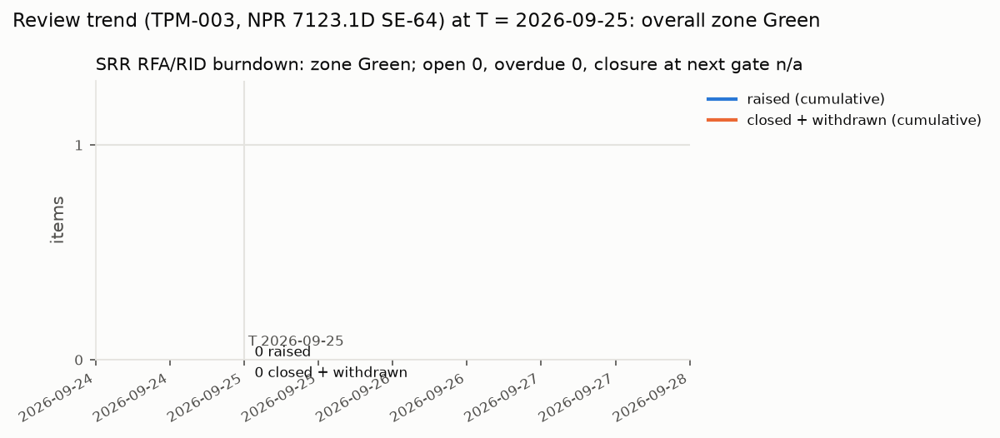

# SRR Review Package

Template: `docs/templates/review-package.md`. Process: `docs/process/01-lifecycle-and-reviews.md`, called "the review process" below. The package is the record of evidence; the deck `docs/reviews/SRR/slides/srr.adoc` is written from it (review process section 3.1 item 4) and must carry no claim this file lacks.

**Current status (read first; supersedes the dated paragraphs below, which are kept as history; lead SE, 2026-09-26, at HEAD `6143047` plus this edit).** Only owner items remain before the readiness declaration: the rulings of section 13.1 (item R1), the owner actions OA-1 and OA-2 (item R2, FW-B0 flash and picotool verify) and the owner's readiness confirmation (row S1); the post-ruling work R16 follows the rulings and precedes the declaration. All Claude and reviewer work that depends on no ruling is done: R20 is Done (route (b); INSP-029 delta re-issue at `0a583b9`), and readiness findings R15b-F1 to F5 are closed or applied. Records: 30 (INSP-001 to INSP-030), 27 APPROVED, 3 NEEDS CHANGES (INSP-003, INSP-011, INSP-016), held only by 5 open Major findings, each waiting on an owner ruling (decisions 30, 106, 47, 108, 109 and 110). Record liens: 122 plus the INSP-011 erratum E-10, all "Lien: fix before PDR". `tools/validate_docs.py` exits 0 (49 passed) and the tool suite passes 400 of 400. The deck of `64e53ee` states the revision 8 final values; the few values the INSP-029 tabulation changed afterwards are read aloud from the section 2.2 table "Read-aloud corrections" at the slide that states them, and the minutes record each one.

**Readiness declaration (revision 8 final, 2026-09-26): it cannot be made yet, and the goal state is not yet reached.** Revision 8 final is the final tabulation of revision 8, read from the 30 records at HEAD `a6e3518`; it changes no product and no slide. Since the revision 8 text below: the INSP-029 re-issue of R19 (b) is done (`a6e3518`, iteration 3, APPROVED with liens finding-3, 5, 6 and 7, readiness met; item 75 closed), the deck update of `8a03bf0` is recorded (section 2.2), and the repeat independent readiness review (R15) ran on revision 8 at HEAD `a6e3518` with verdict NEEDS CHANGES: R15b-F1 (Major: the deck states the revision 8 statuses, which the tabulation changes; a route must be named before the presentation, new item R20) and R15b-F2 (Minor: stale INSP-015 lien and record-status text in decision rows, applied in this revision). 27 of the 30 records are APPROVED and 3 are NEEDS CHANGES, each only on open Major findings that wait on owner rulings (5 in INSP-003, INSP-011 and INSP-016); all 30 records name the HEAD blobs; record liens are 123 plus E-10 (the 122 of revision 8 plus INSP-029 finding-7). The only open item that is neither the owner's nor post-ruling work is R20 (section 2.1). The revision 8 statement follows as history.

**Deck amendment of revision 8 final (2026-09-26): route (b) of R20 is named and in progress.** The lead SE named route (b): the deck author updated the deck to the revision 8 final statuses and committed it at `64e53ee` (section 2.2: 10 PNGs changed, slides 1, 4 to 8, 19, 36, 40 and 42; notes only on slide 9, where INSP-029 finding-7 is fixed); the INSP-029 delta re-issue is in progress, and this package tabulates it next. Until that re-issue `validate_docs.py` exits 1 and `test_repository_exit_zero` fails, only on the record drift rule for the APPROVED INSP-029, which names the `8a03bf0` deck blobs (section 2): the expected state of route (b). This amendment changes no product and no record; it records the deck render and applies the Minor presentation corrections of readiness findings R15b-F2 to F5 (section 15 item 77).

**Revision 8 statement (history).** The goal is a package in which only the owner's rulings (item R1), the owner actions OA-1 and OA-2 (item R2) and the owner's readiness confirmation remain, followed by the post-ruling work R16. Revision 8 is a status update read from the 30 records at HEAD `b4abcc5`; it changes no product. Items R17 and R18 and the INSP-030 part of R19 (b) are done, and they close readiness findings R15-F1 to R15-F3 (section 15 items 67, 68 and 72 to 74). R17: INSP-008 verified the R9 status edit and was re-issued on the 0.4.3-pha hazard blobs (`2aaad2a`). R18: the tool owner replaced the `open_major_findings` line heuristic of `tools/validate_docs.py` with the record state rule and its known-answer tests (`96af250`; TV-003 run 6 and the lock rows at `860e84e`); INSP-002 was re-issued APPROVED with liens finding-19 to 22 (`b08e55d`); INSP-015 verified the tool delta and was re-issued APPROVED with liens F-07, F-08 and F-09 (`b4abcc5`). R19 (b): INSP-030 was re-issued APPROVED with liens finding-1 to 4 (`99ecccb`). Every gate tool now exits 0 (section 2). 26 of the 30 records are APPROVED; the five open Major findings, in INSP-003, INSP-011 and INSP-016, each wait on an owner ruling (section 2.4); record liens are 122 plus E-10 (the 120 of revision 7 plus the two new INSP-015 liens F-08 and F-09). Revision 7 (`8d7eca7`) applied readiness finding R15-F4; revision 6 (`30a6905`) recorded items R6 to R9.

**Plainly (revision 8 final, deck amendment): owner items are not yet the only open items.** Item R20 is on route (b): the deck update of `64e53ee` is done and the INSP-029 delta re-issue is in progress; when the package has tabulated it, the only open items that do not wait on a ruling are the owner's. Revision 8 final text: one piece of lead SE work remains that depends on no ruling: item R20, the route for the deck after readiness finding R15b-F1 (section 2.1). Route (a), recommended by the readiness reviewer, freezes the deck as the revision 8 presentation and uses the section 2.2 block "Status since the deck", which this revision prepares; route (b) updates, re-renders and re-reviews the deck. Items R19 (b) and R15 below are done. The revision 8 list, kept as history:

**Revision 8 (history): owner items are not yet the only open items.** Two pieces of Claude and reviewer work remain that depend on no ruling (section 2.1):

1. **R19 (b), the INSP-029 re-issue: re-issue pending in this run.** Its readiness R1 (the INSP-008 drift) closed with R17 at `2aaad2a`. The INSP-029 reviewer re-issues the record without a further product review and verifies the revision 7 count delta of slides 7, 40 and 42 (`srr.adoc` `3a2bc83c`, `srr.html` `1c02d5a0`). The slides state 120 record liens, which was the revision 7 count; revision 8 counts 122 after INSP-015 F-08 and F-09, and revision 8 changes no slide. INSP-029 iteration 3 is that record's third NEEDS CHANGES, so 08 section 6 rule 1 applies: Claude raises it with the owner in the presentation (X-7); no product change was required.
2. **R15, the repeat independent readiness review.** Run once on revision 6 (R15-F1 to R15-F4; F4 applied by revision 7, F1 to F3 closed by R17, R18 and R19 (b) as recorded in this revision); it is repeated on this revision after the INSP-029 re-issue.

When those two are done, the only open items that do not wait on a ruling are the owner's: the rulings of section 13.1 (R1), OA-1 and OA-2 (R2) and the readiness confirmation (row S1). Item R16 is Claude's and the reviewers' work triggered by the rulings, and it precedes the declaration because Hard rows 14, 15 and 20 close only through it.

This session is therefore a **pre-review session**: the SRR gate review is not convened (review process section 4.2 convenes it only when the Hard rows of sections 3.2 and 4.3 are met), and the minutes record the session as a pre-review session, not as the gate review. What the session can produce is the owner's rulings on the key decisions and the consent agenda of section 13.1, the owner actions of section 2.2, and the adoption or rejection of the candidate RIDs of section 15.

| Field | Value |
|---|---|
| Review | SRR (absorbs MCR; charter section 3) |
| Package revision | Current: 8 final with the lead SE current-status edit (2026-09-26; header current-status paragraph and the section 2.2 read-aloud table; no product, record or slide changed). History: 8 final, deck amendment tabulation (2026-09-26): tabulates the INSP-029 delta re-issue at `0a583b9` (sections 2, 2.1 R19 and R20, 2.2, 2.3, 2.4, 4 rows H3, H17 and S11, 15 items 61 and 76, 20.1 L-6 and 20.2); R20 Done. Deck amendment text: 8 final, deck amendment (2026-09-26): records the route (b) deck render of `64e53ee` for item R20 (header, sections 1, 1.1, 2, 2.1 R20, 2.2, 2.3, 4 rows S11 and 20, 5, 15 items 76 and 77) and applies the Minor presentation corrections of readiness findings R15b-F2 to F5 (decision 114 recommendation and row 20: INSP-015 liens F-07 to F-09; K17 preamble: INSP-002 APPROVED; section 2.3: 200 blob entries; row 20: INSP-014 APPROVED with liens; the header lien parentheticals); the INSP-029 delta re-issue is in progress and is tabulated next. No product content, no record and no slide changed by this amendment. 8 final (2026-09-26): final tabulation of revision 8 from the records at HEAD `a6e3518`: the INSP-029 re-issue (`a6e3518`, APPROVED with liens finding-3, 5, 6, 7) and the `8a03bf0` deck render recorded (header, sections 2, 2.1, 2.2, 2.3, 2.4, 4 rows S3 and S11, 5, 12, 15 items 61 and 75, 20.1, 20.2, 21); the repeat readiness review R15 recorded (items 76 and 77: R15b-F1 Major, open as R20; R15b-F2 Minor, applied in sections 2.2 OA-7, 6.15, 13.1.1 K15 and K17, 13.1.2 decision 1 and 16 SWE-136, and in `decisions-for-owner.md`); record liens 123 plus E-10 (122 plus INSP-029 finding-7); section 2.2 block "Status since the deck" prepared for route (a) of R20. No product content and no slide changed. Revision 8 (2026-09-26): status update from the records at HEAD `b4abcc5`: R17 done (`2aaad2a`), R18 done (`96af250`, `860e84e`, `b08e55d`, `b4abcc5`), the INSP-030 part of R19 (b) done (`99ecccb`), so R15-F1 to R15-F3 are closed; header, sections 2, 2.1, 2.3, 2.4, 4 (rows S3, S11, 4, 10, 12, 14), 5, 6.2, 6.6, 6.9, 12, 15 (items 61, 67, 68, 72 to 75), 16, 20, 20.1, 20.2 and 21 re-stated; rows 4 and 12 and success criterion 4.4-7 re-rated Met; record liens 122 plus E-10 (120 plus INSP-015 F-08 and F-09); the INSP-029 re-issue is pending in this run. No product content changed. Revision 7, committed at `8d7eca7`, applies the repeat independent readiness review of revision 6 (item R15; findings R15-F1 to R15-F4, section 15 items 72 to 75): the `ef6472a` deck render and INSP-029 iteration 3 (`ee200cd`) recorded in the header, sections 1, 1.1, 2, 2.1, 2.2, 2.3, 2.4, 3, 4 (rows S3, S11), 5, 12, 15, 20.1, 20.2 and 21; record liens 120 plus E-10; deck slides 7, 40 and 42 carry the count; tool runs re-stated at HEAD `ee200cd`; R17, R18 and R19 (b) stay open (R15-F1 to F3). No product content changed. Revision 6, committed at `30a6905`, records the Claude and reviewer work since revision 5 (R6: INSP-030; R7: the 16 author self-checks; R8: 17 records re-issued; R9: `hazards.json` 0.4.3-pha); sections 2 to 4, 6, 13.1, 15, 16, 18.1, 20 and 21 re-read from the 30 records at HEAD `5f647f2`; the whole consent agenda re-checked (decision 42 to K1; decisions 73 and 74 to K7); 122 record liens; new items R17 to R19 (section 2.1). Revision 5, committed at `d4cce27`, applied the independent readiness review of revision 4 (findings F-01 to F-06, section 15 items 61 to 66): the deck re-written from revision 4 and its record INSP-029 are recorded (header, sections 1, 1.1, 2, 2.2, 2.3, 2.4, 3 and 4; 29 records); decision 25 moves to key decision K12 with the guard-versus-sideband options, and decision 118 (05 assurance coverage) is added to K17; row S11 re-rated Partially met; the INSP-029 liens join section 20.2 (120 liens); item R12 is done by the commit of this revision. Revision 4 carried the same date and was never committed; revision 3 is at `adcfe09` |
| Package date | 2026-09-26 (the `T` of the review-trend computation, review process section 11) |
| Repository commit | Current: the lead SE current-status edit is committed alone on top of the tabulation commit `6143047` (`git log -1 -- docs/reviews/SRR/package.md` names it); the tabulation itself is `6143047` on top of the INSP-029 re-issue `0a583b9`. History: Deck amendment: written at HEAD `64e53ee` (the route (b) deck commit on top of `5ebe90c`); committed alone (this file only) in one routine CM commit on top of `64e53ee` (05 section 3); the INSP-029 delta re-issue follows it; `git log -1 -- docs/reviews/SRR/package.md` names that commit. Revision 8 final was committed at `5ebe90c`. Revision 8 final text: written at HEAD `a6e3518`, where every product and every record this package cites is committed and all 30 records name the HEAD blobs (section 2.3); committed in one routine CM commit on top of `a6e3518` (05 section 3) together with `decisions-for-owner.md` (R15b-F2 rows); the deck, `rfa-rid-log.json` (still `package_revision` 8), the package figures (no count changed) and the SRR traceability report are not touched; `git log -1 -- docs/reviews/SRR/package.md` names that commit. Revision 8 was committed at `27cc9d9`. Revision 8 text: written at HEAD `b4abcc5`, where every product and every record this package cites is committed (section 4 Commit column; section 2.3). This revision is committed in one routine CM commit on top of `b4abcc5` (05 section 3) together with `rfa-rid-log.json` (revision field) and the package figures that the re-ratings changed (section 2); the deck, `decisions-for-owner.md` and the SRR traceability report are not touched; `git log -1 -- docs/reviews/SRR/package.md` names that commit. Revision 7 was committed at `8d7eca7` |
| Chair, Decision Authority, Technical Authorities | Robin |
| Presenter | Claude (main session) |
| Session type | Pre-review session; the gate review is not convened (review process section 4.2) |
| Slide deck | Current: the `64e53ee` deck (source `adca6f79`, `srr.html` `c80f62d3`, `srr.css` `da8d9463`, 42 slides), verified by the INSP-029 delta re-issue at `0a583b9` (APPROVED with liens finding-3, 5, 6); the values the tabulation changed afterwards are in the section 2.2 read-aloud table. History: Deck amendment (route (b) of R20): `docs/reviews/SRR/slides/srr.adoc`, 42 slides, the revision 8 final deck of `64e53ee` (source `adca6f79` from `bab86a20`, `srr.html` `c80f62d3`, `srr.css` `da8d9463` unchanged; 10 PNGs changed: slides 1, 4 to 8, 19, 36, 40 and 42; notes only on slide 9, whose PNG is byte-identical), brought to the revision 8 final statuses of this package and fixing INSP-029 finding-7 in the slide 9 notes; rendered by the deck author with `tools/slides/render_deck.py` (exit 0, the 10 changed PNGs opened) and reproduced by the package author at `64e53ee` (exit 0, outputs byte-identical); the INSP-029 delta re-issue is in progress (section 2.2). Revision 8 final text: `docs/reviews/SRR/slides/srr.adoc`, 42 slides, the revision 8 deck of `8a03bf0` (source `bab86a20`, `srr.html` `6a5deb8e`, `srr.css` `da8d9463`; 16 PNGs changed: slides 1, 4 to 10, 15, 19, 23, 36, 37, 39, 40, 42; notes only on 11, 16, 33), reviewed by the INSP-029 re-issue at `a6e3518` (APPROVED with liens finding-3, 5, 6, 7; `renders_inspected: 16`); section 2.2. The slides present package revision 8: they state the INSP-029 re-issue as pending, 26 APPROVED records, R15 still to run and 122 record liens, which this final tabulation changes (readiness finding R15b-F1, item R20; the changed values are listed in the section 2.2 block "Status since the deck"). No slide is changed in this revision: a deck edit would change the blobs that the APPROVED record INSP-029 names, so `validate_docs.py` would fail until a further INSP-029 delta pass (route (b) of R20). Revision 8 text: the revision 6 deck of `ef6472a` (source `66ea2de4`, updated from revision 5 on slides 1, 4 to 10, 13, 15, 16, 19 to 21, 27, 32 to 34, 36, 37, 39, 40 and 42; 23 PNGs changed), reviewed by INSP-029 iteration 3 at `ee200cd` (reviewer verdict APPROVED with liens finding-3, 5, 6; no new finding), plus the revision 7 count edit of slides 7, 40 and 42 (122 to 120 record liens; slide 7 INSP-029 lane label and notes; slide 40 notes), committed with this revision (section 2.2). The slides present package revision 6 with the revision 7 lien count; revision 7 changes no other slide claim. The INSP-029 re-issue verifies the count delta (item R19 (b), pending in this run). Revision 8 changes no slide: the slides state 120 record liens against the 122 of revision 8 (INSP-015 F-08, F-09), a count for the INSP-029 re-issue to record |
| Independent reviewer records | Current: 30 records, 27 APPROVED, 3 NEEDS CHANGES (INSP-003, 011, 016) held only by 5 open Majors that wait on owner rulings; all 30 name the HEAD blobs; 122 record liens plus E-10. History: Revision 8 final: 30 records (INSP-001 to INSP-030) in `docs/reviews/SRR/checklists/`: 27 APPROVED, 3 NEEDS CHANGES (INSP-003, 011, 016), each held only by its open Major findings (5 in all), each waiting on an owner ruling; INSP-029 re-issued APPROVED at `a6e3518` (R19 (b) done); all 30 records name the HEAD blobs at `a6e3518` (deck amendment: at `64e53ee` INSP-029 names the `8a03bf0` deck blobs until its delta re-issue, in progress; the other 29 name the HEAD blobs); 123 Minor findings dispositioned "Lien: fix before PDR" plus the INSP-011 erratum E-10 (section 2.4). Revision 8 text: 26 APPROVED, 4 NEEDS CHANGES (INSP-003, 011, 016, 029); 5 open Major findings in 3 records (INSP-003, INSP-011, INSP-016), each waiting on an owner ruling; INSP-029 is held only by its re-issue (item R19 (b), re-issue pending in this run); 122 Minor findings dispositioned "Lien: fix before PDR" plus the INSP-011 erratum E-10 (section 2.4) |
| Prior review | None (first gate) |

## 1. Agenda

The session is presented slide by slide in this order (review process section 3.4). The slide numbers are those of the deck `docs/reviews/SRR/slides/srr.adoc` (42 slides, section 2.2; mapping of INSP-029 cross item X-1), unchanged since revision 5: the update of `ef6472a`, the revision 7 count edit, the revision 8 update of `8a03bf0` and the route (b) update of `64e53ee` kept them; a later deck change keeps them, or updates this table and section 1.1 in the same change. The deck opens with the owner actions OA-1 and OA-2 (FW-B0 flash and picotool verify, slide 3) and presents the other owner actions on slide 41, next to the requested disposition; items 10 and 11 share slide 36.

| # | Item | Package section | Slides | Presenter | Chair decision needed |
|---|---|---|---|---|---|
| 1 | Title, agenda, purpose and scope | 1 | 1, 2, 4 | Claude | Confirm agenda |
| 2 | Readiness status, roles and entrance checklist | 2, 3, 4 | 5 to 9 | Claude | Note (declaration blocked) |
| 3 | Changes since the last review | 5 | none (first gate; slide 36 states it) | Claude | Note (none; first gate) |
| 4 | Product summaries and figures | 6, 7 | 10 to 13 | Claude | Questions, RIDs, RFAs |
| 5 | Requirements and traceability status | 8 | 14, 15 | Claude | Questions, RIDs, RFAs |
| 6 | Hazards and safety | 9 | 16 | Claude | Questions, RIDs, RFAs |
| 7 | TPM, margins, risks | 10, 11 | 17, 18 | Claude | Approve Red risk plans; accept residual risk (key decision K4) |
| 8 | Milestone and procurement status | 12 | 19 | Claude | Note |
| 9 | TBD/TBR list, key decisions and consent agenda | 13 | 20 to 35 | Claude | Rule the key decisions; adopt the consent agenda or name exceptions; owner actions |
| 10 | Prior RFA/RID trend | 14 | 36 | Claude | Note (none) |
| 11 | Candidate RIDs from the review records | 15 | 36 | Claude | Adopt as RID / RFA / No action |
| 12 | Software status | 16 | 37 | Claude | Note SA findings |
| 13 | Proposed tailoring, compliance summary, lessons learned | 17, 18, 19 | 38 | Claude | Approve rows (key decision K3 and consent) |
| 14 | Success criteria self-assessment and proposed liens | 20 | 39, 40 | Claude | Note (ruled at the gate review) |
| 15 | Requested disposition | 21 | 42 (owner actions 41) | Robin | None at this session (pre-review) |

Success criteria for this gate are in review process section 4.4, plus section 3.3. Purpose of the gate (review process section 4.1): confirm that the functional and performance requirements respond to the owner's expectations (NGOs, MOEs, ConOps) and can be achieved within the project's means, that the concept is feasible, and that the plans are sufficient to begin preliminary design; the SRR also serves as the MCR.

### 1.1 Slide map (charter section 4 item 2 minimum slide set)

| # | Minimum slide (charter section 4 item 2) | Package section(s) | Slide number(s), deck at `64e53ee` (numbering unchanged since `8a03bf0`) |
|---|---|---|---|
| 1 | Title and agenda | 1 | 1, 2 |
| 2 | Purpose, scope and entrance-criteria status | 1, 2, 4 | 4 to 9 (opening action 3) |
| 3 | Products with evidence links and counts | 6, 7 | 10 to 13 |
| 4 | Requirements and traceability status | 8 | 14, 15 |
| 5 | Hazards and safety | 9 | 16 |
| 6 | Risks and TPMs | 10, 11 (milestones 12) | 17, 18 (milestones 19) |
| 7 | TBD/TBR and open decisions with recommendations | 13 | 20 to 35 |
| 8 | RFA/RID trend from prior reviews | 14 (candidate RIDs 15) | 36 (candidate RIDs on the same slide) |
| 9 | Proposed tailoring and liens | 16, 17, 20 | 37 (software), 38 (tailoring), 39 (success criteria), 40 (liens) |
| 10 | Requested disposition | 20.1, 21 | 42 (owner actions 41) |

## 2. Readiness declaration

Tool runs of revision 8 final, 2026-09-26, at HEAD `a6e3518` with this revision in the working tree (repository root, `.venv/bin/python`); the same results were obtained at `a6e3518` before the edit, and by the INSP-029 re-issue and the R15 readiness review at `8a03bf0` and `a6e3518`. Deck amendment: `validate_docs.py`, the unit tests and `render_deck.py` were re-run by the package author at HEAD `64e53ee` with the amendment in the working tree (results in the rows below); the other tools read no deck file and were not re-run:

| Command | Exit | Result |
|---|---|---|
| `tools/validate_docs.py` | 0 at `0a583b9`; 1 at `64e53ee`; 0 at `a6e3518` | Deck amendment tabulation, at HEAD `0a583b9` with this tabulation in the working tree: exit 0, 49 passed, 0 failed, no drift note (INSP-029 names the HEAD deck blobs since its delta re-issue); the unit tests pass 400 of 400. Deck amendment, at `64e53ee`: exit 1, 48 passed, 1 failed: INSP-029 (`checklists/srr-deck.md`, APPROVED) names `srr.adoc` `bab86a20` and `srr.html` `6a5deb8e` against the HEAD blobs `adca6f79` and `c80f62d3` (record drift rule); no other failure and no other drift. This is the expected state of route (b) of R20 and closes with the INSP-029 delta re-issue (in progress). Revision 8 final, at `a6e3518`: 49 passed, 0 failed, no drift note: since the re-issue at `a6e3518` INSP-029 names the HEAD deck blobs (`srr.adoc` `bab86a20`, `srr.html` `6a5deb8e`, `srr.css` `da8d9463`). The INSP-008 drift is gone since `2aaad2a` (R17), and the record state rule of `96af250` passes INSP-002 at APPROVED (R18). A deck edit now would fail the record drift rule for the APPROVED INSP-029 (section 2.3), which is why no slide changes in this revision (R20) |
| `tools/traceability.py --report-only` | 0 | 238 requirements, 170 test cases, 0 violations, 3 warnings: `SYS_UNALLOCATED` REQ-SYS-125 and REQ-SYS-148 (T-18, Warning at SRR), `HAZARD_INVERSE` REQ-SW-KEYER-039 not in HZ-004 `requirement_ids` (INSP-026 finding-5, a lien); the run rewrote `docs/vv/traceability-report.md` and `docs/vv/traceability.json`, which are outside this package's scope and were restored with `git checkout` (section 15 item 66, lien L-5) |
| `tools/traceability.py --render --output docs/reviews/SRR/traceability-report.md` | 0 | frozen SRR report and `traceability.json` re-run 2026-09-26 at `b4abcc5` (revision 8; not re-run in revision 8 final, which changes no requirement, case or hazard): byte-identical to the committed copies, and the `--render` pass left every committed `expectations.md` and `requirements.md` unchanged (`git status` clean apart from this file); PASS, 0 violations, 3 warnings |
| `tools/render_risk.py --check --gate SRR --hazards docs/safety/hazards.json` | 0 | 65 risks, 159 candidates, 0 warnings, hazard cross-check passes on `hazards.json` 0.4.3-pha; `register.md` current |
| `tools/render_rmm.py --check` | 0 | 100 rows; FC 75, T 17, NA 8; In place 39; `rmm.md` current |
| `tools/render_compliance.py --check` | 0 | 62 rows; FC 49, T 4, NA 9; rendered file current |
| `python -m unittest discover -s tools/tests` | 1 at `64e53ee`; 0 at `a6e3518` | Deck amendment, at `64e53ee`: 400 tests, 399 pass; the one failure is `test_validate_docs.RepositoryTests.test_repository_exit_zero`, on the same INSP-029 drift. Revision 8 final: 400 tests, all pass at `a6e3518` (the record state rule of `96af250` added 8 known-answer tests; `test_validate_docs.RepositoryTests.test_repository_exit_zero` passes since R17) |
| `tools/render_review_figures.py --review SRR` | 0 | Revision 8 final: `--check` only, exit 0, nothing written (no entrance or success rating changes; S11 stays Partially met on R15b-F1). Revision 8: 7 figures written from that revision (section 7): the entrance and success boards change with the re-ratings of rows 4 and 12 and criterion 4.4-7 and were opened; `--check` exit 0: entrance Not met 4, Partially met 11, Met 24; success Not met 4, Partially met 4, Met 10; `hazards.json` 0.4.3-pha |
| `tools/slides/render_deck.py docs/reviews/SRR/slides/srr.adoc` | 0 (deck author, `64e53ee`; package author, reproduction at `64e53ee`) | Deck amendment: run by the deck author on `adca6f79` (exit 0; 10 PNGs changed and opened; section 2.2) and reproduced by the package author at HEAD `64e53ee`: exit 0, 42 PNGs and `srr.html` with 42 `<section>` elements, `git status` clean after the run (outputs byte-identical to the commit). Revision 8 final: run by the deck author on `bab86a20` for the revision 8 update: exit 0, 16 PNGs changed and opened, the slide 6 wrap fixed and re-rendered (section 2.2); not run by the package author in revision 8 final, which changes no slide (R20) |
| `tools/review_trend.py --date 2026-09-26` | 0 | log empty: zone Green; `--write` not run because it also writes `docs/plan/tpm.json` (outside this scope) and the log did not change |

Every gate tool exits 0 at `a6e3518` (revision 8 final) as at `b4abcc5`: the INSP-008 drift that held `validate_docs.py` and `test_repository_exit_zero` at revision 7 closed with R17 (`2aaad2a`). No product or record content is wrong. The tools behind these runs have TV records TV-001 to TV-013. INSP-015 is APPROVED with liens F-07, F-08 and F-09 at iteration 3 (F-02 Closed; re-issued at `b4abcc5` after its delta verification of the record state rule), so the accreditation of TV-001 to TV-010 can be recorded (decision 114, owner action OA-7); at `64e53ee` (deck amendment) `validate_docs.py` and `test_repository_exit_zero` fail only on the INSP-029 drift that route (b) of R20 creates until the delta re-issue; TV-011 to TV-013 (the three gate scripts) are Validated and not yet accredited. Until then the runs are developer evidence, and rows S4, 8 and 24 carry the dagger of the entrance figure.

**Status of the readiness items H1 to H17** (deck amendment: H3 open on the INSP-029 delta re-issue of R20, H17 re-opened for INSP-029 until that re-issue; revision 8 final: H1 (b) done, H3 open on R20 only, H17 Closed; the other rows as revision 8) (the Hard shortfalls and items due before the declaration listed in revision 2; none may be a lien, review process section 12.2). "Closed" means the product evidence exists at the named commit and no open Major finding remains against it.

| # | Criterion or product | Revision 8 status | Evidence (path, commit) | What remains, and owner |
|---|---|---|---|---|
| H1 | S3; minimum products SE-35 to SE-39, SE-66 | **Open** on owner rulings only | 30 records INSP-001 to INSP-030 (section 2.4): 27 APPROVED (revision 8 final; INSP-029 re-issued APPROVED at `a6e3518`); the 16 author self-checks filed (`a010038`, `5b1f2cf`, `ca22e37`, `8ef95d3`, `1af795c`) and 17 records re-issued (`fdd3391`, `119cb36`, `c7aa3a3`, `09d48be`, `5f647f2`); INSP-030 filed (`898d582`); R17 done (INSP-008, `2aaad2a`); R18 done (`96af250`, `860e84e`; INSP-002 `b08e55d`; INSP-015 `b4abcc5`); INSP-030 re-issued APPROVED (`99ecccb`) | (a) **5 open Major findings**, each closing on an owner ruling: INSP-003 finding-6 (decision 30), INSP-011 F-01 (decision 106) and F-04 (decision 47), INSP-016 F-01 (decisions 109 and 110, OA-1, then item R16) and F-02 (decision 108). (b) done: INSP-029 re-issued without a further product review, APPROVED with liens finding-3, 5, 6, 7 (`a6e3518`, R19 (b)). (c) INSP-016 readiness R3 (decision 115 (b)). Owners: Robin (rulings), reviewer invocations |
| H2 | SE-39: two retirements | **Closed** | INSP-003 finding-10 and finding-11 Verified; `docs/requirements/sys/requirements.json` | none |
| H3 | S11 review deck | **Closed** (deck amendment tabulation: R20 Done) | Deck amendment tabulation: INSP-029 delta re-issue at `0a583b9` on the `64e53ee` deck blobs, APPROVED with liens finding-3, 5, 6, finding-7 Verified, `renders_inspected: 10`, readiness met (section 2.2). Deck amendment: the revision 8 final deck of `64e53ee` (`srr.adoc` `adca6f79`, `srr.html` `c80f62d3`, 10 changed PNGs opened by the deck author; section 2.2). Revision 8 final: the revision 8 deck of `8a03bf0` (`srr.adoc` `bab86a20`, `srr.html` `6a5deb8e`, 16 changed PNGs opened by the deck author) and the INSP-029 re-issue at `a6e3518`: APPROVED with liens finding-3, 5, 6, 7, readiness met, `renders_inspected: 16`, finding-1, 2 and 4 Verified. Readiness finding R15b-F1 (Major): the deck states revision 8 statuses that this tabulation changes; the lead SE names route (a) or (b) (R20). Revision 8 text: `docs/reviews/SRR/slides/srr.adoc`, `srr.html` and 42 PNGs: the revision 6 deck of `ef6472a` (source `66ea2de4`) and the revision 7 count edit of slides 7, 40 and 42 (section 2.2); INSP-029 iteration 3 (`ee200cd`): no new finding, finding-1, 2 and 4 Verified, reviewer verdict APPROVED with liens finding-3, 5, 6 | Deck amendment: the deck step of route (b) is done (`64e53ee`); what remains is the INSP-029 delta re-issue (in progress; owner: the INSP-029 reviewer invocation) and its tabulation in this package. Revision 8 final: R19 (b) done (`a6e3518`); what remains is R20, the deck route of R15b-F1 (owner: Claude as lead SE; under route (b) also the deck author and the INSP-029 reviewer). Revision 8 text: readiness R2 and R4 of INSP-029 are answered by the section 2.2 block (X-6); readiness R1 closed with R17 at `2aaad2a`. The INSP-029 reviewer re-issues the record without a further product review and verifies the count delta (R19 (b); re-issue pending in this run); third NEEDS CHANGES, raised with the owner (X-7). Owner: reviewer invocation |
| H4 | Row 1; SE-35 stakeholders | **Closed** except the owner confirmation | `stakeholders` array, 10 entries (`expectations.json`); T-21 passing | Robin confirms the representation rule of 02 section 3.0 (consent decision 103) |
| H5 | Row 5 concept-level trade study | **Open** on owner rulings only | TS-001 (`e597e49`): INSP-013 **APPROVED** with liens on the committed blob `2a0c40a8`, re-issued at `fdd3391` (TS-001 needs no assurance record, 07 section 2.1.1 trade-study row) | ADR part: INSP-011 F-01 (decision 106, R-2) and F-04 (decision 47, K16); INSP-011 readiness met at `fdd3391` |
| H6 | Row 7; T-18 allocation; ConOps appendix D | **Closed** except items closing on rulings | `docs/design/allocation.json` validates; T-18 2 warnings (REQ-SYS-125, 148) confirmed by INSP-003 V6; appendix D: D1 to D4, D8, D16 Closed; D6 and D10 L1 parts verified by INSP-003 iteration 3 and hazard parts by INSP-008 iteration 3 | D5, D7 and D18 close with decisions 36 and 37 (K1); the Minor D items are liens (INSP-002 lien table; section 20.1) |
| H7 | Row 14 SRR-due hazard questions | **Open** on owner rulings and one post-ruling edit | `docs/safety/hazards.json` 0.4.3-pha (`ade0e09`): of 19 questions due at SRR, 9 Closed, 1 Answered (022), 9 Open (section 18.1); OQ-SAF-007, 025 and 026 set Closed by the hazard analysis author (R9 done) | 8 Open questions close on rulings: OQ-SAF-001, 002 (decision 37), 003 (38), 005 (36), 012 (39), 013 (40), 014 (9), 016 (41). OQ-SAF-006: the ConOps author edits OPS-013 after decisions 37, 38 and 41 (R16), or it is re-dated under decision 116. OQ-SAF-022 stays Answered (editorial, 07 author, lien). INSP-008 verified the R9 edit and names the 0.4.3-pha blobs since `2aaad2a` (R17 done) |
| H8 | Row 15 single point failures 3, 4, 8 | **Closed** on the product side | REQ-SYS-180, 181, 182 traced as HZ-004 K12, HZ-003 K9, HZ-008 K7; INSP-008 APPROVED | Robin rules decisions 38 to 40 (K2) |
| H9 | S7 risk check and SRR steps | **Closed** | `render_risk.py --check --gate SRR --hazards` exit 0 (register 0.6.0-pre-srr); INSP-007 APPROVED with liens | The three SRR steps (RSK-028 S2, RSK-030 S1, RSK-046 S1) close with the SRR memo (decisions 17, 32, 40, 9) |
| H10 | S9 figures | **Closed** | the seven package figures re-rendered from this revision by `tools/render_review_figures.py` (blob `6f3018fd`) and opened (section 7); risk matrix and concept block diagram unchanged | Tool validation of `risk-matrix.py` and `concept-block-diagram.py` (section 15 item 38, lien) |
| H11 | Row 17 external ICD stubs | **Closed** | five ICD stubs (`e597e49`, REQ-TX pairing `cb00792`); INSP-012 APPROVED with liens (finding-1 CTL and PWR residual, finding-10, finding-11) at iteration 3 | none before the declaration; the liens are due at PDR with the CTL and PWR L2 files (section 20.1) |
| H12 | Row 20 toolchain proof; SWE-136 | **Open** on owner rulings, OA-1 and the work that follows them | `tools/toolchain.lock.md`; TV-001 to TV-013; INSP-015 APPROVED (F-02 Closed; re-issued at `b4abcc5` with liens F-07 to F-09); INSP-014 F-02 Closed at `4fe6f28`; `docs/vv/reports/TC-SW-TOOL-001-r2.md` (Blocked: gate exit 1, 2 FAIL, 5 MISSING); INSP-028 APPROVED (the independent review of the two FW-B0 test files, R4) | INSP-016 F-01 (Major): decisions 109 and 110, then Claude installs the approved toolchains, records the lock sanity checks, applies the rustos SAFETY-comment work item for the 36 unsafe sites, re-runs `tools/sw_gate.sh` to exit 0 and files run 3 with OA-1 (R16). INSP-016 F-02 (Major): decision 108. INSP-016 readiness R3 (design unit Active) is inherent before CDR: decision 115 (b). Accreditation: decision 114 (OA-7) |
| H13 | Row 22 classification | **Closed** for content | 03 re-transcribed from `hazards.json` with its hash; INSP-009 and INSP-017 APPROVED with liens at iteration 3; 0.4.3-pha changed no `firmware_role` or `swe134_items` (INSP-010 re-issue check) | Robin concurs (decision 9, K2); if frequency control is declined, 03 is re-transcribed without it |
| H14 | Row 23; SWE-033 | **Open** on one ruling | 07 (`d0f8baf6`): INSP-010 and INSP-018 **APPROVED** with liens (`09d48be`); TS-002 (`574cee3d`): INSP-013 **APPROVED** with `paired_record: INSP-027` (`fdd3391`) and INSP-027 APPROVED with liens; `measurements.schema.json` present | Robin approves A0 (decision 107, K9) |
| H15 | Row 25; SWE-050 | **Open** on rulings only | TX (16) and SW-KEYER (39) requirements with 16 TC-TX and 43 TC-SW-KEYER Draft cases; INSP-004 **APPROVED** with liens and `paired_record: INSP-026` (`5f647f2`; delta of SW-KEYER `requirements.json` `4d22b399` and `test_cases.json` `d3c0c236` verified); INSP-026 **APPROVED** with liens | Robin rules decisions 104, 112 (including REQ-SW-KEYER-039) and 30 (including REQ-TX-001, 005, 006) |
| H16 | Items due before the declaration | **Closed** except two rulings | 02 section 14 statuses; `docs/plan/measurements.json` with schema | Decisions 10 and 103 (consent); the superseding `measurements.json` records are INSP-010 finding-15 (lien) |
| H17 | Evidence commit hashes | **Closed** (deck amendment tabulation; Open for INSP-029 only at the deck amendment) | Deck amendment tabulation: at `0a583b9` all 30 records name the HEAD blobs; `validate_docs.py` exit 0, no drift note (section 2.3). Deck amendment: at `64e53ee` 29 of 30 records name the HEAD blobs; INSP-029 names `srr.adoc` `bab86a20` and `srr.html` `6a5deb8e` of `8a03bf0` (section 2.3). Revision 8 final: at `a6e3518` all 30 records name the committed blobs of every product file they list (200 blob entries: 195 `product_files` entries and 5 `product_blob` fields; section 2.3), INSP-029 among them since its re-issue. Revision 8 text: products, records, deck and figures committed; at `b4abcc5` 29 of 30 records name the committed blobs (section 2.3), INSP-008 (since `2aaad2a`) and INSP-015 (since `b4abcc5`) among them | The INSP-029 delta re-issue on the `64e53ee` blobs (R20, in progress) closes the row again. Revision 8 final: none; any later deck edit (route (b) of R20) re-opens this row until INSP-029 verifies the delta. Revision 8 text: INSP-029 differed from HEAD by the revision 7 count edit of slides 7, 40 and 42 until its re-issue verified that delta (R19 (b)) |

- Soft entrance criteria not met and proposed as liens (each becomes a Routine RFA raised by the owner at the readiness confirmation, review process section 3.1 item 5): S8 (TPM-001 and TPM-016 have no estimate at SRR) and S10 (`docs/lessons-learned.md` does not exist). Section 20.1 gives owner, plan and due event.
- Owner confirmation (transcribed verbatim): not given; the declaration is blocked.

### 2.1 What remains before the declaration (the complete list)

| # | Item | Closes | Owner | Revision 8 state |
|---|---|---|---|---|
| R1 | Rule the key decisions K1 (36, 37, 41, 42), K2 (38, 39, 40, 9, 33), K7 (70, 72, 73, 74, 75, 76, 85), K9 (107, 110), K10 (108, 109), K11 (105, 106, 111), K12 (30, 113, 29, 25), K14 (104, 112), K15 (114), K16 (47) and K17 (115 (b); 115 (a) and 118 need no ruling after R6 and R7), and the rest of section 13.1 | H5, H7, H8, H12 to H15; rows 5, 7, 8, 14, 15, 20, 22, 23, 25; the five open Major findings | Robin | Open (owner) |
| R2 | FW-B0 steps 11 and 12 on the bare Pico 2 and the picotool verify known answer (OA-1, OA-2) | Row 20 owner part | Robin, with Claude running every command | Open (owner) |
| R3 | Gate scripts `tools/unsafe_audit.py`, `tools/complexity_gate.py`, `tools/measurements.py` with known-answer tests | INSP-016 finding-1 (script part) | Claude | Done (TV-011 to TV-013; run 2 Blocked); the rest of F-01 is R16 |
| R4 | Independent test-author review of the two FW-B0 test files | INSP-016 F-04 | Test-author invocation | Done: INSP-028 APPROVED with liens finding-1 to finding-4; the INSP-016 reviewer closes F-04 at its next iteration |
| R5 | Re-run section 3 of TV-001 to TV-010 on their commit | INSP-015 F-02 | Claude | Done: INSP-015 APPROVED at iteration 3 |
| R6 | File the missing paired software assurance record for 05 (07 section 2.1.1; 07 section 22 row "Assurance routing of 05 and TS-002"; INSP-006 X-2) | S3, row 12 | Claude dispatches; assurance invocation | **Done**: INSP-030, `checklists/cm-plan-05-software-assurance.md` (`898d582`), assurance verdict APPROVED with liens finding-1 to 4, 0 Major; INSP-006 re-issued APPROVED with `paired_record: INSP-030` (`09d48be`); decision 118 route (b) is not needed. The INSP-030 record's own re-issue (R19 (b)) is done at `99ecccb` |
| R7 | Author self-checks for INSP-001, 002, 003, 004, 006, 010, 011, 014, 018, 019, 020, 021, 022, 023, 024 and 026 | Readiness R3 or R4 of those records | Named authors (Claude) | **Done**: `a010038` (INSP-011), `5b1f2cf` (002, 014, 023), `ca22e37` (019, 020, 021, 022, 024), `8ef95d3` (006, 010, 018), `1af795c` (001, 003, 004, 026); each of the 16 records now reads `readiness_met: true`; decision 115 (a) asks for no waiver |
| R8 | Re-issue without a further product review: the 16 records R7 releases, INSP-013 (TS-002 pairing met by INSP-027), INSP-004 (pairing met by INSP-026, delta of SW-KEYER `requirements.json` `4d22b399` and `test_cases.json` `d3c0c236`), INSP-003 (delta of TC-SYS `test_cases.json` `de113d6a`), INSP-029 (iteration 3) | S3, S11; rows 1 to 5, 7, 10, 12, 19, 23 to 26; H3, H17 | Reviewer invocations; Claude (software lead) sets the paired verdicts (07 section 10.2) | **Done for 17 records**: `fdd3391` (INSP-011, 013), `119cb36` (019, 020, 021, 022, 024), `c7aa3a3` (002, 014, 023), `09d48be` (006, 010, 018), `5f647f2` (001, 003, 004, 026). 14 re-issued APPROVED; INSP-003 and INSP-011 NEEDS CHANGES on their open Major findings only; INSP-002 NEEDS CHANGES on a tool condition only (R18). Deltas verified with no new Major: TC-SYS `de113d6a`, SW-KEYER `4d22b399` and `d3c0c236`. New Minor liens: INSP-001 finding-13, INSP-004 finding-20, INSP-026 finding-7. INSP-029 iteration 3 moves to R19 |
| R9 | Hazard statuses: OQ-SAF-007, 025 and 026 to Closed (verified by INSP-008 iteration 3) | H7 | Hazard analysis author | **Done** at `ade0e09` (`hazards.json` and `hazard-analysis.md` 0.4.3-pha, status edit only); the INSP-008 drift it caused closed with R17 (`2aaad2a`) |
| R10 | Re-write, render, inspect and review the deck | H3, S11 | Claude; reviewer | Done for revision 5 (INSP-029 iteration 2, reviewer verdict APPROVED with liens); the revision 6 update is R19 (a), done at `ef6472a` with INSP-029 iteration 3 at `ee200cd` |
| R11 | Fix the SRR figure set of `tools/render_review_figures.py` | H10, S9 | Tool owner | Done (blob `6f3018fd`) |
| R12 | Commit the iteration 3 records, the new records, the deck, the figures and the package | H17 | Claude, as routine CM records under 05 sections 3 and 4.5 (no owner action) | Done at `d4cce27`; each later closure product is committed by its author, and this revision by its own commit |
| R13 | Delta verification of INSP-005 and INSP-013 against the committed files; record drift rule | Row 9, H5, H17 | Reviewer invocations; tool owner | Done |
| R14 | ConOps appendix D statuses; verification of D4, D6 and D10 | H6 | ConOps author; L1 and hazard reviewers | Done (INSP-003 and INSP-008 iteration 3) |
| R15 | Repeat the independent readiness review after R17 to R19 | Readiness to present the package | Reviewer invocation | Run once on revision 6 (2026-09-26, HEAD `ee200cd`): findings R15-F1 to R15-F4, all Major (section 15 items 72 to 75); F4 applied in revision 7; F1 closed by R17 (`2aaad2a`), F2 by R18 (`96af250`, `860e84e`, `b08e55d`, `b4abcc5`), F3 by the INSP-030 re-issue (`99ecccb`). **Open**: the repeat on this revision, after the INSP-029 re-issue. **Revision 8 final: Done.** The repeat ran on revision 8 at HEAD `a6e3518` (2026-09-26, after the INSP-029 re-issue): verdict NEEDS CHANGES, owner ruling needed: none. R15b-F1 (Major, section 15 item 76): the deck states revision 8 statuses that the final tabulation changes, so a route must be named before the presentation; carried as R20, never a lien. R15b-F2 (Minor, item 77): stale INSP-015 lien and record-status text in decision rows; applied in this revision. Tool evidence of that run, all exit 0 at `a6e3518`: `validate_docs.py` 49 passed, no drift note; 400 of 400 tests; `render_risk.py --check --gate SRR --hazards`; `traceability.py --report-only` (238, 170, 0 violations, 3 warnings; `docs/vv` outputs restored); `render_rmm.py`, `render_compliance.py` and `render_review_figures.py --check`; `review_trend.py` |
| R16 | Work that follows the rulings: (a) after decisions 109 and 110: toolchain installs, lock sanity checks, the rustos SAFETY-comment work item, `tools/sw_gate.sh` exit 0, run 3 with OA-1, INSP-016 iteration 4; (b) after the other rulings: requirement edits (for example REQ-SYS-054 after decision 37, the guard edits after decision 25, retirements after a declined 38, 39, 40 or 112), ConOps edits (OPS-013 for OQ-SAF-006; the section 3.4 bench-test limit after decisions 41 and 42), ADR status edits (ADR-026 and ADR-010 after decision 47; ADR-015, 022, 023), rationales dropping "owner decision pending", each verified by the owning reviewer | H7, H12, rows 14, 20 | Claude (authors), reviewers | Waits on R1 and R2 |
| R17 | **New in revision 6.** INSP-008 delta verification of the R9 status edit `1543c9f..ade0e09` (OQ-SAF-007, 025, 026 statuses, the 0.4.3-pha version line and history entry; no hazard, control or level change) and re-issue naming `hazards.json` `c6bf757e` and `hazard-analysis.md` `49ec53f8` | `validate_docs.py` exit 0 and the tool test; H17; row 14 | INSP-008 reviewer invocation | **Done** at `2aaad2a`: the structural diff shows only the version field and the status and resolution of OQ-SAF-007, 025 and 026; no new finding; APPROVED with liens finding-14, 15, 16 on `hazard-analysis.md` `49ec53f8` and `hazards.json` `c6bf757e` (product commit `ade0e09`). At `b4abcc5` `validate_docs.py` exits 0 and 400 of 400 tests pass (R15-F1 and items 67, 72 closed) |
| R18 | **New in revision 6.** `tools/validate_docs.py` `open_major_findings` (line 664) counts any line with a `finding-<n>` anchor and the words Major and Open as an open Major finding, so four historical count lines of INSP-002 (for example "open Major 0") hold its record verdict: the tool owner narrows the heuristic with a known-answer test in `tools/tests/test_validate_docs.py` (the INSP-002 reviewer declined to reword record history; INSP-021 reworded two of its own lines), or the lead SE rules the record-text route; then the INSP-002 reviewer re-issues the record APPROVED without a further review | Row 4 and row 10 (record part); S3 | Claude (tool owner, lead SE); INSP-002 reviewer invocation | **Done**: the tool route. `96af250` replaces the line heuristic with the record state rule (finding-table rows of the latest iteration section, the severity and state cells), with `RecordStateTests` and the fixture `tools/tests/fixtures/record_state/`; TV-003 run 6 and the lock rows at `860e84e`. INSP-002 re-issued APPROVED with liens finding-19 to 22 at `b08e55d`. INSP-015 verified the tool delta and was re-issued APPROVED at `b4abcc5` with two new Minor liens, F-08 (the tool header says "last" where the code takes the first heading naming the latest iteration) and F-09 (a finding table placed before that heading is not read; INSP-028 and INSP-029 have that layout, with no wrong result today), both "Lien: fix before PDR" under the convergence rule (R15-F2 and items 68, 73 closed) |
| R19 | **New in revision 6.** (a) The deck author updates the revision 5 deck to this revision (header row "Slide deck" lists the stale slides), renders and inspects every changed PNG; the INSP-029 reviewer runs iteration 3 on the committed blobs. (b) The INSP-030 reviewer re-issues INSP-030 without a further review: its only hold is readiness R3, answered by the 05 author self-check at `8ef95d3` (INSP-006 cross item X-5) | H3, S11; row 12 (INSP-030 record verdict); S3 | Claude (deck author); INSP-029 and INSP-030 reviewer invocations | (a) **Done**: deck updated at `ef6472a` (23 PNGs changed, all opened by the deck author); INSP-029 iteration 3 at `ee200cd`, reviewer verdict APPROVED with liens finding-3, 5, 6, no new finding; the render is recorded in section 2.2 (X-6) and the count edit of slides 7, 40 and 42 made in revision 7 (X-5). (b) INSP-030: **Done** at `99ecccb`, iteration 2, readiness R3 met by the self-check at `8ef95d3`, APPROVED with liens finding-1 to 4 (R15-F3 and item 74 closed). INSP-029: **re-issue pending in this run** (readiness R1 met by R17; verification of the count delta, item 75); INSP-029 is at its third NEEDS CHANGES (08 section 6 rule 1; X-7). **Revision 8 final:** INSP-029 **Done** at `a6e3518` (on top of the deck update `8a03bf0`): iteration 3 re-issue with no further product review, `product_commit` `8a03bf0`, `product_files` `srr.adoc` `bab86a20`, `srr.html` `6a5deb8e`, `srr.css` `da8d9463` (the HEAD blobs), `renders_inspected: 16`, `readiness_met: true`, verdict APPROVED with liens finding-3, 5, 6 and 7 (finding-7 new, Minor, CK-VIS-B7: the slide 9 notes place S3 and row 20 among the Partially met rows, which section 4 rates Not met); findings Major 1, Minor 6, open 0, Verified 3, deferred 4; effort 142 turns, 180 minutes; `record_status` Open (liens due PDR). The revision 7 count delta and the revision 8 update are verified on the committed blobs (item 75 closed). The third NEEDS CHANGES ended at APPROVED without a product change; Claude still tells the owner in the presentation (X-7). **Deck amendment tabulation:** the INSP-029 delta re-issue at `0a583b9` (item R20) Verified finding-7, so INSP-029 carries liens finding-3, 5 and 6 |
| R20 | **New in revision 8 final (readiness finding R15b-F1, Major).** Name and carry out the route for the deck, whose slides present package revision 8 (INSP-029 re-issue pending, 26 APPROVED records, R15 to run, 122 record liens; slides 1, 4 to 9, 19, 36, 40 and 42 and their notes) against the final tabulation. Route (a), recommended by the readiness reviewer (no product change, no further INSP-029 pass): freeze the deck as the revision 8 presentation; the section 2.2 block "Status since the deck" lists each changed value; Claude reads each delta aloud at the slide that states it, and the minutes record it. Route (b): the deck author updates the deck to the tabulated revision, re-renders and opens the changed PNGs, and the INSP-029 reviewer verifies the delta (the record drift rule fails `validate_docs.py` for the APPROVED INSP-029 from the deck commit until that pass). The route is named in this row before the presentation | H3, S11; charter section 4 item 2 (the deck cites the package) | Claude (lead SE, convergence rule, charter section 4 item 3); route (b) also the deck author and the INSP-029 reviewer | **Done (deck amendment tabulation, route (b)).** INSP-029 delta re-issue at `0a583b9` (iteration 3, `product_commit` `0674b08`; `product_files` `srr.adoc` `adca6f79`, `srr.html` `c80f62d3`, `srr.css` `da8d9463`, the HEAD blobs; `renders_inspected: 10`; `readiness_met: true`): verdict APPROVED with liens finding-3, 5 and 6; finding-7 Verified (the slide 9 notes now place S3 and row 20 among the Not met rows); no new finding; findings Major 1, Minor 6, open 0, Verified 4, deferred 3; every changed claim of slides 1, 4 to 8, 19, 36, 40 and 42 and their notes matches this package; the reviewer's scratch render reproduced `srr.html` `c80f62d3` and all 42 PNGs byte for byte; the record is committed and tabulated here (sections 2.2, 2.3, 2.4, 20.2). R15b-F1 (item 76) is closed. Deck amendment text: **Open, route (b) named by the lead SE and in progress.** Deck step done: the deck author updated the deck to the revision 8 final statuses at `64e53ee` (`srr.adoc` `adca6f79`, `srr.html` `c80f62d3`; 10 PNGs changed, slides 1, 4 to 8, 19, 36, 40 and 42, opened by the deck author; notes only on slide 9, fixing INSP-029 finding-7; section 2.2). Next: the INSP-029 delta re-issue (in progress), then this package tabulates it; tabulating it trips no drift check, since the package is not a reviewed product of any record. Until that re-issue `validate_docs.py` exits 1 on the INSP-029 drift (section 2). Revision 8 final text: route not yet named by the lead SE; the package author prepared the route (a) block in section 2.2 and changed no slide |

**Is the goal state reached? Yes for Claude and reviewer work (deck amendment tabulation): R20 is Done** (INSP-029 delta re-issue at `0a583b9`, APPROVED with liens). No item that depends on no ruling remains open: what remains is the owner's alone, the rulings of section 13.1 (R1), OA-1 and OA-2 (R2) and the readiness confirmation (row S1), then the post-ruling work R16, which precedes the declaration. Deck amendment text: R20 is on route (b): the deck update of `64e53ee` is done, the INSP-029 delta re-issue is in progress, and its tabulation in this package follows; after that, what remains is the owner's alone (R1, R2, row S1), then R16. Revision 8 final text: done since revision 8: the INSP-029 re-issue (R19 (b), `a6e3518`) and the repeat readiness review (R15, on revision 8 at `a6e3518`). Still open and depending on no ruling: R20, the deck route of readiness finding R15b-F1 (Major), which the lead SE names and carries out before the presentation. Once R20 is done, what remains is the owner's alone: the rulings of section 13.1 (R1), OA-1 and OA-2 (R2) and the readiness confirmation (row S1), then the post-ruling work R16. Revision 8 text (history): done since revision 7: R17 (`2aaad2a`), R18 (`96af250`, `860e84e`, `b08e55d`, `b4abcc5`) and the INSP-030 part of R19 (b) (`99ecccb`); together they close R15-F1 to R15-F3. Still open and depending on no ruling: the INSP-029 re-issue (R19 (b), re-issue pending in this run) and then the repeat of the independent readiness review (R15). Once those two are done, what remains is the owner's alone: the rulings of section 13.1 (R1), the owner actions OA-1 and OA-2 (R2) and the readiness confirmation (row S1). After the rulings comes the post-ruling work R16 by Claude and the reviewers, which precedes the declaration because Hard rows 14, 15 and 20 close only through it; the gate review is convened after the declaration (review process section 4.2).

### 2.2 Owner actions (not decisions)

| Id | Action | When | Closes | Decision |
|---|---|---|---|---|
| OA-1 | **FW-B0 flash and observe (TC-SW-TOOL-001 steps 11 and 12, report section 4).** Write 1 on the bare Pico 2, hold BOOTSEL, plug it into the Mac, release BOOTSEL and tell Claude. Claude runs `picotool info -d`, `picotool load -v docs/vv/reports/TC-SW-TOOL-001-r1/rustos-blinky.uf2` and `picotool reboot`; count LED turn-ons for 60 s (pass 10 to 120, about 63 expected). Re-enter BOOTSEL; Claude loads `cwht-app.uf2` the same way; count for 60 s (pass 3 to 45, about 16 expected). Claude files run 3 (run 2, `TC-SW-TOOL-001-r2`, is Blocked; its UF2 images are byte-identical to run 1, so the run 1 image paths stay valid). | Start of the review session | The owner part of entrance row 20 (H12); REQ-SYS-133 supporting evidence | K10 (108, 109) for the rest of row 20 |
| OA-2 | **picotool verify known answer.** With the Pico 2 still in BOOTSEL after OA-1, allow Claude to load `tools/tests/fixtures/picotool/kat-target.elf`, run `picotool verify` (expect pass), then verify a copy with one byte changed (expect fail). | Right after OA-1 | The blocked `verify` part of the picotool lock sanity check (INSP-015 row 20 table) | none |
| OA-3 | **Pin the venv interpreter.** Run `brew pin python@3.13` so a `brew upgrade` cannot move the venv interpreter from 3.13.5 to 3.13.15 (TV-001 limitation 3). The lock already proposes `brew pin picotool`. | Before the readiness declaration | TV-001 limitation 3 | 114 |
| OA-4 | **Send the drafted PCBWay confirmation email** (`docs/research/pcbway-export-and-vendor-questions.md` Part 3: castellated Pico 2 reflow, part format, CPL rotation reference and placement preview, X2 Gerbers, impedance test on a 5-piece order, Dk test frequency, anodize masking, helicoils), and upload the fixture Gerbers for instant quotes. | Before PDR (answers in the CDR package) | RSK-004, RSK-043; A-PCB-01 | 101 |
| OA-5 | **Guerrilla RF and filter quotes.** Send the Guerrilla RF request for a 144 MHz GRF5604 tune (with dissipation data), and request the KVG and Inrad filter quotes with case drawings, termination impedance and the -6 dB bandwidth tolerance (TS-001 section 6 item 5 value-of-information items; INSP-013 observation). | Before PDR | TS-001 closure at PDR; decisions 54 and 58 conditions | 101 |
| OA-6 | **Name the straight key and paddle** (make and model) used for the bounce capture A-KN5 and TC-SW-KEYER-035, which closes the REQ-SYS-048 and REQ-SYS-162 debounce TBRs. | Before PDR | REQ-SYS-048, REQ-SYS-162 TBRs; ICD-CTL-KEY | 50 |
| OA-7 | **Record the TV accreditation decisions** in section 9 of TV-001 to TV-010 (CM plan section 9.2 step 3); INSP-015 is APPROVED at iteration 3 with liens F-07, F-08 and F-09 (F-08 and F-09 are liens on `tools/validate_docs.py`, the TV-003 tool, from the delta verification at `b4abcc5`), so the accreditation can be recorded now. | At SRR | Credited standing of the tool runs behind rows S4, 8, 24 | 114 |
| OA-8 | **Disposition of the gate and the baseline tag.** At the SRR gate review, record the disposition (*Approved*, *Approved with liens* or *Not approved*) in `docs/reviews/SRR/decision-memo.md`; only after that disposition does Claude create, verify and push `baseline/srr` (01 section 2; 05 section 4.4; charter section 4 item 4). Commits of work products (review records, this package, closure products) are routine CM records that Claude makes on `main` under the CM plan (05 section 3 row 'Persons who make changes': only Claude commits to `main`; 05 section 4.5 row 'Merges to main': Log- and Record-class work needs no owner action) and are not an owner action. Replaces the revision 3 OA-8 (authorize each commit). | At the gate review | Charter section 4 item 4 (baseline tagged); section 21 | Disposition (section 21) |
| OA-9 | **Confirm the build quantity**: five boards fabricated, three to five assembled, the assembled count fixed at CDR against the quote (ADR-025; 47 CFR 15.23 five-unit limit). | At the session | TPM-014 basis; the CDR order | 86 (key K13) |

The owner steps that are rulings are listed with their recommendations in section 13.1 and are not repeated here: decisions 54, 55 and 58 on the TS-001 section 8.4 recommendations (key K8); decision 107, approval of TS-002 A0 with ADR-027 written afterwards, and decision 110, the rustos licence and manifest work item (K9); decision 109, the toolchain downloads, with the optional rp235x-hal, Embassy and RTIC download (K10); decision 104, whether H15 and row 25 close on the Draft L2 files (K14); decision 111, the ADR-024 clause, and decision 40, which governs REQ-TX-013 through OQ-SAF-013 (K11, K2); decision 114, the TV accreditation (K15); decision 108, CR-001 (K10); decision 47, ADR-026 and the ADR-010 supersession (K16); decision 115 (b), the FW-B0 design-unit waiver (K17; part (a) and decision 118 need no ruling after items R6 and R7); decision 30, the item (g) record for ten regulatory requirements, and decision 25, the band-edge guard against the keying sidebands (K12); decision 42, the ConOps mode classes and bench-test limits, ruled after decisions 37 and 41 (K1); decisions 73 and 74, the cell holders and the mechanical power switch (K7).

**Slide deck** (review process section 3.1 item 4; the deck author's render list of INSP-029 readiness R2 and R4, cross items X-6 and X-9). The first block records the route (b) update of `64e53ee` (deck amendment, item R20); the second, kept as history, the revision 8 update of `8a03bf0` (revision 8 final); the third, kept as history, the revision 6 deck committed at `ef6472a` and the revision 7 count edit.

| Field | Value (route (b) update of R20, `64e53ee`) |
|---|---|
| Source | `docs/reviews/SRR/slides/srr.adoc` `adca6f79` (from `bab86a20`) with the theme `srr.css` `da8d9463` (unchanged). Brought to the revision 8 final statuses of this package, each value as stated in the revision 8 final block "Status since the deck" of this section (the table superseded below): title "package revision 8 final", read at `a6e3518` (revision 8 at `27cc9d9`), and the callout naming revision 8 final (slide 1); readiness on R20 only and the tools line at `a6e3518` (4); readiness board Open 7 (H1 on rulings only, H3 on R20 only) and Closed 5 (H17: 30 of 30 records on the HEAD blobs), board note naming revision 8 final (5); what remains: an R20 row replaces the R19 (b) and R15 rows, R15 and INSP-029 moved to Done (6); record board 27 APPROVED with INSP-029 added, the "Re-issue" lane removed, 3 Open Major, board note 123 liens plus E-10 (package revision 8 final) (7); blob check at `a6e3518` (revision 8 final): 30 of 30 records, 195 entries, H17 Closed, and the statement that this deck edit re-opens the INSP-029 drift until the delta pass (8); milestone status "Revision 8 final assembled" with R20 as the recovery (19); candidate items: 77 items, item 75 Closed, items 61 and 76 carried by R20, item 77 applied with its residual under L-4 (36); lien table: L-4 with any residual of item 77, L-6 123 findings plus E-10 (40); disposition sequence: R20, the INSP-029 delta pass, before the session, then R16 and S1, and L-6 123 plus E-10 (42). Speaker notes of slide 9 changed only: INSP-029 finding-7 fixed (S3 and row 20 no longer placed among the Partially met rows). Volatile counts name the package revision |
| Render command | `/Users/robinonsay/rust/cwht/.venv/bin/python /Users/robinonsay/rust/cwht/tools/slides/render_deck.py /Users/robinonsay/rust/cwht/docs/reviews/SRR/slides/srr.adoc` |
| Runs and exit status | Deck author, 2026-09-26, on `adca6f79`: exit 0 (author return and the `64e53ee` commit message). Reproduction by the package author on 2026-09-26 at HEAD `64e53ee`, the same command: exit 0, `git status --porcelain` empty after the run, so the committed PNGs and `srr.html` are the outputs of this command on the committed source |
| Outputs | 42 PNGs at 1920 x 1080 and `slides/srr.html` `c80f62d3` with 42 `<section>` elements. 10 PNGs changed against `a6e3518`: slides 1, 4, 5, 6, 7, 8, 19, 36, 40 and 42 (`git diff --stat a6e3518 64e53ee`); slide 9 changed in its notes only, so its PNG is byte-identical; the other 31 unchanged. Slide numbering unchanged (42 slides), so sections 1 and 1.1 stand |
| Render commit | `64e53ee` (on top of `5ebe90c`); not pushed or tagged |
| Every PNG inspected | By the deck author: the 10 changed PNGs opened (author return). By the package author, as a spot check on 2026-09-26 (Read): `slide-07.png` (APPROVED 27 with 029 "This deck", no Re-issue lane, Open Major 3, board note 123 findings plus E-10, package revision 8 final) and `slide-08.png` (blob check at `a6e3518`: 30 of 30 records, 195 entries, H17 Closed; the drift re-open statement): legible, nothing clipped or overlapping. The INSP-029 delta re-issue (in progress) is the independent inspection of the 10 |
| Every slide claim present in this package | Yes, as stated by the deck author: every changed value is a value of this package at revision 8 final. Slide 8 counts 195 `product_files` entries; section 2.3 counts 200 blob entries, the same 195 plus the 5 `product_blob` fields (R15b correction), so the slide value stands. The INSP-029 delta re-issue verifies each changed claim |
| Record | INSP-029, `docs/reviews/SRR/checklists/srr-deck.md`: **delta re-issue done** at `0a583b9` (R20 route (b)): APPROVED with liens finding-3, 5, 6, finding-7 Verified, `renders_inspected: 10`, the 10 changed PNGs opened and all 42 reproduced byte for byte. Lien count against the deck (INSP-029 X-11): finding-7 Verified moves the record total from 123 to 122 plus E-10 (section 2.4); slides 7, 40 and 42 state "123 ... (package revision 8 final)" and name that revision, so they stay true; Claude reads the 122 aloud at those slides and the minutes record it; the deck is not edited again (one delta re-issue under the ruling). Deck amendment text: **delta re-issue in progress**; until it is filed the record names the `8a03bf0` blobs (`srr.adoc` `bab86a20`, `srr.html` `6a5deb8e`) and the drift rule fails it (section 2). This package tabulates the re-issue next |

Revision 8 final block (history):

| Field | Value (revision 8 update, `8a03bf0`) |
|---|---|
| Source | `docs/reviews/SRR/slides/srr.adoc` `bab86a20` (from `3a2bc83c`) with the theme `srr.css` `da8d9463` (unchanged). Brought to package revision 8 (HEAD `b4abcc5`) only where revision 8 changed a claim: title revision and commits (slide 1); readiness and tool status (4); H1, H3, H17 labels (5); what remains, with the slide 6 cell shortened to "After R19 (b)" after a bad wrap (6); record board (7); blob check (8); entrance board (9); record column (10); traceability re-run commit (15); milestone status (19); decision 114 with INSP-015 liens F-07 to F-09 (23); candidate items (36); CM plan row (37); success board (39); L-6 count (40); disposition sequence and L-6 (42). Speaker notes also changed on slides 11, 16 and 33 |
| Render command | `/Users/robinonsay/rust/cwht/.venv/bin/python /Users/robinonsay/rust/cwht/tools/slides/render_deck.py /Users/robinonsay/rust/cwht/docs/reviews/SRR/slides/srr.adoc` |
| Runs and exit status | Deck author, 2026-09-26, on `bab86a20`: exit 0 (final run after the slide 6 re-render); stated in the author return and the `8a03bf0` commit message (INSP-029 readiness R4 met) |
| Outputs | 42 PNGs at 1920 x 1080 and `slides/srr.html` `6a5deb8e` with 42 `<section>` elements. 16 PNGs changed against `8d7eca7`: slides 1, 4 to 10, 15, 19, 23, 36, 37, 39, 40 and 42; slides 11, 16 and 33 are byte-identical (notes only); the other 23 unchanged. Slide numbering unchanged (42 slides), so sections 1 and 1.1 stand |
| Render commit | `8a03bf0` (on top of `27cc9d9`) |
| Every PNG inspected | The 16 changed PNGs opened by the deck author (the slide 6 re-render opened again), and the same 16 opened by the INSP-029 re-issue (`renders_inspected: 16`): legible, nothing clipped or overlapping, lane counts matching their rows |
| Every slide claim present in this package | In package revision 8, yes, except the slide 9 notes classification of S3 and row 20 (INSP-029 finding-7, Minor lien). Against revision 8 final, no: the status values listed in the block below changed after the deck was written (readiness finding R15b-F1, item R20) |
| Record | INSP-029, `docs/reviews/SRR/checklists/srr-deck.md`, re-issued at `a6e3518`: APPROVED with liens finding-3, 5, 6, 7, readiness met |

**Read-aloud corrections (lead SE, 2026-09-26; readiness confirmation finding R15c-F1).** The `64e53ee` deck states the revision 8 final values; the INSP-029 delta re-issue and its tabulation (`0a583b9`, `6143047`) changed the values below afterwards. The deck is not edited again (a further edit would re-open the INSP-029 drift); Claude reads each correction aloud at its slide, and the minutes record it.

| Slide | The slide states | Current value (this package) |
|---|---|---|
| 1 | 10 Hard rows Partially met | 9 Hard rows Partially met (S11 re-rated Met) |
| 4 | Goal state not yet reached: item R20 | Goal state reached: only owner items remain; R20 Done |
| 5 | H3 in the Open lane; Open 7, Closed 5 | H3 Closed; Open 6, Closed 6 |
| 6 | Row "This deck ... R20" Open | R20 Done |
| 7 | 123 record liens plus E-10 | 122 plus E-10 (INSP-029 finding-7 Verified) |
| 8 | This deck update re-opens the INSP-029 drift until the delta pass (R20) | Closed at `0a583b9`; 30 of 30 records name the HEAD blobs |
| 9 | S11 Partially met; Not met 4, Partially met 11, Met 24 | S11 Met; Not met 4, Partially met 10, Met 25 |
| 19 | Recovery: R20 deck route | Done; no recovery item remains that depends on no ruling |
| 36 | Items 61 and 76 carried by R20 | Items 61 and 76 Closed |
| 40 | L-6: 123 findings plus E-10 | L-6: 122 findings plus E-10 |
| 42 | Before this session: R20, the INSP-029 delta pass; L-6 123 plus E-10 | Done before the session; L-6 122 plus E-10 |

Revision 6 and 7 block (history):

| Field | Value |
|---|---|
| Source | `docs/reviews/SRR/slides/srr.adoc` with the theme `srr.css` (`da8d9463`, unchanged). History: re-written from package revision 4 (04:22 render, INSP-029 iteration 2), updated for revision 5 at `d4cce27` (`e4bfdef6`), updated for revision 6 at `ef6472a` (`66ea2de4`) on slides 1, 4 to 10, 13, 15, 16, 19 to 21, 27, 32 to 34, 36, 37, 39, 40 and 42 (the revision and commit statement; readiness, R items, record board of 30, blob check and entrance board; record statuses; hazard question statuses of 0.4.3-pha; decision agenda, K1 with decision 42, K7 with decisions 73 and 74, consent themes C and H; candidate items; software status; success board; liens; disposition). Revision 7 edit (`3a2bc83c`): slide 7 board note 122 to 120 record liens, INSP-029 lane label and speaker notes (iteration 3 done, re-issue); slide 40 L-6 row 122 to 120 and notes (seven Verified since revision 5); slide 42 L-6 count 122 to 120 |
| Render command | `/Users/robinonsay/rust/cwht/.venv/bin/python /Users/robinonsay/rust/cwht/tools/slides/render_deck.py /Users/robinonsay/rust/cwht/docs/reviews/SRR/slides/srr.adoc` |
| Runs and exit status | `ef6472a` render (deck author, 2026-09-26): the author return and the commit message list the 23 changed PNGs but state neither the command nor the exit status (INSP-029 readiness R4). Reproduction by the package author on 2026-09-26 at HEAD `ee200cd`, the command above on the committed source `66ea2de4`: exit 0, all 42 PNGs and `srr.html` byte-identical to `ef6472a` (`git status` clean after the run), so the committed outputs are those of this command on that source. Revision 7 run (package author, 2026-09-26) on `3a2bc83c`: exit 0; `srr.html` `1c02d5a0`; only `slide-07.png`, `slide-40.png` and `slide-42.png` changed, the other 39 byte-identical to `ef6472a` |
| Outputs | 42 PNGs, `slides/png/slide-01.png` to `slide-42.png` at 1920 x 1080 (footer `N / 42`), and `slides/srr.html` with 42 `<section>` elements. At `ef6472a`: `srr.html` `0ed61018`; 23 PNGs changed against `d4cce27` (slides 1, 4 to 10, 13, 15, 16, 19 to 21, 27, 32 to 34, 36, 37, 39, 40, 42), 19 byte-identical |
| Render commit | `ef6472a` (revision 6 deck: `srr.adoc` `66ea2de4`, `srr.html` `0ed61018`, 23 changed PNGs); the revision 7 edit (`srr.adoc` `3a2bc83c`, `srr.html` `1c02d5a0`, three PNGs) is committed with this revision. Earlier: `d4cce27` (revision 5, `e4bfdef6`); `d7fdf25` (revision 3, 40 PNGs) |
| Every PNG inspected | `ef6472a` render: the 23 changed PNGs opened by the deck author (commit message `ef6472a`), and 24 PNGs (the 23 plus slide 31) opened by INSP-029 iteration 3 (`renders_inspected: 24`), legible and in agreement with the source; the 19 unchanged PNGs were opened at the 04:22 or revision 5 renders (INSP-029 iteration 1: 42 of 42). Revision 7 render: `slide-07.png`, `slide-40.png` and `slide-42.png` opened by the package author on 2026-09-26 (Read): the count reads 120 on all three, the slide 7 lane label wraps on two lines inside its lane, nothing clipped or overlapping |
| Every slide claim present in this package | For revision 6, yes: INSP-029 iteration 3 verified every changed claim of `ef6472a` against package revision 6 with no new finding (X-5 noted the 122 count as the only value to follow the next package change). For revision 7, yes: the slides state revision 6 facts, which this revision carries unchanged, and the revision 7 lien count (120 plus E-10; sections 2.4, 20.1, 20.2, 21). INSP-029 finding-3, finding-5 and finding-6 are liens (section 20.2) |
| Record | INSP-029, `docs/reviews/SRR/checklists/srr-deck.md`; this package uses the slug `srr-deck` of the filed record everywhere (INSP-029 X-3; the template `peer-review-checklist-visual-product.md` still names `deck-srr`, a cross item to its owner) |

### 2.3 Product-blob check of the review records (package assembly)

Rule: a record counts as evidence for a committed product only when the file versions it reviewed are the committed ones (charter section 11 rule 2; section 4 rating rule). The controlled check is the record drift rule of `tools/validate_docs.py` (TV-003 purpose 6): it fails an APPROVED record whose named blobs differ from HEAD or that names none, and prints the drift of any other record as a note. The package author also compared, on 2026-09-26 at HEAD `b4abcc5` (revision 8), every `product_files` entry of the 30 records (195 entries) with `git rev-parse HEAD:<path>` by a scratch script.

**Deck amendment tabulation (2026-09-26, HEAD `0a583b9`):** since the INSP-029 delta re-issue, INSP-029 names `srr.adoc` `adca6f79`, `srr.html` `c80f62d3` and `srr.css` `da8d9463`, the HEAD blobs; `validate_docs.py` exits 0 with no drift note, so no APPROVED record differs from HEAD and the two differences below are closed.

**Deck amendment (2026-09-26, HEAD `64e53ee`):** the package author's scratch comparison over the 200 blob entries of the 30 records (the 195 `product_files` entries plus the 5 `product_blob` fields of INSP-006, 010, 014, 027 and 030; commented lines excluded) with `git rev-parse HEAD:<path>` finds two differences, both in INSP-029: `srr.adoc` `bab86a20` against HEAD `adca6f79` and `srr.html` `6a5deb8e` against HEAD `c80f62d3` (`srr.css` `da8d9463` unchanged), from the route (b) deck commit `64e53ee`. INSP-029 is APPROVED, so `validate_docs.py` fails it on the record drift rule (section 2). The INSP-029 delta re-issue (R20, in progress) verifies the delta and names the new blobs; the other 29 records name the HEAD blobs.

**Revision 8 final (2026-09-26, HEAD `a6e3518`):** the same scratch comparison over the 200 blob entries of the 30 records (the 195 `product_files` entries plus the 5 `product_blob` fields; revision 8 final counted only the 195, readiness correction) finds no difference: all 30 records name exactly the committed blobs, INSP-029 included since its re-issue at `a6e3518` (`srr.adoc` `bab86a20`, `srr.html` `6a5deb8e`, `srr.css` `da8d9463`, the HEAD blobs of `8a03bf0`). `validate_docs.py` prints no drift note. The drift table below is kept as the revision 8 history; its one row is closed by that re-issue. Any deck edit under route (b) of R20 re-opens it until INSP-029 verifies the delta, and because INSP-029 is APPROVED the drift rule then fails `validate_docs.py`.

Revision 8 result (history): 29 records name exactly the committed blobs of every product file they list. Among them are INSP-008, which since its re-issue at `2aaad2a` names `hazard-analysis.md` `49ec53f8` and `hazards.json` `c6bf757e` (R17), and INSP-015, which since its re-issue at `b4abcc5` names the HEAD blobs of all 43 files it lists, including `tools/validate_docs.py` `3aa03681`, `tools/tests/test_validate_docs.py` `c70d2c93`, TV-003 `c6a218c5` and `tools/toolchain.lock.md` `0ad60317` after the R18 commits `96af250` and `860e84e`. INSP-002 (`b08e55d`) and INSP-030 (`99ecccb`) were re-issued on unchanged blobs. One record names another blob at HEAD:

| Record | Reviewed blob, then HEAD | Changed by | Independent review of the change | Action |
|---|---|---|---|---|
| INSP-029 (NEEDS CHANGES; drift note, `validate_docs.py` exit 0) | deck `srr.adoc` `66ea2de4`, then `3a2bc83c`; `srr.html` `0ed61018`, then `1c02d5a0`; `srr.css` `da8d9463` unchanged | the revision 7 count edit of slides 7, 40 and 42 (122 to 120 record liens; slide 7 lane label and notes; slide 40 notes), committed at `8d7eca7` (INSP-029 X-5) | none yet | The INSP-029 reviewer verifies the count delta when it re-issues the record (R19 (b)). Revision 8 final: done at `a6e3518`, together with the revision 8 update of `8a03bf0`; row closed |

Revision 3's finding that all 18 records then named file versions absent from the object store (section 15 item 57, Major) stays Closed: every record names blobs that exist, and no APPROVED record differs from HEAD at `b4abcc5` (the INSP-008 drift after R9, section 15 item 67, closed with R17).

### 2.4 Review record status (revision 8 final)

Deck amendment tabulation: re-read on 2026-09-26 at HEAD `0a583b9`; only the INSP-029 row changed (its delta re-issue). Revision 8 final: re-read on 2026-09-26 at HEAD `a6e3518`; only the INSP-029 row changed since revision 8 (its re-issue at `a6e3518`). Revision 8: read from each record's front matter and lien table on 2026-09-26 at HEAD `b4abcc5` (revision 8; the revision 7 reading at `ee200cd` changed in the INSP-002, INSP-008, INSP-015 and INSP-030 rows, after their re-issues). "Record verdict" is the `verdict` field; "Reviewer / assurance" gives `reviewer_verdict` and, where 07 section 2.1.1 requires it, `assurance_verdict` with the paired record. Every lien is a Minor finding dispositioned "Lien: fix before PDR" under the lead SE convergence rule of 2026-09-26 (charter section 4 item 3) and is carried in section 20.1 as a Routine item. "Holds" names everything that keeps a record from APPROVED, or, for an APPROVED record, a gate-tool condition against it. "Commit" is the last commit of the record file.

| Record | Product | Record verdict | Reviewer / assurance | Open Major finding (ruling) | Liens (Minor, fix before PDR) | Holds | Commit |
|---|---|---|---|---|---|---|---|
| INSP-001 | expectations | APPROVED | APPROVED / not required | none (finding-11 Verified at the re-issue) | 2: finding-12, 13 (13 new: CON-006 and CON-007 lack SI-014) | none | `5f647f2` |
| INSP-002 | ConOps and concept | APPROVED | APPROVED / not required | none | 4: finding-19 to 22 | none (re-issued after the R18 record state rule; readiness met) | `b08e55d` |
| INSP-003 | L1 requirements, allocation | NEEDS CHANGES | NEEDS CHANGES / not required | finding-6 (decision 30) | 4: finding-12, 17, 25, 26 (finding-21 Verified) | finding-6 only; readiness met; TC-SYS delta `de113d6a` verified, no new finding | `5f647f2` |
| INSP-004 | TX and SW-KEYER requirements and cases | APPROVED | APPROVED / APPROVED (INSP-026) | none | 3: finding-17, 18, 20 (finding-19 Verified; 20 new: three rationales over 120 words) | none | `5f647f2` |
| INSP-005 | SEMP | APPROVED | APPROVED / not required | none | 2: finding-10, 11 | none | `d4cce27` |
| INSP-006 | CM plan 05 | APPROVED | APPROVED / APPROVED (INSP-030) | none | 2: finding-10, 11 | none | `09d48be` |
| INSP-007 | 06 and risk register | APPROVED | APPROVED / not required | none | 2: finding-16, 17 | none | `d4cce27` |
| INSP-008 | hazard analysis | APPROVED | APPROVED / not required | none | 3: finding-14, 15, 16 | none (R9 delta verified, re-issued on the 0.4.3-pha blobs, R17) | `2aaad2a` |
| INSP-009 | 03 and RMM | APPROVED | APPROVED / APPROVED | none | 4: finding-5, 7, 8, 9 | none | `d4cce27` |
| INSP-010 | 07 software plan | APPROVED | APPROVED / APPROVED (INSP-018) | none | 4: finding-14 to 17 | none | `09d48be` |
| INSP-011 | ADR-001 to ADR-026 | NEEDS CHANGES | NEEDS CHANGES / not required | F-01 (decision 106), F-04 (decision 47) | 9: F-05 to F-08, F-10 to F-14; plus erratum E-10 | the two Major findings only; readiness met | `fdd3391` |
| INSP-012 | five external ICD stubs | APPROVED | APPROVED / not required | none | 3: finding-1 residual (CTL, PWR), finding-10, 11 | none | `d4cce27` |
| INSP-013 | TS-001, TS-002 | APPROVED | APPROVED / APPROVED (INSP-027) | none | 2: finding-11, 12 | none | `fdd3391` |
| INSP-014 | technology assessment | APPROVED | APPROVED / not required | none | 4: F-09 to F-12 | none | `c7aa3a3` |
| INSP-015 | TV-001 to TV-010 | APPROVED | APPROVED / not required | none | 3: F-07, F-08, F-09 (F-08 and F-09 new at the delta verification of the R18 record state rule) | none | `b4abcc5` |
| INSP-016 | FW-B0 toolchain proof | NEEDS CHANGES | NEEDS CHANGES / not required | F-01 (decisions 109, 110; OA-1; R16), F-02 (decision 108) | 1: F-04 (review done by INSP-028) | the two Major findings; R3 design unit Active, inherent before CDR (decision 115 (b)) | `d4cce27` |
| INSP-017 | 03 software assurance | APPROVED | APPROVED / APPROVED | none | 3: finding-3, 7, 8 | none | `d4cce27` |
| INSP-018 | 07 software assurance | APPROVED | APPROVED / APPROVED (paired INSP-010) | none | 2: finding-8, 9 | none | `09d48be` |
| INSP-019 | 01 and the review-package, decision-memo and RFA/RID log templates | APPROVED | APPROVED / not required | none | 5: finding-1 to 5 | none | `119cb36` |
| INSP-020 | 02 and `docs/requirements/README.md` | APPROVED | APPROVED / not required | none | 8: finding-1 to 8 | none | `119cb36` |
| INSP-021 | 04 and `docs/vv/README.md` | APPROVED | APPROVED / not required | none (finding-1 and finding-5 Verified) | 3: finding-2, 3, 4 | none | `119cb36` |
| INSP-022 | 08 and `docs/process/README.md` | APPROVED | APPROVED / not required | none | 6: finding-1 to 6 | none | `119cb36` |
| INSP-023 | schedule and cost estimate | APPROVED | APPROVED / not required | none (finding-1, 2 and 8 Verified) | 6: finding-3 to 7, finding-9 | none | `c7aa3a3` |
| INSP-024 | NPR 7123.1D compliance matrix | APPROVED | APPROVED / not required | none | 7: finding-1 to 7 | none | `119cb36` |
| INSP-025 | TC-SYS cases | APPROVED | APPROVED / not required | none (finding-1 Verified) | 8: finding-2 to 9 | none | `4d295d3` |
| INSP-026 | SW-KEYER software assurance | APPROVED | APPROVED / APPROVED (paired INSP-004) | none (finding-1 Verified) | 6: finding-2 to 7 (7 new, the INSP-004 finding-20 defect) | none | `5f647f2` |
| INSP-027 | TS-002 software assurance | APPROVED | APPROVED / APPROVED | none | 5: finding-1 to 5 | none | `d4cce27` |
| INSP-028 | FW-B0 test files (test author) | APPROVED | APPROVED / not required | none | 4: finding-1 to 4 | none | `d4cce27` |
| INSP-029 | SRR review deck (`srr-deck`) | APPROVED | APPROVED / not required | none (finding-1, 2, 4 and 7 Verified) | 3: finding-3, 5, 6 (finding-7 Verified at the delta re-issue) | none (delta re-issue at iteration 3 on the `64e53ee` blobs, `renders_inspected: 10`, readiness met, R20 route (b)) | `0a583b9` |
| INSP-030 | CM plan 05 software assurance | APPROVED | APPROVED / APPROVED (paired INSP-006) | none | 4: finding-1 to 4 | none (readiness R3 met by the 05 author self-check at `8ef95d3`; re-issued at iteration 2, R19 (b)) | `99ecccb` |

Totals (deck amendment tabulation): 27 APPROVED, 3 NEEDS CHANGES (INSP-003, 011, 016), each held by open Major findings that close only on owner rulings; open Major findings 5; liens 122 Minor findings plus the INSP-011 erratum E-10. No record is held by reviewer work, and no APPROVED record fails a gate tool.

Totals (revision 8 final, history): 27 APPROVED, 3 NEEDS CHANGES (INSP-003, 011, 016), each held by open Major findings that close only on owner rulings (INSP-016 also by readiness R3, decision 115 (b), and by OA-1 and R16 for F-01); open Major findings 5; liens 123 Minor findings plus the INSP-011 erratum E-10. No record is held by reviewer work, and no APPROVED record fails a gate tool.

Totals (revision 8, history): 26 APPROVED, 4 NEEDS CHANGES; open Major findings 5 (in INSP-003, INSP-011, INSP-016), each closing only on an owner ruling (INSP-016 F-01 also on OA-1 and item R16); liens 122 Minor findings plus the INSP-011 erratum E-10. Of the 4 NEEDS CHANGES records, 3 are held by open Major findings on rulings (INSP-003, 011, 016; INSP-016 also by readiness R3, decision 115 (b)) and 1 by reviewer work only (INSP-029, its re-issue pending in this run, R19 (b)). No APPROVED record fails a gate tool. No record is held by a finding that a product change of this round must fix.

Changes from revision 5: INSP-001, 004, 006, 010, 013, 014, 018, 019, 020, 021, 022, 023, 024 and 026 moved to APPROVED; INSP-030 is new; liens moved from 120 to 122 (finding-11 of INSP-001, finding-21 of INSP-003, finding-19 of INSP-004, finding-5 of INSP-021 and finding-8 of INSP-023 Verified and out; INSP-001 finding-13, INSP-004 finding-20 and INSP-026 finding-7 new; INSP-030 finding-1 to 4 added).

Changes from revision 6: INSP-029 iteration 3 (`ee200cd`) Verified finding-2 and finding-4 and raised no new finding, so its liens move from 5 to 3 and the total from 122 to 120; no other record changed between `5f647f2` and `ee200cd`.

Changes from revision 7: INSP-008 re-issued on the 0.4.3-pha blobs (`2aaad2a`, R17); INSP-002 moved to APPROVED (`b08e55d`) after the record state rule of `96af250` (R18); INSP-015 re-issued APPROVED after its delta verification of that rule (`b4abcc5`), with two new liens F-08 and F-09, so the total moves from 120 to 122; INSP-030 moved to APPROVED (`99ecccb`, R19 (b)). No other record changed between `ee200cd` and `b4abcc5`.

Changes from revision 8 (final tabulation): INSP-029 re-issued at `a6e3518` on the `8a03bf0` deck blobs, APPROVED with liens finding-3, 5, 6 and 7 (finding-7 new, Minor), so its liens move from 3 to 4 and the total from 122 to 123. No other record changed between `b4abcc5` and `a6e3518`.

Changes from revision 8 final (deck amendment tabulation): INSP-029 delta re-issue at `0a583b9` on the `64e53ee` deck blobs, APPROVED with liens finding-3, 5 and 6; finding-7 Verified, so its liens move from 4 to 3 and the total from 123 to 122. No other record changed between `a6e3518` and `0a583b9`.

## 3. Roles

Review process section 1 item 6 applies: chair, Decision Authority, ETA and SMA TA Robin; presenter, package and deck author Claude (main session); independent product reviewers and software assurance by separate reviewer agent invocations. For this gate 30 records exist (section 2.4), written by the reviewer, assurance and test-author roles named in their front matter; INSP-001 to INSP-018 and INSP-029 are at iteration 3 (INSP-005, INSP-013 and INSP-014 by delta verification), INSP-021, INSP-023, INSP-025 and INSP-026 at iteration 2, and INSP-019, 020, 022, 024, 027, 028 and 030 at iteration 1; the re-issues of item R8 changed no iteration count, because none was a further product review. The author self-checks of item R7 were filed by the product authors, not by the reviewers. The package author is not a reviewer and neither files nor edits a record or a verdict; section 2.4 reports the records as their front matter reads.

## 4. Entrance-criteria checklist

Standing criteria (review process section 3.2), then the SRR table (section 4.3). Rating rule (one standard for every row): **Met** means the content the criterion asks for exists at the named commit, no open Major finding and no open item stands against that content, and, where the criterion asks for a product ready to baseline or approve (rows 1 to 4, 7, 9, 11, 12, 22, 23), its `INSP-NNN` record is APPROVED; **Partially met** means the content exists at a commit but its record reads NEEDS CHANGES or is missing, an open finding or item stands against it (open Major findings are named), or an owner ruling that the content waits on is pending; **Not met** means the content is missing or the product fails its own exit criterion. Approvals that the gate review itself grants (plan approvals, Red plan approvals, tailoring, residual-risk acceptance) are not counted as pending rulings. A Minor finding dispositioned "Lien: fix before PDR" under the convergence rule of 2026-09-26 (charter section 4 item 3) is not an open item for this rule: its record is APPROVED (with liens) and the lien is carried in section 20.1. "Met on uncredited tool runs (H12)" marks rows whose evidence is a tool run without an accredited TV record.

| # | Criterion (short) | Gate | Evidence artifact | Commit | Status | Note or proposed lien id |
|---|---|---|---|---|---|---|
| S1 | Agenda and success criteria agreed | Hard | this file section 1; review process sections 3.3 and 4.4 | this revision (committed with it, R12) | Not met (awaiting owner confirmation) | Met when the owner confirms the agenda (owner only) |
| S2 | Prior RFAs and RIDs closed or on plan | Hard | none (first gate); `docs/reviews/SRR/rfa-rid-log.json` (empty) | `28e49e6` (log); this revision updates its revision field | Met (not applicable: no prior review) | |
| S3 | Independent review records complete | Hard | `docs/reviews/SRR/checklists/*.md`, INSP-001 to INSP-030 (section 2.4) | `5f647f2`; INSP-008 `2aaad2a`; INSP-002 `b08e55d`; INSP-030 `99ecccb`; INSP-015 `b4abcc5`; INSP-029 `a6e3518` | **Not met** | Revision 8 final: 27 APPROVED, 3 NEEDS CHANGES, held only by the 5 open Major findings on owner rulings (INSP-003, 011, 016); INSP-029 re-issued APPROVED at `a6e3518` (R19 (b) done); all 30 records name the HEAD blobs. Revision 8: 26 APPROVED, 4 NEEDS CHANGES; 5 open Major findings in 3 records (INSP-003, 011, 016), each on an owner ruling; INSP-029 (iteration 3 done) waits on its re-issue, pending in this run (R19 (b)); R17, R18 and the INSP-030 re-issue done; no APPROVED record fails a gate tool |
| S4 | Traceability report passes | Hard | `docs/reviews/SRR/traceability-report.md` and `traceability.json` | this revision (re-written 2026-09-26) | Met | Met on uncredited tool runs (H12): PASS, 0 violations, 3 warnings (REQ-SYS-125 and REQ-SYS-148 T-18; REQ-SW-KEYER-039 `HAZARD_INVERSE`, INSP-026 finding-5 lien) |
| S5 | TBD/TBR list complete | Hard | section 13; `tbr` objects of the requirement, TPM and hazard files | `8a37f8e`, `cb00792`, `f2e02aa`, `ae8abd2`, `1543c9f` | Met | 0 TBD in items to be baselined; 140 requirement TBRs (115 L1: 14 close at SRR, 101 at PDR; 25 L2 at PDR), 5 TPM TBRs (TPM-014 at SRR), 17 hazard-control TBRs, each with owner, plan and close_by |
| S6 | Proposed tailoring listed | Hard | section 17; `docs/process/rmm.json`; `docs/process/se-compliance-matrix.json` | `ae8abd2`; `b301df2` | Met | 25 RMM rows (17 T, 8 NA) and 13 compliance rows (4 T, 9 NA); approval is key decision K3 and consent decision 4 |
| S7 | Risk register current | Hard | `docs/risk/register.json`, `docs/risk/register.md` (0.6.0-pre-srr) | `08d1496` | Met | Hazard cross-check exit 0; INSP-007 APPROVED with liens finding-16, 17; 3 SRR steps close with the memo (H9) |
| S8 | TPM status current | Soft at SRR | `docs/plan/tpm.json`; `docs/reviews/SRR/figures/review-trend.png` | `ae8abd2`; `408960b` | Partially met | TPM-001 and TPM-016 have no estimate at SRR; proposed lien L-2 (section 20.1) |
| S9 | Visual products rendered and inspected | Hard | section 7 | `8a37f8e`, `08d1496`, `adcfe09`; this revision (package figures) | Met | Every figure rendered and opened; the seven package figures re-rendered from this revision and opened on 2026-09-26 (section 7) |
| S10 | Lessons learned reviewed | Soft | `docs/lessons-learned.md` | none (file absent) | Not met | Proposed lien L-3 (section 20.1) with the entries of section 19 |
| S11 | Review deck rendered and inspected | Hard | `docs/reviews/SRR/slides/` (`srr.adoc`, `srr.html`, 42 PNGs; section 2.2); `checklists/srr-deck.md` (INSP-029) | `64e53ee` (deck); `a6e3518` (record) | Met | Deck amendment tabulation: re-rated Met: the INSP-029 delta re-issue at `0a583b9` verified the `64e53ee` update (APPROVED with liens, `renders_inspected: 10`, every changed claim matches this package), so R20 is Done and R15b-F1 is closed. Deck amendment: route (b) of R20 was in progress: the deck updated to the revision 8 final statuses at `64e53ee` (render exit 0; the 10 changed PNGs opened by the deck author; section 2.2); the row stays Partially met until the INSP-029 delta re-issue verifies that update (then R20 is done and the row is re-rated Met). Revision 8 final: the revision 8 deck rendered at `8a03bf0` (exit 0; 16 changed PNGs opened by the deck author and by INSP-029) and INSP-029 APPROVED with liens finding-3, 5, 6, 7 at `a6e3518`, so the record part is met; the row stays Partially met because readiness finding R15b-F1 (Major, open item R20) stands against the deck content: its status statements are those of revision 8, not of this tabulation (section 2.2 block "Status since the deck"). It is re-rated Met when R20 is done. Revision 8: rendered and every changed PNG inspected for revision 6 (23 at `ef6472a` by the deck author; 24 by INSP-029 iteration 3) and revision 7 (3 by the package author); INSP-029 reviewer verdict APPROVED with liens finding-3, 5, 6, record NEEDS CHANGES until its re-issue, pending in this run, which also verifies the count delta (readiness R1 met by R17 at `2aaad2a`; H3, R19 (b)) |
| 1 | Stakeholders identified; expectations ready to baseline | Hard | `stakeholder-inputs.md` (SI-001 to SI-036); `expectations.json` and `.md` | `18dff3c` (SI); `8a37f8e` (expectations) | Met | 36 SI, 10 stakeholders, 30 NGO, 13 MOE, 28 CON; INSP-001 APPROVED with liens finding-12, 13 on the committed blobs (`5f647f2`); the representation rule of decision 103 has a default equal to the product |
| 2 | Goals and objectives ready to baseline | Hard | `expectations.json` NGO entries | `8a37f8e` | Met | 1 Need, 7 Goals, 22 Objectives, all Draft; INSP-001 as row 1 |
| 3 | MOEs and success criteria ready to approve | Hard | `expectations.json` MOE entries | `8a37f8e` | Met | 13 MOEs with success criteria; INSP-001 as row 1; the MOP re-parenting of decision 96 (consent) has a default the product already states |
| 4 | Concept feasible, ready to baseline | Hard | `docs/conops/conops.md`; `docs/design/concept.md`; block diagram render; `docs/research/` | `1543c9f` (ConOps); `8a37f8e` (concept); `8e7be46` (research) | Met | INSP-002 APPROVED with liens finding-19 to 22, readiness met, on the committed blobs (`b08e55d`, after the R18 record state rule of `96af250`) |
| 5 | Alternative concepts analyzed | Hard | `docs/decisions/trade-studies/TS-001-receiver-and-pa-concept.md`; ADR-004, ADR-011, ADR-019 | `e597e49`; `0ab3d6e` | Partially met | TS-001: INSP-013 APPROVED on the committed blob `2a0c40a8` (`fdd3391`); ADR part: INSP-011 F-01 (Major, decision 106) and F-04 (Major, decision 47) |
| 6 | Descope options identified | Soft | `docs/conops/conops.md` section 3.5.4; `docs/design/concept.md` section 12 | `1543c9f`; `8a37f8e` | Met | 10 descope options ordered by value lost |
| 7 | L1 requirements ready; preliminary allocation | Hard | `docs/requirements/sys/requirements.json`; `docs/design/allocation.json` | `8a37f8e`; `1d423e5` | Partially met | 183 REQ-SYS (181 Draft, 2 retired); allocation validates, T-18 2 warnings confirmed in V6; INSP-003 open Major finding-6 (decision 30) is its only hold (readiness met at `5f647f2`); liens finding-12, 17, 25, 26 |
| 8 | Every L1 requirement has a method and a verification note | Hard | `verification_method`, `verification_note`; traceability report | `8a37f8e`; this revision (report) | Partially met | Met on uncredited tool runs (H12) for coverage: 181 of 181 non-retired requirements have a method, a note naming its closing TC-SYS case and a same-method case. Open against the methods: INSP-003 finding-6 (Major; decision 30 now names the ten `regulatory` requirements not verified by Test, REQ-SYS-001, 014, 015, 121, 122, 125, 177 and REQ-TX-001, 005, 006); finding-17 is a lien (decision 113) |
| 9 | SEMP ready to baseline, with HSI section | Hard | `docs/plan/semp.md` (section 7.3.1 HSI) | `b301df2` | Met | INSP-005 APPROVED with liens finding-10, 11 on the committed blob `77fc9ea4`; owner approval at the review (consent decisions 1 and 2) |
| 10 | ConOps with nominal and off-nominal scenarios | Hard | `docs/conops/conops.md` section 6 | `1543c9f` | Partially met | 22 scenarios (OPS-001 to 012 nominal, 013 to 022 off-nominal); INSP-002 APPROVED as row 4 (`b08e55d`); appendix D items D5, D7, D18 close with decisions 36 and 37 (H6); the section 3.4 bench-test limit follows decisions 41 and 42 (R16) |
| 11 | Risk approach ready; risk assessment with mitigations | Hard | `docs/process/06-risk-and-decision-analysis.md`; `docs/risk/register.json` | `b301df2`; `08d1496` | Met | 65 risks with plans; INSP-007 APPROVED with liens; approval of the 32 Red plans is granted at the gate (key decision K4) |
| 12 | CM plan ready | Hard | `docs/process/05-configuration-and-data-management.md` | `0ab3d6e` | Met | INSP-006 APPROVED with liens finding-10, 11 and `paired_record: INSP-030` (`09d48be`); INSP-030 APPROVED with liens finding-1 to 4, readiness R3 met by the 05 author self-check at `8ef95d3` (`99ecccb`, R19 (b)); plan approval is granted at the gate (consent decision 1) |
| 13 | Document tree defined | Hard | charter section 5 | `4e3f891` | Met | Tree defined; existence status in section 6.16 |
| 14 | Preliminary safety analysis and safety-critical determination | Hard | `docs/safety/hazard-analysis.md`; `docs/safety/hazards.json` (0.4.3-pha) | `ade0e09` | Partially met | 15 hazards; INSP-008 APPROVED with liens finding-14, 15, 16, re-issued on the 0.4.3-pha blobs at `2aaad2a` after verifying the R9 status edit (R17); 9 SRR-due questions Open, 8 on rulings and OQ-SAF-006 on the post-ruling OPS-013 edit (H7); concurrence is decision 9 |
| 15 | Single point failure and fault tolerance philosophy | Hard | `docs/safety/hazard-analysis.md` section 8; `docs/design/concept.md` section 8 | `1543c9f`; `8a37f8e` | Partially met | INSP-008 APPROVED; REQ-SYS-180 to 182 exist; adoption is decisions 38 to 40 (H8) |
| 16 | Product acceptance data requirements identified | Soft | `docs/plan/semp.md` section 3.4 SAR row | `b301df2` | Met | Acceptance data package per unit `docs/vv/adp/CWHT-A-NNN/` |
| 17 | External interfaces identified with preliminary definitions | Hard | `docs/icd/ICD-*.md` (five stubs); `docs/design/concept.md` section 9 | `e597e49`; `cb00792` (REQ-TX pairing) | Met | INSP-012 APPROVED with liens (finding-1 CTL and PWR residual, finding-10, 11), all PDR content; ICD-SW-HOST at PDR |
| 18 | Preliminary MOPs, TPMs, KDRs | Hard | `docs/plan/tpm.json`; requirements with `priority: KDR` | `ae8abd2`; `8a37f8e`, `cb00792`, `f2e02aa` | Met | 20 MOPs, 20 TPMs, 22 KDRs (18 L1, 4 L2) |
| 19 | Cost estimate and basis | Soft | `docs/plan/cost-estimate.md` | `a7c70d2` | Met | Unit budget USD 828 to 1644 for three radios (about USD 276 to 548 per unit); ceiling is decision 90; INSP-023 APPROVED with liens (`c7aa3a3`) |
| 20 | Technology readiness and toolchain proof | Hard | `docs/plan/technology-assessment.md`; `tools/toolchain.lock.md`; `docs/cm/tool-validation/`; `docs/vv/reports/TC-SW-TOOL-001-r2.md` | `12d7bb7`; `3de1e2d`; `b34ebb4` | **Not met** | FW-B0 Blocked (run 2: gate exit 1, 2 FAIL, 5 MISSING; steps 11 and 12 pending OA-1); INSP-016 F-01 and F-02 (Major) on decisions 108 to 110, OA-1 and R16; INSP-015 APPROVED with liens F-07 to F-09 (`b4abcc5`); INSP-014 APPROVED with liens F-09 to F-12 (`c7aa3a3`); INSP-028 APPROVED |
| 21 | Engineering development assessment and Phase B plan | Soft | `docs/plan/semp.md` section 3.4; `docs/plan/schedule.md` | `b301df2`; `a7c70d2` | Met | PDR product list and target; INSP-023 as row 19 |
| 22 | Software classification record and RMM | Hard | `docs/process/03-software-classification-and-rmm.md`; `docs/process/rmm.json` | `1543c9f`; `ae8abd2` | Partially met | INSP-009 and INSP-017 APPROVED with liens; the frequency-control determination in decision 9 (K2) changes 03 sections 4.2, 4.3 and 5 if declined (H13) |
| 23 | Software plans (preliminary) | Hard | `docs/process/07-software-engineering-plan.md`; `TS-002-firmware-runtime-make-buy.md` | `b301df2`; `e597e49` | Partially met | INSP-010 and INSP-018 APPROVED with liens (`09d48be`); TS-002: INSP-013 APPROVED with `paired_record: INSP-027` (`fdd3391`), INSP-027 APPROVED; owner approval of A0 is decision 107 (H14), the only hold |
| 24 | NPR 7123.1 compliance matrix populated | Hard | `docs/process/se-compliance-matrix.json` | `b301df2` | Met | Met on uncredited tool runs (H12): 62 rows, FC 49, T 4, NA 9; INSP-024 APPROVED with 7 liens (`119cb36`) |
| 25 | Regulatory constraints captured as requirements | Hard | `docs/requirements/tx/requirements.json`; `docs/requirements/sw/sw-keyer/requirements.json` | `cb00792`; `f2e02aa` | Partially met | 16 REQ-TX tagged `regulatory`, 11 citing 97.305 or 97.307, with Draft cases; INSP-004 APPROVED with `paired_record: INSP-026` and INSP-026 APPROVED (`5f647f2`); waits on rulings only: REQ-TX-001, 005 and 006 on decision 30, and decisions 104 and 112 (H15) |
| 26 | Preliminary V&V approach | Hard | `docs/process/04-verification-and-validation.md`; `docs/plan/semp.md` section 5.7 | `33ac1ce`; `b301df2` | Met | Evidence classes and run-for-record policy; INSP-021 APPROVED with liens finding-2 to 4 (`119cb36`; finding-1 Major and finding-5 Verified) |
| 27 | Maintenance and support concept | Soft | `docs/conops/conops.md` sections 3.5.3 and 5 | `1543c9f` | Met | |
| 28 | Regulatory corpus present | Soft | `docs/references/md/regulatory/` | `2d3c4d8` | Met | 34 files, eCFR issue 2026-09-23 |

Counts: Met 25, Partially met 10, Not met 4 (39 rows). Changes from revision 8 final (deck amendment tabulation): S11 re-rated Met (R20 Done, INSP-029 delta re-issue at `0a583b9`). Changes from revision 7: rows 4 and 12 re-rated Met (INSP-002 APPROVED at `b08e55d`, INSP-030 APPROVED at `99ecccb`; no ruling that the content waits on). Changes from revision 5: rows 1, 2 and 3 re-rated Met (INSP-001 APPROVED at `5f647f2`, no ruling that the content waits on); the revision 5 count line read "Partially met 15, Not met 5" although its table and the entrance figure held 16 and 4 after S11 moved to Partially met (section 15 item 70). Hard rows not Met, each blocking the declaration: Not met S1 (owner), S3, 20; Partially met S11, 5, 7, 8, 10, 14, 15, 22, 23, 25. Of these, rows 7, 8, 15, 22, 23 and 25 wait on owner rulings only; row 5 on rulings (the ADR part); row 14 on rulings and the post-ruling OPS-013 edit (R16); row 10 on decisions 36, 37, 41 and 42 and the post-ruling ConOps edit (R16); S11 on the INSP-029 re-issue (R19 (b), pending in this run); S3 on the rulings and the INSP-029 re-issue; row 20 on rulings, OA-1 and R16. **Revision 8 final:** counts unchanged (Met 24, Partially met 11, Not met 4; `render_review_figures.py --check` exit 0, no figure re-rendered); S11 now waits on item R20 (readiness finding R15b-F1) instead of the INSP-029 re-issue, which is done; S3 waits on the rulings only. Soft rows not Met, proposed as liens: S8 (Partially met), S10 (Not met).

Cross-document actions of review process section 15: see section 18.

## 5. Changes since the last review

None: this is the first gate. Products changed during package assembly and closure, all before any baseline (Log class, `docs/process/05-configuration-and-data-management.md` section 4.2):

| Change | Product | Summary |
|---|---|---|
| SRR Track pass and research candidate pass (revision 1) | `docs/risk/register.json`, `register.md` | Every risk re-assessed with review SRR; research candidates dispositioned |
| Initial TPM values (revision 1) | `docs/plan/tpm.json` | SRR history entries, `credit: false`; TPM-003 by `tools/review_trend.py` |
| Readiness corrections (revision 2, 2026-09-25, `28e49e6`) | expectations, L1 requirements, this package, the decision list, the SRR traceability report | Rows rated against substituted evidence re-rated; section 2 rebuilt as the full Hard-shortfall list H1 to H17; decisions 103 and 104 added |
| Closure products and independent reviews (2026-09-25 and 26, commits `1d423e5`, `8a37f8e`, `cb00792`, `08d1496`, `b301df2`, `e597e49`, `93d019b`, `8e7be46`, `408960b`) | Tools with known-answer tests, TV-001 to TV-010, allocation and measurements with schemas (`1d423e5`); expectations, ConOps, concept, L1 requirements (`8a37f8e`); TX and SW-KEYER requirements and cases (`cb00792`); hazards 0.4.0-pha and register 0.6.0-pre-srr (`08d1496`); process documents, plans, templates (`b301df2`); ADR-015, 022, 023, 025, 026, the reconciliation register, TS-001, TS-002 and five ICD stubs (`e597e49`); FW-B0 workspace, TC-SW-TOOL-001-r1 and CR-001 (`93d019b`); dated research corrections (`8e7be46`); INSP-001 to INSP-018, the SRR traceability report and the review-trend figure (`408960b`) | Each product carries its own change log; the review records carry the finding-by-finding closure |
| Revision 3 (2026-09-26; committed at `adcfe09`) | This package, `decisions-for-owner.md`, `rfa-rid-log.json` (revision field), package figures | H1 to H17 and every entrance row re-evaluated with commit hashes under one rating rule (section 4); section 2.1 lists what remains and section 2.2 the owner actions; section 8 recounted from the product files (the Keying group had 11 TBRs in revision 2 against 16 in the file, INSP-015 cross item 2); sections 9, 11, 13, 16, 17 and 18 regenerated from the committed products; decision list split into 15 key decisions and a consent agenda with decisions 105 to 117 added (section 13.1); section 15 rebuilt from the open findings of the records; section 20 re-rated under the rule of the deck review (4.4-6, 4.4-7, 4.4-9, 4.4-10 and C4 Partially met; 4.4-4 Not met); liens L-1, L-3 and L-4 corrected (deck review F14, F15); the session titled a pre-review session (deck review F16); the slide map and agenda carry the slide numbers of the deck (deck review F1). Tool runs after the edit: section 2 |
| Revision 3 amended before issue (2026-09-26; committed at `adcfe09`) | This package, `decisions-for-owner.md`, entrance board | Findings of the independent readiness review of 2026-09-26 applied: section 2.3 product-blob check added; row 9 re-rated Partially met and H5 Open pending verification; H17 re-opened for the records; R13 to R15 added and R5 narrowed (INSP-014 F-02 fix already at `b301df2`); decisions 3, 29, 33, 41, 76 and 85 moved to key decisions K4, K12, K2, K1 and K7, decision 29 states the owner choice V-5; INSP-018 described by its record verdict; cost figures of the 2026-09-26 cost model (row 19, sections 6.15 and 10, decision 90); row 13 points at section 6.16; decision 105 states the scope of its 21 ADRs; the deck mislabel noted in H3; candidate items 57 to 60 added to section 15 |
| Integration update of revision 3 (2026-09-26, committed with the closure products) | This package, `decisions-for-owner.md`, the seven package figures, `hazards.json` 0.4.2-pha, `hazard-analysis.md`, ConOps appendix D, 03 section 4.2, 05 Table 4-1 row 13, `rmm.json` SWE-200, `tpm.json` TPM-014, review records INSP-003, INSP-005 and INSP-013, TC-SW-TOOL-001-r2, TV-011 to TV-013 and the three gate scripts | R3 (scripts), R5, R9 (statuses), R11, R13 and R14 carried out as far as they close without the owner; row 9 and S9 re-rated Met; lead SE convergence rule of 2026-09-26 applied (Minor findings are liens, section 20.1 L-4); R-1 ruled option (A) by the lead SE for the owner's approval (decision 105) |
| Revision 4 (2026-09-26; never committed on its own, superseded by revision 5) | This package, `decisions-for-owner.md`, `rfa-rid-log.json` (revision field), the SRR traceability report, the seven package figures | Sections 2, 2.1, 2.2, 2.3 and 4 re-evaluated against the 28 records INSP-001 to INSP-028 and the products at HEAD `d7fdf25`; section 2.4 (record status) and section 20.2 (record liens) added; rows 11 and 17 re-rated Met; success criteria 4.4-4, 4.4-6, 4.4-9, 4.4-10, C4 and C6 re-rated Met; decisions 47 and 115 moved to key decisions K16 and K17 (placement of 3, 29, 33, 41, 76 and 85 confirmed); decision 30 extended to the ten `regulatory` requirements not verified by Test; decision 112 extended to REQ-SW-KEYER-039; decisions 1, 54, 58, 104, 105, 107, 110 (decisions file) and 114 brought to the current record verdicts; OA-7 made current and OA-8 replaced: commits of work products are routine CM records made by Claude under 05 sections 3 and 4.5, and only the gate disposition, after which Claude creates `baseline/srr`, is the owner's; section 15 re-read from the iteration 3 records; the goal state (only owner items left) stated as not yet reached, with the remaining Claude and reviewer work R6 to R10, R12, R15 and the post-ruling work R16 |
| Revision 5 (2026-09-26; committed at `d4cce27` with the records and the deck, R12) | This package, `decisions-for-owner.md`, `rfa-rid-log.json` (revision field), the seven package figures, the deck (slides 1, 2, 4 to 9, 19, 20, 31 to 37, 40 and 42 (2, 19, 34 and 35 in the speaker notes only)) | Findings F-01 to F-06 of the independent readiness review of revision 4 applied or carried (section 15 items 61 to 66): deck and INSP-029 recorded (29 records; section 1 and 1.1 slide numbers of the revision 5 deck; section 2.2 render record); decision 25 moved to K12 with the guard-versus-sideband options, decision 118 added to K17; S11 re-rated Partially met; 120 record liens; R10 and R12 done |
| Revision 6 (2026-09-26; committed at `30a6905`) | This package, `decisions-for-owner.md`, `rfa-rid-log.json` (revision field), the seven package figures; the SRR traceability report re-run (byte-identical) | Records the R6 to R9 work of `898d582` to `5f647f2` and `ade0e09`: 30 records, 24 APPROVED, 122 record liens; sections 2 to 4, 6, 15, 16, 18.1, 20 and 21 re-read; items R17 to R19 added for the Claude and reviewer work that remains (INSP-008 drift after R9, the INSP-002 tool condition, the deck update with INSP-029 iteration 3 and the INSP-030 re-issue); rows 1 to 3 and success criteria C2 re-rated Met; the whole consent agenda re-checked against tests T1 to T3 (section 13.1.2): decision 42 moved to K1, decisions 73 and 74 to K7; decisions 1, 104, 115 and 118 state the record verdicts after the re-issues; candidate items 67 to 71 added |
| Revision 7 (2026-09-26; committed at `8d7eca7`) | This package, `decisions-for-owner.md` (evidence line), `rfa-rid-log.json` (revision field), the deck (slides 7, 40 and 42 and their PNGs); the seven package figures and the SRR traceability report re-run (byte-identical) | Applies the repeat independent readiness review of revision 6 (R15-F1 to R15-F4, section 15 items 72 to 75): the `ef6472a` render recorded in the header and section 2.2 with a reproduction run; H3, H17, R10, R15, R19, S3, S11, the section 2.3 drift table and the section 2.4 INSP-029 row updated after INSP-029 iteration 3; record liens 122 to 120 plus E-10 (sections 2.4, 20.1, 20.2, 21; slides 7, 40, 42); tool runs re-stated at `ee200cd`. No product content changed (convergence rule, charter section 4 item 3) |
| Revision 8 (2026-09-26; committed at `27cc9d9`) | This package, `rfa-rid-log.json` (revision field), the package figures changed by the re-ratings | Status update after R17 (`2aaad2a`), R18 (`96af250`, `860e84e`, `b08e55d`, `b4abcc5`) and the INSP-030 re-issue of R19 (b) (`99ecccb`), which close R15-F1 to R15-F3: header, sections 2, 2.1, 2.3 and 2.4 re-read from the 30 records at `b4abcc5` (26 APPROVED; record liens 122 plus E-10 with INSP-015 F-08 and F-09); rows 4 and 12 and success criterion 4.4-7 re-rated Met; the status cells of sections 6.2, 6.6, 6.9, 12, 15, 16, 20.1, 20.2 and 21 brought to the records; every gate tool exits 0; the INSP-029 re-issue is pending in this run. No product content changed (convergence rule, charter section 4 item 3) |
| Revision 8 final (2026-09-26; committed at `5ebe90c`) | This package, `decisions-for-owner.md` (decisions 1, 114, 115, the K17 preamble and OA-7; R15b-F2) | Final tabulation of revision 8 at HEAD `a6e3518`: the `8a03bf0` deck render and the INSP-029 re-issue (`a6e3518`, APPROVED with liens finding-3, 5, 6, 7) recorded in the header and sections 1, 2, 2.1, 2.2, 2.3, 2.4, 4, 12, 15, 20.1, 20.2 and 21 (27 APPROVED, 3 NEEDS CHANGES; 30 of 30 records on the HEAD blobs; record liens 123 plus E-10); the repeat readiness review R15 recorded as items 76 (R15b-F1, Major, open as R20) and 77 (R15b-F2, Minor, applied); section 2.2 block "Status since the deck" prepared for route (a) of R20. No product content and no slide changed (convergence rule, charter section 4 item 3); a deck edit would fail the drift rule for the APPROVED INSP-029 |
| Revision 8 final, deck amendment (2026-09-26, this file; the deck at `64e53ee`) | This package; the deck (`srr.adoc`, `srr.html`, slides 1, 4 to 8, 19, 36, 40 and 42 and their PNGs; slide 9 notes) committed by the deck author at `64e53ee` | Route (b) of R20: the deck brought to the revision 8 final statuses and INSP-029 finding-7 fixed (`64e53ee`); this amendment records that render (header, sections 2, 2.1, 2.2, 2.3, 4 rows S11 and 20) and applies the Minor presentation corrections of readiness findings R15b-F2 to F5 (item 77); the INSP-029 delta re-issue is in progress and is tabulated next. No product content and no record changed by this file |

Approved products changed without a CR: None (nothing is baselined).

## 6. Product summaries

Maturity terms per review process section 1 item 5. A product is at "Baseline (as an entrance expectation)" only with an APPROVED record; the record id and verdict are given per product.

### 6.1 Stakeholder inputs and expectations (SE-35, SE-37)

- Paths: `docs/requirements/l0-stakeholder/stakeholder-inputs.md` (`18dff3c`); `expectations.json` and `expectations.md` (`8a37f8e`). Record: INSP-001, **APPROVED** with liens finding-12, 13 (re-issued at `5f647f2` on the author self-check of `1af795c`; section 2.4).
- Summary: 36 stakeholder inputs; 10 stakeholders (the eight of 02 section 3.0 plus household members and unlicensed third parties keying under supervision, INSP-001 finding-9); 30 NGOs (1 Need, 7 Goals, 22 Objectives), 13 MOEs with quantified success criteria, 28 constraints. All entries Draft; `baseline` null. The rendered `expectations.md` now carries section 7 Stakeholders.
- Key numbers: MOE-001 5.0 km open-ground contact at 5 W; MOE-004 8 h at 1:9; MOE-006 spurious 60 dBc target.

### 6.2 Concept of Operations and concept description (SE-36)

- Paths: `docs/conops/conops.md` and `docs/conops/figures/` (`1543c9f`, appendix D statuses); `docs/design/concept.md` (`8a37f8e`); block diagram `docs/reviews/SRR/figures/concept-block-diagram.png`. Record: INSP-002, reviewer verdict APPROVED with liens finding-19 to 22 and readiness met (`c7aa3a3`; all four Major Verified); record verdict APPROVED since the re-issue at `b08e55d`, after the record state rule of `96af250` (item R18 done).
- Summary: SE HB App. S outline; nine modes with allowed and forbidden transitions, flags and inhibit classes (section 3.4); operator model, postures P1 to P4; 22 scenarios (12 nominal, 10 off-nominal); support concept; 10 descope options; appendix C with the decision status of every baseline number; appendix D with 18 alignment items (D3 Closed). The concept gives the block diagram B01 to B22, functions F1 to F10 with preliminary allocation, 18 ICDs to be controlled and six PDR trade studies.

### 6.3 L1 system requirements (SE-39)

- Path: `docs/requirements/sys/requirements.json` and `.md` (`8a37f8e`). Record: INSP-003, NEEDS CHANGES at iteration 3, re-issued at `5f647f2` with readiness met: open Major finding-6 (decision 30) is its only hold; finding-4, 9 and 21 Closed; liens finding-12, 17, 25, 26. The record carries the V1 to V6 validation of every L1 requirement (SE HB 4.2.1.2.4).
- Summary: 183 requirements, 181 non-retired (Draft) and 2 retired (REQ-SYS-016 and REQ-SYS-123, both citing INSP-003 finding-10 and finding-11); 18 KDR, 5 Goal, 158 Baseline among the non-retired; 115 open TBRs (14 close at SRR, 101 at PDR); 78 rationales state "owner decision pending at SRR". New since revision 2: REQ-SYS-180 to 182 (hardware backstops, H8) and REQ-SYS-183 (RF-off level). Preliminary allocation: `docs/design/allocation.json` (`1d423e5`).

### 6.4 L2 requirements due at SRR (row 25; SWE-050)

- Paths: `docs/requirements/tx/requirements.json` (16 REQ-TX, all `regulatory`, 14 with TBR; `cb00792`) and `docs/requirements/sw/sw-keyer/requirements.json` (39 REQ-SW-KEYER, 11 with TBR; REQ-SW-KEYER-039 added at `f2e02aa`), with `docs/test_cases/tx/` (16 cases) and `docs/test_cases/sw-keyer/` (43 cases, `f2e02aa`). Records: INSP-004 (**APPROVED** with liens finding-17, 18, 20 and `paired_record: INSP-026`, re-issued at `5f647f2` with the delta verification of the SW-KEYER files) and the SW-KEYER software assurance record INSP-026 (**APPROVED**, reviewer and assurance verdicts, with liens finding-2 to 7; finding-1 (Major) Verified at `f2e02aa`).

### 6.5 Test cases (verification planning)

- Paths: `docs/test_cases/{sys,tx,sw-keyer,sw-tool}/test_cases.json` (TC-SYS `0f5a529`, TC-TX `cb00792`, TC-SW-KEYER `f2e02aa`). Records: INSP-025 for TC-SYS (APPROVED with liens finding-2 to 9; finding-1 (Major) Verified at `0f5a529`); TC-TX and TC-SW-KEYER were read by INSP-004 and INSP-026; the FW-B0 test files by INSP-028 (APPROVED with liens).
- Summary: 170 cases, all Draft: TC-SYS 110, TC-TX 16, TC-SW-KEYER 43, TC-SW-TOOL 1; classes Bench 96, Simulation 27, HostUnit 35, Inspection 12. Every non-retired requirement has at least one case. Two verification reports exist: `docs/vv/reports/TC-SW-TOOL-001-r1.md` and `-r2.md` (both Blocked, `credit: false`).

### 6.6 Hazard analysis and safety-critical determination (SWE-205)

- Paths: `docs/safety/hazard-analysis.md`, `docs/safety/hazards.json` 0.4.3-pha (`ade0e09`; the R9 status edit of OQ-SAF-007, 025 and 026 on 0.4.2-pha of `1543c9f`). Record: INSP-008, **APPROVED** with liens finding-14, 15, 16 at iteration 3 on the 0.4.2-pha blobs (all three Major Verified; ConOps D6 and D10 hazard parts verified); its reviewer verified the R9 status delta and re-issued it on the 0.4.3-pha blobs `49ec53f8` and `c6bf757e` at `2aaad2a` (item R17 done).
- Summary: 15 hazards; initial risk High 5, Serious 8, Medium 2; residual with allocated controls Low 10, Medium 3, Serious 2; 118 controls (104 Proposed, 14 Requirement pending); 26 open questions, 16 Open, 9 Closed, 1 Answered (section 18.1); 17 control TBRs. Details in section 9.

### 6.7 Risk register and Risk Management Plan

- Paths: `docs/process/06-risk-and-decision-analysis.md` (`b301df2`); `docs/risk/register.json` and `.md` 0.6.0-pre-srr (`08d1496`). Record: INSP-007, **APPROVED** with liens finding-16, 17 at iteration 3 (all four Major Verified).
- Summary: 65 active risks, all Proposed; bands Red 32 (RSK-034 by safety override), Yellow 25, Green 8; owners Claude 59, Robin 6; categories technical 28, software 14, safety 10, programmatic 6, process 4, schedule 2, cost 1; 30 software risks (SWE-086 record); 159 candidates (Entered 81, Merged 56, Declined 22). Details in section 11.

### 6.8 SEMP and HSI approach (SE-38, SE-66)

- Path: `docs/plan/semp.md` (`b301df2`). Record: INSP-005, **APPROVED** with liens finding-10, 11 at iteration 3, delta verified on the committed blob `77fc9ea4`.

### 6.9 Process documents 01 to 08 and the charter

- Paths: `docs/process/00-charter.md` (`4e3f891`); 01, 02, 06, 07, 08 (`b301df2`); 03 (`1543c9f`); 04 (`33ac1ce`); 05 (`0ab3d6e`). Records: 01 INSP-019, 02 INSP-020, 04 INSP-021, 08 INSP-022 (each **APPROVED** with liens, re-issued at `119cb36`); 05 INSP-006 (**APPROVED** with liens, `paired_record: INSP-030`, `09d48be`) with its software assurance record INSP-030 (`898d582`; re-issued **APPROVED** with liens finding-1 to 4 at `99ecccb`, item R19 (b)); 06 INSP-007 (APPROVED); 07 INSP-010 with the assurance record INSP-018 (both **APPROVED** with liens, `09d48be`); 03 INSP-009 with INSP-017 (both APPROVED). The charter is admitted by the owner's approval by name and commit (05 Table 4-2 row 1).

### 6.10 Software classification record and RMM (SWE-020, SWE-125, SWE-139)

- Paths: `docs/process/03-software-classification-and-rmm.md` (`1543c9f`), `rmm.json`, `rmm.md` (`ae8abd2`). Records: INSP-009 and the software assurance concurrence INSP-017, both **APPROVED** with liens at iteration 3 (CL-9 concurs).
- Summary: Class A elected; 100 RMM rows: FC 75, T 17, NA 8; 39 In place. 03 sections 4.2, 4.3 and 5 transcribe `hazards.json` 0.4.0-pha with its hash.

### 6.11 NPR 7123.1D compliance matrix (App. H)

- Paths: `docs/process/se-compliance-matrix.json` and `.md` (`b301df2`). 62 rows: FC 49, T 4 (SE-51, SE-52, SE-55, SE-56), NA 9 (SE-24 to SE-31, SE-44); `render_compliance.py --check` exit 0. Record: INSP-024 (**APPROVED** with liens finding-1 to 7, `119cb36`).

### 6.12 Architecture Decision Records and trade studies

- Paths: `docs/decisions/adr/` (26 ADRs, corrected under R-1 at `0ab3d6e`, and `reconciliation-srr.md`, superseded by the ADR files), `docs/decisions/trade-studies/` (TS-001, TS-002; `e597e49`). Records: INSP-011 for the ADRs, NEEDS CHANGES at iteration 3 with two open Major findings, F-01 (decision 106, R-2) and F-04 (decision 47, K16); F-02 and F-03 Closed conditional on decision 105; nine liens and erratum E-10. INSP-011 readiness met at `fdd3391`; its two Major findings are its only hold. INSP-013 for the trade studies: **APPROVED** with liens finding-11, 12 on the committed blobs `2a0c40a8` and `574cee3d`, re-issued at `fdd3391` with `paired_record: INSP-027` (TS-002 software assurance, APPROVED with liens finding-1 to 5).
- Summary: 22 Accepted ADRs and 4 Proposed (ADR-015, ADR-022, ADR-023, ADR-026) for disposition at SRR. TS-001 recommends the single-conversion superhet with selectivity candidates A and B as a closely ranked pair (A the planning baseline) and PA device P1 with P3 then P4 as fallback (section 8.4 interim rulings, key decision K8). TS-002 recommends rustos (A0, 400 of 500, robust; key decision K9).

### 6.13 External ICD stubs (row 17)

- Paths: `docs/icd/ICD-CTL-KEY.md`, `ICD-CTL-PHONES.md`, `ICD-TX-ANT.md`, `ICD-CTL-USB.md`, `ICD-PWR-CELL.md` with plane figures (`e597e49`). Record: INSP-012, **APPROVED** with liens (finding-1 CTL and PWR residual, finding-10, finding-11) at iteration 3; five figures re-rendered and opened by the reviewer.

### 6.14 MOPs, TPMs and leading indicators (SE-40 preliminary, SE-60 to SE-64)

- Path: `docs/plan/tpm.json` (`b301df2`). 20 MOPs, 20 TPMs (5 with open TBRs: TPM-001, 002, 006, 014, 016); SRR initial values in section 10.

### 6.15 Technology assessment, toolchain proof, cost and schedule

- Paths: `docs/plan/technology-assessment.md` (`12d7bb7`), `docs/plan/cost-estimate.md` and `docs/plan/schedule.md` (`a7c70d2`); `tools/toolchain.lock.md` (`3de1e2d`), `docs/cm/tool-validation/` (TV-001 to TV-013); FW-B0 in `firmware/`, `tools/sw_gate.sh`, `docs/vv/reports/TC-SW-TOOL-001-r1.md` (`93d019b`) and `-r2.md` (`b34ebb4`). Records: INSP-014 (technology assessment; F-02 Closed at `4fe6f28`; **APPROVED** with liens F-09 to F-12, `c7aa3a3`), INSP-023 (schedule and cost estimate; finding-1, 2 and 8 Verified; **APPROVED** with liens finding-3 to 7 and 9, `c7aa3a3`), INSP-015 (TV records, **APPROVED** with liens F-07, F-08, F-09, `b4abcc5`), INSP-016 (FW-B0, NEEDS CHANGES: F-01 and F-02 Major open on rulings; F-04 lien), INSP-028 (FW-B0 test files, **APPROVED** with liens).
- Summary: no technology below TRL 6; design maturity tracked as DML (SEMP section 6.0). Lock sanity checks recorded for every tool H12 names (partial for picotool `verify` and for OpenSCAD with FreeCAD). FW-B0: the workspace builds and tests on the host (10 of 10 tests, twice), builds for the RP2350 target against rustos by path (1608 B flash, 8200 B RAM), clippy- and format-clean; the gate exits 1 at run 2 (2 FAIL, 5 MISSING; section 2 item H12). Cost (model revised 2026-09-26): unit budget USD 828 to 1644 for three radios (about USD 276 to 548 per unit), total envelope USD 972 to 1836 including the committed instrument line outside the unit budget.

### 6.16 Document tree existence (charter section 5)

Present: charter, SEMP, expectations, ConOps, concept, L1 requirements, TX and SW-KEYER requirements, allocation, ADRs, trade studies TS-001 and TS-002, five external ICD stubs, risk register, hazard analysis, classification and RMM, compliance matrix, test cases, CM plan, software plan, TPMs, measurements, technology assessment, schedule, cost model, TV records TV-001 to TV-013, CR-001, FW-B0 workspace and reports r1 and r2, research reports, regulatory corpus, SRR records, deck, log and this package. Absent and due at SRR: `docs/lessons-learned.md` (lien L-3), `docs/reviews/SRR/minutes.md` and `decision-memo.md` (written at the session). Absent and due later: architecture, remaining L2 specifications and ICDs, V&V plan, integration plan, budgets, build-to specification, operations handbook, deviation log.

## 7. Rendered figures

Every figure below was rendered and opened; the seven package figures were re-rendered for revision 6 on 2026-09-26 (and again for revision 7, byte-identical to the revision 6 renders; for revision 8 the entrance and success boards changed with the re-ratings of rows 4 and 12 and criterion 4.4-7 and were opened by the package author, and the other five are byte-identical): the two that changed (entrance and success boards) and the hazard matrix were opened by the package author, and the other four are byte-identical to the revision 5 renders opened then, using `/Users/robinonsay/rust/cwht/.venv/bin/python /Users/robinonsay/rust/cwht/tools/render_review_figures.py --review SRR` (the controlled successor of the deck-review generator, with its known-answer test `tools/tests/test_render_review_figures.py` and record TV-010 at `1d423e5`, Validated, not yet accredited).

| Figure | Path | Source artifact | Generator | Inspected on | Result |
|---|---|---|---|---|---|
| Entrance-criteria board | `docs/reviews/SRR/figures/entrance-checklist.png` | this file, section 4 | `tools/render_review_figures.py` (blob `6f3018fd`) | 2026-09-26 (package author, revision 8) | Counts as section 4 (Not met 4, Partially met 11, Met 24); rows 1 to 4 and 12 in the Met lane; S11 in the Partially met lane; daggers on S4, 8 and 24; lane footnotes clear the rows; legible |
| Success-criteria board | `docs/reviews/SRR/figures/success-criteria.png` | this file, section 20 | `tools/render_review_figures.py` (blob `6f3018fd`) | 2026-09-26 (package author, revision 8) | Counts as section 20 (Not met 4, Partially met 4, Met 10; C2 and 4.4-7 in the Met lane); legible; the footer's Partially met sentence says 'an owner approval is pending' while section 20 no longer counts approvals the gate grants (cross item for the tool owner) |
| Requirements by group | `docs/reviews/SRR/figures/requirements-by-group.png` | section 8 and `requirements.json` | `tools/render_review_figures.py` | 2026-09-26 (package author, revision 5; byte-identical at revision 6) | 183 requirements, 181 non-retired, 2 retired; Test 111, Analysis 41, Inspection 21, Demonstration 8; 115 open TBRs; 11 groups; legible, no overlaps |
| KDR map | `docs/reviews/SRR/figures/kdr-map.png` | `requirements.json` (priority KDR) | `tools/render_review_figures.py` | 2026-09-26 (package author, revision 5; byte-identical at revision 6) | 18 KDRs in 8 groups, 10 with an open TBR; each tag names the review that closes the TBR (REQ-SYS-042 TBR SRR); legible |
| Hazard matrices | `docs/reviews/SRR/figures/hazard-matrix.png` | `hazards.json` 0.4.3-pha | `tools/render_review_figures.py` | 2026-09-26 (package author, revision 6) | 15 hazards of 0.4.3-pha (no severity, likelihood or residual change since 0.4.0-pha); initial High 5, Serious 8, Medium 2; residual Low 10, Medium 3, Serious 2; legible |
| TPM status | `docs/reviews/SRR/figures/tpm-status.png` | `tpm.json` | `tools/render_review_figures.py` | 2026-09-26 (package author, revision 5; byte-identical at revision 6) | 20 TPMs: Red 3 (TPM-001 and 016 by the status rule, TPM-002), Yellow 4, Green 3, not reported 10; TPM-014 reads USD 548 (USD 610 TBR), the cost model of 2026-09-26 (section 15 item 59 closed); legible |
| ConOps modes and scenarios | `docs/reviews/SRR/figures/conops-modes-scenarios.png` | ConOps sections 3.4 and 6 | `tools/render_review_figures.py` | 2026-09-26 (package author, revision 5; byte-identical at revision 6) | Simplified mode diagram and the 22 scenarios (12 nominal, 10 off-nominal); T08 on its edge; legible |
| 5x5 risk matrix | `docs/reviews/SRR/figures/risk-matrix.png` | `register.json` 0.6.0-pre-srr | `docs/reviews/SRR/figures/risk-matrix.py` (no TV record, section 15 item 38) | 2026-09-26 (integrator) | Red 32, Yellow 25, Green 8; RSK-055 in L3 C3; legible, no overlaps |
| Concept block diagram | `docs/reviews/SRR/figures/concept-block-diagram.png` | concept section 5 | `docs/reviews/SRR/figures/concept-block-diagram.py` (no TV record, section 15 item 38) | 2026-09-25 (INSP-002 iteration 2) | 22 blocks, 6 groups, 32 edges; B07 reads "TX inhibit while VBUS present"; legible, nothing clipped |
| ConOps modes and transitions | `docs/conops/figures/conops-modes.png` | `conops-modes.mmd` (`8a37f8e`) | Mermaid CLI | 2026-09-26 (package author) | T08 "pass" now sits on the Self-test to Receive edge; T16 and T17 labels readable; the revision 2 defect is gone |
| ConOps context | `docs/conops/figures/conops-context.png` | `conops-context.mmd` | Mermaid CLI | 2026-09-25 | Legible; actors, interfaces and ICD names readable |
| Review trend (TPM-003) | `docs/reviews/SRR/figures/review-trend.png` | `tools/review_trend.py --date 2026-09-26 --package SRR --write` (`408960b`) | `tools/review_trend.py` (TV-007) | 2026-09-26 (integrator) | Legible; the x-axis repeats two date labels for an empty log (cosmetic, section 15 item 8) |
| ICD plane figures (five) | `docs/icd/figures/ICD-*-plane.png` | the five ICD stubs | `docs/icd/figures/render_icd_figures.py` | 2026-09-25 (INSP-012 iteration 2) | Legible; values agree with the corrected tables |

## 8. Requirements and traceability status

Source: `docs/reviews/SRR/traceability-report.md` and `traceability.json` (re-written by this revision at HEAD `d7fdf25`), generated 2026-09-26: PASS, 0 violations, 3 warnings. In the tables below "Active" means the status value Active; every requirement that is not retired has status Draft and is called "non-retired (Draft)". Counts below are computed from the committed requirement and test-case files.

| Module | Requirements | Draft | Active | Verified | Closed | of which retired (tag `retired`) | With open TBR | Without verification case |
|---|---|---|---|---|---|---|---|---|
| SYS | 183 | 181 | 0 | 0 | 2 | 2 | 115 | 0 |
| TX | 16 | 16 | 0 | 0 | 0 | 0 | 14 | 0 |
| SW-KEYER | 39 | 39 | 0 | 0 | 0 | 0 | 11 | 0 |
| Total | 238 | 236 | 0 | 0 | 2 | 2 | 140 | 0 |

L1 requirements by functional group (grouping by the package author from the requirement titles; the file has no category field; REQ-SYS-180 is placed with the keying group, 181 with the thermal group, 182 and 183 with the transmitter group):

| Functional group (REQ-SYS ids) | Requirements | Non-retired (Draft) | Retired (Closed, tag `retired`) | KDR | Goal | With open TBR | Test / Analysis / Inspection / Demonstration (non-retired) | Tagged `safety` | Tagged `regulatory` (non-retired) |
|---|---|---|---|---|---|---|---|---|---|
| Operating modes, safe state and fault handling (002, 003, 004, 005, 067, 119, 120, 130, 131, 132, 154, 155, 156) | 13 | 13 | 0 | 0 | 0 | 6 | 13 / 0 / 0 / 0 | 13 | 1 |
| Transmitter, frequency and emissions (001, 007, 008, 009, 010, 011, 012, 013, 014, 015, 016, 017, 018, 019, 020, 141, 151, 152, 153, 176, 177, 182, 183) | 23 | 22 | 1 | 5 | 2 | 18 | 17 / 4 / 1 / 0 | 18 | 13 |
| Receiver (021, 022, 023, 024, 025, 026, 027, 028, 029, 030, 031, 032, 033, 034, 035, 036, 037) | 17 | 17 | 0 | 1 | 1 | 16 | 3 / 13 / 0 / 1 | 1 | 0 |
| Keying and keyer (038, 039, 040, 041, 042, 043, 044, 045, 046, 047, 048, 049, 050, 051, 052, 053, 054, 055, 056, 159, 160, 161, 162, 163, 174, 180) | 26 | 26 | 0 | 4 | 0 | 17 | 21 / 2 / 1 / 2 | 14 | 0 |
| Operator interface and operator model (006, 057, 058, 059, 060, 061, 062, 063, 064, 065, 066, 068, 069, 070, 136, 164, 165, 171, 179) | 19 | 19 | 0 | 0 | 2 | 12 | 14 / 1 / 2 / 2 | 8 | 2 |
| Audio and hearing protection (071, 072, 073, 074, 075, 076, 077, 078, 079, 157, 158, 169, 170, 173) | 14 | 14 | 0 | 0 | 0 | 10 | 8 / 5 / 0 / 1 | 12 | 0 |
| Power, battery and charging (080, 081, 082, 083, 084, 085, 086, 087, 088, 089, 090, 091, 092, 093, 094, 095, 096, 097, 098, 099, 100, 101, 149, 150, 166, 167) | 26 | 26 | 0 | 1 | 0 | 18 | 24 / 1 / 1 / 0 | 20 | 0 |
| Mechanical, thermal, environment and antenna port (102, 103, 104, 105, 106, 107, 108, 109, 110, 111, 112, 113, 114, 115, 116, 117, 118, 124, 168, 172, 175, 181) | 22 | 22 | 0 | 3 | 0 | 16 | 7 / 10 / 4 / 1 | 12 | 0 |
| RF exposure and operations documentation (121, 122, 123) | 3 | 2 | 1 | 1 | 0 | 0 | 0 / 2 / 0 / 0 | 2 | 2 |
| Firmware and software platform (126, 127, 128, 129, 133, 134, 135, 143) | 8 | 8 | 0 | 1 | 0 | 0 | 3 / 0 / 4 / 1 | 2 | 0 |
| Production, sourcing, cost and growth (125, 137, 138, 139, 140, 142, 144, 145, 146, 147, 148, 178) | 12 | 12 | 0 | 2 | 0 | 2 | 1 / 3 / 8 / 0 | 2 | 1 |
| **Total** | 183 | 181 | 2 | 18 | 5 | 115 | 111 / 41 / 21 / 8 | 104 | 19 |

Report summary: violations 0; warnings 3 (`SYS_UNALLOCATED` for REQ-SYS-125 and REQ-SYS-148, T-18 at Warning severity for SRR, confirmed by the L1 reviewer in V6; `HAZARD_INVERSE` for REQ-SW-KEYER-039, which HZ-004 does not yet list, INSP-026 finding-5, a lien); orphan requirements 0; verification cases citing no requirement 0; `RENDER_STALE` 0; T-21 `STAKEHOLDERS_MISSING` implemented and passing; `allocation.json` allocates 179 requirement ids. SWE-052 Table 1 rows 1, 5 and 6 are enforced, row 2 in part, rows 3 and 4 not yet enforced (design components and code do not exist).

Verification method coverage of the 181 non-retired (Draft) L1 requirements (Test / Analysis / Inspection / Demonstration): 111 / 41 / 21 / 8; every one has a same-method closing case named in its `verification_note`. INSP-003 finding-6 (Major) holds that the `regulatory` requirements not closed by Test need the item (g) record of 02 section 4.4 and 06 section 14.1; decision 30 names all ten of them in the three files (REQ-SYS-001, 014, 015, 121, 122, 125, 177; REQ-TX-001, 005, 006). Evidence-class coverage by credited report: none (the only report is `credit: false`). Key driving requirements (L1): REQ-SYS-008, 010, 012, 017, 018, 022, 038, 039, 042, 055, 094, 102, 103, 112, 121, 128, 137, 140; the L2 files add 4.

Requirements volatility since the last review (SWE-200, TPM-012): not applicable (no baseline yet).

## 9. Hazards and safety

Source: `docs/safety/hazards.json` 0.4.3-pha and `docs/safety/hazard-analysis.md` (`ade0e09`; the 0.4.1, 0.4.2 and 0.4.3 revisions changed statuses and the HZ-004 K2 text only, so every count below is unchanged from 0.4.0-pha; re-checked 2026-09-26 against the four case files). Every control verification case is Draft; no hazard has a verified control. "Cases citing them" counts the test cases of all four case files that cite one of the hazard's controlling requirements.

| Hazard | Title | Severity, likelihood (initial risk) | Controlling requirements (`requirement_ids`, the `control_req_ids` union) | Cases citing them | Verification status | Residual risk | Safety-critical software components (`firmware_role.components`) |
|---|---|---|---|---|---|---|---|
| HZ-001 | RF exposure of the operator in the portable posture (SAR within 20 cm) | Marginal, C (Medium) | REQ-SYS-011, REQ-SYS-012, REQ-SYS-019, REQ-SYS-020, REQ-SYS-053, REQ-SYS-054, REQ-SYS-055, REQ-SYS-063, REQ-SYS-064, REQ-SYS-121, REQ-SYS-122, REQ-SYS-124, REQ-SYS-172, REQ-SYS-180, REQ-SW-KEYER-026, REQ-TX-004, REQ-TX-015 | 15 cases | Planned (all cases Draft; controls 10 Proposed) | Marginal-E Low | PA enable and TX sequencer (power step, tune timeout, TX permit); Keyer and keying output; Safe-state manager; Scheduler and runtime (SW-SCHED) |
| HZ-002 | Lithium-ion cell overcharge or charging fault leading to venting or thermal runaway | Catastrophic, B (High) | REQ-SYS-081, REQ-SYS-082, REQ-SYS-083, REQ-SYS-087, REQ-SYS-088, REQ-SYS-089, REQ-SYS-093, REQ-SYS-122, REQ-SYS-130, REQ-SYS-167 | 8 cases | Planned (all cases Draft; controls 6 Proposed, 3 Requirement pending) | Catastrophic-D Serious | Battery and charging supervision; Safe-state manager; Scheduler and runtime (SW-SCHED) |
| HZ-003 | Power amplifier and enclosure over-temperature and contact burn | Critical, C (Serious) | REQ-SYS-012, REQ-SYS-013, REQ-SYS-053, REQ-SYS-054, REQ-SYS-055, REQ-SYS-112, REQ-SYS-113, REQ-SYS-118, REQ-SYS-122, REQ-SYS-152, REQ-SYS-155, REQ-SYS-156, REQ-SYS-180, REQ-SYS-181, REQ-SW-KEYER-026 | 14 cases | Planned (all cases Draft; controls 10 Proposed) | Critical-E Low | Thermal protection; PA enable and TX sequencer; Safe-state manager (fault annunciation); Scheduler and runtime (SW-SCHED) |
| HZ-004 | Unintended or stuck transmission | Critical, B (High) | REQ-SYS-002, REQ-SYS-003, REQ-SYS-004, REQ-SYS-005, REQ-SYS-007, REQ-SYS-048, REQ-SYS-051, REQ-SYS-052, REQ-SYS-053, REQ-SYS-054, REQ-SYS-055, REQ-SYS-056, REQ-SYS-067, REQ-SYS-101, REQ-SYS-119, REQ-SYS-120, REQ-SYS-122, REQ-SYS-130, REQ-SYS-131, REQ-SYS-162, REQ-SYS-163, REQ-SYS-179, REQ-SYS-180, REQ-SW-KEYER-002, REQ-SW-KEYER-019, REQ-SW-KEYER-020, REQ-SW-KEYER-021, REQ-SW-KEYER-022, REQ-SW-KEYER-023, REQ-SW-KEYER-024, REQ-SW-KEYER-025, REQ-SW-KEYER-026, REQ-SW-KEYER-027, REQ-SW-KEYER-028, REQ-SW-KEYER-029, REQ-SW-KEYER-030, REQ-SW-KEYER-031, REQ-TX-014, REQ-SW-KEYER-035, REQ-SYS-183, REQ-SW-KEYER-034, REQ-SW-KEYER-036 | 45 cases | Planned (all cases Draft; controls 11 Proposed, 2 Requirement pending) | Critical-D Medium | Keyer and keying output; PA enable and TX sequencer; Safe-state manager; Scheduler and runtime (SW-SCHED) |
| HZ-005 | Hearing damage from headphone level, full-scale tones and clicks | Critical, B (High) | REQ-SYS-071, REQ-SYS-072, REQ-SYS-073, REQ-SYS-074, REQ-SYS-075, REQ-SYS-076, REQ-SYS-077, REQ-SYS-122, REQ-SYS-130, REQ-SYS-157, REQ-SYS-158, REQ-SYS-159, REQ-SYS-169, REQ-SYS-170, REQ-SYS-179, REQ-SW-KEYER-033 | 13 cases | Planned (all cases Draft; controls 7 Proposed, 2 Requirement pending) | Marginal-D Low | Audio limiter; Safe-state manager; Scheduler and runtime (SW-SCHED) |
| HZ-006 | RF exposure of bystanders, household members and non-licensee holders (general population) | Critical, C (Serious) | REQ-SYS-011, REQ-SYS-019, REQ-SYS-020, REQ-SYS-053, REQ-SYS-054, REQ-SYS-055, REQ-SYS-063, REQ-SYS-064, REQ-SYS-065, REQ-SYS-066, REQ-SYS-069, REQ-SYS-121, REQ-SYS-122, REQ-SYS-124, REQ-SYS-171, REQ-SYS-172, REQ-SYS-180, REQ-SW-KEYER-026, REQ-TX-003, REQ-TX-004, REQ-TX-015 | 18 cases | Planned (all cases Draft; controls 10 Proposed) | Critical-D Medium | PA enable and TX sequencer (power step, guest lock, tune timeout); Safe-state manager; Scheduler and runtime (SW-SCHED) |
| HZ-007 | Lithium-ion discharge-side fault: over-discharge, over-current, short circuit, reverse insertion, heating | Catastrophic, B (High) | REQ-SYS-084, REQ-SYS-085, REQ-SYS-086, REQ-SYS-087, REQ-SYS-096, REQ-SYS-097, REQ-SYS-098, REQ-SYS-099, REQ-SYS-101, REQ-SYS-122, REQ-SYS-166 | 8 cases | Planned (all cases Draft; controls 6 Proposed, 1 Requirement pending) | Catastrophic-E Medium | Battery and charging supervision; Safe-state manager; PA enable and TX sequencer; Scheduler and runtime (SW-SCHED) |
| HZ-008 | Harmonic and spurious emissions into safety-of-life and other radio services | Critical, C (Serious) | REQ-SYS-008, REQ-SYS-009, REQ-SYS-010, REQ-SYS-012, REQ-SYS-014, REQ-SYS-015, REQ-SYS-017, REQ-SYS-018, REQ-SYS-034, REQ-SYS-151, REQ-SYS-153, REQ-SYS-154, REQ-SYS-156, REQ-SYS-182, REQ-TX-002, REQ-TX-003, REQ-TX-005, REQ-TX-006, REQ-TX-007, REQ-TX-008, REQ-TX-009, REQ-TX-010, REQ-TX-011, REQ-TX-012, REQ-TX-013 | 22 cases | Planned (all cases Draft; controls 6 Proposed, 1 Requirement pending) | Critical-E Low | Frequency control (SW-SYNTH: frequency-word computation, calibration application, band-edge limit, register write with read-back; proposed safety-critical for C7); Frequency verification unit (SW-SAFE, independent of SW-SYNTH; proposed, REQ-SYS-182, package decision 40); PA enable and TX sequencer (frequency-verified PA_EN prerequisite) |
| HZ-009 | Antenna connector mechanical failure and PCB damage | Marginal, B (Serious) | REQ-SYS-013, REQ-SYS-105, REQ-SYS-106, REQ-SYS-107, REQ-SYS-122, REQ-SYS-152 | 5 cases | Planned (all cases Draft; controls 6 Proposed) | Marginal-D Low | none |
| HZ-010 | ESD and RF pickup on the key, paddle and headphone inputs | Marginal, B (Serious) | REQ-SYS-047, REQ-SYS-048, REQ-SYS-049, REQ-SYS-050, REQ-SYS-051, REQ-SYS-079, REQ-SYS-162, REQ-SW-KEYER-019, REQ-SW-KEYER-020, REQ-SW-KEYER-021, REQ-SW-KEYER-036 | 12 cases | Planned (all cases Draft; controls 6 Proposed) | Marginal-D Low | Keyer and keying output (debounce, stuck-input detection) |
| HZ-011 | Charging while transmitting | Marginal, B (Serious) | REQ-SYS-002, REQ-SYS-070, REQ-SYS-090, REQ-SYS-092, REQ-SYS-093, REQ-SYS-122, REQ-SYS-149 | 5 cases | Planned (all cases Draft; controls 6 Proposed) | Marginal-E Low | Battery and charging supervision; PA enable and TX sequencer; Safe-state manager (fault annunciation); Scheduler and runtime (SW-SCHED) |
| HZ-012 | RF burn from contact with the antenna element or connector while transmitting | Marginal, C (Medium) | REQ-SYS-013, REQ-SYS-019, REQ-SYS-020, REQ-SYS-053, REQ-SYS-054, REQ-SYS-055, REQ-SYS-064, REQ-SYS-122, REQ-SYS-180, REQ-SW-KEYER-026 | 9 cases | Planned (all cases Draft; controls 6 Proposed) | Marginal-E Low | PA enable and TX sequencer (tune timeout, power step); Scheduler and runtime (SW-SCHED) |
| HZ-013 | Sharp edges and pinch points of the machined enclosure | Marginal, B (Serious) | REQ-SYS-110, REQ-SYS-111, REQ-SYS-122, REQ-SYS-168 | 2 cases | Planned (all cases Draft; controls 5 Proposed) | Marginal-E Low | none |
| HZ-014 | Firmware load leaving the radio in an unsafe state | Critical, B (High) | REQ-SYS-003, REQ-SYS-052, REQ-SYS-055, REQ-SYS-064, REQ-SYS-092, REQ-SYS-119, REQ-SYS-131, REQ-SYS-132, REQ-SYS-134, REQ-SYS-143, REQ-SYS-149, REQ-SYS-180, REQ-SW-KEYER-022 | 11 cases | Planned (all cases Draft; controls 8 Proposed) | Critical-E Low | Safe-state manager (boot path, SW-BOOT, configuration guard) |
| HZ-015 | Owner hand assembly: iron burns, flux fumes, solder handling, bench fire and heat or ESD damage to parts | Catastrophic, D (Serious) | REQ-SYS-137, REQ-SYS-138 | 1 cases | Planned (all cases Draft; controls 1 Proposed, 5 Requirement pending) | Catastrophic-D Serious | none |

Single point failures: 22 candidates in hazard-analysis section 8.2; rows 3, 4 and 8 now have the requirements REQ-SYS-180, 182 and 181, adopted or declined by decisions 38 to 40; the tune window of row 1 is decision 36. Hazard changes since the last review: none (first gate). RF exposure evaluation (`docs/design/analysis/rf-exposure-evaluation.md`, HZ-001): a PDR product (REQ-SYS-121) resting on decisions 22, 23, 31 and 32.

Safety-critical software determination (SWE-205): keying, PA enable and transmit sequencing, the safe-state manager with boot path, configuration guard and fault annunciation, battery and charging supervision, thermal protection, audio output limiting, the scheduler and runtime; proposed in addition: frequency control (HZ-008) and the menu override command path (03 type (ii) finding, INSP-017 finding-1), both in decision 9.

## 10. TPM and margin status

SRR initial values in `docs/plan/tpm.json` (`b301df2`); every entry has `credit: false` (preliminary). Zones follow the `status_rule` of `tpm.json`. The values are unchanged from revision 2; TPM-003 is recomputed at `T` = 2026-09-26.

| TPM | Measure | Target (planned value) | Current (SRR entry) | Margin or note | Zone |
|---|---|---|---|---|---|
| TPM-001 `mass-margin` | Mass margin | TBR percent of allocation | no estimate at SRR | allocation 350 g provisional (REQ-SYS-102 TBR) | Red by the status rule (no estimate at a reporting review) |
| TPM-002 `power-margin` | Power margin by mode | TBR percent of allocation per mode | -189 (docs/research/power-tree-and-charging.md F23) | receive 1.44 W against the 0.5 W allocation; RSK-058; re-allocation is decision 98 | Red |
| TPM-003 `review-trend` | RFA and RID closure burndown | 1.0 | null (empty log) | no RFA or RID | Green |
| TPM-004 `pa-efficiency` | PA efficiency at the 5 W step | 60 percent | 58 (pa-turnkey-candidates-followup F5) | | Yellow |
| TPM-007 `spurious-margin` | Harmonic and spurious margin against 47 CFR 97.307(e) | 7 dB | 17 (pa-turnkey-candidates-followup F5) | | Green |
| TPM-008 `battery-life` | Battery life at 1:9 | 8 h | 9.5 (power-tree-and-charging F23) | low build 13.0 h, high build 6.4 h | Yellow |
| TPM-014 `unit-cost` | Unit cost | TBR USD per unit | 548 in `tpm.json` (updated 2026-09-26 to the cost model of that date; low bound 276; section 15 item 59 closed) | about 10 % margin (USD 62) of the cost-model upper bound against the REQ-SYS-147 proposal of USD 610 (decision 90); `tpm.json` states it as 11.3 % of the 548 estimate | Yellow |
| TPM-016 `enclosure-envelope` | Enclosure envelope margin | TBR percent per axis | no estimate at SRR | allocation 140 x 70 x 40 mm (REQ-SYS-103 TBR) | Red by the status rule |
| TPM-019 `ncr-trend` | Nonconformance trend | 0 | 0 | | Green |
| TPM-020 `interface-maturity` | ICD approval and TBD/TBR burndown | 100 percent | 0 | five ICD stubs Draft | Yellow |
| TPM-005, 006, 009 to 013, 015, 017, 018 | (see `tpm.json`) | | no estimate at SRR | not reported at SRR | not reported |

The required leading indicators are mass margin TPM-001 (SE-62), power margin TPM-002 (SE-63) and review trend TPM-003 (SE-64). TPM-002 is red: the provisional receive allocation of 0.5 W is below the research estimate of 1.44 W; RSK-058 carries it and decision 98 re-allocates it at PDR.

## 11. Risk status

Rendered register: `docs/risk/register.md` 0.6.0-pre-srr (`08d1496`); PNG matrix `docs/reviews/SRR/figures/risk-matrix.png`. Measures (register section "Risk status measures by review"): Pre-SRR 34 active (Red 20, Yellow 12, Green 2); SRR 65 active (Red 32, Yellow 25, Green 8), 31 opened, 0 closed, 0 accepted; open steps due at SRR 3 (RSK-028 S2, RSK-030 S1, RSK-046 S1), 0 overdue. These replace the revision 2 figures (59 active, Red 24, 7 open steps), as INSP-007 finding-9 asks.

Red risks, ranked as in `register.md` (safety-override risks first); the owner is asked to approve each mitigation plan (06 section 8; decision 14, key decision K4):

| Rank | Risk | Title | Category | L | C (driving dimension) | Score | Owner | Next step |
|---|---|---|---|---|---|---|---|---|
| 1 | RSK-007 | Li-ion cell thermal event inside the enclosure | safety | 4 | 5 (Safety) | 20 | Claude | S2 by PDR |
| 2 | RSK-034 | Bench fire or treatable burn during owner hand assembly | safety | 2 | 5 (Safety) | 10 | Claude | S1 by PDR |
| 3 | RSK-008 | First power-on fails and a second board spin is required | technical | 4 | 5 (First power-on) | 20 | Claude | S1 by PDR |
| 4 | RSK-046 | Transmission outside the 144.000 to 148.000 MHz band | safety | 4 | 4 (Safety, Performance margin) | 16 | Claude | S1 by SRR |
| 5 | RSK-025 | Antenna port retention fails under the whip side load | technical | 4 | 4 (First power-on) | 16 | Claude | S3 by PDR |
| 6 | RSK-014 | Expedited gate schedule releases procurement with unreviewed products | schedule | 4 | 4 (First power-on, Cost, Schedule) | 16 | Robin | S4 by PDR |
| 7 | RSK-002 | LO frequency error exceeds the 500 Hz CW filter half-bandwidth | technical | 4 | 4 (Performance margin) | 16 | Claude | S1 by PDR |
| 8 | RSK-001 | PA oscillation or spurious output above simulation at 146 MHz | technical | 3 | 4 (Safety, First power-on, Cost, Schedule, Performance margin) | 12 | Claude | S1 by PDR |
| 9 | RSK-006 | PA junction temperature exceeds the device rating at 5 W | technical | 3 | 4 (Safety, Performance margin) | 12 | Claude | S1 by PDR |
| 10 | RSK-011 | Spurious emissions not credibly measured before on-air use | technical | 3 | 4 (Safety, Performance margin) | 12 | Robin | S1 by PDR |
| 11 | RSK-016 | RF exposure controls not achieved or verified before on-air use | safety | 3 | 4 (Safety, Performance margin) | 12 | Claude | S1 by PDR |
| 12 | RSK-017 | Headphone output limiting fails to bound the sound level | safety | 3 | 4 (Safety) | 12 | Claude | S2 by PDR |
| 13 | RSK-024 | Transmitter keyed without operator intent or held on | safety | 3 | 4 (Safety) | 12 | Claude | S1 by PDR |
| 14 | RSK-026 | Enclosure hand-hold surface exceeds 48 C during sustained keying | safety | 3 | 4 (Safety) | 12 | Claude | S1 by PDR |
| 15 | RSK-003 | RP2350 emulator mis-models a peripheral or cannot boot the image | software | 4 | 3 (First power-on, Schedule) | 12 | Claude | S1 by PDR |
| 16 | RSK-063 | Host mock diverges from RP2350 behaviour on a credited HostUnit case | software | 4 | 3 (Schedule) | 12 | Claude | S1 by PDR |
| 17 | RSK-004 | Turnkey assembly defects on RF and fine-pitch parts | technical | 3 | 4 (First power-on) | 12 | Claude | S1 by PDR |
| 18 | RSK-047 | PA over-power at full pack voltage exceeds downstream ratings | technical | 3 | 4 (Performance margin) | 12 | Claude | S1 by PDR |
| 19 | RSK-038 | Catalog parts out of stock or end-of-life at the CDR order | programmatic | 4 | 3 (Schedule) | 12 | Robin | S2 by PDR |
| 20 | RSK-039 | Headphone or key input damaged by a mono plug, cross-plugging or ESD | technical | 4 | 3 (First power-on, Cost, Schedule, Performance margin) | 12 | Claude | S1 by PDR |
| 21 | RSK-040 | Internally generated spurs and switching noise desensitize the receiver | technical | 4 | 3 (First power-on, Schedule, Performance margin) | 12 | Claude | S1 by PDR |
| 22 | RSK-043 | PCB, part and enclosure geometry mismatch at first assembly | technical | 4 | 3 (First power-on, Cost, Schedule) | 12 | Claude | S2 by PDR |
| 23 | RSK-048 | Receiver front end damaged by transmit leakage or a T/R fault | technical | 4 | 3 (First power-on, Cost, Schedule, Performance margin) | 12 | Claude | S1 by PDR |
| 24 | RSK-052 | Fabrication and assembly cost above the cost model | cost | 4 | 3 (Cost) | 12 | Robin | S1 by PDR |
| 25 | RSK-005 | Single-source RF power device or synthesizer unavailable at order time | programmatic | 3 | 4 (Schedule) | 12 | Robin | S1 by PDR |
| 26 | RSK-012 | Keyer function or feel unusable on the built radio | software | 3 | 4 (Performance margin) | 12 | Claude | S1 by PDR |
| 27 | RSK-027 | PA output power below the 5 W requirement | technical | 3 | 4 (Performance margin) | 12 | Claude | S1 by PDR |
| 28 | RSK-028 | Unlicensed person transmits on a loaned or unattended unit | programmatic | 3 | 4 (Performance margin) | 12 | Claude | S2 by SRR |
| 29 | RSK-029 | Cited regulatory text or FCC guidance changes unnoticed before on-air use | programmatic | 3 | 4 (Performance margin) | 12 | Claude | S2 by PDR |
| 30 | RSK-045 | Keying sidebands exceed the bandwidth limit or cannot be shown compliant | technical | 3 | 4 (Performance margin) | 12 | Claude | S1 by PDR |
| 31 | RSK-049 | Board design automation silently corrupts the fabrication data | process | 3 | 4 (First power-on, Cost, Schedule) | 12 | Claude | S1 by PDR |
| 32 | RSK-058 | Receive power draw above its allocation erodes the battery-life margin | technical | 3 | 4 (Performance margin) | 12 | Claude | S1 by PDR |

Yellow and Green risks:

| Rank | Risk | Title | L | C | Score | Band | Owner | Next step |
|---|---|---|---|---|---|---|---|---|
| 33 | RSK-010 | Manual MC/DC evidence misses a latent decision fault in safety-critical firmware | 3 | 3 | 9 | Yellow | Claude | S1 by PDR |
| 34 | RSK-018 | Machined enclosure arrives with sharp edges or pinch points | 3 | 3 | 9 | Yellow | Claude | S4 by PDR |
| 35 | RSK-033 | Pico 2 USB power path overheats at the charging current | 3 | 3 | 9 | Yellow | Claude | S1 by PDR |
| 36 | RSK-013 | rustos driver work packages not demonstrated on hardware before CDR | 3 | 3 | 9 | Yellow | Claude | S2 by PDR |
| 37 | RSK-056 | RP2350 ADC accuracy too low for battery sensing and the dual-path check | 3 | 3 | 9 | Yellow | Claude | S1 by PDR |
| 38 | RSK-031 | PA damaged by a detuned or mismatched antenna | 3 | 3 | 9 | Yellow | Claude | S1 by PDR |
| 39 | RSK-032 | PWM audio noise masks weak CW signals | 3 | 3 | 9 | Yellow | Claude | S1 by CDR |
| 40 | RSK-035 | Synthesizer phase noise limits reciprocal-mixing dynamic range | 3 | 3 | 9 | Yellow | Claude | S1 by PDR |
| 41 | RSK-036 | Crystal filter bandwidth or loss out of tolerance across units | 3 | 3 | 9 | Yellow | Claude | S1 by PDR |
| 42 | RSK-037 | RP2350 ADC noise degrades receive audio | 3 | 3 | 9 | Yellow | Claude | S1 by PDR |
| 43 | RSK-044 | Enclosure CAD pipeline yields a STEP unfit for machining | 3 | 3 | 9 | Yellow | Claude | S1 by PDR |
| 44 | RSK-050 | LTspice batch toolchain fails, hangs or lags upstream fixes | 3 | 3 | 9 | Yellow | Claude | S1 by PDR |
| 45 | RSK-053 | Vendor lead time and holiday closures delay the build | 3 | 3 | 9 | Yellow | Robin | S1 by CDR |
| 46 | RSK-055 | Charge time from a 500 mA USB supply above 12 h or unacceptable to operators | 3 | 3 | 9 | Yellow | Claude | S1 by PDR |
| 47 | RSK-059 | No qualification testing at the environmental extremes | 3 | 3 | 9 | Yellow | Claude | S1 by PDR |
| 48 | RSK-015 | Wrong or corrupt firmware image or configuration accepted at boot | 2 | 4 | 8 | Yellow | Claude | S2 by PDR |
| 49 | RSK-023 | rustos upstream change breaks cwht firmware undetected | 4 | 2 | 8 | Yellow | Claude | S2 by PDR |
| 50 | RSK-041 | Audible clicks when the synthesizer is retuned | 4 | 2 | 8 | Yellow | Claude | S1 by PDR |
| 51 | RSK-020 | Upstream rustc miscompiles a safety-critical construct for Cortex-M33 | 2 | 3 | 6 | Yellow | Claude | S1 by PDR |
| 52 | RSK-019 | Complexity tool mis-measures cyclomatic complexity of Rust 2024 code | 3 | 2 | 6 | Yellow | Claude | S1 by CDR |
| 53 | RSK-021 | Flash write hangs or corrupts configuration while XIP is disabled | 3 | 2 | 6 | Yellow | Claude | S1 by CDR |
| 54 | RSK-009 | SWEHB corpus incomplete or garbled for applicable SWE rows | 3 | 2 | 6 | Yellow | Claude | S2 by PDR |
| 55 | RSK-051 | Bench timing evidence blocked by the logic-capture tooling | 3 | 2 | 6 | Yellow | Claude | S1 by PDR |
| 56 | RSK-054 | 50 ohm lines off their impedance target | 3 | 2 | 6 | Yellow | Claude | S1 by CDR |
| 57 | RSK-064 | Open or cold owner-soldered joint in a power path | 3 | 2 | 6 | Yellow | Claude | S1 by PDR |
| 58 | RSK-062 | Compromised toolchain or dependency inserts code into the image | 1 | 4 | 4 | Green | Claude | S1 by PDR |
| 59 | RSK-030 | SAR by analogy understates the actual SAR of cwht | 2 | 2 | 4 | Green | Claude | S1 by SRR |
| 60 | RSK-022 | SWD debug port used to extract or modify firmware | 1 | 4 | 4 | Green | Claude | S1 by PDR |
| 61 | RSK-060 | Crafted key or control input changes radio state or configuration | 1 | 4 | 4 | Green | Claude | S1 by PDR |
| 62 | RSK-061 | Command injected on the diagnostic interface changes configuration | 1 | 4 | 4 | Green | Claude | S1 by PDR |
| 63 | RSK-042 | Pico 2 silicon stepping differs from the design assumption | 2 | 2 | 4 | Green | Claude | S1 by CDR |
| 64 | RSK-057 | Compliant harmonics interfere with nearby 70 cm stations | 2 | 2 | 4 | Green | Claude | S1 by SAR |
| 65 | RSK-065 | Lending cwht units treated as outside the 15.23 personal-use exemption | 1 | 4 | 4 | Green | Claude | S1 by CDR |

Candidate risk dispositions (06 section 9): 159 candidates from the 22 research reports, the ConOps, the ADRs and the review records, each with exactly one disposition: Entered 81, Merged 56, Declined 22 (`register.md` section "Candidate risk dispositions").

Residual risks the owner is asked to accept at this gate: RSK-008 hardware TRL 3 at procurement release (decision 11); RSK-030 SAR by analogy (decision 32). No risk is set to Accepted by this package.

## 12. Milestone and procurement status

| Milestone (`docs/plan/schedule.md`) | Planned trigger or date | Actual | Slip cause | Recovery |
|---|---|---|---|---|
| SRR package ready | 2026-09-26 morning | Revision 8 final assembled 2026-09-26; not ready | The open items of section 2.1 (owner: R1, R2; lead SE: R20, the deck route of readiness finding R15b-F1; R16 after the rulings). R19 (b) and R15 are done | Lead SE names the R20 route; pre-review session for the rulings and OA-1 |
| PDR | 2026-09-26 evening | pending | SRR not yet held | Six trade studies, L2 specifications, ICDs and the V&V plan due |
| CDR and procurement release | 2026-09-27 evening and night | pending | RSK-014 (Red) | Lien rule of RSK-014 S2 |
| Vendor delivery and TRR | 2 to 4 weeks after the order | pending | RSK-053 (holiday closure 2026-10-01 to 10-04) | Alternates in the BOM at CDR |

Procurement (`hardware/bom/`): no BOM line exists yet; PCBWay capability questions drafted and not sent (OA-4); stock observations of 2026-09-25 show zero DigiKey and Mouser stock for TPS62913, TPS7A2033 and BQ25792 (RSK-038, Red).

## 13. TBD/TBR list and open decisions

TBDs in items to be baselined: **0**. TBRs: 115 in the L1 file (14 close at SRR by owner ruling, 101 at PDR), 25 in the L2 files (close_by PDR; REQ-SW-KEYER-039 added at `f2e02aa`), 5 in `tpm.json` (TPM-014 at SRR) and 17 on hazard controls (PDR). All tables below are generated from the `tbr` objects of the committed files.

L1 TBRs that close in the SRR memo (each is ratified by a decision of section 13.1: REQ-SYS-042, 043, 047 by 50; 045 by 46; 050 by 49; 057 by 79; 090 by 71; 104 by 80; 157 and 173 by 69; 171 by 33; 180 by 38; 181 by 39; 182 by 40):

| # | Item | TBR value (statement as written) | Owner | Closure plan | Close by |
|---|---|---|---|---|---|
| 1 | REQ-SYS-042 Element and space timing accuracy | The transceiver shall time keyer-generated elements and spaces at the keyer test point within the larger of +/-1 percent and +/-0.5 ms (TBR) of nominal. | Robin decides at SRR on Claude's proposal; Claude produces the closing evidence | Robin ratifies the +/-1 percent and +/-0.5 ms tolerance (keyer research F8) in the SRR decision memo or names a replacement; the rationale then drops the pending wording and the tbr object is removed in the baseline change. | SRR |
| 2 | REQ-SYS-043 Paddle-to-element latency | The transceiver shall start each paddle-initiated element at the keyer test point within 3 ms (TBR) of paddle closure while no element is in progress. | Robin decides at SRR on Claude's proposal; Claude produces the closing evidence | Robin ratifies the 3 ms latency (keyer research F8) in the SRR decision memo or names a replacement; the rationale then drops the pending wording and the tbr object is removed in the baseline change. | SRR |
| 3 | REQ-SYS-045 Sidetone frequency | The transceiver shall generate a sidetone at an operator-set frequency from 300 Hz to 1000 Hz (TBR) in 10 Hz steps. | Robin decides at SRR on Claude's proposal; Claude produces the closing evidence | Robin ratifies the sidetone range (D-KN5) in the SRR decision memo or names a replacement; the rationale then drops the pending wording and the tbr object is removed in the baseline change. | SRR |
| 4 | REQ-SYS-047 Key contact thresholds | The transceiver shall read a key contact as closed at 500 ohm or less and as open at 100 kohm or more (TBR). | Robin decides at SRR on Claude's proposal; Claude produces the closing evidence | Robin ratifies the 500 ohm and 100 kohm thresholds (keyer research F3, F4) in the SRR decision memo or names a replacement; the rationale then drops the pending wording and the tbr object is removed in the baseline change. | SRR |
| 5 | REQ-SYS-050 Electrostatic discharge tolerance | The transceiver shall survive IEC 61000-4-2 level 4 (TBR) discharges (8 kV contact, 15 kV air) at the key jack, headphone jack and antenna port. | Robin decides at SRR on Claude's proposal; Claude produces the closing evidence | Robin ratifies the IEC 61000-4-2 level (keyer research F5) in the SRR decision memo or names a replacement; the rationale then drops the pending wording and the tbr object is removed in the baseline change. | SRR |
| 6 | REQ-SYS-057 Operator control set | The transceiver shall provide exactly two rotary knobs with push action and two push buttons (TBR) as operator controls, besides the power switch. | Robin decides at SRR on Claude's proposal; Claude produces the closing evidence | Robin ratifies the control count (ADR-006, display and UI research) in the SRR decision memo or names a replacement; the rationale then drops the pending wording and the tbr object is removed in the baseline change. | SRR |
| 7 | REQ-SYS-090 USB input current | The transceiver shall draw at most 500 mA (TBR) from USB VBUS. | Robin decides at SRR on Claude's proposal; Claude produces the closing evidence | Robin ratifies the 500 mA input limit (D-PWR-02) in the SRR decision memo or names a replacement; the rationale then drops the pending wording and the tbr object is removed in the baseline change. | SRR |
| 8 | REQ-SYS-104 Antenna connector | The transceiver shall present a 50 ohm SMA jack (TBR) (female body, stainless steel) as its antenna port. | Robin decides at SRR on Claude's proposal; Claude produces the closing evidence | Robin ratifies the SMA stainless jack (antenna research DECISION-1) in the SRR decision memo or names a replacement; the rationale then drops the pending wording and the tbr object is removed in the baseline change. | SRR |
| 9 | REQ-SYS-157 Receive audio held muted through transmit and hang | The transceiver shall hold receive audio at least 60 dB (TBR) below its unmuted level from the first key-down of an over until hang expiry. | Robin decides at SRR on Claude's proposal; Claude produces the closing evidence | Robin ratifies the 60 dB mute depth (audio research) in the SRR decision memo or names a replacement; the rationale then drops the pending wording and the tbr object is removed in the baseline change. | SRR |
| 10 | REQ-SYS-171 Key-down time display | The transceiver shall display cumulative key-down time over sliding 6 min and 30 min (TBR) windows at 1 s resolution. | Robin decides at SRR on Claude's proposal; Claude produces the closing evidence | Robin ratifies the 6 min and 30 min windows (RFX-D4) in the SRR decision memo or names a replacement; the rationale then drops the pending wording and the tbr object is removed in the baseline change. | SRR |
| 11 | REQ-SYS-173 Headphone audio while keying with long leads | The transceiver shall present only the sidetone on headphones while keying 5 W with 1.5 m (TBR) unshielded leads on the key and headphone jacks. | Robin decides at SRR on Claude's proposal; Claude produces the closing evidence | Robin ratifies the 1.5 m lead length (ANT-06) in the SRR decision memo or names a replacement; the rationale then drops the pending wording and the tbr object is removed in the baseline change. | SRR |
| 12 | REQ-SYS-180 Transmission-length hardware backstop | The transceiver shall end RF, independently of firmware, at 150 s to 180 s (TBR) of continuous transmit and hold it off until receive resumes. | Robin decides at SRR on Claude's proposal; Claude produces the closing evidence | Robin rules package decision 38 at SRR: adopt the backstop with the 150 s to 180 s window, adopt it with another window, or decline it. On adoption the SRR decision memo fixes the window and the timing Simulation of the monostable over tolerance at PDR confirms it; on decline the requirement is retired by that memo and the residual recorded per hazard-analysis section 3.4. | SRR |
| 13 | REQ-SYS-181 Hardware PA over-temperature cut-off | The transceiver shall end antenna-port RF within 100 ms (TBR), independently of firmware, whenever the PA heat-sink temperature exceeds 95 C +/-3 C (TBR). | Robin decides at SRR on Claude's proposal; Claude produces the closing evidence | Robin rules package decision 39 at SRR: adopt the cut-off with 95 C +/-3 C and 100 ms, adopt it with other values, or decline it. On adoption the SRR decision memo fixes the values and the PDR thermal analysis (REQ-SYS-112, TS-003) confirms them against the device rating; on decline the requirement is retired by that memo and the residual recorded per hazard-analysis section 3.4. | SRR |
| 14 | REQ-SYS-182 Independent frequency verification before and during transmit | The transceiver shall withhold RF, or end it within 100 ms (TBR), unless independent synthesizer measurement agrees with the set frequency within 10 kHz (TBR). | Robin decides at SRR on Claude's proposal; Claude produces the closing evidence | Robin rules package decision 40 (with decision 9) at SRR: adopt the independent verification with the 10 kHz window and the 100 ms time, adopt it with other values, or decline it. On adoption the SRR decision memo fixes the values, and the PDR prescaler, counter and timebase design (TS-NNN-synthesizer-reference) confirms them against the counter gate time, resolution and crystal tolerance; on decline the requirement is retired by that memo and the residual recorded per hazard-analysis section 3.4. | SRR |

L1 TBRs that close by PDR:

| # | Item | TBR value (statement as written) | Owner | Closure plan | Close by |
|---|---|---|---|---|---|
| 15 | REQ-SYS-004 Carrier end on an inhibit, flag or latched fault | The transceiver shall bring antenna-port RF to the RF-off level of REQ-SYS-183 within 20 ms (TBR) of detecting any inhibit, flag or latched fault. | Robin decides at SRR on Claude's proposal; Claude produces the closing evidence | Claude sizes the latency in the sequencer timing analysis (ICD-TX-SW) at PDR; Robin confirms the 20 ms or a replacement in the PDR decision memo. | PDR |
| 16 | REQ-SYS-008 Transmit frequency range with band-edge guard | The transceiver shall place the transmit carrier at any frequency from 144.001 MHz to 147.999 MHz (TBR). | Robin decides at SRR on Claude's proposal; Claude produces the closing evidence | Robin decides ADR-023 (guard width) at SRR; the TS-NNN-synthesizer-reference frequency error budget at PDR confirms that 1 kHz covers the reference tolerance, else the guard is widened by CR. | PDR |
| 17 | REQ-SYS-009 Transmit inhibit outside the guard | The transceiver shall inhibit transmission whenever the set carrier frequency lies outside 144.001 MHz to 147.999 MHz (TBR). | Robin decides at SRR on Claude's proposal; Claude produces the closing evidence | Closes with the guard value of the transmit frequency range requirement (ADR-023, SRR; frequency error budget, PDR). | PDR |
| 18 | REQ-SYS-010 Carrier frequency accuracy | The transceiver shall hold the carrier within +/-2.5 ppm (TBR) of the displayed frequency from -10 C to +45 C for one year after calibration. | Robin decides at SRR on Claude's proposal; Claude produces the closing evidence | TS-NNN-synthesizer-reference selects the reference grade at PDR; the error budget in docs/design/budgets.md fixes the tolerance and the operating span is reconciled with TPM-006; Robin approves in the PDR memo. | PDR |
| 19 | REQ-SYS-011 Selectable power steps below 5 W | The transceiver shall hold 0.5, 1 and 2 W steps within +/-1 dB (TBR) into 50 ohm over the transmit range at 6.4-8.4 V pack. | Robin decides at SRR on Claude's proposal; Claude produces the closing evidence | Robin ratifies the step set and tolerance at SRR (RFX-D1); the ALC loop analysis at PDR (TS-006) confirms +/-1 dB at every step. | PDR |
| 20 | REQ-SYS-012 Rated output power with level control | The transceiver shall hold its 5 W step within +/-1 dB (TBR) into 50 ohm over its transmit range at 6.4-8.4 V pack. | Robin decides at SRR on Claude's proposal; Claude produces the closing evidence | TS-003 (PA device) and TS-006 (ALC topology) at PDR show the tolerance by analysis; Robin confirms +/-1 dB and the +/-0.5 dB ALC target or replacements in the PDR memo. | PDR |
| 21 | REQ-SYS-014 Keying envelope | The transceiver shall shape keyed rises and falls as raised cosines with an operator-set 10-to-90 percent time of 3 to 8 ms (TBR). | Robin decides at SRR on Claude's proposal; Claude produces the closing evidence | Robin decides the ramp convention and range at SRR (D-KN6); the TS-006 LTspice transient with the FFT checker confirms them at PDR. | PDR |
| 22 | REQ-SYS-015 Occupied bandwidth | The transceiver shall keep its emission's 26 dB bandwidth at most 350 Hz (TBR) at every envelope setting with continuous dits at 50 WPM. | Robin decides at SRR on Claude's proposal; Claude produces the closing evidence | Claude verifies the tinySA Ultra resolution bandwidth on receipt (ACTION-9) before PDR; if it resolves 350 Hz a CR proposes method Test, otherwise Analysis stands and RSK-011 records the residual. | PDR |
| 23 | REQ-SYS-018 Spurious emission design margin | The transceiver shall keep every spurious emission at least 60 dB (TBR) below the mean carrier power at the 5 W step. | Robin decides at SRR on Claude's proposal; Claude produces the closing evidence | Robin decides ADR-022 at SRR; TS-003 and the filter simulation at PDR show the margin is achievable, else the target is revised by CR. | PDR |
| 24 | REQ-SYS-019 Tune carrier power | The transceiver shall transmit the tune carrier at the 0.5 W (TBR) step unless the operator confirms a higher step. | Robin decides at SRR on Claude's proposal; Claude produces the closing evidence | Robin decides RFX-D3 at SRR; the RF exposure evaluation at PDR confirms the value. | PDR |
| 25 | REQ-SYS-020 Tune carrier timeout | The transceiver shall end every tune carrier at most 5.5 s (TBR) after it starts. | Robin decides at SRR on Claude's proposal; Claude produces the closing evidence | Robin decides RFX-D3 with D-KN2 at SRR (tune limit against the cutoff window); the RF exposure evaluation and the PA thermal analysis at PDR confirm it. | PDR |
| 26 | REQ-SYS-022 Minimum discernible signal | The transceiver shall have a minimum discernible signal of at most -140 dBm (TBR) in a 500 Hz bandwidth. | Robin decides at SRR on Claude's proposal; Claude produces the closing evidence | TS-001 (selectivity architecture A or B) at PDR closes the value with simulation and quotes; Robin approves the selected set in the PDR memo. | PDR |
| 27 | REQ-SYS-023 Minimum discernible signal target | The transceiver shall have a minimum discernible signal of at most -142 dBm (TBR) in a 500 Hz bandwidth. | Robin decides at SRR on Claude's proposal; Claude produces the closing evidence | TS-001 (selectivity architecture A or B) at PDR closes the value with simulation and quotes; Robin approves the selected set in the PDR memo. | PDR |
| 28 | REQ-SYS-024 Receive passband width | The transceiver shall have a receive -6 dB bandwidth from 400 Hz to 600 Hz (TBR). | Robin decides at SRR on Claude's proposal; Claude produces the closing evidence | TS-001 (selectivity architecture A or B) at PDR closes the value with simulation and quotes; Robin approves the selected set in the PDR memo. | PDR |
| 29 | REQ-SYS-025 Receive -60 dB bandwidth | The transceiver shall have a receive -60 dB bandwidth of at most 2.5 kHz (TBR). | Robin decides at SRR on Claude's proposal; Claude produces the closing evidence | TS-001 (selectivity architecture A or B) at PDR closes the value with simulation and quotes; Robin approves the selected set in the PDR memo. | PDR |
| 30 | REQ-SYS-026 Stopband rejection from 2 kHz to 5 kHz | The transceiver shall attenuate signals from 2 kHz to 5 kHz either side of the passband centre by at least 60 dB (TBR). | Robin decides at SRR on Claude's proposal; Claude produces the closing evidence | TS-001 (selectivity architecture A or B) at PDR closes the value with simulation and quotes; Robin approves the selected set in the PDR memo. | PDR |
| 31 | REQ-SYS-027 Ultimate receive rejection | The transceiver shall attenuate signals more than 5 kHz from the passband centre by at least 80 dB (TBR). | Robin decides at SRR on Claude's proposal; Claude produces the closing evidence | TS-001 (selectivity architecture A or B) at PDR closes the value with simulation and quotes; Robin approves the selected set in the PDR memo. | PDR |
| 32 | REQ-SYS-028 Passband ripple | The transceiver shall have receive passband ripple of at most 2 dB (TBR). | Robin decides at SRR on Claude's proposal; Claude produces the closing evidence | TS-001 (selectivity architecture A or B) at PDR closes the value with simulation and quotes; Robin approves the selected set in the PDR memo. | PDR |
| 33 | REQ-SYS-029 Adjacent-signal desensitization | The transceiver shall keep the (S+N)/N loss of a -130 dBm signal at most 3 dB (TBR) with a -60 dBm signal 2 kHz away. | Robin decides at SRR on Claude's proposal; Claude produces the closing evidence | TS-001 (selectivity architecture A or B) at PDR closes the value with simulation and quotes; Robin approves the selected set in the PDR memo. | PDR |
| 34 | REQ-SYS-030 No gain pumping from an adjacent signal | The transceiver shall hold a -130 dBm signal's audio level within 1 dB (TBR) while a keyed -60 dBm signal is 2 kHz away. | Robin decides at SRR on Claude's proposal; Claude produces the closing evidence | TS-001 (selectivity architecture A or B) at PDR closes the value with simulation and quotes; Robin approves the selected set in the PDR memo. | PDR |
| 35 | REQ-SYS-031 Reciprocal mixing dynamic range | The transceiver shall have a reciprocal-mixing dynamic range of at least 85 dB (TBR) at 10 kHz offset in 500 Hz. | Robin decides at SRR on Claude's proposal; Claude produces the closing evidence | TS-NNN-synthesizer-reference at PDR selects the synthesizer on measured or primary-source phase noise; Robin approves the floor in the PDR memo. | PDR |
| 36 | REQ-SYS-032 Receive level control range | The transceiver shall hold the audio of a CW signal within 6 dB (TBR) for antenna levels from -120 dBm to -20 dBm. | Robin decides at SRR on Claude's proposal; Claude produces the closing evidence | TS-001 (selectivity architecture A or B) at PDR closes the value with simulation and quotes; Robin approves the selected set in the PDR memo. | PDR |
| 37 | REQ-SYS-033 Receiver spurious response rejection | The transceiver shall reject image and intermediate-frequency responses by at least 70 dB (TBR) relative to the in-band response. | Robin decides at SRR on Claude's proposal; Claude produces the closing evidence | TS-001 (selectivity architecture A or B) at PDR closes the value with simulation and quotes; Robin approves the selected set in the PDR memo. | PDR |
| 38 | REQ-SYS-034 Internally generated receive spurious signals | The transceiver shall keep every internally generated receive response at most 3 dB (TBR) above the MDS from 144.010 MHz to 147.999 MHz (TBR). | Robin decides at SRR on Claude's proposal; Claude produces the closing evidence | The clock plan at PDR fixes the exclusion window and the birdie allowance; Robin approves in the PDR memo. | PDR |
| 39 | REQ-SYS-035 Receive filter-centre calibration trim | The transceiver shall store a per-unit receive filter-centre calibration trim adjustable over +/-500 Hz (TBR) in 10 Hz steps. | Robin decides at SRR on Claude's proposal; Claude produces the closing evidence | TS-001 (selectivity architecture A or B) at PDR fixes the filter-centre uncertainty and so the trim range; Robin approves in the PDR memo. | PDR |
| 40 | REQ-SYS-036 Receive recovery after transmit | The transceiver shall restore receive sensitivity to within 3 dB of the MDS within 50 ms (TBR) after the hang time expires. | Robin decides at SRR on Claude's proposal; Claude produces the closing evidence | The sequencer timing table (ICD-RX-TX, ICD-TX-SW) at PDR fixes the recovery time; Robin approves in the PDR memo. | PDR |
| 41 | REQ-SYS-037 Receiver input overload survival | The transceiver shall survive a +27 dBm (TBR) signal at the antenna port in receive without damage. | Robin decides at SRR on Claude's proposal; Claude produces the closing evidence | TS-001 front-end design at PDR selects the limiter or the spacing rule with a coupling analysis; Robin approves in the PDR memo. | PDR |
| 42 | REQ-SYS-044 Semi break-in hang time | The transceiver shall return to receive after an operator-set hang time of 3 to 30 dits (TBR) at the displayed speed, following the last key-up. | Robin decides at SRR on Claude's proposal; Claude produces the closing evidence | Robin decides D-KN4 (hang in dits, 3 to 30) at SRR; the sequencer timing table at PDR confirms the floor against relay timing. | PDR |
| 43 | REQ-SYS-048 Key closure debounce | The transceiver shall accept a key closure after 2 ms (TBR) of continuous contact. | Robin decides at SRR on Claude's proposal; Claude produces the closing evidence | Claude captures the owner's key and paddle bounce with the Pico-based logic capture before PDR; Robin approves the value in the PDR memo. | PDR |
| 44 | REQ-SYS-049 Key input abuse tolerance | The transceiver shall survive a DC voltage from -5 V to +12 V applied for 10 min (TBR) to any key-jack contact without damage. | Robin decides at SRR on Claude's proposal; Claude produces the closing evidence | Robin decides D-KN7 (abuse bound) at SRR; the clamp dissipation analysis at PDR confirms the duration. | PDR |
| 45 | REQ-SYS-052 Key-closed interlock at power-on and reset | The transceiver shall keep transmit disarmed after each power-on, reset or key-mode change until each input the mode uses reads open for 500 ms (TBR). | Robin decides at SRR on Claude's proposal; Claude produces the closing evidence | Robin decides the interlock (keyer report F13 item 1) at SRR; the HostUnit bounce study at PDR confirms 500 ms. | PDR |
| 46 | REQ-SYS-053 Straight-key timeout | The transceiver shall keep the transmitter unkeyed from 5 s (TBR) of any continuous manually timed key closure until that contact opens. | Robin decides at SRR on Claude's proposal; Claude produces the closing evidence | Robin decides D-KN3 at SRR; the configurable range (2 to 6 s) is fixed with it. | PDR |
| 47 | REQ-SYS-054 Paddle watchdog | The transceiver shall stop keying after 128 consecutive identical paddle elements or 10 s (TBR) elapsed since the first, until both contacts read open. | Robin decides at SRR on Claude's proposal; Claude produces the closing evidence | Robin decides D-KN3 at SRR (10 s cap, or 30 s with MOE-012 amended); the HostUnit study at PDR confirms that no legitimate sending reaches it. | PDR |
| 48 | REQ-SYS-055 Hardware transmit cutoff | The transceiver shall end antenna-port RF, independently of firmware, 7.5 s to 13 s (TBR) into any continuous key-down, 10 s nominal. | Robin decides at SRR on Claude's proposal; Claude produces the closing evidence | Robin decides D-KN2 with RFX-D3 at SRR; the monostable timing analysis over tolerance, temperature and DC bias at PDR confirms 7.5 to 13 s. | PDR |
| 49 | REQ-SYS-058 Tuning with rate-dependent step | The transceiver shall change frequency by one step per tuning-knob detent, the step growing from 10 Hz to 10 kHz (TBR) with rotation rate. | Robin decides at SRR on Claude's proposal; Claude produces the closing evidence | The UI design at PDR fixes the step table after a HostUnit usability run; Robin approves in the PDR memo. | PDR |
| 50 | REQ-SYS-059 Volume control | The transceiver shall set headphone level with the volume knob in at least 32 steps (TBR) from mute to the active level cap. | Robin decides at SRR on Claude's proposal; Claude produces the closing evidence | The audio design at PDR fixes the step count; Robin approves in the PDR memo. | PDR |
| 51 | REQ-SYS-061 Display character size | The transceiver shall display the frequency in characters at least 4.0 mm (TBR) high. | Robin decides at SRR on Claude's proposal; Claude produces the closing evidence | The display choice at PDR (D-UI-01) fixes the character height; Robin approves in the PDR memo. | PDR |
| 52 | REQ-SYS-062 Menu depth | The transceiver shall reach every operator setting within two menu levels (TBR) from the status screen. | Robin decides at SRR on Claude's proposal; Claude produces the closing evidence | The UI design at PDR fixes the menu tree; Robin approves in the PDR memo. | PDR |
| 53 | REQ-SYS-064 Default power step | The transceiver shall select the 1 W (TBR) step at first power-on and after every configuration reset. | Robin decides at SRR on Claude's proposal; Claude produces the closing evidence | Robin decides RFX-D2 at SRR; the RF exposure evaluation at PDR confirms the default. | PDR |
| 54 | REQ-SYS-067 Fault cause display | The transceiver shall display a distinct cause message for each detected fault type within 1 s (TBR) of detection. | Robin decides at SRR on Claude's proposal; Claude produces the closing evidence | The UI response analysis at PDR fixes the latency with the display refresh rate; Robin approves in the PDR memo. | PDR |
| 55 | REQ-SYS-068 Identification reminder | The transceiver shall show an identification reminder 9 min 00 s +/-5 s (TBR) after the first transmission following the previous reminder. | Robin decides at SRR on Claude's proposal; Claude produces the closing evidence | Robin confirms the 9 min lead at SRR; the UI design at PDR confirms the tolerance. | PDR |
| 56 | REQ-SYS-069 Separation reminder per power step | The transceiver shall display, for the active step and mode, the bystander separation (TBR) of the RF exposure evaluation at that step's maximum permitted power. | Robin decides at SRR on Claude's proposal; Claude produces the closing evidence | The RF exposure evaluation at PDR (RFX-D4, RFX-A5) fixes the values; the TRR update with measured power and antenna gain confirms them. | PDR |
| 57 | REQ-SYS-071 Headphone output ceiling | The transceiver shall limit headphone output into 32 ohm to 100 mVrms +/-10 percent (TBR) for a full-scale 700 Hz sine, independently of firmware. | Robin decides at SRR on Claude's proposal; Claude produces the closing evidence | Robin decides the audio level policy (docs/research/audio-output-and-hearing-safety.md D2) at SRR; the single-failure analysis at PDR confirms the values. | PDR |
| 58 | REQ-SYS-072 Headphone output worst case | The transceiver shall limit headphone output into 32 ohm to at most 150 mVrms (TBR) for any digital audio pattern. | Robin decides at SRR on Claude's proposal; Claude produces the closing evidence | Robin decides the audio level policy (docs/research/audio-output-and-hearing-safety.md D2) at SRR; the single-failure analysis at PDR confirms the values. | PDR |
| 59 | REQ-SYS-073 Headphone ceiling under a single component failure | The transceiver shall keep headphone output into 32 ohm at or below 150 mVrms (TBR) after any single component failure in the output path. | Robin decides at SRR on Claude's proposal; Claude produces the closing evidence | Robin decides the audio level policy (docs/research/audio-output-and-hearing-safety.md D2) at SRR; the single-failure analysis at PDR confirms the values. | PDR |
| 60 | REQ-SYS-074 Default audio level cap | The transceiver shall cap headphone output at 30 mVrms (TBR) into 32 ohm until the operator acknowledges a high-level warning. | Robin decides at SRR on Claude's proposal; Claude produces the closing evidence | Robin decides the audio level policy (docs/research/audio-output-and-hearing-safety.md D2) at SRR; the single-failure analysis at PDR confirms the values. | PDR |
| 61 | REQ-SYS-076 Headphone transients | The transceiver shall keep headphone transients at key-down, key-up, hang expiry, plug insertion and power-on below 10 mV peak (TBR) into 32 ohm. | Robin decides at SRR on Claude's proposal; Claude produces the closing evidence | Robin decides the audio level policy (docs/research/audio-output-and-hearing-safety.md D2) at SRR; the single-failure analysis at PDR confirms the values. | PDR |
| 62 | REQ-SYS-078 Headphone load and channels | The transceiver shall drive both headphone channels within 1 dB (TBR) of each other at the active cap into 16 to 64 ohm. | Robin decides at SRR on Claude's proposal; Claude produces the closing evidence | The audio design at PDR confirms the channel match; Robin approves in the PDR memo. | PDR |
| 63 | REQ-SYS-081 Charge termination voltage | The transceiver shall terminate charging at 4.20 V +/-0.5 percent (TBR) per cell. | Robin decides at SRR on Claude's proposal; Claude produces the closing evidence | Robin decides D-PWR-01 at SRR; the charger selection at PDR confirms the regulation tolerance. | PDR |
| 64 | REQ-SYS-082 Charge temperature window | The transceiver shall charge only while its cell-sensor temperature lies between 0 C and 45 C, each threshold within +/-2 C (TBR). | Robin decides at SRR on Claude's proposal; Claude produces the closing evidence | The NTC divider and placement analysis at PDR fixes the tolerance; Robin approves in the PDR memo. | PDR |
| 65 | REQ-SYS-083 Independent cell over-voltage protection | The transceiver shall stop charging, independently of charger and firmware, at a cell threshold set within 4.25-4.30 V (TBR) from 0 C to 45 C. | Robin decides at SRR on Claude's proposal; Claude produces the closing evidence | Robin decides D-PWR-03 at SRR; the protector variant selection at PDR confirms the band and the margin to VREG. | PDR |
| 66 | REQ-SYS-084 Cell under-voltage cutoff | The transceiver shall disconnect the pack from its loads, independently of firmware, when any cell falls below 2.50 V +/-0.05 V (TBR). | Robin decides at SRR on Claude's proposal; Claude produces the closing evidence | Robin decides D-PWR-03 at SRR; the protector variant selection at PDR fixes the threshold. | PDR |
| 67 | REQ-SYS-085 Over-current and short-circuit protection | The transceiver shall interrupt pack discharge current, independently of firmware, at a trip level between 3 A and 10 A (TBR). | Robin decides at SRR on Claude's proposal; Claude produces the closing evidence | Robin decides the power-tree baseline (docs/research/power-tree-and-charging.md D-PWR-01 to D-PWR-08) at SRR; the power trade study at PDR fixes the value. | PDR |
| 68 | REQ-SYS-086 Reverse cell insertion | The transceiver shall survive either cell inserted reversed without damage and without drawing more than 10 mA (TBR) from the cells. | Robin decides at SRR on Claude's proposal; Claude produces the closing evidence | Robin decides the power-tree baseline (docs/research/power-tree-and-charging.md D-PWR-01 to D-PWR-08) at SRR; the power trade study at PDR fixes the value. | PDR |
| 69 | REQ-SYS-087 Cell insertion check | The transceiver shall refuse charging while its cells differ by more than 300 mV (TBR) or either reads outside 2.5 V to 4.3 V (TBR). | Robin decides at SRR on Claude's proposal; Claude produces the closing evidence | Robin decides the power-tree baseline (docs/research/power-tree-and-charging.md D-PWR-01 to D-PWR-08) at SRR; the power trade study at PDR fixes the value. | PDR |
| 70 | REQ-SYS-088 Dual-path cell voltage check | The transceiver shall stop charging when two independent measurements of a cell voltage differ by more than 100 mV (TBR). | Robin decides at SRR on Claude's proposal; Claude produces the closing evidence | The sense-path calibration analysis at PDR fixes the threshold; Robin approves in the PDR memo. | PDR |
| 71 | REQ-SYS-089 Charge safety timer | The transceiver shall stop any charge that lasts longer than 15 h (TBR). | Robin decides at SRR on Claude's proposal; Claude produces the closing evidence | Robin decides the power-tree baseline (docs/research/power-tree-and-charging.md D-PWR-01 to D-PWR-08) at SRR; the power trade study at PDR fixes the timer against the approved cell capacity. | PDR |
| 72 | REQ-SYS-095 Battery life at 1:4 | The transceiver shall run at least 6 h (TBR) on 3000 mAh cells at 1:4 transmit-to-receive, 45 percent key-down at 5 W, until transmit inhibit. | Robin decides at SRR on Claude's proposal; Claude produces the closing evidence | Robin decides the 1:4 floor at SRR; the PDR power budget shows it is achievable, else it is revised by CR. | PDR |
| 73 | REQ-SYS-097 Low-battery transmit inhibit | The transceiver shall refuse to start a transmission while either cell, measured in receive, reads below 3.20 V +/-0.05 V (TBR). | Robin decides at SRR on Claude's proposal; Claude produces the closing evidence | Robin decides the power-tree baseline (docs/research/power-tree-and-charging.md D-PWR-01 to D-PWR-08) at SRR; the power trade study at PDR fixes the value. | PDR |
| 74 | REQ-SYS-098 Low-battery power-down | The transceiver shall power down its loads when either cell reads below 3.00 V +/-0.05 V (TBR). | Robin decides at SRR on Claude's proposal; Claude produces the closing evidence | Robin decides the power-tree baseline (docs/research/power-tree-and-charging.md D-PWR-01 to D-PWR-08) at SRR; the power trade study at PDR fixes the value. | PDR |
| 75 | REQ-SYS-099 Cell over-temperature lockout | The transceiver shall power down its loads when its cell-sensor temperature exceeds 60 C +/-2 C (TBR). | Robin decides at SRR on Claude's proposal; Claude produces the closing evidence | Robin decides the power-tree baseline (docs/research/power-tree-and-charging.md D-PWR-01 to D-PWR-08) at SRR; the power trade study at PDR fixes the value. | PDR |
| 76 | REQ-SYS-100 Current drawn when switched off | The transceiver shall draw at most 50 uA (TBR) from the pack with the power switch off. | Robin decides at SRR on Claude's proposal; Claude produces the closing evidence | Robin decides the power-tree baseline (docs/research/power-tree-and-charging.md D-PWR-01 to D-PWR-08) at SRR; the power trade study at PDR fixes the value. | PDR |
| 77 | REQ-SYS-102 Unit mass | The transceiver shall have a mass of at most 350 g (TBR) with cells fitted and without the antenna. | Robin decides at SRR on Claude's proposal; Claude produces the closing evidence | Robin sets the mass allocation at SRR or at PDR with the enclosure envelope (TPM-001 tbr). | PDR |
| 78 | REQ-SYS-103 External envelope | The transceiver shall fit within 140 mm x 70 mm x 40 mm (TBR) excluding antenna and knobs. | Robin decides at SRR on Claude's proposal; Claude produces the closing evidence | Robin sets the envelope allocation at SRR from docs/design/concept.md; the enclosure layout at PDR confirms it. | PDR |
| 79 | REQ-SYS-105 Antenna port mechanical load path | The transceiver shall take a 4.0 N m antenna-port bending moment in any direction without jack rotation and within 1 dB (TBR) return-loss change. | Robin decides at SRR on Claude's proposal; Claude produces the closing evidence | The enclosure analysis at PDR confirms the return-loss limit with the NanoVNA repeatability; Robin approves in the PDR memo. | PDR |
| 80 | REQ-SYS-106 Antenna port mating life | The transceiver shall keep antenna-port return loss within 1 dB (TBR) of its initial value after 500 mating cycles at 0.45 to 0.56 N m. | Robin decides at SRR on Claude's proposal; Claude produces the closing evidence | The connector selection at PDR confirms the rating and the return-loss limit; Robin approves in the PDR memo. | PDR |
| 81 | REQ-SYS-107 Counterpoise attachment | The transceiver shall provide a counterpoise attachment within 20 mm (TBR) of the antenna port with at most 10 mohm (TBR) to the connector shell. | Robin decides at SRR on Claude's proposal; Claude produces the closing evidence | The enclosure layout at PDR fixes the attachment position and resistance; Robin approves in the PDR memo. | PDR |
| 82 | REQ-SYS-112 PA thermal path at continuous key-down | The transceiver shall hold the PA junction at or below 110 C (TBR) during continuous key-down at the 5 W step in 45 C ambient. | Robin decides at SRR on Claude's proposal; Claude produces the closing evidence | TS-003 (device RthJC) and the thermal budget at PDR fix the limit and the condition; Robin approves in the PDR memo. | PDR |
| 83 | REQ-SYS-113 Hand-hold surface temperature | The transceiver shall keep hand-hold surfaces at most 48 C (TBR) after 5 min of continuous key-down at 5 W in 25 C ambient. | Robin decides at SRR on Claude's proposal; Claude produces the closing evidence | The thermal budget at PDR fixes the value; if the owner adopts IEC 62368-1 or ISO 13732-1 the value is re-based on it by CR; Robin approves in the PDR memo. | PDR |
| 84 | REQ-SYS-114 Operating temperature | The transceiver shall meet its requirements at ambient temperatures from -10 C to +45 C (TBR). | Robin decides at SRR on Claude's proposal; Claude produces the closing evidence | Robin decides the environment set (docs/conops/conops.md section 4, Appendix C) at SRR; TPM-006 span reconciled at PDR. | PDR |
| 85 | REQ-SYS-115 Storage temperature | The transceiver shall meet its requirements after storage from -20 C to +60 C (TBR) with the cells removed. | Robin decides at SRR on Claude's proposal; Claude produces the closing evidence | Robin decides the environment set (docs/conops/conops.md section 4, Appendix C) at SRR; TPM-006 span reconciled at PDR. | PDR |
| 86 | REQ-SYS-116 Drop survival | The transceiver shall meet its requirements after a 1.0 m (TBR) drop onto a hard floor on each face with the antenna fitted. | Robin decides at SRR on Claude's proposal; Claude produces the closing evidence | Robin decides the environment set (docs/conops/conops.md section 4, Appendix C) at SRR; TPM-006 span reconciled at PDR. | PDR |
| 87 | REQ-SYS-117 Light rain | The transceiver shall meet its requirements after 10 min of IEC 60529 IPX2 (TBR) dripping water while upright with plugs inserted. | Robin decides at SRR on Claude's proposal; Claude produces the closing evidence | Robin decides the environment set (docs/conops/conops.md section 4, Appendix C) at SRR; TPM-006 span reconciled at PDR. | PDR |
| 88 | REQ-SYS-118 PA over-temperature inhibit | The transceiver shall cease RF output within 100 ms (TBR) after its PA temperature sensor reads above 85 C +/-3 C (TBR). | Robin decides at SRR on Claude's proposal; Claude produces the closing evidence | The PA thermal analysis at PDR fixes the threshold; the decision is recorded in an ADR and this TBR closes in the same CR. | PDR |
| 89 | REQ-SYS-131 Firmware hang recovery | The transceiver shall reset its controller, re-entering Self-test, within 2 s (TBR) of a firmware hang in any powered mode. | Robin decides at SRR on Claude's proposal; Claude produces the closing evidence | The software design at PDR fixes the watchdog period against the longest legitimate loop; Robin approves in the PDR memo. | PDR |
| 90 | REQ-SYS-136 Configuration defaults | The transceiver shall restore Iambic A, 15 WPM, 600 Hz sidetone, 8-dit hang and 5 ms envelope (TBR) at every configuration reset. | Robin decides at SRR on Claude's proposal; Claude produces the closing evidence | Robin decides the keyer defaults at SRR (concept section 14 item 11). | PDR |
| 91 | REQ-SYS-139 Circuit board fabrication rules | The transceiver shall use a 4-layer circuit board of 1.0 mm (TBR) thickness that passes DRC against PCBWay standard-service capabilities. | Robin decides at SRR on Claude's proposal; Claude produces the closing evidence | TS-004 at PDR decides 1.0 mm or 1.6 mm from quotes and the boss layout; Robin approves in the PDR memo. | PDR |
| 92 | REQ-SYS-141 Transmit monitor port | The transceiver shall provide a transmit monitor port delivering the antenna-port signal attenuated by 40 dB +/-1 dB (TBR) into 50 ohm. | Robin decides at SRR on Claude's proposal; Claude produces the closing evidence | The TX design at PDR fixes the tap topology and coupling flatness at the harmonics; Robin approves in the PDR memo. | PDR |
| 93 | REQ-SYS-147 Unit cost | The transceiver shall cost at most USD 610 (TBR) per complete unit, amortized over three units, excluding instruments and labor. | Robin decides at SRR on Claude's proposal; Claude produces the closing evidence | Robin sets the per-unit budget at SRR; the CDR quotes confirm it. | PDR |
| 94 | REQ-SYS-149 No transmitter supply from USB alone | The transceiver shall keep its transmitter supply below 0.5 V (TBR) while powered from USB with the cells removed. | Robin decides at SRR on Claude's proposal; Claude produces the closing evidence | The power-tree design at PDR confirms the supply topology and the residual level; Robin approves in the PDR memo. | PDR |
| 95 | REQ-SYS-151 Spurious emissions into a mismatched load | The transceiver shall keep every antenna-port spurious emission at most 25 uW at the 5 W step into any load up to SWR 2:1 (TBR). | Robin decides at SRR on Claude's proposal; Claude produces the closing evidence | TS-003 (PA device) at PDR confirms the harmonic levels into 2:1 by simulation; Robin approves the bound in the PDR memo. | PDR |
| 96 | REQ-SYS-152 Rated power into a mismatched load | The transceiver shall deliver at least 4.0 W (TBR) at the 5 W step into any load up to SWR 2:1. | Robin decides at SRR on Claude's proposal; Claude produces the closing evidence | TS-003 (PA device and ruggedness) at PDR confirms the bound; Robin approves in the PDR memo. | PDR |
| 97 | REQ-SYS-153 High pack voltage transmit lockout | The transceiver shall refuse to start a transmission while the pack voltage exceeds 8.60 V +/-0.05 V (TBR). | Robin decides at SRR on Claude's proposal; Claude produces the closing evidence | TS-003 (PA device) at PDR fixes the maximum drain voltage and so the threshold; Robin approves in the PDR memo. | PDR |
| 98 | REQ-SYS-154 Synthesizer fault response | The transceiver shall enter Fault-safe on key-down or during transmission when its synthesizer is unlocked or off its set frequency by over 10 kHz (TBR). | Robin decides at SRR on Claude's proposal; Claude produces the closing evidence | TS-NNN-synthesizer-reference (synthesizer and lock detect) at PDR fixes the counting tolerance; Robin approves in the PDR memo. | PDR |
| 99 | REQ-SYS-155 PA temperature sensor fault response | The transceiver shall enter Fault-safe within 100 ms (TBR) of its PA temperature reading leaving -20 C to +150 C (TBR). | Robin decides at SRR on Claude's proposal; Claude produces the closing evidence | The PA thermal design at PDR fixes the sensor and its plausible range; Robin approves in the PDR memo. | PDR |
| 100 | REQ-SYS-156 Forward-power detector fault response | The transceiver shall enter Fault-safe within 100 ms (TBR) of its forward-power reading leaving the plausible range for the ALC drive during key-down. | Robin decides at SRR on Claude's proposal; Claude produces the closing evidence | TS-006 (ALC topology) at PDR fixes the plausible range and latency; Robin approves in the PDR memo. | PDR |
| 101 | REQ-SYS-158 Receive audio restore fade | The transceiver shall restore receive audio at hang expiry through a raised-cosine fade lasting 5 ms to 20 ms (TBR). | Robin decides at SRR on Claude's proposal; Claude produces the closing evidence | The audio design at PDR fixes the fade; Robin approves in the PDR memo. | PDR |
| 102 | REQ-SYS-159 Sidetone onset latency | The transceiver shall start the sidetone within 4 ms (TBR) of the key or paddle contact closure that starts an element. | Robin decides at SRR on Claude's proposal; Claude produces the closing evidence | Robin decides the keyer set at SRR; the sequencer timing table at PDR confirms the latency. | PDR |
| 103 | REQ-SYS-160 Straight-key contact to RF latency | The transceiver shall begin the RF rise within 15 ms (TBR) of each straight-key contact closure. | Robin decides at SRR on Claude's proposal; Claude produces the closing evidence | The T/R element trade at PDR fixes the relay operate and bounce times and so the lead-in; Robin approves in the PDR memo. | PDR |
| 104 | REQ-SYS-161 Constant lead-in over an over | The transceiver shall delay every radiated element of an over by the same lead-in of at most 12 ms (TBR) after the receive-to-transmit changeover. | Robin decides at SRR on Claude's proposal; Claude produces the closing evidence | The T/R element trade at PDR fixes the lead-in; Robin approves in the PDR memo. | PDR |
| 105 | REQ-SYS-162 Key opening debounce | The transceiver shall accept a key opening after 5 ms (TBR) of continuous break. | Robin decides at SRR on Claude's proposal; Claude produces the closing evidence | Claude captures the owner's key and paddle bounce with the Pico-based logic capture before PDR; Robin approves the value in the PDR memo. | PDR |
| 106 | REQ-SYS-164 Band crossing time | The transceiver shall tune from 144.000 MHz to 148.000 MHz within 30 s (TBR) at a steady tuning-knob rotation of 2 revolutions per second. | Robin decides at SRR on Claude's proposal; Claude produces the closing evidence | The UI design at PDR fixes the step table and crossing time after a HostUnit usability run; Robin approves in the PDR memo. | PDR |
| 107 | REQ-SYS-165 Display legibility without a backlight | The transceiver shall make its displayed frequency legible at 0.5 m under 300 lux (TBR) or more of ambient light without a backlight. | Robin decides at SRR on Claude's proposal; Claude produces the closing evidence | The display choice at PDR (D-UI-01) fixes the illuminance floor; Robin approves in the PDR memo. | PDR |
| 108 | REQ-SYS-166 Rails held off for out-of-window cells | The transceiver shall keep its regulated rails off while either cell reads outside 2.5 V to 4.3 V (TBR). | Robin decides at SRR on Claude's proposal; Claude produces the closing evidence | Robin decides the power-tree baseline (docs/research/power-tree-and-charging.md D-PWR-01 to D-PWR-08) at SRR; the power trade study at PDR fixes the window. | PDR |
| 109 | REQ-SYS-167 Charge current-fall supervision | The transceiver shall stop charging when its constant-voltage charge current falls by less than 20 mA (TBR) over 60 min (TBR). | Robin decides at SRR on Claude's proposal; Claude produces the closing evidence | The charge-profile analysis with the chosen cell at PDR fixes both values; Robin approves in the PDR memo. | PDR |
| 110 | REQ-SYS-168 Cell cover pinch gap | The transceiver shall keep every closing gap of its cell cover below 4 mm or above 25 mm (TBR) throughout the cover's travel. | Robin decides at SRR on Claude's proposal; Claude produces the closing evidence | The enclosure design at PDR fixes the cover mechanism and the gap limits; Robin approves in the PDR memo. | PDR |
| 111 | REQ-SYS-169 Audio unlock expiry | The transceiver shall restore the default audio cap after 20 h (TBR) of cumulative unlocked operation. | Robin decides at SRR on Claude's proposal; Claude produces the closing evidence | Robin decides the audio level policy (docs/research/audio-output-and-hearing-safety.md D2) at SRR; the audio design at PDR confirms the value. | PDR |
| 112 | REQ-SYS-172 Delivered antenna gain | The transceiver shall ship with reference antennas of at most 0 dBd (TBR) gain from 144 MHz to 148 MHz. | Robin decides at SRR on Claude's proposal; Claude produces the closing evidence | The antenna choice at PDR and the TRR EIRP comparison (RFX-A5) confirm the bound; Robin approves in the PDR memo. | PDR |
| 113 | REQ-SYS-176 Receive-mode emissions at the antenna port | The transceiver shall keep every emission at its antenna port in receive at most -57 dBm (TBR) from 9 kHz to 1.5 GHz. | Robin decides at SRR on Claude's proposal; Claude produces the closing evidence | The receiver design at PDR confirms the limit; Robin approves it or a replacement in the PDR memo. | PDR |
| 114 | REQ-SYS-177 Enclosure emissions from digital and switching circuits | The transceiver shall keep digital and switching-converter fundamentals and harmonics radiated from its enclosure at least 20 dB (TBR) below their board-level near-field levels. | Robin decides at SRR on Claude's proposal; Claude produces the closing evidence | The enclosure and clock-plan design at PDR confirms the shielding figure; Robin approves in the PDR memo. | PDR |
| 115 | REQ-SYS-183 RF-off level at the antenna port | The transceiver shall hold antenna-port power at the carrier frequency at or below -57 dBm (TBR) in every state with RF ended, inhibited or off. | Robin decides at SRR on Claude's proposal; Claude produces the closing evidence | Claude proposes the level at SRR; the receiver and T/R isolation analysis at PDR confirms it together with REQ-SYS-176, and Robin approves it or a replacement in the PDR memo; every case that cites this requirement takes the confirmed value. | PDR |

L2 TBRs (REQ-TX and REQ-SW-KEYER):

| L2 # | Item | TBR value (statement as written) | Owner | Closure plan | Close by |
|---|---|---|---|---|---|
| 1 | REQ-TX-002 Transmit carrier frequency range | The transmitter shall generate its carrier at any commanded frequency from 144.001 MHz to 147.999 MHz (TBR). | Robin decides at SRR on Claude's proposal; Claude produces the closing evidence | Closes with REQ-SYS-008: Robin decides the ADR-023 guard width at SRR and the frequency error budget of the synthesizer and reference trade study (TS number assigned at creation) confirms it at PDR; a changed guard is carried here by the same CR. | PDR |
| 2 | REQ-TX-003 RF isolation with PA enable deasserted | The transmitter shall hold antenna-port carrier power at most 1 uW (TBR) while PA_EN is deasserted with the exciter driven. | Robin decides at SRR on Claude's proposal; Claude produces the closing evidence | The PA device trade TS-003 at PDR sizes the off-state isolation of the chosen PA and envelope modulator; Robin approves the value in the PDR decision memo. | PDR |
| 3 | REQ-TX-004 Reduced power steps | The transmitter shall deliver commanded 0.5, 1 and 2 W steps within +/-1 dB (TBR) into 50 ohm, 144.001-147.999 MHz, 6.4-8.4 V supply. | Robin decides at SRR on Claude's proposal; Claude produces the closing evidence | Closes with REQ-SYS-011: Robin ratifies the step set at SRR (RFX-D1); the ALC loop analysis TS-006 at PDR confirms +/-1 dB at every step. | PDR |
| 4 | REQ-TX-005 Keying envelope reproduction | The transmitter shall reproduce each commanded raised-cosine envelope at the antenna port with 10-to-90 percent times within +/-10 percent (TBR) of the command. | Robin decides at SRR on Claude's proposal; Claude produces the closing evidence | The TS-006 envelope and PA transient simulation at PDR confirms the tolerance at the 3, 5 and 8 ms settings; Robin approves it in the PDR decision memo. | PDR |
| 5 | REQ-TX-006 Keying sideband level | The transmitter shall hold its keyed spectrum at least 60 dB below total mean power beyond 750 Hz (TBR) offset with continuous 50 WPM dits. | Robin decides at SRR on Claude's proposal; Claude produces the closing evidence | The TS-006 envelope simulation with the PA model at PDR confirms the 750 Hz offset at every setting and tolerance corner; Robin approves it, or a replacement with the REQ-SYS-008 guard and ADR-023 adjusted to match, in the PDR decision memo. | PDR |
| 6 | REQ-TX-008 Spurious emission design margin | The transmitter shall keep every antenna-port spurious emission at least 60 dB (TBR) below the mean carrier power at the 5 W step. | Robin decides at SRR on Claude's proposal; Claude produces the closing evidence | Closes with REQ-SYS-018: Robin decides ADR-022 at SRR; TS-003 and the filter simulation at PDR show the margin achievable, else the target is revised by CR. | PDR |
| 7 | REQ-TX-009 Second-harmonic attenuation | The transmitter shall attenuate every signal from 288 MHz to 296 MHz by at least 40 dB (TBR) between its PA output and antenna port. | Robin decides at SRR on Claude's proposal; Claude produces the closing evidence | TS-003 (PA device) at PDR supplies the raw second-harmonic level and the filter simulation confirms 40 dB; Robin approves the value in the PDR decision memo. | PDR |
| 8 | REQ-TX-010 Third-harmonic attenuation | The transmitter shall attenuate every signal from 432 MHz to 444 MHz by at least 35 dB (TBR) between its PA output and antenna port. | Robin decides at SRR on Claude's proposal; Claude produces the closing evidence | TS-003 (PA device) at PDR supplies the raw third-harmonic level and the filter simulation confirms 35 dB; Robin approves the value in the PDR decision memo. | PDR |
| 9 | REQ-TX-011 High-order harmonic attenuation | The transmitter shall attenuate every signal from 576 MHz to 1.5 GHz by at least 40 dB (TBR) between its PA output and antenna port. | Robin decides at SRR on Claude's proposal; Claude produces the closing evidence | The filter design at PDR shows 40 dB to 1.5 GHz with the chosen inductors' self-resonance; Robin approves the value, or a lower one with the REQ-TX-008 margin shown, in the PDR decision memo. | PDR |
| 10 | REQ-TX-012 Spurious emissions into a mismatched load | The transmitter shall keep every antenna-port spurious emission at most 25 uW at the 5 W step into any load up to SWR 2:1 (TBR). | Robin decides at SRR on Claude's proposal; Claude produces the closing evidence | Closes with REQ-SYS-151: TS-003 (PA device) at PDR confirms the harmonic levels into 2:1 by simulation; Robin approves the bound in the PDR decision memo. | PDR |
| 11 | REQ-TX-013 Synthesizer frequency sample for the independent frequency verification | The transmitter shall output a 3.3 V sample below 20 MHz whose frequency times a fixed ratio is within 1 kHz (TBR) of the carrier. | Robin decides at SRR on Claude's proposal; Claude produces the closing evidence | The synthesizer and reference trade study at PDR (TS number assigned at creation) fixes the division ratio, the counting input and the sample accuracy; Robin approves them in the PDR decision memo. | PDR |
| 12 | REQ-TX-014 RF isolation with transmit key deasserted | The transmitter shall hold antenna-port carrier power at most 1 uW (TBR) while TX_KEY is deasserted with PA_EN asserted and the exciter driven. | Robin decides at SRR on Claude's proposal; Claude produces the closing evidence | The PA device trade TS-003 at PDR sizes the key-up isolation of the chosen PA and envelope modulator; Robin approves the value in the PDR decision memo. | PDR |
| 13 | REQ-TX-015 Output power ceiling for the RF exposure evaluation | The transmitter shall deliver at most 6.3 W (TBR) into 50 ohm at any power step, carrier frequency and 6.4 to 8.4 V supply. | Robin decides at SRR on Claude's proposal; Claude produces the closing evidence | Closes with REQ-SYS-012: TS-003 and TS-006 at PDR set the 5 W tolerance; the RF exposure evaluation is updated with the resulting ceiling before the first OnAir series. | PDR |
| 14 | REQ-TX-016 Carrier-frequency leakage in receive | The transmitter shall keep antenna-port power at the set carrier frequency at most -57 dBm (TBR) in Receive mode. | Robin decides at SRR on Claude's proposal; Claude produces the closing evidence | Closes with REQ-SYS-176: the receiver and T/R design at PDR confirms the limit; Robin approves it or a replacement in the PDR decision memo. | PDR |
| 15 | REQ-SW-KEYER-009 Iambic B switchpoint range | The keyer firmware shall accept Iambic B switchpoint settings from 0 to 90 percent of the element length in 10 percent steps (TBR). | Robin decides at SRR on Claude's proposal; Claude produces the closing evidence | The owner's human-in-the-loop session on the Pico 2 development board before PDR (RSK-012 mitigation S3, credit false) fixes the range, step and default; Robin approves them in the PDR decision memo. | PDR |
| 16 | REQ-SW-KEYER-014 Timing under display and encoder load on the target | The keyer firmware shall hold element and space errors within +/-0.5 percent or +/-0.2 ms at 50 display frames/s and 50 detents/s per encoder (TBR). | Robin decides at SRR on Claude's proposal; Claude produces the closing evidence | The PDR display driver and encoder decode design confirms the 20 ms full-frame time and the 50 detents/s decode rate; Robin approves the load values in the PDR decision memo. | PDR |
| 17 | REQ-SW-KEYER-017 Paddle-to-element latency | The keyer firmware shall start a paddle-initiated element from idle within 2 ms (TBR) of the first input sample that reads the paddle closed. | Robin decides at SRR on Claude's proposal; Claude produces the closing evidence | Closes with REQ-SYS-048: Claude captures the owner's key and paddle bounce before PDR and Robin approves the make-filter value, which fixes this latency, in the PDR decision memo. | PDR |
| 18 | REQ-SW-KEYER-018 Straight-key closure latency | The keyer firmware shall assert key-down within 2 ms (TBR) of the first input sample that reads the straight-key contact closed. | Robin decides at SRR on Claude's proposal; Claude produces the closing evidence | Closes with REQ-SYS-048 and REQ-SYS-160: the bounce capture and the T/R element trade at PDR fix the value; Robin approves it in the PDR decision memo. | PDR |
| 19 | REQ-SW-KEYER-020 Key closure debounce | The keyer firmware shall accept a key-input closure only after 2 consecutive 1 ms samples (TBR) read the input closed. | Robin decides at SRR on Claude's proposal; Claude produces the closing evidence | Closes with REQ-SYS-048: Claude captures the owner's key and paddle bounce with the Pico-based logic capture before PDR (A-KN5); Robin approves the value in the PDR decision memo. | PDR |
| 20 | REQ-SW-KEYER-021 Key opening debounce | The keyer firmware shall accept a key-input opening only after 5 consecutive 1 ms samples (TBR) read the input open. | Robin decides at SRR on Claude's proposal; Claude produces the closing evidence | Closes with REQ-SYS-162: the bounce capture before PDR (A-KN5) sets the value; Robin approves it in the PDR decision memo. | PDR |
| 21 | REQ-SW-KEYER-022 Key-closed interlock | The keyer firmware shall withhold key-down after boot, reset or mode change until each input the mode uses reads open for 500 consecutive samples (TBR). | Robin decides at SRR on Claude's proposal; Claude produces the closing evidence | Closes with REQ-SYS-052: Robin decides the interlock at SRR; the HostUnit bounce study at PDR confirms 500 ms. | PDR |
| 22 | REQ-SW-KEYER-026 Manual-closure timeout | The keyer firmware shall force key-down idle after 5 s (TBR) of continuous confirmed closure of a manually timed contact, until it reads open. | Robin decides at SRR on Claude's proposal; Claude produces the closing evidence | Closes with REQ-SYS-053: Robin decides D-KN3 at SRR; the configurable range (2 to 6 s) is fixed with it. | PDR |
| 23 | REQ-SW-KEYER-032 Semi break-in hang | The keyer firmware shall signal end of over after an operator-set hang of 3 to 30 dits (TBR) of the displayed speed from last key-up. | Robin decides at SRR on Claude's proposal; Claude produces the closing evidence | Closes with REQ-SYS-044: Robin decides D-KN4 at SRR; the sequencer timing table at PDR confirms the floor against relay timing. | PDR |
| 24 | REQ-SW-KEYER-036 Key input closed without a plug | The keyer firmware shall withhold key-down while any key input reads closed and the plug-presence input reads no plug (TBR). | Claude (ICD-CTL-KEY author) proposes; Robin approves in the PDR decision memo | The CTL schematic at PDR confirms the plug-presence switch and its reading against the jack drawing (ICD-CTL-KEY TBR row for the plug-detect wiring); if the circuit is dropped, this requirement is retired by CR. | PDR |
| 25 | REQ-SW-KEYER-039 Distinct operator events for an override | The keyer firmware shall accept two operator events as distinct only from different input samples showing different inputs, or a release and 300 ms (TBR). | Robin decides at SRR on Claude's proposal; Claude produces the closing evidence | 07 section 14.2 row d fixes the minimum interval at PDR: Claude proposes it with the PDR menu and control-input design (ICD-CTL-SW) from the button debounce and the owner's control-use session on the Pico 2 development board; Robin approves it in the PDR decision memo. | PDR |

TBRs in `docs/plan/tpm.json` (planned value null while open, conventions.tbr_rule):

| TPM | Measure | Owner | Closure plan | Close by |
|---|---|---|---|---|
| TPM-001 `mass-margin` | Mass margin | Robin (owner) on a proposal from Claude in docs/design/concept.md | Allocation approved in the SRR decision memo, or at PDR at the latest with the preliminary enclosure CAD and envelope (TPM-016). No enclosure trade study is planned: CNC aluminum is fixed by SI-008 and ADR-008, and the PDR trade list is TS-001 to TS-006 of docs/design/concept.md section 11.2 | PDR |
| TPM-002 `power-margin` | Power margin by mode | Claude (lead SE), approval by Robin | TS-003 and TS-006 fix the transmit allocation and TS-001 and TS-NNN-synthesizer-reference the receive allocation; approved in the PDR decision memo | PDR |
| TPM-006 `frequency-stability` | Frequency accuracy and stability | Robin (owner) for the operating span and the ADR-023 ceiling at SRR; Claude (lead SE) for the ppm value via TS-NNN-synthesizer-reference, approved by Robin | Span ratified in the SRR decision memo with the ConOps; ppm value fixed by the trade study and written into REQ-SYS and REQ-TX; approved in the PDR decision memo | PDR |
| TPM-014 `unit-cost` | Unit cost against the labor-free cost model | Robin (owner) | Owner states the budget ceiling per unit in the SRR decision memo on the basis above; quantity per SI-035 and ADR-025 | SRR |
| TPM-016 `enclosure-envelope` | Enclosure envelope margin | Robin (owner) on a proposal from Claude in docs/design/concept.md | Envelope allocation recorded in the SRR decision memo; if deferred, fixed with the enclosure trade study at PDR | PDR |

TBRs on hazard controls in `docs/safety/hazards.json` (hazard-analysis section 3.6):

| Hazard control | TBR item | Owner | Closure plan | Close by |
|---|---|---|---|---|
| HZ-001 K2 | 5 s tune timeout (RFX-D3 and D-KN2 consistency) | Claude proposes; Robin decides at SRR | Robin chooses at SRR (package decision 36) between (a) a 5 s +/-0.5 s tune timeout, recommended; (b) a T_max floor above 11 s with the 13 s thermal and exposure bounds re-derived; (c) a tune carrier that drops TX_KEY periodically, not recommended because it removes the hardware bound from the tune carrier. The RF exposure evaluation and the PA thermal analysis confirm the value at PDR. | PDR |
| HZ-002 K4 | 100 mV disagreement threshold | Claude | Set from the calibration analysis of the RP2350 ADC path (30 mV reference offset, 0.9 percent gain error) at PDR. | PDR |
| HZ-002 K5 | 300 mV mismatch threshold | Claude | Set at PDR from the charger's balancing capability and the chosen cell's tolerance. | PDR |
| HZ-003 K1 | 48 C surface limit and 110 C junction limit | Claude | Fixed by the PDR thermal budget (RSK-006 S1); the surface figure is the touch-temperature value commonly used in consumer product safety standards for metal held for long periods; that standard is not in the corpus, so the number is a project proposal until then; numbers aligned with REQ-SYS-112 and REQ-SYS-113. | PDR |
| HZ-003 K2 | 85 C inhibit threshold and fold-back threshold | Claude prepares the PA thermal analysis; Robin decides | The PDR thermal analysis fixes both thresholds; the values are written into the L2 SW requirement and the ADR. | PDR |
| HZ-003 K9 | 95 C cut-off threshold | Claude proposes; Robin decides at SRR | Set above the 85 C firmware inhibit (REQ-SYS-118) and below the device rating by the PDR thermal analysis; recorded in the ADR that adopts the cut-off; the adoption itself is package decision 39 (REQ-SYS-181 tbr, close_by SRR). | PDR |
| HZ-004 K4 | No-gap interval (7 dit times or 500 ms) and 30 s window | Claude | Checked at PDR against HostUnit replays of recorded normal sending at 5, 15, 25 and 50 WPM (no trip) and against every stream case of the hazard-analysis.md section 5 coverage table (trip); written into REQ-SYS-054. | PDR |
| HZ-004 K4 | 2 s squeeze limit | Claude | Checked against the longest squeezed character at 5 WPM (C, 11 dit times, 2.64 s): if normal squeezing trips it, the limit becomes the longer of 2 s and 16 dit times; decided with REQ-SYS-054 at PDR. | PDR |
| HZ-004 K5 | T_max window 7.5 to 13 s and the cutoff node | Claude | Window confirmed from the 74LVC1G123 K factor versus VCC and the 10 uF capacitor DC-bias derating; cutoff node confirmed against the PA topology chosen at PDR (R-KN5). | PDR |
| HZ-004 K9 | Debounce 2 ms make and 5 ms open | Claude | Closed by the bench capture of the owner's key and paddle bounce (A-KN5, TC-KEY-BOUNCE) before PDR, because REQ-SYS-048 is an L1 requirement and L1 TBRs close by PDR (charter section 7). | PDR |
| HZ-004 K12 | 180 s transmission-length limit | Claude proposes; Robin decides at SRR | Set at SRR against the longest legitimate over without a pause longer than the hang time (up to 2500 ms, REQ-SYS-044); confirmed at PDR by timing Simulation of the monostable over tolerance; kept above the 120 s bench test-mode timeout (K13) so that firmware acts first. | PDR |
| HZ-004 K13 | 120 s test-mode timeout | Claude | Set at PDR from the longest bench measurement a test mode must support (element timing at 5 WPM, about 60 s) and kept below the K12 backstop. | PDR |
| HZ-007 K1 | Discharge over-current trip level 5 to 10 A | Claude | Fixed by the dual N-FET selection (RDS(on), SOA at 10 A pulses) in A-PWR-03 at PDR. | PDR |
| HZ-007 K4 | 6.4 V transmit inhibit and 6.0 V power-down thresholds | Claude | Set at PDR from the digitised discharge curve of the chosen cell (A-PWR-07) and the PA output floor at 6.0 V. | PDR |
| HZ-008 K7 | 10 kHz agreement window | Claude | Set at PDR from the counter resolution and the 30 ppm crystal timebase tolerance (about 4.4 kHz at 146 MHz) with margin; the prescaler and counter design is a PDR item. | PDR |
| HZ-010 K1 | Abuse bound -5 V to +12 V continuous | Robin confirms the external-keyer use case (D-KN7) | If a +24 V keying line must be supported the series resistor moves to a 1206 package; decided at PDR with ICD-CTL-KEY. | PDR |
| HZ-013 K1 | 0.5 mm minimum edge break | Claude | Confirmed against PCBWay's corner-radius and edge rules and the STEP export fidelity at PDR; recorded in the ME requirements and the drawing template. | PDR |

### 13.1 Consolidated owner decisions: key decisions and consent agenda

**Count:** 118 numbered decisions. 17 key decisions for discussion cover 52 of them; the consent agenda holds 64, grouped by theme; 2 need no ruling (decision 5 withdrawn, decision 12 done). Decisions 3, 29, 33, 41, 76 and 85 are key decisions (K4, K12, K2, K1 and K7) since the independent readiness review of 2026-09-26 found that each has a safety, regulatory or cost consequence or needs an owner-only capacity; revision 4 confirms each placement and moves decision 47 (K16, it alone closes INSP-011 F-04, Major) and decision 115 (K17, readiness waivers) from the consent agenda, and extends decision 30 to the ten `regulatory` requirements not verified by Test and decision 112 to REQ-SW-KEYER-039; revision 5 moves decision 25 (the guard-versus-sideband item) from consent theme B to K12 and adds decision 118 (the 05 assurance coverage alternative) to K17, both after the readiness review of 2026-09-26 (F-03, F-01); revision 6 moves decision 42 to K1 and decisions 73 and 74 to K7 after a re-check of the whole consent agenda against tests T1 to T3 (preamble of the consent agenda). Ruling R-2 of INSP-011 is decision 106 (K11) and R-1 is decision 105. Decisions 1 to 102 come from the DECISION-needed items of the 22 research reports and the owner decisions and open questions of the foundation documents; 103 and 104 were added at the readiness check of revision 2; 105 to 117 were added in revision 3 from the independent review records INSP-001 to INSP-018, the trade studies TS-001 and TS-002, CR-001 and the FW-B0 report; 118 was added in revision 5 from the readiness review of 2026-09-26. No number is reused or renumbered; the index at the end gives the location of every number.

The owner rules the key decisions one by one and may adopt the consent agenda as a block. The rows are identical to `docs/reviews/SRR/decisions-for-owner.md` revision 6, which is the standalone view; the source ids of every row are in its Decision cell.

#### 13.1.1 Key decisions for discussion

##### K1. Stuck-key and transmit time bounds (decisions 36, 37, 41, 42)

Why it is a key decision: Safety (HZ-001, HZ-004, HZ-006): the recommendation for 37 differs from REQ-SYS-054 as written (no-gap watchdog against 128 or 10 s), and the ruling sets values in the ConOps (D7, D18), the concept and the SEMP HSI row. Decision 41 (bench test-mode guard, HZ-004 K13) closes OQ-SAF-016, a Hard H7 question due at SRR: if it is not ruled, the forced 0.5 W step and the 120 s timeout are dropped; it moved here from the consent agenda after the independent readiness review of 2026-09-26. Decision 42 (the ConOps mode classes, the PRACTICE flag and the bench-test limits) moved here from consent theme C in revision 6: its 60 s bench-test limit conflicts with the 120 s of decision 41 and its Table 3.4-4 row 3 carries the REQ-SYS-054 values of decision 37, so it is ruled after both (re-check of the consent agenda, test T1).

| # | Decision | Recommendation | Requirements affected | Needed by | If no answer, the package assumes |
|---|---|---|---|---|---|
| 36 | **Tune carrier and hardware cutoff window (joint).** Option a: tune at 0.5 W ending 5 s +/-0.5 s (at most 5.5 s) below the 7.5 s cutoff floor, hardware cutoff T_max 10 s (7.5 to 13 s); option b: keep a 10 s +/-1 s tune and move the cutoff window above 11 s, re-deriving the 13 s bound of MOE-012. Cutoff part 74LVC1G123 or LTC6993-2. *(Sources: RFX-D3; D-KN2; OQ-SAF-005; HZ-001 K2; ConOps appendix D item D7; concept section 14 item 2. The SEMP section 7.3.1 Power steps row and concept sections 4, 8 and F9.1 still state 10 s and are corrected by the ruling, package section 15 items 14 and 15.)* | Option a with the 74LVC1G123 and a capacitor chosen from its DC-bias curve (R-KN1). | REQ-SYS-019, REQ-SYS-020, REQ-SYS-055 | SRR memo | Option a as REQ-SYS-020 is written. |
| 37 | **Firmware stuck-key limits.** Straight-key and Bug-dah manual-closure timeout 5 s (OQ-SAF-004); paddle watchdog: 128 identical elements or 10 s (REQ-SYS-054 as written), 128 or 30 s (D-KN3), or the no-gap form of HZ-004 K4 (no key-up gap of 7 dits or 500 ms for 30 s, 128 identical elements, 2 s squeeze limit). *(Sources: D-KN3; keyer report D10; OQ-SAF-001, OQ-SAF-002, OQ-SAF-004; concept section 14 item 3. Concept F3.6 and section 8 state 30 s against the 10 s of REQ-SYS-054 and are corrected by the ruling, package section 15 item 15.)* | 5 s manual timeout including the Bug dah; the HZ-004 K4 no-gap watchdog with the 2 s squeeze limit, because it also bounds a toggling stream. | REQ-SYS-053, REQ-SYS-054 (plus the squeeze-limit requirement of OQ-SAF-002) | SRR memo | REQ-SYS-053 and REQ-SYS-054 as written; OQ-SAF-001, OQ-SAF-002 and OQ-SAF-004 stay open as RIDs against REQ-SYS. |
| 41 | **Bench test-mode guard.** Adopt the bench test-mode guard (HZ-004 K13): forced 0.5 W, 120 s timeout, exit on reset, not persistent across power cycles. *(Sources: OQ-SAF-016.)* | Adopt. | REQ-SYS-179, REQ-SYS-007 | SRR memo | REQ-SYS-179 as written without the forced step and timeout. |
| 42 | **Mode classes, PRACTICE flag and bench-test limits (ConOps section 3.4, Table 3.4-4 and appendix C).** Ratify the inhibit versus latched classes of Table 3.4-4 (a second watchdog reset without switch-off latches Fault-safe), the PRACTICE flag and the bench-test limits. Conflict found at the revision 6 re-check of the consent agenda (test T1): the Bench-test row of ConOps section 3.4 and appendix C row 'Bench-test limits' cap a keyed test at 60 s per activation (*proposed*), while decision 41 recommends the 120 s timeout that HZ-004 K13 and OQ-SAF-016 give the keying test modes (60 s for the full-scale tone); and Table 3.4-4 row 3 states the REQ-SYS-054 values that decision 37 recommends replacing. Adopted on consent ahead of K1, decision 42 would ratify the 60 s cap and the REQ-SYS-054 values against the K1 recommendations. Options: (a) ratify the classes and the flag as written, and the bench-test limit and the Table 3.4-4 row 3 values as decisions 41 and 37 rule them, the ConOps author then aligning section 3.4 and appendix C (item R16); (b) ratify section 3.4 as written, 60 s per keyed activation, and rule decision 41 with a 60 s keying timeout; (c) ratify the classes and the flag only, and leave the bench-test limits to PDR with the HZ-004 K13 TBR. *(Sources: ConOps appendix C rows 'Inhibit and latched classes', 'Practice flag', 'Bench-test limits'; ConOps section 3.4 Bench-test row; HZ-004 K13 and its TBR; OQ-SAF-016; REQ-SYS-054 rationale.)* | (a), ruled after decisions 37 and 41. Reason: the HZ-004 K13 TBR sizes the timeout from the longest bench measurement a test mode must support (element timing at 5 WPM, about 60 s), so a 60 s cap leaves no margin, while 120 s stays below the 150 s to 180 s backstop of decision 38. | REQ-SYS-002, REQ-SYS-004, REQ-SYS-005, REQ-SYS-053, REQ-SYS-054, REQ-SYS-179 | SRR memo | ConOps section 3.4 governs as written (REQ-SYS-002 makes it binding): 60 s per keyed activation (proposed) and the REQ-SYS-054 values of Table 3.4-4 row 3; the appendix C rows stay Pending; if decision 41 is adopted with 120 s, the two stay in conflict until the ConOps author aligns section 3.4 (item R16). |

##### K2. Hardware safety backstops and safety-critical frequency control (decisions 38, 39, 40, 9, 33)

Why it is a key decision: Each backstop removes a single point failure (hazard-analysis section 8.2 rows 3, 4 and 8) and adds hardware; the SMA TA concurrence of decision 9 is a capacity only Robin holds; declining retires REQ-SYS-180, 181, 182 and REQ-TX-013. Decision 33 classifies the RF-exposure accumulator as not safety-critical, a safety-critical determination in the SMA TA capacity that belongs with decision 9 (moved from the consent agenda, readiness review of 2026-09-26).

| # | Decision | Recommendation | Requirements affected | Needed by | If no answer, the package assumes |
|---|---|---|---|---|---|
| 38 | **Transmission-length hardware backstop.** Adopt REQ-SYS-180 (Draft): a hardware backstop on the T/R drive that ends RF at 150 s to 180 s (TBR) of continuous transmit, independent of firmware (HZ-004 K12), against a toggling TX_KEY stream. *(Sources: OQ-SAF-003; hazard-analysis section 8.2 row 3; REQ-SYS-180 `tbr` (close_by SRR).)* | Adopt with the 150 s to 180 s window. | REQ-SYS-180; REQ-SYS-055 (rationale) | SRR memo | Not adopted: REQ-SYS-180 is retired before `baseline/srr`, the HZ-004 residual stays Critical-C Serious and single point failure row 3 stays open (hazard-analysis section 8.3). |
| 39 | **Hardware over-temperature cutoff.** Adopt REQ-SYS-181 (Draft): antenna-port RF ends within 100 ms (TBR), independent of firmware, when the PA heat-sink temperature exceeds 95 C +/-3 C (TBR) (HZ-003 K9). *(Sources: OQ-SAF-012; hazard-analysis section 8.2 row 8; REQ-SYS-181 `tbr` (close_by SRR).)* | Adopt with 95 C +/-3 C and 100 ms. | REQ-SYS-181; REQ-SYS-118 | SRR memo | Not adopted: REQ-SYS-181 is retired, the firmware inhibit REQ-SYS-118 is the only thermal control and single point failure row 8 stays open. |
| 40 | **Independent frequency verification before transmit.** Adopt REQ-SYS-182 (Draft): RF is withheld, or ended within 100 ms (TBR), unless an independent measurement of the synthesizer agrees with the set frequency within 10 kHz (TBR) (HZ-008 K7), with REQ-TX-013 (the 3.3 V frequency sample) as its TX allocation; prescaler, counter and timebase designed at PDR. *(Sources: OQ-SAF-013; hazard-analysis section 11; REQ-SYS-182 `tbr` (close_by SRR); REQ-TX-013 rationale.)* | Adopt with the 10 kHz window and 100 ms. | REQ-SYS-154, REQ-SYS-182, REQ-TX-013 | SRR memo | Not adopted: REQ-SYS-182 and REQ-TX-013 are retired and RSK-046 keeps single point failure row 4. |
| 9 | **Software classification and safety-critical determination, including frequency control.** Concur, as SMA TA, with Class A (elected) and the safety-critical determination of hazard-analysis section 6 with its section 6.3 deltas and the 03 type (ii) findings (INSP-017 finding-1: the menu override command path); in particular decide whether frequency control (the SW-SYNTH frequency-word path and a frequency verification unit) becomes safety-critical for HZ-008. *(Sources: OQ-SAF-014; 03 section 6.5 items X13 and X20; hazard-analysis section 6.3 item 6; INSP-009 and INSP-017 CL-9.)* | Concur, with frequency control safety-critical (it removes single point failure row 4) and the override command path safety-critical as 03 proposes. | REQ-SYS-008, REQ-SYS-009, REQ-SYS-010, REQ-SYS-154, REQ-SYS-182 | SRR memo | Frequency control stays mission-critical; 03 sections 4.2, 4.3 and 5 are re-transcribed without it; RSK-046 keeps the open single point failure; OQ-SAF-014 stays open. |
| 33 | **Exposure accumulator classification.** Classify the 6 min and 30 min key-down accumulator and the posture line as a convenience function, not safety-critical (RFX-D4). *(Sources: RFX-D4 (closes part97 DECISION-5).)* | Convenience function. | REQ-SYS-069, REQ-SYS-171 | SRR memo | Convenience function. |

##### K3. Tailoring reliefs signed in owner capacities (decisions 6, 7, 8)

Why it is a key decision: ETA, SMA TA, HMTA and CIO/SAISO-designee capacities: the SWE-211 and SWE-219 reliefs (residual RSK-010), the cybersecurity relief and the acceptance of the human safety risk of the SWE-022, 023 and 219 tailoring.

| # | Decision | Recommendation | Requirements affected | Needed by | If no answer, the package assumes |
|---|---|---|---|---|---|
| 6 | **RMM approval with the SWE-211 and SWE-219 reliefs.** Approve rmm.json (100 rows: 75 FC, 17 T, 8 NA) as ETA and SMA TA, including the SWE-211 relief (Rust core tested at feature level, no structural coverage) and the SWE-219 method (independently reviewed MC/DC independence-pair tables, stable region coverage, nightly branch and condition coverage MSR-14 as required non-credit evidence), because rustc has no MC/DC instrumentation. *(Sources: 03 section 9; rmm.json; 04 alignment item A2; docs/research/verification-tooling-inventory.md RISK-candidate 5 (VTI-5).)* | Approve both reliefs; RSK-010 carries the SWE-219 residual. | REQ-SYS-127, REQ-SYS-128 (software platform); every hazard-tracing software requirement | SRR memo | RMM stays Draft; SWE-211 returns to FC (structural coverage of the used core paths) and SWE-219 has no approved method, which blocks CDR. |
| 7 | **Cybersecurity relief and owner capacities.** Approve the relief for SWE-154, SWE-156, SWE-157, SWE-159 and SWE-210 as CIO/SAISO designee, and add the Health and Medical TA and CIO/SAISO designee capacities to the owner's roles in charter section 2. *(Sources: 03 sections 6.5 item f, 7 and 9 (the NPR 7150.2D section 3.11 rows); decision-memo template section 7.1.)* | Approve both. | REQ-SYS-132, REQ-SYS-133, REQ-SYS-134 (image and configuration integrity) | SRR memo | Rows stay proposed; charter section 2 unchanged; the 03 record cannot be signed. |
| 8 | **Health and medical review and risk acceptance of the SWE-022, SWE-023, SWE-219 tailoring.** Record, as HMTA, the review of health and medical implications and, as risk taker, the acceptance of the human safety risk of the SWE-022, SWE-023 and SWE-219 tailoring. *(Sources: 03 section 9 signature block.)* | Accept, with RSK-010 and the hazard analysis as the record. | hazard-tracing requirements (tag safety, 100 requirements) | SRR memo | Not accepted; the three T rows stay proposed. |

##### K4. Risk plans and residual-risk acceptance (decisions 14, 11, 32, 3)

Why it is a key decision: Risk-taker capacity: 32 Red mitigation plans, hardware TRL 3 at procurement release (RSK-008) and SAR by analogy (RSK-030). Decision 3 accepts the residual risk of having no independent human Technical Authority, also a risk-taker capacity (moved from the consent agenda, readiness review of 2026-09-26).

| # | Decision | Recommendation | Requirements affected | Needed by | If no answer, the package assumes |
|---|---|---|---|---|---|
| 14 | **Red risk plans and RSK-009.** Approve the mitigation plans of the 32 Red risks of register 0.6.0-pre-srr (06 section 8; recorded as `plan_approval`), and keep RSK-009 open to PDR on its own closure criteria. *(Sources: 06 section 8; `docs/risk/register.md` summary; INSP-007 finding-9, which corrects the revision 2 wording of 24 plans and an SRR closure of RSK-009.)* | Approve all 32 plans; RSK-009 closes on its closure criteria (target PDR). | see the risk register (`docs/risk/register.md`) | SRR memo | Red risks carry no `plan_approval` and `tools/render_risk.py --gate PDR` rejects them; RSK-009 stays open. |
| 11 | **Hardware TRL 3 at procurement release.** Accept that no RF breadboard is built before the CDR procurement release (hardware TRL 3) as a recorded residual of RSK-008. *(Sources: OQ-SE-006; SEMP section 6.0; appendix F item F-12.)* | Accept at SRR and reconfirm in the CDR memo. | none (RSK-008) | SRR memo; reconfirmed at CDR | RSK-008 stays under Mitigate and acceptance is requested again at CDR. |
| 32 | **SAR evidence by analogy.** Accept SAR by analogy at the high database value (0.35 W/kg per W, 1 g, 50 percent duty) and record RSK-030 as an accepted risk (RFX-D6); commission an FDTD estimate (RFX-D7). *(Sources: RFX-D6; RFX-D7; REG-1 (merged into RSK-030).)* | Accept the analogy; no FDTD estimate in revision A. | REQ-SYS-121 | SRR memo | Analogy accepted; RSK-030 acceptance requested again at PDR. |
| 3 | **No independent human Technical Authority.** Accept the residual risk that independent assessment is by reviewer agents only, or name an external reviewer for a gate. *(Sources: OQ-SE-002.)* | Accept as stated in SEMP section 4.1. | none | SRR memo | Accepted as stated in SEMP section 4.1. |

##### K5. Operator model, guests and exposure tier (decisions 17, 18, 19, 20)

Why it is a key decision: Part 97 control-operator responsibility and HZ-006 (bystander and guest exposure); ADR-015 disposition; option b of 19 (credentialed release) is a real alternative with a different residual.

| # | Decision | Recommendation | Requirements affected | Needed by | If no answer, the package assumes |
|---|---|---|---|---|---|
| 17 | **Operator model and ADR-015.** OPS-A (each licensed friend operates a loaned unit as their own station with their own call sign), OPS-B (friends as designated control operators of the owner's station) or both with OPS-A as default; ADR-015 disposition. *(Sources: docs/research/regulatory-corpus-and-operators.md DECISION-6; ADR-015; concept section 14 item 1; ConOps appendix C.)* | OPS-A default, OPS-B only by a dated record; accept ADR-015. | REQ-SYS-006, REQ-SYS-065, REQ-SYS-066, REQ-SYS-122 | SRR memo | OPS-A assumed; ADR-015 stays Proposed and RSK-028 S2 stays open. |
| 18 | **OPS-B exposure tier.** Confirm the occupational (controlled) exposure basis for a designated control operator under OPS-B, or keep OPS-B units at the 0.5 W and 1 W steps. *(Sources: ConOps appendix C row 'OPS-B exposure tier' and appendix D item D15; ADR-014.)* | Keep the 1 W limit for OPS-B until a dated owner record confirms the controlled-environment basis; cite OET 65 Supplement B in ADR-014. | REQ-SYS-011, REQ-SYS-121, REQ-SYS-122 | SRR memo | OPS-B units limited to 0.5 W and 1 W. |
| 19 | **Receive-only guest lock and its release.** Include the licensee-settable receive-only guest lock (FW-03); option a (two-step release, claims limited to 'no transmission by accident') or option b (release needs a licensee credential). *(Sources: DECISION-7; ConOps appendix C and D9; concept section 12 (removal not recommended).)* | Include, option a. | REQ-SYS-065, REQ-SYS-066 | SRR memo | Option a, with the REQ-SYS-065 rationale restated per ConOps appendix D item D9. |
| 20 | **Guest keying at all.** Allow non-licensees to key as third parties under a present, supervising control operator at the 0.5 W and 1 W steps only (RFX-D8), or listen-only for guests. *(Sources: docs/research/rf-exposure-evaluation.md RFX-D8; REG-7 (declined candidate).)* | Allow, restricted to 0.5 W and 1 W with the control operator present. | REQ-SYS-065, REQ-SYS-122 (handbook rules card) | SRR memo | Allowed as restricted; HZ-006 residual stays Critical-D Medium. |

##### K6. Hearing protection (decisions 63, 64)

Why it is a key decision: HZ-005 (initial High): three audio level policies with different hardware ceilings and firmware obligations.

| # | Decision | Recommendation | Requirements affected | Needed by | If no answer, the package assumes |
|---|---|---|---|---|---|
| 63 | **Headphones only.** Headphones only in revision A, or a speaker with a class-D amplifier and a second acoustic hazard analysis. *(Sources: audio report D1.)* | Headphones only. | REQ-SYS-057, REQ-SYS-071 to REQ-SYS-079 | SRR memo | Headphones only. |
| 64 | **Audio level policy.** (a) 100 mVrms full-scale sine ceiling in hardware, at most 150 mVrms for any pattern, 30 mVrms default cap with acknowledged unlock that expires after 20 h and reverts at power-on; (b) 150 mVrms sine ceiling; (c) hardware ceiling only. *(Sources: audio report D2; concept section 14 item 8; hazard-analysis section 11.)* | (a). | REQ-SYS-071, REQ-SYS-072, REQ-SYS-073, REQ-SYS-074, REQ-SYS-076, REQ-SYS-169, REQ-SYS-170 | SRR memo | (a) as written. |

##### K7. Battery safety architecture (decisions 70, 72, 73, 74, 75, 76, 85)

Why it is a key decision: Catastrophic hazards HZ-002 and HZ-007, and the Marginal HZ-011 (charging while transmitting): charger, protector layers and the charging-while-operating rule fix the PDR power tree. Decisions 76 and 85 ratify the discharge-side cell limits (HZ-007) and the 0 C to 45 C charge temperature range (HZ-002) these Catastrophic hazards rest on (moved from the consent agenda, readiness review of 2026-09-26). Decisions 73 (cell holders, D-PWR-04) and 74 (5 V bus and mechanical power switch, D-PWR-08) moved here from consent theme H in revision 6 by the same test (T2): HZ-007 lists both among its pending decisions, and the mechanical switch of decision 74 is the firmware-independent control HZ-004 K11 and HZ-007 K6 (REQ-SYS-101, whose rationale reads "owner decision pending at SRR").

| # | Decision | Recommendation | Requirements affected | Needed by | If no answer, the package assumes |
|---|---|---|---|---|---|
| 70 | **Charger IC.** TI BQ25887 (recommended), MP2672A or BQ25792. *(Sources: D-PWR-01; concept section 14 item 9.)* | BQ25887. | REQ-SYS-081, REQ-SYS-082, REQ-SYS-087, REQ-SYS-089, REQ-SYS-167 | SRR memo | BQ25887 as the PDR baseline. |
| 72 | **Pack protection topology.** ABLIC S-8252 with dual N-FET plus a BQ29209 second over-voltage layer (recommended), S-82C2B with sense resistor, or protected cells only; add the 4.30 V third layer requirement and the Kelvin sense constraint. *(Sources: D-PWR-03; OQ-SAF-008; OQ-SAF-009.)* | S-8252 plus BQ29209; add both requirements. | REQ-SYS-083, REQ-SYS-084, REQ-SYS-085 | SRR memo | S-8252 plus BQ29209; OQ-SAF-008 and OQ-SAF-009 stay open. |
| 73 | **Cell holders.** Two Keystone 1043P single holders (recommended), one dual holder, or an owner-installed sled. *(Sources: D-PWR-04; R-PWR-05, R-PWR-06.)* | Two 1043P. | REQ-SYS-080, REQ-SYS-086 | SRR memo | Two 1043P. |
| 74 | **5 V bus and power switch.** Synchronous buck with SYNC for the 5 V bus (D-PWR-06); mechanical switch on the buck enable and PA rail with charger and protector always live (D-PWR-08), or soft power. *(Sources: D-PWR-06; D-PWR-08.)* | Synchronous buck with SYNC; mechanical switch. | REQ-SYS-100, REQ-SYS-101 | SRR memo | As recommended. |
| 75 | **Operation while charging.** Receive allowed with charging paused and transmit inhibited by hardware (recommended), concurrent receive and charge, or no operation with USB present; the node of the hardware inhibit is a PDR item. *(Sources: D-PWR-07; OQ-SAF-011; R-PWR-07 (declined on this basis).)* | Receive allowed, charge paused, hardware transmit inhibit; record by ADR. | REQ-SYS-092, REQ-SYS-093, REQ-SYS-149 | SRR memo | As recommended. |
| 76 | **Battery-life floor at 1:4 and low-battery limits.** Adopt the 6 h floor at 1:4 (8 h at 1:9 is fixed by SI-034) and the 3.20 V per cell transmit inhibit, 3.00 V per cell power-down and 60 C cell power-down (TBR). *(Sources: ADR-020 floor; power-tree F5, F23; ConOps appendix C.)* | Adopt. | REQ-SYS-095, REQ-SYS-097, REQ-SYS-098, REQ-SYS-099 | SRR memo | Adopted as TBR. |
| 85 | **Environment set.** Operate -10 to +45 C, charge 0 to 45 C, storage -20 to +60 C, 1.0 m drop, IPX2 dripping water when upright. *(Sources: ConOps section 4 and appendix C; TPM-006.)* | Adopt (TBR); RSK-059 carries the absence of qualification testing. | REQ-SYS-114, REQ-SYS-115, REQ-SYS-116, REQ-SYS-117 | SRR memo | Adopted as TBR. |

##### K8. Receiver and PA concept interim rulings (TS-001) (decisions 53, 54, 55, 58)

Why it is a key decision: TS-001 section 8.4 departs from the revision 2 package default for 58 (fallback P3 then P4 instead of GRF5604); filter candidate A costs about USD 118 per unit against USD 2 to 5 for B.

| # | Decision | Recommendation | Requirements affected | Needed by | If no answer, the package assumes |
|---|---|---|---|---|---|
| 53 | **Receiver architecture family.** Single-conversion superhet at 144 MHz (baseline family), internal transverter to 28 MHz, direct-conversion I/Q, or a commercial transverter. *(Sources: 2m-cw-transceiver-reference-designs implication 13; concept section 11.1.)* | Confirm the single-conversion superhet. | REQ-SYS-021 to REQ-SYS-037 | SRR memo | Superhet confirmed. |
| 54 | **CW selectivity candidates and the TBR set.** Carry candidate A (Inrad #111 8-pole crystal filter with analog AGC) and candidate B (1.0 kHz tolerance-designed roofing ladder, 24-bit I2S ADC and DSP) into Phase B as the closely ranked pair of TS-001 section 8.3, with A as the planning baseline, roofing 1.0 kHz for B, the IF chosen with the filter purchase, no 500 Hz ladder and no RP2350 ADC audio; adopt the selectivity TBR set. *(Sources: TS-001 section 8.4 (reviewed in INSP-013: reviewer verdict APPROVED with liens on the committed blob `2a0c40a8`, delta verified at iteration 3; package section 2.4); cw-selectivity implications 1 to 4, 12 to 14; 2m reference implication 15; RSK-036, RSK-037.)* | As TS-001 section 8.4: carry both with A as the planning baseline; A's eligibility against the REQ-SYS-024 lower limit depends on the Inrad tolerance quote (decision 101). | REQ-SYS-022 to REQ-SYS-030, REQ-SYS-032, REQ-SYS-033, REQ-SYS-035 | SRR memo; TS-001 closes at PDR | Both carried without a planning baseline; set as TBR. |
| 55 | **Front-end current budget.** Low-noise MMIC at about 97 mA (0.5 dB NF) or a lower-current stage (2 to 3 dB NF, about 30 mA). *(Sources: TS-001 section 8.4; 2m reference implication 19; `power-tree-and-charging.md` F23.)* | Lower-current stage (TS-001 section 8.4): a 7 dB system NF already meets REQ-SYS-022, and in the F23 model the 97 mA MMIC moves the 1:9 life of the low build from 13.0 h to 10.4 h (TPM-002 red, RSK-058). The PDR cascade budget confirms it. | REQ-SYS-022, REQ-SYS-094 | SRR memo (interim direction); PDR (budget) | Scored again at PDR without an interim direction. |
| 58 | **PA device, fallback and drop list.** Primary P1, ST PD54008L-E direct from the pack with the STEVAL-TDR003V1 match and filter re-tuned; fallback candidates P3 (PD55015-E) then P4 (PD55008-E) jointly, on a 12.5 V rail, in place of the revision 2 fallback GRF5604, because GRF5604 fails the REQ-SYS-112 screen (TS-001 section 8.3); drop AFT05MS004N, AFT05MS003N, AFT05MS006N, AFT09MS007N, AFIC901N and all Mitsubishi RD and RA parts. *(Sources: TS-001 sections 8.3 and 8.4 (reviewed in INSP-013: reviewer verdict APPROVED with liens on the committed blob `2a0c40a8`, delta verified at iteration 3; package section 2.4); pa-turnkey-candidates-followup implications 1 to 3; pa-device-candidates implications 5 to 7.)* | As TS-001 section 8.4: P1 primary; P3 then P4 as the fallback; GRF5604 returns only with a REQ-SYS-112 CR or vendor dissipation data; send the Guerrilla RF request anyway (decision 101). The device choice becomes an L2 TX constraint requirement traced to SI-028 at PDR. | REQ-SYS-012, REQ-SYS-112, REQ-SYS-140 | SRR memo; TS-003 at PDR | The revision 2 default (GRF5604 fallback) stands against the TS-001 finding; TS-003 re-opens the fallback. |

##### K9. Firmware runtime and HAL (TS-002) and the rustos licence (decisions 107, 110)

Why it is a key decision: SWE-033 make/buy record (item H14) and a capacity only Robin holds as rustos maintainer; FW-B0 cannot close without both.

| # | Decision | Recommendation | Requirements affected | Needed by | If no answer, the package assumes |
|---|---|---|---|---|---|
| 107 | **Firmware runtime and HAL (TS-002, SWE-033).** Approve A0: rustos (`api` traits plus the `pico2` runtime and HAL) extended upstream by the 07 section 19 work packages, against `rp235x-hal` with `cortex-m-rt`, Embassy and RTIC (totals 400, 265, 220, 220 of 500; robust). Claude then writes the resulting ADR at the next free number (ADR-027) and adopts the TS-002 revisit triggers. *(Sources: TS-002 sections 1 and 8 (reviewed in INSP-013: reviewer verdict APPROVED with liens on the committed blob `574cee3d`; software assurance record INSP-027 APPROVED with liens on the same blob; package section 2.4); 07 sections 3.1 and 17.2; ADR-019.)* | Approve A0 with the four revisit triggers of TS-002 section 8. | REQ-SYS-127, REQ-SYS-128, REQ-SYS-129 | SRR memo | No approval: the SWE-033 part of H14 stays open and FW-B0 cannot close (07 section 3.2). |
| 110 | **rustos licence and manifest work item.** As rustos maintainer: choose the rustos licence (OQ-SW-001) and approve the work item that adds `publish = false` and a `license` field to `api/Cargo.toml` and `firmware/pico2/Cargo.toml`, which clears gate G5 `cargo deny check bans licenses sources` (probe on a scratch copy passed). **Added 2026-09-26 (TC-SW-TOOL-001-r2):** a second rustos work item adds a CS-06 `// SAFETY:` comment above each of the 36 unsafe sites in rustos `api` and `firmware/pico2` listed in `firmware/unsafe-audit.md` (`tools/unsafe_audit.py --check` gives file and line), which clears gate G5 unsafe audit (SI-033). *(Sources: TC-SW-TOOL-001-r1 sections 7 and 9 item 3; INSP-016 cross items; 07 section 17.1.)* | MIT, matching the cwht licence (SI-025, ADR-017), and approve the manifest work item. | REQ-SYS-127 | SRR (before the FW-B0 re-run) | rustos stays unlicensed; G5 fails and row 20 stays Not met. |

##### K10. FW-B0 closure: CR-001 and the toolchain downloads (decisions 108, 109)

Why it is a key decision: Hard entrance row 20: INSP-016 findings 1 and 2 (Major) close only on these approvals and the owner's flash-and-observe steps; network downloads need the owner's explicit approval.

| # | Decision | Recommendation | Requirements affected | Needed by | If no answer, the package assumes |
|---|---|---|---|---|---|
| 108 | **CR-001: driver-construction failure arms and the panic handler.** Disposition CR-001 (Class II): amend 07 CS-11 and CS-38 to admit rustos driver-construction `Err` arms that call `safe_state_halt()`, and CS-12 to place the `#[panic_handler]` in `cwht-app`; the code comment then cites CR-001. *(Sources: `docs/cm/cr/CR-001-cs11-cs38-driver-construction-arms.md`; INSP-016 finding-2 (Major); TC-SW-TOOL-001-r1 deviation D8.)* | Approve. | none (coding standard 07; `firmware/cwht-app/src/main.rs`) | SRR memo (before FW-B1) | CR-001 stays Submitted; INSP-016 finding-2 (Major) stays open and row 20 stays Not met. |
| 109 | **Toolchain downloads for the software gate.** Approve these downloads (network installs need the owner's approval): `rustup toolchain install 1.98.0 --profile minimal --component clippy,rustfmt,llvm-tools --target thumbv8m.main-none-eabihf`; `rustup toolchain install nightly-2026-08-24 --component miri --component llvm-tools`; `cargo install rust-code-analysis-cli --locked`; the RustSec advisory database by one `cargo audit` run without `--no-fetch` and one `cargo deny fetch`. Claude records each in `tools/toolchain.lock.md` as a Log change. Optional: rp235x-hal, Embassy and RTIC from crates.io into the scratch area to measure the Low-confidence TS-002 cells. *(Sources: TC-SW-TOOL-001-r1 sections 7 and 9 item 1; INSP-016 finding-1 (Major); TS-002 section 6.)* | Approve the four installs; the optional crate download is not needed for the ranking (TS-002 is robust). | REQ-SYS-127, REQ-SYS-128 | SRR (before the FW-B0 re-run) | No download: gates G5 and G6 stay MISSING, `tools/sw_gate.sh` cannot exit 0, and row 20 stays Not met. |

##### K11. ADR correction route and the ADR-024 clause (decisions 105, 106, 111)

Why it is a key decision: at INSP-011 iteration 3, F-02 and F-03 (Major) are Closed on the R-1 correction the lead SE applied for the owner's approval (decision 105; a reversal re-opens them), F-01 (Major) stays open until R-2 is ruled (decision 106), and F-04 (Major) until decision 47 (key decision K16); R-2 customizes 06 section 14.1 in the SEMP.

| # | Decision | Recommendation | Requirements affected | Needed by | If no answer, the package assumes |
|---|---|---|---|---|---|
| 105 | **R-1: route for correcting the 21 Accepted ADRs of the register's scope** (ADR-001 to ADR-014, ADR-016 to ADR-021 and ADR-024, `reconciliation-srr.md` section 1; ADR-025, the 22nd Accepted ADR, was written in the closure pass and is outside it). (A) one-time pre-baseline correction: before `baseline/srr` Claude folds sections 2, 3, 5.1 and 6 of `docs/decisions/adr/reconciliation-srr.md` into the Accepted ADR files (decision sections untouched), with a sentence added to 05 Table 4-1 row 13 allowing it under an INSP record with the owner's approval; (B) the register stays as a controlled supplement baselined with the ADRs; (C) a superseding ADR per affected ADR (19 new ADRs). *(Sources: reconciliation-srr.md section 7 R-1; INSP-011 F-01 to F-08, F-10.)* | (A): one self-contained file per decision at the functional baseline, no decision content changed. **Status 2026-09-26:** ruled option (A) by the lead SE and applied: the 22 Accepted ADR files carry the corrections in a dated section 8 change log (decision sections untouched), `reconciliation-srr.md` is marked superseded by the ADR files, and the allowance sentence is in 05 Table 4-1 row 13. The owner approves or reverses the ruling in the SRR decision memo; INSP-011 iteration 3 verified F-02 and F-03 Closed on the committed ADR blobs, conditional on this ruling not being reversed, and recorded the ADR-001 to ADR-025 correction residuals as liens (F-12 is noted with this decision). | every requirement the register section 4 maps (ADR-001 to ADR-025 citations) | SRR memo | (B), as the register states; INSP-011 findings F-02, F-03, F-05 to F-08 and F-10 close on the ruling. |
| 106 | **R-2: class 1 choices recorded without a trade study.** Adopt the customization of 06 section 14.1 in the SEMP: (i) a class 1 choice the owner made as an SI-NNN that leaves one viable alternative is recorded by an ADR alone (ADR-003 to 011, 014, 016, 021, 024 for their owner-directed part); (ii) a class 1 value Claude proposes (ADR-015, 022, 023, 026) is recorded by an ADR alone when the owner's disposition says so. *(Sources: reconciliation-srr.md section 7 R-2; SE HB 6.8.1.2.2; INSP-011 F-01.)* | Adopt (i) and (ii). **Status 2026-09-26:** open for the owner's ruling (not ruled by the lead SE). | none directly | SRR memo | Not adopted: each ADR listed in (i) needs a TS-NNN or a waiver of 06 section 14.1 before `baseline/srr`; INSP-011 F-01 (Major) stays open. |
| 111 | **ADR-024 identification-memory clause against REQ-SYS-007.** ADR-024 section 2 says an automatic identification memory sends at not more than 20 WPM; REQ-SYS-007 admits no element that does not come from the key jack outside the bench test mode, and revision A has no identification memory. *(Sources: ADR-024 sections 2 and 4.1; REQ-SYS-007 rationale; reconciliation-srr.md section 4 ADR-024 rows; decision 21.)* | With decision 21 ruled 'not in revision A', record in the ADR correction of decision 105 that the ADR-024 clause constrains any future memory only and creates no revision A requirement. | REQ-SYS-007, REQ-SYS-068 | SRR memo | The register row stands ('not created: rev A has no automatic identification memory'). |

INSP-011 Minor findings under the convergence rule of 2026-09-26 (charter section 4 item 3): the iteration 3 lien table carries F-05, F-06, F-07, F-08, F-10, F-11, F-12, F-13 and F-14 and the ADR-024 wording erratum E-10, each "Lien: fix before PDR" (owner: ADR author, Claude; package section 20.1 L-6). F-11 and the hazard-line version stamps of the Proposed ADR-015, ADR-022, ADR-023 and ADR-026 are fixed at their dispositions or before PDR.

##### K12. Regulatory verification methods, the band-edge guard and the harmonic design target (decisions 30, 113, 29, 25)

Why it is a key decision: Regulatory (02 section 4.4 requires Test unless Robin decides a class 1 trade); INSP-003 finding-6 (Major) closes only on decision 30, which revision 4 extends to all ten `regulatory` requirements not verified by Test (three of them REQ-TX). Decision 29 sets the 47 CFR 97.307(e) design margin of the regulatory requirements REQ-TX-009 to REQ-TX-011 and carries the owner choice V-5 of `docs/decisions/adr/reconciliation-srr.md` section 5.2 (ADR README open item 11), which no earlier revision stated (moved from the consent agenda, readiness review of 2026-09-26). Decision 25 is the guard-versus-sideband item that the REQ-SYS-008 rationale names: with the REQ-TX-006 sideband point at 750 Hz (TBR), the 1 kHz guard no longer holds the -60 dB design level in band, so the owner chooses between a wider guard, a tighter reference and a 26 dB-only band-edge claim, a regulatory choice (47 CFR 97.301(a), 97.307(b)); moved from consent theme B in revision 5 (readiness review of 2026-09-26, F-03).

| # | Decision | Recommendation | Requirements affected | Needed by | If no answer, the package assumes |
|---|---|---|---|---|---|
| 30 | **Method for regulatory requirements not closed by Test.** Accept the class 1 trade (02 section 4.4, 06 section 14.1 item (g): a verification approach that substitutes another method for Test on a regulatory requirement) with this ruling as the item (g) record, for every non-retired `regulatory` requirement whose method is not Test: REQ-SYS-001, REQ-SYS-125 and REQ-TX-001 by Inspection, and REQ-SYS-014, REQ-SYS-015, REQ-SYS-121, REQ-SYS-122, REQ-SYS-177, REQ-TX-005 and REQ-TX-006 by Analysis, because no credited instrument of 04 section 6.1 resolves them (04 section 6.2). Revision 3 listed the seven L1 requirements of INSP-003 finding-6 (Major); revision 4 adds REQ-TX-001, 005 and 006, found by the package author's scan of every requirement file on 2026-09-26 (10 of 10 rationales already read 'owner decision pending at SRR', decision 30). No other item (g) record exists: no TS-NNN (only TS-001 and TS-002) and no CR to 02 section 4.4 (`docs/cm/cr/` holds CR-001 only). *(Sources: requirement rationales; regulatory-corpus ACTION-9; R-KN6; INSP-003 finding-6.)* | Accept for all ten; REQ-SYS-015 moves to Test by CR if the tinySA TV record shows an adequate RBW; REQ-SYS-122 moves to Inspection if decision 113 is approved. | REQ-SYS-001, REQ-SYS-014, REQ-SYS-015, REQ-SYS-121, REQ-SYS-122, REQ-SYS-125, REQ-SYS-177, REQ-TX-001, REQ-TX-005, REQ-TX-006 | SRR memo | No item (g) record exists: INSP-003 finding-6 stays an open Major finding, rows 7, 8 and 25 stay Partially met and the readiness declaration stays blocked; the only other closures are Test methods set by the requirements authors or an approved CR to 02 section 4.4. |
| 113 | **Inspection for documentary requirements (CR to 04 rule 7.3.6).** Approve a CR to 04 rule 7.3.6 admitting Inspection for requirements that state a documentary or physical property, so REQ-SYS-122 (handbook content), REQ-SYS-124 (engraved legend), REQ-SYS-137 and REQ-SYS-138 (placement split) close by Inspection instead of Analysis. *(Sources: INSP-003 finding-17; 04 section 3; hazard-analysis section 8.1.)* | Approve the CR; Claude writes it and the four method changes. | REQ-SYS-122, REQ-SYS-124, REQ-SYS-137, REQ-SYS-138 | SRR memo | Analysis stays; INSP-003 finding-17 stays a lien "fix before PDR" (section 20.2, L-6). |
| 29 | **Harmonic design target and filter goals (ADR-022), with owner choice V-5.** Adopt the 60 dB design target (limit 53 dB at 5 W, 47 CFR 97.307(e)) with the LPF goals 40 dB at 288 MHz, 35 dB at 432 MHz and at least 40 dB to 1.5 GHz, insertion loss at most 0.5 dB; name HZ-008 in ADR-022. **V-5** (`docs/decisions/adr/reconciliation-srr.md` section 5.2 row V-5; ADR README open item 11): (i) reference point of the filter goals: option a, between PA output and antenna port as REQ-TX-009 to REQ-TX-011 state, or option b, at the assembled filter's own terminals as ADR-022 section 2 states; (ii) third band: option c, the 40 dB goal from 576 MHz to 1.5 GHz of REQ-TX-011 joins ADR-022, or option d, it stays a requirement-level allocation from REQ-SYS-018 outside the ADR. *(Sources: DECISION-4; ADR-022 sections 2 and 4.1; reconciliation-srr.md section 5.2 row V-5; ADR README open item 11; pa-turnkey implication 6; OQ-SAF-021.)* | Adopt; accept ADR-022 with the HZ-008 link (OQ-SAF-021). V-5: options a and c, because 47 CFR 97.307(e) applies at the antenna port, TC-TX-009 to TC-TX-011 measure from the filter test point to the antenna port, and the third band covers the 7f aeronautical band of HZ-008; the ADR-022 section 2 text is then corrected by the route of decision 105. | REQ-SYS-017, REQ-SYS-018, REQ-SYS-151, REQ-TX-009, REQ-TX-010, REQ-TX-011 | SRR memo | 60 dB as TBR; ADR-022 stays Proposed; V-5 stays open: REQ-TX-009 to REQ-TX-011 keep the PA-output-to-antenna-port reference and the third band as written, ADR-022 section 4.1 keeps the recorded difference, and ADR README open item 11 carries to PDR. |
| 25 | **Frequency reference and band-edge guard versus keying sidebands (ADR-023; the guard-versus-sideband item named in the REQ-SYS-008 rationale).** Arithmetic: REQ-TX-006 puts the -60 dB keying-sideband point at up to 750 Hz (TBR) from the carrier, and the +/-2.5 ppm reference of REQ-SYS-010 errs by up to +/-370 Hz at 148 MHz, so the carrier must sit at least 750 + 370 = 1120 Hz (1.12 kHz) inside each band edge, 144.000 and 148.000 MHz (47 CFR 97.301(a), corpus: 47cfr-97.301.md line 26, eCFR issue 2026-09-23), for the -60 dB level to stay in band. The 1 kHz guard that revision 4 recommended holds only 1000 - 370 = 630 Hz, so at the worst corner the -60 dB level lies up to 120 Hz outside the band. Options: (a) **wider guard**: keep the +/-2.5 ppm reference and widen the guard to 1.2 kHz (carrier 144.0012 to 147.9988 MHz, 80 Hz over the 1.12 kHz need); (b) **tighter reference**: keep the 1 kHz guard and tighten the reference to at most +/-1.6 ppm total (1000 - 750 = 250 Hz of error allowed, 1.69 ppm at 148 MHz), verified by Analysis of the datasheet as REQ-SYS-010 is today, because the bench has no frequency counter (CON-016); (c) **26 dB-only band-edge claim**: keep the 1 kHz guard and +/-2.5 ppm and claim only that the 26 dB bandwidth (at most 350 Hz, REQ-SYS-015) stays in band, accepting that the -60 dB level may lie up to 120 Hz outside it, which weakens the 47 CFR 97.307(b) argument that emissions resulting from modulation are confined to the band (corpus: 47cfr-97.307.md line 19); (d) a looser reference with a 2 kHz or wider guard (ADR-023 option B). Every option stays TBR against the REQ-TX-006 offset, which TS-006 confirms at PDR. Moved from consent theme B in revision 5 (readiness review of 2026-09-26, F-03): revision 4 offered only the 1 kHz and 2 kHz guards and recommended the 1 kHz guard without the conflict. *(Sources: DECISION-9; ADR-023 sections 2 and 3; REQ-SYS-008 and REQ-TX-006 rationales; docs/research/regulatory-corpus-and-operators.md F7, F8; concept section 14 item 4.)* | (a): a 1.2 kHz guard with the +/-2.5 ppm reference; accept ADR-023 with its section 2 item (2) revised to the 1.2 kHz guard before acceptance; the authors then change REQ-SYS-008, REQ-SYS-009 and REQ-TX-002 to 144.0012 to 147.9988 MHz (TBR) and the guard wording of the REQ-SYS-008, REQ-SYS-010 and REQ-TX-006 rationales (item R16). Reason: it gives up only 200 Hz more per edge than revision 4, needs no change of reference grade and keeps the -60 dB design level in band; (b) puts the margin into a tolerance the bench cannot measure, (c) gives up the in-band claim for the keying sidebands, (d) gives up 2 kHz per edge. | REQ-SYS-008, REQ-SYS-009, REQ-SYS-010, REQ-SYS-154, REQ-TX-002, REQ-TX-006 | SRR memo; error budget and TS-006 confirm at PDR | Nothing is adopted: REQ-SYS-008, REQ-SYS-009 and REQ-TX-002 keep the 1 kHz guard as TBR, ADR-023 stays Proposed, and the guard-versus-sideband conflict stays open in the REQ-SYS-008 and REQ-TX-006 TBRs to PDR; the package does not assume that 1 kHz holds the -60 dB level. |

##### K13. Unit cost and build quantity (decisions 90, 86)

Why it is a key decision: Cost ceiling (TPM-014 TBR closes at SRR) and the 47 CFR 15.23 five-unit limit; the assembled count drives the CDR order.

| # | Decision | Recommendation | Requirements affected | Needed by | If no answer, the package assumes |
|---|---|---|---|---|---|
| 90 | **Unit cost budget.** State the budget ceiling per complete unit; the L1 proposal is USD 610 (TBR) amortized over three units, excluding instruments and labour, with 20 percent contingency until CDR quotes. Basis: `docs/plan/cost-estimate.md` revised 2026-09-26 gives a unit budget of USD 828 to 1644 for three units (about USD 276 to 548 per unit), with the committed instrument line outside it (total envelope USD 972 to 1836); the upper bound leaves about 10 % (USD 62) under USD 610. `tpm.json` TPM-014 was updated on 2026-09-26 to the same basis (cbe USD 548, low USD 276; margin 11.3 % against USD 610) and `tpm-status.png` re-rendered. *(Sources: TPM-014 TBR (close_by SRR); docs/plan/cost-estimate.md; ConOps appendix C row 'Cost'.)* | USD 610 per unit; the instrument line is already outside the unit budget (SEMP F-13 resolved 2026-09-26). | REQ-SYS-147 | SRR memo | USD 610 (TBR); TPM-014 stays yellow. |
| 86 | **Build quantity.** Confirm five boards fabricated with three to five assembled (ADR-025 under SI-035 caps the fleet at five units; 47 CFR 15.23 five-unit personal-use limit), the assembled count fixed at CDR against the quoted cost. *(Sources: D-PCB-06; ADR-025; concept section 14 item 12; `docs/research/pcbway-export-and-vendor-questions.md` question 4.)* | Confirm now: five fabricated; three assembled as the planning value, up to five decided at CDR against the quote. | REQ-SYS-125, REQ-SYS-147 | SRR memo (confirmation); CDR (assembled count) | Three assembled, five fabricated, at most five units. |

##### K14. Row 25 on the Draft L2 files and self-derived SW-KEYER requirements (decisions 104, 112)

Why it is a key decision: Hard entrance row 25 and SWE-050; concurrence on self-derived safety requirements is the owner's alone (02 section 2.3).

| # | Decision | Recommendation | Requirements affected | Needed by | If no answer, the package assumes |
|---|---|---|---|---|---|
| 104 | **Readiness of entrance row 25 and SWE-050 on the Draft L2 files.** Option (a) of revision 2 is done: `docs/requirements/tx/requirements.json` (16 REQ-TX, all tagged `regulatory`, 11 citing 47 CFR 97.305 or 97.307) and `docs/requirements/sw/sw-keyer/requirements.json` (39 REQ-SW-KEYER since `f2e02aa` added REQ-SW-KEYER-039 for INSP-026 finding-1) exist at Draft with 16 TC-TX and 43 TC-SW-KEYER Draft closing cases. INSP-004 (reviewer verdict APPROVED with liens) and its software assurance record INSP-026 (assurance verdict APPROVED with liens) have no open Major finding. Decide whether row 25 and item H15 close on these Draft files now that INSP-004 is re-issued APPROVED (`5f647f2`, package revision 6); the revision 2 deferral option (b) then lapses. *(Sources: 01 section 4.3 row 25; 02 sections 2.2 and 12; INSP-004; INSP-026.)* | Yes: close row 25 and H15 on the Draft files; INSP-004 is re-issued APPROVED at `5f647f2` (delta verification of SW-KEYER `4d22b399` and `d3c0c236`, readiness R3 met, `paired_record: INSP-026`); option (b) lapses. | REQ-TX-001 to REQ-TX-016; REQ-SW-KEYER-001 to REQ-SW-KEYER-039 | SRR memo (readiness confirmation) | Row 25 stays Partially met until the owner rules; the declaration stays blocked. |
| 112 | **Self-derived SW-KEYER requirements.** Concur, under 02 section 2.3, with the self-derived REQ-SW-KEYER-034, 035, 036 (hazard-tracing, HZ-004 and HZ-010), REQ-SW-KEYER-038 and REQ-SW-KEYER-039 (distinct operator events for an override, 07 section 14.2 row d; added at `f2e02aa` for INSP-026 finding-1; its rationale records that Robin's concurrence is pending, INSP-026 finding-6), each of whose rationale begins `Self-derived:` with a hazard, plan or ADR source. *(Sources: INSP-004 V2 table and notes; INSP-026 finding-1 and finding-6; 02 sections 2.3 and 11.3.)* | Concur with all five. | REQ-SW-KEYER-034, 035, 036, 038, 039 | SRR memo | Without concurrence the five are retired before the baseline (02 section 11.3), the HZ-004 and HZ-010 controls that name them lose an L2 requirement, and retiring REQ-SW-KEYER-039 leaves the override path of 07 section 14.2 row d without a keyer requirement (the defect of INSP-026 finding-1). |

##### K15. Accreditation of the SRR tool validation records (decision 114)

Why it is a key decision: CM plan section 9.2 step 3 accreditation is the owner's act; it turns the tool runs behind rows S4, 8 and 24 into credited evidence.

| # | Decision | Recommendation | Requirements affected | Needed by | If no answer, the package assumes |
|---|---|---|---|---|---|
| 114 | **Accreditation of the SRR tool validation records.** At SRR (INSP-015 is APPROVED at iteration 3 with liens F-07, F-08 and F-09; F-08 and F-09 are liens on `tools/validate_docs.py`, the TV-003 tool this decision accredits, raised at the delta verification of `b4abcc5`), record in section 9 of each record TV-001 to TV-010 the accreditation decision: the proposed ACC statement with a date, or a refusal with the reason (CM plan section 9.2 step 3). *(Sources: `docs/cm/tool-validation/README.md`; INSP-015 closure.)* | Accredit each record as proposed (INSP-015 APPROVED with liens F-07 to F-09). | none directly (tool outputs cited as evidence in rows S4, 8, 24) | SRR memo | Not accredited: every tool output cited in the package stays developer evidence and rows S4, 8 and 24 keep their dagger. |

##### K16. Semi break-in hang and the ADR-010 supersession (decision 47)

Why it is a key decision: INSP-011 F-04 (Major) closes only on this ruling: the Accepted ADR-010 decides hang values that REQ-SYS-044 and REQ-SW-KEYER-032 contradict, and 05 Table 4-1 row 13 forbids correcting its decision section, so acceptance of ADR-026 (a class 1 T/R-architecture decision touching HZ-004, HZ-005 and HZ-008) is the only route (moved from consent theme D in revision 4).

| # | Decision | Recommendation | Requirements affected | Needed by | If no answer, the package assumes |
|---|---|---|---|---|---|
| 47 | **Semi break-in hang and lead-in (ADR-026, superseding ADR-010).** Hang 8 dits default, 3 to 30 dits (TBR) referenced to the displayed speed (REQ-SYS-044, REQ-SW-KEYER-032), replacing the 6.1-dit and fixed 50 to 2500 ms options that the Accepted ADR-010 section 2 still decides; constant lead-in of at most 12 ms for every element of an over (REQ-SYS-161). Accepting ADR-026 (Proposed) makes ADR-010's Status read 'Superseded by ADR-026'; 05 Table 4-1 row 13 forbids editing ADR-010 section 2, so the ruling is the only route. *(Sources: D-KN4; keyer report D5 (semi break-in decided by SI-036); ADR-026; INSP-011 F-04 (Major).)* | Adopt as written and accept ADR-026; Claude then sets ADR-010 Status to 'Superseded by ADR-026' and ConOps section 3 follows by the routed items. | REQ-SYS-044, REQ-SYS-136, REQ-SYS-161, REQ-SW-KEYER-032 | SRR memo | ADR-026 stays Proposed and ADR-010 keeps deciding values the requirements contradict: INSP-011 F-04 (Major) stays open, row 5 stays Partially met and the readiness declaration stays blocked. |

##### K17. Readiness waivers and assurance coverage: author self-checks, the FW-B0 design-unit row and the 05 assurance pairing (decisions 115, 118)

Why it is a key decision: only the owner can waive a readiness condition (the reviewers name decision 115 as that waiver, and 08 section 6 rule 1 sends a product to the owner at its third NEEDS CHANGES, which INSP-001, 002, 003, 004, 006, 010, 011, 014, 016 and 018 have reached with readiness unmet); 16 records lack only an author self-check (readiness R3 or R4), and for 12 of the 19 NEEDS CHANGES records that is the only hold (package section 2.4); part (b) decides whether the FW-B0 record can be APPROVED at SRR at all (moved from consent theme P in revision 4). Decision 118 (new in revision 5) is the owner coverage alternative of 07 section 22 for the 05 assurance pairing, a capacity only the SMA TA holds. **Revision 6:** the 16 self-checks are filed and all 16 records are re-issued with readiness met (INSP-002 was then held by a tool condition only, package item R18; it is APPROVED since `b08e55d`), and route (a) of decision 118 is done (INSP-030), so only part (b) of decision 115 still asks for a ruling; K17 stays on the agenda so the owner sees both closures. **Revision 8 final:** INSP-002 is APPROVED since `b08e55d` (item R18 done; no tool condition remains) and INSP-030 since `99ecccb` (item R19 (b) done); no record is held by a readiness condition other than INSP-016 R3, part (b).

| # | Decision | Recommendation | Requirements affected | Needed by | If no answer, the package assumes |
|---|---|---|---|---|---|
| 115 | **Readiness waivers: author self-checks and the FW-B0 design-unit row.** (a) At revision 5, sixteen records were held at NEEDS CHANGES by readiness R3 or R4 (no author self-check on record): INSP-001, 002, 003, 004, 006, 010, 011, 014, 018, 019, 020, 021, 022, 023, 024 and 026. **Revision 6:** every one of the sixteen self-checks is filed (`a010038`, `5b1f2cf`, `ca22e37`, `8ef95d3`, `1af795c`) and every one of the sixteen records reads `readiness_met: true` after its re-issue; part (a) needs no waiver. INSP-030, filed after revision 5, holds only on readiness R3, which the 05 self-check at `8ef95d3` answers; its reviewer re-issues it (package item R19). **Revision 8 final:** INSP-030 is re-issued APPROVED with `readiness_met: true` at `99ecccb`. (b) INSP-016 readiness R3 ('the design unit is Active and named in `// @design`') cannot be met before the CDR software design (07 section 3.1), so the FW-B0 record can never reach APPROVED without a waiver even after F-01 and F-02 close. *(Sources: INSP-001 finding-11; INSP-003 finding-21; INSP-004 finding-19; INSP-021 finding-5; INSP-023 finding-8; the readiness tables of the other records; INSP-016 readiness row R3.)* | (a) No waiver: done, the self-checks exist (package item R7). (b) Waive INSP-016 R3 for FW-B0 only, recorded in the SRR memo. | none | (a) Before the readiness declaration; (b) SRR memo | (a) No waiver, and none needed. (b) No waiver: INSP-016 stays NEEDS CHANGES until CDR and row 20 cannot be Met at SRR. |
| 118 | **Software assurance coverage of the CM plan 05 (07 section 22 row 'Assurance routing of 05 and TS-002').** 07 section 2.1.1 routes the software CM plan 05 to the software assurance reviewer, and 07 section 22 makes the pairing due before the readiness declaration with two routes: (a) Claude dispatches the paired software assurance record of 05, or (b) the owner, as SMA TA, records that 05 is covered by the SA-013-1 result of INSP-018 (07 software assurance). INSP-006 (reviewer verdict APPROVED with liens) has no paired record; the TS-002 part of the same row is answered by INSP-027. New in revision 5 (readiness review of 2026-09-26, F-01, item R6). **Revision 6:** route (a) is done: INSP-030 (`checklists/cm-plan-05-software-assurance.md`, `898d582`) is the paired record, assurance verdict APPROVED with liens finding-1 to 4, and INSP-006 is re-issued APPROVED with `paired_record: INSP-030` (`09d48be`); route (b) is not needed. *(Sources: 07 sections 2.1.1 and 22; INSP-006 cross item X-2; INSP-018 finding-5.)* | (a), done; no coverage ruling is needed. | none | Before the readiness declaration | (a) stands; nothing is transcribed. |

#### 13.1.2 Consent agenda

**Re-check of the consent agenda (revision 6, lead SE assignment of 2026-09-26, after readiness finding F-03 of revision 4).** Every consent row was read again against three tests; a row that meets any of them is a key decision. (T1) Its recommendation or default conflicts with a reviewed product or with another decision's recommendation (the pattern of decision 25). (T2) It is ruled at SRR and ratifies or declines a control that a Catastrophic hazard (HZ-002, HZ-007, HZ-015) lists in its `decisions_pending` in `hazards.json` 0.4.3-pha (the test that moved decisions 76 and 85 to K7). (T3) Its default leaves an SRR-due hazard question, an open Major finding or a Hard entrance row open, or changes the unit cost ceiling of decision 90. Result: decision 42 meets T1 (its 60 s bench-test limit against the 120 s of decision 41, and the REQ-SYS-054 values of decision 37) and moves to K1; decisions 73 and 74 meet T2 (HZ-007 lists D-PWR-04 and D-PWR-08; the mechanical switch of decision 74 is the firmware-independent control HZ-004 K11 and HZ-007 K6 through REQ-SYS-101) and move to K7. No other row meets a test. (a) The rows that a Critical or Marginal hazard lists as pending and that are ruled at SRR (22, 23, 27, 28, 31, 34, 44, 49, 50, 66, 67, 71, 80, 81, 83) recommend what the reviewed products state and have a default equal to the recommendation, so adopting the block gives exactly the residual risk of section 9 of the package. (b) The rows with a regulatory citation (21, 22, 24, 26, 27, 28, 34, 35) restate values the requirements carry; the one coupling found, decision 24's evaluation at the 6.3 W ceiling, puts the 47 CFR 97.307(e) limit at 54.0 dB (10 log10 of 6.3 W over 25 uW) instead of the 53.0 dB at 5 W that decision 29 quotes, and the 60 dB design target of decision 29 covers it with 6.0 dB of margin, so no ruling changes. (c) The rows with a cost (87 to 89, 91, 99 to 102) match the cost model (`docs/plan/cost-estimate.md` prices PCBWay turnkey assembly, decision 88) or are owner purchases outside the unit budget; none moves the ceiling. (d) The rows needed only at a later gate (16, 35, 51, 59, 60, 68, 82, 84, 87, 89, 91, 92, 94, 95, 98 to 102) are asked now for plan confirmation and ruled at that gate; decision 100 (HZ-015, Catastrophic, CDR) meets T2 there and returns as a CDR key decision. (e) Decision 116 has the same recommendation and default (no re-dating): OQ-SAF-006 closes by the post-ruling ConOps edit of item R16, not by this ruling. (f) Decisions 1, 2 and 4 name owner capacities for approvals that the gate itself grants (package section 4 rating rule). One row has a stale default with no safety, regulatory or cost consequence: decision 94 says the cargo tools are not installed, while `docs/plan/technology-assessment.md` section 3.20 records cargo-llvm-cov, cargo-nextest, cargo-geiger, cargo-deny and cargo-audit installed on 2026-09-25; it stays on consent (package section 15 item 71).

##### A. Governance, plan approvals and tailoring (consent)

| # | Decision | Recommendation | Requirements affected | Needed by | If no answer, the package assumes |
|---|---|---|---|---|---|
| 1 | **Approve the plans for the functional baseline.** Approve, as ETA and SMA TA, the charter and process set 01 to 08, the SEMP (charter is its core), the CM plan (05), the Risk Management Plan (06), the V&V approach (04) and the software plans (07) for baselining at SRR; or return them. *(Sources: 01 section 4.5 (SE-38); 06 header; 04 SRR row of section 15; 07 section 23; 05 Table 4-2 rows 1 to 3.)* | Approve each plan when its `INSP-NNN` record is APPROVED with no open Major finding (05 Table 4-2): the SEMP (INSP-005), 03 (INSP-009 with INSP-017), 06 (INSP-007), 05 (INSP-006, paired with INSP-030), 07 (INSP-010 with INSP-018), 01 (INSP-019), 02 (INSP-020), 04 (INSP-021) and 08 (INSP-022) are APPROVED with liens after the re-issues of 2026-09-26 (package revision 6); the 05 assurance record INSP-030 has assurance verdict APPROVED and its record verdict APPROVED since its re-issue at `99ecccb` (package item R19 (b)). The charter is approved by name and commit (05 Table 4-2 row 1). | none directly (all L1 requirements rest on these plans) | SRR memo | Plans stay Draft and Log-controlled; no functional baseline tag is created. |
| 2 | **HSI documented as a SEMP section.** Confirm, as project manager, HSI as SEMP section 7.3.1 instead of the stand-alone HSI Plan that NPR 7123.1D section 5.2.1.3 strongly recommends; add the rationale to the charter section 12 HSI row. *(Sources: OQ-SE-001; SEMP appendix F item F-08.)* | Confirm; add the section 7.3.1 rationale to the charter row. | REQ-SYS-057 to REQ-SYS-070, REQ-SYS-165 (hsi-tagged set) | SRR memo | SEMP section, as charter section 12 states; the charter row stays without rationale (Minor lien). |
| 4 | **Deviation for reviews not held and scope relief.** Approve, as ETA (SE-06), the deviation that tailors SE-55 and SE-56 (DR and DRR not held) with the handbook end-of-life section as substitute practice, and the SE-51 and SE-52 scope relief (ORR combined with SAR). *(Sources: OQ-SE-003; se-compliance-matrix.json rows SE-51, SE-52, SE-55, SE-56; 01 sections 1 item 3 and 3.5.)* | Approve. | none | SRR memo | The four rows stay T and proposed; the SRR memo line stays unsigned. |
| 10 | **Charter wording issues carried from the process documents.** Approve as a pre-baseline Log change: (a) charter section 10 safety-critical list wording per 03 section 6.5 item g; (b) charter section 5 rows for status notes and the artifacts 07 section 22 lists; (c) the rmm.json status moves and implementation-path updates as Log class after SRR (03 item X7). *(Sources: 03 section 6.5 items g and X7; SEMP appendix F item F-09; 07 section 22.)* | Approve (a) to (c). | none | Before the SRR readiness declaration | Charter unchanged; each item is carried as a Minor lien to PDR. |
| 13 | **Technology assessment method and finding.** Accept the two-scale method (technology TRL versus design maturity DML) and the section 7 finding that no Technology Development Plan is needed. *(Sources: docs/plan/technology-assessment.md section 8 item 5; SEMP appendix F item F-07.)* | Accept; rename the column DML-n as SEMP F-07 asks. | none | SRR memo | Method used as written; G-3 item 5.8 stays Not Applicable per 01 section 4.7. |
| 15 | **Repository protection and signing.** Enable GitHub branch protection on main and tag protection for baseline/* and release/* (OQ-CM-001); configure the SSH tag-signing key (OQ-CM-002). *(Sources: OQ-CM-001; OQ-CM-002.)* | Protection before baseline/srr; signing before baseline/pdr. | none | SRR (protection); PDR (signing) | Rules enforced by the plan and the reviewer's reflog check only; tags annotated and unsigned. |
| 16 | **Configuration management choices due later.** rustos pinning method (OQ-CM-005, PDR ADR); storage for release binaries above 5 MB (OQ-CM-006, CDR); off-machine archive location (OQ-CM-007, SAR). The rustos licence (OQ-SW-001) moved to decision 110 in revision 3. *(Sources: 05 section 14; 07 sections 17.1 and 22.)* | Path dependency with the commit recorded in the lock; commit binaries directly; owner's choice of archive. | REQ-SYS-127, REQ-SYS-148 | PDR, CDR, SAR as listed | The CM plan defaults apply. |

##### B. Operator model, regulatory limits and RF exposure (consent)

| # | Decision | Recommendation | Requirements affected | Needed by | If no answer, the package assumes |
|---|---|---|---|---|---|
| 21 | **Automatic identification, message memories and WinKeyer interface.** Provide automatic CW identification on request (at most 20 WPM, 47 CFR 97.119(b)(1)), message memories or a WinKeyer-compatible USB serial interface in revision A. The ADR-024 clause on an identification memory is decision 111. *(Sources: docs/research/keyer-and-key-interfaces.md D8; FW-01, FW-04; ConOps appendix C row 'Automatic identification'.)* | Not in revision A; keep the identification reminder only. | REQ-SYS-007, REQ-SYS-068 | SRR memo | Not provided; REQ-SYS-007 keeps its bench-mode exception only. |
| 22 | **Power steps.** Adopt operator-selectable steps of 0.5, 1, 2 and 5 W, each within +/-1 dB (RFX-D1). *(Sources: RFX-D1; part97 RF-06; concept section 14 item 2.)* | Adopt. | REQ-SYS-011, REQ-SYS-012 | SRR memo | Adopted as TBR, closed at PDR. |
| 23 | **Default step and deliberate 5 W selection.** 1 W at first power-on and after a configuration reset with a separate confirmation for 5 W (RFX-D2); alternatives 0.5 W default or last-used step. *(Sources: RFX-D2.)* | 1 W default with a confirmation press for 5 W. | REQ-SYS-063, REQ-SYS-064 | SRR memo | 1 W (TBR) as written. |
| 24 | **Maximum output and tolerance.** Fix the maximum rated output: 5.0 W nominal within +/-1 dB (6.3 W ceiling) with an ALC design target of +/-0.5 dB, or 5.0 W nominal with a 6.0 W ceiling. *(Sources: docs/research/part97-regulatory-basis.md DECISION-2; docs/research/pa-turnkey-candidates-followup.md implication 5.)* | 5.0 W nominal, +/-1 dB requirement, ALC target +/-0.5 dB; the 97.307(e) evaluation is made at the ceiling. | REQ-SYS-012, REQ-SYS-017, REQ-SYS-153 | SRR memo; ALC confirmed at PDR (TS-006) | REQ-SYS-012 as written (TBR). |
| 26 | **Transmit range policy and presets.** Full 144.000 to 148.000 MHz CW permitted by rule (SI-024, ADR-016 decided) with default presets in the weak-signal segment, or a default lock to 144.000 to 144.300 MHz with an expert unlock. *(Sources: docs/research/part97-regulatory-basis.md DECISION-3 and OPS-01.)* | Full band without a lock; presets 144.050 and 144.100 MHz with the CW-only segment highlighted. | REQ-SYS-008, REQ-SYS-021, REQ-SYS-060 | SRR memo | Full band, presets per OPS-01. |
| 27 | **Declared necessary bandwidth.** Document A1A at 50 WPM as 208HA1A (K = 5) or 125HA1A (K = 3). *(Sources: DECISION-8.)* | 208HA1A, with the measured 26 dB bandwidth of at most 350 Hz binding. | REQ-SYS-015, REQ-SYS-016 (retired, documentation only) | SRR memo | 208HA1A. |
| 28 | **Keying envelope convention.** 5 ms 10-to-90 percent raised cosine, 3 to 8 ms configurable, not speed-adaptive (D-KN6), or the 5 ms full 0-to-100 percent Hann transition (DECISION-11). *(Sources: D-KN6; DECISION-11; keyer report D6; concept section 7.2 note.)* | REQ-SYS-014 as written (5 ms 10-to-90 percent, 3 to 8 ms), because the 26 dB bandwidth limit binds either way and the slower ramp adds margin. | REQ-SYS-014, REQ-SYS-015, REQ-SYS-136 | SRR memo | REQ-SYS-014 as written. |
| 31 | **Exposure posture.** Primary posture radio on a surface or at waist level with the antenna at least 20 cm from head and torso (P1), handheld at the face (P4) as off-nominal evaluated by SAR analogy (RFX-D5). *(Sources: RFX-D5 (closes part97 DECISION-1).)* | Adopt. | REQ-SYS-121, REQ-SYS-069 | SRR memo | Adopted. |
| 34 | **Enclosure legend.** Engrave the legend in the PCBWay CNC job or apply a printed label (RFX-D9). *(Sources: RFX-D9; RFX-14.)* | Engrave. | REQ-SYS-124 | SRR memo | Engraved. |
| 35 | **Regulatory corpus gaps.** Owner browser check of the five 47 CFR 2.106 rows (DECISION-10), download KDB 447498 D01, KDB 643646 D01 and two VHF PTT SAR reports (RFX-A2), and add the 150 to 174 MHz allocation and the 156.8 MHz channel to the corpus (OQ-SAF-024). *(Sources: DECISION-10; RFX-A2; OQ-SAF-024.)* | Do all three before PDR. | REQ-SYS-121, REQ-SYS-154 | PDR | The 2.106 rows stay Medium confidence (RSK-029); HZ-001 and HZ-006 rest on the two ARRL articles. |

##### C. Stuck-key and transmit safety controls (consent)

Empty since revision 6: decision 42 moved to key decision K1 (re-check test T1). The theme letter is kept so the theme letters of the deck and the decision memo stay stable.

##### D. Keyer and key interface (consent)

| # | Decision | Recommendation | Requirements affected | Needed by | If no answer, the package assumes |
|---|---|---|---|---|---|
| 43 | **Keyer modes and default.** Modes Straight, Iambic A (default), Iambic B, Ultimatic and Bug all exposed (D-KN1), or the descope set Straight, Iambic A and B. *(Sources: D-KN1; keyer report D1.)* | All five, Iambic A default. | REQ-SYS-040, REQ-SYS-136 | SRR memo | All five, Iambic A default. |
| 44 | **Key-type selection and mono plugs.** Menu selection only, with the power-on interlock and the menu handling mono plugs (D-KN8), or automatic mono-plug detection. *(Sources: D-KN8; keyer report D2; R-UI-07 (merged into RSK-024).)* | Menu only in revision A. | REQ-SYS-056, REQ-SYS-163 | SRR memo | Menu only. |
| 45 | **Speed default and speed control.** Default 15 WPM (D-KN10; range 5 to 50 WPM decided by SI-033 and ADR-024); speed set by press-and-turn of the tuning knob or by a menu item; spoken-Morse speed announcement. *(Sources: D-KN10; keyer report D3.)* | 15 WPM; press-and-turn with the WPM on the display; no Morse announcement. | REQ-SYS-041, REQ-SYS-136 | SRR memo | 15 WPM, speed in the menu. |
| 46 | **Sidetone default.** 600 Hz default locked to the receive offset, 300 to 1000 Hz in 10 Hz steps, level relative to volume (D-KN5), or 700 Hz. *(Sources: D-KN5; keyer report D4; audio report D7.)* | 600 Hz, locked, relative level. | REQ-SYS-045, REQ-SYS-046, REQ-SYS-136 | SRR memo | 600 Hz locked. |
| 48 | **Timing tunables in the menu.** Which of weight, ratio, keying compensation, first-element extension, switchpoint and autospace are user-exposed. *(Sources: keyer report D7; R-KN4 (merged into RSK-012).)* | Expose the switchpoint and the debounce only; keep the others as build-time defaults (fewer knobs under Class A rigor). | REQ-SYS-040, REQ-SYS-048, REQ-SYS-162 | SRR memo | Build-time defaults except switchpoint and debounce. |
| 49 | **Key input abuse and ESD targets.** Abuse bound -5 V to +12 V continuous with the BAT54S secondary clamp and IEC 61000-4-2 level 4 at the jacks (D-KN7); confirm that no +24 V external keying line must be supported. *(Sources: D-KN7; keyer report D9; HZ-010 K1.)* | Adopt; no +24 V line. | REQ-SYS-049, REQ-SYS-050 | SRR memo | Adopted as TBR. |
| 50 | **Keyer timing, thresholds and latencies.** Ratify the author values: element timing +/-1 percent or +/-0.5 ms; paddle-to-element 3 ms; closed at 500 ohm or less and open at 100 kohm or more; 500 ms interlock; debounce 2 ms make and 5 ms break (TBR until the owner's key and paddle are captured); sidetone within 4 ms; RF rise within 15 ms of a straight-key closure; mode selection with a closed input. *(Sources: keyer-verification F4, F6, F8, F11, F13; concept section 14 item 11.)* | Ratify; the debounce closes by the bench capture before PDR. | REQ-SYS-042, REQ-SYS-043, REQ-SYS-047, REQ-SYS-048, REQ-SYS-052, REQ-SYS-159, REQ-SYS-160, REQ-SYS-162, REQ-SYS-163 | SRR memo | Values as written (TBR where marked). |
| 51 | **Physical disambiguation of the two jacks.** Distinguish the key and headphone jacks by position, colour or engraved marking, or rely on electrical survivability alone. *(Sources: keyer report D11; RSK-039 S3.)* | Separate positions plus engraved marking. | REQ-SYS-108, REQ-SYS-174 | PDR (ICD-CTL-ME) | Separate positions plus engraved marking. |
| 52 | **Input sampling mechanism.** Key, paddle and encoder inputs by 1 kHz TIMER0-alarm polling (no PIO, no GPIO edge interrupt), by IO_BANK0 edge interrupts, or by PIO. *(Sources: docs/research/rustos-toolchain-proof.md DECISION 1; keyer-verification SW-KEY-12; EMUACC-R1.)* | 1 kHz TIMER0 polling; edge interrupts only if the bench shows more than 1 ms latency. | REQ-SYS-043, REQ-SYS-129 | SRR memo | Polling. |

##### E. Receiver and frequency generation (consent)

| # | Decision | Recommendation | Requirements affected | Needed by | If no answer, the package assumes |
|---|---|---|---|---|---|
| 56 | **Synthesizer trade parameters and allocation.** Confirm the USD 15 per unit band for 'costs are similar' in the SI-029 rule (ADR-013), that TX owns frequency generation in the allocation, and phase noise and tuning clicks as TS-002 criteria. *(Sources: ADR-013 open item; concept section 14 item 13; 2m reference implication 14; RSK-035, RSK-041.)* | Confirm all three. | REQ-SYS-010, REQ-SYS-029, REQ-SYS-031, REQ-SYS-076 | SRR memo | USD 15 band; TX owns frequency generation; criteria as listed. |
| 57 | **Receive range and receiver overload survival.** REQ-SYS-034 range 144.010 to 147.999 MHz excluding the module-clock birdie at 144.000 MHz, or the full range with shielding; REQ-SYS-037 survival of +27 dBm with a receiver limiter, or +17 dBm with a 2 m unit-to-unit spacing rule. *(Sources: requirement rationales; R-UI-01; tr-switch F3.)* | As written: 144.010 MHz start and +27 dBm with a limiter. | REQ-SYS-034, REQ-SYS-037 | SRR memo | As written. |

##### F. Transmitter, T/R and power amplifier (consent)

| # | Decision | Recommendation | Requirements affected | Needed by | If no answer, the package assumes |
|---|---|---|---|---|---|
| 59 | **ALC and envelope topology.** Gate-bias loop (baseline; also the envelope node), drive-level control, a 5.5 V buck or a linear drain clamp; PA fed directly from the pack (D-PWR-05). *(Sources: pa-device-candidates implication 8; D-PWR-05; 2m reference implication 18.)* | Gate-bias loop from the pack; cutoff node a TS-006 criterion (R-KN5). | REQ-SYS-011, REQ-SYS-012, REQ-SYS-014, REQ-SYS-153 | PDR (TS-006) | Gate-bias loop. |
| 60 | **SWR fold-back.** Add a directional coupler and SWR fold-back, or rely on device ruggedness (20:1) alone. *(Sources: docs/research/antenna-and-erp.md DECISION-5; hazard-analysis section 11 PDR items.)* | Decide at PDR once the device and its ruggedness figure are known. | REQ-SYS-013, REQ-SYS-151, REQ-SYS-152, REQ-SYS-156 | PDR | Decided at PDR. |
| 61 | **T/R element, LPF position and receiver protection.** TE Axicom HF3 relay for semi break-in (D-TR-2), LPF at the antenna port after the T/R node (D-TR-3), second receiver protection stage as a second shunt or a limiter (D-TR-4). *(Sources: D-TR-2 to D-TR-4 (D-TR-1 decided by SI-036); RSK-048.)* | Relay, LPF after the T/R node, second protection stage per the fault analysis. | REQ-SYS-036, REQ-SYS-037, REQ-SYS-161 | SRR memo; part choice at PDR | As recommended. |
| 62 | **Transmit fault responses, mismatch bounds and test access.** Ratify the author values: spurious limit and at least 4.0 W into SWR 2:1; 8.60 V pack lockout; Fault-safe on synthesizer unlock, PA sensor range fault and forward-power implausibility; 40 dB monitor port; the probe test-point list; no manual alignment. *(Sources: requirement rationales.)* | Ratify. | REQ-SYS-141, REQ-SYS-142, REQ-SYS-144, REQ-SYS-151, REQ-SYS-152, REQ-SYS-153, REQ-SYS-154, REQ-SYS-155, REQ-SYS-156 | SRR memo | Values as written (TBR where marked). |

##### G. Audio and hearing protection (consent)

| # | Decision | Recommendation | Requirements affected | Needed by | If no answer, the package assumes |
|---|---|---|---|---|---|
| 65 | **Audio source.** PWM with a do-not-populate PCM5102A I2S footprint, an I2S DAC from the start, or an analog chain. *(Sources: audio report D3; RSK-032.)* | PWM with the DNP footprint. | REQ-SYS-071, REQ-SYS-076 | SRR memo | PWM with DNP footprint. |
| 66 | **No-headphones behaviour and mono plugs.** With no plug: amplifier shut down with a display indicator and the keyer still live, or refuse to transmit. Mono (TS) plugs accepted with a shorted channel under protection, per-channel series resistors, or TRS only. *(Sources: audio report D4, D5.)* | Shutdown with indicator, keyer live; accept TS plugs under protection pending the short-circuit analysis (RSK-039 S1). | REQ-SYS-077, REQ-SYS-078, REQ-SYS-079 | SRR memo | As recommended. |
| 67 | **Dose accumulator.** Implement a weekly sound-dose allowance in firmware, or rely on the cap and unlock only. *(Sources: audio report D6.)* | Cap and unlock only in revision A. | REQ-SYS-074, REQ-SYS-169 | SRR memo | Not implemented. |
| 68 | **Headphone amplifier family.** TPA6132A2 (baseline, charge pump) or a capacitor-coupled amplifier with a digital potentiometer, chosen in the audio trade with the EMC test. *(Sources: D-UI-05; R-UI-09.)* | TPA6132A2 unless the charge-pump comb fails the receiver noise test (RSK-040). | REQ-SYS-059, REQ-SYS-071 | PDR | TPA6132A2. |
| 69 | **Audio mute, restore and lead pickup values.** Ratify the author values: receive audio 60 dB down from key-down to hang expiry, restored by a 5 to 20 ms raised-cosine fade, and only sidetone heard while keying 5 W with 1.5 m leads. *(Sources: requirement rationales.)* | Ratify. | REQ-SYS-157, REQ-SYS-158, REQ-SYS-173 | SRR memo | As written. |

##### H. Power, battery and charging (consent)

| # | Decision | Recommendation | Requirements affected | Needed by | If no answer, the package assumes |
|---|---|---|---|---|---|
| 71 | **USB input policy.** 500 mA always, 500 mA default with DCP detection to 1.5 A after the bench test, or an operator setting; accept the USB 2.0 deviation of drawing up to 500 mA without enumeration. *(Sources: D-PWR-02; REQ-SYS-090 rationale; RSK-033, RSK-055.)* | 500 mA default; DCP detection only after TS-005 qualifies the VBUS path; accept the deviation with a handbook note. | REQ-SYS-090, REQ-SYS-091 | SRR memo; TS-005 at PDR | 500 mA; deviation accepted. |

##### I. Display, controls and human systems integration (consent)

| # | Decision | Recommendation | Requirements affected | Needed by | If no answer, the package assumes |
|---|---|---|---|---|---|
| 77 | **Display and light.** Sharp LS013B7DH03 128 x 128 (D-UI-01) or another memory LCD format; no front light in build 1 with a bezel that keeps the film option (D-UI-02). *(Sources: D-UI-01; D-UI-02; SEMP section 7.3 HSI table; R-UI-03 (declined).)* | LS013B7DH03, no light in build 1. | REQ-SYS-061, REQ-SYS-165 | SRR memo | As recommended. |
| 78 | **Encoders, buttons, knobs and jacks.** Two PEC11R 24-detent encoders with velocity tuning and firmware volume (D-UI-03, D-UI-04), two front B3F buttons (D-UI-07), printed knobs (D-UI-08), Same Sky SJ1-3535N THT jacks (D-UI-06). *(Sources: D-UI-03, D-UI-04, D-UI-06, D-UI-07, D-UI-08.)* | Adopt all. | REQ-SYS-057, REQ-SYS-058, REQ-SYS-059, REQ-SYS-111, REQ-SYS-174 | SRR memo | Adopted. |
| 79 | **Operator interface values.** Ratify the author values: exactly two knobs with push and two buttons; tuning step 10 Hz to 10 kHz with rotation rate; 4.0 mm frequency characters; two menu levels; legibility at 0.5 m under 300 lux; band crossing within 30 s. *(Sources: requirement rationales; display report F12.)* | Ratify. | REQ-SYS-057, REQ-SYS-058, REQ-SYS-061, REQ-SYS-062, REQ-SYS-164, REQ-SYS-165 | SRR memo | Values as written (TBR where marked). |

##### J. Antenna, enclosure, mechanical and environment (consent)

| # | Decision | Recommendation | Requirements affected | Needed by | If no answer, the package assumes |
|---|---|---|---|---|---|
| 80 | **Antenna connector.** SMA jack (female body, stainless, bulkhead-retained by the enclosure boss) or a BNC bulkhead. *(Sources: docs/research/antenna-and-erp.md DECISION-1; concept section 14 item 10.)* | SMA jack. | REQ-SYS-104, REQ-SYS-105, REQ-SYS-106, REQ-SYS-175 | SRR memo | SMA jack. |
| 81 | **Reference antennas and radiated screen.** Pocket reference: Signal Stick flexible quarter-wave whip (48 cm) with a 48 cm counterpoise tail; range reference: MFJ-1714S or Diamond SRH770 end-fed half-wave; add an antenna radiated-performance screen with the tinySA Ultra and a reference dipole to the V&V plan. *(Sources: antenna DECISION-2 and DECISION-3 (tinySA purchase decided by SI-034).)* | Adopt; correct docs/design/concept.md section 7.1, which calls the Signal Stick a half-wave. | REQ-SYS-107, REQ-SYS-172 | SRR memo | Adopted. |
| 82 | **Terrain modelling for the range MOEs.** Owner installs SPLAT! (Homebrew) so MOE-001 and MOE-002 get an Analysis for the actual sites, or validate range on air only. *(Sources: antenna DECISION-4.)* | Install before PDR. | none (MOE-001, MOE-002) | PDR | Range validated on air only. |
| 83 | **Enclosure alloy and finish.** 6061 aluminium with bead blast and Type II anodize, chassis and connector areas masked. *(Sources: enclosure report DECISION 1.)* | Adopt. | REQ-SYS-109 | SRR memo | Adopted. |
| 84 | **CAD tool build and fit-check prints.** OpenSCAD 2021.01 or the 2026.09.23 snapshot (pinned and accredited); build123d only if the STEP acceptance checks fail; H2C prints for every iteration and one PCBWay SLA print of the CDR STEP only if a +/-0.2 mm fit matters. *(Sources: verification-tooling decision 12; enclosure report DECISION 2 and 3; technology-assessment section 8 item 2; RSK-044.)* | Stay on 2021.01; H2C prints; SLA print only if needed. | REQ-SYS-103, REQ-SYS-109 | PDR | 2021.01; H2C prints only. |

##### K. Board, fabrication, build quantity, procurement and cost (consent)

| # | Decision | Recommendation | Requirements affected | Needed by | If no answer, the package assumes |
|---|---|---|---|---|---|
| 87 | **Board thickness, laminate, via fill and panelization.** 1.0 mm or 1.6 mm (D-PCB-01, TS-004); FR-4 Tg150 or a Rogers hybrid (D-PCB-02); IPC-4761 Type VII via fill or alternatives (D-PCB-07); single board with copper-free edges or a panel with rails (D-PCB-04); KiCad Gerber names (D-PCB-08). *(Sources: D-PCB-01, D-PCB-02, D-PCB-04, D-PCB-07, D-PCB-08; RSK-043, RSK-052.)* | 1.0 mm if the enclosure gives four bosses, else 1.6 mm with 35 um plating; FR-4; Type VII; decide panelization with the enclosure at PDR; KiCad names. | REQ-SYS-112, REQ-SYS-139 | PDR (TS-004) | As recommended, TBR. |
| 88 | **Sourcing mode and single-side placement.** Full turnkey for surface-mount parts (with consignment only where PCBWay cannot source the display or ZIF) or combo consignment; all SMT on the top side in the first build. *(Sources: D-PCB-03; PCB-ASM-08; SI-028; SI-031.)* | Full turnkey; single-side placement as an L2 requirement at PDR. | REQ-SYS-137, REQ-SYS-138, REQ-SYS-140, REQ-SYS-178 | SRR memo | Full turnkey. |
| 89 | **Functional test at PCBWay.** Customer functional test at PCBWay (power-on, current, USB enumeration) or all functional test on the owner's bench at TRR. *(Sources: D-PCB-05.)* | Owner's bench at TRR (receipt inspection and staged bring-up). | none | CDR | Owner's bench. |
| 91 | **Early buys.** Early purchase at PDR of long-lead and single-source parts: a lifetime reserve of the selected PA device (for example 20 PD54008L-E), bench samples (10 PD54008L-E, 5 GRF5604), the crystal filter if candidate A, rail parts without stock. *(Sources: RSK-005 S3; RSK-038 S3; pa-turnkey ACTION 16.)* | Approve at PDR by ADR once the trades select the parts. | REQ-SYS-140 | PDR | No early buy; RSK-005 and RSK-038 stay Red. |

##### L. Firmware platform, emulator and tools (consent)

| # | Decision | Recommendation | Requirements affected | Needed by | If no answer, the package assumes |
|---|---|---|---|---|---|
| 92 | **Emulator selection and accreditation.** Adopt ACC-EMU-001: c1570/rp2350js ARM mode pinned at af0114cb, vendored as a git submodule with an owner mirror fork, Renode as fallback; patch the vendored copy for the GPIO IRQ decode, PPB offsets and PWM map as ACC-EMU-002 by CR; reconcile the rp2350-emu name in 07 section 17.1. *(Sources: emulator-accreditation DECISIONs 1 to 3; rp2350-emulation DECISION; ADR README open item 7; RSK-003.)* | Adopt all, recorded by the PDR emulator ADR. | REQ-SYS-128, REQ-SYS-129 | PDR (ADR) | Emulation stays uncredited until the ADR. |
| 93 | **Firmware design rules.** Single-core firmware (core 1 left in the bootrom wait); one NVIC priority with run-to-completion handlers; PWM on slices 0 to 7; GPIO through SIO; decide at PDR whether pico2 drivers adopt an injectable register-access trait. *(Sources: rustos-toolchain-proof DECISIONs 2 and 4; emulator-accreditation F13; RSK-013.)* | Adopt the rules by ADR; register-access trait decided at PDR. | REQ-SYS-128, REQ-SYS-129 | SRR memo (rules); PDR (trait) | Rules as the concept states; raw-pointer drivers. |
| 94 | **Analysis and quality tools.** LTspice 26.0.2 primary with ngspice 47 fallback, driven by the tested subprocess helper; coverage cargo-llvm-cov 0.9.1 with cargo-nextest (tarpaulin fallback); complexity lizard 1.24.0 at CCN 15 with clippy thresholds; unsafe audit cargo-geiger 0.13.0 plus a manual list; approve installing the pinned cargo tools. *(Sources: ltspice-batch DECISIONs 1 and 2; verification-tooling decisions 13 to 15 and ACTION 18.)* | Adopt and approve the installs. | REQ-SYS-128 | PDR | Tools not installed; software gates G3 and G4 cannot run. |
| 95 | **Secure boot.** Enable RP2350 secure boot with signed images, or rely on the CRC-32 image check (REQ-SYS-132). *(Sources: hazard-analysis section 11 PDR items.)* | Decide at PDR with RSK-015 and RSK-022. | REQ-SYS-132, REQ-SYS-133 | PDR | CRC-32 image check only. |

##### M. Measures (MOE, TPM) and allocations (consent)

| # | Decision | Recommendation | Requirements affected | Needed by | If no answer, the package assumes |
|---|---|---|---|---|---|
| 96 | **Pocket-carry MOE.** Add MOE-013 (pocket carry and field ruggedness) and re-parent MOP-001 and MOP-002 to it. *(Sources: OQ-SE-005; ConOps appendix C and D13, D16.)* | Add and re-parent. | REQ-SYS-102, REQ-SYS-103, REQ-SYS-114 to REQ-SYS-117 | SRR memo | MOP-001 and MOP-002 stay on MOE-001 with the caveat note. |
| 97 | **Mass and envelope allocations.** Adopt 350 g with cells and without antenna (TPM-001) and 140 x 70 x 40 mm (TPM-016) as TBR allocations. *(Sources: TPM-001 and TPM-016 TBRs; concept section 14.)* | Adopt as TBR; bottom-up estimates by PDR. | REQ-SYS-102, REQ-SYS-103 | SRR memo (or PDR at the latest) | Provisional values stand; TPM-001 and TPM-016 have no estimate at SRR. |
| 98 | **Power allocation and TPM set.** Re-allocate TPM-002 from a bottom-up budget (receive about 1.5 W instead of 0.5 W), keep TPM-019 NCR trend as a TPM, restate the TPM-013 latency sub-measure for the relay lead-in, and confirm the five-point meaning of '70 cm-ready'. *(Sources: this package (TPM-002 red, RSK-058); SEMP F-14; ADR README open items 2 and 6.)* | Approve with the PDR TPM definitions (SE-40). | REQ-SYS-094, REQ-SYS-095, REQ-SYS-145, REQ-SYS-146, REQ-SYS-161 | PDR | TPM-002 stays red on the SRR estimate; TPM-019 stays preliminary. |

##### N. Owner actions (purchases, installs, correspondence) (consent)

| # | Decision | Recommendation | Requirements affected | Needed by | If no answer, the package assumes |
|---|---|---|---|---|---|
| 99 | **Instruments and fixtures.** Confirm calipers and a scale (OQ-VV-002), the multimeter model and a thermocouple input (OQ-VV-003), the tinySA Ultra with a 30 to 40 dB 10 W attenuator in hand before the emission TRR (OQ-VV-001), a second Pico 2 for logic capture with sigrok-cli installed (D-KN9), and the reference antennas and fixtures. *(Sources: OQ-VV-001 to OQ-VV-003; D-KN9; concept section 13.)* | Confirm or buy before PDR; tinySA and attenuator before TRR. | REQ-SYS-061, REQ-SYS-102, REQ-SYS-103, REQ-SYS-113, REQ-SYS-017, REQ-SYS-042, REQ-SYS-043 | PDR; TRR | Dimension, mass and thermal cases stay Blocked; emission cases Blocked until TRR. |
| 100 | **Hand-assembly bench equipment.** Confirm a temperature-controlled soldering station with a stand and auto-sleep, a fume extractor and the solder alloy for the owner's hand assembly (HZ-015 K1, K2, K4, K5). *(Sources: OQ-SAF-019; hazard-analysis section 11.)* | Station with auto-sleep and stand, extractor, alloy of the owner's choice recorded in the handbook. | REQ-SYS-138 | CDR | HZ-015 residual stays Serious; RSK-034 stays Red. |
| 101 | **Vendor and supplier correspondence.** Send the PCBWay questions (castellated Pico 2 reflow, part format, rotations, X2 Gerbers, impedance report, via fill, flange modules) and upload the fixture Gerbers and instant quotes; request KVG and Inrad filter quotes; email Guerrilla RF for a 144 MHz GRF5604 tune; download the ST PD54008L-E model, STEVAL-TDR003V1 files and datasheet with the owner's login. *(Sources: A-PCB-01, A-PCB-06, A-PCB-08, A-PCB-09; cw-selectivity ACTION 15; pa-turnkey ACTIONs 14, 15, 17.)* | Do all before PDR (answers due in the CDR package). | REQ-SYS-137, REQ-SYS-139, REQ-SYS-140 | PDR | Assembly assumptions stay open (RSK-004, RSK-043); TS-001 and TS-003 run on published data only. |
| 102 | **Owner bench experiments and stock checks.** Measure the Pico 2 VBUS path at 0.5, 1.0 and 1.5 A; buy a PCM1808 breakout if candidate B stays in TS-001; create the rp2350js mirror fork; check DigiKey and Mouser stock for the relay, display, ZIF, encoders, jacks and rail parts with timestamps. *(Sources: technology-assessment section 8 item 4; A-PWR-01; A-UI-01.)* | Do before PDR. | REQ-SYS-090, REQ-SYS-140 | PDR | TS-005 cannot raise the USB limit; RSK-038 stays Red. |

##### O. Added at the readiness check (revision 2) (consent)

| # | Decision | Recommendation | Requirements affected | Needed by | If no answer, the package assumes |
|---|---|---|---|---|---|
| 103 | **Stakeholder identifier scheme (CI-10).** Keep the unique `name` keys of the `stakeholders` array of `expectations.json` (02 section 3.0; no charter change), or add a scheme such as `STK-NNN` to charter section 6, after which a schema edit adds an `id` field to the `stakeholder` definition. *(Sources: 02 section 14 CI-10; 02 section 3.0; the stakeholders description of `docs/requirements/l0-stakeholder/schema.json`.)* | Keep the name keys. | none (the `stakeholders` array) | Before the SRR readiness declaration | Name keys kept; CI-10 closes with no charter change. |

##### P. Added in revision 3 (independent review records, trade studies and FW-B0) (consent)

| # | Decision | Recommendation | Requirements affected | Needed by | If no answer, the package assumes |
|---|---|---|---|---|---|
| 116 | **Re-dating SRR hazard questions whose remaining step is an author edit.** OQ-SAF-006 (ConOps edits after decisions 37, 38, 41), OQ-SAF-017 (REQ-SYS-050 and 106 risk citations, REQ-SYS-122 note) and OQ-SAF-020 item 6 (06 section 7 level 4): hazards.json asks the owner to re-date each to PDR if the edit is not made before the declaration. The package author found the OQ-SAF-017 citations and the 06 level 4 text already corrected in the products; the file statuses are not yet updated. *(Sources: hazards.json 0.4.0-pha `resolution` fields; INSP-008 finding-8.)* | Do not re-date: the hazard analysis author closes OQ-SAF-017 and 020 in the file now; the ConOps author edits OPS-013 after the rulings; re-date OQ-SAF-006 to PDR only if that edit misses the declaration. **Status 2026-09-26:** done for OQ-SAF-017 and OQ-SAF-020, both Closed in `hazards.json` 0.4.1-pha without re-dating (the edits were in the products before the readiness declaration); only OQ-SAF-006 remains subject to the re-dating fallback. | REQ-SYS-050, REQ-SYS-106, REQ-SYS-122 | Before the readiness declaration | Not re-dated; H7 stays open until each edit is made. |
| 117 | **Checklist for tool validation records.** No checklist template exists for TV records (08 section 3.5 holds a review without its checklist); INSP-015 used the code checklist plus 05 sections 9.2 and 13 as items TV-S1 to TV-S10. *(Sources: INSP-015 cross item 5; `docs/cm/tool-validation/README.md` owner action 1.)* | Accept INSP-015's item set for SRR; Claude writes `docs/templates/peer-review-checklist-tool-validation.md` before the PDR TV set. | none | SRR memo (method); PDR (template) | INSP-015's item set stands for SRR; the template question returns at PDR. |

#### 13.1.3 Decisions that need no ruling

| # | Decision (revision 2 title) | Why no ruling is asked |
|---|---|---|
| 5 | SWE-017 training wording. | Withdrawn: the SEMP (appendix E OQ-SE-004 and F-10, commit `b301df2`) records that charter section 12 at `4e3f891` already adopts the RMM wording, so no choice remains (INSP-005 residual). |
| 12 | Remove untracked repository-root artifacts. | Done without a ruling: neither `reveal.js/` nor `result.json` exists at the repository root at `408960b` (checked 2026-09-26 with `ls`). |

#### 13.1.4 Index of decision numbers

| Decision: location | Decision: location | Decision: location | Decision: location | Decision: location | Decision: location | Decision: location | Decision: location | Decision: location | Decision: location |
|---|---|---|---|---|---|---|---|---|---|
| 1: Consent, theme A | 2: Consent, theme A | 3: Key K4 | 4: Consent, theme A | 5: Closed or withdrawn | 6: Key K3 | 7: Key K3 | 8: Key K3 | 9: Key K2 | 10: Consent, theme A |
| 11: Key K4 | 12: Closed or withdrawn | 13: Consent, theme A | 14: Key K4 | 15: Consent, theme A | 16: Consent, theme A | 17: Key K5 | 18: Key K5 | 19: Key K5 | 20: Key K5 |
| 21: Consent, theme B | 22: Consent, theme B | 23: Consent, theme B | 24: Consent, theme B | 25: Key K12 | 26: Consent, theme B | 27: Consent, theme B | 28: Consent, theme B | 29: Key K12 | 30: Key K12 |
| 31: Consent, theme B | 32: Key K4 | 33: Key K2 | 34: Consent, theme B | 35: Consent, theme B | 36: Key K1 | 37: Key K1 | 38: Key K2 | 39: Key K2 | 40: Key K2 |
| 41: Key K1 | 42: Key K1 | 43: Consent, theme D | 44: Consent, theme D | 45: Consent, theme D | 46: Consent, theme D | 47: Key K16 | 48: Consent, theme D | 49: Consent, theme D | 50: Consent, theme D |
| 51: Consent, theme D | 52: Consent, theme D | 53: Key K8 | 54: Key K8 | 55: Key K8 | 56: Consent, theme E | 57: Consent, theme E | 58: Key K8 | 59: Consent, theme F | 60: Consent, theme F |
| 61: Consent, theme F | 62: Consent, theme F | 63: Key K6 | 64: Key K6 | 65: Consent, theme G | 66: Consent, theme G | 67: Consent, theme G | 68: Consent, theme G | 69: Consent, theme G | 70: Key K7 |
| 71: Consent, theme H | 72: Key K7 | 73: Key K7 | 74: Key K7 | 75: Key K7 | 76: Key K7 | 77: Consent, theme I | 78: Consent, theme I | 79: Consent, theme I | 80: Consent, theme J |
| 81: Consent, theme J | 82: Consent, theme J | 83: Consent, theme J | 84: Consent, theme J | 85: Key K7 | 86: Key K13 | 87: Consent, theme K | 88: Consent, theme K | 89: Consent, theme K | 90: Key K13 |
| 91: Consent, theme K | 92: Consent, theme L | 93: Consent, theme L | 94: Consent, theme L | 95: Consent, theme L | 96: Consent, theme M | 97: Consent, theme M | 98: Consent, theme M | 99: Consent, theme N | 100: Consent, theme N |
| 101: Consent, theme N | 102: Consent, theme N | 103: Consent, theme O | 104: Key K14 | 105: Key K11 | 106: Key K11 | 107: Key K9 | 108: Key K10 | 109: Key K10 | 110: Key K9 |
| 111: Key K11 | 112: Key K14 | 113: Key K12 | 114: Key K15 | 115: Key K17 | 116: Consent, theme P | 117: Consent, theme P | 118: Key K17 | | |
Research and foundation decision items already closed by a binding owner decision are listed in `docs/reviews/SRR/decisions-for-owner.md` part 5 and are not re-asked. The owner actions of section 2.2 are not decisions.

## 14. Prior RFA/RID trend

No prior review exists. The SRR log `docs/reviews/SRR/rfa-rid-log.json` has no items (only the owner raises RFAs and RIDs, at a review; charter section 4 item 3); revision 6 updates its `package_revision` and `updated` fields and it validates.

| Review | Type | Severity | Raised | Open | Verified pending | Closed | Withdrawn | Overdue |
|---|---|---|---|---|---|---|---|---|
| SRR | RID | Major | 0 | 0 | 0 | 0 | 0 | 0 |
| | RID | Minor | 0 | 0 | 0 | 0 | 0 | 0 |
| | RFA | Blocking | 0 | 0 | 0 | 0 | 0 | 0 |
| | RFA | Routine | 0 | 0 | 0 | 0 | 0 | 0 |

Review-trend TPM TPM-003, computed at `T` = 2026-09-26 by `tools/review_trend.py --date 2026-09-26 --package SRR --write` (exit 0): zone Green (overdue 0); closure_fraction_at_gate undefined; age_open and age_closed not defined (no items).

Open items with closure plans: None.

## 15. Candidate RIDs: open findings of the review records and assembly discrepancies

Items 1 to 21 are the assembly discrepancies of revision 2, with their state on 2026-09-26. Items 22 onward are the findings that the records INSP-001 to INSP-018 leave open at iteration 2, and review-process items found while assembling this revision. None of them is a RID until the owner adopts it (review process section 10.1; charter section 4 item 3). Proposed handling: a **Major** finding must close before the declaration and can never be a lien; a **Minor** finding is dispositioned "Lien: fix before PDR" under the lead SE convergence rule of 2026-09-26 (charter section 4 item 3) and carried in section 20.1. **Revision 4:** the State and Proposed handling columns of items 17, 22 to 37, 39 to 54, 57 and 60 are re-read from the iteration 3 records (section 2.4). Open Major items: 27 (decision 30), 46 (F-01 decision 106, F-04 decision 47), 52 (decisions 109, 110, OA-1, R16) and 53 (decision 108), all on owner rulings. Items 7 and 10 (D5, D7, D18) close with decisions 36 and 37. Every other item is Closed or a lien (L-4 for the package-level items 2, 3, 8, 11, 38, 55 and 58; the record lien tables for the rest). **Revision 5:** items 61 to 66 are the findings F-01 to F-06 of the independent readiness review of revision 4 (2026-09-26). **Revision 6:** the State column of items 22, 30, 57, 61, 63 and 65 is re-read after the re-issues of 2026-09-26, and items 67 to 71 are added (package assembly of revision 6). **Revision 7:** items 72 to 75 are the findings R15-F1 to R15-F4 of the repeat independent readiness review of revision 6 (2026-09-26, HEAD `ee200cd`); the State column of items 61, 63, 67 and 68 is updated. **Revision 8 final:** items 76 and 77 are the findings R15b-F1 and R15b-F2 of the repeat independent readiness review of revision 8 (2026-09-26, HEAD `a6e3518`, verdict NEEDS CHANGES, no owner ruling needed); the State column of items 61 and 75 is updated after the INSP-029 re-issue.

| # | Discrepancy or finding | Product | Severity | State on 2026-09-26 | Proposed handling |
|---|---|---|---|---|---|
| 1 | HZ-015 `related_risk_ids` did not name RSK-034 | `docs/safety/hazards.json` | Minor | Closed: `render_risk.py --hazards` exit 0 (`08d1496`) | None |
| 2 | TPM-002 receive allocation 0.5 W against the 1.44 W research budget | `docs/plan/tpm.json` | Minor | Open | Minor RID; re-allocate at PDR (RSK-058 S1; decision 98) |
| 3 | `conventions.instruments` says the tinySA receipt "is recorded by ADR before TRR"; charter section 9 records it by a receipt-inspection report and a TV record | `docs/plan/tpm.json` line 69 | Minor | Open (text unchanged at `b301df2`) | Minor RID, editorial |
| 4 | `stakeholders` array absent | `expectations.json` | Minor | Fixed in revision 2; now 10 entries (INSP-001 finding-9 Verified) | None |
| 5 | 03 transcribed `hazards.json` 0.1.0-pha | 03 | Major | Closed: re-transcribed from 0.4.0-pha (`b301df2`; INSP-009 and INSP-017 finding-2 Verified) | None |
| 6 | Concept called the pocket reference a half-wave | `docs/design/concept.md` | Minor | Closed (`8a37f8e`; INSP-002 iteration 2) | None |
| 7 | REQ-SYS-054 (128 elements or 10 s) against the no-gap form of HZ-004 K4 | REQ-SYS-054; OQ-SAF-001 | Minor | Open, ruled by decision 37 | Ruling first, then a RID against REQ-SYS-054 if the ruling changes it |
| 8 | The review-trend plot repeats x-axis date labels for an empty log | `tools/review_trend.py` | Minor | Open (integrator, 2026-09-26: cosmetic) | Minor RID against the tool |
| 9 | 07 section 14 differed from the hazard analysis | 07 | Major | Closed (INSP-018 finding-1 and finding-2 Verified; OQ-SAF-022 Answered) | None |
| 10 | ConOps appendix D alignment items | products named in ConOps appendix D | Major for D4 to D7 and D10; Minor for D1, D2, D8, D9, D11 to D18 | D3 Closed; the others open in the appendix (`8a37f8e`); D5, D7 and D18 ruled by decisions 36 and 37 | Major items are part of H6 and close before the declaration: D5 and D7 with decisions 36 and 37, D4, D6 and D10 by the status edits and the iteration 3 verification of R14; Minor items are Minor RIDs (lien L-4) **Integration update 2026-09-26:** D1 to D4, D8, D16 Closed; D5, D7, D18 Edited, pending decisions 36 and 37; D6 and D10 L1 parts Closed (INSP-003 iteration 3) and hazard parts edited at `hazards.json` 0.4.2-pha and `hazard-analysis.md` section 7 (INSP-008 verifies); D9 L1 part Closed, ADR-015 open; D11 to D15 and D17 Open. The Minor items are liens (L-4). |
| 11 | 04 alignment items A3 (NPR 8705.2 note in the RMM `meta`) and A4 (SWE-071 stale-test citation) | `docs/process/rmm.json` | Minor | Open (04 section 18 rows read "Open: RMM author, before SRR"; SWE-071 still says "Planned for PDR") | Minor RIDs |
| 12 | Technology assessment path `docs/research/technology-assessment.md` in 01 and the SEMP | 01, SEMP | Minor | Closed (only the historical note of `docs/process/README.md` remains) | None |
| 13 | SEMP said USB-C | SEMP | Minor | Closed (`b301df2`) | None |
| 14 | SEMP HSI Power steps row stated a 10 s tune | SEMP | Minor | Closed (INSP-005 finding-5 Verified) | None |
| 15 | Concept stated a 10 s tune and a 30 s watchdog | concept | Minor | Closed: concept now states REQ-SYS-054 as written with the 30 s alternative of decision 37 (`8a37f8e`) | None |
| 16 | T08 label detached in the modes figure | `conops-modes.png` | Minor | Closed (`8a37f8e`; opened 2026-09-26) | None |
| 17 | Stale `open_questions` statuses | `hazards.json` | Minor | Closed: OQ-SAF-017 and 020 Closed at 0.4.1-pha | None |
| 18 | HZ-001 K2 and HZ-006 K2 quoted 10 s | `hazards.json` | Minor | Closed (both read 5 s +/-0.5 s) | None |
| 19 | ADR-022 named no hazard | ADR-022 | Minor | Closed (OQ-SAF-021 Closed) | None |
| 20 | 02 section 14 statuses stale | 02 | Minor | Closed (`b301df2`) | None |
| 21 | `STAKEHOLDERS_MISSING` and the SRR `SYS_UNALLOCATED` listing not implemented | `tools/traceability.py` | Minor | Closed (`1d423e5`) | None |
| 22 | INSP-001 finding-11: no author self-check on record | expectations | Minor | Closed: finding-11 Verified at the INSP-001 re-issue (`5f647f2`) on the self-check of `1af795c` | None |
| 23 | INSP-001 finding-12: NGO-026 states a TBR plan for REQ-SYS-116 and 117 that differs from their `tbr.plan` | `expectations.json` NGO-026 | Minor | Lien in INSP-001 (finding-12) | Lien: fix before PDR (section 20.1) |
| 24 | INSP-002 finding-17: products uncommitted | ConOps, concept | Minor | Closed (INSP-002 iteration 3) | None |
| 25 | INSP-002 finding-19: RSK range stale after the register grew to RSK-065 | ConOps or concept | Minor | Lien in INSP-002 (finding-19) | Lien: fix before PDR (section 20.1) |
| 26 | INSP-003 finding-4: `Fault tolerance:` items cite superseded 8.2 rows (REQ-SYS-155, 156) and item 5 for Critical controls | `requirements.json` | **Major** | Closed (INSP-003 iteration 3) | None |
| 27 | INSP-003 finding-6: seven `regulatory` requirements not closed by Test without the item (g) record | REQ-SYS-001, 014, 015, 121, 122, 125, 177 | **Major** | Open; decision 30 now names ten requirements (REQ-TX-001, 005, 006 added) | Key decision K12; never a lien |
| 28 | INSP-003 finding-9: `allocation.schema.json` absent, `validate_docs.py` exit 1 | `docs/design/` | **Major** | Closed (INSP-003 iteration 3) | None |
| 29 | INSP-003 finding-17: REQ-SYS-122, 124, 137, 138 use Analysis for documentary properties | `requirements.json` | Minor | Lien in INSP-003 (finding-17) | Decision 113 (K12); Lien: fix before PDR |
| 30 | INSP-003 finding-21: no author self-check on record | L1 requirements | Minor | Closed: finding-21 Verified at the INSP-003 re-issue (`5f647f2`) | None |
| 31 | INSP-003 finding-23: HZ-004 did not list REQ-SYS-183 | `hazards.json` | Minor | Closed (INSP-003 iteration 3) | None |
| 32 | INSP-003 finding-24: ConOps -40 dBc end level against REQ-SYS-183 | `conops.md` | Minor | Closed (INSP-003 iteration 3) | None |
| 33 | INSP-004 finding-16: `HAZARD_INVERSE` for REQ-SW-KEYER-034 to 036 | `hazards.json` | Minor | Closed (INSP-004 iteration 3) | None |
| 34 | INSP-004 finding-17: REQ-SW-KEYER-016, 017, 026 leave a reference point open (recorded in TC-SW-KEYER-016, 017, 026) | SW-KEYER requirements | Minor | Lien in INSP-004 (finding-17) | Lien: fix before PDR (section 20.1) |
| 35 | INSP-006 finding-7: RMM SWE-082 and SWE-085 against 05 sections 4.1 and 8.1 | `rmm.json` | Minor | Closed (INSP-006 iteration 3, `rmm.json` `30fcde24`) | None |
| 36 | INSP-007 finding-9: package section 11 counts, decision 14 wording and the 07 section 22 RSK-009 row | this package; 07 | Minor | Closed (INSP-007 iteration 3) | None |
| 37 | INSP-007 finding-16: 06 section 17 hazard row reports an exit 1 that no longer occurs | 06 | Minor | Lien in INSP-007 (finding-16) | Lien: fix before PDR (section 20.1) |
| 38 | The figure generators `risk-matrix.py` and `concept-block-diagram.py` beside the package figures have no TV record or place in 05 section 13 (INSP-015 cross item 4); related: INSP-009 finding-7, two script sets outside the 03 placement rule | `docs/reviews/SRR/figures/`; 03 | Minor | Open | Minor RID: fold both into `tools/render_review_figures.py` (the tool keeps the two figure functions with known-answer tests) or give each a TV record; 03 placement |
| 39 | INSP-008 finding-8: SRR-due questions wait on other authors' edits or an owner re-dating | `hazards.json` | Minor | Closed (INSP-008 finding-8 Verified at iteration 3) | None |
| 40 | INSP-008 finding-14: OQ-SAF-006 evidence text stale against the current ConOps | `hazards.json` | Minor | Lien in INSP-008 (finding-14) | Lien: fix before PDR (section 20.1) |
| 41 | INSP-008 finding-15: REQ-SYS-168 missing from the Marginal Analysis list of hazard-analysis section 9 item 3 | `hazard-analysis.md` | Minor | Lien in INSP-008 (finding-15) | Lien: fix before PDR (section 20.1) |
| 42 | INSP-009 finding-5 and INSP-017 finding-3: criterion a missing on nine hazards (03 item X15) | `hazards.json` | Minor | Liens in INSP-009 (finding-5) and INSP-017 (finding-3) | Lien: fix before PDR (section 20.1) |
| 43 | INSP-017 finding-7: 03 section 4.2 difference item 2 says 13 controls and lists 19 | 03 | Minor | Lien in INSP-017 (finding-7) | Lien: fix before PDR (section 20.1) |
| 44 | INSP-010 finding-2: `measurements.schema.json` absent | `docs/plan/` | **Major** | Closed (INSP-010 iteration 3) | None |
| 45 | INSP-010 finding-14: 07 section 8.1 points at the wrong lock rows | 07 | Minor | Lien in INSP-010 (finding-14) | Lien: fix before PDR (section 20.1) |
| 46 | INSP-011 F-01 to F-04: Accepted ADRs without class row and assumptions, stale hazard lines, 4.1 placeholders, values contradicting requirements | ADRs | **Major** (4) | F-02 and F-03 Closed at INSP-011 iteration 3 (conditional on decision 105); F-01 Open (decision 106); F-04 Open (decision 47) | Key decisions K11 and K16; never a lien |
| 47 | INSP-011 F-05 to F-08 and F-10: errata E-1 to E-8 not in the Accepted files | ADRs | Minor (5) | F-05 to F-08 and F-10 are liens in INSP-011 at iteration 3 | Lien: fix before PDR (section 20.1) |
| 48 | INSP-011 F-11: wrong section cross-reference in four Proposed ADRs | ADR-015, 022, 023, 026 | Minor | Lien in INSP-011 (F-11) | Lien: fix before PDR (section 20.1) |
| 49 | INSP-012 F-01: no side-A pairing of the ICDs | ICDs; REQ-TX | Minor | Closed for ICD-TX-ANT; CTL and PWR residual a lien in INSP-012 (finding-1) | Lien: fix before PDR (section 20.1) |
| 50 | INSP-014 F-02: the SRR TV set of ten records not stated everywhere | `technology-assessment.md` lines 350 and 396 | **Major** | Closed at `4fe6f28` (INSP-014 iteration 3) | None |
| 51 | INSP-015 F-02: no TV result tied to a commit containing what it tested | `docs/cm/tool-validation/` | **Major** | Closed (INSP-015 APPROVED at iteration 3) | None |
| 52 | INSP-016 finding-1: FW-B0 gate exits 1 | FW-B0 | **Major** | Open: gate exit 1 at run 2 (2 FAIL, 5 MISSING) | Decisions 109, 110; OA-1; item R16; never a lien |
| 53 | INSP-016 finding-2: second decision in target-only code without an approved deviation | `firmware/cwht-app/src/main.rs` | **Major** | Open: CR-001 Submitted | Decision 108 (K10); never a lien |
| 54 | INSP-016 finding-4: FW-B0 tests written by the code author | `firmware/*/tests/` | Minor | Lien in INSP-016 (F-04); the independent test-author review is INSP-028 (APPROVED with liens) | The INSP-016 reviewer closes F-04 at its next iteration |
| 55 | `tools/requirements.txt` lists unpinned names; 05 section 13 SRR row (AL-4) requires the `==` pins of lock section 2 (INSP-015 cross item 3; TV-001 limitation 4) | `tools/requirements.txt` | Minor | Open | CM author |
| 56 | `tools/render_review_figures.py`, SRR figure set: (a) success-board labels restate revision 2 facts (4.4-4 "external ICD stubs missing", 4.4-6 "24 Red plans", 4.4-7 "INSP records missing", 4.4-9 and 4.4-10 "SEMP INSP record missing") that the tool does not cross-check; (b) the C6 row is clipped at the bottom of its lane; (c) on the entrance board the lane footnote overlaps the last rows of a lane that holds 16 or more rows; (d) the KDR footer says every TBR is open until PDR; (e) seven overrides are now reported redundant; (f) a lane of 19 rows drops its last row (row 25 is missing from the entrance board rendered after the readiness-review amendment) | `tools/render_review_figures.py` | Minor | Open (found when the package author opened the renders of 2026-09-26) | Tool owner fixes the literals and layout, removes the redundant overrides and adds a known answer for a 19-row lane; Claude re-renders and re-opens both boards before the deck is re-written (H3, H10) **Integration update 2026-09-26:** fixed by blob `6f3018fd`; figures re-rendered 2026-09-26 02:27 and again by the integrator, all 7 opened (entrance and success counts as sections 4 and 20, row 25 present, C6 inside its lane). |
| 57 | Review records not tied to the committed products: all 18 records reviewed at least one file version that differs from HEAD `408960b`, mostly absent from the object store; the two APPROVED records are among them (section 2.3) | `docs/reviews/SRR/checklists/`; package assembly | **Major** | Closed: at `5f647f2` 28 of 30 records name the committed blobs; INSP-003 and INSP-004 record the current blobs since their re-issue; the two drifts left are INSP-008 after the R9 status edit (item 67) and INSP-029 (R19) | None for this item; items 67 and R19 carry the two drifts |
| 58 | The committed deck names "package revision 3, dated 2026-09-25" on its title and first slide, but `28e49e6` carries package revision 2 | `docs/reviews/SRR/slides/srr.adoc` | Minor | Open | Corrected in the deck re-write (H3, R10) |
| 59 | TPM-014 `cbe` 557 and its basis text (USD 850 to 1670) predate the cost model of 2026-09-26 (unit budget USD 828 to 1644, about 548 per unit); `tpm-status.png` shows the old value | `docs/plan/tpm.json` TPM-014 | Minor | Open | TPM owner updates the entry; Claude re-renders `tpm-status.png` **Integration update 2026-09-26:** `tpm.json` TPM-014 updated (cbe 548, low 276, margin 11.3 %; MOP-016 basis text), `tpm-status.png` re-rendered and opened. Closed. |
| 60 | The Status lines of TS-001 and TS-002 still read "awaiting the reviewer's verification of the fixes" although INSP-013 is APPROVED | TS-001, TS-002 | Minor | Lien in INSP-013 (finding-11) | Lien: fix before PDR (section 20.1) |
| 61 | Readiness review F-01: Claude and reviewer work that depends on no ruling was still open at revision 4 (R6 to R9, R12), so the package could not present "only owner items remain" | this package; records; `hazards.json` | **Major** | Partly closed: R12 (revision 5), R6, R7, R8 and R9 (revision 6) are done. R19 (a) done at `ef6472a` and `ee200cd`; R17 (`2aaad2a`), R18 (`96af250`, `860e84e`, `b08e55d`, `b4abcc5`) and the INSP-030 part of R19 (b) (`99ecccb`) done (revision 8). Open: the INSP-029 re-issue (R19 (b), pending in this run; item 75) and the repeat of R15. **Revision 8 final:** the INSP-029 re-issue (`a6e3518`) and the repeat of R15 (on revision 8 at `a6e3518`) are done; open: item R20, the deck route of R15b-F1 (item 76), the last Claude work that depends on no ruling. **Deck amendment tabulation: Closed** with R20 (INSP-029 delta re-issue at `0a583b9`); no Claude or reviewer work that depends on no ruling remains | Carried by items R15 and R17 to R20 of section 2.1 (Claude, reviewers); never a lien |
| 62 | F-02: revision 4 did not match the deck in the working tree: no INSP-029, slide numbers of `28e49e6`, 28 records, "47 passed", and "42 PNGs committed at `28e49e6`" where HEAD held 40 | this package | **Major** | Closed in revision 5 (header, sections 1, 1.1, 2, 2.1, 2.2, 2.3, 2.4, 3, 4 rows S3 and S11) | The repeat readiness review verifies (R15) |
| 63 | F-03: decision 25 (band-edge guard) sat in the consent agenda recommending the 1 kHz guard, without the guard-versus-sideband conflict that the REQ-SYS-008 rationale names (750 Hz + 370 Hz = 1.12 kHz) | `decisions-for-owner.md`; this package | **Major** | Closed in revision 5: decision 25 is in K12 with the arithmetic, options (a) to (d), recommendation and consequence (default); revision 6 re-checked the whole consent agenda for the same pattern and moved decisions 42, 73 and 74 (item 69) | INSP-029 iteration 3 verified the slide delta at `ee200cd` (no new finding); R15 verifies the package |
| 64 | F-04: section 20.2 left out the five INSP-029 liens (115 over 28 records against 120 over 29) | this package; slides 40, 42 | Minor | Closed with the item 62 re-count (sections 2.4, 20.1 L-6, 20.2, 21; slides 7, 40, 42) | None |
| 65 | F-05: five record liens that are the missing author self-check (INSP-001 finding-11, INSP-003 finding-21, INSP-004 finding-19, INSP-021 finding-5, INSP-023 finding-8) are due at the PDR readiness declaration in section 20.2 while item R7 and decision 115 (a) put the self-check before the SRR declaration | this package section 20.2 | Minor | Closed: all five findings Verified at the re-issues of 2026-09-26 and removed from section 20.2 | None |
| 66 | F-06: the working copy `docs/vv/traceability-report.md` at `d7fdf25` is stale against the committed products (235 non-retired requirements, 139 TBRs, 2 warnings against 236, 140 and 3 in a run at HEAD); the frozen SRR copy of row S4 is current | `docs/vv/traceability-report.md` and its `traceability.json` | Minor | Open (outside this package's scope: cross item to the traceability tool owner, who regenerates and commits both) | Lien: fix before PDR (L-5) |
| 67 | The R9 status edit (`ade0e09`, `hazards.json` and `hazard-analysis.md` 0.4.3-pha) changed the blobs that the APPROVED record INSP-008 names, so `tools/validate_docs.py` exits 1 and `test_repository_exit_zero` fails | `docs/reviews/SRR/checklists/hazard-analysis.md`; gate tools | **Major** (a gate tool fails; readiness) | Closed at `2aaad2a` (R17): INSP-008 re-issued on `hazards.json` `c6bf757e` and `hazard-analysis.md` `49ec53f8`; `validate_docs.py` exit 0 and 400 of 400 tests at `b4abcc5` | Item R17: the INSP-008 reviewer verifies the status-only delta and re-issues the record on the HEAD blobs; never a lien |
| 68 | `tools/validate_docs.py` `open_major_findings` (line 664) matches any line with a `finding-<n>` anchor and the words Major and Open, so historical count lines ("open Major 0") hold INSP-002 at NEEDS CHANGES with no open Major finding | `tools/validate_docs.py`; INSP-002 | **Major** (holds a record whose reviewer verdict is APPROVED; readiness) | Closed (R18): record state rule `96af250` with known-answer tests, TV-003 run 6 `860e84e`; INSP-002 APPROVED at `b08e55d`; INSP-015 delta verification `b4abcc5` (new liens F-08, F-09) | Item R18: tool owner fix with a known-answer test, or a lead SE ruling on the record text; then the INSP-002 re-issue; never a lien |
| 69 | Consent re-check (lead SE assignment of 2026-09-26): decision 42 ratified a 60 s bench-test limit against the 120 s of decision 41 and the REQ-SYS-054 values of decision 37; decisions 73 and 74 are pending decisions of the Catastrophic HZ-007 left on consent although decisions 76 and 85 had moved to K7 on that test | `decisions-for-owner.md`; this package | **Major** (the F-03 pattern) | Closed in revision 6: decision 42 in K1 with options, recommendation and default; decisions 73 and 74 in K7; tests T1 to T3 and the row-by-row result in section 13.1.2 | The deck update verifies the slides (R19); R15 verifies the package |
| 70 | The revision 5 section 4 count line read "Partially met 15, Not met 5" while its table and `entrance-checklist.png` held 16 and 4 after row S11 moved to Partially met | this package section 4 | Minor | Closed in revision 6 (count line re-derived; `render_review_figures.py --check` agrees) | None |
| 71 | Decision 94 (consent) says the cargo tools are not installed and gates G3 and G4 cannot run, while `docs/plan/technology-assessment.md` section 3.20 records cargo-llvm-cov, cargo-nextest, cargo-geiger, cargo-deny and cargo-audit installed on 2026-09-25 | `decisions-for-owner.md` decision 94; this package | Minor | Open (no safety, regulatory or cost consequence) | Lien: fix before PDR (L-4) |
| 72 | R15-F1: item R17 still open at HEAD `ee200cd`: `validate_docs.py` exits 1 (48 passed, 1 failed, INSP-008 drift) and `test_repository_exit_zero` fails (391 of 392); the other gate tools exit 0 as revision 6 states | `docs/reviews/SRR/checklists/hazard-analysis.md` (INSP-008); gate tools | **Major** (a gate tool fails; readiness) | Closed at `2aaad2a` (R17); tools exit 0 at `b4abcc5` (section 2) | Item R17: the INSP-008 reviewer verifies the status-only delta `1543c9f..ade0e09`, re-issues naming `hazards.json` `c6bf757e` and `hazard-analysis.md` `49ec53f8` by its own routine CM commit; `validate_docs.py` and the unittest suite then exit 0; never a lien |
| 73 | R15-F2: item R18 still open: `open_major_findings` (`tools/validate_docs.py` line 664) reads four historical count lines of INSP-002 as open Major findings, so the ConOps record stays NEEDS CHANGES and row S3 and the record part of rows 4 and 10 stay open | `tools/validate_docs.py`; `docs/reviews/SRR/checklists/conops-and-concept.md` (INSP-002) | **Major** (readiness) | Closed: `96af250`, `860e84e`, `b08e55d`, `b4abcc5` (R18); rows S3 (record part), 4 and 10 (record part) updated | Item R18: the tool owner narrows the heuristic to a finding-table row with severity cell Major and state cell Open, with a known-answer test in `tools/tests/test_validate_docs.py` for a count line and a real open Major row; the INSP-002 reviewer re-issues APPROVED with liens finding-19 to 22 without a further product review (or the lead SE rules the record-text route); never a lien |
| 74 | R15-F3: the INSP-030 re-issue of R19 (b) is not done: the record reads `readiness_met: false` and NEEDS CHANGES although the 05 author self-check at `8ef95d3` answers its only hold, readiness R3 | `docs/reviews/SRR/checklists/cm-plan-05-software-assurance.md` (INSP-030) | **Major** (readiness; row S3 and the row 12 assurance pairing) | Closed at `99ecccb`: INSP-030 iteration 2, `readiness_met: true`, APPROVED with liens finding-1 to 4 on 05 blob `63ed5662` | Item R19 (b): the INSP-030 reviewer re-issues without a further review, citing `8ef95d3` for readiness R3 (INSP-006 X-5), `readiness_met: true`, verdict APPROVED with liens finding-1 to 4, naming the committed 05 blob; then `validate_docs.py` is re-run; never a lien |
| 75 | R15-F4: at HEAD `ee200cd` the package did not match the deck and INSP-029 iteration 3: header "Stale against revision 6", section 2.2 describing the `d4cce27` deck with no record of the `ef6472a` render (source, command, exit status, 23 changed PNGs, inspection), section 2.3 naming the 04:22 deck for INSP-029, section 2.4 giving INSP-029 5 liens and a total of 122 where iteration 3 leaves 3 and 120 plus E-10; deck slides 7, 40 and 42 stated 122; third NEEDS CHANGES of INSP-029 (X-7) | this package; deck slides 7, 40, 42 | **Major** (readiness; package claims false at HEAD) | Closed in revision 7 for the package and the deck (header, sections 1, 1.1, 2, 2.1, 2.2, 2.3, 2.4, 3, 4, 5, 12, 20.1, 20.2, 21; slides 7, 40 and 42 re-rendered and opened). Open: the INSP-029 re-issue with verification of the count delta (R19 (b); readiness R1 met by R17 at `2aaad2a`; re-issue pending in this run); Claude tells the owner in the presentation that this is the record's third NEEDS CHANGES and that no product change was required. **Revision 8 final: Closed** at `a6e3518`: INSP-029 re-issued APPROVED with liens finding-3, 5, 6, 7, verifying the revision 7 count delta and the revision 8 update on the `8a03bf0` blobs; the third NEEDS CHANGES ended without a product change, and Claude still tells the owner (X-7) | Carried by R19 (b) and the repeat of R15; never a lien |
| 76 | R15b-F1: at HEAD `a6e3518` the deck shows false statuses against the records: INSP-029 re-issue pending and R15 after it (slide 6), the "Re-issue, no ruling 1" lane with 26 APPROVED records (7), 122 record liens (7, 40, 42), H3 and H17 open on R19 (5), "Then (reviewers): the INSP-029 re-issue and R15" (42); the records give 27 APPROVED, 3 NEEDS CHANGES, 123 liens plus E-10. After the final tabulation these deck claims are no longer the package's current claims (charter section 4 item 2), and no route is recorded | `docs/reviews/SRR/slides/srr.adoc` (`bab86a20`) and slides 1, 4 to 9, 19, 36, 40, 42; this package sections 2.1 to 2.4, 4, 20.1, 20.2, 21 | **Major** (readiness; the deck cannot be presented as it stands) | **Closed** (deck amendment tabulation): route (b) of R20 done; the INSP-029 delta re-issue at `0a583b9` verified every changed deck claim against this package (APPROVED with liens finding-3, 5, 6; finding-7 Verified), and S11 is re-rated Met. Earlier text: Open: carried as item R20. Deck amendment: route (b) named; the deck updated to the revision 8 final statuses at `64e53ee` (section 2.2); the INSP-029 delta re-issue is in progress and closes this item when tabulated. Revision 8 final text: carried as item R20; the route (a) block "Status since the deck" is prepared in section 2.2; no slide changed in this revision (a deck edit would fail the drift rule for the APPROVED INSP-029 until a further INSP-029 pass). The reviewer's note that a faithful tabulation re-rates S11 Met is not taken while this finding is open: S11 stays Partially met on it (section 4 rating rule) | Item R20: the lead SE names route (a) (recommended: freeze the deck as the revision 8 presentation, read each delta aloud, minutes record it) or route (b) (update, re-render, inspect, INSP-029 delta pass) in section 2.1 before the presentation (convergence rule, charter section 4 item 3); never a lien |
| 77 | R15b-F2: decision rows the owner rules on carry old record statuses: decision 114, OA-7 and section 16 SWE-136 said "INSP-015 APPROVED with lien F-07" where the record carries F-07, F-08 and F-09 (F-08 and F-09 are liens on `tools/validate_docs.py`, the TV-003 tool decision 114 accredits); the K17 preamble said INSP-002 is held by a tool condition (R18); decisions 1 and 115 said the INSP-030 re-issue was pending; the same rows in `decisions-for-owner.md` | this package sections 2.2 (OA-7), 6.15, 13.1.1 K15 and K17, 13.1.2 decision 1, 16; `decisions-for-owner.md` decisions 1, 114, 115, the K17 preamble and OA-7 | Minor | Applied in revision 8 final at the locations named (INSP-029 cross item X-8 is the same defect). The finding text reached the package author truncated after the K17 preamble; any further location it names is carried under L-4 (Lien: fix before PDR). Deck amendment: the Minor presentation corrections of readiness findings R15b-F2 to F5, received with the R20 route (b) brief, applied in this file: the decision 114 recommendation and row 20 name the INSP-015 liens F-07 to F-09 (OA-7 and the decision 114 row already did); the K17 preamble records INSP-002 APPROVED since `b08e55d`; section 2.3 and H17 count 200 blob entries (195 `product_files` plus 5 `product_blob`); row 20 records INSP-014 APPROVED with liens F-09 to F-12; the header lien parentheticals state the base count they add to. `decisions-for-owner.md` still carries the same two texts (the K17 preamble "held by a tool condition only, package item R18" and the decision 114 recommendation "(INSP-015 APPROVED)"); that file is outside this amendment (package only), so they stay under L-4 | Applied; residual: Lien: fix before PDR (L-4) |

## 16. Software status

SWE table for this gate: review process section 4.6.

| SWE | Product or evidence | Artifact | Status | SA reviewer record |
|---|---|---|---|---|
| SWE-020, SWE-176 | Classification record and independent classification concurrence | 03; `checklists/classification-03-software-classification-and-rmm.md` (INSP-009) | Done: INSP-009 APPROVED with liens; owner concurrence decision 9 | INSP-017 (APPROVED with liens, concurs, CL-9) |
| SWE-205 | Safety-critical determination per component | `docs/safety/hazard-analysis.md` section 6; 03 section 4 | Done (owner concurrence pending, decision 9) | INSP-017 |
| SWE-125, SWE-139 | RMM with tailoring rows | `docs/process/rmm.json` | Done (approval: key decision K3) | INSP-017 |
| SWE-013 | Software plans (preliminary) with the security section | 07 | Done: INSP-010 **APPROVED** with liens (finding-2 Verified; `09d48be`) | INSP-018 (**APPROVED**, reviewer and assurance verdicts, with liens) |
| SWE-033 | Acquisition versus development | TS-002 (`e597e49`, blob `574cee3d`) | INSP-013 **APPROVED** with liens and `paired_record: INSP-027` (`fdd3391`); owner decision 107 pending | INSP-027 (APPROVED with liens) |
| SWE-034 | Acceptance criteria (preliminary) | SEMP section 3.4 SAR row; test cases | Partial | none |
| SWE-037 | Software review milestones | 01 sections 4 to 8; 07 section 3 | Done | INSP-018 |
| SWE-079, SWE-081 | Software CM plan and CI list | 05 | Done: INSP-006 **APPROVED** with liens and `paired_record: INSP-030` (`09d48be`) | INSP-030 (`898d582`; re-issued APPROVED with liens finding-1 to 4 at `99ecccb`, R19 (b)) |
| SWE-086 | Software risks in the register | `docs/risk/register.json` (30 software risks) | Done | none |
| SWE-050 | Software-related L1 requirements; SRS preliminary | `docs/requirements/sys/`; `docs/requirements/sw/sw-keyer/requirements.json` (`f2e02aa`, 39 requirements) | Done in content: INSP-004 **APPROVED** with liens (`5f647f2`); decisions 104 and 112 | INSP-026 (**APPROVED**, reviewer and assurance verdicts, with liens; finding-1 Major Verified at `f2e02aa`) |
| SWE-052 | Traceability L0 to L1, L1 to L2, requirements to hazards | `docs/reviews/SRR/traceability-report.md` (this revision) | Done for the SRR scope (0 violations; 3 warnings) | none |
| SWE-136 | Tool list with sanity checks; TV record for every tool whose output is cited | `tools/toolchain.lock.md`; TV-001 to TV-013 | Partial: sanity checks recorded except the tools that wait on decision 109; INSP-015 APPROVED with liens F-07, F-08 and F-09 (`b4abcc5`); accreditation decision 114 pending | none |
| SWE-087 a, SWE-088 | Peer review of the software-related L1 and L2 requirements | INSP-003, INSP-004, INSP-026 | Records filed; INSP-003 open Major finding-6 (decision 30), its only hold; INSP-004 and INSP-026 APPROVED | INSP-026 |
| SWE-087 b, SWE-088 | Peer review of the software plans including cybersecurity | INSP-010 | Record filed; **APPROVED** with liens | INSP-018 (**APPROVED**, reviewer and assurance verdicts, with liens) |
| SWE-089 | Peer review measurements | record front matter; `docs/plan/measurements.json` (`1d423e5`, validates) | Done; `tools/measurements.py --check-records` reports 80 records whose evidence did not hold at the first commit containing them (INSP-010 finding-15, lien) | INSP-018 |

Toolchain proof (07 section 3.1, FW-B0): `docs/vv/reports/TC-SW-TOOL-001-r1.md` (`93d019b`) and `-r2.md` (`b34ebb4`), result Blocked, `credit: false`. Workspace: host build and 10 of 10 tests twice with identical result sets; target build 1608 B flash, 8200 B RAM; clippy- and format-clean under the 07 Annex B lint set; 100 percent line and region coverage of the host crates (developer evidence, cargo-llvm-cov TV pending). Gate at run 2: exit 1 with 2 FAIL (G5 `cargo deny` on the rustos manifests; G5 unsafe audit, 36 rustos sites without a CS-06 SAFETY comment) and 5 MISSING (tools that wait on decision 109). The FW-B0 test files were reviewed by an independent test author (INSP-028, APPROVED with liens). Metrics: requirements volatility not applicable (no baseline); unit tests: tool known-answer suite 400 of 400 passing at `b4abcc5` (the INSP-008 drift closed with R17 at `2aaad2a`), firmware 10 of 10; coverage, MC/DC and complexity measurement start with FW-B1; open nonconformances 0.

### 16.1 Software assurance findings

INSP-017 (classification): APPROVED with liens finding-3, 7, 8 at iteration 3. INSP-018 (07): APPROVED, reviewer and assurance verdicts, with liens finding-8, 9 (`09d48be`). INSP-026 (SW-KEYER requirements and cases): finding-1 (Major, the override path of 07 section 14.2 row d) Verified at `f2e02aa`; APPROVED with liens finding-2 to 7 (`5f647f2`; finding-7, rationales over 120 words, is the INSP-004 finding-20 defect). INSP-027 (TS-002): APPROVED with liens finding-1 to 5. INSP-030 (05, `898d582`): 0 Major, assurance verdict APPROVED with liens finding-1 to 4; record verdict APPROVED since the re-issue at `99ecccb` (item R19 (b)).

## 17. Proposed tailoring

Every row dispositioned T or NA in the two matrices, presented for the owner's approval at SRR (key decision K3 for SWE-211, SWE-219, SWE-022, SWE-023 and the cybersecurity rows; consent decision 4 for SE-51, SE-52, SE-55, SE-56). Rationale and residual text are abridged; the full text is in the matrices (`b301df2`).

| Matrix | Row | Proposed disposition | Rationale (abridged from the matrix) | Preserved intent, residual or reference (abridged) | Owner decision (filled at review) |
|---|---|---|---|---|---|
| `rmm.json` | SWE-027 Conditions for COTS, GOTS, MOTS, OSS and reused software | T (In place) | Sub-item c presupposes Center Intellectual Property Counsel. The owner reviews licenses instead; accepted dependencies are permissive (MIT, Apache-2.0, BSD) and the project license is recorded in LICENSE. Sub-items a, b, d, e and... | Residual risk: a dependency license term is misread by the owner without IP counsel. Mitigation: only MIT, Apache-2.0 or BSD dependencies are accepted; the third-party register (docs/process/07-software-engineering-plan.md section... | |
| `rmm.json` | SWE-015 Software cost estimate models | T (In place) | SWE-015 b applies (Class A, estimated project cost under $2 million): one model. Relieved: the model estimates hardware realization cost (fabrication, assembly, enclosure, parts, shipping), not software development cost and effort... | Residual risk: the hardware realization cost exceeds the estimate. Mitigation: 20 percent contingency, vendor quotes replace estimates at PDR (enclosure) and CDR (PCB, assembly, parts), and the estimate is tracked as TPM-014 in do... | |
| `rmm.json` | SWE-151 Cost estimate conditions | T (In place) | Conditions d (cybersecurity threat cost) and e (software assurance support cost) have no monetary component because assurance is performed by independent agents at no incremental cost; both are recorded as zero with this rationale... | Residual risk: an assurance or cybersecurity activity that would have carried a monetary cost is left unplanned because it is costed at zero. Mitigation: assurance activities are planned in docs/process/07-software-engineering-pla... | |
| `rmm.json` | SWE-174 Submit planning parameters to Center repository | NA (In place) | Presupposes a Center measurement repository; none exists for a personal project. Charter section 12 | No residual engineering risk; the intent (planning parameters preserved for later estimation and trend analysis) is met by docs/plan/tpm.json, which is versioned in the repository at every review. | |
| `rmm.json` | SWE-016 Software schedule | T (Planned) | No calendar commitments exist; reviews are event-based (charter section 3, NPR 7123.1D section 5.1.5). The milestone list preserves the dependency content of a schedule without dates. Charter section 12 | Residual risk: without a calendar schedule a vendor lead time or a firmware dependency is discovered late. Mitigation: docs/plan/schedule.md carries the lead-time entries and the owner's target dates (SI-020) and is re-presented a... | |
| `rmm.json` | SWE-018 Regular schedule reviews | T (Planned) | Calendar schedule reviews are replaced by event-based life-cycle reviews. Charter section 12 | Residual risk: a schedule issue surfaces only at the next gate rather than at a periodic schedule review. Mitigation: milestone status is a fixed agenda item of every docs/reviews/<REVIEW>/package.md, and issues are tracked to clo... | |
| `rmm.json` | SWE-046 Developer-provided schedule | T (Planned) | Developer and project manager roles are internal to the project; a separate schedule deliverable is replaced by the milestone list. Charter section 12 | No residual engineering risk beyond that accepted under SWE-016: the developer (Claude) and the project manager (owner) are the two project roles, and the milestone list is delivered in every review package. | |
| `rmm.json` | SWE-017 Project-specific software training | T (In place) | There are no project personnel to train in the NPR sense; agents are instantiated per task and the owner is the only human. The intent (people doing the work know the process and the domain) is met by brief-time reading lists. | Residual risk: an agent starts a product without the required reading and produces a non-conforming product. Mitigation: the brief template in docs/process/08-agent-briefing.md names the reading list; docs/process/07-software-engi... | |
| `rmm.json` | SWE-022 Software assurance, safety and IV&V per NASA-STD-8739.8 | T (In place) | NASA-STD-8739.8 itself is not in the reference corpus. Available from it: the safety-critical software definition (para 3.2) reproduced in SWEHB 7.02 section 1.2, and the SWEHB minimum content for the software assurance plan (5.17... | Residual risk: an assurance or safety task that NASA-STD-8739.8 requires but SWEHB 5.17 and 5.18 do not list is not performed. Mitigation: independent reviewer agents review every safety-critical design, code and test product a se... | |
| `rmm.json` | SWE-141 Software IV&V on Category 1 and 2 projects | NA (In place) | IV&V is invoked for NPR 7120.5 Category 1 and 2 projects and projects selected for IV&V under item c; cwht is none of these and no NASA IV&V facility is available. Corpus note: App. C Table 2 states item c as selection by the NASA... | Residual risk: defects that an IV&V organization would find escape to the delivered radio. Mitigation: author, reviewer and test-author independence (charter section 2), the SWE-219 MC/DC showing as tailored (03 section 4.4), whol... | |
| `rmm.json` | SWE-131 IV&V Project Execution Plan | NA (In place) | IV&V is not performed on cwht (SWE-141 NA). Corpus note: Table 2 reads 'If software IV&V is performed' and 'IV&V criteria'; section 3.6.3 reads 'If software IV&V is required' and 'IV&V requirements'; the Table 2 statement is used... | No residual engineering risk from this row: the requirement is conditional on IV&V, which is not performed; the IV&V risk is accepted under SWE-141. | |
| `rmm.json` | SWE-178 IV&V access to artifacts | NA (In place) | IV&V is not performed on cwht (SWE-141 NA). Charter section 12 | No residual engineering risk from this row: the requirement is conditional on IV&V, which is not performed; the IV&V risk is accepted under SWE-141. | |
| `rmm.json` | SWE-179 Respond to IV&V issues and risks | NA (In place) | IV&V is not performed on cwht (SWE-141 NA). Charter section 12 | No residual engineering risk from this row: the requirement is conditional on IV&V, which is not performed; the IV&V risk is accepted under SWE-141. | |
| `rmm.json` | SWE-023 Implement NASA-STD-8739.8 safety-critical requirements | T (Planned) | NASA-STD-8739.8 itself is not in the reference corpus, so its safety-critical software requirement set cannot be enumerated and mapped row by row; the determination criteria (para 3.2 a to e) are available through SWEHB 7.02 secti... | Residual risk: a safety-critical software requirement of NASA-STD-8739.8 that SWE-134 a to l, SWE-219, SWE-220 and the SWEHB 6.1 and 6.2 checklists do not cover is not implemented. Mitigation: every hazard-traced requirement is ve... | |
| `rmm.json` | SWE-219 100 percent MC/DC coverage of safety-critical components | T (Planned) | SWE-219 presumes an MC/DC coverage measurement tool. No accredited MC/DC instrumentation exists for Rust (07 section 8.1). Relieved: the tool-measured MC/DC figure. The 100 percent target is kept and is shown by three required ele... | Residual risk RSK-010 (docs/risk/register.json): a hand-derived independence-pair table may omit a decision or a pair that an instrumented measurement would have caught. Mitigation: CS-17 and CS-20 keep decisions to 4 conditions o... | |
| `rmm.json` | SWE-032 CMMI-DEV rating of the development organization | NA (In place) | Presupposes a CMMI-appraised development organization and HQ OCE/OSMA authority; no organization exists and the HQ authority is unavailable. Charter section 12 | Residual risk: the development process is not independently appraised for maturity. Mitigation: written processes in docs/process/, tools/validate_docs.py and tools/traceability.py run at every review, and independent review of ev... | |
| `rmm.json` | SWE-147 Reusability requirements for Government purposes | NA (Planned) | Reusability for U.S. Government purposes presupposes NASA ownership; open personal project. Charter section 12 | No residual engineering risk; the intent (software developed so that it can be reused) is met by the MIT license (SI-025), the rustos foundation the firmware is built on, and the architecture goal of reuse for a later 70 cm revisi... | |
| `rmm.json` | SWE-148 Contribute reuse candidates to NASA catalog | NA (In place) | NASA internal sharing and reuse systems presuppose NASA; open personal project. Charter section 12 | No residual engineering risk; the intent (a reusable software item that others can find and understand) is met by README, LICENSE and the version description document in the public repository named in SI-025. | |
| `rmm.json` | SWE-156 Software cybersecurity assessment | T (In place) | Agency security policies do not apply to a personal project; the assessment is scoped to the actual attack surface. No network interface exists. The owner signs this relief as CIO/SAISO designee (NPR 7150.2D sections 2.2.1 and 2.2... | Residual risk: an attack path outside the scoped surface (USB bootloader, SWD port, persisted configuration, key and paddle input, OSS supply chain) is missed. Mitigation: the assessment is re-run at PDR and CDR against the archit... | |
| `rmm.json` | SWE-154 Cybersecurity risks and mitigations | T (Planned) | 'Flight and ground software systems' reduce to the firmware and host-side tools; Project Protection Plan and NPR 1600.1 provisions are not applicable. Charter section 12 | Residual risk: a cyber risk that a Project Protection Plan process would identify is missed. Mitigation: the scoped assessment (SWE-156) and the risk register review at every gate; the radio has no network interface, so the exposu... | |
| `rmm.json` | SWE-157 Protection of communications-capable systems (NASA-STD-1006) | T (Planned) | NASA-STD-1006 is not in the reference corpus and cannot be mapped row by row; SWE-157 scopes it to software systems with communications capabilities against unauthorized access. cwht's only communications capability is a manually... | Residual risk: a person with physical access to the unit can replace the firmware over USB. Accepted because the radio has no remote command path and is operated by the owner and friends. Mitigation: firmware image integrity check... | |
| `rmm.json` | SWE-159 Test cybersecurity mitigations | T (Planned) | Scope reduced to the mitigations identified in the scoped assessment (SWE-156). Charter section 12 | Residual risk: a mitigation outside the scoped set is never tested. Mitigation: every REQ-SW-* tagged cyber must have a TC-SW-* (tools/traceability.py REQ_UNVERIFIED), and the scoped set is re-derived at PDR and CDR with the SWE-1... | |
| `rmm.json` | SWE-210 Requirements for adversarial-action detection data | T (Planned) | Adversarial-action detection presupposes networked or remotely commandable systems; the residual observables are integrity-check failures and unexpected resets. Charter section 12 | Residual risk: an adversarial action that leaves no integrity-check failure or unexpected reset in the event log is undetected. Accepted because no network or remote command path exists. Mitigation: the persistent event log readab... | |
| `rmm.json` | SWE-143 Software architecture review | T (Planned) | Category 1 and 2 projects and the NASA Software Architecture Review Board are institutional; the review is performed at project scale within PDR. | Residual risk: an architecture weakness that a NASA Software Architecture Review Board would find is missed. Mitigation: the independent PDR architecture review against the design checklist (01 section 2.1; record docs/reviews/PDR... | |
| `rmm.json` | SWE-211 Test embedded OSS and reused components | T (Planned) | Relieved: structural coverage (line, region and MC/DC) of Rust core, the OSS runtime library shipped with the locked rustc, which the project neither builds with instrumentation nor modifies; its used features are tested at featur... | Residual risk: a defect in an unexercised path of a Rust core function that cwht calls (for example a checked-arithmetic or slice helper) escapes the feature-level cases. Mitigation: every used core feature has a covering case; ev... | |
| `se-compliance-matrix.json` | SE-24 Define engineering activities before, during and after contract performance in the SEMP. | NA | No contracts. PCBWay and DigiKey supply catalog services under standard terms; there is no contracted engineering effort. Vendor deliverables are received and inspected under the Product Implementation process (SE-11). Charter sec... | docs/process/00-charter.md section 12 | |
| `se-compliance-matrix.json` | SE-25 Establish technical inputs to the solicitation (product requirements, SOW tasks). | NA | No solicitation. Fabrication and assembly orders are placed against the CDR product baseline (Gerbers, BOM, assembly drawings, CNC model) as catalog services. Charter section 12. | docs/process/00-charter.md section 12; hardware/bom/ | |
| `se-compliance-matrix.json` | SE-26 Determine technical work products to be delivered by the offeror or contractor. | NA | No contractor. Vendor deliverables are the assembled boards, machined enclosure and parts, checked at receipt inspection against the product baseline. Charter section 12. | docs/process/00-charter.md section 12 | |
| `se-compliance-matrix.json` | SE-27 Provide technical insight and oversight requirements to the contracting officer. | NA | No contracting officer and no contract. Charter section 12. | docs/process/00-charter.md section 12 | |
| `se-compliance-matrix.json` | SE-28 Participate in the evaluation of offeror proposals. | NA | No proposals. Vendor choice (PCBWay, DigiKey) is a stakeholder input (SI-008, SI-009), recorded as a decision. Charter section 12. | docs/process/00-charter.md section 12; docs/requirements/l0-stakeholder/stakeholder-inputs.md | |
| `se-compliance-matrix.json` | SE-29 Perform technical insight and oversight established in the contract. | NA | No contract. Vendor progress is tracked as order status only. Charter section 12. | docs/process/00-charter.md section 12 | |
| `se-compliance-matrix.json` | SE-30 Participate in reviews to finalize Government acceptance of deliverables. | NA | No Government acceptance of contract deliverables. Receipt inspection of vendor goods is performed under SE-11 and any discrepancy opens an NCR-NNN. Charter section 12. | docs/process/00-charter.md section 12; docs/vv/ncr/ | |
| `se-compliance-matrix.json` | SE-31 Participate in product transition as defined in the SEMP (contracted effort). | NA | Contracted-effort clause; no contractor-to-NASA transition exists. Transition of the end product to its users is covered by SE-15. Charter section 12. | docs/process/00-charter.md section 12; docs/ops/operations-handbook.md | |
| `se-compliance-matrix.json` | SE-44 MDR/SDR minimum product: baselined SEMP for uncoupled, loosely coupled, tightly coupled and two... | NA | Not applicable by the NPR's own rationale: the Table H-1 rationale for SE-44 states that the SEMP is baselined in an earlier phase for projects and single-project programs and that this line is Not Applicable for them. cwht is a s... | docs/plan/semp.md; docs/reviews/SRR/decision-memo.md; docs/process/00-charter.md sections 3 and 12 | |
| `se-compliance-matrix.json` | SE-51 ORR minimum product: baselined decommissioning plans. | T | Tailored (relief by deviation): no stand-alone baselined decommissioning plan is produced. The ORR is held, combined with SAR (customization under NPR 7123.1D §5.2.2.2; SE-33, SE-69), so the relief is from the product, not from th... | docs/ops/operations-handbook.md (end-of-life section); docs/vv/adp/CWHT-A-NNN/as-built.md; docs/reviews/SRR/decision-mem... | |
| `se-compliance-matrix.json` | SE-52 ORR minimum product: baselined disposal plans. | T | Tailored (relief by deviation): no stand-alone baselined disposal plan is produced. The ORR is held, combined with SAR (customization under NPR 7123.1D §5.2.2.2; SE-33, SE-69), so the relief is from the product, not from the revie... | docs/ops/operations-handbook.md (end-of-life section); docs/reviews/SRR/decision-memo.md; docs/reviews/SAR/decision-memo... | |
| `se-compliance-matrix.json` | SE-55 DR minimum product: updated decommissioning plans (review not held). | T | Tailored (relief by deviation): no Decommissioning Review is held (charter section 3). NPR 7123.1D §5.2.2.2 states that a minimum product of a review that is not held needs a waiver or deviation, so this is tailoring, not NA. Subs... | docs/ops/operations-handbook.md (end-of-life section); docs/reviews/SRR/decision-memo.md; docs/process/00-charter.md sec... | |
| `se-compliance-matrix.json` | SE-56 DRR minimum product: updated disposal plans (review not held). | T | Tailored (relief by deviation): no Disposal Readiness Review is held (charter section 3). NPR 7123.1D §5.2.2.2 states that a minimum product of a review that is not held needs a waiver or deviation, so this is tailoring, not NA. S... | docs/ops/operations-handbook.md (end-of-life section); docs/reviews/SRR/decision-memo.md; docs/process/00-charter.md sec... | |

Also for approval: the combined-review customizations (MCR into SRR, SDR into PDR, SIR into TRR, ORR and FRR into SAR), the section 3.5 App. G customizations of the review process, the charter wording items of decision 10, and, if decision 106 is adopted, the 06 section 14.1 customization of `reconciliation-srr.md` section 7 R-2 recorded in the SEMP.

## 18. Compliance summary

| Matrix | FC | T | NA | Proposed | Rows citing this review |
|---|---|---|---|---|---|
| `docs/process/se-compliance-matrix.json` | 49 | 4 | 9 | the 13 T and NA rows (approval status Draft) | SE-35 to SE-39, SE-66 (SRR minimum products); SE-13, SE-14 (ETA approval in the SRR memo) |
| `docs/process/rmm.json` | 75 | 17 | 8 | the 25 T and NA rows | every row (the RMM is approved at SRR, 03 section 9) |

Cross-document items still open and carried in this package: 03 section 6.5 items X15 (hazards criteria, item 42), X16 (override path in `hazards.json`), X17 (TV for the NODIS converters), X19 (template and INSP-009 front matter), X20 (override path ruling, decision 9); 04 section 18 items A3, A4 (item 11), A11; 07 section 22 rows (section 8.4 and Annex C G0 and MISSING status; `ASSURANCE_WHOLE_PRODUCTS` of `validate_docs.py`, INSP-010 observation O-6); SEMP appendix F items F-06, F-07 (the section 6.0 "TRL-equivalent" sentence, INSP-014 observation), F-15; `tools/toolchain.lock.md` section 1.2 `tools/sw_gate.sh` row and the rustup pin note (INSP-016 cross items); the keyer-verification F5 arithmetic and the REQ-SYS-049 bench-limit caveat (INSP-012 residual); the 208HA1A designator and a TC-VAL case for MOE-008 in `part97-compliance.md` (INSP-003 cross item, before TRR).

Deferred capabilities and descope options (`docs/conops/conops.md` section 3.5.4; `docs/design/concept.md` section 12): 70 cm (rev B), front light, speaker, WinKeyer serial, message memories and CW ID beyond the reminder, SWR fold-back (PDR); descopes: candidate A only, fixed envelope and hang with three keyer modes, 500 mA charging only, 1.6 mm board, one encoder, no exposure accumulator, no tune carrier, three assembled units, printed first enclosure, no guest lock (not recommended).

### 18.1 Hazard-analysis open questions due at SRR

`docs/safety/hazards.json` 0.4.0-pha (`08d1496`) lists 26 open questions; the 19 below have `close_by: SRR`. Updated 2026-09-26 for 0.4.1-pha (R9): OQ-SAF-017 and OQ-SAF-020 are Closed; 6 Closed, 4 Answered, 9 Open. Revision 4 re-read 0.4.2-pha (`1543c9f`): the same statuses; INSP-008 iteration 3 verified the answers of OQ-SAF-007, 025 and 026, whose status edit is item R9, and found no SRR-due question waiting on an author edit the decision list does not carry. **Revision 6** re-reads 0.4.3-pha (`ade0e09`, item R9 done): OQ-SAF-007, 025 and 026 are Closed, so the 19 SRR-due questions stand at 9 Closed, 1 Answered (OQ-SAF-022) and 9 Open; of all 26 questions, 16 are Open. Status and remaining action are read from each `resolution` field on 2026-09-26; the product checks in the last column are the package author's.

| OQ | Addressee | Subject | Status in the file | Remaining (from `resolution`) | Closes with |
|---|---|---|---|---|---|
| OQ-SAF-001 | Requirements author (REQ-SYS); owner decides D-KN3 at SRR | Redefine REQ-SYS-054 as a no-gap paddle watchdog | Open | Remaining: after an adopting ruling the requirements author rewords REQ-SYS-054 and HZ-004 K4 leaves Requirement pending; after a declining ruling K4 items (ii) and (iii) are Dropped and a stream that K4 (i) misses rests on the backstop HZ-004 K12 (REQ-SYS-180... | Decision 37 (key K1) |
| OQ-SAF-002 | Requirements author (REQ-SYS); owner decides D-KN3 at SRR | New requirement: squeeze limit for both paddle contacts closed | Open | Remaining: the requirements author writes the squeeze-limit requirement after an adopting ruling; HZ-004 K4 item (iii) stays Requirement pending until then. | Decision 37 (key K1) |
| OQ-SAF-003 | Requirements author (REQ-SYS); owner decides at SRR (brought forward from PDR) | New requirement: hardware transmission-length backstop on the T/R drive | Open | Remaining: the ruling; the REQ-SYS-055 rationale still names only a hung firmware and no stream cause (requirements author, Minor, no ruling needed). The residual that holds if the owner declines is recorded in the HZ-004 and HZ-014 residual_risk conditions an... | Decision 38 (key K2) |
| OQ-SAF-004 | Requirements author (REQ-SYS) | REQ-SYS-053 to cover the Bug-mode dah contact | Closed | Reconciled 2026-09-25 against SRR package section 18.1 (hazards.json 0.3.0-pha). Answered by the product: REQ-SYS-053 (Straight-key timeout) reads 'any continuous manually timed key closure', its rationale names the Bug-mode dah contact (HZ-004 K3) and its ver... | Closed |
| OQ-SAF-005 | Requirements author (REQ-SYS); owner decides RFX-D3 with D-KN2 at SRR | Tune timeout conflicts with the hardware cutoff window | Open | Remaining: the ruling; after it the SEMP section 7.3.1 Power steps row and docs/design/concept.md (sections 4, 8, F9.1 and 14 item 2), which still state 10 s, are corrected by their authors (SRR package section 15 items 14 and 15). | Decision 36 (key K1) |
| OQ-SAF-006 | ConOps author | ConOps corrections: tune duration, squeeze case and stream bounds | Open | Remaining: the ConOps author edits OPS-013, section 3.4 and section 3.5.2 after the rulings; the item 4 correction that the 13 s bound covers a continuous key-down only is needed whatever decision 38 says. Checked again at hazards.json 0.4.0-pha (2026-09-25):... | ConOps edit of OPS-013 after decisions 37, 38 and 41; decision 116 |
| OQ-SAF-007 | Lead SE (research report owner) | Research F13 coverage statement and tune assumption | Closed (0.4.3-pha, `ade0e09`) | Remaining (lead SE, before the SRR readiness declaration, no owner ruling needed): an addendum stating that headphones or a shorted TRS cable after boot read as a squeeze in the iambic modes, a toggling stream that neither the paddle watchdog as written nor th... | Closed by the R9 status edit on the INSP-008 iteration 3 verification; the INSP-008 delta verification is item R17 |
| OQ-SAF-011 | Requirements author (REQ-SYS) | HZ-011 traces: REQ-SYS-002 link, PA supply topology, separate VBUS sense | Closed | Reconciled 2026-09-25 against SRR package section 18.1 (hazards.json 0.3.0-pha). Answered by the products: (1) REQ-SYS-002 lists HZ-011 in hazard_ids and its rationale names HZ-011 K6; (2) REQ-SYS-149 (No transmitter supply from USB alone) implements HZ-011 K3... | Closed |
| OQ-SAF-012 | Requirements author (REQ-SYS); owner decides at SRR | New requirement: hardware over-temperature cut-off | Open | Remaining: the ruling. The residual that holds if the owner declines is recorded in the HZ-003 residual_risk condition and in hazard-analysis.md section 8.3. | Decision 39 (key K2) |
| OQ-SAF-013 | Requirements author (REQ-SYS); owner decides at SRR | New requirement: independent frequency verification before transmit | Open | Remaining: the rulings. The residual that holds if the owner declines is recorded in the HZ-008 residual_risk condition and in hazard-analysis.md section 8.3. | Decision 40 (key K2); governs REQ-TX-013 |
| OQ-SAF-014 | Lead SE (03, 07, SEMP and charter authors); owner concurs at SRR | Determination change: frequency control proposed safety-critical | Open | Remaining: after the ruling the lead SE changes 03 sections 4.2, 4.3 and 5, 07 section 14, SEMP section 7.1, charter section 10 (a charter edit needs the owner's approval) and rmm.json together; 03 section 4.3 still reads 'band-edge limits 144 to 148 MHz'. | Decision 9 (key K2) |
| OQ-SAF-016 | Requirements author (REQ-SYS) | Bench test-mode guard requirements; REQ-SYS-007 hazard link | Open | Remaining: the requirements author writes those requirements after an adopting ruling; the ConOps Bench-test limits follow (OQ-SAF-006 item 5). | Decision 41 (key K1), then the requirements author |
| OQ-SAF-017 | Requirements author (REQ-SYS) | Trace clean-up: REQ-SYS-122 checklist, REQ-SYS-123, REQ-SYS-006, risk citations | Closed (0.4.1-pha, 2026-09-26) | REQ-SYS-050 cites RSK-024 and REQ-SYS-106 cites RSK-025 in the committed `requirements.json` (`0da73012`); the REQ-SYS-122 verification-note refinement moves to OQ-SAF-019 (Minor, lien: fix before PDR) | Closed; decision 116 (no re-dating) |
| OQ-SAF-020 | Risk manager (Claude, main session) | Register actions under the hazard link rule | Closed (0.4.1-pha, 2026-09-26) | Item 6 answered in the committed 06 (blob `7a92d21f`): section 7 level 4 names RF exposure above the applicable FCC limit for the operator, a bystander or any other person; items 1 to 4 re-checked on `register.json` `57f64995`; item 5 withdrawn | Closed; decision 116 (no re-dating) |
| OQ-SAF-021 | Lead SE (ADR-022 author) | ADR-022 names no hazard although it controls HZ-008 | Closed | Closed at hazards.json 0.4.0-pha (2026-09-25). Answered in the product: docs/decisions/adr/ADR-022-harmonic-suppression-target.md section 1 now reads 'Hazards in play (docs/safety/hazards.json 0.3.0-pha): HZ-008 ...' and its header row classes the decision as... | Closed |
| OQ-SAF-022 | Lead SE (07 author) | Reconcile 07 section 14.1 and 14.2 with this analysis | Answered | Remaining, editorial (07 author, no owner ruling): two 07 section 14.1 notes still say the 03 re-transcription is pending ('03 section 4.3 records a, c until its re-transcription'), which 03 now has; the SW-SYNTH rows follow package decision 9 (OQ-SAF-014). ha... | Answered |
| OQ-SAF-023 | Lead SE (03 author) | Re-transcribe 03 sections 4.2, 4.3 and 5 from hazards.json 0.2.0-pha | Closed | Closed at hazards.json 0.4.0-pha (2026-09-25). Answered in the product: docs/process/03-software-classification-and-rmm.md sections 4.2, 4.3, 5 and 9 are re-transcribed from hazards.json 0.3.0-pha (its status line and section 4.2 heading; the scheduler and run... | Closed |
| OQ-SAF-025 | Requirements author (REQ-SYS, REQ-TX, REQ-SW-KEYER) | Control-requirement rationales: hazard and control ids, fault tolerance citations | Closed (0.4.3-pha, `ade0e09`) | Remaining: the requirements author edits the rationales before the SRR readiness declaration; no owner ruling. If not done by then, the owner re-dates it in the SRR decision memo (proposed close_by PDR). Answered 2026-09-26 (integrator, awaiting the INSP-008 r... | Closed by the R9 status edit on the INSP-008 iteration 3 verification; the INSP-008 delta verification is item R17 |
| OQ-SAF-026 | Requirements author (REQ-SYS); risk manager (Claude, main session) | Analysis-method acceptances cite risks that do not carry the hazard | Closed (0.4.3-pha, `ade0e09`) | Remaining: the requirements author (and the risk manager for any register change) acts before the SRR readiness declaration; the owner's acceptance of the section 8.1 item 7 table for SRR entrance row 15 rests on the corrected citations. If not done by then, t... | Closed by the R9 status edit on the INSP-008 iteration 3 verification; the INSP-008 delta verification is item R17 |

### 18.2 02 section 14 items due before SRR

Read on 2026-09-26 in `docs/process/02-requirements-and-traceability.md` section 14 (`b301df2`).

| Item | State on 2026-09-26 | Action |
|---|---|---|
| CI-9, AL-02-07, AL-02-10, AL-02-12, AL-02-19, AL-02-24, AL-02-25, AL-02-26 | Closed in 02 section 14 | none |
| AL-02-21 | Array closed; `STAKEHOLDERS_MISSING` and the stakeholders render implemented (`1d423e5`; `expectations.md` section 7) | The 02 author records the closure |
| CI-10 | Open, owner's choice | Decision 103 (consent; default: keep the name keys) |

## 19. Lessons learned since the last review

Source: `docs/lessons-learned.md` does not exist (S10 Soft, proposed lien L-3). Entries proposed from the assembly and closure of this gate (ten):

| Entry | Date | Lesson | Action taken or planned |
|---|---|---|---|
| LL-proposed-1 | 2026-09-25 | Research reports that tag risks without identifiers force the register to assign ids at the candidate pass | Ask research authors to give every RISK-candidate and DECISION-needed an id |
| LL-proposed-2 | 2026-09-25 | A TPM allocation written before the research budget (TPM-002) diverged from it by a factor of three | Derive every allocation from a cited budget in `docs/design/budgets.md` |
| LL-proposed-3 | 2026-09-25 | Adding a risk that carries a hazard without the hazard's back-link in the same change breaks the mandatory gate check | Hazard link edits land in `hazards.json` and `register.json` in one change set (06 section 1) |
| LL-proposed-4 | 2026-09-25 | Products left untracked cannot be cited by commit, which blocks readiness | Commit each product when its author finishes, before the package is assembled |
| LL-proposed-5 | 2026-09-25 | Revision 1 rated rows 20 and 25 Met on evidence other than what 01 section 4.3 names | Rate every entrance row against the evidence artifact its table names; a substitute needs an owner deviation |
| LL-proposed-6 | 2026-09-26 | Five records whose products had no open Major finding stayed NEEDS CHANGES because the repository-wide readiness check R1 failed on two schema files outside their products | Run `validate_docs.py` to exit 0 before dispatching a review wave; place every schema with its instance |
| LL-proposed-7 | 2026-09-26 | The package figure generator caught a stale package count (Keying TBRs 11 against 16) that a by-hand re-count missed | Generate package tables from the product files and let the figure tool cross-check them |
| LL-proposed-8 | 2026-09-26 | Seven records could not reach APPROVED only because the author's self-check against the checklist was never filed | Put the author self-check in every author brief as a required return field (08 section 5) |
| LL-proposed-9 | 2026-09-26 | A routing change in 07 section 2.1.1 (05 and TS-002 to software assurance) made after two reviews had closed left both records held on an assurance pairing no finding named | Dispatch the paired assurance record in the same change that widens the routing table |
| LL-proposed-10 | 2026-09-26 | A status-only edit that an APPROVED record itself asked for (R9, OQ-SAF-007, 025, 026) changed the blobs that record names and turned the validator and its repository test red | Dispatch the reviewer's delta verification in the same change as any edit to a product an APPROVED record names, including status edits |

## 20. Success criteria self-assessment

One rating standard (the rule of section 4, applied as the deck review of 2026-09-25 asked): **Partially met** when the content exists and its record or an owner ruling is pending, or an open finding stands against it; **Not met** when content is missing, or when the shortfall touches safety, regulatory compliance, interfaces or traceability, because review process section 12.2 allows no Met-with-lien there. As in section 4, approvals that the gate itself grants (plan approvals, Red plan approvals, tailoring, residual-risk acceptance) are not counted as pending, and a Minor finding dispositioned "Lien: fix before PDR" under the convergence rule is carried in section 20.1, not counted as an open item.

| # | Success criterion (short) | Evidence | Presenter assessment | Chair ruling (filled at review) | Lien id |
|---|---|---|---|---|---|
| 4.4-1 | L1 requirements respond to NGOs, MOEs and ConOps; achievable | INSP-003 V1 to V6 validation; traceability report | Partially met: every L1 requirement validated and traced to L0; INSP-003 has 1 open Major finding (finding-6, decision 30) | | |
| 4.4-2 | Requirements and plans mature enough for Phase B | sections 6, 13 | Not met: 14 L1 TBRs and the key decisions that touch safety and regulatory compliance must be ruled first; the record of row 7 (INSP-003, finding-6) is NEEDS CHANGES | | |
| 4.4-3 | Allocation and control process sound; L2 plan to PDR | 05; 02 section 10; `allocation.json` | Met (CR control from the SRR memo; preliminary allocation of 179 L1 requirements; PDR product list in SEMP section 3.4) | | |
| 4.4-4 | External and major internal interfaces identified, incl. USB and key-input security | five ICD stubs; concept section 9; 07 section 16 | Met: INSP-012 APPROVED with liens; the liens (CTL and PWR side-A pairing, citing ids, cross-references) are PDR content of the CTL and PWR L2 files, not an SRR shortfall (INSP-012 cross item 1) | | |
| 4.4-5 | V&V approach determined for every requirement | section 8 method coverage | Partially met: 236 of 236 non-retired requirements have a method and a case; INSP-003 finding-6 (Major) on the methods of the ten `regulatory` requirements not verified by Test (decision 30) | | |
| 4.4-6 | Major risks identified, assessed, with viable mitigations | section 11 | Met: 65 risks with plans; INSP-007 APPROVED with liens; approval of the 32 Red plans is granted at the gate (K4) | | |
| 4.4-7 | Objectives clear and consistent; concept feasible | sections 6.1, 6.2; TS-001 | Met: content complete; INSP-001 APPROVED; INSP-002 APPROVED with liens (`b08e55d`, R18 done) | | |
| 4.4-8 | Concept evaluation criteria prioritized; existing assets considered | TS-001, TS-002 (INSP-013, INSP-027) | Partially met: INSP-013 and INSP-027 APPROVED on the committed blobs; decision 107 pending | | |
| 4.4-9 | Technical planning sufficient for Phase B | SEMP (INSP-005) | Met: INSP-005 APPROVED with liens on the committed blob; plan approval is granted at the gate (decision 1) | | |
| 4.4-10 | HSI aspects sufficient for the next phase | SEMP section 7.3.1 | Met: SEMP section 7.3.1 under INSP-005 APPROVED; the owner's confirmation of HSI as a SEMP section is granted at the gate (decision 2) | | |
| 4.4-11 | Fault tolerance philosophy reflected in requirements | hazard analysis section 8; REQ-SYS-180 to 182 | Partially met: requirements exist and INSP-003 finding-4 is Closed; decisions 38 to 40 decide whether they stay | | |
| 4.4-12 | Software components meet the SRR-point criteria | section 16 | Not met: FW-B0 Blocked (INSP-016 F-01, F-02 Major), TV records not accredited (SWE-136), SWE-033 decision pending | | |
| C1 | Gate-specific criteria met or on accepted liens | above | Not met | | |
| C2 | Compliance with charter, SEMP, RMM and compliance matrix | section 18; INSP-024 | Met: INSP-024 APPROVED with 7 liens (`119cb36`); the charter and SEMP records are APPROVED; cross-document items are liens (section 20.1) | | |
| C3 | TBD and TBR items with plans and closure events | section 13 | Met | | |
| C4 | Proposed tailoring appropriate and recorded | section 17 | Met: recorded in both matrices (`render_rmm.py` and `render_compliance.py` exit 0); approval is granted at the gate (K3, consent decision 4) | | |
| C5 | Software components meet the life-cycle criteria | section 16 | Not met | | |
| C6 | Risks identified, assessed and mitigated with accepted residual | section 11 | Met: residual-risk acceptance is granted at the gate (decisions 11, 32, 3) | | |

Counts: Met 10, Partially met 4, Not met 4. Changes from revision 7: 4.4-7 re-rated Met (INSP-002 APPROVED at `b08e55d`). Changes from revision 5: C2 re-rated Met (INSP-024 APPROVED at `119cb36`). Changes from revision 3 (kept for the trend): 4.4-4, 4.4-6, 4.4-9, 4.4-10, C4 and C6 re-rated Met in revision 4; 4.4-11 stays Partially met on decisions 38 to 40.

### 20.1 Liens proposed

Only Soft entrance shortfalls, Minor RIDs, Routine RFAs and TBRs with owner, plan and close_by may be liens (review process section 12.2). The Hard items of section 2 must be closed before the readiness declaration and are not proposed as liens. Every lien below is a Routine item due at the PDR readiness declaration; each accepted lien is recorded as a Routine RFA raised by the owner (a TBR lien keeps its `REQ-<MOD>-NNN` id).

| Lien | Shortfall | Owner | Closure plan | Due |
|---|---|---|---|---|
| L-1 | 101 L1 TBRs, 25 L2 TBRs, 4 TPM TBRs (TPM-001, 002, 006, 016) and 17 hazard-control TBRs (section 13). The 14 L1 TBRs with close_by SRR and TPM-014 are not liens: they are ruled in the SRR memo (section 13 mapping; decision 90 for TPM-014) | Robin (decides); Claude (evidence) | Each TBR's plan; closed values in the PDR memo | PDR (the L2 TBRs by CDR at the latest, charter section 7; their files give PDR) |
| L-2 | S8: TPM-001 and TPM-016 have no estimate at SRR | Claude | Bottom-up mass estimate and CAD envelope in `docs/design/budgets.md` | PDR readiness declaration |
| L-3 | S10: `docs/lessons-learned.md` absent | Claude | Create the file with the ten entries of section 19 | PDR readiness declaration |
| L-4 | Package-level Minor items of section 15 not held by a record: items 2, 3, 8, 11, 38, 55, 58 and 71, the residual of item 77 (any R15b-F2 location not applied in revision 8 final), and the Minor ConOps appendix D items still Open: D9 (ADR-015 section 2 wording), D11 (hazard phases against ConOps Table 3.4-5), D12 (HZ-001 K6 to cite OPS-022), D13 (closes with decision 96), D14 (`docs/research/rf-exposure-evaluation.md` F3 sentence), D15 (closes with decision 18) and D17 | Claude, or the product author | Fix in the product and verify by an independent reviewer | PDR readiness declaration |
| L-5 | Cross-document items due at PDR (03 X9, X10; 04 A11; SEMP F-06, F-15; the OQ-SAF questions with close_by PDR; `tools/requirements.txt` pins, item 55; the `docs/vv/` traceability working copy, item 66) | Claude | As stated in each item | PDR readiness declaration |
| L-6 | Every Minor finding of the 30 review records dispositioned "Lien: fix before PDR" under the lead SE convergence rule of 2026-09-26 (charter section 4 item 3): 122 findings plus the INSP-011 erratum E-10 (deck amendment tabulation, after INSP-029 finding-7 Verified at `0a583b9`; 123 in revision 8 final; 122 in revision 8, before INSP-029 finding-7), listed record by record in section 20.2 | The owner named in each record's lien table (Claude authors in every case; Robin for the decision 113 alternative) | Fix in the product; the reviewer of the owning record verifies at its next iteration | PDR readiness declaration |
| L-7 | Package-level Routine items carried from revision 3 under the convergence rule: ADR citations in `source_ids` where the ADR 4.1 tables list a requirement (REQ-SYS-011, 063, 064, 092, 146, 175, 178, 182, REQ-TX-004; ADR-026 after decision 47); the ADR-to-requirement back-reference in `tools/traceability.py`; the 05 section 9.2 known-answer table rows for `unsafe_audit.py`, `complexity_gate.py` and `measurements.py`, with a section 13 note on TV-011 to TV-013; the `measurements.py` result lines that begin with "PASS"; `tools/validate_docs.py` `ASSURANCE_WHOLE_PRODUCTS` to list 05 and TS-002 (INSP-006 X-2, INSP-013); the REQ-SYS-122 verification note (OQ-SAF-019); the hazard-line version stamps of the Proposed ADR-015, 022, 023 and 026 | Claude (tool owner, product authors) | Fix in the product or tool; an independent reviewer verifies | PDR readiness declaration |

### 20.2 Record liens carried as Routine items (L-6)

Read from the lien table of each record on 2026-09-26 at `b4abcc5` (section 2.4); revision 8 final re-read at `a6e3518`, where only the INSP-029 row changed; deck amendment tabulation re-read at `0a583b9`, where again only the INSP-029 row changed. Due for every row: PDR readiness declaration.

| Record | Liens (finding ids) | Count | Owner (from the record) |
|---|---|---|---|
| INSP-001 | finding-12 (NGO-026 TBR plan), finding-13 (CON-006 and CON-007 `source_ids` lack SI-014) | 2 | Expectations author (Claude) |
| INSP-002 | finding-19, 20, 21, 22 (finding-22 with the OPS-013 edit after decisions 37 and 38) | 4 | ConOps author (Claude) |
| INSP-003 | finding-12, 17 (decision 113), 25, 26 | 4 | Requirements author (Claude); Robin or the 04 author for finding-17 |
| INSP-004 | finding-17, 18, 20 (REQ-SW-KEYER-024, 029, 039 rationales over 120 words; one fix with INSP-026 finding-7) | 3 | Requirements and test authors (Claude) |
| INSP-005 | finding-10, 11 | 2 | SEMP author (Claude) |
| INSP-006 | finding-10, 11 | 2 | CM plan author (Claude) |
| INSP-007 | finding-16, 17 | 2 | Risk manager, 06 author (Claude) |
| INSP-008 | finding-14, 15, 16 | 3 | Hazard analysis author (Claude) |
| INSP-009 | finding-5, 7, 8, 9 | 4 | 03 author and hazard analysis author (Claude) |
| INSP-010 | finding-14, 15, 16, 17 | 4 | 07 author, software lead (Claude) |
| INSP-011 | F-05, F-06, F-07, F-08, F-10, F-11, F-12, F-13, F-14; erratum E-10 | 9 + E-10 | ADR author (Claude); F-12 noted with decision 105 |
| INSP-012 | finding-1 residual (CTL, PWR side-A pairing), finding-10, finding-11 | 3 | CTL and PWR L2 authors, ICD author (Claude) |
| INSP-013 | finding-11, 12 | 2 | Trade study author (Claude) |
| INSP-014 | F-09, F-10, F-11, F-12 | 4 | Technology assessment author (Claude) |
| INSP-015 | F-07; F-08 (tool header line 68 says "last" where the code and TV-003 purpose 7 say "first"), F-09 (a finding table before the first heading naming the highest iteration is not read; TV-003 limitation 7 to name the effect and the records) | 3 | Tool validation author (Claude); tool owner for F-08 and F-09 |
| INSP-016 | F-04 (review done by INSP-028; verification at the next INSP-016 iteration) | 1 | Test-author invocation; INSP-016 reviewer |
| INSP-017 | finding-3, 7, 8 | 3 | Hazard analysis author, 03 author (Claude) |
| INSP-018 | finding-8, 9 | 2 | 07 author, software lead (Claude) |
| INSP-019 | finding-1, 2, 3, 4, 5 | 5 | 01 author; decision-memo template author (Claude) |
| INSP-020 | finding-1 to finding-8 | 8 | 02 and `docs/requirements/README.md` author; tool owner (Claude) |
| INSP-021 | finding-2, 3, 4 | 3 | 04 author (Claude) |
| INSP-022 | finding-1 to finding-6 | 6 | 08 and `docs/process/README.md` author (Claude) |
| INSP-023 | finding-3 to finding-7, finding-9 | 6 | Cost estimate and schedule author (Claude) |
| INSP-024 | finding-1 to finding-7 | 7 | Compliance-matrix author (Claude) |
| INSP-025 | finding-2 to finding-9 | 8 | TC-SYS test author; L1 requirements author for finding-5 |
| INSP-026 | finding-2 to finding-7 (finding-5 is the `HAZARD_INVERSE` warning of section 2; finding-7 the INSP-004 finding-20 defect) | 6 | SW-KEYER requirements author (Claude); hazard analyst for finding-5 |
| INSP-027 | finding-1 to finding-5 | 5 | Trade study author, software lead (Claude) |
| INSP-028 | finding-1 to finding-4 | 4 | Test author for FW-B1; 07 author for finding-3 |
| INSP-029 | finding-3, 5, 6 (finding-2 and finding-4 Verified at iteration 3, `ee200cd`; finding-7, raised at `a6e3518`, Verified at the delta re-issue `0a583b9`) | 3 | Deck author (Claude) for finding-3; figure and tool owner for finding-5 and finding-6 |
| INSP-030 | finding-1 to finding-4 | 4 | 05 author (CM function); RMM owner for finding-2; `tools/release.sh` author for finding-3; software design author for finding-4 (one Class II CR against 05 before PDR, per the record) |
| **Total** | | **122 + E-10** | |

Accounting for the section 15 items (revision 8 final): every Major item (5, 9, 26 to 28, 44, 46, 50 to 53, 57, 61 to 63, 67 to 69, 72 to 76) is Closed, closes on an owner ruling before the declaration (27, 46, 52, 53), or was carried by item R20 of section 2.1 (61 and 76, both closed with R20 at the deck amendment tabulation, `0a583b9`), and can never be a lien; 67 and 72 closed by R17, 68 and 73 by R18, 74 by R19 (b) (revision 8), 75 by the INSP-029 re-issue at `a6e3518` (revision 8 final); item 7 and the D5, D7 and D18 part of item 10 close with decisions 36 and 37; the Minor items are in L-4 or L-5, in a record lien table (L-6), applied (77, with any residual in L-4), or Closed (22, 30, 65, 70).

## 21. Disposition block (filled at the review)

- Session type: pre-review session. The SRR gate review is not convened, because Hard rows of sections 3.2 and 4.3 are not met (review process section 4.2); the minutes `docs/reviews/SRR/minutes.md` record this session as a pre-review session, in slide order.
- Items raised this session: RIDs 0 (Major 0, Minor 0), RFAs 0 (Blocking 0, Routine 0); log: `docs/reviews/SRR/rfa-rid-log.json`.
- Disposition: not requested. When the items of section 2.1 are closed and the owner confirms readiness, the requested disposition is *Approved with liens* with liens L-1 to L-7 (L-6 is the 123 record liens plus E-10 of section 20.2, revision 8 final).
- Liens: section 20.1 (proposed).
- On-air delta TRR only: not applicable.
- Owner statement (verbatim, with time): none.
- Decision memo: `docs/reviews/SRR/decision-memo.md` (not yet written; the rulings of this session are transcribed into it); baseline tag: none. `baseline/srr` is created by Claude only after the owner's disposition is transcribed and the memo committed (owner action OA-8; 01 section 2; 05 section 4.4); commits of work products before then are routine CM records (05 sections 3 and 4.5).
