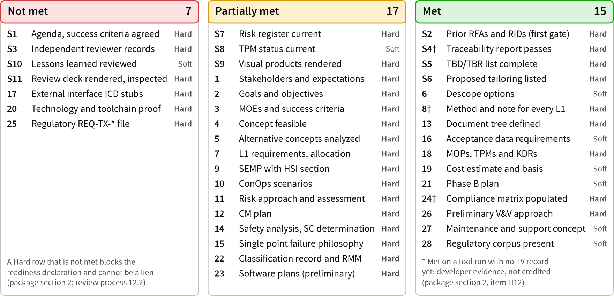
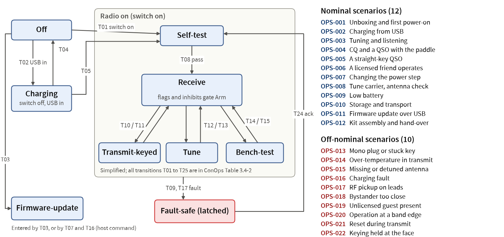
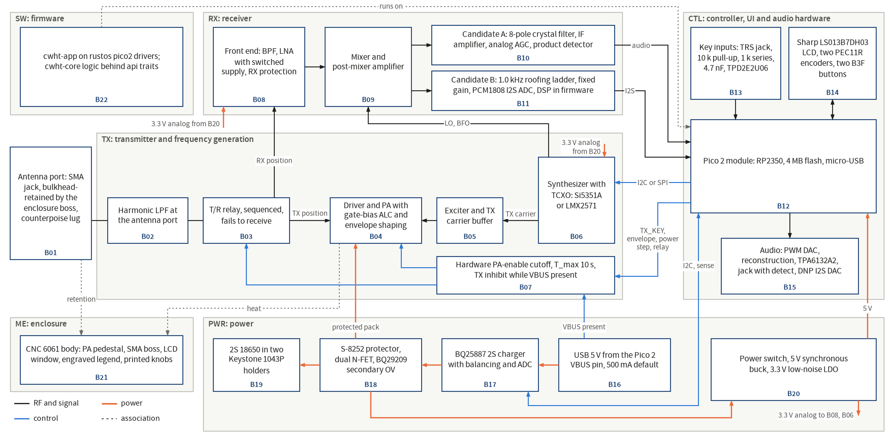
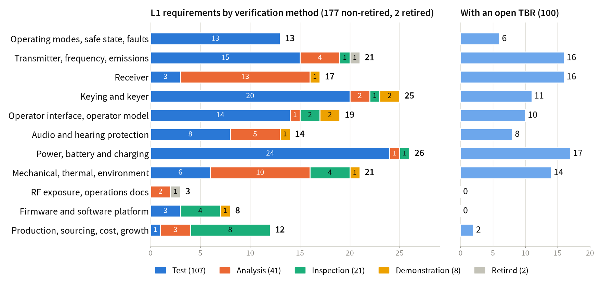
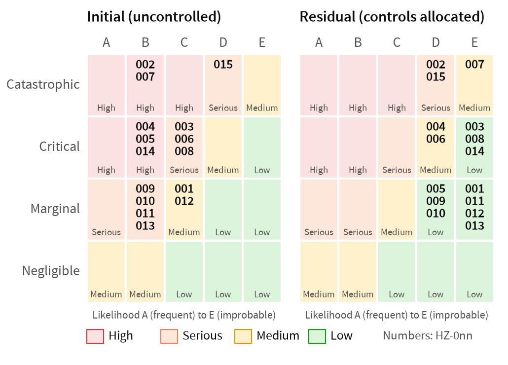
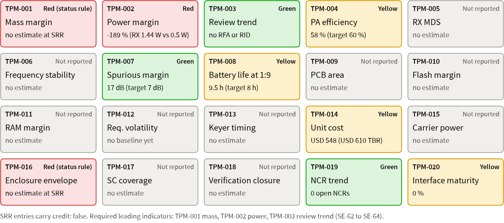
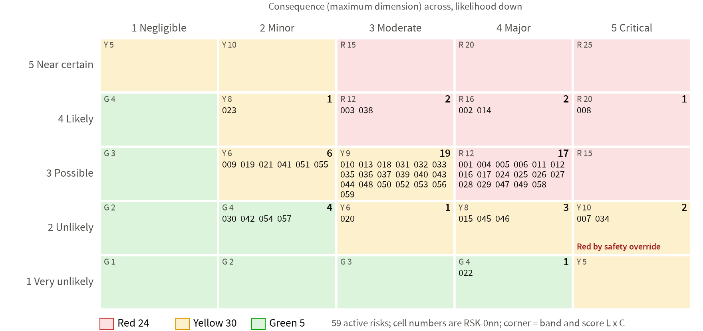

= SRR pre-review session: cwht, SRR combined with MCR, package revision 8 final
:revealjs_theme: white
:revealjs_width: 1920
:revealjs_height: 1080
:revealjs_margin: 0
:revealjs_center: false
:revealjs_slideNumber: c/t
:revealjs_controls: false
:revealjs_progress: false
:revealjs_transition: none
:customcss: srr.css
:pm: +/-
:source-highlighter!:
:icons!:

[.lead]
Pocket 2 m true-CW (A1A) 5 W handheld transceiver, 144.000 to 148.000 MHz

Package `docs/reviews/SRR/package.md`, revision 8 final of [.nw]##2026-09-26##, read from the 30 records at HEAD [.nw]##`a6e3518`##, where every cited product and record is committed. Revision 8 is at [.nw]##`27cc9d9`##; revision 7 at [.nw]##`8d7eca7`##.

Chair, Decision Authority, ETA and SMA TA: Robin. Presenter: Claude (lead systems engineer).

[.callout.warn]
Pre-review session: the SRR gate review is not convened. The readiness declaration cannot be made: Hard rows S3 and 20 are Not met, S1 awaits your confirmation, and 10 Hard rows are Partially met (package section 4, revision 8 final).

The minutes record this session as a pre-review session, not as the gate review.

[.notes]
--
Robin, this is a pre-review session of the cwht System Requirements Review, which also serves as the Mission Concept Review.
Package revision 8 final of 2026-09-26 is the final tabulation of revision 8, read from the 30 review records at HEAD a6e3518: every product and record it cites is committed there, all 30 records name the committed file versions, and it changes no product.
Since revision 8 the INSP-029 re-issue is done at a6e3518, APPROVED with liens finding-3, 5, 6 and 7, and the repeat readiness review R15 ran on revision 8 with verdict NEEDS CHANGES: R15b-F1, Major, is item R20, the route for this deck, and R15b-F2, Minor, is applied. 27 of the 30 records are APPROVED and every gate tool exits 0.
The gate review is not convened, because Hard rows S3 and 20 are Not met, S1 waits for your confirmation and 10 Hard rows are Partially met; the entrance counts are unchanged in revision 8 final.
What this session can produce is your rulings on the 17 key decisions and the consent agenda, the owner actions, starting with the FW-B0 flash, and your adoption or rejection of the candidate RIDs.
I present slide by slide and pause after each one for your questions, RFAs and RIDs; the top right of every slide names the package section it summarizes.
This deck is the revision 8 deck of 8a03bf0, which INSP-029 re-issued APPROVED at a6e3518, updated to the revision 8 final statuses listed in package section 2.2 block "Status since the deck" (route (b) of item R20); the INSP-029 reviewer verifies this delta before the presentation.
Evidence: docs/reviews/SRR/package.md (readiness declaration, header table, sections 2, 4 and 21); docs/process/01-lifecycle-and-reviews.md sections 3.4 and 4.2.
Question for Robin: shall we start with the FW-B0 flash on slide 3 while the Pico 2 is at hand?
--

== Agenda [.src]#§1, §2.2#

[cols="46,14,10,30",options="header"]
|===
| Block | Package | Slides | Chair decision needed
| Opening action: FW-B0 flash and picotool verify ([.nw]##OA-1##, [.nw]##OA-2##) | §2.2 | 3 | Perform with Claude
| Purpose, readiness, review records, entrance checklist | §1 to §4 | 4 to 9 | Confirm the agenda (S1)
| Products, concept, requirements, traceability | §6 to §8 | 10 to 15 | Questions, RIDs, RFAs
| Hazards, TPMs, risks, milestones | §9 to §12 | 16 to 19 | Questions, RIDs, RFAs
| TBRs, key decisions K1 to K17, consent agenda | §13 | 20 to 35 | Rule K1 to K17; adopt the consent agenda
| Trend, candidate RIDs, software, tailoring, success criteria | §14 to §20 | 36 to 39 | Adopt candidate RIDs; approve tailoring
| Liens, owner actions, requested disposition | §20.1, §2.2, §21 | 40 to 42 | Note; no disposition this session
|===

[.notes]
--
The package agenda has 15 items; I grouped them into seven blocks and moved two things for this session.
The FW-B0 flash comes first, because owner actions OA-1 and OA-2 are planned for the start of the session and are the only hands-on steps that entrance row 20 needs from you.
The owner actions and the liens move to the end, next to the requested disposition, so that the session closes on what you do after it.
The decision block follows the package split of revision 6: 17 key decisions ruled one or two per slide on slides 21 to 32, then a consent agenda of 64 decisions on three slides that you may adopt as a block.
The success criteria for this gate are review process section 4.4 plus the standing criteria of section 3.3.
Evidence: package section 1 and its slide map in section 1.1; package section 2.2; docs/process/01-lifecycle-and-reviews.md sections 3.3, 3.4 and 4.4.
Question for Robin: do you confirm this agenda and these success criteria? Entrance criterion S1 is Met only when you do.
--

== Opening action: FW-B0 flash and picotool verify [.src]#§2.2 OA-1, OA-2#

[.callout]
The hands-on part of entrance row 20; Claude runs every command and files the report.

. Write 1 on the bare Pico 2; hold BOOTSEL, plug it into the Mac, release BOOTSEL and tell Claude
. Claude runs `picotool info -d`, `picotool load -v` of `rustos-blinky.uf2` and `picotool reboot`; you count LED turn-ons for 60 s: pass 10 to 120 (about 63 expected)
. Re-enter BOOTSEL; Claude loads `cwht-app.uf2` the same way; count for 60 s: pass 3 to 45 (about 16 expected)
. [.nw]##OA-2##: with the board still in BOOTSEL, Claude loads `kat-target.elf` and runs `picotool verify` (expect pass), then a copy with one byte changed (expect fail)
. Claude files run 3 of [.nw]##TC-SW-TOOL-001## (run 2 is Blocked; its UF2 images are byte-identical to run 1)

[.notes]
--
FW-B0 is the toolchain proof of entrance row 20: the workspace builds and passes 10 of 10 host tests twice, and it builds for the RP2350 against rustos at 1608 B of flash and 8200 B of RAM.
Run 2 of the gate still exits 1 with 2 FAIL, cargo deny on the rustos manifests and 36 rustos unsafe sites without a SAFETY comment, and 5 MISSING items that wait on the downloads of decision 109.
OA-1 is steps 11 and 12 of TC-SW-TOOL-001, which need your hands on the board and your eyes on its LED; I run every command and file run 3 with your counts.
OA-2 closes the blocked verify part of the picotool lock sanity check: a known-answer verify that must pass on the true image and fail on a copy with one byte changed.
This closes only the owner part of row 20; INSP-016 finding-1 and finding-2 (Major) also need decisions 108 to 110 and the post-ruling work R16, and INSP-016 readiness R3 needs decision 115 (b).
Evidence: package section 2.2 OA-1 and OA-2, section 2 item H12, section 16; docs/vv/reports/TC-SW-TOOL-001-r2.md; docs/vv/reports/TC-SW-TOOL-001-r1/rustos-blinky.uf2; tools/tests/fixtures/picotool/kat-target.elf.
Question for Robin: is the Pico 2 at hand, and shall we do OA-1 and OA-2 now?
--

== Purpose, scope and readiness [.src]#§1, §2, §21#

* *Purpose:* confirm the requirements respond to your NGOs, MOEs and ConOps and can be achieved, the concept is feasible, and the plans suffice to begin preliminary design
* *Scope:* SRR absorbs the MCR; your disposition at the gate review is followed by the tag [.nw]##`baseline/srr`## (§21)
* *Readiness:* not declarable at revision 8 final; the goal state, in which only your items remain, is not yet reached: item R20, the deck route of R15b-F1
* *Tools:* at [.nw]##`a6e3518`## every gate tool exits 0: `validate_docs.py` 49 passed, 400 of 400 tool tests; developer evidence until accreditation (K15)
* *This session:* rulings on K1 to K17 and the consent agenda, owner actions, adoption of candidate RIDs
* *At the gate review:* Approved, Approved with liens or Not approved; never a lien: an unmet Hard row or an open Major RID

[.notes]
--
The SRR decides whether the requirements and the concept are good enough to baseline and whether the plans are good enough to start preliminary design; because it absorbs the MCR, the stakeholder expectations, the concept and the MOEs are entrance products too.
Revision 8 final re-reads the readiness items, the remaining work and the entrance rows from the 30 records at HEAD a6e3518, after the INSP-029 re-issue (R19 (b)) and the repeat readiness review R15 on revision 8; revision 8 had recorded R17, R18 and the INSP-030 re-issue.
Every gate tool exits 0 at a6e3518: validate_docs reports 49 passed and 0 failed with no drift note, the tool suite passes 400 of 400 tests, traceability PASS with 0 violations and 3 warnings, and the risk check with the hazard cross-check and the RMM and compliance checks exit 0. No product or record content is wrong.
The goal state, in which only your rulings, OA-1, OA-2 and your readiness confirmation remain, is still not reached: the one open item that is neither yours nor post-ruling work is R20, the route for this deck under readiness finding R15b-F1 (Major); the lead SE route is this update of the deck and an INSP-029 delta pass.
Under the lead SE convergence rule of 2026-09-26, every Minor finding is a lien to fix before PDR, so only Major findings held products in this round.
Evidence: package readiness declaration and sections 1, 2, 2.1 and 21; docs/process/01-lifecycle-and-reviews.md sections 4.1, 4.2 and 12.2.
Question for Robin: none on this slide.
--

== Readiness items H1 to H17 [.src]#§2#

++++

Open7

H1Records: 5 open Major, each on a ruling

H3This deck: item R20 only (R15b-F1)

H5TS-001 approved; ADR part on decisions 106 and 47

H79 SRR hazard questions Open: 8 on rulings, OQ-SAF-006 after them

H12FW-B0 Blocked: decisions 108 to 110, OA-1, then R16

H1407 and TS-002 records APPROVED; decision 107 only

H15Row 25: INSP-004 APPROVED; decisions 104, 112, 30

Closed; your ruling left5

H410 stakeholders listed; decision 103

H6Allocation done; ConOps D5, D7, D18 on decisions 36, 37

H8REQ-SYS-180 to 182 written; decisions 38 to 40

H1303 re-transcribed and approved; decision 9

H16Items due closed; decisions 10, 103

Closed5

H2Two retirements verified

H9Risk check exit 0; INSP-007 APPROVED

H10Seven figures re-rendered, opened

H11Five ICD stubs; INSP-012 APPROVED

H1730 of 30 records on the HEAD blobs

Package revision 8 final. None of the 17 may be a lien (review process 12.2). "Closed" means the evidence exists at a named commit and no open Major finding stands against it.

++++

[.notes]
--
Revision 2 listed 17 Hard shortfalls and items due before the declaration; revision 8 final re-rates each one against the 30 records and the products at a6e3518.
Seven are open; H1 is the largest: 5 open Major findings in three records, each closing only on your ruling; its record action (b), the INSP-029 re-issue, is done at a6e3518, APPROVED with liens finding-3, 5, 6 and 7.
H3, this deck, is open on item R20 only: readiness finding R15b-F1 found that the revision 8 deck stated statuses that the final tabulation changed; this update is the route, and the INSP-029 delta pass verifies it.
H17 is Closed in revision 8 final: all 30 records name the HEAD blobs at a6e3518. As package section 2 H17 says, this deck edit re-opens that row until INSP-029 verifies the delta.
H5, H14 and H15 now stand only on your rulings: INSP-013, the 07 records INSP-010 and INSP-018 and the row 25 records INSP-004 and INSP-026 are APPROVED with liens; H7 has nine SRR-due hazard questions open, eight on your rulings, and OQ-SAF-007, 025 and 026 are Closed by the R9 edit, which INSP-008 verified at 2aaad2a (R17).
Five items are closed on the product side and wait only for your ruling: the stakeholder representation rule, the ConOps items D5, D7 and D18, the three hardware backstops, the concurrence of decision 9, and decisions 10 and 103.
Five are fully closed, among them H10, the seven package figures that the fixed generator re-rendered, H11, the ICD stubs, whose record INSP-012 is APPROVED with liens, and H17, the evidence commit hashes.
Evidence: package section 2 table H1 to H17 with its evidence and commit column; section 2.4.
Question for Robin: none on this slide; the remaining work is on the next slide.
--

== What remains before the declaration [.src]#§2.1#

[cols="20,52,18,10",options="header"]
|===
| Group | Items (package section 2.1) | Owner | State
| Your rulings | R1: K1, K2, K7, K9 to K12, K14 to K17 and the rest of section 13.1 | Robin | Open
| Your hands-on | R2: FW-B0 steps 11 and 12 and the picotool verify ([.nw]##OA-1##, [.nw]##OA-2##) | Robin; Claude runs commands | Open
| This deck | R20: the deck route of readiness finding [.nw]##R15b-F1## (Major): this update, then the [.nw]##INSP-029## delta pass | Claude (lead SE); reviewer | Open
| After the rulings | R16: installs, gate to exit 0, run 3, [.nw]##INSP-016## iteration 4; requirement, ConOps and ADR edits | Claude; reviewers | Waits on R1, R2
| Done | R3 to R14; R15 repeat on revision 8; R17 [.nw]##INSP-008##; R18 record state rule, [.nw]##INSP-002##, [.nw]##INSP-015##; R19 (a) deck; R19 (b) [.nw]##INSP-030##, [.nw]##INSP-029## | | Done
|===

[.notes]
--
Package section 2.1 is the complete list, R1 to R20 in revision 8 final, grouped here by owner.
Your part is R1 and R2: the rulings, which since revision 6 include K7 for decisions 73 and 74, and the flash you may already have done on slide 3.
Revision 8 recorded R17, R18 and the INSP-030 re-issue, which closed readiness findings R15-F1 to R15-F3. Revision 8 final records the INSP-029 re-issue at a6e3518, APPROVED with liens finding-3, 5, 6 and 7, and the repeat readiness review R15 on revision 8, verdict NEEDS CHANGES with R15b-F1 (Major, item R20) and R15b-F2 (Minor, applied).
The Claude and reviewer part that still depends on no ruling is R20 alone: the route for this deck, which is this update to the revision 8 final statuses and then an INSP-029 delta pass. When it is done, the only open items that do not wait on a ruling are yours.
R16 follows your rulings: after decisions 109 and 110 I install the approved toolchains, apply the rustos SAFETY-comment work item, re-run tools/sw_gate.sh to exit 0 and file run 3, and after the other rulings the authors make the requirement, ConOps and ADR edits each ruling triggers.
R16 precedes the declaration, because Hard rows 14, 15 and 20 close only through it.
Commits of work products are routine CM records that I make under the CM plan, not an owner action; this deck update is committed by its own commit; OA-8 covers only the gate disposition and the baseline tag.
Evidence: package section 2.1 items R1 to R20 and the goal-state paragraph; section 2.2 block "Status since the deck" and OA-8; section 15 items 76 and 77.
Question for Robin: none on this slide; R20 needs no ruling.
--

== Review records: 30 records at revision 8 final [.src]#§2.4, §3#

++++

APPROVED27

001Expectations

002ConOps, concept

004TX, SW-KEYER

005SEMP

006CM plan 05

00706, risk register

008Hazards 0.4.3-pha

00903 and RMM

01007 software plan

012ICD stubs

013TS-001, TS-002

014Technology assessment

015TV-001 to 010

APPROVED, continued

01703 assurance

01807 assurance

01901 and templates

02002 requirements process

02104 V&amp;V process

02208 agent briefing

023Schedule, cost estimate

024Compliance matrix

025TC-SYS cases

026SW-KEYER assurance

027TS-002 assurance

028FW-B0 test files

029This deck

03005 assurance

Open Major3

003L1: finding-6 (decision 30)

011ADRs: F-01 (106), F-04 (47)

016FW-B0: F-01 (109, 110, OA-1), F-02 (108)

Record numbers are INSP-NNN. No APPROVED record fails a gate tool. Every Minor finding of every record is dispositioned "Lien: fix before PDR": 123 findings plus erratum E-10 (package revision 8 final), carried as lien L-6.

++++

[.notes]
--
All 30 records are filed as their front matter reads at a6e3518 (package revision 8 final): 27 APPROVED and 3 NEEDS CHANGES.
Revision 8 recorded the INSP-008 re-issue on the 0.4.3-pha hazard blobs (R17), INSP-002 moving to APPROVED after the record state rule of validate_docs.py (R18), the INSP-015 delta verification of that rule with two new liens, F-08 and F-09, and INSP-030 moving to APPROVED (R19 (b)).
Revision 8 final adds one change: INSP-029, this deck's record, was re-issued at a6e3518 without a further product review, APPROVED with liens finding-3, 5, 6 and 7, readiness met, verifying the revision 7 count edit and the revision 8 update on the 8a03bf0 blobs. Finding-7 is new and Minor: the slide 9 notes placed S3 and row 20 among the Partially met rows; this update corrects them. That record had reached its third NEEDS CHANGES, which I raise with you here; it ended at APPROVED without a product change.
The three NEEDS CHANGES records, INSP-003, 011 and 016, are held only by the five open Major findings, which close only on your rulings; no record is held by reviewer work.
The record liens move from 122 in revision 8 to 123 in revision 8 final with INSP-029 finding-7, plus erratum E-10.
Evidence: package sections 2.4 (record table and totals), 2.3 and 3; docs/reviews/SRR/checklists/*.md front matter; section 20.2.
Question for Robin: none on this slide; the only ruling left in K17 is decision 115 (b).
--

== Open Major findings and the product-blob check [.src]#§2.3, §2.4, §15#

[cols="12,48,22,18",options="header"]
|===
| Record | Open Major finding | Closes on | Key decision
| [.nw]##INSP-003## | finding-6: ten `regulatory` requirements not verified by Test lack the item (g) record | Decision 30 | K12
| [.nw]##INSP-011## | F-01: class 1 choices recorded by an ADR without a trade study | Decision 106 (R-2) | K11
| [.nw]##INSP-011## | F-04: Accepted ADR-010 decides hang values that the requirements contradict | Decision 47 (ADR-026) | K16
| [.nw]##INSP-016## | finding-1: FW-B0 gate exits 1 at run 2 (2 FAIL, 5 MISSING) | Decisions 109, 110; [.nw]##OA-1##; R16 | K9, K10
| [.nw]##INSP-016## | finding-2: target-only decision without an approved deviation | Decision 108 (CR-001) | K10
|===

* Blob check at [.nw]##`a6e3518`## (revision 8 final): 30 of 30 records (195 entries) name exactly the committed blobs; H17 Closed; item 57 (Major) stays Closed
* The [.nw]##INSP-029## drift closed with its re-issue; this deck update re-opens it until the [.nw]##INSP-029## delta pass (R20)

[.notes]
--
These are the only open Major findings in the 30 records, and each closes on a ruling of yours; none can be a lien.
Decision 30 is itself the item (g) record that INSP-003 finding-6 asks for, now extended to ten regulatory requirements, three of them REQ-TX.
INSP-011 F-02 and F-03 are Closed on the ADR correction the lead SE applied for your approval under decision 105; F-01 needs decision 106 and F-04 needs decision 47, because 05 Table 4-1 row 13 forbids editing ADR-010's decision section.
INSP-016 finding-1 also needs the post-ruling work R16 and your flash, and finding-2 closes when you approve CR-001.
The product-blob check compared every product file a record lists, 195 entries, with git rev-parse HEAD:<path> at a6e3518 and found no difference: the INSP-008 drift closed with its re-issue at 2aaad2a (R17), and the INSP-029 drift closed with its re-issue at a6e3518 on the 8a03bf0 deck blobs; validate_docs.py prints no drift note.
As package section 2.3 says, a deck edit under route (b) of R20, which this update is, re-opens the INSP-029 row until its reviewer verifies the delta, and because INSP-029 is APPROVED the drift rule fails validate_docs.py until then.
Evidence: package sections 2.3 and 2.4; section 15 items 27, 46, 52, 53, 57, 67 and 72; docs/reviews/SRR/checklists/requirements-sys.md, adrs-001-to-025.md, fw-b0-toolchain-proof.md.
Question for Robin: none here; you rule these through K10, K11, K12 and K16.
--

== Entrance-criteria checklist [.src]#§4, §7#

[.notes]
--
The board shows all 39 entrance criteria, the eleven standing criteria S1 to S11 and the 28 SRR rows, under the single rating rule of package section 4: Met 24, Partially met 11, Not met 4.
The counts are those of package revision 8 final, unchanged from revision 8: render_review_figures.py --check exits 0 and no figure was re-rendered. Revision 8 re-rated rows 4 and 12 Met, because INSP-002 is APPROVED at b08e55d and INSP-030 at 99ecccb and no ruling holds their content; revision 6 had re-rated rows 1, 2 and 3 Met on INSP-001.
The Hard rows not Met each block the declaration. Not met: S1, which waits for you; S3, on your rulings only, now that INSP-029 is re-issued; and row 20, on rulings, OA-1 and R16.
Partially met, 10 Hard rows: 7, 8, 15, 22, 23 and 25 wait on your rulings only; 5 on rulings for the ADR part; 14 on rulings and the post-ruling OPS-013 edit (R16); 10 on decisions 36, 37, 41 and 42 and the post-ruling ConOps edit (R16); S11 on item R20, readiness finding R15b-F1, and is re-rated Met when R20 is done.
The Soft rows S8 and S10 are the only shortfalls proposed as liens, L-2 and L-3; the dagger on S4, 8 and 24 marks evidence from tool runs whose TV records are not yet accredited.
Evidence: package section 4 table and counts line; figure docs/reviews/SRR/figures/entrance-checklist.png, generated by tools/render_review_figures.py (blob 6f3018fd) from revision 8 and opened 2026-09-26 (package section 7); package section 4 counts line, revision 8 final.
Question for Robin: none on this slide.
--

== Products with evidence links and counts [.src]#§6#

[cols="31,40,29",options="header"]
|===
| Product and path | Counts | Record
| Expectations ([.nw]##SE-35##, [.nw]##SE-37##) `l0-stakeholder/` | 36 SI, 10 stakeholders, 30 NGO, 13 MOE, 28 CON | [.nw]##INSP-001## APPROVED
| ConOps and concept ([.nw]##SE-36##) `docs/conops/`, `concept.md` | 9 modes, 22 scenarios, B01 to B22, 10 descopes | [.nw]##INSP-002## APPROVED
| L1 ([.nw]##SE-39##) `sys/requirements.json` | 183 [.nw]##REQ-SYS## (181 Draft, 2 retired), 18 KDR, 115 TBR | [.nw]##INSP-003##: 1 open Major
| L2 and cases `tx/`, `sw-keyer/`, `docs/test_cases/` | 16 [.nw]##REQ-TX##, 39 [.nw]##REQ-SW-KEYER##; 170 cases | [.nw]##INSP-004##, 025, 026 APPROVED
| Hazards, risks `docs/safety/`, `docs/risk/` | 15 hazards, 118 controls; 65 risks (Red 32) | [.nw]##INSP-008##, [.nw]##INSP-007## APPROVED
| SEMP ([.nw]##SE-38##, [.nw]##SE-66##), plans 01 to 08, RMM, matrix | 100 RMM rows; 62 compliance rows | All APPROVED, with [.nw]##INSP-030##
| ADRs, trade studies, ICD stubs `docs/decisions/`, `docs/icd/` | 26 ADRs (4 Proposed); [.nw]##TS-001##, [.nw]##TS-002##; 5 stubs | [.nw]##INSP-011##: 2 open Major; [.nw]##INSP-012## APPROVED
| TPMs, tools, cost `docs/plan/`, `docs/cm/` | 20 MOPs, 20 TPMs; [.nw]##TV-001## to 013; USD 276 to 548 per unit | [.nw]##INSP-015## APPROVED; [.nw]##INSP-016##: 2 open Major
|===

[.notes]
--
This is the product list with evidence paths, counts and the record of each product, as the charter minimum slide set requires.
The key numbers of the expectations are MOE-001 5.0 km open-ground contact at 5 W, MOE-004 8 h at 1:9 and MOE-006 spurious 60 dBc target.
The L1 file has 183 requirements, 181 Draft and 2 retired, with 115 open TBRs; the L2 files add 16 REQ-TX and 39 REQ-SW-KEYER requirements, REQ-SW-KEYER-039 having been added at f2e02aa for INSP-026 finding-1.
Every plan record is APPROVED with liens after the re-issues of 2026-09-26, the CM plan 05 with its paired assurance record INSP-030, re-issued APPROVED with liens finding-1 to 4 at 99ecccb; the ConOps record INSP-002 is APPROVED since b08e55d and the hazard record INSP-008 names the 0.4.3-pha blobs since 2aaad2a.
The cost model of 2026-09-26 gives a unit budget of USD 828 to 1644 for three radios, about USD 276 to 548 per unit.
Evidence: package sections 6.1 to 6.16 and the commit column of section 4; section 2.4.
Question for Robin: none on this slide.
--

== ConOps: operating modes and scenarios [.src]#§6.2, §7#

[.notes]
--
The ConOps defines nine modes with allowed and forbidden transitions, flags and inhibit classes; this figure is a simplified view drawn from ConOps section 3.4, and the full transition table stays in the ConOps.
On the right are the 22 scenarios: twelve nominal, OPS-001 to 012, and ten off-nominal, OPS-013 to 022.
Entrance row 10 is Partially met on rulings and a post-ruling edit: INSP-002 is APPROVED with liens finding-19 to 22 since b08e55d, after the record state rule of validate_docs.py (R18), and the section 3.4 bench-test limit follows decisions 41 and 42 (R16).
Appendix D items D5, D7 and D18 close with your rulings on decisions 36 and 37, and OPS-013 is edited after decisions 37, 38 and 41 (OQ-SAF-006).
Evidence: docs/conops/conops.md sections 3.4 and 6 and appendix D; package sections 6.2, 7 and 4 row 10; figure docs/reviews/SRR/figures/conops-modes-scenarios.png, generated by tools/render_review_figures.py and opened 2026-09-26.
Question for Robin: do the scenarios cover how you and your friends will use the radio?
--

== Concept block diagram [.src]#§6.2, §7#

[.notes]
--
This is the concept block diagram of concept section 5: 22 blocks, B01 to B22, in six groups, with 32 edges.
The concept also gives functions F1 to F10 with their preliminary allocation, 18 ICDs to be controlled and six PDR trade studies.
Block B07, the hardware cutoff, reads "TX inhibit while VBUS present", in line with the charging rule of decision 75.
The figure was inspected by the INSP-002 reviewer at iteration 2; its generator, concept-block-diagram.py beside it, has no TV record yet, which is candidate item 38, a package-level lien in L-4.
Evidence: docs/design/concept.md section 5; package sections 6.2 and 7; figure docs/reviews/SRR/figures/concept-block-diagram.png.
Question for Robin: none on this slide.
--

== Concept feasibility: alternatives, trades, technology [.src]#§4 rows 4 to 6, 20; §6.12, §6.15#

* No technology below TRL 6; design maturity tracked apart as DML (SEMP section 6.0); [.nw]##INSP-014## F-02 Closed at [.nw]##`4fe6f28`##
* [.nw]##TS-001##: single-conversion superhet; selectivity A and B a closely ranked pair, A the planning baseline; PA P1, then P3, P4
* [.nw]##TS-002## ([.nw]##SWE-033##): rustos, option A0, 400 of 500, robust against three alternatives
* [.nw]##INSP-013## APPROVED both on the committed blobs, paired with [.nw]##INSP-027##, the [.nw]##TS-002## assurance; re-issued at [.nw]##`fdd3391`##
* Ten descope options ordered by value lost (row 6 Met); six PDR trade studies defined in the concept
* No RF breadboard before procurement: hardware TRL 3, a residual of [.nw]##RSK-008## (decision 11, K4)

[.notes]
--
The technology assessment finds nothing below TRL 6, so no Technology Development Plan is needed; INSP-014 is APPROVED with liens F-09 to F-12.
TS-001 recommends the single-conversion superhet, carries selectivity candidates A and B as a closely ranked pair with A as the planning baseline, and ranks PA device P1 first with P3 then P4 as fallback; its interim rulings are key decision K8.
TS-002 recommends your rustos as option A0 with 400 of 500 points, robust against rp235x-hal, Embassy and RTIC; its approval is key decision K9.
INSP-013 approved both trade studies on the committed blobs 2a0c40a8 and 574cee3d and INSP-027 approved the TS-002 software assurance, so the trade-study part of row 5 is done; row 5 stays Partially met on the ADR part, INSP-011 F-01 and F-04.
Decision 11 asks you to accept that the hardware reaches only TRL 3 at the CDR procurement release, because no RF breadboard is built first.
Evidence: package entrance rows 4, 5, 6 and 20; sections 6.12 and 6.15; docs/decisions/trade-studies/TS-001-receiver-and-pa-concept.md; TS-002-firmware-runtime-make-buy.md; docs/plan/technology-assessment.md.
Question for Robin: none here; the trade rulings are K8 and K9.
--

== L1 requirements by functional group [.src]#§8#

[.notes]
--
There are 183 L1 requirements: 181 non-retired, all at status Draft, and 2 retired, REQ-SYS-016 and REQ-SYS-123.
The left chart splits each functional group by verification method: across the set 111 Test, 41 Analysis, 21 Inspection and 8 Demonstration, and every requirement names a same-method closing case in its verification note.
The right chart shows the 115 open TBRs: 14 close in the SRR memo by your rulings and 101 at PDR.
REQ-SYS-180 to 182 are the three hardware backstops of K2 and REQ-SYS-183 is the RF-off level.
The grouping is the package author's, made from the requirement titles, because the file has no category field.
Evidence: docs/requirements/sys/requirements.json; package sections 6.3 and 8; figure docs/reviews/SRR/figures/requirements-by-group.png, generated by tools/render_review_figures.py and opened 2026-09-26.
Question for Robin: none on this slide.
--

== Traceability and verification planning [.src]#§6.5, §8#

* Report re-run [.nw]##2026-09-26## at [.nw]##`b4abcc5`##, byte-identical: PASS, 0 violations, 3 warnings; 238 requirements, 170 cases, all Draft
* Warnings: [.nw]##T-18## [.nw]##REQ-SYS-125##, 148 unallocated; [.nw]##HAZARD_INVERSE## [.nw]##REQ-SW-KEYER-039## (lien)
* Cases: [.nw]##TC-SYS## 110, [.nw]##TC-TX## 16, [.nw]##TC-SW-KEYER## 43, [.nw]##TC-SW-TOOL## 1; Bench 96, HostUnit 35, Simulation 27, Inspection 12
* Every non-retired requirement has a case; `allocation.json` allocates 179 ids; [.nw]##T-21## stakeholders passes
* [.nw]##INSP-003## finding-6 (Major): ten `regulatory` requirements not verified by Test (decision 30, K12)
* [.nw]##SWE-052## Table 1: rows 1, 5, 6 enforced, row 2 in part, rows 3, 4 not yet; 22 KDRs (18 L1, 4 L2)

[.notes]
--
The frozen traceability report, re-run for revision 8 at b4abcc5 and byte-identical to the committed copy, passes with no violations and three warnings.
Two warnings are the T-18 allocation gaps of REQ-SYS-125 and REQ-SYS-148, confirmed by the L1 reviewer in V6; the third is HZ-004 not yet listing REQ-SW-KEYER-039, INSP-026 finding-5, which is a lien.
All 170 cases are Draft, and the two FW-B0 reports carry credit false, so evidence-class coverage by credited report is zero in every class, as expected before design.
The one open Major finding against the methods is INSP-003 finding-6: decision 30 now names all ten regulatory requirements not verified by Test in the three files, REQ-SYS-001, 014, 015, 121, 122, 125 and 177 and REQ-TX-001, 005 and 006.
Rows 3 and 4 of the SWE-052 traceability set wait for design components and code, which do not exist yet; requirements volatility is not applicable before a baseline.
Evidence: docs/reviews/SRR/traceability-report.md and traceability.json; package sections 6.5 and 8; docs/test_cases/*/test_cases.json; docs/design/allocation.json.
Question for Robin: none on this slide.
--

[.columns]
== Hazards and safety [.src]#§9, §18.1#

[.column.wide]
--

--

[.column.narrow]
--
* 15 hazards: initial High 5, Serious 8, Medium 2; residual Low 10, Medium 3, Serious 2
* 118 controls; every control case is Draft
* 19 questions due at SRR: 9 Closed, 1 Answered, 9 Open; 8 close on your rulings
* Safety-critical: keying, PA enable, safe state, charging, thermal, audio, scheduler
* Proposed: frequency control and the override path (decision{nbsp}9)
* SPF rows 3, 4, 8: [.nw]##REQ-SYS-180##, 182, 181 (K2)
--

[.notes]
--
The hazard analysis at 0.4.3-pha has fifteen hazards, unchanged in severity, likelihood and residual since 0.4.0-pha; INSP-008 is APPROVED with liens finding-14 to 16; its reviewer verified the status-only 0.4.3-pha delta and re-issued it on the 0.4.3-pha blobs at 2aaad2a (R17).
Five hazards start High; with the allocated controls none remains High, and two stay Serious: HZ-002 overcharge and HZ-015 owner hand assembly, both Catastrophic-D.
The 118 controls are 104 Proposed and 14 Requirement pending; no control is verified yet.
Of the 19 questions due at SRR, nine are Closed, OQ-SAF-022 is Answered and nine are open: eight close on your rulings in K1 and K2 and decision 9, and OQ-SAF-006 closes with the OPS-013 edit after the rulings; OQ-SAF-007, 025 and 026 were set Closed by the R9 status edit at ade0e09.
The single point failure rows 3, 4 and 8 have the requirements REQ-SYS-180, 182 and 181, which you adopt or decline in K2; the RF exposure evaluation is a PDR product resting on decisions 22, 23, 31 and 32.
Evidence: docs/safety/hazards.json 0.4.3-pha and hazard-analysis.md sections 6 and 8; package sections 6.6, 9 and 18.1; figure docs/reviews/SRR/figures/hazard-matrix.png, generated by tools/render_review_figures.py and opened 2026-09-26.
Question for Robin: do you accept this hazard list as complete for the preliminary analysis, or is a hazard missing?
--

== TPM status and margins [.src]#§10#

[.notes]
--
Twenty TPMs: three Red, four Yellow, three Green and ten not reported at SRR; every entry is preliminary with credit false.
TPM-002 power margin is Red on the numbers: the provisional receive allocation of 0.5 W is below the research estimate of 1.44 W, so RSK-058 carries it and consent decision 98 re-allocates it at PDR.
TPM-001 mass and TPM-016 envelope are Red by the status rule only, because no estimate exists at a reporting review; lien L-2 carries them to PDR.
TPM-007 spurious margin shows 17 dB against 7 dB, TPM-008 battery life 9.5 h against 8 h, and TPM-014 unit cost is Yellow at USD 548, about 10 percent (USD 62) under the proposed USD 610 ceiling of decision 90; the stale value of revision 3 is corrected (item 59 Closed).
The required leading indicators are mass margin TPM-001, power margin TPM-002 and review trend TPM-003 (SE-62, SE-63, SE-64); TPM-003 is Green because no RFA or RID exists yet.
Evidence: docs/plan/tpm.json; package sections 10 and 15 item 59; figure docs/reviews/SRR/figures/tpm-status.png, generated by tools/render_review_figures.py and opened 2026-09-26.
Question for Robin: none here; the cost ceiling is K13 and the power re-allocation consent decision 98.
--

== Risk matrix [.src]#§11#

[.notes]
--
The register 0.6.0-pre-srr has 65 active risks, all Proposed: 32 Red, 25 Yellow and 8 Green; 31 were opened at this assessment and none was closed or accepted.
A risk sits in the cell of its likelihood and its maximum consequence dimension; RSK-034, a bench fire or burn during your hand assembly, sits in a Yellow cell but is Red by the safety override.
The top of the ranked list is RSK-007 cell thermal event, RSK-034, RSK-008 second board spin, RSK-046 transmission outside the band, RSK-025 antenna port retention and RSK-014 procurement released with unreviewed products, which is yours.
Three mitigation steps fall due at SRR, RSK-028 S2, RSK-030 S1 and RSK-046 S1, and they close with the SRR memo; 159 candidate risks were dispositioned: 81 entered, 56 merged, 22 declined.
INSP-007 is APPROVED with liens, and the approval of the 32 Red plans and the residual acceptances are key decision K4.
Evidence: docs/risk/register.json and register.md 0.6.0-pre-srr; package section 11; figure docs/reviews/SRR/figures/risk-matrix.png, generated by risk-matrix.py beside it (no TV record yet, item 38) and inspected 2026-09-26.
Question for Robin: none here; the plan approvals are K4 on slide 24.
--

== Milestones and procurement [.src]#§12#

[cols="23,20,29,28",options="header"]
|===
| Milestone | Planned | Status | Recovery
| SRR package ready | [.nw]##2026-09-26## morning | Revision 8 final assembled; not ready (section 2.1) | R20 deck route; this session for rulings and [.nw]##OA-1##
| PDR | [.nw]##2026-09-26## evening | Pending; SRR not yet held | Six trade studies, L2 specifications, ICDs, V&V plan
| CDR and procurement release | [.nw]##2026-09-27## evening and night | Pending; [.nw]##RSK-014## Red | Lien rule of [.nw]##RSK-014## S2
| Vendor delivery, TRR | 2 to 4 weeks after the order | Pending; [.nw]##RSK-053## closure [.nw]##2026-10-01## to [.nw]##10-04## | Alternates in the BOM at CDR
|===

* Procurement: no BOM line exists; the PCBWay questions are drafted and not sent ([.nw]##OA-4##)
* Zero DigiKey and Mouser stock seen on [.nw]##2026-09-25## for TPS62913, TPS7A2033, BQ25792 ([.nw]##RSK-038##, Red)

[.notes]
--
The schedule plans SRR on Saturday morning, PDR on Saturday evening and CDR with procurement release on Sunday evening and night.
The SRR milestone is not met: revision 8 final is assembled and committed, the INSP-029 re-issue of R19 (b) and the repeat readiness review R15 are done, but the owner items R1 and R2, item R20, the deck route of readiness finding R15b-F1, and then R16 remain.
The recovery is R20, this deck update and its INSP-029 delta pass, then this session for your rulings and OA-1.
The expedited schedule itself is RSK-014, Red and owned by you, whose lien rule keeps an order from being released against unreviewed products.
Vendor holidays from 2026-10-01 to 10-04 threaten the delivery window, and three rail parts showed zero distributor stock, so alternates must be in the BOM at CDR.
Evidence: docs/plan/schedule.md; package section 12; docs/risk/register.json RSK-014, RSK-038, RSK-053.
Question for Robin: do you keep the planned dates, knowing the SRR package is not ready?
--

== TBR list and the decision agenda [.src]#§13, §13.1#

[cols="34,10,56",options="header"]
|===
| TBR set | Count | Closure
| L1 requirement TBRs | 115 | 14 in the SRR memo by your rulings; 101 at PDR
| L2 TBRs ([.nw]##REQ-TX##, [.nw]##REQ-SW-KEYER##) | 25 | PDR
| TPM TBRs | 5 | [.nw]##TPM-014## at SRR (decision 90); four at PDR
| Hazard-control TBRs | 17 | PDR analyses
|===

* 118 numbered decisions: 17 key decisions covering 52, ruled one or two per slide (slides 21 to 32)
* Consent agenda of 64 in themes A to P: adopt as a block, for example "except decisions 22 and 97" (slides 33 to 35)
* 2 need no ruling (5 withdrawn, 12 done); an unanswered item keeps the assumption the package states
* Revision 6 re-checked every consent row (tests T1 to T3): 42 to K1, 73 and 74 to K7; revision 5 moved 25 to K12 and added 118 to K17

[.notes]
--
No TBD remains in anything to be baselined, and every TBR has an owner, a closure plan and a close-by event, which entrance criterion S5 checks.
Fourteen L1 TBRs close in the SRR memo, each ratified by a decision: REQ-SYS-042, 043 and 047 by decision 50, 045 by 46, 050 by 49, 057 by 79, 090 by 71, 104 by 80, 157 and 173 by 69, 171 by 33, and 180, 181 and 182 by 38, 39 and 40.
The other 101 L1 TBRs, the 25 L2 TBRs, four TPM TBRs and the 17 hazard-control TBRs are lien L-1 to PDR; TPM-014, the unit cost ceiling, is ruled here.
A key decision has a real trade-off, a safety, regulatory or cost consequence, a contested recommendation or a capacity only you hold; revision 4 moved decision 47 to K16 and decision 115 to K17; revision 5 moved decision 25 to K12, because the 1 kHz guard no longer holds the -60 dB keying sidebands in band, and added decision 118 to K17.
Revision 6 re-checked every consent row against three tests, a conflict with a reviewed product or another recommendation, a pending control of a Catastrophic hazard, and a default that leaves a Hard item open or moves the cost ceiling: decision 42 moved to K1 and decisions 73 and 74 to K7, and no other row meets a test.
If you leave an item, the products keep the assumption stated in the package's last column, which is recorded in the SRR memo as your ruling only if you say so.
Evidence: package section 13 (TBR tables), section 13.1 (count, index) and the re-check preamble of section 13.1.2; docs/reviews/SRR/decisions-for-owner.md revision 6.
Question for Robin: do you accept these TBR closure plans, with the PDR items carried as lien L-1?
--

== Key decision K1: stuck-key and transmit time bounds [.src]#§13.1.1 K1#

[.why]
*Why key:* safety (HZ-001, HZ-004, HZ-006); 37 differs from REQ-SYS-054 as written; 41 closes OQ-SAF-016, a Hard H7 question; 42 conflicts with 41 and 37 (test T1).

[.key,cols="7,37,29,27",options="header"]
|===
| No. | Decision and options | Recommendation | If no answer
| 36 | Tune and cutoff window: (a) tune at 0.5 W ending 5 s {pm}0.5 s, cutoff [.nw]##T_max## 10 s (7.5 to 13 s); (b) 10 s tune, cutoff window above 11 s | (a), with the 74LVC1G123 and a capacitor chosen from its DC-bias curve | (a), as [.nw]##REQ-SYS-020## is written
| 37 | Stuck-key limits: 5 s manual timeout; paddle watchdog 128 or 10 s, 128 or 30 s, or the no-gap form (no 7-dit or 500 ms gap for 30 s, 2 s squeeze) | 5 s including the Bug dah; the no-gap watchdog with the 2 s squeeze limit | [.nw]##REQ-SYS-053##, 054 as written; [.nw]##OQ-SAF-001##, 002 stay open as RIDs
| 41 | Bench test-mode guard: forced 0.5 W, 120 s timeout, exit on reset, not persistent | Adopt | [.nw]##REQ-SYS-179## without the forced step and timeout
| 42 | ConOps 3.4 mode classes, PRACTICE flag, bench-test limits (60 s per keyed activation): (a) classes and flag; limits as 41 and 37 rule; (b) 60 s, 41 at 60 s; (c) limits to PDR | (a), ruled after 37 and 41 | 60 s and the [.nw]##REQ-SYS-054## values; conflict with 41 open
|===

[.notes]
--
K1 sets the time bounds that stop a stuck or runaway key-down; it is safety, HZ-004 stuck transmission and the RF exposure hazards HZ-001 and HZ-006.
For decision 36 I recommend option a, a tune carrier that ends at 5 s, below the 7.5 s floor of the hardware cutoff, so that the hardware bound never cuts a tune; option b keeps a 10 s tune but moves the cutoff above 11 s and re-derives the 13 s bound of MOE-012.
For decision 37 I recommend the no-gap paddle watchdog of HZ-004 K4, because it also bounds a toggling stream; that differs from REQ-SYS-054 as written, which the requirements author then rewords (OQ-SAF-001 and 002).
Decision 41 closes OQ-SAF-016: without it the bench test mode has no forced 0.5 W step and no 120 s timeout.
Decision 42 moved here from consent theme C in revision 6: the ConOps caps a keyed bench test at 60 s against the 120 s of decision 41, and its Table 3.4-4 row 3 carries the REQ-SYS-054 values that decision 37 replaces; I recommend option a, ruled after 37 and 41, because 60 s leaves no margin over the about 60 s element-timing measurement at 5 WPM, while 120 s stays below the 150 to 180 s backstop of decision 38.
The rulings also settle ConOps items D5, D7 and D18 and trigger the OPS-013 edit of OQ-SAF-006 and the ConOps section 3.4 alignment (R16).
Evidence: package section 13.1.1 K1 and section 13.1.2 re-check; section 18.1 (OQ-SAF-001, 002, 005, 016); docs/safety/hazards.json HZ-004 K4 and K13; REQ-SYS-020, 053, 054, 179; ConOps section 3.4 and appendix C.
Question for Robin: do you rule 36 option a, 37 as recommended, adopt 41, and 42 option a, or another option for any of them?
--

== Key decision K2: hardware backstops and frequency control [.src]#§13.1.1 K2#

[.why]
*Why key:* each backstop removes a single point failure and adds hardware; the concurrence of decision 9 and the determination of decision 33 are yours as SMA TA.

[.key,cols="7,39,26,28",options="header"]
|===
| No. | Decision and options | Recommendation | If no answer
| 38 | Adopt [.nw]##REQ-SYS-180##: hardware ends RF at 150 to 180 s of continuous transmit | Adopt, 150 to 180 s | Retired; [.nw]##HZ-004## stays Serious; SPF row 3 open
| 39 | Adopt [.nw]##REQ-SYS-181##: RF ends within 100 ms above 95 C {pm}3 C heat-sink temperature | Adopt, 95 C and 100 ms | Retired; firmware inhibit only; SPF row 8 open
| 40 | Adopt [.nw]##REQ-SYS-182## with [.nw]##REQ-TX-013##: no RF unless an independent count agrees within 10 kHz | Adopt, 10 kHz and 100 ms | Both retired; [.nw]##RSK-046## keeps SPF row 4
| 9 | Concur with Class A and the safety-critical set; frequency control and the override path safety-critical? | Concur, both safety-critical | Frequency control stays mission-critical
| 33 | Key-down accumulator and posture line: a convenience function, not safety-critical | Convenience function | Convenience function
|===

[.notes]
--
K2 is the hardware safety layer: three backstops that act independently of firmware, each removing a single point failure of hazard-analysis section 8.2.
Decision 38 bounds a toggling TX_KEY stream that no firmware timer catches, decision 39 cuts RF if the PA heat sink passes 95 C, and decision 40 withholds RF unless an independent count of the synthesizer agrees with the set frequency, with REQ-TX-013 as the transmitter's frequency sample.
Declining any of them retires the requirement before the baseline and leaves its residual as recorded: the HZ-004 residual stays Critical-C Serious for 38, and RSK-046 keeps single point failure row 4 for 40.
Decision 9 is your concurrence as SMA TA with the Class A election and the safety-critical determination, including frequency control and the menu override command path of INSP-017 finding-1; if declined, 03 is re-transcribed without frequency control.
Decision 33 classifies the exposure accumulator as a convenience function, which belongs with decision 9 because it is a safety-critical determination.
Evidence: package section 13.1.1 K2; docs/safety/hazard-analysis.md sections 6.3, 8.2 and 8.3; REQ-SYS-180, 181, 182 and REQ-TX-013; INSP-017 finding-1.
Question for Robin: do you adopt 38, 39 and 40 with the proposed values, concur on 9 with frequency control safety-critical, and rule 33 a convenience function?
--

== Key decisions K3 and K15: reliefs and accreditation [.src]#§13.1.1 K3, K15#

[.why]
*Why key:* signed in capacities only you hold (ETA, SMA TA, HMTA, CIO/SAISO designee, risk taker); K15 turns the tool runs into credited evidence.

[.key,cols="7,39,26,28",options="header"]
|===
| No. | Decision and options | Recommendation | If no answer
| 6 | Approve `rmm.json` (100 rows) with the [.nw]##SWE-211## and [.nw]##SWE-219## reliefs | Approve both; [.nw]##RSK-010## carries the residual | RMM Draft; no approved [.nw]##SWE-219## method, which blocks CDR
| 7 | Cybersecurity relief ([.nw]##SWE-154##, 156, 157, 159, 210); add HMTA and CIO/SAISO designee roles | Approve both | Rows proposed; the 03 record cannot be signed
| 8 | As HMTA and risk taker, accept the human safety risk of the [.nw]##SWE-022##, 023, 219 tailoring | Accept, with [.nw]##RSK-010## and the hazard analysis | Not accepted; three T rows stay proposed
| 114 | Accredit [.nw]##TV-001## to [.nw]##TV-010## ([.nw]##INSP-015## APPROVED with liens F-07 to F-09) | Accredit each as proposed | Developer evidence; S4, 8, 24 keep the dagger
|===

[.notes]
--
K3 groups the software tailoring you sign yourself, because the project has no second human in the NASA technical-authority roles.
Decision 6 approves the Requirements Mapping Matrix with its two engineering reliefs: Rust core is tested at feature level without structural coverage, and MC/DC is shown by independently reviewed independence-pair tables because rustc has no MC/DC instrumentation; RSK-010 carries that residual.
Decision 7 relieves the cybersecurity rows for a radio with no network interface and adds the Health and Medical TA and CIO/SAISO designee capacities to charter section 2; decision 8 records your acceptance of the human safety risk of the tailored assurance and coverage rows.
Decision 114 is K15: INSP-015 is APPROVED with liens F-07, F-08 and F-09 at iteration 3, re-issued at b4abcc5 after its delta verification of the record state rule, so you can record the accreditation in section 9 of each TV record, owner action OA-7, which turns the traceability, compliance and figure runs into credited evidence.
TV-011 to TV-013, the three gate scripts, are Validated and not part of this accreditation.
Evidence: package section 13.1.1 K3 and K15; sections 2 and 17; docs/process/rmm.json; docs/process/03-software-classification-and-rmm.md section 9; docs/cm/tool-validation/README.md.
Question for Robin: do you approve 6 and 7, accept 8, and accredit TV-001 to TV-010 under 114?
--

== Key decision K4: risk plans and residual risk [.src]#§13.1.1 K4#

[.why]
*Why key:* risk-taker capacity: 32 Red mitigation plans, hardware TRL 3 at procurement, SAR by analogy, no independent human technical authority.

[.key,cols="7,39,26,28",options="header"]
|===
| No. | Decision and options | Recommendation | If no answer
| 14 | Approve the 32 Red mitigation plans of register [.nw]##0.6.0-pre-srr##; keep [.nw]##RSK-009## open to PDR | Approve all 32 | No plan approval; the PDR risk check rejects them
| 11 | Accept hardware TRL 3 at procurement release (no RF breadboard) as a residual of [.nw]##RSK-008## | Accept now; reconfirm at CDR | [.nw]##RSK-008## stays Mitigate; asked again at CDR
| 32 | Accept SAR by analogy (0.35 W/kg per W, 1 g, 50 % duty); commission an FDTD estimate or not | Accept; no FDTD in revision A | Analogy accepted; asked again at PDR
| 3 | Accept assessment by reviewer agents only, or name an external reviewer for a gate | Accept, as SEMP section 4.1 | Accepted as stated
|===

[.notes]
--
K4 asks for your decisions as the risk taker.
Decision 14 approves the mitigation plans of all 32 Red risks, which the register records as plan approvals; without it tools/render_risk.py rejects the register at the PDR gate, and RSK-009 stays open to PDR on its own closure criteria.
Decision 11 accepts that the hardware reaches the CDR procurement release at TRL 3, with no RF breadboard built first, as a recorded residual of RSK-008, the second board spin; I ask you to reconfirm it at CDR.
Decision 32 accepts the SAR evidence by analogy at the high database value, RSK-030, and declines an FDTD estimate for revision A.
Decision 3 accepts that independent assessment is by reviewer agents only, unless you name an external reviewer for a gate.
Evidence: package section 13.1.1 K4 and section 11; docs/risk/register.md 0.6.0-pre-srr; docs/plan/semp.md sections 4.1 and 6.0.
Question for Robin: do you approve the 32 Red plans and accept the three residuals as recommended?
--

== Key decision K5: operator model, guests and exposure tier [.src]#§13.1.1 K5#

[.why]
*Why key:* Part 97 control-operator responsibility and [.nw]##HZ-006## (bystander and guest exposure); [.nw]##ADR-015## disposition; option b of 19 is a real alternative.

[.key,cols="7,39,26,28",options="header"]
|===
| No. | Decision and options | Recommendation | If no answer
| 17 | Operator model: [.nw]##OPS-A## (own station, own call), [.nw]##OPS-B## (your station, friends as control operators) or both | [.nw]##OPS-A## default, [.nw]##OPS-B## only by a dated record; accept [.nw]##ADR-015## | [.nw]##OPS-A##; [.nw]##ADR-015## Proposed; [.nw]##RSK-028## S2 open
| 18 | [.nw]##OPS-B## exposure tier: occupational basis, or 0.5{nbsp}W and 1{nbsp}W steps only | Keep [.nw]##OPS-B## at 1 W or below until a dated record | [.nw]##OPS-B## at 0.5 W and 1 W
| 19 | Receive-only guest lock; release (a) two-step or (b) a licensee credential | Include, option a | Option a
| 20 | Guest keying under a present control operator at 0.5 W and 1 W, or listen only | Allow, restricted | Allowed; [.nw]##HZ-006## stays Critical-D Medium
|===

[.notes]
--
K5 decides who may operate the radios and how, which fixes both the Part 97 responsibility and the exposure tier.
Under OPS-A each licensed friend operates a loaned unit as their own station under their own call sign, which is the recommendation and what the requirements assume; OPS-B would make friends designated control operators of your station.
Decision 18 keeps OPS-B units at 1 W until you record the controlled-environment basis, citing OET 65 Supplement B in ADR-014.
The guest lock of decision 19 is the main mitigation of an unlicensed person keying a loaned unit; option a limits its claim to no transmission by accident, while option b, a licensee credential, is a real alternative with a different residual.
Decision 20 lets non-licensees key as third parties under a present control operator, restricted to the two low steps.
Evidence: package section 13.1.1 K5; docs/research/regulatory-corpus-and-operators.md DECISION-6; docs/research/rf-exposure-evaluation.md RFX-D8; ADR-015; ConOps appendices C and D.
Question for Robin: do you rule OPS-A as default with ADR-015 accepted, and 18, 19 option a and 20 as recommended?
--

== Key decisions K6 and K13: hearing, cost and quantity [.src]#§13.1.1 K6, K13#

[.why]
*Why key:* [.nw]##HZ-005## (initial High) sets three audio policies apart; the cost ceiling closes the [.nw]##TPM-014## TBR at SRR; build quantity drives the CDR order.

[.key,cols="7,41,26,26",options="header"]
|===
| No. | Decision and options | Recommendation | If no answer
| 63 | Headphones only, or a speaker with a class-D amplifier and a second acoustic analysis | Headphones only | Headphones only
| 64 | Audio: (a) 100 mVrms hardware ceiling, 150 mVrms any pattern, 30 mVrms default cap, 20 h unlock; (b) 150 mVrms ceiling; (c) hardware ceiling only | (a) | (a) as written
| 90 | Unit cost ceiling [.nw]##USD 610## (TBR) over three units; cost model about USD 276 to 548 per unit | [.nw]##USD 610##; instruments outside the budget | [.nw]##USD 610## (TBR); [.nw]##TPM-014## Yellow
| 86 | Build quantity: five boards fabricated, three to five assembled, count fixed at CDR (47 CFR 15.23) | Five fabricated; three assembled as planning value | Three assembled, five fabricated
|===

[.notes]
--
Decisions 63 and 64 are hearing protection, hazard HZ-005, which starts High.
I recommend headphones only for revision A and policy a: a 100 mVrms hardware ceiling for a full-scale sine, at most 150 mVrms for any pattern, and a 30 mVrms default cap that you unlock with an acknowledgement that expires after 20 h and reverts at power-on.
Decision 90 closes the only TPM TBR due at this gate: the cost model of 2026-09-26 gives about USD 276 to 548 per unit, and TPM-014 now carries USD 548, so a USD 610 ceiling leaves about 10 percent, USD 62, at the upper bound.
Decision 86 confirms five boards fabricated and three to five assembled under the five-unit personal-use limit of 47 CFR 15.23, with the assembled count fixed at CDR against the quote; owner action OA-9 is the same confirmation.
Evidence: package section 13.1.1 K6 and K13; section 10; docs/plan/cost-estimate.md (revised 2026-09-26); ADR-025; 47 CFR 15.23 (corpus: 47cfr-15.23.md, eCFR issue 2026-09-23).
Question for Robin: do you rule 63 and 64 option a, a USD 610 ceiling, and five fabricated with three assembled?
--

== Key decision K7: battery safety architecture [.src]#§13.1.1 K7#

[.why]
*Why key:* Catastrophic [.nw]##HZ-002##, [.nw]##HZ-007##; [.nw]##HZ-011## (charging while transmitting); fixes the PDR power tree; 73, 74 are [.nw]##HZ-007## pending decisions.

[.key,cols="7,41,27,25",options="header"]
|===
| No. | Decision and options | Recommendation | If no answer
| 70 | Charger IC: BQ25887, MP2672A or BQ25792 | BQ25887 | BQ25887 as PDR baseline
| 72 | Protection: S-8252 with dual N-FET plus BQ29209, S-82C2B with sense resistor, or protected cells | S-8252 plus BQ29209; add the 4.30 V and Kelvin requirements | As recommended; [.nw]##OQ-SAF-008##, 009 open
| 73 | Cell holders: two Keystone 1043P, one dual holder, or an owner-installed sled | Two 1043P | Two 1043P
| 74 | 5 V bus: synchronous buck with SYNC; mechanical switch on buck enable and PA rail, or soft power | Buck with SYNC; mechanical switch | As recommended
| 75 | While charging: receive with charge paused and hardware TX inhibit, both concurrent, or no operation | Receive, charge paused, TX inhibited; by ADR | As recommended
| 76 | 6 h at 1:4; 3.20 V per cell TX inhibit, 3.00 V per cell power-down, 60 C cell power-down (TBR) | Adopt | Adopted as TBR
| 85 | Environment: operate -10 to +45 C, charge 0 to 45 C, store -20 to +60 C, 1.0 m drop, IPX2 | Adopt (TBR); [.nw]##RSK-059## carries the lack of qualification testing | Adopted as TBR
|===

[.notes]
--
K7 is the lithium-ion safety architecture, which carries two of the three Catastrophic hazards, HZ-002 and HZ-007, and the Marginal hazard HZ-011, charging while transmitting.
I recommend the TI BQ25887 charger, the ABLIC S-8252 protector with a dual N-FET plus a BQ29209 second over-voltage layer, and two added requirements, a 4.30 V third layer and a Kelvin sense constraint, which close OQ-SAF-008 and 009.
Decisions 73 and 74 moved here from consent theme H in revision 6: HZ-007 lists the cell holders and the power switch among its pending decisions, and the mechanical switch of decision 74 is the firmware-independent control HZ-004 K11 and HZ-007 K6 through REQ-SYS-101; I recommend two single 1043P holders and a synchronous buck with SYNC behind a mechanical switch, with charger and protector always live.
Decision 75 allows receive while charging, with charging paused and transmit inhibited in hardware; the node of that inhibit is a PDR item.
Decisions 76 and 85 ratify the discharge-side cell limits of HZ-007 and the 0 to 45 C charge range that HZ-002 rests on; the 8 h at 1:9 is already fixed by SI-034.
RSK-059 carries the absence of qualification testing at the environmental extremes.
Evidence: package section 13.1.1 K7 and section 13.1.2 re-check; docs/research/power-tree-and-charging.md D-PWR-01, D-PWR-03, D-PWR-04, D-PWR-06 to D-PWR-08; docs/safety/hazards.json HZ-002, HZ-007, HZ-011; REQ-SYS-101; ConOps section 4.
Question for Robin: do you adopt the battery architecture 70 to 85 as recommended?
--

== Key decision K8: receiver and PA concept (TS-001) [.src]#§13.1.1 K8#

[.why]
*Why key:* [.nw]##TS-001## section 8.4 replaces the revision 2 PA fallback; filter candidate A costs about USD 118 per unit against USD 2 to 5 for B.

[.key,cols="7,41,28,24",options="header"]
|===
| No. | Decision and options | Recommendation | If no answer
| 53 | Receiver family: single-conversion superhet, transverter to 28 MHz, direct conversion, commercial transverter | Superhet | Superhet confirmed
| 54 | Carry A (Inrad 8-pole crystal filter, analog AGC) and B ([.nw]##1.0 kHz## roofing ladder, I2S ADC, DSP) as a pair | Both, A the planning baseline; A hangs on the Inrad quote | Both without a baseline; TBR
| 55 | Front end: low-noise MMIC about 97 mA (0.5 dB NF), or a stage of about 30 mA (2 to 3 dB NF) | About 30 mA: 7 dB system NF meets [.nw]##REQ-SYS-022## | Scored again at PDR
| 58 | PA: P1 PD54008L-E; fallback P3 then P4 on a 12.5 V rail instead of GRF5604 | As [.nw]##TS-001## 8.4; GRF5604 fails the [.nw]##REQ-SYS-112## screen | GRF5604 fallback stands
|===

[.notes]
--
K8 gives interim direction from TS-001 so that Phase B starts from one concept; TS-001 itself closes at PDR.
INSP-013 approved TS-001 on the committed blob 2a0c40a8, delta verified at iteration 3, so these recommendations rest on a reviewed file.
Decision 53 confirms the single-conversion superhet at 144 MHz, and decision 54 carries both selectivity candidates as a closely ranked pair with A as the planning baseline; A's eligibility against the lower limit of REQ-SYS-024 depends on the Inrad tolerance quote of decision 101.
Decision 55 chooses the lower-current front end: a 7 dB system noise figure already meets REQ-SYS-022, and in the power model the 97 mA MMIC would cut the 1:9 life of the low build from 13.0 h to 10.4 h.
Decision 58 departs from revision 2: GRF5604 fails the junction-temperature screen of REQ-SYS-112, so the fallback becomes P3 then P4, and GRF5604 returns only with a CR or vendor dissipation data.
Evidence: package section 13.1.1 K8; docs/decisions/trade-studies/TS-001-receiver-and-pa-concept.md sections 8.3 and 8.4; docs/research/power-tree-and-charging.md F23.
Question for Robin: do you give the interim direction 53 to 58 as TS-001 section 8.4 recommends?
--

== Key decisions K9 and K10: firmware runtime and FW-B0 closure [.src]#§13.1.1 K9, K10#

[.why]
*Why key:* [.nw]##SWE-033## make/buy (H14) and your capacity as rustos maintainer; row 20 and [.nw]##INSP-016## finding-1 and finding-2 (Major) close only on these approvals.

[.key,cols="7,43,25,25",options="header"]
|===
| No. | Decision and options | Recommendation | If no answer
| 107 | Runtime: A0 rustos (400 of 500) against rp235x-hal, Embassy, RTIC (265, 220, 220); ADR-027 follows | Approve A0 with the four revisit triggers | H14 stays open; FW-B0 cannot close
| 110 | rustos licence; manifest item (`publish = false`, `license`) and SAFETY comments on 36 unsafe sites, clearing gate G5 | MIT, as cwht; approve the manifest item | rustos unlicensed; G5 fails; row 20 Not met
| 108 | CR-001: amend [.nw]##CS-11##, [.nw]##CS-38## for driver-construction arms; [.nw]##CS-12## for the panic handler | Approve | [.nw]##INSP-016## finding-2 open; row 20 Not met
| 109 | Downloads: rustc 1.98.0 and [.nw]##nightly-2026-08-24## toolchains, rust-code-analysis-cli, RustSec database | Approve the four; optional crates not needed | G5, G6 MISSING; gate cannot exit 0
|===

[.notes]
--
K9 and K10 are what the FW-B0 toolchain proof waits on, besides the flash of slide 3.
Decision 107 approves TS-002 option A0, rustos with its api traits and the pico2 runtime and HAL extended upstream; INSP-013 and the assurance record INSP-027 approved TS-002 on blob 574cee3d, and I then write ADR-027 with the four revisit triggers.
Decision 110 is yours as rustos maintainer: I recommend MIT to match cwht; the manifest item clears the cargo deny part of gate G5, and the second rustos work item added on 2026-09-26 puts a SAFETY comment above each of the 36 unsafe sites, which clears the unsafe-audit part of G5.
Decision 108 approves CR-001, which admits driver-construction error arms that call safe_state_halt and places the panic handler in cwht-app; it closes INSP-016 finding-2.
Decision 109 approves four network installs that I record in tools/toolchain.lock.md; the optional download of rp235x-hal, Embassy and RTIC is not needed because TS-002 is robust.
Evidence: package section 13.1.1 K9 and K10; section 16; docs/decisions/trade-studies/TS-002-firmware-runtime-make-buy.md sections 1 and 8; docs/cm/cr/CR-001-cs11-cs38-driver-construction-arms.md; docs/vv/reports/TC-SW-TOOL-001-r2.md.
Question for Robin: do you approve A0, choose MIT for rustos with both work items, approve CR-001, and approve the four downloads?
--

== Key decisions K11 and K16: ADR route and the ADR-010 supersession [.src]#§13.1.1 K11, K16#

[.why]
*Why key:* [.nw]##INSP-011## F-02, F-03 are Closed on the R-1 correction (a reversal re-opens them); F-01 (Major) closes only on 106, F-04 (Major) only on 47.

[.key,cols="7,43,26,24",options="header"]
|===
| No. | Decision and options | Recommendation | If no answer
| 105 | R-1, correct the 21 Accepted ADRs: (A) fold the register into the files before the baseline; (B) register as a supplement; pass:[(C)] 19 superseding ADRs | (A), applied by the lead SE for your approval or reversal | (B), as the register states
| 106 | R-2, record class 1 choices by an ADR alone: (i) your SI choices, (ii) values you dispose of | Adopt (i) and (ii) | Each (i) ADR needs a trade study or waiver; F-01 open
| 111 | [.nw]##ADR-024## identification-memory clause against [.nw]##REQ-SYS-007## | Constrains a future memory only | The register row stands
| 47 | Hang 8 dits (3 to 30, TBR), lead-in at most 12 ms; accept [.nw]##ADR-026##, superseding [.nw]##ADR-010## | Adopt; accept [.nw]##ADR-026## | F-04 open; row 5 Partially met; declaration blocked
|===

[.notes]
--
K11 settles how the 21 Accepted ADRs in the reconciliation register's scope are corrected before the functional baseline.
The lead SE ruled option A of decision 105 for your approval and applied it: the Accepted ADR files carry the corrections in a dated change log with their decision sections untouched, and reconciliation-srr.md is marked superseded; INSP-011 iteration 3 verified F-02 and F-03 Closed on that, conditional on your not reversing it.
Decision 106 customizes 06 section 14.1 in the SEMP, so that a class 1 choice you made as a stakeholder input, or a proposed value you dispose of, is recorded by an ADR alone; decision 111 records that the ADR-024 clause creates no revision A requirement.
Decision 47, K16, moved here from consent theme D: the Accepted ADR-010 decides hang values that REQ-SYS-044 and REQ-SW-KEYER-032 contradict, and 05 Table 4-1 row 13 forbids editing its decision section, so accepting ADR-026 is the only route, after which ADR-010 reads Superseded by ADR-026.
Evidence: package section 13.1.1 K11 and K16; docs/decisions/adr/reconciliation-srr.md section 7; ADR-010, ADR-026; INSP-011 (docs/reviews/SRR/checklists/adrs-001-to-025.md).
Question for Robin: do you approve 105 option A, adopt 106, record 111 as recommended, and adopt 47 with ADR-026 accepted?
--

== Key decision K12: regulatory methods, band-edge guard, harmonic target [.src]#§13.1.1 K12#

[.why]
*Why key:* 02 section 4.4 requires Test for regulatory requirements unless you decide a class 1 trade; [.nw]##INSP-003## finding-6 (Major) closes only on decision 30; decision 25 sets the band-edge guard (47 CFR 97.301(a), 97.307(b)).

[.key,cols="7,45,26,22",options="header"]
|===
| No. | Decision and options | Recommendation | If no answer
| 30 | Item (g) record for ten `regulatory` requirements: [.nw]##REQ-SYS-001##, 125, [.nw]##REQ-TX-001## by Inspection; [.nw]##REQ-SYS-014##, 015, 121, 122, 177, [.nw]##REQ-TX-005##, 006 by Analysis | Accept all ten; 015 to Test by CR if the tinySA resolves it | Finding-6 open; rows 7, 8, 25 Partially met
| 113 | CR to 04 rule 7.3.6: Inspection for documentary requirements ([.nw]##REQ-SYS-122##, 124, 137, 138) | Approve; Claude writes the CR | Analysis stays; finding-17 a lien
| 29 | 60 dB design target (limit 53 dB at 5 W, 47 CFR 97.307(e)); V-5: reference (a) PA output to antenna port or (b) filter terminals; [.nw]##576 MHz## to [.nw]##1.5 GHz## band (c) in [.nw]##ADR-022## or (d) not | Adopt; V-5 options a and c; accept [.nw]##ADR-022## | 60 dB TBR; [.nw]##ADR-022## Proposed; V-5 to PDR
| 25 | Guard versus keying sidebands: 750 Hz ([.nw]##REQ-TX-006##) + 370 Hz reference error = 1.12 kHz; a 1 kHz guard leaves 120 Hz out of band. (a) 1.2 kHz guard, {pm}2.5 ppm; (b) 1 kHz, {pm}1.6 ppm; (c) 26 dB-only edge claim; (d) 2 kHz, looser reference | (a); accept [.nw]##ADR-023## revised to 1.2 kHz | Nothing adopted; 1 kHz TBR; conflict open to PDR
|===

[.notes]
--
K12 is regulatory verification, where the process demands Test unless you decide otherwise.
Decision 30 accepts the class 1 trade for the regulatory requirements that no credited instrument resolves, and your ruling itself is the item (g) record; revision 4 extends it from the seven L1 requirements of INSP-003 finding-6 to all ten in the three files, adding REQ-TX-001, 005 and 006.
No other item (g) record exists: no trade study and no CR to 02 section 4.4.
Decision 113 approves a change request to 04 rule 7.3.6 so that documentary properties such as the handbook content and the engraved legend close by Inspection.
Decision 25 moved here from the consent agenda in revision 5: REQ-TX-006 now lets the -60 dB keying-sideband point sit up to 750 Hz from the carrier, and with 370 Hz of reference error the carrier needs 1.12 kHz from each band edge, so the 1 kHz guard leaves the -60 dB level up to 120 Hz outside the band; I recommend option a, a 1.2 kHz guard with the 2.5 ppm reference, because it costs 200 Hz per edge and no part change, while b rests on a tolerance the bench cannot measure, c gives up the in-band claim for the sidebands under 47 CFR 97.307(b), and d gives up 2 kHz per edge.
Decision 29 sets the 60 dB harmonic design target against the 53 dB that 47 CFR 97.307(e) requires at 5 W, where the 25 microwatt cap binds, and carries owner choice V-5: option a, because the rule applies at the antenna port, and option c, because the third band covers the 7f aeronautical band of HZ-008.
Evidence: package section 13.1.1 K12; docs/process/02-requirements-and-traceability.md section 4.4; docs/decisions/adr/reconciliation-srr.md section 5.2 row V-5; ADR-022; ADR-023; REQ-SYS-008 and REQ-TX-006 rationales; 47 CFR 97.301(a), 97.307(b) and (e) (corpus: 47cfr-97.301.md, 47cfr-97.307.md, eCFR issue 2026-09-23).
Question for Robin: do you accept 30 for all ten, approve 113, adopt 29 with V-5 options a and c, and choose option a for decision 25?
--

== Key decisions K14 and K17: row 25, readiness waivers, 05 assurance [.src]#§13.1.1 K14, K17#

[.why]
*Why key:* Hard row 25 and [.nw]##SWE-050##; concurrence on self-derived safety requirements and any readiness waiver are yours alone; in K17 only 115 (b) still asks for a ruling.

[.key,cols="7,43,26,24",options="header"]
|===
| No. | Decision and options | Recommendation | If no answer
| 104 | Close row 25 and H15 on the Draft L2 files; [.nw]##INSP-004## re-issued APPROVED at [.nw]##`5f647f2`## | Yes; option (b) lapses | Row 25 Partially met; declaration blocked
| 112 | Concur with self-derived [.nw]##REQ-SW-KEYER-034##, 035, 036, 038 and 039 | Concur with all five | The five retired before the baseline
| 115 | (a) waive the author self-check of 16 records: all 16 filed (R7), no waiver needed; (b) waive [.nw]##INSP-016## readiness R3 (design unit Active) for FW-B0 | (a) done; (b) waive for FW-B0 only | (a) none needed; (b) row 20 cannot be Met at SRR
| 118 | 05 assurance pairing (07 section 22): (a) paired record, done: [.nw]##INSP-030## at [.nw]##`898d582`##; (b) your coverage ruling, not needed | (a), done; no ruling | (a) stands; nothing transcribed
|===

[.notes]
--
K14: decision 104 closes row 25 and H15 on the Draft TX and SW-KEYER files; INSP-004 was re-issued APPROVED at 5f647f2 with its delta verification of the SW-KEYER blobs 4d22b399 and d3c0c236, paired with its assurance record INSP-026, also APPROVED.
Decision 112 is your concurrence with five self-derived keyer requirements; revision 4 adds REQ-SW-KEYER-039, the distinct operator events for an override, written for INSP-026 finding-1, and without concurrence the override path of 07 section 14.2 row d loses its keyer requirement again.
K17, decision 115, moved here from consent theme P in revision 4, when sixteen records were held only or partly by a missing author self-check.
Part a needs no waiver any more: all sixteen self-checks are filed and every one of the sixteen records reads readiness met after its re-issue.
Part b is the only ruling left: INSP-016 readiness R3 requires the design unit to be Active, which cannot happen before the CDR software design, so the FW-B0 record can never be APPROVED at SRR without your waiver.
Decision 118, the coverage alternative for the CM plan 05 pairing, is closed by route a: INSP-030 is the paired assurance record, assurance verdict APPROVED with liens, and INSP-006 is re-issued APPROVED with it; K17 stays on the agenda so that you see both closures.
Evidence: package section 13.1.1 K14 and K17; section 2.4; INSP-004, INSP-026 (docs/reviews/SRR/checklists/requirements-tx-and-sw-keyer.md, requirements-sw-keyer-software-assurance.md); INSP-030 (checklists/cm-plan-05-software-assurance.md); 02 section 2.3.
Question for Robin: do you say yes to 104, concur on 112 for all five, and waive INSP-016 readiness R3 for FW-B0 only under 115 (b)?
--

== Consent agenda 1 of 3: themes A to C [.src]#§13.1.2#

[cols="20,11,69",options="header"]
|===
| Theme | Decisions | Adopting the block rules
| A Governance, plans, tailoring | 1, 2, 4, 10, 13, 15, 16 | Each plan approved as its record turns APPROVED with no open Major; HSI as SEMP 7.3.1; [.nw]##SE-51##, 52, 55, 56 deviation; charter Log items; TRL and DML method; branch protection before `baseline/srr`, signing before PDR; rustos path dependency, binaries committed
| B Operator model, limits, exposure | 21 to 24, 26 to 28, 31, 34, 35 | No automatic ID or memories; steps 0.5, 1, 2, 5 W {pm}1 dB; 1 W default with a 5 W confirmation; 5.0 W {pm}1 dB, 6.3 W ceiling; full band with presets; 208HA1A; [.nw]##REQ-SYS-014## envelope; posture P1; engraved legend; corpus gaps before PDR
| C Stuck-key and transmit safety | none | Empty since revision 6: decision 42 moved to K1 (test T1); the letter is kept
|===

[.notes]
--
The consent agenda holds the 64 decisions whose recommendation can be adopted as a block, re-checked row by row in revision 6 against the three tests of slide 20; you may say adopt the consent agenda, optionally with exceptions named by decision number, and each excepted item is then discussed like a key decision.
Theme A approves each plan for the functional baseline only when its record is APPROVED with no open Major finding: after the re-issues of 2026-09-26 every plan record is APPROVED with liens, and the 05 assurance record INSP-030 is APPROVED with liens since 99ecccb; the charter is approved by name and commit.
Theme B carries the operating limits: the four power steps, the 1 W default, the 5 W rating with its 6.3 W ceiling at which the spurious evaluation is made, the full band without a lock, and the engraved legend; decision 25, the band-edge guard, left this theme for K12 in revision 5.
Theme C is empty: decision 42 moved to K1 because its 60 s bench-test limit conflicts with decision 41; the letter is kept so the theme letters of the deck and the decision memo stay stable.
Every item keeps its recommendation and its if-no-answer assumption in the package tables.
Evidence: package section 13.1.2 re-check preamble and themes A, B and C; docs/reviews/SRR/decisions-for-owner.md revision 6.
Question for Robin: do you adopt themes A to C, or which items do you except?
--

== Consent agenda 2 of 3: themes D to I [.src]#§13.1.2#

[cols="20,11,69",options="header"]
|===
| Theme | Decisions | Adopting the block rules
| D Keyer and key interface | 43 to 46, 48 to 52 | Five modes, Iambic A default; menu key-type selection; 15 WPM; 600 Hz sidetone; only switchpoint and debounce exposed; -5 to +12 V abuse, IEC level 4; keyer values ratified; marked jacks; 1 kHz polling
| E Receiver, frequency generation | 56, 57 | USD 15 band for "costs are similar"; TX owns frequency generation; 144.010 MHz start, +27 dBm survival with a limiter
| F Transmitter, T/R, PA | 59 to 62 | Gate-bias ALC from the pack; SWR fold-back decided at PDR; relay, LPF after the T/R node; transmit fault values ratified
| G Audio | 65 to 69 | PWM with a DNP I2S footprint; shutdown with indicator, keyer live; no dose accumulator; TPA6132A2; mute and fade values ratified
| H Power | 71 | 500 mA USB default, deviation accepted; decisions 73 and 74 moved to K7 (test T2)
| I Display, controls, HSI | 77 to 79 | LS013B7DH03, no light in build 1; PEC11R encoders, B3F buttons, SJ1-3535N jacks; interface values ratified
|===

[.notes]
--
Themes D to I are the product choices that the research reports recommend and the L1 requirements already assume.
Theme D is the keyer: all five modes with Iambic A as default, 15 WPM, a 600 Hz sidetone locked to the receive offset, and the keyer timing values of decision 50, whose debounce stays TBR until the bench capture of your own key and paddle; the semi break-in hang, decision 47, left this theme for K16.
Themes E and F fix the receiver range start and overload survival, the gate-bias ALC loop, the relay T/R element and the transmit fault responses; SWR fold-back waits for the PA device at PDR.
Theme G keeps PWM audio with a do-not-populate I2S footprint and no sound-dose accumulator in revision A, and theme H accepts drawing up to 500 mA from USB without enumeration, with a handbook note; the cell holders and the power switch, decisions 73 and 74, left theme H for K7 in revision 6.
Theme I adopts the Sharp memory LCD without a front light in build 1 and the encoder, button and jack parts.
Evidence: package section 13.1.2 themes D to I; docs/reviews/SRR/decisions-for-owner.md revision 6.
Question for Robin: do you adopt themes D to I, or which items do you except?
--

== Consent agenda 3 of 3: themes J to P [.src]#§13.1.2#

[cols="20,13,67",options="header"]
|===
| Theme | Decisions | Adopting the block rules
| J Antenna, enclosure | 80 to 84 | SMA jack; Signal Stick and range references with a radiated screen; SPLAT! before PDR; 6061 with Type II anodize; OpenSCAD 2021.01, H2C prints
| K Board, fabrication, cost | 87, 88, 89, 91 | 1.0 or 1.6 mm by the enclosure bosses, FR-4, Type VII vias; full turnkey, top-side SMT; owner bench functional test; early buys at PDR by ADR
| L Firmware platform, tools | 92 to 95 | ACC-EMU-001 by the PDR ADR; single-core design rules; pinned analysis tools installed; secure boot decided at PDR
| M Measures, allocations | 96, 97, 98 | Add [.nw]##MOE-013##; 350 g and 140 x 70 x 40 mm as TBR; [.nw]##TPM-002## re-allocated at PDR
| N Owner purchases, mail | 99 to 102 | Instruments by PDR, tinySA by TRR; bench safety kit; vendor mail and bench checks by PDR
| O, P Added in revisions 2, 3 | 103, 116, 117 | Keep stakeholder name keys; hazard questions not re-dated; [.nw]##INSP-015## item set for SRR, TV checklist before PDR
|===

[.notes]
--
Theme J adopts the SMA jack, the reference antennas with a radiated-performance screen, the aluminium alloy and finish, and OpenSCAD 2021.01 with fit-check prints.
Theme K sets the board rules, full turnkey assembly of surface-mount parts, functional test on your bench at TRR, and early buys of long-lead parts at PDR by ADR.
Theme L records the emulator selection, the firmware design rules and the installation of the pinned analysis tools, confirmed by ADRs at PDR; theme M adds MOE-013 for pocket carry and the mass and envelope allocations as TBR.
Theme N lists the purchases and correspondence only you can do; their timing is on the owner-actions slide.
Theme O keeps the stakeholder name keys; theme P keeps the hazard questions dated SRR, OQ-SAF-017 and 020 being Closed already, and accepts the INSP-015 item set as the tool-validation checklist for SRR; decision 115 left theme P for K17.
Evidence: package section 13.1.2 themes J to P; docs/reviews/SRR/decisions-for-owner.md revision 6.
Question for Robin: do you adopt themes J to P, or which items do you except?
--

== RFA/RID trend and candidate RIDs [.src]#§14, §15#

[.callout]
Prior trend: no prior review; the SRR log is empty; [.nw]##TPM-003## Green (0 raised, 0 open, 0 overdue).

[cols="30,42,28",options="header"]
|===
| Handling | Section 15 items (revision 8 final) | Carried by
| Open Major, closes on a ruling (never a lien) | 27, 46, 52, 53 | K12; K11, K16; K9, K10
| Major, Closed | 5, 9, 26, 28, 44, 50, 51, 57, 62, 63, 67 to 69, 72 to 75 | none (75 in revision 8 final)
| Major, carried by R items before the declaration | 61, 76 | R20: deck route of [.nw]##R15b-F1##
| Minor, Closed or applied | 1, 4, 6, 12 to 22, 24, 30 to 33, 35, 36, 39, 56, 59, 64, 65, 70; 77 applied | none (77 residual: L-4)
| Ruled by a decision | 7 and ConOps D5, D7, D18 of item 10 | K1 (36, 37)
| Minor, record liens | 23, 25, 29, 34, 37, 40 to 43, 45, 47 to 49, 54, 60 | L-6
| Minor, package level | 2, 3, 8, 11, 38, 55, 58, 66, 71; Minor ConOps D items | L-4 (55, 66 in L-5)
|===

[.notes]
--
This is the first gate, so there is no trend to report: the SRR log is empty, and the review-trend TPM computed at 2026-09-26 is Green.
During the review you can raise an RFA, which asks for an answer, an analysis or a plan, or a RID, which names a defect in a product; I log each one in rfa-rid-log.json and in the minutes against the slide.
Package section 15 at revision 8 final offers 77 candidate items, items 61 to 66 being the findings of the independent readiness review of revision 4, items 67 to 71 those found at the assembly of revision 6, items 72 to 75 the findings R15-F1 to R15-F4 of the repeat readiness review of revision 6, and items 76 and 77 the findings R15b-F1 and R15b-F2 of the repeat readiness review of revision 8; none is a RID until you adopt it, and this slide accounts for every one of them by its handling.
The four open Major items are the five open Major findings of slide 8; two Major items are carried by item R20 before the declaration: item 61, the readiness finding F-01, whose last open part is R20, and item 76, R15b-F1, the deck statuses that this update brings to revision 8 final; every other Major item is Closed, including items 67 and 72, closed by R17, items 68 and 73 by R18, item 74 by the INSP-030 re-issue, item 75 by the INSP-029 re-issue at a6e3518, and item 69, the consent re-check that moved decisions 42, 73 and 74.
Every Minor item is Closed, applied or a lien to fix before PDR under the convergence rule: the record liens are L-6 and the package-level items L-4, with item 71, the stale default of decision 94, and any residual of item 77, R15b-F2, whose stale decision-row text was applied in revision 8 final; item 58, the mislabelled revision on an earlier deck, is corrected by this deck.
Evidence: package sections 14 and 15 (open Major sentence and item table) and section 20.1; docs/reviews/SRR/rfa-rid-log.json; docs/process/01-lifecycle-and-reviews.md section 10.
Question for Robin: do you adopt the four open Major items as Major RIDs, and the package-level Minor items as Minor RIDs carried by L-4?
--

== Software status [.src]#§16, §16.1#

[cols="14,40,46",options="header"]
|===
| SWE | Product | Status
| 020, 176, 205 | Classification (Class A elected); safety-critical determination | [.met]#Done#: [.nw]##INSP-009##, 017 APPROVED; decision 9
| 125, 139 | RMM, 100 rows (FC 75, T 17, NA 8) | [.met]#Done#; approval K3 (decision 6)
| 013 | Software plans (07) with the security section | [.met]#Done#: [.nw]##INSP-010##, 018 APPROVED
| 033 | [.nw]##TS-002## make/buy | [.partial]#Pending#: [.nw]##INSP-013##, 027 APPROVED; decision 107
| 050 | [.nw]##SW-KEYER##, 39 requirements | [.partial]#Content done#: [.nw]##INSP-004##, 026 APPROVED; decisions 104, 112
| 079, 081 | CM plan 05 and CI list | [.met]#Done#: [.nw]##INSP-006##, [.nw]##INSP-030## APPROVED
| 136 | Lock, [.nw]##TV-001## to [.nw]##TV-013## | [.partial]#Partial#: [.nw]##INSP-015## APPROVED; accreditation K15
| FW-B0 | [.nw]##TC-SW-TOOL-001-r2## | [.notmet]#Blocked#: gate exit 1, 2 FAIL, 5 MISSING; [.nw]##OA-1##
|===

[.notes]
--
You elected Class A software rigor, and the classification record says honestly that the letter of NPR 7150.2D would put a hobby radio in Class D or E.
The classification records INSP-009 and INSP-017 are APPROVED with liens, and since the re-issues of 2026-09-26 so are the software plan records INSP-010 and INSP-018.
The SW-KEYER assurance record INSP-026 found that the override path of 07 section 14.2 row d had no keyer requirement; REQ-SW-KEYER-039 fixed it at f2e02aa, the finding is Verified, and INSP-004 with INSP-026 is APPROVED; the TS-002 assurance record INSP-027 is APPROVED with liens.
The paired assurance review of the CM plan 05 is filed: INSP-030, 0 Major, APPROVED with liens finding-1 to 4 since its re-issue at 99ecccb, and decision 118 needs no ruling.
The FW-B0 proof is Blocked at run 2 until your rulings K9 and K10, OA-1 and the post-ruling work R16; firmware metrics are 10 of 10 host tests and 100 percent line and region coverage of the host crates as developer evidence, the tool suite passes 400 of 400 at b4abcc5, and no nonconformance is open.
Evidence: package sections 16 and 16.1; docs/process/03-software-classification-and-rmm.md; docs/process/07-software-engineering-plan.md; docs/vv/reports/TC-SW-TOOL-001-r2.md.
Question for Robin: none on this slide; the software rulings are K2, K3, K9, K10, K14, K15 and K17.
--

== Proposed tailoring [.src]#§17, §18#

[cols="36,11,53",options="header"]
|===
| Rows | Proposed | Basis (abridged from the matrices)
| IV&V: [.nw]##SWE-141##, 131, 178, 179 | NA | Not a Category 1 or 2 project; no IV&V facility; independence by separate agents
| Institutional: [.nw]##SWE-174##, 032, 147, 148 | NA | Center repository, CMMI organization and NASA ownership do not exist
| Cost, schedule: [.nw]##SWE-015##, 151, 016, 018, 046 | T | Hardware realization cost model; event-based milestones, no calendar
| Assurance, training: [.nw]##SWE-022##, 023, 017 | T | NASA-STD-8739.8 not in the corpus; SWEHB tabs; briefs replace training
| Coverage: [.nw]##SWE-219##, 211 | T | No Rust MC/DC tool ([.nw]##RSK-010##); Rust core tested at feature level
| Cybersecurity: [.nw]##SWE-154##, 156, 157, 159, 210 | T | No network interface; scoped to USB, SWD, configuration, key input
| Other: [.nw]##SWE-027##, 143 | T | Licence review instead of IP counsel; architecture review within PDR
| NPR 7123.1D: [.nw]##SE-24## to 31, [.nw]##SE-44##; [.nw]##SE-51##, 52, 55, 56 | NA; T | No contracts; program-only row; ORR with SAR; DR and DRR not held
|===

[.notes]
--
The tailoring for your approval is 25 RMM rows, 17 tailored and 8 not applicable, and 13 compliance-matrix rows, 4 tailored and 9 not applicable; I grouped them by their reason.
The not-applicable rows presuppose NASA institutions: IV&V, a Center measurement repository, a CMMI appraisal, NASA ownership and contracts.
Each tailored row keeps the intent with a project-scale substitute and names a residual risk in the matrix; the two with the most engineering weight are MC/DC coverage, carried by RSK-010, and the relief of structural coverage for the Rust core library.
Key decision K3 records the approval of SWE-211, SWE-219, SWE-022, SWE-023 and the cybersecurity rows, and consent decision 4 the SE-51, 52, 55 and 56 rows; also for approval are the combined-review customizations, the charter wording items of decision 10 and, if you adopt decision 106, the 06 section 14.1 customization.
Evidence: package sections 17 and 18; docs/process/rmm.json and rmm.md; docs/process/se-compliance-matrix.json and .md; charter section 12.
Question for Robin: do you approve these rows as proposed, through K3 and consent decision 4?
--

== Success criteria self-assessment [.src]#§20#

++++

Not met4

4.4-2Mature enough for Phase B: 14 L1 TBRs and key decisions to rule

4.4-12Software SRR-point criteria: FW-B0 Blocked

C1Gate criteria met or on accepted liens

C5Software life-cycle criteria

Partially met4

4.4-1L1 responds to NGOs, MOEs, ConOps; finding-6

4.4-5V&amp;V approach for every requirement; decision 30

4.4-8Evaluation criteria; existing assets

4.4-11Fault tolerance; decisions 38 to 40

Met10

4.4-3Allocation and control process

4.4-4Interfaces, incl. USB and key input

4.4-6Major risks and mitigations

4.4-7Objectives clear; concept feasible

4.4-9Technical planning for Phase B

4.4-10HSI aspects for the next phase

C2Charter, SEMP, RMM compliance

C3TBD and TBR plans

C4Proposed tailoring recorded

C6Risks with accepted residual

Partially met: content exists and its record or a ruling is pending, or an open finding stands against it. Not met: content missing, or a shortfall touching safety, regulation, interfaces or traceability (review process 12.2). Approvals the gate itself grants are not counted as pending.

++++

[.notes]
--
This is my self-assessment of the twelve SRR success criteria of review process section 4.4 and the six standing criteria C1 to C6, under the single rating rule of package section 20; you rule each one at the gate review.
Revision 8 re-rated 4.4-7 Met, because the ConOps and concept record INSP-002 is APPROVED with liens at b08e55d; revision 6 re-rated C2 Met, because the compliance matrix record INSP-024 is APPROVED with seven liens at 119cb36; revision 4 re-rated 4.4-4, 4.4-6, 4.4-9, 4.4-10, C4 and C6 Met, because their records are APPROVED with liens and what remained was an approval the gate itself grants.
Four are Not met: maturity for Phase B until the SRR-due TBRs and key decisions are ruled, the software criteria because FW-B0 is Blocked, and the two roll-up criteria C1 and C5.
Four are Partially met, each on a pending ruling or an open Major finding that closes on one; 4.4-11 stays Partially met on decisions 38 to 40.
I drew this board in the deck because the footer of the generated board still says an owner approval counts as pending, which section 20 no longer does (a cross item for the tool owner); the counts are the same.
Evidence: package section 20; docs/process/01-lifecycle-and-reviews.md sections 3.3, 4.4 and 12.2; the generated board docs/reviews/SRR/figures/success-criteria.png (package section 7).
Question for Robin: do you want to rule the criteria now, or at the gate review once the Hard items close?
--

== Proposed liens L-1 to L-7 [.src]#§20.1, §20.2#

[cols="7,59,14,20",options="header"]
|===
| Lien | Shortfall and closure plan | Owner | Due
| [.nw]##L-1## | 101 L1, 25 L2, 4 TPM and 17 hazard-control TBRs, each by its own plan; the 14 SRR TBRs and [.nw]##TPM-014## are ruled here | Robin decides; Claude | PDR (L2 by CDR at the latest)
| [.nw]##L-2## | S8: [.nw]##TPM-001##, [.nw]##TPM-016## have no estimate; bottom-up estimates in `budgets.md` | Claude | PDR readiness declaration
| [.nw]##L-3## | S10: `docs/lessons-learned.md` absent; create it with the ten entries of section 19 | Claude | PDR readiness declaration
| [.nw]##L-4## | Package-level Minor items 2, 3, 8, 11, 38, 55, 58, 71, any residual of item 77 and the open Minor ConOps D items | Claude or author | PDR readiness declaration
| [.nw]##L-5## | Cross-document items due at PDR (03 X9, X10; 04 A11; SEMP F-06, F-15; OQ-SAF due PDR; tool pins; `docs/vv` traceability copy) | Claude | PDR readiness declaration
| [.nw]##L-6## | Every Minor finding of the 30 records: 123 findings plus erratum E-10 (package revision 8 final), "fix before PDR" | Each record's owner | PDR readiness declaration
| [.nw]##L-7## | Package-level Routine items from revision 3: ADR citations in `source_ids`, tool rows, hazard-line stamps | Claude | PDR readiness declaration
|===

[.notes]
--
Only Soft entrance shortfalls, Minor RIDs, Routine RFAs and TBRs with owner, plan and close-by may be liens; the Hard items of section 2 close before the declaration and are not proposed as liens.
Lien L-1 carries only the TBRs whose plans close at PDR or later; the 14 L1 TBRs due at SRR and TPM-014 are ruled in the SRR memo through the key decisions and the consent agenda.
The Soft shortfalls S8 and S10 are liens L-2 and L-3, and L-4 and L-5 carry the package-level Minor items and the cross-document items.
L-6 is new in revision 4: under the lead SE convergence rule, every Minor finding of every record, 123 findings in revision 8 final and the INSP-011 erratum E-10, is a lien to fix before PDR, and the reviewer of the owning record verifies each fix at its next iteration; revision 8 added INSP-015 F-08 and F-09 from the delta verification of the record state rule, which moved the count from 120 to 122, and revision 8 final adds INSP-029 finding-7 from its re-issue, which moves it to 123.
L-4 now also carries any residual of item 77, readiness finding R15b-F2, whose stale decision-row text was applied in revision 8 final.
Each accepted lien becomes a Routine RFA raised by you, and a TBR lien keeps its requirement id.
Evidence: package sections 20.1 and 20.2 (record-by-record lien table); docs/process/01-lifecycle-and-reviews.md section 12.2.
Question for Robin: do you accept liens L-1 to L-7 as the plan for the later request?
--

== Owner actions [.src]#§2.2#

[.note]
[.nw]##OA-1## and [.nw]##OA-2##, the FW-B0 flash and the picotool verify, are the opening action (slide 3).

[cols="8,52,17,23",options="header"]
|===
| Id | Action | When | Closes
| [.nw]##OA-3## | Run `brew pin python@3.13` so an upgrade cannot move the venv interpreter | Before the declaration | [.nw]##TV-001## limitation 3
| [.nw]##OA-4## | Send the drafted PCBWay confirmation email; upload fixture Gerbers for quotes | Before PDR | [.nw]##RSK-004##, [.nw]##RSK-043##
| [.nw]##OA-5## | Guerrilla RF request for a 144 MHz GRF5604 tune; KVG and Inrad filter quotes | Before PDR | [.nw]##TS-001## closure at PDR
| [.nw]##OA-6## | Name the straight key and paddle (make, model) for the bounce capture | Before PDR | Debounce TBRs; [.nw]##ICD-CTL-KEY##
| [.nw]##OA-7## | Record the TV accreditation decisions in section 9 of [.nw]##TV-001## to [.nw]##TV-010## | At SRR | Credited tool runs (K15)
| [.nw]##OA-8## | Record the gate disposition in the decision memo; then Claude creates `baseline/srr` | At the gate review | Charter section 4 item 4
| [.nw]##OA-9## | Confirm five boards fabricated, three to five assembled | At the session | [.nw]##TPM-014## basis (K13)
|===

[.notes]
--
Owner actions are things only you can do by hand, by correspondence or as a formal record; they are not rulings, and the rulings behind them are named in the package.
OA-3 is one command that protects the Python interpreter the tools and their TV records were validated on.
OA-4 and OA-5 are the vendor correspondence: the PCBWay questions on the castellated Pico 2 reflow, part format, rotations and impedance test, and the RF and filter quotes that TS-001 needs before PDR.
OA-6 names the key and paddle whose contact bounce I capture before PDR to close the debounce TBRs of REQ-SYS-048 and REQ-SYS-162.
OA-7 can be recorded now, because INSP-015 is APPROVED; OA-8 is replaced in revision 4: commits of work products are routine CM records I make, and your action is the gate disposition, after which I create, verify and push baseline/srr.
Evidence: package section 2.2 OA-1 to OA-9; docs/research/pcbway-export-and-vendor-questions.md Part 3; docs/cm/tool-validation/README.md.
Question for Robin: which of OA-3 to OA-7 and OA-9 can you do today?
--

== Requested disposition [.src]#§2.1, §21#

[.callout.warn]
Requested now: no disposition; the gate review is not convened (review process section 4.2).

* *Before this session:* R20, the [.nw]##INSP-029## delta pass of this deck; the [.nw]##INSP-029## re-issue and R15 are done
* *This session:* your rulings on K1 to K17 and the consent agenda, OA-1, OA-2 and OA-9, and your decisions on the candidate RIDs
* *Then:* after your rulings, R16 (Claude and reviewers); then you confirm readiness (S1) and the gate review is convened
* *At the gate review:* the request is *Approved with liens* L-1 to L-7 (L-6: 123 record liens plus E-10, revision 8 final)
* *After your disposition:* the decision memo is written and committed, then Claude creates and pushes [.nw]##`baseline/srr`## ([.nw]##OA-8##)
* *Logged:* every RFA or RID you raise today goes to `rfa-rid-log.json` and the minutes

[.notes]
--
I am not asking you to approve, approve with liens or reject the SRR today, because the gate review is not convened and review process section 12.2 forbids carrying a Hard shortfall or a Major finding as a lien.
What I ask of this session is your rulings on K1 to K17 and the consent agenda, the owner actions that fall today, and your decisions on the candidate RIDs.
The INSP-029 re-issue and the repeat readiness review R15 are done; item R20, the route for this deck, closes with the INSP-029 delta pass of this update before the presentation. After the session, the reviewers and I do the post-ruling work R16, which Hard rows 14, 15 and 20 close through; then you confirm readiness and I present the gate review.
At the gate review I will request Approved with liens, with the seven liens of the previous slide, L-6 being the 123 record liens plus E-10 of package revision 8 final; nothing is baselined until your disposition is transcribed into the decision memo and committed, and only then do I create the baseline/srr tag.
Evidence: package sections 2.1, 20.1 and 21; docs/process/01-lifecycle-and-reviews.md sections 4.2 and 12.2.
Question for Robin: do you agree that no disposition is recorded in this session, and that the gate review follows the post-ruling work R16 and your confirmation?
--
