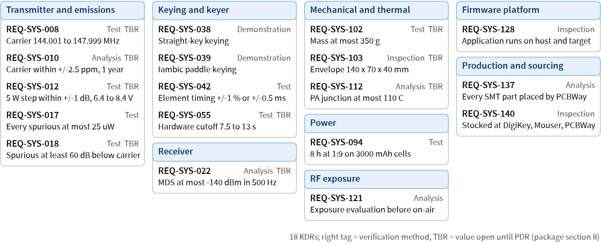
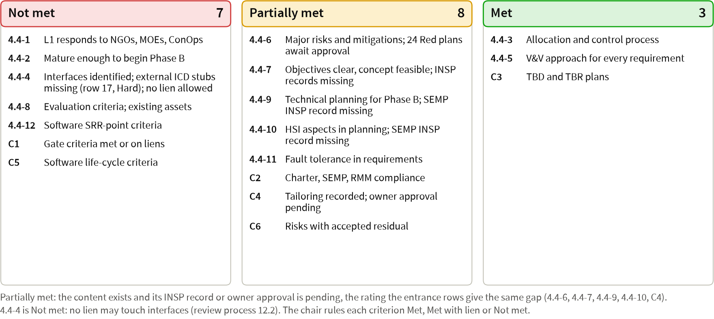

= SRR readiness status and owner decisions (pre-review session): cwht, SRR combined with MCR, package revision 3
:revealjs_theme: white
:revealjs_width: 1920
:revealjs_height: 1080
:revealjs_margin: 0
:revealjs_center: false
:revealjs_slideNumber: c/t
:revealjs_controls: false
:revealjs_progress: false
:revealjs_transition: none
:customcss: srr.css
:pm: +/-
:source-highlighter!:
:icons!:

[.lead]
Pocket 2 m true-CW (A1A) 5 W handheld transceiver, 144.000 to 148.000 MHz

Package `docs/reviews/SRR/package.md`, revision 3, dated [.nw]##2026-09-25##

Chair, Decision Authority, ETA and SMA TA: Robin. Presenter: Claude (lead systems engineer).

[.callout.warn]
Pre-review session: the SRR gate review is not convened. Review process section 4.2 convenes it once the Hard rows of sections 3.2 and 4.3 are met; 17 items, H1 to H17, block the readiness declaration (package section 2).

The minutes record this session as a pre-review session, not as the gate review.

[.notes]
--
Robin, this is a pre-review session of the cwht System Requirements Review, which also serves as the Mission Concept Review (charter section 3).
The gate review itself is not convened: review process section 4.2 convenes the SRR once the Hard rows of sections 3.2 and 4.3 are met, and 17 items, H1 to H17, still block the readiness declaration, so I will not ask you for a disposition in this session.
I will present package revision 3 of 2026-09-25 slide by slide and wait after each slide for your questions, RFAs and RIDs, as review process section 3.4 requires; the minutes record this session as a pre-review session and not as the gate review.
What this session can produce is your ruling on the 104 numbered owner decisions and your adoption or rejection of the 21 candidate RIDs, which unblocks most of the remaining work.
Every slide names, at its top right, the package section it summarizes, and nothing on a slide goes beyond the package and the products it links.
Evidence: docs/reviews/SRR/package.md (header table and section 2); docs/reviews/SRR/decisions-for-owner.md; docs/process/01-lifecycle-and-reviews.md sections 3.4 and 4.2.
Question for Robin: shall I present the full deck now, or only the readiness status, the decision slides and the candidate RIDs?
--

== Agenda [.src]#§1#

[cols="37,11,12,10,30",options="header"]
|===
| Block | Package items | Package sections | Slides | Chair decision needed
| Purpose, readiness, roles, entrance checklist, changes | 1 to 3 | §1 to §5 | 3 to 7 | Confirm the agenda (S1)
| Products and figures | 4 | §6, §7 | 8 to 13 | Questions, RIDs, RFAs
| Requirements and traceability | 5 | §8 | 14 to 16 | Questions, RIDs, RFAs
| Hazards and safety | 6 | §9 | 17 | Questions, RIDs, RFAs
| TPMs, risks, milestones | 7, 8 | §10 to §12 | 18 to 21 | Approve the Red risk plans
| TBR list and the 104 owner decisions | 9 | §13 | 22 to 35 | Accept TBR plans; rule decisions
| RFA/RID trend, candidate RIDs, software, tailoring | 10 to 13 | §14 to §19 | 36 to 40 | Adopt candidate RIDs; approve rows
| Success criteria, liens, disposition | 14, 15 | §20, §21 | 41, 42 | Rule the criteria
|===

[.notes]
--
The package agenda has 15 items; I grouped them into eight blocks in the same order so the minutes can follow the slide numbers.
The charter minimum slide set maps as follows: title and agenda on slides 1 and 2; purpose, scope and entrance status on 3 to 7; products with evidence on 8 to 13; requirements and traceability on 14 to 16; hazards on 17; risks and TPMs on 18 to 20; TBD, TBR and open decisions on 22 to 35; the RFA and RID trend and the 21 candidate RIDs on 36 to 38; tailoring and liens on 40 and 42; the requested disposition on 42.
The decision block is long because the package consolidates 104 decisions from the 22 research reports and the foundation documents; each decision slide carries the recommendation and the default the package assumes if you do not answer.
The success criteria for this gate are review process section 4.4 plus the standing criteria of section 3.3.
Evidence: package section 1 and the slide map of section 1.1; docs/process/01-lifecycle-and-reviews.md sections 3.3, 3.4 and 4.4.
Question for Robin: do you confirm this agenda and these success criteria? Entrance criterion S1 is Met only when you do.
--

== Purpose, scope and disposition options [.src]#§1; 01 §4.1, §12#

* *Purpose:* confirm that the functional and performance requirements respond to your NGOs, MOEs and ConOps, are achievable within the project's means, that the concept is feasible, and that the plans are sufficient to begin preliminary design
* *Scope:* SRR combined with MCR; the gate sets the functional baseline: NGOs, MOEs, ConOps, L1 requirements, SEMP
* *Judged against:* review process section 4.4 (12 criteria) and the standing criteria C1 to C6
* *Dispositions:* Approved; Approved with liens (each lien with owner, plan and due); Not approved (re-review in the same folder)
* *Never a lien:* an unmet Hard entrance criterion, an open Major RID, a failing traceability report, a TBD in a product to be baselined

[.notes]
--
The SRR decides whether the requirements and the concept are good enough to baseline, and whether the plans are good enough to start Phase B preliminary design.
Because the SRR absorbs the MCR, the MCR products (stakeholder expectations, concept and MOEs, SE-35 to SE-37) are entrance products here as well.
Approving the gate creates the functional baseline and the annotated tag baseline/srr; after that, every requirement change goes through a CR with you as the board.
You have three dispositions available, and the rules of section 12.2 fix what may and may not be carried as a lien.
Evidence: package section 1; docs/process/01-lifecycle-and-reviews.md sections 4.1, 4.4, 12.1 and 12.2; charter sections 3 and 4.
No decision is needed on this slide.
--

== Readiness: the declaration is blocked [.src]#§2, §3, §5#

[.callout.warn]
The presenter does not request a disposition at this revision (package section 21).

* 17 items, H1 to H17, block the declaration: Hard entrance shortfalls and items due before it (next two slides)
* Traceability report of [.nw]##2026-09-25##: PASS for the rules the tool implements (0 violations, 0 warnings); by hand, [.nw]##T-18## lists 177 warnings and [.nw]##T-21## passes
* `validate_docs.py` exit 0; the risk check with `+--hazards+` exits 1 on the [.nw]##HZ-015## back-link
* All are developer evidence: no tool has a TV record yet (H12), so S4, row 8 and row 24 rest on uncredited tool runs
* Roles: Robin is chair, Decision Authority, ETA and SMA TA; Claude presents; no reviewer agent has run for this gate
* Changes since the last review: none, first gate; revisions 2 and 3 corrected the package during assembly (package section 5)

[.notes]
--
I am presenting an honest status rather than asking for approval.
Seventeen items, numbered H1 to H17, are Hard shortfalls or items that must be done before the readiness declaration, and review process section 12.2 does not allow any of them to be a lien.
The traceability tool passes for the rules it implements; the two SRR rules it does not implement are applied by hand in package section 8: T-18 lists all 177 non-retired requirements as unallocated, 177 warnings at SRR, and T-21 on the stakeholders passes.
The schema validation passes, but the mandatory risk check with the hazards file fails on one missing back-link from HZ-015 to RSK-034.
None of the tools whose output I cite has a tool validation record yet, so these runs are developer evidence and not credited evidence; entrance rows S4, 8 and 24 are rated Met on such runs, and the board on slide 7 marks them.
There is no prior gate, so there are no changes to report; revision 2 exists because a readiness check of revision 1 found rows rated against substituted evidence, and revision 3 carries the corrections of the independent deck review; package section 5 lists both.
Evidence: package sections 2, 3, 5, 8 and 21.
Question for Robin: do you want the Soft shortfalls S8 and S10 carried as the proposed liens L-2 and L-3, to be accepted at the readiness confirmation?
--

== Hard shortfalls, 1 of 2 [.src]#§2#

[cols="7,53,40",options="header"]
|===
| Item | Shortfall | Closure path (owner)
| H1 | S3: no independent reviewer record; `checklists/` is absent, so no product is at baseline maturity | Reviewer agents file the INSP records; Robin rules the findings
| H2 | Retirement of [.nw]##REQ-SYS-016## and [.nw]##REQ-SYS-123## rests on a review with no filed record | The L1 record carries both, or they are reverted before `baseline/srr`
| H3 | S11: deck written, rendered and inspected; not committed, not yet from the final package | Commit it (H17); re-render and re-inspect from the final package
| H4 | Row 1: stakeholders array added; [.nw]##T-21## tool rule missing; representation rule unconfirmed | Implement [.nw]##T-21## or keep the by-hand result; Robin confirms the rule
| H5 | Row 5: no concept-level trade study file (`TS-NNN`) exists | Claude writes the receiver and [.nw]##PA-topology## trade; review
| H6 | Row 7: no `allocation.json` (177 unallocated); ConOps D3 to D7 and D10 open | Preliminary allocation; [.nw]##T-18## in the tool; answer or RID each item
| H7 | Row 14: 17 hazard open questions due at SRR are Open | Reconcile `hazards.json`; answer or rule (decisions 9, 36 to 41)
| H8 | Row 15: single point failure rows 3, 4 and 8 have no requirement | Robin rules decisions 38 to 40; Claude writes the requirements
|===

[.notes]
--
These are the first eight blocking items, in the package's order.
H1 is the largest: no independent reviewer record exists for any SRR product, so none of the six minimum products SE-35 to SE-39 and SE-66 is at baseline maturity, and the 25 ADRs still read "Independent reviewer: Pending".
H2 matters because two L1 requirements were retired on the strength of a review whose record has not been filed; if the record does not carry those findings, the retirements are reverted.
H3 is this deck: package revision 3 records its render and inspection in the slide-deck block of section 2, and H3 closes when the deck is committed and re-rendered from the package that closes the other H items.
H6 is the allocation file: applied by hand, rule T-18 lists all 177 non-retired requirements as unallocated, and six ConOps alignment items that change hazard-control requirements are still open.
H7 and H8 connect to your safety decisions: 17 hazard questions due at SRR are open, and three single point failures wait for decisions 38, 39 and 40.
Evidence: package section 2 table, items H1 to H8; package section 18.1.
Question for Robin: none on this slide; the related decisions come on slides 24, 27 and 28.
--

== Hard shortfalls, 2 of 2 [.src]#§2#

[cols="9,53,38",options="header"]
|===
| Item | Shortfall | Closure path (owner)
| H9 | S7: risk check with `+--hazards+` fails on [.nw]##HZ-015##; seven [.nw]##SRR-due## steps open | Add [.nw]##RSK-034## to [.nw]##HZ-015##; re-run; close or re-plan the steps
| H10 | S9: the nine deck figures have no controlled generator; ConOps T08 label detached | Generator into `tools/` with its test; re-lay out `conops-modes.mmd`
| H11 | Row 17: none of the five external ICD stubs exists; template lacks the Security row | Add the template row; write the five stubs; review
| H12 | Row 20: toolchain proof not done; [.nw]##FW-B0## and `TC-SW-TOOL-001-r1` absent; no TV record | Run the lock checks; [.nw]##FW-B0## (Robin observes); file the nine TV records
| H13 | Row 22: 03 transcribes `hazards.json` [.nw]##0.1.0-pha##; concurrence record missing | [.nw]##Re-transcribe## from [.nw]##0.2.0-pha##; file the concurrence
| H14 | Row 23: 07 section 14 differs from the hazard analysis; [.nw]##SWE-033## trade absent | Reconcile 07; write and review the make/buy trade
| H15 | Row 25: regulatory `+REQ-TX-*+` file and [.nw]##SW-KEYER## file absent | Write both (decision 104{nbsp}a), or Robin defers them (104{nbsp}b)
| H16, H17 | Items due before the declaration; SRR products untracked, no commit hashes | Named authors fix; Robin authorizes the commits
|===

[.notes]
--
The second half of the list is mostly work that Claude or a named author can do without a ruling.
H9 is a one-field fix in hazards.json plus seven risk mitigation steps that fall due at SRR.
H10: the concept block diagram and the risk matrix now exist with the seven other deck figures, and package section 7 lists each figure with its source and inspection result; H10 stays open until their generator is a controlled tool in tools/ with its known-answer test and the ConOps modes figure is re-laid out.
H12 is the toolchain proof: the versions are recorded, but the sanity checks, the git known-answer test, the FW-B0 blinky on your Pico 2 and nine tool validation records are all outstanding.
H15 is the only item where a ruling of yours can replace the work: decision 104 lets you defer the regulatory transmitter file and the SW-KEYER file to PDR as a recorded deviation.
H16 groups the small process items due before the declaration, and H17 is the commit of the untracked SRR products, which needs your authorization.
Evidence: package section 2 table, items H9 to H17; package sections 7, 11 and 16.
Question for Robin: do you authorize Claude to commit the SRR products once their records are filed (H17)?
--

== Entrance-criteria checklist [.src]#§4#

image::../figures/entrance-checklist.png[alt="Entrance criteria by status: Not met 7, Partially met 17, Met 15",width=1760]

[.notes]
--
This board shows all 39 entrance criteria: the eleven standing criteria S1 to S11 and the 28 SRR rows, grouped by the status the package assigns.
Seven are Not met, seventeen Partially met and fifteen Met; the tag on the right says whether a row is Hard or Soft.
Row 10, the ConOps scenarios, is Partially met in revision 3: the content is complete, but the ConOps has no INSP record and its appendix D items are open, the same gap that rates rows 1 to 4, 9 and 12 Partially met.
Ten of the seventeen Partially met rows cite a missing reviewer record, the H1 item, so filing those records moves many rows at once.
The dagger marks S4, row 8 and row 24: they are Met on the traceability report and the compliance-matrix check, whose tools have no TV record yet (H12), so their evidence stays developer evidence until the records exist.
The Soft rows S8 and S10 are the only shortfalls eligible as liens; every Hard row in the left and middle lanes must be Met before the declaration.
S11 stays Not met until this deck is committed and re-presented from the final package (H3).
Evidence: package section 4 (standing criteria and SRR table) with the commit column; review process sections 3.2 and 4.3; figure docs/reviews/SRR/figures/entrance-checklist.png.
Question for Robin: none on this slide.
--

== Project summary and binding owner decisions [.src]#§6.1; SI log#

[cols="17,83",options="header"]
|===
| Area | Owner decision (stakeholder input)
| Radio | Pocket true-CW (A1A) handheld, full US 2 m band 144.000 to 148.000 MHz, 5 W ([.nw]##SI-001##, 003, 004, 024)
| Growth | 2 m only in revision A; the path to 70 cm stays open ([.nw]##SI-002##)
| Controller | Raspberry Pi Pico 2 with Rust on rustos; its micro-USB loads firmware and charges ([.nw]##SI-007##, 022)
| Keying | Straight key and iambic paddle on 3.5 mm TRS; 5 to 50 WPM; semi break-in only ([.nw]##SI-018##, 033, 034, 036)
| Power | Two 18650 cells in holders; battery life 8 h at 1:9 TX:RX ([.nw]##SI-023##, 034)
| Build | PCBWay turnkey SMT, owner hand-solders through-hole; CNC aluminum via OpenSCAD and FreeCAD STEP ([.nw]##SI-008##, 009, 031, 032)
| Sourcing | PA stocked at DigiKey, Mouser or PCBWay turnkey distributors; synthesizer by cost-performance trade ([.nw]##SI-028##, 029)
| People, V&V | Every operator licensed; host-first verification, emulation never for timing; MIT ([.nw]##SI-030##, 026, 025)
|===

[.notes]
--
This slide lists the owner decisions that the requirements treat as constraints; each one is a stakeholder input in the SI log and a constraint in expectations.json.
The radio is a pocket true-CW handheld for the whole US 2 m band at 5 W, built around the Pico 2 with Rust on your rustos.
The keying decisions are the heart of the product: a straight key and an iambic paddle on one TRS jack, 5 to 50 WPM, and semi break-in only, since you ruled out full QSK in SI-036.
The build is a kit model: PCBWay places every surface-mount part and you solder the through-hole parts, and the enclosure is CNC aluminum from OpenSCAD.
Two further decisions shape verification: software is proven on the host through the rustos api traits, and you will buy a tinySA Ultra for the emission measurements (SI-034).
Evidence: docs/requirements/l0-stakeholder/stakeholder-inputs.md (SI-001 to SI-036); package section 6.1; docs/design/concept.md section 2.
Question for Robin: is anything on this slide not what you decided?
--

== Stakeholders, NGOs and MOEs [.src]#§6.1#

[.note]
36 stakeholder inputs; 8 stakeholders; 30 NGOs (1 Need, 7 Goals, 22 Objectives); 13 MOEs; 28 constraints; all Draft

[cols="33,67",options="header"]
|===
| Goal | MOEs that judge it, with the key success number
| [.nw]##NGO-002## Simplex CW range at 5 W | [.nw]##MOE-001## 5.0 km open ground; [.nw]##MOE-002## 30 km hilltop; [.nw]##MOE-010## weak signal beside a strong one
| [.nw]##NGO-003## Natural CW, either key | [.nw]##MOE-005## timing {pm}1 % or {pm}0.5 ms; [.nw]##MOE-008## Technician friend in 30 min; [.nw]##MOE-011## audio comfort
| [.nw]##NGO-004## Lawful and safe | [.nw]##MOE-006## spurious, 60 dBc target; [.nw]##MOE-009## exposure evaluation before on-air; [.nw]##MOE-012## no unintended key-down over 13 s
| [.nw]##NGO-005## Works at first power-on | [.nw]##MOE-003## bring-up stages 0 to 8 with no board respin
| [.nw]##NGO-006## Pocket, a day outdoors | [.nw]##MOE-004## 8 h at 1:9; [.nw]##MOE-013## pocket carry (drafted, awaits [.nw]##OQ-SE-005##)
| [.nw]##NGO-007## Buildable and open | [.nw]##MOE-007## delivered cost per unit within the approved budget
| [.nw]##NGO-008## Path to 70 cm | No MOE: judged by Inspection through its L1 requirements ([.nw]##NGO-030##)
|===

[.notes]
--
The single Need, NGO-001, is a pocket true-CW 2 m handheld for Morse contacts among licensed friends that is lawful, safe and works at first power-on.
Seven Goals elaborate it, and each Goal except the 70 cm path is judged by one or more of the thirteen MOEs shown here.
The stakeholders array was added in this revision with eight entries, including the FCC as regulator, PCBWay and the distributors as vendors, and bystanders as the public.
MOE-013 for pocket carry is drafted but waits for your ruling on OQ-SE-005, which is decision 96.
None of these entries has an independent reviewer record yet, which is why entrance rows 1 to 3 read Partially met.
Evidence: docs/requirements/l0-stakeholder/expectations.json and expectations.md; package section 6.1 and entrance rows 1 to 3.
Question for Robin: do these MOEs describe how you will judge success? You are the representative of the friends as well (02 section 3.0 representation rule).
--

== ConOps: operating modes and scenarios [.src]#§6.2, §7#

image::../figures/conops-modes-scenarios.png[alt="ConOps modes and the 22 operational scenarios",width=1760]

[.notes]
--
The ConOps defines nine modes, of which exactly one is active at a time; flags such as GUEST and PRACTICE and inhibits such as KEY and HOT decide the Arm condition, which is the only gate to a carrier.
This figure is a simplified view drawn for the deck from ConOps section 3.4; the full transition table T01 to T25 stays in ConOps Table 3.4-2.
On the right are the 22 scenarios: twelve nominal, from first power-on to kit hand-over, and ten off-nominal, including the stuck key, high SWR, a charging fault and keying at the face.
Every case that entrance row 10 names is present: straight key and paddle, headphones, tuning, charging, high SWR and stuck key.
The ConOps's own modes figure has a known defect, the T08 label sits away from its edge, recorded as discrepancy 16 in package section 15.
Evidence: docs/conops/conops.md sections 3.4 and 6; docs/conops/figures/conops-modes.png; package sections 6.2 and 7; figure docs/reviews/SRR/figures/conops-modes-scenarios.png.
Question for Robin: do the scenarios cover how you and your friends will use the radio?
--

== Concept overview: block diagram [.src]#§6.2, §7; concept §5#

image::../figures/concept-block-diagram.png[alt="Concept block diagram B01 to B22 grouped by module",width=1760]

[.notes]
--
This is the concept block diagram of concept section 5, blocks B01 to B22, grouped into the six L2 modules RX, TX, CTL, PWR, ME and SW.
The receive path runs from the SMA jack through the harmonic filter and the T/R relay, which rests in receive, to the front end, the mixer and one of the two selectivity candidates, A or B, that TS-001 decides at PDR.
The transmit path runs from the TCXO-disciplined synthesizer through the exciter to the PA, whose gate-bias loop sets the power step and shapes the keying envelope.
The hardware cutoff B07 removes PA enable independently of firmware on a long key-down and while the charger is active; the PA runs from the protected pack.
This render is the concept figure that package section 7 lists with its source, concept section 5, and its inspection result; two secondary links are not drawn as lines: the 3.3 V analog rail is named inside block B20, and the charger I2C and sense link to the Pico 2 is left out.
Evidence: docs/design/concept.md sections 4, 5 and 7; package sections 6.2 and 7; figure docs/reviews/SRR/figures/concept-block-diagram.png.
Question for Robin: none on this slide.
--

== Concept feasibility: alternatives, trades, technology [.src]#§4 rows 4 to 6, 20; §6.13#

* Feasibility argued block by block with research sources; no technology below TRL 6; toolchain proof not done (H12)
* 18 concept-level alternative sets dispositioned; six PDR trade studies defined: [.nw]##TS-001## selectivity, [.nw]##TS-002## synthesizer and reference, [.nw]##TS-003## PA device, [.nw]##TS-004## board thickness, [.nw]##TS-005## USB current, [.nw]##TS-006## ALC topology
* Gap: no `TS-NNN` file exists, neither the concept-level trade (row 5) nor the [.nw]##SWE-033## make/buy trade (H5, H14)
* Ten descope options, ordered by value lost (row 6 Met)
* Design maturity tracked apart from TRL: RF blocks at [.nw]##DML-4## by PDR and [.nw]##DML-5## by CDR
* No RF breadboard before the procurement release: hardware TRL 3, a residual of [.nw]##RSK-008## (decision 11)

[.notes]
--
Feasibility rests on the research: 22 reports argue each block from catalog parts and published practice, and the technology assessment finds nothing below TRL 6, so no Technology Development Plan is needed.
Alternatives were considered at concept level for eighteen decision areas and the open ones become the six PDR trade studies listed here.
The weakness is that none of those trades exists yet as a trade-study file, which is why entrance row 5 and software criterion SWE-033 are shortfalls.
The technology assessment keeps two scales apart: technology TRL, which is high because the parts are catalog parts, and cwht design maturity, which is low because the design work has not started; decision 13 asks you to accept that method.
Decision 11 asks you to accept that hardware reaches only TRL 3 at the CDR procurement release, since no RF breadboard is built first, as a recorded residual of RSK-008.
Evidence: package entrance rows 4, 5, 6 and 20, sections 6.2 and 6.13; docs/design/concept.md sections 11 and 12; docs/plan/technology-assessment.md.
Question for Robin: none here; decisions 11 and 13 are on slide 24.
--

== Products with evidence links and counts [.src]#§6#

[.note]
No product has an independent reviewer record yet (S3), so every product is at "Preliminary" in repository terms.

[cols="31,33,36",options="header"]
|===
| Product | Evidence | Counts
| Expectations ([.nw]##SE-35##, [.nw]##SE-37##) | `docs/requirements/l0-stakeholder/` | 36 SI, 8 stakeholders, 30 NGO, 13 MOE, 28 CON
| ConOps and concept ([.nw]##SE-36##) | `docs/conops/`, `docs/design/concept.md` | 22 scenarios; B01 to B22; F1 to F10; 18 ICDs identified
| L1 requirements ([.nw]##SE-39##), test cases | `docs/requirements/sys/`, `docs/test_cases/sys/` | 179 [.nw]##REQ-SYS## (177 Draft, 2 retired); 107 [.nw]##TC-SYS##
| Hazard analysis ([.nw]##SWE-205##) | `docs/safety/` | 15 hazards; 17 SPF candidates; 24 open questions
| Risk register and plan | `docs/risk/`, process 06 | 59 risks (24 Red); 130 candidates dispositioned
| SEMP, HSI, CM, process 01 to 08 | `docs/plan/semp.md`, `docs/process/` | App. J outline; HSI in SEMP 7.3.1
| RMM and compliance matrix | `docs/process/rmm.json`, `se-compliance-matrix.json` | 100 RMM rows; 62 compliance rows
| ADRs, TPMs, cost | `docs/decisions/adr/`, `docs/plan/` | 25 ADRs (3 Proposed); 20 MOPs, 20 TPMs; USD 970 to 1830
|===

[.notes]
--
This is the product list with its evidence paths and counts, which the charter minimum slide set requires.
The expectations, ConOps, concept, L1 requirements, test cases and hazards are untracked and the risk register is modified in the working tree; the process documents, the SEMP, the RMM and the compliance matrix are in commit 4e3f891.
Of the 25 ADRs, 22 transcribe your binding decisions and are Accepted; three are Proposed for you to rule at this review: ADR-015 operator model, ADR-022 harmonic target and ADR-023 TCXO and guard.
The cost estimate is USD 970 to 1830 for three radios including the instrument line, or USD 283 to 557 per unit without it.
Evidence: package sections 6.1 to 6.14 and the commit column of section 4.
Question for Robin: none on this slide.
--

== L1 requirements by functional group [.src]#§8#

image::../figures/requirements-by-group.png[alt="L1 requirements by functional group and verification method, with open TBR counts",width=1760]

[.notes]
--
There are 179 L1 requirements: 177 non-retired, all at status Draft, and 2 retired with status Closed and the tag retired.
The left chart shows each functional group split by verification method; across the set that is 107 Test, 41 Analysis, 21 Inspection and 8 Demonstration, and every one has a same-method closing case.
The right chart shows the open TBRs: 100 in total, all closing at PDR, concentrated in power, transmitter, receiver and mechanical.
The receiver is mostly Analysis because its values close through the TS-001 simulation and quotes.
The grouping is the package author's, made from the requirement titles, because the file has no category field.
Evidence: docs/requirements/sys/requirements.json; package section 8 (module and functional-group tables); figure docs/reviews/SRR/figures/requirements-by-group.png.
Question for Robin: none on this slide.
--

== Key driving requirements [.src]#§8#

[.note]
Among the 177 non-retired: 18 KDR, 5 Goal, 154 Baseline; 82 rationales still read "Proposed, owner decision pending at SRR".

[.notes]
--
These eighteen requirements drive the design, so they are the ones to read closely.
In the transmitter group, REQ-SYS-008 and REQ-SYS-018 carry the band-edge guard and the 60 dB spurious margin, which rest on your ADR-023 and ADR-022 rulings; REQ-SYS-017 is the absolute 25 microwatt limit of 47 CFR 97.307(e).
In keying, REQ-SYS-055 is the hardware cutoff independent of firmware, and REQ-SYS-042 sets the element timing that TPM-013 tracks.
Mass, envelope and PA junction temperature are TBR allocations that close at PDR, and REQ-SYS-094 is your 8 hour battery-life decision.
REQ-SYS-137 and REQ-SYS-140 carry the kit model and the sourcing rule of SI-028.
Evidence: docs/requirements/sys/requirements.json (priority KDR); package sections 6.3 and 8; figure docs/reviews/SRR/figures/kdr-map.png.
Question for Robin: do you agree these are the requirements that drive the design?
--

== Verification planning and traceability report [.src]#§6.4, §8#

* Traceability report: PASS for the rules the tool implements; 0 violations, 0 warnings, exit 0
* Every non-retired requirement has an L0 parent, a method, a verification note and a same-method closing case
* 107 [.nw]##TC-SYS## cases, all Draft: Bench 71, Simulation 25, Inspection 11; no verification report exists yet
* Applied by hand: [.nw]##T-21## stakeholders passes; [.nw]##T-18## lists 177 of 177 unallocated (no `allocation.json`)
* [.nw]##SWE-052## Table 1: rows 1, 5 and 6 enforced; row 2 in part; rows 3 and 4 not yet (no design or code)
* Requirements volatility: not applicable until a baseline exists

[.notes]
--
The traceability report of 2026-09-25 passes with no violations and no warnings for the rules the tool implements, and it is the frozen record for this gate.
It does not evaluate two SRR rules, the stakeholders rule T-21 and the allocation listing T-18, so the package applies them by hand: T-21 passes and T-18 lists every non-retired requirement as unallocated.
The report text that says T-18 "applies from PDR" contradicts 02 section 8.2, which makes it a warning at SRR; that is candidate RID 21.
All 107 cases are Draft and no report exists, so the evidence-class coverage by credited report is zero in every class, as expected before design.
Evidence: docs/reviews/SRR/traceability-report.md and traceability.json; package sections 6.4 and 8; docs/test_cases/sys/test_cases.json.
Question for Robin: none on this slide.
--

[.columns]
== Hazards and safety [.src]#§9#

[.column.wide]
--
image::../figures/hazard-matrix.png[alt="Hazards in the severity by likelihood matrix, initial and residual",width=1030]
--

[.column.narrow]
--
* 15 hazards: initial High 5, Serious 8, Medium 2; residual Serious 3, Medium 5, Low 7
* Every control verification case is Draft; no control is verified yet
* [.nw]##Safety-critical## software: keying, PA enable and sequencing, safe-state manager, charging, thermal, audio limiting, scheduler
* Frequency control proposed safety-critical (decision{nbsp}9)
* 17 SPF candidates; rows 1, 3, 4 and 8 need decisions 36 and 38 to 40
* RF exposure evaluation is a PDR product
--

[.notes]
--
The hazard analysis at version 0.2.0-pha has fifteen hazards; the left matrix shows them uncontrolled and the right matrix with the allocated controls.
Five start High: overcharge, stuck transmission, hearing, discharge faults and a bad firmware load; with the allocated controls none remains High.
Three stay Serious: HZ-002 overcharge and HZ-015 hand assembly at Catastrophic-D, and HZ-004 stuck transmission at Critical-C, which decision 38 on the transmission-length backstop would lower.
Four of the seventeen single point failure candidates need your decision at this gate: the tune window of row 1 (decision 36) and rows 3, 4 and 8 (decisions 38 to 40).
The safety-critical software determination covers the components listed; frequency control is proposed safety-critical because it removes single point failure row 4, and that is your concurrence in decision 9.
The RF exposure evaluation is a controlled PDR product that rests on decisions 22, 23, 31 and 32.
Evidence: docs/safety/hazards.json 0.2.0-pha and docs/safety/hazard-analysis.md sections 3.4, 6 and 8; package section 9; figure docs/reviews/SRR/figures/hazard-matrix.png.
Question for Robin: do you accept this hazard list as complete for the preliminary analysis, or is a hazard missing?
--

== TPM status and margins [.src]#§10#

image::../figures/tpm-status.png[alt="Status of the 20 TPMs at SRR by zone",width=1760]

[.notes]
--
Eight of the twenty TPMs have a first value at SRR, two more are Red by the status rule, and ten are not reported yet; every entry is preliminary with credit false.
TPM-002 power margin is Red: the provisional receive allocation of 0.5 W is below the research estimate of 1.44 W for the expected build, so RSK-058 was opened and re-allocation is its first step, which is decision 98.
TPM-001 mass and TPM-016 envelope are Red by the status rule only, because no estimate exists at a reporting review; lien L-2 carries them to PDR.
TPM-007 spurious margin shows 17 dB against the 7 dB target, TPM-008 battery life 9.5 h against 8 h, and TPM-014 unit cost USD 557 against the proposed USD 610 ceiling.
The review-trend TPM-003 is Green because no RFA or RID exists yet.
Evidence: docs/plan/tpm.json; package section 10; figure docs/reviews/SRR/figures/tpm-status.png.
Question for Robin: none here; the power re-allocation is decision 98 and the cost ceiling decision 90.
--

== Risk matrix [.src]#§11#

image::../figures/risk-matrix.png[alt="Five by five matrix of the 59 active risks",width=1760]

[.notes]
--
The register has 59 active risks, all Proposed pending the independent check: 24 Red, 30 Yellow and 5 Green.
A risk sits in the cell of its likelihood and its maximum consequence dimension; RSK-007 and RSK-034 sit in a Yellow cell but are Red by the safety override because their safety consequence is 5.
Nineteen of the Red risks share the score 12, seventeen of them in the Possible row at consequence 4; the highest score is RSK-008, a second board spin, at 20.
Twenty-five risks were opened at this assessment and none was closed or accepted.
This render is the risk matrix that package section 7 lists with its source, register.json, and its inspection result; the register's own Markdown matrix is current and agrees with it.
Evidence: docs/risk/register.json and register.md; package section 11; figure docs/reviews/SRR/figures/risk-matrix.png.
Question for Robin: none here; the plan approvals are on the next slide and in decision 14.
--

== Red risks ranked 1 to 8 [.src]#§11#

[cols="6,35,14,34,11",options="header"]
|===
| Rank | Risk | L x C | First mitigation step (due) | Owner
| 1 | [.nw]##RSK-007## [.nw]##Li-ion## cell thermal event | 2 x 5 = 10 * | S1 hazard entry for the cells (SRR) | Claude
| 2 | [.nw]##RSK-034## Burn or fire in hand assembly | 2 x 5 = 10 * | S1 [.nw]##HZ-015## control requirements (PDR) | Claude
| 3 | [.nw]##RSK-008## First power-on fails; board respin | 4 x 5 = 20 | S1 design-for-debug guideline (PDR) | Claude
| 4 | [.nw]##RSK-014## Procurement released unreviewed | 4 x 4 = 16 | S1 CDR readiness checklist (CDR) | Robin
| 5 | [.nw]##RSK-002## LO error beyond 250 Hz | 4 x 4 = 16 | S1 frequency error budget (PDR) | Claude
| 6 | [.nw]##RSK-001## PA oscillation or spurious | 3 x 4 = 12 | S1 PA device per [.nw]##SI-028## (PDR) | Claude
| 7 | [.nw]##RSK-006## PA junction temperature at 5 W | 3 x 4 = 12 | S1 thermal budget (PDR) | Claude
| 8 | [.nw]##RSK-011## Spurious not credibly measured | 3 x 4 = 12 | S1 close [.nw]##OQ-VV-001## (PDR) | Robin
|===

[.note]
{asterisk} Red by safety override. Ranks 9 to 24, all score 12: [.nw]##RSK-016##, 017, 024, 026, 025, 003, 004, 047, 038, 005, 012, 027, 028, 029, 049, 058.

[.notes]
--
These are the eight highest-ranked Red risks; the safety-override risks rank first by the register's rule.
RSK-008 is the one I watch most: a defect found at first power-on that firmware and hand rework cannot fix means a second board spin, and its trigger watches nine child risks.
RSK-014 is yours: the expedited schedule could release the PCBWay and DigiKey orders against a product that has not been independently reviewed, and its mitigation is a lien rule on the CDR agenda.
RSK-011 is also yours because it depends on the tinySA Ultra and a 30 to 40 dB attenuator being in hand and characterized before the first TRR.
Seven mitigation steps fall due at SRR and are open, among them RSK-009 S1, RSK-010 S1 and RSK-012 S5; RSK-028 S2 and RSK-046 S1 close with the SRR memo.
Evidence: docs/risk/register.md ranked list; package section 11 (top risks and the SRR-due steps).
Question for Robin: do you approve the mitigation plans of all 24 Red risks (decision 14), so each can record its plan approval?
--

== Milestones and procurement [.src]#§12#

[cols="23,20,28,29",options="header"]
|===
| Milestone | Planned | Status | Recovery
| SRR package ready | [.nw]##2026-09-26## morning | Assembled [.nw]##2026-09-25##; not ready (H1 to H17) | Reviewer runs, [.nw]##FW-B0##, missing files; decision 104
| PDR | [.nw]##2026-09-26## evening | Pending | Six trade studies, L2 specifications, ICDs, V&V plan
| CDR and procurement release | [.nw]##2026-09-27## evening and night | Pending; [.nw]##RSK-014## Red | Lien rule of [.nw]##RSK-014## S2
| Vendor delivery, TRR | 2 to 4 weeks after the order | Pending; [.nw]##RSK-053## closure [.nw]##2026-10-01## to [.nw]##10-04## | Alternates in the BOM at CDR
|===

* Procurement: no BOM line exists yet; the PCBWay questions are not sent (decision 101)
* Stock seen on [.nw]##2026-09-25##: zero at DigiKey and Mouser for TPS62913, TPS7A2033 and BQ25792 ([.nw]##RSK-038##, Red)

[.notes]
--
You approved an expedited schedule in SI-020: SRR on Saturday morning, PDR on Saturday evening and CDR with procurement release on Sunday.
The SRR milestone is not met yet: the package exists, but the Hard items keep it from being ready, and the recovery is the reviewer runs, the FW-B0 toolchain proof on your Pico 2 and the missing files.
The PDR list is heavy, six trade studies plus the L2 specifications, ICDs and the V&V plan, and the expedited schedule itself is RSK-014, which is Red.
Vendor holidays from 2026-10-01 to 10-04 threaten the delivery window, and three rail parts showed zero distributor stock in the research, so alternates must be in the BOM at CDR.
Evidence: docs/plan/schedule.md; package section 12; docs/risk/register.json RSK-014, RSK-038, RSK-053.
Question for Robin: do you want to keep the SI-020 dates, knowing the SRR package is not ready?
--

== TBR list: owners and closure gates [.src]#§13#

[.note]
TBDs in items to be baselined: 0. Every TBR has an owner, a closure plan and a close-by gate (S5 Met).

[cols="30,9,31,30",options="header"]
|===
| TBR set | Count | Owner | Closure
| L1 requirement TBRs | 100 | Robin decides on Claude's proposal; Claude produces the evidence | Ruling here where the plan says so, then the PDR analysis; close by PDR
| TPM TBRs: [.nw]##TPM-001##, 002, 006, 014, 016 | 5 | Robin approves; Claude proposes | SRR or PDR memo; [.nw]##TPM-014## cost ceiling ruled at SRR (decision 90)
| [.nw]##Hazard-control## TBRs (hazard analysis 3.6) | 17 | Claude; Robin where a ruling is named | PDR analyses; close by PDR
|===

* Largest L1 groups: power 17, transmitter 16, receiver 16, mechanical 14, keying 11
* Proposed lien [.nw]##L-1## carries the L1, hazard-control and four TPM TBRs to PDR; [.nw]##TPM-014## is ruled here, not carried

[.notes]
--
No TBD remains in anything to be baselined, and every TBR has an owner, a plan and a close-by gate, which is what entrance criterion S5 checks.
The 100 L1 TBRs follow one pattern: many closure plans say that you decide the value at SRR on my proposal and that a PDR analysis confirms it, so the decision slides that follow are how most of them move.
The receiver TBRs all close through TS-001, the selectivity trade, and the power TBRs through the power-tree decisions and the PDR power trade.
The five TPM TBRs are allocations; TPM-014, the unit cost ceiling, is due at this gate and is ruled by decision 90, so it is not part of lien L-1, which carries the other four to PDR, as charter section 7 requires every L1 TBR to close by PDR.
The seventeen hazard-control TBRs are thresholds and windows the PDR analyses fix, such as the 7.5 to 13 s cutoff window and the 85 C thermal inhibit.
Evidence: package section 13 (the three TBR tables); requirement tbr objects in docs/requirements/sys/requirements.json; docs/safety/hazard-analysis.md section 3.6.
Question for Robin: do you accept these closure plans, with the PDR items carried as lien L-1?
--

== Owner decisions 1 to 8: governance, plans, tailoring [.src]#§13.1#

[.dec,cols="5,7,39,26,23",options="header"]
|===
| No. | Theme | Decision | Recommendation | If no answer
| 1 | A | Approve charter, process 01 to 08, SEMP, CM, risk, V&V and software plans | Approve once the S3 records exist and findings are ruled | Plans stay Draft; no functional baseline tag
| 2 | A | HSI as SEMP section 7.3.1, not a stand-alone HSI Plan | Confirm; add the rationale to the charter row | As stated; charter row without rationale
| 3 | A | Independent assessment by reviewer agents only, or an external reviewer | Accept as in SEMP section 4.1 | Accepted as stated
| 4 | A | Deviation: [.nw]##SE-55##, [.nw]##SE-56## not held; [.nw]##SE-51##, [.nw]##SE-52## relief (ORR with SAR) | Approve | Rows stay proposed; memo line unsigned
| 5 | A | [.nw]##SWE-017## wording: familiarization records, or briefs and reading lists | RMM wording; memos name the documents read | Each memo names the documents read
| 6 | A | Approve `rmm.json` with the [.nw]##SWE-211## and [.nw]##SWE-219## reliefs | Approve both; [.nw]##RSK-010## carries the residual | RMM Draft; [.nw]##SWE-219## method missing blocks CDR
| 7 | A | Cybersecurity relief ([.nw]##SWE-154##, 156, 157, 159, 210); HMTA and CIO/SAISO roles | Approve both | Rows proposed; 03 record unsigned
| 8 | A | As HMTA, accept the human safety risk of the [.nw]##SWE-022##, 023, 219 tailoring | Accept, with [.nw]##RSK-010## and the hazard analysis | Not accepted; three T rows stay proposed
|===

[.notes]
--
From here to slide 35 are the 104 owner decisions, numbered 1 to 104 as in package section 13.1 and decisions-for-owner.md, with the theme letter A to O in its own column, the recommendation, and what the products keep if you leave an item.
If you leave an item, the products keep the stated assumption; it is recorded in the SRR memo as your ruling only if you say so.
Decisions 1 to 8 are governance: approving the plans, the HSI location, independence, the review deviations, and the software tailoring you sign as ETA, SMA TA, Health and Medical TA and CIO/SAISO designee.
My recommendation on decision 1 is conditional: approve the plans only once the independent reviewer records exist, because approving them now would baseline unreviewed products.
Evidence: package section 13.1 items 1 to 8; decisions-for-owner.md theme A.
Question for Robin: for items 1 to 8, do you accept each recommendation, choose another option, or leave the item to its stated default?
--

== Owner decisions 9 to 16: governance, safety, risk, CM [.src]#§13.1#

[.dec,cols="5,7,39,26,23",options="header"]
|===
| No. | Theme | Decision | Recommendation | If no answer
| 9 | A | Concur with Class A and the safety-critical set; is frequency control safety-critical? | Concur, with frequency control safety-critical | [.nw]##Mission-critical## only; [.nw]##RSK-046## keeps SPF row 4
| 10 | A | Charter wording items (a) to (c) as a pre-baseline Log change | Approve (a) to (c) | Charter unchanged; Minor liens to PDR
| 11 | A | Accept hardware TRL 3 at procurement release as [.nw]##RSK-008## residual | Accept now; reconfirm at CDR | [.nw]##RSK-008## stays Mitigate; asked again at CDR
| 12 | A | Remove the untracked root `reveal.js/` copy and `result.json` | Remove | Claude deletes them before the declaration
| 13 | A | Accept the TRL and DML method; no Technology Development Plan | Accept; rename the column [.nw]##DML-n## | Method as written; [.nw]##G-3## 5.8 stays NA
| 14 | A | Approve the 24 Red risk plans; close [.nw]##RSK-009## on the recorded check | Approve all 24; close [.nw]##RSK-009## | No plan approval; the PDR risk check fails
| 15 | A | Branch and tag protection on GitHub; SSH tag signing | Protection before `baseline/srr`; signing by PDR | Plan and reflog check only; tags unsigned
| 16 | A | Later CM choices: rustos pinning, large binaries, archive, rustos licence | Path dependency; commit binaries; MIT licence | CM plan defaults; licence gap stays open
|===

[.notes]
--
Decision 9 is the most consequential in this group: concurring that frequency control, meaning the synthesizer frequency-word path and an independent frequency verification unit, is safety-critical for HZ-008.
I recommend it because it removes single point failure row 4, a wrong frequency word that puts the carrier outside the band; without it, 03 is re-transcribed without frequency control and RSK-046 keeps that failure open.
Decision 14 approves the mitigation plans of the 24 Red risks; without it the risk tool rejects the register at the PDR gate.
Decision 15 asks you to turn on GitHub branch protection before the baseline tag and to configure tag signing before PDR.
Evidence: package section 13.1 items 9 to 16; decisions-for-owner.md theme A; docs/safety/hazard-analysis.md section 6.3.
Question for Robin: for items 9 to 16, do you accept each recommendation, choose another option, or leave the default?
--

== Owner decisions 17 to 24: operator model, power limits [.src]#§13.1#

[.dec,cols="5,7,39,26,23",options="header"]
|===
| No. | Theme | Decision | Recommendation | If no answer
| 17 | B | Operator model [.nw]##OPS-A##, [.nw]##OPS-B## or both; [.nw]##ADR-015## disposition | [.nw]##OPS-A## default, [.nw]##OPS-B## only by dated record; accept [.nw]##ADR-015## | [.nw]##OPS-A##; [.nw]##ADR-015## Proposed; [.nw]##RSK-028## S2 open
| 18 | B | [.nw]##OPS-B## exposure tier: occupational basis, or 0.5 W and 1{nbsp}W steps only | Keep 1 W for [.nw]##OPS-B## until a dated record | [.nw]##OPS-B## limited to 0.5 W and 1 W
| 19 | B | [.nw]##Receive-only## guest lock; release (a) two-step or (b) licensee credential | Include, option a | Option a; [.nw]##REQ-SYS-065## rationale restated
| 20 | B | Guest keying under a present control operator at 0.5 W and 1 W, or listen only | Allow, restricted to 0.5 W and 1 W | Allowed as restricted; [.nw]##HZ-006## stays Medium
| 21 | B | Automatic CW ID, message memories or a WinKeyer interface in revision A | Not in revision A; reminder only | Not provided
| 22 | B | Power steps 0.5, 1, 2 and 5 W, each within {pm}1 dB | Adopt | Adopted as TBR, closed at PDR
| 23 | B | 1 W at first power-on and reset, with a confirmation for 5{nbsp}W | 1 W default, confirmation press for 5{nbsp}W | 1 W (TBR) as written
| 24 | B | Maximum output: 5.0 W {pm}1 dB (6.3 W ceiling), or a 6.0 W ceiling | 5.0 W {pm}1 dB, ALC target {pm}0.5 dB | [.nw]##REQ-SYS-012## as written (TBR)
|===

[.notes]
--
Theme B covers how the radio may be operated lawfully and safely.
Decision 17 is the operator model: under OPS-A each licensed friend operates a loaned unit as their own station under their own call sign, which is the research recommendation and what the requirements assume.
The guest lock of decision 19 is the main mitigation of an unlicensed person keying a loaned unit, RSK-028; option a keeps the claim modest, "no transmission by accident".
Decisions 22 to 24 set the power steps, the 1 W first-boot default and the 5 W ceiling; the 97.307(e) spurious evaluation is made at the 6.3 W ceiling.
Evidence: package section 13.1 items 17 to 24; decisions-for-owner.md theme B; docs/research/regulatory-corpus-and-operators.md, rf-exposure-evaluation.md, part97-regulatory-basis.md.
Question for Robin: for items 17 to 24, do you accept each recommendation, choose another option, or leave the default?
--

== Owner decisions 25 to 32: regulatory limits, RF exposure [.src]#§13.1#

[.dec,cols="5,7,39,26,23",options="header"]
|===
| No. | Theme | Decision | Recommendation | If no answer
| 25 | B | [.nw]##ADR-023##: (a) TCXO {pm}2.5 ppm with a 1 kHz guard, or (b) a wider guard | (a); accept [.nw]##ADR-023## | (a) as TBR; [.nw]##ADR-023## Proposed
| 26 | B | Full 144.000 to 148.000 MHz with presets, or a default lock to 144.000 to 144.300 MHz | Full band; presets 144.050, 144.100{nbsp}MHz | Full band, presets per [.nw]##OPS-01##
| 27 | B | Necessary bandwidth 208HA1A (K = 5) or 125HA1A (K = 3) | 208HA1A; 26 dB bandwidth of 350 Hz binds | 208HA1A
| 28 | B | Envelope: 5 ms 10 to 90 % raised cosine, 3 to 8 ms; or 5 ms full Hann | [.nw]##REQ-SYS-014## as written | [.nw]##REQ-SYS-014## as written
| 29 | B | [.nw]##ADR-022##: 60 dB harmonic target with the LPF goals; name [.nw]##HZ-008## | Adopt; accept [.nw]##ADR-022## with [.nw]##HZ-008## | 60 dB as TBR; [.nw]##ADR-022## Proposed
| 30 | B | Close [.nw]##REQ-SYS-001## by Inspection and 014, 015, 177 by Analysis | Accept; 015 to Test by CR if the tinySA RBW suffices | As written; [.nw]##RSK-011##, [.nw]##RSK-045## carry residual
| 31 | B | Posture P1 primary (antenna 20 cm away); P4 at the face off-nominal | Adopt | Adopted
| 32 | B | SAR by analogy at 0.35 W/kg per W; accept [.nw]##RSK-030##; FDTD estimate or not | Accept the analogy; no FDTD in revision A | Analogy accepted; [.nw]##RSK-030## asked again at PDR
|===

[.notes]
--
Decisions 25 and 29 dispose of two Proposed ADRs: ADR-023 fixes a TCXO of at most 2.5 ppm with a 1 kHz guard, so the carrier stays within 144.001 to 147.999 MHz, and ADR-022 sets the 60 dB spurious design target against the 53 dB limit that 47 CFR 97.307(e) gives at 5 W.
Before you rule on decision 29, note that ADR-022 still reads "Hazards in play: none" although its target is the HZ-008 K1 control; that is candidate RID 19.
Decision 30 accepts that four regulatory requirements close by Inspection or Analysis because no credited instrument resolves them, with the option to move the bandwidth requirement to Test once the tinySA is validated.
Decisions 31 and 32 set the exposure posture and accept SAR by analogy with commercial VHF handhelds rather than a simulation.
Evidence: package section 13.1 items 25 to 32; decisions-for-owner.md theme B; docs/decisions/adr/ADR-022 and ADR-023.
Question for Robin: for items 25 to 32, do you accept each recommendation, choose another option, or leave the default?
--

== Owner decisions 33 to 40: RF exposure, stuck-key controls [.src]#§13.1#

[.dec,cols="5,7,39,26,23",options="header"]
|===
| No. | Theme | Decision | Recommendation | If no answer
| 33 | B | Exposure accumulator and posture line: convenience, not safety-critical | Convenience function | Convenience function
| 34 | B | Enclosure legend engraved in the CNC job, or a printed label | Engrave | Engraved
| 35 | B | Corpus gaps: 2.106 rows, KDB and SAR downloads, 150 to 174 MHz rows | Do all three before PDR | 2.106 rows stay Medium confidence
| 36 | C | Tune and cutoff: (a) 0.5 W tune ending by 5.5 s, cutoff 7.5 to 13 s; (b) 10 s tune with the cutoff window moved above 11 s ([.nw]##MOE-012## bound re-derived) | (a) with the 74LVC1G123 | (a) as [.nw]##REQ-SYS-020## is written
| 37 | C | [.nw]##Stuck-key## limits: 5 s manual timeout; paddle watchdog 10 s, 30 s or no-gap form | 5 s with the Bug dah; no-gap watchdog, 2 s squeeze | As written; three [.nw]##OQ-SAF## open as RIDs
| 38 | C | Add a hardware transmission-length backstop, about 180 s | Adopt | Not adopted; SPF row 3 open
| 39 | C | Add a hardware PA over-temperature cutoff near 95 C | Adopt | Not adopted; SPF row 8 open
| 40 | C | Add an independent frequency check before and during transmit | Adopt | Not adopted; [.nw]##RSK-046## keeps SPF row 4
|===

[.notes]
--
Theme C is the stuck-key and transmit safety set, and these rulings change hazard-control requirements, so they matter most for the safety analysis.
Decision 36 aligns the tune carrier with the hardware cutoff: under option a, a 0.5 W tune that ends by 5.5 s always ends before the cutoff can act at its 7.5 s minimum; option b keeps a 10 s tune but moves the cutoff window above 11 s, which changes hazard control HZ-004 K5 and re-derives the 13 s bound of MOE-012; the SEMP HSI row and the concept still say 10 s and are corrected by your ruling.
Decision 37 chooses the paddle watchdog; I recommend the no-gap form of HZ-004 K4 because it also bounds a toggling key stream, which the element count alone does not.
Decisions 38, 39 and 40 add three independent hardware or verification controls, each closing an open single point failure: transmission length, PA over-temperature and wrong frequency.
Evidence: package section 13.1 items 33 to 40, section 15 items 14, 15 and 7; decisions-for-owner.md themes B and C; docs/safety/hazard-analysis.md section 8.2.
Question for Robin: for items 33 to 40, do you accept each recommendation, choose another option, or leave the default?
--

== Owner decisions 41 to 48: safety controls, keyer [.src]#§13.1#

[.dec,cols="5,7,39,26,23",options="header"]
|===
| No. | Theme | Decision | Recommendation | If no answer
| 41 | C | Bench test-mode guard: forced 0.5 W, 120 s timeout, exit on reset | Adopt | [.nw]##REQ-SYS-179## without the forced step, timeout
| 42 | C | Ratify the ConOps inhibit and latched classes, PRACTICE flag, bench limits | Ratify | ConOps 3.4 governs; ConOps items D1 to D6 raised as RIDs
| 43 | D | Keyer modes: all five with Iambic A default, or Straight, Iambic A and B | All five, Iambic A default | All five, Iambic A default
| 44 | D | Key type by menu only, or automatic mono-plug detection | Menu only in revision A | Menu only
| 45 | D | Speed default and control; spoken-Morse speed announcement | 15 WPM; press-and-turn; no announcement | 15 WPM, speed in the menu
| 46 | D | Sidetone 600 Hz locked to the receive offset, 300 to 1000 Hz; or 700 Hz | 600 Hz, locked, relative level | 600 Hz locked
| 47 | D | Hang 8 dits default, 3 to 30 dits; constant lead-in of at most 12 ms | Adopt; update [.nw]##ADR-010## and ConOps | As written
| 48 | D | Which keyer timing tunables the operator can change | Switchpoint and debounce only | [.nw]##Build-time## defaults except those two
|===

[.notes]
--
Decisions 41 and 42 finish the safety set: the bench test mode is the only source of machine-generated transmitted Morse, so I recommend forcing it to 0.5 W with a 120 s timeout.
Theme D is the keyer, the core feature of SI-018, and here the recommendations mostly ratify the research values.
All five modes stay, with Iambic A as the default, 15 WPM, and a 600 Hz sidetone locked to the receive offset so that zero-beating a friend works.
For the tunables, I recommend exposing only the switchpoint and the debounce, because every exposed knob adds verification under Class A rigor.
Evidence: package section 13.1 items 41 to 48; decisions-for-owner.md themes C and D; docs/research/keyer-and-key-interfaces.md.
Question for Robin: for items 41 to 48, do you accept each recommendation, choose another option, or leave the default?
--

== Owner decisions 49 to 56: keyer, receiver [.src]#§13.1#

[.dec,cols="5,7,39,26,23",options="header"]
|===
| No. | Theme | Decision | Recommendation | If no answer
| 49 | D | Key input abuse -5 V to {plus}12 V, ESD level 4; is a {plus}24 V keying line needed? | Adopt; no {plus}24 V line | Adopted as TBR
| 50 | D | Ratify keyer timing, contact thresholds, 500 ms interlock, debounce, latencies | Ratify; debounce closes by bench capture | Values as written (TBR where marked)
| 51 | D | Tell the key and headphone jacks apart by position, colour or engraving | Separate positions plus engraving | Same, at PDR with [.nw]##ICD-CTL-ME##
| 52 | D | Input sampling: 1 kHz TIMER0 polling, edge interrupts, or PIO | 1 kHz polling; interrupts only above 1{nbsp}ms | Polling
| 53 | E | Receiver family: superhet, internal transverter, direct conversion, commercial | Confirm the single-conversion superhet | Superhet confirmed
| 54 | E | Carry selectivity candidates A and B to [.nw]##TS-001##; adopt the TBR set | Carry both; adopt the set | Both carried; set as TBR
| 55 | E | Front end: low-noise MMIC near 97 mA, or a lower-current stage | [.nw]##Lower-current## stage (battery, [.nw]##RSK-058##) | Scored in [.nw]##TS-001##
| 56 | E | Synthesizer trade: USD 15 cost band, TX owns frequency generation, criteria | Confirm all three | As listed
|===

[.notes]
--
Decisions 49 to 52 finish the keyer: the key-jack abuse bound, the timing values, how the two jacks are told apart, and how the inputs are sampled.
Polling at 1 kHz from TIMER0 is the research recommendation of the rustos toolchain proof and the keyer verification report; edge interrupts come in only if the bench shows more than 1 ms latency.
Theme E is the receiver: I recommend confirming the single-conversion superhet family and carrying both selectivity candidates, the commercial crystal filter and the roofing ladder with DSP, to TS-001 at PDR.
Decision 55 recommends a lower-current front end because receive power drives battery life and TPM-002 is already Red.
Evidence: package section 13.1 items 49 to 56; decisions-for-owner.md themes D and E; docs/research/cw-selectivity-options.md; docs/research/2m-cw-transceiver-reference-designs.md.
Question for Robin: for items 49 to 56, do you accept each recommendation, choose another option, or leave the default?
--

== Owner decisions 57 to 64: receiver, transmitter, audio [.src]#§13.1#

[.dec,cols="5,7,39,26,23",options="header"]
|===
| No. | Theme | Decision | Recommendation | If no answer
| 57 | E | [.nw]##REQ-SYS-034## from 144.010 MHz, or full range with shielding; [.nw]##REQ-SYS-037## survives {plus}27 dBm with a limiter, or {plus}17 dBm | 144.010 MHz start; {plus}27 dBm with a limiter | As written
| 58 | F | PA set: [.nw]##PD54008L-E## primary, GRF5604 fallback, 12.5 V reserve; drop list | Adopt as the [.nw]##TS-003## starting set | [.nw]##TS-003## carries the recommendation
| 59 | F | ALC: gate-bias loop from the pack, or drive control, buck or clamp | [.nw]##Gate-bias## loop; cutoff node in [.nw]##TS-006## | [.nw]##Gate-bias## loop
| 60 | F | SWR fold-back with a coupler, or device ruggedness alone | Decide at PDR once the device is known | Decided at PDR
| 61 | F | HF3 relay, LPF after the T/R node; second receiver protection stage as a second shunt or a limiter | Relay, LPF after the T/R node, second protection stage per the fault analysis | As recommended
| 62 | F | Ratify TX fault responses, 2:1 mismatch bounds, 8.60 V lockout, monitor port | Ratify | Values as written (TBR where marked)
| 63 | G | Headphones only, or a speaker with class-D and a second hazard analysis | Headphones only | Headphones only
| 64 | G | Audio level policy (a): 100 mVrms ceiling, 150 worst case, 30 mVrms cap | (a) | (a) as written
|===

[.notes]
--
Decision 58 sets the PA starting point for TS-003: the ST PD54008L-E run directly from the pack, with the Guerrilla RF GRF5604 as fallback; it supersedes the Mitsubishi baseline, which SI-028 excluded because those parts are consignment-only.
Decisions 59 to 62 keep the gate-bias ALC loop, the Axicom HF3 class relay for semi break-in and the harmonic filter at the antenna port after the T/R node.
Theme G begins with the audio: headphones only in revision A, and the level policy (a), with a hardware ceiling of 100 mVrms for a full-scale sine and a 30 mVrms default cap that you unlock deliberately.
Evidence: package section 13.1 items 57 to 64; decisions-for-owner.md themes E, F and G; docs/research/pa-turnkey-candidates-followup.md; docs/research/tr-switch-candidates.md; docs/research/audio-output-and-hearing-safety.md.
Question for Robin: for items 57 to 64, do you accept each recommendation, choose another option, or leave the default?
--

== Owner decisions 65 to 72: audio, power and charging [.src]#§13.1#

[.dec,cols="5,7,39,26,23",options="header"]
|===
| No. | Theme | Decision | Recommendation | If no answer
| 65 | G | Audio source: PWM with a DNP I2S footprint, an I2S DAC, or analog | PWM with the DNP footprint | PWM with the DNP footprint
| 66 | G | No plug: amplifier off with indicator, or refuse to transmit; mono plugs under protection, series resistors, or TRS only | Shutdown with indicator, keyer live; accept TS plugs under protection pending [.nw]##RSK-039## S1 | As recommended
| 67 | G | Weekly sound-dose accumulator, or the cap and unlock only | Cap and unlock only in revision A | Not implemented
| 68 | G | Headphone amplifier: TPA6132A2, or capacitor-coupled with a digital pot | TPA6132A2 unless it fails the noise test | TPA6132A2
| 69 | G | Ratify receive mute, 5 to 20 ms restore fade, sidetone only with 1.5 m leads | Ratify | As written
| 70 | H | Charger: TI BQ25887, MP2672A or BQ25792 | BQ25887 | BQ25887 as the PDR baseline
| 71 | H | USB input: 500 mA always, 500 mA default with DCP to 1.5 A after [.nw]##TS-005##, or an operator setting; USB 2.0 deviation | 500 mA default, DCP only after [.nw]##TS-005##; accept the deviation, handbook note | 500 mA; deviation accepted
| 72 | H | Pack protection: [.nw]##S-8252## plus BQ29209; add the 4.30 V layer and Kelvin sense | [.nw]##S-8252## plus BQ29209; add both | Same; [.nw]##OQ-SAF-008##, 009 stay open
|===

[.notes]
--
Decisions 65 to 69 finish the audio chain: PWM audio with a footprint for an I2S DAC left unpopulated, the amplifier shut down with no headphones, no dose accumulator, and the TPA6132A2 unless its charge pump spoils the receiver noise floor.
Theme H is power and charging, which carries the Catastrophic battery hazards HZ-002 and HZ-007.
I recommend the TI BQ25887 two-cell charger at the 500 mA USB default; the REQ-SYS-091 rationale estimates about 11 h to charge against its 12 h limit, a margin under 1 h that RSK-055 carries, and I recommend accepting the USB 2.0 deviation of drawing up to 500 mA without enumeration, with a note in the handbook.
Decision 72 is two independent protection layers, the ABLIC S-8252 with dual N-FETs and a BQ29209 secondary over-voltage protector, plus two new requirements for the 4.30 V third layer and Kelvin sensing.
Evidence: package section 13.1 items 65 to 72; decisions-for-owner.md themes G and H; docs/research/power-tree-and-charging.md.
Question for Robin: for items 65 to 72, do you accept each recommendation, choose another option, or leave the default?
--

== Owner decisions 73 to 80: power, controls, antenna [.src]#§13.1#

[.dec,cols="5,7,39,26,23",options="header"]
|===
| No. | Theme | Decision | Recommendation | If no answer
| 73 | H | Cell holders: two Keystone 1043P, one dual holder, or a sled | Two 1043P | Two 1043P
| 74 | H | 5 V synchronous buck with SYNC; mechanical power switch, or soft power | Buck with SYNC; mechanical switch | As recommended
| 75 | H | While charging: receive with charge paused and hardware TX inhibit, concurrent receive and charge, or no operation | Receive allowed, charge paused, hardware transmit inhibit; record by ADR | As recommended
| 76 | H | Floor 6 h at 1:4; 3.20 V TX inhibit, 3.00 V power-down, 60{nbsp}C cell cutoff | Adopt | Adopted as TBR
| 77 | I | Display Sharp LS013B7DH03 or another memory LCD format; no front light in build 1 | LS013B7DH03, no light in build 1 | As recommended
| 78 | I | Two PEC11R encoders, two B3F buttons, printed knobs, [.nw]##SJ1-3535N## jacks | Adopt all | Adopted
| 79 | I | Ratify UI values: two knobs, 10 Hz to 10 kHz step, 4.0 mm digits, two levels | Ratify | Values as written (TBR where marked)
| 80 | J | Antenna connector: stainless SMA jack retained by the boss, or BNC | SMA jack | SMA jack
|===

[.notes]
--
Decisions 73 to 76 complete the power tree: two single cell holders, a synchronous 5 V buck, a mechanical power switch with the charger and protector always live, and receive allowed while charging with transmit inhibited by hardware.
Decision 76 adds a battery-life floor of 6 hours at 1:4 next to your 8 hours at 1:9, and fixes the low-battery thresholds as TBR values.
Theme I is the operator interface: a Sharp memory LCD without a light in the first build, two 24-detent encoders and two buttons, which answers SI-006 on minimal controls.
Decision 80 is the antenna connector: an SMA jack retained by the enclosure boss so that the board carries no antenna load.
Evidence: package section 13.1 items 73 to 80; decisions-for-owner.md themes H, I and J; docs/research/display-and-ui-parts.md; docs/research/antenna-and-erp.md.
Question for Robin: for items 73 to 80, do you accept each recommendation, choose another option, or leave the default?
--

== Owner decisions 81 to 88: antenna, enclosure, board, build [.src]#§13.1#

[.dec,cols="5,7,39,26,23",options="header"]
|===
| No. | Theme | Decision | Recommendation | If no answer
| 81 | J | Reference antennas and a radiated screen with the tinySA and a dipole | Adopt; correct concept 7.1 (quarter-wave) | Adopted
| 82 | J | Install SPLAT! for [.nw]##MOE-001## and [.nw]##MOE-002## range analysis, or on-air only | Install before PDR | Range validated on air only
| 83 | J | Enclosure: 6061 aluminium, bead blast, Type II anodize, masked contacts | Adopt | Adopted
| 84 | J | OpenSCAD 2021.01 or the snapshot; H2C fit prints; SLA only if needed | Stay on 2021.01; H2C prints | 2021.01; H2C prints only
| 85 | J | Environment: -10 to {plus}45 C operate, 0 to 45 C charge, 1.0{nbsp}m drop, IPX2 | Adopt (TBR); [.nw]##RSK-059## carries the residual | Adopted as TBR
| 86 | K | Build quantity: five fabricated with three assembled, or five assembled | Keep three now; decide five at CDR | Three assembled, five fabricated
| 87 | K | Board 1.0 or 1.6 mm, [.nw]##FR-4##, Type VII via fill, panelization | 1.0 mm with four bosses, else 1.6{nbsp}mm | As recommended, TBR
| 88 | K | Full turnkey SMT; all SMT on the top side in the first build | Full turnkey; single side as L2 at PDR | Full turnkey
|===

[.notes]
--
Decision 81 fixes the reference antennas: the Signal Stick 48 cm flexible quarter-wave whip with a 48 cm counterpoise tail for pocket use, and an end-fed half-wave for range; the concept calls the Signal Stick a half-wave, which is candidate RID 6.
Decision 85 is the environment set, with the plain statement that no qualification testing at the extremes is planned, carried by RSK-059.
Theme K begins with the build: five boards fabricated and three assembled now, with the choice of five assembled deferred to CDR against the quoted cost, and the board thickness decided by TS-004 from the enclosure boss layout.
Evidence: package section 13.1 items 81 to 88; decisions-for-owner.md themes J and K; docs/research/enclosure-cnc-and-openscad-pipeline.md; docs/research/pcbway-fabrication-and-assembly.md.
Question for Robin: for items 81 to 88, do you accept each recommendation, choose another option, or leave the default?
--

== Owner decisions 89 to 96: build, firmware, measures [.src]#§13.1#

[.dec,cols="5,7,39,26,23",options="header"]
|===
| No. | Theme | Decision | Recommendation | If no answer
| 89 | K | Functional test at PCBWay, or on the owner's bench at TRR | Owner's bench at TRR | Owner's bench
| 90 | K | Unit cost ceiling: USD 610 (TBR) per unit over three units | USD 610; instruments out of the unit budget | USD 610 (TBR); [.nw]##TPM-014## Yellow
| 91 | K | Early buys at PDR: PA lifetime reserve, samples, filter, rail parts | Approve at PDR by ADR | No early buy; [.nw]##RSK-005##, 038 stay Red
| 92 | L | Emulator [.nw]##ACC-EMU-001##: rp2350js pinned as a submodule, Renode fallback | Adopt all by the PDR ADR | Emulation uncredited until the ADR
| 93 | L | Rules: single core, one NVIC priority, PWM slices 0 to 7, GPIO via SIO | Adopt by ADR; register trait at PDR | As the concept states
| 94 | L | Tools: LTspice and ngspice, cargo-llvm-cov, lizard, cargo-geiger installs | Adopt and approve the installs | Not installed; gates G3, G4 cannot run
| 95 | L | RP2350 secure boot with signed images, or the [.nw]##CRC-32## image check | Decide at PDR ([.nw]##RSK-015##, [.nw]##RSK-022##) | [.nw]##CRC-32## image check only
| 96 | M | Add [.nw]##MOE-013## pocket carry; re-parent [.nw]##MOP-001## and [.nw]##MOP-002## | Add and re-parent | MOPs stay on [.nw]##MOE-001## with a caveat
|===

[.notes]
--
Decision 90 is the only TBR that closes at this gate: the unit cost ceiling, which I propose at USD 610 per complete unit amortized over three units, excluding instruments and labour, with the tinySA line moved out of the unit budget.
Decision 91 is asked now so that you can plan it: buying a lifetime reserve of the chosen PA device and bench samples early at PDR reduces two Red single-source risks.
Theme L is the firmware platform: the emulator stays uncredited until its ADR at PDR, and the design rules keep one core and one interrupt priority.
Decision 94 asks you to approve installing the pinned analysis tools; without them two of the software gates cannot run.
Evidence: package section 13.1 items 89 to 96; decisions-for-owner.md themes K, L and M; docs/plan/cost-estimate.md; docs/research/emulator-accreditation-and-timer-irq.md.
Question for Robin: for items 89 to 96, do you accept each recommendation, choose another option, or leave the default?
--

== Owner decisions 97 to 104: measures, owner actions, added [.src]#§13.1#

[.dec,cols="5,7,39,26,23",options="header"]
|===
| No. | Theme | Decision | Recommendation | If no answer
| 97 | M | Mass 350 g and envelope 140 x 70 x 40 mm as TBR allocations | Adopt as TBR; estimates by PDR | Provisional; no estimate at SRR
| 98 | M | [.nw]##Re-allocate## [.nw]##TPM-002## (receive about 1.5 W); [.nw]##TPM-019##, [.nw]##TPM-013##; 70 cm-ready | Approve with the PDR TPM definitions | [.nw]##TPM-002## stays Red
| 99 | N | Instruments: calipers, scale, meter, thermocouple, tinySA, attenuator, Pico 2 | Confirm or buy before PDR; tinySA by TRR | Measurement cases stay Blocked
| 100 | N | [.nw]##Hand-assembly## bench: station with stand and auto-sleep, fume extractor | As listed; alloy in the handbook | [.nw]##HZ-015## Serious; [.nw]##RSK-034## Red
| 101 | N | PCBWay questions and quotes; filter quotes; Guerrilla RF; ST PA files | Do all before PDR | Assumptions open; trades on published data
| 102 | N | Bench VBUS test at 0.5 to 1.5 A; PCM1808 breakout; mirror fork; stock checks | Do before PDR | [.nw]##TS-005## cannot raise the limit
| 103 | O | Stakeholder identifiers: keep the name keys, or add [.nw]##STK-NNN## | Keep the name keys | Name keys kept; [.nw]##CI-10## closes
| 104 | O | `+REQ-TX-*+` and [.nw]##SW-KEYER## files: (a) write now, or (b) defer to PDR | (a) | Row 25 and [.nw]##SWE-050## stay Not met
|===

[.notes]
--
Decisions 99 to 102 are actions only you can take: the instruments and fixtures, the hand-assembly bench equipment that controls HZ-015, the vendor correspondence with PCBWay, the filter makers, Guerrilla RF and ST, and a few bench experiments on your Pico 2.
Decision 100 matters for your own safety: without a temperature-controlled station with a stand, auto-sleep and a fume extractor, the hand-assembly hazard stays Serious and RSK-034 stays Red.
Decisions 103 and 104 were added at the readiness check; 104 is the one ruling that can change the readiness status, because option (b) defers the regulatory transmitter file and the SW-KEYER file to PDR as a recorded deviation.
I recommend option (a): the L1 set already carries the Part 97 clauses and the keyer behaviour, so both files are a derivation I can write before the declaration.
Evidence: package section 13.1 items 97 to 104; decisions-for-owner.md themes M, N and O; package section 2 item H15.
Question for Robin: for items 97 to 104, do you accept each recommendation, choose another option, or leave the default?
--

== RFA/RID trend, process and candidate RIDs [.src]#§14, §15; 01 §10#

* Prior trend: no prior review; the SRR log is empty; [.nw]##TPM-003## Green (0 raised, 0 open, 0 overdue)
* RID: a defect in a product; Major blocks the baseline, Minor is fixed before the next gate
* RFA: a question, analysis or plan; Blocking closes before the memo, Routine may be a lien
* Raised by Robin at any slide; logged as [.nw]##RFA-SRR-NNN## or [.nw]##RID-SRR-NNN##, and in the minutes against the slide
* No reviewer record exists, so no finding awaits adoption
* 21 discrepancies offered as candidate RIDs (next two slides): items 5 and 9 Major; item 10 Major for D3 to D7 and D10; item 7 ruled by decision 37, then a RID; item 4 fixed; the rest Minor

[.notes]
--
This is the first gate, so there is no trend to report: the SRR log is empty and the review-trend TPM is Green.
During the review you can raise an RFA, which asks for an answer, an analysis or a plan, or a RID, which names a specific defect in a product, and you set the severity when you raise it.
I log each one in docs/reviews/SRR/rfa-rid-log.json and in the minutes against the slide number; a RID fix is verified by an independent reviewer and closed only by you.
Because no reviewer has run, section 15 lists 21 discrepancies I found while assembling the package; they are offered as candidate RIDs and become RIDs only if you adopt them.
Items 5 and 9 are proposed as Major: 03 still transcribes the old hazard file version, and 07 section 14 differs from the hazard analysis on the safety-critical component list; item 10 is Major for the six ConOps appendix D items that change hazard-control requirements and Minor for the others.
Item 7 has no severity yet: it is ruled by decision 37 and then raised as a RID against REQ-SYS-054; item 4 is already fixed.
Evidence: package sections 14 and 15; docs/reviews/SRR/rfa-rid-log.json; docs/process/01-lifecycle-and-reviews.md section 10; figure docs/reviews/SRR/figures/review-trend.png, whose empty-log date labels overlap (candidate RID 8).
Question for Robin: none here; you rule the 21 candidate RIDs on the next two slides.
--

== Candidate RIDs 1 to 11 [.src]#§15, §20.1#

[cols="5,43,17,23,12",options="header"]
|===
| No. | Discrepancy (short) | Product | Proposed handling | Lien or H item
| 1 | [.nw]##HZ-015## lacks the [.nw]##RSK-034## back-link, so the `+--hazards+` check fails | `hazards.json` | Minor RID | H9
| 2 | [.nw]##TPM-002## receive allocation 0.5{nbsp}W; the research budget is 1.44{nbsp}W | `tpm.json` | Minor RID; decision 98 | L-4
| 3 | tinySA receipt "by ADR", not by the charter's receipt report and TV record | `tpm.json` | Minor RID, editorial | L-4
| 4 | No `stakeholders` array | expectations | Fixed in revision 2 | none
| 5 | 03 transcribes `hazards.json` 0.1.0-pha; the file is 0.2.0-pha | 03 | Major RID | H13
| 6 | Concept 7.1 calls the quarter-wave Signal Stick a half-wave | concept | Minor RID | L-4
| 7 | [.nw]##REQ-SYS-054## states 10 s; research and ConOps 30 s; [.nw]##HZ-004## K4 no-gap | [.nw]##REQ-SYS-054## | Decision 37, then a RID | H6 (D5), H7
| 8 | Review-trend plot overlaps its date labels for an empty log | `review_trend.py` | Minor RID (tool) | L-4
| 9 | 07 sections 14.1 and 14.2 differ from the hazard analysis | 07 | Major RID | H14
| 10 | ConOps appendix D items D1 to D17 open against the products | ConOps D targets | One RID each: Major D3 to D7, D10; Minor the rest | H6 (Major); L-4 (Minor)
| 11 | 04 alignment items A3 and A4 open | `rmm.json` | Minor RIDs | L-4
|===

[.notes]
--
These are discrepancies 1 to 11 of package section 15, which I found while assembling the package; each becomes a RID only if you adopt it, and you set the severity when you do.
The last column says where each one is carried: a Hard item of section 2, which must close before the declaration, or proposed lien L-4, which carries the Minor items to the PDR readiness declaration.
Items 5 and 9 are proposed as Major because they touch the safety-critical determination and the safety-critical component list; they are parts of H13 and H14.
Item 7 waits for your ruling on decision 37 and then becomes a RID against REQ-SYS-054; it overlaps ConOps item D5 in H6 and question OQ-SAF-001 in H7, so it is not a lien.
Item 10 is one RID per ConOps appendix D item: the Major items D3 to D7 and D10 change hazard-control requirements and are part of H6; the Minor items D1, D2, D8, D9 and D11 to D17 are carried in L-4.
Item 4 is already fixed: the stakeholders array was added in revision 2.
Evidence: package section 15 items 1 to 11; package sections 2 and 20.1.
Question for Robin: for items 1 to 11, do you adopt each as proposed, change its severity, raise an RFA instead, or take no action?
--

== Candidate RIDs 12 to 21 [.src]#§15, §20.1#

[cols="5,43,17,23,12",options="header"]
|===
| No. | Discrepancy (short) | Product | Proposed handling | Lien or H item
| 12 | Technology assessment cited under `docs/research/` | 01, SEMP | Minor RID, editorial | L-4
| 13 | SEMP says USB-C; [.nw]##SI-022## is the Pico 2 micro-USB | SEMP 3.1 | Minor RID, editorial | L-4
| 14 | SEMP HSI row states a 10 s tune; [.nw]##REQ-SYS-020## at most 5.5 s | SEMP 7.3.1 | Minor RID, with decision 36 | L-4
| 15 | Concept: 10 s tune and 30 s watchdog; the L1 set 5.5 s and 10 s | concept | Minor RIDs, with decisions 36 and{nbsp}37 | L-4
| 16 | ConOps modes figure: T08 label detached from its edge | `conops-modes.mmd` | Minor RID | H10
| 17 | OQ-SAF statuses stale: 004 and 011 answered, six partly | `hazards.json` | Minor RID | H7
| 18 | [.nw]##HZ-001## K2 and [.nw]##HZ-006## K2 still quote a 10 s tune | `hazards.json` | Minor RID, with item 17 | H6
| 19 | [.nw]##ADR-022## reads "Hazards in play: none" though it is [.nw]##HZ-008## K1 | [.nw]##ADR-022## | Minor RID, before decision 29 | H7
| 20 | 02 section 14 statuses stale | 02 | Minor RID, editorial | L-4
| 21 | `traceability.py` lacks [.nw]##T-21## and the SRR [.nw]##T-18##; its T-18 text is wrong | `traceability.py` | Minor RID (tool) | L-4
|===

[.notes]
--
Items 12 to 21 are mostly editorial or tool defects and are proposed as Minor RIDs carried in lien L-4.
Items 14 and 15 are the SEMP and concept values of the tune and watchdog controls; their authors correct them once you rule decisions 36 and 37.
Items 16 to 19 are parts of Hard items: the ConOps modes figure is H10, the hazard question statuses and ADR-022 are H7, and the old 10 s tune in the HZ-001 and HZ-006 control texts is H6.
Item 21 is why the package applies T-18 and T-21 by hand: the traceability tool implements neither rule, and its report text says T-18 applies only from PDR.
Evidence: package section 15 items 12 to 21; package sections 2, 8 and 20.1.
Question for Robin: for items 12 to 21, do you adopt each as proposed, change its severity, raise an RFA instead, or take no action?
--

== Software status [.src]#§16, §18#

[cols="17,45,38",options="header"]
|===
| SWE | Product | Status
| 020, 176 | Classification (Class A elected) and concurrence | [.partial]#Partial#: 03 stale; concurrence missing
| 205, 125, 139 | [.nw]##Safety-critical## determination; RMM 100 rows (FC 75, T 17, NA 8) | [.met]#Done#; approval pending (decisions 6, 9)
| 033 | Make/buy trade: rustos against rp-hal, Embassy, RTIC | [.notmet]#Not met#: no trade study
| 050 | Software L1 requirements; [.nw]##SW-KEYER## file | [.notmet]#Not met#: file absent (decision 104)
| 136 | Tool list, sanity checks, TV records | [.notmet]#Not met#: nine TV records absent
| 087 to 089 | Peer reviews of the L1 set and plans; measurements | [.open]#Open#: no record, no measurements file
| 013 | Software plans (preliminary) with the security section | [.met]#Done# (content); 07 section 14 reconciliation open (H14)
| 037, 079, 081, 086, 052 | Milestones, CM, software risks, traceability | [.met]#Done#; [.nw]##SWE-034## acceptance [.partial]#Partial#
| NPR 7123.1D | Compliance matrix, 62 rows: FC 49, T 4, NA 9 | [.met]#Checks pass#; T and NA rows for approval
|===

[.notes]
--
You elected Class A software rigor, and the classification record says honestly that the letter of NPR 7150.2D Appendix D would put a hobby radio in Class D or E.
The RMM has 100 rows and its checks pass; 37 rows are already in place, and its approval is decision 6.
Three software criteria are Not met: the make/buy trade that weighs your rustos against rp-hal with cortex-m-rt, Embassy and RTIC; the SW-KEYER requirements file; and the tool validation records for the tools whose output this package already cites.
SWE-013, the software plans, is done in content, but 07 section 14 still differs from the hazard analysis, which is H14 and candidate Major RID 9.
The peer reviews of the software-related L1 requirements and of the software plans, and the measurements that go with them, are open because no reviewer has run.
The software metrics are mostly not applicable yet: firmware holds only a placeholder, the tool known-answer suite passes 258 of 258 tests, and no nonconformance is open.
Evidence: package sections 6.9, 6.10, 16 and 18; docs/process/03-software-classification-and-rmm.md; docs/process/rmm.json; docs/process/se-compliance-matrix.json.
Question for Robin: none on this slide; the software approvals are decisions 6 to 9.
--

== Proposed tailoring [.src]#§17#

[cols="36,11,53",options="header"]
|===
| Rows | Proposed | Basis (abridged from the matrices)
| IV&V: [.nw]##SWE-141##, 131, 178, 179 | NA | Not a Category 1 or 2 project; no IV&V facility; independence by separate agents
| Institutional: [.nw]##SWE-174##, 032, 147, 148 | NA | Center repository, CMMI organization and NASA ownership do not exist
| Cost, schedule: [.nw]##SWE-015##, 151, 016, 018, 046 | T | Hardware realization cost model; event-based milestones, no calendar
| Assurance, training: [.nw]##SWE-022##, 023, 017 | T | [.nw]##NASA-STD-8739.8## not in the corpus; SWEHB tabs; briefs replace training
| Coverage: [.nw]##SWE-219##, 211 | T | No Rust MC/DC tool ([.nw]##RSK-010##); Rust core tested at feature level
| Cybersecurity: [.nw]##SWE-154##, 156, 157, 159, 210 | T | No network interface; scoped to USB, SWD, configuration, key input
| Other: [.nw]##SWE-027##, 143 | T | MIT licence review instead of IP counsel; architecture review within PDR
| NPR 7123.1D: [.nw]##SE-24## to 31, [.nw]##SE-44##; [.nw]##SE-51##, 52, 55, 56 | NA; T | No contracts; program-only row; ORR with SAR; DR and DRR not held
|===

[.notes]
--
The tailoring for your approval is 25 RMM rows, 17 tailored and 8 not applicable, and 13 compliance-matrix rows, 4 tailored and 9 not applicable; I grouped them by their reason.
The not-applicable rows presuppose NASA institutions: IV&V, a Center measurement repository, CMMI appraisal, NASA ownership and contracts.
The tailored rows keep the intent with a project-scale substitute, and each carries a residual risk in the matrix; the two with the most engineering weight are MC/DC coverage, carried by RSK-010, and the relief of structural coverage for the Rust core library.
Also for approval are the combined-review customizations, MCR into SRR, SDR into PDR, SIR into TRR, ORR and FRR into SAR, and the charter wording items of decision 10.
Evidence: package sections 17 and 18; docs/process/rmm.json and rmm.md; docs/process/se-compliance-matrix.json and .md; charter section 12.
Question for Robin: do you approve these rows as proposed? Decisions 4 and 6 to 8 record the approval line by line.
--

== Success criteria self-assessment [.src]#§20#

[.notes]
--
This is my self-assessment of the twelve SRR success criteria of review process section 4.4 and the six standing criteria C1 to C6; you rule each one Met, Met with lien or Not met.
Revision 3 rates the five criteria that were Met on content with a pending record or approval, 4.4-6, 4.4-7, 4.4-9, 4.4-10 and C4, as Partially met, the rating the entrance rows give the same gap.
Seven are Not met, mostly for the same reasons as the entrance shortfalls: no validation records, no trade studies, the missing external ICD stubs and the open software criteria.
Criterion 4.4-4 on interfaces is Not met: the interfaces are identified, but the external ICD stubs are Hard entrance row 17, and review process section 12.2 allows no Met-with-lien shortfall that touches interfaces.
Three are Met: the allocation and control process, the V&V approach for every requirement, and the TBD and TBR plans.
Evidence: package section 20; docs/process/01-lifecycle-and-reviews.md sections 3.3, 4.4 and 12.2; figure docs/reviews/SRR/figures/success-criteria.png.
Question for Robin: do you want to rule the criteria now, or at the gate review once the Hard items close?
--

== Requested disposition and proposed liens [.src]#§20.1, §21#

[.callout.warn]
Requested now: no disposition, because the gate review is not convened and the readiness declaration is blocked. When H1 to H17 close, the requested disposition is Approved with liens [.nw]##L-1## to [.nw]##L-5##.

[cols="7,63,30",options="header"]
|===
| Lien | Shortfall and closure plan | Due
| [.nw]##L-1## | 100 L1, 4 TPM and 17 hazard-control TBRs; each closes by its own plan; [.nw]##TPM-014## is ruled here (decision 90) | PDR
| [.nw]##L-2## | S8: [.nw]##TPM-001## and [.nw]##TPM-016## have no estimate; bottom-up estimates in `budgets.md` | PDR readiness declaration
| [.nw]##L-3## | S10: `docs/lessons-learned.md` absent; create it with the five entries of section 19 | PDR readiness declaration
| [.nw]##L-4## | Minor discrepancies 2, 3, 6, 8, 11 to 15, 20, 21 and the Minor ConOps D items of 10, if adopted as Minor RIDs | PDR readiness declaration
| [.nw]##L-5## | [.nw]##Cross-document## items due at PDR (03 X9, X10; 04 A11; SEMP [.nw]##F-06##, [.nw]##F-15##; OQ-SAF questions marked PDR) | PDR readiness declaration
|===

[.notes]
--
I am not asking you to approve, approve with liens or reject the SRR today, because the gate review is not convened and review process section 12.2 forbids carrying a Hard shortfall as a lien.
Once H1 to H17 are closed, I will present the gate review and request Approved with liens, with the five liens shown here; each accepted lien becomes a Routine RFA raised by you, or keeps its requirement id if it is a TBR.
Lien L-1 no longer names TPM-014: an item due at this gate cannot be carried past it, so the unit cost ceiling is ruled here by decision 90.
Every one of the 21 discrepancies is accounted for: L-4 carries the Minor items 2, 3, 6, 8, 11 to 15, 20 and 21 and the Minor ConOps appendix D items of item 10; items 1, 16, 17, 18 and 19 are parts of the Hard items H9, H10, H7 and H6; items 5 and 9 are Major and parts of H13 and H14; item 7 is ruled by decision 37 and overlaps H6 and H7; the Major D items of item 10 are part of H6; item 4 is fixed.
What I ask of this session is your rulings on the decision slides and on the candidate RIDs, and your authorization to commit the SRR products as their records are filed.
Evidence: package sections 15, 20.1 and 21; docs/process/01-lifecycle-and-reviews.md sections 3.1 item 5, 12.1 and 12.2.
Question for Robin: do you accept liens L-1 to L-5 as the plan for the later request, and do you agree that no disposition is recorded in this session?
--
