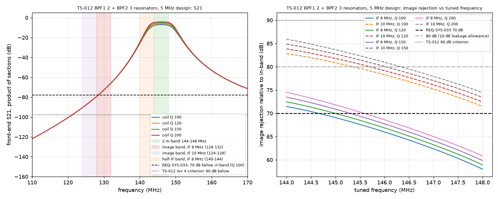
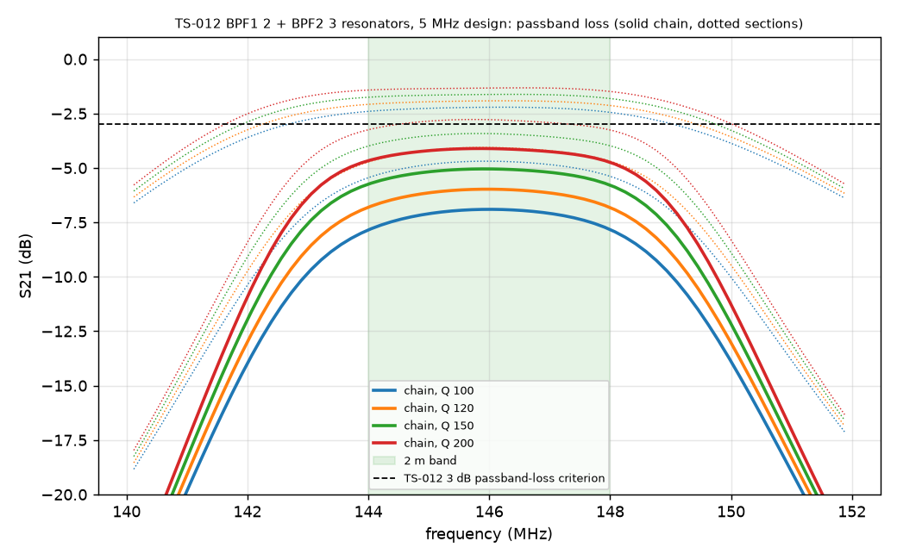
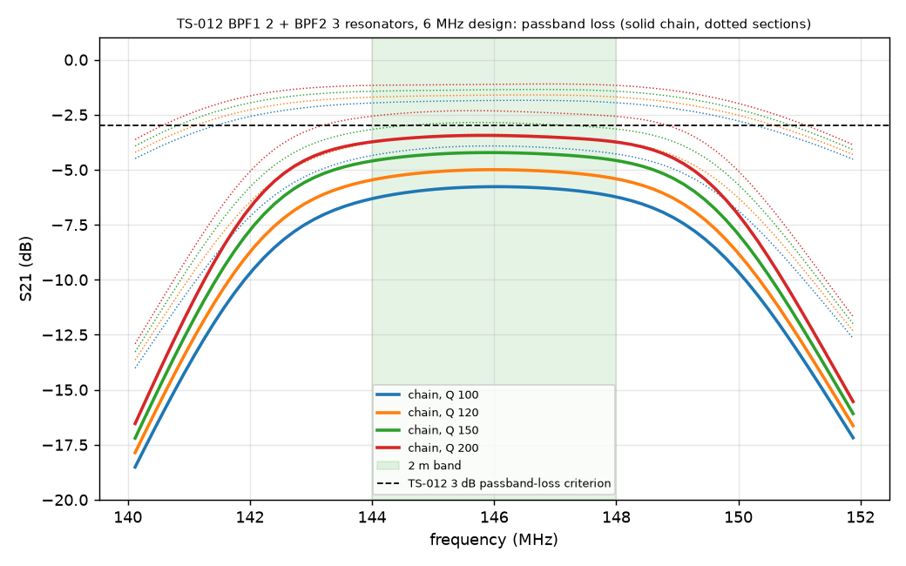
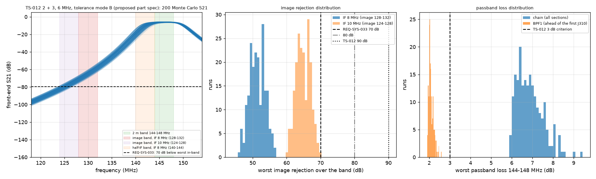

# 2026-09-28-r01-bpf-ts012-baseline: result

Checker: check_bpf.py. Pass criterion: REQ-SYS-033 image rejection >= 70 dB (TBR) at every tuned frequency 144.000 to 148.000 MHz. Also reported: >= 80 dB (10 dB leakage allowance proposed in the analysis record) and >= 90 dB (TS-012 revision 4 criterion).

## bpf_2p3_bw5: TS-012 BPF1 2 + BPF2 3 resonators, 5 MHz design

| step | BPF loss worst per section (dB) | chain loss worst (dB) | IF 8: image rej min (dB) at tuned MHz | IF 8 verdict (70 / 80 / 90) | IF 10: image rej min (dB) | IF 10 verdict (70 / 80 / 90) | half-IF filter atten, IF 8, min to max (dB) | IF feed-through rej, 8 MHz (dB) |
|---|---|---|---|---|---|---|---|---|
| qu=100 | 2.45, 5.45 | 7.85 | 58.0 at 148.00 | FAIL / no / no | 71.5 | PASS / no / no | 0.0 to 18.4 | > 150 (ideal model) |
| qu=120 | 2.13, 4.73 | 6.83 | 58.9 at 148.00 | FAIL / no / no | 72.4 | PASS / no / no | -0.0 to 18.9 | > 150 (ideal model) |
| qu=150 | 1.81, 3.99 | 5.80 | 59.9 at 148.00 | FAIL / no / no | 73.4 | PASS / no / no | -0.0 to 19.4 | > 150 (ideal model) |
| qu=200 | 1.49, 3.26 | 4.75 | 60.8 at 148.00 | FAIL / no / no | 74.4 | PASS / no / no | -0.1 to 19.9 | > 150 (ideal model) |

Per-section rejection relative to 146 MHz, step qu=100 (for the section-by-section NanoVNA check): 124 MHz: 29.7, 54.1 dB; 128 MHz: 25.1, 47.4 dB; 130 MHz: 22.5, 43.5 dB; 132 MHz: 19.6, 39.3 dB.

## bpf_2p3_bw6: TS-012 BPF1 2 + BPF2 3 resonators, 6 MHz design

| step | BPF loss worst per section (dB) | chain loss worst (dB) | IF 8: image rej min (dB) at tuned MHz | IF 8 verdict (70 / 80 / 90) | IF 10: image rej min (dB) | IF 10 verdict (70 / 80 / 90) | half-IF filter atten, IF 8, min to max (dB) | IF feed-through rej, 8 MHz (dB) |
|---|---|---|---|---|---|---|---|---|
| qu=100 | 1.96, 4.35 | 6.32 | 51.3 at 148.00 | FAIL / no / no | 64.8 | FAIL / no / no | 0.1 to 12.9 | > 150 (ideal model) |
| qu=120 | 1.70, 3.76 | 5.46 | 52.0 at 148.00 | FAIL / no / no | 65.6 | FAIL / no / no | 0.0 to 13.1 | > 150 (ideal model) |
| qu=150 | 1.43, 3.17 | 4.60 | 52.7 at 148.00 | FAIL / no / no | 66.3 | FAIL / no / no | 0.0 to 13.3 | > 150 (ideal model) |
| qu=200 | 1.17, 2.58 | 3.74 | 53.5 at 148.00 | FAIL / no / no | 67.1 | FAIL / no / no | -0.0 to 13.5 | > 150 (ideal model) |

Per-section rejection relative to 146 MHz, step qu=100 (for the section-by-section NanoVNA check): 124 MHz: 26.7, 50.0 dB; 128 MHz: 22.1, 43.2 dB; 130 MHz: 19.5, 39.4 dB; 132 MHz: 16.6, 35.1 dB.

## bpf_2p3_bw6_mcA: TS-012 2 + 3, 6 MHz, tolerance mode A (TS-012: 20 % caps)

N = 200.

| quantity | IF 8 MHz | IF 10 MHz |
|---|---|---|
| image_rejection_min_db | 38.7 | 53.3 |
| p5_db | 43.4 | 57.5 |
| median_db | 51.6 | 65 |
| fraction_ge_70 | 0 | 0.105 |
| fraction_ge_80 | 0 | 0 |
| fraction_ge_90 | 0 | 0 |

Chain worst passband loss: median 8.19 dB, 95th percentile 10.73 dB, maximum 11.80 dB. BPF1: median 2.72, 95th percentile 3.92, maximum 5.85 dB. Per-section worst in-band loss, median / 95th percentile / maximum: 2.72 / 3.92 / 5.85; 5.51 / 7.82 / 9.45 dB.

Sample verdict (REQ-SYS-033, every one of the 200 runs >= 70 dB): IF 8 MHz FAIL (200 of 200 runs below 70 dB); IF 10 MHz FAIL (179 of 200 runs below 70 dB). A sample minimum is not a worst case: the REQ-SYS-033 acceptance is the worst-case corner of run r08 (revision 2 of the analysis record).

## bpf_2p3_bw6_mcB: TS-012 2 + 3, 6 MHz, tolerance mode B (proposed part spec)

N = 200.

| quantity | IF 8 MHz | IF 10 MHz |
|---|---|---|
| image_rejection_min_db | 46.2 | 60.3 |
| p5_db | 47.8 | 61.7 |
| median_db | 51.3 | 64.8 |
| fraction_ge_70 | 0 | 0 |
| fraction_ge_80 | 0 | 0 |
| fraction_ge_90 | 0 | 0 |

Chain worst passband loss: median 6.80 dB, 95th percentile 8.06 dB, maximum 9.43 dB. BPF1: median 2.05, 95th percentile 2.31, maximum 2.59 dB. Per-section worst in-band loss, median / 95th percentile / maximum: 2.05 / 2.31 / 2.59; 4.72 / 6.04 / 7.38 dB.

Sample verdict (REQ-SYS-033, every one of the 200 runs >= 70 dB): IF 8 MHz FAIL (200 of 200 runs below 70 dB); IF 10 MHz FAIL (200 of 200 runs below 70 dB). A sample minimum is not a worst case: the REQ-SYS-033 acceptance is the worst-case corner of run r08 (revision 2 of the analysis record).

REQ-SYS-033 verdicts in this run: 4 PASS, 16 FAIL; checker exit status 1.
