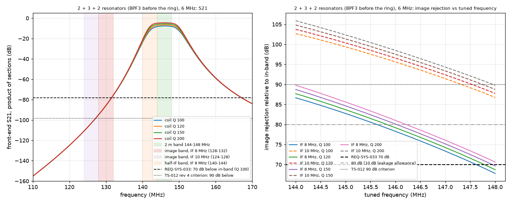
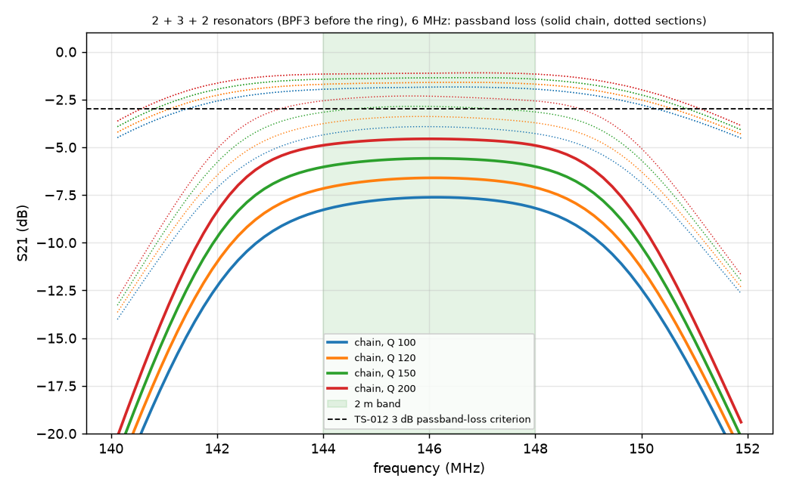

# 2026-09-28-r02-bpf-three-section: result

Checker: check_bpf.py. Pass criterion: REQ-SYS-033 image rejection >= 70 dB (TBR) at every tuned frequency 144.000 to 148.000 MHz. Also reported: >= 80 dB (10 dB leakage allowance proposed in the analysis record) and >= 90 dB (TS-012 revision 4 criterion).

## bpf_2p3p2_bw6: 2 + 3 + 2 resonators (BPF3 before the ring), 6 MHz

| step | BPF loss worst per section (dB) | chain loss worst (dB) | IF 8: image rej min (dB) at tuned MHz | IF 8 verdict (70 / 80 / 90) | IF 10: image rej min (dB) | IF 10 verdict (70 / 80 / 90) | half-IF filter atten, IF 8, min to max (dB) | IF feed-through rej, 8 MHz (dB) |
|---|---|---|---|---|---|---|---|---|
| qu=100 | 1.96, 4.35, 1.96 | 8.28 | 67.8 at 148.00 | FAIL / no / no | 86.7 | PASS / yes / no | 0.1 to 15.6 | > 150 (ideal model) |
| qu=120 | 1.70, 3.76, 1.70 | 7.16 | 68.7 at 148.00 | FAIL / no / no | 87.7 | PASS / yes / no | 0.1 to 15.8 | > 150 (ideal model) |
| qu=150 | 1.43, 3.17, 1.43 | 6.03 | 69.7 at 148.00 | FAIL / no / no | 88.8 | PASS / yes / no | 0.0 to 16.0 | > 150 (ideal model) |
| qu=200 | 1.17, 2.58, 1.17 | 4.91 | 70.6 at 148.00 | PASS / no / no | 89.8 | PASS / yes / no | -0.0 to 16.2 | > 150 (ideal model) |

Per-section rejection relative to 146 MHz, step qu=100 (for the section-by-section NanoVNA check): 124 MHz: 26.7, 50.0, 26.7 dB; 128 MHz: 22.1, 43.2, 22.1 dB; 130 MHz: 19.5, 39.4, 19.5 dB; 132 MHz: 16.6, 35.1, 16.6 dB.

## bpf_2p3p3_bw6: 2 + 3 + 3 resonators (BPF3 before the ring), 6 MHz

| step | BPF loss worst per section (dB) | chain loss worst (dB) | IF 8: image rej min (dB) at tuned MHz | IF 8 verdict (70 / 80 / 90) | IF 10: image rej min (dB) | IF 10 verdict (70 / 80 / 90) | half-IF filter atten, IF 8, min to max (dB) | IF feed-through rej, 8 MHz (dB) |
|---|---|---|---|---|---|---|---|---|
| qu=100 | 1.96, 4.35, 4.35 | 10.67 | 86.0 at 148.00 | PASS / yes / no | 107.6 | PASS / yes / yes | 0.1 to 23.0 | > 150 (ideal model) |
| qu=120 | 1.70, 3.76, 3.76 | 9.23 | 87.3 at 148.00 | PASS / yes / no | 108.9 | PASS / yes / yes | 0.1 to 23.5 | > 150 (ideal model) |
| qu=150 | 1.43, 3.17, 3.17 | 7.77 | 88.5 at 148.00 | PASS / yes / no | 110.2 | PASS / yes / yes | 0.0 to 23.9 | > 150 (ideal model) |
| qu=200 | 1.17, 2.58, 2.58 | 6.32 | 89.8 at 148.00 | PASS / yes / no | 111.6 | PASS / yes / yes | -0.0 to 24.4 | > 150 (ideal model) |

Per-section rejection relative to 146 MHz, step qu=100 (for the section-by-section NanoVNA check): 124 MHz: 26.7, 50.0, 50.0 dB; 128 MHz: 22.1, 43.2, 43.2 dB; 130 MHz: 19.5, 39.4, 39.4 dB; 132 MHz: 16.6, 35.1, 35.1 dB.

