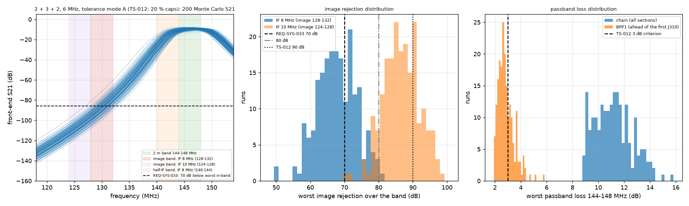
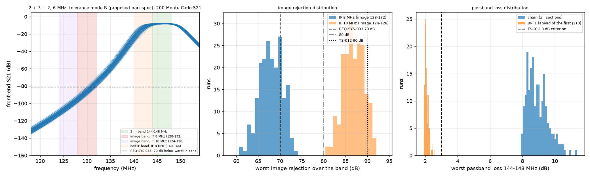

# 2026-09-28-r03-bpf-three-section-mc: result

Checker: check_bpf.py. Pass criterion: REQ-SYS-033 image rejection >= 70 dB (TBR) at every tuned frequency 144.000 to 148.000 MHz. Also reported: >= 80 dB (10 dB leakage allowance proposed in the analysis record) and >= 90 dB (TS-012 revision 4 criterion).

## bpf_2p3p2_bw6_mcA: 2 + 3 + 2, 6 MHz, tolerance mode A (TS-012: 20 % caps)

N = 200.

| quantity | IF 8 MHz | IF 10 MHz |
|---|---|---|
| image_rejection_min_db | 50.1 | 70.6 |
| p5_db | 58.5 | 78.1 |
| median_db | 67.8 | 86.6 |
| fraction_ge_70 | 0.36 | 1 |
| fraction_ge_80 | 0.01 | 0.895 |
| fraction_ge_90 | 0 | 0.27 |

Chain worst passband loss: median 11.10 dB, 95th percentile 13.66 dB, maximum 15.82 dB. BPF1: median 2.72, 95th percentile 3.92, maximum 5.85 dB. Per-section worst in-band loss, median / 95th percentile / maximum: 2.72 / 3.92 / 5.85; 5.51 / 7.82 / 9.45; 2.78 / 4.27 / 5.24 dB.

Verdict (REQ-SYS-033, every run >= 70 dB at IF 8 MHz): FAIL; at IF 10 MHz: PASS.

## bpf_2p3p2_bw6_mcB: 2 + 3 + 2, 6 MHz, tolerance mode B (proposed part spec)

N = 200.

| quantity | IF 8 MHz | IF 10 MHz |
|---|---|---|
| image_rejection_min_db | 60.8 | 80.5 |
| p5_db | 63.3 | 82.8 |
| median_db | 68.1 | 87 |
| fraction_ge_70 | 0.235 | 1 |
| fraction_ge_80 | 0 | 1 |
| fraction_ge_90 | 0 | 0.105 |

Chain worst passband loss: median 8.85 dB, 95th percentile 10.18 dB, maximum 11.35 dB. BPF1: median 2.05, 95th percentile 2.31, maximum 2.59 dB. Per-section worst in-band loss, median / 95th percentile / maximum: 2.05 / 2.31 / 2.59; 4.72 / 6.04 / 7.38; 2.07 / 2.36 / 2.56 dB.

Verdict (REQ-SYS-033, every run >= 70 dB at IF 8 MHz): FAIL; at IF 10 MHz: PASS.

## bpf_2p3p3_bw6_mcA: 2 + 3 + 3, 6 MHz, tolerance mode A (TS-012: 20 % caps)

N = 200.

| quantity | IF 8 MHz | IF 10 MHz |
|---|---|---|
| image_rejection_min_db | 70.6 | 93.6 |
| p5_db | 76.4 | 98.8 |
| median_db | 86.6 | 108 |
| fraction_ge_70 | 1 | 1 |
| fraction_ge_80 | 0.86 | 1 |
| fraction_ge_90 | 0.255 | 1 |

Chain worst passband loss: median 13.87 dB, 95th percentile 16.76 dB, maximum 18.54 dB. BPF1: median 2.72, 95th percentile 3.92, maximum 5.85 dB. Per-section worst in-band loss, median / 95th percentile / maximum: 2.72 / 3.92 / 5.85; 5.51 / 7.82 / 9.45; 5.52 / 7.68 / 8.99 dB.

Verdict (REQ-SYS-033, every run >= 70 dB at IF 8 MHz): PASS; at IF 10 MHz: PASS.

## bpf_2p3p3_bw6_mcB: 2 + 3 + 3, 6 MHz, tolerance mode B (proposed part spec)

N = 200.

| quantity | IF 8 MHz | IF 10 MHz |
|---|---|---|
| image_rejection_min_db | 78.1 | 100 |
| p5_db | 81.3 | 103 |
| median_db | 86.4 | 108 |
| fraction_ge_70 | 1 | 1 |
| fraction_ge_80 | 0.975 | 1 |
| fraction_ge_90 | 0.085 | 1 |

Chain worst passband loss: median 11.61 dB, 95th percentile 13.21 dB, maximum 14.02 dB. BPF1: median 2.05, 95th percentile 2.31, maximum 2.59 dB. Per-section worst in-band loss, median / 95th percentile / maximum: 2.05 / 2.31 / 2.59; 4.72 / 6.04 / 7.38; 4.75 / 5.98 / 6.53 dB.

Verdict (REQ-SYS-033, every run >= 70 dB at IF 8 MHz): PASS; at IF 10 MHz: PASS.

