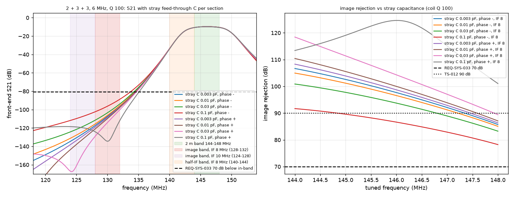

# 2026-09-28-r04-bpf-leakage: result

Checker: check_bpf.py. Pass criterion: REQ-SYS-033 image rejection >= 70 dB (TBR) at every tuned frequency 144.000 to 148.000 MHz. Also reported: >= 80 dB (10 dB leakage allowance proposed in the analysis record) and >= 90 dB (TS-012 revision 4 criterion).

## bpf_2p3p3_bw6_leak: 2 + 3 + 3, 6 MHz, Q 100

| step | BPF loss worst per section (dB) | chain loss worst (dB) | IF 8: image rej min (dB) at tuned MHz | IF 8 verdict (70 / 80 / 90) | IF 10: image rej min (dB) | IF 10 verdict (70 / 80 / 90) | half-IF filter atten, IF 8, min to max (dB) | IF feed-through rej, 8 MHz (dB) |
|---|---|---|---|---|---|---|---|---|
| cst=3e-15 sgn=-1 | 1.96, 4.35, 4.35 | 10.67 | 85.7 at 148.00 | PASS / yes / no | 106.8 | PASS / yes / yes | 0.2 to 23.0 | not in sweep |
| cst=1e-14 sgn=-1 | 1.96, 4.35, 4.35 | 10.67 | 85.1 at 148.00 | PASS / yes / no | 105.1 | PASS / yes / yes | 0.2 to 23.0 | not in sweep |
| cst=3e-14 sgn=-1 | 1.96, 4.36, 4.36 | 10.67 | 83.3 at 148.00 | PASS / yes / no | 101.1 | PASS / yes / yes | 0.2 to 23.0 | not in sweep |
| cst=1e-13 sgn=-1 | 1.94, 4.38, 4.38 | 10.69 | 78.2 at 148.00 | PASS / no / no | 92.0 | PASS / yes / yes | 0.3 to 22.8 | not in sweep |
| cst=3e-15 sgn=1 | 1.96, 4.35, 4.35 | 10.67 | 86.3 at 148.00 | PASS / yes / no | 108.4 | PASS / yes / yes | 0.1 to 23.0 | not in sweep |
| cst=1e-14 sgn=1 | 1.97, 4.35, 4.35 | 10.67 | 87.1 at 148.00 | PASS / yes / no | 110.6 | PASS / yes / yes | 0.1 to 23.1 | not in sweep |
| cst=3e-14 sgn=1 | 1.97, 4.35, 4.35 | 10.66 | 89.4 at 148.00 | PASS / yes / no | 118.6 | PASS / yes / yes | 0.1 to 23.1 | not in sweep |
| cst=1e-13 sgn=1 | 1.99, 4.33, 4.33 | 10.66 | 101.1 at 148.00 | PASS / yes / yes | 107.8 | PASS / yes / yes | 0.0 to 23.3 | not in sweep |

Per-section rejection relative to 146 MHz, step cst=3e-15 sgn=-1 (for the section-by-section NanoVNA check): 124 MHz: 26.7, 49.1, 49.1 dB; 128 MHz: 22.1, 42.8, 42.8 dB; 130 MHz: 19.5, 39.1, 39.1 dB; 132 MHz: 16.6, 35.0, 35.0 dB.

REQ-SYS-033 verdicts in this run: 16 PASS, 0 FAIL; checker exit status 0.
