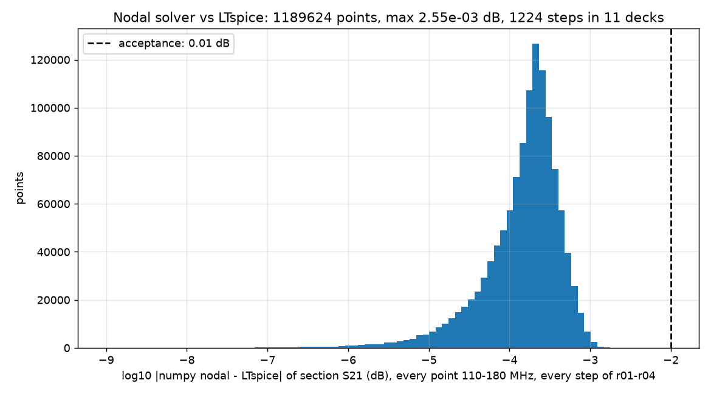

# 2026-09-28-r07-nodal-validation: result

Checker: validate_nodal.py. Question: does the numpy nodal solver `bpf_nodal.py` (the search tool of revision 2) reproduce LTspice on the same netlist lines?
Acceptance, fixed before the run: every section S21 and every chain image rejection within 0.01 dB of LTspice, on every step of every filter deck of r01 to r04 (Q steps, 1,200 Monte Carlo draws, the leakage steps).

| run | deck | steps | max abs S21 difference (dB) | max abs image-rejection difference (dB) | accepted |
|---|---|---|---|---|---|
| 2026-09-28-r01-bpf-ts012-baseline | bpf_2p3_bw5 | 4 | 3.9e-04 | 3.0e-04 | yes |
| 2026-09-28-r01-bpf-ts012-baseline | bpf_2p3_bw6 | 4 | 4.3e-04 | 2.8e-04 | yes |
| 2026-09-28-r01-bpf-ts012-baseline | bpf_2p3_bw6_mcA | 200 | 1.4e-03 | 1.2e-03 | yes |
| 2026-09-28-r01-bpf-ts012-baseline | bpf_2p3_bw6_mcB | 200 | 1.6e-03 | 1.3e-03 | yes |
| 2026-09-28-r02-bpf-three-section | bpf_2p3p2_bw6 | 4 | 4.3e-04 | 4.3e-04 | yes |
| 2026-09-28-r02-bpf-three-section | bpf_2p3p3_bw6 | 4 | 4.3e-04 | 4.1e-04 | yes |
| 2026-09-28-r03-bpf-three-section-mc | bpf_2p3p2_bw6_mcA | 200 | 1.4e-03 | 1.6e-03 | yes |
| 2026-09-28-r03-bpf-three-section-mc | bpf_2p3p2_bw6_mcB | 200 | 1.6e-03 | 1.8e-03 | yes |
| 2026-09-28-r03-bpf-three-section-mc | bpf_2p3p3_bw6_mcA | 200 | 1.5e-03 | 1.7e-03 | yes |
| 2026-09-28-r03-bpf-three-section-mc | bpf_2p3p3_bw6_mcB | 200 | 1.6e-03 | 1.6e-03 | yes |
| 2026-09-28-r04-bpf-leakage | bpf_2p3p3_bw6_leak | 8 | 2.5e-03 | 9.8e-04 | yes |

Verdict: **ACCEPTED**, 1189624 points, largest difference 2.5e-03 dB. The residual is attributed to rounding (an estimate, not investigated further): the Monte Carlo tables in the r01 and r03 decks carry five decimals while this check uses the unrounded draws of the .npz files, and the deck expressions carry a six-digit f0.

