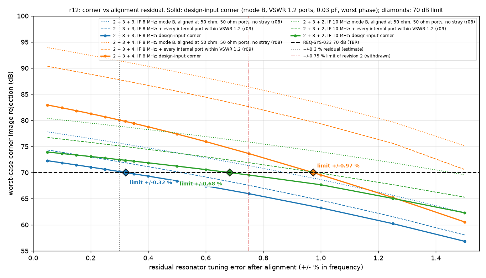
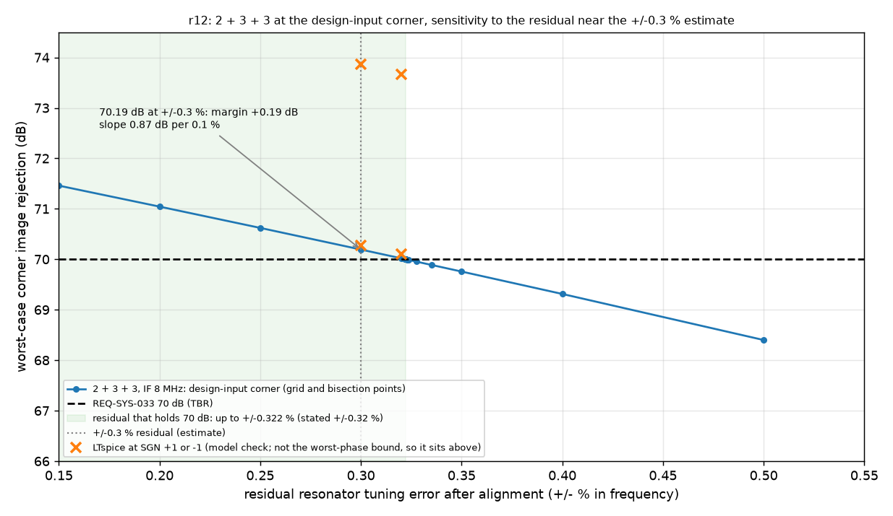

# 2026-09-28-r12-bpf-residual-design-input: result

Checker: worst_case.py check r12. Question (review iteration 2, finding 6): what alignment residual does the design-input corner of section 5 need, and how sensitive is the 2 + 3 + 3 margin to the +/-0.3 % residual estimate?
Requirement: REQ-SYS-033, image response at least 70 dB (TBR) below the in-band response at every tuned frequency 144.0 to 148.0 MHz (100 kHz spacing, TC-SYS-021), at the worst-case corner.
Design-input corner: mode B, aligned at 50 ohm, coil Q 100, every internal port within VSWR 1.2 (8 phases), 0.03 pF stray per section with the worst-phase bound (16 phases). Residual: each resonator L x [1 - 2 r, 1 + 2 r], a +/- r error in frequency after alignment.
Acceptance (fixed before the run): (a) the residual limit is the largest r at which the design-input corner meets 70 dB, by bisection to 0.0001 % (the corner is non-increasing in r because the boxes are nested; checked on the grid), stated rounded down to 0.01 %; (b) 2 + 3 + 3 passes r12 when it meets 70 dB at the stated limit and at the +/-0.3 % estimate, the grid is monotone and every LTspice case agrees with numpy to 0.01 dB.
LTspice takes a real SGN (+1 or -1) only, so its cases check the model at those phases, not the worst-phase bound (as in r10).

## Worst-case corner against the residual (dB)

| configuration | corner | +/-0.05 % | +/-0.1 % | +/-0.15 % | +/-0.2 % | +/-0.25 % | +/-0.3 % | +/-0.32 % | +/-0.35 % | +/-0.4 % | +/-0.5 % | +/-0.6 % | +/-0.75 % | +/-1 % | +/-1.25 % | +/-1.5 % | monotone |
|---|---|---|---|---|---|---|---|---|---|---|---|---|---|---|---|---|---|
| 2 + 3 + 3, IF 8 MHz (revision 1 proposal) | mode B, aligned at 50 ohm, 50 ohm ports, no stray (r08) | 77.80 | 77.37 | 76.94 | 76.51 | 76.07 | 75.63 | 75.45 | 75.18 | 74.72 | 73.79 | 72.84 | 71.34 | 68.65 | 65.66 | 62.32 | yes |
| 2 + 3 + 3, IF 8 MHz (revision 1 proposal) | + every internal port within VSWR 1.2 (r09) | 74.32 | 73.88 | 73.44 | 72.99 | 72.54 | 72.07 | 71.89 | 71.61 | 71.13 | 70.16 | 69.15 | 67.56 | 64.71 | 61.56 | 58.05 | yes |
| 2 + 3 + 3, IF 8 MHz (revision 1 proposal) | design-input corner: + 0.03 pF per section, worst phase (r10) | 72.27 | 71.87 | 71.46 | 71.04 | 70.62 | 70.19 | 70.02 | 69.76 | 69.31 | 68.40 | 67.45 | 65.96 | 63.24 | 60.22 | 56.83 | yes |
| 2 + 3 + 4, IF 8 MHz (margin lever, new here) | mode B, aligned at 50 ohm, 50 ohm ports, no stray (r08) | 93.94 | 93.45 | 92.94 | 92.44 | 91.92 | 91.40 | 91.19 | 90.88 | 90.35 | 89.26 | 88.14 | 86.40 | 83.25 | 79.69 | 75.13 | yes |
| 2 + 3 + 4, IF 8 MHz (margin lever, new here) | + every internal port within VSWR 1.2 (r09) | 90.35 | 89.85 | 89.34 | 88.82 | 88.30 | 87.77 | 87.56 | 87.23 | 86.69 | 85.58 | 84.43 | 82.62 | 79.33 | 75.61 | 70.58 | yes |
| 2 + 3 + 4, IF 8 MHz (margin lever, new here) | design-input corner: + 0.03 pF per section, worst phase (r10) | 82.94 | 82.41 | 81.85 | 81.28 | 80.68 | 80.06 | 79.81 | 79.42 | 78.76 | 77.38 | 75.93 | 73.64 | 69.56 | 65.22 | 60.54 | yes |
| 2 + 3 + 2, IF 10 MHz (alternative) | mode B, aligned at 50 ohm, 50 ohm ports, no stray (r08) | 80.37 | 80.08 | 79.78 | 79.47 | 79.17 | 78.85 | 78.73 | 78.54 | 78.22 | 77.57 | 76.90 | 75.85 | 73.96 | 71.89 | 69.58 | yes |
| 2 + 3 + 2, IF 10 MHz (alternative) | + every internal port within VSWR 1.2 (r09) | 76.72 | 76.40 | 76.09 | 75.77 | 75.44 | 75.11 | 74.98 | 74.77 | 74.43 | 73.74 | 73.02 | 71.89 | 69.88 | 67.69 | 65.29 | yes |
| 2 + 3 + 2, IF 10 MHz (alternative) | design-input corner: + 0.03 pF per section, worst phase (r10) | 73.93 | 73.65 | 73.36 | 73.07 | 72.78 | 72.48 | 72.36 | 72.17 | 71.87 | 71.23 | 70.57 | 69.53 | 67.67 | 65.05 | 62.30 | yes |

## Residual limit that holds 70 dB, and the sensitivity at the +/-0.3 % estimate

| configuration | corner | residual limit (bisection) | stated limit | slope at +/-0.3 % (dB per 0.1 %) |
|---|---|---|---|---|
| 2 + 3 + 3, IF 8 MHz (revision 1 proposal) | mode B, aligned at 50 ohm, 50 ohm ports, no stray (r08) | +/-0.8776 % | +/-0.87 % | 0.89 |
| 2 + 3 + 3, IF 8 MHz (revision 1 proposal) | + every internal port within VSWR 1.2 (r09) | +/-0.5155 % | +/-0.51 % | 0.93 |
| 2 + 3 + 3, IF 8 MHz (revision 1 proposal) | design-input corner: + 0.03 pF per section, worst phase (r10) | +/-0.3222 % | +/-0.32 % | 0.87 |
| 2 + 3 + 4, IF 8 MHz (margin lever, new here) | mode B, aligned at 50 ohm, 50 ohm ports, no stray (r08) | above +/-1.5 % | at least +/-1.5 % | 1.04 |
| 2 + 3 + 4, IF 8 MHz (margin lever, new here) | + every internal port within VSWR 1.2 (r09) | above +/-1.5 % | at least +/-1.5 % | 1.06 |
| 2 + 3 + 4, IF 8 MHz (margin lever, new here) | design-input corner: + 0.03 pF per section, worst phase (r10) | +/-0.9738 % | +/-0.97 % | 1.26 |
| 2 + 3 + 2, IF 10 MHz (alternative) | mode B, aligned at 50 ohm, 50 ohm ports, no stray (r08) | +/-1.4567 % | +/-1.45 % | 0.63 |
| 2 + 3 + 2, IF 10 MHz (alternative) | + every internal port within VSWR 1.2 (r09) | +/-0.9862 % | +/-0.98 % | 0.67 |
| 2 + 3 + 2, IF 10 MHz (alternative) | design-input corner: + 0.03 pF per section, worst phase (r10) | +/-0.6836 % | +/-0.68 % | 0.60 |

## Design-input corner at the stated limit, the estimate and the revision 2 limit (LTspice model check)

| configuration | point | residual | corner, worst-phase bound (dB) | verdict |
|---|---|---|---|---|
| 2 + 3 + 3, IF 8 MHz (revision 1 proposal) | stated limit | +/-0.32 % | 70.02 | **PASS** (+0.02 dB) |
| 2 + 3 + 3, IF 8 MHz (revision 1 proposal) | estimate | +/-0.3 % | 70.19 | **PASS** (+0.19 dB) |
| 2 + 3 + 3, IF 8 MHz (revision 1 proposal) | rev2 limit | +/-0.75 % | 65.96 | **FAIL** (-4.04 dB) |
| 2 + 3 + 4, IF 8 MHz (margin lever, new here) | stated limit | +/-0.97 % | 70.06 | **PASS** (+0.06 dB) |
| 2 + 3 + 4, IF 8 MHz (margin lever, new here) | estimate | +/-0.3 % | 80.06 | **PASS** (+10.06 dB) |
| 2 + 3 + 4, IF 8 MHz (margin lever, new here) | rev2 limit | +/-0.75 % | 73.64 | **PASS** (+3.64 dB) |
| 2 + 3 + 2, IF 10 MHz (alternative) | stated limit | +/-0.68 % | 70.03 | **PASS** (+0.03 dB) |
| 2 + 3 + 2, IF 10 MHz (alternative) | estimate | +/-0.3 % | 72.48 | **PASS** (+2.48 dB) |
| 2 + 3 + 2, IF 10 MHz (alternative) | rev2 limit | +/-0.75 % | 69.53 | **FAIL** (-0.47 dB) |

| configuration | LTspice case | numpy (dB) | LTspice (dB) | agree |
|---|---|---|---|---|
| 2 + 3 + 3, IF 8 MHz (revision 1 proposal) | design-input corner at +/-0.32 % (stated_limit), SGN from the tuned-frequency worst phase | 73.668 | 73.668 | yes |
| 2 + 3 + 3, IF 8 MHz (revision 1 proposal) | design-input corner at +/-0.32 % (stated_limit), SGN from the image-frequency worst phase | 70.105 | 70.105 | yes |
| 2 + 3 + 3, IF 8 MHz (revision 1 proposal) | design-input corner at +/-0.3 % (estimate), SGN from the tuned-frequency worst phase | 73.869 | 73.869 | yes |
| 2 + 3 + 3, IF 8 MHz (revision 1 proposal) | design-input corner at +/-0.3 % (estimate), SGN from the image-frequency worst phase | 70.279 | 70.278 | yes |
| 2 + 3 + 3, IF 8 MHz (revision 1 proposal) | design-input corner at +/-0.75 % (rev2_limit), SGN from the tuned-frequency worst phase | 69.241 | 69.241 | yes |
| 2 + 3 + 3, IF 8 MHz (revision 1 proposal) | design-input corner at +/-0.75 % (rev2_limit), SGN from the image-frequency worst phase | 66.042 | 66.042 | yes |
| 2 + 3 + 4, IF 8 MHz (margin lever, new here) | design-input corner at +/-0.97 % (stated_limit), SGN from the tuned-frequency worst phase | 78.670 | 78.670 | yes |
| 2 + 3 + 4, IF 8 MHz (margin lever, new here) | design-input corner at +/-0.97 % (stated_limit), SGN from the image-frequency worst phase | 70.270 | 70.270 | yes |
| 2 + 3 + 4, IF 8 MHz (margin lever, new here) | design-input corner at +/-0.3 % (estimate), SGN from the tuned-frequency worst phase | 81.966 | 81.966 | yes |
| 2 + 3 + 4, IF 8 MHz (margin lever, new here) | design-input corner at +/-0.3 % (estimate), SGN from the image-frequency worst phase | 80.170 | 80.170 | yes |
| 2 + 3 + 4, IF 8 MHz (margin lever, new here) | design-input corner at +/-0.75 % (rev2_limit), SGN from the tuned-frequency worst phase | 81.654 | 81.654 | yes |
| 2 + 3 + 4, IF 8 MHz (margin lever, new here) | design-input corner at +/-0.75 % (rev2_limit), SGN from the image-frequency worst phase | 73.799 | 73.799 | yes |
| 2 + 3 + 2, IF 10 MHz (alternative) | design-input corner at +/-0.68 % (stated_limit), SGN from the tuned-frequency worst phase | 75.390 | 75.390 | yes |
| 2 + 3 + 2, IF 10 MHz (alternative) | design-input corner at +/-0.68 % (stated_limit), SGN from the image-frequency worst phase | 70.066 | 70.066 | yes |
| 2 + 3 + 2, IF 10 MHz (alternative) | design-input corner at +/-0.3 % (estimate), SGN from the tuned-frequency worst phase | 77.587 | 77.586 | yes |
| 2 + 3 + 2, IF 10 MHz (alternative) | design-input corner at +/-0.3 % (estimate), SGN from the image-frequency worst phase | 72.517 | 72.516 | yes |
| 2 + 3 + 2, IF 10 MHz (alternative) | design-input corner at +/-0.75 % (rev2_limit), SGN from the tuned-frequency worst phase | 74.795 | 74.794 | yes |
| 2 + 3 + 2, IF 10 MHz (alternative) | design-input corner at +/-0.75 % (rev2_limit), SGN from the image-frequency worst phase | 69.576 | 69.576 | yes |

Verdict (2 + 3 + 3, design-input corner): **PASS** at the +/-0.3 % estimate (70.19 dB, margin +0.19 dB) and at the stated residual limit +/-0.32 %; at the revision 2 limit +/-0.75 % it is 65.96 dB (**FAIL**). The slope at the estimate is 0.87 dB per 0.1 %, so the 0.2 dB margin is 0.02 % of residual headroom. LTspice agreement and monotone grid: yes.
