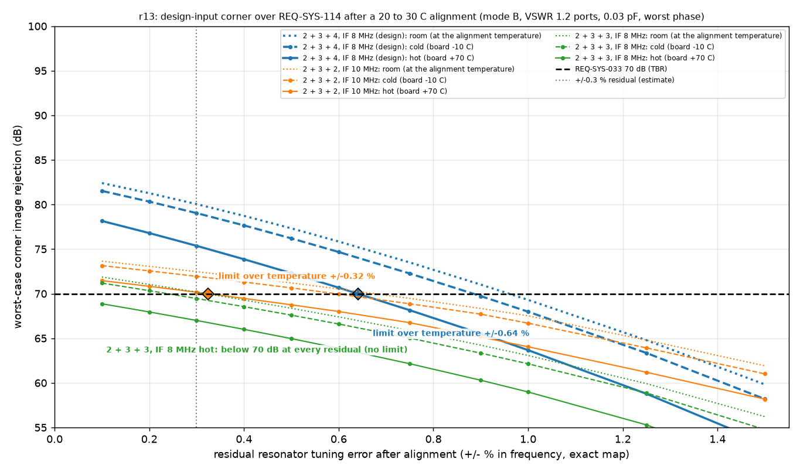
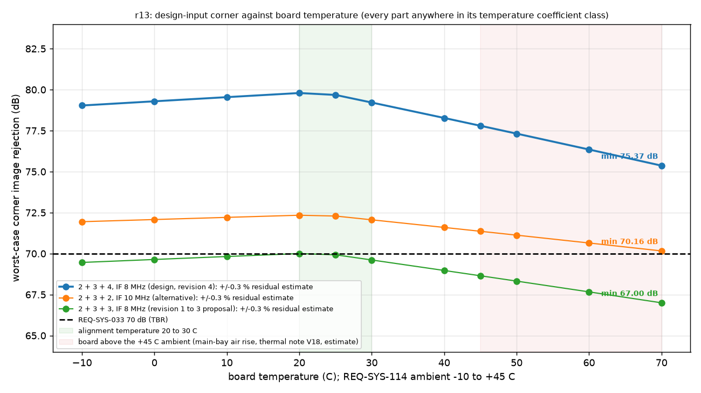

# 2026-09-29-r13-bpf-temperature: result

Checker: worst_case.py check r13. Question (review iteration 3, finding-7, Major): does the image rejection hold REQ-SYS-033 at the design-input corner over REQ-SYS-114 (-10 C to +45 C ambient) after a room-temperature alignment, and what alignment residual does that need?
Requirement: REQ-SYS-033, image response at least 70 dB (TBR) below the in-band response at every tuned frequency 144.0 to 148.0 MHz (100 kHz, TC-SYS-021), at the worst-case corner, over REQ-SYS-114.
Design-input corner: mode B, aligned at 50 ohm, every internal port within VSWR 1.2 (8 phases), 0.03 pF per section with the worst-phase bound (16 phases). Residual: exact frequency map (review finding-16), each resonator's frequency multiplier in [(1 - r)(1 + d_lo), (1 + r)(1 + d_hi)].
Temperature: board -10 to 70 C (REQ-SYS-114 -10 to +45 C ambient; the hot end is the main-bay air of the thermal note row V18 with its band, 67.4 C, rounded up; estimate); alignment at 20 to 30 C; node capacitance coefficient -40 to +40 ppm/K (C0G +/-30 ppm/K, KEMET C1003_C0G, plus +/-10 ppm/K stray allowance, estimate); coil +5 to +70 ppm/K (Coilcraft Document 184-1 TCL); coupling and end capacitors widened by 40 ppm/K x max |dT|; coil Q 100 at 25 C falling with the copper skin resistance above 25 C.

| case | board temperature | resonator drift d (%) | capacitor box widening (%) | coil Q |
|---|---|---|---|---|
| room | alignment temperature | +0.0000 to +0.0000 | 0.000 | 100.0 |
| cold | -10 C | -0.0699 to +0.2205 | 0.160 | 100.0 |
| hot | 70 C | -0.2742 to +0.0876 | 0.200 | 92.2 |

Acceptance (fixed before the run): (a) the design-input corner meets 70 dB in the cold and the hot case; (b) the residual limit over temperature is the smaller of the cold and hot limits (bisection to 0.0002 %), stated rounded down to 0.01 %; (c) 2 + 3 + 4 passes r13 when it meets (a) at the +/-0.3 % estimate and at its stated limit, every grid is monotone, no swept board temperature falls below the smaller of the cold and hot values, the exact-map room values reproduce the reviewer's iteration 3 values to 0.01 dB, and every LTspice case agrees with numpy to 0.01 dB.
LTspice takes a real SGN (+1 or -1) only, so its cases check the model at those phases, not the worst-phase bound (as in r10 and r12).

## Design-input corner against the residual, per temperature case (dB)

| configuration | case | +/-0.1 % | +/-0.2 % | +/-0.3 % | +/-0.4 % | +/-0.5 % | +/-0.6 % | +/-0.75 % | +/-0.9 % | +/-1 % | +/-1.25 % | +/-1.5 % | monotone |
|---|---|---|---|---|---|---|---|---|---|---|---|---|---|
| 2 + 3 + 4, IF 8 MHz (design, revision 4) | room | 82.40 | 81.27 | 80.04 | 78.73 | 77.33 | 75.85 | 73.50 | 71.02 | 69.30 | 64.79 | 59.82 | yes |
| 2 + 3 + 4, IF 8 MHz (design, revision 4) | cold | 81.53 | 80.32 | 79.03 | 77.66 | 76.20 | 74.67 | 72.26 | 69.73 | 67.98 | 63.35 | 58.18 | yes |
| 2 + 3 + 4, IF 8 MHz (design, revision 4) | hot | 78.16 | 76.80 | 75.37 | 73.86 | 72.30 | 70.68 | 68.15 | 65.52 | 63.67 | 58.77 | 53.25 | yes |
| 2 + 3 + 2, IF 10 MHz (alternative) | room | 73.65 | 73.07 | 72.47 | 71.85 | 71.21 | 70.53 | 69.47 | 68.34 | 67.52 | 64.79 | 61.91 | yes |
| 2 + 3 + 2, IF 10 MHz (alternative) | cold | 73.15 | 72.56 | 71.95 | 71.31 | 70.65 | 69.96 | 68.87 | 67.70 | 66.69 | 63.92 | 61.01 | yes |
| 2 + 3 + 2, IF 10 MHz (alternative) | hot | 71.47 | 70.83 | 70.16 | 69.47 | 68.75 | 68.00 | 66.75 | 65.15 | 64.04 | 61.19 | 58.17 | yes |
| 2 + 3 + 3, IF 8 MHz (revision 1 to 3 proposal) | room | 71.87 | 71.04 | 70.18 | 69.29 | 68.36 | 67.40 | 65.87 | 64.23 | 63.07 | 59.91 | 56.21 | yes |
| 2 + 3 + 3, IF 8 MHz (revision 1 to 3 proposal) | cold | 71.19 | 70.34 | 69.46 | 68.55 | 67.59 | 66.60 | 65.02 | 63.33 | 62.14 | 58.87 | 54.76 | yes |
| 2 + 3 + 3, IF 8 MHz (revision 1 to 3 proposal) | hot | 68.87 | 67.95 | 67.00 | 66.00 | 64.96 | 63.87 | 62.15 | 60.30 | 58.98 | 55.29 | 50.36 | yes |

## Residual limit that holds 70 dB

| configuration | room (exact map) | cold | hot | limit over temperature (stated) | alignment acceptance (stated limit less the +/-0.02 % reading uncertainty) |
|---|---|---|---|---|---|
| 2 + 3 + 4, IF 8 MHz (design, revision 4) | +/-0.9596 % | +/-0.8842 % | +/-0.6407 % | +/-0.6407 % (+/-0.64 %) | +/-0.62 % |
| 2 + 3 + 2, IF 10 MHz (alternative) | +/-0.6768 % | +/-0.5938 % | +/-0.3238 % | +/-0.3238 % (+/-0.32 %) | +/-0.30 % |
| 2 + 3 + 3, IF 8 MHz (revision 1 to 3 proposal) | +/-0.3205 % | +/-0.2389 % | none: fails even at +/-0.0002 % | none: fails even at +/-0.0002 % (none) | none (no residual can be accepted) |

## Points (LTspice model check)

| configuration | point | residual | corner, worst-phase bound (dB) | verdict |
|---|---|---|---|---|
| 2 + 3 + 4, IF 8 MHz (design, revision 4) | room at the estimate | +/-0.3 % | 80.04 | **PASS** (+10.04 dB) |
| 2 + 3 + 4, IF 8 MHz (design, revision 4) | cold at the estimate | +/-0.3 % | 79.03 | **PASS** (+9.03 dB) |
| 2 + 3 + 4, IF 8 MHz (design, revision 4) | hot at the estimate | +/-0.3 % | 75.37 | **PASS** (+5.37 dB) |
| 2 + 3 + 4, IF 8 MHz (design, revision 4) | cold at the stated limit | +/-0.64 % | 74.05 | **PASS** (+4.05 dB) |
| 2 + 3 + 4, IF 8 MHz (design, revision 4) | hot at the stated limit | +/-0.64 % | 70.01 | **PASS** (+0.01 dB) |
| 2 + 3 + 2, IF 10 MHz (alternative) | room at the estimate | +/-0.3 % | 72.47 | **PASS** (+2.47 dB) |
| 2 + 3 + 2, IF 10 MHz (alternative) | cold at the estimate | +/-0.3 % | 71.95 | **PASS** (+1.95 dB) |
| 2 + 3 + 2, IF 10 MHz (alternative) | hot at the estimate | +/-0.3 % | 70.16 | **PASS** (+0.16 dB) |
| 2 + 3 + 3, IF 8 MHz (revision 1 to 3 proposal) | room at the estimate | +/-0.3 % | 70.18 | **PASS** (+0.18 dB) |
| 2 + 3 + 3, IF 8 MHz (revision 1 to 3 proposal) | cold at the estimate | +/-0.3 % | 69.46 | **FAIL** (-0.54 dB) |
| 2 + 3 + 3, IF 8 MHz (revision 1 to 3 proposal) | hot at the estimate | +/-0.3 % | 67.00 | **FAIL** (-3.00 dB) |

| configuration | LTspice case | numpy (dB) | LTspice (dB) | agree |
|---|---|---|---|---|
| 2 + 3 + 4, IF 8 MHz (design, revision 4) | room at the estimate (+/-0.3 %), SGN from the tuned-frequency worst phase | 81.948 | 81.948 | yes |
| 2 + 3 + 4, IF 8 MHz (design, revision 4) | room at the estimate (+/-0.3 %), SGN from the image-frequency worst phase | 80.153 | 80.153 | yes |
| 2 + 3 + 4, IF 8 MHz (design, revision 4) | cold at the estimate (+/-0.3 %), SGN from the tuned-frequency worst phase | 80.885 | 80.885 | yes |
| 2 + 3 + 4, IF 8 MHz (design, revision 4) | cold at the estimate (+/-0.3 %), SGN from the image-frequency worst phase | 79.150 | 79.150 | yes |
| 2 + 3 + 4, IF 8 MHz (design, revision 4) | hot at the estimate (+/-0.3 %), SGN from the tuned-frequency worst phase | 77.306 | 77.306 | yes |
| 2 + 3 + 4, IF 8 MHz (design, revision 4) | hot at the estimate (+/-0.3 %), SGN from the image-frequency worst phase | 75.523 | 75.523 | yes |
| 2 + 3 + 4, IF 8 MHz (design, revision 4) | cold at the stated limit (+/-0.64 %), SGN from the tuned-frequency worst phase | 81.961 | 81.961 | yes |
| 2 + 3 + 4, IF 8 MHz (design, revision 4) | cold at the stated limit (+/-0.64 %), SGN from the image-frequency worst phase | 74.202 | 74.202 | yes |
| 2 + 3 + 4, IF 8 MHz (design, revision 4) | hot at the stated limit (+/-0.64 %), SGN from the tuned-frequency worst phase | 78.402 | 78.402 | yes |
| 2 + 3 + 4, IF 8 MHz (design, revision 4) | hot at the stated limit (+/-0.64 %), SGN from the image-frequency worst phase | 70.231 | 70.231 | yes |
| 2 + 3 + 2, IF 10 MHz (alternative) | room at the estimate (+/-0.3 %), SGN from the tuned-frequency worst phase | 77.577 | 77.576 | yes |
| 2 + 3 + 2, IF 10 MHz (alternative) | room at the estimate (+/-0.3 %), SGN from the image-frequency worst phase | 72.508 | 72.508 | yes |
| 2 + 3 + 2, IF 10 MHz (alternative) | cold at the estimate (+/-0.3 %), SGN from the tuned-frequency worst phase | 77.337 | 77.336 | yes |
| 2 + 3 + 2, IF 10 MHz (alternative) | cold at the estimate (+/-0.3 %), SGN from the image-frequency worst phase | 71.984 | 71.984 | yes |
| 2 + 3 + 2, IF 10 MHz (alternative) | hot at the estimate (+/-0.3 %), SGN from the tuned-frequency worst phase | 75.633 | 75.633 | yes |
| 2 + 3 + 2, IF 10 MHz (alternative) | hot at the estimate (+/-0.3 %), SGN from the image-frequency worst phase | 70.210 | 70.209 | yes |
| 2 + 3 + 3, IF 8 MHz (revision 1 to 3 proposal) | room at the estimate (+/-0.3 %), SGN from the tuned-frequency worst phase | 73.856 | 73.855 | yes |
| 2 + 3 + 3, IF 8 MHz (revision 1 to 3 proposal) | room at the estimate (+/-0.3 %), SGN from the image-frequency worst phase | 70.267 | 70.267 | yes |
| 2 + 3 + 3, IF 8 MHz (revision 1 to 3 proposal) | cold at the estimate (+/-0.3 %), SGN from the tuned-frequency worst phase | 73.016 | 73.016 | yes |
| 2 + 3 + 3, IF 8 MHz (revision 1 to 3 proposal) | cold at the estimate (+/-0.3 %), SGN from the image-frequency worst phase | 69.545 | 69.545 | yes |
| 2 + 3 + 3, IF 8 MHz (revision 1 to 3 proposal) | hot at the estimate (+/-0.3 %), SGN from the tuned-frequency worst phase | 70.472 | 70.472 | yes |
| 2 + 3 + 3, IF 8 MHz (revision 1 to 3 proposal) | hot at the estimate (+/-0.3 %), SGN from the image-frequency worst phase | 67.096 | 67.096 | yes |

## Board temperature sweep at the +/-0.3 % estimate (nesting check)

| configuration | -10 C | 0 C | 10 C | 20 C | 25 C | 30 C | 40 C | 45 C | 50 C | 60 C | 70 C | min over the sweep >= min(cold, hot) - 1e-6 |
|---|---|---|---|---|---|---|---|---|---|---|---|---|
| 2 + 3 + 4, IF 8 MHz (design, revision 4) | 79.03 | 79.29 | 79.54 | 79.80 | 79.68 | 79.21 | 78.27 | 77.80 | 77.32 | 76.35 | 75.37 | yes |
| 2 + 3 + 2, IF 10 MHz (alternative) | 71.95 | 72.08 | 72.21 | 72.34 | 72.29 | 72.06 | 71.60 | 71.36 | 71.12 | 70.65 | 70.16 | yes |
| 2 + 3 + 3, IF 8 MHz (revision 1 to 3 proposal) | 69.46 | 69.64 | 69.82 | 70.00 | 69.93 | 69.61 | 68.97 | 68.65 | 68.32 | 67.66 | 67.00 | yes |

## Cross-check with the reviewer's exact-map values (iteration 3, room temperature)

| configuration | residual | reviewer (dB) | r13 room (dB) | agree |
|---|---|---|---|---|
| 2 + 3 + 4, IF 8 MHz (design, revision 4) | +/-0.97 % | 69.823 | 69.823 | yes |
| 2 + 3 + 2, IF 10 MHz (alternative) | +/-0.68 % | 69.977 | 69.977 | yes |
| 2 + 3 + 3, IF 8 MHz (revision 1 to 3 proposal) | +/-0.32 % | 70.006 | 70.006 | yes |

## Sensitivity: 2 + 3 + 4 with both temperature coefficient classes doubled (node -80 to +80 ppm/K, coil +10 to +140 ppm/K), at the +/-0.3 % estimate

| case | drift d (%) | coil Q | corner (dB) |
|---|---|---|---|
| 2p3p4_if8 cold | -0.1396 to +0.4420 | 100.0 | 77.98 |
| 2p3p4_if8 hot | -0.5469 to +0.1756 | 92.2 | 70.99 |

Verdict (2 + 3 + 4 at IF 8 MHz, design, over REQ-SYS-114): **PASS**. At the +/-0.3 % estimate the worst case is 75.37 dB (margin +5.37 dB; cold 79.03 dB, hot 75.37 dB); the residual limit over temperature is +/-0.6407 %, stated +/-0.64 % (cold 74.05 dB, hot 70.01 dB there); alignment acceptance +/-0.62 %. Monotone grids, nesting, reviewer cross-check and LTspice agreement: yes.

2 + 3 + 2, IF 10 MHz (alternative): worst case over temperature at the +/-0.3 % estimate 70.16 dB (**PASS**, +0.16 dB); limit over temperature +/-0.3238 %.
2 + 3 + 3, IF 8 MHz (revision 1 to 3 proposal): worst case over temperature at the +/-0.3 % estimate 67.00 dB (**FAIL**, -3.00 dB); limit over temperature none: fails even at +/-0.0002 %.
